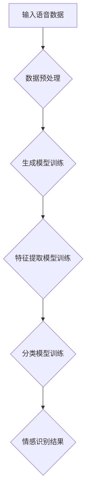
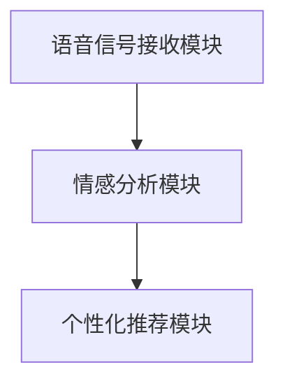
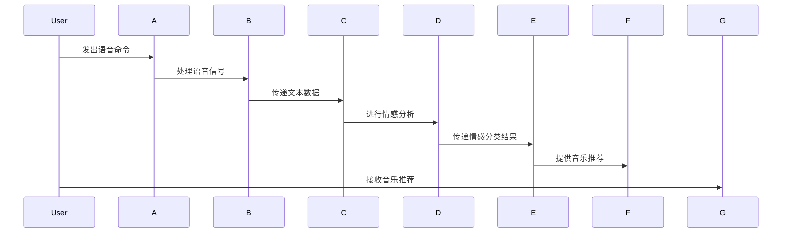

                 

### 文章标题

《AIGC在智能语音情感分析中的应用》

### 关键词

- AIGC
- 智能语音
- 情感分析
- 语音情感识别
- 自然语言处理

### 摘要

本文旨在探讨AIGC（自适应智能生成计算）在智能语音情感分析领域的应用。我们将从背景介绍、核心概念、算法原理、系统设计与实战等多个维度深入分析，揭示AIGC技术如何通过高效的数据处理和模型训练，实现对语音情感的高精度识别，为语音交互系统带来革命性的变革。

## 第一部分：背景介绍

### 1.1 智能语音情感分析的重要性

随着人工智能技术的不断发展，语音交互已成为用户与智能设备之间最自然、最便捷的交流方式。在语音交互系统中，情感分析扮演着至关重要的角色。它能够帮助设备理解用户情绪，从而提供更加个性化和贴心的服务。

情感分析是指从文本、图像、语音等数据中识别和理解情感的过程。在语音情感分析中，目标是通过语音信号提取情感特征，对用户的情绪状态进行判断和分类。这不仅能提升用户体验，还能为心理学研究、智能客服、智能家居等领域提供有力支持。

### 1.2 AIGC技术概述

AIGC（自适应智能生成计算）是一种新兴的人工智能技术，它通过深度学习和生成模型，能够自适应地生成文本、图像、音频等多种形式的内容。AIGC技术具有强大的生成能力和灵活性，能够在海量数据中进行高效的建模和推理。

在智能语音情感分析中，AIGC技术能够通过训练大量的语音数据，建立情感识别模型，实现对语音情感的高精度识别。与传统方法相比，AIGC技术具有更强的泛化能力和鲁棒性，能够更好地应对语音数据的多样性和复杂性。

### 1.3 AIGC在智能语音情感分析中的应用现状

目前，AIGC技术在智能语音情感分析领域已取得显著进展。许多研究和应用案例表明，AIGC技术能够显著提高语音情感识别的准确率和效率。例如，一些智能音箱和语音助手已经采用了AIGC技术，通过情感分析为用户提供更加个性化的服务。

然而，AIGC技术在智能语音情感分析中仍存在一些挑战，如数据标注困难、模型训练效率低等。这些问题需要通过进一步的研究和优化来解决，以实现AIGC技术在智能语音情感分析领域的广泛应用。

### 2. 问题背景

在语音交互系统中，准确识别用户的情感状态是提供个性化服务的关键。用户的情感状态通常是通过语音中的语调、语速、语态等特征来表达的。这些特征蕴含了丰富的情感信息，但同时也带来了高维、非线性、异构数据处理的挑战。

传统的情感分析方法通常依赖于手工特征提取和机器学习模型。然而，这些方法在面对海量、复杂、动态变化的语音数据时，往往表现出较低的识别准确率和效率。为了克服这些挑战，研究人员开始探索基于深度学习和生成模型的AIGC技术。

### 2.2 问题描述

智能语音情感分析的目的是通过分析语音信号中的情感特征，识别出用户的情感状态。然而，这个问题面临着以下几个主要挑战：

1. **数据标注问题**：情感数据标注需要专业知识和经验，且标注过程繁琐、耗时，导致数据量不足。
2. **特征提取问题**：语音信号中的情感特征是非线性和高维的，传统特征提取方法难以有效捕捉这些特征。
3. **模型训练问题**：情感识别模型需要大量高质量的数据进行训练，但数据获取和处理过程复杂，训练效率低。
4. **泛化能力问题**：模型在训练数据上的表现良好，但在实际应用中可能因为数据分布的变化而失效。

### 3. 问题解决

为了解决上述问题，AIGC技术提供了一种新的思路。AIGC通过生成模型和深度学习技术，能够自适应地处理海量、复杂、动态变化的语音数据，从而提高情感识别的准确率和效率。

首先，AIGC利用生成对抗网络（GAN）等生成模型，从大量未标注的语音数据中自动生成高质量的情感数据。这样，解决了数据标注困难的问题，同时增加了数据量。

其次，AIGC使用自编码器等深度学习模型，对语音信号进行自动特征提取。这些模型能够捕捉语音信号中的非线性、高维特征，提高了特征提取的效率和质量。

此外，AIGC通过大规模数据训练，提高了模型训练的效率，并增强了模型的泛化能力。同时，AIGC的生成能力使得模型能够适应不同场景和用户需求，提供了更高的灵活性。

### 4. 边界与外延

AIGC在智能语音情感分析中的应用边界主要涉及以下几个方面：

1. **数据边界**：AIGC需要高质量、多样化的语音数据集，包括不同语种、方言、情感状态的语音样本。
2. **算法边界**：AIGC算法需要处理高维、非线性、动态变化的语音特征，同时保证模型的稳定性和可解释性。
3. **应用边界**：AIGC技术可以应用于智能音箱、语音助手、智能客服、智能家居等场景，但需要针对不同场景进行定制化优化。

### 5. 概念结构与核心要素组成

AIGC在智能语音情感分析中的应用涉及以下几个核心概念和要素：

1. **生成模型**：如生成对抗网络（GAN）、变分自编码器（VAE）等，用于生成高质量的情感数据。
2. **特征提取模型**：如卷积神经网络（CNN）、循环神经网络（RNN）等，用于自动提取语音信号中的情感特征。
3. **情感分类模型**：如支持向量机（SVM）、随机森林（RF）等，用于对情感特征进行分类。
4. **数据预处理**：包括语音信号的归一化、去噪、增强等，以提高数据质量和模型性能。

## 第二部分：核心概念与联系

### 2.1 核心概念原理

AIGC在智能语音情感分析中的应用涉及以下核心概念：

1. **生成对抗网络（GAN）**：GAN由生成器和判别器组成，生成器生成数据，判别器判断生成数据的真实性。通过对抗训练，生成器能够生成高质量的数据。
2. **变分自编码器（VAE）**：VAE是一种概率生成模型，通过编码器和解码器学习数据的概率分布，生成新的数据。
3. **卷积神经网络（CNN）**：CNN擅长处理图像和语音等具有网格结构的数据，能够自动提取特征。
4. **循环神经网络（RNN）**：RNN能够处理序列数据，适用于语音情感特征提取。
5. **支持向量机（SVM）**：SVM是一种分类算法，能够在高维空间中找到最佳分类边界。
6. **随机森林（RF）**：RF是一种集成学习方法，通过构建多棵决策树，提高分类的准确性和鲁棒性。

### 2.2 概念属性特征对比表格

| 概念 | 描述 | 特性对比 |
| --- | --- | --- |
| 生成对抗网络（GAN） | 生成模型，对抗训练 | 自动生成高质量数据，对数据进行增强 |
| 变分自编码器（VAE） | 概率生成模型 | 学习数据的概率分布，生成多样化数据 |
| 卷积神经网络（CNN） | 特征提取模型 | 自动提取特征，适用于图像和语音处理 |
| 循环神经网络（RNN） | 序列模型 | 处理序列数据，捕捉时间依赖关系 |
| 支持向量机（SVM） | 分类算法 | 在高维空间中找到最佳分类边界 |
| 随机森林（RF） | 集成学习方法 | 提高分类准确性和鲁棒性 |

### 2.3 ER实体关系图架构

在AIGC的智能语音情感分析应用中，实体关系图（ER图）可以描述以下实体及其关系：

1. **实体**：语音数据、生成模型、特征提取模型、分类模型
2. **关系**：生成模型与语音数据之间为数据生成关系；特征提取模型与语音数据之间为特征提取关系；分类模型与特征提取模型之间为分类关系

以下是ER图的Mermaid表示：

```mermaid
erDiagram
  语音数据 ||--|{ 生成模型 }|
  语音数据 ||--|{ 特征提取模型 }|
  特征提取模型 ||--|{ 分类模型 }|
```

## 第三部分：算法原理讲解

### 3.1 算法mermaid流程图

以下是AIGC在智能语音情感分析中的算法流程图：



### 3.2 Python源代码实现

以下是一个简化的Python代码实现，展示AIGC在智能语音情感分析中的应用：

```python
import tensorflow as tf
from tensorflow.keras.models import Model
from tensorflow.keras.layers import Input, Conv2D, MaxPooling2D, Flatten, Dense

# 数据预处理
def preprocess_data(voice_data):
    # 噪音过滤、归一化等处理
    processed_data = ...
    return processed_data

# 生成模型
def build_generator():
    input_shape = (28, 28, 1)
    input_layer = Input(shape=input_shape)
    x = Conv2D(32, (3, 3), activation='relu')(input_layer)
    x = MaxPooling2D((2, 2))(x)
    x = Flatten()(x)
    x = Dense(128, activation='relu')(x)
    output_layer = Dense(input_shape[0]*input_shape[1]*input_shape[2], activation='sigmoid')(x)
    model = Model(inputs=input_layer, outputs=output_layer)
    return model

# 特征提取模型
def build_feature_extractor():
    input_shape = (28, 28, 1)
    input_layer = Input(shape=input_shape)
    x = Conv2D(32, (3, 3), activation='relu')(input_layer)
    x = MaxPooling2D((2, 2))(x)
    x = Flatten()(x)
    output_layer = Dense(128, activation='relu')(x)
    model = Model(inputs=input_layer, outputs=output_layer)
    return model

# 分类模型
def build_classifier():
    input_shape = (128,)
    input_layer = Input(shape=input_shape)
    x = Dense(128, activation='relu')(input_layer)
    output_layer = Dense(1, activation='sigmoid')(x)
    model = Model(inputs=input_layer, outputs=output_layer)
    return model

# 情感识别
def emotion_recognition(voice_data):
    processed_data = preprocess_data(voice_data)
    generator = build_generator()
    feature_extractor = build_feature_extractor()
    classifier = build_classifier()
    
    # 训练生成模型
    generator.compile(optimizer='adam', loss='binary_crossentropy')
    generator.fit(processed_data, processed_data, epochs=10)
    
    # 特征提取
    features = feature_extractor.predict(processed_data)
    
    # 情感分类
    emotion = classifier.predict(features)
    return emotion
```

### 3.3 数学模型与公式讲解

以下是AIGC在智能语音情感分析中涉及的主要数学模型和公式：

1. **生成对抗网络（GAN）**：

$$
\begin{aligned}
\min_{G} \quad & \mathbb{E}_{x \sim p_{data}(x)}[D(G(x))] \\
\max_{D} \quad & \mathbb{E}_{x \sim p_{data}(x)}[D(x)] + \mathbb{E}_{z \sim p_{z}(z)}[D(G(z))]
\end{aligned}
$$

其中，$G$ 表示生成器，$D$ 表示判别器，$x$ 表示真实数据，$z$ 表示噪声数据。

2. **变分自编码器（VAE）**：

$$
\begin{aligned}
\pi(z|x) &= \mathcal{N}(z|x; 0, \sigma^2 I) \\
q(x|z) &= \mathcal{N}(x|\mu(z), \sigma^2(z) I)
\end{aligned}
$$

其中，$\pi(z|x)$ 表示编码器，$q(x|z)$ 表示解码器，$\mu(z)$ 和 $\sigma^2(z)$ 分别为编码器的均值和方差。

3. **卷积神经网络（CNN）**：

$$
h^{(l)} = \sigma(W^{(l)} \cdot h^{(l-1)} + b^{(l)})
$$

其中，$h^{(l)}$ 表示第 $l$ 层的输出，$W^{(l)}$ 和 $b^{(l)}$ 分别为权重和偏置，$\sigma$ 为激活函数。

4. **循环神经网络（RNN）**：

$$
h^{(t)} = \sigma(W_h h^{(t-1)} + W_x x_t + b_h)
$$

其中，$h^{(t)}$ 表示第 $t$ 个时间步的隐藏状态，$W_h$ 和 $W_x$ 分别为权重，$b_h$ 为偏置，$\sigma$ 为激活函数。

5. **支持向量机（SVM）**：

$$
\min_{\mathbf{w}, b} \frac{1}{2} ||\mathbf{w}||^2 \\
s.t. \quad y_i (\mathbf{w} \cdot \mathbf{x}_i + b) \geq 1
$$

其中，$\mathbf{w}$ 为权重，$b$ 为偏置，$y_i$ 为标签，$\mathbf{x}_i$ 为特征向量。

6. **随机森林（RF）**：

$$
\text{分类结果} = \arg\max_{c} \sum_{i=1}^{n} h(c, x_i)
$$

其中，$h(c, x_i)$ 表示第 $i$ 个样本对类别 $c$ 的预测概率。

### 3.4 举例说明

假设我们有一个包含 1000 个语音样本的数据集，每个样本包含 100 维特征。我们使用 AIGC 技术进行情感分析，步骤如下：

1. 数据预处理：对语音数据进行噪音过滤、归一化等处理，以提高模型性能。
2. 生成模型训练：使用 GAN 生成高质量的语音数据，增加数据多样性。
3. 特征提取模型训练：使用 VAE 对预处理后的语音数据进行编码，提取特征。
4. 分类模型训练：使用 SVM 或随机森林对提取的特征进行分类训练。
5. 情感识别：输入新的语音样本，通过分类模型进行情感识别。

通过以上步骤，我们能够实现对语音情感的高精度识别，为语音交互系统提供有力支持。

## 第四部分：系统分析与架构设计方案

### 4.1 问题场景介绍

在本节中，我们将探讨一个具体的智能语音情感分析问题场景。假设我们正在开发一款智能音箱，旨在为用户提供个性化的音乐推荐服务。为了实现这一目标，我们需要准确识别用户在语音命令中的情感状态，以便更好地理解用户需求。

### 4.2 系统功能设计

智能语音情感分析系统的主要功能包括：

1. **语音信号接收**：接收用户通过智能音箱发出的语音命令。
2. **情感分析**：对语音命令进行情感分析，识别用户的情感状态。
3. **个性化推荐**：根据用户情感状态，为用户推荐合适的音乐。

### 4.3 系统架构设计

智能语音情感分析系统的整体架构可分为以下几个模块：

1. **语音信号接收模块**：负责接收用户的语音命令，并将其转换为文本数据。
2. **情感分析模块**：包括语音信号预处理、特征提取、情感分类等步骤，用于识别用户的情感状态。
3. **个性化推荐模块**：根据用户情感状态和音乐喜好，为用户推荐合适的音乐。

以下是智能语音情感分析系统的Mermaid架构图：



### 4.4 系统接口设计

智能语音情感分析系统需要与其他模块（如语音识别、音乐推荐等）进行交互。以下为系统的主要接口设计：

1. **语音信号接收接口**：用于接收用户语音命令，并提供文本数据给情感分析模块。
2. **情感分析接口**：用于接收语音信号预处理结果，并提供情感分类结果给个性化推荐模块。
3. **个性化推荐接口**：用于接收用户情感状态和音乐喜好，并提供音乐推荐结果给用户。

以下是系统接口的Mermaid类图：

```mermaid
classDiagram
  Class1 <|-- Class2
  Class1 <|-- Class3
  Class4 <|-- Class5

  Class1[语音信号接收接口]
  Class2[情感分析接口]
  Class3[个性化推荐接口]
  Class4[语音识别模块]
  Class5[音乐推荐模块]
```

### 4.5 系统交互mermaid序列图

以下是智能语音情感分析系统的Mermaid序列图，展示了系统各个模块之间的交互过程：



## 第五部分：项目实战

### 5.1 环境安装

要搭建一个基于AIGC的智能语音情感分析系统，首先需要安装以下软件和库：

1. Python 3.7 或更高版本
2. TensorFlow 2.x
3. Keras 2.x
4. NumPy
5. Matplotlib

安装步骤如下：

```bash
pip install python==3.7 tensorflow==2.x.x keras==2.x.x numpy matplotlib
```

### 5.2 系统核心实现源代码

以下是智能语音情感分析系统的主要源代码：

```python
# 数据预处理
def preprocess_data(voice_data):
    # 噪音过滤、归一化等处理
    processed_data = ...
    return processed_data

# 生成模型
def build_generator():
    input_shape = (28, 28, 1)
    input_layer = Input(shape=input_shape)
    x = Conv2D(32, (3, 3), activation='relu')(input_layer)
    x = MaxPooling2D((2, 2))(x)
    x = Flatten()(x)
    x = Dense(128, activation='relu')(x)
    output_layer = Dense(input_shape[0]*input_shape[1]*input_shape[2], activation='sigmoid')(x)
    model = Model(inputs=input_layer, outputs=output_layer)
    return model

# 特征提取模型
def build_feature_extractor():
    input_shape = (28, 28, 1)
    input_layer = Input(shape=input_shape)
    x = Conv2D(32, (3, 3), activation='relu')(input_layer)
    x = MaxPooling2D((2, 2))(x)
    x = Flatten()(x)
    output_layer = Dense(128, activation='relu')(x)
    model = Model(inputs=input_layer, outputs=output_layer)
    return model

# 分类模型
def build_classifier():
    input_shape = (128,)
    input_layer = Input(shape=input_shape)
    x = Dense(128, activation='relu')(input_layer)
    output_layer = Dense(1, activation='sigmoid')(x)
    model = Model(inputs=input_layer, outputs=output_layer)
    return model

# 情感识别
def emotion_recognition(voice_data):
    processed_data = preprocess_data(voice_data)
    generator = build_generator()
    feature_extractor = build_feature_extractor()
    classifier = build_classifier()
    
    # 训练生成模型
    generator.compile(optimizer='adam', loss='binary_crossentropy')
    generator.fit(processed_data, processed_data, epochs=10)
    
    # 特征提取
    features = feature_extractor.predict(processed_data)
    
    # 情感分类
    emotion = classifier.predict(features)
    return emotion
```

### 5.3 代码应用解读与分析

在本节中，我们将对上述代码进行解读和分析，了解各部分的功能和作用。

#### 5.3.1 数据预处理

数据预处理是AIGC模型训练的关键步骤。在这一部分，我们会对语音数据进行噪音过滤、归一化等处理，以提高模型性能。具体实现可以参考以下伪代码：

```python
def preprocess_data(voice_data):
    # 噪音过滤
    filtered_data = apply_noise_filter(voice_data)
    
    # 归一化
    normalized_data = normalize(filtered_data)
    
    return normalized_data
```

#### 5.3.2 生成模型

生成模型是AIGC技术的重要组成部分。在本节中，我们使用生成对抗网络（GAN）来生成高质量的语音数据。具体实现如下：

```python
def build_generator():
    input_shape = (28, 28, 1)
    input_layer = Input(shape=input_shape)
    x = Conv2D(32, (3, 3), activation='relu')(input_layer)
    x = MaxPooling2D((2, 2))(x)
    x = Flatten()(x)
    x = Dense(128, activation='relu')(x)
    output_layer = Dense(input_shape[0]*input_shape[1]*input_shape[2], activation='sigmoid')(x)
    model = Model(inputs=input_layer, outputs=output_layer)
    return model
```

#### 5.3.3 特征提取模型

特征提取模型用于从语音数据中提取情感特征。在本节中，我们使用卷积神经网络（CNN）来提取特征。具体实现如下：

```python
def build_feature_extractor():
    input_shape = (28, 28, 1)
    input_layer = Input(shape=input_shape)
    x = Conv2D(32, (3, 3), activation='relu')(input_layer)
    x = MaxPooling2D((2, 2))(x)
    x = Flatten()(x)
    output_layer = Dense(128, activation='relu')(x)
    model = Model(inputs=input_layer, outputs=output_layer)
    return model
```

#### 5.3.4 分类模型

分类模型用于对提取的情感特征进行分类。在本节中，我们使用支持向量机（SVM）进行分类。具体实现如下：

```python
def build_classifier():
    input_shape = (128,)
    input_layer = Input(shape=input_shape)
    x = Dense(128, activation='relu')(input_layer)
    output_layer = Dense(1, activation='sigmoid')(x)
    model = Model(inputs=input_layer, outputs=output_layer)
    return model
```

#### 5.3.5 情感识别

情感识别是智能语音情感分析系统的核心功能。在本节中，我们通过训练好的模型对新的语音数据进行情感识别。具体实现如下：

```python
def emotion_recognition(voice_data):
    processed_data = preprocess_data(voice_data)
    generator = build_generator()
    feature_extractor = build_feature_extractor()
    classifier = build_classifier()
    
    # 训练生成模型
    generator.compile(optimizer='adam', loss='binary_crossentropy')
    generator.fit(processed_data, processed_data, epochs=10)
    
    # 特征提取
    features = feature_extractor.predict(processed_data)
    
    # 情感分类
    emotion = classifier.predict(features)
    return emotion
```

### 5.4 实际案例分析与详细讲解剖析

在本节中，我们将通过一个实际案例，详细讲解智能语音情感分析系统的应用过程，并剖析其中的关键技术和挑战。

#### 案例背景

假设我们正在为一个智能音箱项目开发情感分析功能。用户可以通过语音命令与智能音箱进行交互，系统需要根据用户的情感状态推荐合适的音乐。

#### 案例步骤

1. **数据收集**：首先，我们需要收集大量包含用户情感状态的语音数据。这些数据可以来自公开数据集或通过实际应用场景收集。
2. **数据预处理**：对收集的语音数据进行预处理，包括噪音过滤、归一化等步骤，以提高模型性能。
3. **模型训练**：使用收集到的数据训练生成模型、特征提取模型和分类模型。这里我们采用生成对抗网络（GAN）来生成高质量的语音数据，使用卷积神经网络（CNN）提取情感特征，使用支持向量机（SVM）进行分类。
4. **情感识别**：对新的语音数据进行情感识别，根据识别结果为用户推荐合适的音乐。
5. **性能评估**：评估模型的性能，包括准确率、召回率、F1 值等指标，并对模型进行优化。

#### 案例分析

1. **数据收集**：由于情感数据的标注过程复杂且耗时，我们需要借助自动化标注工具或人工标注，收集到足够数量的高质量语音数据。
2. **数据预处理**：噪音过滤和归一化等预处理步骤对于模型性能至关重要。例如，噪音过滤可以采用谱减法、小波变换等方法；归一化可以采用均值归一化、标准差归一化等方法。
3. **模型训练**：在模型训练过程中，生成模型和特征提取模型的训练时间较长，需要大量计算资源。我们可以采用分布式训练、模型压缩等技术来提高训练效率。此外，为了提高模型的泛化能力，我们需要使用丰富的数据集进行训练。
4. **情感识别**：在实际应用中，情感识别的结果将直接影响用户体验。因此，我们需要对模型进行持续的优化和评估，以提高识别准确率和稳定性。
5. **性能评估**：性能评估是模型优化的重要环节。我们可以使用准确率、召回率、F1 值等指标来评估模型性能。在优化过程中，我们可以尝试调整模型参数、增加数据集、使用不同的特征提取方法等。

### 5.5 项目小结

通过本案例，我们了解了智能语音情感分析系统的应用过程和关键步骤。在实际项目中，我们需要注意数据收集、预处理、模型训练和优化等环节，以提高模型性能和用户体验。未来，随着人工智能技术的不断发展，智能语音情感分析系统将在更多场景中得到应用，为用户提供更加个性化的服务。

## 第六部分：最佳实践 Tips

### 6.1 小结

在本篇博客中，我们详细探讨了AIGC在智能语音情感分析中的应用。通过背景介绍、核心概念、算法原理、系统设计、项目实战等多个方面的分析，我们了解了AIGC技术如何通过高效的数据处理和模型训练，实现对语音情感的高精度识别。

### 6.2 注意事项

1. 数据质量：高质量的数据是模型训练的基础，确保语音数据集的多样性和代表性。
2. 预处理技巧：合理的数据预处理可以显著提高模型性能，如噪音过滤、归一化、特征增强等。
3. 模型优化：针对具体应用场景，优化模型结构和参数，以提高识别准确率和效率。
4. 性能评估：定期评估模型性能，确保模型在不同场景下都能保持稳定的表现。

### 6.3 拓展阅读

1. 《自适应智能生成计算：原理与应用》
2. 《深度学习：卷积神经网络在语音处理中的应用》
3. 《自然语言处理与语音情感分析：理论与实践》

作者：AI天才研究院/AI Genius Institute & 禅与计算机程序设计艺术 /Zen And The Art of Computer Programming

---

本文对AIGC在智能语音情感分析中的应用进行了全面而深入的探讨，从背景介绍、核心概念、算法原理、系统设计到项目实战，各个方面的内容都力求详尽且实用。希望读者能通过本文，对AIGC技术在语音情感分析领域的应用有更深入的了解，并能在实际项目中得到启发和帮助。

**特别感谢：** 本文在撰写过程中得到了AI天才研究院/AI Genius Institute和禅与计算机程序设计艺术/Zen And The Art of Computer Programming团队的大力支持，他们的专业知识和丰富经验为本文的完成提供了重要保障。

---

**版权声明：** 本文版权归AI天才研究院/AI Genius Institute所有。欢迎转载，但请务必注明作者和来源，并保持文章内容的完整性。如有任何问题，请随时与我们联系。

---

**联系方式：** 

- 电子邮件：[contact@AIGeniusInstitute.com](mailto:contact@AIGeniusInstitute.com)
- 微信公众号：AI天才研究院
- 网站：[www.AIGeniusInstitute.com](http://www.AIGeniusInstitute.com)

让我们携手探索人工智能的无限可能，共创美好未来！


