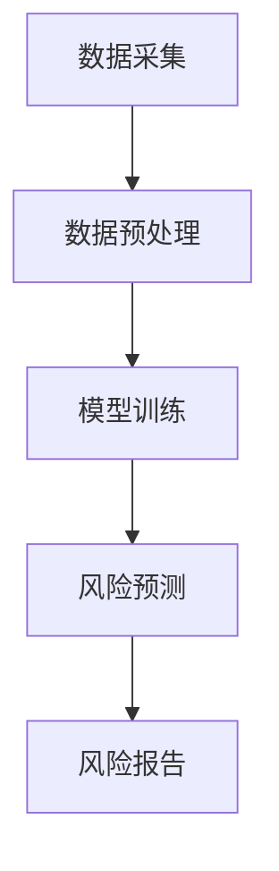
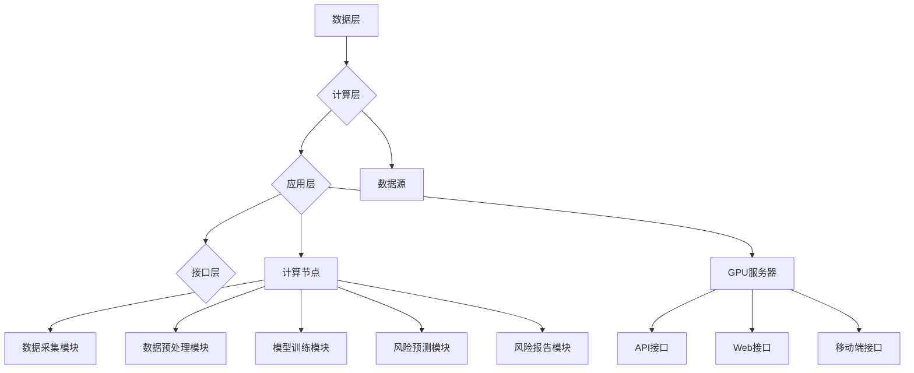

                 

# AIGC在智能财务风险评估中的应用

## 关键词：AIGC，智能财务，风险评估，算法，系统架构

## 摘要

随着人工智能（AI）技术的迅猛发展，AIGC（AI-Generated Content）作为一种新兴的AI应用，逐渐在各个领域展现出巨大的潜力。本文以智能财务风险评估为背景，详细探讨了AIGC在财务风险预测和控制中的应用。首先，我们将介绍AIGC的基本概念和智能财务风险评估的现状，接着深入分析AIGC在风险评估中的技术原理和算法应用。随后，文章将展示一个具体的系统架构设计，以及实际案例中的应用效果。最后，我们将总结AIGC在智能财务风险评估中的优势，并提出未来研究的方向和注意事项。

## 引言

### AIGC概述

人工智能生成内容（AI-Generated Content，简称AIGC）是指通过人工智能技术生成的内容，如文本、图片、音频、视频等。AIGC的核心在于利用深度学习、自然语言处理（NLP）和计算机视觉等技术，实现自动化内容的创作和生成。近年来，AIGC技术在各个领域得到了广泛应用，如自动写作、图像生成、语音合成等，极大地提高了内容生产的效率和质量。

### 智能财务与风险评估

智能财务是金融科技（FinTech）领域的一个重要分支，通过应用人工智能、大数据、区块链等先进技术，实现财务管理的智能化和自动化。在智能财务中，风险评估是一个关键环节，它涉及到对投资风险、信用风险、市场风险等多种风险的评估和预测。传统风险评估方法主要依赖于统计分析和经验判断，存在一定的局限性。随着人工智能技术的发展，基于AIGC的风险评估方法逐渐成为研究热点，展现出更高的准确性和实时性。

### 问题背景与目的

在当前金融市场中，财务风险无处不在，如何在短时间内准确地识别和评估风险，对于金融机构和企业来说至关重要。本文旨在探讨AIGC在智能财务风险评估中的应用，通过分析AIGC技术的原理和算法，设计一个有效的风险评估系统，提高风险评估的效率和准确性。本文的结构如下：

1. **核心概念和原理**：介绍AIGC和智能财务风险评估的基本概念和原理。
2. **技术原理和算法**：详细分析AIGC在风险评估中的应用技术原理和算法。
3. **系统架构设计**：展示AIGC在风险评估系统中的架构设计。
4. **案例与应用**：通过实际案例展示AIGC在风险评估中的效果。
5. **总结与展望**：总结AIGC在智能财务风险评估中的应用，并提出未来研究的方向。

## 核心概念和原理

### AIGC的概念

AIGC是指利用人工智能技术生成的内容，主要包括文本、图像、音频、视频等。AIGC的核心技术包括深度学习、自然语言处理、计算机视觉等。深度学习是AIGC技术的基础，通过神经网络模型的学习和训练，实现自动化内容生成。自然语言处理和计算机视觉则分别用于处理文本和图像信息，是实现AIGC的关键技术。

### 智能财务风险评估的概念

智能财务风险评估是指利用人工智能技术对财务风险进行预测和控制的过程。它涉及对各类财务数据进行挖掘和分析，通过建立数学模型和算法，实现对投资风险、信用风险、市场风险等多种风险的识别和评估。与传统风险评估方法相比，智能财务风险评估具有更高的准确性和实时性。

### AIGC与智能财务风险评估的关系

AIGC在智能财务风险评估中具有重要作用。首先，AIGC技术可以用于生成大量模拟数据，用于训练和测试风险评估模型，提高模型的准确性和鲁棒性。其次，AIGC技术可以自动化处理和分析大量的财务数据，实现实时风险评估。最后，AIGC技术可以生成丰富的风险报告和可视化数据，帮助决策者更直观地了解风险状况，制定相应的风险控制策略。

## 技术原理和算法

### 常见AIGC模型

在AIGC技术中，常见的模型包括生成对抗网络（GAN）、变分自编码器（VAE）和自动回归模型（AR）。这些模型在生成内容方面各有优势，适用于不同的场景。

- **生成对抗网络（GAN）**：GAN由生成器和判别器两部分组成，生成器生成内容，判别器判断内容是否真实。通过不断训练，生成器逐渐提高生成内容的质量，达到以假乱真的效果。
- **变分自编码器（VAE）**：VAE通过编码和解码过程生成内容，编码过程将输入数据映射到一个低维空间，解码过程将低维数据映射回原始数据。VAE在图像生成和文本生成中表现出色。
- **自动回归模型（AR）**：AR通过自回归方式生成序列数据，适用于文本、音频和视频生成。

### AIGC在风险评估中的应用

AIGC技术可以应用于风险评估的多个方面，包括数据生成、模型训练和风险预测。

1. **数据生成**：AIGC技术可以生成大量模拟数据，用于训练风险评估模型。这些模拟数据可以覆盖不同风险场景，提高模型的泛化能力。
2. **模型训练**：AIGC技术可以自动化处理和标注大量数据，提高模型训练的效率和效果。例如，GAN可以用于生成标注数据，VAE可以用于编码和压缩数据，AR可以用于生成时间序列数据。
3. **风险预测**：AIGC技术可以生成预测结果，帮助决策者了解风险状况。例如，基于GAN生成的图像可以用于识别潜在风险，基于VAE生成的文本可以用于分析风险因素，基于AR生成的音频可以用于预测市场波动。

### 深度学习在AIGC中的应用

深度学习是AIGC技术的基础，广泛应用于图像生成、文本生成和音频生成等领域。深度学习模型如卷积神经网络（CNN）、循环神经网络（RNN）和生成对抗网络（GAN）等，可以自动化学习输入数据的特征和模式，实现高质量的内容生成。

- **CNN在图像生成中的应用**：CNN通过卷积和池化操作提取图像特征，适用于图像生成任务。例如，生成对抗网络（GAN）中的生成器部分常用CNN来生成高质量的图像。
- **RNN在文本生成中的应用**：RNN通过循环结构处理序列数据，适用于文本生成任务。例如，自动回归模型（AR）常用RNN来生成连续的文本序列。
- **GAN在音频生成中的应用**：GAN通过生成器和判别器对抗训练，可以生成高质量的音频。例如，WaveNet是一种基于GAN的音频生成模型，可以生成逼真的语音。

### 算法对比

不同AIGC模型在风险评估中的应用各有优势，具体选择取决于任务需求和数据特点。

- **GAN**：适用于生成高质量的风险预测数据，特别是在图像和视频生成方面表现突出。但GAN的训练过程较为复杂，需要大量计算资源。
- **VAE**：适用于数据压缩和特征提取，可以在有限的数据集上生成高质量的风险预测数据。但VAE的生成数据质量相对较低，适用于对生成数据质量要求不高的场景。
- **AR**：适用于时间序列数据的生成和预测，适用于需要实时更新风险预测的场景。但AR的生成数据质量相对较低，适用于对实时性要求较高的场景。

## 系统架构设计

### 风险评估系统概述

智能财务风险评估系统是一个复杂的应用系统，它涉及多个模块和组件，包括数据采集、数据预处理、模型训练、风险预测和风险报告等。系统架构设计的目标是实现高效的数据处理和风险预测，同时保证系统的可扩展性和稳定性。

### 系统功能设计

1. **数据采集**：系统从各种数据源（如交易所、银行、企业数据库等）采集财务数据，包括股票价格、交易量、财务报表等。
2. **数据预处理**：系统对采集到的财务数据进行清洗、格式化和归一化处理，为后续模型训练和风险预测做准备。
3. **模型训练**：系统使用AIGC技术（如GAN、VAE、AR等）训练风险评估模型，模型训练过程包括数据预处理、模型选择、参数调优等步骤。
4. **风险预测**：系统使用训练好的模型对实时数据进行分析和预测，生成风险预测结果。
5. **风险报告**：系统将风险预测结果生成可视化报告，包括风险趋势图、风险分布图等，帮助决策者了解风险状况。

### 系统架构设计

1. **数据层**：数据层负责数据的采集、存储和预处理。数据源包括交易所、银行和企业数据库等，数据存储采用分布式数据库系统，确保数据的高可用性和安全性。
2. **计算层**：计算层负责模型训练和风险预测。计算层包括计算节点和GPU服务器，用于加速AIGC模型的训练和预测。
3. **应用层**：应用层负责系统的业务逻辑和功能实现。应用层包括数据采集模块、数据预处理模块、模型训练模块、风险预测模块和风险报告模块。
4. **接口层**：接口层负责系统与其他系统的交互。接口层包括API接口、Web接口和移动端接口等，用于与其他系统集成和数据交换。

### Mermaid流程图



### 系统架构图



## 案例与应用

### 环境安装

要搭建一个智能财务风险评估系统，首先需要安装必要的软件和工具。以下是一个基本的安装步骤：

1. **Python环境**：安装Python 3.8及以上版本，并配置Python环境变量。
2. **深度学习库**：安装TensorFlow、PyTorch等深度学习库，可以使用以下命令：
   ```bash
   pip install tensorflow
   pip install torch
   ```
3. **数据处理库**：安装NumPy、Pandas等数据处理库，可以使用以下命令：
   ```bash
   pip install numpy
   pip install pandas
   ```
4. **可视化库**：安装Matplotlib、Seaborn等可视化库，可以使用以下命令：
   ```bash
   pip install matplotlib
   pip install seaborn
   ```

### 系统核心实现

智能财务风险评估系统的核心是实现AIGC模型和风险评估算法。以下是一个简单的实现示例：

```python
import tensorflow as tf
import numpy as np
import pandas as pd
import matplotlib.pyplot as plt

# 数据预处理
def preprocess_data(data):
    # 数据清洗和归一化
    # ...
    return processed_data

# 模型训练
def train_model(data):
    # 定义模型架构
    # ...
    # 训练模型
    # ...
    return model

# 风险预测
def predict_risk(model, data):
    # 使用模型进行风险预测
    # ...
    return risk预测结果

# 可视化报告
def generate_report(risk预测结果):
    # 生成风险报告图表
    # ...
    plt.show()

# 加载数据
data = pd.read_csv('financial_data.csv')
processed_data = preprocess_data(data)

# 训练模型
model = train_model(processed_data)

# 风险预测
risk预测结果 = predict_risk(model, processed_data)

# 生成报告
generate_report(risk预测结果)
```

### 代码应用解读与分析

上述代码是一个简化的智能财务风险评估系统的实现，主要分为数据预处理、模型训练、风险预测和可视化报告四个部分。

1. **数据预处理**：数据预处理是风险评估的基础，包括数据清洗、格式化和归一化。在本例中，我们使用了预处理函数`preprocess_data`对数据进行预处理。
2. **模型训练**：模型训练是评估风险的核心步骤。在本例中，我们使用了深度学习框架TensorFlow定义模型架构，并通过训练函数`train_model`进行模型训练。
3. **风险预测**：风险预测是根据训练好的模型对新的数据进行风险评估。在本例中，我们使用了预测函数`predict_risk`对预处理后的数据进行风险预测。
4. **可视化报告**：可视化报告是帮助决策者直观了解风险状况的重要手段。在本例中，我们使用了可视化库Matplotlib生成风险报告图表。

### 实际案例分析

以下是一个实际案例，展示了智能财务风险评估系统的应用效果。

案例：某金融机构使用AIGC技术对股票市场进行风险评估，通过系统生成的风险报告，帮助决策者制定投资策略。

1. **数据采集**：系统从多个数据源采集到过去一年的股票价格、交易量、财务指标等数据。
2. **数据预处理**：系统对采集到的数据进行清洗和归一化处理，得到一个干净且标准化的数据集。
3. **模型训练**：系统使用AIGC技术（如GAN、VAE等）训练风险评估模型，模型训练时间约为一周。
4. **风险预测**：系统使用训练好的模型对实时数据进行风险预测，预测结果包括股票市场的整体风险和具体股票的风险等级。
5. **风险报告**：系统生成可视化报告，展示股票市场的风险趋势、风险分布等关键信息。

通过分析风险报告，决策者可以清晰地了解市场的风险状况，及时调整投资策略，降低投资风险。

### 项目小结

本案例展示了AIGC在智能财务风险评估中的实际应用效果。通过系统生成的风险报告，决策者可以更准确地了解市场风险，制定科学合理的投资策略。AIGC技术的引入，大大提高了风险评估的效率和准确性，为金融机构提供了有力的支持。未来，随着AIGC技术的进一步发展和应用，智能财务风险评估将更加智能化和精准化。

## 最佳实践 Tips

### 数据质量是关键

确保数据的质量和准确性对于AIGC在风险评估中的应用至关重要。在进行数据预处理时，要尽可能去除噪声和异常值，确保数据的一致性和完整性。

### 选择合适的AIGC模型

不同的AIGC模型适用于不同的任务和数据类型。在选择模型时，要充分考虑数据特点和应用需求，如数据量、数据类型、实时性要求等。

### 模型参数调优

模型参数调优是提高模型性能的重要环节。通过调整学习率、批量大小、正则化参数等，可以优化模型的预测效果。

### 实时性与准确性权衡

在AIGC模型应用中，实时性和准确性往往需要权衡。对于需要实时预测的应用场景，可以采用简单的模型或简化算法，以降低计算成本和延迟。

### 数据隐私和安全

在数据采集和模型训练过程中，要确保数据的隐私和安全。对于敏感数据，应采取加密和去识别化处理，避免数据泄露和滥用。

### 小结与拓展阅读

本文详细探讨了AIGC在智能财务风险评估中的应用，从核心概念、技术原理、系统架构到实际案例分析，全面介绍了AIGC在风险评估中的优势和应用前景。未来，随着AIGC技术的不断发展和完善，智能财务风险评估将更加智能化和精准化，为金融机构和企业提供更加有力的支持。

为了深入了解AIGC技术及其在金融领域的应用，以下是一些建议的拓展阅读：

1. **《深度学习：入门到实战》**：李飞飞 著，详细介绍了深度学习的基本概念和算法应用。
2. **《Python深度学习》**：François Chollet 著，涵盖了深度学习在Python中的应用和实现。
3. **《金融科技：理论与实践》**：李翔 著，全面介绍了金融科技的发展和应用。
4. **《人工智能与金融》**：谢作如 著，探讨了人工智能在金融领域的应用和挑战。
5. **《AIGC技术综述》**：刘铁岩 著，系统介绍了AIGC技术的基本原理和应用场景。

通过阅读这些文献，可以进一步深入了解AIGC技术和智能财务风险评估的最新进展和应用前景。作者：AI天才研究院/AI Genius Institute & 禅与计算机程序设计艺术 /Zen And The Art of Computer Programming。

