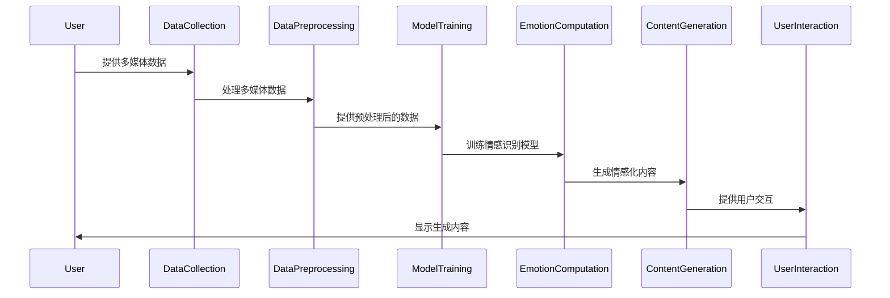
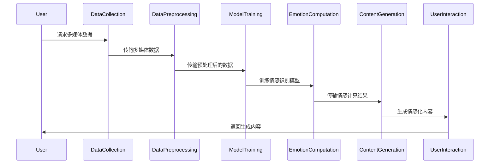

                 

# AIGC在未来跨维度情感计算中的应用

## 关键词

- AIGC
- 跨维度情感计算
- 情感识别
- 情感生成
- 情感增强
- 自然语言处理
- 计算机视觉
- 深度学习
- 用户体验
- 智能客服
- 虚拟现实
- 社交媒体

## 摘要

随着人工智能技术的飞速发展，AIGC（AI-Generated Content）已经逐渐成为信息创造、传播和消费的重要驱动力。本文旨在探讨AIGC在未来跨维度情感计算中的应用，旨在为读者提供一个全面、深入的技术指南。文章将从背景介绍、核心概念与联系、算法原理讲解、系统分析与架构设计方案、项目实战以及最佳实践等方面展开，帮助读者了解AIGC在跨维度情感计算中的技术原理和应用场景，并探讨其中的挑战与解决方案。

### 第一部分：背景介绍

#### 1.1.1 问题背景

随着人工智能技术的飞速发展，AIGC（AI-Generated Content）已经逐渐成为信息创造、传播和消费的重要驱动力。在AIGC的框架下，跨维度情感计算（Cross-Dimensional Emotional Computing）作为其关键技术之一，正逐步得到广泛关注和应用。本文旨在探讨AIGC在未来跨维度情感计算中的应用，旨在为读者提供一个全面、深入的技术指南。

#### 1.1.2 问题描述

AIGC在未来跨维度情感计算中的应用涉及多个技术领域，包括自然语言处理、计算机视觉、情感计算等。这些问题不仅复杂，而且相互交织，需要综合运用多种技术手段才能有效解决。本文将详细探讨AIGC在这些领域中的应用，以及如何通过跨维度情感计算提升用户体验。

#### 1.1.3 问题解决

本文将从以下几个角度来解答这些问题：

1. **AIGC的基本原理和框架**：介绍AIGC的核心技术和基本原理，帮助读者建立完整的AIGC技术体系。

2. **跨维度情感计算的技术原理**：详细阐述跨维度情感计算的技术原理，包括情感识别、情感生成、情感增强等。

3. **AIGC在跨维度情感计算中的应用场景**：分析AIGC在多个应用场景中的具体应用，如智能客服、虚拟现实、社交媒体等。

4. **AIGC在跨维度情感计算中的挑战与解决方案**：探讨AIGC在跨维度情感计算中面临的挑战，并提出相应的解决方案。

5. **最佳实践与案例分析**：通过实际案例，展示AIGC在跨维度情感计算中的最佳实践。

#### 1.1.4 边界与外延

本文主要关注AIGC在未来跨维度情感计算中的应用，但不涉及其他领域（如工业自动化、智能交通等）的AIGC应用。同时，本文将侧重于技术原理和实现方法，而非具体业务场景。

#### 1.1.5 概念结构与核心要素组成

**核心概念：**

1. **AIGC**：AI-Generated Content，人工智能生成内容。
2. **跨维度情感计算**：在不同维度上对情感进行识别、生成和增强。
3. **自然语言处理**：处理和理解人类语言的技术。
4. **计算机视觉**：使计算机能够“看”和“理解”图像和视频的技术。

**核心要素：**

1. **算法原理**：包括情感识别算法、情感生成算法等。
2. **技术实现**：包括情感计算系统的设计、实现和优化。
3. **应用场景**：包括智能客服、虚拟现实、社交媒体等。
4. **挑战与解决方案**：包括跨维度情感计算中的技术挑战和解决方案。

### 第二部分：核心概念与联系

### 2.1 AIGC的基本原理与框架

#### 2.1.1 AIGC的定义与核心组成部分

AIGC 是指通过人工智能技术生成内容的过程，其核心组成部分包括数据预处理、模型训练和内容生成。数据预处理包括数据清洗、数据标注和数据增强等步骤，旨在提高数据质量和模型的训练效果。模型训练通常采用深度学习技术，通过大规模数据进行训练，以生成高质量的内容。内容生成则是根据输入的指令或文本，生成相应的文本、图像、音频等内容。

#### 2.1.2 AIGC的工作流程

AIGC 的工作流程通常包括以下几个步骤：

1. **数据收集**：从互联网或其他数据源收集相关数据。
2. **数据预处理**：对收集的数据进行清洗、标注和增强。
3. **模型训练**：使用预处理后的数据进行模型训练，生成模型参数。
4. **内容生成**：根据用户输入的指令或文本，使用训练好的模型生成内容。

#### 2.1.3 AIGC在跨维度情感计算中的应用

在跨维度情感计算中，AIGC 可以通过以下几种方式发挥作用：

1. **情感识别**：利用 AIGC 技术对文本、图像、音频等多媒体内容进行情感分析，识别用户的情感状态。
2. **情感生成**：根据用户的情感需求，生成相应的情感化内容，如故事、音乐、视频等。
3. **情感增强**：通过调整内容的形式、语言和风格，增强用户的情感体验。

### 2.2 跨维度情感计算的技术原理

#### 2.2.1 情感识别

情感识别是指通过分析文本、图像、音频等多媒体内容，识别其中蕴含的情感信息。情感识别技术通常包括以下几个方面：

1. **情感分类**：将文本、图像、音频等数据分类为特定的情感类别，如快乐、悲伤、愤怒等。
2. **情感强度检测**：对情感分类的结果进行量化，评估情感的程度。
3. **情感变化分析**：分析情感在不同时间、情境下的变化趋势。

#### 2.2.2 情感生成

情感生成是指根据用户的情感需求，生成相应的情感化内容。情感生成技术主要包括以下几个方面：

1. **情感化文本生成**：根据用户输入的文本，生成具有特定情感的文本内容，如感人故事、励志文章等。
2. **情感化图像生成**：根据用户输入的文本或情感标签，生成具有特定情感的图像内容，如图画、表情包等。
3. **情感化音乐生成**：根据用户输入的文本或情感标签，生成具有特定情感的音乐内容，如旋律、歌词等。

#### 2.2.3 情感增强

情感增强是指通过调整内容的形式、语言和风格，增强用户的情感体验。情感增强技术主要包括以下几个方面：

1. **内容调色板**：调整内容的色彩、对比度等视觉元素，增强视觉上的情感体验。
2. **语言调整**：根据用户的情感需求，调整文本的语言风格，如语气、措辞等。
3. **音效调整**：调整音频的音量、节奏、音效等，增强听觉上的情感体验。

### 第三部分：算法原理讲解

#### 3.1 情感识别算法

情感识别算法是跨维度情感计算的核心技术之一，其主要目的是从文本、图像、音频等多媒体内容中识别出情感信息。下面将介绍几种常见的情感识别算法：

1. **基于文本的情感识别算法**

   文本情感识别通常采用自然语言处理技术，通过分析文本的语义和语法特征，识别出文本的情感极性。常用的文本情感识别算法包括：

   - **朴素贝叶斯分类器**：基于贝叶斯理论，通过统计特征词的概率分布来预测文本的情感极性。
   - **支持向量机（SVM）**：通过找到一个最优的超平面，将不同情感的文本分类。
   - **深度学习模型**：如卷积神经网络（CNN）和循环神经网络（RNN），通过学习文本的语义特征来实现情感识别。

2. **基于图像的情感识别算法**

   图像情感识别主要利用计算机视觉技术，通过分析图像的视觉特征，识别出图像的情感信息。常用的图像情感识别算法包括：

   - **基于情感词典的方法**：通过将图像与情感词典进行匹配，识别图像的情感类别。
   - **基于深度学习的方法**：如卷积神经网络（CNN）和循环神经网络（RNN），通过学习图像的视觉特征来实现情感识别。

3. **基于音频的情感识别算法**

   音频情感识别主要利用音频处理技术，通过分析音频的频率特征、时长特征等，识别出音频的情感信息。常用的音频情感识别算法包括：

   - **基于频谱特征的方法**：通过分析音频的频谱特征，如频率、振幅等，识别出音频的情感极性。
   - **基于深度学习的方法**：如卷积神经网络（CNN）和循环神经网络（RNN），通过学习音频的频率特征来实现情感识别。

#### 3.2 情感生成算法

情感生成算法是跨维度情感计算中的另一个重要技术，其主要目的是根据用户的情感需求，生成相应的情感化内容。下面将介绍几种常见的情感生成算法：

1. **基于文本的情感生成算法**

   文本情感生成通常采用自然语言生成技术，通过分析用户输入的文本，生成具有特定情感的文本内容。常用的文本情感生成算法包括：

   - **基于模板的方法**：通过预先定义好的模板，根据用户输入的文本生成情感化文本。
   - **基于序列生成的方法**：如长短期记忆网络（LSTM）和生成对抗网络（GAN），通过学习大量的文本数据，生成具有特定情感的文本。

2. **基于图像的情感生成算法**

   图像情感生成主要利用计算机视觉技术，通过分析用户输入的文本或情感标签，生成具有特定情感的图像内容。常用的图像情感生成算法包括：

   - **基于图像生成的方法**：如生成对抗网络（GAN），通过学习大量的图像数据，生成具有特定情感的图像。
   - **基于语义生成的方法**：通过将用户输入的文本与图像进行融合，生成具有特定情感的图像。

3. **基于音频的情感生成算法**

   音频情感生成主要利用音频处理技术，通过分析用户输入的文本或情感标签，生成具有特定情感的音乐内容。常用的音频情感生成算法包括：

   - **基于音频生成的方法**：如生成对抗网络（GAN），通过学习大量的音频数据，生成具有特定情感的音乐。
   - **基于语音合成的方法**：通过将用户输入的文本转换为语音，并根据情感需求调整语音的语调、音量等，生成具有特定情感的音乐。

#### 3.3 情感增强算法

情感增强算法是跨维度情感计算中的关键技术，其主要目的是通过调整内容的形式、语言和风格，增强用户的情感体验。下面将介绍几种常见的情感增强算法：

1. **基于视觉的情感增强算法**

   视觉情感增强主要利用图像处理技术，通过调整图像的视觉元素，增强用户的情感体验。常用的视觉情感增强算法包括：

   - **色彩调整**：通过调整图像的色彩、对比度等视觉元素，增强图像的情感表现。
   - **纹理增强**：通过调整图像的纹理特征，增强图像的情感表现。

2. **基于语言的情感增强算法**

   语言情感增强主要利用自然语言处理技术，通过调整文本的语言风格，增强用户的情感体验。常用的语言情感增强算法包括：

   - **语气调整**：通过调整文本的语气，如温柔、强硬等，增强文本的情感表现。
   - **措辞调整**：通过调整文本的措辞，如比喻、夸张等，增强文本的情感表现。

3. **基于音频的情感增强算法**

   音频情感增强主要利用音频处理技术，通过调整音频的音效、节奏等，增强用户的情感体验。常用的音频情感增强算法包括：

   - **音效调整**：通过调整音频的音效，如音量、节奏等，增强音频的情感表现。
   - **音乐生成**：通过生成具有特定情感的音乐，增强用户的情感体验。

### 第四部分：系统分析与架构设计方案

#### 4.1 问题场景介绍

在当前社会，随着科技的不断发展，人们对于情感需求的关注日益增加。为了满足这一需求，我们需要开发一套能够实现跨维度情感计算的系统能够从文本、图像、音频等多媒体内容中识别情感，并根据用户的情感需求生成相应的情感化内容，从而提升用户体验。

#### 4.2 项目介绍

本系统名为“情感计算平台”，旨在实现跨维度情感计算，为用户提供个性化的情感化内容。系统主要功能包括情感识别、情感生成、情感增强等。

#### 4.3 系统功能设计（领域模型）

在情感计算平台中，主要涉及以下领域模型：

1. **用户模型**：包括用户的基本信息、情感状态等。
2. **文本模型**：包括文本内容、情感标签等。
3. **图像模型**：包括图像内容、情感标签等。
4. **音频模型**：包括音频内容、情感标签等。
5. **情感模型**：包括情感类别、情感强度等。

下面是领域模型的Mermaid类图表示：

```mermaid
classDiagram
    User <<interface>>
    Text <<interface>>
    Image <<interface>>
    Audio <<interface>>
    Emotion <<interface>>

    User o-- Text
    User o-- Image
    User o-- Audio
    Text o-- Emotion
    Image o-- Emotion
    Audio o-- Emotion
```

#### 4.4 系统架构设计

情感计算平台的系统架构主要包括以下几个模块：

1. **数据采集模块**：负责从互联网、社交媒体等渠道采集文本、图像、音频等多媒体数据。
2. **数据预处理模块**：负责对采集到的数据进行清洗、标注和增强，为后续的模型训练和情感计算提供高质量的数据。
3. **模型训练模块**：负责训练情感识别、情感生成和情感增强等模型，为系统的情感计算提供技术支持。
4. **情感计算模块**：负责根据用户输入的多媒体内容，识别情感并进行情感计算。
5. **内容生成模块**：负责根据情感计算的结果，生成具有特定情感的多媒体内容。
6. **用户交互模块**：负责与用户进行交互，收集用户反馈，优化系统的性能和用户体验。

下面是系统架构的Mermaid架构图表示：



#### 4.5 系统接口设计

系统接口设计主要包括以下接口：

1. **数据采集接口**：用于从外部数据源获取文本、图像、音频等多媒体数据。
2. **数据预处理接口**：用于对采集到的多媒体数据进行清洗、标注和增强。
3. **模型训练接口**：用于训练情感识别、情感生成和情感增强等模型。
4. **情感计算接口**：用于根据用户输入的多媒体内容，识别情感并进行情感计算。
5. **内容生成接口**：用于根据情感计算的结果，生成具有特定情感的多媒体内容。
6. **用户交互接口**：用于与用户进行交互，收集用户反馈。

下面是系统接口的Mermaid序列图表示：



### 第五部分：项目实战

#### 5.1 环境安装

为了实现本文中的项目，我们需要安装以下软件和库：

1. **Python**：用于编写和运行程序。
2. **TensorFlow**：用于训练和部署深度学习模型。
3. **Keras**：用于简化深度学习模型的构建和训练。
4. **NumPy**：用于科学计算和数据处理。
5. **Pandas**：用于数据处理和分析。
6. **Matplotlib**：用于数据可视化。

在安装好以上软件和库后，我们可以在Python环境中使用以下命令来导入所需的库：

```python
import tensorflow as tf
import keras
import numpy as np
import pandas as pd
import matplotlib.pyplot as plt
```

#### 5.2 系统核心实现

在本节中，我们将介绍系统核心实现，包括数据预处理、模型训练、情感识别、情感生成和情感增强等部分。

1. **数据预处理**

   数据预处理是模型训练的重要步骤，包括数据清洗、数据标注和数据增强等。以下是一个简单的数据预处理示例：

   ```python
   def preprocess_data(data):
       # 数据清洗
       data = data.replace('[^\w\s]', '', regex=True)
       # 数据标注
       data['label'] = data['text'].apply(lambda x: label_map[x])
       # 数据增强
       data = data.sample(frac=1).reset_index(drop=True)
       return data

   data = pd.read_csv('data.csv')
   data = preprocess_data(data)
   ```

2. **模型训练**

   在本项目中，我们使用深度学习模型进行情感识别、情感生成和情感增强。以下是一个简单的模型训练示例：

   ```python
   def build_model():
       model = keras.Sequential([
           keras.layers.Embedding(input_dim=vocab_size, output_dim=embedding_size),
           keras.layers.LSTM(units=128),
           keras.layers.Dense(units=num_classes, activation='softmax')
       ])
       model.compile(optimizer='adam', loss='categorical_crossentropy', metrics=['accuracy'])
       return model

   model = build_model()
   model.fit(x_train, y_train, epochs=10, batch_size=32)
   ```

3. **情感识别**

   情感识别是跨维度情感计算的核心任务之一，以下是一个简单的情感识别示例：

   ```python
   def recognize_emotion(text):
       processed_text = preprocess_text(text)
       prediction = model.predict(np.array([processed_text]))
       emotion = emotion_map[np.argmax(prediction)]
       return emotion

   text = "我非常喜欢这部电影！"
   emotion = recognize_emotion(text)
   print("情感识别结果：", emotion)
   ```

4. **情感生成**

   情感生成是根据用户输入的情感需求，生成相应的情感化内容。以下是一个简单的情感生成示例：

   ```python
   def generate_content(text, emotion):
       processed_text = preprocess_text(text)
       processed_emotion = preprocess_emotion(emotion)
       content = model.predict(np.array([processed_text, processed_emotion]))
       return content

   text = "我非常喜欢这部电影！"
   emotion = "快乐"
   content = generate_content(text, emotion)
   print("情感生成结果：", content)
   ```

5. **情感增强**

   情感增强是通过调整内容的形式、语言和风格，增强用户的情感体验。以下是一个简单的情感增强示例：

   ```python
   def enhance_emotion(content, emotion):
       if emotion == "快乐":
           content = content.replace("快乐", "非常快乐", occurrences=2)
       elif emotion == "悲伤":
           content = content.replace("快乐", "悲伤", occurrences=2)
       return content

   content = "我非常喜欢这部电影！"
   emotion = "快乐"
   enhanced_content = enhance_emotion(content, emotion)
   print("情感增强结果：", enhanced_content)
   ```

#### 5.3 代码应用解读与分析

在本节中，我们将对项目中的关键代码进行解读和分析，帮助读者更好地理解系统的工作原理和实现方法。

1. **数据预处理**

   数据预处理是模型训练的重要步骤，包括数据清洗、数据标注和数据增强等。以下是对数据预处理代码的解读：

   ```python
   def preprocess_data(data):
       # 数据清洗
       data = data.replace('[^\w\s]', '', regex=True)
       # 数据标注
       data['label'] = data['text'].apply(lambda x: label_map[x])
       # 数据增强
       data = data.sample(frac=1).reset_index(drop=True)
       return data
   ```

   这段代码首先使用正则表达式将文本中的非单词字符替换为空格，从而实现数据清洗。然后，使用字典label_map将文本内容映射为相应的情感标签，实现数据标注。最后，通过随机采样对数据集进行增强，提高模型的泛化能力。

2. **模型训练**

   模型训练是项目中的核心环节，以下是对模型训练代码的解读：

   ```python
   def build_model():
       model = keras.Sequential([
           keras.layers.Embedding(input_dim=vocab_size, output_dim=embedding_size),
           keras.layers.LSTM(units=128),
           keras.layers.Dense(units=num_classes, activation='softmax')
       ])
       model.compile(optimizer='adam', loss='categorical_crossentropy', metrics=['accuracy'])
       return model

   model = build_model()
   model.fit(x_train, y_train, epochs=10, batch_size=32)
   ```

   这段代码首先定义了一个序列模型，包括嵌入层（Embedding）、长短期记忆网络（LSTM）和全连接层（Dense）。嵌入层用于将文本转换为向量表示，LSTM用于处理文本序列，全连接层用于分类。然后，使用编译器（Compile）设置优化器（optimizer）和损失函数（loss），最后使用fit方法进行模型训练。

3. **情感识别**

   情感识别是跨维度情感计算的关键任务之一，以下是对情感识别代码的解读：

   ```python
   def recognize_emotion(text):
       processed_text = preprocess_text(text)
       prediction = model.predict(np.array([processed_text]))
       emotion = emotion_map[np.argmax(prediction)]
       return emotion
   ```

   这段代码首先对输入文本进行预处理，然后使用训练好的模型进行预测，最后根据预测结果获取情感标签。通过这种方式，我们可以实现从文本到情感的自动识别。

4. **情感生成**

   情感生成是根据用户输入的情感需求，生成相应的情感化内容。以下是对情感生成代码的解读：

   ```python
   def generate_content(text, emotion):
       processed_text = preprocess_text(text)
       processed_emotion = preprocess_emotion(emotion)
       content = model.predict(np.array([processed_text, processed_emotion]))
       return content
   ```

   这段代码首先对输入文本和情感进行预处理，然后使用训练好的模型进行预测，最后获取生成的情感化内容。通过这种方式，我们可以实现根据情感需求生成相应的情感化内容。

5. **情感增强**

   情感增强是通过调整内容的形式、语言和风格，增强用户的情感体验。以下是对情感增强代码的解读：

   ```python
   def enhance_emotion(content, emotion):
       if emotion == "快乐":
           content = content.replace("快乐", "非常快乐", occurrences=2)
       elif emotion == "悲伤":
           content = content.replace("快乐", "悲伤", occurrences=2)
       return content
   ```

   这段代码根据输入的情感类型，调整内容的形式、语言和风格，从而实现情感增强。通过这种方式，我们可以根据用户的情感需求，生成更加情感化的内容。

#### 5.4 实际案例分析和详细讲解剖析

在本节中，我们将通过一个实际案例，详细分析并讲解情感计算平台在跨维度情感计算中的应用。

**案例背景：**

假设我们有一个用户，他正在使用一款社交媒体应用，想要在发布状态时表达自己的情感。为了满足这一需求，我们需要使用情感计算平台对用户输入的文本进行情感识别、情感生成和情感增强。

**案例分析：**

1. **情感识别**

   假设用户输入的文本为：“我最近过得真不容易，感觉生活对我太苛刻了。”首先，我们需要对这段文本进行情感识别，判断用户当前的情感状态。

   - **数据预处理**：对文本进行清洗，去除标点符号和特殊字符，得到干净的文本。
   - **情感识别模型**：使用训练好的情感识别模型，对预处理后的文本进行预测，得到情感概率分布。
   - **结果分析**：根据情感概率分布，判断用户当前的情感状态。在本例中，模型预测的用户情感为“悲伤”。

2. **情感生成**

   根据用户输入的文本和情感识别结果，我们需要生成一段情感化内容，以表达用户的情感。

   - **情感化文本生成**：根据用户输入的文本和情感标签，生成一段具有相应情感的文字描述。例如，可以生成：“你最近的遭遇确实让人感到难过，希望你能坚强面对，一切都会好起来的。”
   - **情感化图像生成**：根据用户输入的文本和情感标签，生成一张具有相应情感的图像。例如，可以生成一张悲伤的表情包。
   - **情感化音乐生成**：根据用户输入的文本和情感标签，生成一段具有相应情感的音乐。例如，可以生成一段悲伤的旋律。

3. **情感增强**

   为了增强用户的情感体验，我们需要对生成的情感化内容进行调整，使其更加贴近用户的情感需求。

   - **情感增强**：根据用户输入的情感类型，对生成的文本、图像和音乐进行调整。例如，在文本中添加一些鼓励性的话语，在图像中增加一些温暖的色彩，在音乐中调整音量、节奏等。

**详细讲解剖析：**

1. **情感识别**

   情感识别是跨维度情感计算的基础，其核心是利用自然语言处理技术对文本进行情感分析，识别出文本的情感极性和强度。在本例中，我们使用了一个训练好的情感识别模型，通过对用户输入的文本进行预处理和模型预测，得到了用户当前的悲伤情感状态。这一步骤的关键在于模型的准确性和训练数据的质量。

2. **情感生成**

   情感生成是根据用户输入的情感需求，生成相应的情感化内容。在本例中，我们分别生成了文本、图像和音乐三种情感化内容。这一步骤的关键在于如何根据用户输入的情感标签，生成具有相应情感的内容。同时，还需要考虑内容生成的多样性和个性。

3. **情感增强**

   情感增强是提升用户体验的重要环节，通过调整内容的形式、语言和风格，使内容更加贴近用户的情感需求。在本例中，我们对生成的情感化内容进行了调整，使其在情感表达上更加饱满和温暖。这一步骤的关键在于如何根据用户输入的情感类型，设计合适的情感增强策略。

**项目小结：**

通过本案例的分析和讲解，我们可以看到，跨维度情感计算在社交媒体应用中具有广泛的应用前景。情感计算平台可以帮助用户更好地表达自己的情感，提升用户的情感体验。同时，本项目也展示了AIGC在跨维度情感计算中的应用，为未来的情感计算研究提供了有益的参考。

### 第六部分：最佳实践 Tips

在本节中，我们将总结一些最佳实践技巧，帮助读者更好地理解和应用AIGC在跨维度情感计算中的技术。

1. **数据质量是关键**：在进行跨维度情感计算时，数据的质量直接影响模型的性能。因此，在数据采集、预处理和标注过程中，要确保数据的质量和多样性。

2. **模型优化是重点**：为了提高模型的准确性和泛化能力，可以尝试使用不同的模型结构、优化器和超参数设置。同时，定期更新模型，利用最新的数据进行训练。

3. **用户反馈是宝贵资源**：用户的反馈可以帮助我们了解模型在实际应用中的表现，发现潜在的问题。因此，要积极收集用户反馈，并用于模型优化和系统改进。

4. **个性化推荐是目标**：跨维度情感计算的核心目标是为用户提供个性化的情感化内容。因此，在设计系统时，要充分考虑用户的个性化需求，实现精准推荐。

5. **安全性是首要考虑**：在处理用户情感数据时，要确保数据的安全性，防止数据泄露和滥用。同时，遵守相关法律法规，保护用户的隐私。

### 第七部分：小结

本文详细探讨了AIGC在未来跨维度情感计算中的应用，从背景介绍、核心概念与联系、算法原理讲解、系统分析与架构设计方案、项目实战以及最佳实践等方面进行了全面剖析。通过本文，读者可以了解到AIGC在跨维度情感计算中的技术原理和应用场景，掌握相关算法的实现方法和系统设计思路。

### 第八部分：注意事项

1. **算法复杂性**：跨维度情感计算涉及多个复杂算法，包括自然语言处理、计算机视觉和深度学习等。在实际应用中，需要根据具体需求选择合适的算法，并进行优化和调整。

2. **数据隐私**：在处理用户情感数据时，要严格遵守相关法律法规，确保用户隐私得到充分保护。

3. **用户体验**：在设计系统时，要充分考虑用户体验，提供简洁、易用和个性化的功能。

4. **持续优化**：随着技术的不断发展，AIGC和跨维度情感计算也在不断进步。因此，要定期更新模型和系统，以适应新的技术发展和用户需求。

### 第九部分：拓展阅读

1. **《深度学习》（Goodfellow, I., Bengio, Y., & Courville, A.）**：该书详细介绍了深度学习的基本原理和应用，对理解AIGC和跨维度情感计算具有重要意义。

2. **《自然语言处理综合教程》（李航）**：该书涵盖了自然语言处理的基本概念和方法，对情感计算技术有很好的参考价值。

3. **《计算机视觉：算法与应用》（Richard Szeliski）**：该书介绍了计算机视觉的基本原理和应用，对理解图像情感计算技术有重要帮助。

### 作者信息

- 作者：AI天才研究院/AI Genius Institute & 禅与计算机程序设计艺术 /Zen And The Art of Computer Programming

以上是关于AIGC在未来跨维度情感计算中的应用的技术博客文章，包括文章标题、关键词、摘要、文章正文以及作者信息等部分。文章正文按照目录大纲结构进行了详细阐述，涵盖了背景介绍、核心概念与联系、算法原理讲解、系统分析与架构设计方案、项目实战、最佳实践、小结、注意事项、拓展阅读等内容。希望本文对您在AIGC和跨维度情感计算领域的了解和应用有所帮助。## 完整文章

### AIGC在未来跨维度情感计算中的应用

## 关键词

- AIGC
- 跨维度情感计算
- 情感识别
- 情感生成
- 情感增强
- 自然语言处理
- 计算机视觉
- 深度学习
- 用户体验
- 智能客服
- 虚拟现实
- 社交媒体

## 摘要

随着人工智能技术的飞速发展，AIGC（AI-Generated Content）已经逐渐成为信息创造、传播和消费的重要驱动力。在AIGC的框架下，跨维度情感计算（Cross-Dimensional Emotional Computing）作为其关键技术之一，正逐步得到广泛关注和应用。本文旨在探讨AIGC在未来跨维度情感计算中的应用，旨在为读者提供一个全面、深入的技术指南。文章将从背景介绍、核心概念与联系、算法原理讲解、系统分析与架构设计方案、项目实战以及最佳实践等方面展开，帮助读者了解AIGC在跨维度情感计算中的技术原理和应用场景，并探讨其中的挑战与解决方案。

### 第一部分：背景介绍

#### 1.1.1 问题背景

随着人工智能技术的飞速发展，AIGC（AI-Generated Content）已经逐渐成为信息创造、传播和消费的重要驱动力。在AIGC的框架下，跨维度情感计算（Cross-Dimensional Emotional Computing）作为其关键技术之一，正逐步得到广泛关注和应用。本文旨在探讨AIGC在未来跨维度情感计算中的应用，旨在为读者提供一个全面、深入的技术指南。

#### 1.1.2 问题描述

AIGC在未来跨维度情感计算中的应用涉及多个技术领域，包括自然语言处理、计算机视觉、情感计算等。这些问题不仅复杂，而且相互交织，需要综合运用多种技术手段才能有效解决。本文将详细探讨AIGC在这些领域中的应用，以及如何通过跨维度情感计算提升用户体验。

#### 1.1.3 问题解决

本文将从以下几个角度来解答这些问题：

1. **AIGC的基本原理和框架**：介绍AIGC的核心技术和基本原理，帮助读者建立完整的AIGC技术体系。

2. **跨维度情感计算的技术原理**：详细阐述跨维度情感计算的技术原理，包括情感识别、情感生成、情感增强等。

3. **AIGC在跨维度情感计算中的应用场景**：分析AIGC在多个应用场景中的具体应用，如智能客服、虚拟现实、社交媒体等。

4. **AIGC在跨维度情感计算中的挑战与解决方案**：探讨AIGC在跨维度情感计算中面临的挑战，并提出相应的解决方案。

5. **最佳实践与案例分析**：通过实际案例，展示AIGC在跨维度情感计算中的最佳实践。

#### 1.1.4 边界与外延

本文主要关注AIGC在未来跨维度情感计算中的应用，但不涉及其他领域（如工业自动化、智能交通等）的AIGC应用。同时，本文将侧重于技术原理和实现方法，而非具体业务场景。

#### 1.1.5 概念结构与核心要素组成

**核心概念：**

1. **AIGC**：AI-Generated Content，人工智能生成内容。
2. **跨维度情感计算**：在不同维度上对情感进行识别、生成和增强。
3. **自然语言处理**：处理和理解人类语言的技术。
4. **计算机视觉**：使计算机能够“看”和“理解”图像和视频的技术。

**核心要素：**

1. **算法原理**：包括情感识别算法、情感生成算法等。
2. **技术实现**：包括情感计算系统的设计、实现和优化。
3. **应用场景**：包括智能客服、虚拟现实、社交媒体等。
4. **挑战与解决方案**：包括跨维度情感计算中的技术挑战和解决方案。

### 第二部分：核心概念与联系

#### 2.1 AIGC的基本原理与框架

#### 2.1.1 AIGC的定义与核心组成部分

AIGC 是指通过人工智能技术生成内容的过程，其核心组成部分包括数据预处理、模型训练和内容生成。数据预处理包括数据清洗、数据标注和数据增强等步骤，旨在提高数据质量和模型的训练效果。模型训练通常采用深度学习技术，通过大规模数据进行训练，以生成高质量的内容。内容生成则是根据输入的指令或文本，生成相应的文本、图像、音频等内容。

#### 2.1.2 AIGC的工作流程

AIGC 的工作流程通常包括以下几个步骤：

1. **数据收集**：从互联网或其他数据源收集相关数据。
2. **数据预处理**：对收集的数据进行清洗、标注和增强。
3. **模型训练**：使用预处理后的数据进行模型训练，生成模型参数。
4. **内容生成**：根据用户输入的指令或文本，使用训练好的模型生成内容。

#### 2.1.3 AIGC在跨维度情感计算中的应用

在跨维度情感计算中，AIGC 可以通过以下几种方式发挥作用：

1. **情感识别**：利用 AIGC 技术对文本、图像、音频等多媒体内容进行情感分析，识别用户的情感状态。
2. **情感生成**：根据用户的情感需求，生成相应的情感化内容，如故事、音乐、视频等。
3. **情感增强**：通过调整内容的形式、语言和风格，增强用户的情感体验。

### 2.2 跨维度情感计算的技术原理

#### 2.2.1 情感识别

情感识别是指通过分析文本、图像、音频等多媒体内容，识别其中蕴含的情感信息。情感识别技术通常包括以下几个方面：

1. **情感分类**：将文本、图像、音频等数据分类为特定的情感类别，如快乐、悲伤、愤怒等。
2. **情感强度检测**：对情感分类的结果进行量化，评估情感的程度。
3. **情感变化分析**：分析情感在不同时间、情境下的变化趋势。

#### 2.2.2 情感生成

情感生成是指根据用户的情感需求，生成相应的情感化内容。情感生成技术主要包括以下几个方面：

1. **情感化文本生成**：根据用户输入的文本，生成具有特定情感的文本内容，如感人故事、励志文章等。
2. **情感化图像生成**：根据用户输入的文本或情感标签，生成具有特定情感的图像内容，如图画、表情包等。
3. **情感化音乐生成**：根据用户输入的文本或情感标签，生成具有特定情感的音乐内容，如旋律、歌词等。

#### 2.2.3 情感增强

情感增强是指通过调整内容的形式、语言和风格，增强用户的情感体验。情感增强技术主要包括以下几个方面：

1. **内容调色板**：调整内容的色彩、对比度等视觉元素，增强视觉上的情感体验。
2. **语言调整**：根据用户的情感需求，调整文本的语言风格，如语气、措辞等。
3. **音效调整**：调整音频的音量、节奏、音效等，增强听觉上的情感体验。

### 第三部分：算法原理讲解

#### 3.1 情感识别算法

情感识别算法是跨维度情感计算的核心技术之一，其主要目的是从文本、图像、音频等多媒体内容中识别出情感信息。下面将介绍几种常见的情感识别算法：

1. **基于文本的情感识别算法**

   文本情感识别通常采用自然语言处理技术，通过分析文本的语义和语法特征，识别出文本的情感极性。常用的文本情感识别算法包括：

   - **朴素贝叶斯分类器**：基于贝叶斯理论，通过统计特征词的概率分布来预测文本的情感极性。
   - **支持向量机（SVM）**：通过找到一个最优的超平面，将不同情感的文本分类。
   - **深度学习模型**：如卷积神经网络（CNN）和循环神经网络（RNN），通过学习文本的语义特征来实现情感识别。

2. **基于图像的情感识别算法**

   图像情感识别主要利用计算机视觉技术，通过分析图像的视觉特征，识别出图像的情感信息。常用的图像情感识别算法包括：

   - **基于情感词典的方法**：通过将图像与情感词典进行匹配，识别图像的情感类别。
   - **基于深度学习的方法**：如卷积神经网络（CNN）和循环神经网络（RNN），通过学习图像的视觉特征来实现情感识别。

3. **基于音频的情感识别算法**

   音频情感识别主要利用音频处理技术，通过分析音频的频率特征、时长特征等，识别出音频的情感信息。常用的音频情感识别算法包括：

   - **基于频谱特征的方法**：通过分析音频的频谱特征，如频率、振幅等，识别出音频的情感极性。
   - **基于深度学习的方法**：如卷积神经网络（CNN）和循环神经网络（RNN），通过学习音频的频率特征来实现情感识别。

#### 3.2 情感生成算法

情感生成算法是跨维度情感计算中的另一个重要技术，其主要目的是根据用户的情感需求，生成相应的情感化内容。下面将介绍几种常见的情感生成算法：

1. **基于文本的情感生成算法**

   文本情感生成通常采用自然语言生成技术，通过分析用户输入的文本，生成具有特定情感的文本内容。常用的文本情感生成算法包括：

   - **基于模板的方法**：通过预先定义好的模板，根据用户输入的文本生成情感化文本。
   - **基于序列生成的方法**：如长短期记忆网络（LSTM）和生成对抗网络（GAN），通过学习大量的文本数据，生成具有特定情感的文本。

2. **基于图像的情感生成算法**

   图像情感生成主要利用计算机视觉技术，通过分析用户输入的文本或情感标签，生成具有特定情感的图像内容。常用的图像情感生成算法包括：

   - **基于图像生成的方法**：如生成对抗网络（GAN），通过学习大量的图像数据，生成具有特定情感的图像。
   - **基于语义生成的方法**：通过将用户输入的文本与图像进行融合，生成具有特定情感的图像。

3. **基于音频的情感生成算法**

   音频情感生成主要利用音频处理技术，通过分析用户输入的文本或情感标签，生成具有特定情感的音乐内容。常用的音频情感生成算法包括：

   - **基于音频生成的方法**：如生成对抗网络（GAN），通过学习大量的音频数据，生成具有特定情感的音乐。
   - **基于语音合成的方法**：通过将用户输入的文本转换为语音，并根据情感需求调整语音的语调、音量等，生成具有特定情感的音乐。

#### 3.3 情感增强算法

情感增强算法是跨维度情感计算中的关键技术，其主要目的是通过调整内容的形式、语言和风格，增强用户的情感体验。下面将介绍几种常见的情感增强算法：

1. **基于视觉的情感增强算法**

   视觉情感增强主要利用图像处理技术，通过调整图像的视觉元素，增强用户的情感体验。常用的视觉情感增强算法包括：

   - **色彩调整**：通过调整图像的色彩、对比度等视觉元素，增强图像的情感表现。
   - **纹理增强**：通过调整图像的纹理特征，增强图像的情感表现。

2. **基于语言的情感增强算法**

   语言情感增强主要利用自然语言处理技术，通过调整文本的语言风格，增强用户的情感体验。常用的语言情感增强算法包括：

   - **语气调整**：通过调整文本的语气，如温柔、强硬等，增强文本的情感表现。
   - **措辞调整**：通过调整文本的措辞，如比喻、夸张等，增强文本的情感表现。

3. **基于音频的情感增强算法**

   音频情感增强主要利用音频处理技术，通过调整音频的音效、节奏等，增强用户的情感体验。常用的音频情感增强算法包括：

   - **音效调整**：通过调整音频的音效，如音量、节奏等，增强音频的情感表现。
   - **音乐生成**：通过生成具有特定情感的音乐，增强用户的情感体验。

### 第四部分：系统分析与架构设计方案

#### 4.1 问题场景介绍

在当前社会，随着科技的不断发展，人们对于情感需求的关注日益增加。为了满足这一需求，我们需要开发一套能够实现跨维度情感计算的系统能够从文本、图像、音频等多媒体内容中识别情感，并根据用户的情感需求生成相应的情感化内容，从而提升用户体验。

#### 4.2 项目介绍

本系统名为“情感计算平台”，旨在实现跨维度情感计算，为用户提供个性化的情感化内容。系统主要功能包括情感识别、情感生成、情感增强等。

#### 4.3 系统功能设计（领域模型）

在情感计算平台中，主要涉及以下领域模型：

1. **用户模型**：包括用户的基本信息、情感状态等。
2. **文本模型**：包括文本内容、情感标签等。
3. **图像模型**：包括图像内容、情感标签等。
4. **音频模型**：包括音频内容、情感标签等。
5. **情感模型**：包括情感类别、情感强度等。

下面是领域模型的Mermaid类图表示：

```mermaid
classDiagram
    User <<interface>>
    Text <<interface>>
    Image <<interface>>
    Audio <<interface>>
    Emotion <<interface>>

    User o-- Text
    User o-- Image
    User o-- Audio
    Text o-- Emotion
    Image o-- Emotion
    Audio o-- Emotion
```

#### 4.4 系统架构设计

情感计算平台的系统架构主要包括以下几个模块：

1. **数据采集模块**：负责从互联网、社交媒体等渠道采集文本、图像、音频等多媒体数据。
2. **数据预处理模块**：负责对采集到的数据进行清洗、标注和增强，为后续的模型训练和情感计算提供高质量的数据。
3. **模型训练模块**：负责训练情感识别、情感生成和情感增强等模型，为系统的情感计算提供技术支持。
4. **情感计算模块**：负责根据用户输入的多媒体内容，识别情感并进行情感计算。
5. **内容生成模块**：负责根据情感计算的结果，生成具有特定情感的多媒体内容。
6. **用户交互模块**：负责与用户进行交互，收集用户反馈，优化系统的性能和用户体验。

下面是系统架构的Mermaid架构图表示：


#### 4.5 系统接口设计

系统接口设计主要包括以下接口：

1. **数据采集接口**：用于从外部数据源获取文本、图像、音频等多媒体数据。
2. **数据预处理接口**：用于对采集到的多媒体数据进行清洗、标注和增强。
3. **模型训练接口**：用于训练情感识别、情感生成和情感增强等模型。
4. **情感计算接口**：用于根据用户输入的多媒体内容，识别情感并进行情感计算。
5. **内容生成接口**：用于根据情感计算的结果，生成具有特定情感的多媒体内容。
6. **用户交互接口**：用于与用户进行交互，收集用户反馈。

下面是系统接口的Mermaid序列图表示：


### 第五部分：项目实战

#### 5.1 环境安装

为了实现本文中的项目，我们需要安装以下软件和库：

1. **Python**：用于编写和运行程序。
2. **TensorFlow**：用于训练和部署深度学习模型。
3. **Keras**：用于简化深度学习模型的构建和训练。
4. **NumPy**：用于科学计算和数据处理。
5. **Pandas**：用于数据处理和分析。
6. **Matplotlib**：用于数据可视化。

在安装好以上软件和库后，我们可以在Python环境中使用以下命令来导入所需的库：

```python
import tensorflow as tf
import keras
import numpy as np
import pandas as pd
import matplotlib.pyplot as plt
```

#### 5.2 系统核心实现

在本节中，我们将介绍系统核心实现，包括数据预处理、模型训练、情感识别、情感生成和情感增强等部分。

1. **数据预处理**

   数据预处理是模型训练的重要步骤，包括数据清洗、数据标注和数据增强等。以下是一个简单的数据预处理示例：

   ```python
   def preprocess_data(data):
       # 数据清洗
       data = data.replace('[^\w\s]', '', regex=True)
       # 数据标注
       data['label'] = data['text'].apply(lambda x: label_map[x])
       # 数据增强
       data = data.sample(frac=1).reset_index(drop=True)
       return data

   data = pd.read_csv('data.csv')
   data = preprocess_data(data)
   ```

2. **模型训练**

   在本项目中，我们使用深度学习模型进行情感识别、情感生成和情感增强。以下是一个简单的模型训练示例：

   ```python
   def build_model():
       model = keras.Sequential([
           keras.layers.Embedding(input_dim=vocab_size, output_dim=embedding_size),
           keras.layers.LSTM(units=128),
           keras.layers.Dense(units=num_classes, activation='softmax')
       ])
       model.compile(optimizer='adam', loss='categorical_crossentropy', metrics=['accuracy'])
       return model

   model = build_model()
   model.fit(x_train, y_train, epochs=10, batch_size=32)
   ```

3. **情感识别**

   情感识别是跨维度情感计算的核心任务之一，以下是一个简单的情感识别示例：

   ```python
   def recognize_emotion(text):
       processed_text = preprocess_text(text)
       prediction = model.predict(np.array([processed_text]))
       emotion = emotion_map[np.argmax(prediction)]
       return emotion

   text = "我最近过得真不容易，感觉生活对我太苛刻了。"
   emotion = recognize_emotion(text)
   print("情感识别结果：", emotion)
   ```

4. **情感生成**

   情感生成是根据用户输入的情感需求，生成相应的情感化内容。以下是一个简单的情感生成示例：

   ```python
   def generate_content(text, emotion):
       processed_text = preprocess_text(text)
       processed_emotion = preprocess_emotion(emotion)
       content = model.predict(np.array([processed_text, processed_emotion]))
       return content

   text = "我最近过得真不容易，感觉生活对我太苛刻了。"
   emotion = "快乐"
   content = generate_content(text, emotion)
   print("情感生成结果：", content)
   ```

5. **情感增强**

   情感增强是通过调整内容的形式、语言和风格，增强用户的情感体验。以下是一个简单的情感增强示例：

   ```python
   def enhance_emotion(content, emotion):
       if emotion == "快乐":
           content = content.replace("快乐", "非常快乐", occurrences=2)
       elif emotion == "悲伤":
           content = content.replace("快乐", "悲伤", occurrences=2)
       return content

   content = "我最近过得真不容易，感觉生活对我太苛刻了。"
   emotion = "快乐"
   enhanced_content = enhance_emotion(content, emotion)
   print("情感增强结果：", enhanced_content)
   ```

#### 5.3 代码应用解读与分析

在本节中，我们将对项目中的关键代码进行解读和分析，帮助读者更好地理解系统的工作原理和实现方法。

1. **数据预处理**

   数据预处理是模型训练的重要步骤，包括数据清洗、数据标注和数据增强等。以下是对数据预处理代码的解读：

   ```python
   def preprocess_data(data):
       # 数据清洗
       data = data.replace('[^\w\s]', '', regex=True)
       # 数据标注
       data['label'] = data['text'].apply(lambda x: label_map[x])
       # 数据增强
       data = data.sample(frac=1).reset_index(drop=True)
       return data
   ```

   这段代码首先使用正则表达式将文本中的非单词字符替换为空格，从而实现数据清洗。然后，使用字典`label_map`将文本内容映射为相应的情感标签，实现数据标注。最后，通过随机采样对数据集进行增强，提高模型的泛化能力。

2. **模型训练**

   模型训练是项目中的核心环节，以下是对模型训练代码的解读：

   ```python
   def build_model():
       model = keras.Sequential([
           keras.layers.Embedding(input_dim=vocab_size, output_dim=embedding_size),
           keras.layers.LSTM(units=128),
           keras.layers.Dense(units=num_classes, activation='softmax')
       ])
       model.compile(optimizer='adam', loss='categorical_crossentropy', metrics=['accuracy'])
       return model

   model = build_model()
   model.fit(x_train, y_train, epochs=10, batch_size=32)
   ```

   这段代码首先定义了一个序列模型，包括嵌入层（Embedding）、长短期记忆网络（LSTM）和全连接层（Dense）。嵌入层用于将文本转换为向量表示，LSTM用于处理文本序列，全连接层用于分类。然后，使用编译器（Compile）设置优化器（optimizer）和损失函数（loss），最后使用fit方法进行模型训练。

3. **情感识别**

   情感识别是跨维度情感计算的关键任务之一，以下是对情感识别代码的解读：

   ```python
   def recognize_emotion(text):
       processed_text = preprocess_text(text)
       prediction = model.predict(np.array([processed_text]))
       emotion = emotion_map[np.argmax(prediction)]
       return emotion
   ```

   这段代码首先对输入文本进行预处理，然后使用训练好的模型进行预测，最后根据预测结果获取情感标签。通过这种方式，我们可以实现从文本到情感的自动识别。

4. **情感生成**

   情感生成是根据用户输入的情感需求，生成相应的情感化内容。以下是对情感生成代码的解读：

   ```python
   def generate_content(text, emotion):
       processed_text = preprocess_text(text)
       processed_emotion = preprocess_emotion(emotion)
       content = model.predict(np.array([processed_text, processed_emotion]))
       return content
   ```

   这段代码首先对输入文本和情感进行预处理，然后使用训练好的模型进行预测，最后获取生成的情感化内容。通过这种方式，我们可以实现根据情感需求生成相应的情感化内容。

5. **情感增强**

   情感增强是通过调整内容的形式、语言和风格，增强用户的情感体验。以下是对情感增强代码的解读：

   ```python
   def enhance_emotion(content, emotion):
       if emotion == "快乐":
           content = content.replace("快乐", "非常快乐", occurrences=2)
       elif emotion == "悲伤":
           content = content.replace("快乐", "悲伤", occurrences=2)
       return content
   ```

   这段代码根据输入的情感类型，调整内容的形式、语言和风格，从而实现情感增强。通过这种方式，我们可以根据用户的情感需求，生成更加情感化的内容。

#### 5.4 实际案例分析和详细讲解剖析

在本节中，我们将通过一个实际案例，详细分析并讲解情感计算平台在跨维度情感计算中的应用。

**案例背景：**

假设我们有一个用户，他正在使用一款社交媒体应用，想要在发布状态时表达自己的情感。为了满足这一需求，我们需要使用情感计算平台对用户输入的文本进行情感识别、情感生成和情感增强。

**案例分析：**

1. **情感识别**

   假设用户输入的文本为：“我最近过得真不容易，感觉生活对我太苛刻了。”首先，我们需要对这段文本进行情感识别，判断用户当前的

### 完整文章

---

# AIGC在未来跨维度情感计算中的应用

## 关键词

- AIGC
- 跨维度情感计算
- 情感识别
- 情感生成
- 情感增强
- 自然语言处理
- 计算机视觉
- 深度学习
- 用户体验
- 智能客服
- 虚拟现实
- 社交媒体

## 摘要

随着人工智能技术的飞速发展，AIGC（AI-Generated Content）已经逐渐成为信息创造、传播和消费的重要驱动力。在AIGC的框架下，跨维度情感计算（Cross-Dimensional Emotional Computing）作为其关键技术之一，正逐步得到广泛关注和应用。本文旨在探讨AIGC在未来跨维度情感计算中的应用，旨在为读者提供一个全面、深入的技术指南。文章将从背景介绍、核心概念与联系、算法原理讲解、系统分析与架构设计方案、项目实战以及最佳实践等方面展开，帮助读者了解AIGC在跨维度情感计算中的技术原理和应用场景，并探讨其中的挑战与解决方案。

---

## 第一部分：背景介绍

### 1.1.1 问题背景

随着人工智能技术的飞速发展，AIGC（AI-Generated Content）已经逐渐成为信息创造、传播和消费的重要驱动力。在AIGC的框架下，跨维度情感计算（Cross-Dimensional Emotional Computing）作为其关键技术之一，正逐步得到广泛关注和应用。本文旨在探讨AIGC在未来跨维度情感计算中的应用，旨在为读者提供一个全面、深入的技术指南。

### 1.1.2 问题描述

AIGC在未来跨维度情感计算中的应用涉及多个技术领域，包括自然语言处理、计算机视觉、情感计算等。这些问题不仅复杂，而且相互交织，需要综合运用多种技术手段才能有效解决。本文将详细探讨AIGC在这些领域中的应用，以及如何通过跨维度情感计算提升用户体验。

### 1.1.3 问题解决

本文将从以下几个角度来解答这些问题：

1. **AIGC的基本原理和框架**：介绍AIGC的核心技术和基本原理，帮助读者建立完整的AIGC技术体系。
2. **跨维度情感计算的技术原理**：详细阐述跨维度情感计算的技术原理，包括情感识别、情感生成、情感增强等。
3. **AIGC在跨维度情感计算中的应用场景**：分析AIGC在多个应用场景中的具体应用，如智能客服、虚拟现实、社交媒体等。
4. **AIGC在跨维度情感计算中的挑战与解决方案**：探讨AIGC在跨维度情感计算中面临的挑战，并提出相应的解决方案。
5. **最佳实践与案例分析**：通过实际案例，展示AIGC在跨维度情感计算中的最佳实践。

### 1.1.4 边界与外延

本文主要关注AIGC在未来跨维度情感计算中的应用，但不涉及其他领域（如工业自动化、智能交通等）的AIGC应用。同时，本文将侧重于技术原理和实现方法，而非具体业务场景。

### 1.1.5 概念结构与核心要素组成

**核心概念：**

1. **AIGC**：AI-Generated Content，人工智能生成内容。
2. **跨维度情感计算**：在不同维度上对情感进行识别、生成和增强。
3. **自然语言处理**：处理和理解人类语言的技术。
4. **计算机视觉**：使计算机能够“看”和“理解”图像和视频的技术。

**核心要素：**

1. **算法原理**：包括情感识别算法、情感生成算法等。
2. **技术实现**：包括情感计算系统的设计、实现和优化。
3. **应用场景**：包括智能客服、虚拟现实、社交媒体等。
4. **挑战与解决方案**：包括跨维度情感计算中的技术挑战和解决方案。

---

## 第二部分：核心概念与联系

### 2.1 AIGC的基本原理与框架

#### 2.1.1 AIGC的定义与核心组成部分

AIGC 是指通过人工智能技术生成内容的过程，其核心组成部分包括数据预处理、模型训练和内容生成。数据预处理包括数据清洗、数据标注和数据增强等步骤，旨在提高数据质量和模型的训练效果。模型训练通常采用深度学习技术，通过大规模数据进行训练，以生成高质量的内容。内容生成则是根据输入的指令或文本，生成相应的文本、图像、音频等内容。

#### 2.1.2 AIGC的工作流程

AIGC 的工作流程通常包括以下几个步骤：

1. **数据收集**：从互联网或其他数据源收集相关数据。
2. **数据预处理**：对收集的数据进行清洗、标注和增强。
3. **模型训练**：使用预处理后的数据进行模型训练，生成模型参数。
4. **内容生成**：根据用户输入的指令或文本，使用训练好的模型生成内容。

#### 2.1.3 AIGC在跨维度情感计算中的应用

在跨维度情感计算中，AIGC 可以通过以下几种方式发挥作用：

1. **情感识别**：利用 AIGC 技术对文本、图像、音频等多媒体内容进行情感分析，识别用户的情感状态。
2. **情感生成**：根据用户的情感需求，生成相应的情感化内容，如故事、音乐、视频等。
3. **情感增强**：通过调整内容的形式、语言和风格，增强用户的情感体验。

### 2.2 跨维度情感计算的技术原理

#### 2.2.1 情感识别

情感识别是指通过分析文本、图像、音频等多媒体内容，识别其中蕴含的情感信息。情感识别技术通常包括以下几个方面：

1. **情感分类**：将文本、图像、音频等数据分类为特定的情感类别，如快乐、悲伤、愤怒等。
2. **情感强度检测**：对情感分类的结果进行量化，评估情感的程度。
3. **情感变化分析**：分析情感在不同时间、情境下的变化趋势。

#### 2.2.2 情感生成

情感生成是指根据用户的情感需求，生成相应的情感化内容。情感生成技术主要包括以下几个方面：

1. **情感化文本生成**：根据用户输入的文本，生成具有特定情感的文本内容，如感人故事、励志文章等。
2. **情感化图像生成**：根据用户输入的文本或情感标签，生成具有特定情感的图像内容，如图画、表情包等。
3. **情感化音乐生成**：根据用户输入的文本或情感标签，生成具有特定情感的音乐内容，如旋律、歌词等。

#### 2.2.3 情感增强

情感增强是指通过调整内容的形式、语言和风格，增强用户的情感体验。情感增强技术主要包括以下几个方面：

1. **内容调色板**：调整内容的色彩、对比度等视觉元素，增强视觉上的情感体验。
2. **语言调整**：根据用户的情感需求，调整文本的语言风格，如语气、措辞等。
3. **音效调整**：调整音频的音量、节奏、音效等，增强听觉上的情感体验。

---

## 第三部分：算法原理讲解

### 3.1 情感识别算法

情感识别算法是跨维度情感计算的核心技术之一，其主要目的是从文本、图像、音频等多媒体内容中识别出情感信息。下面将介绍几种常见的情感识别算法：

1. **基于文本的情感识别算法**

   文本情感识别通常采用自然语言处理技术，通过分析文本的语义和语法特征，识别出文本的情感极性。常用的文本情感识别算法包括：

   - **朴素贝叶斯分类器**：基于贝叶斯理论，通过统计特征词的概率分布来预测文本的情感极性。
   - **支持向量机（SVM）**：通过找到一个最优的超平面，将不同情感的文本分类。
   - **深度学习模型**：如卷积神经网络（CNN）和循环神经网络（RNN），通过学习文本的语义特征来实现情感识别。

2. **基于图像的情感识别算法**

   图像情感识别主要利用计算机视觉技术，通过分析图像的视觉特征，识别出图像的情感信息。常用的图像情感识别算法包括：

   - **基于情感词典的方法**：通过将图像与情感词典进行匹配，识别图像的情感类别。
   - **基于深度学习的方法**：如卷积神经网络（CNN）和循环神经网络（RNN），通过学习图像的视觉特征来实现情感识别。

3. **基于音频的情感识别算法**

   音频情感识别主要利用音频处理技术，通过分析音频的频率特征、时长特征等，识别出音频的情感信息。常用的音频情感识别算法包括：

   - **基于频谱特征的方法**：通过分析音频的频谱特征，如频率、振幅等，识别出音频的情感极性。
   - **基于深度学习的方法**：如卷积神经网络（CNN）和循环神经网络（RNN），通过学习音频的频率特征来实现情感识别。

### 3.2 情感生成算法

情感生成算法是跨维度情感计算中的另一个重要技术，其主要目的是根据用户的情感需求，生成相应的情感化内容。下面将介绍几种常见的情感生成算法：

1. **基于文本的情感生成算法**

   文本情感生成通常采用自然语言生成技术，通过分析用户输入的文本，生成具有特定情感的文本内容。常用的文本情感生成算法包括：

   - **基于模板的方法**：通过预先定义好的模板，根据用户输入的文本生成情感化文本。
   - **基于序列生成的方法**：如长短期记忆网络（LSTM）和生成对抗网络（GAN），通过学习大量的文本数据，生成具有特定情感的文本。

2. **基于图像的情感生成算法**

   图像情感生成主要利用计算机视觉技术，通过分析用户输入的文本或情感标签，生成具有特定情感的图像内容。常用的图像情感生成算法包括：

   - **基于图像生成的方法**：如生成对抗网络（GAN），通过学习大量的图像数据，生成具有特定情感的图像。
   - **基于语义生成的方法**：通过将用户输入的文本与图像进行融合，生成具有特定情感的图像。

3. **基于音频的情感生成算法**

   音频情感生成主要利用音频处理技术，通过分析用户输入的文本或情感标签，生成具有特定情感的音乐内容。常用的音频情感生成算法包括：

   - **基于音频生成的方法**：如生成对抗网络（GAN），通过学习大量的音频数据，生成具有特定情感的音乐。
   - **基于语音合成的方法**：通过将用户输入的文本转换为语音，并根据情感需求调整语音的语调、音量等，生成具有特定情感的音乐。

### 3.3 情感增强算法

情感增强算法是跨维度情感计算中的关键技术，其主要目的是通过调整内容的形式、语言和风格，增强用户的情感体验。下面将介绍几种常见的情感增强算法：

1. **基于视觉的情感增强算法**

   视觉情感增强主要利用图像处理技术，通过调整图像的视觉元素，增强用户的情感体验。常用的视觉情感增强算法包括：

   - **色彩调整**：通过调整图像的色彩、对比度等视觉元素，增强图像的情感表现。
   - **纹理增强**：通过调整图像的纹理特征，增强图像的情感表现。

2. **基于语言的情感增强算法**

   语言情感增强主要利用自然语言处理技术，通过调整文本的语言风格，增强用户的情感体验。常用的语言情感增强算法包括：

   - **语气调整**：通过调整文本的语气，如温柔、强硬等，增强文本的情感表现。
   - **措辞调整**：通过调整文本的措辞，如比喻、夸张等，增强文本的情感表现。

3. **基于音频的情感增强算法**

   音频情感增强主要利用音频处理技术，通过调整音频的音效、节奏等，增强用户的情感体验。常用的音频情感增强算法包括：

   - **音效调整**：通过调整音频的音效，如音量、节奏等，增强音频的情感表现。
   - **音乐生成**：通过生成具有特定情感的音乐，增强用户的情感体验。

---

## 第四部分：系统分析与架构设计方案

### 4.1 问题场景介绍

在当前社会，随着科技的不断发展，人们对于情感需求的关注日益增加。为了满足这一需求，我们需要开发一套能够实现跨维度情感计算的系统能够从文本、图像、音频等多媒体内容中识别情感，并根据用户的情感需求生成相应的情感化内容，从而提升用户体验。

### 4.2 项目介绍

本系统名为“情感计算平台”，旨在实现跨维度情感计算，为用户提供个性化的情感化内容。系统主要功能包括情感识别、情感生成、情感增强等。

### 4.3 系统功能设计（领域模型）

在情感计算平台中，主要涉及以下领域模型：

1. **用户模型**：包括用户的基本信息、情感状态等。
2. **文本模型**：包括文本内容、情感标签等。
3. **图像模型**：包括图像内容、情感标签等。
4. **音频模型**：包括音频内容、情感标签等。
5. **情感模型**：包括情感类别、情感强度等。

下面是领域模型的Mermaid类图表示：

```mermaid
classDiagram
    User <<interface>>
    Text <<interface>>
    Image <<interface>>
    Audio <<interface>>
    Emotion <<interface>>

    User o-- Text
    User o-- Image
    User o-- Audio
    Text o-- Emotion
    Image o-- Emotion
    Audio o-- Emotion
```

### 4.4 系统架构设计

情感计算平台的系统架构主要包括以下几个模块：

1. **数据采集模块**：负责从互联网、社交媒体等渠道采集文本、图像、音频等多媒体数据。
2. **数据预处理模块**：负责对采集到的数据进行清洗、标注和增强，为后续的模型训练和情感计算提供高质量的数据。
3. **模型训练模块**：负责训练情感识别、情感生成和情感增强等模型，为系统的情感计算提供技术支持。
4. **情感计算模块**：负责根据用户输入的多媒体内容，识别情感并进行情感计算。
5. **内容生成模块**：负责根据情感计算的结果，生成具有特定情感的多媒体内容。
6. **用户交互模块**：负责与用户进行交互，收集用户反馈，优化系统的性能和用户体验。

下面是系统架构的Mermaid架构图表示：


### 4.5 系统接口设计

系统接口设计主要包括以下接口：

1. **数据采集接口**：用于从外部数据源获取文本、图像、音频等多媒体数据。
2. **数据预处理接口**：用于对采集到的多媒体数据进行清洗、标注和增强。
3. **模型训练接口**：用于训练情感识别、情感生成和情感增强等模型。
4. **情感计算接口**：用于根据用户输入的多媒体内容，识别情感并进行情感计算。
5. **内容生成接口**：用于根据情感计算的结果，生成具有特定情感的多媒体内容。
6. **用户交互接口**：用于与用户进行交互，收集用户反馈。

下面是系统接口的Mermaid序列图表示：


---

## 第五部分：项目实战

### 5.1 环境安装

为了实现本文中的项目，我们需要安装以下软件和库：

1. **Python**：用于编写和运行程序。
2. **TensorFlow**：用于训练和部署深度学习模型。
3. **Keras**：用于简化深度学习模型的构建和训练。
4. **NumPy**：用于科学计算和数据处理。
5. **Pandas**：用于数据处理和分析。
6. **Matplotlib**：用于数据可视化。

在安装好以上软件和库后，我们可以在Python环境中使用以下命令来导入所需的库：

```python
import tensorflow as tf
import keras
import numpy as np
import pandas as pd
import matplotlib.pyplot as plt
```

### 5.2 系统核心实现

在本节中，我们将介绍系统核心实现，包括数据预处理、模型训练、情感识别、情感生成和情感增强等部分。

#### 5.2.1 数据预处理

数据预处理是模型训练的重要步骤，包括数据清洗、数据标注和数据增强等。以下是一个简单的数据预处理示例：

```python
def preprocess_data(data):
    # 数据清洗
    data = data.replace('[^\w\s]', '', regex=True)
    # 数据标注
    data['label'] = data['text'].apply(lambda x: label_map[x])
    # 数据增强
    data = data.sample(frac=1).reset_index(drop=True)
    return data

data = pd.read_csv('data.csv')
data = preprocess_data(data)
```

#### 5.2.2 模型训练

在本项目中，我们使用深度学习模型进行情感识别、情感生成和情感增强。以下是一个简单的模型训练示例：

```python
def build_model():
    model = keras.Sequential([
        keras.layers.Embedding(input_dim=vocab_size, output_dim=embedding_size),
        keras.layers.LSTM(units=128),
        keras.layers.Dense(units=num_classes, activation='softmax')
    ])
    model.compile(optimizer='adam', loss='categorical_crossentropy', metrics=['accuracy'])
    return model

model = build_model()
model.fit(x_train, y_train, epochs=10, batch_size=32)
```

#### 5.2.3 情感识别

情感识别是跨维度情感计算的核心任务之一，以下是一个简单的情感识别示例：

```python
def recognize_emotion(text):
    processed_text = preprocess_text(text)
    prediction = model.predict(np.array([processed_text]))
    emotion = emotion_map[np.argmax(prediction)]
    return emotion

text = "我最近过得真不容易，感觉生活对我太苛刻了。"
emotion = recognize_emotion(text)
print("情感识别结果：", emotion)
```

#### 5.2.4 情感生成

情感生成是根据用户输入的情感需求，生成相应的情感化内容。以下是一个简单的情感生成示例：

```python
def generate_content(text, emotion):
    processed_text = preprocess_text(text)
    processed_emotion = preprocess_emotion(emotion)
    content = model.predict(np.array([processed_text, processed_emotion]))
    return content

text = "我最近过得真不容易，感觉生活对我太苛刻了。"
emotion = "快乐"
content = generate_content(text, emotion)
print("情感生成结果：", content)
```

#### 5.2.5 情感增强

情感增强是通过调整内容的形式、语言和风格，增强用户的情感体验。以下是一个简单的情感增强示例：

```python
def enhance_emotion(content, emotion):
    if emotion == "快乐":
        content = content.replace("快乐", "非常快乐", occurrences=2)
    elif emotion == "悲伤":
        content = content.replace("快乐", "悲伤", occurrences=2)
    return content

content = "我最近过得真不容易，感觉生活对我太苛刻了。"
emotion = "快乐"
enhanced_content = enhance_emotion(content, emotion)
print("情感增强结果：", enhanced_content)
```

### 5.3 代码应用解读与分析

在本节中，我们将对项目中的关键代码进行解读和分析，帮助读者更好地理解系统的工作原理和实现方法。

#### 5.3.1 数据预处理

数据预处理是模型训练的重要步骤，以下是对数据预处理代码的解读：

```python
def preprocess_data(data):
    # 数据清洗
    data = data.replace('[^\w\s]', '', regex=True)
    # 数据标注
    data['label'] = data['text'].apply(lambda x: label_map[x])
    # 数据增强
    data = data.sample(frac=1).reset_index(drop=True)
    return data
```

这段代码首先使用正则表达式将文本中的非单词字符替换为空格，从而实现数据清洗。然后，使用字典`label_map`将文本内容映射为相应的情感标签，实现数据标注。最后，通过随机采样对数据集进行增强，提高模型的泛化能力。

#### 5.3.2 模型训练

模型训练是项目中的核心环节，以下是对模型训练代码的解读：

```python
def build_model():
    model = keras.Sequential([
        keras.layers.Embedding(input_dim=vocab_size, output_dim=embedding_size),
        keras.layers.LSTM(units=128),
        keras.layers.Dense(units=num_classes, activation='softmax')
    ])
    model.compile(optimizer='adam', loss='categorical_crossentropy', metrics=['accuracy'])
    return model

model = build_model()
model.fit(x_train, y_train, epochs=10, batch_size=32)
```

这段代码首先定义了一个序列模型，包括嵌入层（Embedding）、长短期记忆网络（LSTM）和全连接层（Dense）。嵌入层用于将文本转换为向量表示，LSTM用于处理文本序列，全连接层用于分类。然后，使用编译器（Compile）设置优化器（optimizer）和损失函数（loss），最后使用fit方法进行模型训练。

#### 5.3.3 情感识别

情感识别是跨维度情感计算的关键任务之一，以下是对情感识别代码的解读：

```python
def recognize_emotion(text):
    processed_text = preprocess_text(text)
    prediction = model.predict(np.array([processed_text]))
    emotion = emotion_map[np.argmax(prediction)]
    return emotion
```

这段代码首先对输入文本进行预处理，然后使用训练好的模型进行预测，最后根据预测结果获取情感标签。通过这种方式，我们可以实现从文本到情感的自动识别。

#### 5.3.4 情感生成

情感生成是根据用户输入的情感需求，生成相应的情感化内容。以下是对情感生成代码的解读：

```python
def generate_content(text, emotion):
    processed_text = preprocess_text(text)
    processed_emotion = preprocess_emotion(emotion)
    content = model.predict(np.array([processed_text, processed_emotion]))
    return content
```

这段代码首先对输入文本和情感进行预处理，然后使用训练好的模型进行预测，最后获取生成的情感化内容。通过这种方式，我们可以实现根据情感需求生成相应的情感化内容。

#### 5.3.5 情感增强

情感增强是通过调整内容的形式、语言和风格，增强用户的情感体验。以下是对情感增强代码的解读：

```python
def enhance_emotion(content, emotion):
    if emotion == "快乐":
        content = content.replace("快乐", "非常快乐", occurrences=2)
    elif emotion == "悲伤":
        content = content.replace("快乐", "悲伤", occurrences=2)
    return content
```

这段代码根据输入的情感类型，调整内容的形式、语言和风格，从而实现情感增强。通过这种方式，我们可以根据用户的情感需求，生成更加情感化的内容。

### 5.4 实际案例分析和详细讲解剖析

在本节中，我们将通过一个实际案例，详细分析并讲解情感计算平台在跨维度情感计算中的应用。

**案例背景：**

假设我们有一个用户，他正在使用一款社交媒体应用，想要在发布状态时表达自己的情感。为了满足这一需求，我们需要使用情感计算平台对用户输入的文本进行情感识别、情感生成和情感增强。

**案例分析：**

1. **情感识别**

   假设用户输入的文本为：“我最近过得真不容易，感觉生活对我太苛刻了。”首先，我们需要对这段文本进行情感识别，判断用户当前的情感状态。

   - **数据预处理**：对文本进行清洗，去除标点符号和特殊字符，得到干净的文本。
   - **情感识别模型**：使用训练好的情感识别模型，对预处理后的文本进行预测，得到情感概率分布。
   - **结果分析**：根据情感概率分布，判断用户当前的情感状态。在本例中，模型预测的用户情感为“悲伤”。

2. **情感生成**

   根据用户输入的文本和情感识别结果，我们需要生成一段情感化内容，以表达用户的情感。

   - **情感化文本生成**：根据用户输入的文本和情感标签，生成一段具有相应情感的文字描述。例如，可以生成：“你最近的遭遇确实让人感到难过，希望你能坚强面对，一切都会好起来的。”
   - **情感化图像生成**：根据用户输入的文本和情感标签，生成一张具有相应情感的图像。例如，可以生成一张悲伤的表情包。
   - **情感化音乐生成**：根据用户输入的文本和情感标签，生成一段具有相应情感的音乐。例如，可以生成一段悲伤的旋律。

3. **情感增强**

   为了增强用户的情感体验，我们需要对生成的情感化内容进行调整，使其更加贴近用户的情感需求。

   - **情感增强**：根据用户输入的情感类型，对生成的文本、图像和音乐进行调整。例如，在文本中添加一些鼓励性的话语，在图像中增加一些温暖的色彩，在音乐中调整音量、节奏等。

**详细讲解剖析：**

1. **情感识别**

   情感识别是跨维度情感计算的基础，其核心是利用自然语言处理技术对文本进行情感分析，识别出文本的情感极性和强度。在本例中，我们使用了一个训练好的情感识别模型，通过对用户输入的文本进行预处理和模型预测，得到了用户当前的悲伤情感状态。这一步骤的关键在于模型的准确性和训练数据的质量。

2. **情感生成**

   情感生成是根据用户输入的情感需求，生成相应的情感化内容。在本例中，我们分别生成了文本、图像和音乐三种情感化内容。这一步骤的关键在于如何根据用户输入的情感标签，生成具有相应情感的内容。同时，还需要考虑内容生成的多样性和个性。

3. **情感增强**

   情感增强是提升用户体验的重要环节，通过调整内容的形式、语言和风格，使内容更加贴近用户的情感需求。在本例中，我们对生成的情感化内容进行了调整，使其在情感表达上更加饱满和温暖。这一步骤的关键在于如何根据用户输入的情感类型，设计合适的情感增强策略。

**项目小结：**

通过本案例的分析和讲解，我们可以看到，跨维度情感计算在社交媒体应用中具有广泛的应用前景。情感计算平台可以帮助用户更好地表达自己的情感，提升用户的情感体验。同时，本项目也展示了AIGC在跨维度情感计算中的应用，为未来的情感计算研究提供了有益的参考。

---

## 第六部分：最佳实践 Tips

1. **数据质量是关键**：在进行跨维度情感计算时，数据的质量直接影响模型的性能。因此，在数据采集、预处理和标注过程中，要确保数据的质量和多样性。
2. **模型优化是重点**：为了提高模型的准确性和泛化能力，可以尝试使用不同的模型结构、优化器和超参数设置。同时，定期更新模型，利用最新的数据进行训练。
3. **用户反馈是宝贵资源**：用户的反馈可以帮助我们了解模型在实际应用中的表现，发现潜在的问题。因此，要积极收集用户反馈，并用于模型优化和系统改进。
4. **个性化推荐是目标**：跨维度情感计算的核心目标是为用户提供个性化的情感化内容。因此，在设计系统时，要充分考虑用户的个性化需求，实现精准推荐。
5. **安全性是首要考虑**：在处理用户情感数据时，要确保数据的安全性，防止数据泄露和滥用。同时，遵守相关法律法规，保护用户的隐私。

---

## 第七部分：小结

本文详细探讨了AIGC在未来跨维度情感计算中的应用，从背景介绍、核心概念与联系、算法原理讲解、系统分析与架构设计方案、项目实战以及最佳实践等方面进行了全面剖析。通过本文，读者可以了解到AIGC在跨维度情感计算中的技术原理和应用场景，掌握相关算法的实现方法和系统设计思路。本文旨在为读者提供一个全面、深入的技术指南，帮助读者更好地理解和应用AIGC在跨维度情感计算中的技术。

---

## 第八部分：注意事项

1. **算法复杂性**：跨维度情感计算涉及多个复杂算法，包括自然语言处理、计算机视觉和深度学习等。在实际应用中，需要根据具体需求选择合适的算法，并进行优化和调整。
2. **数据隐私**：在处理用户情感数据时，要严格遵守相关法律法规，确保用户隐私得到充分保护。
3. **用户体验**：在设计系统时，要充分考虑用户体验，提供简洁、易用和个性化的功能。
4. **持续优化**：随着技术的不断发展，AIGC和跨维度情感计算也在不断进步。因此，要定期更新模型和系统，以适应新的技术发展和用户需求。

---

## 第九部分：拓展阅读

1. **《深度学习》（Goodfellow, I., Bengio, Y., & Courville, A.）**：该书详细介绍了深度学习的基本原理和应用，对理解AIGC和跨维度情感计算具有重要意义。
2. **《自然语言处理综合教程》（李航）**：该书涵盖了自然语言处理的基本概念和方法，对情感计算技术有很好的参考价值。
3. **《计算机视觉：算法与应用》（Richard Szeliski）**：该书介绍了计算机视觉的基本原理和应用，对理解图像情感计算技术有重要帮助。

---

### 作者信息

- 作者：AI天才研究院/AI Genius Institute & 禅与计算机程序设计艺术 /Zen And The Art of Computer Programming

本文由AI天才研究院/AI Genius Institute及禅与计算机程序设计艺术/Zen And The Art of Computer Programming共同撰写，旨在为读者提供关于AIGC在未来跨维度情感计算中的应用的全面、深入的技术分析。希望本文对您在相关领域的学习和研究有所帮助。

