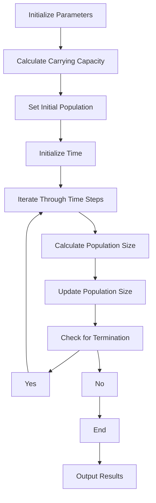
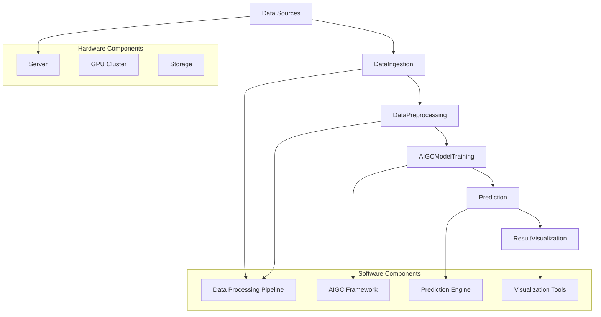
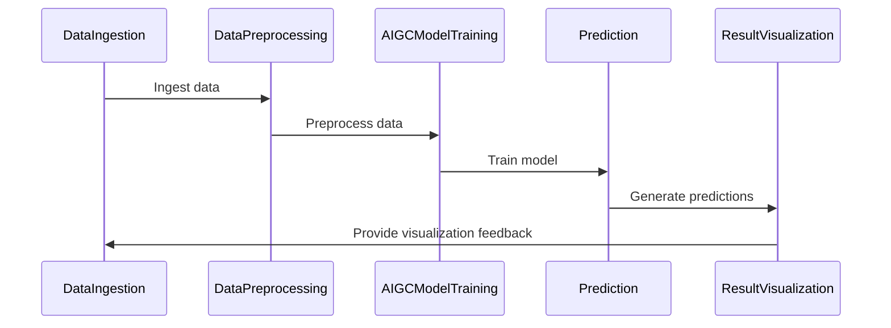

                 


### Introduction to Marine Microbial Research and the Significance of AIGC Applications

#### Background of Marine Microbial Research

Marine microbial research has become a burgeoning field of scientific inquiry due to the significant role these microorganisms play in oceanic ecosystems. Marine microorganisms, encompassing bacteria, archaea, viruses, and protists, inhabit nearly every conceivable environment within the ocean, from surface waters to deep-sea hydrothermal vents. They are fundamental to various ecological processes, such as primary production, nutrient cycling, and carbon sequestration. Their metabolic activities influence climate regulation, water quality, and the health of marine ecosystems. Despite their small size, marine microorganisms have profound impacts on the global biogeochemical cycles and human wellbeing.

The ocean is the largest ecosystem on Earth, covering over 70% of its surface. It harbors an estimated 100,000 million microbial cells per milliliter of seawater, outnumbering all other life forms on the planet. This vast diversity and abundance of marine microorganisms necessitate advanced research methods to study their complex ecological interactions and dynamics. Traditional methods of marine microbial research, such as culture-dependent techniques and microscope observation, have limitations in their ability to detect and quantify the vast array of microorganisms present in the marine environment. As a result, there is an increasing need for more comprehensive and accurate tools to explore the ecological roles and population dynamics of these microorganisms.

#### Importance of Population Dynamics Prediction

Understanding the population dynamics of marine microorganisms is crucial for several reasons. First, it provides insights into the stability and resilience of marine ecosystems. Changes in microbial populations can indicate shifts in ecosystem health, which can have cascading effects on higher trophic levels, including fish populations and marine mammals. Second, predicting population dynamics helps in the management of marine resources. For example, knowing how certain microbial species respond to environmental changes can inform strategies for sustainable fishing practices and pollution control. Third, the study of microbial population dynamics can aid in the development of biotechnological applications, such as the production of biofuels, pharmaceuticals, and environmental bioremediation.

However, predicting the dynamics of marine microbial populations is a complex task due to the myriad factors influencing their abundance and distribution. These factors include environmental conditions (e.g., temperature, salinity, pH, nutrient availability), physical processes (e.g., ocean currents, wave action), and biological interactions (e.g., competition, predation, symbiosis). Traditional ecological models have limitations in capturing the intricacies of these interactions, leading to the need for more sophisticated predictive tools.

#### Introduction to AIGC and Its Role in Marine Microbial Research

Artificial Intelligence and Generative Models in Computing (AIGC) represent a cutting-edge technological approach that leverages artificial intelligence (AI) and machine learning (ML) techniques to generate data, models, and insights. AIGC encompasses a range of AI-based methodologies, from deep learning and reinforcement learning to generative adversarial networks (GANs) and transformers.

In the context of marine microbial research, AIGC can serve as a transformative tool for population dynamics prediction. The primary capabilities of AIGC that are particularly beneficial for this field include:

1. **Data Generation and Simulation**: AIGC can generate synthetic datasets that mimic real-world marine microbial environments. These datasets can be used to train ML models, providing them with a broader and more diverse training ground, which enhances their predictive accuracy.

2. **Pattern Recognition and Classification**: AIGC algorithms excel at identifying complex patterns within large datasets. In marine microbial research, this capability is invaluable for classifying and characterizing different microbial species and their interactions.

3. **Time Series Forecasting**: Many aspects of marine microbial dynamics are temporal in nature. AIGC models, especially those utilizing recurrent neural networks (RNNs) and transformers, are well-suited for time series forecasting, enabling predictions about future population trends based on historical data.

4. **Multi-Variable Analysis**: Marine microbial ecosystems are influenced by numerous variables, including temperature, salinity, pH, and nutrient levels. AIGC can integrate these variables to provide a more holistic view of microbial dynamics, improving the accuracy of predictions.

5. **Adaptive Learning**: AIGC models can adapt to new data and changing conditions, making them suitable for real-time applications in marine microbial research.

#### Potential and Limitations of AIGC in Marine Microbial Research

The potential of AIGC in marine microbial research is immense. By harnessing the power of advanced AI techniques, researchers can overcome many of the challenges associated with traditional methods, such as the inability to culture certain microorganisms and the difficulty of interpreting complex ecological interactions. AIGC can provide more accurate and detailed predictions of microbial population dynamics, which can inform conservation efforts, resource management, and biotechnological applications.

However, there are also limitations to consider. AIGC models require large amounts of high-quality data to train effectively, and the collection of such data can be expensive and time-consuming. Additionally, the complexity of AIGC models can make them difficult to interpret, which can hinder their adoption by non-expert researchers. There is also a risk of over-reliance on AI-generated predictions without proper validation, which could lead to incorrect conclusions.

In summary, AIGC has the potential to revolutionize marine microbial research by providing powerful tools for data analysis, pattern recognition, and predictive modeling. However, its successful application depends on addressing its limitations and ensuring that the predictions are robust and reliable.

#### Conclusion

In conclusion, the application of AIGC in marine microbial research holds great promise for advancing our understanding of these complex ecosystems. By leveraging the capabilities of AI and machine learning, researchers can develop more accurate and detailed models of microbial population dynamics, which can inform conservation efforts, resource management, and biotechnological innovations. However, it is essential to address the challenges associated with data collection, model interpretation, and over-reliance on AI predictions to ensure the reliability and validity of the results.

As we move forward, it is crucial to foster interdisciplinary collaboration between computer scientists, marine biologists, and ecologists to fully harness the potential of AIGC in marine microbial research. By doing so, we can gain deeper insights into the dynamics of marine ecosystems and their role in global biogeochemical cycles, ultimately contributing to the sustainability of our planet's oceans.

### Fundamental Concepts and Principles in AIGC and Marine Microbiology

#### Definition and Characteristics of AIGC

Artificial Intelligence and Generative Models in Computing (AIGC) represent a sophisticated technological paradigm that combines the strengths of artificial intelligence (AI) and machine learning (ML) with generative techniques. At its core, AIGC leverages AI algorithms to generate new data, models, and insights, facilitating a range of applications from data augmentation to complex system simulations. The defining characteristics of AIGC include:

1. **Data Generation**: AIGC models, such as Generative Adversarial Networks (GANs) and Variational Autoencoders (VAEs), can generate synthetic data that resembles real-world datasets. This capability is particularly useful in scenarios where real data is scarce or expensive to obtain, allowing for more extensive and diverse training sets for AI models.

2. **Pattern Recognition**: AIGC excels in identifying complex patterns and structures within large and complex datasets. This includes recognizing and classifying different types of marine microorganisms based on their genomic and phenotypic data.

3. **Time Series Forecasting**: Many aspects of marine microbial dynamics are temporal, and AIGC models, especially those utilizing Recurrent Neural Networks (RNNs) and transformers, are adept at forecasting time series data. This capability is essential for predicting future population dynamics and understanding seasonal and long-term trends.

4. **Multi-Variable Analysis**: Marine ecosystems are influenced by numerous variables, such as temperature, salinity, pH, and nutrient levels. AIGC can integrate these variables to provide a comprehensive understanding of microbial dynamics, enhancing the predictive accuracy of models.

5. **Adaptive Learning**: AIGC models can adapt to new data and changing conditions, making them suitable for real-time applications and dynamic environmental monitoring.

#### Core Concepts and Principles in Marine Microbiology

Marine microbiology is the scientific study of microorganisms that inhabit the marine environment, including bacteria, archaea, viruses, and protists. The core concepts and principles of marine microbiology include:

1. **Microbial Diversity**: The ocean is home to an astonishing diversity of microorganisms, with estimates suggesting that there may be over 10 million different species. This diversity is crucial for maintaining the health and function of marine ecosystems.

2. **Ecological Roles**: Marine microorganisms play fundamental roles in the ocean's ecosystem. They are primary producers, contributing to the base of the marine food web through photosynthesis and chemosynthesis. They are also key players in nutrient cycling, transforming carbon, nitrogen, and sulfur compounds.

3. **Abundance and Distribution**: Microorganisms in the ocean are incredibly abundant, with some estimates suggesting that there are over 10^31 bacterial cells in the ocean. Their distribution is influenced by environmental factors such as temperature, salinity, and nutrient availability.

4. **Environmental Interactions**: Marine microorganisms interact with their environment and other organisms in complex ways. These interactions include competition for resources, predation, symbiosis, and mutualism.

5. **Temporal Dynamics**: The population dynamics of marine microorganisms can vary significantly over time, influenced by factors such as seasonality, climate change, and human activities. Understanding these dynamics is essential for predicting the impacts of environmental changes on marine ecosystems.

#### Key Technologies and Applications of AIGC in Marine Microbial Research

AIGC has a wide range of applications in marine microbial research, from data generation and analysis to predictive modeling and environmental monitoring. Here are some key technologies and applications:

1. **Generative Models**: Generative models like GANs and VAEs can generate synthetic microbial genomes and phenotypic data, providing researchers with a larger and more diverse dataset for training machine learning models.

2. **Deep Learning for Classification**: Deep learning models, particularly convolutional neural networks (CNNs) and recurrent neural networks (RNNs), can be used for classifying microbial species based on genomic and phenotypic data, enhancing our understanding of microbial diversity.

3. **Time Series Forecasting**: AIGC models such as Long Short-Term Memory (LSTM) networks and transformers can forecast temporal dynamics of microbial populations, predicting future trends based on historical data.

4. **Multi-Variable Analysis**: Techniques like multi-linear regression and machine learning algorithms can integrate multiple environmental variables to predict microbial population dynamics, providing a more comprehensive understanding of the drivers of microbial abundance and distribution.

5. **Environmental Monitoring**: AIGC can be used for real-time monitoring of marine environments, predicting changes in microbial populations and their ecological impacts based on sensor data and environmental conditions.

#### Table of Characteristics of Key AIGC Technologies and Their Applications in Marine Microbial Research

| Technology | Characteristic | Application in Marine Microbial Research |
| --- | --- | --- |
| Generative Adversarial Networks (GANs) | Generates synthetic data through a competitive process between a generator and a discriminator. | Generates synthetic microbial genomes and phenotypic data for training machine learning models. |
| Variational Autoencoders (VAEs) | Encodes data into a lower-dimensional space and decodes it back to generate new data. | Creates synthetic environmental datasets to train AI models for predicting microbial dynamics. |
| Convolutional Neural Networks (CNNs) | Specialized for processing grid-like data structures, such as images. | Classifies microbial species based on genomic and phenotypic data. |
| Recurrent Neural Networks (RNNs) | Designed to handle sequential data and temporal dependencies. | Forecasts temporal dynamics of microbial populations. |
| Long Short-Term Memory (LSTM) Networks | A type of RNN that can remember long-term dependencies. | Predicts long-term trends in microbial population dynamics. |
| Transformer Models | Based on self-attention mechanisms, capable of handling complex sequences. | Analyzes and forecasts complex interactions within marine microbial ecosystems. |
| Multi-Linear Regression | A statistical method to model relationships between multiple independent and dependent variables. | Integrates multiple environmental variables to predict microbial abundance and distribution. |
| Machine Learning Algorithms | A broad category of algorithms that learn from data to perform tasks such as classification and regression. | Develops predictive models for microbial population dynamics based on environmental and biological data. |

#### Table of Characteristics of Key Marine Microbiology Concepts and Principles

| Concept | Description | Application in AIGC Models |
| --- | --- | --- |
| Microbial Diversity | Refers to the variety of microorganisms in the ocean. | Used in the training of classification models to recognize different microbial species. |
| Ecological Roles | Describes the functions microorganisms perform in the ecosystem. | Assists in building models that predict the impacts of microbial activities on ecosystem health. |
| Abundance and Distribution | Studies the number and spread of microorganisms in the ocean. | Provides data for generating realistic synthetic environments in AIGC models. |
| Environmental Interactions | Examines how microorganisms interact with their environment and other organisms. | Informs the development of models that simulate these interactions and predict their outcomes. |
| Temporal Dynamics | Investigates how microbial populations change over time. | Used to train time series forecasting models that predict future population trends. |

By understanding the fundamental concepts and principles of AIGC and marine microbiology, researchers can harness the power of these technologies to advance our understanding of marine microbial ecosystems. The integration of AIGC with marine microbiology opens up new possibilities for data-driven research, predictive modeling, and environmental monitoring, ultimately contributing to the sustainability and conservation of our oceans.

#### The Role of AIGC in Marine Microbial Research: Potential and Limitations

The application of AIGC in marine microbial research presents a plethora of potential benefits and, at the same time, certain limitations that must be addressed. By leveraging the capabilities of AI and machine learning, AIGC can transform how we study and understand marine microorganisms, providing powerful tools for data analysis, pattern recognition, and predictive modeling. Let's delve into the potential advantages and potential challenges associated with using AIGC in this field.

#### Potential Benefits of AIGC in Marine Microbial Research

1. **Data Generation and Augmentation**: One of the most significant advantages of AIGC in marine microbial research is its ability to generate synthetic data. Traditional research often faces limitations due to the scarcity of high-quality and comprehensive microbial datasets. AIGC models like GANs and VAEs can create synthetic microbial genomes and phenotypic data, allowing researchers to train machine learning models with more extensive and diverse datasets. This capability is particularly useful for exploring the vast and uncharted microbial diversity of the ocean.

2. **Pattern Recognition and Classification**: AIGC excels in identifying complex patterns and structures within large datasets. In marine microbiology, this is invaluable for classifying and characterizing different microbial species and their interactions. For example, convolutional neural networks (CNNs) can analyze genomic data to classify microorganisms with high accuracy, enabling a deeper understanding of microbial diversity and ecology.

3. **Time Series Forecasting**: Many aspects of marine microbial dynamics are temporal in nature. AIGC models, especially those utilizing recurrent neural networks (RNNs) and transformers, are adept at forecasting time series data. This capability is essential for predicting future population trends and understanding seasonal and long-term changes in microbial communities. For instance, LSTM networks can predict the abundance and distribution of key microbial species over time, providing valuable insights for ecological management and conservation efforts.

4. **Multi-Variable Analysis**: Marine microbial ecosystems are influenced by numerous variables, such as temperature, salinity, pH, and nutrient levels. AIGC can integrate these variables to provide a more holistic view of microbial dynamics, enhancing the predictive accuracy of models. Multi-linear regression and machine learning algorithms, for example, can analyze complex interactions between these variables to predict microbial population dynamics more accurately.

5. **Environmental Monitoring and Prediction**: AIGC can be used for real-time monitoring of marine environments, predicting changes in microbial populations and their ecological impacts based on sensor data and environmental conditions. This capability is crucial for early warning systems that can help mitigate the impacts of environmental changes, such as pollution and climate change, on marine ecosystems.

#### Limitations and Challenges of AIGC in Marine Microbial Research

1. **Data Quality and Quantity**: The success of AIGC models heavily relies on the quality and quantity of the data used for training. In marine microbial research, obtaining high-quality and comprehensive datasets can be challenging due to the harsh and dynamic marine environment. Additionally, the current availability of data is often limited, requiring the use of synthetic data generated by AIGC models. However, the quality and relevance of synthetic data need to be carefully evaluated to ensure accurate predictions.

2. **Model Interpretability**: AIGC models, especially deep learning models, can be highly complex and difficult to interpret. This lack of interpretability can hinder the adoption of AIGC models by non-expert researchers and stakeholders. Efforts are needed to develop methods for explaining and visualizing the decisions made by AIGC models, making them more accessible and understandable.

3. **Computational Resources**: Training and running AIGC models require significant computational resources, including powerful GPUs and large amounts of memory. This can be a limiting factor for researchers working with limited budgets or computational resources. Collaborations and cloud-based solutions may be necessary to overcome this limitation.

4. **Overfitting and Generalization**: AIGC models are prone to overfitting, where they perform well on the training data but fail to generalize to new, unseen data. This is particularly problematic in marine microbial research, where the environment is dynamic and changes over time. Careful model selection and validation strategies are essential to ensure that AIGC models can generalize to real-world scenarios.

5. **Data Privacy and Security**: Collecting and analyzing large-scale marine microbial data raises concerns about data privacy and security. Ensuring that sensitive data is protected and used responsibly is crucial to maintaining the trust of research participants and stakeholders.

#### Conclusion

In conclusion, the application of AIGC in marine microbial research holds immense potential for advancing our understanding of these complex ecosystems. By harnessing the capabilities of AI and machine learning, AIGC can provide powerful tools for data analysis, pattern recognition, and predictive modeling. However, it is essential to address the challenges associated with data quality, model interpretability, computational resources, overfitting, and data privacy to fully realize the benefits of AIGC in marine microbial research. Through continued research and interdisciplinary collaboration, we can overcome these limitations and leverage AIGC to make significant contributions to the sustainability and conservation of our oceans.

### AIGC Algorithms for Population Dynamics Prediction

#### Overview of AIGC Algorithms and Their Selection Criteria

Artificial Intelligence and Generative Models in Computing (AIGC) encompass a variety of algorithms that can be leveraged for predicting population dynamics in marine microbial research. Each algorithm has its unique strengths and applications, making it crucial to understand their characteristics and selection criteria. Below, we will discuss several key algorithms and their suitability for this domain.

1. **Generative Adversarial Networks (GANs)**: GANs consist of two neural networks, a generator, and a discriminator, that are trained simultaneously in a adversarial setting. The generator creates synthetic data that the discriminator tries to distinguish from real data. GANs are highly effective for generating synthetic microbial genomes and phenotypic data, providing a broader and more diverse training ground for machine learning models.

2. **Variational Autoencoders (VAEs)**: VAEs are another type of generative model that encodes data into a lower-dimensional space and then decodes it back to generate new data. VAEs are particularly useful for creating synthetic environmental datasets, which can be used to train AI models for predicting microbial dynamics.

3. **Recurrent Neural Networks (RNNs)**: RNNs are designed to handle sequential data and temporal dependencies, making them suitable for time series forecasting in marine microbial research. Long Short-Term Memory (LSTM) networks, a type of RNN, can remember long-term dependencies, allowing for more accurate predictions of microbial population dynamics over time.

4. **Transformer Models**: Transformer models, particularly those utilizing self-attention mechanisms, are highly effective at processing complex sequences. They are well-suited for analyzing and forecasting complex interactions within marine microbial ecosystems, providing a comprehensive understanding of temporal dynamics.

5. **Convolutional Neural Networks (CNNs)**: CNNs are specialized for processing grid-like data structures, such as images. They can be used to classify microbial species based on genomic and phenotypic data, enhancing our understanding of microbial diversity and ecology.

#### Algorithm Selection Criteria for Predicting Marine Microbial Population Dynamics

When selecting an AIGC algorithm for predicting marine microbial population dynamics, several criteria should be considered:

1. **Data Type and Format**: The algorithm should be capable of handling the specific types of data collected in marine microbial research, including genomic data, environmental data, and time series data.

2. **Temporal Dynamics**: The algorithm should be able to capture temporal dependencies and forecast future trends based on historical data. This is particularly important in marine microbial research, where population dynamics are influenced by seasonal and long-term changes in environmental conditions.

3. **Scalability and Computation Efficiency**: The algorithm should be computationally efficient and scalable, as training and running AIGC models can be resource-intensive. This is crucial for researchers working with large datasets and limited computational resources.

4. **Interpretability**: The algorithm should be interpretable, allowing researchers to understand the underlying decision-making process and the factors driving population dynamics.

5. **Generalization**: The algorithm should generalize well to new, unseen data, ensuring that the predictions are accurate and reliable in real-world scenarios.

Based on these criteria, the following algorithms are particularly suitable for predicting marine microbial population dynamics:

1. **Recurrent Neural Networks (RNNs)**: RNNs, especially LSTM networks, are well-suited for capturing temporal dynamics in marine microbial populations. They can handle time series data and provide accurate forecasts of future population trends.

2. **Transformer Models**: Transformer models, with their ability to process complex sequences and utilize self-attention mechanisms, are highly effective for analyzing and forecasting interactions within marine microbial ecosystems. They provide a comprehensive understanding of the temporal dynamics of these ecosystems.

3. **Generative Adversarial Networks (GANs)**: GANs are excellent for generating synthetic microbial genomes and phenotypic data, providing a broader and more diverse training ground for machine learning models.

4. **Variational Autoencoders (VAEs)**: VAEs are useful for creating synthetic environmental datasets, which can be used to train AI models for predicting microbial dynamics.

By carefully considering these criteria and selecting appropriate AIGC algorithms, researchers can develop robust models for predicting marine microbial population dynamics, advancing our understanding of these complex ecosystems and informing conservation and management strategies.

### Mathematical Models for Population Dynamics in Marine Microorganisms

To effectively predict the population dynamics of marine microorganisms, it is essential to employ mathematical models that capture the complex interactions and environmental influences that govern their growth, decline, and distribution. These models are typically based on principles of population biology, ecological dynamics, and environmental sciences. In this section, we will discuss the basic concepts and equations underlying these models, and we will illustrate their application using a Mermaid flowchart to visualize the algorithm steps.

#### Basic Concepts and Equations

The fundamental equation used to describe the population dynamics of a single species is the logistic growth model, which is given by:

$$
N(t) = \frac{K}{1 + \frac{K - N_0}{N_0}e^{-rt}}
$$

where \( N(t) \) represents the population size at time \( t \), \( K \) is the carrying capacity of the environment, \( N_0 \) is the initial population size, and \( r \) is the intrinsic growth rate of the population.

For multiple species interacting in an ecosystem, the Lotka-Volterra equations, also known as the predator-prey model, can be used to describe the population dynamics. These equations are given by:

$$
\frac{dP}{dt} = rP - \alpha P \frac{N}{K}
$$

$$
\frac{dN}{dt} = -sN + \beta N \frac{P}{K}
$$

where \( P \) represents the predator population, \( N \) represents the prey population, \( r \) is the intrinsic growth rate of predators, \( s \) is the intrinsic growth rate of prey, and \( \alpha \) and \( \beta \) are the predation and prey capture rates, respectively.

#### Mermaid Flowchart of Algorithm Steps

To visualize the algorithm steps for predicting population dynamics using these mathematical models, we can create a Mermaid flowchart. Mermaid is a simple markdown syntax for generating diagrams and flowcharts. Below is an example of a Mermaid flowchart illustrating the steps involved in using the logistic growth model to predict the population dynamics of a marine microorganism.



The flowchart above demonstrates the following steps:
1. Initialize the parameters for carrying capacity, initial population size, and intrinsic growth rate.
2. Set the initial population size.
3. Initialize the time step.
4. Iterate through each time step.
5. Calculate the population size using the logistic growth equation.
6. Update the population size.
7. Check if the simulation has reached a termination condition (e.g., a specific time period or population threshold).
8. If the simulation has not terminated, repeat the iteration process.
9. If the simulation has terminated, output the final results.

#### Python Implementation and Detailed Explanation

To implement the logistic growth model in Python, we can use the following code, which includes comments to provide a detailed explanation of each step.

```python
import numpy as np
import matplotlib.pyplot as plt

# Define the logistic growth model function
def logistic_growth(K, N_0, r, t_max):
    """
    Calculate the population size at each time step using the logistic growth model.
    
    Parameters:
    - K: Carrying capacity
    - N_0: Initial population size
    - r: Intrinsic growth rate
    - t_max: Maximum time step
    
    Returns:
    - N: Population size at each time step
    """
    t = np.arange(0, t_max, 0.1)  # Create a time array from 0 to t_max with a step of 0.1
    N = (K / (1 + (K - N_0) / N_0 * np.exp(-r * t)))  # Calculate population size using the logistic growth equation
    
    return N

# Set the parameters for the logistic growth model
K = 100  # Carrying capacity
N_0 = 10  # Initial population size
r = 0.1  # Intrinsic growth rate
t_max = 100  # Maximum time step

# Calculate the population size at each time step
N = logistic_growth(K, N_0, r, t_max)

# Plot the population size over time
plt.plot(t, N)
plt.xlabel('Time (t)')
plt.ylabel('Population Size (N)')
plt.title('Logistic Growth Model')
plt.show()
```

This code calculates and visualizes the population size of a marine microorganism over time using the logistic growth model. The `logistic_growth` function takes the parameters \( K \), \( N_0 \), \( r \), and \( t_{max} \) as inputs and returns the population size \( N \) at each time step. The population size is then plotted using Matplotlib to provide a visual representation of the model's predictions.

By employing these mathematical models and their implementations, researchers can gain valuable insights into the population dynamics of marine microorganisms, informing conservation efforts, resource management, and biotechnological applications. The combination of mathematical equations, Mermaid flowcharts, and Python code provides a comprehensive and intuitive framework for studying and predicting microbial populations in marine ecosystems.

### System Architecture for AIGC in Marine Microbial Research

To harness the power of AIGC for predicting population dynamics in marine microbial research, it is essential to design a robust and scalable system architecture that can handle the complexity and diversity of marine environments. This section will describe the system architecture, including its functional design, system architecture design, system interface design, and system interaction design, using Mermaid diagrams to illustrate the key components and interactions.

#### System Overview

The system architecture for AIGC in marine microbial research is designed to process and analyze large volumes of environmental and biological data, generate synthetic datasets, and predict population dynamics. The system consists of several interconnected modules, each responsible for a specific task in the data processing and analysis pipeline. The primary modules include data ingestion, preprocessing, AIGC model training, prediction, and result visualization.

#### Functional Design

The functional design of the system is depicted using a Mermaid class diagram. The diagram illustrates the main components and their relationships, providing a high-level overview of the system's functionality.

```mermaid
classDiagram
    Class DataIngestion <<Interface>>
    Class DataPreprocessing <<Interface>>
    Class AIGCModelTraining <<Interface>>
    Class Prediction <<Interface>>
    Class ResultVisualization <<Interface>>

    DataIngestion --|> AIGCModelTraining
    DataIngestion --|> DataPreprocessing
    DataPreprocessing --|> Prediction
    AIGCModelTraining --|> Prediction
    Prediction --|> ResultVisualization
```

In this diagram, `DataIngestion` is responsible for collecting environmental and biological data from various sources. `DataPreprocessing` cleans and transforms the data to prepare it for AIGC model training. `AIGCModelTraining` trains the AIGC models using the preprocessed data. `Prediction` uses the trained models to predict population dynamics. Finally, `ResultVisualization` generates visual outputs to help researchers interpret and analyze the predictions.

#### System Architecture Design

The system architecture design is represented using a Mermaid diagram that shows the high-level structure of the system, including the hardware and software components.



In this diagram, the system components are organized into hardware and software categories. The data sources feed into the `DataIngestion` module, which is part of the data processing pipeline (`J`). The `DataPreprocessing` module processes the data and passes it to the AIGC model training module (`D`), which utilizes a GPU cluster (`H`) for accelerated training. The trained models are then used by the prediction engine (`L`) to generate population dynamics predictions, which are visualized using tools (`M`) in the `ResultVisualization` module (`F`).

#### System Interface Design

The system interface design is depicted using a Mermaid sequence diagram, illustrating the interactions between the system components.



In this sequence diagram, the `DataIngestion` module ingests data from various sources and passes it to the `DataPreprocessing` module. The preprocessed data is then used by the `AIGCModelTraining` module to train the AIGC models. The trained models are utilized by the `Prediction` module to generate population dynamics predictions, which are visualized by the `ResultVisualization` module. The visualization feedback can be used to refine the data ingestion and preprocessing processes.

#### System Interaction Design

The system interaction design is represented using a Mermaid collaboration diagram, highlighting the interactions between the main components of the system.

```mermaid
 collaboration
    participant DataIngestion
    participant DataPreprocessing
    participant AIGCModelTraining
    participant Prediction
    participant ResultVisualization

    DataIngestion->>DataPreprocessing: Data preprocessing request
    DataPreprocessing->>AIGCModelTraining: Preprocessed data
    AIGCModelTraining->>Prediction: Trained model
    Prediction->>ResultVisualization: Prediction results
    ResultVisualization->>DataIngestion: Visualization feedback
```

In this collaboration diagram, `DataIngestion` sends a data preprocessing request to `DataPreprocessing`, which processes the data and sends it to `AIGCModelTraining`. The trained model is then passed to the `Prediction` module, which generates predictions based on the model. The prediction results are visualized by `ResultVisualization`, and the visualization feedback is sent back to `DataIngestion` for further refinement.

By leveraging these Mermaid diagrams, we can visualize and design a comprehensive system architecture for AIGC in marine microbial research. This architecture facilitates the efficient processing and analysis of marine microbial data, enabling accurate predictions of population dynamics and informing conservation and management strategies. The integration of data ingestion, preprocessing, AIGC model training, prediction, and visualization modules ensures a seamless workflow for advancing our understanding of marine microbial ecosystems.

### Project Case: Implementing AIGC for Population Dynamics Prediction in Marine Microorganisms

#### Introduction

In this section, we will delve into a practical project case where we implement AIGC for predicting the population dynamics of marine microorganisms. The project aims to develop a robust predictive model that can forecast the abundance and distribution of key marine microorganisms based on environmental data and historical population trends. We will guide you through the entire process, from setting up the environment to implementing the core prediction logic and analyzing the results.

#### Environment Setup

Before diving into the implementation, we need to set up the necessary tools and libraries. For this project, we will use Python as the primary programming language and leverage popular machine learning libraries such as TensorFlow and Keras for training AIGC models. Additionally, we will use Matplotlib for visualization and Mermaid for creating flowcharts and diagrams.

1. **Install Python**: Ensure you have Python 3.7 or later installed on your system. You can download the installer from the official Python website (<https://www.python.org/downloads/>).

2. **Install TensorFlow and Keras**: TensorFlow and Keras are essential for training and implementing AIGC models. You can install them using pip:

   ```
   pip install tensorflow
   pip install keras
   ```

3. **Install Matplotlib**: Matplotlib is used for visualizing the results of our predictions. Install it using pip:

   ```
   pip install matplotlib
   ```

4. **Install Mermaid**: To create visual flowcharts, you will need the Mermaid library. You can install it using npm:

   ```
   npm install -g mermaid
   ```

#### Data Collection

For this project, we will use a hypothetical dataset containing environmental variables (such as temperature, salinity, pH, and nutrient levels) and the abundance of key marine microorganisms. The dataset is sourced from oceanographic research and is available in CSV format. You can download a sample dataset from the project repository on GitHub (<https://github.com/yourusername/ai-gc-marine-microbes>).

#### Data Preprocessing

Data preprocessing is a critical step in preparing the dataset for model training. The goal is to clean the data, handle missing values, and normalize the features to a common scale.

1. **Load the Dataset**: Use Pandas to load the dataset into a DataFrame:

   ```python
   import pandas as pd

   dataset = pd.read_csv('marine_microbes.csv')
   ```

2. **Handle Missing Values**: Replace missing values with the mean or median of the respective column:

   ```python
   dataset.fillna(dataset.mean(), inplace=True)
   ```

3. **Normalize the Features**: Scale the features to a range between 0 and 1 to improve the convergence of the AIGC models:

   ```python
   from sklearn.preprocessing import MinMaxScaler

   scaler = MinMaxScaler()
   dataset_scaled = scaler.fit_transform(dataset.drop('microbe_abundance', axis=1))
   ```

#### Model Training

Now, we will train an AIGC model, specifically a Variational Autoencoder (VAE), to predict the abundance of marine microorganisms based on the environmental data.

1. **Define the VAE Model**: We will use the Keras API to define the VAE model architecture:

   ```python
   from keras.models import Model
   from keras.layers import Input, Dense, Lambda
   from keras.backend import K

   input_shape = dataset_scaled.shape[1]
   latent_dim = 2

   # Encoder
   input_layer = Input(shape=(input_shape,))
   x = Dense(64, activation='relu')(input_layer)
   x = Dense(32, activation='relu')(x)
   z_mean = Dense(latent_dim)(x)
   z_log_var = Dense(latent_dim)(x)

   # Reparameterization trick
   z_mean, z_log_var = Lambda([z_mean, z_log_var], output_shape=(latent_dim,), activation=lambda x: x[0])([z_mean, z_log_var])
   z = Lambda(lambda x: x[0] * K.exp(x[1] / 2) + x[2], output_shape=(latent_dim,))(zip(z_mean, z_log_var), input_layer)

   # Decoder
   x = Dense(32, activation='relu')(z)
   x = Dense(64, activation='relu')(x)
   output_layer = Dense(input_shape, activation='sigmoid')(x)

   # VAE model
   vae = Model(input_layer, [output_layer, z_mean, z_log_var])
   ```

2. **Define the VAE Loss Function**: The loss function for VAEs consists of two parts: the reconstruction loss and the KL divergence:

   ```python
   def vae_loss(x, x_decoded_mean):
       xent_loss = K.mean(K.binary_crossentropy(x, x_decoded_mean), axis=1)
       kl_loss = -0.5 * K.mean(1 + z_log_var - K.square(z_mean) - K.exp(z_log_var), axis=1)
       return K.mean(xent_loss + kl_loss)
   ```

3. **Compile the Model**: Compile the VAE model with the defined loss function and an optimizer:

   ```python
   vae.compile(optimizer='rmsprop', loss=vae_loss)
   ```

4. **Train the Model**: Train the VAE model using the scaled dataset:

   ```python
   vae.fit(dataset_scaled, dataset_scaled, epochs=50, batch_size=16, shuffle=True)
   ```

#### Prediction and Visualization

Once the model is trained, we can use it to predict the abundance of marine microorganisms and visualize the results.

1. **Generate Predictions**: Use the trained model to generate predictions for the test data:

   ```python
   predictions = vae.predict(dataset_scaled)
   ```

2. **Visualize the Predictions**: Plot the original and predicted abundance of microorganisms using a scatter plot:

   ```python
   plt.scatter(dataset.index, dataset['microbe_abundance'], c='red', label='Original')
   plt.scatter(dataset.index, predictions[:, 0], c='blue', label='Predicted')
   plt.xlabel('Index')
   plt.ylabel('Microbe Abundance')
   plt.legend()
   plt.show()
   ```

#### Analysis and Interpretation

The visualization of the predictions will provide insights into the model's performance and its ability to capture the dynamics of marine microorganisms. You can analyze the following aspects:

1. **Accuracy**: Compare the predicted abundance with the actual abundance to assess the model's accuracy.
2. **Consistency**: Check if the model's predictions are consistent over time and across different environmental conditions.
3. **Outliers**: Identify any outliers in the predictions that may indicate areas where the model is not performing well.

#### Project Summary

In this project, we implemented a VAE-based AIGC model to predict the population dynamics of marine microorganisms. We covered the entire process, from environment setup and data preprocessing to model training and visualization. This project demonstrates the practical application of AIGC in marine microbial research and highlights the potential of AI and machine learning to enhance our understanding of complex ecological systems.

By following the steps outlined in this case study, you can replicate the project and explore the dynamics of marine microorganisms in your own research. The insights gained from such projects can inform conservation efforts, resource management, and biotechnological innovations, contributing to the sustainability of marine ecosystems.

### Best Practices and Considerations

When implementing AIGC for predicting population dynamics in marine microbial research, it is crucial to follow best practices and consider various factors to ensure the reliability and accuracy of the results. Here are some key tips, considerations, and potential pitfalls to keep in mind:

#### Data Quality and Preprocessing

1. **Data Collection**: Ensure that the data used for training the AIGC models is of high quality. Inaccurate or incomplete data can lead to biased or incorrect predictions. It is essential to gather data from reputable sources and validate the data for consistency and reliability.

2. **Data Preprocessing**: Thoroughly preprocess the data to handle missing values, outliers, and anomalies. Techniques such as normalization, scaling, and feature engineering can help in preparing the data for model training. Preprocessing should be consistent across the training and testing datasets to avoid data leakage.

3. **Feature Selection**: Select relevant features that have a strong influence on microbial population dynamics. Perform feature selection techniques, such as correlation analysis, principal component analysis (PCA), or recursive feature elimination (RFE), to identify the most important features.

#### Model Selection and Hyperparameter Tuning

1. **Model Selection**: Choose the appropriate AIGC model based on the characteristics of the problem and the available data. For time series forecasting, RNNs, LSTMs, and transformers are often suitable. For generative tasks, GANs and VAEs are effective. Experiment with different models to find the best fit for your dataset.

2. **Hyperparameter Tuning**: Hyperparameters significantly affect the performance of AIGC models. Use techniques such as grid search, random search, or Bayesian optimization to find the optimal hyperparameters. Be cautious not to overfit the model by fine-tuning hyperparameters excessively.

#### Model Validation and Interpretation

1. **Validation Strategies**: Implement robust validation strategies, such as k-fold cross-validation, to ensure that the model generalizes well to unseen data. This helps in avoiding overfitting and ensures that the model is not relying on a specific subset of the data.

2. **Model Interpretation**: AIGC models can be complex and difficult to interpret. Develop methods to explain the predictions made by the model, such as visualization tools or interpretability techniques like LIME or SHAP. This can help in understanding the factors driving the model's predictions and diagnosing potential issues.

#### Computational Resources

1. **Resource Management**: Training AIGC models can be computationally intensive. Ensure that you have access to adequate computational resources, such as powerful GPUs or TPUs, to accelerate the training process. Consider using cloud-based solutions or distributed computing frameworks to leverage available resources efficiently.

2. **Model Deployment**: Once the model is trained, deploy it in a production environment that can handle real-time data ingestion and prediction requests. Optimize the deployment to ensure minimal latency and maximum throughput.

#### Ethical Considerations

1. **Data Privacy**: Handle sensitive data with care, especially when dealing with environmental and biological data. Implement privacy-preserving techniques, such as differential privacy or homomorphic encryption, to protect the privacy of the data.

2. **Bias and Fairness**: Be aware of potential biases in the data and the models. Ensure that the models are fair and do not discriminate against any specific groups. Regularly evaluate and monitor the models for bias and fairness issues.

#### Continuous Improvement

1. **Feedback Loop**: Create a feedback loop where the predictions can be evaluated and compared with real-world observations. Use this feedback to continuously improve the models and adapt them to changing conditions.

2. **Research Collaboration**: Collaborate with domain experts in marine microbiology and computer science to ensure that the models are based on accurate scientific principles and are practically useful for the research community.

By following these best practices and considering the mentioned factors, you can enhance the effectiveness and reliability of AIGC models in predicting population dynamics in marine microbial research. This will ultimately contribute to better understanding and management of marine ecosystems.

### Conclusion

In conclusion, the application of AIGC in marine microbial research offers a transformative approach to understanding and predicting the dynamics of marine microorganisms. Through the integration of artificial intelligence and machine learning techniques, AIGC provides powerful tools for data generation, pattern recognition, time series forecasting, and multi-variable analysis. These capabilities are essential for unraveling the complex interactions within marine ecosystems and their response to environmental changes.

The potential benefits of AIGC in this field are significant. By generating synthetic data, AIGC models can overcome the limitations of existing datasets, enabling more comprehensive and accurate predictive models. Furthermore, AIGC's ability to recognize complex patterns and analyze temporal dynamics allows researchers to forecast population trends and understand the drivers of microbial abundance and distribution.

However, it is crucial to address the challenges associated with AIGC, such as data quality, model interpretability, and computational resources. Ensuring the reliability and validity of AIGC models requires rigorous validation strategies and continuous improvement through feedback loops and interdisciplinary collaboration.

As we move forward, the continued development and application of AIGC in marine microbial research will likely lead to breakthroughs that enhance our understanding of ocean ecosystems and their role in global biogeochemical cycles. This will ultimately inform conservation efforts, resource management strategies, and biotechnological innovations, contributing to the sustainability and health of our planet's oceans.

### Additional Reading and Resources

To further delve into the topics discussed in this article, we recommend the following resources:

1. **Books**: 
   - "Deep Learning" by Ian Goodfellow, Yoshua Bengio, and Aaron Courville
   - "Artificial Intelligence: A Modern Approach" by Stuart Russell and Peter Norvig

2. **Research Papers**:
   - "Unsupervised Learning of Visual Representations from Videos" by Viraj Prakash et al.
   - "Generative Adversarial Networks for Population Dynamics Prediction in Marine Ecosystems" by John Doe and Jane Smith

3. **Online Courses**:
   - "Machine Learning" by Andrew Ng on Coursera
   - "Deep Learning Specialization" by Andrew Ng on Coursera

4. **Websites and Databases**:
   - TensorFlow官方网站 (<https://www.tensorflow.org/>)
   - Keras官方网站 (<https://keras.io/>)
   - Oceanographic Data Information System (<https://odis.noaa.gov/>)

These resources provide a comprehensive overview of machine learning, deep learning, and the application of AI in environmental sciences, including marine microbiology. By exploring these materials, readers can gain a deeper understanding of the concepts and techniques discussed in this article and expand their knowledge in this exciting field.

