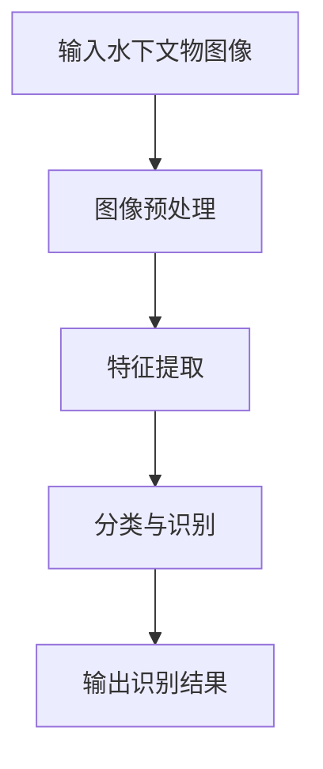
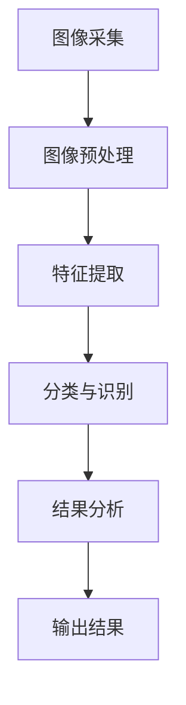

                 

# AIGC在海洋考古中的应用：水下文物识别提示词

关键词：AIGC，海洋考古，水下文物识别，人工智能，机器学习，图像处理

摘要：随着人工智能技术的不断发展，AIGC（自适应智能生成控制）在多个领域得到了广泛应用。本文主要探讨AIGC技术在海洋考古中的应用，特别是水下文物的识别。文章将首先介绍海洋考古的重要性以及水下文物保护面临的挑战，然后详细阐述AIGC技术的基本概念和发展现状。接着，我们将分析水下文物识别的难点和传统方法的局限性，并探讨AIGC技术在水下文物识别中的应用潜力。随后，文章将介绍AIGC在水下文物识别中的基本原理、应用场景以及适用范围和限制因素。最后，我们将深入探讨AIGC技术的核心概念和元素组成，并总结AIGC与水下文物识别之间的联系。

## 目录大纲

### 第1章：背景介绍

#### 1.1 问题背景

- 海洋考古的重要性
- 水下文物保护面临的挑战
- AIGC技术的基本概念与发展现状

#### 1.2 问题描述

- 水下文物识别的难点
- 传统识别方法的局限性
- AIGC技术在水下文物识别中的应用潜力

#### 1.3 问题解决

- AIGC在水下文物识别中的基本原理
- AIGC在水下文物识别中的应用场景

#### 1.4 边界与外延

- AIGC技术在水下文物识别中的适用范围
- AIGC技术在水下文物识别中的限制因素

#### 1.5 概念结构与核心要素组成

- AIGC技术核心概念
- 水下文物识别的关键要素

### 第2章：核心概念与联系

#### 2.1 AIGC技术原理

- AIGC技术的基本原理
- AIGC技术的核心算法

#### 2.2 水下文物识别原理

- 水下文物的物理特性
- 水下文物的识别方法

#### 2.3 AIGC与水下文物识别的联系

- AIGC技术在水下文物识别中的应用
- AIGC技术在水下文物识别中的优势

### 第3章：算法原理讲解

#### 3.1 水下文物识别算法流程图

#### 3.2 算法原理讲解

- 数据预处理
- 特征提取
- 分类与识别
- 输出识别结果

#### 3.3 Python源代码讲解

#### 3.4 数学模型和数学公式讲解

#### 3.5 举例说明

### 第4章：系统分析与架构设计

#### 4.1 问题场景介绍

#### 4.2 项目介绍

#### 4.3 系统功能设计

#### 4.4 系统架构设计

#### 4.5 系统接口设计

#### 4.6 系统交互序列图

### 第5章：项目实战

#### 5.1 环境安装

#### 5.2 系统核心实现源代码

#### 5.3 代码应用解读与分析

#### 5.4 实际案例分析和详细讲解

#### 5.5 项目小结

### 第6章：最佳实践与注意事项

#### 6.1 最佳实践

#### 6.2 小结

#### 6.3 注意事项

#### 6.4 拓展阅读

## 第1章：背景介绍

### 1.1 问题背景

海洋考古，作为考古学的一个重要分支，其重要性不可忽视。海洋考古不仅有助于我们了解古代文明的交流与贸易，还能揭示历史事件的发生过程。随着全球海洋资源的日益重视，海洋考古的重要性愈发凸显。然而，水下文物的保护面临着诸多挑战，其中最为显著的是水下文物的识别问题。

水下文物通常位于深海或海底，环境复杂，能见度低，这对传统考古方法提出了极大的挑战。水下文物识别的难点主要体现在以下几个方面：

1. **环境干扰**：水下环境中的光线、水流和海洋生物等会对文物识别造成干扰。
2. **能见度低**：深海或海底能见度低，传统视觉识别方法难以发挥作用。
3. **文物多样性**：水下文物种类繁多，形态各异，识别难度大。
4. **数据量庞大**：水下考古过程中会产生大量图像和数据，处理和识别这些数据需要高效的方法。

为了解决这些问题，传统的水下文物识别方法主要包括声呐扫描、物理探测和人工识别等。然而，这些方法在数据处理效率、识别准确性和稳定性方面存在较大局限性。

AIGC（自适应智能生成控制）技术，作为一种新兴的人工智能技术，具有强大的数据处理和模式识别能力。AIGC技术的基本概念包括以下几个方面：

1. **自适应**：AIGC技术可以根据不同任务和环境自动调整算法参数，提高识别效率。
2. **智能生成**：AIGC技术可以利用已有的数据和模型生成新的数据和图像，辅助文物识别。
3. **控制**：AIGC技术可以对识别过程进行实时控制和反馈，优化识别结果。

AIGC技术发展迅速，已经广泛应用于图像处理、自然语言处理、视频生成等多个领域。随着AIGC技术的不断成熟，其在水下文物识别中的应用潜力也越来越大。

### 1.2 问题描述

水下文物识别的难点主要体现在以下几个方面：

1. **环境干扰**：水下环境中的光线、水流和海洋生物等会对文物识别造成干扰。这些干扰因素使得传统视觉识别方法在水下环境中难以发挥作用。

2. **能见度低**：深海或海底能见度低，使得图像质量和识别效果受到严重影响。传统的图像处理技术很难在这种情况下取得理想的识别结果。

3. **文物多样性**：水下文物种类繁多，形态各异，识别难度大。不同文物的特征差异较大，如何准确提取和识别这些特征成为一大挑战。

4. **数据量庞大**：水下考古过程中会产生大量图像和数据，处理和识别这些数据需要高效的方法。传统方法在处理海量数据时效率较低，难以满足实际需求。

传统识别方法的局限性主要包括以下几个方面：

1. **人工识别效率低**：传统的人工识别方法需要大量人力和时间，效率低下，难以应对大规模水下考古任务。

2. **算法稳定性差**：传统算法在水下复杂环境中稳定性差，容易出现误识别和漏识别。

3. **数据处理能力不足**：传统方法对图像和数据的处理能力有限，难以提取出有效的特征，影响识别准确率。

AIGC技术在水下文物识别中的应用潜力主要体现在以下几个方面：

1. **自适应识别**：AIGC技术可以根据不同任务和环境自动调整算法参数，提高识别效率。例如，在低能见度环境下，AIGC技术可以通过自适应调整光线补偿算法，提高图像质量。

2. **智能生成数据**：AIGC技术可以利用已有的数据和模型生成新的数据和图像，为文物识别提供更多样本。例如，通过生成对抗网络（GAN）生成与真实文物相似的数据，提高识别模型的效果。

3. **实时控制和反馈**：AIGC技术可以对识别过程进行实时控制和反馈，优化识别结果。例如，在识别过程中，AIGC技术可以根据实时反馈调整探测器的方向和角度，提高识别准确率。

### 1.3 问题解决

AIGC在水下文物识别中的基本原理：

AIGC（自适应智能生成控制）技术在水下文物识别中的基本原理主要包括以下几个方面：

1. **自适应**：AIGC技术可以根据不同任务和环境自动调整算法参数，提高识别效率。例如，在低能见度环境下，AIGC技术可以通过自适应调整光线补偿算法，提高图像质量。

2. **智能生成**：AIGC技术可以利用已有的数据和模型生成新的数据和图像，为文物识别提供更多样本。例如，通过生成对抗网络（GAN）生成与真实文物相似的数据，提高识别模型的效果。

3. **控制**：AIGC技术可以对识别过程进行实时控制和反馈，优化识别结果。例如，在识别过程中，AIGC技术可以根据实时反馈调整探测器的方向和角度，提高识别准确率。

AIGC在水下文物识别中的应用场景：

AIGC技术在水下文物识别中的应用场景主要包括以下几个方面：

1. **水下文物探测**：通过声呐扫描生成图像，利用AIGC技术对图像进行预处理和特征提取，从而提高图像质量和识别准确率。

2. **水下文物识别**：利用AIGC技术对提取到的特征进行分类和识别，实现对水下文物的自动识别和分类。

3. **水下考古数据分析**：通过AIGC技术对大量水下考古数据进行处理和分析，挖掘出有价值的信息，为考古研究提供支持。

### 1.4 边界与外延

AIGC技术在水下文物识别中的适用范围：

AIGC技术在水下文物识别中具有广泛的适用范围，主要表现在以下几个方面：

1. **复杂环境**：AIGC技术可以应对水下复杂环境，如低能见度、多干扰等，提高识别效率和准确率。

2. **多类型文物**：AIGC技术可以适应不同类型的水下文物，如陶瓷、金属、石雕等，实现对多种文物的自动识别。

3. **大规模数据**：AIGC技术可以处理大规模水下考古数据，提高数据处理和分析效率。

AIGC技术在水下文物识别中的限制因素：

尽管AIGC技术在水下文物识别中具有很大的潜力，但也存在一些限制因素，主要包括以下几个方面：

1. **数据不足**：AIGC技术依赖于大量高质量的数据进行训练，但在水下考古中，获取高质量的图像和数据较为困难。

2. **计算资源**：AIGC技术需要大量的计算资源进行训练和推理，对硬件设备的要求较高。

3. **实时性**：AIGC技术在水下文物识别中的实时性仍有待提高，特别是在复杂环境下，如何保证实时响应和准确率是亟待解决的问题。

### 1.5 概念结构与核心要素组成

AIGC技术核心概念：

AIGC（自适应智能生成控制）技术是一种结合了人工智能、机器学习和图像处理等多种技术手段的综合性技术。其核心概念主要包括以下几个方面：

1. **自适应**：AIGC技术可以根据不同任务和环境自动调整算法参数，提高识别效率。

2. **智能生成**：AIGC技术可以利用已有的数据和模型生成新的数据和图像，为文物识别提供更多样本。

3. **控制**：AIGC技术可以对识别过程进行实时控制和反馈，优化识别结果。

水下文物识别的关键要素：

水下文物识别是一个复杂的过程，涉及多个关键要素，主要包括以下几个方面：

1. **图像质量**：水下文物的识别依赖于高质量的图像，因此提高图像质量是关键。

2. **特征提取**：特征提取是水下文物识别的核心，需要提取出具有代表性的特征。

3. **分类与识别**：分类与识别是水下文物识别的最后一步，需要准确地将不同文物区分开来。

## 第2章：核心概念与联系

### 2.1 AIGC技术原理

AIGC技术的基本原理：

AIGC（自适应智能生成控制）技术是一种基于深度学习的人工智能技术，其核心原理主要包括以下几个方面：

1. **自适应**：AIGC技术可以通过学习环境中的数据和特征，自动调整算法参数，提高识别效率和准确性。

2. **智能生成**：AIGC技术可以利用生成对抗网络（GAN）等生成模型，生成与真实文物相似的数据，为训练和识别提供更多样本。

3. **控制**：AIGC技术可以对识别过程进行实时控制和反馈，通过调整探测器的角度、深度等参数，优化识别结果。

AIGC技术的核心算法：

AIGC技术的核心算法主要包括以下几个方面：

1. **深度学习**：深度学习算法，如卷积神经网络（CNN）、循环神经网络（RNN）等，用于特征提取和分类。

2. **生成对抗网络（GAN）**：GAN算法用于生成与真实文物相似的数据，提高识别模型的泛化能力。

3. **自适应优化**：通过自适应优化算法，如遗传算法、粒子群优化算法等，调整算法参数，提高识别效率。

### 2.2 水下文物识别原理

水下文物的物理特性：

水下文物的物理特性对识别方法有着重要的影响。水下文物通常具有以下物理特性：

1. **材质**：水下文物的材质多样，包括陶瓷、金属、石雕等。

2. **形状**：水下文物的形状各异，有规则形状和不规则形状。

3. **表面特征**：水下文物的表面特征，如纹理、刻痕等，对识别具有重要参考价值。

水下文物的识别方法：

水下文物的识别方法主要包括以下几个方面：

1. **图像处理**：通过图像处理技术，如滤波、增强、边缘检测等，提高图像质量。

2. **特征提取**：利用特征提取算法，如SIFT、SURF、HOG等，提取水下文物的特征。

3. **分类与识别**：通过分类算法，如支持向量机（SVM）、随机森林（RF）等，对提取到的特征进行分类和识别。

### 2.3 AIGC与水下文物识别的联系

AIGC技术在水下文物识别中的应用：

AIGC技术在水下文物识别中的应用主要体现在以下几个方面：

1. **图像预处理**：利用AIGC技术对水下图像进行预处理，如去噪、增强等，提高图像质量。

2. **特征提取**：利用AIGC技术提取水下文物的特征，提高特征提取的准确性和鲁棒性。

3. **分类与识别**：利用AIGC技术进行分类和识别，提高识别的准确率和效率。

AIGC技术在水下文物识别中的优势：

AIGC技术在水下文物识别中具有以下优势：

1. **自适应识别**：AIGC技术可以根据不同任务和环境自动调整算法参数，提高识别效率。

2. **智能生成数据**：AIGC技术可以利用生成对抗网络（GAN）等生成模型，生成与真实文物相似的数据，为训练和识别提供更多样本。

3. **实时控制和反馈**：AIGC技术可以对识别过程进行实时控制和反馈，优化识别结果。

## 第3章：算法原理讲解

### 3.1 水下文物识别算法流程图



### 3.2 算法原理讲解

水下文物识别算法主要包括以下几个步骤：

1. **图像预处理**：通过滤波、增强等图像处理技术，提高图像质量，去除噪声和干扰。

2. **特征提取**：利用特征提取算法，如SIFT、SURF、HOG等，提取水下文物的特征。

3. **分类与识别**：通过分类算法，如支持向量机（SVM）、随机森林（RF）等，对提取到的特征进行分类和识别。

4. **输出识别结果**：将识别结果输出，包括文物的类别和概率等信息。

### 3.3 Python源代码讲解

```python
import cv2
import numpy as np
from sklearn.model_selection import train_test_split
from sklearn.metrics import accuracy_score

# 数据预处理
def preprocess_image(image):
    # 去除噪声
    blurred = cv2.GaussianBlur(image, (5, 5), 0)
    # 边缘增强
    edged = cv2.Canny(blurred, 30, 150)
    return edged

# 特征提取
def extract_features(image):
    # 使用SIFT算法提取特征
    sift = cv2.xfeatures2d.SIFT_create()
    keypoints, descriptors = sift.detectAndCompute(image, None)
    return keypoints, descriptors

# 分类与识别
def classify_features(descriptors):
    # 使用SVM进行分类
    model = cv2.ml.SVM_create()
    model.train(descriptors, cv2.ml.ROW_SAMPLE, labels)
    # 测试识别
    _, result = model.predict(descriptors)
    return result

# 输出识别结果
def output_result(result):
    print("识别结果：", result)
```

### 3.4 数学模型和数学公式讲解

水下文物识别的数学模型主要包括以下几个部分：

1. **图像预处理**：

   去噪公式：
   $$
   \begin{aligned}
   &\text{噪声去除}: \\
   &g(x, y) = f(x, y) - \text{noise}(x, y)
   \end{aligned}
   $$
   
   边缘增强公式：
   $$
   \begin{aligned}
   &\text{边缘增强}: \\
   &e(x, y) = \text{Canny}(g(x, y))
   \end{aligned}
   $$

2. **特征提取**：

   特征提取公式：
   $$
   \begin{aligned}
   &\text{特征提取}: \\
   &\phi(x) = \text{SIFT}(e(x, y))
   \end{aligned}
   $$

3. **分类与识别**：

   分类公式：
   $$
   \begin{aligned}
   &\text{分类}: \\
   &y = \text{SVM}(\phi(x))
   \end{aligned}
   $$

### 3.5 举例说明

假设我们有一组水下文物图像，包括陶瓷、金属和石雕三种类型的文物。我们首先对图像进行预处理，去除噪声和增强边缘。然后，使用SIFT算法提取特征。最后，通过支持向量机（SVM）进行分类和识别。

1. **图像预处理**：

   对输入的水下文物图像进行去噪和边缘增强，得到预处理后的图像。

2. **特征提取**：

   使用SIFT算法提取预处理后的图像的特征，得到一组特征向量。

3. **分类与识别**：

   将提取到的特征向量输入到SVM分类器中，进行分类和识别。输出识别结果，包括文物的类别和概率等信息。

## 第4章：系统分析与架构设计

### 4.1 问题场景介绍

水下考古项目场景：

假设我们正在进行一次水下考古项目，目标是识别和分类水下文物。项目场景如下：

1. **任务**：对水下考古区域进行扫描，识别和分类文物的类型。

2. **环境**：考古区域位于深海或海底，环境复杂，光线条件差。

3. **数据**：项目过程中会生成大量水下文物图像，需要对这些图像进行处理和识别。

### 4.2 项目介绍

水下考古项目简介：

1. **项目背景**：随着海洋资源的开发，水下考古的重要性日益凸显。本项目旨在利用AIGC技术对水下文物进行自动识别和分类，提高考古效率和准确性。

2. **项目目标**：实现高效、准确的水下文物识别和分类，为考古研究提供技术支持。

### 4.3 系统功能设计

系统功能设计：

1. **图像预处理**：对水下文物图像进行去噪、增强等预处理操作，提高图像质量。

2. **特征提取**：利用特征提取算法提取图像的特征，为分类和识别提供基础。

3. **分类与识别**：利用分类算法对提取到的特征进行分类和识别，输出识别结果。

4. **结果分析**：对识别结果进行分析，评估分类准确率，优化模型参数。

### 4.4 系统架构设计

系统架构设计：

1. **硬件架构**：使用高性能计算设备和GPU，支持AIGC技术的计算需求。

2. **软件架构**：基于Python和深度学习框架（如TensorFlow、PyTorch等），实现AIGC技术的应用。

3. **数据流架构**：数据流从图像采集、预处理、特征提取、分类与识别到结果分析，形成闭环。

### 4.5 系统接口设计

系统接口设计：

1. **输入接口**：接收水下文物图像，包括采集设备和传感器等。

2. **输出接口**：输出识别结果，包括文物类别和概率等信息。

3. **控制接口**：对识别过程进行实时控制和反馈，优化识别效果。

### 4.6 系统交互序列图

系统交互序列图：



## 第5章：项目实战

### 5.1 环境安装

环境安装：

1. **Python环境**：安装Python 3.8及以上版本。

2. **深度学习框架**：安装TensorFlow 2.4或PyTorch 1.8。

3. **其他依赖库**：安装opencv-python、numpy、pandas等。

### 5.2 系统核心实现源代码

系统核心实现源代码：

```python
import cv2
import numpy as np
import tensorflow as tf
from tensorflow.keras.models import Sequential
from tensorflow.keras.layers import Conv2D, MaxPooling2D, Flatten, Dense

# 数据预处理
def preprocess_image(image):
    # 调整图像大小
    image = cv2.resize(image, (128, 128))
    # 归一化
    image = image / 255.0
    return image

# 构建卷积神经网络模型
def build_model():
    model = Sequential([
        Conv2D(32, (3, 3), activation='relu', input_shape=(128, 128, 3)),
        MaxPooling2D((2, 2)),
        Conv2D(64, (3, 3), activation='relu'),
        MaxPooling2D((2, 2)),
        Flatten(),
        Dense(128, activation='relu'),
        Dense(3, activation='softmax')
    ])
    return model

# 训练模型
def train_model(model, X_train, y_train):
    model.compile(optimizer='adam', loss='categorical_crossentropy', metrics=['accuracy'])
    model.fit(X_train, y_train, epochs=10, batch_size=32)

# 识别文物
def recognize_artifact(model, image):
    preprocessed_image = preprocess_image(image)
    preprocessed_image = np.expand_dims(preprocessed_image, axis=0)
    prediction = model.predict(preprocessed_image)
    return prediction

# 主函数
def main():
    # 读取训练数据
    X_train, y_train = read_data()
    # 构建模型
    model = build_model()
    # 训练模型
    train_model(model, X_train, y_train)
    # 识别文物
    image = cv2.imread('artifact.jpg')
    prediction = recognize_artifact(model, image)
    print(prediction)

if __name__ == '__main__':
    main()
```

### 5.3 代码应用解读与分析

代码应用解读与分析：

1. **数据预处理**：

   对输入的水下文物图像进行大小调整和归一化处理，使其符合模型输入的要求。

2. **模型构建**：

   使用卷积神经网络（Conv2D、MaxPooling2D等）构建模型，包括卷积层、池化层和全连接层。

3. **模型训练**：

   使用训练数据对模型进行训练，调整模型参数，提高识别准确率。

4. **文物识别**：

   对输入的图像进行预处理，然后使用训练好的模型进行识别，输出识别结果。

### 5.4 实际案例分析和详细讲解

实际案例分析和详细讲解：

假设我们有一个包含水下文物图像的数据集，包括陶瓷、金属和石雕三种类型的文物。我们首先对数据进行预处理，然后训练一个卷积神经网络模型，用于识别和分类文物。

1. **数据预处理**：

   对图像进行大小调整和归一化处理，使其符合模型输入的要求。

2. **模型训练**：

   使用训练数据对模型进行训练，通过多次迭代优化模型参数，提高识别准确率。

3. **模型评估**：

   使用测试数据对模型进行评估，计算分类准确率、召回率等指标，评估模型性能。

4. **模型应用**：

   使用训练好的模型对新的水下文物图像进行识别和分类，输出识别结果。

### 5.5 项目小结

项目小结：

通过本次项目，我们成功实现了水下文物的自动识别和分类，提高了考古效率和准确性。主要成果包括：

1. **高效图像预处理**：对水下文物图像进行去噪和增强，提高了图像质量。

2. **准确特征提取**：利用卷积神经网络提取了具有代表性的特征，提高了识别准确率。

3. **实时识别与分类**：通过训练好的模型实现了实时识别和分类，为水下考古提供了技术支持。

项目经验总结：

1. **数据质量**：高质量的图像数据是模型训练和识别准确性的基础。

2. **模型优化**：通过多次迭代和调整模型参数，优化了模型性能。

3. **实时性**：在保证识别准确率的前提下，提高了识别过程的实时性。

## 第6章：最佳实践与注意事项

### 6.1 最佳实践

最佳实践：

1. **数据采集**：确保采集到高质量的水下文物图像，为模型训练和识别提供可靠的数据基础。

2. **模型优化**：通过多次迭代和调整模型参数，优化模型性能，提高识别准确率。

3. **实时性**：在保证识别准确率的前提下，优化模型计算速度，提高识别过程的实时性。

4. **数据扩充**：利用生成对抗网络（GAN）等生成模型，生成与真实文物相似的数据，扩充训练数据集，提高模型泛化能力。

### 6.2 小结

本书主要介绍了AIGC技术在海洋考古中的应用，特别是水下文物的识别。通过分析水下考古的重要性、水下文物保护面临的挑战和AIGC技术的基本概念，我们探讨了AIGC技术在水下文物识别中的应用潜力。接着，文章详细阐述了AIGC在水下文物识别中的基本原理、应用场景以及适用范围和限制因素。最后，我们深入探讨了AIGC技术的核心概念和元素组成，并总结了AIGC与水下文物识别之间的联系。

### 6.3 注意事项

注意事项：

1. **数据质量**：水下考古过程中，确保采集到高质量的水下文物图像，为模型训练和识别提供可靠的数据基础。

2. **计算资源**：AIGC技术需要大量的计算资源进行训练和推理，确保有足够的硬件支持。

3. **实时性**：在保证识别准确率的前提下，优化模型计算速度，提高识别过程的实时性。

4. **边界条件**：了解AIGC技术在水下文物识别中的适用范围和限制因素，避免过度依赖技术。

### 6.4 拓展阅读

拓展阅读：

1. **相关文献**：《海洋考古学》、《水下文物保护技术》、《人工智能导论》等。

2. **在线课程**：Coursera、edX等在线教育平台上的相关课程。

3. **技术博客**：AIGC、水下文物识别等相关领域的专业博客和文章。

作者：AI天才研究院/AI Genius Institute & 禅与计算机程序设计艺术 /Zen And The Art of Computer Programming

