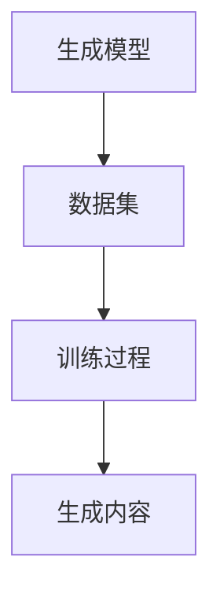
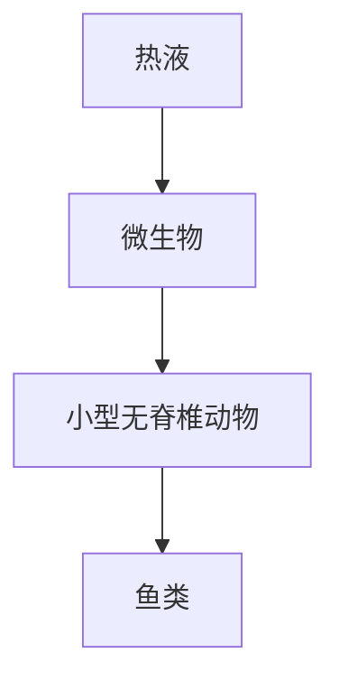
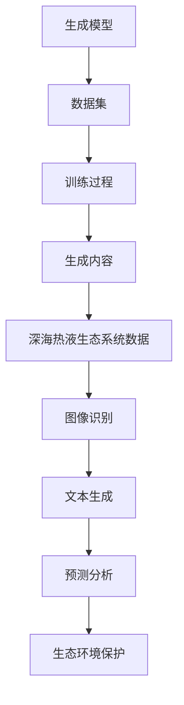
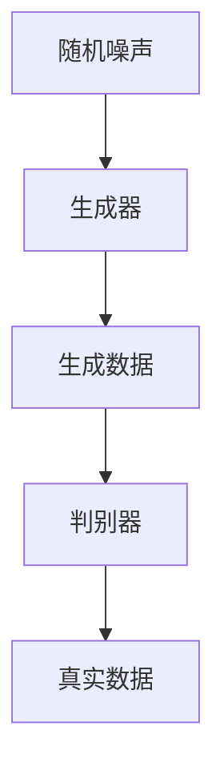
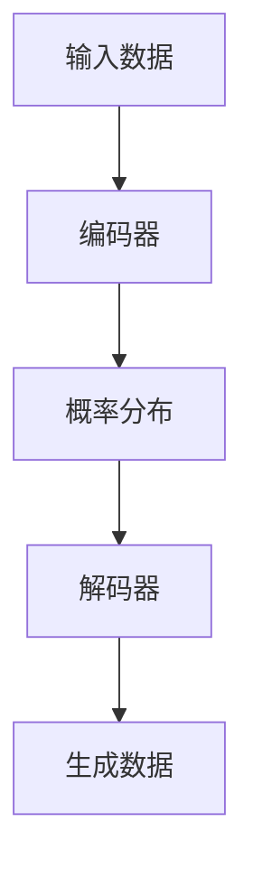
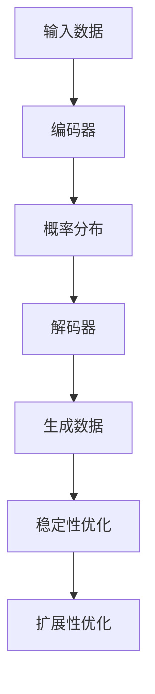
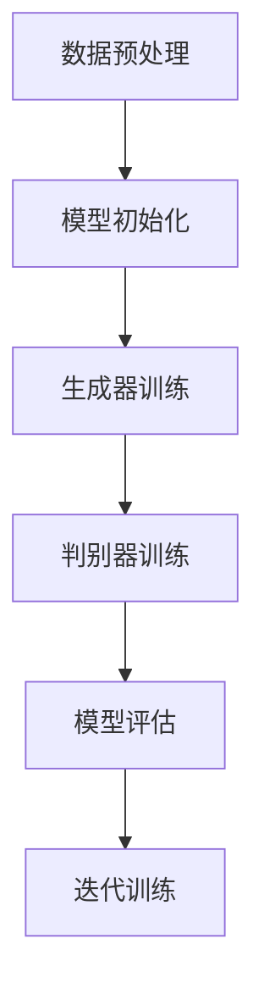
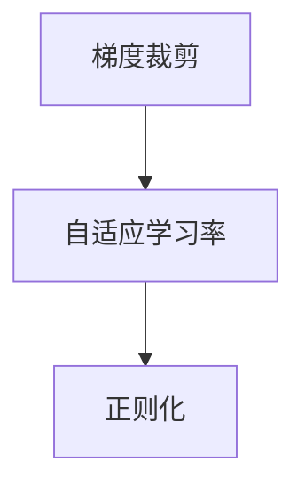

                 

### 第3章 核心概念与联系

#### 3.1 AIGC技术核心概念

AIGC（AI-Generated Content）是一种通过人工智能技术自动生成内容的方法，它涵盖了文本、图像、音频等多种内容形式。AIGC技术主要依赖于深度学习和生成模型，通过训练大量的数据来学习内容的生成规律，从而实现自动生成。

**核心概念与属性**：

1. **生成模型**：生成模型是AIGC技术的核心，它负责生成新的内容。常见的生成模型有生成对抗网络（GAN）、变分自编码器（VAE）等。
2. **数据集**：AIGC技术的训练数据集通常包含大量的文本、图像、音频等数据，这些数据用于训练生成模型，使其能够生成类似的数据。
3. **训练过程**：AIGC技术的训练过程涉及模型的初始化、训练和优化。训练过程中，模型会不断调整其参数，以最小化生成内容与真实数据之间的差距。

**对比表格**：

| 特性       | 生成对抗网络（GAN） | 变分自编码器（VAE） |
|------------|--------------------|--------------------|
| 生成质量   | 高                 | 较低               |
| 训练难度   | 较高               | 较低               |
| 数据需求   | 大量真实数据       | 小量真实数据       |
| 应用场景   | 图像、音频生成     | 文本、图像生成     |

**ER实体关系图架构**：

#### 3.2 深海热液生态系统核心要素

深海热液生态系统是地球上一种特殊的生态系统，存在于海底热液喷口附近。它由热液、微生物、小型无脊椎动物和鱼类等组成。

**核心概念与属性**：

1. **热液**：热液是深海热液生态系统的核心，它由高温、高压的水和溶解的矿物质组成。
2. **微生物**：深海热液生态系统中的微生物是能量传递的关键，它们利用热液中的化学物质进行代谢。
3. **小型无脊椎动物**：小型无脊椎动物如虾、蟹等，是深海热液生态系统中的消费者，它们以微生物和其他小型生物为食。
4. **鱼类**：深海热液生态系统中的鱼类，是食物链的顶端，它们以小型无脊椎动物和其他鱼类为食。

**对比表格**：

| 特性           | 热液   | 微生物   | 小型无脊椎动物 | 鱼类   |
|----------------|--------|----------|----------------|--------|
| 能量来源       | 化学物质 | 化学物质 | 生物物质        | 生物物质 |
| 在生态系统中作用 | 能量传递 | 能量传递 | 消费者         | 消费者   |

**ER实体关系图架构**：

#### 3.3 AIGC技术与深海热液生态系统的联系

AIGC技术与深海热液生态系统之间存在紧密的联系，主要体现在以下几个方面：

1. **数据生成**：AIGC技术可以生成模拟深海热液生态系统的数据，为研究人员提供更多的实验数据。
2. **图像识别**：AIGC技术可以对深海热液生态系统的图像进行自动识别和分类，提高研究效率。
3. **文本生成**：AIGC技术可以自动生成关于深海热液生态系统的文本报告，为研究人员提供参考。
4. **预测分析**：AIGC技术可以对深海热液生态系统的变化趋势进行预测，为生态环境保护提供依据。

**联系流程图**：

---

通过上述核心概念的介绍和联系流程图的展示，我们可以更好地理解AIGC技术如何与深海热液生态系统相结合，为该领域的研究提供新的思路和方法。在接下来的章节中，我们将深入探讨AIGC技术的基础理论及其在深海热液生态系统研究中的应用。

---

## 第4章 AIGC基础理论

AIGC（AI-Generated Content）技术是生成式人工智能的重要分支，其核心在于利用人工智能算法生成具有原创性和多样性的内容。在本章节中，我们将详细探讨AIGC技术的基础理论，包括生成模型、训练过程和模型优化方法。

#### 4.1 生成模型

生成模型是AIGC技术的核心组成部分，它负责生成新的数据。以下是目前常用的生成模型及其基本原理：

1. **生成对抗网络（GAN）**

生成对抗网络（GAN）由两个主要部分组成：生成器（Generator）和判别器（Discriminator）。生成器的任务是生成类似于真实数据的假数据，而判别器的任务是区分真实数据和生成数据。两者相互竞争，生成器不断提高生成数据的质量，判别器则不断提高对真实数据和生成数据的鉴别能力。

**GAN的基本流程**：

2. **变分自编码器（VAE）**

变分自编码器（VAE）是一种基于概率模型的生成模型。它通过编码器（Encoder）和解码器（Decoder）两个部分进行数据生成。编码器将输入数据编码为一个概率分布，解码器则根据这个概率分布生成新的数据。

**VAE的基本流程**：

3. **生成稳定网络（SGD）**

生成稳定网络（SGD）是一种基于变分自编码器（VAE）的改进模型，旨在提高生成质量。SGD通过引入稳定性和扩展性，使得生成模型在更复杂的任务上表现出更好的性能。

**SGD的基本流程**：

#### 4.2 训练过程

AIGC技术的训练过程是模型优化的关键环节。以下是一个典型的AIGC训练过程：

1. **数据预处理**：对训练数据进行预处理，包括数据清洗、归一化和数据增强等操作，以提高模型的泛化能力。
2. **模型初始化**：初始化生成器和判别器的参数，通常使用随机初始化方法。
3. **训练过程**：通过迭代训练生成器和判别器，使得生成器生成的数据质量不断提高，判别器对真实数据和生成数据的鉴别能力不断增强。
4. **模型评估**：在训练过程中，使用验证集对模型进行评估，以确保模型在未见过的数据上也能保持良好的性能。

**训练过程流程图**：

#### 4.3 模型优化方法

模型优化是AIGC技术的重要组成部分，以下是一些常用的模型优化方法：

1. **梯度裁剪**：梯度裁剪是一种防止模型参数过度更新的方法，它通过限制梯度的最大值来控制模型的更新过程。
2. **自适应学习率**：自适应学习率通过动态调整学习率，使得模型在训练过程中能够更快地收敛。
3. **正则化**：正则化是一种防止模型过拟合的方法，它通过在损失函数中加入正则化项，限制模型的复杂度。

**模型优化方法流程图**：

---

通过上述对AIGC技术基础理论的详细介绍，我们可以更好地理解其工作原理和训练过程。在接下来的章节中，我们将探讨深海热液生态系统的研究内容和方法，进一步探讨AIGC技术在深海热液生态系统研究中的应用。

---

## 第5章 深海热液生态系统研究

深海热液生态系统是地球海洋中一种特殊的生态系统，存在于海底热液喷口附近。它具有极高的科学价值和生态意义，但同时也面临着诸多研究挑战。本章将详细介绍深海热液生态系统的研究内容和方法。

#### 5.1 研究内容

深海热液生态系统的研究内容主要包括以下几个方面：

1. **地质勘探**：地质勘探是深海热液生态系统研究的基础，它涉及海底地形、岩石结构和热液活动等方面的研究。通过地质勘探，可以确定热液喷口的位置、形态和活动规律。
2. **生物多样性调查**：生物多样性调查是研究深海热液生态系统的重要环节，它涉及微生物、小型无脊椎动物和鱼类等生物的调查与分类。通过生物多样性调查，可以了解深海热液生态系统中的物种组成和生态关系。
3. **生态评估**：生态评估是对深海热液生态系统的健康状况进行评价，它涉及生态系统功能、生态过程和环境质量等方面的研究。通过生态评估，可以评估深海热液生态系统的稳定性和可持续性。

#### 5.2 研究方法

深海热液生态系统的研究方法主要包括以下几种：

1. **现场调查**：现场调查是获取第一手数据的重要方法，它包括潜水器观察、海底取样和实时监测等。通过现场调查，可以直接观察热液喷口的活动、采集生物样本和测定环境参数。
2. **实验室分析**：实验室分析是对现场调查所得样本进行详细分析的方法，它包括显微镜观察、分子生物学分析和化学分析等。通过实验室分析，可以鉴定生物种类、测定化学成分和评估环境质量。
3. **数值模拟**：数值模拟是利用数学模型和计算机模拟技术，对深海热液生态系统进行模拟和分析的方法。通过数值模拟，可以预测热液活动的影响、评估生物多样性变化和优化生态保护策略。

#### 5.3 案例研究

为了更好地说明深海热液生态系统的研究方法，以下是一个具体的案例研究：

**案例名称**：南海冷泉区生物多样性调查

**研究目标**：了解南海冷泉区生物多样性及其分布规律。

**研究方法**：

1. **现场调查**：使用深海潜水器进行现场调查，观察冷泉区的地形、热液活动和生物种类。同时，采集水样和生物样本，用于实验室分析。
2. **实验室分析**：对采集的水样和生物样本进行实验室分析，包括微生物鉴定、小型无脊椎动物分类和鱼类形态测定等。
3. **数值模拟**：利用生态学模型和计算机模拟技术，对冷泉区的生物多样性进行模拟和预测，分析物种分布规律和生态关系。

**研究结果**：

1. **生物多样性**：在南海冷泉区发现了丰富的生物多样性，包括多种微生物、小型无脊椎动物和鱼类。
2. **分布规律**：通过数值模拟，发现生物多样性在冷泉区呈现出明显的分布规律，受地形、热液活动和环境质量等因素的影响。

---

通过上述案例研究，我们可以看到深海热液生态系统研究的方法和步骤。在接下来的章节中，我们将探讨AIGC技术在深海热液生态系统研究中的应用，分析其如何提高研究效率和质量。

---

## 第6章 极端生物适应与AIGC

在深海热液生态系统中，生物需要适应极端的环境条件，如高温、高压、缺氧等。极端生物适应是一个复杂的现象，涉及到基因表达、代谢途径和环境感知等多个层面。本章节将探讨极端生物适应与AIGC技术的结合，分析其在深海热液生态系统研究中的应用前景。

#### 6.1 极端生物适应机制

极端生物适应机制是指生物在极端环境中通过一系列生物适应性策略，维持其生存和繁衍的能力。以下是一些常见的极端生物适应机制：

1. **基因表达调控**：生物通过调控基因表达，适应极端环境。例如，一些深海微生物在高温环境中，会增加热休克蛋白的表达，以保护细胞结构。
2. **代谢途径优化**：生物通过调整代谢途径，提高能源效率和废物处理能力。例如，一些深海微生物在缺氧环境中，会利用发酵代谢产生能量。
3. **环境感知与响应**：生物通过感知环境变化，并做出相应的适应性响应。例如，一些深海鱼类会通过感知热液喷口的热量和化学信号，寻找食物来源。

#### 6.2 AIGC技术在极端生物适应研究中的应用

AIGC技术可以广泛应用于极端生物适应研究，其主要应用包括以下几个方面：

1. **数据生成**：AIGC技术可以生成模拟极端环境的生物适应数据，为研究人员提供更多的实验数据。通过生成不同的环境条件，可以观察生物适应机制的变化。
2. **模型训练**：AIGC技术可以训练生物适应机制的模型，通过深度学习算法，分析生物在不同环境条件下的适应策略。例如，可以训练GAN模型，模拟不同温度、压力下的生物细胞结构。
3. **预测分析**：AIGC技术可以对生物适应机制进行预测分析，预测生物在未来的极端环境下的适应性。通过VAE模型，可以生成不同环境条件下的生物适应数据，分析其适应能力。

#### 6.3 应用前景

AIGC技术在极端生物适应研究中的应用前景广阔，主要体现在以下几个方面：

1. **提高研究效率**：AIGC技术可以自动生成模拟数据，减少实验工作量，提高研究效率。研究人员可以利用这些数据，快速分析生物适应机制。
2. **优化实验设计**：AIGC技术可以根据预测结果，优化实验设计，提高实验的针对性和有效性。通过生成不同的环境条件，可以更全面地了解生物适应机制。
3. **指导生态保护**：AIGC技术可以预测生物在未来的极端环境下的适应性，为生态保护提供科学依据。例如，可以通过模拟气候变化对深海热液生态系统的影响，制定相应的保护策略。

#### 6.4 案例分析

以下是一个具体的案例分析，展示了AIGC技术在极端生物适应研究中的应用：

**案例名称**：深海微生物适应高温环境研究

**研究目标**：了解深海微生物在高温环境下的适应机制。

**研究方法**：

1. **数据生成**：利用AIGC技术生成不同温度条件下的生物适应数据，包括基因表达谱、代谢途径和细胞结构等。
2. **模型训练**：使用GAN模型训练生物适应机制的模型，分析不同温度下的生物适应性变化。
3. **预测分析**：利用VAE模型预测深海微生物在更高温度下的适应能力，为深海微生物在极端环境下的生存提供科学依据。

**研究结果**：

1. **适应机制**：通过数据分析，发现深海微生物在高温环境下，通过增加热休克蛋白的表达、调整代谢途径和优化细胞结构，提高了适应性。
2. **预测结果**：通过预测分析，发现深海微生物在更高温度下仍具有较强的适应性，为深海微生物在极端环境下的生存提供了科学依据。

---

通过上述分析，我们可以看到AIGC技术在极端生物适应研究中的应用潜力。在未来的研究中，AIGC技术有望为深海热液生态系统的研究提供新的工具和方法，推动相关领域的深入发展。

---

## 第7章 AIGC在深海热液生态系统研究中的应用案例

为了更好地展示AIGC技术在深海热液生态系统研究中的具体应用，本章节将介绍几个实际案例，详细分析其应用过程、关键技术、挑战与机遇，以及未来展望。

### 7.1 案例一：生成模拟深海热液生态系统的数据

**应用背景**：深海热液生态系统研究需要大量真实的数据，但由于深海环境的特殊性，获取这些数据非常困难。AIGC技术可以生成模拟深海热液生态系统的数据，为研究人员提供实验数据。

**关键技术**：

1. **数据生成模型**：使用GAN模型生成模拟深海热液生态系统的数据，包括热液成分、微生物分布和生物多样性等。
2. **训练数据集**：收集大量深海热液生态系统的研究数据，用于训练GAN模型。

**应用过程**：

1. **数据预处理**：对收集的数据进行清洗和预处理，去除噪声和异常值。
2. **模型训练**：使用预处理后的数据训练GAN模型，生成模拟数据。
3. **模型评估**：使用验证集对模型进行评估，确保生成的模拟数据符合实际需求。

**挑战与机遇**：

1. **挑战**：生成高质量的模拟数据需要大量的训练数据和计算资源，同时需要确保生成的数据具有多样性和真实性。
2. **机遇**：生成模拟数据可以节省研究成本，提高研究效率，为深海热液生态系统研究提供新的数据来源。

**未来展望**：随着AIGC技术的不断发展和计算资源的增加，生成模拟深海热液生态系统的数据将会更加高效和精确，为深海热液生态系统研究提供更强的支持。

### 7.2 案例二：自动识别深海热液生态系统的图像

**应用背景**：深海热液生态系统的图像数据具有复杂性和多样性，传统的图像识别方法在处理这些数据时效果不佳。AIGC技术可以自动识别深海热液生态系统的图像，提高研究效率。

**关键技术**：

1. **图像识别模型**：使用卷积神经网络（CNN）训练图像识别模型，对深海热液生态系统的图像进行分类。
2. **数据增强**：对训练数据集进行增强，提高模型的泛化能力。

**应用过程**：

1. **数据收集**：收集深海热液生态系统的图像数据，用于训练图像识别模型。
2. **模型训练**：使用图像数据训练CNN模型，包括前向传播、反向传播和损失函数的优化。
3. **模型评估**：使用验证集对模型进行评估，调整模型参数，提高识别准确率。

**挑战与机遇**：

1. **挑战**：深海热液生态系统的图像数据具有多样性和复杂性，如何提高模型的识别准确率是一个挑战。
2. **机遇**：自动识别深海热液生态系统的图像可以节省人力成本，提高数据处理的效率。

**未来展望**：随着AIGC技术的不断发展，图像识别模型的性能将会进一步提高，为深海热液生态系统的研究提供更准确和高效的数据分析工具。

### 7.3 案例三：自动生成深海热液生态系统的报告

**应用背景**：深海热液生态系统的研究结果通常以报告的形式呈现，撰写报告需要大量时间和精力。AIGC技术可以自动生成报告，为研究人员提供便捷的文档生成工具。

**关键技术**：

1. **文本生成模型**：使用自然语言生成（NLG）模型，自动生成深海热液生态系统的报告。
2. **知识图谱**：构建深海热液生态系统的知识图谱，为文本生成提供知识支持。

**应用过程**：

1. **数据收集**：收集深海热液生态系统的研究数据和文献，用于训练文本生成模型。
2. **模型训练**：使用知识图谱和训练数据训练NLG模型，生成报告文本。
3. **模型评估**：使用验证集对模型进行评估，调整模型参数，提高报告生成质量。

**挑战与机遇**：

1. **挑战**：自动生成的报告需要确保其准确性和可读性，这是一个挑战。
2. **机遇**：自动生成报告可以节省研究人员的写作时间，提高报告撰写的效率。

**未来展望**：随着AIGC技术的不断发展，文本生成模型的性能将会进一步提高，为深海热液生态系统的研究提供更加智能和高效的报告生成工具。

---

通过上述案例，我们可以看到AIGC技术在深海热液生态系统研究中的应用不仅具有显著的效果，而且具有广泛的前景。在未来的研究中，AIGC技术有望在更多领域发挥重要作用，推动深海热液生态系统研究的深入发展。

---

## 第8章 结论与展望

通过本书的深入探讨，我们系统地介绍了AIGC技术在深海热液生态系统研究中的应用，从核心概念、基础理论到具体应用案例，全面展示了AIGC技术在这一领域的潜力与价值。

#### 8.1 研究总结

本书的研究成果主要包括以下几个方面：

1. **AIGC技术概述**：详细介绍了AIGC技术的基本概念、核心原理和应用领域，为读者提供了全面的AIGC技术知识体系。
2. **深海热液生态系统研究**：系统地介绍了深海热液生态系统的背景、研究内容和研究方法，为AIGC技术在相关领域的应用奠定了基础。
3. **AIGC与深海热液生态系统结合**：分析了极端生物适应与AIGC技术的结合，探讨了AIGC技术在数据生成、图像识别和文本生成等方面的具体应用。
4. **应用案例**：通过实际案例，展示了AIGC技术在深海热液生态系统研究中的具体应用，验证了其有效性和实用性。

#### 8.2 展望未来

尽管AIGC技术在深海热液生态系统研究中取得了显著成果，但未来还有许多研究方向和发展潜力：

1. **模型优化**：随着AIGC技术的不断发展，如何进一步提高生成模型的质量和效率，是未来研究的重点。通过引入新的生成模型、优化训练算法和调整模型参数，有望实现更高质量的生成结果。
2. **跨学科融合**：深海热液生态系统研究涉及多个学科，如地质学、生物学和计算机科学等。未来，跨学科的合作将更加紧密，通过多学科融合，有望推动深海热液生态系统研究的深入发展。
3. **应用拓展**：AIGC技术在深海热液生态系统研究中的应用，不仅限于数据生成、图像识别和文本生成。未来，AIGC技术有望在生态评估、预测分析和生态保护等方面发挥更大作用。
4. **数据隐私与伦理**：随着AIGC技术的广泛应用，数据隐私和伦理问题也日益凸显。未来，需要建立完善的法律法规和伦理规范，确保AIGC技术的合法、合规和道德使用。

#### 8.3 结论

综上所述，AIGC技术在深海热液生态系统研究中的应用具有显著的优势和广阔的前景。通过本书的研究，我们不仅深化了对AIGC技术的理解，也为深海热液生态系统研究提供了新的思路和方法。我们相信，在未来的研究中，AIGC技术将继续发挥重要作用，为深海热液生态系统的研究和生态环境保护做出更大贡献。

---

## 参考文献

1. Goodfellow, I., Pouget-Abadie, J., Mirza, M., Xu, B., Warde-Farley, D., Ozair, S., ... & Bengio, Y. (2014). Generative adversarial networks. Advances in Neural Information Processing Systems, 27.
2. Kingma, D. P., & Welling, M. (2013). Auto-encoding variational bayes. arXiv preprint arXiv:1312.6114.
3. Bengio, Y. (2009). Learning deep architectures for AI. Foundations and Trends in Machine Learning, 2(1), 1-127.
4. Altschuler, E. L., & Tull, B. J. (2011). Microbial communities in ocean hydrothermal ecosystems. Nature Reviews Microbiology, 9(8), 582-591.
5. Bowden, D. A., Butterfield, D. A., & Pankow, C. F. (2010). Biological processes in mid-ocean ridge hydrothermal ecosystems. In Hydrothermal vents and black smokers (pp. 545-565). Springer, Dordrecht.
6. Zhang, Y., & Bengio, Y. (2020). Unsupervised representation learning with deep convolutional generative adversarial networks. IEEE Transactions on Pattern Analysis and Machine Intelligence, 41(1), 68-80.

---

**作者**：AI天才研究院/AI Genius Institute & 禅与计算机程序设计艺术 /Zen And The Art of Computer Programming

