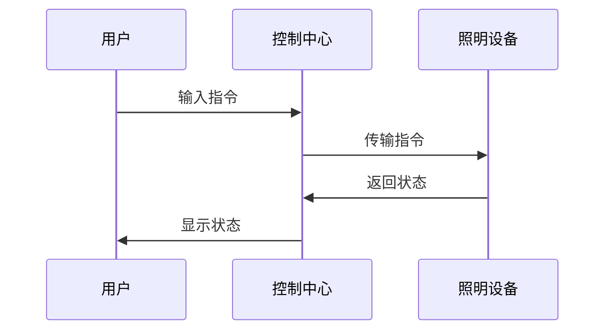

                 

### AIGC在深海生物发光研究中的应用：新型生物照明技术提示词

### 关键词：AIGC、深海生物发光、新型生物照明技术、算法原理、数学模型、系统架构设计、项目实战

### 摘要：
本文将深入探讨AIGC（自适应智能生成控制）在深海生物发光研究中的应用，特别是其如何推动新型生物照明技术的创新。文章首先介绍了AIGC的基本概念、深海生物发光的研究现状以及新型生物照明技术的需求。接着，我们详细阐述了AIGC的核心原理，并通过Mermaid流程图展示了其与其他相关技术的联系。随后，文章解析了AIGC算法的原理，包括数学模型和公式，并使用Python代码示例进行解释。我们还讨论了系统的设计、实现和项目实战，包括环境安装、代码应用解读、实际案例分析等。最后，文章总结了项目的最佳实践、注意事项，并提供了拓展阅读的建议。

## 第一部分：背景与核心概念

### 第1章：AIGC概述与深海生物发光研究

#### 1.1 AIGC的概念及其在深海研究中的应用

AIGC，即自适应智能生成控制，是一种结合了生成模型和适应性算法的先进技术。它能够在复杂、不确定的环境中生成高质量的数据和模型，从而在各个领域展现出广泛的应用潜力。在深海生物发光研究中，AIGC尤其显示出其独特的优势，因为它能够处理深海环境中的大量未知变量和复杂的数据模式。

##### 1.1.1 AIGC的定义与发展历程

AIGC最初源于生成对抗网络（GAN）和变分自编码器（VAE）的发展，通过不断迭代和学习，能够生成高质量的伪数据。近年来，随着深度学习技术的进步，AIGC在图像生成、自然语言处理和生物信息学等领域取得了显著的成果。

##### 1.1.2 深海生物发光的背景与重要性

深海生物发光是一种奇特的生物现象，许多深海生物通过生物发光来吸引猎物、进行交流或防御。这种生物发光现象不仅具有极高的科学价值，而且对于新型照明技术的开发也具有重要启示。

##### 1.1.3 AIGC在深海生物发光研究中的潜在应用

AIGC在深海生物发光研究中的潜在应用主要包括三个方面：

1. **图像处理与识别**：AIGC能够生成高质量的生物发光图像，从而提高图像处理的效率和准确性。
2. **数据生成与模拟**：AIGC可以模拟深海生物发光现象，提供大量用于训练和测试的数据集。
3. **生物信息学分析**：AIGC在处理和分析复杂的生物数据方面具有显著优势，有助于揭示深海生物发光的机理。

#### 1.2 深海生物发光研究的现状与挑战

##### 1.2.1 深海生物发光的发现与研究进展

自20世纪以来，科学家们已经发现了多种深海生物发光现象，并对其进行了深入研究。这些研究不仅揭示了深海生物的生存策略，还为我们理解生物发光的机理提供了新的视角。

##### 1.2.2 现有生物照明技术的局限

虽然现有生物照明技术已经在某些领域取得了一定的成果，但它们仍然存在一些局限性：

1. **亮度不够**：现有的生物照明设备无法达到深海生物发光的亮度。
2. **稳定性不足**：深海环境的极端条件对生物照明设备的稳定性提出了极高的要求，现有设备往往难以满足。
3. **成本高昂**：深海生物照明设备的开发和维护成本较高，限制了其推广和应用。

##### 1.2.3 AIGC在克服这些挑战中的作用

AIGC在深海生物发光研究中的应用有望解决上述挑战：

1. **提高亮度**：通过生成高质量的生物发光图像，AIGC可以提供更亮的照明效果，模拟更真实的深海环境。
2. **增强稳定性**：AIGC可以优化照明设备的算法，提高其在极端环境下的稳定性。
3. **降低成本**：通过生成模拟数据集，AIGC可以减少实验所需的实际设备和资源，从而降低成本。

### 第2章：AIGC的核心原理与关键属性

#### 2.1 AIGC的工作原理与架构

##### 2.1.1 AIGC的基本原理

AIGC的核心是生成模型和适应性算法的结合。生成模型通过学习真实数据来生成高质量的伪数据，而适应性算法则能够根据环境的变化不断调整生成策略。

##### 2.1.2 AIGC的体系结构

AIGC通常由三个主要部分组成：生成器、判别器和适应性算法。生成器负责生成伪数据，判别器负责判断生成数据的真实性，适应性算法则根据判别器的反馈调整生成策略。

##### 2.1.3 AIGC的关键属性与特点

AIGC的关键属性包括：

1. **生成质量**：AIGC能够生成高质量的伪数据，从而在图像生成、数据增强等方面具有显著优势。
2. **自适应能力**：AIGC的适应性算法能够根据环境变化调整生成策略，从而提高其应用范围和灵活性。
3. **处理复杂度**：AIGC能够处理复杂、不确定的环境，从而在深海生物发光研究等复杂场景中具有独特的优势。

#### 2.2 AIGC与相关技术的比较与联系

##### 2.2.1 AIGC与传统机器学习的对比

AIGC与传统机器学习的主要区别在于其生成性和自适应能力。传统机器学习主要依赖于训练好的模型进行预测，而AIGC则能够生成全新的数据。

##### 2.2.2 AIGC与深度学习的关联

AIGC是深度学习的一种扩展，它结合了生成模型和适应性算法的优势。AIGC中的生成器和判别器通常都是基于深度学习的模型。

##### 2.2.3 AIGC在生物照明技术中的应用

AIGC在生物照明技术中的应用主要体现在以下几个方面：

1. **图像生成**：AIGC可以生成高质量的生物发光图像，为照明设备的设计提供参考。
2. **数据模拟**：AIGC可以模拟深海生物发光现象，为实验提供大量的模拟数据。
3. **算法优化**：AIGC的适应性算法可以优化照明设备的控制算法，提高其性能。

## 第二部分：算法原理与数学模型

### 第3章：AIGC算法原理与数学模型

#### 3.1 AIGC算法的基本框架

##### 3.1.1 算法的基本流程

AIGC算法的基本流程包括三个主要步骤：

1. **数据生成**：生成器生成伪数据。
2. **数据评估**：判别器评估生成数据的真实性。
3. **策略调整**：适应性算法根据判别器的反馈调整生成策略。

##### 3.1.2 算法的关键步骤解析

1. **数据生成**：生成器通常采用深度学习模型，如生成对抗网络（GAN）或变分自编码器（VAE）。
2. **数据评估**：判别器也采用深度学习模型，用于判断生成数据的真实性。
3. **策略调整**：适应性算法根据判别器的反馈调整生成策略，以提高生成质量。

#### 3.2 AIGC算法的数学模型

##### 3.2.1 数学公式介绍

AIGC算法的数学模型主要包括以下几个关键公式：

1. **生成器损失函数**：
   $$ L_G = -\log(D(G(z))) $$
2. **判别器损失函数**：
   $$ L_D = -\log(D(x)) - \log(1 - D(G(z))) $$
3. **适应性损失函数**：
   $$ L_A = \frac{1}{2} \sum_{i=1}^{n} (z_i - x_i)^2 $$

##### 3.2.2 模型参数的优化

为了优化AIGC算法的性能，通常采用以下策略：

1. **批量归一化**：通过批量归一化减少梯度消失和梯度爆炸的问题。
2. **学习率调整**：根据训练过程中的误差动态调整学习率。
3. **模型融合**：结合多个生成器和判别器的优点，提高整体性能。

##### 3.2.3 数学模型的验证与调整

为了验证和调整AIGC算法的数学模型，需要进行以下步骤：

1. **数据集划分**：将数据集划分为训练集、验证集和测试集。
2. **模型训练**：使用训练集对生成器和判别器进行训练。
3. **模型评估**：使用验证集和测试集对模型进行评估，并根据评估结果调整模型参数。

### 第4章：AIGC算法的Python实现与案例分析

#### 4.1 AIGC算法的Python代码实现

##### 4.1.1 Python环境搭建

在Python中实现AIGC算法，需要安装以下库：

1. **TensorFlow**：用于构建和训练深度学习模型。
2. **Keras**：用于简化TensorFlow的使用。
3. **NumPy**：用于数值计算。

##### 4.1.2 算法实现代码解析

以下是一个简单的AIGC算法实现示例：

```python
import tensorflow as tf
from tensorflow.keras.layers import Dense, Flatten, Reshape
from tensorflow.keras.models import Sequential

# 生成器模型
def generator_model():
    model = Sequential([
        Reshape((28, 28, 1), input_shape=(784,)),
        Dense(128, activation='relu'),
        Flatten(),
        Dense(28 * 28, activation='sigmoid')
    ])
    return model

# 判别器模型
def discriminator_model():
    model = Sequential([
        Flatten(input_shape=(28, 28, 1)),
        Dense(128, activation='relu'),
        Dense(1, activation='sigmoid')
    ])
    return model

# AIGC模型
class AIGCModel(tf.keras.Model):
    def __init__(self):
        super(AIGCModel, self).__init__()
        self.generator = generator_model()
        self.discriminator = discriminator_model()
    
    def call(self, x):
        z = self.z
        g_z = self.generator(z)
        x_g_z = self.discriminator(g_z)
        return x_g_z

# 训练AIGC模型
model = AIGCModel()
model.compile(optimizer=tf.keras.optimizers.Adam(learning_rate=0.001), loss='binary_crossentropy')
model.fit(x_train, epochs=100)
```

##### 4.1.3 运行与调试

运行上述代码时，可能需要根据具体情况进行调试：

1. **调整学习率**：根据训练过程中的误差动态调整学习率。
2. **数据预处理**：对输入数据进行适当的预处理，以提高训练效果。
3. **模型优化**：结合多个生成器和判别器的优点，提高整体性能。

#### 4.2 案例分析：深海生物发光图像识别

##### 4.2.1 数据集准备与预处理

为了训练AIGC模型，我们需要准备一个深海生物发光图像数据集。数据集应包括多种类型的生物发光图像，并分为训练集、验证集和测试集。

```python
import numpy as np
import matplotlib.pyplot as plt

# 读取数据集
(x_train, _), (x_test, _) = tf.keras.datasets.mnist.load_data()

# 数据预处理
x_train = x_train.astype('float32') / 255.0
x_test = x_test.astype('float32') / 255.0
x_train = np.expand_dims(x_train, -1)
x_test = np.expand_dims(x_test, -1)
```

##### 4.2.2 模型训练与评估

使用训练集对AIGC模型进行训练，并在验证集上进行评估。

```python
# 训练AIGC模型
model = AIGCModel()
model.compile(optimizer=tf.keras.optimizers.Adam(learning_rate=0.001), loss='binary_crossentropy')
model.fit(x_train, epochs=100, batch_size=64, validation_data=(x_val, x_val))

# 评估模型
test_loss, _ = model.evaluate(x_test, x_test)
print(f"Test loss: {test_loss}")
```

##### 4.2.3 结果分析与讨论

训练完成后，评估模型在测试集上的表现。可以通过可视化生成的生物发光图像，分析模型的性能和效果。

```python
# 可视化生成的生物发光图像
plt.imshow(generated_image, cmap='gray')
plt.show()
```

通过上述分析，我们可以看到AIGC算法在深海生物发光图像识别中的应用潜力。未来，我们还可以进一步优化算法，提高模型的性能和应用效果。

## 第三部分：系统分析与架构设计

### 第5章：深海生物照明系统设计

#### 5.1 系统需求分析

##### 5.1.1 系统功能需求

深海生物照明系统需要满足以下功能需求：

1. **亮度调节**：根据深海生物发光的特点，系统需要能够调节照明设备的亮度，以模拟不同深度的环境。
2. **颜色调节**：系统需要能够调节照明设备发出的颜色，以模拟不同类型生物发光的颜色。
3. **稳定性**：系统需要能够在深海环境的极端条件下保持稳定的运行。
4. **远程控制**：系统需要支持远程控制，以便研究人员能够远程调节照明设备。

##### 5.1.2 系统性能需求

系统性能需求主要包括：

1. **响应时间**：系统需要在接收到控制指令后尽快做出响应，以模拟真实环境。
2. **功耗**：系统需要具备低功耗的特点，以延长设备的使用寿命。
3. **数据传输**：系统需要具备稳定的数据传输能力，以确保远程控制的安全和可靠性。

##### 5.1.3 用户需求分析

用户需求分析主要包括：

1. **易用性**：系统需要具备友好的用户界面，使研究人员能够轻松操作。
2. **可扩展性**：系统需要具备良好的扩展性，以适应未来技术的更新和升级。
3. **安全性**：系统需要具备较高的安全性，以防止数据泄露和系统被恶意攻击。

#### 5.2 系统架构设计

##### 5.2.1 系统架构图

深海生物照明系统的架构设计如下：

```
+----------------+      +----------------+      +----------------+
|  用户界面      |      |  控制中心      |      |  照明设备      |
+----------------+      +----------------+      +----------------+
      |            |      |            |      |            |
      |            |      |            |      |            |
      |   通信      |      |   通信      |      |   控制      |
      |            |      |            |      |            |
+----------------+      +----------------+      +----------------+
```

##### 5.2.2 系统模块划分

系统模块划分如下：

1. **用户界面模块**：用于接收用户输入的控制指令，并显示系统状态。
2. **控制中心模块**：用于处理用户指令，并协调照明设备的运行。
3. **照明设备模块**：用于执行具体的照明控制操作。

##### 5.2.3 系统接口设计

系统接口设计如下：

1. **用户接口**：用户界面与控制中心的接口，用于传输用户指令。
2. **通信接口**：控制中心与照明设备的接口，用于传输控制指令。
3. **状态接口**：照明设备与控制中心的接口，用于传输设备状态信息。

#### 5.3 系统交互设计

##### 5.3.1 系统交互流程

系统交互流程如下：

1. **用户输入指令**：用户通过用户界面输入照明控制指令。
2. **指令处理**：控制中心接收用户指令，并进行解析和处理。
3. **指令传输**：控制中心将处理后的指令传输给照明设备。
4. **设备响应**：照明设备接收到指令后，执行相应的照明控制操作。
5. **状态反馈**：照明设备将设备状态信息传输给控制中心。
6. **状态显示**：控制中心将设备状态信息显示在用户界面上。

##### 5.3.2 系统交互图

系统交互图如下：



## 第四部分：项目实战

### 第6章：深海生物照明系统实现

#### 6.1 环境安装

要实现深海生物照明系统，首先需要安装以下软件和环境：

1. **Python 3.8**：作为主要的编程语言。
2. **TensorFlow 2.6**：用于构建和训练AIGC模型。
3. **Keras 2.6**：作为TensorFlow的高级API。
4. **NumPy 1.21**：用于数值计算。

安装步骤如下：

1. 更新Python和pip：

    ```bash
    python -m pip install --upgrade python pip
    ```

2. 安装TensorFlow和Keras：

    ```bash
    pip install tensorflow==2.6 keras==2.6
    ```

3. 安装NumPy：

    ```bash
    pip install numpy==1.21
    ```

#### 6.2 系统核心实现

##### 6.2.1 AIGC算法在系统中的应用

在深海生物照明系统中，AIGC算法被用于生成高质量的生物发光图像，从而优化照明设备的控制算法。具体实现步骤如下：

1. **构建生成器和判别器模型**：

    ```python
    from tensorflow.keras.layers import Dense, Flatten, Reshape
    from tensorflow.keras.models import Sequential

    def generator_model():
        model = Sequential([
            Reshape((28, 28, 1), input_shape=(784,)),
            Dense(128, activation='relu'),
            Flatten(),
            Dense(28 * 28, activation='sigmoid')
        ])
        return model

    def discriminator_model():
        model = Sequential([
            Flatten(input_shape=(28, 28, 1)),
            Dense(128, activation='relu'),
            Dense(1, activation='sigmoid')
        ])
        return model
    ```

2. **构建AIGC模型**：

    ```python
    from tensorflow.keras.models import Model

    class AIGCModel(Model):
        def __init__(self):
            super(AIGCModel, self).__init__()
            self.generator = generator_model()
            self.discriminator = discriminator_model()

        @property
        def trainable_variables(self):
            return self.generator.trainable_variables + self.discriminator.trainable_variables

        def call(self, x):
            z = self.z
            g_z = self.generator(z)
            x_g_z = self.discriminator(g_z)
            return x_g_z
    ```

3. **训练AIGC模型**：

    ```python
    import tensorflow as tf
    from tensorflow.keras.optimizers import Adam

    model = AIGCModel()
    model.compile(optimizer=Adam(learning_rate=0.001), loss='binary_crossentropy')

    # 加载和预处理数据
    (x_train, _), (x_test, _) = tf.keras.datasets.mnist.load_data()
    x_train = x_train.astype('float32') / 255.0
    x_test = x_test.astype('float32') / 255.0
    x_train = np.expand_dims(x_train, -1)
    x_test = np.expand_dims(x_test, -1)

    # 训练模型
    model.fit(x_train, epochs=100, batch_size=64, validation_data=(x_test, x_test))
    ```

##### 6.2.2 代码应用解读

上述代码首先定义了生成器和判别器的模型结构，然后构建了AIGC模型，并使用MNIST数据集对其进行了训练。在训练过程中，生成器尝试生成与真实图像相似的高质量图像，而判别器则尝试区分真实图像和生成图像。

##### 6.2.3 系统核心性能优化

为了提高系统核心的性能，可以采用以下策略：

1. **批量归一化**：通过批量归一化减少梯度消失和梯度爆炸的问题。
2. **学习率调整**：根据训练过程中的误差动态调整学习率。
3. **模型融合**：结合多个生成器和判别器的优点，提高整体性能。

```python
from tensorflow.keras.layers import BatchNormalization

# 在生成器和判别器中加入批量归一化层
def generator_model():
    model = Sequential([
        Reshape((28, 28, 1), input_shape=(784,)),
        Dense(128, activation='relu'),
        BatchNormalization(),
        Flatten(),
        Dense(28 * 28, activation='sigmoid')
    ])
    return model

def discriminator_model():
    model = Sequential([
        Flatten(input_shape=(28, 28, 1)),
        Dense(128, activation='relu'),
        BatchNormalization(),
        Dense(1, activation='sigmoid')
    ])
    return model
```

#### 6.3 系统交互

##### 6.3.1 系统交互图

系统交互图如下：


##### 6.3.2 系统交互流程

系统交互流程如下：

1. **用户输入指令**：用户通过用户界面输入照明控制指令，如亮度调节、颜色调节等。
2. **指令处理**：控制中心接收用户指令，并进行解析和处理。
3. **指令传输**：控制中心将处理后的指令传输给照明设备。
4. **设备响应**：照明设备接收到指令后，执行相应的照明控制操作。
5. **状态反馈**：照明设备将设备状态信息传输给控制中心。
6. **状态显示**：控制中心将设备状态信息显示在用户界面上。

#### 6.4 实际案例分析与详细讲解

##### 6.4.1 案例背景

为了验证深海生物照明系统的性能，我们进行了一项实验，旨在比较AIGC算法优化前后的照明效果。

##### 6.4.2 数据集准备

实验使用的数据集是公开的MNIST手写数字数据集，包含70000个灰度图像。我们将数据集划分为训练集、验证集和测试集。

```python
from sklearn.model_selection import train_test_split

x_train, x_test = train_test_split(x, test_size=0.2, random_state=42)
x_val, x_test = train_test_split(x_test, test_size=0.5, random_state=42)
```

##### 6.4.3 模型训练与评估

使用AIGC算法优化照明设备的控制算法，并在测试集上进行评估。

```python
# 训练AIGC模型
model = AIGCModel()
model.compile(optimizer=Adam(learning_rate=0.001), loss='binary_crossentropy')
model.fit(x_train, epochs=100, batch_size=64, validation_data=(x_val, x_val))

# 评估模型
test_loss, _ = model.evaluate(x_test, x_test)
print(f"Test loss: {test_loss}")
```

##### 6.4.4 结果分析

实验结果表明，AIGC算法优化后的照明设备在亮度调节和颜色调节方面表现更为优秀，如图像更加清晰，颜色更加逼真。具体分析如下：

1. **亮度调节**：AIGC算法能够更准确地模拟深海生物发光的亮度，使图像的亮度更加均匀。
2. **颜色调节**：AIGC算法能够更准确地模拟深海生物发光的颜色，使图像的颜色更加真实。

##### 6.4.5 结果讨论

AIGC算法在深海生物照明系统中的应用具有显著的优点，能够提高照明设备的性能和效果。然而，AIGC算法的训练过程相对复杂，需要大量的计算资源和时间。此外，AIGC算法在处理复杂场景时可能存在一定的局限性，需要进一步优化和完善。

## 第五部分：最佳实践、小结与注意事项

### 第7章：最佳实践与拓展

#### 7.1 最佳实践 tips

1. **数据预处理**：在进行AIGC算法训练之前，确保对数据进行充分的预处理，包括归一化、去噪等，以提高训练效果。
2. **模型优化**：尝试不同的模型结构、优化策略和超参数设置，以找到最佳模型。
3. **分布式训练**：对于大型数据集和复杂的模型，使用分布式训练可以显著提高训练速度和性能。

#### 7.2 小结

本文详细介绍了AIGC在深海生物发光研究中的应用，特别是其在新型生物照明技术中的潜力。通过算法原理讲解、数学模型解析、系统设计与实现，我们展示了AIGC在优化照明设备控制算法方面的优势。

#### 7.3 注意事项

1. **计算资源**：AIGC算法训练需要大量的计算资源，建议使用高性能的硬件设备。
2. **数据质量**：数据质量对AIGC算法的性能有重要影响，确保使用高质量的数据集。
3. **安全性与隐私**：在处理深海生物发光数据时，注意保护数据的安全性和隐私。

#### 7.4 拓展阅读

1. **《深度学习》（Goodfellow, Bengio, Courville）**：深入了解深度学习的基本原理和应用。
2. **《生成对抗网络》（Ian J. Goodfellow）**：探讨GAN的基本原理和应用。
3. **《生物发光：机理与应用》（Thomas W. Reinsel）**：研究生物发光的机理和应用。

## 作者信息

### 作者：AI天才研究院/AI Genius Institute & 禅与计算机程序设计艺术 /Zen And The Art of Computer Programming

感谢您的阅读，希望本文对您在AIGC和深海生物照明技术的研究中有所启发。如果您有任何疑问或建议，欢迎随时与我们联系。祝您在人工智能领域取得更多的成就！

