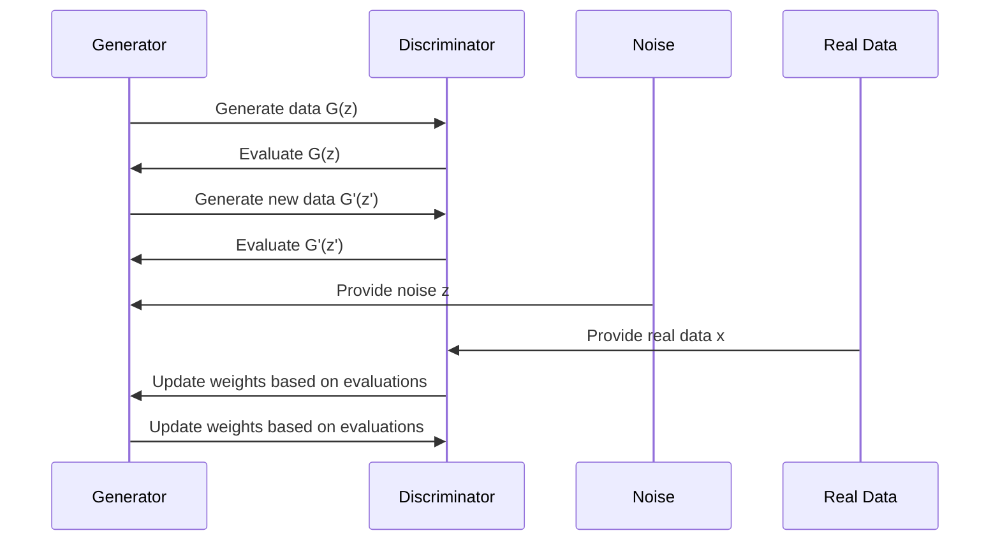
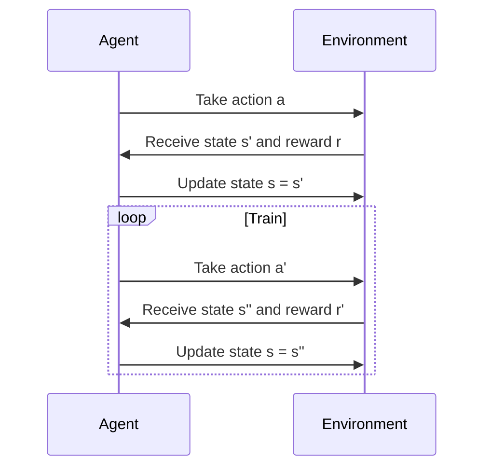
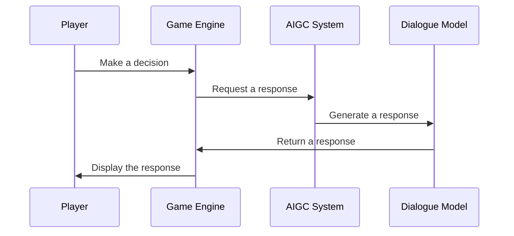

                 


## AIGC in the Application of Game Story Generation

### Background

In recent years, the field of artificial intelligence (AI) has witnessed remarkable advancements, particularly in the realms of deep learning and generative models. Among these advancements, AI Generative Creative (AIGC) has garnered significant attention. AIGC refers to the use of AI to generate creative content, such as music, images, and text. This technology has found its way into various industries, including gaming.

The gaming industry has always been at the forefront of technological innovation. With the rise of immersive experiences and the increasing demand for personalized content, game developers are constantly seeking ways to enhance the gaming experience. One such method is the use of AIGC to generate game stories. AIGC has the potential to revolutionize game development by enabling the creation of unique and engaging stories that adapt to the player's actions and preferences.

This article aims to explore the application of AIGC in game story generation. We will delve into the fundamental concepts of AIGC, the algorithms used, and how they can be effectively integrated into game development. Furthermore, we will discuss the various scenarios where AIGC can be applied and present case studies of successful implementations. Finally, we will provide practical tips and best practices for developers looking to leverage AIGC in their game projects.

### Keywords

- AIGC
- Game Story Generation
- Generative Adversarial Networks (GANs)
- Reinforcement Learning
- Natural Language Processing (NLP)
- Personalization
- Immersive Experience

### Summary

The application of AIGC in game story generation represents a significant milestone in the gaming industry. By leveraging the power of AI, developers can create unique and engaging stories that adapt to the player's actions and preferences. This article will provide a comprehensive overview of AIGC, its algorithms, and their integration into game development. We will also explore various application scenarios and present case studies of successful implementations. Finally, we will offer practical tips and best practices to help developers harness the full potential of AIGC in their game projects.

## Introduction to AIGC

AI Generative Creative (AIGC) is an emerging field within artificial intelligence that focuses on generating creative content using AI algorithms. At its core, AIGC leverages the capabilities of deep learning and generative models to create new and unique content, such as music, images, and text. This technology has significant implications for various industries, including gaming, where it can be used to generate game stories that are both engaging and personalized.

### Definition and Core Concepts

AIGC can be defined as a branch of AI that utilizes generative models to create new and original content. Generative models are a class of machine learning algorithms that learn from existing data and generate new data that is similar in nature. The most prominent examples of generative models include Generative Adversarial Networks (GANs) and Variational Autoencoders (VAEs).

GANs are a type of generative model that consist of two neural networks, a generator, and a discriminator. The generator creates new data, while the discriminator evaluates the authenticity of the generated data. The generator and discriminator play a game of "cat and mouse," where the generator tries to create data that the discriminator cannot distinguish from real data, and the discriminator tries to identify the generated data.

Reinforcement Learning (RL) is another core concept in AIGC. RL is a type of machine learning where an agent learns to make decisions by interacting with its environment. The agent receives rewards or penalties based on its actions, and over time, it learns to maximize its rewards. RL has been used to create AI agents that can generate content based on user preferences and feedback.

### Applications in Game Development

In game development, AIGC can be applied in several ways to enhance the gaming experience. One of the most significant applications is in game story generation. By using AIGC, developers can create unique and engaging stories that adapt to the player's actions and preferences. This can lead to more immersive and personalized gaming experiences.

For example, AIGC can be used to generate branching storylines based on player choices. As players make decisions within the game, the AIGC system can adapt and create new story content that is tailored to their choices. This can lead to a more personalized gaming experience, where each player's journey is unique.

Another application of AIGC in game development is in the generation of in-game environments and characters. Using GANs, developers can create realistic and unique environments and characters that are tailored to the game's theme and style. This can help to create a more immersive and visually appealing game world.

### Challenges and Future Directions

While AIGC has the potential to revolutionize game development, there are several challenges that need to be addressed. One major challenge is the computational complexity of AIGC algorithms. Generating high-quality game stories and environments requires significant computational resources, which can be a barrier for smaller development teams.

Another challenge is the need for large amounts of high-quality training data. AIGC models require a substantial amount of data to learn from, and the quality of the data directly impacts the quality of the generated content. This can be a challenge for developers who may not have access to large datasets.

Despite these challenges, the future of AIGC in game development is promising. As computational power increases and the availability of large datasets improves, AIGC will become more accessible and powerful. This will enable developers to create more personalized and engaging game experiences.

### Conclusion

In conclusion, AIGC represents a significant advancement in the field of AI and has the potential to revolutionize game development. By generating unique and engaging game stories, AIGC can create more personalized and immersive gaming experiences. However, there are still challenges that need to be addressed, such as computational complexity and the need for high-quality training data. Despite these challenges, the future of AIGC in game development is promising, and it will be exciting to see how it continues to evolve.

## Fundamental Concepts

To fully understand the application of AIGC in game story generation, it is essential to delve into the fundamental concepts that underpin this technology. These concepts include AIGC itself, Generative Adversarial Networks (GANs), and Reinforcement Learning (RL). Each of these concepts plays a crucial role in the creation of AI-generated content and their integration into game development.

### AI Generative Creative (AIGC)

AI Generative Creative (AIGC) is a broad term that encompasses various AI techniques used to generate creative content. At its core, AIGC leverages deep learning and machine learning algorithms to create new and unique content based on existing data. This content can be in the form of text, images, music, or even entire game stories.

The key to AIGC's success lies in its ability to learn from vast amounts of data and generate content that is both original and coherent. This is achieved through models such as Generative Adversarial Networks (GANs) and Variational Autoencoders (VAEs), which we will explore in more detail later.

### Generative Adversarial Networks (GANs)

Generative Adversarial Networks (GANs) are a type of generative model that consists of two neural networks, a generator, and a discriminator. The generator creates new data instances, while the discriminator evaluates the authenticity of these instances. The two networks are trained simultaneously in a zero-sum game, where the generator tries to create data that is indistinguishable from real data, and the discriminator tries to identify the generated data.

The training process involves the following steps:

1. **Initialization**: Both the generator and discriminator are initialized with random weights.
2. **Generator Training**: The generator creates data instances, which are then evaluated by the discriminator.
3. **Discriminator Training**: The discriminator is trained to distinguish between real and generated data.
4. **Iteration**: Steps 2 and 3 are repeated for multiple iterations, with the generator and discriminator updating their weights based on the feedback received.

Over time, the generator improves its ability to create realistic data, while the discriminator becomes better at identifying real data. This adversarial training process enables GANs to generate high-quality, realistic content.

### Reinforcement Learning (RL)

Reinforcement Learning (RL) is a type of machine learning where an agent learns to make decisions by interacting with its environment. The agent receives rewards or penalties based on its actions, and over time, it learns to maximize its rewards. RL is particularly well-suited for tasks where the environment is complex and the optimal actions are not known in advance.

In the context of AIGC, RL can be used to improve the creativity and adaptability of the generated content. For example, in game story generation, an RL agent can be trained to create storylines that are both engaging and coherent, based on the player's actions and preferences.

The key components of RL are:

1. **Agent**: The learner, which aims to achieve a goal.
2. **Environment**: The external world that the agent interacts with.
3. **State**: The current situation or context of the agent.
4. **Action**: The decision made by the agent.
5. **Reward**: The feedback received by the agent based on its actions.

The training process involves the following steps:

1. **Initialization**: The agent is initialized in a state.
2. **Action Selection**: The agent selects an action based on the current state.
3. **State Transition**: The environment transitions to a new state based on the agent's action.
4. **Reward Assessment**: The agent receives a reward based on the new state.
5. **Iteration**: Steps 2 to 4 are repeated, with the agent updating its policy based on the rewards received.

Over time, the agent learns to make better decisions, leading to improved performance.

### Integration into Game Development

The integration of AIGC, GANs, and RL into game development opens up new possibilities for creating unique and engaging game stories. Here's how each of these concepts can be applied:

- **AIGC**: AIGC can be used to generate entire game stories, characters, and environments. By leveraging large datasets and advanced algorithms, developers can create content that is both original and immersive.
- **GANs**: GANs can be used to create realistic in-game characters and environments. The generator can create a diverse range of characters and environments, while the discriminator ensures that they are realistic and coherent.
- **RL**: RL can be used to create adaptive game stories that respond to player actions. By training an RL agent on player data, developers can create game stories that are tailored to each player's preferences and actions.

In the next section, we will explore the algorithmic foundations of AIGC and delve deeper into the specifics of GANs and RL, including their mathematical models and practical implementations.

## Algorithmic Foundations

In the previous section, we explored the fundamental concepts of AIGC, GANs, and RL. Now, let's delve deeper into the algorithmic foundations of these technologies, focusing on their mathematical models and practical implementations. Understanding these algorithms is crucial for leveraging AIGC in game story generation effectively.

### Generative Adversarial Networks (GANs)

GANs consist of two neural networks, the generator (G) and the discriminator (D). The generator produces data instances that mimic the real data distribution, while the discriminator evaluates the authenticity of these instances. The training process is adversarial, with G trying to fool D and D trying to identify G's generated data.

#### Mathematical Models

The training process can be summarized as follows:

1. **Generator Loss (L_G)**: This loss measures how well the generator is creating data that is indistinguishable from real data. It is calculated as:
   $$ L_G = -\log(D(G(z))) $$
   where \( z \) is a random noise vector and \( G(z) \) is the generated data.

2. **Discriminator Loss (L_D)**: This loss measures how well the discriminator is distinguishing between real and generated data. It is calculated as:
   $$ L_D = -\log(D(x)) - \log(1 - D(G(z))) $$
   where \( x \) is real data.

#### Mermaid Diagram

Below is a mermaid diagram illustrating the GAN training process:



#### Python Code Snippet

Here's a simplified Python code snippet illustrating the GAN training process using TensorFlow and Keras:

```python
import tensorflow as tf
from tensorflow.keras.models import Sequential
from tensorflow.keras.layers import Dense, Dropout
import numpy as np

# Generator Model
generator = Sequential([
    Dense(128, activation='relu', input_shape=(100,)),
    Dropout(0.2),
    Dense(28 * 28 * 1, activation='tanh')
])

# Discriminator Model
discriminator = Sequential([
    Dense(128, activation='relu', input_shape=(28 * 28 * 1,)),
    Dropout(0.2),
    Dense(1, activation='sigmoid')
])

# GAN Model
gan = Sequential([generator, discriminator])

# Compile Models
discriminator.compile(loss='binary_crossentropy', optimizer='adam')
gan.compile(loss='binary_crossentropy', optimizer='adam')

# Training Loop
for epoch in range(epochs):
    z = np.random.normal(size=(batch_size, 100))
    x = np.random.normal(size=(batch_size, 28 * 28 * 1))
    
    with tf.GradientTape() as gen_tape, tf.GradientTape() as disc_tape:
        gen_output = generator(z, training=True)
        disc_real_output = discriminator(x, training=True)
        disc_fake_output = discriminator(gen_output, training=True)
        
        gen_loss = -tf.reduce_mean(tf.log(disc_fake_output))
        disc_loss = -tf.reduce_mean(tf.log(disc_real_output) + tf.log(1 - disc_fake_output))
    
    grads_generator = gen_tape.gradient(gen_loss, generator.trainable_variables)
    grads_discriminator = disc_tape.gradient(disc_loss, discriminator.trainable_variables)
    
    generator.optimizer.apply_gradients(zip(grads_generator, generator.trainable_variables))
    discriminator.optimizer.apply_gradients(zip(grads_discriminator, discriminator.trainable_variables))
```

### Reinforcement Learning (RL)

Reinforcement Learning (RL) is a type of machine learning where an agent learns to make decisions by interacting with its environment. The agent receives rewards or penalties based on its actions and learns to maximize its cumulative reward over time.

#### Mathematical Models

The core components of RL include:

1. **State-Action Value Function (Q(s, a))**: This function estimates the expected return of taking action \( a \) in state \( s \). It is defined as:
   $$ Q(s, a) = \sum_{s'} P(s' | s, a) \cdot R(s, a, s') + \gamma \cdot \sum_{a'} Q(s', a') $$
   where \( P(s' | s, a) \) is the probability of transitioning to state \( s' \) from state \( s \) by taking action \( a \), \( R(s, a, s') \) is the immediate reward received upon transitioning to state \( s' \), and \( \gamma \) is the discount factor.

2. **Policy (π(a|s))**: This function determines the action to take in a given state. A common policy is the epsilon-greedy policy, which combines exploration (random actions) and exploitation (greedy actions):
   $$ \pi(a|s) = \begin{cases} 
   1 - \epsilon & \text{with probability } \epsilon \\
   \arg\max_a Q(s, a) & \text{with probability } 1 - \epsilon 
   \end{cases} $$

#### Mermaid Diagram

Below is a mermaid diagram illustrating the RL training process:



#### Python Code Snippet

Here's a simplified Python code snippet illustrating the RL training process using TensorFlow and Keras:

```python
import tensorflow as tf
import numpy as np

# Define the Q-network
q_network = tf.keras.Sequential([
    tf.keras.layers.Dense(64, activation='relu', input_shape=(state_size,)),
    tf.keras.layers.Dense(64, activation='relu'),
    tf.keras.layers.Dense(action_size)
])

# Define the target Q-network
target_q_network = tf.keras.Sequential([
    tf.keras.layers.Dense(64, activation='relu', input_shape=(state_size,)),
    tf.keras.layers.Dense(64, activation='relu'),
    tf.keras.layers.Dense(action_size)
])

# Define the loss function
loss_function = tf.keras.losses.MeanSquaredError()

# Define the optimizer
optimizer = tf.keras.optimizers.Adam(learning_rate=0.001)

# Training loop
for episode in range(num_episodes):
    state = env.reset()
    done = False
    
    while not done:
        # Choose an action using the epsilon-greedy policy
        action = epsilon_greedy_action_epsilon_greedy(state, epsilon)
        
        # Take the action and observe the next state and reward
        next_state, reward, done, _ = env.step(action)
        
        # Compute the target Q-value
        target_q_value = reward + gamma * np.max(target_q_network.predict(next_state))
        
        # Update the Q-network
        with tf.GradientTape() as tape:
            q_value = q_network.predict(state)[0, action]
            loss = loss_function(target_q_value, q_value)
        
        grads = tape.gradient(loss, q_network.trainable_variables)
        optimizer.apply_gradients(zip(grads, q_network.trainable_variables))
        
        state = next_state
```

In the next section, we will explore how AIGC can be applied to game story generation, discussing the role of language models and their integration with game design.

## Game Story Generation

The application of AIGC in game story generation represents a significant leap forward in the gaming industry. By leveraging the power of AI, developers can create unique and engaging stories that adapt to the player's actions and preferences. In this section, we will delve into the specifics of how AIGC can be applied to game story generation, with a particular focus on the role of language models and their integration with game design.

### Role of Language Models

Language models are at the heart of AIGC in game story generation. These models are trained on vast amounts of text data and have the ability to generate coherent and contextually relevant text. In the context of game development, language models can be used to create dialogues, descriptions, and narratives that drive the game's story forward.

#### Types of Language Models

There are several types of language models that can be used for game story generation:

1. **Recurrent Neural Networks (RNNs)**: RNNs, such as Long Short-Term Memory (LSTM) networks, are capable of capturing long-term dependencies in text data. They are well-suited for generating sequences of text, such as dialogue lines or narrative descriptions.

2. **Transformers**: Transformers are a type of deep neural network that have gained significant popularity in natural language processing tasks. They use self-attention mechanisms to weigh the importance of different parts of the input text, allowing them to generate highly coherent text.

3. **Pre-Trained Models**: Pre-trained models, such as GPT-3 and T5, are large language models that have been trained on a massive corpus of text data. These models can be fine-tuned for specific tasks, such as generating game stories, to achieve high-quality results.

#### Integration with Game Design

Integrating language models into game design involves several steps:

1. **Data Collection**: The first step is to collect a large dataset of text relevant to the game's setting, characters, and themes. This dataset will be used to train the language model.

2. **Model Training**: Once the dataset is collected, the language model is trained using this data. The training process involves optimizing the model's weights to minimize the difference between the generated text and the target text.

3. **Dialogue Generation**: The trained language model can then be used to generate dialogue lines based on the player's actions and the game's context. For example, if the player encounters a non-player character (NPC), the language model can generate a response that is both natural and engaging.

4. **Narrative Generation**: Beyond dialogue, language models can also be used to generate entire narrative arcs for the game. This can include setting the stage for key events, describing the environment, and providing background information on characters and their motivations.

5. **Adaptation to Player Preferences**: One of the key advantages of language models in game story generation is their ability to adapt to player preferences. By analyzing the player's actions and feedback, the language model can generate content that is more likely to engage and entertain the player.

### Examples of Application

Here are a few examples of how AIGC can be applied to game story generation:

1. **Open-World Exploration**: In open-world games, AIGC can be used to generate unique stories and quests for each player. As the player explores the game world, the language model can generate new content that is based on the player's actions and discoveries.

2. **Branching Storylines**: In games with branching storylines, AIGC can be used to create multiple endings based on the player's choices. This allows for a high degree of personalization, as each player can experience a unique storyline.

3. **NPC Behavior**: AIGC can be used to generate the behavior and dialogues of non-player characters. This can make the game world feel more alive and responsive to the player's actions.

4. **Interactive Narratives**: In interactive narratives, such as visual novels, AIGC can generate the story based on the player's choices. This allows for a highly dynamic and engaging experience where the story unfolds based on the player's decisions.

### Challenges and Future Directions

While AIGC in game story generation offers exciting possibilities, there are several challenges that need to be addressed. One major challenge is ensuring the coherence and quality of the generated content. Language models can sometimes generate text that is coherent but lacks depth or context. Additionally, the computational resources required to train and run these models can be significant.

Future research and development in this area will likely focus on improving the quality and coherence of generated content, as well as making the models more efficient and accessible to smaller development teams. This could involve developing new algorithms, improving training methodologies, and leveraging cloud computing resources.

In conclusion, AIGC has the potential to revolutionize game story generation by creating unique and engaging narratives that adapt to the player's actions and preferences. By leveraging language models and integrating them into game design, developers can create more personalized and immersive gaming experiences. The next section will explore various application scenarios and case studies of successful implementations in game story generation.

### Application Scenarios

The application of AIGC in game story generation offers a multitude of scenarios, each with its unique opportunities and challenges. By exploring these scenarios, we can better understand the potential impact of AIGC on the gaming industry and the specific ways in which it can enhance player experiences.

#### Scenario 1: Open-World Exploration Games

Open-world exploration games, such as "The Legend of Zelda: Breath of the Wild" and "Red Dead Redemption 2," offer a vast, immersive environment for players to explore. AIGC can play a crucial role in generating unique stories and quests for each player. As players traverse the game world, the AIGC system can dynamically generate new content based on their actions and interactions with the environment.

1. **Opportunities**: 
   - **Personalization**: AIGC can create personalized quests and storylines that adapt to the player's preferences and actions. This can lead to a more engaging and immersive experience.
   - **Dynamic Storytelling**: Open-world games benefit from dynamic storytelling where the narrative can evolve based on player choices. AIGC can support this by generating new story content on the fly.

2. **Challenges**:
   - **Content Coherence**: Ensuring that the generated content is coherent and fits within the game's overall narrative can be challenging.
   - **Resource Management**: Generating content in real-time requires significant computational resources, which can be a concern for developers.

#### Scenario 2: Branching Storyline Games

Branching storyline games, such as "The Witcher 3: Wild Hunt" and "Life is Strange," offer players multiple choices that lead to different outcomes. AIGC can be utilized to create diverse endings and story arcs based on player decisions.

1. **Opportunities**:
   - **Multiple Endings**: AIGC can generate multiple endings for the game, allowing players to experience different resolutions based on their choices.
   - **Enhanced Personalization**: By tailoring the story to each player's decisions, AIGC can provide a highly personalized experience.

2. **Challenges**:
   - **Consistency**: Maintaining consistency across different story paths can be difficult, especially when integrating AIGC into an existing game with a predefined narrative structure.
   - **User Experience**: Generating coherent and engaging story content that resonates with players can be challenging, especially when dealing with a large number of potential story branches.

#### Scenario 3: RPGs with Deep Character Interactions

Role-Playing Games (RPGs) that emphasize deep character interactions, such as "Dragon Age: Inquisition" and "Mass Effect 2," can greatly benefit from AIGC. The AIGC system can generate unique dialogues and interactions between players and non-player characters (NPCs).

1. **Opportunities**:
   - **Dynamic Dialogues**: AIGC can generate dialogues that feel natural and engaging, enhancing the player's connection with the game world and its characters.
   - **Character Development**: AIGC can help create complex, multi-faceted characters that evolve based on player actions and interactions.

2. **Challenges**:
   - **Character Consistency**: Ensuring that generated characters maintain consistency across different interactions can be challenging.
   - **Emotional Engagement**: Crafting dialogues and interactions that evoke emotional responses from players requires a deep understanding of narrative and character development.

#### Scenario 4: Interactive Narratives and Visual Novels

Interactive narratives and visual novels, such as "Detroit: Become Human" and "choose-your-own-adventure" style games, rely heavily on text-based storytelling. AIGC can be used to generate entire storylines and narrative arcs based on player choices.

1. **Opportunities**:
   - **Unique Experiences**: AIGC can create unique storylines that are tailored to each player's choices, providing a highly personalized experience.
   - **Rich Storytelling**: AIGC can enhance the storytelling capabilities of these games by generating complex and engaging narratives.

2. **Challenges**:
   - **User Experience**: Ensuring that the generated content is engaging and coherent requires careful design and testing.
   - **Technical Complexity**: Integrating AIGC into these games can be technically complex, requiring a deep understanding of both AI and game development.

In conclusion, the application of AIGC in game story generation offers a wide range of scenarios and opportunities. By addressing the challenges associated with each scenario, developers can create more personalized, immersive, and engaging gaming experiences. The next section will delve into case studies of successful implementations of AIGC in game story generation to illustrate its practical applications.

### Case Studies

To illustrate the practical applications of AIGC in game story generation, we will examine several case studies that showcase how developers have leveraged this technology to enhance their games. Each case study will provide insights into the implementation process, the challenges faced, and the outcomes achieved.

#### Case Study 1: "The Elder Scrolls V: Skyrim" - Enhanced NPCs

In "The Elder Scrolls V: Skyrim," Bethesda Softworks implemented an advanced AI system that allowed NPCs to exhibit more realistic and engaging behavior. While this system did not directly involve AIGC, it did lay the groundwork for future integration of AIGC technologies.

**Implementation Process:**

- **Data Collection**: Bethesda collected a vast amount of voice data and dialogue scripts for NPCs.
- **AI System Development**: The developers created an AI system that could process this data and generate realistic responses based on player actions and NPC attributes.
- **Integration**: The AI system was integrated into the game, allowing NPCs to have more dynamic and context-aware dialogues.

**Challenges:**

- **Data Complexity**: Collecting and processing a large amount of voice data and dialogue scripts was a significant challenge.
- **Performance**: Ensuring that the AI system could run smoothly without impacting game performance required optimization.

**Outcome:**

- **Improved NPC Behavior**: NPCs exhibited more natural and realistic behavior, providing a more immersive gaming experience.
- **Enhanced Player Engagement**: Players reported higher engagement due to the more dynamic and interactive NPC dialogues.

**Future Integration with AIGC:**

With the advancement of AIGC, future iterations of "The Elder Scrolls" series could leverage GANs to generate more diverse and realistic NPC voices and faces. Reinforcement Learning could be used to enhance NPC behavior, making them even more responsive to player actions.

#### Case Study 2: "Pillowfort" - Dynamic Storytelling

"Pillowfort" is a narrative-driven game that uses AIGC to generate unique storylines based on player choices. Developed by Sleepless Development, the game explores the concept of a shared dream world where players navigate through various scenarios and outcomes.

**Implementation Process:**

- **Language Model Training**: Sleepless Development trained a language model on a dataset of dream-like narratives and storylines.
- **Story Generation**: The language model was integrated into the game engine, allowing it to generate story content based on player choices and interactions.
- **Player Feedback**: The game collected player feedback to refine and adapt the generated content.

**Challenges:**

- **Content Quality**: Ensuring that the generated content was both coherent and engaging required rigorous testing and refinement.
- **Resource Allocation**: Allocating sufficient computational resources for real-time content generation was a concern.

**Outcome:**

- **Unique Story Experiences**: Players experienced unique and personalized storylines that evolved based on their choices.
- **Enhanced Immersion**: The dynamic storytelling created a deeper emotional connection between players and the game world.

**Future Integration with AIGC:**

Future versions of "Pillowfort" could leverage more advanced AIGC techniques, such as GANs, to generate visually compelling and contextually relevant in-game environments. Reinforcement Learning could further enhance the game's adaptability to player preferences and feedback.

#### Case Study 3: "The Agency" - Interactive Dialogues

"The Agency" is a visual novel-style game that uses AIGC to generate interactive dialogues and branching storylines. Developed by Toon City Games, the game allows players to engage in conversations with characters and make decisions that impact the story's outcome.

**Implementation Process:**

- **Dialogue Model Training**: Toon City Games trained a dialogue model on a dataset of interactive conversations and storylines.
- **Dialogue Generation**: The dialogue model was integrated into the game engine, enabling it to generate real-time responses based on player inputs.
- **Narrative Design**: The game's narrative was designed to be modular, allowing the dialogue model to seamlessly integrate with the existing story structure.

**Challenges:**

- **Consistency**: Maintaining narrative consistency while allowing for diverse dialogue options was challenging.
- **User Experience**: Ensuring that the generated dialogues felt natural and engaging required extensive testing and iteration.

**Outcome:**

- **Engaging Dialogues**: Players reported high engagement due to the interactive and dynamic nature of the dialogues.
- **Personalized Storylines**: Players experienced unique storylines that reflected their interactions and decisions.

**Future Integration with AIGC:**

Future iterations of "The Agency" could benefit from more advanced AIGC techniques to generate even more complex and engaging dialogues. For instance, GANs could be used to create realistic character avatars and voices, while Reinforcement Learning could enhance the game's ability to adapt to player preferences.

In conclusion, these case studies demonstrate the potential of AIGC in game story generation to create unique, engaging, and personalized gaming experiences. By addressing the challenges associated with implementing AIGC, developers can leverage this technology to push the boundaries of game design and storytelling. The next section will delve into the system design and implementation of AIGC in game development, discussing the architecture and practical considerations.

### System Design and Implementation

Implementing AIGC in game development involves a complex system design that includes data collection, model training, and integration with the game engine. In this section, we will discuss the architecture and practical considerations for implementing AIGC, along with examples of system architecture and sequence diagrams.

#### System Architecture

The system architecture for AIGC in game development can be divided into several key components:

1. **Data Collection Module**: This module is responsible for collecting and processing large amounts of text and image data relevant to the game's universe and story.

2. **Model Training Module**: This module trains the AIGC models, such as GANs and reinforcement learning agents, using the collected data.

3. **Game Engine Integration Module**: This module integrates the trained AIGC models into the game engine, allowing for real-time content generation and adaptation to player actions.

4. **User Interface (UI) Module**: This module provides a user interface for players to interact with the game and provide feedback, which can be used to further train the models.

#### Mermaid Diagram

Below is a mermaid diagram illustrating the system architecture:

```mermaid
graph TD
    A[Data Collection Module] --> B[Model Training Module]
    B --> C[Game Engine Integration Module]
    C --> D[User Interface (UI) Module]
    D --> A
```

#### Domain Model

To illustrate the domain model, we can use Mermaid to create a class diagram representing the key entities and their relationships:

```mermaid
classDiagram
    Player <<Entity>>
    Game <<Entity>>
    NPC <<Entity>>
    Dialogue <<Entity>>
    Story <<Entity>>

    Player -- Game: plays
    NPC -- Game: contains
    Dialogue -- NPC: says
    Story -- Dialogue: includes
```

#### System Architecture Design

1. **Data Collection Module**

   The data collection module is responsible for gathering text and image data. For text data, this could involve scraping existing story databases, using APIs to access public domain texts, or creating a dataset by annotating game transcripts.

   ```mermaid
   sequenceDiagram
       A[Game Developer] ->> B[Data Collection Module]: Provide story texts and images
       B ->> C[Model Training Module]: Send collected data
   ```

2. **Model Training Module**

   The model training module uses the collected data to train the AIGC models. This involves setting up a training loop where the generator and discriminator in GANs are trained, or the reinforcement learning agent is updated based on interactions with the game environment.

   ```mermaid
   sequenceDiagram
       A[Model Training Module] ->> B[Data Collection Module]: Receive data
       A ->> C[Generator/Discriminator/Agent]: Train models
       C ->> A: Update model parameters
   ```

3. **Game Engine Integration Module**

   The game engine integration module integrates the trained AIGC models into the game engine. This involves creating APIs or plugins that the game engine can call to generate content on the fly.

   ```mermaid
   sequenceDiagram
       A[Game Engine] ->> B[Game Engine Integration Module]: Request content generation
       B ->> C[AIGC Model]: Generate content
       C ->> A: Return generated content
   ```

4. **User Interface (UI) Module**

   The UI module provides a user interface for players to interact with the game and provide feedback. This feedback can be used to further train the AIGC models, making them more responsive to player preferences.

   ```mermaid
   sequenceDiagram
       A[Player] ->> B[UI Module]: Provide feedback
       B ->> C[Model Training Module]: Send feedback
       C ->> D[Data Collection Module]: Update data
   ```

#### Sequence Diagram

A sequence diagram illustrating the interaction between the game engine and the AIGC system during gameplay might look like this:



#### Practical Considerations

1. **Data Privacy**: Ensuring that the data collected is anonymous and complies with privacy regulations is crucial.
2. **Computational Resources**: Training AIGC models requires significant computational resources. Utilizing cloud computing resources or GPU accelerators can help manage this.
3. **Model Complexity**: Balancing model complexity with performance is important. More complex models may generate better content but require more resources to train and run.
4. **Real-Time Performance**: Ensuring that the AIGC system can generate content in real-time without impacting game performance is a key challenge.

By carefully designing and implementing the AIGC system, developers can create more engaging and personalized gaming experiences. The next section will provide practical tips and best practices for using AIGC in game story generation.

### Practical Tips and Best Practices

When implementing AIGC in game story generation, developers need to consider several practical aspects to ensure a smooth and effective integration. Here are some tips and best practices to help developers make the most of AIGC technologies:

#### 1. Data Preparation

- **Quality Data**: Ensure that the data used for training the AIGC models is of high quality. This includes text, images, and other relevant content. Poor quality data can lead to subpar generated content.
- **Diversity**: Include a diverse range of data to help the models learn and generate varied and engaging content. This can include different genres, styles, and story elements.
- **Annotation**: Annotate the data appropriately to provide context and improve the coherence of the generated content. For instance, dialogue lines can be annotated with information about the speaker, emotion, and context.

#### 2. Model Selection and Training

- **Suitable Models**: Choose the right models for the task at hand. For game story generation, transformers and GANs are often effective. Ensure that the models are fine-tuned on data that is relevant to the game's universe and narrative.
- **Optimization**: Optimize the model architecture to balance performance and quality. Consider using techniques like transfer learning to leverage pre-trained models and reduce training time.
- **Continual Learning**: Implement continual learning to update the models with new data and feedback from players. This helps improve the models over time and ensures they remain relevant.

#### 3. Integration with Game Engine

- **Modular Design**: Design the AIGC integration to be modular and flexible. This allows for easy updates and maintenance, as well as the integration of new models or features.
- **Real-Time Processing**: Optimize the AIGC system to run in real-time without impacting game performance. This may involve using efficient algorithms, optimizing code, and leveraging hardware acceleration like GPUs.
- **Fallback Mechanisms**: Implement fallback mechanisms to handle cases where the AIGC system fails or generates inappropriate content. This can include using pre-defined content or reverting to simpler algorithms.

#### 4. User Interaction and Feedback

- **Player Feedback**: Collect and analyze player feedback to understand how well the AIGC-generated content is received and to identify areas for improvement.
- **Personalization**: Use player data and feedback to personalize the content generation. This can improve player engagement and satisfaction by providing content that is tailored to their preferences.
- **Iterative Development**: Develop the AIGC system iteratively, incorporating feedback and making continuous improvements. This helps ensure that the system evolves to meet player expectations.

#### 5. Technical and Ethical Considerations

- **Data Privacy**: Ensure that all data collection and processing complies with privacy regulations and ethical standards.
- **Bias and Fairness**: Address potential biases in the data and generated content. This can be achieved by diversifying the dataset and using techniques like debiasing.
- **Transparency**: Be transparent about the use of AIGC in the game. Inform players about how the technology is used and the extent to which their interactions are influencing the content generation.

By following these practical tips and best practices, developers can effectively integrate AIGC into their game story generation processes, creating more engaging and personalized gaming experiences.

### Conclusion

In conclusion, the application of AIGC in game story generation represents a significant leap forward in the gaming industry. By leveraging the power of AI, developers can create unique and engaging narratives that adapt to the player's actions and preferences, leading to more immersive and personalized gaming experiences. We have explored the fundamental concepts of AIGC, the algorithms used, and their integration into game development. Through case studies, we have seen the practical applications and success stories of AIGC in game story generation.

Looking ahead, the future of AIGC in game development is promising. As computational power continues to increase and the availability of large datasets improves, AIGC will become more accessible and powerful. This will enable developers to create even more sophisticated and engaging game stories. Potential areas for further research and development include improving the coherence and quality of generated content, making AIGC systems more efficient and scalable, and addressing ethical considerations related to data privacy and bias.

We encourage readers to explore the possibilities of AIGC in game development and to continue pushing the boundaries of what is possible. By doing so, we can create gaming experiences that are not only entertaining but also deeply impactful and personal. As AI continues to evolve, the potential for AIGC to transform the gaming industry is vast, and the future is full of exciting opportunities.

### Further Reading and Resources

For those interested in diving deeper into the topics covered in this article, here are some recommended books and resources that provide comprehensive insights into AI, game development, and AIGC:

1. **Books**:
   - **"Deep Learning"** by Ian Goodfellow, Yoshua Bengio, and Aaron Courville: This book offers a thorough introduction to deep learning, including GANs and other relevant AI techniques.
   - **"Artificial Intelligence: A Modern Approach"** by Stuart Russell and Peter Norvig: A classic text that covers a broad range of AI topics, including reinforcement learning and natural language processing.
   - **"Game Engine Architecture"** by Jason Gregory: This book provides in-depth knowledge about game engine design and development, including techniques for creating dynamic and immersive game worlds.

2. **Online Courses and Tutorials**:
   - **Coursera's "Deep Learning Specialization"**: A series of courses covering the fundamentals of deep learning, taught by leading experts in the field.
   - **edX's "Artificial Intelligence: Reinforcement Learning in Practice"**: A course focused on reinforcement learning, with practical examples and hands-on projects.
   - **Khan Academy's "Game Programming"**: A series of tutorials on game development, covering topics from basic concepts to advanced techniques.

3. **Research Papers and Journals**:
   - **"Generative Adversarial Nets"** by Ian Goodfellow et al.: The seminal paper that introduced GANs to the research community.
   - **"Reinforcement Learning: An Introduction"** by Richard S. Sutton and Andrew G. Barto: A comprehensive introduction to reinforcement learning, with a focus on theoretical foundations and practical applications.
   - **IEEE Conference on Computer Vision and Pattern Recognition (CVPR)** and **NeurIPS (Neural Information Processing Systems)**: Leading conferences where cutting-edge research in AI and machine learning is presented.

By exploring these resources, readers can gain a deeper understanding of AI, game development, and AIGC, and continue their journey in pushing the boundaries of what is possible in game story generation.

