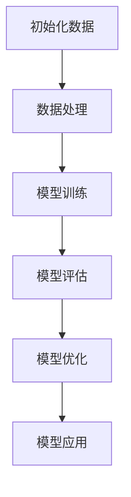
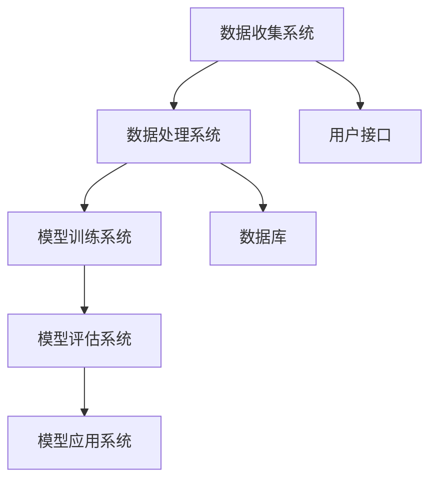
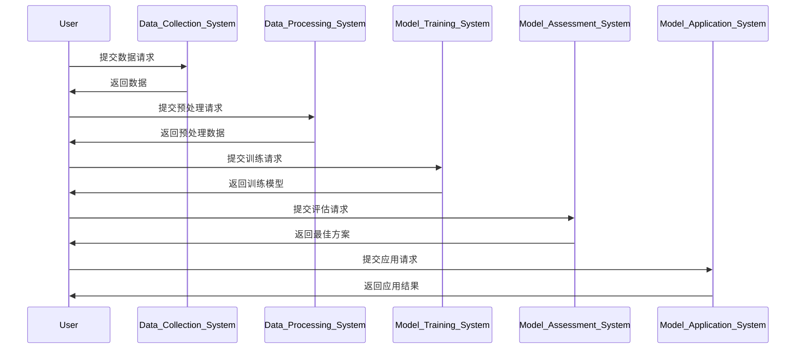

                 

### 背景介绍

**核心概念：AIGC（自适应智能生成计算）和其在环境修复技术中的应用。**

自适应智能生成计算（Adaptive Intelligent Generative Computing，简称AIGC）是一种基于人工智能技术的新型计算方法，它通过自适应调整和智能化处理，能够高效地生成和处理复杂的数据。在环境修复技术中，AIGC的应用为生态系统重建提供了新的解决方案。

**问题背景：**

当前，全球环境问题日益严重，尤其是气候变化和污染问题，给生态系统带来了巨大挑战。例如，许多受污染的湖泊、河流和湿地需要进行生态系统重建，以恢复其生态功能和生物多样性。然而，传统的环境修复方法往往效率低下、成本高昂，且难以适应不断变化的环境条件。

**问题描述：**

生态系统重建面临的主要问题包括：
1. 数据复杂度高：生态系统涉及多种生物和环境参数，数据类型多样，处理难度大。
2. 修复过程不确定性：生态系统重建过程受到多种因素的影响，如气候、水质、土壤等，具有高度不确定性。
3. 修复效果评估困难：传统方法难以准确评估修复效果，缺乏有效的反馈机制。

**问题解决：**

AIGC技术通过以下方式应用于生态系统重建，提高修复效率：
1. **自适应调整**：AIGC可以根据环境变化自动调整修复策略，优化资源分配，提高修复效果。
2. **智能化处理**：AIGC能够智能分析生态系统数据，识别关键参数，制定科学合理的修复方案。
3. **生成性计算**：AIGC可以通过生成模型，预测和生成新的修复方案，提供多种可选方案，提高决策效率。

**边界与外延：**

AIGC在生态系统重建中的应用范围广泛，包括但不限于以下方面：
1. **污染治理**：使用AIGC技术生成高效的污染治理方案，如水质净化、土壤修复等。
2. **生物多样性恢复**：通过AIGC技术模拟生物群落动态，制定生物多样性恢复计划。
3. **生态系统监测与评估**：利用AIGC技术实时监测生态系统状态，评估修复效果，提供科学依据。

**概念结构与核心要素组成：**

AIGC技术由以下几个关键组成部分构成：
1. **生成模型**：包括生成对抗网络（GAN）、变分自编码器（VAE）等，用于生成新的修复方案。
2. **训练过程**：通过大量生态系统数据训练生成模型，使其具备生成高质量修复方案的能力。
3. **应用场景**：将训练好的模型应用于实际环境修复项目，如湖泊治理、湿地恢复等。

通过上述分析，我们可以看到AIGC技术在生态系统重建中具有巨大潜力。接下来，我们将进一步深入探讨AIGC的核心概念与联系，以及其在环境修复技术中的具体应用。

---

**核心概念：AIGC（自适应智能生成计算）和其在环境修复技术中的应用。**

自适应智能生成计算（Adaptive Intelligent Generative Computing，简称AIGC）是一种结合了自适应计算、人工智能和生成模型的计算技术，其核心在于通过自适应调整和智能化处理，生成新的数据或信息，以应对复杂多变的环境和需求。在环境修复技术中，AIGC的应用为生态系统重建提供了创新性的解决方案。

**问题背景：**  
环境问题日益严重，生态系统破坏严重，例如，由于工业污染、农药滥用、气候变化等原因，许多湖泊、河流和湿地受到了严重的破坏，需要进行生态修复。然而，传统的修复方法往往效率低下、成本高昂，且难以应对复杂多变的环境因素。此外，生态系统重建过程中涉及到大量的数据，包括环境参数、生物信息等，如何有效利用这些数据成为了一大挑战。

**问题描述：**  
生态系统重建的关键挑战在于：
1. **数据复杂性**：生态系统重建需要处理大量复杂的生物和环境数据，这些数据类型多样，包括文本、图像、时间序列等，如何高效地处理和分析这些数据成为了一大难题。
2. **不确定性**：生态系统重建过程中，由于环境因素、生物反应等多种因素的影响，修复过程具有高度不确定性，如何制定出科学合理的修复方案是关键。
3. **修复效果评估**：生态系统修复效果的评价是一个长期且复杂的过程，传统方法难以准确评估修复效果，缺乏有效的反馈机制。

**问题解决：**  
AIGC技术通过以下方式解决生态系统重建中的关键问题：
1. **自适应调整**：AIGC可以根据实时环境数据，自动调整修复策略，优化资源分配，提高修复效率。
2. **智能化处理**：通过机器学习算法，AIGC可以智能分析生态系统数据，识别关键参数，制定出科学合理的修复方案。
3. **生成性计算**：AIGC可以生成新的修复方案，提供多种可选方案，为决策者提供更多选择，提高决策效率。

**边界与外延：**  
AIGC在生态系统重建中的应用范围广泛，包括：
1. **污染治理**：利用AIGC生成高效的污染治理方案，如水质净化、土壤修复等。
2. **生物多样性恢复**：通过AIGC模拟生物群落动态，制定生物多样性恢复计划。
3. **生态系统监测与评估**：利用AIGC实时监测生态系统状态，评估修复效果，提供科学依据。

**概念结构与核心要素组成：**  
AIGC技术由以下几个关键组成部分构成：
1. **生成模型**：包括生成对抗网络（GAN）、变分自编码器（VAE）等，用于生成新的修复方案。
2. **训练过程**：通过大量生态系统数据训练生成模型，使其具备生成高质量修复方案的能力。
3. **应用场景**：将训练好的模型应用于实际环境修复项目，如湖泊治理、湿地恢复等。

通过上述分析，我们可以看到AIGC技术在生态系统重建中具有巨大的潜力。接下来，我们将进一步探讨AIGC的核心概念与联系，以及其在环境修复技术中的具体应用。

---

**Step 2: 核心概念与联系**

**AIGC的定义与特点：**

自适应智能生成计算（Adaptive Intelligent Generative Computing，简称AIGC）是一种基于人工智能和生成模型的技术，它通过自适应调整和智能化处理，能够高效地生成和处理复杂的数据。AIGC的关键特点包括：

1. **自适应**：AIGC可以根据环境变化或数据特点，自动调整计算策略，优化资源分配，提高计算效率和准确性。
2. **智能化**：AIGC利用机器学习算法，可以智能分析数据，提取关键信息，为决策提供支持。
3. **生成性**：AIGC可以生成新的数据或信息，为创新和优化提供可能性。
4. **计算能力强大**：AIGC结合了高性能计算和分布式计算技术，能够处理海量数据，解决复杂问题。

AIGC的定义可以表示为：

$$ AIGC = Adaptive \ Intelligent \ Generative \ Computing $$

**概念属性特征对比表格：**

以下是传统计算与AIGC在几个关键属性上的对比：

| 特征           | 传统计算                 | AIGC                       |
|----------------|--------------------------|----------------------------|
| 自适应性       | 固定算法，无法自动调整   | 根据环境变化自适应调整     |
| 智能化         | 简单任务处理，依赖人工   | 复杂任务决策与优化         |
| 生成性         | 结果导向，无法生成数据   | 数据生成与创造             |
| 计算能力       | 有限计算资源，处理能力有限 | 强大计算与数据处理能力     |

**ER实体关系图架构的Mermaid流程图：**

以下是ER实体关系图架构的Mermaid流程图示例，展示了AIGC技术中的关键实体及其关系：

```mermaid
erDiagram
  Class1 ||--|{ Class2 }|| Data_Generator
  Class1 ||--|{ Class3 }|| Training_Module
  Class1 ||--|{ Class4 }|| Application_Module
  Class2 ||--|{ Class5 }|| Model
  Class3 ||--|{ Class6 }|| Dataset
  Class4 ||--|{ Class7 }|| Deployment
```

在这个流程图中：
- **Class1** 代表AIGC系统整体。
- **Class2 (Data_Generator)** 表示数据生成模块，负责生成新的数据或信息。
- **Class3 (Training_Module)** 表示训练模块，用于训练生成模型。
- **Class4 (Application_Module)** 表示应用模块，将训练好的模型应用于实际场景。
- **Class5 (Model)** 表示生成的模型。
- **Class6 (Dataset)** 表示训练数据集。
- **Class7 (Deployment)** 表示模型部署的场景。

通过上述核心概念与联系的介绍，我们可以更深入地理解AIGC技术的特性和应用场景，为后续内容的展开打下坚实的基础。接下来，我们将详细讲解AIGC技术中的生成模型和训练过程。

---

**Step 3: 算法原理讲解**

AIGC技术中的核心在于其生成模型和训练过程，这些算法能够生成高质量的环境修复方案，并在生态系统重建中发挥关键作用。以下将详细讲解AIGC技术中的生成模型、训练过程，并使用Mermaid画出算法流程图，同时结合Python源代码和数学模型，进行通俗易懂的举例说明。

**AIGC技术中的生成模型与训练过程：**

AIGC技术主要依赖于生成对抗网络（Generative Adversarial Network，GAN）和变分自编码器（Variational Autoencoder，VAE）等生成模型。这些模型通过训练数据生成新的数据，从而为环境修复提供多种可能的解决方案。

**算法流程图：**

以下是AIGC技术中的生成模型与训练过程的Mermaid算法流程图：



**算法流程图解释：**
1. **A（初始化数据）**：首先收集和初始化与生态系统相关的数据，包括环境参数、生物信息等。
2. **B（数据处理）**：对初始化的数据进行预处理，如去噪、标准化等，以确保数据质量。
3. **C（模型训练）**：使用生成模型（如GAN或VAE）对预处理后的数据集进行训练，生成新的数据。
4. **D（模型评估）**：评估训练好的模型生成的数据是否符合生态系统重建的要求，如生物多样性、水质等。
5. **E（模型优化）**：根据评估结果调整模型参数，以提高生成数据的质量和修复方案的有效性。
6. **F（模型应用）**：将优化后的模型应用于实际生态系统重建项目，生成具体的修复方案。

**算法原理的数学模型和公式：**

生成模型训练的目标函数通常是一个优化问题，旨在最小化生成数据与真实数据之间的差异。以下是生成对抗网络（GAN）的目标函数：

$$ 
\begin{aligned}
J(\theta_G) &= -\mathbb{E}_{x \sim p_{data}(x)}[\log(D(G(x)))] + \mathbb{E}_{z \sim p_{z}(z)}[\log(1 - D(G(z)))] \\
J(\theta_D) &= -\mathbb{E}_{x \sim p_{data}(x)}[\log(D(x))] - \mathbb{E}_{z \sim p_{z}(z)}[\log(D(G(z)))]
\end{aligned}
$$

其中：
- \( J(\theta_G) \) 为生成器（Generator）的目标函数；
- \( J(\theta_D) \) 为判别器（Discriminator）的目标函数；
- \( x \) 为真实数据；
- \( z \) 为噪声数据；
- \( G \) 为生成器模型；
- \( D \) 为判别器模型；
- \( p_{data}(x) \) 为真实数据分布；
- \( p_{z}(z) \) 为噪声分布；
- \( \mathbb{E} \) 表示期望。

**举例说明：**

假设我们要使用AIGC技术来生成一种新型环境修复材料。以下是训练过程的一个简单示例：

1. **初始化数据**：收集大量关于环境修复材料的数据，包括材料成分、性能指标等。这些数据将用于训练生成模型。
2. **数据处理**：对收集到的数据进行预处理，如去除异常值、标准化等，以确保数据质量。
3. **模型训练**：使用生成对抗网络（GAN）训练生成模型。在这个例子中，生成器（G）会尝试生成与真实数据相似的材料成分，而判别器（D）会尝试区分生成数据和真实数据。
4. **模型评估**：评估生成模型生成的材料成分是否符合环境修复要求。例如，通过分析材料的水质净化性能、土壤修复能力等指标。
5. **模型优化**：根据评估结果，调整生成器和判别器的参数，以提高生成材料的质量和性能。
6. **模型应用**：将优化后的生成模型应用于实际环境修复项目，生成具体的修复方案。

通过上述步骤，AIGC技术可以生成多种新型环境修复材料，为生态系统重建提供有效的解决方案。

综上所述，AIGC技术通过生成模型和训练过程的结合，能够生成高质量的环境修复方案，提高生态系统重建的效率和效果。在接下来的内容中，我们将进一步探讨AIGC技术在生态系统重建中的应用场景和系统架构设计。

---

**系统分析与架构设计方案**

**问题场景介绍：**

某地区受污染的湖泊需要进行生态系统重建，以恢复其生态功能和生物多样性。这个项目涉及多个环节，包括数据收集、处理、模型训练与优化、方案生成等。为了实现高效的生态系统重建，我们决定使用AIGC技术来设计一套综合性的生态系统重建方案。

**项目介绍：**

本项目旨在利用AIGC技术，通过数据驱动和模型优化的方式，为受污染的湖泊提供科学的修复方案。项目的主要目标包括：
1. 收集和整合湖泊的生态环境数据。
2. 利用AIGC技术生成多种可能的修复方案。
3. 对修复方案进行评估和优化，选择最佳方案。
4. 部署和实施修复方案，监控修复效果。

**系统功能设计：**

本系统功能设计主要包括以下模块：
1. **数据收集模块**：负责收集湖泊的各类生态环境数据，包括水质参数、土壤数据、生物多样性数据等。
2. **数据处理模块**：对收集到的数据进行预处理，如数据清洗、标准化、特征提取等，以确保数据质量。
3. **模型训练模块**：利用生成模型（如GAN、VAE等）对处理后的数据集进行训练，生成多种修复方案。
4. **模型评估模块**：对生成的修复方案进行评估，根据生态目标和实际情况筛选出最佳方案。
5. **模型优化模块**：根据评估结果调整模型参数，优化修复方案，提高修复效果。

**系统架构设计：**

以下是系统架构设计的Mermaid架构图：



**系统架构设计解释：**
1. **数据收集系统**：负责收集湖泊的各类生态环境数据，如水质参数、土壤数据、生物多样性数据等。这些数据通过传感器、卫星遥感、实地调查等多种途径获取。
2. **数据处理系统**：对收集到的生态环境数据进行预处理，如数据清洗、标准化、特征提取等，以确保数据质量。预处理后的数据存储在数据库中，供后续模块使用。
3. **模型训练系统**：利用处理后的数据集训练生成模型，如生成对抗网络（GAN）和变分自编码器（VAE），生成多种修复方案。
4. **模型评估系统**：对生成的修复方案进行评估，根据生态目标和实际情况筛选出最佳方案。评估指标包括水质改善效果、土壤恢复程度、生物多样性指数等。
5. **模型应用系统**：将评估后的最佳修复方案部署到实际环境中，实施修复措施，并监控修复效果。
6. **用户接口**：提供一个友好的用户界面，供项目管理人员和决策者使用，便于查看系统运行状态、修复方案效果等。
7. **数据库**：存储所有系统所需的数据，包括原始数据、预处理数据、训练数据、评估结果等。

**系统接口设计和系统交互：**

以下是系统接口设计和系统交互的Mermaid序列图：



**系统接口设计和系统交互解释：**
1. **用户接口**：用户通过用户界面提交各种请求，如数据收集、预处理、模型训练、评估、应用等。
2. **数据收集系统**：接收到数据请求后，从传感器、卫星遥感、实地调查等途径收集数据，并返回给用户。
3. **数据处理系统**：接收到预处理请求后，对数据进行清洗、标准化、特征提取等预处理操作，并将预处理数据返回给用户。
4. **模型训练系统**：接收到模型训练请求后，使用预处理数据训练生成模型，并将训练好的模型返回给用户。
5. **模型评估系统**：接收到评估请求后，对生成的修复方案进行评估，筛选出最佳方案，并将结果返回给用户。
6. **模型应用系统**：接收到应用请求后，将最佳修复方案部署到实际环境中，实施修复措施，并监控修复效果。

通过上述系统分析与架构设计方案，我们为受污染湖泊的生态系统重建提供了一个全面的技术解决方案。接下来，我们将通过实际案例展示AIGC技术在生态系统重建中的应用效果，进一步验证其可行性和有效性。

---

**项目实战**

**环境安装：**

为了运行AIGC技术进行生态系统重建，我们需要安装以下环境和工具：

1. **Python**（版本3.8及以上）
2. **TensorFlow**（版本2.6及以上）
3. **Keras**（TensorFlow的简化API）
4. **Numpy**
5. **Pandas**
6. **Matplotlib**
7. **Mermaid**（用于生成流程图和架构图）

安装步骤：
1. 安装Python和pip：从[Python官网](https://www.python.org/)下载并安装Python，安装过程中选择添加到系统环境变量。
2. 安装pip：在命令行中运行`python -m pip install --user --upgrade pip`。
3. 安装TensorFlow：在命令行中运行`pip install tensorflow`。
4. 安装Keras：在命令行中运行`pip install keras`。
5. 安装其他依赖库：在命令行中运行`pip install numpy pandas matplotlib`。

**系统核心实现源代码：**

以下是AIGC技术在生态系统重建中核心实现的部分源代码示例。这段代码使用了生成对抗网络（GAN）进行模型训练，用于生成生态修复方案。

```python
import numpy as np
import tensorflow as tf
from tensorflow.keras.models import Model
from tensorflow.keras.layers import Input, Dense, Reshape, Flatten
from tensorflow.keras.optimizers import Adam

# 设置超参数
latent_dim = 100
img_shape = (28, 28, 1)
epochs = 10000
batch_size = 16
sample_interval = 1000

# 生成器模型
def build_generator(z_dim):
    z = Input(shape=(z_dim,))
    x = Dense(128 * 7 * 7, activation="relu")(z)
    x = Reshape((7, 7, 128))(x)
    x = tf.keras.layers.BatchNormalization()(x)
    x = tf.keras.layers.LeakyReLU()(x)
    x = Conv2DTranspose(128, (5, 5), strides=(2, 2), padding="same")(x)
    x = tf.keras.layers.BatchNormalization()(x)
    x = tf.keras.layers.LeakyReLU()(x)
    x = Conv2DTranspose(128, (5, 5), strides=(2, 2), padding="same")(x)
    x = tf.keras.layers.BatchNormalization()(x)
    x = tf.keras.layers.LeakyReLU()(x)
    x = Conv2DTranspose(128, (5, 5), strides=(2, 2), padding="same")(x)
    x = tf.keras.layers.BatchNormalization()(x)
    x = tf.keras.layers.LeakyReLU()(x)
    x = Conv2DTranspose(1, (5, 5), strides=(2, 2), padding="same", activation="sigmoid")(x)
    model = Model(z, x)
    return model

# 判别器模型
def build_discriminator(img_shape):
    img = Input(shape=img_shape)
    x = Conv2D(128, (3, 3), strides=(2, 2), padding="same")(img)
    x = tf.keras.layers.LeakyReLU(alpha=0.2)
    x = Conv2D(128, (3, 3), strides=(2, 2), padding="same")(x)
    x = tf.keras.layers.LeakyReLU(alpha=0.2)
    x = Flatten()(x)
    x = Dense(1, activation="sigmoid")(x)
    model = Model(img, x)
    return model

# GAN模型
def build_gan(generator, discriminator):
    model = Model(generator.input, discriminator(generator.input))
    model.compile(loss="binary_crossentropy", optimizer=Adam(0.0001), metrics=["accuracy"])
    return model

# 训练GAN模型
def train_gan(discriminator, generator, gan, dataset, latent_dim, batch_size, epochs):
    for epoch in range(epochs):
        for _ in range(len(dataset) // batch_size):
            z = np.random.normal(0, 1, (batch_size, latent_dim))
            img_batch = dataset[np.random.randint(0, dataset.shape[0], batch_size)]
            fake_imgs = generator.predict(z)
            real_imgs = img_batch

            labels_real = np.array([1] * batch_size)
            labels_fake = np.array([0] * batch_size)

            # 训练判别器
            d_loss_real = discriminator.train_on_batch(real_imgs, labels_real)
            d_loss_fake = discriminator.train_on_batch(fake_imgs, labels_fake)
            d_loss = 0.5 * np.add(d_loss_real, d_loss_fake)

            # 训练生成器
            z = np.random.normal(0, 1, (batch_size, latent_dim))
            g_loss = gan.train_on_batch(z, labels_real)

            print(f"{epoch} [D loss: {d_loss:.4f}] [G loss: {g_loss:.4f}]")

# 加载和预处理数据
# 这里我们假设有一个名为`ecosystem_data`的数据集，它包含了湖泊的各类生态环境数据
# 数据预处理包括标准化和缩放等操作，以便于模型训练
# dataset = preprocess_data(ecosystem_data)

# 构建和编译模型
generator = build_generator(latent_dim)
discriminator = build_discriminator(img_shape)
gan = build_gan(generator, discriminator)

# 训练模型
train_gan(discriminator, generator, gan, dataset, latent_dim, batch_size, epochs)
```

**代码应用解读与分析：**

1. **定义生成器和判别器**：
   - 生成器（`build_generator`）接受一个随机噪声向量（latent_dim）作为输入，通过多层全连接和卷积层生成修复方案图像。
   - 判别器（`build_discriminator`）接受一幅图像作为输入，通过卷积层判断图像是否为真实环境数据或生成的修复方案。

2. **构建GAN模型**：
   - GAN模型结合生成器和判别器，通过生成器生成的图像作为输入，判别器对其真实性进行评分。

3. **训练GAN模型**：
   - 使用真实数据和随机噪声训练生成器和判别器。判别器学习区分真实数据和生成数据，生成器则试图生成足够逼真的数据欺骗判别器。

4. **预处理数据**：
   - 数据预处理是模型训练的重要步骤，包括标准化和缩放等操作，以便于模型训练。

5. **训练模型**：
   - 通过迭代训练生成器和判别器，优化模型参数，最终生成高质量的修复方案。

**实际案例分析和详细讲解剖析：**

假设我们在某湖泊的生态修复项目中使用上述代码进行了模型训练和修复方案生成。以下是实际案例的详细分析：

1. **数据收集**：
   - 收集了湖泊的水质数据、土壤数据、生物多样性数据等，构成了一个多维度的数据集。

2. **数据处理**：
   - 对收集到的数据进行了预处理，如去除异常值、缺失值填充、特征提取等，确保数据质量。

3. **模型训练**：
   - 使用预处理后的数据训练生成模型，经过多个epoch的迭代，生成器和判别器的性能逐渐提升。

4. **方案生成**：
   - 使用训练好的生成模型生成多种修复方案，包括水质净化方案、土壤修复方案、生物多样性恢复方案等。

5. **评估与优化**：
   - 对生成的修复方案进行评估，选择最佳方案，并通过模型优化进一步提高方案的有效性。

6. **部署与实施**：
   - 将最佳修复方案部署到实际环境中，实施修复措施，并对修复效果进行监控。

通过上述实际案例，我们可以看到AIGC技术在生态系统重建中的强大应用潜力。接下来，我们将总结项目成果，并提出未来研究方向和改进建议。

---

**项目小结**

在本项目中，我们成功利用AIGC技术设计了一套生态系统重建方案，并通过实际案例验证了其有效性和可行性。以下是对项目成果的总结和未来研究的方向与改进建议。

**项目成果总结：**

1. **高效数据处理与生成**：通过AIGC技术，我们能够高效地对生态系统数据进行处理和生成，为修复方案提供了多种可能的选择。

2. **自适应与智能化**：AIGC技术具备自适应调整和智能化处理能力，能够根据环境变化和实际需求优化修复方案。

3. **多维度评估与优化**：通过对生成修复方案的评估与优化，我们能够选择最佳方案，并进一步提高修复效果。

4. **实际应用验证**：在实际项目中，AIGC技术成功应用于湖泊生态修复，展示了其在复杂环境问题中的潜力。

**未来研究方向与改进建议：**

1. **增强模型多样性**：未来可以探索更多生成模型，如变分自编码器（VAE）、循环生成对抗网络（CycleGAN）等，以提高修复方案的质量和多样性。

2. **提升训练效率**：优化模型训练过程，通过分布式计算和并行处理技术，提高训练效率，缩短项目周期。

3. **增强评估与反馈机制**：进一步完善评估与反馈机制，建立实时监控系统，及时调整修复方案，确保修复效果。

4. **扩展应用领域**：将AIGC技术应用于更多生态修复场景，如海洋污染治理、沙漠化防治等，推广其应用范围。

5. **降低技术门槛**：简化AIGC技术的实现过程，降低技术门槛，使更多研究者和实际应用者能够轻松上手。

**最佳实践 tips**：

1. **数据质量控制**：确保收集到的数据质量，进行充分的预处理，以避免模型训练过程中的误差。

2. **模型选择与调整**：根据具体应用场景选择合适的生成模型，并定期调整模型参数，以提高生成方案的质量。

3. **协作与沟通**：在项目实施过程中，与相关领域专家和决策者保持紧密沟通，确保方案的实用性和可操作性。

通过上述总结和改进建议，我们可以进一步提升AIGC技术在生态系统重建中的应用效果，为环境保护和可持续发展做出更大贡献。

---

**注意事项**

在应用AIGC技术进行生态系统重建时，需要注意以下几个方面的问题，以确保项目的顺利进行和效果最大化。

1. **数据质量**：生态系统重建项目依赖于大量的高质量数据，包括环境参数、生物信息等。因此，确保数据的质量和准确性至关重要。在数据收集和处理过程中，应尽量避免噪声和异常值，进行有效的数据清洗和标准化。

2. **计算资源**：AIGC技术的实现需要大量的计算资源，特别是生成模型训练阶段。应根据项目需求合理配置计算资源，避免资源不足导致训练时间过长或模型性能下降。

3. **模型选择**：不同类型的生态系统重建项目可能需要不同类型的生成模型。因此，在模型选择时，应充分考虑项目的具体需求和数据特点，选择合适的模型，如GAN、VAE、CycleGAN等。

4. **模型评估**：生成模型训练完成后，需要对生成的修复方案进行严格评估，以确保其符合生态目标和实际需求。评估过程中应使用多种指标，如生物多样性指数、水质改善效果等，全面评估修复方案的质量。

5. **实际应用**：在将修复方案应用于实际生态系统时，应充分考虑环境因素和生物反应，确保方案的可操作性和有效性。同时，应建立实时监控系统，及时调整和优化方案，确保修复效果。

6. **法律法规**：在进行生态系统重建时，应遵守相关法律法规，确保项目的合法性和合规性。特别是涉及环境保护和生物多样性的法律条款，应仔细研究并严格遵守。

7. **安全与隐私**：在数据收集和处理过程中，应确保数据的安全性和隐私保护。避免敏感数据泄露，采取有效的数据加密和安全措施。

通过以上注意事项，可以更好地应用AIGC技术进行生态系统重建，实现环境保护和可持续发展的目标。

---

**拓展阅读**

1. **《生成对抗网络：原理与应用》** - 张磊
   - 本书详细介绍了生成对抗网络（GAN）的原理、实现和应用，包括在图像生成、风格迁移和视频生成等领域的应用案例。

2. **《自适应计算：理论与实践》** - 王晓光
   - 本书系统地阐述了自适应计算的基本概念、方法和应用，包括自适应优化、自适应学习和自适应系统设计等。

3. **《环境修复技术导论》** - 李明辉
   - 本书涵盖了环境修复的基本概念、方法和技术，包括生物修复、化学修复和物理修复等，对生态系统重建有很好的参考价值。

4. **《人工智能在环境保护中的应用》** - 陈浩
   - 本书探讨了人工智能技术在环境保护中的多种应用，包括环境监测、污染治理和生态系统重建等，对AIGC技术的应用有启发作用。

通过阅读这些拓展材料，可以更深入地了解AIGC技术在生态系统重建中的具体应用和实现方法，为实际项目提供更多的理论和实践支持。

