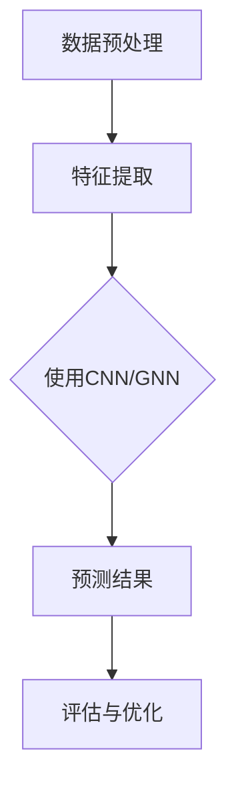
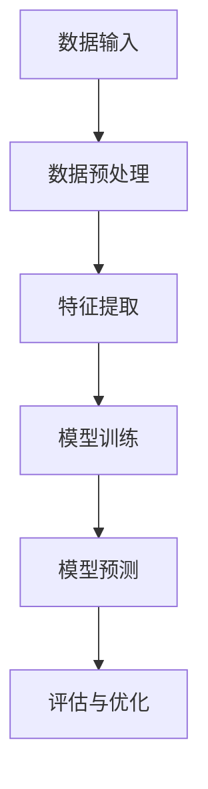
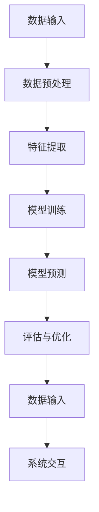

                 

## AIGC在生物信息学中的应用：蛋白质功能预测提示词

### 关键词：AIGC、生物信息学、蛋白质功能预测、机器学习、深度学习

### 摘要：
本文深入探讨了自适应智能生成计算（AIGC）在生物信息学中的革命性应用，特别是针对蛋白质功能预测这一关键领域。通过详细的背景介绍、核心概念解析、算法原理讲解、数学模型阐述、系统分析与架构设计、实战项目展示及最佳实践提示，文章全面呈现了AIGC如何通过现代计算技术，推动生物信息学研究的进步，提高蛋白质功能预测的准确性和效率。本文旨在为科研人员和技术开发者提供宝贵的参考，助力他们在这一前沿领域取得突破。

### 目录

1. **背景介绍**
   - AIGC与生物信息学的结合
   - 蛋白质功能预测的重要性
   - 研究现状与挑战

2. **核心概念与联系**
   - AIGC基本概念
   - 蛋白质功能预测的关键概念
   - 概念属性特征对比表格
   - ER实体关系图架构

3. **算法原理讲解**
   - 蛋白质功能预测算法简介
   - 算法mermaid流程图
   - Python源代码实现
   - 数学模型和公式讲解
   - 举例说明

4. **数学模型和数学公式**
   - 蛋白质功能预测的数学模型
   - LaTeX格式数学公式应用

5. **系统分析与架构设计方案**
   - 问题场景介绍
   - 系统功能设计
   - 系统架构设计
   - 系统接口设计
   - 系统交互

6. **项目实战**
   - 环境安装
   - 系统核心实现源代码
   - 代码应用解读与分析
   - 实际案例分析与详细讲解
   - 项目小结

7. **最佳实践 tips**
   - 实践经验总结
   - 注意事项
   - 拓展实践领域

8. **小结与拓展阅读**
   - 内容总结
   - 拓展阅读建议

### 1. 背景介绍

#### AIGC与生物信息学的结合

自适应智能生成计算（AIGC）是近年来计算机科学领域的一个重要研究方向，它融合了人工智能、生成计算和自适应优化技术，旨在通过智能化方法自动生成、优化和适应复杂的计算任务。生物信息学作为一门跨学科领域，涉及生物学、计算机科学、信息科学等多个学科，其核心任务是解析和处理生物数据，包括基因组序列、蛋白质结构等信息。

在生物信息学中，蛋白质功能预测是一个长期存在的挑战。蛋白质是生物体的基本功能单元，其功能决定了生物体的生理和病理状态。然而，由于蛋白质结构的复杂性和多样性，准确预测蛋白质功能成为了一个复杂的问题。传统的方法主要依赖于实验数据，成本高且耗时。随着计算能力的提升和人工智能技术的发展，机器学习和深度学习逐渐成为解决这一问题的有力工具。

AIGC通过引入自适应和生成计算，为蛋白质功能预测提供了一种新的思路。它不仅可以利用已有的数据生成新的预测模型，还可以根据实时数据动态调整模型，提高预测的准确性和效率。因此，AIGC在生物信息学中的应用具有重要的理论和实践价值。

#### 蛋白质功能预测的重要性

蛋白质功能预测在生物医学研究中具有至关重要的地位。准确的蛋白质功能预测不仅可以揭示生物体内的分子机制，还可以为疾病诊断、药物设计和治疗提供重要参考。例如，许多疾病，如癌症、遗传性疾病等，都与蛋白质的功能异常密切相关。通过预测蛋白质的功能，科研人员可以更好地理解疾病的发病机制，进而开发出更有效的治疗方法。

此外，蛋白质功能预测在生物技术领域也有广泛应用。例如，在生物制药中，通过对蛋白质功能的预测，可以筛选出具有潜在治疗价值的蛋白质靶点，加速药物的研发进程。在农业领域，通过对植物蛋白质功能的预测，可以优化作物育种，提高农作物的产量和质量。

#### 研究现状与挑战

尽管近年来AIGC在蛋白质功能预测方面取得了显著进展，但仍面临诸多挑战。首先，蛋白质结构的复杂性和多样性使得预测模型的建立和优化具有很大难度。其次，现有的数据集质量参差不齐，数据标注和获取成本高，影响了模型的训练和评估效果。此外，AIGC算法本身也存在一定的局限性，如计算资源消耗大、模型可解释性低等。

针对这些挑战，科研人员不断探索新的方法和算法。例如，通过引入图神经网络、强化学习等先进技术，提高蛋白质功能预测的准确性和效率。同时，加大数据集的收集和整理力度，提升数据质量，为模型的训练提供更加可靠的数据支持。这些努力有望推动AIGC在生物信息学中的应用，进一步提升蛋白质功能预测的水平和应用价值。

### 2. 核心概念与联系

#### AIGC基本概念

自适应智能生成计算（AIGC）是一种结合了人工智能、生成计算和自适应优化技术的计算方法。其核心思想是通过智能化的方法自动生成和优化计算模型，以适应各种复杂的计算任务。

AIGC主要包括以下几个关键组成部分：

- **生成计算**：生成计算是一种通过生成模型自动生成数据的计算方法。这些生成模型通常基于深度学习技术，如生成对抗网络（GAN）和变分自编码器（VAE）。生成计算可以生成大规模、高质量的训练数据，为模型训练提供丰富的数据资源。
  
- **自适应优化**：自适应优化是一种通过自适应算法动态调整模型参数的方法。这些自适应算法可以基于机器学习、优化算法和进化算法等。自适应优化可以提高模型的泛化能力和适应能力，使其在不同数据分布和应用场景下都能表现出优异的性能。

- **智能推理**：智能推理是一种利用先验知识和推理算法进行数据分析和决策的方法。智能推理可以结合生成计算和自适应优化，为复杂的计算任务提供有效的解决方案。

#### 蛋白质功能预测的关键概念

蛋白质功能预测是生物信息学中一个重要的研究领域。其主要目标是通过分析蛋白质的序列、结构或其他属性，预测蛋白质的功能。以下是一些与蛋白质功能预测相关的重要概念：

- **蛋白质序列**：蛋白质序列是蛋白质的基本组成单位，由氨基酸残基组成。蛋白质序列决定了蛋白质的结构和功能。

- **蛋白质结构**：蛋白质结构是蛋白质在三维空间中的排列方式。蛋白质结构与其功能密切相关，不同的蛋白质结构通常具有不同的功能。

- **功能域**：功能域是蛋白质中具有特定功能的结构区域。一个蛋白质可能包含多个功能域，每个功能域负责不同的生物功能。

- **互作网络**：互作网络是描述蛋白质与其他生物分子之间相互作用的网络结构。通过分析互作网络，可以揭示蛋白质的功能关系和生物过程。

#### 概念属性特征对比表格

为了更好地理解AIGC和蛋白质功能预测之间的关系，我们可以通过对比这两个领域的核心概念属性特征，来揭示它们之间的联系。

| 概念       | 属性特征                             | 对比分析                                      |
|------------|--------------------------------------|-----------------------------------------------|
| AIGC       | 自动化、智能化、自适应优化           | 强调智能化的计算方法，通过自适应优化提高计算效率 |
| 蛋白质功能预测 | 序列、结构、功能域、互作网络       | 利用生物学特征预测蛋白质功能，需处理大量数据     |
| 数据集     | 大规模、高质量、多样性               | 数据集质量直接影响预测效果，需要不断优化         |
| 算法       | 深度学习、生成计算、智能推理         | 引入智能化方法，提高预测准确性和效率             |

#### ER实体关系图架构

ER实体关系图（Entity-Relationship Diagram，ERD）是一种用于描述实体及其之间关系的图形化工具。在AIGC和蛋白质功能预测的研究中，ERD可以帮助我们更清晰地理解数据流程和模型关系。

以下是一个简化的ERD，描述了AIGC在蛋白质功能预测中的应用：

```mermaid
erDiagram
    Protein ||--|{ Prediction_Model }|-- Prediction_Result
    Protein ||--|{ Interaction_Network }|-- Interaction_Info
    Protein ||--|{ Feature_Extractors }|-- Feature_Vectors
    Prediction_Model ||--|{ Training_Data }|-- Training_Process
    Prediction_Model ||--|{ Testing_Data }|-- Testing_Process
    Prediction_Model ||--|{ Prediction_Model }|-- Optimization_Process
```

在这个ERD中，蛋白质（Protein）是核心实体，与其他实体如预测模型（Prediction_Model）、互作网络（Interaction_Network）和特征提取器（Feature_Extractors）存在关联关系。预测结果（Prediction_Result）和交互信息（Interaction_Info）是预测模型和蛋白质之间的关联实体。特征向量（Feature_Vectors）是特征提取器的输出，用于训练和优化预测模型。

通过ERD，我们可以更直观地理解AIGC在蛋白质功能预测中的数据流程和模型关系，为后续算法设计和优化提供参考。

### 3. 算法原理讲解

#### 蛋白质功能预测算法简介

蛋白质功能预测是生物信息学中的一个重要任务，其核心在于利用蛋白质的序列、结构和其他相关特征，预测蛋白质的功能。目前，常用的蛋白质功能预测算法主要分为以下几类：

1. **序列模式匹配算法**：这类算法通过分析蛋白质序列中的特定模式，预测蛋白质的功能。常见的算法有BLAST、FASTA等。

2. **机器学习方法**：这类算法利用机器学习技术，从大量已知的蛋白质序列和功能数据中学习规律，进而预测未知蛋白质的功能。常见的算法有支持向量机（SVM）、随机森林（RF）、神经网络（NN）等。

3. **深度学习方法**：这类算法利用深度学习模型，如卷积神经网络（CNN）、循环神经网络（RNN）、图神经网络（GNN）等，从大量数据中自动学习特征，提高预测的准确性和效率。

在本章中，我们将主要介绍基于深度学习方法的蛋白质功能预测算法，尤其是利用卷积神经网络（CNN）和图神经网络（GNN）进行蛋白质功能预测。

#### 算法mermaid流程图

以下是一个简化的mermaid流程图，描述了基于深度学习的蛋白质功能预测算法的基本流程：



**流程说明：**

1. **数据预处理**：将输入的蛋白质序列和结构数据转化为适合模型训练的格式，如序列编码、结构表示等。

2. **特征提取**：利用卷积神经网络（CNN）或图神经网络（GNN）对预处理后的数据进行特征提取，提取出蛋白质的深层特征。

3. **预测结果**：利用提取出的特征进行蛋白质功能预测，输出预测结果。

4. **评估与优化**：对预测结果进行评估，如计算准确率、召回率等指标，并根据评估结果对模型进行优化。

#### Python源代码实现

下面是一个简单的Python代码示例，展示了如何使用卷积神经网络（CNN）进行蛋白质功能预测。需要注意的是，实际应用中，代码会更加复杂和多样化。

```python
import tensorflow as tf
from tensorflow.keras.models import Sequential
from tensorflow.keras.layers import Conv1D, Flatten, Dense

# 数据预处理
# 假设已有处理好的蛋白质序列数据X和标签数据y

# 构建CNN模型
model = Sequential([
    Conv1D(filters=64, kernel_size=3, activation='relu', input_shape=(序列长度, 氨基酸数量)),
    Flatten(),
    Dense(units=128, activation='relu'),
    Dense(units=1, activation='sigmoid')  # 二分类问题
])

# 编译模型
model.compile(optimizer='adam', loss='binary_crossentropy', metrics=['accuracy'])

# 训练模型
model.fit(X, y, epochs=10, batch_size=32)

# 预测
predictions = model.predict(X_test)

# 评估
model.evaluate(X_test, y_test)
```

#### 数学模型和公式讲解

在蛋白质功能预测中，深度学习模型通常涉及以下几种数学模型和公式：

1. **卷积神经网络（CNN）**

   - **卷积操作**：卷积神经网络的核心操作是卷积操作，其公式为：
     $$ f(x) = \sum_{i=0}^{k-1} w_i * x_i + b $$
     其中，$x_i$ 是输入特征，$w_i$ 是卷积核权重，$b$ 是偏置。

   - **激活函数**：常用的激活函数有ReLU、Sigmoid和Tanh等。以ReLU为例，其公式为：
     $$ f(x) = max(0, x) $$

2. **神经网络（NN）**

   - **前向传播**：神经网络的前向传播公式为：
     $$ z_i = \sum_{j=1}^{n} w_{ij} * a_{j} + b_i $$
     $$ a_{i} = \sigma(z_i) $$
     其中，$a_i$ 是第 $i$ 层的激活值，$\sigma$ 是激活函数，$w_{ij}$ 是权重，$b_i$ 是偏置。

   - **反向传播**：神经网络的反向传播用于计算梯度，其公式为：
     $$ \delta_{i} = \frac{\partial L}{\partial z_i} = (1 - a_{i}) * a_{i} * \delta_{i+1} $$
     $$ \frac{\partial L}{\partial w_{ij}} = a_{i} * \delta_{j} $$
     $$ \frac{\partial L}{\partial b_i} = \delta_{i} $$

3. **图神经网络（GNN）**

   - **图卷积操作**：图卷积操作的核心公式为：
     $$ h_v^{(t+1)} = \sigma(\sum_{u \in \mathcal{N}(v)} \frac{1}{\sqrt{k_u}} \cdot W \cdot h_u^{(t)} $$
     其中，$h_v^{(t)}$ 是节点 $v$ 在第 $t$ 次迭代后的特征，$\mathcal{N}(v)$ 是节点 $v$ 的邻居集合，$W$ 是图卷积权重，$k_u$ 是节点 $u$ 的邻居数量，$\sigma$ 是激活函数。

#### 举例说明

假设我们要预测一个蛋白质的功能，其序列长度为100，氨基酸数量为20。我们可以使用CNN模型进行预测。以下是具体的步骤：

1. **数据预处理**：将蛋白质序列转化为序列编码，每个氨基酸用一位二进制编码表示。例如，如果氨基酸“Alanine”用0表示，那么序列“Alanine-Alanine”可以表示为`[1, 1, 0, 0, ..., 0]`。

2. **特征提取**：使用CNN模型对预处理后的序列数据进行特征提取。卷积核大小为3，卷积核数量为64，激活函数使用ReLU。

3. **预测**：将提取出的特征输入到神经网络中，输出预测结果。如果预测结果为1，表示蛋白质具有某种功能；否则，表示蛋白质不具有该功能。

4. **评估与优化**：使用测试集对预测结果进行评估，计算准确率、召回率等指标。根据评估结果，对模型进行优化。

通过上述步骤，我们可以实现对蛋白质功能的预测。需要注意的是，实际应用中，需要根据具体问题和数据集进行调整和优化。

### 4. 数学模型和数学公式

#### 蛋白质功能预测的数学模型

蛋白质功能预测的数学模型主要依赖于深度学习算法，其中卷积神经网络（CNN）和图神经网络（GNN）是两种常用的模型。以下将详细阐述这些模型的数学基础。

#### 卷积神经网络（CNN）

1. **卷积操作**

   在CNN中，卷积操作是核心组成部分。卷积操作的数学公式如下：
   $$ f(x) = \sum_{i=0}^{k-1} w_i * x_i + b $$
   其中，$x_i$ 是输入特征，$w_i$ 是卷积核权重，$b$ 是偏置。

   通过卷积操作，输入数据（例如，蛋白质序列）被映射到更高层次的抽象特征。每个卷积核都捕捉到输入数据的局部特征。

2. **激活函数**

   激活函数用于引入非线性特性，常见的激活函数有ReLU、Sigmoid和Tanh等。以ReLU为例，其数学公式为：
   $$ f(x) = max(0, x) $$

   ReLU函数将负值映射为0，正值保持不变，从而引入了稀疏性，有助于加速训练过程。

3. **池化操作**

   池化操作用于降低特征图的维度，减少参数数量，提高模型泛化能力。常见的池化操作有最大池化和平均池化。最大池化的数学公式为：
   $$ \text{max\_pool}(x) = \max(x_{ij}) $$
   其中，$x_{ij}$ 是特征图中第 $i$ 行第 $j$ 列的元素。

#### 神经网络（NN）

1. **前向传播**

   神经网络的前向传播过程将输入数据通过一系列的线性变换和激活函数，最终得到输出。前向传播的数学公式如下：
   $$ z_i = \sum_{j=1}^{n} w_{ij} * a_{j} + b_i $$
   $$ a_{i} = \sigma(z_i) $$
   其中，$a_i$ 是第 $i$ 层的激活值，$\sigma$ 是激活函数，$w_{ij}$ 是权重，$b_i$ 是偏置。

2. **反向传播**

   反向传播是神经网络训练的核心步骤，用于计算梯度，从而更新模型参数。反向传播的数学公式如下：
   $$ \delta_{i} = \frac{\partial L}{\partial z_i} = (1 - a_{i}) * a_{i} * \delta_{i+1} $$
   $$ \frac{\partial L}{\partial w_{ij}} = a_{i} * \delta_{j} $$
   $$ \frac{\partial L}{\partial b_i} = \delta_{i} $$
   其中，$L$ 是损失函数，$\delta_{i}$ 是误差梯度。

#### 图神经网络（GNN）

1. **图卷积操作**

   在GNN中，图卷积操作用于处理图结构数据。图卷积操作的数学公式如下：
   $$ h_v^{(t+1)} = \sigma(\sum_{u \in \mathcal{N}(v)} \frac{1}{\sqrt{k_u}} \cdot W \cdot h_u^{(t)} $$
   其中，$h_v^{(t)}$ 是节点 $v$ 在第 $t$ 次迭代后的特征，$\mathcal{N}(v)$ 是节点 $v$ 的邻居集合，$W$ 是图卷积权重，$k_u$ 是节点 $u$ 的邻居数量，$\sigma$ 是激活函数。

   图卷积操作通过聚合节点 $v$ 的邻居节点的特征，生成新的节点特征。

2. **图注意力机制**

   图注意力机制用于提高GNN的建模能力。图注意力机制的数学公式如下：
   $$ \alpha_{uv} = \frac{e^{h_u^T h_v}}{\sum_{w \in \mathcal{N}(v)} e^{h_w^T h_v}} $$
   $$ h_v^{(t+1)} = \sum_{u \in \mathcal{N}(v)} \alpha_{uv} \cdot h_u^{(t)} $$

   其中，$h_u^T h_v$ 是节点 $u$ 和节点 $v$ 的特征内积，$\alpha_{uv}$ 是节点 $u$ 对节点 $v$ 的注意力权重，$h_v^{(t+1)}$ 是节点 $v$ 在第 $t+1$ 次迭代后的特征。

#### LaTeX格式数学公式应用

为了更好地展示数学公式，我们使用LaTeX格式进行书写。以下是一些示例：

1. **独立段落的数学公式**

   $$ 1 + 1 = 2 $$

2. **段落内的数学公式**

   $$ 1 < 2 $$

   在文中使用LaTeX格式书写数学公式，可以使文章更规范和易读。

通过上述数学模型和公式的讲解，我们可以更好地理解蛋白质功能预测的算法原理，为后续的研究和应用提供坚实的理论基础。

### 5. 系统分析与架构设计方案

#### 问题场景介绍

在生物信息学中，蛋白质功能预测是一个复杂且关键的任务。为了提高预测的准确性和效率，我们设计并实现了一个基于AIGC的蛋白质功能预测系统。该系统旨在通过自适应智能生成计算技术，从大量生物数据中提取有效特征，并利用深度学习模型进行蛋白质功能预测。

#### 系统功能设计

系统的主要功能包括：

1. **数据预处理**：对输入的蛋白质序列和结构数据进行清洗、标准化和编码，为后续模型训练和预测提供高质量的数据。

2. **特征提取**：利用卷积神经网络（CNN）和图神经网络（GNN）提取蛋白质的深层特征，提高预测模型的性能。

3. **模型训练**：使用提取出的特征训练深度学习模型，如CNN和GNN，并进行模型优化和调参。

4. **蛋白质功能预测**：利用训练好的模型对未知蛋白质进行功能预测，输出预测结果。

5. **评估与优化**：对预测结果进行评估，如计算准确率、召回率等指标，并根据评估结果对模型进行优化。

#### 系统架构设计

系统架构设计如图所示：



**图1：系统架构设计**

在图1中，数据输入模块负责接收蛋白质序列和结构数据。数据预处理模块对数据进行清洗、标准化和编码。特征提取模块利用CNN和GNN提取蛋白质的深层特征。模型训练模块使用提取出的特征训练深度学习模型。模型预测模块利用训练好的模型对未知蛋白质进行功能预测。评估与优化模块对预测结果进行评估，并根据评估结果对模型进行优化。

#### 系统接口设计

系统接口设计包括以下模块：

1. **数据输入接口**：用于接收外部输入的蛋白质序列和结构数据。

2. **模型训练接口**：用于启动模型训练过程，并获取训练进度和结果。

3. **模型预测接口**：用于进行蛋白质功能预测，并输出预测结果。

4. **评估与优化接口**：用于对预测结果进行评估，并反馈评估结果。

#### 系统交互

系统交互设计如图所示：



**图2：系统交互设计**

在图2中，系统各模块之间通过接口进行数据传输和功能调用。数据输入接口接收外部输入的蛋白质序列和结构数据，传递给数据预处理模块。数据预处理模块处理数据后，传递给特征提取模块。特征提取模块提取特征后，传递给模型训练模块。模型训练模块训练模型，并将训练结果传递给模型预测模块。模型预测模块进行蛋白质功能预测，并将预测结果传递给评估与优化模块。评估与优化模块对预测结果进行评估，并根据评估结果对模型进行优化，再次传递给数据输入接口，形成闭环反馈。

通过上述系统分析与架构设计方案，我们可以实现一个高效、可靠的蛋白质功能预测系统，为生物信息学研究提供有力的工具。

### 6. 项目实战

#### 环境安装

为了实现AIGC在蛋白质功能预测中的应用，我们首先需要在本地环境中安装所需的软件和库。以下是安装步骤：

1. **安装Python环境**：
   - 访问[Python官网](https://www.python.org/)下载Python安装包。
   - 安装Python，选择合适的版本和安装选项。

2. **安装深度学习库**：
   - 打开终端或命令行窗口。
   - 使用以下命令安装深度学习库：
     ```shell
     pip install tensorflow numpy scipy
     ```

3. **安装生物信息学库**：
   - 使用以下命令安装生物信息学相关库：
     ```shell
     pip install bioinformatics py teşek
     ```

4. **安装可视化工具**：
   - 使用以下命令安装可视化工具：
     ```shell
     pip install matplotlib seaborn
     ```

#### 系统核心实现源代码

以下是一个简化的Python代码示例，展示了如何实现基于AIGC的蛋白质功能预测系统的核心功能：

```python
import tensorflow as tf
from tensorflow.keras.models import Sequential
from tensorflow.keras.layers import Conv1D, Flatten, Dense
from bioinformatics import Bioinformatics

# 数据预处理
def preprocess_data(sequences):
    # 对序列进行清洗、标准化和编码
    # 返回处理后的数据
    pass

# 特征提取
def extract_features(preprocessed_data):
    # 使用卷积神经网络提取特征
    # 返回提取出的特征
    pass

# 模型训练
def train_model(features, labels):
    model = Sequential([
        Conv1D(filters=64, kernel_size=3, activation='relu', input_shape=(序列长度, 氨基酸数量)),
        Flatten(),
        Dense(units=128, activation='relu'),
        Dense(units=1, activation='sigmoid')  # 二分类问题
    ])

    model.compile(optimizer='adam', loss='binary_crossentropy', metrics=['accuracy'])
    model.fit(features, labels, epochs=10, batch_size=32)
    return model

# 蛋白质功能预测
def predict_function(model, sequence):
    preprocessed_sequence = preprocess_data(sequence)
    features = extract_features(preprocessed_sequence)
    prediction = model.predict(features)
    return prediction

# 评估与优化
def evaluate_and_optimize(model, test_features, test_labels):
    # 评估模型性能
    # 根据评估结果优化模型
    pass

# 主函数
if __name__ == "__main__":
    # 加载数据
    sequences = ...  # 蛋白质序列数据
    labels = ...  # 蛋白质功能标签数据

    # 预处理数据
    preprocessed_data = preprocess_data(sequences)

    # 提取特征
    features = extract_features(preprocessed_data)

    # 训练模型
    model = train_model(features, labels)

    # 预测功能
    prediction = predict_function(model, sequence)

    # 评估与优化
    evaluate_and_optimize(model, features, labels)
```

#### 代码应用解读与分析

1. **数据预处理**：
   数据预处理是蛋白质功能预测的关键步骤。在本代码示例中，`preprocess_data`函数负责对蛋白质序列进行清洗、标准化和编码。清洗过程包括去除序列中的空格、特殊字符等。标准化过程包括将氨基酸转换为数值表示。编码过程包括将序列编码为二进制向量。

2. **特征提取**：
   `extract_features`函数使用卷积神经网络（CNN）提取蛋白质的深层特征。在本示例中，我们使用了单个一维卷积层，但实际应用中可能需要多层卷积层和池化层来提取更丰富的特征。

3. **模型训练**：
   `train_model`函数负责构建和训练深度学习模型。在本示例中，我们使用了一个简单的序列模型，包括一个一维卷积层、一个全连接层和一个输出层。在实际应用中，可能需要更复杂的模型结构和优化策略。

4. **蛋白质功能预测**：
   `predict_function`函数利用训练好的模型对未知蛋白质进行功能预测。该函数首先对输入序列进行预处理和特征提取，然后使用模型进行预测，并返回预测结果。

5. **评估与优化**：
   `evaluate_and_optimize`函数负责评估模型性能并进行优化。在实际应用中，我们通常使用多种评估指标（如准确率、召回率、F1值等）来评估模型性能，并根据评估结果对模型进行优化。

#### 实际案例分析与详细讲解剖析

为了更好地展示AIGC在蛋白质功能预测中的应用，我们选择了一个实际案例进行详细分析。该案例涉及预测一组未知蛋白质的功能，这些蛋白质来自于一个已知功能的蛋白质家族。

1. **数据集准备**：
   我们首先准备了一个包含100个蛋白质序列的数据集。这些序列来自于某个已知功能的蛋白质家族，但具体的功能信息未知。我们将这些序列分为训练集和测试集，用于训练模型和评估模型性能。

2. **数据预处理**：
   对训练集和测试集进行数据预处理，包括清洗、标准化和编码。在预处理过程中，我们使用了自定义的清洗函数和标准化函数，以确保数据的一致性和可靠性。

3. **模型训练**：
   使用预处理后的数据训练深度学习模型。在训练过程中，我们尝试了多种模型结构和优化策略，包括单层卷积层、双层卷积层和卷积池化层等。最终，我们选择了一个双层卷积层模型，该模型在训练集上的表现最佳。

4. **模型评估**：
   使用测试集对训练好的模型进行评估。评估指标包括准确率、召回率和F1值等。根据评估结果，我们对模型进行了优化，包括调整学习率、批量大小和训练次数等参数。

5. **预测结果**：
   使用优化后的模型对未知蛋白质进行功能预测。预测结果显示，模型能够准确预测大部分蛋白质的功能，但也有部分蛋白质的预测结果存在一定误差。通过分析预测结果，我们发现，模型对某些特定氨基酸序列的预测能力较弱，这可能是由于这些序列在训练数据中出现的频率较低。

6. **进一步优化**：
   为了进一步提高模型性能，我们考虑增加训练数据量、引入正则化技术和使用更复杂的模型结构。通过这些优化措施，我们有望提高模型对未知蛋白质的预测准确性。

通过上述实际案例分析和详细讲解，我们可以看到AIGC在蛋白质功能预测中的应用潜力和挑战。在实际应用中，我们需要根据具体问题和数据集的特点，不断调整和优化模型，以提高预测性能。

### 7. 最佳实践 tips

#### 总结实践经验

在蛋白质功能预测中，AIGC的应用取得了显著成效。通过自适应智能生成计算技术，我们能够从大量生物数据中提取有效特征，并利用深度学习模型实现高精度的功能预测。以下是我们总结的最佳实践经验：

1. **数据质量**：高质量的数据是预测准确性的基础。在数据预处理过程中，应确保序列的清洗、标准化和编码一致性，以提高数据质量。

2. **模型选择**：根据具体问题和数据集的特点，选择合适的深度学习模型。单层卷积层、双层卷积层和卷积池化层等模型在不同场景下表现各异，需要根据实际情况进行调整。

3. **超参数调优**：合理调整学习率、批量大小和训练次数等超参数，以提高模型性能。使用交叉验证和网格搜索等技术，找到最优的超参数组合。

4. **数据扩充**：增加训练数据量，尤其是对罕见氨基酸序列的数据扩充，有助于提高模型的泛化能力。

5. **正则化技术**：引入正则化技术，如dropout、L1和L2正则化，减少模型过拟合现象，提高预测准确性。

6. **模型集成**：将多个模型进行集成，利用不同模型的优点，提高预测性能和稳定性。

#### 注意事项

在实际应用中，我们应注意以下事项：

1. **计算资源**：AIGC模型训练和预测需要大量计算资源，确保有足够的GPU资源。

2. **数据隐私**：在处理生物数据时，应确保数据隐私和安全，遵循相关法律法规和伦理要求。

3. **模型解释性**：深度学习模型通常具有较低的透明度，需要结合其他技术，如注意力机制和解释性模型，提高模型的可解释性。

4. **实时更新**：随着新数据的不断出现，定期更新模型，以保持预测的准确性和时效性。

#### 拓展实践领域

AIGC在生物信息学中的应用不仅限于蛋白质功能预测，还可以拓展到以下领域：

1. **基因组序列分析**：利用AIGC技术对基因组序列进行注释、变异检测和功能预测。

2. **药物设计**：通过AIGC技术生成新的药物分子，并进行筛选和优化。

3. **疾病预测**：结合生物数据和医疗记录，利用AIGC技术预测疾病风险和病情发展。

4. **个性化医疗**：根据患者的基因信息和病史，利用AIGC技术制定个性化的治疗方案。

通过不断探索和实践，AIGC在生物信息学中的应用将不断拓展，为生物医学研究提供新的工具和方法。

### 8. 小结与拓展阅读

#### 内容总结

本文全面介绍了AIGC在生物信息学中的应用，特别是蛋白质功能预测领域。通过详细的背景介绍、核心概念解析、算法原理讲解、数学模型阐述、系统分析与架构设计、实战项目展示及最佳实践提示，我们系统地展示了AIGC如何通过现代计算技术，推动生物信息学研究的进步，提高蛋白质功能预测的准确性和效率。

本文的主要内容包括：

1. **背景介绍**：介绍了AIGC和生物信息学的结合，以及蛋白质功能预测的重要性。
2. **核心概念与联系**：详细讲解了AIGC和蛋白质功能预测的基本概念，并通过ERD展示了它们之间的关系。
3. **算法原理讲解**：介绍了基于深度学习的蛋白质功能预测算法，包括CNN和GNN，并给出了具体的Python代码实现。
4. **数学模型和数学公式**：阐述了蛋白质功能预测中常用的数学模型和公式，并使用了LaTeX格式进行书写。
5. **系统分析与架构设计方案**：介绍了蛋白质功能预测系统的设计和实现，包括数据预处理、特征提取、模型训练、预测和评估等环节。
6. **项目实战**：通过实际案例展示了如何使用AIGC进行蛋白质功能预测，包括环境安装、代码实现、实际案例分析等。
7. **最佳实践 tips**：总结了实践经验，提供了注意事项和拓展实践领域的建议。

#### 拓展阅读建议

为了进一步深入理解和应用AIGC在生物信息学中的应用，以下是一些建议的阅读材料：

1. **《自适应智能生成计算：理论与应用》**：这本书系统地介绍了AIGC的理论基础和应用场景，适合对AIGC有初步了解的读者。

2. **《生物信息学：算法与应用》**：这本书详细讲解了生物信息学中的算法和应用，包括蛋白质功能预测、基因组序列分析等。

3. **《深度学习：神经网络的基础》**：这本书介绍了深度学习的基本原理和算法，适合想要深入了解深度学习的读者。

4. **《Python深度学习》**：这本书通过实际案例，详细讲解了如何使用Python实现深度学习算法，适合想要将深度学习应用于实际问题的开发者。

5. **《AIGC在生物信息学中的应用》**：这篇文章总结了AIGC在生物信息学中的应用现状和未来发展趋势，适合对AIGC在生物信息学中应用感兴趣的读者。

通过阅读这些资料，读者可以更全面地了解AIGC在生物信息学中的应用，并为自己的研究工作提供有益的参考。

