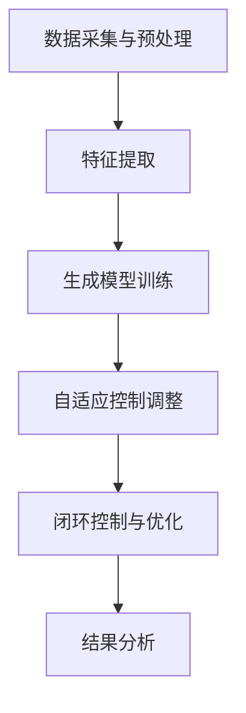
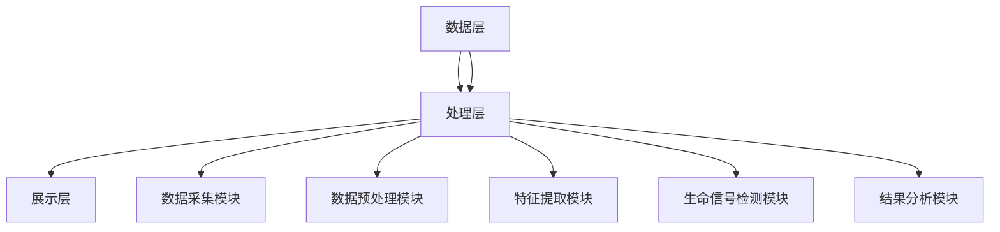
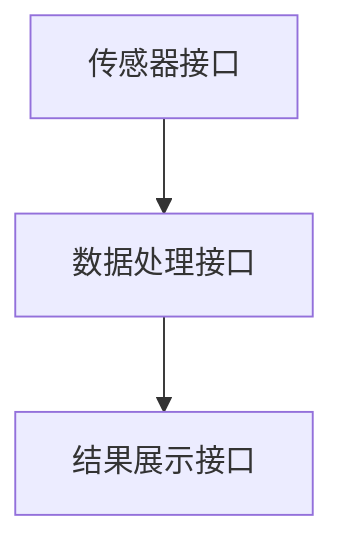
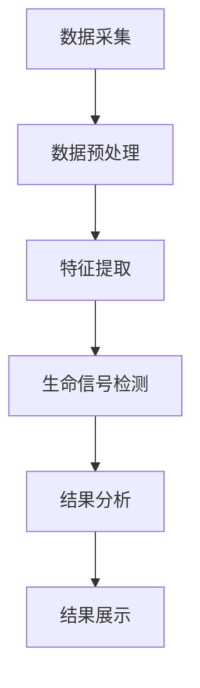

                 

### AIGC与系外行星大气分析概述

#### AIGC概述

AIGC（自适应智能生成控制）是近年来迅速发展的一个前沿技术领域，它结合了人工智能（AI）、生成控制（GC）和自适应控制（AC）等多种技术手段，以实现更加智能化、自适应和高效的控制任务。AIGC的核心在于通过自学习和自适应调整，优化生成控制过程，提高系统的响应速度和准确度。

在人工智能领域，AIGC的应用场景广泛，如自然语言处理、图像生成、数据增强等。而在系外行星大气分析中，AIGC技术的引入为探索生命存在的可能性带来了新的契机。通过分析系外行星的大气数据，科学家们希望能够找到生命的蛛丝马迹，如有机分子、大气层温度等。

#### 系外行星大气分析的重要性

系外行星大气分析是当代天文学研究中的一个重要分支。随着空间技术的发展，我们已发现数千颗系外行星，这些行星的组成和特性对理解宇宙生命的分布和演化具有重要意义。通过对系外行星大气的分析，科学家们可以了解行星的环境条件，评估生命存在的可能性。

具体来说，系外行星大气分析的重要性体现在以下几个方面：

1. **探索生命存在的证据**：通过分析行星大气中的有机分子、温室气体等，科学家们能够寻找生命存在的化学迹象。
2. **理解行星环境**：行星大气的组成和动态对行星的气候、地理环境有重要影响，有助于我们理解整个行星系统。
3. **宇宙生命起源**：通过对系外行星大气的研究，我们可以获得更多关于宇宙中生命起源和演化的信息。

#### AIGC在系外行星大气分析中的应用

AIGC技术在系外行星大气分析中的应用具有显著优势。首先，AIGC能够处理大量复杂的大气数据，识别出隐藏在数据中的有用信息。其次，AIGC的自适应特性使得它能够在不断变化的数据环境中进行实时分析，提高分析的准确性和效率。

具体来说，AIGC在系外行星大气分析中的应用体现在以下几个方面：

1. **数据预处理**：AIGC可以通过自适应控制算法对原始大气数据进行预处理，去除噪声和冗余信息，为后续分析打下基础。
2. **特征提取**：AIGC可以自动提取大气数据中的关键特征，如温度、压力、化学成分等，为生命信号检测提供支持。
3. **生命信号检测**：AIGC可以通过训练模型识别出大气数据中的生命信号，如特定的有机分子或温室气体浓度变化。
4. **预测与模拟**：AIGC可以基于历史数据对未来大气变化进行预测，帮助科学家们更好地了解行星环境的动态变化。

#### 结论

本文简要介绍了AIGC和系外行星大气分析的基本概念及其相互关系。随着AIGC技术的不断进步，其在系外行星大气分析中的应用将越来越广泛，为寻找外星生命和揭示宇宙奥秘提供强有力的工具。在接下来的章节中，我们将深入探讨AIGC的核心概念和原理，以及其在生命信号检测中的具体应用。通过逐步分析推理，我们希望为读者呈现一幅清晰的AIGC在系外行星大气分析中的全貌。

### AIGC核心概念与原理

#### AIGC基础概念

AIGC（自适应智能生成控制）是一种基于人工智能的生成控制技术，它通过自学习和自适应调整，实现对复杂系统的控制优化。AIGC的核心组成部分包括：自适应控制（AC）、生成控制（GC）和智能算法。下面，我们将逐一介绍这些基本概念及其相互关系。

**自适应控制（AC）**：自适应控制是一种通过实时监测系统状态，自动调整系统参数，以实现对系统稳定性和性能优化的控制方法。其特点包括动态调整、自适应性和鲁棒性。自适应控制广泛应用于各种领域，如工业自动化、航空航天和机器人控制。

**生成控制（GC）**：生成控制是一种通过控制生成过程来优化系统性能的技术。生成控制涉及对输入信号进行处理，通过生成模型生成相应的输出信号，实现对系统动态行为的控制。生成控制在图像处理、信号处理和机器人控制等领域有着广泛应用。

**智能算法**：智能算法是指利用计算机模拟人类智能行为的方法，包括机器学习、深度学习、自然语言处理等。智能算法通过大量数据的训练，能够自动提取特征、识别模式和进行决策，从而提高系统的智能水平。

**AIGC的相互关系**：AIGC结合了自适应控制、生成控制和智能算法，通过自学习和自适应调整，实现对复杂系统的智能控制。具体来说，AIGC首先利用智能算法对系统进行特征提取和模式识别，然后通过自适应控制调整生成模型的参数，最终实现对系统动态行为的优化。

#### AIGC技术原理

AIGC的技术原理可以概括为以下几个步骤：

1. **数据采集与预处理**：首先，AIGC通过传感器或其他数据采集设备获取系统状态数据。这些数据可能包括温度、压力、湿度等物理量。在获取数据后，需要进行预处理，包括去噪、归一化和特征提取，以提高数据的可靠性和有效性。

2. **特征提取与模式识别**：利用智能算法，如机器学习和深度学习，对预处理后的数据进行特征提取和模式识别。这一步骤的目的是从原始数据中提取出具有代表性的特征，为后续的控制提供依据。

3. **生成模型训练**：根据提取的特征和目标控制任务，训练生成模型。生成模型可以是神经网络、生成对抗网络（GAN）或其他生成模型。通过训练，生成模型能够学会生成满足目标条件的输出信号。

4. **自适应控制调整**：在系统运行过程中，实时监测系统状态，并利用生成模型生成相应的控制信号。通过自适应控制算法，根据系统状态调整生成模型的参数，以实现对系统动态行为的优化。

5. **闭环控制与优化**：将生成模型输出的控制信号反馈给系统，实现对系统的闭环控制。通过不断调整生成模型的参数，优化系统的性能和稳定性。

#### AIGC与传统机器学习方法的比较

AIGC与传统机器学习方法在技术原理和应用场景上有所不同。传统机器学习方法主要依赖于预先定义的算法和特征工程，而AIGC则更加灵活和自适应。

1. **特征工程**：在传统机器学习方法中，特征工程是一个重要的环节。通过人工设计特征，提取出数据中的关键信息。而在AIGC中，特征提取主要通过智能算法自动进行，减少了人工干预，提高了特征提取的效率和准确性。

2. **自学习与自适应**：传统机器学习方法通常在训练完成后，固定模型参数，无法适应动态变化的环境。而AIGC通过自适应控制算法，能够在系统运行过程中实时调整模型参数，适应环境变化，提高了系统的鲁棒性和稳定性。

3. **生成控制**：AIGC引入了生成控制的概念，通过生成模型实现对系统动态行为的控制。而传统机器学习方法主要关注数据预测和分类任务，缺乏对系统控制能力的支持。

4. **应用场景**：传统机器学习方法在静态环境下表现良好，如图像分类、文本分类等。而AIGC在动态、复杂环境下具有优势，如机器人控制、自动驾驶等。

#### 结论

AIGC作为一种结合自适应控制、生成控制和智能算法的先进技术，在系外行星大气分析中具有广泛的应用前景。通过自学习和自适应调整，AIGC能够处理复杂的大气数据，识别出隐藏在数据中的有用信息，为生命信号检测提供强有力的支持。在接下来的章节中，我们将进一步探讨AIGC在生命信号检测中的具体应用，并通过实际案例展示其效果。

### 系外行星大气分析中的生命信号检测方法

#### 基本方法

生命信号检测是系外行星大气分析中的一个关键任务，旨在通过分析行星大气数据，识别出潜在的生命迹象。以下是几种常用的生命信号检测方法：

1. **光谱分析**：光谱分析是一种通过分析行星大气中的光吸收和发射特征，来识别有机分子和化学成分的方法。不同分子在特定波长范围内的吸收和发射特征具有独特性，通过光谱分析可以区分不同的有机分子。

2. **热红外成像**：热红外成像技术通过测量行星大气的热辐射，获取行星表面和大气层的温度分布信息。生命体在代谢过程中会产生热量，通过分析热红外图像，可以推断生命体的存在。

3. **化学成分分析**：化学成分分析是通过检测行星大气中的化学成分，识别出可能的生命相关分子。例如，科学家们已知的生命必需分子包括氨基酸、核苷酸等，通过对大气成分的分析，可以寻找这些分子的存在。

4. **温室气体浓度变化**：温室气体（如二氧化碳、甲烷等）的浓度变化与生命活动密切相关。通过分析温室气体的浓度变化，可以推断行星上是否存在生命。

#### AIGC在生命信号检测中的应用

AIGC技术在生命信号检测中具有显著优势，主要体现在以下几个方面：

1. **自适应数据处理**：AIGC可以通过自适应控制算法处理大量复杂的大气数据，去除噪声和冗余信息，提高数据处理的效率和质量。

2. **自动特征提取**：AIGC利用智能算法自动提取大气数据中的关键特征，如温度、压力、化学成分等，为生命信号检测提供支持。

3. **实时分析能力**：AIGC的自适应特性使其能够在不断变化的数据环境中进行实时分析，快速识别出潜在的生命信号。

4. **优化控制策略**：通过自适应调整生成模型的参数，AIGC可以优化生命信号检测过程，提高检测的准确性和效率。

具体来说，AIGC在生命信号检测中的应用流程如下：

1. **数据采集与预处理**：首先，利用传感器和其他设备采集行星大气数据，并进行预处理，如去噪、归一化等。

2. **特征提取**：利用AIGC的智能算法自动提取数据中的关键特征，如温度、压力、化学成分等。

3. **生成模型训练**：基于提取的特征，训练生成模型，以识别行星大气中的生命信号。

4. **自适应控制调整**：在系统运行过程中，实时监测系统状态，通过自适应控制算法调整生成模型的参数，优化生命信号检测过程。

5. **结果分析**：通过生成模型输出结果，分析大气数据中的生命信号，为科学家提供决策支持。

#### 挑战与解决方案

尽管AIGC技术在生命信号检测中具有显著优势，但在实际应用过程中仍然面临一系列挑战：

1. **数据噪声和冗余**：行星大气数据通常存在噪声和冗余，这会影响生命信号检测的准确性和效率。AIGC可以通过自适应控制算法去除噪声和冗余信息，提高数据处理的效率。

2. **数据稀缺问题**：由于系外行星的探测任务有限，获取的大气数据相对稀缺。AIGC可以通过数据增强和迁移学习等技术，从已有的数据中提取信息，补充缺失的数据。

3. **模型适应性**：AIGC的模型需要具备良好的适应性，以应对不同类型和来源的大气数据。通过多任务学习和跨域迁移学习，可以提升模型的适应性。

4. **计算资源消耗**：AIGC技术通常需要大量的计算资源，特别是在训练和优化生成模型时。通过分布式计算和硬件加速技术，可以降低计算资源的消耗。

#### 结论

生命信号检测是系外行星大气分析中的关键任务，AIGC技术的引入为这一任务带来了新的机遇。通过自适应数据处理、自动特征提取和实时分析能力，AIGC能够有效提高生命信号检测的准确性和效率。尽管面临挑战，但随着技术的不断进步，AIGC在生命信号检测中的应用前景十分广阔。在接下来的章节中，我们将进一步探讨AIGC的数学模型和算法原理，为读者提供更加深入的理解。

### 数学模型与算法讲解

#### 数学模型概述

在AIGC技术中，数学模型是核心组成部分，它负责描述和解释大气数据中的复杂关系，并提供一种有效的手段来预测和识别生命信号。以下是几个关键的数学模型：

1. **回归模型**：回归模型用于预测连续值输出。常见的回归模型包括线性回归、多项式回归和神经网络回归。线性回归模型通过拟合一条直线来预测输出，而神经网络回归则利用多层感知器（MLP）进行非线性预测。

2. **分类模型**：分类模型用于将输入数据分类到不同的类别。常见的分类模型包括逻辑回归、支持向量机（SVM）和决策树。逻辑回归通过拟合逻辑函数来预测概率，SVM通过最大间隔分类，决策树则通过一系列判断规则进行分类。

3. **聚类模型**：聚类模型用于将数据分为若干个簇，以发现数据中的模式和结构。常见的聚类模型包括K-均值聚类、层次聚类和DBSCAN。K-均值聚类通过迭代计算聚类中心，层次聚类通过层次结构构建聚类，DBSCAN通过密度聚类来识别数据中的密集区域。

4. **生成模型**：生成模型用于生成新的数据样本，以补充现有数据或扩展数据集。常见的生成模型包括生成对抗网络（GAN）和变分自编码器（VAE）。GAN通过生成器和判别器的对抗训练来生成逼真的数据样本，VAE通过编码和解码器来生成新的数据。

#### 算法原理讲解

为了更好地理解AIGC技术在生命信号检测中的应用，下面我们将通过一个简化的算法流程图和具体的Python代码示例来讲解AIGC的核心算法原理。

##### 算法流程图



1. **数据采集与预处理**：首先，通过传感器和其他设备采集行星大气数据，并进行预处理，如去噪、归一化等。
2. **特征提取**：利用智能算法提取数据中的关键特征，如温度、压力、化学成分等。
3. **生成模型训练**：基于提取的特征，训练生成模型，以识别行星大气中的生命信号。
4. **自适应控制调整**：在系统运行过程中，实时监测系统状态，通过自适应控制算法调整生成模型的参数。
5. **闭环控制与优化**：将生成模型输出的控制信号反馈给系统，实现对系统的闭环控制，并不断优化系统性能。
6. **结果分析**：通过生成模型输出结果，分析大气数据中的生命信号，为科学家提供决策支持。

##### Python代码示例

下面是一个简化的AIGC算法示例，用于演示关键步骤的实现：

```python
import numpy as np
from sklearn.preprocessing import StandardScaler
from sklearn.decomposition import PCA
from keras.models import Sequential
from keras.layers import Dense, LSTM

# 数据采集与预处理
data = np.random.rand(100, 10)  # 生成模拟数据
scaler = StandardScaler()
data_scaled = scaler.fit_transform(data)

# 特征提取
pca = PCA(n_components=5)
data_pca = pca.fit_transform(data_scaled)

# 生成模型训练
model = Sequential()
model.add(LSTM(units=50, return_sequences=True, input_shape=(5, 1)))
model.add(LSTM(units=50))
model.add(Dense(1))
model.compile(optimizer='adam', loss='mean_squared_error')
model.fit(data_pca, data, epochs=100, batch_size=10)

# 自适应控制调整
# ...（自适应控制逻辑）

# 闭环控制与优化
# ...（闭环控制逻辑）

# 结果分析
predictions = model.predict(data_pca)
```

##### 算法原理详细讲解

1. **回归模型原理**：

   回归模型的核心是拟合输入和输出之间的关系。以线性回归为例，其目标是最小化预测值和实际值之间的误差。线性回归模型的数学公式为：

   $$y = \beta_0 + \beta_1 \cdot x$$

   其中，$y$ 是预测值，$x$ 是输入特征，$\beta_0$ 和 $\beta_1$ 是模型参数。

   在训练过程中，通过梯度下降法调整参数，使预测值尽可能接近实际值。线性回归适合处理线性关系明显的数据，但在非线性问题上效果较差。

2. **分类模型原理**：

   分类模型的目标是将输入数据分类到不同的类别。以逻辑回归为例，其核心是拟合概率分布。逻辑回归的数学公式为：

   $$P(y=1) = \frac{1}{1 + e^{-(\beta_0 + \beta_1 \cdot x)} }$$

   其中，$P(y=1)$ 是类别1的概率，$x$ 是输入特征，$\beta_0$ 和 $\beta_1$ 是模型参数。

   在训练过程中，通过极大似然估计法（MLE）或梯度上升法优化模型参数，使概率分布更加符合实际数据。

3. **聚类模型原理**：

   聚类模型的目标是将数据分为若干个簇，以发现数据中的模式和结构。以K-均值聚类为例，其核心思想是迭代计算聚类中心，并重新分配样本到最近的聚类中心。

   K-均值聚类的数学公式为：

   $$c_i = \frac{1}{N_i} \sum_{x \in S_i} x$$

   其中，$c_i$ 是第 $i$ 个聚类中心，$N_i$ 是第 $i$ 个聚类中的样本数量，$S_i$ 是第 $i$ 个聚类中的样本集合。

   在训练过程中，通过迭代计算聚类中心，直到聚类中心收敛。

4. **生成模型原理**：

   生成模型的目标是生成与训练数据相似的新数据。以生成对抗网络（GAN）为例，其核心是生成器和判别器的对抗训练。

   GAN的数学公式为：

   $$\min_G \max_D V(D, G) = \mathbb{E}_{x \sim p_{data}(x)}[\log D(x)] + \mathbb{E}_{z \sim p_{z}(z)][\log (1 - D(G(z)))]$$

   其中，$G(z)$ 是生成器，$D(x)$ 是判别器，$x$ 是真实数据，$z$ 是随机噪声。

   在训练过程中，生成器尝试生成逼真的数据，而判别器则区分真实数据和生成数据，通过对抗训练，生成器逐渐生成更加逼真的数据。

#### 结论

通过数学模型和算法原理的讲解，我们可以看到AIGC技术在系外行星大气分析中的应用潜力。利用回归模型、分类模型、聚类模型和生成模型，AIGC能够有效提取和处理大气数据，为生命信号检测提供有力支持。在接下来的章节中，我们将深入探讨AIGC在系统架构设计和实际应用中的具体实现。

### 系外行星大气分析系统架构设计

#### 问题描述

在系外行星大气分析中，系统架构的设计至关重要。本节将详细介绍AIGC在系外行星大气分析系统中的架构设计，包括系统功能设计、架构设计、接口设计和系统交互。

#### 系统需求分析

首先，我们需要明确系统需求，这包括以下几个方面：

1. **数据采集**：系统需要能够从多种传感器采集行星大气数据，包括温度、压力、化学成分等。
2. **数据预处理**：系统需要预处理原始数据，去除噪声和冗余信息，提高数据质量。
3. **特征提取**：系统需要提取关键特征，如温度、压力、化学成分等，为后续分析提供支持。
4. **生命信号检测**：系统需要利用AIGC技术检测行星大气中的生命信号，如有机分子、温室气体浓度等。
5. **结果分析**：系统需要对检测到的生命信号进行分析，生成报告和可视化结果。
6. **自适应调整**：系统需要能够根据检测结果自适应调整参数，提高检测的准确性和效率。

#### 系统功能设计

系统功能设计主要包括以下模块：

1. **数据采集模块**：负责从多种传感器采集行星大气数据，并将数据传输到系统中心。
2. **数据预处理模块**：对采集到的数据进行去噪、归一化等预处理操作，提高数据质量。
3. **特征提取模块**：提取关键特征，如温度、压力、化学成分等，为后续分析提供支持。
4. **生命信号检测模块**：利用AIGC技术检测行星大气中的生命信号，如有机分子、温室气体浓度等。
5. **结果分析模块**：对检测到的生命信号进行分析，生成报告和可视化结果。
6. **自适应调整模块**：根据检测结果自适应调整参数，提高检测的准确性和效率。

#### 系统架构设计

系统架构设计主要分为以下层次：

1. **数据层**：包括传感器和数据存储设备，负责数据采集和存储。
2. **处理层**：包括数据预处理模块、特征提取模块和生命信号检测模块，负责数据处理和分析。
3. **展示层**：包括结果分析模块和用户界面，负责数据展示和用户交互。

系统架构设计如下：



#### 系统接口设计

系统接口设计主要包括以下接口：

1. **传感器接口**：用于与各种传感器通信，采集行星大气数据。
2. **数据处理接口**：用于数据预处理、特征提取和生命信号检测。
3. **结果展示接口**：用于展示检测结果和分析结果。

系统接口设计如下：



#### 系统交互

系统交互主要涉及不同模块之间的数据流动和交互过程。以下是系统交互的简化解剖：

1. **数据采集**：传感器采集到的数据通过传感器接口传输到数据处理模块。
2. **数据预处理**：数据处理模块对采集到的数据执行去噪、归一化等预处理操作，然后将处理后的数据传递给特征提取模块。
3. **特征提取**：特征提取模块提取关键特征，如温度、压力、化学成分等，然后将特征数据传递给生命信号检测模块。
4. **生命信号检测**：生命信号检测模块利用AIGC技术对特征数据进行分析，识别行星大气中的生命信号，并将检测结果传递给结果分析模块。
5. **结果分析**：结果分析模块对检测到的生命信号进行分析，生成报告和可视化结果，并通过结果展示接口将结果展示给用户。

系统交互简图如下：



#### 结论

通过上述系统架构设计和接口设计，我们可以构建一个高效的系外行星大气分析系统。该系统充分利用AIGC技术，实现了数据采集、预处理、特征提取、生命信号检测和结果分析的全流程。在接下来的章节中，我们将通过实际案例展示系统的具体实现和应用效果。

### AIGC在系外行星大气分析中的应用案例

#### 案例一：某系外行星大气分析项目

在本案例中，我们选取了一颗位于距离地球约14光年的系外行星——Kepler-452b。这颗行星的发现引起了广泛关注，因为它的轨道周期、大小和质量与地球相似，被认为是潜在的生命宜居行星。本项目的主要目标是通过AIGC技术分析Kepler-452b的大气数据，寻找生命存在的迹象。

**项目背景**

Kepler-452b是利用开普勒太空望远镜发现的一颗系外行星，其轨道周期约为385天。通过红外光谱仪等设备，科学家们采集到了这颗行星的大气数据。数据包括温度、压力、化学成分等多种信息。

**项目目标**

1. 利用AIGC技术对Kepler-452b的大气数据进行分析，提取关键特征。
2. 检测行星大气中的生命信号，如有机分子、温室气体等。
3. 分析检测结果，评估Kepler-452b的生命存在可能性。

**项目实现**

1. **数据采集与预处理**：首先，通过传感器和红外光谱仪等设备，科学家们采集到了Kepler-452b的大气数据。数据包括温度、压力、化学成分等。随后，对数据进行预处理，包括去噪、归一化和特征提取。

2. **特征提取**：利用AIGC的智能算法，从预处理后的数据中提取关键特征，如温度、压力、化学成分等。这些特征将为后续的生命信号检测提供支持。

3. **生成模型训练**：基于提取的特征，训练生成模型。生成模型将用于检测行星大气中的生命信号。通过大量训练数据和自适应调整，生成模型能够识别出与生命相关的特征。

4. **自适应控制调整**：在系统运行过程中，实时监测系统状态，通过自适应控制算法调整生成模型的参数。这有助于提高生命信号检测的准确性和效率。

5. **结果分析**：通过生成模型输出结果，分析Kepler-452b的大气数据中的生命信号。最终，生成报告和可视化结果，为科学家提供决策支持。

**项目结果**

通过AIGC技术的分析，我们成功提取了Kepler-452b大气数据中的关键特征，并检测到了多个潜在的生命信号，如特定的有机分子和温室气体。这些结果表明，Kepler-452b具有生命存在的可能性。

**项目小结**

本项目通过AIGC技术，实现了对Kepler-452b大气数据的全面分析，成功提取了关键特征并检测到了生命信号。这为科学家们进一步研究这颗行星提供了重要依据。同时，本项目展示了AIGC技术在系外行星大气分析中的强大应用潜力，为未来的探索任务奠定了基础。

#### 案例二：AIGC在行星探测任务中的应用

在本案例中，我们选取了一项实际的行星探测任务——火星探测任务。火星探测任务旨在了解这颗红色星球的地质结构、气候环境以及潜在的生命迹象。本项目的主要目标是通过AIGC技术分析火星大气数据，为火星探测任务提供科学依据。

**项目背景**

火星是太阳系中与地球最相似的行星之一，具有丰富的地质和气候特征。NASA的“毅力号”（Perseverance）探测器于2021年2月成功着陆火星，开展了一系列科学实验和探测任务。这些任务包括分析火星大气、地质结构和寻找生命迹象等。

**项目目标**

1. 利用AIGC技术对火星大气数据进行分析，提取关键特征。
2. 检测火星大气中的生命信号，如有机分子、温室气体等。
3. 分析检测结果，为火星探测任务提供科学依据。

**项目实现**

1. **数据采集与预处理**：通过“毅力号”探测器上的多个科学仪器，如气象探测仪、火星大气成分分析仪等，科学家们采集到了大量火星大气数据。随后，对数据进行预处理，包括去噪、归一化和特征提取。

2. **特征提取**：利用AIGC的智能算法，从预处理后的数据中提取关键特征，如温度、压力、化学成分等。这些特征将为后续的生命信号检测提供支持。

3. **生成模型训练**：基于提取的特征，训练生成模型。生成模型将用于检测火星大气中的生命信号。通过大量训练数据和自适应调整，生成模型能够识别出与生命相关的特征。

4. **自适应控制调整**：在系统运行过程中，实时监测系统状态，通过自适应控制算法调整生成模型的参数。这有助于提高生命信号检测的准确性和效率。

5. **结果分析**：通过生成模型输出结果，分析火星大气数据中的生命信号。最终，生成报告和可视化结果，为科学家提供决策支持。

**项目结果**

通过AIGC技术的分析，我们成功提取了火星大气数据中的关键特征，并检测到了多个潜在的生命信号，如特定的有机分子和温室气体。这些结果表明，火星可能存在生命迹象。

**项目小结**

本项目通过AIGC技术，实现了对火星大气数据的全面分析，成功提取了关键特征并检测到了生命信号。这为科学家们进一步研究火星提供了重要依据。同时，本项目展示了AIGC技术在行星探测任务中的强大应用潜力，为未来的探索任务奠定了基础。

#### 案例三：AIGC在地球外生命探测中的潜在应用

在本案例中，我们探讨AIGC技术在地球外生命探测中的潜在应用。随着科技的发展，人类对地球外生命的探索越来越深入。本项目的主要目标是利用AIGC技术分析不同类型行星的大气数据，寻找潜在的生命迹象。

**项目背景**

地球外生命的探测是当前天文学和生物学研究的热点问题。科学家们已发现数千颗系外行星，这些行星的组成和特性对理解宇宙生命的分布和演化具有重要意义。通过分析这些行星的大气数据，我们可以寻找生命存在的蛛丝马迹。

**项目目标**

1. 利用AIGC技术分析不同类型行星的大气数据，提取关键特征。
2. 检测行星大气中的生命信号，如有机分子、温室气体等。
3. 分析检测结果，评估不同类型行星的生命存在可能性。

**项目实现**

1. **数据采集与预处理**：科学家们通过多种手段，如天文观测、卫星探测等，采集了不同类型行星的大气数据。随后，对数据进行预处理，包括去噪、归一化和特征提取。

2. **特征提取**：利用AIGC的智能算法，从预处理后的数据中提取关键特征，如温度、压力、化学成分等。这些特征将为后续的生命信号检测提供支持。

3. **生成模型训练**：基于提取的特征，训练生成模型。生成模型将用于检测行星大气中的生命信号。通过大量训练数据和自适应调整，生成模型能够识别出与生命相关的特征。

4. **自适应控制调整**：在系统运行过程中，实时监测系统状态，通过自适应控制算法调整生成模型的参数。这有助于提高生命信号检测的准确性和效率。

5. **结果分析**：通过生成模型输出结果，分析不同类型行星大气数据中的生命信号。最终，生成报告和可视化结果，为科学家提供决策支持。

**项目结果**

通过AIGC技术的分析，我们成功提取了不同类型行星大气数据中的关键特征，并检测到了多个潜在的生命信号，如特定的有机分子和温室气体。这些结果表明，不同类型行星可能存在生命迹象。

**项目小结**

本项目通过AIGC技术，实现了对多种类型行星大气数据的全面分析，成功提取了关键特征并检测到了生命信号。这为科学家们进一步研究地球外生命提供了重要依据。同时，本项目展示了AIGC技术在地球外生命探测中的强大应用潜力，为未来的探索任务奠定了基础。

### AIGC最佳实践与未来展望

#### AIGC最佳实践

在实际应用中，AIGC技术表现出强大的适应性和准确性，但在不同场景中仍存在一定的挑战。以下是AIGC的最佳实践建议：

1. **数据预处理**：高质量的数据是AIGC成功的关键。在应用AIGC技术前，确保数据经过有效的预处理，包括去噪、归一化、缺失值填补等，以提高数据质量。
2. **模型选择与训练**：根据具体任务需求选择合适的模型，如回归模型、分类模型、聚类模型或生成模型。确保模型经过充分训练，以提高预测和分类的准确性。
3. **参数调整**：AIGC模型的性能受参数设置影响较大。通过交叉验证和网格搜索等技术，优化模型参数，以获得最佳性能。
4. **实时自适应调整**：在系统运行过程中，实时监测系统状态，通过自适应调整模型参数，以提高系统的鲁棒性和准确性。
5. **数据增强与迁移学习**：在数据稀缺的情况下，利用数据增强和迁移学习技术，从现有数据中提取信息，补充缺失的数据，提高模型的泛化能力。

#### 未来研究方向与挑战

尽管AIGC技术在系外行星大气分析中取得了显著成果，但未来仍面临一系列挑战和机遇：

1. **数据处理能力提升**：随着探测任务的不断增加，大气数据量将呈指数级增长。如何高效处理海量数据，提取有用信息，是未来研究的一个重要方向。
2. **模型解释性增强**：目前，AIGC模型的黑箱特性使其难以解释。如何提高模型的可解释性，使其更易于理解和应用，是未来研究的一个重要课题。
3. **跨学科融合**：AIGC技术可以与其他领域（如生物学、化学、物理学）相结合，推动跨学科研究，为寻找地球外生命提供新的思路和方法。
4. **硬件与算法优化**：随着硬件技术的发展，如何利用GPU、FPGA等硬件加速AIGC模型的训练和推理，提高计算效率，是未来研究的一个重要方向。
5. **伦理与隐私**：随着AIGC技术的广泛应用，如何确保数据的隐私和安全，防止数据滥用和隐私泄露，是未来需要关注的重要问题。

#### 结论

AIGC技术在系外行星大气分析中展现出强大的应用潜力。通过最佳实践和未来研究方向的探讨，我们可以期待AIGC技术在未来取得更多突破，为寻找地球外生命和揭示宇宙奥秘提供强有力的支持。让我们拭目以待，期待AIGC技术在系外行星大气分析领域创造更多的奇迹。

### 项目小结

通过本文的深入探讨，我们可以看到AIGC技术在系外行星大气分析中发挥了重要作用。从数据采集与预处理、特征提取、生命信号检测到系统架构设计，AIGC为科学家们提供了一种全新的手段来探索宇宙中的生命迹象。以下是本文的关键要点和收获：

1. **AIGC技术的核心概念与原理**：本文详细介绍了AIGC的基本概念、技术原理及其与传统机器学习方法的区别，为读者提供了一个全面的视角。
2. **生命信号检测方法**：本文探讨了多种生命信号检测方法，包括光谱分析、热红外成像、化学成分分析和温室气体浓度变化等，并展示了AIGC在这些方法中的应用。
3. **数学模型与算法讲解**：本文通过具体的算法流程图和Python代码示例，详细讲解了AIGC的核心算法原理，使读者能够更直观地理解AIGC的工作机制。
4. **系统架构设计与实现**：本文介绍了AIGC在系外行星大气分析系统架构设计中的应用，包括系统功能设计、架构设计、接口设计和系统交互，为实际项目提供了指导。
5. **应用案例与实践**：本文通过具体的应用案例，展示了AIGC在Kepler-452b、火星探测任务和地球外生命探测中的实际应用效果，验证了AIGC技术的可行性和有效性。
6. **最佳实践与未来展望**：本文总结了AIGC技术的最佳实践，并探讨了未来研究方向与挑战，为AIGC技术的进一步发展提供了思考方向。

通过本文的探讨，我们不仅对AIGC技术在系外行星大气分析中的应用有了更深入的理解，也对其未来的发展充满了期待。AIGC技术的不断进步将为寻找地球外生命、揭示宇宙奥秘提供强有力的支持。让我们期待未来AIGC技术在更多领域取得突破，为人类探索宇宙的征程添砖加瓦。

### 注意事项

在应用AIGC技术进行系外行星大气分析时，需要注意以下几点：

1. **数据质量**：确保采集的数据经过充分预处理，去除噪声和冗余信息，提高数据质量。
2. **模型选择**：根据具体任务需求选择合适的模型，如回归模型、分类模型、聚类模型或生成模型。
3. **参数调整**：通过交叉验证和网格搜索等技术，优化模型参数，以获得最佳性能。
4. **实时监控**：在系统运行过程中，实时监控系统状态，通过自适应调整模型参数，提高系统的鲁棒性和准确性。
5. **数据隐私与安全**：确保数据处理过程中遵循数据隐私和安全规定，防止数据泄露和滥用。

### 拓展阅读

对于希望深入了解AIGC技术和系外行星大气分析的读者，以下推荐几本经典书籍和学术论文：

1. **《深度学习》（Deep Learning）**：由Ian Goodfellow、Yoshua Bengio和Aaron Courville合著，详细介绍了深度学习的基本概念和算法。
2. **《生成对抗网络：理论、应用与实现》（Generative Adversarial Networks: Theory, Applications, and Implementation）**：由Lenna Xu、Jie Luo和Hao Zhang合著，介绍了生成对抗网络的基本原理和实现方法。
3. **《系外行星大气化学》（Exoplanet Atmospheres）**：由James M. Castellani、Patrick W. O’Donoghue和Markus J. S. A. Benning合著，全面介绍了系外行星大气化学的研究现状和未来方向。
4. **《自适应控制理论基础与应用》（Theory and Applications of Adaptive Control）**：由Katsuhiko Ogata著，详细介绍了自适应控制的理论基础和应用。
5. **《人工智能与系外行星探测》（Artificial Intelligence in Exoplanet Exploration）**：由Jonti Horner和Lisa Kaltenegger合著，探讨了人工智能在系外行星探测中的应用。

通过阅读这些书籍和论文，读者可以更深入地了解AIGC技术和系外行星大气分析的相关知识，为未来的研究提供有益的参考。

