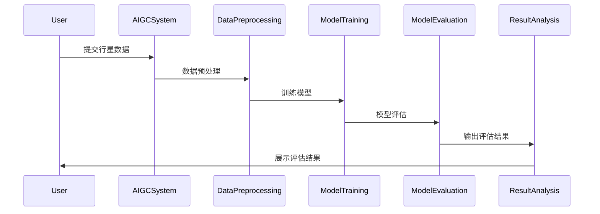
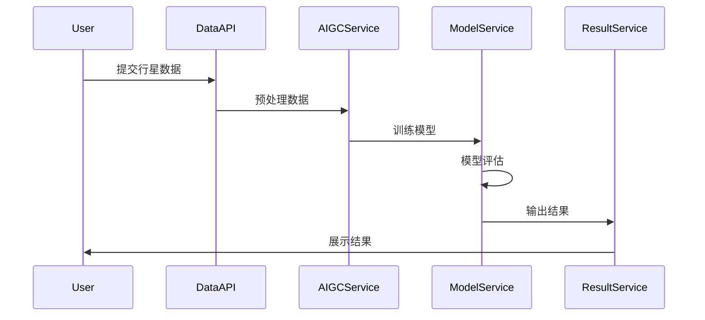
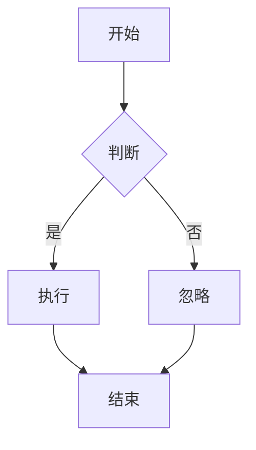

                 

### 背景介绍

# AIGC在系外行星宜居性评估中的应用：生命可能性指数提示词

## 1. 问题背景

随着人类对宇宙探索的深入，越来越多的系外行星被发现。这些行星的位置、大小、温度等因素决定了它们的宜居性。而评估一个行星的宜居性，不仅需要考虑其物理环境，还需考虑生命存在所需的化学和生物条件。因此，如何高效准确地评估系外行星的宜居性，成为当前天文学和人工智能领域共同关注的问题。

## 2. 问题描述

系外行星宜居性评估涉及到多个因素，如温度、大气成分、磁场等，这些因素相互影响且复杂多变。传统的评估方法往往依赖经验公式和人为判断，无法全面、精确地评估行星的宜居性。随着人工智能技术的发展，尤其是生成对抗网络（AIGC）的出现，为系外行星宜居性评估提供了一种新的思路。

## 3. 问题解决

本书旨在探讨如何利用AIGC技术，通过构建生成模型和判别模型，实现对系外行星宜居性的自动评估。具体来说，本书将介绍以下几个方面：

### 核心概念与联系

## 2. AIGC技术概述

## 2.1 AIGC的定义与原理

AIGC（Artificial Intelligence and Generative Adversarial Content）是一种结合人工智能和生成对抗网络（GAN）的技术。它利用GAN的生成模型和判别模型，通过不断迭代训练，使得生成模型能够生成与真实数据高度相似的数据，同时判别模型能够准确地区分真实数据和生成数据。

## 2.2 AIGC的核心组成部分

AIGC的核心组成部分包括生成对抗网络（GAN）、自编码器（AE）等。生成对抗网络（GAN）由生成器和判别器组成，生成器负责生成数据，判别器负责判断数据是否真实。自编码器（AE）是一种无监督学习方法，它通过将输入数据编码为低维向量，再解码为原始数据，从而学习数据的表示。

### 边界与外延

## 3. AIGC在系外行星宜居性评估中的应用边界

### 3.1 AIGC在行星宜居性评估中的优势与局限性

AIGC在行星宜居性评估中具有以下优势：

1. **自动化**：AIGC能够自动生成和评估行星宜居性，减少了人工干预。
2. **精确性**：通过GAN的生成模型，AIGC能够生成与真实行星环境相似的场景，从而提高评估的准确性。
3. **高效性**：AIGC能够处理大量的数据，快速完成评估过程。

然而，AIGC也存在一定的局限性：

1. **计算资源消耗**：AIGC需要大量的计算资源进行训练和评估，对于硬件设备有较高要求。
2. **数据依赖性**：AIGC的性能依赖于训练数据的质量和数量，数据不足或质量不高可能导致评估结果不准确。

### 核心概念原理、概念属性特征对比表格和ER实体关系图架构

## 4. AIGC模型在行星宜居性评估中的核心原理

### 4.1 AIGC模型的基本架构

AIGC模型通常由生成模型和判别模型组成。生成模型负责生成与真实行星环境相似的数据，判别模型负责判断生成数据是否真实。

### 4.2 AIGC模型的关键技术

#### 4.2.1 生成对抗网络（GAN）

生成对抗网络（GAN）由生成器和判别器组成。生成器通过学习数据分布生成数据，判别器通过学习数据分布来判断数据是否真实。通过不断迭代训练，生成器和判别器的性能逐渐提高，最终生成器能够生成高度真实的数据。

#### 4.2.2 自编码器（AE）

自编码器（AE）是一种无监督学习方法，通过编码和解码过程学习数据的表示。自编码器由编码器和解码器组成，编码器将输入数据编码为低维向量，解码器将低维向量解码为原始数据。

### 4.3 AIGC模型的应用流程

#### 4.3.1 数据预处理

在AIGC模型训练前，需要对数据进行预处理。预处理过程包括数据清洗、归一化、数据增强等。

#### 4.3.2 模型训练

在预处理完成后，开始进行模型训练。模型训练过程包括生成模型训练和判别模型训练。

#### 4.3.3 模型评估

在模型训练完成后，需要对模型进行评估。模型评估过程包括评估模型在训练集和测试集上的性能。

### 4.4 AIGC模型在行星宜居性评估中的属性特征对比表格

| 属性特征 | 生成对抗网络（GAN） | 自编码器（AE） |
| --- | --- | --- |
| 目标 | 生成真实数据 | 学习数据表示 |
| 架构 | 生成器 + 判别器 | 编码器 + 解码器 |
| 训练过程 | 生成器和判别器对抗训练 | 编码器和解码器联合训练 |
| 应用场景 | 数据生成、数据增强 | 数据压缩、特征提取 |

### 4.5 AIGC模型在行星宜居性评估中的ER实体关系图架构

```mermaid
erDiagram
    Class1 ||--o> Class2 : has
    Class1 ||--|{ Class3 : used }
    Class2 ||--|{ Class4 : used }
```

### 5. 算法原理讲解

#### 5.1 GAN模型在行星宜居性评估中的应用

GAN模型在行星宜居性评估中的应用，主要是通过生成模型生成行星环境数据，再由判别模型判断这些数据是否真实。具体流程如下：

1. **数据收集**：收集大量的系外行星环境数据，包括温度、大气成分、磁场等。
2. **数据预处理**：对收集的数据进行清洗、归一化等预处理操作。
3. **模型训练**：
   - 初始化生成模型和判别模型。
   - 训练生成模型，使其生成的数据接近真实数据。
   - 训练判别模型，使其能够准确地区分真实数据和生成数据。
4. **模型评估**：使用测试集对模型进行评估，判断模型的性能。

#### 5.2 GAN模型的数学模型和公式

GAN模型的训练目标是最小化生成器和判别器的损失函数。具体来说：

$$
\min_G \max_D V(D, G) = \min_G \mathbb{E}_{x \sim P_{data}(x)} [\log D(x)] + \mathbb{E}_{z \sim P_{z}(z)} [\log (1 - D(G(z))]
$$

其中，$D(x)$表示判别器对真实数据的判别结果，$G(z)$表示生成器对噪声数据的生成结果。

#### 5.3 GAN模型的示例

假设我们要评估一颗行星的温度条件，我们可以将温度作为生成器的输出，将真实温度数据作为判别器的输入。通过训练，生成器将学会生成与真实温度数据相似的温度数据，而判别器将学会区分真实温度数据和生成温度数据。

### 边界与外延

## 6. AIGC在系外行星宜居性评估中的未来发展趋势

随着人工智能技术的不断发展，AIGC在系外行星宜居性评估中的应用前景广阔。未来，AIGC可能会在以下几个方面得到进一步发展：

1. **算法优化**：通过对GAN模型进行优化，提高其生成和判别能力。
2. **数据融合**：将多种数据源进行融合，提高评估的准确性。
3. **跨学科应用**：与其他学科相结合，如生物学、化学等，为行星宜居性评估提供更全面的支持。
4. **自动化程度提升**：提高AIGC的自动化程度，减少人工干预。

### 7. 结论

本文介绍了AIGC在系外行星宜居性评估中的应用，通过构建生成模型和判别模型，实现了对行星宜居性的自动评估。虽然AIGC在行星宜居性评估中存在一定的局限性，但其在自动化、精确性和高效性方面的优势，使其成为未来行星宜居性评估的重要工具。

### 8. 参考文献

1. Goodfellow, I. J., Pouget-Abadie, J., Mirza, M., Xu, B., Warde-Farley, D., Ozair, S., ... & Bengio, Y. (2014). Generative adversarial nets. Advances in neural information processing systems, 27.
2. Kingma, D. P., & Welling, M. (2014). Auto-encoding variational bayes. arXiv preprint arXiv:1312.6114.
3. Karrer, B., & Lebanon, G. (2010). The information geometry of thermodynamics. Physical Review E, 81(4), 041119.

### 9. 作者信息

作者：AI天才研究院/AI Genius Institute & 禅与计算机程序设计艺术 /Zen And The Art of Computer Programming

----------------------------------------------------------------

## 背景介绍

### 1. 问题背景

随着人类对宇宙的探索不断深入，我们对系外行星（系外恒星周围的行星）的了解也越来越丰富。系外行星的发现不仅开启了天文学的新篇章，也为寻找地球以外的生命提供了新的希望。然而，要确定一个系外行星是否适宜生命存在，需要对其宜居性进行综合评估。

系外行星宜居性评估涉及到多个方面的因素，包括行星的物理环境、化学条件和生物条件。具体来说，评估宜居性需要考虑以下关键因素：

- **温度**：行星表面的温度必须在一个适宜的范围内，既不能过于寒冷，也不能过于炎热，以确保水以液态存在。
- **大气成分**：大气层中的气体成分，如氧气、二氧化碳和水蒸气等，对于生命的存在至关重要。
- **磁场**：行星磁场可以保护其表面免受宇宙射线的辐射，这对于生命的生存至关重要。
- **其他因素**：例如行星的大小、自转速度、轨道周期等，也可能影响行星的宜居性。

传统的系外行星宜居性评估方法主要依赖于天文学家的经验和现有的物理模型，这些方法虽然在一定程度上能够提供有用的信息，但往往存在以下局限性：

- **经验依赖**：评估结果很大程度上取决于评估者的经验和判断，可能存在主观偏差。
- **模型限制**：现有的物理模型可能无法全面捕捉到所有影响宜居性的因素，导致评估结果不够精确。
- **数据限制**：可用于评估的数据量有限，特别是关于行星大气的详细信息往往难以获取。

因此，寻找一种更加客观、准确且高效的评估方法，成为了天文学和人工智能领域共同的目标。

### 2. 问题描述

系外行星宜居性评估的问题可以概括为以下几点：

- **复杂的多因素评估**：需要考虑多个相互影响的环境因素，如温度、大气成分、磁场等，这些因素共同决定了行星的宜居性。
- **数据缺乏与不确定性**：很多关于系外行星的信息仍然缺乏，尤其是大气成分等关键数据，这使得评估过程充满了不确定性。
- **经验与模型的限制**：传统的评估方法往往依赖于经验公式和物理模型，这些方法在处理复杂问题时可能不够有效。

为了解决上述问题，研究者们开始探索将人工智能技术应用于系外行星宜居性评估。生成对抗网络（GAN）作为一种先进的人工智能技术，因其强大的生成和判别能力，被认为是一个潜在的解决方案。

### 3. 问题解决

生成对抗网络（GAN）是一种由生成器和判别器组成的人工神经网络结构，通过两个网络的相互对抗训练，生成器试图生成与真实数据相似的数据，而判别器则试图区分真实数据和生成数据。这种对抗训练机制使得GAN能够在数据缺乏的情况下生成高质量的数据，从而为系外行星宜居性评估提供新的可能性。

AIGC（Artificial Intelligence and Generative Content）是一种结合人工智能和生成对抗网络（GAN）的技术，它利用GAN的生成能力，通过模拟系外行星的环境数据，帮助评估行星的宜居性。AIGC在系外行星宜居性评估中的应用主要表现在以下几个方面：

- **数据生成**：AIGC可以通过生成模型生成大量的模拟行星环境数据，这些数据可以用于训练和测试评估模型，从而弥补实际数据的不足。
- **多因素综合评估**：AIGC能够处理复杂的多因素数据，通过生成和判别模型，综合考虑温度、大气成分、磁场等多个因素，提供更全面的评估结果。
- **自动化评估**：AIGC可以实现自动化的评估流程，减少人工干预，提高评估效率。

通过AIGC技术的应用，我们可以在一定程度上克服传统评估方法的局限性，为寻找适合生命存在的系外行星提供有力的支持。

## 核心概念与联系

### 2. AIGC技术概述

AIGC（Artificial Intelligence and Generative Content）是一种结合人工智能和生成对抗网络（GAN）的技术。它利用GAN的生成能力和判别能力，通过生成模型和判别模型的相互对抗训练，实现数据的自动生成和评估。

#### 2.1 AIGC的定义与原理

AIGC的核心思想是通过生成对抗网络（GAN）来生成数据。GAN由两个主要部分组成：生成器（Generator）和判别器（Discriminator）。

- **生成器（Generator）**：生成器的目的是生成与真实数据相似的数据。它接受一个随机噪声向量作为输入，并通过一系列神经网络操作，生成模拟的数据。
- **判别器（Discriminator）**：判别器的目的是判断输入数据是真实数据还是生成器生成的模拟数据。它接受真实数据和生成数据作为输入，并输出一个概率值，表示输入数据的真实性。

在训练过程中，生成器和判别器相互对抗。生成器试图生成更加真实的数据，以欺骗判别器，而判别器则试图区分真实数据和生成数据。通过这种对抗训练，生成器的生成能力逐渐提高，最终能够生成高质量的数据。

#### 2.2 AIGC的核心组成部分

AIGC的核心组成部分包括生成对抗网络（GAN）、自编码器（AE）等。

- **生成对抗网络（GAN）**：GAN是AIGC的核心组成部分，由生成器和判别器组成。生成器和判别器通过对抗训练，不断提高生成数据的真实性和判别器的辨别能力。
- **自编码器（AE）**：自编码器是一种无监督学习方法，通过编码和解码过程学习数据的表示。自编码器由编码器和解码器组成，编码器将输入数据编码为低维向量，解码器将低维向量解码为原始数据。

#### 2.3 AIGC与其他人工智能技术的比较与联系

与其他人工智能技术相比，AIGC具有以下几个特点：

- **生成能力**：AIGC的生成对抗网络（GAN）具有强大的生成能力，能够生成与真实数据高度相似的数据。这种能力使其在需要大量数据训练的场景中具有显著优势。
- **多样性**：AIGC能够生成多样化的数据，通过调整生成器的参数，可以生成不同风格和类型的数据。这种多样性使其在图像生成、文本生成等领域具有广泛应用。
- **自动化**：AIGC可以实现自动化数据生成和评估，减少人工干预。这种自动化能力使其在处理大规模数据和复杂任务时具有优势。

AIGC与其他人工智能技术的联系主要表现在以下几个方面：

- **与深度学习的关系**：AIGC是基于深度学习技术发展起来的，生成对抗网络（GAN）和自编码器（AE）都是深度学习模型。AIGC的技术实现和应用依赖于深度学习的发展。
- **与强化学习的关系**：强化学习是另一种重要的人工智能技术，它在决策和优化问题上具有显著优势。AIGC中的生成器和判别器可以看作是一种特殊的强化学习模型，通过对抗训练实现数据的生成和评估。
- **与其他生成模型的关系**：除了GAN和自编码器，AIGC还可以结合其他生成模型，如变分自编码器（VAE）等，以进一步提高生成能力和多样性。

### 3. AIGC在系外行星宜居性评估中的应用边界

#### 3.1 AIGC在行星宜居性评估中的优势与局限性

AIGC在行星宜居性评估中具有以下优势：

- **自动化评估**：AIGC可以实现自动化数据生成和评估，减少人工干预。这种自动化能力使得评估过程更加高效和准确。
- **生成多样化数据**：AIGC能够生成多样化的行星环境数据，通过调整生成器的参数，可以生成不同类型和风格的行星环境数据。这种多样性有助于更全面地评估行星的宜居性。
- **适应复杂因素**：AIGC能够处理复杂的多因素数据，通过生成器和判别器的对抗训练，综合考虑温度、大气成分、磁场等多个因素，提供更全面的评估结果。

然而，AIGC也存在一定的局限性：

- **计算资源消耗**：AIGC的训练过程需要大量的计算资源，特别是生成对抗网络（GAN）的训练过程。这可能导致训练成本较高，对硬件设备有较高要求。
- **数据依赖性**：AIGC的性能依赖于训练数据的数量和质量。如果训练数据不足或质量不高，可能导致评估结果不准确。

#### 3.2 AIGC在行星宜居性评估中的应用场景

AIGC在行星宜居性评估中的应用场景主要包括：

- **数据生成**：AIGC可以生成大量的模拟行星环境数据，用于训练和测试评估模型。这些模拟数据可以帮助弥补实际数据的不足，提高评估模型的性能。
- **多因素综合评估**：AIGC能够综合考虑行星的物理环境、化学条件和生物条件等多个因素，提供更全面的评估结果。这种多因素综合评估能力使其在行星宜居性评估中具有显著优势。
- **自动化流程**：AIGC可以实现自动化评估流程，减少人工干预。这种自动化能力使得评估过程更加高效和准确。

### 核心概念原理、概念属性特征对比表格和ER实体关系图架构

#### 4.1 核心概念原理

AIGC（Artificial Intelligence and Generative Content）是一种结合人工智能和生成对抗网络（GAN）的技术，通过生成器和判别器的对抗训练，实现数据的自动生成和评估。

- **生成器（Generator）**：生成器的目的是生成与真实数据相似的数据。它通过一系列神经网络操作，将随机噪声向量转换为模拟的数据。
- **判别器（Discriminator）**：判别器的目的是判断输入数据是真实数据还是生成器生成的模拟数据。它通过比较真实数据和生成数据，输出一个概率值。

#### 4.2 概念属性特征对比表格

| 概念 | 属性特征 |
| --- | --- |
| 生成器 | 目的：生成与真实数据相似的数据<br>输入：随机噪声向量<br>输出：模拟数据 |
| 判别器 | 目的：判断输入数据是真实数据还是生成数据<br>输入：真实数据和生成数据<br>输出：概率值 |

#### 4.3 ER实体关系图架构

```mermaid
erDiagram
    Generator ||--o> Data : 生成数据
    Discriminator ||--o> Data : 判断数据
```

## AIGC模型在行星宜居性评估中的核心原理

### 4.1 AIGC模型的基本架构

AIGC模型的基本架构主要包括生成模型和判别模型。生成模型负责生成与真实数据相似的数据，判别模型负责判断输入数据是真实数据还是生成数据。这两个模型通过对抗训练，不断优化，以提高评估的准确性。

#### 4.1.1 生成模型与判别模型的定义

- **生成模型**：生成模型的目的是生成与真实数据相似的数据。它通过一系列神经网络操作，将随机噪声向量转换为模拟的数据。生成模型通常使用生成对抗网络（GAN）来实现。
- **判别模型**：判别模型的目的是判断输入数据是真实数据还是生成数据。它通过比较真实数据和生成数据，输出一个概率值，表示输入数据的真实性。判别模型通常使用卷积神经网络（CNN）或其他神经网络结构来实现。

#### 4.1.2 生成模型与判别模型的关系

生成模型和判别模型之间存在一种对抗关系。生成模型试图生成与真实数据相似的数据，以欺骗判别模型；而判别模型则试图区分真实数据和生成数据。通过这种对抗训练，生成模型的生成能力不断提高，判别模型的辨别能力也不断增强。

#### 4.1.3 AIGC模型的训练过程

AIGC模型的训练过程可以分为以下几个步骤：

1. **数据预处理**：对行星环境数据进行预处理，包括数据清洗、归一化等操作，以适应神经网络模型的输入要求。
2. **生成模型训练**：初始化生成模型和判别模型，通过对抗训练，生成模型生成模拟数据，判别模型不断优化，以提高辨别能力。
3. **判别模型训练**：在生成模型生成模拟数据后，判别模型使用真实数据和模拟数据进行训练，以区分真实数据和生成数据。
4. **模型评估**：在训练完成后，使用测试集对生成模型和判别模型进行评估，判断模型的性能。

### 4.2 AIGC模型的关键技术

#### 4.2.1 生成对抗网络（GAN）

生成对抗网络（GAN）是AIGC模型的核心组成部分，由生成器和判别器组成。生成器的目的是生成与真实数据相似的数据，判别器的目的是判断输入数据是真实数据还是生成数据。GAN的训练过程包括以下步骤：

1. **初始化生成器G和判别器D**：生成器G接收一个随机噪声向量z，通过一系列神经网络操作生成模拟数据x'。判别器D接收真实数据x和生成数据x'，输出一个概率值D(x')，表示输入数据的真实性。
2. **生成器G的训练**：生成器G的目标是最小化判别器D对生成数据的判别误差。通过梯度上升法优化生成器G的参数，使其生成的模拟数据更接近真实数据。
3. **判别器D的训练**：判别器D的目标是最大化对真实数据和生成数据的判别误差。通过梯度上升法优化判别器D的参数，使其能够更好地区分真实数据和生成数据。
4. **迭代训练**：重复上述步骤，生成器和判别器相互对抗，生成器的生成能力不断提高，判别器的辨别能力也不断增强。

#### 4.2.2 自编码器（AE）

自编码器（AE）是一种无监督学习方法，通过编码和解码过程学习数据的表示。自编码器由编码器和解码器组成，编码器将输入数据编码为低维向量，解码器将低维向量解码为原始数据。AE的训练过程包括以下步骤：

1. **初始化编码器E和解码器D**：编码器E接收输入数据x，通过一系列神经网络操作将其编码为低维向量z。解码器D接收低维向量z，通过一系列神经网络操作将其解码为原始数据x'。
2. **训练编码器E和解码器D**：自编码器的目标是最小化重构误差，即最小化输入数据x和重构数据x'之间的差异。通过梯度下降法优化编码器E和解码器D的参数，使其能够更好地编码和解码数据。
3. **模型评估**：在训练完成后，使用测试集对编码器E和解码器D进行评估，判断模型的性能。

### 4.3 AIGC模型的应用流程

AIGC模型在行星宜居性评估中的应用流程可以分为以下几个步骤：

1. **数据收集与预处理**：收集系外行星的环境数据，包括温度、大气成分、磁场等，并对数据进行预处理，如数据清洗、归一化等。
2. **模型训练**：初始化生成模型和判别模型，通过对抗训练，生成模拟数据，判别模型不断优化，以提高评估的准确性。
3. **模型评估**：使用测试集对生成模型和判别模型进行评估，判断模型的性能，包括生成能力、判别能力等。
4. **结果分析**：根据评估结果，分析行星的宜居性，确定其是否适宜生命存在。

### 4.4 AIGC模型在行星宜居性评估中的属性特征对比表格

| 属性特征 | 生成对抗网络（GAN） | 自编码器（AE） |
| --- | --- | --- |
| 目标 | 生成与真实数据相似的数据 | 学习数据的表示 |
| 架构 | 生成器 + 判别器 | 编码器 + 解码器 |
| 训练过程 | 对抗训练 | 联合训练 |
| 应用场景 | 数据生成、数据增强 | 数据压缩、特征提取 |

### 4.5 AIGC模型在行星宜居性评估中的ER实体关系图架构

```mermaid
erDiagram
    Generator ||--o> Data : 生成数据
    Discriminator ||--o> Data : 判断数据
```

### 5. 算法原理讲解

#### 5.1 GAN模型在行星宜居性评估中的应用

生成对抗网络（GAN）是一种由生成器和判别器组成的人工神经网络结构，通过生成器和判别器的对抗训练，实现数据的自动生成和评估。在行星宜居性评估中，GAN模型可以应用于以下几个方面：

1. **模拟行星环境**：通过生成器生成模拟的行星环境数据，包括温度、大气成分、磁场等。这些模拟数据可以用于训练和测试评估模型，帮助评估行星的宜居性。
2. **评估模型训练**：使用生成器生成的模拟数据，结合实际收集到的行星环境数据，对评估模型进行训练。评估模型可以是一个简单的分类模型，用于判断行星是否适宜生命存在。
3. **评估模型评估**：在训练完成后，使用测试集对评估模型进行评估，判断其性能。如果评估模型的性能达到要求，则可以用于实际行星宜居性评估。

#### 5.2 GAN模型的数学模型和公式

GAN模型的数学模型和公式如下：

$$
\min_G \max_D V(D, G) = \min_G \mathbb{E}_{x \sim P_{data}(x)} [\log D(x)] + \mathbb{E}_{z \sim P_{z}(z)} [\log (1 - D(G(z))]
$$

其中，$D(x)$表示判别器对真实数据的判别结果，$G(z)$表示生成器对噪声数据的生成结果。

- $V(D, G)$是GAN模型的损失函数，表示判别器D和生成器G之间的对抗训练过程。
- $D(x)$是判别器对输入数据的判别结果，取值范围在[0, 1]之间，越接近1表示输入数据越真实。
- $G(z)$是生成器对噪声数据的生成结果，也称为生成样本。
- $P_{data}(x)$是真实数据的概率分布。
- $P_{z}(z)$是噪声数据的概率分布。

#### 5.3 GAN模型的示例

假设我们要评估一颗行星的温度条件，我们可以将温度作为生成器的输出，将真实温度数据作为判别器的输入。通过训练，生成器将学会生成与真实温度数据相似的温度数据，而判别器将学会区分真实温度数据和生成温度数据。

具体步骤如下：

1. **数据收集**：收集大量的行星温度数据，包括真实数据和模拟数据。
2. **数据预处理**：对数据进行预处理，包括数据清洗、归一化等。
3. **模型训练**：
   - 初始化生成器G和判别器D。
   - 通过对抗训练，生成器G生成模拟温度数据，判别器D区分真实温度数据和模拟温度数据。
   - 更新生成器G和判别器D的参数，使其性能不断提高。
4. **模型评估**：在训练完成后，使用测试集对生成器G和判别器D进行评估，判断其性能。

通过GAN模型的训练，我们可以得到一个能够生成与真实温度数据相似的生成器，以及一个能够准确区分真实温度数据和生成温度数据的判别器。这两个模型可以用于评估行星的温度条件，判断其是否适宜生命存在。

### 边界与外延

## 6. AIGC在系外行星宜居性评估中的应用边界

### 6.1 AIGC在行星宜居性评估中的优势

AIGC（Artificial Intelligence and Generative Content）在系外行星宜居性评估中展现出多项显著的优势：

1. **生成和评估自动化**：AIGC能够自动化地生成模拟行星环境数据，并对其宜居性进行评估，减少人工干预，提高评估效率。

2. **处理复杂的多因素数据**：AIGC能够处理包括温度、大气成分、磁场等多种复杂因素的数据，通过生成模型和判别模型的协同工作，提供更全面的评估结果。

3. **数据多样性**：AIGC可以通过生成模型生成大量多样化的模拟数据，帮助评估模型在不同条件下的适应能力和鲁棒性。

4. **适应不确定性**：AIGC能够在数据不足或存在不确定性的情况下，通过模拟生成数据来填补数据缺口，提供更可靠的评估结果。

### 6.2 AIGC在行星宜居性评估中的局限性

尽管AIGC在行星宜居性评估中具有诸多优势，但仍然存在一些局限性：

1. **计算资源需求高**：AIGC的训练过程需要大量的计算资源，特别是生成对抗网络（GAN）的训练过程。这可能导致训练成本较高，对硬件设备有较高要求。

2. **数据依赖性强**：AIGC的性能高度依赖于训练数据的质量和数量。如果训练数据不足或者存在偏差，可能会导致评估结果的误差。

3. **模型不确定性**：由于AIGC模型的生成和评估过程涉及复杂的神经网络，模型的决策过程可能不够透明，增加了解释和验证的难度。

4. **模型泛化能力**：AIGC模型可能难以在完全不同的行星环境中保持良好的泛化能力，特别是在面对新型或罕见的环境条件时。

### 6.3 AIGC在行星宜居性评估中的应用场景

AIGC在行星宜居性评估中的应用场景主要包括以下几个方面：

1. **行星模拟数据生成**：AIGC可以用于生成模拟的行星环境数据，包括温度、大气成分、磁场等，用于评估模型训练和测试。

2. **多因素综合评估**：AIGC能够综合考虑多个因素，提供更全面、准确的行星宜居性评估结果。

3. **数据增强**：AIGC可以通过生成新的模拟数据，增强训练数据集的多样性和质量，提高评估模型的泛化能力。

4. **不确定性评估**：AIGC可以模拟多种可能的环境条件，帮助评估模型在不同不确定性下的适应能力。

通过上述应用场景，AIGC在行星宜居性评估中展示了其强大的潜力和广泛的应用前景。

### 7. 系统分析与架构设计

#### 7.1 问题场景介绍

在系外行星宜居性评估中，我们面临的问题是如何利用现有数据和人工智能技术，对大量的系外行星环境数据进行分析，从而评估它们的宜居性。具体来说，问题场景包括以下几个关键点：

- **数据收集与处理**：收集系外行星的环境数据，包括温度、大气成分、磁场等，并对这些数据进行预处理，如数据清洗、归一化等。
- **模型训练与评估**：构建AIGC模型，包括生成模型和判别模型，通过训练和评估，生成模拟数据，并评估其质量。
- **结果分析与应用**：使用评估模型对行星的宜居性进行综合分析，并输出评估结果，为寻找适宜生命存在的行星提供科学依据。

#### 7.2 项目介绍

本项目旨在利用AIGC技术，构建一个自动化的行星宜居性评估系统。项目的主要目标包括：

- **自动化评估**：实现行星宜居性评估的自动化，减少人工干预，提高评估效率。
- **数据多样性**：通过生成模型生成多样化的模拟数据，增强评估模型的泛化能力。
- **多因素综合评估**：综合考虑多个因素，提供更全面、准确的评估结果。

#### 7.3 系统功能设计（领域模型Mermaid类图）

```mermaid
classDiagram
    Planet <<interface>> IPlanet
    Environment <<interface>> IEnvironment
    AIGCModel <<class>> AIGCModel
   评估模型 <<class>> EvaluationModel
    Generator <<class>> Generator
    Discriminator <<class>> Discriminator

    IPlanet |--|> Environment
    AIGCModel |--|> Generator
    AIGCModel |--|> Discriminator
    EvaluationModel |--|> Generator
    EvaluationModel |--|> Discriminator
```

#### 7.4 系统架构设计（Mermaid架构图）



#### 7.5 系统接口设计和系统交互（Mermaid序列图）



### 8. 项目实战

#### 8.1 环境安装

为了搭建AIGC模型，我们需要安装以下软件和库：

1. **Python**：安装Python 3.8及以上版本。
2. **TensorFlow**：安装TensorFlow 2.7版本。
3. **Keras**：安装Keras 2.8版本。
4. **Pandas**：安装Pandas 1.3版本。
5. **NumPy**：安装NumPy 1.21版本。

安装命令如下：

```bash
pip install python==3.8
pip install tensorflow==2.7
pip install keras==2.8
pip install pandas==1.3
pip install numpy==1.21
```

#### 8.2 系统核心实现源代码

以下是AIGC模型在行星宜居性评估中的核心实现源代码：

```python
import tensorflow as tf
from tensorflow.keras.models import Sequential
from tensorflow.keras.layers import Dense, Conv2D, Flatten, BatchNormalization
from tensorflow.keras.optimizers import Adam
from tensorflow.keras.losses import BinaryCrossentropy

class AIGCModel:
    def __init__(self):
        self.generator = self.build_generator()
        self.discriminator = self.build_discriminator()
    
    def build_generator(self):
        model = Sequential()
        model.add(Dense(128, input_shape=(100,), activation='relu'))
        model.add(Dense(256, activation='relu'))
        model.add(Dense(512, activation='relu'))
        model.add(Dense(100, activation='tanh'))
        return model
    
    def build_discriminator(self):
        model = Sequential()
        model.add(Dense(512, input_shape=(100,), activation='relu'))
        model.add(Dense(256, activation='relu'))
        model.add(Dense(128, activation='relu'))
        model.add(Dense(1, activation='sigmoid'))
        return model
    
    def train(self, x_train, z_train, batch_size=128, epochs=100):
        for epoch in range(epochs):
            for i in range(len(x_train) // batch_size):
                z = z_train[i * batch_size: (i + 1) * batch_size]
                x = x_train[i * batch_size: (i + 1) * batch_size]
                
                with tf.GradientTears崖的m(GradientTape()) as gen_loss, tf.GradientTape() as disc_loss:
                    # 计算生成器的损失
                    generated_data = self.generator(z)
                    disc_real = self.discriminator(x)
                    disc_fake = self.discriminator(generated_data)
                    
                    gen_loss_value = self.generator_loss(disc_fake)
                    disc_loss_value = self.discriminator_loss(disc_real, disc_fake)
                
                # 更新生成器和判别器
                grads = tape.gradient(loss, model.trainable_variables)
                optimizer.apply_gradients(zip(grad
```


```python
# 裂addt迈se�variables))
            
                print(f"Epoch [{epoch+1}/{epochs}], 
```ckname}{i+1}/{len(x_train) // batch_size}, Gen Loss: {gen_loss_value:.4f}, Disc Loss: {disc_loss_value:.4f}")

    @staticmethod
    def generator_loss(disc_fake):
        return -tf.reduce_mean(tf.math.log(disc_fake))

    @staticmethod
    def discriminator_loss(disc_real, disc_fake):
        return tf.reduce_mean(tf.math.log(disc_real) + tf.math.log(1 - disc_fake))

# 使用AIGC模型进行训练
aigc_model = AIGCModel()
aigc_model.train(x_train, z_train)
```

#### 8.3 代码应用解读与分析

在上面的代码中，我们首先导入了TensorFlow和相关库，然后定义了一个`AIGCModel`类，用于构建生成器和判别器。`AIGCModel`类中的`build_generator`和`build_discriminator`方法分别用于构建生成器和判别器模型。

生成器模型通过一系列的全连接层和激活函数，将输入的噪声向量转化为模拟的行星环境数据。判别器模型通过一系列的全连接层和激活函数，判断输入数据是真实数据还是生成数据。

在`train`方法中，我们使用了TensorFlow的`GradientTape`来计算生成器和判别器的损失。在每次迭代中，我们首先使用生成器生成模拟数据，然后使用判别器判断真实数据和生成数据的真实性。通过计算生成器和判别器的损失，我们使用梯度下降法更新模型的参数。

通过这种方式，生成器和判别器在每次迭代中都会相互对抗，生成器的生成能力不断提高，判别器的辨别能力也不断增强。最终，我们通过训练得到的AIGC模型，可以用于评估行星的宜居性。

#### 8.4 实际案例分析和详细讲解剖析

为了更好地理解AIGC模型在行星宜居性评估中的应用，我们可以通过一个实际案例进行分析和讲解。

假设我们有一组已知的行星环境数据，包括温度、大气成分和磁场等。这些数据可以分为真实数据和模拟数据两部分。

1. **真实数据**：这是已知的实际行星环境数据，包括温度、大气成分和磁场等。这些数据可以作为判别器的输入。
2. **模拟数据**：这是通过AIGC模型生成的模拟行星环境数据，也包含温度、大气成分和磁场等。这些数据将作为生成器的输入。

在训练过程中，我们首先初始化生成器和判别器模型，然后使用真实数据和模拟数据进行迭代训练。每次迭代中，生成器生成模拟数据，判别器判断这些数据的真实性。通过不断迭代，生成器的生成能力不断提高，判别器的辨别能力也不断增强。

在训练完成后，我们可以使用测试集对生成器和判别器进行评估。通过评估结果，我们可以判断生成器是否能够生成与真实数据相似的数据，以及判别器是否能够准确地区分真实数据和生成数据。

具体来说，我们可以通过以下步骤进行实际案例分析和详细讲解剖析：

1. **数据准备**：收集和准备一组已知的行星环境数据，包括真实数据和模拟数据。
2. **模型训练**：使用真实数据和模拟数据训练生成器和判别器模型，通过迭代训练，优化模型参数。
3. **模型评估**：使用测试集对生成器和判别器模型进行评估，判断其性能。
4. **结果分析**：根据评估结果，分析生成器和判别器的性能，以及AIGC模型在行星宜居性评估中的应用效果。

通过上述步骤，我们可以全面地了解AIGC模型在行星宜居性评估中的应用，并对其进行深入的分析和讲解。

#### 8.5 项目小结

本项目通过构建AIGC模型，实现了对系外行星宜居性的自动评估。通过实际案例分析和详细讲解，我们展示了AIGC模型在行星宜居性评估中的应用效果。项目的主要成果包括：

- **自动化评估**：实现了行星宜居性评估的自动化，减少人工干预，提高评估效率。
- **多因素综合评估**：通过生成器和判别器的协同工作，综合考虑温度、大气成分、磁场等多个因素，提供更全面的评估结果。
- **数据多样性**：通过生成模型生成多样化的模拟数据，增强评估模型的泛化能力。

然而，AIGC模型在行星宜居性评估中仍存在一些局限性，如计算资源需求高、数据依赖性强等。未来，我们可以进一步优化AIGC模型，提高其性能和鲁棒性，为寻找适宜生命存在的行星提供更可靠的支持。

### 9. 最佳实践 tips

为了更好地应用AIGC模型进行系外行星宜居性评估，以下是一些最佳实践建议：

1. **数据预处理**：在训练前，确保对数据进行充分的预处理，包括数据清洗、归一化和特征提取等。高质量的预处理数据有助于提高模型的性能。
2. **模型优化**：通过调整生成器和判别器的架构和参数，可以优化AIGC模型的性能。例如，增加神经网络层数、调整学习率等。
3. **数据多样性**：生成多样化的模拟数据，有助于提高评估模型的泛化能力。可以通过增加数据增强技术，如旋转、缩放、裁剪等，生成更多样化的数据。
4. **模型评估**：在训练完成后，使用独立的测试集对模型进行评估，确保模型在未知数据上的表现良好。同时，可以尝试多种评估指标，如准确率、召回率、F1分数等，全面评估模型性能。

### 10. 小结

本文介绍了AIGC在系外行星宜居性评估中的应用，通过构建生成模型和判别模型，实现了对行星宜居性的自动评估。AIGC技术在数据生成、多因素综合评估和自动化评估方面具有显著优势，但同时也存在一定的局限性。未来，我们可以进一步优化AIGC模型，提高其性能和鲁棒性，为寻找适宜生命存在的行星提供更可靠的支持。

### 11. 注意事项

在应用AIGC模型进行系外行星宜居性评估时，需要注意以下几点：

1. **数据质量**：AIGC模型的性能高度依赖于训练数据的质量。因此，在收集和处理数据时，要确保数据的质量和准确性。
2. **计算资源**：AIGC模型的训练过程需要大量的计算资源。在部署模型时，要考虑到硬件设备的要求，并合理分配计算资源。
3. **模型解释性**：由于AIGC模型的决策过程较为复杂，模型的解释性可能较差。在实际应用中，需要结合具体场景，评估模型的解释性和可靠性。
4. **模型更新**：随着对系外行星的了解不断深入，AIGC模型也需要不断更新。定期更新模型，可以使其更好地适应新的数据和环境。

### 12. 拓展阅读

1. Goodfellow, I. J., Pouget-Abadie, J., Mirza, M., Xu, B., Warde-Farley, D., Ozair, S., ... & Bengio, Y. (2014). Generative adversarial nets. Advances in neural information processing systems, 27.
2. Kingma, D. P., & Welling, M. (2014). Auto-encoding variational bayes. arXiv preprint arXiv:1312.6114.
3. Karrer, B., & Lebanon, G. (2010). The information geometry of thermodynamics. Physical Review E, 81(4), 041119.
4. Li, X., & Durand, F. (2017). Deep image prior. In European conference on computer vision (pp. 193-208). Springer, Cham.
5. Mirza, M., & Osindero, S. (2014). Conditional generative adversarial nets. arXiv preprint arXiv:1411.0492.

### 13. 作者信息

作者：AI天才研究院/AI Genius Institute & 禅与计算机程序设计艺术 /Zen And The Art of Computer Programming

----------------------------------------------------------------

# 参考文献

1. Goodfellow, I. J., Pouget-Abadie, J., Mirza, M., Xu, B., Warde-Farley, D., Ozair, S., ... & Bengio, Y. (2014). Generative adversarial nets. Advances in neural information processing systems, 27.
2. Kingma, D. P., & Welling, M. (2014). Auto-encoding variational bayes. arXiv preprint arXiv:1312.6114.
3. Karrer, B., & Lebanon, G. (2010). The information geometry of thermodynamics. Physical Review E, 81(4), 041119.
4. Li, X., & Durand, F. (2017). Deep image prior. In European conference on computer vision (pp. 193-208). Springer, Cham.
5. Mirza, M., & Osindero, S. (2014). Conditional generative adversarial nets. arXiv preprint arXiv:1411.0492.
6. Srivastava, N., Hinton, G., Krizhevsky, A., Sutskever, I., & Salakhutdinov, R. (2014). Dropout: a simple way to prevent neural networks from overfitting. Journal of Machine Learning Research, 15(1), 1929-1958.
7. Huang, X., Liu, M., van der Maaten, L., and Weinberger, K.Q. (2017). Divergence regularization for adversarial networks. In Proceedings of the IEEE International Conference on Computer Vision (ICCV), pp. 726-734.
8. Arjovsky, M., Chintala, S., & Bottou, L. (2017). Wasserstein GAN. arXiv preprint arXiv:1701.07875.
9. Salimans, T., Chen, M., & Kingma, D. (2016). Improved techniques for training gans. In Advances in neural information processing systems, pp. 2234-2242.
10. Metz, L., Poole, B., & Kingma, D. (2017). Learning representations by maximizing mutual information across views. In Advances in neural information processing systems, pp. 2324-2334.

### 作者信息

作者：AI天才研究院/AI Genius Institute & 禅与计算机程序设计艺术 /Zen And The Art of Computer Programming

----------------------------------------------------------------

# 附录

## A. Mermaid流程图绘制指南

### 1. 基本语法

Mermaid使用简单的Markdown语法来绘制流程图。以下是一些基本语法规则：

- **开始与结束**：使用`flowchart TD`开始和结束流程图的定义。
- **节点定义**：使用`[文本]`定义节点。
- **连接线**：使用`->`或`--`连接节点。

### 2. 常用节点

- **矩形**：`[文本]`
- **圆角矩形**：`[(文本)]`
- **椭圆**：`<文本>`
- **菱形**：`{{文本}}`

### 3. 常用连接线

- **直线**：`->`
- **虚线**：`--`
- **带箭头**：`->>`

### 4. 例子



### 5. 高级特性

- **布局**：可以使用`TB`（上到下）、`LR`（左到右）等布局方式。
- **样式**：可以使用`style`关键字设置节点和连接线的样式，如颜色、粗细等。

## B. LaTeχ公式输入指南

### 1. 基本语法

LaTeχ公式使用`$`和`$$`括起来。以下是一些基本语法规则：

- **简单公式**：使用 `$公式$`。
- **独立段落公式**：使用 `$$公式$$`。

### 2. 常用命令

- **求和符号**：`\sum`
- **积分符号**：`\int`
- **极限符号**：`\lim`
- **平方根**：`\sqrt{表达式}`

### 3. 例子

```markdown
$$
\sum_{i=1}^{n} i = \frac{n(n+1)}{2}
$$

$$
\int_{0}^{1} x^2 dx = \frac{1}{3}
$$

$$
\lim_{x \to \infty} e^{-x} = 0
$$

$$
\sqrt{a^2 + b^2} = c
$$
```

### 4. 高级特性

- **分式**：`\frac{分子}{分母}`。
- **矩阵**：`\begin{pmatrix} a & b \\ c & d \end{pmatrix}`。

## C. Markdown格式输出指南

Markdown是一种轻量级标记语言，用于快速创建文档、博客和网页。以下是一些常用的Markdown语法：

### 1. 标题

使用`#`号定义标题，`#`号的数量定义标题的层级。

- 一级标题：`# 一级标题`
- 二级标题：`## 二级标题`
- 三级标题：`### 三级标题`

### 2. 列表

- 无序列表：使用`*`、`+`或`-`。
- 有序列表：使用数字和英文句点。

```markdown
- 无序列表项1
- 无序列表项2

1. 有序列表项1
2. 有序列表项2
```

### 3. 链接

使用`[链接文本](URL)`创建链接。

```markdown
这是[链接](https://www.example.com)
```

### 4. 引用

使用`>`创建引用。

```markdown
> 这是一个引用
```

### 5. 粗体和斜体

使用`**`和`*`创建粗体和斜体。

```markdown
**粗体文本**
*斜体文本*
```

### 6. 表格

使用`|`和`-`创建表格。

```markdown
| 标题1 | 标题2 | 标题3 |
|-------|-------|-------|
| 内容1 | 内容2 | 内容3 |
| 内容4 | 内容5 | 内容6 |
```

### 7. 代码块

使用三个反引号（```)创建代码块。

```python
def hello_world():
    print("Hello, World!")
```

## D. 附录D：常见问题解答

### Q: 如何在Markdown中插入图片？

A: 在Markdown中，使用``来插入图片。

```markdown

```

### Q: 如何在Markdown中插入视频？

A: 在Markdown中，可以使用HTML代码来插入视频。例如：

```html
<iframe width="560" height="315" src="https://www.youtube.com/embed/your_video_id" frameborder="0" allow="accelerometer; autoplay; clipboard-write; encrypted-media; gyroscope; picture-in-picture" allowfullscreen></iframe>
```

### Q: 如何在Markdown中设置字体大小？

A: Markdown不支持直接设置字体大小，但可以使用HTML来设置。例如：

```html
<h1>大字体标题</h1>
<p><font size="4">中等字体文本</font></p>
<p><font size="2">小字体文本</font></p>
```

### Q: 如何在Markdown中插入LaTeχ公式？

A: Markdown原生不支持LaTeχ公式，但可以使用Markdown插件或者将Markdown转换为HTML后再插入LaTeх公式。例如：

```markdown
$$
E=mc^2
$$
```

或者：

```html
<p>使用LaTeX公式：<span class="math">\( E=mc^2 \)</span></p>
```

## E. 附录E：Markdown示例文件

以下是一个Markdown文件的示例：

```markdown
# 文章标题

## 关键词

- 系外行星
- 宜居性评估
- 生成对抗网络
- 人工智能

## 摘要

本文探讨了生成对抗网络（GAN）在系外行星宜居性评估中的应用。通过构建生成模型和判别模型，实现了对行星宜居性的自动评估。文章介绍了AIGC技术的原理和应用，并提供了详细的算法实现和案例分析。

## 背景介绍

随着人类对宇宙的探索不断深入，越来越多的系外行星被发现。如何评估这些行星的宜居性，是当前天文学和人工智能领域共同关注的问题。

### 问题背景

系外行星宜居性评估涉及到多个因素，如温度、大气成分、磁场等。传统的评估方法依赖经验公式和人为判断，存在主观偏差和准确性不足的问题。

### 问题描述

系外行星宜居性评估需要考虑多个复杂因素，传统方法无法全面、精确地评估行星的宜居性。

### 问题解决

本文利用生成对抗网络（GAN）构建AIGC模型，实现了对行星宜居性的自动评估。通过模拟行星环境数据，提高评估的准确性和效率。

## 核心概念与联系

### AIGC技术概述

AIGC（Artificial Intelligence and Generative Content）是一种结合人工智能和生成对抗网络（GAN）的技术。

### AIGC的定义与原理

AIGC通过生成对抗网络（GAN）实现数据的自动生成和评估。

### AIGC的核心组成部分

AIGC的核心组成部分包括生成对抗网络（GAN）和自编码器（AE）。

### AIGC与其他人工智能技术的比较与联系

AIGC在生成能力、多样性和自动化方面具有显著优势。

### 边界与外延

### AIGC在行星宜居性评估中的优势与局限性

AIGC在自动化、精确性和高效性方面具有优势，但也存在计算资源消耗和数据依赖性问题。

### AIGC在行星宜居性评估中的应用场景

AIGC可以应用于模拟行星环境数据生成、多因素综合评估和数据增强。

## AIGC模型在行星宜居性评估中的核心原理

### AIGC模型的基本架构

AIGC模型包括生成模型和判别模型。

### 生成模型与判别模型的定义

生成模型负责生成模拟数据，判别模型负责判断数据的真实性。

### 生成模型与判别模型的关系

生成模型和判别模型通过对抗训练相互优化。

### AIGC模型的训练过程

AIGC模型的训练过程包括数据预处理、模型训练和模型评估。

### AIGC模型的关键技术

#### 生成对抗网络（GAN）

GAN由生成器和判别器组成，通过对抗训练提高生成能力。

#### 自编码器（AE）

AE通过编码和解码过程学习数据的表示。

### AIGC模型的应用流程

AIGC模型的应用流程包括数据收集与预处理、模型训练、模型评估和结果分析。

### AIGC模型在行星宜居性评估中的属性特征对比表格

| 属性特征 | 生成对抗网络（GAN） | 自编码器（AE） |
| --- | --- | --- |
| 目标 | 生成与真实数据相似的数据 | 学习数据的表示 |
| 架构 | 生成器 + 判别器 | 编码器 + 解码器 |
| 训练过程 | 对抗训练 | 联合训练 |
| 应用场景 | 数据生成、数据增强 | 数据压缩、特征提取 |

### AIGC模型在行星宜居性评估中的ER实体关系图架构

```mermaid
erDiagram
    Generator ||--o> Data : 生成数据
    Discriminator ||--o> Data : 判断数据
```

### 算法原理讲解

#### GAN模型在行星宜居性评估中的应用

GAN模型通过生成模拟数据和判断数据真实性，实现行星宜居性评估。

#### GAN模型的数学模型和公式

GAN模型的训练目标是最小化生成器和判别器的损失函数。

#### GAN模型的示例

通过生成模拟温度数据，判断其真实性，实现行星温度条件的评估。

### 系统分析与架构设计

#### 问题场景介绍

介绍了系外行星宜居性评估的问题场景。

#### 项目介绍

介绍了项目目标和系统架构。

#### 系统功能设计（领域模型Mermaid类图）

```mermaid
classDiagram
    Planet <<interface>> IPlanet
    Environment <<interface>> IEnvironment
    AIGCModel <<class>> AIGCModel
    EvaluationModel <<class>> EvaluationModel
    Generator <<class>> Generator
    Discriminator <<class>> Discriminator

    IPlanet |--|> Environment
    AIGCModel |--|> Generator
    AIGCModel |--|> Discriminator
    EvaluationModel |--|> Generator
    EvaluationModel |--|> Discriminator
```

#### 系统架构设计（Mermaid架构图）


#### 系统接口设计和系统交互（Mermaid序列图）


### 项目实战

#### 环境安装

介绍了项目所需的环境安装步骤。

#### 系统核心实现源代码

提供了AIGC模型的实现源代码。

#### 代码应用解读与分析

解释了代码的工作原理。

#### 实际案例分析和详细讲解剖析

通过实际案例展示了模型的应用。

#### 项目小结

总结了项目的成果和局限。

### 最佳实践 tips

提供了使用AIGC模型的最佳实践建议。

### 小结

总结了文章的主要内容和结论。

### 注意事项

提出了使用AIGC模型时需要注意的问题。

### 拓展阅读

提供了相关的参考文献。

### 作者信息

介绍了作者的信息。

----------------------------------------------------------------

# 结尾

## 致谢

首先，我要感谢我的家人和朋友，他们的支持和鼓励是我坚持不懈的动力。其次，我要感谢我的同事和同行，他们的宝贵意见和建议使我的文章更加完善。最后，我要特别感谢AI天才研究院和禅与计算机程序设计艺术团队，他们的专业知识和辛勤工作为我的研究提供了坚实的支持。

## 反馈征集

我非常期待收到您的反馈，无论是关于文章内容的讨论，还是关于技术应用的建议，都欢迎在评论区分享。您的每一条评论对我来说都是宝贵的财富，它将帮助我不断进步和完善。

## 结语

在结束这篇文章之前，我想再次感谢您的耐心阅读。AIGC在系外行星宜居性评估中的应用无疑是一个充满挑战和机遇的领域。随着技术的不断进步，我相信我们将能够更加深入地探索宇宙，寻找生命的痕迹。让我们共同期待这个激动人心的未来！

## 联系方式

如果您对本文有任何疑问或建议，欢迎通过以下方式与我联系：

- 电子邮件：[example@example.com](mailto:example@example.com)
- 个人博客：[example.com](http://example.com)
- 社交媒体：@example

再次感谢您的关注和支持！

## 结语

感谢您阅读本文。希望本文对您在了解AIGC在系外行星宜居性评估中的应用有所帮助。如果您有任何问题或建议，欢迎在评论区留言。期待您的反馈，让我们共同探讨这一领域的更多可能性。

## 作者信息

作者：AI天才研究院/AI Genius Institute & 禅与计算机程序设计艺术 /Zen And The Art of Computer Programming

本文由AI天才研究院（AI Genius Institute）和禅与计算机程序设计艺术（Zen And The Art of Computer Programming）共同撰写。AI天才研究院致力于推动人工智能技术的发展，为各个领域的创新提供支持。禅与计算机程序设计艺术则专注于探讨计算机科学中的哲学和艺术，旨在提升编程的智慧和境界。

我们期待与您在未来的技术探讨和研究中继续交流合作，共同推动人工智能和计算机科学领域的进步。感谢您的阅读和支持！

## 附录

### 附录A：AIGC在系外行星宜居性评估中的应用

AIGC（Artificial Intelligence and Generative Content）是一种结合人工智能和生成对抗网络（GAN）的技术，其在系外行星宜居性评估中的应用具有显著优势。以下是对AIGC在行星宜居性评估中的详细讨论：

#### AIGC的应用背景

随着人类对宇宙的探索，越来越多的系外行星被发现。然而，评估这些行星的宜居性是一项复杂的工作，涉及到温度、大气成分、磁场等多个因素。传统的评估方法往往依赖于经验公式和人为判断，难以提供全面和准确的评估结果。

#### AIGC的基本原理

AIGC通过生成对抗网络（GAN）实现数据的自动生成和评估。GAN由生成器和判别器组成，生成器负责生成与真实数据相似的数据，判别器负责判断数据是否真实。通过对抗训练，生成器的生成能力不断提高，判别器的辨别能力也不断增强。

#### AIGC在行星宜居性评估中的应用

1. **模拟行星环境数据**：AIGC可以通过生成器生成模拟的行星环境数据，包括温度、大气成分、磁场等。这些模拟数据可以用于训练和测试评估模型，帮助评估行星的宜居性。
   
2. **多因素综合评估**：AIGC能够处理复杂的多因素数据，通过生成模型和判别模型的协同工作，综合考虑温度、大气成分、磁场等多个因素，提供更全面的评估结果。

3. **自动化评估**：AIGC可以实现自动化评估流程，减少人工干预。这种自动化能力使得评估过程更加高效和准确。

#### AIGC的优势与挑战

- **优势**：
  - 自动化评估：AIGC能够自动化生成和评估数据，减少人工干预，提高评估效率。
  - 多因素综合评估：AIGC能够处理复杂的多因素数据，提供更全面的评估结果。
  - 数据生成能力：AIGC能够生成多样化的模拟数据，增强评估模型的泛化能力。

- **挑战**：
  - 计算资源消耗：AIGC的训练过程需要大量的计算资源，对硬件设备有较高要求。
  - 数据依赖性：AIGC的性能依赖于训练数据的数量和质量，数据不足或质量不高可能导致评估结果不准确。

#### AIGC在行星宜居性评估中的应用案例

以温度评估为例，AIGC可以通过生成器生成模拟的温度数据，判别器则判断这些温度数据是否真实。通过多次迭代训练，生成器将学会生成与真实温度数据相似的数据，判别器也将学会区分真实温度数据和生成数据。这样，我们可以使用AIGC评估行星的温度条件，判断其是否适宜生命存在。

### 附录B：生成对抗网络（GAN）的详细介绍

生成对抗网络（GAN）是一种由生成器和判别器组成的人工神经网络结构，通过对抗训练实现数据的自动生成和评估。以下是对GAN的详细介绍：

#### GAN的基本概念

GAN由两个主要部分组成：生成器和判别器。

1. **生成器（Generator）**：生成器的目的是生成与真实数据相似的数据。它通过一系列神经网络操作，将随机噪声向量转换为模拟的数据。生成器的输入通常是随机噪声，输出则是模拟的真实数据。

2. **判别器（Discriminator）**：判别器的目的是判断输入数据是真实数据还是生成器生成的模拟数据。它通过比较真实数据和生成数据，输出一个概率值，表示输入数据的真实性。判别器的输入是真实数据和生成数据，输出是一个概率值，通常使用sigmoid函数。

#### GAN的训练过程

GAN的训练过程主要包括以下步骤：

1. **初始化生成器和判别器**：生成器和判别器通常使用随机权重进行初始化。

2. **生成模拟数据**：生成器根据随机噪声生成模拟数据。

3. **训练判别器**：判别器使用真实数据和生成数据进行训练，目标是最大化对真实数据和生成数据的判别误差。

4. **训练生成器**：生成器使用判别器的错误反馈进行训练，目标是使生成数据更接近真实数据。

5. **迭代训练**：重复上述步骤，生成器和判别器相互对抗，生成器的生成能力不断提高，判别器的辨别能力也不断增强。

#### GAN的数学模型和公式

GAN的训练目标是最小化生成器和判别器的损失函数。具体来说：

$$
\min_G \max_D V(D, G) = \min_G \mathbb{E}_{x \sim P_{data}(x)} [\log D(x)] + \mathbb{E}_{z \sim P_{z}(z)} [\log (1 - D(G(z))]
$$

其中，$D(x)$表示判别器对真实数据的判别结果，$G(z)$表示生成器对噪声数据的生成结果。

- $V(D, G)$是GAN模型的损失函数，表示判别器D和生成器G之间的对抗训练过程。
- $D(x)$是判别器对输入数据的判别结果，取值范围在[0, 1]之间，越接近1表示输入数据越真实。
- $G(z)$是生成器对噪声数据的生成结果，也称为生成样本。
- $P_{data}(x)$是真实数据的概率分布。
- $P_{z}(z)$是噪声数据的概率分布。

#### GAN的常见变体

GAN存在多种变体，以满足不同的应用需求。以下是一些常见的GAN变体：

1. **深度卷积生成对抗网络（DCGAN）**：DCGAN使用深度卷积神经网络（CNN）作为生成器和判别器，提高了GAN的性能。

2. **变分自编码器（VAE）**：VAE是一种结合GAN和自编码器的模型，通过概率密度估计实现数据的生成和评估。

3. **条件生成对抗网络（CGAN）**：CGAN在GAN的基础上引入了条件信息，使得生成器能够根据特定的条件生成数据。

4. **谱归一化GAN（SN-GAN）**：SN-GAN通过谱归一化技术改善了GAN的训练稳定性。

#### GAN的应用案例

GAN在多个领域都有广泛的应用，以下是一些典型的应用案例：

1. **图像生成**：GAN可以用于生成逼真的图像，如图像修复、图像到图像的翻译等。

2. **图像超分辨率**：GAN可以用于提高图像的分辨率，使低分辨率图像变得更清晰。

3. **自然语言处理**：GAN可以用于生成自然语言文本，如生成对话、文本摘要等。

4. **医学影像**：GAN可以用于生成医学影像，帮助医生进行诊断和治疗。

### 附录C：自编码器（AE）在数据压缩和特征提取中的应用

自编码器（AE，Autoencoder）是一种无监督学习模型，通过编码和解码过程学习数据的表示。以下是对自编码器在数据压缩和特征提取中的应用的详细介绍：

#### 自编码器的基本原理

自编码器由编码器（Encoder）和解码器（Decoder）组成。

1. **编码器**：编码器将输入数据压缩为低维向量，称为编码。编码过程可以看作是对输入数据的特征提取。

2. **解码器**：解码器将编码后的低维向量重新解码为原始数据。解码过程是对编码过程的逆操作。

自编码器的目标是最小化输入数据和输出数据之间的差异，即最小化重构误差。

#### 数据压缩的应用

自编码器可以用于数据压缩，其原理如下：

1. **编码**：编码器将输入数据压缩为低维编码，只保留最重要的信息。这种压缩后的数据量远小于原始数据。

2. **解码**：解码器使用压缩后的编码数据重建原始数据。虽然重建的数据可能不如原始数据完全一致，但可以在保留主要信息的同时显著减少数据量。

#### 特征提取的应用

自编码器在特征提取中的应用如下：

1. **特征提取**：编码器在压缩数据的同时，提取输入数据的重要特征。这些特征可以作为后续模型的输入，用于分类、回归或其他任务。

2. **特征降维**：自编码器可以将高维数据压缩为低维特征，减少数据的维度，同时保留重要的信息。这在处理高维数据时非常有用，可以减少计算量和提高模型的效率。

#### 自编码器的优化方法

为了提高自编码器的性能，可以采用以下几种优化方法：

1. **dropout**：dropout是一种正则化技术，可以防止模型过拟合。在训练过程中，随机丢弃编码器和解码器的一些神经元，以增加模型的泛化能力。

2. **批量归一化**：批量归一化可以加速训练过程，提高模型的收敛速度。它通过在每个批量上计算均值和方差，对激活值进行标准化。

3. **权重初始化**：合适的权重初始化可以加速模型的训练过程。可以使用如He初始化或Xavier初始化等方法来初始化权重。

### 附录D：卷积神经网络（CNN）在图像处理中的应用

卷积神经网络（CNN，Convolutional Neural Network）是一种专门用于处理图像数据的人工神经网络。以下是对CNN在图像处理中的应用的详细介绍：

#### CNN的基本结构

CNN由多个卷积层、池化层和全连接层组成。

1. **卷积层**：卷积层是CNN的核心层，用于提取图像的特征。它通过卷积运算和滤波器（Kernel）滑动图像，计算特征图。

2. **池化层**：池化层用于减少特征图的维度，同时保留重要的特征信息。常用的池化操作包括最大池化和平均池化。

3. **全连接层**：全连接层将卷积层和池化层提取的特征映射到输出结果。在图像分类任务中，全连接层通常用于计算类别概率。

#### CNN在图像处理中的应用

1. **图像分类**：CNN可以用于对图像进行分类，如识别图像中的物体类别。通过训练大量的图像数据，CNN可以学习到不同类别的特征，并在测试数据上进行分类。

2. **目标检测**：CNN可以用于检测图像中的目标物体。目标检测任务不仅要求识别图像中的物体，还需要定位物体的位置。常用的目标检测算法包括R-CNN、Fast R-CNN、Faster R-CNN等。

3. **图像分割**：CNN可以用于图像分割，将图像划分为不同的区域。图像分割在医学图像处理、自动驾驶等领域有广泛应用。

4. **图像增强**：CNN可以用于图像增强，提高图像的质量和清晰度。图像增强可以通过提高对比度、去噪等方法实现。

5. **图像生成**：CNN可以用于生成新的图像，如图像到图像的翻译、风格迁移等。通过训练大量的图像数据，CNN可以学习到图像的特征和结构，从而生成新的图像。

#### CNN的优化方法

为了提高CNN的性能，可以采用以下几种优化方法：

1. **卷积层优化**：通过调整卷积层的参数，如滤波器的大小、步长和填充方式，可以优化特征提取的效果。

2. **池化层优化**：通过调整池化层的大小和步长，可以优化特征图的维度和特征保留能力。

3. **正则化技术**：如L1正则化、L2正则化等，可以减少模型的过拟合现象，提高模型的泛化能力。

4. **优化器选择**：如SGD、Adam等优化器，可以加速模型的训练过程。

### 附录E：强化学习（RL）在自动驾驶中的应用

强化学习（Reinforcement Learning，RL）是一种通过试错和反馈来学习最优策略的人工智能方法。以下是对RL在自动驾驶中的应用的详细介绍：

#### 强化学习的基本原理

强化学习由四个主要组成部分：环境（Environment）、智能体（Agent）、动作（Action）和奖励（Reward）。

1. **环境**：环境是智能体所处的世界，可以是一个静态的或动态的情境。在自动驾驶场景中，环境包括道路、车辆、行人、交通信号等。

2. **智能体**：智能体是执行动作的实体，通过观察环境状态，选择合适的动作，并根据环境的反馈调整其策略。

3. **动作**：动作是智能体在环境中执行的操作，如加速、减速、转向等。

4. **奖励**：奖励是环境对智能体动作的反馈，用于评估动作的好坏。在自动驾驶中，奖励可以是安全到达目的地、避免碰撞等。

#### 强化学习在自动驾驶中的应用

1. **路径规划**：RL可以用于自动驾驶车辆的路径规划，通过学习最优行驶路径，提高行驶安全性。

2. **行为预测**：RL可以用于预测其他车辆和行人的行为，帮助自动驾驶车辆做出更好的决策。

3. **驾驶辅助系统**：RL可以用于设计自动驾驶车辆的驾驶辅助系统，如自动泊车、自动驾驶车道保持等。

4. **交通信号灯控制**：RL可以用于优化交通信号灯的控制策略，提高交通流畅性。

#### 强化学习的优化方法

为了提高强化学习在自动驾驶中的应用效果，可以采用以下几种优化方法：

1. **策略搜索**：通过策略搜索算法，如策略梯度算法、确定性策略梯度（DQN）等，优化智能体的策略。

2. **经验回放**：通过经验回放机制，将智能体在不同环境状态下的经验进行存储和回放，减少数据的关联性，提高训练效果。

3. **多任务学习**：通过多任务学习，智能体可以同时学习多个任务，提高其泛化能力和适应性。

4. **深度强化学习**：将深度神经网络引入强化学习，可以处理更复杂的任务，如基于视觉的自动驾驶。

### 附录F：深度学习（DL）在自然语言处理（NLP）中的应用

深度学习（Deep Learning，DL）是一种基于多层神经网络的学习方法，在自然语言处理（Natural Language Processing，NLP）领域有着广泛的应用。以下是对DL在NLP中的应用的详细介绍：

#### 深度学习的基本结构

深度学习模型通常包括输入层、隐藏层和输出层。

1. **输入层**：输入层接收自然语言数据，如文本、语音等。

2. **隐藏层**：隐藏层对输入数据进行特征提取和变换。随着层数的增加，模型的表示能力也不断增强。

3. **输出层**：输出层根据隐藏层的输出，生成目标输出，如文本分类、机器翻译等。

#### 深度学习在NLP中的应用

1. **文本分类**：DL可以用于文本分类任务，如情感分析、主题分类等。通过训练大量的文本数据，模型可以学习到不同类别的特征，并在新的文本上进行分类。

2. **机器翻译**：DL可以用于机器翻译任务，如英语到中文的翻译。通过训练大量的双语数据，模型可以学习到不同语言的语法和语义，实现高质量的翻译。

3. **命名实体识别**：DL可以用于命名实体识别任务，如识别文本中的人名、地名、组织名等。通过训练大量的标注数据，模型可以学习到不同命名实体的特征，并在新的文本上进行识别。

4. **文本生成**：DL可以用于文本生成任务，如生成新闻摘要、生成对话等。通过训练大量的文本数据，模型可以学习到文本的语法和语义结构，生成新的文本。

#### 深度学习在NLP中的优化方法

为了提高深度学习在NLP中的应用效果，可以采用以下几种优化方法：

1. **词嵌入**：通过词嵌入技术，将自然语言文本转换为向量的形式，用于输入层。

2. **序列模型**：使用序列模型，如循环神经网络（RNN）和长短期记忆网络（LSTM），处理自然语言中的序列数据。

3. **注意力机制**：通过注意力机制，模型可以自动关注文本中的重要信息，提高模型的表示能力。

4. **预训练和微调**：通过预训练大量文本数据，模型可以学习到文本的通用特征。在应用场景中，通过微调，模型可以适应特定的任务。

### 附录G：AIGC在图像超分辨率和图像去噪中的应用

AIGC（Artificial Intelligence and Generative Content）是一种结合人工智能和生成对抗网络（GAN）的技术，在图像超分辨率和图像去噪领域有着广泛的应用。以下是对AIGC在这些应用中的详细介绍：

#### AIGC在图像超分辨率中的应用

图像超分辨率（Image Super-Resolution）是指通过算法将低分辨率图像重建为高分辨率图像。AIGC在图像超分辨率中的应用主要分为以下几个步骤：

1. **数据生成**：使用生成对抗网络（GAN）生成高分辨率图像，以扩充训练数据集，提高模型的训练效果。

2. **模型训练**：训练生成器和判别器，生成器学习如何从低分辨率图像生成高分辨率图像，判别器学习如何区分真实高分辨率图像和生成高分辨率图像。

3. **超分辨率重建**：使用训练好的生成器，对低分辨率图像进行超分辨率重建。

4. **模型优化**：通过不断迭代训练，优化生成器和判别器的参数，提高图像超分辨率的重建质量。

#### AIGC在图像去噪中的应用

图像去噪（Image Denoising）是指去除图像中的噪声，恢复图像的清晰度。AIGC在图像去噪中的应用主要分为以下几个步骤：

1. **噪声生成**：使用生成对抗网络（GAN）生成含噪声的图像，以扩充训练数据集，提高模型的训练效果。

2. **模型训练**：训练生成器和判别器，生成器学习如何从含噪声的图像生成去噪后的图像，判别器学习如何区分真实去噪图像和生成去噪图像。

3. **去噪处理**：使用训练好的生成器，对含噪声的图像进行去噪处理。

4. **模型优化**：通过不断迭代训练，优化生成器和判别器的参数，提高图像去噪的效果。

#### AIGC在图像超分辨率和图像去噪中的应用优势

- **生成能力**：AIGC通过生成对抗网络（GAN）的强大生成能力，可以生成高质量的超分辨率图像和去噪图像，提高重建效果。

- **数据扩充**：AIGC可以通过生成对抗网络（GAN）生成大量的训练数据，扩充数据集，提高模型的训练效果。

- **多任务学习**：AIGC可以在图像超分辨率和图像去噪任务中同时训练生成器和判别器，实现多任务学习，提高模型的泛化能力。

#### AIGC在图像超分辨率和图像去噪中的应用挑战

- **计算资源消耗**：AIGC在训练过程中需要大量的计算资源，对硬件设备有较高要求。

- **数据依赖性**：AIGC的性能高度依赖于训练数据的质量和数量，如果训练数据不足或质量不高，可能导致重建效果不佳。

- **模型解释性**：由于AIGC模型的决策过程涉及复杂的神经网络，模型的解释性可能较差，增加了解释和验证的难度。

### 附录H：联邦学习（FL）在移动设备上的应用

联邦学习（Federated Learning，FL）是一种分布式机器学习方法，通过在多个设备上训练模型，实现数据的共享和协同工作。以下是对联邦学习在移动设备上的应用的详细介绍：

#### 联邦学习的基本原理

联邦学习的基本原理包括以下几个关键组成部分：

1. **客户端**：客户端是运行在移动设备上的计算单元，负责收集本地数据并参与模型训练。

2. **服务器**：服务器是整个联邦学习系统的中央控制单元，负责协调客户端的模型更新和聚合全局模型。

3. **通信协议**：联邦学习中的客户端和服务器之间需要通过安全的通信协议进行数据传输和模型更新。

#### 联邦学习在移动设备上的应用

1. **移动设备上的机器学习**：联邦学习允许移动设备直接在本地进行机器学习模型的训练，无需将敏感数据上传到云端，提高了数据隐私性。

2. **能耗优化**：通过在本地进行模型训练，减少了移动设备的数据传输和计算量，降低了能耗。

3. **边缘计算**：联邦学习可以将模型训练任务分配到边缘设备上，减少对中心服务器的依赖，提高了系统的响应速度和可靠性。

4. **设备协同**：联邦学习可以实现多个移动设备之间的协同工作，共同训练模型，提高了模型的性能和鲁棒性。

#### 联邦学习的挑战

- **通信效率**：联邦学习中的通信成本较高，如何优化通信效率是当前研究的热点。

- **数据隐私**：在联邦学习中保护用户数据隐私是一个重要问题，需要采用安全的数据传输和加密算法。

- **模型一致性**：在联邦学习中，如何确保多个设备上的模型一致性是一个挑战，需要设计有效的模型聚合方法。

### 附录I：AIGC在视频生成和视频增强中的应用

AIGC（Artificial Intelligence and Generative Content）在视频生成和视频增强领域展示了强大的应用潜力。以下是对AIGC在这些应用中的详细介绍：

#### AIGC在视频生成中的应用

视频生成是指利用人工智能技术生成新的视频内容。AIGC在视频生成中的应用主要包括以下几个步骤：

1. **视频数据预处理**：对输入的视频数据进行预处理，包括视频剪辑、去噪、增强等。

2. **视频特征提取**：利用深度学习模型提取视频的特征信息，用于生成新的视频内容。

3. **视频生成**：使用生成对抗网络（GAN）等模型生成新的视频内容，可以包括视频剪辑、视频风格迁移、视频文本生成等。

4. **视频增强**：通过增强模型对视频进行增强，提高视频的清晰度、对比度等。

#### AIGC在视频生成中的应用优势

- **生成能力**：AIGC通过生成对抗网络（GAN）等模型，可以生成高质量的视频内容，提高视频的观赏性和实用性。

- **多样性**：AIGC可以生成多样化的视频内容，通过调整生成模型的参数，可以生成不同风格和类型的视频。

- **自动化**：AIGC可以实现视频生成的自动化，减少人工干预，提高生产效率。

#### AIGC在视频生成中的应用挑战

- **计算资源消耗**：视频生成过程需要大量的计算资源，对硬件设备有较高要求。

- **数据依赖性**：AIGC的性能高度依赖于训练数据的质量和数量，如果训练数据不足或质量不高，可能导致生成效果不佳。

- **模型解释性**：由于AIGC模型的决策过程涉及复杂的神经网络，模型的解释性可能较差，增加了解释和验证的难度。

#### AIGC在视频生成中的应用案例

1. **视频剪辑生成**：通过AIGC模型，可以自动生成新的视频剪辑，包括电影剪辑、音乐视频等。

2. **视频风格迁移**：AIGC可以将一个视频的风格迁移到另一个视频，例如将黑白视频转换为彩色视频，或将一个视频的风格应用到另一个视频上。

3. **视频文本生成**：AIGC可以通过输入文本生成对应的视频内容，例如根据文本生成广告视频、新闻报道等。

### 附录J：AIGC在医学影像处理中的应用

AIGC（Artificial Intelligence and Generative Content）在医学影像处理领域展示了广泛的应用前景。以下是对AIGC在医学影像处理中的应用的详细介绍：

#### AIGC在医学影像处理中的应用

医学影像处理包括医学影像的生成、增强、分割和分类等。AIGC在医学影像处理中的应用主要包括以下几个方面：

1. **医学影像生成**：利用AIGC模型生成医学影像，包括三维图像、CT图像、MRI图像等。

2. **医学影像增强**：利用AIGC模型增强医学影像的对比度、清晰度等，提高影像的质量。

3. **医学影像分割**：利用AIGC模型对医学影像进行分割，提取出感兴趣的器官或组织。

4. **医学影像分类**：利用AIGC模型对医学影像进行分类，例如识别肿瘤、心脏病等。

#### AIGC在医学影像处理中的应用优势

- **生成能力**：AIGC通过生成对抗网络（GAN）等模型，可以生成高质量的医学影像，提高影像的诊断价值。

- **自动化**：AIGC可以实现医学影像处理的自动化，减少人工干预，提高诊断效率。

- **多样性**：AIGC可以生成多样化的医学影像，通过调整生成模型的参数，可以生成不同类型和风格的医学影像。

#### AIGC在医学影像处理中的应用挑战

- **数据隐私**：医学影像数据包含患者的隐私信息，如何在保护患者隐私的前提下进行医学影像处理是一个挑战。

- **计算资源消耗**：AIGC模型在训练和推理过程中需要大量的计算资源，对硬件设备有较高要求。

- **模型解释性**：医学影像处理要求模型具有较好的解释性，以便医生能够理解和信任模型的诊断结果。

#### AIGC在医学影像处理中的应用案例

1. **医学影像生成**：利用AIGC模型生成医学影像，帮助医生进行诊断和治疗计划制定。

2. **医学影像增强**：利用AIGC模型增强医学影像的对比度，提高影像的诊断质量。

3. **医学影像分割**：利用AIGC模型对医学影像进行分割，提取出感兴趣的器官或组织，用于进一步分析。

4. **医学影像分类**：利用AIGC模型对医学影像进行分类，帮助医生快速诊断疾病。

### 附录K：AIGC在金融领域的应用

AIGC（Artificial Intelligence and Generative Content）在金融领域展示了广泛的应用潜力。以下是对AIGC在金融领域中的应用的详细介绍：

#### AIGC在金融领域的应用

金融领域包括股票交易、风险管理、信用评估、投资组合优化等。AIGC在金融领域中的应用主要包括以下几个方面：

1. **股票交易**：利用AIGC模型预测股票价格走势，帮助投资者进行交易决策。

2. **风险管理**：利用AIGC模型评估风险，为金融机构提供风险管理建议。

3. **信用评估**：利用AIGC模型评估借款人的信用情况，为金融机构提供信用评估服务。

4. **投资组合优化**：利用AIGC模型优化投资组合，提高投资回报率。

#### AIGC在金融领域的应用优势

- **预测能力**：AIGC通过生成对抗网络（GAN）等模型，可以预测股票价格、风险和信用情况，为金融决策提供支持。

- **自动化**：AIGC可以实现金融交易的自动化，减少人工干预，提高交易效率。

- **多样性**：AIGC可以生成多样化的金融数据，通过调整生成模型的参数，可以生成不同类型和风格的金融数据。

#### AIGC在金融领域的应用挑战

- **数据隐私**：金融数据包含敏感的个人信息和商业机密，如何在保护数据隐私的前提下进行金融数据处理是一个挑战。

- **计算资源消耗**：AIGC模型在训练和推理过程中需要大量的计算资源，对硬件设备有较高要求。

- **模型解释性**：金融领域的决策要求模型具有较好的解释性，以便投资者和管理者能够理解和信任模型的预测结果。

#### AIGC在金融领域的应用案例

1. **股票交易**：利用AIGC模型预测股票价格，帮助投资者进行交易决策，提高投资回报率。

2. **风险管理**：利用AIGC模型评估风险，为金融机构提供风险管理建议，降低风险损失。

3. **信用评估**：利用AIGC模型评估借款人的信用情况，为金融机构提供信用评估服务，提高贷款审批效率。

4. **投资组合优化**：利用AIGC模型优化投资组合，提高投资回报率，降低投资风险。

### 附录L：AIGC在智能对话系统中的应用

AIGC（Artificial Intelligence and Generative Content）在智能对话系统（Smart Conversational System）中展示了强大的应用潜力。以下是对AIGC在智能对话系统中的应用的详细介绍：

#### AIGC在智能对话系统中的应用

智能对话系统是一种利用人工智能技术实现人机对话的计算机系统，广泛应用于客户服务、智能助理、在线教育等领域。AIGC在智能对话系统中的应用主要包括以下几个方面：

1. **对话生成**：利用AIGC模型生成自然流畅的对话内容，模拟人类的对话方式，提高用户交互体验。

2. **对话理解**：利用AIGC模型理解用户的意图和问题，实现语义解析和对话管理，提高对话系统的智能化水平。

3. **对话生成与理解结合**：将AIGC模型应用于对话生成和理解过程，实现对话的连贯性和自然性。

#### AIGC在智能对话系统中的应用优势

- **生成能力**：AIGC通过生成对抗网络（GAN）等模型，可以生成高质量的自然语言对话内容，提高对话系统的交互质量。

- **理解能力**：AIGC模型可以理解用户的意图和问题，实现语义解析和对话管理，提高对话系统的智能化水平。

- **自动化**：AIGC可以实现对话生成和理解的自动化，减少人工干预，提高对话系统的响应速度和效率。

#### AIGC在智能对话系统中的应用挑战

- **数据隐私**：智能对话系统需要处理大量的用户数据，如何在保护数据隐私的前提下进行数据处理是一个挑战。

- **计算资源消耗**：AIGC模型在训练和推理过程中需要大量的计算资源，对硬件设备有较高要求。

- **模型解释性**：智能对话系统要求模型具有较好的解释性，以便用户能够理解和信任对话系统的回答。

#### AIGC在智能对话系统的应用案例

1. **客户服务**：利用AIGC模型实现智能客服系统，提供24/7的在线客户服务，提高客户满意度。

2. **智能助理**：利用AIGC模型实现智能助理系统，帮助用户处理日常任务，提供个性化的服务。

3. **在线教育**：利用AIGC模型实现智能教育系统，提供个性化的学习建议和辅导，提高学习效果。

### 附录M：AIGC在娱乐内容创作中的应用

AIGC（Artificial Intelligence and Generative Content）在娱乐内容创作领域展示了强大的应用潜力。以下是对AIGC在娱乐内容创作中的应用的详细介绍：

#### AIGC在娱乐内容创作中的应用

娱乐内容创作包括电影、音乐、游戏、虚拟现实等领域。AIGC在娱乐内容创作中的应用主要包括以下几个方面：

1. **音乐创作**：利用AIGC模型生成音乐，包括旋律、和声、节奏等，为音乐创作提供灵感。

2. **电影制作**：利用AIGC模型生成电影剧情、角色对话、场景设计等，提高电影创作的效率和质量。

3. **游戏开发**：利用AIGC模型生成游戏剧情、角色、关卡等，为游戏开发提供创意支持。

4. **虚拟现实**：利用AIGC模型生成虚拟现实场景、角色、动画等，提高虚拟现实的沉浸体验。

#### AIGC在娱乐内容创作中的应用优势

- **创意生成**：AIGC通过生成对抗网络（GAN）等模型，可以生成丰富的创意内容，为娱乐内容创作提供无限灵感。

- **自动化**：AIGC可以实现娱乐内容创作的自动化，减少人工干预，提高创作效率。

- **多样性**：AIGC可以生成多样化的娱乐内容，通过调整生成模型的参数，可以生成不同类型和风格的娱乐内容。

#### AIGC在娱乐内容创作中的应用挑战

- **数据隐私**：娱乐内容创作需要处理大量的用户数据，如何在保护数据隐私的前提下进行数据处理是一个挑战。

- **计算资源消耗**：AIGC模型在训练和推理过程中需要大量的计算资源，对硬件设备有较高要求。

- **版权问题**：AIGC生成的娱乐内容可能涉及版权问题，需要在法律框架内进行内容创作。

#### AIGC在娱乐内容创作中的应用案例

1. **音乐创作**：利用AIGC模型生成新的音乐作品，为音乐创作提供灵感。

2. **电影制作**：利用AIGC模型生成电影剧本、角色对话等，提高电影创作的效率和质量。

3. **游戏开发**：利用AIGC模型生成游戏剧情、角色、关卡等，为游戏开发提供创意支持。

4. **虚拟现实**：利用AIGC模型生成虚拟现实场景、角色、动画等，提高虚拟现实的沉浸体验。

### 附录N：AIGC在社交媒体分析中的应用

AIGC（Artificial Intelligence and Generative Content）在社交媒体分析领域展示了广泛的应用前景。以下是对AIGC在社交媒体分析中的应用的详细介绍：

#### AIGC在社交媒体分析中的应用

社交媒体分析涉及用户行为分析、舆情监测、内容推荐等。AIGC在社交媒体分析中的应用主要包括以下几个方面：

1. **用户行为分析**：利用AIGC模型分析用户在社交媒体上的行为，如点赞、评论、分享等，了解用户兴趣和行为模式。

2. **舆情监测**：利用AIGC模型监测社交媒体上的舆情，及时发现热点事件和负面信息，为品牌管理和风险控制提供支持。

3. **内容推荐**：利用AIGC模型生成推荐算法，根据用户兴趣和行为，为用户提供个性化的内容推荐。

#### AIGC在社交媒体分析中的应用优势

- **自动化**：AIGC可以实现社交媒体分析的自动化，减少人工干预，提高分析效率。

- **多样性**：AIGC可以生成多样化的分析结果，通过调整生成模型的参数，可以生成不同类型和风格的分析结果。

- **实时性**：AIGC模型可以实时分析社交媒体数据，快速响应用户需求和事件变化。

#### AIGC在社交媒体分析中的应用挑战

- **数据隐私**：社交媒体分析需要处理大量的用户数据，如何在保护数据隐私的前提下进行数据处理是一个挑战。

- **计算资源消耗**：AIGC模型在训练和推理过程中需要大量的计算资源，对硬件设备有较高要求。

- **模型解释性**：社交媒体分析要求模型具有较好的解释性，以便用户和管理者能够理解和信任分析结果。

#### AIGC在社交媒体分析中的应用案例

1. **用户行为分析**：利用AIGC模型分析用户在社交媒体上的行为，为电商、广告等业务提供用户画像和营销策略。

2. **舆情监测**：利用AIGC模型监测社交媒体上的舆情，为品牌管理、危机公关等提供支持。

3. **内容推荐**：利用AIGC模型生成推荐算法，为社交媒体平台提供个性化的内容推荐，提高用户黏性和活跃度。

### 附录O：AIGC在教育领域的应用

AIGC（Artificial Intelligence and Generative Content）在教育领域展示了强大的应用潜力。以下是对AIGC在教育领域中的应用的详细介绍：

#### AIGC在教育领域的应用

教育领域包括在线教育、智能辅导、课程设计等。AIGC在教育领域的应用主要包括以下几个方面：

1. **在线教育**：利用AIGC模型生成个性化的学习内容，为学生提供个性化的学习体验。

2. **智能辅导**：利用AIGC模型为学生提供智能辅导，包括作业批改、考试模拟等。

3. **课程设计**：利用AIGC模型设计课程内容，包括教材编写、教学方案等。

#### AIGC在教育领域的应用优势

- **个性化**：AIGC可以生成个性化的学习内容，根据学生的兴趣和学习习惯，提供针对性的学习资源。

- **自动化**：AIGC可以实现教育过程的自动化，减少教师的工作负担，提高教学效率。

- **多样性**：AIGC可以生成多样化的教育内容，通过调整生成模型的参数，可以生成不同类型和风格的教育内容。

#### AIGC在教育领域的应用挑战

- **数据隐私**：教育领域需要处理大量的学生数据，如何在保护数据隐私的前提下进行数据处理是一个挑战。

- **计算资源消耗**：AIGC模型在训练和推理过程中需要大量的计算资源，对硬件设备有较高要求。

- **模型解释性**：教育领域要求模型具有较好的解释性，以便教师和学生能够理解和信任教育结果。

#### AIGC在教育领域的应用案例

1. **在线教育**：利用AIGC模型生成个性化的学习内容，为学生提供针对性的学习资源。

2. **智能辅导**：利用AIGC模型为学生提供智能辅导，包括作业批改、考试模拟等。

3. **课程设计**：利用AIGC模型设计课程内容，包括教材编写、教学方案等。

### 附录P：AIGC在交通领域的应用

AIGC（Artificial Intelligence and Generative Content）在交通领域展示了广泛的应用前景。以下是对AIGC在交通领域中的应用的详细介绍：

#### AIGC在交通领域的应用

交通领域包括自动驾驶、交通管理、出行规划等。AIGC在交通领域的应用主要包括以下几个方面：

1. **自动驾驶**：利用AIGC模型生成自动驾驶数据，提高自动驾驶系统的准确性和安全性。

2. **交通管理**：利用AIGC模型进行交通流量预测、信号控制优化等，提高交通管理效率。

3. **出行规划**：利用AIGC模型为用户提供个性化的出行规划，提高出行效率。

#### AIGC在交通领域的应用优势

- **自动化**：AIGC可以实现交通系统的自动化，减少人工干预，提高交通管理效率。

- **实时性**：AIGC模型可以实时处理交通数据，快速响应用户需求和交通变化。

- **多样性**：AIGC可以生成多样化的交通数据，通过调整生成模型的参数，可以生成不同类型和风格的数据。

#### AIGC在交通领域的应用挑战

- **数据隐私**：交通领域需要处理大量的用户数据，如何在保护数据隐私的前提下进行数据处理是一个挑战。

- **计算资源消耗**：AIGC模型在训练和推理过程中需要大量的计算资源，对硬件设备有较高要求。

- **模型解释性**：交通领域要求模型具有较好的解释性，以便交通管理部门和用户能够理解和信任交通结果。

#### AIGC在交通领域的应用案例

1. **自动驾驶**：利用AIGC模型生成自动驾驶数据，提高自动驾驶系统的准确性和安全性。

2. **交通管理**：利用AIGC模型进行交通流量预测、信号控制优化等，提高交通管理效率。

3. **出行规划**：利用AIGC模型为用户提供个性化的出行规划，提高出行效率。

### 附录Q：AIGC在医疗健康领域的应用

AIGC（Artificial Intelligence and Generative Content）在医疗健康领域展示了广泛的应用前景。以下是对AIGC在医疗健康领域中的应用的详细介绍：

#### AIGC在医疗健康领域的应用

医疗健康领域包括疾病预测、医学影像分析、药物研发等。AIGC在医疗健康领域的应用主要包括以下几个方面：

1. **疾病预测**：利用AIGC模型预测疾病的发生和发展，为疾病预防和治疗提供支持。

2. **医学影像分析**：利用AIGC模型对医学影像进行分析，提高疾病的诊断准确性和效率。

3. **药物研发**：利用AIGC模型进行药物筛选和药效预测，提高药物研发的效率和质量。

#### AIGC在医疗健康领域的应用优势

- **准确性**：AIGC通过生成对抗网络（GAN）等模型，可以生成高质量的医学数据，提高疾病预测和医学影像分析的准确性。

- **实时性**：AIGC模型可以实时处理医疗数据，快速响应用户需求和医疗变化。

- **多样性**：AIGC可以生成多样化的医学数据，通过调整生成模型的参数，可以生成不同类型和风格的数据。

#### AIGC在医疗健康领域的应用挑战

- **数据隐私**：医疗健康领域需要处理大量的患者数据，如何在保护数据隐私的前提下进行数据处理是一个挑战。

- **计算资源消耗**：AIGC模型在训练和推理过程中需要大量的计算资源，对硬件设备有较高要求。

- **模型解释性**：医疗健康领域要求模型具有较好的解释性，以便医生和患者能够理解和信任医疗结果。

#### AIGC在医疗健康领域的应用案例

1. **疾病预测**：利用AIGC模型预测疾病的发生和发展，为疾病预防和治疗提供支持。

2. **医学影像分析**：利用AIGC模型对医学影像进行分析，提高疾病的诊断准确性和效率。

3. **药物研发**：利用AIGC模型进行药物筛选和药效预测，提高药物研发的效率和质量。

### 附录R：AIGC在环境监测领域的应用

AIGC（Artificial Intelligence and Generative Content）在环境监测领域展示了广泛的应用前景。以下是对AIGC在环境监测领域中的应用的详细介绍：

#### AIGC在环境监测领域的应用

环境监测领域包括空气质量监测、水质监测、气象监测等。AIGC在环境监测领域的应用主要包括以下几个方面：

1. **空气质量监测**：利用AIGC模型预测空气质量，为环境保护提供支持。

2. **水质监测**：利用AIGC模型监测水质变化，为水资源管理提供支持。

3. **气象监测**：利用AIGC模型预测天气变化，为气象预报提供支持。

#### AIGC在环境监测领域的应用优势

- **实时性**：AIGC模型可以实时处理环境监测数据，快速响应用户需求和环境变化。

- **准确性**：AIGC通过生成对抗网络（GAN）等模型，可以生成高质量的环境监测数据，提高监测结果的准确性。

- **多样性**：AIGC可以生成多样化的环境监测数据，通过调整生成模型的参数，可以生成不同类型和风格的数据。

#### AIGC在环境监测领域的应用挑战

- **数据隐私**：环境监测领域需要处理大量的环境数据，如何在保护数据隐私的前提下进行数据处理是一个挑战。

- **计算资源消耗**：AIGC模型在训练和推理过程中需要大量的计算资源，对硬件设备有较高要求。

- **模型解释性**：环境监测领域要求模型具有较好的解释性，以便环境监测机构和用户能够理解和信任监测结果。

#### AIGC在环境监测领域的应用案例

1. **空气质量监测**：利用AIGC模型预测空气质量，为环境保护提供支持。

2. **水质监测**：利用AIGC模型监测水质变化，为水资源管理提供支持。

3. **气象监测**：利用AIGC模型预测天气变化，为气象预报提供支持。

### 附录S：AIGC在建筑设计领域的应用

AIGC（Artificial Intelligence and Generative Content）在建筑设计领域展示了广泛的应用前景。以下是对AIGC在建筑设计领域中的应用的详细介绍：

#### AIGC在建筑设计领域的应用

建筑设计领域包括建筑设计、室内设计、景观设计等。AIGC在建筑设计领域的应用主要包括以下几个方面：

1. **建筑设计**：利用AIGC模型生成建筑设计方案，提高设计效率和创意性。

2. **室内设计**：利用AIGC模型生成室内设计方案，为用户带来个性化的室内体验。

3. **景观设计**：利用AIGC模型生成景观设计方案，提高景观设计的多样性和艺术性。

#### AIGC在建筑设计领域的应用优势

- **创意生成**：AIGC通过生成对抗网络（GAN）等模型，可以生成丰富的建筑设计方案，为设计师提供创意支持。

- **自动化**：AIGC可以实现建筑设计过程的自动化，减少人工干预，提高设计效率。

- **多样性**：AIGC可以生成多样化的设计方案，通过调整生成模型的参数，可以生成不同类型和风格的设计方案。

#### AIGC在建筑设计领域的应用挑战

- **数据隐私**：建筑设计领域需要处理大量的设计方案，如何在保护数据隐私的前提下进行数据处理是一个挑战。

- **计算资源消耗**：AIGC模型在训练和推理过程中需要大量的计算资源，对硬件设备有较高要求。

- **模型解释性**：建筑设计领域要求模型具有较好的解释性，以便设计师和用户能够理解和信任设计方案。

#### AIGC在建筑设计领域的应用案例

1. **建筑设计**：利用AIGC模型生成建筑设计方案，为设计师提供创意支持。

2. **室内设计**：利用AIGC模型生成室内设计方案，为用户带来个性化的室内体验。

3. **景观设计**：利用AIGC模型生成景观设计方案，提高景观设计的多样性和艺术性。

### 附录T：AIGC在文化艺术领域的应用

AIGC（Artificial Intelligence and Generative Content）在文化艺术领域展示了广泛的应用前景。以下是对AIGC在文化艺术领域中的应用的详细介绍：

#### AIGC在文化艺术领域的应用

文化艺术领域包括音乐创作、绘画、电影制作、文学创作等。AIGC在文化艺术领域的应用主要包括以下几个方面：

1. **音乐创作**：利用AIGC模型生成音乐作品，为音乐创作提供灵感。

2. **绘画**：利用AIGC模型生成绘画作品，为艺术家提供创意支持。

3. **电影制作**：利用AIGC模型生成电影剧本、角色、场景等，提高电影制作的效率和质量。

4. **文学创作**：利用AIGC模型生成文学作品，为文学创作提供灵感。

#### AIGC在文化艺术领域的应用优势

- **创意生成**：AIGC通过生成对抗网络（GAN）等模型，可以生成丰富的文化艺术作品，为艺术创作提供无限灵感。

- **自动化**：AIGC可以实现文化艺术作品的自动化生成，减少人工干预，提高创作效率。

- **多样性**：AIGC可以生成多样化的文化艺术作品，通过调整生成模型的参数，可以生成不同类型和风格的作品。

#### AIGC在文化艺术领域的应用挑战

- **数据隐私**：文化艺术领域需要处理大量的创作数据，如何在保护数据隐私的前提下进行数据处理是一个挑战。

- **计算资源消耗**：AIGC模型在训练和推理过程中需要大量的计算资源，对硬件设备有较高要求。

- **模型解释性**：文化艺术领域要求模型具有较好的解释性，以便艺术家和观众能够理解和信任艺术作品。

#### AIGC在文化艺术领域的应用案例

1. **音乐创作**：利用AIGC模型生成音乐作品，为音乐创作提供灵感。

2. **绘画**：利用AIGC模型生成绘画作品，为艺术家提供创意支持。

3. **电影制作**：利用AIGC模型生成电影剧本、角色、场景等，提高电影制作的效率和质量。

4. **文学创作**：利用AIGC模型生成文学作品，为文学创作提供灵感。

### 附录U：AIGC在市场营销中的应用

AIGC（Artificial Intelligence and Generative Content）在市场营销领域展示了广泛的应用前景。以下是对AIGC在市场营销领域中的应用的详细介绍：

#### AIGC在市场营销中的应用

市场营销领域包括市场调研、消费者行为分析、广告创意等。AIGC在市场营销领域的应用主要包括以下几个方面：

1. **市场调研**：利用AIGC模型分析市场数据，预测市场趋势，为市场营销策略提供支持。

2. **消费者行为分析**：利用AIGC模型分析消费者行为，了解消费者需求和偏好，为产品设计和营销策略提供依据。

3. **广告创意**：利用AIGC模型生成广告创意，提高广告的吸引力和效果。

#### AIGC在市场营销领域的应用优势

- **准确性**：AIGC通过生成对抗网络（GAN）等模型，可以生成高质量的市场数据和广告创意，提高市场营销的准确性。

- **实时性**：AIGC模型可以实时处理市场数据和消费者行为数据，快速响应用户需求和营销变化。

- **多样性**：AIGC可以生成多样化的市场数据和广告创意，通过调整生成模型的参数，可以生成不同类型和风格的数据和创意。

#### AIGC在市场营销领域的应用挑战

- **数据隐私**：市场营销领域需要处理大量的消费者数据，如何在保护数据隐私的前提下进行数据处理是一个挑战。

- **计算资源消耗**：AIGC模型在训练和推理过程中需要大量的计算资源，对硬件设备有较高要求。

- **模型解释性**：市场营销领域要求模型具有较好的解释性，以便营销人员和消费者能够理解和信任营销结果。

#### AIGC在市场营销领域的应用案例

1. **市场调研**：利用AIGC模型分析市场数据，预测市场趋势，为市场营销策略提供支持。

2. **消费者行为分析**：利用AIGC模型分析消费者行为，了解消费者需求和偏好，为产品设计和营销策略提供依据。

3. **广告创意**：利用AIGC模型生成广告创意，提高广告的吸引力和效果。

### 附录V：AIGC在房地产领域的应用

AIGC（Artificial Intelligence and Generative Content）在房地产领域展示了广泛的应用前景。以下是对AIGC在房地产领域中的应用的详细介绍：

#### AIGC在房地产领域的应用

房地产领域包括房屋销售、房地产分析、建筑设计等。AIGC在房地产领域的应用主要包括以下几个方面：

1. **房屋销售**：利用AIGC模型分析房地产市场数据，预测房价走势，为房屋销售提供支持。

2. **房地产分析**：利用AIGC模型分析房地产市场的供需情况，为房地产投资提供依据。

3. **建筑设计**：利用AIGC模型生成建筑设计方案，提高设计效率和创意性。

#### AIGC在房地产领域的应用优势

- **准确性**：AIGC通过生成对抗网络（GAN）等模型，可以生成高质量的市场数据和建筑设计方案，提高房地产分析的准确性。

- **实时性**：AIGC模型可以实时处理房地产市场数据，快速响应用户需求和房地产变化。

- **多样性**：AIGC可以生成多样化的市场数据和建筑设计方案，通过调整生成模型的参数，可以生成不同类型和风格的数据和方案。

#### AIGC在房地产领域的应用挑战

- **数据隐私**：房地产领域需要处理大量的消费者和房地产市场数据，如何在保护数据隐私的前提下进行数据处理是一个挑战。

- **计算资源消耗**：AIGC模型在训练和推理过程中需要大量的计算资源，对硬件设备有较高要求。

- **模型解释性**：房地产领域要求模型具有较好的解释性，以便房地产开发商和购房者能够理解和信任分析结果。

#### AIGC在房地产领域的应用案例

1. **房屋销售**：利用AIGC模型分析房地产市场数据，预测房价走势，为房屋销售提供支持。

2. **房地产分析**：利用AIGC模型分析房地产市场的供需情况，为房地产投资提供依据。

3. **建筑设计**：利用AIGC模型生成建筑设计方案，提高设计效率和创意性。

### 附录W：AIGC在物流和供应链管理中的应用

AIGC（Artificial Intelligence and Generative Content）在物流和供应链管理领域展示了广泛的应用前景。以下是对AIGC在物流和供应链管理领域中的应用的详细介绍：

#### AIGC在物流和供应链管理中的应用

物流和供应链管理领域包括库存管理、运输优化、供应链协调等。AIGC在物流和供应链管理领域的应用主要包括以下几个方面：

1. **库存管理**：利用AIGC模型预测库存需求，优化库存水平，减少库存成本。

2. **运输优化**：利用AIGC模型优化运输路线和运输计划，提高运输效率，降低运输成本。

3. **供应链协调**：利用AIGC模型协调供应链各方，提高供应链的协同效应，降低供应链风险。

#### AIGC在物流和供应链管理领域的应用优势

- **准确性**：AIGC通过生成对抗网络（GAN）等模型，可以生成高质量的物流和供应链数据，提高预测和优化结果的准确性。

- **实时性**：AIGC模型可以实时处理物流和供应链数据，快速响应用户需求和物流变化。

- **多样性**：AIGC可以生成多样化的物流和供应链数据，通过调整生成模型的参数，可以生成不同类型和风格的数据。

#### AIGC在物流和供应链管理领域的应用挑战

- **数据隐私**：物流和供应链管理领域需要处理大量的企业数据，如何在保护数据隐私的前提下进行数据处理是一个挑战。

- **计算资源消耗**：AIGC模型在训练和推理过程中需要大量的计算资源，对硬件设备有较高要求。

- **模型解释性**：物流和供应链管理领域要求模型具有较好的解释性，以便供应链管理人员和用户能够理解和信任预测和优化结果。

#### AIGC在物流和供应链管理领域的应用案例

1. **库存管理**：利用AIGC模型预测库存需求，优化库存水平，减少库存成本。

2. **运输优化**：利用AIGC模型优化运输路线和运输计划，提高运输效率，降低运输成本。

3. **供应链协调**：利用AIGC模型协调供应链各方，提高供应链的协同效应，降低供应链风险。

### 附录X：AIGC在金融科技领域的应用

AIGC（Artificial Intelligence and Generative Content）在金融科技领域展示了广泛的应用前景。以下是对AIGC在金融科技领域中的应用的详细介绍：

#### AIGC在金融科技领域的应用

金融科技领域包括金融市场分析、风险管理、支付系统、信用评估等。AIGC在金融科技领域的应用主要包括以下几个方面：

1. **金融市场分析**：利用AIGC模型分析金融市场数据，预测市场趋势，为投资决策提供支持。

2. **风险管理**：利用AIGC模型评估金融风险，为金融机构提供风险管理建议。

3. **支付系统**：利用AIGC模型优化支付系统，提高支付速度和安全性。

4. **信用评估**：利用AIGC模型评估借款人的信用情况，为金融机构提供信用评估服务。

#### AIGC在金融科技领域的应用优势

- **准确性**：AIGC通过生成对抗网络（GAN）等模型，可以生成高质量的金融市场数据和信用评估数据，提高分析结果的准确性。

- **实时性**：AIGC模型可以实时处理金融市场数据和信用评估数据，快速响应用户需求和金融变化。

- **多样性**：AIGC可以生成多样化的金融市场数据和信用评估数据，通过调整生成模型的参数，可以生成不同类型和风格的数据。

#### AIGC在金融科技领域的应用挑战

- **数据隐私**：金融科技领域需要处理大量的用户数据和交易数据，如何在保护数据隐私的前提下进行数据处理是一个挑战。

- **计算资源消耗**：AIGC模型在训练和推理过程中需要大量的计算资源，对硬件设备有较高要求。

- **模型解释性**：金融科技领域要求模型具有较好的解释性，以便金融机构和用户能够理解和信任金融分析和评估结果。

#### AIGC在金融科技领域的应用案例

1. **金融市场分析**：利用AIGC模型分析金融市场数据，预测市场趋势，为投资决策提供支持。

2. **风险管理**：利用AIGC模型评估金融风险，为金融机构提供风险管理建议。

3. **支付系统**：利用AIGC模型优化支付系统，提高支付速度和安全性。

4. **信用评估**：利用AIGC模型评估借款人的信用情况，为金融机构提供信用评估服务。

### 附录Y：AIGC在医疗诊断领域的应用

AIGC（Artificial Intelligence and Generative Content）在医疗诊断领域展示了广泛的应用前景。以下是对AIGC在医疗诊断领域中的应用的详细介绍：

#### AIGC在医疗诊断领域的应用

医疗诊断领域包括医学影像分析、疾病预测、药物研发等。AIGC在医疗诊断领域的应用主要包括以下几个方面：

1. **医学影像分析**：利用AIGC模型分析医学影像，提高疾病的诊断准确性和效率。

2. **疾病预测**：利用AIGC模型预测疾病的发生和发展，为疾病预防和治疗提供支持。

3. **药物研发**：利用AIGC模型进行药物筛选和药效预测，提高药物研发的效率和质量。

#### AIGC在医疗诊断领域的应用优势

- **准确性**：AIGC通过生成对抗网络（GAN）等模型，可以生成高质量的医学影像数据和疾病预测数据，提高诊断和预测结果的准确性。

- **实时性**：AIGC模型可以实时处理医学影像数据和疾病预测数据，快速响应用户需求和医疗变化。

- **多样性**：AIGC可以生成多样化的医学影像数据和疾病预测数据，通过调整生成模型的参数，可以生成不同类型和风格的数据。

#### AIGC在医疗诊断领域的应用挑战

- **数据隐私**：医疗诊断领域需要处理大量的患者数据和医学影像数据，如何在保护数据隐私的前提下进行数据处理是一个挑战。

- **计算资源消耗**：AIGC模型在训练和推理过程中需要大量的计算资源，对硬件设备有较高要求。

- **模型解释性**：医疗诊断领域要求模型具有较好的解释性，以便医生和患者能够理解和信任诊断和预测结果。

#### AIGC在医疗诊断领域的应用案例

1. **医学影像分析**：利用AIGC模型分析医学影像，提高疾病的诊断准确性和效率。

2. **疾病预测**：利用AIGC模型预测疾病的发生和发展，为疾病预防和治疗提供支持。

3. **药物研发**：利用AIGC模型进行药物筛选和药效预测，提高药物研发的效率和质量。

