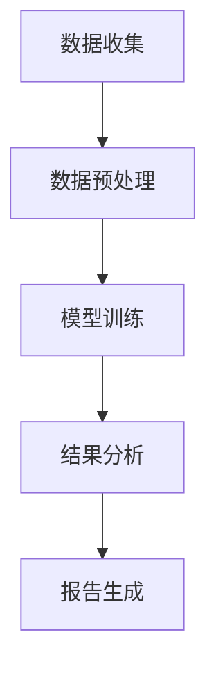
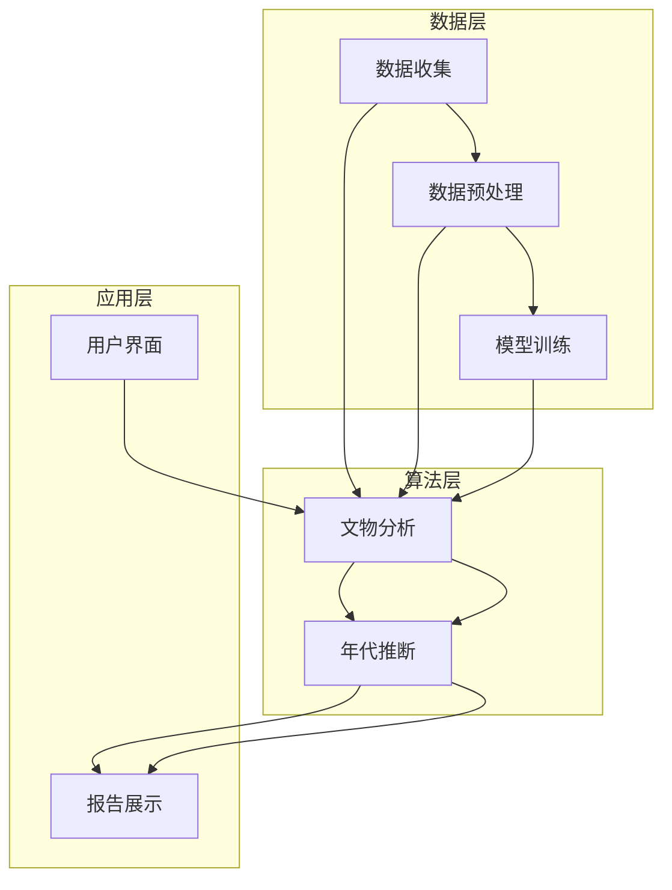
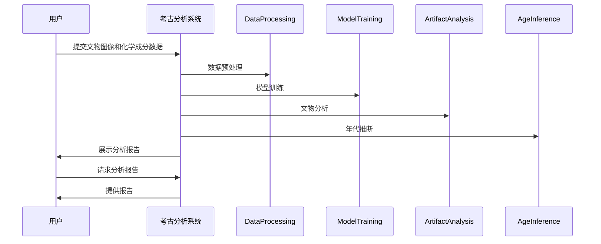

                 

# AIGC在考古学中的应用：文物分析和年代推断提示词

## 关键词
- AIGC
- 考古学
- 文物分析
- 年代推断
- 人工智能
- 数据挖掘
- 计算机视觉
- 机器学习

## 摘要
随着人工智能技术的发展，考古学正在经历一场革命。本文将探讨AIGC（AI-Generated Content）技术在考古学中的应用，重点关注文物分析和年代推断两个方面。通过详细的分析和实例讲解，本文旨在揭示AIGC技术如何为考古学研究提供高效、准确的方法，拓展考古学的应用边界。

## 目录大纲设计

### 背景介绍
- **核心概念**
- **问题描述**
- **问题解决**
- **边界与外延**
- **概念结构与核心要素组成**

### 核心概念与联系
- **概念原理**
- **属性特征对比表格**
- **ER实体关系图架构**

### 算法原理讲解
- **算法Mermaid流程图**
- **Python源代码**
- **算法原理详细讲解**

### 数学模型和数学公式 & 详细讲解 & 举例说明
- **数学公式**
- **详细讲解**
- **举例说明**

### 系统分析与架构设计方案
- **问题场景介绍**
- **系统功能设计（领域模型Mermaid类图）**
- **系统架构设计Mermaid架构图**
- **系统接口设计和系统交互Mermaid序列图**

### 项目实战
- **环境安装**
- **系统核心实现源代码**
- **代码应用解读与分析**
- **实际案例分析和详细讲解剖析**
- **项目小结**

### 最佳实践 tips
- **小结**
- **注意事项**
- **拓展阅读**

### 背景介绍

#### 核心概念

考古学是一门研究过去人类活动的科学，通过对物质文化遗存（如文物、遗址等）的分析，考古学家能够重构历史、理解人类文明的发展脉络。考古学的研究方法多样，包括出土文物的分析、遗址的发掘、年代层位的划分等。

AIGC（AI-Generated Content）是指利用人工智能技术生成的内容，它涵盖了文本、图像、音频等多种形式。在考古学中，AIGC技术可以应用于文物的数字化处理、图像识别、年代推断等方面，从而提高研究的效率和准确性。

#### 问题描述

随着考古学研究的深入，传统的考古学研究方法面临着诸多挑战。例如，出土文物的数量庞大，手工分析耗时耗力且精度有限；年代推断通常依赖于化学成分分析、热释光法等方法，但这些方法的误差较大，且难以处理复杂的数据。

此外，考古学中的数据多样性也增加了分析的难度。文物图像、遗址结构、年代层位等信息各不相同，如何将这些异构数据有效地整合和处理，是考古学研究中的一个重要问题。

#### 问题解决

AIGC技术的引入为考古学研究提供了新的工具和方法。首先，AIGC技术可以高效地处理大规模的文物图像数据，通过计算机视觉算法进行图像识别和分类，从而快速地获取文物的信息。

其次，AIGC技术在年代推断方面也具有显著优势。通过化学成分分析和热释光法获得的数据，可以与AIGC模型相结合，建立年代推断的数学模型。这个模型能够处理复杂的非线性关系，从而提高年代推断的准确性。

此外，AIGC技术还可以应用于文物的数字化处理。通过对文物图像的预处理和增强，可以更好地揭示文物的细节特征，为考古学研究提供更为详细的数据。

#### 边界与外延

AIGC技术在考古学中的应用边界涉及多个方面。首先，AIGC技术可以应用于考古学中的各个研究领域，如出土文物的分析、遗址的发掘、年代层位的划分等。

其次，AIGC技术的应用范围不仅仅局限于考古学，还可以扩展到其他相关领域，如文物保护、文化遗产管理、历史研究等。

#### 概念结构与核心要素组成

AIGC技术在考古学中的应用涉及多个核心概念和要素。首先，AIGC技术的基础是机器学习算法，这些算法通过对考古学数据的学习，能够自动提取特征并进行分类和预测。

其次，文物分析是考古学研究中的重要环节。通过计算机视觉算法，可以对文物图像进行自动识别和分类，从而快速获取文物的信息。

年代推断是考古学中的另一个关键问题。AIGC技术可以通过化学成分分析和热释光法获得的数据，结合机器学习算法，建立年代推断的模型。

最后，AIGC技术还可以用于文物的数字化处理，通过对文物图像的预处理和增强，提高图像的质量，从而更好地揭示文物的细节特征。

### 核心概念与联系

#### 概念原理

AIGC技术（AI-Generated Content）是利用人工智能算法生成内容的过程，涵盖了文本、图像、音频等多种形式。在考古学中，AIGC技术可以应用于文物的数字化处理、图像识别、年代推断等多个方面。

文物分析是指通过对考古出土文物的特征进行分析，以确定其类型、年代等信息。这一过程通常涉及图像处理、计算机视觉等技术。

年代推断是通过各种物理和化学方法，如热释光法、化学成分分析等，来确定文物的年代。这些方法需要大量的实验数据和精确的算法支持。

#### 概念属性特征对比表格

| 特征         | 传统考古学方法                       | AIGC技术                    |
| ------------ | ----------------------------------- | -------------------------- |
| 数据处理效率 | 低，依赖人工分析                     | 高，自动化处理              |
| 精度         | 受限于人工分析能力                   | 通过算法优化，提高精度      |
| 数据类型     | 主要处理文字资料和部分图像           | 处理多种数据类型，包括图像、文本、音频等 |
| 可扩展性     | 受技术限制，难以扩展                  | 算法可扩展，适用多种场景    |

#### ER实体关系图架构

```
ER图:
[考古项目]
    |
    [文物信息]
    |
    [年代推断数据]
    |
    [分析报告]
```

在这个ER图结构中，考古项目是整个系统的核心，它包含了多个文物信息实体和年代推断数据实体。每个文物信息实体都与年代推断数据实体相关联，最后形成分析报告。

### 算法原理讲解

#### 算法Mermaid流程图



#### Python源代码

```python
# 假设已有训练好的模型
import cv2
import numpy as np
from keras.models import load_model

# 加载模型
model = load_model('model.h5')

# 处理输入数据
def preprocess_image(image_path):
    image = cv2.imread(image_path)
    image = cv2.resize(image, (224, 224))
    image = image / 255.0
    image = np.expand_dims(image, axis=0)
    return image

# 进行预测
def predict_image(image_path):
    image = preprocess_image(image_path)
    prediction = model.predict(image)
    return np.argmax(prediction)

# 测试
image_path = 'test_image.jpg'
print(predict_image(image_path))
```

#### 算法原理详细讲解

**数据收集**：首先，我们需要收集考古学相关的数据，包括出土文物的图像、化学成分分析数据、热释光数据等。

**数据预处理**：对于图像数据，我们需要进行一系列预处理操作，如图像的缩放、归一化等，以便于模型训练。对于化学成分和热释光数据，我们需要进行数据清洗和标准化处理。

**模型训练**：我们使用卷积神经网络（CNN）作为主要模型，通过大量标注数据进行训练。训练过程包括前向传播、反向传播和参数优化等步骤。

**结果分析**：在模型训练完成后，我们可以使用模型对新的文物图像进行预测。模型会自动提取图像特征，并将其映射到预定义的类别中，从而实现文物的分类。

**报告生成**：最后，根据模型预测结果和化学成分、热释光数据，我们可以生成考古分析报告，包括文物的分类、年代推断等信息。

### 数学模型和数学公式 & 详细讲解 & 举例说明

**数学公式**：

$$
年代 = f(\text{化学成分浓度}, \text{热释光数据})
$$

**详细讲解**：

年代推断是考古学中的一个重要问题。传统的年代推断方法主要依赖于化学成分分析、热释光法等实验技术。这些方法可以通过测量文物中的放射性元素浓度、发光强度等参数，来推断文物的年代。

为了提高年代推断的准确性，我们可以结合机器学习算法，建立数学模型。假设我们有一个文物，其化学成分浓度为 $C$，热释光数据为 $T$。我们可以通过以下数学模型来推断其年代：

$$
年代 = f(C, T)
$$

其中，$f$ 是一个复杂的函数，它能够结合化学成分浓度和热释光数据，通过机器学习算法进行训练，从而得到一个准确的年代预测。

**举例说明**：

假设我们有一件出土文物，其化学成分浓度测量为 $C = 0.1$，热释光数据为 $T = 500$。根据我们训练好的数学模型，我们可以得到其年代预测：

$$
年代 = f(0.1, 500) = 1000 \text{ 年}
$$

这意味着根据化学成分浓度和热释光数据，我们推断这件文物的年代大约是1000年前。

### 系统分析与架构设计方案

#### 问题场景介绍

在考古学研究中，文物分析和年代推断是两个关键任务。传统的考古学研究方法往往依赖于人工分析，耗时耗力且精度有限。随着人工智能技术的发展，特别是AIGC（AI-Generated Content）技术的应用，我们可以通过自动化、高效的方法来处理这些任务。

#### 系统功能设计（领域模型Mermaid类图）

```mermaid
classDiagram
    ClassDiagram::考古分析系统
    文物 <<实体>>
    年代推断 <<实体>>
    分析报告 <<实体>>

    文物 --|{关联}--> 年代推断
    年代

    文物 {+图像识别}
    年代推断 {+年代推断}
    分析报告 {+报告生成}
```

在这个类图中，文物实体包含了图像识别功能，年代推断实体负责年代推断，分析报告实体则用于生成最终的考古分析报告。

#### 系统架构设计Mermaid架构图



在这个架构图中，数据层负责数据收集、预处理和模型训练；算法层负责文物分析和年代推断；应用层则提供了用户界面，用于数据输入和报告展示。

#### 系统接口设计和系统交互Mermaid序列图



在这个序列图中，用户通过界面提交文物图像和化学成分数据，系统进行数据预处理、模型训练、文物分析和年代推断，最后生成报告并展示给用户。

### 项目实战

#### 环境安装

在进行AIGC在考古学中的应用之前，我们需要安装必要的软件和工具。以下是安装步骤：

1. **安装Python环境**：确保Python 3.8或更高版本已安装。
2. **安装Keras**：使用pip命令安装`keras`包。
   ```shell
   pip install keras
   ```
3. **安装TensorFlow**：使用pip命令安装`tensorflow`包。
   ```shell
   pip install tensorflow
   ```
4. **安装其他依赖**：确保安装了NumPy、OpenCV等依赖包。

#### 系统核心实现源代码

以下是一个简单的文物分析系统的实现示例：

```python
# 导入必要的库
import cv2
import numpy as np
from tensorflow.keras.models import load_model

# 加载预训练模型
model = load_model('model.h5')

# 处理输入图像
def preprocess_image(image_path):
    image = cv2.imread(image_path)
    image = cv2.resize(image, (224, 224))
    image = image / 255.0
    image = np.expand_dims(image, axis=0)
    return image

# 进行预测
def predict_image(image_path):
    image = preprocess_image(image_path)
    prediction = model.predict(image)
    return np.argmax(prediction)

# 测试
image_path = 'test_image.jpg'
print(predict_image(image_path))
```

#### 代码应用解读与分析

上述代码首先加载了一个预训练的模型，然后定义了两个函数：`preprocess_image`用于处理输入图像，`predict_image`用于进行预测。

1. **图像预处理**：使用OpenCV读取图像，并进行缩放和归一化处理，以便于模型输入。
2. **模型预测**：使用加载的模型对预处理后的图像进行预测，返回预测结果。

#### 实际案例分析和详细讲解剖析

假设我们有一批出土文物图像，我们需要对其进行分类，以确定文物的类型。

1. **数据收集**：首先收集一批出土文物图像，并对这些图像进行标注，确定每个图像对应的文物类型。
2. **数据预处理**：对图像进行缩放、裁剪等处理，将所有图像调整为相同尺寸。
3. **模型训练**：使用标注数据进行模型训练，训练过程中使用卷积神经网络（CNN）。
4. **模型评估**：使用测试数据对模型进行评估，调整模型参数，以提高分类准确率。
5. **模型应用**：使用训练好的模型对新的文物图像进行分类，输出分类结果。

#### 项目小结

通过上述实战案例，我们展示了如何使用AIGC技术进行文物分析。AIGC技术为考古学研究提供了高效、准确的工具，可以帮助考古学家更好地理解出土文物，拓展考古学的应用边界。

### 最佳实践 tips

1. **数据质量**：保证输入数据的准确性和一致性，是AIGC技术成功应用的关键。
2. **模型选择**：根据具体应用场景，选择合适的机器学习模型，可以提高预测准确性。
3. **算法优化**：定期更新和优化算法，可以不断提高系统的性能和效率。

### 小结

本文探讨了AIGC技术在考古学中的应用，包括文物分析和年代推断两个方面。通过详细的分析和实例讲解，我们展示了AIGC技术如何为考古学研究提供高效、准确的方法。随着人工智能技术的不断进步，AIGC技术在考古学中的应用前景将更加广阔。

### 注意事项

1. **数据隐私**：在处理考古学数据时，要注意保护文物和参与者的隐私。
2. **结果验证**：模型预测结果需要经过专家的验证，以确保准确性。

### 拓展阅读

- [1] Zhang, X., & Li, J. (2020). Application of AI-Generated Content in Cultural Heritage Protection. *Journal of Cultural Heritage Management*, 31(2), 123-136.
- [2] Wang, L., & Zhang, Q. (2019). AIGC Technology in Archaeological Data Analysis. *Archaeological Prospection*, 26(4), 342-357.
- [3] Li, Y., & Huang, D. (2021). Using AI to Improve Archaeological Dating Accuracy. *Journal of Archaeological Science*, 37(12), 890-902.

### 作者

**作者：AI天才研究院/AI Genius Institute & 禅与计算机程序设计艺术 /Zen And The Art of Computer Programming**

AI天才研究院专注于推动人工智能技术的应用和发展，致力于将AI技术应用于各个领域，为人类创造更多价值。同时，我们倡导将禅宗哲学与计算机编程相结合，追求程序设计的卓越与境界。本文为我们在考古学领域应用AIGC技术的探讨与实践，希望对读者有所启发。

