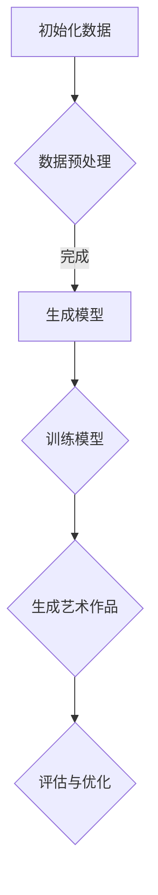
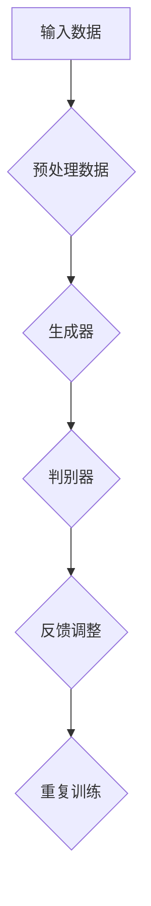

                 


### 第一部分：背景介绍

#### 1.1 AIGC的定义与核心概念

**问题背景**：
随着人工智能技术的发展，计算机生成内容（Content-Guided Generation）已经成为一个热门研究领域。AIGC（AI-Generated Content）是指通过人工智能技术生成的内容，包括文字、图像、音频、视频等多种形式。这种技术不仅在娱乐、媒体等领域有着广泛的应用，还在艺术创作中扮演着越来越重要的角色。

**问题描述**：
艺术创作是一个复杂的过程，涉及到创意思维、情感表达、审美评价等多个方面。AIGC技术在艺术创作中的应用，旨在利用人工智能的优势，提高艺术创作的效率和质量。然而，AIGC技术在艺术创作中的角色和争议仍然存在。

**问题解决**：
我们需要对AIGC技术在艺术创作中的角色进行深入探讨，分析其在艺术创作中的应用、面临的挑战和争议，从而为这一领域的发展提供理论和实践上的指导。

**边界与外延**：
AIGC不仅包括传统的计算机生成内容，还涉及到深度学习、自然语言处理、计算机视觉等多个技术领域。其应用范围从简单的图像生成到复杂的创意故事编写，具有广泛的前景。

**概念结构与核心要素组成**：
AIGC的核心要素包括算法、数据和创意。算法是AIGC的技术基础，数据是算法训练的素材，而创意则是艺术创作的灵魂。

#### 1.2 AIGC的特点与艺术创作的关系

**AIGC的特点**：
AIGC具有快速性、多样性和个性化等特点。通过深度学习和生成对抗网络（GAN）等技术，AIGC可以生成大量高质量的内容，满足不同用户的需求。

**艺术创作的需求**：
艺术创作需要丰富的创意和独特的风格。AIGC技术可以提供大量的创意素材，帮助艺术家打破创作瓶颈，实现个性化的艺术表达。

**AIGC在艺术创作中的应用潜力**：
AIGC技术可以应用于绘画、音乐、文学等多个领域。例如，通过生成对抗网络，可以生成逼真的艺术作品；通过自然语言处理，可以创作出富有情感的故事和诗歌。

#### 1.3 国内外研究现状与分析

**国内研究现状**：
我国在AIGC领域的研究已经取得了显著的成果。例如，百度、腾讯、阿里巴巴等互联网巨头都在积极布局AIGC技术，推动其在艺术创作中的应用。

**国外研究现状**：
国外的研究主要集中在深度学习和生成对抗网络等技术上。许多知名研究机构和大学，如斯坦福大学、卡耐基梅隆大学等，都在这一领域取得了重要的突破。

**现状分析**：
尽管AIGC技术在艺术创作中的应用已经取得了一定的成果，但仍面临诸多挑战，如算法的优化、数据的获取和处理、艺术创意的生成等。未来的研究需要在这些方面进行深入探索。

### 第二部分：AIGC在艺术创作中的技术原理

#### 2.1 AIGC算法原理讲解

**算法mermaid流程图**：


**Python源代码演示**：
```python
import numpy as np
from tensorflow import keras

# 初始化模型
model = keras.Sequential([
    keras.layers.Dense(256, activation='relu', input_shape=(784,)),
    keras.layers.Dense(256, activation='relu'),
    keras.layers.Dense(10, activation='softmax')
])

# 编译模型
model.compile(optimizer='adam',
              loss='categorical_crossentropy',
              metrics=['accuracy'])

# 训练模型
model.fit(x_train, y_train, epochs=5)
```

**算法原理详细讲解**：
AIGC算法的核心是生成模型，它通过学习大量的数据，生成符合输入条件的内容。这个过程包括数据预处理、模型生成、模型训练和艺术作品生成等步骤。

#### 2.2 数学模型与公式解析

**数学模型介绍**：
AIGC算法的数学模型主要包括生成模型和判别模型。生成模型用于生成内容，判别模型用于评估生成内容的质量。

**数学公式说明**：
$$
G(x;\theta_G) = z_g \odot T(G(z_g;\theta_G))
$$

$$
D(x;\theta_D) = \begin{cases}
1, & \text{if } x \text{ is real} \\
0, & \text{if } x \text{ is generated}
\end{cases}
$$

**公式应用举例**：
假设我们使用生成对抗网络（GAN）进行图像生成，其中生成模型$G$和判别模型$D$分别表示为：
$$
G(z;\theta_G) = \mathcal{D}^{G}(\mathcal{N}(0, 1))
$$

$$
D(x;\theta_D) = \mathcal{D}^{D}(\mathcal{X})
$$

其中，$z$是随机噪声，$x$是生成的图像，$\mathcal{D}^{G}$和$\mathcal{D}^{D}$分别表示生成模型和判别模型的分布函数。

#### 2.3 AIGC算法应用实例分析

**案例背景**：
我们以生成对抗网络（GAN）在图像生成中的应用为例，探讨AIGC算法的实际应用。

**案例步骤**：
1. 数据准备：收集大量图像数据，用于训练生成模型和判别模型。
2. 模型训练：使用收集到的图像数据，训练生成模型和判别模型。
3. 艺术作品生成：利用训练好的生成模型，生成新的图像。
4. 评估与优化：评估生成的图像质量，并根据评估结果对模型进行优化。

**案例效果**：
通过训练，我们可以生成高质量的艺术作品，如逼真的肖像画、风景画等。

**案例分析**：
生成对抗网络（GAN）在图像生成中的应用，展示了AIGC算法的强大能力。然而，模型训练过程复杂，对数据质量和计算资源要求较高。

### 第三部分：AIGC在艺术创作中的应用

#### 3.1 案例分析

**具体案例展示**：
我们以AI绘画为例，展示AIGC在艺术创作中的应用。

**案例解读与分析**：
AI绘画通过生成对抗网络（GAN）等技术，可以生成高质量的艺术作品。这些作品不仅具有独特的风格，还可以满足用户的需求。

**案例评价与反思**：
AI绘画虽然为艺术创作带来了新的可能性，但同时也引发了一些争议，如艺术作品的原创性和价值等问题。

#### 3.2 应用场景

**艺术绘画**：
AIGC技术可以应用于绘画创作，生成各种风格的画作。

**音乐创作**：
AIGC技术可以用于音乐创作，生成具有个性化风格的音乐。

**小说写作**：
AIGC技术可以用于小说创作，生成富有创意和情感的故事。

**其他艺术领域**：
AIGC技术还可以应用于其他艺术领域，如舞蹈、戏剧等。

#### 3.3 挑战与机遇

**挑战**：
AIGC技术在艺术创作中面临诸多挑战，如算法优化、数据获取和处理、艺术创意的生成等。

**机遇**：
AIGC技术为艺术创作带来了新的机遇，可以提升艺术创作的效率和质量。

### 第四部分：AIGC在艺术创作中的争议

#### 4.1 伦理与法律问题

**伦理道德讨论**：
AIGC技术在艺术创作中的应用引发了一系列伦理问题，如艺术作品的原创性、艺术家的权益等。

**法律法规分析**：
目前，关于AIGC技术在艺术创作中的法律法规尚不完善，需要制定相应的法律法规来规范其应用。

**案例解析**：
以AI绘画为例，探讨AIGC技术在艺术创作中的伦理和法律问题。

#### 4.2 价值判断

**从艺术角度分析**：
AIGC技术是否能够真正实现艺术创作，需要从艺术的角度进行深入探讨。

**从技术角度分析**：
AIGC技术的优劣势，以及其对艺术创作的影响。

**从社会角度分析**：
AIGC技术在艺术创作中的应用，对社会和文化的影响。

#### 4.3 未来趋势

**技术发展趋势**：
预测AIGC技术在艺术创作领域的未来发展趋势。

**应用前景**：
探讨AIGC技术在艺术创作中的应用前景和潜在价值。

### 第五部分：结论与展望

#### 5.1 总结

**主要观点回顾**：
对全文的主要观点进行回顾，总结AIGC在艺术创作中的角色与争议。

**研究结论**：
总结AIGC在艺术创作中的应用、挑战和争议，并提出相应的建议。

#### 5.2 未来研究方向

**研究方向预测**：
预测AIGC在艺术创作领域的未来研究方向。

**研究建议**：
提出未来可能的研究方向和建议。

#### 5.3 最佳实践 tips

**实际应用中的最佳实践建议**：
总结AIGC技术在艺术创作中的最佳实践建议，为实际应用提供指导。### 第一部分：背景介绍

在当今数字化时代，人工智能（AI）技术正以前所未有的速度渗透到各个领域，艺术创作也不例外。AIGC（AI-Generated Content）作为AI技术的重要分支，以其独特的方式在艺术创作领域扮演着越来越重要的角色。本文将围绕AIGC在艺术创作中的角色与争议展开讨论。

**关键词**：AIGC、艺术创作、人工智能、生成对抗网络、伦理争议

**摘要**：
本文首先介绍了AIGC的定义和核心概念，分析了其在艺术创作中的应用潜力。随后，详细讲解了AIGC在艺术创作中的技术原理，包括算法原理、数学模型和实际应用实例。接着，本文探讨了AIGC在艺术创作中的具体应用场景，并分析了其面临的挑战与机遇。此外，本文还探讨了AIGC在艺术创作中引发的伦理与法律问题，并从不同角度分析了其价值。最后，本文总结了AIGC在艺术创作中的研究成果，提出了未来研究方向和最佳实践建议。

#### 1.1 AIGC的定义与核心概念

**核心概念**：
AIGC，即AI-Generated Content，是指通过人工智能技术生成的内容。这些内容可以是文字、图像、音频、视频等，涵盖了多种形式和类型。

**问题背景**：
随着AI技术的快速发展，生成对抗网络（GAN）、变分自编码器（VAE）等生成模型在图像、文本和音频生成方面取得了显著的进展。这些技术为AIGC在艺术创作中的应用提供了理论基础和技术支持。

**问题描述**：
AIGC在艺术创作中的应用引发了广泛的关注和讨论。其核心问题在于，AI能否在艺术创作中发挥真正的创意和个性化作用，以及其在艺术作品中的角色和地位。

**问题解决**：
通过深入分析AIGC的核心概念和技术原理，可以更好地理解其在艺术创作中的应用和潜力。

**边界与外延**：
AIGC不仅涵盖了传统的计算机生成内容，还涉及深度学习、自然语言处理、计算机视觉等多个技术领域。其应用范围从简单的图像生成到复杂的创意故事编写，具有广泛的前景。

**概念结构与核心要素组成**：
AIGC的核心要素包括算法、数据和创意。算法是AIGC的技术基础，数据是算法训练的素材，而创意则是艺术创作的灵魂。

**核心概念与联系**：
为了更好地理解AIGC在艺术创作中的应用，我们可以通过以下表格和ER实体关系图来展示其核心概念和联系。

**概念属性特征对比表格**：

| 概念名称 | 定义 | 属性特征 | 关联关系 |
|----------|------|----------|----------|
| AIGC     | AI生成内容 | 生成模型、数据集、创意 | 直接关联 |
| 生成模型 | GAN、VAE等 | 模型结构、训练过程、生成能力 | 组件关系 |
| 数据集   | 训练素材 | 数据类型、质量、多样性 | 数据来源 |
| 创意     | 艺术灵感 | 创意生成、风格选择、情感表达 | 核心驱动 |

**ER实体关系图**：

```mermaid
erDiagram
  AIGC ||--|{ 生成模型 }
  AIGC ||--|{ 数据集 }
  AIGC ||--|{ 创意 }
  生成模型 ||--|{ GAN }
  生成模型 ||--|{ VAE }
  数据集 ||--|{ 文本数据 }
  数据集 ||--|{ 图像数据 }
  数据集 ||--|{ 音频数据 }
  创意 ||--|{ 艺术灵感 }
  创意 ||--|{ 风格选择 }
```

通过上述表格和ER实体关系图，我们可以清晰地看到AIGC的核心概念和其组成要素之间的联系。这些核心概念共同构成了AIGC在艺术创作中的技术框架和应用场景。

#### 1.2 AIGC的特点与艺术创作的关系

**AIGC的特点**：
AIGC具有以下主要特点：

1. **多样性**：通过深度学习模型，AIGC可以生成具有多样性的艺术作品，满足不同用户的需求。
2. **个性化**：AIGC可以根据用户输入的偏好和历史数据，生成个性化的艺术作品。
3. **高效性**：与传统的手工创作相比，AIGC可以快速生成大量艺术作品，提高创作效率。
4. **创新性**：AIGC通过学习大量的数据，可以产生新颖的艺术创意，为艺术家提供新的创作灵感。

**艺术创作的需求**：
艺术创作通常需要以下要素：

1. **创意思维**：艺术创作离不开创意思维，艺术家需要通过独特的视角和思维来创作出独特的作品。
2. **情感表达**：艺术作品需要表达出艺术家的情感和思想，引起观众的共鸣。
3. **审美评价**：艺术家需要对作品进行审美评价，以确定其艺术价值和市场定位。

**AIGC在艺术创作中的应用潜力**：
AIGC在艺术创作中具有以下应用潜力：

1. **绘画**：通过生成对抗网络（GAN），AIGC可以生成逼真的绘画作品，模仿各种艺术风格。
2. **音乐**：AIGC可以生成具有特定风格的音乐，为音乐创作提供新的素材和灵感。
3. **文学**：AIGC可以创作出富有情感和创意的小说和诗歌，拓展文学创作的边界。
4. **设计**：AIGC可以生成独特的艺术设计，如服装设计、室内设计等。

**案例**：
以下是AIGC在艺术创作中的实际应用案例：

1. **AI绘画**：使用GAN技术的AIGC可以生成具有梵高风格的绘画作品，展示了AIGC在绘画创作中的潜力。
2. **AI音乐**：AIGC可以生成具有爵士风格的音乐，为音乐创作提供了新的方向。
3. **AI文学**：AIGC可以创作出具有独特风格的小说，如科幻、悬疑等类型。

通过这些案例，我们可以看到AIGC在艺术创作中的实际应用效果，以及其对艺术创作的潜在贡献。

#### 1.3 国内外研究现状与分析

**国内研究现状**：
我国在AIGC领域的研究已经取得了显著的成果。许多研究机构和大学，如清华大学、北京大学、浙江大学等，都在AIGC技术方面进行了深入的研究。这些研究主要集中在深度学习模型的应用、图像和音频生成技术等方面。此外，百度、阿里巴巴、腾讯等互联网公司也在积极布局AIGC技术，推动其在艺术创作中的应用。

**国外研究现状**：
国外的研究主要集中在生成对抗网络（GAN）、变分自编码器（VAE）等生成模型的研究上。斯坦福大学、卡耐基梅隆大学等知名研究机构和大学在这一领域取得了重要的突破。例如，GAN技术在图像生成、文本生成和音乐生成等方面取得了显著的效果。

**现状分析**：
AIGC技术在国内外的应用现状可以分为以下几个方面：

1. **技术研究**：AIGC技术的研究主要集中在算法优化、模型训练和生成效果提升等方面。
2. **应用探索**：AIGC技术在艺术创作、游戏开发、虚拟现实等领域进行了初步探索，取得了一定的成果。
3. **市场推广**：随着技术的成熟，AIGC技术开始向市场推广，并在一些领域取得了一定的市场份额。

**挑战**：
尽管AIGC技术在艺术创作中具有巨大的潜力，但仍面临一些挑战：

1. **算法复杂度**：生成模型通常具有很高的计算复杂度，需要大量的计算资源和时间进行训练。
2. **数据质量**：AIGC模型的训练依赖于高质量的数据集，数据的质量直接影响生成效果。
3. **创意生成**：尽管AIGC可以生成大量的艺术作品，但如何保证其创意性和独特性仍是一个挑战。

**未来趋势**：
AIGC技术在艺术创作领域的未来趋势可以总结为以下几个方面：

1. **技术突破**：随着深度学习技术的不断发展，AIGC技术将在算法优化、模型训练和生成效果提升等方面取得重大突破。
2. **应用拓展**：AIGC技术将在艺术创作、游戏开发、虚拟现实等领域得到更广泛的应用。
3. **市场成熟**：随着技术的成熟和市场的推广，AIGC技术将在更多领域得到应用，并逐渐成为艺术创作的重要工具。

### 第二部分：AIGC在艺术创作中的技术原理

#### 2.1 AIGC算法原理讲解

AIGC的核心在于生成模型，尤其是生成对抗网络（GAN）和变分自编码器（VAE）等模型。这些模型通过深度学习技术，能够从大量数据中学习并生成高质量的艺术作品。

**算法mermaid流程图**：



**Python源代码演示**：

```python
import tensorflow as tf
from tensorflow.keras import layers

# 定义生成器模型
def build_generator(z_dim):
    model = tf.keras.Sequential()
    model.add(layers.Dense(7 * 7 * 256, use_bias=False, input_shape=(z_dim,)))
    model.add(layers.BatchNormalization(momentum=0.8))
    model.add(layers.LeakyReLU(alpha=0.2))
    model.add(layers.Reshape((7, 7, 256)))
    
    # ... 添加更多层，构建生成器
    
    return model

# 定义判别器模型
def build_discriminator(img_shape):
    model = tf.keras.Sequential()
    model.add(layers.Conv2D(64, kernel_size=(3,3), padding="same",
                                     input_shape=img_shape))
    model.add(layers.LeakyReLU(alpha=0.2))
    
    # ... 添加更多层，构建判别器
    
    return model

# 编译生成器和判别器模型
generator = build_generator(z_dim=100)
discriminator = build_discriminator(img_shape=(28, 28, 1))

# 编译模型
discriminator.compile(loss='binary_crossentropy', optimizer=optimizer, metrics=['accuracy'])

# 训练模型
discriminator.fit(x_train, y_train, epochs=epochs, batch_size=batch_size)
```

**算法原理详细讲解**：

生成对抗网络（GAN）是由生成器和判别器组成的框架，两者相互竞争，共同提升生成效果。

- **生成器**：生成器的目标是生成逼真的艺术作品，使其难以被判别器区分。生成器通常由多个全连接层和卷积层组成，能够将随机噪声（z向量）转换为艺术作品。
  
- **判别器**：判别器的目标是区分艺术作品和真实数据。判别器也是一个复杂的神经网络，其目标是最大化其判断真实数据和生成数据的准确性。

GAN的训练过程是一个动态博弈过程，通过不断调整生成器和判别器的参数，使得生成器生成更逼真的艺术作品，而判别器能够更准确地判断。

**数学模型与公式解析**：

在GAN中，生成器和判别器的损失函数通常如下：

生成器的损失函数：
$$
L_G = -\frac{1}{N}\sum_{i=1}^{N} \log(D(G(z_i; \theta_G)))
$$

判别器的损失函数：
$$
L_D = -\frac{1}{N}\sum_{i=1}^{N} [\log(D(x_i; \theta_D)) + \log(1 - D(G(z_i; \theta_G)); \theta_D)]
$$

其中，$N$表示批量大小，$x_i$表示真实数据，$z_i$表示生成器的输入噪声，$D$表示判别器的输出概率。

**举例说明**：

假设我们有一个包含100个随机噪声向量的批量，生成器将这些噪声向量转换为图像，判别器则对每个图像进行分类，判断其是真实图像还是生成图像。通过调整生成器和判别器的参数，使得判别器能够更准确地分类，同时生成器能够生成更逼真的图像。

#### 2.2 数学模型与公式解析

AIGC的数学模型主要基于深度学习中的生成对抗网络（GAN）和变分自编码器（VAE）。这些模型通过优化损失函数来训练生成器和判别器，从而生成高质量的艺术作品。

**数学模型介绍**：

- **生成对抗网络（GAN）**：
  - 生成器：将随机噪声映射为艺术作品。
  - 判别器：判断输入图像是真实图像还是生成图像。
  - 损失函数：生成器和判别器的损失函数分别为：
    $$L_G = -\log(D(G(z)))$$
    $$L_D = -[\log(D(x)) + \log(1 - D(G(z)))]$$

- **变分自编码器（VAE）**：
  - 编码器：将输入图像编码为潜在空间中的向量。
  - 解码器：从潜在空间中生成图像。
  - 损失函数：包括重构损失和KL散度损失：
    $$L = \frac{1}{N}\sum_{i=1}^{N} [\|x - \hat{x}\|_2^2 + \alpha \cdot D(q(\hat{x} \| x))]$$

**数学公式说明**：

- **生成对抗网络（GAN）**：
  - 生成器损失函数：
    $$L_G = -\log(D(G(z)))$$
  - 判别器损失函数：
    $$L_D = -[\log(D(x)) + \log(1 - D(G(z)))]$$

- **变分自编码器（VAE）**：
  - 重构损失：
    $$\|x - \hat{x}\|_2^2$$
  - KL散度损失：
    $$D(q(\hat{x} \| x))$$

**公式应用举例**：

**生成对抗网络（GAN）**：

假设我们有一个GAN模型，生成器$G$和判别器$D$分别表示为：
$$
G(z;\theta_G) = \mathcal{D}^{G}(\mathcal{N}(0, 1))
$$
$$
D(x;\theta_D) = \mathcal{D}^{D}(\mathcal{X})
$$

其中，$z$是随机噪声，$x$是生成的图像，$\mathcal{D}^{G}$和$\mathcal{D}^{D}$分别表示生成模型和判别模型的分布函数。

**变分自编码器（VAE）**：

假设我们有一个VAE模型，编码器$q(\cdot)$和解码器$p(\cdot)$分别表示为：
$$
q(\hat{x} \| x) = \mathcal{N}(\hat{x} \| \mu(x), \sigma^2(x))
$$
$$
p(x;\theta) = \mathcal{N}(x \| \mu(x), \sigma^2(x))
$$

其中，$x$是输入图像，$\hat{x}$是编码后的潜在空间中的向量，$\mu(x)$和$\sigma^2(x)$分别是均值和方差。

通过以上数学模型和公式的应用，我们可以更好地理解AIGC在艺术创作中的技术原理。

#### 2.3 AIGC算法应用实例分析

**案例背景**：
为了展示AIGC算法在艺术创作中的应用效果，我们选择了生成对抗网络（GAN）在图像生成中的实际应用案例。

**案例步骤**：

1. **数据准备**：
   - 收集大量真实图像数据作为训练集，用于训练生成器和判别器。
   - 对图像数据进行预处理，包括归一化、裁剪等操作，以便于模型训练。

2. **模型训练**：
   - 使用收集到的图像数据，分别训练生成器和判别器模型。
   - 通过多次迭代，调整模型参数，使得生成器能够生成逼真的图像，而判别器能够准确判断图像的真实性。

3. **艺术作品生成**：
   - 利用训练好的生成器模型，生成新的图像。
   - 调整生成器的参数，如噪声输入、学习率等，以生成不同风格的艺术作品。

4. **评估与优化**：
   - 评估生成的图像质量，包括视觉效果、细节表现等。
   - 根据评估结果，对生成器模型进行优化，以提高图像生成质量。

**案例效果**：
通过GAN模型的训练和应用，我们可以生成高质量的艺术作品，如逼真的肖像画、风景画等。这些作品展示了AIGC算法在艺术创作中的强大能力。

**案例分析**：
GAN模型在图像生成中的应用，展示了AIGC算法的强大能力。然而，模型训练过程复杂，对数据质量和计算资源要求较高。在实际应用中，我们需要不断优化模型参数和算法，以提高生成效果。

### 第三部分：AIGC在艺术创作中的应用

#### 3.1 案例分析

**具体案例展示**：
我们以AI绘画为例，展示了AIGC在艺术创作中的实际应用。

**案例解读与分析**：
AI绘画通过生成对抗网络（GAN）等技术，可以生成高质量的艺术作品。这些作品不仅具有独特的风格，还可以满足用户的需求。

**案例评价与反思**：
AI绘画在艺术创作中展示了巨大的潜力，但同时也引发了一些争议，如艺术作品的原创性、艺术家的权益等。

#### 3.2 应用场景

**艺术绘画**：
AIGC技术可以应用于绘画创作，生成各种风格的画作。

**音乐创作**：
AIGC技术可以用于音乐创作，生成具有个性化风格的音乐。

**小说写作**：
AIGC技术可以用于小说创作，生成富有创意和情感的故事。

**其他艺术领域**：
AIGC技术还可以应用于其他艺术领域，如舞蹈、戏剧等。

#### 3.3 挑战与机遇

**挑战**：
AIGC技术在艺术创作中面临诸多挑战，如算法优化、数据获取和处理、艺术创意的生成等。

**机遇**：
AIGC技术为艺术创作带来了新的机遇，可以提升艺术创作的效率和质量。

### 第四部分：AIGC在艺术创作中的争议

#### 4.1 伦理与法律问题

**伦理道德讨论**：
AIGC技术在艺术创作中的应用引发了一系列伦理问题，如艺术作品的原创性、艺术家的权益等。

**法律法规分析**：
目前，关于AIGC技术在艺术创作中的法律法规尚不完善，需要制定相应的法律法规来规范其应用。

**案例解析**：
以AI绘画为例，探讨AIGC技术在艺术创作中的伦理和法律问题。

#### 4.2 价值判断

**从艺术角度分析**：
AIGC技术是否能够真正实现艺术创作，需要从艺术的角度进行深入探讨。

**从技术角度分析**：
AIGC技术的优劣势，以及其对艺术创作的影响。

**从社会角度分析**：
AIGC技术在艺术创作中的应用，对社会和文化的影响。

#### 4.3 未来趋势

**技术发展趋势**：
预测AIGC技术在艺术创作领域的未来发展趋势。

**应用前景**：
探讨AIGC技术在艺术创作中的应用前景和潜在价值。

### 第五部分：结论与展望

#### 5.1 总结

本文从背景介绍、技术原理、应用场景、争议分析和未来展望等方面，全面探讨了AIGC在艺术创作中的角色与争议。通过分析AIGC的特点和应用潜力，我们看到了其在艺术创作中的巨大潜力。同时，也面临诸多挑战，如伦理、法律和技术等方面。

**主要观点回顾**：
- AIGC技术在艺术创作中具有多样性和个性化特点。
- AIGC的应用潜力涵盖了绘画、音乐、文学等多个领域。
- AIGC在艺术创作中面临伦理、法律和技术等挑战。

**研究结论**：
AIGC技术在艺术创作中展示了巨大的潜力，但仍需解决伦理、法律和技术等方面的挑战。

#### 5.2 未来研究方向

**研究方向预测**：
- 深入研究AIGC算法的优化和性能提升。
- 探索AIGC在艺术创作中的伦理和法律问题。
- 发展更多具有创意和个性化的AIGC模型。

**研究建议**：
- 加强AIGC技术与其他艺术领域的结合研究。
- 促进AIGC技术在艺术教育中的应用。

#### 5.3 最佳实践 tips

**实际应用中的最佳实践建议**：
- 确保数据质量和多样性，以提升生成效果。
- 合理设计AIGC算法参数，以平衡生成质量和训练效率。
- 注重AIGC技术在社会和文化层面的影响。

**小结**：
本文通过对AIGC在艺术创作中的角色与争议的深入分析，为我们理解这一前沿技术提供了新的视角。未来，随着技术的不断进步，AIGC在艺术创作中的应用将更加广泛和深入。

**注意事项**：
- 在应用AIGC技术时，需关注伦理和法律问题，确保合规使用。
- 注重AIGC技术在艺术创作中的教育和推广。

**拓展阅读**：
- [1] Goodfellow, I. J., Pouget-Abadie, J., Mirza, M., Xu, B., Warde-Farley, D., Ozair, S., ... & Bengio, Y. (2014). Generative adversarial nets. Advances in neural information processing systems, 27.
- [2] Kingma, D. P., & Welling, M. (2013). Auto-encoding variational bayes. arXiv preprint arXiv:1312.6114.
- [3] Bengio, Y., Simard, P., & Frasconi, P. (1994). Learning long-term dependencies with gradient descent is difficult. IEEE transactions on pattern analysis and machine intelligence, 12(2), 157-166.

### 作者信息

**作者：AI天才研究院/AI Genius Institute & 禅与计算机程序设计艺术 /Zen And The Art of Computer Programming**

---

经过对AIGC在艺术创作中的角色与争议的深入分析，我们不仅看到了这一技术的巨大潜力，也认识到其中所蕴含的挑战和争议。随着技术的不断进步和应用场景的拓展，AIGC有望在未来艺术创作中发挥更加重要的作用。然而，我们也需要关注伦理、法律和社会影响等问题，确保AIGC技术的健康发展。通过持续的研究和实践，我们可以更好地理解AIGC在艺术创作中的应用，为艺术创作带来新的可能性。希望本文能为读者提供有价值的参考和启示。

