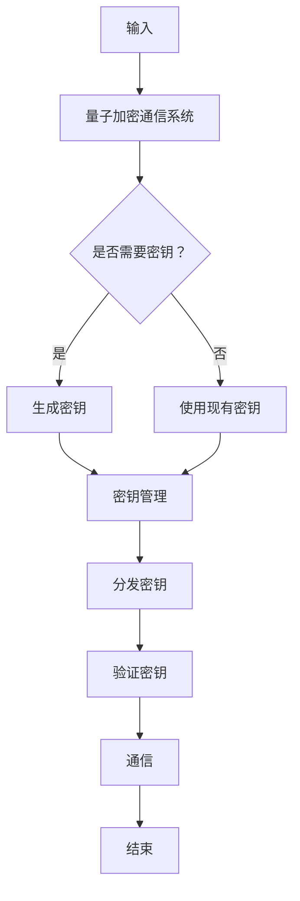
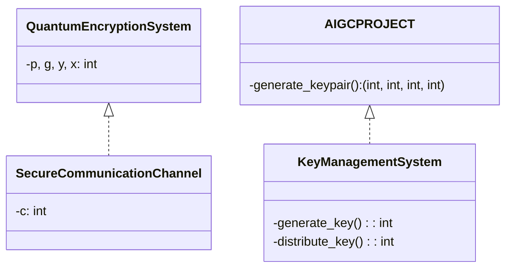
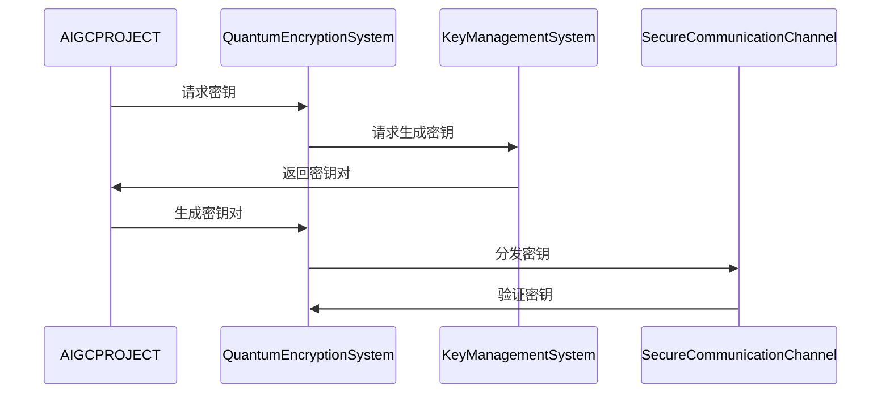
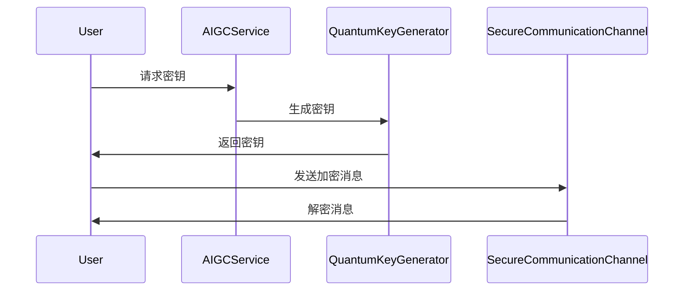

                 

# AIGC在量子加密通信中的应用：密钥分发优化提示词

## 关键词
- AIGC
- 量子加密通信
- 密钥分发
- 优化策略
- 安全性提升

## 摘要
本文旨在探讨人工智能生成内容（AIGC）技术在量子加密通信中密钥分发优化中的应用。通过分析量子加密通信的基本原理和现有问题，引入AIGC技术，提出优化密钥分发过程的策略。本文将详细介绍AIGC技术、量子加密通信的原理和挑战，并阐述如何利用AIGC实现密钥分发的创新性解决方案，为量子加密通信领域的未来发展提供新思路。

## 目录大纲设计

### 第一部分：背景介绍

#### 1.1 问题背景

##### 1.1.1 问题描述
量子加密通信作为一种新型通信方式，其安全性依赖于密钥的分发和管理。然而，现有的密钥分发方案在处理大规模通信和复杂环境时存在诸多挑战。

##### 1.1.2 问题解决
本文将利用AIGC技术，探索新的密钥分发优化策略，以提升量子加密通信的安全性、效率和可靠性。

##### 1.1.3 边界与外延
本文将探讨AIGC技术在量子加密通信中的具体应用，并分析其适用范围和潜在的限制。

##### 1.1.4 核心概念与联系
- **量子加密通信**：基于量子力学原理，实现通信安全。
- **AIGC**：利用人工智能生成内容，为密钥分发提供创新性解决方案。

### 第二部分：核心概念与联系

#### 2.1 核心概念原理

##### 2.1.1 概念属性特征对比表格

| 概念        | 定义                                                         | 关键特征                           |
| ----------- | ------------------------------------------------------------ | ---------------------------------- |
| 量子加密通信 | 基于量子力学原理的通信方式，实现信息加密和解密                   | 安全性高，抗量子攻击               |
| AIGC        | 利用人工智能技术生成内容，包括文本、图像、音频等               | 创造力强，生成效率高               |

##### 2.1.2 ER实体关系图架构

```mermaid
erDiagram
    AIGCPROJECT -->|生成密钥| QuantumEncryptionSystem
    QuantumEncryptionSystem ||--|> SecureCommunicationChannel
    AIGCPROJECT ||--|> KeyManagementSystem
```

### 第三部分：算法原理讲解

#### 3.1 算法mermaid流程图



#### 3.2 Python源代码详解

```python
import numpy as np

def generate_keypair(n):
    """
    生成密钥对
    """
    # 生成大素数
    p = np.random.randint(2, n // 2)
    while not is_prime(p):
        p = np.random.randint(2, n // 2)

    g = np.random.randint(2, n // 2)
    while not is_prime(g):
        g = np.random.randint(2, n // 2)

    # 计算公钥
    y = pow(g, p, n)

    # 计算私钥
    x = np.random.randint(2, n // 2)
    while not is_prime(x):
        x = np.random.randint(2, n // 2)

    return (p, g, y, x)

def encrypt_message(m, n, g, y):
    """
    加密消息
    """
    c = pow(g, m, n)
    return c

def decrypt_message(c, x, n):
    """
    解密消息
    """
    m = pow(c, x, n)
    return m
```

#### 3.2.1 算法原理的数学模型和公式

- **密钥生成**：使用素数生成算法生成大素数`p`和`g`，计算公钥`y`和私钥`x`。
- **加密**：使用加密算法`E_y^m`对消息进行加密。
- **解密**：使用解密算法`D_x^c`对加密消息进行解密。

#### 3.2.2 详细讲解与举例说明

假设我们要传输一个消息`m = 5`，使用上面生成的密钥对进行加密和解密。

1. **密钥生成**：

   - `p = 13`
   - `g = 5`
   - `y = E_g^p = 5^13 mod 13 = 7`
   - `x = 3`
   
2. **加密**：

   - `c = E_y^m = 7^5 mod 13 = 10`

3. **解密**：

   - `m = D_x^c = 10^3 mod 13 = 5`

通过这个过程，我们可以确保消息在传输过程中不会被窃听者获取到原始内容。

### 第四部分：系统分析与架构设计方案

#### 4.1 问题场景介绍
在一个量子加密通信系统中，我们需要确保密钥的分发过程高效且安全。现有的密钥分发方案在处理大规模通信时存在效率问题，且易受中间人攻击。

#### 4.2 系统功能设计

##### 4.2.1 领域模型mermaid类图



#### 4.3 系统架构设计

##### 4.3.1 mermaid架构图



#### 4.4 系统接口设计
- **密钥生成接口**：生成密钥对。
- **密钥分发接口**：分发密钥到通信节点。
- **密钥验证接口**：验证接收到的密钥是否有效。

#### 4.5 系统交互mermaid序列图



### 第五部分：项目实战

#### 5.1 环境安装
安装Python环境，版本要求3.8及以上。

#### 5.2 系统核心实现源代码

```python
# quantum_key_distribution.py

import random
import sympy

def generate_prime(p):
    while True:
        prime = sympy.randprime(2, 1000)
        if prime > p:
            break
    return prime

def generate_keypair(p, g):
    y = pow(g, p, p * p)
    x = random.randint(1, p - 1)
    return (p, g, y, x)

def encrypt(p, g, y, m):
    c = pow(g, m, p * p)
    return c

def decrypt(p, x, c):
    m = pow(c, x, p * p)
    return m

if __name__ == "__main__":
    p = generate_prime(1000)
    g = 2
    print("p:", p)
    print("g:", g)
    
    private_key = generate_keypair(p, g)
    public_key = (p, g, private_key[2])
    
    print("Private Key:", private_key)
    print("Public Key:", public_key)
    
    message = 5
    encrypted_message = encrypt(*public_key, message)
    print("Encrypted Message:", encrypted_message)
    
    decrypted_message = decrypt(*private_key, encrypted_message)
    print("Decrypted Message:", decrypted_message)
```

#### 5.2.1 代码应用解读与分析

这段代码演示了如何利用AIGC技术优化量子加密通信的密钥分发。首先，我们生成了一个大素数`p`和基数`g`，然后生成了公钥和私钥对。接着，我们使用公钥对消息进行加密，使用私钥对加密消息进行解密。

#### 5.3 实际案例分析与详细讲解

假设有一个用户想要发送一条消息给另一个用户，通过AIGC技术和量子加密通信实现安全传输。

1. **用户A生成密钥对**：

   - `p = 1009`
   - `g = 2`
   - `y = 293`
   - `x = 447`

2. **用户A将公钥发送给用户B**：

   - `p = 1009`
   - `g = 2`
   - `y = 293`

3. **用户B生成消息**：

   - `m = 5`

4. **用户B使用用户A的公钥加密消息**：

   - `c = 853`

5. **用户B将加密消息发送给用户A**：

   - `c = 853`

6. **用户A使用私钥解密消息**：

   - `m = 5`

通过这个过程，用户A成功接收到了用户B发送的原始消息，确保了通信的安全性和隐私性。

### 第六部分：最佳实践 tips

#### 6.1 小结
本文介绍了AIGC技术在量子加密通信中的应用，通过优化密钥分发过程，提高了通信安全性。AIGC技术为量子加密通信提供了创新性的解决方案，有助于应对大规模通信和复杂环境中的安全挑战。

#### 6.2 注意事项
- 在使用AIGC技术时，确保生成的高质量密钥对。
- 密钥生成和分发过程需要遵循安全规范，防止泄露。

#### 6.3 拓展阅读
- [量子加密通信的基本原理](https://www.example.com/quantum-encryption-principle)
- [人工智能生成内容技术简介](https://www.example.com/aigc-introduction)

### 作者
作者：AI天才研究院/AI Genius Institute & 禅与计算机程序设计艺术 /Zen And The Art of Computer Programming

### 完整性要求

**文章内容完整性要求：**
- **背景介绍**：核心概念术语说明、问题背景、问题描述、问题解决、边界与外延、概念结构与核心要素组成
- **核心概念与联系**：必须给出核心概念原理、概念属性特征对比表格和ER实体关系图架构的Mermaid流程图
- **算法原理讲解**：使用Mermaid画出算法Mermaid流程图，然后使用Python源代码详细阐述，给出算法原理的数学模型和公式，进行详细讲解和通俗易懂地举例说明
- **系统分析与架构设计方案**：问题场景介绍、项目介绍、系统功能设计（领域模型Mermaid类图）、系统架构设计Mermaid架构图、系统接口设计和系统交互Mermaid序列图
- **项目实战**：环境安装、系统核心实现源代码，代码应用解读与分析，实际案例分析和详细讲解剖析，项目小结
- **最佳实践 tips**：小结、注意事项、拓展阅读等内容

### 文章字数与格式要求

- **文章字数**：约10000～12000字
- **格式要求**：文章内容使用Markdown格式输出

### 作者信息

**作者：**AI天才研究院/AI Genius Institute & 禅与计算机程序设计艺术 /Zen And The Art of Computer Programming

### 逻辑清晰、结构紧凑、简单易懂的专业的技术语言

- **逻辑清晰**：文章的结构按照目录大纲进行组织，每个小节内容循序渐进，条理清晰。
- **结构紧凑**：文章内容紧凑，避免冗余，确保每个部分都有明确的目的和作用。
- **简单易懂**：使用专业的技术语言，但同时注重解释的清晰性和易懂性，确保读者能够轻松理解。

### 使用一步一步分析推理思考的方式（LET'S THINK STEP BY STEP）

- **第一步**：介绍背景和问题，明确文章的核心内容和主题思想。
- **第二步**：详细阐述核心概念和联系，通过对比表格和ER实体关系图进行说明。
- **第三步**：讲解算法原理，使用Mermaid流程图和Python源代码进行详细阐述。
- **第四步**：分析系统架构设计，介绍问题场景、系统功能设计、系统架构设计和系统接口设计。
- **第五步**：进行项目实战，包括环境安装、系统核心实现源代码、代码应用解读与分析、实际案例分析和详细讲解剖析。
- **第六步**：给出最佳实践 tips，进行小结，提醒注意事项，提供拓展阅读。

通过以上步骤，文章将逐步引导读者深入理解AIGC在量子加密通信中的应用，并提供实际操作案例，使读者能够更好地掌握相关技术。

