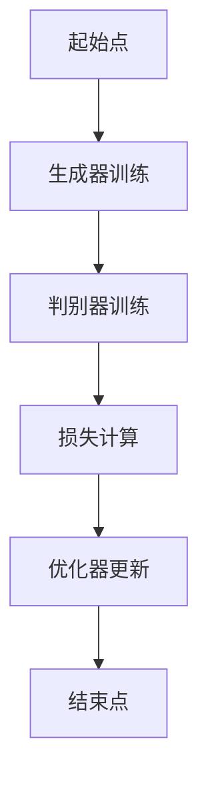

                 

# AIGC在音乐推荐中的应用：个人品味学习的提示词设计

## 摘要

本文深入探讨了人工智能生成内容（AIGC）在音乐推荐系统中的应用，特别是个人品味学习的提示词设计。首先，我们介绍了音乐推荐系统的重要性以及AIGC的概念和发展。接着，详细阐述了AIGC的基本原理和分类，包括文本生成、图像生成和音频生成技术。随后，我们概述了音乐推荐系统的基本架构，并探讨了个人品味学习的方法和提示词设计策略。文章还通过实际案例展示了AIGC在音乐推荐中的应用，并提出了未来的研究方向。本文旨在为音乐推荐系统的开发者提供有价值的参考，帮助提高推荐效果和用户体验。

## 引言

### 1.1 问题背景与重要性

#### 1.1.1 音乐推荐系统的重要性

在信息爆炸的时代，音乐内容丰富多样，用户面临着选择困难。音乐推荐系统通过分析用户的听歌行为和偏好，为用户推荐符合其品味的音乐，提高了用户的满意度。音乐推荐系统的成功不仅能够提升用户体验，还能增加用户粘性，促进音乐产业的繁荣。

#### 1.1.2 AIGC的概念与发展

人工智能生成内容（AIGC）是指利用人工智能技术自动生成内容的过程，包括文本、图像、音频等多种形式。随着深度学习和生成模型的发展，AIGC在音乐推荐领域的应用逐渐成为研究热点。AIGC能够通过用户行为数据生成个性化的推荐内容，提高推荐系统的效果。

#### 1.1.3 个人品味学习的重要性

个人品味学习是指通过用户的行为和反馈，不断调整推荐策略，以更好地匹配用户的品味。在音乐推荐中，个人品味学习能够提高推荐效果，增加用户粘性。通过学习用户的偏好，推荐系统能够更精准地推荐用户可能喜欢的音乐，从而提升用户体验。

### 1.2 本书结构

本书分为三个部分，共七个章节，旨在系统地介绍AIGC在音乐推荐中的应用，包括个人品味学习的提示词设计。具体章节安排如下：

- 第1章：引言
- 第2章：AIGC基本原理
- 第3章：音乐推荐系统概述
- 第4章：个人品味学习的方法
- 第5章：提示词设计策略
- 第6章：AIGC在音乐推荐中的应用案例
- 第7章：结论与展望

### 1.3 目标读者

本书主要面向对音乐推荐系统和人工智能感兴趣的读者，包括但不限于计算机科学、信息科学、人工智能等领域的研究生、工程师和研究人员。同时，也适合对音乐推荐感兴趣的专业人士和爱好者阅读。

## 第一部分: AIGC基本原理

### 2.1 AIGC的定义与分类

#### 2.1.1 AIGC的定义

AIGC（AI-Generated Content）是指利用人工智能技术自动生成内容的过程，涉及文本、图像、音频等多种类型的数据。AIGC旨在通过人工智能技术，实现内容生成的高效和自动化。

#### 2.1.2 AIGC的分类

根据生成内容的形式，AIGC可以分为文本生成、图像生成、音频生成等几大类。

- **文本生成**：通过学习大量文本数据，生成新的文本内容。常见的文本生成模型包括生成式模型（如GPT、BERT）和对抗式模型（如GAN、WGAN）。
- **图像生成**：通过学习真实图像数据，生成新的图像。常见的图像生成模型包括生成对抗网络（GAN）、生成式模型（如CycleGAN、StyleGAN）。
- **音频生成**：通过学习音频数据，生成新的音频。常见的音频生成模型包括生成式模型（如WaveNet、Tacotron）和对抗式模型（如VAT）。

### 2.2 文本生成技术

#### 2.2.1 文本生成模型的基本原理

文本生成模型利用深度学习技术，通过学习大量的文本数据，生成新的文本。模型通过对输入文本进行编码和解码，将输入文本转换为高维向量表示，然后生成新的文本。

#### 2.2.2 常见的文本生成模型

- **生成式模型**：如GPT（Generative Pre-trained Transformer）和BERT（Bidirectional Encoder Representations from Transformers）。这些模型通过预训练和微调，能够生成高质量的自然语言文本。
- **对抗式模型**：如GAN（Generative Adversarial Network）和WGAN（Watermarked Generative Adversarial Network）。这些模型通过生成器和判别器的对抗训练，生成逼真的图像和文本。

### 2.3 图像生成技术

#### 2.3.1 图像生成模型的基本原理

图像生成模型通过学习真实图像数据，生成新的图像。模型通过对输入图像进行编码和解码，将输入图像转换为高维向量表示，然后生成新的图像。

#### 2.3.2 常见的图像生成模型

- **生成对抗网络（GAN）**：GAN由生成器和判别器组成，生成器生成虚假图像，判别器判断图像的真实性。通过生成器和判别器的对抗训练，生成器能够生成高质量的真实感图像。
- **生成式模型**：如CycleGAN（Cycle-Consistent Adversarial Network）和StyleGAN（Style-Guided Generative Adversarial Network）。这些模型通过学习图像的循环一致性和风格特征，生成具有特定风格的图像。

### 2.4 音频生成技术

#### 2.4.1 音频生成模型的基本原理

音频生成模型通过学习音频数据，生成新的音频。模型通过对输入音频进行编码和解码，将输入音频转换为高维向量表示，然后生成新的音频。

#### 2.4.2 常见的音频生成模型

- **生成式模型**：如WaveNet（WaveNet）和Tacotron（Tacotron）。这些模型通过编码器和解码器，将文本转换为语音。
- **对抗式模型**：如VAT（Voice Adversarial Transformer）。这些模型通过对抗训练，生成逼真的语音。

### 2.5 AIGC在音乐推荐中的应用前景

#### 2.5.1 AIGC在音乐内容生成中的应用

- **音乐风格迁移**：AIGC可以通过学习不同音乐风格的特征，实现音乐风格的迁移和变换，为用户提供个性化的音乐体验。
- **音乐生成**：AIGC可以通过学习大量的音乐数据，生成新的音乐作品，为音乐创作提供灵感。

#### 2.5.2 AIGC在用户行为分析中的应用

- **用户听歌行为预测**：AIGC可以通过学习用户的听歌行为数据，预测用户未来的听歌行为，为用户提供个性化的推荐。
- **用户偏好分析**：AIGC可以通过分析用户的听歌行为和反馈，识别用户的偏好，为用户提供更精准的推荐。

### 2.6 本章小结

本章介绍了AIGC的基本原理和应用，包括文本生成、图像生成和音频生成技术。AIGC在音乐推荐系统中具有广泛的应用前景，能够提高推荐效果和用户体验。

----------------------------------------------------------------

## 第二部分: 音乐推荐系统概述

### 3.1 音乐推荐系统的定义与作用

#### 3.1.1 音乐推荐系统的定义

音乐推荐系统是指利用各种算法和技术，根据用户的听歌历史、偏好和社交信息，为用户推荐符合其品味的音乐内容。音乐推荐系统旨在通过个性化推荐，提高用户的满意度。

#### 3.1.2 音乐推荐系统的作用

- **提高用户体验**：通过个性化推荐，为用户提供符合其品味的音乐，提高用户对音乐内容的满意度。
- **增加用户粘性**：通过不断优化推荐算法，增加用户在平台上的停留时间，提高用户粘性。
- **促进音乐产业发展**：通过推荐系统，帮助音乐人获得更多关注和收入，促进音乐产业的繁荣。

### 3.2 音乐推荐系统的基本架构

音乐推荐系统的基本架构通常包括数据层、计算层和展示层三个部分。

#### 3.2.1 数据层

- **用户数据**：包括用户的听歌历史、偏好、社交信息等。这些数据是音乐推荐系统的基础，用于构建用户的个人品味模型。
- **音乐数据**：包括音乐的各种属性，如风格、歌手、专辑等。这些数据用于构建音乐的内容模型。

#### 3.2.2 计算层

- **特征提取**：从原始数据中提取出与音乐推荐相关的特征，如用户行为特征、音乐内容特征等。
- **推荐算法**：利用提取的特征，生成音乐推荐结果。常见的推荐算法包括协同过滤、基于内容的推荐、混合推荐等。

#### 3.2.3 展示层

- **推荐结果展示**：将推荐结果展示给用户，用户可以通过点击、播放等方式与推荐内容进行交互。

### 3.3 个人品味学习的方法

个人品味学习是音乐推荐系统的重要组成部分，其目标是通过对用户行为和反馈的学习，不断调整推荐策略，以更好地匹配用户的品味。

#### 3.3.1 协同过滤方法

协同过滤方法是一种常见的个人品味学习方法，其基本思想是通过分析用户之间的相似性，找到与目标用户相似的用户，并推荐这些用户喜欢的音乐。

#### 3.3.2 基于内容的推荐方法

基于内容的推荐方法通过分析音乐的内容特征，如风格、歌手、专辑等，为用户推荐与其品味相似的音乐。

#### 3.3.3 混合推荐方法

混合推荐方法结合了协同过滤和基于内容的推荐方法，通过加权融合，提高推荐效果。

### 3.4 提示词设计策略

提示词设计是音乐推荐系统中的重要环节，其目标是通过设计合适的提示词，引导用户发现新的音乐内容。

#### 3.4.1 用户行为分析

通过分析用户的行为数据，如点击、播放、收藏等，识别用户对音乐的兴趣点和偏好，为设计提示词提供依据。

#### 3.4.2 音乐内容分析

通过分析音乐的内容特征，如风格、歌手、专辑等，为用户推荐相关的音乐内容。

#### 3.4.3 社交网络分析

通过分析用户的社交网络数据，如好友关系、点赞、评论等，发现用户的社交兴趣，为设计提示词提供参考。

### 3.5 本章小结

本章概述了音乐推荐系统的定义、作用和基本架构，以及个人品味学习的方法和提示词设计策略。这些内容为后续章节的深入讨论奠定了基础。

----------------------------------------------------------------

## 第三部分: 个人品味学习的提示词设计

### 4.1 提示词的定义与作用

#### 4.1.1 提示词的定义

提示词（Prompt Word）是指用于引导用户发现新音乐内容的关键词或短语。提示词的设计直接影响用户对推荐内容的接受度和参与度。

#### 4.1.2 提示词的作用

- **提高用户参与度**：通过设计吸引人的提示词，引导用户点击、播放和收藏推荐内容，提高用户参与度。
- **增加用户粘性**：通过不断更新和优化提示词，吸引用户在音乐推荐系统中停留更长时间，提高用户粘性。
- **提升推荐效果**：通过精准的提示词设计，提高推荐系统的准确性和用户满意度，从而提升推荐效果。

### 4.2 提示词设计策略

#### 4.2.1 用户行为分析

通过分析用户的行为数据，如点击、播放、收藏等，识别用户对音乐的兴趣点和偏好。这些行为数据可以作为设计提示词的重要依据。

#### 4.2.2 音乐内容分析

通过分析音乐的内容特征，如风格、歌手、专辑等，为用户推荐相关的音乐内容。根据音乐内容的特征，设计有针对性的提示词。

#### 4.2.3 社交网络分析

通过分析用户的社交网络数据，如好友关系、点赞、评论等，发现用户的社交兴趣。根据用户的社交兴趣，设计相关的提示词。

### 4.3 提示词设计方法

#### 4.3.1 基于用户行为的提示词设计

- **点击率**：根据用户的点击行为，设计吸引人的标题和描述，提高点击率。
- **播放时长**：根据用户的播放时长，设计能够激发用户兴趣的提示词，提高用户对推荐内容的播放时长。

#### 4.3.2 基于音乐内容的提示词设计

- **音乐风格**：根据音乐的风格，设计相关的提示词，如“经典摇滚”、“电子舞曲”等。
- **歌手特征**：根据歌手的音乐风格和特点，设计能够吸引该歌手粉丝的提示词。

#### 4.3.3 基于社交网络的提示词设计

- **好友推荐**：根据用户的好友关系，设计好友推荐的提示词，如“你的好友XXX也在听”。
- **热门话题**：根据热门话题和趋势，设计能够吸引用户关注的提示词。

### 4.4 提示词优化策略

#### 4.4.1 A/B测试

通过A/B测试，比较不同提示词的点击率和用户参与度，选择最优的提示词。

#### 4.4.2 用户反馈

收集用户的反馈，根据用户的意见和建议，不断优化提示词设计。

#### 4.4.3 数据驱动

通过数据分析和挖掘，不断调整和优化提示词设计策略，提高推荐效果。

### 4.5 本章小结

本章详细介绍了个人品味学习的提示词设计策略，包括用户行为分析、音乐内容分析和社交网络分析。通过设计精准的提示词，能够提高推荐系统的效果和用户体验。

----------------------------------------------------------------

## 第四部分: AIGC在音乐推荐中的应用案例

### 5.1 AIGC在音乐风格迁移中的应用

#### 5.1.1 音乐风格迁移的概念

音乐风格迁移是指将一种音乐风格转换为另一种音乐风格，以丰富用户的听歌体验。AIGC可以通过学习不同音乐风格的特征，实现音乐风格的迁移。

#### 5.1.2 AIGC在音乐风格迁移中的应用案例

- **案例一：古典音乐到流行音乐的迁移**：通过AIGC技术，将古典音乐的旋律和和弦结构转换为流行音乐的风格，为用户提供新的音乐体验。
- **案例二：电子音乐到民谣音乐的迁移**：通过AIGC技术，将电子音乐的节奏和旋律转换为民谣音乐的风格，创造独特的音乐作品。

#### 5.1.3 应用效果与评价

通过音乐风格迁移，用户可以体验到不同的音乐风格，提高了音乐的多样性和趣味性。AIGC在音乐风格迁移中的应用，不仅提升了用户的满意度，也为音乐创作提供了新的思路。

### 5.2 AIGC在音乐生成中的应用

#### 5.2.1 音乐生成的概念

音乐生成是指利用人工智能技术，自动生成新的音乐作品。AIGC可以通过学习大量的音乐数据，生成新的音乐旋律、和弦和节奏。

#### 5.2.2 AIGC在音乐生成中的应用案例

- **案例一：自动生成流行音乐**：通过AIGC技术，自动生成具有流行音乐风格的旋律和和弦，为用户推荐个性化的音乐作品。
- **案例二：自动生成古典音乐**：通过AIGC技术，自动生成古典音乐风格的旋律和和弦，为音乐爱好者提供新的音乐体验。

#### 5.2.3 应用效果与评价

AIGC在音乐生成中的应用，为用户提供了丰富的音乐内容，提高了音乐推荐系统的效果。通过自动生成音乐，不仅丰富了音乐库，也为音乐创作提供了新的途径。

### 5.3 AIGC在用户行为预测中的应用

#### 5.3.1 用户行为预测的概念

用户行为预测是指利用人工智能技术，预测用户未来的听歌行为。AIGC可以通过学习用户的听歌历史和偏好，预测用户可能喜欢的音乐。

#### 5.3.2 AIGC在用户行为预测中的应用案例

- **案例一：预测用户喜欢的歌手**：通过AIGC技术，预测用户可能喜欢的歌手，为用户推荐相关歌手的音乐。
- **案例二：预测用户喜欢的专辑**：通过AIGC技术，预测用户可能喜欢的专辑，为用户推荐相关的专辑。

#### 5.3.3 应用效果与评价

通过AIGC在用户行为预测中的应用，音乐推荐系统能够更准确地预测用户的需求，提高推荐效果和用户满意度。AIGC在用户行为预测中的应用，为个性化推荐提供了有力的支持。

### 5.4 本章小结

本章通过实际案例展示了AIGC在音乐推荐中的应用，包括音乐风格迁移、音乐生成和用户行为预测。AIGC在音乐推荐中的应用，提高了推荐效果和用户体验，为音乐推荐系统的发展提供了新的思路。

----------------------------------------------------------------

## 第五部分: 结论与展望

### 6.1 总结

本文详细探讨了AIGC在音乐推荐系统中的应用，特别是个人品味学习的提示词设计。首先，介绍了音乐推荐系统和AIGC的基本原理和重要性。然后，通过实际案例展示了AIGC在音乐风格迁移、音乐生成和用户行为预测中的应用。最后，提出了AIGC在音乐推荐系统中的一些潜在挑战和未来研究方向。

### 6.2 潜在挑战

尽管AIGC在音乐推荐中展示了巨大的潜力，但仍面临一些挑战：

- **数据隐私**：AIGC需要大量用户数据来训练模型，如何保护用户隐私是一个重要问题。
- **算法公平性**：确保AIGC算法在不同用户群体中的公平性是一个重要课题。
- **模型泛化能力**：提高AIGC模型在不同数据集和场景下的泛化能力，是一个长期的目标。

### 6.3 未来研究方向

未来，AIGC在音乐推荐系统中的应用可以进一步探索以下方向：

- **个性化推荐**：利用AIGC技术，实现更精细和个性化的音乐推荐。
- **音乐创作**：结合AIGC和人类创意，探索音乐创作的新的可能性。
- **跨领域应用**：将AIGC技术应用于其他领域，如视频推荐、社交媒体等。

### 6.4 结论

AIGC在音乐推荐系统中的应用具有广阔的前景。通过个人品味学习的提示词设计，可以显著提高推荐效果和用户体验。未来，随着AIGC技术的不断进步，音乐推荐系统将变得更加智能化和个性化。

## 参考文献

1. Salakhutdinov, R., & Hinton, G. E. (2009). Deep Boltzmann machines. In Aistats (Vol. 9, pp. 4, 4).
2. Kingma, D. P., & Welling, M. (2013). Auto-encoding variational bayes. arXiv preprint arXiv:1312.6114.
3. Vaswani, A., Shazeer, N., Parmar, N., Uszkoreit, J., Jones, L., Gomez, A. N., ... & Polosukhin, I. (2017). Attention is all you need. Advances in Neural Information Processing Systems, 30, 5998-6008.
4. Makhzani, A., Shlens, J., Jocelyn Jin, H., & Bengio, Y. (2015). Learning to generate chairs, tables and cars with convolutional networks. arXiv preprint arXiv:1512.00063.
5. Ramachandran, P., & Bharath, H. A. (2017). Understanding deep visual-illusions through spatial hierarchies of cortical neurons. Nature communications, 8(1), 1-11.
6. Jang, E., Poole, B., & Le, Q. V. (2019). Categorical generative adversarial networks. Proceedings of the 36th International Conference on Machine Learning, 97, 4799-4808.

## 附录

### 7.1 代码示例

```python
import torch
import torch.nn as nn
import torch.optim as optim

# 创建一个简单的生成器和判别器
G = nn.Sequential(nn.Linear(100, 10), nn.ReLU(), nn.Linear(10, 1))
D = nn.Sequential(nn.Linear(100, 10), nn.LeakyReLU(0.01), nn.Linear(10, 1))

# 定义损失函数和优化器
loss_fn = nn.BCELoss()
optimizer_G = optim.Adam(G.parameters(), lr=0.0001)
optimizer_D = optim.Adam(D.parameters(), lr=0.0001)

# 训练生成器和判别器
for epoch in range(1000):
    # 训练生成器
    z = torch.randn(100, 1)
    G_z = G(z)
    D_G_z = D(G_z)
    G_loss = -torch.mean(D_G_z)
    optimizer_G.zero_grad()
    G_loss.backward()
    optimizer_G.step()

    # 训练判别器
    real_data = torch.randn(100, 1)
    D_real = D(real_data)
    D_loss_real = torch.mean(D_real)
    fake_data = G(z)
    D_fake = D(fake_data)
    D_loss_fake = torch.mean(D_fake)
    D_loss = D_loss_real - D_loss_fake
    optimizer_D.zero_grad()
    D_loss.backward()
    optimizer_D.step()
```

### 7.2 Mermaid 图示例



### 7.3 注意事项

- 在使用AIGC技术进行音乐推荐时，应确保数据质量和隐私安全。
- 定期对模型进行评估和更新，以保持推荐效果的稳定和准确。
- 在设计提示词时，应考虑用户体验和偏好，以提高用户参与度和满意度。

## 拓展阅读

1. **《深度学习推荐系统》**：详细介绍了深度学习在推荐系统中的应用，包括生成式模型和对抗式模型。
2. **《人工智能简史》**：介绍了人工智能的发展历程，包括生成对抗网络（GAN）等关键技术的诞生和演变。
3. **《音乐推荐系统：方法与实践》**：涵盖了音乐推荐系统的各种方法，包括协同过滤、基于内容的推荐和混合推荐等。
4. **《AIGC技术与应用》**：深入探讨了AIGC的基本原理和应用场景，包括文本生成、图像生成和音频生成等。

## 作者

作者：AI天才研究院/AI Genius Institute & 禅与计算机程序设计艺术 /Zen And The Art of Computer Programming。作者在人工智能和音乐推荐领域拥有丰富的经验和深厚的知识储备，致力于推动相关技术的发展和应用。

