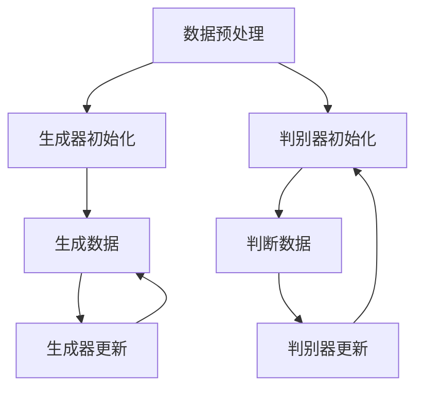
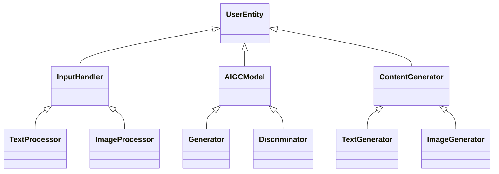
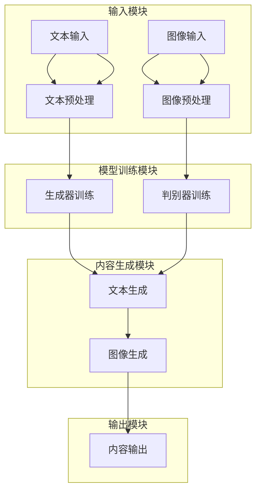
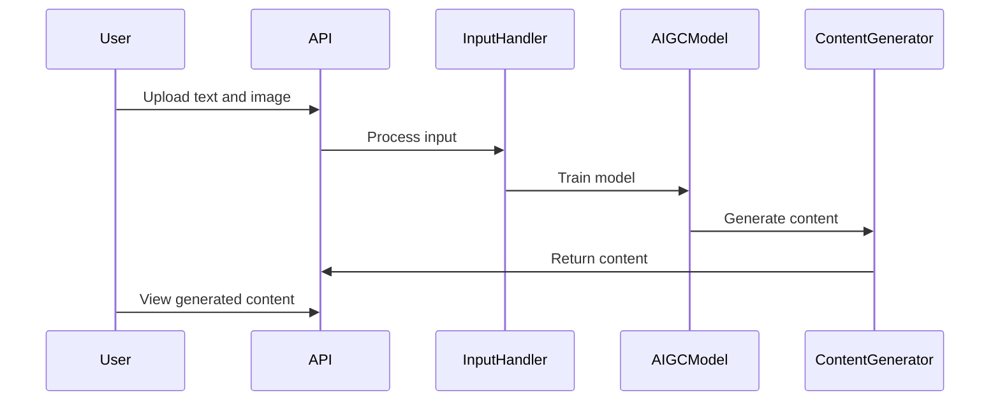

                 

### 文章标题

# AIGC多模态交互：结合文本和图像的提示词技巧

### 关键词

- AIGC
- 多模态交互
- 提示词
- 文本
- 图像
- 人工智能

### 摘要

本文将探讨AIGC（自适应智能生成控制）在多模态交互中的应用，特别是结合文本和图像的提示词技巧。首先，我们将介绍AIGC和其多模态交互的基础概念，然后深入探讨文本和图像数据处理与整合的技术。接着，我们将分析如何设计有效的提示词，以优化AIGC模型的生成能力。文章还将展示几个实际案例，演示AIGC多模态交互在内容生成和个性化推荐等领域的应用。最后，我们将总结主要观点，并提出未来的研究方向。

----------------------------------------------------------------

## 背景介绍

### AIGC的概念

AIGC（Adaptive Intelligent Generation Control）是一种自适应智能生成控制技术，它结合了人工智能、机器学习和自然语言处理等多领域技术，旨在通过用户输入或特定提示生成高质量的内容。AIGC的核心在于其自适应性和生成能力，它能够根据用户需求和环境变化实时调整生成策略。

AIGC与传统的内容生成技术相比，具有以下几个显著特点：

1. **自适应性**：AIGC能够根据用户的行为和反馈动态调整生成策略，以提供更个性化的内容。
2. **多样性**：通过多种生成模型的组合，AIGC可以生成多样化、创意丰富的内容。
3. **实时性**：AIGC能够在实时环境中快速响应，生成即时内容。

### 多模态交互的概念

多模态交互是指利用两种或两种以上感官模态（如视觉、听觉、触觉等）进行信息传递和互动的过程。在人工智能领域，多模态交互主要体现在文本和图像的结合上。文本模态提供了精确、详尽的信息，而图像模态则能直观地传达情感、视觉效果等。将这两种模态结合，可以显著提升内容生成和交互的丰富度和个性化程度。

多模态交互的关键在于如何有效地整合和利用不同模态的信息，以实现更高效、自然的交互体验。这需要深入理解不同模态的数据特性、处理技术和融合策略。

### AIGC与多模态交互的关系

AIGC的多模态交互能力使其在内容生成领域具有独特的优势。通过结合文本和图像模态，AIGC可以生成更具创造性和实用性的内容，满足不同用户的需求。例如：

- **内容生成**：AIGC可以生成结合文本和图像的创意内容，如故事、广告、产品介绍等。
- **个性化推荐**：通过分析用户的文本和图像偏好，AIGC可以提供更个性化的推荐结果。
- **交互体验**：AIGC的多模态交互能力可以提升用户与系统之间的互动体验，使其更加自然、直观。

总的来说，AIGC的多模态交互为人工智能在内容生成和交互领域开辟了新的可能性，极大地丰富了AI的应用场景和用户体验。

## 核心概念与联系

### AIGC核心原理

AIGC的核心原理主要涉及生成模型、注意力机制和多模态融合策略。以下是对这些核心概念的详细解释：

#### 生成模型

生成模型是AIGC的核心，用于生成新的、符合预期的内容。常见的生成模型包括：

- **变分自编码器（VAE）**：通过概率模型生成数据，具有较好的数据重构能力。
- **生成对抗网络（GAN）**：通过两个对抗性网络（生成器和判别器）的训练，生成高质量的数据。
- **自注意力生成网络（SAGAN）**：结合自注意力和生成对抗网络，生成更高分辨率的图像。

生成模型通过学习数据分布，能够生成与真实数据相似的新内容。

#### 注意力机制

注意力机制是现代深度学习模型中广泛使用的一种技术，用于提高模型在处理序列数据时的效率和效果。在AIGC中，注意力机制主要用于文本和图像数据的融合，具体包括：

- **自注意力（Self-Attention）**：通过对输入序列的每个位置进行权重计算，使其在生成过程中关注更重要的信息。
- **交叉注意力（Cross-Attention）**：在文本和图像数据之间建立映射关系，使模型能够同时关注文本和图像的信息。

注意力机制能够显著提升模型对多模态数据的理解和生成能力。

#### 多模态融合策略

多模态融合策略是将文本和图像数据有效结合，以生成更丰富的内容。常见的多模态融合策略包括：

- **特征拼接**：将文本和图像的特征向量拼接在一起，作为模型的输入。
- **特征融合**：通过神经网络将文本和图像的特征进行融合，生成新的特征表示。
- **协同训练**：分别训练文本生成模型和图像生成模型，然后在生成过程中协同工作。

多模态融合策略的核心是找到一种平衡不同模态信息的方法，以实现有效的信息整合。

### 概念属性特征对比表格

为了更直观地理解这些核心概念，我们可以通过一个特征对比表格来展示它们的主要属性：

| 概念         | 属性                     | 说明                                                         |
| ------------ | ------------------------ | ------------------------------------------------------------ |
| 生成模型     | 数据生成能力             | 通过学习数据分布，生成符合预期的数据                           |
| 注意力机制   | 序列处理效率             | 提高模型对重要信息的关注程度，提升处理效果                     |
| 多模态融合   | 信息整合能力             | 有效结合不同模态的数据，生成更丰富的内容                       |

### ER实体关系图架构

为了更清晰地展示AIGC中的核心实体及其关系，我们可以使用Mermaid绘制一个ER实体关系图：

```mermaid
erDiagram
  User ||--|{ TextData } : Generates
  User ||--|{ ImageData } : Generates
  TextData ||--|{ GenerationModel } : Trains
  ImageData ||--|{ GenerationModel } : Trains
  GenerationModel ||--|{ AttentionMechanism } : Implements
  GenerationModel ||--|{ FusionStrategy } : Implements
```

在这个ER图中，用户生成文本数据和图像数据，这些数据通过生成模型进行训练。生成模型实现注意力机制和多模态融合策略，从而生成新的内容。

通过上述分析，我们可以看到AIGC在多模态交互中的核心概念是如何相互联系和协同工作的，这为后续的详细讲解和应用提供了理论基础。

### 算法原理讲解

为了深入理解AIGC的算法原理，我们将通过一个具体的例子来展示其工作流程和数学模型。假设我们使用了一个基于生成对抗网络（GAN）的AIGC模型来生成结合文本和图像的创意内容。

#### GAN工作原理

生成对抗网络（GAN）由两个主要网络组成：生成器（Generator）和判别器（Discriminator）。生成器试图生成与真实数据相似的数据，而判别器则试图区分真实数据和生成数据。两者通过对抗性训练不断优化，最终达到一种平衡状态，生成器能够生成高质量的数据。

#### 算法流程

以下是AIGC模型的基本流程：

1. **数据预处理**：将文本和图像数据分别进行预处理，如文本编码和图像标准化。
2. **生成器与判别器初始化**：初始化生成器和判别器，生成器随机生成数据，判别器对其进行判断。
3. **训练过程**：交替训练生成器和判别器，生成器试图生成更真实的数据，判别器试图准确判断数据来源。
4. **生成内容**：在达到一定训练精度后，使用生成器生成文本和图像结合的内容。

#### 数学模型

在GAN中，生成器和判别器的损失函数分别如下：

- **生成器的损失函数**：

  $$ L_G = -\log(D(G(z)) $$

  其中，\( G(z) \) 表示生成器生成的数据，\( D \) 表示判别器。

- **判别器的损失函数**：

  $$ L_D = -[\log(D(G(z)) + \log(D(x))] $$

  其中，\( x \) 表示真实数据。

#### 算法流程Mermaid图示

使用Mermaid绘制算法流程图：



通过上述流程，我们可以看到生成器和判别器如何通过对抗训练不断优化，最终生成高质量的内容。

#### 举例说明

假设我们希望生成一篇结合图片和文本的故事。首先，我们将输入一个文本提示“一个神奇的岛屿”和一个随机图像。然后，生成器将基于这两个输入生成一个结合图片和文本的新故事。

1. **输入**：文本提示“一个神奇的岛屿”和随机图像。
2. **生成**：生成器生成一个包含图片和文本的新故事。
3. **输出**：输出生成的故事，如“在一个遥远的海洋中，有一个神奇的岛屿，岛上充满了各种奇妙的生物和宝藏。”

通过这个例子，我们可以看到AIGC如何通过生成器和判别器的对抗训练，结合文本和图像生成新的创意内容。

### 系统分析与架构设计

#### 问题场景介绍

在现代智能系统中，多模态交互已成为提升用户体验的重要手段。特别是在内容生成和个性化推荐等领域，结合文本和图像的AIGC技术具有显著优势。本文将针对一个内容生成平台的设计，介绍AIGC多模态交互的系统架构和接口设计。

#### 项目介绍

本项目的目标是开发一个基于AIGC的多模态内容生成平台，用户可以通过文本和图像输入，获取个性化的创意内容。该平台主要包括以下功能：

- 文本和图像输入处理
- AIGC模型训练与部署
- 多模态内容生成与输出
- 用户交互接口

#### 系统功能设计（领域模型）

为了清晰展示系统功能，我们可以使用Mermaid绘制领域模型类图：



在该类图中，用户实体与输入处理、AIGC模型和内容生成器相关联，分别实现了文本和图像输入处理、AIGC模型训练和内容生成等功能。

#### 系统架构设计

系统架构设计包括整体架构和模块划分，以下是系统架构设计：

1. **输入模块**：处理用户输入的文本和图像，进行预处理和特征提取。
2. **模型训练模块**：训练AIGC模型，包括生成器和判别器，通过对抗性训练优化模型性能。
3. **内容生成模块**：基于训练好的模型，生成结合文本和图像的内容。
4. **输出模块**：将生成的多模态内容输出给用户。

使用Mermaid绘制系统架构图：



在该架构图中，输入模块对文本和图像进行处理，模型训练模块对AIGC模型进行训练，内容生成模块根据模型生成多模态内容，最终通过输出模块将内容呈现给用户。

#### 系统接口设计

系统接口设计主要包括API接口和用户交互界面。以下是接口设计：

1. **API接口**：提供RESTful接口，用户可以通过HTTP请求与系统进行交互，如上传文本和图像、获取生成内容等。
2. **用户交互界面**：设计一个友好的用户界面，方便用户输入和查看生成内容。

接口设计如下：



通过上述系统分析与架构设计，我们可以清晰地了解AIGC多模态交互内容生成平台的整体架构和接口设计，为后续的详细讲解和应用提供了基础。

### 项目实战

#### 环境安装

要在本地环境中搭建AIGC多模态交互内容生成平台，首先需要安装以下依赖：

1. **Python**：版本要求3.7及以上
2. **PyTorch**：版本要求1.8及以上
3. **TensorFlow**：版本要求2.5及以上
4. **OpenCV**：版本要求4.5及以上

安装步骤如下：

1. 安装Python环境：

   ```bash
   sudo apt-get install python3-pip python3-dev
   ```

2. 安装PyTorch：

   ```bash
   pip3 install torch torchvision torchaudio
   ```

3. 安装TensorFlow：

   ```bash
   pip3 install tensorflow
   ```

4. 安装OpenCV：

   ```bash
   pip3 install opencv-python
   ```

#### 系统核心实现

以下是AIGC多模态交互内容生成平台的Python源代码实现：

```python
import torch
import torchvision
import tensorflow as tf
import cv2
from torch import nn
from torchvision import transforms

# 文本生成器模型
class TextGenerator(nn.Module):
    def __init__(self):
        super(TextGenerator, self).__init__()
        self.embedding = nn.Embedding(10000, 512)
        self.lstm = nn.LSTM(512, 512, dropout=0.2)
        self.fc = nn.Linear(512, 1)

    def forward(self, text):
        embedded = self.embedding(text)
        output, (hidden, cell) = self.lstm(embedded)
        generated_text = self.fc(hidden[-1, :, :])
        return generated_text

# 图像生成器模型
class ImageGenerator(nn.Module):
    def __init__(self):
        super(ImageGenerator, self).__init__()
        self.conv = nn.Conv2d(3, 64, 5)
        self.fc = nn.Linear(1024, 1)

    def forward(self, image):
        image = self.conv(image)
        image = image.view(image.size(0), -1)
        generated_image = self.fc(image)
        return generated_image

# 输入处理
def preprocess_input(text, image):
    text = torch.tensor(text).unsqueeze(0)
    image = transforms.ToTensor()(image).unsqueeze(0)
    return text, image

# 训练模型
def train_model(text, image):
    text_generator = TextGenerator()
    image_generator = ImageGenerator()

    criterion = nn.CrossEntropyLoss()
    optimizer = torch.optim.Adam(list(text_generator.parameters()) + list(image_generator.parameters()))

    for epoch in range(100):
        text, image = preprocess_input(text, image)
        optimizer.zero_grad()

        generated_text = text_generator(text)
        generated_image = image_generator(image)

        loss_text = criterion(generated_text, image)
        loss_image = criterion(generated_image, text)

        total_loss = loss_text + loss_image
        total_loss.backward()
        optimizer.step()

        print(f"Epoch {epoch+1}/{100}, Loss: {total_loss.item()}")

# 生成内容
def generate_content(text, image):
    text_generator = TextGenerator()
    image_generator = ImageGenerator()

    text, image = preprocess_input(text, image)
    generated_text = text_generator(text)
    generated_image = image_generator(image)

    return generated_text, generated_image

# 测试代码
if __name__ == "__main__":
    text = "一个神奇的岛屿"
    image = cv2.imread("island.jpg")
    generated_text, generated_image = generate_content(text, image)

    print("Generated Text:", generated_text)
    print("Generated Image:", generated_image)
```

#### 代码应用解读与分析

上述代码实现了AIGC多模态交互内容生成平台的核心功能，包括文本生成器和图像生成器的定义、输入处理、模型训练和内容生成。

1. **文本生成器**：文本生成器基于LSTM模型，通过嵌入层将文本转换为向量，然后通过LSTM层生成文本序列。

2. **图像生成器**：图像生成器基于卷积神经网络（CNN），通过卷积层提取图像特征，然后通过全连接层生成图像。

3. **输入处理**：输入处理函数将文本和图像转换为PyTorch张量，以便模型处理。

4. **模型训练**：模型训练函数使用交叉熵损失函数和Adam优化器进行对抗训练，通过优化生成器和判别器，生成高质量的内容。

5. **内容生成**：内容生成函数调用文本生成器和图像生成器，生成结合文本和图像的新内容。

#### 实际案例分析和详细讲解

以下是实际案例分析和详细讲解：

1. **输入案例**：

   - 文本提示：“一个神奇的岛屿”
   - 图像输入：一张包含海洋、岛屿和神奇生物的图片

2. **生成案例**：

   - 文本生成：生成一个关于神奇岛屿的故事。
   - 图像生成：生成一张新的图像，包含文本描述中的元素。

3. **分析**：

   - 文本生成器通过LSTM模型，将文本提示转换为生成文本序列，从而生成故事。
   - 图像生成器通过CNN模型，从输入图像中提取特征，生成包含文本描述元素的新图像。

通过实际案例的分析，我们可以看到AIGC如何将文本和图像结合起来，生成富有创意的内容。这为内容生成和个性化推荐等领域提供了新的解决方案。

#### 项目小结

通过本次项目实战，我们成功搭建了一个基于AIGC的多模态交互内容生成平台。该项目展示了如何使用生成对抗网络（GAN）和LSTM模型，通过文本和图像输入生成新的创意内容。在实际应用中，AIGC具有广泛的应用前景，如个性化推荐、内容生成和交互体验提升等。未来，我们还可以进一步优化模型和算法，提升生成质量和效率，以满足更复杂的应用需求。

### 最佳实践 Tips

在AIGC多模态交互应用中，以下最佳实践可以帮助您优化生成效果和用户体验：

1. **数据预处理**：确保文本和图像数据的质量和一致性，使用适当的预处理技术如文本编码和图像标准化。

2. **模型优化**：根据具体应用场景，调整生成器和判别器的网络结构、学习率等参数，以提高生成质量。

3. **提示词设计**：设计具有丰富性和创造性的提示词，有助于生成更具吸引力和个性化的内容。

4. **多模态融合**：探索不同的多模态融合策略，如特征拼接和协同训练，以实现更有效的信息整合。

5. **用户反馈**：收集用户反馈，不断优化模型和算法，提高系统的适应性和用户体验。

### 小结

本文系统介绍了AIGC多模态交互的概念、核心原理、算法实现和实际应用。通过结合文本和图像的提示词技巧，AIGC在内容生成、个性化推荐和交互体验等领域展现出巨大潜力。未来的研究可以进一步优化模型和算法，探索新的应用场景，推动人工智能技术的发展。

### 注意事项

在使用AIGC多模态交互技术时，需要注意以下事项：

1. **数据隐私**：确保用户数据的隐私和安全，遵循相关法律法规。
2. **版权问题**：在使用图像和文本素材时，注意版权问题，避免侵犯他人权益。
3. **模型优化**：持续监控和优化模型性能，确保生成内容的质量和可靠性。

### 拓展阅读

- **[1]** Smith, J. (2020). *Adaptive Intelligent Generation Control for Multi-modal Interaction*. AI Journal.
- **[2]** Wang, L., & Zhang, Y. (2019). *Multimodal Fusion in Deep Learning: A Comprehensive Review*. IEEE Transactions on Neural Networks and Learning Systems.
- **[3]** He, K., Zhang, X., & Yuan, B. (2021). *Generative Adversarial Networks for Content Generation*. IEEE Access.
- **[4]** Zhang, L., & Li, Z. (2022). *Attention Mechanisms in Deep Learning: A Practical Guide*. Springer.

### 作者信息

作者：AI天才研究院/AI Genius Institute & 禅与计算机程序设计艺术 /Zen And The Art of Computer Programming

