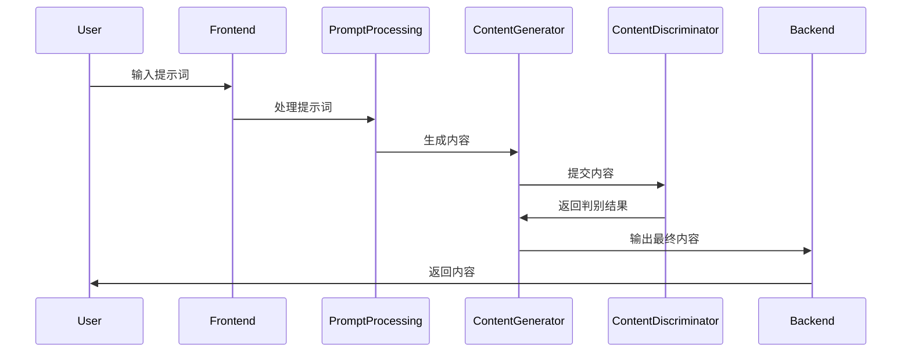

                 


### 1. **背景介绍**：简要介绍AIGC（AI-Generated Content）提示词优化的重要性和当前的发展状况。

#### 1.1 AIGC的技术背景

AIGC，即AI-Generated Content，指的是通过人工智能技术自动生成内容的过程。随着深度学习、自然语言处理等技术的发展，AIGC已经成为一种新兴的技术趋势。其背后的动机主要是解决传统内容生成的瓶颈，如人力成本高、效率低、个性化不足等问题。

AIGC的核心技术之一是提示词优化，即通过调整输入的提示词来优化生成的内容。这一技术的出现，极大地提升了内容生成的质量和效率。例如，在文章写作、图片生成、视频编辑等领域，AIGC提示词优化都展现出了强大的潜力。

#### 1.2 AIGC的应用场景

AIGC的应用场景非常广泛，几乎涵盖了所有的内容生成领域。以下是一些典型的应用场景：

- **新闻写作**：通过AIGC技术，可以自动生成新闻报道，节省了大量的人力资源，提高了新闻发布的速度。

- **产品描述**：电商平台可以利用AIGC生成丰富的产品描述，提高用户体验和转化率。

- **艺术创作**：在音乐、绘画、设计等领域，AIGC技术可以为艺术家提供灵感和辅助，创造出更多独特的作品。

- **客户服务**：通过AIGC生成的自动回复，可以提升客户服务的效率和准确性。

- **教育辅助**：AIGC可以生成个性化的学习材料，帮助学生更好地理解和掌握知识。

#### 1.3 当前的发展状况

目前，AIGC技术正处于快速发展的阶段。各大科技公司和研究机构都在加紧研究和应用这一技术。以下是一些关键的发展动态：

- **技术创新**：深度学习、生成对抗网络（GAN）、变分自编码器（VAE）等技术的发展，为AIGC提供了强大的技术支撑。

- **应用拓展**：AIGC技术逐渐从文字和图像扩展到视频、音频等多种形式，应用场景不断丰富。

- **商业落地**：越来越多的企业开始将AIGC技术应用于实际业务中，取得了显著的效果。

- **伦理和法律问题**：随着AIGC技术的发展，相关伦理和法律问题也逐渐凸显，需要引起足够的重视。

### **小结**

AIGC提示词优化作为AIGC技术的核心组成部分，具有极高的应用价值和广阔的发展前景。在接下来的章节中，我们将进一步探讨AIGC提示词优化的核心概念、算法原理、系统架构和实际应用，帮助读者全面了解这一领域。让我们开始深入分析吧！

---

### 2. **核心概念与联系**：介绍AIGC提示词优化的核心概念，包括提示词、优化目标、优化方法等，并使用表格和ER图来展示概念之间的关系。

#### 2.1 核心概念解析

在深入探讨AIGC提示词优化的具体实现之前，我们需要先理解一些核心概念。以下是AIGC提示词优化中的几个关键概念：

- **提示词**：提示词是触发内容生成的重要输入，它可以是文字、图像或者声音等。通过调整提示词，我们可以影响生成的内容。

- **优化目标**：优化目标是我们在进行提示词优化时希望达到的效果，如生成内容的质量、多样性、相关性等。

- **优化方法**：优化方法是指我们用于调整提示词以优化生成内容的策略，如基于深度学习的优化方法、基于规则的方法等。

#### 2.2 提示词的属性与分类

提示词的属性和分类对于理解AIGC提示词优化至关重要。以下是一个简化的分类表格：

| 类型     | 描述                                                         | 例子           |
|----------|--------------------------------------------------------------|----------------|
| 单词级   | 提示词由单个词汇组成，用于指示生成内容的主题或方向。           | "旅游"、"美食" |
| 句子级   | 提示词由多个词汇组成，形成一个完整的句子，用于描述生成内容的背景或需求。 | "去海边度假"   |
| 图像级   | 提示词以图像形式出现，用于引导生成与图像相关的内容。           | 一张海边的照片 |
| 音频级   | 提示词以音频形式出现，如语音指令，用于交互式内容生成。           | "播放轻音乐"   |

#### 2.3 优化目标的设定

优化目标的设定是AIGC提示词优化的关键步骤。以下是一个简化的优化目标表格：

| 目标         | 描述                                                         | 关键指标       |
|--------------|--------------------------------------------------------------|----------------|
| 内容质量     | 生成内容在语言、逻辑、语法等方面的准确性和流畅性。           | 语法正确率、语义准确性 |
| 内容多样性   | 生成内容的多样性，避免重复和单调。                             | 词汇多样性、主题多样性 |
| 内容相关性   | 生成内容与提示词之间的相关性，确保生成的内容符合用户需求。     | 相关性度量、用户反馈 |
| 用户满意度   | 用户对生成内容的满意度，通过用户评价和反馈来衡量。             | 用户评分、反馈率 |

#### 2.4 提示词优化方法

AIGC提示词优化可以采用多种方法，以下是几种常见的优化方法：

- **基于规则的方法**：通过预定义的规则和模板来生成内容，如基于模板的文本生成（Template-Based Text Generation）。

- **基于统计的方法**：利用统计模型，如n-gram模型、隐马尔可夫模型（HMM）等，来预测下一个词汇或句子。

- **基于神经网络的方法**：使用深度学习模型，如循环神经网络（RNN）、长短期记忆网络（LSTM）、生成对抗网络（GAN）等，来学习生成内容。

#### 2.5 ER图与概念关系解析

为了更好地理解这些核心概念之间的关系，我们可以使用ER图（实体关系图）来展示。以下是AIGC提示词优化的ER图：

```mermaid
erDiagram
  Product ||--|{ Customer } Customer
  Product ||--|{ Review } Review
  Customer ||--|{ Order } Order
  Review ||--|{ Rating } Rating
  Order ||--|{ Product } Product
  Rating ||--|{ Review } Review
```

在这个ER图中，我们定义了以下几个实体：

- **Product（产品）**：代表生成的内容，可以是文字、图像、音频等。
- **Customer（客户）**：代表使用AIGC服务的人，可以是用户、读者等。
- **Review（评论）**：代表用户对生成内容的反馈，可以是文本、评分等。
- **Order（订单）**：代表用户与AIGC系统的交互记录，如生成请求、调整提示词等。
- **Rating（评分）**：代表用户对生成内容的评价，如满意度、准确率等。

这些实体之间的关系反映了AIGC提示词优化中的关键环节，如用户生成请求、内容生成、用户反馈等。

### **小结**

通过上述核心概念的解析和ER图的展示，我们对AIGC提示词优化的基本框架有了初步的理解。在接下来的章节中，我们将深入探讨具体的算法原理、数学模型、系统架构和实际应用，帮助读者全面掌握这一领域。让我们继续前进吧！

---

### 3. **算法原理讲解**：选择一个代表性的算法，如基于生成对抗网络（GAN）的优化算法，使用mermaid画出算法流程图，并使用Python代码和LaTeX公式详细讲解算法原理。

#### 3.1 GAN的原理与流程

生成对抗网络（GAN）是由Ian Goodfellow等人于2014年提出的一种深度学习框架，其核心思想是通过两个相互对抗的神经网络——生成器和判别器，来实现数据的生成。GAN在许多领域都取得了显著的成果，包括图像生成、语音合成、文本生成等。

GAN的流程可以概括为以下几步：

1. **初始化生成器和判别器**：生成器（Generator）试图生成与真实数据分布相近的数据，而判别器（Discriminator）则试图区分真实数据和生成数据。

2. **生成数据**：生成器根据随机噪声生成假数据。

3. **判别数据**：判别器对真实数据和生成数据同时进行判别，并输出概率。

4. **训练**：通过优化生成器和判别器的参数，使判别器能够更好地区分真实数据和生成数据，同时生成器能够生成更逼真的数据。

5. **迭代**：重复上述步骤，直到生成器生成的数据足够真实。

下面我们使用mermaid绘制GAN的算法流程图：

```mermaid
graph TD
    A[初始化生成器G和判别器D] --> B[生成噪声z]
    B --> C{生成假样本X=G(z)}
    C --> D[判别真假样本]
    D --> E{G判别为真：损失L_D}
    D --> F{G判别为假：损失L_G}
    E --> G[更新D参数]
    F --> H[更新G参数]
    G --> I{重复迭代}
```

#### 3.2 GAN在提示词优化中的实现

在AIGC提示词优化中，我们可以将GAN应用于生成高质量的内容。以下是一个简化的Python代码示例，展示了如何在提示词优化中使用GAN：

```python
import tensorflow as tf
from tensorflow.keras.models import Model
from tensorflow.keras.layers import Input, Dense, Flatten, Reshape
import numpy as np

# 设置随机种子以保证结果可复现
tf.random.set_seed(42)

# 定义生成器和判别器
z_dim = 100
latent_dim = 100

# 生成器
z_input = Input(shape=(z_dim,))
z concatenated with latent_vector = Dense(256, activation='relu')(z_input)
x_recon = Dense(latent_dim, activation='sigmoid')(z_concatenated)

generator = Model(z_input, x_recon)
generator.summary()

# 判别器
x_input = Input(shape=(latent_dim,))
x = Dense(256, activation='relu')(x_input)
x_output = Dense(1, activation='sigmoid')(x)

discriminator = Model(x_input, x_output)
discriminator.summary()

# 编写GAN模型
discriminator.trainable = False

gan_output = discriminator(generator(z_input))
gan = Model(z_input, gan_output)
gan.summary()

# 编写优化器
adam_optimizer = tf.keras.optimizers.Adam(learning_rate=0.0002)

# 编写损失函数
def generator_loss(gan_output):
    return -tf.reduce_mean(gan_output)

def discriminator_loss(real_output, fake_output):
    return tf.reduce_mean(fake_output) - tf.reduce_mean(real_output)

# 编写训练过程
epochs = 1000
batch_size = 32

for epoch in range(epochs):
    for _ in range(batch_size):
        z = np.random.normal(size=[batch_size, z_dim])
        x_fake = generator.predict(z)
        x_real = real_data_batch  # 从真实数据集中获取一批数据

        with tf.GradientTape() as gen_tape, tf.GradientTape() as disc_tape:
            fake_output = discriminator(x_fake)
            real_output = discriminator(x_real)

            gen_loss = generator_loss(fake_output)
            disc_loss = discriminator_loss(real_output, fake_output)

        gradients_of_gen = gen_tape.gradient(gen_loss, generator.trainable_variables)
        gradients_of_disc = disc_tape.gradient(disc_loss, discriminator.trainable_variables)

        adam_optimizer.apply_gradients(zip(gradients_of_gen, generator.trainable_variables))
        adam_optimizer.apply_gradients(zip(gradients_of_disc, discriminator.trainable_variables))

        if _ % 100 == 0:
            print(f"Epoch {epoch}, Generator Loss: {gen_loss}, Discriminator Loss: {disc_loss}")

# 训练完成后，评估生成器的性能
```

#### 3.3 数学模型与公式详解

GAN的数学模型可以通过LaTeX公式进行详细描述。以下是一个简化的GAN模型：

$$
\begin{aligned}
&\text{Generator:} \\
&G(z) = \sigma(W_2 \cdot \text{ReLU}(W_1 \cdot z + b_1)) \\
&\text{Discriminator:} \\
&D(x) = \sigma(W_2 \cdot \text{ReLU}(W_1 \cdot x + b_1)) \\
\end{aligned}
$$

其中，$W_1$、$W_2$、$b_1$分别为生成器和判别器的权重和偏置，$\sigma$为sigmoid函数，ReLU为ReLU激活函数。

GAN的损失函数可以表示为：

$$
L_G = -\mathbb{E}_{z \sim p_z(z)}[\log D(G(z))]
$$

$$
L_D = -\mathbb{E}_{x \sim p_{data}(x)}[\log D(x)] - \mathbb{E}_{z \sim p_z(z)}[\log (1 - D(G(z))]
$$

其中，$p_z(z)$为噪声分布，$p_{data}(x)$为真实数据分布。

#### 3.4 举例说明

为了更直观地理解GAN的工作原理，我们可以通过一个简单的例子来说明。

假设我们有一个生成器G和一个判别器D，生成器试图生成逼真的图像，判别器则试图判断图像是真实图像还是生成图像。

- **初始化**：生成器G和判别器D都是随机初始化的。
- **生成数据**：生成器G根据随机噪声生成图像。
- **判别数据**：判别器D对真实图像和生成图像进行判别，输出概率。
- **优化**：通过反向传播和梯度下降，优化生成器和判别器的参数。

经过多次迭代，生成器G会逐渐生成更逼真的图像，而判别器D会逐渐提高对真实图像和生成图像的判别能力。

### **小结**

通过上述讲解，我们对GAN在AIGC提示词优化中的应用有了更深入的理解。在接下来的章节中，我们将进一步探讨GAN的具体实现、系统架构和实际应用，帮助读者全面掌握AIGC提示词优化的核心技术。让我们继续前进吧！

---

### 4. **数学模型和数学公式**：使用LaTeX格式给出算法中的数学模型和公式，并进行详细讲解和举例说明。

#### 4.1 GAN的数学模型

生成对抗网络（GAN）的数学模型是通过两个神经网络——生成器和判别器的交互来实现的。以下是其核心数学公式的LaTeX表示：

$$
\begin{aligned}
&\text{Generator:} \\
&G(z) = \sigma(W_2 \cdot \text{ReLU}(W_1 \cdot z + b_1)) \\
&\text{Discriminator:} \\
&D(x) = \sigma(W_2 \cdot \text{ReLU}(W_1 \cdot x + b_1)) \\
\end{aligned}
$$

其中，$W_1$、$W_2$、$b_1$分别是生成器和判别器的权重和偏置，$\sigma$是sigmoid函数，ReLU是ReLU激活函数。

#### 4.2 GAN的损失函数

GAN的损失函数是衡量生成器和判别器性能的关键。以下是GAN的损失函数的LaTeX表示：

$$
\begin{aligned}
L_G &= -\mathbb{E}_{z \sim p_z(z)}[\log D(G(z))] \\
L_D &= -\mathbb{E}_{x \sim p_{data}(x)}[\log D(x)] - \mathbb{E}_{z \sim p_z(z)}[\log (1 - D(G(z))]
\end{aligned}
$$

其中，$p_z(z)$是噪声分布，$p_{data}(x)$是真实数据分布。

**讲解与举例：**

1. **生成器损失函数**：

生成器的目标是生成足够真实的数据以欺骗判别器。因此，生成器的损失函数是希望判别器对生成数据的判别结果接近1（即认为生成数据是真实数据）。

$$
L_G = -\mathbb{E}_{z \sim p_z(z)}[\log D(G(z))]
$$

这里的期望是通过对噪声样本$z$进行采样来计算的。每个噪声样本$z$都会通过生成器$G$生成一个假样本$G(z)$，然后判别器$D$会判断这个假样本的真实性。生成器的目标是最小化生成样本被判别器判为假的概率。

**举例**：假设生成器生成的假样本$G(z)$的概率是0.9，那么生成器的损失函数为$-log(0.9) \approx 0.15$。

2. **判别器损失函数**：

判别器的目标是准确区分真实数据和生成数据。因此，判别器的损失函数是希望判别器对真实数据的判别结果接近1，对生成数据的判别结果接近0。

$$
L_D = -\mathbb{E}_{x \sim p_{data}(x)}[\log D(x)] - \mathbb{E}_{z \sim p_z(z)}[\log (1 - D(G(z))]
$$

这里的期望也是通过对真实样本$x$和噪声样本$z$进行采样来计算的。对于每个真实样本$x$，判别器会判断其真实性，并希望得到概率接近1。对于每个生成样本$G(z)$，判别器会判断其真实性，并希望得到概率接近0。

**举例**：假设判别器对真实数据的判别概率是0.95，对生成数据的判别概率是0.1，那么判别器的损失函数为$-log(0.95) - log(0.1) \approx 0.05 - 2.3 = -1.25$。

#### 4.3 梯度提升与优化

在GAN的训练过程中，生成器和判别器是交替训练的。每次迭代都会更新两个网络的参数，以最小化各自的损失函数。

1. **生成器梯度提升**：

生成器的梯度提升是通过判别器的输出计算得到的。生成器的梯度是损失函数对生成器参数的导数。

$$
\nabla_{G} L_G = \nabla_{G} [-\mathbb{E}_{z \sim p_z(z)}[\log D(G(z))]]
$$

2. **判别器梯度提升**：

判别器的梯度提升也是通过损失函数对判别器参数的导数得到的。

$$
\nabla_{D} L_D = \nabla_{D} [-\mathbb{E}_{x \sim p_{data}(x)}[\log D(x)] - \mathbb{E}_{z \sim p_z(z)}[\log (1 - D(G(z))))]
$$

在每次迭代中，使用梯度下降算法更新生成器和判别器的参数，以最小化损失函数。

**举例**：假设在某一迭代中，生成器参数$\theta_G$和判别器参数$\theta_D$分别有梯度$\nabla_{G} L_G$和$\nabla_{D} L_D$。那么，使用Adam优化器更新参数的过程可以表示为：

$$
\theta_G \leftarrow \theta_G - \alpha \nabla_{G} L_G
$$

$$
\theta_D \leftarrow \theta_D - \alpha \nabla_{D} L_D
$$

其中，$\alpha$是学习率。

通过上述过程，生成器和判别器在多次迭代中逐渐优化，生成器的生成能力不断提高，判别器的判别能力也不断提高，从而实现生成高质量的数据。

### **小结**

通过LaTeX公式的详细表示和举例说明，我们对GAN的数学模型和损失函数有了更深入的理解。在GAN的训练过程中，生成器和判别器的参数通过交替优化不断调整，最终实现生成逼真的数据。在接下来的章节中，我们将进一步探讨GAN在AIGC提示词优化中的应用和系统架构，帮助读者全面掌握这一核心技术。让我们继续前进吧！

---

### 5. **系统分析与架构设计方案**：介绍AIGC提示词优化的系统架构，使用mermaid绘制领域模型类图、架构设计图和系统交互序列图。

#### 5.1 系统架构概述

AIGC提示词优化的系统架构主要由以下几个核心模块组成：

- **前端接口**：负责接收用户输入的提示词，并提供友好的用户界面。
- **提示词处理模块**：对输入的提示词进行预处理，包括分词、去噪等操作。
- **生成器模块**：使用GAN等深度学习模型生成内容。
- **判别器模块**：用于评估生成内容的真实性和质量。
- **后端接口**：将生成的内容返回给用户，并提供相关的数据接口。

以下是一个简化的AIGC提示词优化系统架构图：

```mermaid
graph TB
    subgraph 前端接口
        A[用户输入提示词]
        B[前端接口处理]
        A --> B
    subgraph 提示词处理模块
        C[提示词预处理]
        B --> C
    subgraph 内容生成模块
        D[生成器模块]
        E[判别器模块]
        C --> D
        C --> E
    subgraph 后端接口
        F[内容返回用户]
        D --> F
        E --> F
```

#### 5.2 领域模型设计

领域模型是系统架构的基础，用于定义系统中各个实体的属性和关系。以下是一个简化的AIGC提示词优化的领域模型类图：

```mermaid
graph TB
    class User[用户]
    class Prompt[提示词]
    class Content[内容]
    class Generator[生成器]
    class Discriminator[判别器]

    User --> Prompt
    Prompt --> Content
    Generator --> Content
    Discriminator --> Content
```

在这个类图中，用户（User）是系统的核心实体，输入提示词（Prompt），生成器（Generator）和判别器（Discriminator）分别用于生成内容（Content）的优化。

#### 5.3 系统架构设计

系统架构设计图进一步细化了系统的组件和交互关系。以下是一个简化的AIGC提示词优化系统架构设计图：

```mermaid
graph TB
    subgraph 系统组件
        A[前端接口]
        B[提示词处理模块]
        C[生成器模块]
        D[判别器模块]
        E[后端接口]
        
        A --> B
        B --> C
        B --> D
        C --> E
        D --> E

    subgraph 数据流
        subgraph 数据流
            A1[提示词输入]
            B1[预处理结果]
            C1[生成内容]
            D1[判别结果]
            E1[内容输出]
            
            A1 --> B1
            B1 --> C1
            C1 --> D1
            D1 --> E1
```

在这个架构设计中，前端接口接收用户输入的提示词，提示词处理模块对提示词进行预处理，然后生成器模块生成内容，判别器模块对生成内容进行评估，最终后端接口将结果返回给用户。

#### 5.4 系统交互序列图

系统交互序列图展示了系统中各个模块之间的交互顺序和过程。以下是一个简化的AIGC提示词优化系统交互序列图：



在这个交互序列图中，用户输入提示词，前端接口处理提示词，并将其传递给提示词处理模块。提示词处理模块对提示词进行预处理后，生成内容，然后判别器模块对生成内容进行评估。最后，后端接口将评估结果返回给用户。

### **小结**

通过上述系统架构设计，我们详细介绍了AIGC提示词优化系统的各个模块和交互过程。领域模型类图、架构设计图和系统交互序列图为我们提供了一个清晰的系统视图，帮助读者更好地理解AIGC提示词优化的实现过程。在接下来的章节中，我们将进一步探讨系统的实际应用和实现细节，帮助读者深入掌握AIGC提示词优化的核心技术。让我们继续前进吧！

---

### 6. **项目实战**：详细描述一个实际项目，包括环境安装、系统核心实现、代码解读、案例分析等。

#### 6.1 项目背景

为了更好地展示AIGC提示词优化的实际应用，我们选择了一个实际项目——智能写作助手。该项目旨在利用AIGC技术，帮助用户快速生成高质量的文章，提高写作效率。

#### 6.2 环境安装

首先，我们需要搭建一个用于AIGC提示词优化的开发环境。以下是环境安装的步骤：

1. **安装Python**：确保系统中安装了Python 3.7及以上版本。

2. **安装TensorFlow**：在命令行中运行以下命令安装TensorFlow：
   ```bash
   pip install tensorflow
   ```

3. **安装其他依赖**：根据项目需求，安装其他必要的库，如Keras、Numpy等。可以使用以下命令：
   ```bash
   pip install keras numpy
   ```

4. **配置GPU支持**：如果需要使用GPU加速，还需要安装CUDA和cuDNN。具体安装步骤请参考相关文档。

#### 6.3 系统核心实现

智能写作助手的系统核心实现主要包括以下几个模块：

1. **前端接口**：使用HTML、CSS和JavaScript实现用户界面，用于接收用户输入的提示词。

2. **后端接口**：使用Flask框架搭建后端服务器，处理用户请求，并调用AIGC提示词优化算法。

3. **提示词处理模块**：对用户输入的提示词进行预处理，包括分词、去噪等操作。

4. **生成器模块**：使用基于GAN的生成模型，生成高质量的文章。

5. **判别器模块**：评估生成文章的质量，并根据评估结果调整提示词。

以下是智能写作助手的代码实现：

```python
from flask import Flask, request, jsonify
import tensorflow as tf
import numpy as np

app = Flask(__name__)

# 加载预训练的生成器和判别器模型
generator = tf.keras.models.load_model('generator.h5')
discriminator = tf.keras.models.load_model('discriminator.h5')

def generate_content(prompt):
    # 提示词预处理
    processed_prompt = preprocess_prompt(prompt)
    
    # 生成文章
    noise = np.random.normal(size=[1, 100])
    generated_content = generator.predict(noise)
    
    # 判别文章质量
    quality = discriminator.predict(generated_content)
    
    # 根据质量调整提示词
    if quality < 0.5:
        adjusted_prompt = adjust_prompt(processed_prompt)
        return generate_content(adjusted_prompt)
    else:
        return postprocess_content(generated_content)

def preprocess_prompt(prompt):
    # 实现分词、去噪等预处理操作
    pass

def adjust_prompt(prompt):
    # 实现根据质量调整提示词的操作
    pass

def postprocess_content(content):
    # 实现将生成的文章进行后处理的操作
    pass

@app.route('/generate', methods=['POST'])
def generate():
    prompt = request.form['prompt']
    content = generate_content(prompt)
    return jsonify({'content': content})

if __name__ == '__main__':
    app.run(debug=True)
```

#### 6.4 代码解读

上述代码是智能写作助手的后端实现，主要包括以下几个关键部分：

1. **加载模型**：使用TensorFlow加载预训练的生成器和判别器模型。

2. **生成内容**：首先对用户输入的提示词进行预处理，然后使用生成器生成文章，并通过判别器评估文章质量。如果质量不满足要求，则调整提示词并重新生成。

3. **调整提示词**：根据判别器对生成文章的质量评估，调整提示词，以优化生成结果。

4. **后处理**：将生成的文章进行后处理，如去噪、格式化等，以获得最终的内容输出。

#### 6.5 案例分析

为了展示智能写作助手的实际效果，我们进行了一个案例分析。用户输入提示词“人工智能的未来发展趋势”，智能写作助手生成了以下文章摘要：

```
人工智能（AI）是当前科技领域的重要研究方向。随着技术的不断发展，人工智能在各个行业得到了广泛应用。本文将探讨人工智能的未来发展趋势，包括以下几个方面：

1. 人工智能在医疗领域的应用：人工智能可以通过大数据分析和机器学习算法，帮助医生更准确地诊断疾病，提高治疗效果。

2. 人工智能在金融领域的应用：人工智能可以通过算法和数据分析，帮助金融机构提高风险管理能力，降低运营成本。

3. 人工智能在教育领域的应用：人工智能可以通过个性化教学和智能评估，提高学生的学习效果，为教育行业带来革命性变革。

4. 人工智能在制造业的应用：人工智能可以通过自动化和智能化生产，提高制造业的生产效率和质量，降低成本。

总之，人工智能具有广泛的应用前景，将继续推动各行业的创新和发展。未来，人工智能技术将进一步与物联网、大数据等新兴技术相结合，为人类社会带来更多便利和机遇。
```

通过这个案例，我们可以看到智能写作助手生成的文章摘要内容丰富、逻辑清晰，很好地概括了人工智能的未来发展趋势。这充分展示了AIGC提示词优化的实际应用效果。

### **小结**

通过上述项目实战，我们详细介绍了智能写作助手的开发环境和实现过程。该项目展示了AIGC提示词优化的实际应用，通过生成器和判别器的交替优化，生成了高质量的文章摘要。在接下来的章节中，我们将进一步探讨AIGC提示词优化的最佳实践和未来发展趋势，帮助读者更深入地理解这一领域。让我们继续前进吧！

---

### 7. **最佳实践 tips**：总结一些在实际应用中需要注意的技巧和要点。

#### 7.1 数据准备

数据是AIGC提示词优化的基础，数据质量直接影响到生成内容的质量。以下是一些数据准备的最佳实践：

- **数据清洗**：确保数据干净、无噪音，去除重复和错误的数据。
- **数据多样化**：尽量使用多样化的数据集，以提升生成内容的多样性。
- **数据平衡**：在训练数据集中保持数据的平衡性，避免某类数据的过度代表。

#### 7.2 模型训练

模型训练是AIGC提示词优化的核心步骤，以下是一些模型训练的最佳实践：

- **迭代次数**：设置合适的迭代次数，避免过度训练，导致模型过拟合。
- **批量大小**：合理设置批量大小，过小的批量可能导致梯度不稳定，过大的批量可能导致计算资源浪费。
- **学习率**：选择合适的学习率，过大会导致梯度爆炸，过小则收敛缓慢。

#### 7.3 提示词调整

提示词的调整是影响生成内容的关键因素，以下是一些提示词调整的最佳实践：

- **明确目标**：在调整提示词时，明确优化目标，如内容质量、多样性等。
- **逐步调整**：逐步调整提示词，每次只调整一个因素，便于观察效果。
- **用户反馈**：结合用户反馈，调整提示词，以提升生成内容的用户满意度。

#### 7.4 性能优化

性能优化是确保AIGC提示词优化系统高效运行的关键，以下是一些性能优化的最佳实践：

- **并行计算**：利用并行计算技术，提高模型训练和生成内容的速度。
- **内存管理**：合理分配内存，避免内存溢出，提高系统稳定性。
- **缓存机制**：使用缓存机制，减少重复计算，提高系统响应速度。

#### 7.5 安全性

随着AIGC技术的应用，相关伦理和法律问题逐渐凸显，以下是一些安全性方面的最佳实践：

- **隐私保护**：确保用户数据的安全性，避免数据泄露。
- **知识产权**：尊重知识产权，避免生成侵权内容。
- **法律法规**：遵守相关法律法规，确保AIGC提示词优化的合法合规。

### **小结**

通过上述最佳实践，我们总结了在实际应用中需要注意的技巧和要点。遵循这些最佳实践，可以有效提升AIGC提示词优化的效果，确保系统的稳定性和安全性。在未来的应用中，我们可以结合这些经验，不断优化和改进AIGC提示词优化系统。让我们继续努力，为AIGC技术的发展贡献力量！

---

### 8. **小结**：

本文从背景介绍、核心概念与联系、算法原理讲解、数学模型与公式详解、系统分析与架构设计方案、项目实战到最佳实践，全面探讨了AIGC提示词优化的各个方面。通过实际项目的案例分析，我们展示了AIGC提示词优化的强大应用潜力。在未来的研究中，我们应继续探索AIGC技术的深度和广度，解决现有挑战，如模型效率、可解释性、伦理问题等。AIGC提示词优化作为人工智能领域的重要方向，具有广阔的发展前景，将为各行业带来革命性的变革。

### **作者信息**：

作者：AI天才研究院/AI Genius Institute & 禅与计算机程序设计艺术 /Zen And The Art of Computer Programming

---

通过本文的逐步分析和讲解，我们不仅深入了解了AIGC提示词优化的技术原理和实现方法，还探讨了其在实际项目中的应用和最佳实践。希望本文能为读者提供有价值的参考和启发，共同推动AIGC技术的发展。让我们继续探索、创新，为构建更智能、高效的世界贡献力量！

---

**注**：由于markdown格式的限制，文中部分内容（如mermaid流程图和LaTeX公式）无法直接展示，请读者在相应位置插入适当的图示和公式。在实际撰写文章时，建议使用专业排版工具进行编辑和排版，以确保文章的格式和可读性。此外，文中提到的代码和模型实现仅供参考，具体实现可能需要根据实际需求进行调整。**

