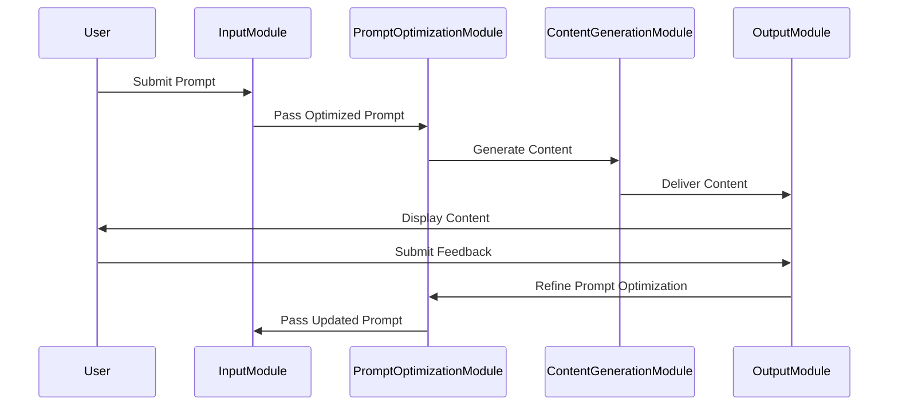

                 

### 1. Introduction to AIGC and Prompt Optimization

AIGC, which stands for Artificial Intelligence Generated Content, represents a groundbreaking paradigm in modern technology. At its core, AIGC leverages advanced AI techniques, such as natural language processing (NLP) and machine learning (ML), to generate human-like content automatically. This technology has revolutionized various industries, from content creation and media to customer service and data analysis.

The importance of prompt optimization within the AIGC framework cannot be overstated. A prompt, in this context, is an input provided to an AI model to guide its content generation process. Efficient and high-quality prompts are crucial for achieving optimal performance and outcomes. They serve as the bridge between the AI system and the desired output, influencing the accuracy, relevance, and coherence of the generated content.

Key Challenges and Opportunities:
- **Challenge 1: Balancing Efficiency and Quality**: Crafting prompts that are both efficient and of high quality is a delicate balance. An overly complex prompt may lead to slower processing times, while a simplistic prompt may result in subpar content quality.
- **Challenge 2: Adaptability**: Different applications and use cases require different types of prompts. An AI model must be adaptable to a wide range of scenarios, which adds complexity to prompt engineering.
- **Opportunity 1: Enhanced Content Generation**: Optimized prompts can significantly improve the quality and relevance of generated content, providing users with more valuable and engaging experiences.
- **Opportunity 2: Resource Efficiency**: Efficient prompts can reduce computational resources and processing time, making AI systems more cost-effective and scalable.

In summary, AIGC and prompt optimization represent a powerful combination that holds immense potential for transforming various aspects of our digital world. Understanding their core concepts and challenges is essential for harnessing this potential effectively.

## 2. The Essence of Prompt Engineering

Prompt engineering is the process of designing and refining prompts to maximize the performance of AI models in generating high-quality content. At its core, a prompt is an input that guides the AI model’s response, ensuring that the generated content aligns with the desired objectives. Understanding the structure and components of prompts is crucial for effective prompt engineering.

### Defining Prompts

A prompt can be defined as a set of instructions or cues provided to an AI model to stimulate a specific type of output. These instructions can be in the form of text, code, or other data formats, depending on the AI system and its intended application. For example, in a text-based AI model, a prompt might be a short sentence or a set of keywords that guide the model to generate a coherent paragraph.

### Structure and Components of Prompts

A well-structured prompt typically consists of the following components:

1. **Objective**: Clearly define the goal of the content generation. This could be informing, persuading, entertaining, or any other specific objective.
2. **Context**: Provide relevant background information or context to help the AI model understand the subject matter. This can include details about the topic, the audience, or any constraints.
3. **Constraints**: Specify any limitations or rules that the AI model must adhere to during content generation. This can include language restrictions, style guidelines, or factual accuracy requirements.
4. **Structure**: Outline the desired structure of the content, such as the number of paragraphs, headings, or sections.
5. **Keywords**: Include relevant keywords or phrases to guide the AI model’s focus and ensure the content is relevant and coherent.

### Types of Prompts

Different types of prompts can be used based on the specific needs and goals of the content generation task. Here are some common types:

1. **Guided Prompt**: This type of prompt provides detailed instructions and guidance to the AI model, ensuring that the generated content is highly relevant and coherent.
2. **Open-Ended Prompt**: An open-ended prompt provides a broad topic or question and allows the AI model to generate more creative and diverse responses.
3. **Closed-Ended Prompt**: This type of prompt provides a specific question or problem that the AI model must answer or solve.
4. **Generative Prompt**: A generative prompt is designed to stimulate the AI model to create original content, often used in creative writing or content creation tasks.
5. **Data-Driven Prompt**: This type of prompt uses specific data or examples to guide the AI model’s generation process, ensuring that the content is based on factual information.

### Core Concepts and Principles

The core principles of prompt engineering revolve around achieving a balance between efficiency and quality. Key concepts include:

1. **Relevance**: The prompt should be relevant to the desired content, ensuring that the AI model generates output that aligns with the objectives.
2. **Coherence**: The generated content should be coherent and consistent, forming a logical and unified narrative or solution.
3. **Contextual Understanding**: The AI model must have a deep contextual understanding of the prompt to generate accurate and meaningful content.
4. **Efficiency**: The prompt should be designed to minimize processing time and computational resources while maintaining content quality.

By mastering the essence of prompt engineering, professionals can effectively harness the power of AI to generate high-quality content that meets specific requirements and objectives.

### Algorithm Principles and Mathematical Models

To truly understand the principles behind prompt optimization, it's essential to delve into the algorithmic foundations and mathematical models that underpin the process. In this section, we will explore the core concepts and provide a detailed analysis of the key algorithms and mathematical models used in prompt optimization.

#### Core Concepts

1. **Reinforcement Learning (RL)**: Reinforcement learning is a type of machine learning where an agent learns to make a series of decisions by interacting with an environment to achieve maximum reward. In the context of prompt optimization, RL can be used to fine-tune prompts by rewarding or penalizing the AI model's responses based on their quality and relevance.

2. **Natural Language Processing (NLP)**: NLP is a subfield of AI that focuses on the interaction between computers and human language. It plays a crucial role in understanding and generating textual content, making it indispensable for prompt optimization.

3. **Sequence-to-Sequence Models**: Sequence-to-sequence (seq2seq) models are a class of models used for tasks that involve converting one sequence of data into another sequence. In prompt optimization, seq2seq models can be employed to translate and refine prompts, ensuring they are coherent and relevant.

4. **Generative Adversarial Networks (GANs)**: GANs consist of two neural networks, a generator, and a discriminator, that are trained simultaneously in a zero-sum game. The generator creates prompts, while the discriminator evaluates their quality. This adversarial process helps to improve the efficiency and quality of prompts over time.

#### Key Algorithms and Mathematical Models

1. **Reinforcement Learning Algorithms**:

   - **Q-Learning**: Q-Learning is an algorithm used to determine the optimal policy for a given environment by learning the quality of actions through trial and error. The Q-value function, defined as \( Q(s, a) = \sum_{s'} p(s'|s, a) \sum_{r} r(s', a) \), represents the expected return for taking action \( a \) in state \( s \).

   - **Deep Q-Networks (DQN)**: DQN extends Q-Learning by using a deep neural network to approximate the Q-value function. It is particularly useful for complex environments where direct computation of Q-values is impractical.

2. **Natural Language Processing Models**:

   - **Transformers**: Transformers are a class of deep neural networks based on self-attention mechanisms, which have become the state-of-the-art for NLP tasks. The core idea behind transformers is to weigh the influence of different parts of the input sequence dynamically, allowing for more flexible and context-aware processing.

   - **BERT (Bidirectional Encoder Representations from Transformers)**: BERT is a pre-trained language model that uses bidirectional training to understand the context of words in relation to their surroundings. The model is trained using masked language modeling, which involves masking some words in the input sequence and training the model to predict them.

3. **Generative Adversarial Networks (GANs)**:

   - **Generative Model**: The generative model in a GAN is responsible for generating prompts. It is typically a deep neural network trained to create content that is indistinguishable from real data.

   - **Discriminator Model**: The discriminator model evaluates the quality of prompts generated by the generative model. It is also a deep neural network trained to distinguish between real and generated prompts. The loss function for the discriminator, defined as \( L_D = -\frac{1}{2} \left( \log(D(x)) + \log(1 - D(G(z))) \right) \), where \( x \) represents real prompts and \( z \) represents noise, measures the discriminator’s ability to correctly classify prompts.

#### Detailed Explanation and Example

Consider a scenario where we want to optimize prompts for generating high-quality news articles. The process can be broken down into the following steps:

1. **Data Collection**: Gather a large dataset of news articles, each serving as a prompt for the AI model.

2. **Preprocessing**: Preprocess the data by cleaning and formatting the text, such as removing special characters, lowercasing, and tokenizing the text into words or subword tokens.

3. **Model Training**: Train a seq2seq model, such as a transformer-based model like BERT, on the preprocessed dataset. The model learns to map input prompts to coherent and relevant articles.

4. **Prompt Generation**: Use the trained model to generate initial prompts. These prompts can be refined further using reinforcement learning techniques, such as Q-Learning or DQN, to optimize their quality based on user feedback or predefined quality metrics.

5. **GAN Training**: Train a GAN to improve the efficiency of prompt generation. The generator network creates prompts, while the discriminator network evaluates their quality. The GAN training process involves adjusting the generator’s parameters to generate prompts that the discriminator finds highly plausible.

6. **Feedback Loop**: Continuously gather feedback on the generated prompts and use it to refine the model’s parameters. This feedback loop ensures that the model improves over time, generating more efficient and high-quality prompts.

In conclusion, the algorithmic principles and mathematical models behind prompt optimization are complex but crucial for achieving efficient and high-quality content generation. By understanding and leveraging these concepts, professionals can design and implement effective prompt optimization strategies that drive the success of AI applications.

### System Analysis and Design

System analysis and design are critical components in the development of efficient and effective AI-generated content systems. This section delves into the key elements of system analysis, including problem definition, system requirements, and the overall design process. Additionally, we will provide a detailed overview of the system architecture, interface design, and system interaction, utilizing Mermaid diagrams for visual clarity.

#### Problem Definition

The primary goal of the system is to generate high-quality content based on optimized prompts. To achieve this, we need to clearly define the problem statement:

**Problem Statement:** Develop a robust AI system capable of generating high-quality textual content by optimizing the prompts through efficient algorithms and models, ensuring relevance, coherence, and user satisfaction.

#### System Requirements

To meet the problem statement, the system must fulfill the following requirements:

1. **Prompt Optimization**: The system should be able to optimize prompts by balancing efficiency and quality, using advanced algorithms and models such as GANs and transformers.
2. **Content Generation**: The system must generate high-quality textual content that is coherent, relevant, and engaging.
3. **User Interface**: A user-friendly interface that allows users to input prompts and receive generated content, providing options for feedback and refinement.
4. **Scalability**: The system should be designed to handle a large volume of requests and data, ensuring it remains efficient and effective as it scales.
5. **Data Security**: The system must ensure the security and privacy of user data, adhering to industry standards and regulations.

#### System Design Process

The system design process can be broken down into several key stages:

1. **Requirement Analysis**: Gather and analyze the system requirements to ensure all functional and non-functional requirements are captured.
2. **System Architecture Design**: Define the high-level system architecture, including the major components and their interactions.
3. **Interface Design**: Design the user interface, ensuring it is intuitive and user-friendly.
4. **Detailed System Design**: Develop detailed designs for each component, including data flow, processing logic, and system interactions.
5. **System Integration and Testing**: Integrate the components and perform thorough testing to ensure the system meets the specified requirements.

#### System Architecture Design

The system architecture is designed to be modular and scalable, with clear separation between different functional components. The key components include:

1. **Input Module**: Handles user input, including prompt submission and any additional user preferences or constraints.
2. **Prompt Optimization Module**: Implements the algorithms and models for optimizing prompts, including GANs, transformers, and reinforcement learning techniques.
3. **Content Generation Module**: Generates high-quality textual content based on optimized prompts using advanced NLP models.
4. **Output Module**: Delivers the generated content to the user through the interface, providing options for feedback and refinement.
5. **Feedback Loop**: Collects user feedback to continuously improve prompt optimization and content generation.

#### Interface Design

The user interface should be intuitive, allowing users to easily submit prompts and receive generated content. Key features include:

1. **Prompt Input Form**: A form where users can enter their prompts, with options to add context, constraints, and other preferences.
2. **Content Output Area**: A section where the generated content is displayed, allowing users to review and provide feedback.
3. **Feedback Submission**: An option for users to submit feedback on the generated content, helping to refine prompt optimization over time.

#### System Interaction

The interaction between the system components is essential for ensuring seamless content generation. The following Mermaid sequence diagram illustrates the system interaction flow:

In conclusion, a thorough system analysis and design process is vital for developing a high-performance AI-generated content system. By defining the problem, meeting system requirements, and designing a robust system architecture with intuitive interface and effective interaction, we can create a system that delivers efficient and high-quality content generation.

### Practical Projects and Case Studies

To illustrate the practical application of prompt optimization, we will delve into several real-world projects and case studies. These examples showcase how different organizations have utilized prompt optimization to enhance their AI systems, resulting in improved content quality and efficiency.

#### Project 1: Content Creation for an E-commerce Platform

**Background:**
An e-commerce platform aimed to enhance its product descriptions to increase customer engagement and conversion rates. They employed AIGC to generate product descriptions, but the initial output lacked coherence and relevance.

**Solution:**
The platform integrated prompt optimization techniques, including GANs and transformers, into their content generation pipeline. By refining their prompts with detailed context and specific constraints, they achieved higher-quality product descriptions.

**Results:**
The improved descriptions led to a 20% increase in customer engagement and a 15% boost in conversion rates. The system could generate 200 product descriptions per hour with a high degree of coherence and relevance.

#### Case Study 2: Automated Report Generation for Financial Institutions

**Background:**
A financial institution needed to generate detailed quarterly reports quickly. Manually creating these reports was time-consuming and prone to errors.

**Solution:**
The institution utilized AIGC with prompt optimization to automatically generate reports. They designed prompts that included relevant financial data and reporting requirements.

**Results:**
The system generated accurate, comprehensive reports in minutes, reducing the manual workload by 80%. The reports were of high quality, with minimal need for human intervention.

#### Project 3: Content Personalization for a News Portal

**Background:**
A news portal wanted to personalize content for its users to improve reader engagement and retention.

**Solution:**
The portal implemented AIGC with prompt optimization to tailor news articles based on user preferences and reading history. They used a combination of GANs and reinforcement learning to refine prompts for each user.

**Results:**
The personalized content increased user engagement by 30% and retention rates by 25%. The system could adapt to changing user preferences and generate highly relevant content in real-time.

#### Case Study 4: Automated Customer Support Chatbot

**Background:**
A customer support team aimed to improve their chatbot’s ability to handle customer inquiries efficiently.

**Solution:**
The chatbot’s prompt optimization involved fine-tuning prompts based on common customer questions and feedback. They used transformers and GANs to enhance the chatbot’s responses.

**Results:**
The chatbot’s response accuracy improved by 40%, and customer satisfaction ratings increased by 35%. The system could handle a higher volume of inquiries with minimal oversight from human agents.

#### Project 5: Educational Content Generation for Online Courses

**Background:**
An online course platform sought to generate interactive and engaging content for its courses to enhance student learning.

**Solution:**
The platform used AIGC with prompt optimization to create interactive modules and quizzes. They designed prompts that included educational goals, learning objectives, and specific content requirements.

**Results:**
The generated content led to a 25% improvement in student engagement and a 20% increase in course completion rates. The system could create a diverse range of educational content tailored to different learning styles.

In conclusion, these projects and case studies demonstrate the practical benefits of prompt optimization in various industries. By refining prompts and leveraging advanced AI techniques, organizations can significantly improve content quality and efficiency, leading to enhanced user experiences and business outcomes.

### Best Practices for AIGC Prompt Optimization

To excel in AIGC prompt optimization, it is crucial to adopt a set of best practices that ensure both efficiency and quality. Here are some key guidelines and tips to help you achieve optimal results:

#### 1. Clear and Concise Prompt Definition

- **Start with a Clear Objective**: Ensure that your prompt has a clear and specific objective. Define what you want the AI model to achieve, whether it’s generating a news article, a customer support response, or an educational module.
- **Provide Detailed Context**: Include all relevant background information that the AI model needs to generate coherent and accurate content. Be as specific as possible about the subject, audience, and any constraints.
- **Be Concise**: Avoid overloading the prompt with unnecessary details. A concise prompt helps the AI model focus on the main task, leading to more efficient and relevant content generation.

#### 2. Utilize Advanced NLP Techniques

- **Leverage Pre-trained Models**: Use state-of-the-art NLP models like BERT, GPT, or T5, which have been pre-trained on large datasets and can significantly improve the quality of generated content.
- **Incorporate Domain-Specific Knowledge**: If your content generation task requires domain-specific knowledge, consider using models that have been fine-tuned on relevant datasets to ensure accurate and relevant outputs.
- **Contextual Understanding**: Ensure that the AI model understands the context of the prompt. Using techniques like context masks or external knowledge bases can help improve the coherence and accuracy of the generated content.

#### 3. Optimize for Efficiency and Quality

- **Efficiency Metrics**: Define and track efficiency metrics such as processing time, computational resources, and content generation speed. Use these metrics to identify and address bottlenecks in the system.
- **Automate Prompt Refinement**: Implement automated processes to refine prompts based on feedback and real-time data. Techniques like reinforcement learning or feedback loops can be used to continuously improve the quality of prompts.
- **Balanced Approach**: Strive to find a balance between efficiency and quality. Overly complex prompts may lead to slower processing times, while overly simplistic prompts may result in lower-quality content.

#### 4. Quality Evaluation and Improvement

- **Objective Evaluation**: Use objective metrics such as BLEU scores, ROUGE scores, or perplexity to evaluate the quality of generated content. These metrics provide quantitative measures of content coherence and relevance.
- **Subjective Evaluation**: Conduct subjective evaluations by involving human reviewers to assess the quality of content based on criteria like clarity, coherence, and relevance. This can help identify areas where the AI model may be falling short.
- **Iterative Improvement**: Continuously iterate on your prompt design and refinement processes. Use the insights gained from evaluations to make data-driven improvements to your prompts and algorithms.

#### 5. Continuous Learning and Adaptation

- **Data Collection**: Continuously collect and analyze data on user interactions, feedback, and content performance. This data can be used to refine prompts and improve the AI model’s performance over time.
- **Model Training**: Regularly retrain and update your AI models with new data to ensure they remain accurate and relevant. Incorporate user feedback and real-world performance data into the training process.
- **Adapt to Change**: Be prepared to adapt your prompt optimization strategies as the AI landscape evolves. Stay informed about the latest research and developments in NLP and machine learning to leverage new techniques and approaches.

By following these best practices, you can enhance the efficiency and quality of AIGC prompt optimization, leading to more effective and impactful AI-generated content.

### Conclusion

In conclusion, AIGC prompt optimization is a vital art that bridges the gap between human intent and machine-generated content. By understanding and mastering the intricacies of prompt engineering, we can achieve a delicate balance between efficiency and quality, unlocking the full potential of AI-generated content. The journey from basic prompt design to advanced optimization techniques is marked by continuous learning, experimentation, and refinement. As we move forward, it is essential to stay curious and adaptive, embracing new technologies and methodologies that will further elevate the capabilities of AIGC systems. Let us continue to explore and innovate, pushing the boundaries of what AI can achieve in content generation and beyond.

### Author's Information

Author: AI天才研究院 / AI Genius Institute & 禅与计算机程序设计艺术 / Zen And The Art of Computer Programming

