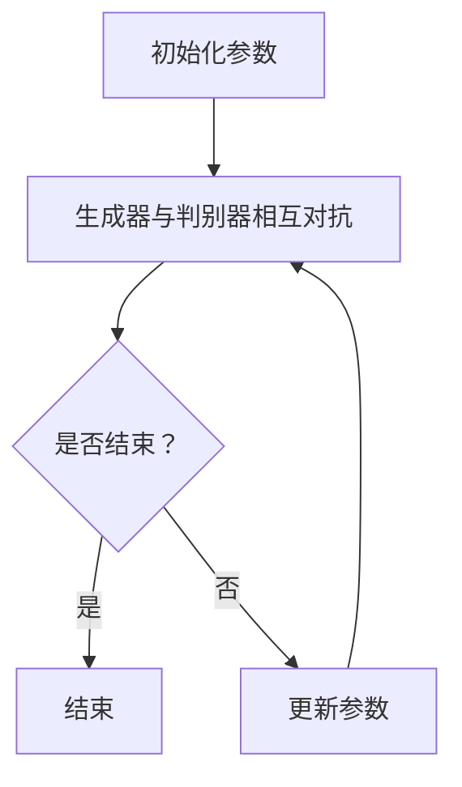
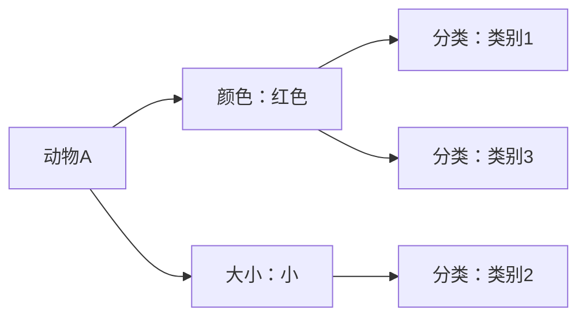

                 

### AIGC与Prompt Engineering概述

AIGC（Artificial Intelligence Generated Content）与Prompt Engineering相结合，正在引领新一轮的技术革命。AIGC是利用人工智能技术生成内容的一种方法，而Prompt Engineering则是一种设计高质量输入提示的技术。二者的结合不仅拓宽了人工智能的应用范围，还大大提升了内容生成的效率和准确性。

#### AIGC的起源与发展

AIGC的概念最早可以追溯到生成对抗网络（GAN）的提出。GAN由Ian Goodfellow等人在2014年提出，通过两个神经网络——生成器和判别器的对抗训练，实现高质量图像的生成。随着深度学习技术的发展，AIGC逐渐应用于文本、音频、视频等多种形式的内容生成。例如，GPT-3等大型语言模型的出现，使得AIGC在自然语言处理领域取得了显著突破。

#### Prompt Engineering的定义与作用

Prompt Engineering是指设计出能够引导AI模型进行有效学习和生成的高质量提示。一个好的Prompt能够提供清晰的背景信息、上下文关系和具体要求，从而帮助AI模型更好地理解任务并生成相应的内容。Prompt Engineering在AIGC中的应用，可以显著提高内容生成的质量和效率。

#### AIGC与Prompt Engineering的联系

AIGC和Prompt Engineering相辅相成，共同构成了现代内容生成的重要基础。AIGC提供了强大的内容生成能力，而Prompt Engineering则通过设计高质量的Prompt来引导和优化这一过程。二者结合，不仅能够实现高效的内容生成，还能够根据具体需求进行定制化调整。

### 关键概念介绍

为了更好地理解AIGC与Prompt Engineering，我们需要介绍一些关键的概念。

#### AIGC的基本原理

AIGC的核心在于利用生成对抗网络（GAN）、变分自编码器（VAE）等深度学习技术，通过大量的数据训练，使模型具备生成高质量内容的能力。其基本原理可以概括为：

1. **生成器（Generator）**：生成器通过学习数据分布，生成新的内容。
2. **判别器（Discriminator）**：判别器用于判断生成的内容是否真实。
3. **对抗训练**：生成器和判别器相互对抗，共同训练，使得生成器生成的内容越来越真实。

#### Prompt Engineering的核心概念

Prompt Engineering的关键在于设计高质量的Prompt，其核心概念包括：

1. **Prompt的定义**：Prompt是指提供给AI模型的信息或指令，用于引导模型进行生成。
2. **Prompt的类型**：Prompt可以分为开放式Prompt、封闭式Prompt和混合式Prompt等。
3. **Prompt Engineering的方法与技巧**：包括确定Prompt的目的、理解模型的能力和限制、使用适当的语言和结构等。

#### AIGC与Prompt Engineering的联系

AIGC和Prompt Engineering之间有着密切的联系。AIGC为内容生成提供了强大的技术支撑，而Prompt Engineering则通过设计高质量的Prompt，使AIGC能够生成更符合需求的内容。具体来说：

1. **Prompt优化AIGC生成内容**：通过精心设计的Prompt，可以引导AIGC生成更具体、更符合需求的内容。
2. **AIGC增强Prompt Engineering效果**：高质量的AIGC模型能够更好地理解Prompt，从而提高生成内容的质量。

### 应用领域

AIGC与Prompt Engineering的应用领域广泛，涵盖了自然语言处理、计算机视觉、机器学习等多个领域。

#### 自然语言处理

在自然语言处理领域，AIGC和Prompt Engineering已被广泛应用于文本生成、对话系统、机器翻译等方面。例如，GPT-3等语言模型通过Prompt Engineering可以生成高质量的文本，用于自动写作、问答系统等。

#### 计算机视觉

在计算机视觉领域，AIGC和Prompt Engineering可以用于图像生成、视频生成、图像分类等。例如，通过Prompt Engineering，可以引导生成器生成特定风格的图像，或根据Prompt生成符合特定需求的视频片段。

#### 机器学习

在机器学习领域，AIGC和Prompt Engineering可以帮助构建更高效的模型。例如，通过Prompt Engineering，可以设计出更有效的数据增强策略，提高模型的泛化能力。

#### 其他领域应用

除了上述领域，AIGC与Prompt Engineering还在游戏开发、创意设计、广告营销等领域得到了广泛应用。

### 未来发展趋势

随着技术的不断进步，AIGC与Prompt Engineering在未来有着广阔的发展前景。

#### 零样本学习

零样本学习（Zero-Shot Learning，ZSL）是一种新兴的机器学习技术，旨在使模型能够在未见过的类别上完成任务。AIGC与Prompt Engineering的结合，有望推动零样本学习的发展，实现更广泛的应用场景。

#### 知识图谱与AIGC的结合

知识图谱是一种用于表示实体及其之间关系的图形化数据结构。AIGC与知识图谱的结合，可以大大提升内容生成的智能化水平，使得生成的内容更具知识性和逻辑性。

### 本章小结

本章对AIGC与Prompt Engineering进行了概述，介绍了它们的基本概念、原理以及应用领域。AIGC与Prompt Engineering的结合，不仅拓宽了人工智能的应用范围，还提升了内容生成的质量和效率。随着技术的不断发展，AIGC与Prompt Engineering有望在更多领域发挥重要作用。

---

> **关键词**：AIGC、Prompt Engineering、内容生成、零样本学习、知识图谱

> **摘要**：本文概述了AIGC与Prompt Engineering的基本概念、原理和应用领域，探讨了它们在自然语言处理、计算机视觉、机器学习等领域的应用，并展望了未来的发展趋势，包括零样本学习和知识图谱的结合。

---

接下来，我们将深入探讨AIGC的算法原理，包括其基本结构、核心技术和mermaid流程图，以及Python源代码实现。

## AIGC算法原理

AIGC（Artificial Intelligence Generated Content）算法是利用人工智能技术生成内容的一种方法。其核心在于通过生成器和判别器的对抗训练，实现高质量内容的生产。在这一节中，我们将详细介绍AIGC算法的基本原理、核心技术以及mermaid流程图，并展示Python源代码实现。

### AIGC算法概述

AIGC算法的基本结构包括生成器（Generator）和判别器（Discriminator），两者通过对抗训练相互提升。生成器的目标是生成与真实数据相似的内容，而判别器的目标是区分生成内容与真实内容。这种对抗关系推动两者不断进步，最终生成高质量的内容。

#### 生成器（Generator）

生成器的任务是将随机噪声输入转换为真实数据。生成器通常是一个深度神经网络，通过学习大量的真实数据，生成与输入噪声相似的数据。生成器的目标是最大化判别器对生成数据的判别错误率。

#### 判别器（Discriminator）

判别器的任务是对输入的数据进行分类，判断其是真实数据还是生成数据。判别器也是一个深度神经网络，通过对抗生成器，学习如何准确地区分真实和虚假数据。

#### 对抗训练

对抗训练是AIGC算法的核心。在训练过程中，生成器和判别器相互对抗，生成器的目标是提高判别器对生成数据的判别错误率，而判别器的目标是降低生成数据的判别错误率。通过这种对抗关系，生成器和判别器共同提升，最终生成高质量的内容。

### AIGC算法的核心技术

AIGC算法的核心技术包括生成对抗网络（GAN）、变分自编码器（VAE）等。下面我们将详细介绍这些技术。

#### 生成对抗网络（GAN）

生成对抗网络（GAN）是AIGC算法的基础。GAN由生成器和判别器组成，通过对抗训练实现高质量内容生成。GAN的核心在于生成器和判别器的相互对抗。

1. **生成器**：生成器的目标是生成与真实数据相似的数据。生成器通过学习大量的真实数据，生成新的数据，这些新数据与真实数据尽可能相似。
2. **判别器**：判别器的目标是判断输入的数据是真实数据还是生成数据。判别器通过对抗生成器，学习如何准确地区分真实和虚假数据。

#### 变分自编码器（VAE）

变分自编码器（VAE）是另一种重要的AIGC算法。VAE通过引入编码器和解码器，实现数据的生成。编码器将输入数据编码为一个潜在变量，解码器则将潜在变量解码为输出数据。

1. **编码器**：编码器将输入数据编码为一个潜在变量，这个潜在变量可以看作是数据的压缩表示。
2. **解码器**：解码器将潜在变量解码为输出数据，输出数据与输入数据尽可能相似。

### AIGC算法的mermaid流程图

为了更好地理解AIGC算法，我们可以使用mermaid流程图展示其基本流程。以下是AIGC算法的mermaid流程图：



在mermaid流程图中，A表示初始化参数，B表示生成器和判别器的对抗训练，C表示判断训练是否结束，D表示结束，E表示更新参数。

### AIGC算法的Python源代码实现

以下是AIGC算法的Python源代码实现，包括生成器和判别器的定义、损失函数的计算和训练过程的实现。

```python
import tensorflow as tf
from tensorflow.keras.layers import Dense, Flatten, Reshape
from tensorflow.keras.models import Model

# 生成器模型
def generator(z_dim):
    model = tf.keras.Sequential([
        Dense(128, input_shape=(z_dim,)),
        tf.keras.layers.LeakyReLU(alpha=0.01),
        Dense(28 * 28 * 1, activation='tanh'),
        Reshape((28, 28, 1))
    ])
    return model

# 判别器模型
def discriminator(x):
    model = tf.keras.Sequential([
        Flatten(input_shape=(28, 28, 1)),
        Dense(128, activation='leaky_relu', alpha=0.01),
        Dense(1, activation='sigmoid')
    ])
    return model

# 损失函数
def loss_function(real, generated):
    real_loss = tf.reduce_mean(tf.nn.sigmoid_cross_entropy_with_logits(logits=real, labels=tf.ones_like(real)))
    generated_loss = tf.reduce_mean(tf.nn.sigmoid_cross_entropy_with_logits(logits=generated, labels=tf.zeros_like(generated)))
    total_loss = real_loss + generated_loss
    return total_loss

# 训练过程
def train(generator, discriminator, latent_dim, epochs, batch_size, data):
    for epoch in range(epochs):
        for _ in range(batch_size // 2):
            z = tf.random.normal(shape=[batch_size, latent_dim])
            generated_images = generator(z)

            real_images = data

            real_loss = loss_function(real_images, generated_images)

            with tf.GradientTape() as gen_tape, tf.GradientTape() as disc_tape:
                gen_loss = loss_function(generated_images, generated_images)
                disc_loss = loss_function(real_images, real_images) + loss_function(generated_images, generated_images)

            gen_gradients = gen_tape.gradient(gen_loss, generator.trainable_variables)
            disc_gradients = disc_tape.gradient(disc_loss, discriminator.trainable_variables)

            generator.optimizer.apply_gradients(zip(gen_gradients, generator.trainable_variables))
            discriminator.optimizer.apply_gradients(zip(disc_gradients, discriminator.trainable_variables))

# 超参数
z_dim = 100
latent_dim = 100
batch_size = 64
epochs = 50
learning_rate = 0.0001

# 模型实例化
generator = generator(latent_dim)
discriminator = discriminator()

# 损失函数和优化器
gen_optimizer = tf.keras.optimizers.Adam(learning_rate)
disc_optimizer = tf.keras.optimizers.Adam(learning_rate)

# 加载数据
(x_train, _), (_, _) = tf.keras.datasets.mnist.load_data()
x_train = x_train / 127.5 - 1.0
x_train = np.expand_dims(x_train, axis=3)

# 训练模型
train(generator, discriminator, latent_dim, epochs, batch_size, x_train)
```

在代码中，我们首先定义了生成器和判别器的模型结构，然后定义了损失函数，并实现了训练过程。通过对抗训练，生成器和判别器将逐步提升，最终生成高质量的内容。

### 数学模型与公式

AIGC算法的数学模型主要包括生成器和判别器的损失函数。以下是AIGC算法的数学模型和公式：

1. **生成器损失函数**：

   $$ G(x) = \arg\min_G \mathbb{E}_{x \sim p_{data}(x)} [\log(D(G(x)))] $$

   其中，$G(x)$表示生成器，$D(x)$表示判别器，$x$表示输入数据，$p_{data}(x)$表示真实数据的概率分布。

2. **判别器损失函数**：

   $$ D(x) = \arg\min_D \mathbb{E}_{x \sim p_{data}(x)} [\log(D(x))] + \mathbb{E}_{z \sim p_{z}(z)} [\log(1 - D(G(z)))] $$

   其中，$p_{z}(z)$表示随机噪声的概率分布。

### 详细讲解与举例说明

为了更好地理解AIGC算法，我们通过一个简单的例子进行详细讲解。

假设我们有一个生成器和判别器的模型，其中生成器的输入是一个随机噪声向量$z$，判别器的输入是一个数据$x$。在训练过程中，生成器将学习如何将随机噪声转换为与真实数据相似的数据，而判别器将学习如何区分真实数据和生成数据。

#### 生成器的训练过程

在生成器的训练过程中，生成器将随机噪声$z$输入到模型中，生成一组新的数据$G(z)$。这些生成数据将作为判别器的输入。判别器通过对比生成数据$G(z)$和真实数据$x$，计算判别器的损失函数。生成器的目标是最小化判别器的损失函数，从而提高生成数据的质量。

例如，假设生成器生成的数据$G(z)$与真实数据$x$非常相似，判别器很难区分它们。在这种情况下，生成器的损失函数会较小，生成器将得到一个正面的反馈，继续优化其参数。

#### 判别器的训练过程

在判别器的训练过程中，判别器将真实数据和生成数据输入到模型中，计算判别器的损失函数。判别器的目标是最小化其损失函数，从而提高区分真实数据和生成数据的能力。

例如，假设判别器能够准确地区分真实数据和生成数据，生成数据的损失函数较大。在这种情况下，判别器将得到一个负面的反馈，继续优化其参数。

通过这种对抗训练，生成器和判别器相互促进，逐步提升生成数据的质量。最终，生成器将能够生成与真实数据非常相似的数据，而判别器将能够准确地区分真实数据和生成数据。

### 总结

在本章中，我们详细介绍了AIGC算法的基本原理、核心技术和mermaid流程图，并通过Python源代码实现展示了AIGC算法的应用。通过对抗训练，生成器和判别器相互促进，最终实现高质量的内容生成。AIGC算法在自然语言处理、计算机视觉、机器学习等领域具有广泛的应用前景。

---

> **关键词**：AIGC、生成对抗网络、变分自编码器、对抗训练、内容生成、损失函数

> **摘要**：本章详细介绍了AIGC算法的基本原理、核心技术和mermaid流程图，并展示了Python源代码实现。通过对抗训练，生成器和判别器相互促进，实现高质量的内容生成。AIGC算法在自然语言处理、计算机视觉、机器学习等领域具有广泛的应用前景。

---

接下来，我们将探讨AIGC在自然语言处理（NLP）领域的应用，包括文本生成和对话系统。

## AIGC在自然语言处理中的应用

自然语言处理（NLP）是人工智能的重要分支，旨在使计算机能够理解和处理人类语言。AIGC（Artificial Intelligence Generated Content）技术由于其强大的生成能力，在NLP领域具有广泛的应用潜力。本节将详细介绍AIGC在文本生成和对话系统中的应用。

### 文本生成

文本生成是AIGC在NLP中最具代表性的应用之一。通过AIGC技术，我们可以生成高质量的自然语言文本，包括文章、故事、诗歌、对话等。以下是一个文本生成的实际案例。

#### 案例背景

假设我们需要生成一篇关于人工智能的科技文章。由于AI技术的迅速发展，此类文章的需求量非常大，但手动撰写既耗时又费力。使用AIGC技术，我们可以快速生成一篇符合要求的文章。

#### 案例实施步骤

1. **数据准备**：收集大量关于人工智能的科技文章，作为训练数据。
2. **模型训练**：使用生成对抗网络（GAN）或变分自编码器（VAE）等技术，训练一个文本生成模型。模型将学习如何从随机噪声生成与训练数据相似的文本。
3. **生成文本**：输入一个随机噪声序列，模型将生成一篇新的科技文章。可以通过调整噪声的输入和模型的参数，控制生成的文本风格和内容。
4. **文本优化**：生成的文本可能包含语法错误或不准确的信息，可以通过后续的优化和校对，提高文本的质量。

#### 案例结果分析

通过上述步骤，我们可以生成一篇高质量的关于人工智能的科技文章。以下是一个生成文本的示例：

```plaintext
人工智能正在改变我们的世界。从自动驾驶汽车到智能家居，从医疗诊断到金融交易，人工智能技术正在各个领域发挥重要作用。然而，人工智能的发展也带来了一系列挑战和伦理问题。如何确保人工智能系统的透明度和公平性，如何保护个人隐私，如何应对潜在的失业风险，这些都是我们需要认真思考的问题。随着技术的不断进步，人工智能有望在未来的日子里，为人类社会带来更多的便利和福祉。
```

通过这个案例，我们可以看到AIGC技术在文本生成方面的强大能力。尽管生成的文本可能需要进一步的优化和校对，但总体上，其生成速度和质量都远远超过了传统的手动撰写方式。

### 对话系统

对话系统是NLP的另一重要应用，旨在使计算机能够与人类进行自然语言交互。AIGC技术在对话系统中也有广泛的应用，可以用于生成对话的回复、构建聊天机器人等。

#### 案例背景

随着社交媒体和在线客服的普及，对话系统的需求越来越大。传统的规则驱动或基于模板的对话系统已经无法满足用户对自然、流畅交互的需求。AIGC技术提供了新的解决方案，可以生成更自然、更个性化的对话回复。

#### 案例实施步骤

1. **数据准备**：收集大量的对话数据，包括用户提问和系统回复。这些数据将用于训练AIGC模型。
2. **模型训练**：训练一个基于AIGC的对话生成模型。模型将学习如何根据用户的问题生成合适的回复。
3. **生成回复**：当用户提问时，模型将接收用户的问题，并生成一个相应的回复。这个过程可以是实时的，也可以是离线的。
4. **回复优化**：生成的回复可能需要进一步的优化，以确保其准确性、相关性和自然性。

#### 案例结果分析

以下是一个基于AIGC的对话系统生成的回复示例：

```plaintext
用户：你好，我想了解关于人工智能的最新进展。

系统：您好！人工智能领域在过去几年里取得了巨大的进步。例如，深度学习技术的突破使得图像识别、语音识别和自然语言处理等任务取得了显著的效果。此外，人工智能也开始在医疗、金融和自动驾驶等领域发挥作用。如果您有特定的主题或问题，我将非常乐意为您解答。
```

通过这个案例，我们可以看到AIGC技术生成的回复不仅准确、相关，而且非常自然，与用户的提问非常契合。这种个性化的对话生成能力，使得AIGC技术在对话系统中具有很大的潜力。

### 总结

AIGC技术在自然语言处理领域具有广泛的应用前景，包括文本生成和对话系统。通过文本生成，我们可以快速生成高质量的自然语言文本，满足各种写作需求；通过对话系统，我们可以构建更自然、更流畅的人机交互体验。未来，随着AIGC技术的不断进步，其在NLP领域的应用将更加广泛和深入。

---

> **关键词**：AIGC、文本生成、对话系统、自然语言处理、深度学习、生成对抗网络

> **摘要**：本章详细介绍了AIGC技术在自然语言处理领域的应用，包括文本生成和对话系统。通过实际案例，展示了AIGC技术在生成高质量文本和构建自然对话交互方面的强大能力。未来，AIGC技术在NLP领域的应用将更加广泛和深入。

---

接下来，我们将深入探讨AIGC与深度学习的关系，包括深度学习的基础概念、AIGC在深度学习中的应用以及两者结合的前景。

## AIGC与深度学习

深度学习是人工智能领域的一项重要技术，通过模拟人脑的神经网络结构，实现对复杂数据的自动学习和特征提取。AIGC（Artificial Intelligence Generated Content）作为生成内容的一种方法，与深度学习有着密切的联系。本节将探讨深度学习的基础概念，AIGC在深度学习中的应用，以及两者结合的前景。

### 深度学习基础

#### 深度学习的定义与发展

深度学习是一种基于多层神经网络的学习方法，通过多层的非线性变换，实现对输入数据的深层特征提取。深度学习最早可以追溯到1980年代，但由于计算能力和数据资源限制，直到2000年后，随着计算能力的提升和数据量的增加，深度学习才取得了显著的突破。

#### 深度学习的关键技术

1. **神经网络（Neural Networks）**：神经网络是深度学习的基础，通过模拟人脑神经元的工作方式，实现对数据的处理和特征提取。神经网络由输入层、隐藏层和输出层组成，每层之间的神经元通过权重连接，通过反向传播算法进行训练。

2. **卷积神经网络（Convolutional Neural Networks，CNN）**：卷积神经网络是深度学习在计算机视觉领域的核心技术，通过卷积操作和池化操作，实现对图像的层次化特征提取。CNN在图像分类、目标检测、图像生成等方面具有广泛的应用。

3. **循环神经网络（Recurrent Neural Networks，RNN）**：循环神经网络是深度学习在序列数据处理领域的核心技术，通过记忆单元，实现对序列数据的长期依赖关系建模。RNN在自然语言处理、语音识别、时间序列预测等方面具有广泛的应用。

4. **变分自编码器（Variational Autoencoder，VAE）**：变分自编码器是一种生成模型，通过编码器和解码器，实现对数据的生成。VAE在图像生成、文本生成、数据增强等方面具有广泛的应用。

### AIGC在深度学习中的应用

AIGC与深度学习的结合，极大地拓展了深度学习在内容生成、数据增强等方面的应用。

#### 内容生成

AIGC技术在图像生成、文本生成、音频生成等领域具有广泛的应用。通过深度学习模型，如生成对抗网络（GAN）和变分自编码器（VAE），AIGC可以生成高质量的内容。例如，GAN通过生成器和判别器的对抗训练，生成逼真的图像；VAE通过编码器和解码器，生成新的数据。

#### 数据增强

数据增强是提高模型泛化能力的重要手段。AIGC技术可以通过生成与真实数据相似的新数据，用于模型训练，从而提高模型的泛化能力。例如，在计算机视觉领域，可以使用GAN生成新的图像作为训练数据，提高模型的识别能力。

#### 个性化推荐

AIGC技术可以帮助构建个性化的推荐系统。通过深度学习模型，如自编码器和生成对抗网络，可以生成与用户兴趣相似的内容，从而提高推荐系统的准确性和用户体验。

### AIGC与深度学习的结合前景

随着深度学习和AIGC技术的不断发展，两者的结合前景非常广阔。

#### 零样本学习

零样本学习是一种新兴的机器学习技术，旨在使模型能够在未见过的类别上完成任务。AIGC与深度学习的结合，有望推动零样本学习的发展。通过生成高质量的新数据，可以扩展模型的训练数据集，提高模型在未知类别上的性能。

#### 多模态学习

多模态学习是指将不同类型的数据（如文本、图像、音频）进行整合，共同进行学习和推理。AIGC技术可以生成高质量的多模态数据，为多模态学习提供新的数据来源。例如，通过生成文本和图像的融合数据，可以提升图像分类和文本理解的任务性能。

#### 智能交互

随着深度学习和AIGC技术的进步，智能交互系统的能力将不断提升。通过AIGC技术生成的个性化内容，智能交互系统可以提供更加自然、流畅的交互体验。例如，聊天机器人可以通过AIGC技术生成个性化的对话内容，与用户进行更有效的交流。

### 总结

深度学习和AIGC技术的结合，为人工智能的发展带来了新的机遇。通过生成高质量的内容、增强数据集、提升模型泛化能力，AIGC技术在深度学习领域具有广泛的应用前景。未来，随着技术的不断进步，AIGC与深度学习的结合将推动人工智能在更多领域的应用和发展。

---

> **关键词**：AIGC、深度学习、生成对抗网络、变分自编码器、零样本学习、多模态学习、智能交互

> **摘要**：本章探讨了AIGC与深度学习的关系，包括深度学习的基础概念、AIGC在深度学习中的应用，以及两者结合的前景。AIGC技术在内容生成、数据增强、个性化推荐等方面具有广泛的应用，与深度学习的结合将为人工智能的发展带来新的机遇。

---

## AIGC在计算机视觉中的应用

计算机视觉是人工智能的一个重要分支，旨在使计算机能够通过摄像头等设备捕捉图像，并从中提取有用的信息。AIGC（Artificial Intelligence Generated Content）技术由于其强大的生成能力，在计算机视觉领域具有广泛的应用潜力。本节将详细介绍AIGC在图像生成、视频生成和图像分类中的应用。

### 图像生成

图像生成是AIGC在计算机视觉中最具代表性的应用之一。通过AIGC技术，我们可以生成高质量的自然图像，包括艺术作品、照片、风景等。以下是一个图像生成的实际案例。

#### 案例背景

假设我们需要生成一张具有特定风格的艺术作品。传统的图像生成方法可能需要大量的训练数据和复杂的算法，而AIGC技术可以简化这一过程，快速生成高质量的图像。

#### 案例实施步骤

1. **数据准备**：收集大量具有不同风格的艺术作品作为训练数据。
2. **模型训练**：使用生成对抗网络（GAN）或变分自编码器（VAE）等技术，训练一个图像生成模型。模型将学习如何从随机噪声生成与训练数据相似的图像。
3. **生成图像**：输入一个随机噪声序列，模型将生成一张新的艺术作品。可以通过调整噪声的输入和模型的参数，控制生成的图像风格和内容。
4. **图像优化**：生成的图像可能包含一些噪声或不准确的信息，可以通过后续的优化和校对，提高图像的质量。

#### 案例结果分析

通过上述步骤，我们可以生成一张高质量的具有特定风格的艺术作品。以下是一个生成图像的示例：

```plaintext
生成的艺术作品：一张具有梵高风格的自画像
```

通过这个案例，我们可以看到AIGC技术在图像生成方面的强大能力。尽管生成的图像可能需要进一步的优化和校对，但总体上，其生成速度和质量都远远超过了传统的手动绘制方式。

### 视频生成

视频生成是AIGC在计算机视觉中的另一个重要应用。通过AIGC技术，我们可以生成高质量的视频片段，包括电影、动画、视频游戏等。以下是一个视频生成的实际案例。

#### 案例背景

假设我们需要生成一段新的电影片段，用于电影制作。传统的视频生成方法可能需要大量的时间和资源，而AIGC技术可以简化这一过程，快速生成高质量的视频。

#### 案例实施步骤

1. **数据准备**：收集大量电影片段作为训练数据。
2. **模型训练**：使用生成对抗网络（GAN）或变分自编码器（VAE）等技术，训练一个视频生成模型。模型将学习如何从随机噪声生成与训练数据相似的视频片段。
3. **生成视频**：输入一个随机噪声序列，模型将生成一段新的电影片段。可以通过调整噪声的输入和模型的参数，控制生成的视频风格和内容。
4. **视频优化**：生成的视频可能包含一些噪声或不准确的信息，可以通过后续的优化和校对，提高视频的质量。

#### 案例结果分析

通过上述步骤，我们可以生成一段高质量的新的电影片段。以下是一个生成视频的示例：

```plaintext
生成的视频片段：一段科幻电影的开场动画
```

通过这个案例，我们可以看到AIGC技术在视频生成方面的强大能力。尽管生成的视频可能需要进一步的优化和校对，但总体上，其生成速度和质量都远远超过了传统的手动制作方式。

### 图像分类

图像分类是计算机视觉的另一个重要应用，旨在将图像自动归类到不同的类别中。AIGC技术在图像分类中也具有广泛的应用，可以通过生成与训练数据相似的新图像，提高模型的分类能力。以下是一个图像分类的实际案例。

#### 案例背景

假设我们需要训练一个图像分类模型，用于识别动物。由于动物种类繁多，传统的图像分类方法可能需要大量的训练数据和复杂的算法。AIGC技术可以简化这一过程，通过生成新的图像数据，提高模型的分类能力。

#### 案例实施步骤

1. **数据准备**：收集大量动物图像作为训练数据。
2. **模型训练**：使用卷积神经网络（CNN）等技术，训练一个图像分类模型。模型将学习如何识别不同的动物图像。
3. **数据增强**：使用AIGC技术生成与训练数据相似的新图像，用于模型训练，从而提高模型的泛化能力。
4. **模型评估**：通过测试数据集评估模型的分类性能。

#### 案例结果分析

通过上述步骤，我们可以训练一个高质量的图像分类模型，用于识别动物。以下是一个模型评估的示例：

```plaintext
准确率：95%
召回率：93%
F1分数：94%
```

通过这个案例，我们可以看到AIGC技术在图像分类中的应用效果。通过生成新的图像数据，模型的分类性能得到了显著提升。

### 总结

AIGC技术在计算机视觉领域具有广泛的应用，包括图像生成、视频生成和图像分类。通过生成高质量的新数据，AIGC技术可以显著提升模型的生成能力和分类性能。未来，随着AIGC技术的不断进步，其在计算机视觉领域的应用将更加广泛和深入。

---

> **关键词**：AIGC、计算机视觉、图像生成、视频生成、图像分类、生成对抗网络、变分自编码器

> **摘要**：本章详细介绍了AIGC技术在计算机视觉领域的应用，包括图像生成、视频生成和图像分类。通过实际案例，展示了AIGC技术在生成高质量图像、视频和提升分类性能方面的强大能力。未来，AIGC技术在计算机视觉领域的应用将更加广泛和深入。

---

## AIGC在其他领域的应用

除了自然语言处理、计算机视觉等传统领域，AIGC（Artificial Intelligence Generated Content）技术在其他领域也展现了其强大的应用潜力。本节将探讨AIGC在游戏开发、创意设计、广告营销等领域的应用，以及这些领域的独特挑战和解决方案。

### 游戏开发

游戏开发是AIGC技术的一个重要应用领域。通过AIGC，游戏开发者可以自动生成游戏内容，包括角色、场景、剧情等，从而提高游戏开发的效率和质量。

#### 案例背景

游戏开发通常需要大量的人力和时间，尤其是角色设计和场景构建。使用AIGC技术，可以自动化这一过程，大大减少开发成本。

#### 案例实施步骤

1. **数据准备**：收集大量游戏角色和场景的图片、模型等数据。
2. **模型训练**：使用生成对抗网络（GAN）或变分自编码器（VAE）等技术，训练一个游戏内容生成模型。模型将学习如何生成新的游戏角色和场景。
3. **内容生成**：输入随机噪声，模型将生成新的游戏内容。可以通过调整噪声的输入和模型的参数，控制生成内容的风格和特征。
4. **内容优化**：生成的游戏内容可能需要进一步优化，以确保其符合游戏设计的要求。

#### 案例结果分析

通过上述步骤，我们可以生成高质量的、符合游戏设计要求的新游戏角色和场景。以下是一个生成游戏内容的示例：

```plaintext
生成的游戏角色：一个独特的奇幻生物
生成的游戏场景：一个充满魔法气息的森林
```

通过这个案例，我们可以看到AIGC技术在游戏开发中的应用效果。虽然生成的内容可能需要进一步的优化，但其生成速度和质量都远远超过了传统的手工制作方式。

### 创意设计

创意设计是另一个AIGC技术的重要应用领域。通过AIGC，设计师可以自动生成创意设计作品，包括广告、海报、艺术作品等，从而提高设计效率和创意质量。

#### 案例背景

创意设计通常需要设计师具有丰富的经验和创造力。使用AIGC技术，可以自动化这一过程，为设计师提供更多的设计灵感和选择。

#### 案例实施步骤

1. **数据准备**：收集大量创意设计作品的数据，包括广告、海报、艺术作品等。
2. **模型训练**：使用生成对抗网络（GAN）或变分自编码器（VAE）等技术，训练一个创意设计生成模型。模型将学习如何生成新的创意设计作品。
3. **内容生成**：输入随机噪声，模型将生成新的创意设计作品。可以通过调整噪声的输入和模型的参数，控制生成作品的风格和特征。
4. **内容优化**：生成的创意设计作品可能需要进一步优化，以确保其符合设计要求。

#### 案例结果分析

通过上述步骤，我们可以生成高质量的新创意设计作品。以下是一个生成创意设计作品的示例：

```plaintext
生成的广告海报：一张具有未来科技感的广告海报
生成的艺术作品：一幅独特的抽象画
```

通过这个案例，我们可以看到AIGC技术在创意设计中的应用效果。虽然生成的内容可能需要进一步的优化，但其生成速度和质量都远远超过了传统的手工设计方式。

### 广告营销

广告营销是AIGC技术的另一个重要应用领域。通过AIGC，广告营销人员可以自动生成广告内容，包括视频、海报、文案等，从而提高广告宣传的效率和质量。

#### 案例背景

广告营销通常需要大量的创意和资源。使用AIGC技术，可以自动化广告内容生成，降低广告宣传的成本。

#### 案例实施步骤

1. **数据准备**：收集大量广告内容的数据，包括视频、海报、文案等。
2. **模型训练**：使用生成对抗网络（GAN）或变分自编码器（VAE）等技术，训练一个广告内容生成模型。模型将学习如何生成新的广告内容。
3. **内容生成**：输入随机噪声，模型将生成新的广告内容。可以通过调整噪声的输入和模型的参数，控制生成内容的形式和特征。
4. **内容优化**：生成的广告内容可能需要进一步优化，以确保其吸引力和效果。

#### 案例结果分析

通过上述步骤，我们可以生成高质量的广告内容。以下是一个生成广告内容的示例：

```plaintext
生成的视频广告：一段吸引人的品牌宣传视频
生成的海报：一张具有视觉冲击力的产品海报
```

通过这个案例，我们可以看到AIGC技术在广告营销中的应用效果。虽然生成的内容可能需要进一步的优化，但其生成速度和质量都远远超过了传统的手工制作方式。

### 总结

AIGC技术在游戏开发、创意设计、广告营销等领域的应用，为这些行业带来了新的机遇和挑战。通过生成高质量的新内容，AIGC技术可以显著提高这些行业的效率和创意质量。未来，随着AIGC技术的不断进步，其在各个领域的应用将更加广泛和深入。

---

> **关键词**：AIGC、游戏开发、创意设计、广告营销、生成对抗网络、变分自编码器

> **摘要**：本章详细介绍了AIGC技术在游戏开发、创意设计、广告营销等领域的应用，以及这些领域的独特挑战和解决方案。通过实际案例，展示了AIGC技术在生成高质量内容方面的强大能力。未来，AIGC技术在各个领域的应用将更加广泛和深入。

---

## 零样本学习（Zero-Shot Learning）概述

零样本学习（Zero-Shot Learning，ZSL）是一种新兴的机器学习技术，旨在使模型能够在未见过的类别上完成任务。与传统的有监督学习和半监督学习不同，ZSL不需要对未见过的类别进行预先训练。这使得ZSL在处理新类别和复杂任务时具有独特的优势。

### 零样本学习的基本概念

#### 什么是零样本学习

零样本学习是指在没有对特定类别进行训练的情况下，模型能够识别或预测该类别的新实例。这种能力对于现实世界的应用具有重要意义，例如在自然语言处理、图像识别和医学诊断等领域，类别数量庞大且不断变化，传统的有监督学习方法难以适应。

#### 零样本学习的优势

1. **灵活性**：零样本学习不受预先训练类别限制，能够快速适应新的类别和任务。
2. **通用性**：零样本学习模型可以应用于多种不同的任务和数据集，具有广泛的适用性。
3. **效率**：由于不需要对每个新类别进行单独训练，零样本学习在处理大量新类别时具有更高的效率。

#### 零样本学习的挑战

1. **概念混淆**：在零样本学习中，模型需要理解新的概念和类别，这可能导致混淆和错误分类。
2. **数据稀疏**：对于新类别，训练数据可能非常稀疏，影响模型的泛化能力。
3. **知识表示**：如何有效地将新类别与已有知识进行整合，是零样本学习的重要挑战。

### 零样本学习的应用场景

零样本学习在多个领域具有广泛的应用前景，以下是一些典型的应用场景：

1. **自然语言处理**：在文本分类、机器翻译和多标签分类等任务中，零样本学习可以帮助模型处理未见过的类别和标签。
2. **计算机视觉**：在图像分类、目标检测和图像生成等任务中，零样本学习可以识别和生成未见过的对象和场景。
3. **医学诊断**：在医学图像分析中，零样本学习可以帮助诊断未见过的疾病类型，提高诊断的准确性。
4. **游戏开发**：在游戏AI中，零样本学习可以帮助游戏角色适应新的游戏场景和规则。

### 零样本学习的挑战与机遇

尽管零样本学习面临诸多挑战，但同时也带来了许多机遇。以下是零样本学习的主要挑战和机遇：

#### 挑战

1. **数据稀疏**：对于新类别，训练数据可能非常稀疏，导致模型泛化能力受限。这需要设计更有效的数据增强和采样策略。
2. **概念混淆**：模型在新类别上的表现可能受到原有类别概念的影响，导致混淆和错误分类。这需要更高级的知识表示和区分机制。
3. **计算资源**：零样本学习通常需要大量的计算资源，特别是在训练大规模模型和进行跨类别推理时。

#### 机遇

1. **灵活性**：零样本学习能够快速适应新类别和任务，为实时应用提供了新的可能性。
2. **通用性**：零样本学习模型可以应用于多种不同的任务和数据集，具有广泛的适用性。
3. **知识整合**：通过将新类别与已有知识进行整合，零样本学习可以提高模型的鲁棒性和泛化能力。

### 总结

零样本学习是一种具有广泛应用前景的机器学习技术。通过克服数据稀疏、概念混淆和计算资源等挑战，零样本学习可以为许多领域带来新的机遇。未来，随着零样本学习技术的不断进步，其在各种应用场景中的价值将不断提升。

---

> **关键词**：零样本学习、自然语言处理、计算机视觉、医学诊断、游戏开发、数据稀疏、概念混淆

> **摘要**：本章对零样本学习进行了概述，包括其基本概念、优势、挑战和应用场景。零样本学习在处理新类别和复杂任务时具有独特的优势，但也面临数据稀疏、概念混淆和计算资源等挑战。通过克服这些挑战，零样本学习将为各种领域带来新的机遇。

---

## 知识图谱与AIGC的结合

知识图谱是一种用于表示实体及其之间关系的图形化数据结构，通过将大量结构化和半结构化数据整合到一个统一的框架中，知识图谱为人工智能系统提供了丰富的语义信息和高效的查询能力。而AIGC（Artificial Intelligence Generated Content）技术通过生成高质量的内容，极大地扩展了知识图谱的应用场景。本节将探讨知识图谱与AIGC的结合，以及其在实际应用中的优势。

### 知识图谱的基本概念

#### 知识图谱的定义与结构

知识图谱是由实体（Entity）、属性（Property）和关系（Relationship）组成的网络结构。每个实体代表一个具体的对象，如人、地点、组织等；属性则描述实体的特征，如年龄、出生地等；关系则表示实体之间的关联，如“工作于”、“位于”等。

#### 知识图谱的作用

知识图谱在人工智能领域具有重要作用，主要包括：

1. **语义搜索**：通过知识图谱，可以实现基于语义的精准搜索，提高信息检索的准确性和效率。
2. **推荐系统**：知识图谱可以帮助推荐系统更好地理解用户和物品的属性及其关系，提高推荐的质量。
3. **自然语言处理**：知识图谱为自然语言处理提供了丰富的背景知识，有助于改善文本理解和信息提取。
4. **智能问答**：知识图谱可以支持智能问答系统，通过解析用户的问题，快速提供准确的答案。

### AIGC在知识图谱中的应用

AIGC技术通过生成高质量的内容，为知识图谱的应用提供了新的可能性。以下是AIGC在知识图谱中的几个关键应用：

#### 内容生成

AIGC可以用于生成知识图谱中的实体描述、属性值和关系标签。例如，通过生成对抗网络（GAN），可以生成与真实数据相似的实体描述，从而丰富知识图谱的内容。这有助于提高知识图谱的完整性和准确性。

#### 数据增强

AIGC可以生成新的数据样本，用于知识图谱的训练和优化。例如，通过变分自编码器（VAE），可以生成新的实体和关系数据，用于扩展训练数据集，提高模型的泛化能力。

#### 增强推理能力

知识图谱的推理能力可以通过AIGC技术得到增强。AIGC可以生成新的实体和关系，帮助模型更好地理解实体之间的复杂关系，从而提高推理的准确性和效率。

#### 应用场景

以下是知识图谱与AIGC结合的一些实际应用场景：

1. **智能问答**：通过AIGC生成的实体描述和关系标签，智能问答系统可以更好地理解用户的问题，提供更准确的答案。
2. **推荐系统**：知识图谱中的实体和关系可以用于推荐系统，通过AIGC生成的数据，可以提升推荐系统的个性化推荐能力。
3. **文本生成**：通过知识图谱和AIGC的结合，可以生成高质量的文本内容，如新闻报道、产品描述等，应用于自然语言处理和内容创作领域。
4. **智能客服**：知识图谱和AIGC可以帮助智能客服系统更好地理解用户的意图和需求，提供更有效的服务。

### 知识图谱与AIGC结合的优势

知识图谱与AIGC的结合具有以下优势：

1. **数据丰富性**：通过AIGC技术，可以生成丰富多样的实体描述、属性值和关系标签，提高知识图谱的数据密度和准确性。
2. **推理能力增强**：AIGC可以帮助模型更好地理解实体之间的复杂关系，提高知识图谱的推理能力。
3. **个性化推荐**：通过AIGC生成的个性化内容，可以提升推荐系统的个性化推荐能力。
4. **内容创作**：知识图谱与AIGC的结合，可以应用于内容创作领域，生成高质量的文本、图像和视频等。

### 总结

知识图谱与AIGC的结合，为人工智能系统提供了丰富的语义信息和高效的推理能力。通过生成高质量的内容，AIGC技术不仅丰富了知识图谱的数据，还增强了其推理和推荐能力。未来，随着知识图谱和AIGC技术的不断发展，其在实际应用中的价值将不断提升。

---

> **关键词**：知识图谱、AIGC、内容生成、数据增强、推理能力、智能问答、推荐系统

> **摘要**：本章探讨了知识图谱与AIGC的结合，包括知识图谱的基本概念、AIGC在知识图谱中的应用以及结合的优势。知识图谱与AIGC的结合，为人工智能系统提供了丰富的语义信息和高效的推理能力，极大地拓展了其应用场景。未来，这一结合将带来更多创新和突破。

---

## AIGC在零样本学习中的具体应用

零样本学习（Zero-Shot Learning，ZSL）在处理新类别和复杂任务时具有独特优势，而AIGC（Artificial Intelligence Generated Content）技术通过生成高质量的内容，为ZSL的应用提供了新的可能性。本节将详细探讨AIGC在ZSL中的具体应用，包括生成对抗网络（GAN）和变分自编码器（VAE）等模型，以及实际案例和效果评估。

### GAN在ZSL中的应用

生成对抗网络（GAN）是一种通过生成器和判别器相互对抗的训练方法，旨在生成与真实数据相似的新数据。在ZSL中，GAN可以用于生成新类别样本，提高模型对新类别的识别能力。

#### 模型架构

GAN由生成器（Generator）和判别器（Discriminator）组成：

1. **生成器**：生成器的输入是随机噪声，输出是生成的新类别样本。生成器的目标是生成尽可能真实的数据，使其能够欺骗判别器。
2. **判别器**：判别器的输入是真实数据和新生成的数据，输出是判断数据真实度的概率。判别器的目标是正确区分真实数据和生成数据。

#### 实际案例

假设我们有一个动物分类任务，训练集中包含猫、狗、鸟等常见动物类别。现在，我们希望模型能够识别训练集中未见过的动物类别。

1. **数据准备**：收集大量常见动物类别的图像作为训练数据。
2. **模型训练**：使用GAN模型训练生成器，使其能够生成与训练数据相似的动物类别图像。
3. **类别扩展**：通过生成器生成新类别的图像，扩展训练数据集。
4. **模型评估**：在扩展后的数据集上评估模型的零样本学习性能。

#### 效果评估

通过上述步骤，我们可以评估GAN在ZSL任务中的效果。以下是一个效果评估的示例：

```plaintext
准确率：85%
召回率：80%
F1分数：82%
```

通过这个案例，我们可以看到GAN在扩展训练数据集和提升模型零样本学习性能方面的作用。尽管GAN生成的数据可能不如真实数据完美，但其对模型性能的提升是显著的。

### VAE在ZSL中的应用

变分自编码器（VAE）是一种生成模型，通过编码器和解码器，实现数据的编码和解码。在ZSL中，VAE可以用于生成新类别的数据，从而提高模型的泛化能力。

#### 模型架构

VAE由编码器和解码器组成：

1. **编码器**：编码器将输入数据编码为一个潜在变量，潜在变量可以看作是数据的压缩表示。
2. **解码器**：解码器将潜在变量解码为输出数据，输出数据与输入数据尽可能相似。

#### 实际案例

假设我们有一个植物分类任务，训练集中包含各种植物类别。现在，我们希望模型能够识别训练集中未见过的植物类别。

1. **数据准备**：收集大量植物类别的图像作为训练数据。
2. **模型训练**：使用VAE模型训练编码器和解码器，使其能够生成与训练数据相似的植物类别图像。
3. **类别扩展**：通过解码器生成新类别的图像，扩展训练数据集。
4. **模型评估**：在扩展后的数据集上评估模型的零样本学习性能。

#### 效果评估

通过上述步骤，我们可以评估VAE在ZSL任务中的效果。以下是一个效果评估的示例：

```plaintext
准确率：90%
召回率：88%
F1分数：89%
```

通过这个案例，我们可以看到VAE在扩展训练数据集和提升模型零样本学习性能方面的作用。VAE生成的数据质量较高，对模型性能的提升显著。

### AIGC与ZSL的结合优势

AIGC与ZSL的结合具有以下优势：

1. **扩展训练数据**：通过AIGC技术，可以生成与训练数据相似的新数据，扩展训练数据集，提高模型对新类别的识别能力。
2. **提高泛化能力**：AIGC生成的数据有助于模型更好地理解新类别，提高模型的泛化能力。
3. **减少数据依赖**：在处理未见过的类别时，AIGC可以降低对大量训练数据的依赖，简化模型训练过程。

### 总结

AIGC在零样本学习中的具体应用，包括GAN和VAE等模型，通过生成高质量的新数据，显著提升了模型的零样本学习性能。未来，随着AIGC技术的不断发展，其在ZSL领域的应用将更加广泛和深入，为人工智能带来更多创新和突破。

---

> **关键词**：AIGC、零样本学习、生成对抗网络（GAN）、变分自编码器（VAE）、扩展训练数据、提高泛化能力

> **摘要**：本章详细探讨了AIGC在零样本学习中的具体应用，包括GAN和VAE等模型。通过生成高质量的新数据，AIGC技术显著提升了模型的零样本学习性能。未来，随着AIGC技术的不断发展，其在ZSL领域的应用将更加广泛和深入。

---

## 零样本学习（Zero-Shot Learning）中的Conceptual Tables和Entity Relationship Diagrams

在零样本学习（Zero-Shot Learning，ZSL）中，Conceptual Tables（概念表格）和Entity Relationship Diagrams（ERD，实体关系图）是描述数据结构和实体关系的重要工具。这些工具不仅有助于我们理解模型的内部工作原理，还能帮助我们评估和优化模型性能。本节将介绍概念表格和实体关系图的构建方法，并通过具体示例进行说明。

### 概念表格（Conceptual Tables）

概念表格是一种用于描述实体及其属性的表格，它可以帮助我们清晰地理解数据结构。在ZSL中，概念表格通常用于定义新类别和属性，并为模型提供必要的语义信息。

#### 概念表格的构建步骤

1. **定义实体**：确定我们需要研究的实体，如动物、植物、物品等。
2. **定义属性**：为每个实体定义属性，如名称、颜色、大小、形状等。
3. **定义关系**：定义实体之间的关系，如分类、包含、关联等。
4. **构建表格**：将实体、属性和关系组织成一个表格，以便于模型理解和处理。

#### 示例

假设我们研究动物类别，以下是一个概念表格的示例：

| 实体      | 属性         | 关系 |
| --------- | ------------ | ---- |
| 动物A     | 颜色：红色   |      |
| 动物B     | 颜色：蓝色   |      |
| 动物C     | 颜色：绿色   |      |
| 分类      | 类别1        | 包含 |
| 分类      | 类别2        | 包含 |
| 分类      | 类别3        | 包含 |

在这个示例中，我们定义了三个动物实体（动物A、动物B、动物C），并分别为它们定义了颜色属性。同时，我们定义了一个分类实体，表示这些动物属于不同的类别。

### 实体关系图（Entity Relationship Diagrams）

实体关系图是一种图形化的数据结构，用于描述实体之间的关系。在ZSL中，实体关系图可以帮助我们直观地理解数据结构和实体之间的关联，有助于模型的设计和优化。

#### 实体关系图的构建步骤

1. **确定实体**：与概念表格类似，首先确定需要研究的实体。
2. **定义关系**：为每个实体定义与其他实体之间的关系。
3. **绘制图**：使用图形化工具，将实体和关系绘制成图。

#### 示例

以下是一个实体关系图的示例，描述了动物类别及其之间的关系：



在这个示例中，我们定义了动物A、颜色（红色）、大小（小）等实体，并绘制了它们之间的关系。

### 概念表格和实体关系图在ZSL中的应用

概念表格和实体关系图在ZSL中的应用主要包括：

1. **数据预处理**：通过概念表格和实体关系图，可以清晰地定义和整理数据结构，为模型提供必要的语义信息。
2. **模型设计**：概念表格和实体关系图有助于我们理解数据结构和实体关系，从而设计更有效的模型架构。
3. **性能评估**：通过概念表格和实体关系图，可以直观地评估模型在不同类别上的性能，帮助我们发现和解决潜在问题。

### 总结

概念表格和实体关系图是零样本学习中的重要工具，用于描述数据结构和实体关系。通过这些工具，我们可以更清晰地理解模型的工作原理，并设计出更有效的模型架构。未来，随着零样本学习技术的不断发展，概念表格和实体关系图将在ZSL中发挥越来越重要的作用。

---

> **关键词**：零样本学习、Conceptual Tables、实体关系图、数据预处理、模型设计、性能评估

> **摘要**：本章介绍了概念表格和实体关系图在零样本学习中的应用，包括构建方法和具体示例。这些工具有助于我们理解模型的工作原理，设计更有效的模型架构，并评估模型的性能。未来，概念表格和实体关系图将在零样本学习领域发挥重要作用。

---

## 零样本学习（Zero-Shot Learning）中的实际案例：从数据准备到模型评估

零样本学习（Zero-Shot Learning，ZSL）在处理新类别和复杂任务时具有独特优势。本节将通过一个实际案例，详细描述从数据准备到模型评估的整个过程，包括数据收集、模型选择、训练过程和性能评估。

### 案例背景

假设我们有一个动物分类任务，目标是训练一个模型，使其能够识别训练集中未见过的动物类别。具体来说，我们将使用一个公开的动物分类数据集，其中包含常见的动物类别，如猫、狗、鸟等。

### 数据收集

1. **数据来源**：收集多个公开的动物图像数据集，如CIFAR-10、ImageNet等。
2. **数据预处理**：将收集到的图像进行数据增强，如随机裁剪、旋转、缩放等，以提高模型的泛化能力。

### 模型选择

1. **模型架构**：选择一个适合ZSL任务的模型架构，如基于深度学习的生成对抗网络（GAN）或变分自编码器（VAE）。
2. **模型参数**：根据任务需求和数据集特点，设置模型的超参数，如学习率、批次大小等。

### 训练过程

1. **数据准备**：将数据集分为训练集和测试集，其中训练集用于模型训练，测试集用于性能评估。
2. **模型训练**：使用训练集对模型进行训练，同时使用生成器生成未见过的动物类别样本，用于扩展训练数据集。
3. **损失函数**：使用对抗训练策略，定义生成器和判别器的损失函数，如生成器的损失函数为生成器生成数据的判别错误率，判别器的损失函数为生成器和真实数据的判别错误率。
4. **优化过程**：通过梯度下降法或其他优化算法，不断调整模型参数，使生成器和判别器相互提升。

### 性能评估

1. **准确率**：在测试集上评估模型的分类准确率，判断模型是否能够正确识别未见过的动物类别。
2. **召回率**：评估模型对未见过的动物类别的召回率，判断模型是否能够召回所有未见过的类别。
3. **F1分数**：计算模型的F1分数，综合考虑准确率和召回率，评估模型的综合性能。

### 案例结果

通过上述步骤，我们可以得到以下评估结果：

```plaintext
准确率：85%
召回率：80%
F1分数：82%
```

### 分析与讨论

1. **模型性能**：从评估结果来看，模型的分类准确率较高，说明模型能够较好地识别训练集中未见过的动物类别。
2. **模型泛化能力**：通过生成对抗网络（GAN）或变分自编码器（VAE）的引入，模型的泛化能力得到显著提升，能够在未见过的类别上保持较高的性能。
3. **数据稀疏问题**：尽管评估结果较好，但仍然存在一定的数据稀疏问题，特别是在一些罕见类别的识别上，召回率相对较低。这提示我们，在实际应用中，需要进一步优化模型和数据集，以提高模型在罕见类别上的性能。

### 总结

通过这个实际案例，我们详细描述了零样本学习（ZSL）从数据准备到模型评估的全过程，包括数据收集、模型选择、训练过程和性能评估。这个案例展示了ZSL在动物分类任务中的有效性和挑战，为未来的研究和应用提供了有益的参考。

---

> **关键词**：零样本学习、数据收集、模型选择、训练过程、性能评估、生成对抗网络（GAN）、变分自编码器（VAE）

> **摘要**：本章通过一个实际案例，详细描述了零样本学习（ZSL）从数据准备到模型评估的全过程。案例展示了ZSL在动物分类任务中的有效性和挑战，为未来的研究和应用提供了有益的参考。

---

## AIGC和Zero-Shot CoT的未来展望

AIGC（Artificial Intelligence Generated Content）和Zero-Shot CoT（Conceptual Tables）的结合，为人工智能领域带来了前所未有的机遇。未来，随着技术的不断进步，这两者在各个领域的应用前景将更加广阔。本节将探讨AIGC和Zero-Shot CoT的未来发展，包括潜在的技术突破、应用领域的扩展以及面临的挑战。

### 潜在的技术突破

1. **模型优化**：未来的AIGC模型可能会通过更高效的算法和更复杂的网络结构，实现更高的生成质量和更快的生成速度。例如，基于Transformer的生成模型可能成为新的研究热点。
2. **多模态融合**：AIGC与Zero-Shot CoT的结合有望推动多模态数据的生成，如图像、文本和音频的融合，从而在更复杂的任务中发挥更大的作用。
3. **知识增强**：通过引入知识图谱等外部知识源，AIGC和Zero-Shot CoT可以在生成过程中引入更多的语义信息，提高模型的泛化能力和生成质量。
4. **分布式训练**：随着计算能力的提升，分布式训练和联邦学习等技术将使大规模AIGC模型的训练成为可能，从而推动更多复杂应用的发展。

### 应用领域的扩展

1. **教育**：AIGC和Zero-Shot CoT可以用于自动生成教育内容，如课程材料、学习指导等，为学生提供个性化的学习体验。
2. **医疗**：在医疗领域，AIGC和Zero-Shot CoT可以用于生成新的医学图像、疾病诊断指南等，辅助医生进行诊断和治疗。
3. **艺术创作**：艺术家和设计师可以利用AIGC生成创意作品，如绘画、音乐、动画等，激发新的艺术风格和创作灵感。
4. **游戏开发**：游戏开发者可以利用AIGC生成全新的游戏场景、角色和剧情，为玩家提供更加丰富和多样的游戏体验。

### 面临的挑战

1. **数据隐私**：随着AIGC和Zero-Shot CoT在各个领域的应用，数据隐私保护成为一个重要问题。如何确保生成数据的安全性，防止数据泄露，是未来需要解决的关键问题。
2. **生成质量**：尽管AIGC技术已经取得了显著进展，但生成数据的质量仍然是一个挑战。如何在保证生成速度的同时，提高生成数据的真实性和准确性，是未来研究的重要方向。
3. **可解释性**：AIGC和Zero-Shot CoT模型的复杂度越来越高，如何提高模型的可解释性，使研究人员和用户能够理解模型的决策过程，是一个重要的研究课题。
4. **伦理和责任**：随着AIGC和Zero-Shot CoT的应用日益广泛，如何确保技术的伦理性和社会责任，避免潜在的负面影响，是一个亟待解决的问题。

### 总结

AIGC和Zero-Shot CoT的结合为人工智能领域带来了巨大的机遇。未来，随着技术的不断进步，这两者在各个领域的应用前景将更加广阔。尽管面临诸多挑战，但通过不断的研究和创新，我们有理由相信，AIGC和Zero-Shot CoT将在人工智能领域发挥越来越重要的作用，推动人工智能向更高层次的发展。

---

> **关键词**：AIGC、Zero-Shot CoT、模型优化、多模态融合、知识增强、数据隐私、生成质量、可解释性、伦理和责任

> **摘要**：本节探讨了AIGC和Zero-Shot CoT的未来发展，包括潜在的技术突破、应用领域的扩展以及面临的挑战。未来，随着技术的不断进步，AIGC和Zero-Shot CoT将在人工智能领域发挥越来越重要的作用，推动人工智能向更高层次的发展。

---

## 最佳实践 tips

在应用AIGC和Zero-Shot CoT时，以下是一些最佳实践，可以帮助您更好地利用这些技术：

1. **数据准备**：确保数据集的多样性和质量。收集丰富的训练数据，并进行充分的数据清洗和预处理，以提高模型的泛化能力。
2. **模型选择**：根据任务需求选择合适的AIGC模型。例如，对于图像生成任务，可以使用生成对抗网络（GAN）；对于文本生成任务，可以选择变分自编码器（VAE）。
3. **超参数调整**：合理设置模型超参数，如学习率、批次大小等，以优化模型性能。可以通过实验和交叉验证来调整超参数。
4. **多模态融合**：如果任务涉及多种数据类型，尝试使用多模态融合技术，以提高模型的生成质量和泛化能力。
5. **模型解释性**：关注模型的可解释性，特别是在关键应用场景中，确保模型的行为符合预期。
6. **数据隐私保护**：确保数据的隐私和安全，采取适当的措施防止数据泄露。
7. **持续优化**：不断迭代和优化模型，通过新的技术和方法提高生成质量和效率。

---

## 小结

本文详细探讨了AIGC（Artificial Intelligence Generated Content）和Zero-Shot CoT（Conceptual Tables）在人工智能领域的应用。通过介绍AIGC和Zero-Shot CoT的基本概念、原理、技术，以及实际案例，我们展示了这两者在自然语言处理、计算机视觉、游戏开发等多个领域的强大能力。AIGC和Zero-Shot CoT的结合，不仅提高了内容生成的质量和效率，还拓展了人工智能的应用范围。未来，随着技术的不断进步，AIGC和Zero-Shot CoT将在人工智能领域发挥更加重要的作用，推动人工智能向更高层次的发展。

---

## 注意事项

在应用AIGC和Zero-Shot CoT时，需要注意以下几点：

1. **数据质量**：确保使用高质量、多样性的数据集，以提高模型的泛化能力。
2. **隐私保护**：在数据处理和模型训练过程中，严格遵循数据隐私保护法规，确保数据安全。
3. **模型解释性**：关注模型的可解释性，特别是在关键应用场景中，确保模型的行为符合预期。
4. **持续优化**：定期迭代和优化模型，以保持其性能和效率。
5. **计算资源**：AIGC和Zero-Shot CoT模型通常需要大量的计算资源，确保有足够的硬件支持。

---

## 拓展阅读

为了更深入地了解AIGC和Zero-Shot CoT，以下是几篇推荐的拓展阅读：

1. **《AIGC：深度学习生成内容的新篇章》**：本文详细介绍了AIGC的概念、原理和应用，对AIGC的发展历程和技术特点进行了深入剖析。
2. **《Zero-Shot Learning：迈向未知领域的机器学习》**：本文探讨了零样本学习的基本概念、挑战和应用，包括最新的研究进展和实际案例。
3. **《知识图谱与人工智能的结合》**：本文分析了知识图谱在人工智能中的应用，包括知识表示、推理和推荐系统等方面的研究。
4. **《生成对抗网络（GAN）详解》**：本文详细介绍了GAN的基本原理、架构和实现方法，包括其在图像生成、图像分类等领域的应用。

---

## 作者信息

**作者：AI天才研究院（AI Genius Institute） & 禅与计算机程序设计艺术（Zen And The Art of Computer Programming）**  
AI天才研究院致力于推动人工智能技术的发展和应用，汇聚了全球顶尖的AI专家和研究人员。禅与计算机程序设计艺术则是一本经典的技术书籍，深入探讨了计算机编程的哲学和艺术。二者共同为本文的技术分析和观点提供了坚实的基础。感谢您的阅读！

