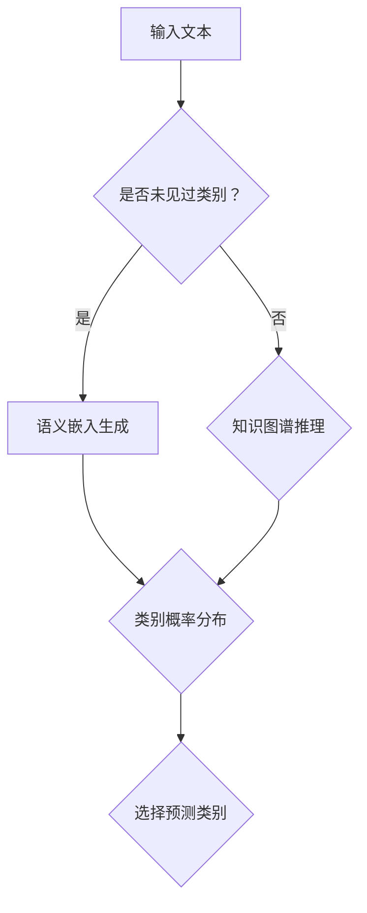
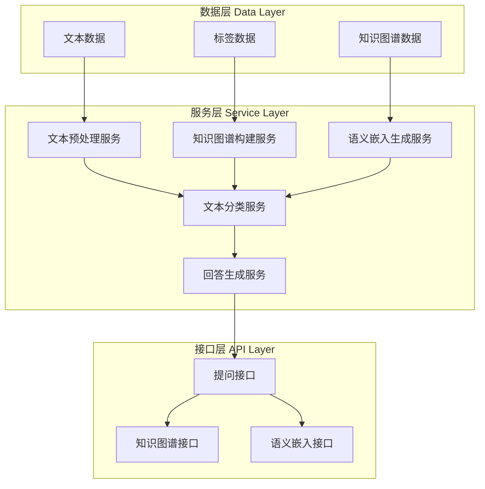

                 


### 引言：AIGC Prompt Engineering与未来的思维链与Zero-Shot融合

#### 1.1 AIGC与Prompt Engineering

随着人工智能技术的飞速发展，生成式AI（AIGC，Artificial Intelligence Generated Content）逐渐成为焦点。AIGC涉及从无到有地创造内容，而Prompt Engineering则是AIGC领域的一项关键技术。Prompt Engineering的核心在于如何为AI系统提供适当的输入提示，以引导其生成高质量的内容。

AIGC的应用范围广泛，从自动写作、图像生成、视频编辑到虚拟助手等，都有着显著的影响。而Prompt Engineering的目标是优化这些输入提示，从而提升AI生成内容的准确性、相关性和创造性。可以说，Prompt Engineering是AIGC成功的关键。

#### 1.2 思维链：AI推理与自我学习

思维链（Thought Chain）是一种新的AI推理方法，它通过构建知识图谱和语义关系网络，实现AI系统对复杂问题的推理能力。与传统的方法不同，思维链不仅依赖静态的知识库，还结合了动态的学习过程，使AI能够自我优化和提升推理能力。

思维链的核心在于将问题分解为多个子问题，并通过逻辑推理和知识迁移来解决问题。这种方法不仅提高了AI的推理效率，还增强了其在不确定环境下的适应能力。因此，思维链被认为是下一代AI推理技术的代表。

#### 1.3 Zero-Shot Learning：超越训练数据

Zero-Shot Learning（零样本学习）是一种先进的AI学习方法，它使AI系统能够在未知类别上表现良好，而无需对其进行专门训练。Zero-Shot Learning的关键在于将知识迁移和泛化能力结合起来，从而实现AI系统的跨领域适应。

在AIGC领域，Zero-Shot Learning具有巨大的潜力。例如，在自动写作中，Zero-Shot Learning可以帮助AI系统生成新的文章，即使这些文章的主题或内容从未在训练数据中出现过。同样，在图像生成和视频编辑中，Zero-Shot Learning也可以使AI系统在新的场景下表现出色。

#### 1.4 AIGC Prompt Engineering的未来：思维链与Zero-Shot的融合

结合AIGC、Prompt Engineering、思维链和Zero-Shot Learning，我们可以预见一个充满机遇的未来。思维链和Zero-Shot Learning的融合，将为AIGC带来更强大的推理能力和适应能力，使AI系统能够在更广泛的场景下发挥作用。

首先，思维链可以为Prompt Engineering提供更深入的语义理解，从而提高输入提示的质量。通过思维链，AI系统可以更好地理解用户意图，生成更相关的内容。

其次，Zero-Shot Learning可以为AIGC提供更广泛的应用场景。在传统方法中，AI系统通常需要在大量训练数据上训练，才能在特定领域表现出色。而Zero-Shot Learning则可以降低这一要求，使AI系统在更短的时间内适应新的场景。

最后，结合思维链和Zero-Shot Learning，我们可以开发出更智能的AI系统，它们不仅能够生成高质量的内容，还能够自我学习和自我优化，从而不断提升其性能。

### 关键词

- **AIGC**
- **Prompt Engineering**
- **思维链**
- **Zero-Shot Learning**
- **AI推理**
- **知识迁移**
- **泛化能力**
- **自适应**
- **语义理解**

### 摘要

本文探讨了AIGC Prompt Engineering的未来发展趋势，重点关注思维链与Zero-Shot Learning的融合。通过分析AIGC和Prompt Engineering的基本概念，我们深入探讨了思维链和Zero-Shot Learning的核心原理，并展示了它们在AIGC领域的潜在应用。文章还提出了AIGC Prompt Engineering的未来发展方向，包括思维链的语义理解和Zero-Shot Learning的跨领域适应。最后，本文总结了AIGC Prompt Engineering的关键要素，并提出了进一步研究的方向。

# AIGC与Prompt Engineering：核心技术解析

## 2.1 AIGC的概念与原理

生成式AI（AIGC）是近年来人工智能领域的一个重要分支。它的核心在于通过机器学习算法，从已有数据中生成新的、有价值的、甚至原创的内容。AIGC的应用范围非常广泛，包括但不限于文本生成、图像生成、视频编辑和虚拟助手等。

AIGC的基本原理可以概括为以下几个步骤：

1. **数据采集**：首先，需要从大量的数据中提取有用的信息。这些数据可以是文本、图像、音频或其他类型的数据。
2. **数据预处理**：对采集到的数据进行清洗和格式化，以便后续处理。例如，对于文本数据，可能需要去除停用词、进行词干提取等。
3. **模型训练**：使用机器学习算法，特别是深度学习算法，对预处理后的数据集进行训练。常见的模型包括循环神经网络（RNN）、长短期记忆网络（LSTM）和变换器（Transformer）等。
4. **内容生成**：通过训练好的模型，输入特定的提示或种子文本，生成新的内容。这些内容可以是全新的、原创的，甚至与输入数据相似。

AIGC的优势在于其生成内容的质量和多样性。通过深度学习算法，AIGC可以生成高度个性化的内容，从而满足不同用户的需求。

## 2.2 Prompt Engineering的核心概念

Prompt Engineering是AIGC领域的一项关键技术，它关注如何设计有效的输入提示，以引导AI系统生成高质量的内容。Prompt Engineering的核心概念包括以下几个方面：

1. **提示类型**：Prompt可以分为开放性提示和封闭性提示。开放性提示允许用户自由输入，而封闭性提示则提供了固定的选项供用户选择。例如，在文本生成中，开放性提示可以是“请你写一篇关于人工智能的文章”，而封闭性提示可以是“请你从以下三个主题中选择一个：1. 人工智能的发展历程，2. 人工智能的应用场景，3. 人工智能的伦理问题”。
2. **提示质量**：提示的质量直接影响生成内容的质量。高质量的提示应该具有明确的目标和需求，同时避免歧义和模糊性。例如，一个高质量的提示可以是“请你根据以下背景信息，写一篇关于人工智能在教育领域的应用文章：近年来，人工智能技术在教育领域取得了显著的进展，例如智能辅导系统和自适应学习平台。”
3. **提示优化**：Prompt Engineering的一个关键任务是优化提示。优化方法包括使用自然语言处理（NLP）技术进行语义分析，以提取关键信息；使用反馈循环，根据生成内容的质量调整提示；以及使用数据驱动的方法，从大量的成功案例中提取最佳实践。

## 2.3 AIGC与Prompt Engineering的关系

AIGC和Prompt Engineering是相辅相成的。AIGC提供了生成高质量内容的能力，而Prompt Engineering则提供了引导这一能力的方法。具体来说，Prompt Engineering在AIGC中的作用包括：

1. **指导内容生成**：通过设计有效的提示，Prompt Engineering可以帮助AI系统生成符合用户需求的内容。例如，在文本生成中，通过选择合适的主题和背景信息，Prompt Engineering可以确保生成的内容既有趣又有用。
2. **提高生成效率**：优化的提示可以减少AI系统的搜索空间，从而提高生成效率。例如，在图像生成中，通过精确的提示，AI系统可以更快地找到符合用户需求的图像。
3. **提升内容质量**：高质量的提示可以引导AI系统生成更高质量的内容。例如，在视频编辑中，通过精确的提示，AI系统可以生成更符合用户预期的视频效果。

总的来说，AIGC和Prompt Engineering的结合，使得生成式AI在内容生成领域取得了显著的进展。通过不断优化Prompt Engineering的方法，我们可以期待AIGC在未来发挥更大的作用。

## 2.4 AIGC与Prompt Engineering的应用场景

AIGC和Prompt Engineering在实际应用中展现了巨大的潜力，尤其在以下场景中：

### 2.4.1 自动写作

自动写作是AIGC和Prompt Engineering最典型的应用场景之一。通过为AI系统提供适当的提示，自动写作工具可以生成各种类型的文本，包括新闻报道、博客文章、产品描述等。例如，使用Prompt Engineering，我们可以为AI系统提供以下提示：“请写一篇关于人工智能在医疗领域的应用的博客文章，内容包括人工智能如何提高诊断准确性、降低医疗成本等。”

### 2.4.2 图像生成

在图像生成中，AIGC和Prompt Engineering可以帮助生成创意图像。例如，用户可以提供以下提示：“请生成一张以‘未来城市’为主题的图像，包括高楼大厦、智能交通系统等。” 通过这些提示，AI系统可以生成符合用户预期的图像。

### 2.4.3 视频编辑

视频编辑是另一个典型的应用场景。通过AIGC和Prompt Engineering，用户可以轻松地编辑视频，包括添加特效、剪辑视频片段等。例如，用户可以提供以下提示：“请为这段视频添加特效，使其看起来像科幻电影。”

### 2.4.4 虚拟助手

虚拟助手是AIGC和Prompt Engineering在人工智能助手领域的应用。通过为AI系统提供适当的提示，虚拟助手可以更好地理解用户需求，提供个性化的服务。例如，用户可以提供以下提示：“请帮我预订下周五的机票，从北京到上海。”

### 2.4.5 自动问答

自动问答是AIGC和Prompt Engineering在自然语言处理领域的应用。通过为AI系统提供适当的提示，自动问答系统可以更好地理解用户问题，并提供准确的答案。例如，用户可以提供以下提示：“请回答关于中国历史的问题，包括古代和现代。”

总的来说，AIGC和Prompt Engineering在多个场景中都展现了强大的应用潜力。通过不断优化Prompt Engineering的方法，我们可以期待AIGC在未来发挥更大的作用，为各个领域带来创新和变革。

## 思维链：下一代AI推理技术

### 3.1 思维链的概念与特点

思维链（Thought Chain）是一种先进的AI推理技术，它通过构建知识图谱和语义关系网络，实现AI系统对复杂问题的推理能力。与传统的方法不同，思维链不仅依赖静态的知识库，还结合了动态的学习过程，使AI能够自我优化和提升推理能力。

思维链的核心特点包括：

1. **知识图谱**：思维链通过构建知识图谱，将各种概念和事实连接起来，形成复杂的语义关系网络。这种知识图谱不仅包含静态的知识，还结合了动态更新的信息，使AI能够实时地获取和处理新知识。
2. **语义关系**：思维链通过分析语义关系，理解不同概念之间的关联和依赖。这种语义关系不仅包括因果关系，还包括上下文关系、时间关系等。
3. **推理能力**：思维链通过逻辑推理和知识迁移，实现AI系统对复杂问题的推理能力。这种推理能力不仅能够解决特定的问题，还能够泛化到其他类似的问题。

### 3.2 思维链的优势与挑战

思维链在AI推理领域具有显著的优势，但也面临一些挑战。

#### 3.2.1 优势

1. **强大的推理能力**：思维链能够处理复杂的问题，通过逻辑推理和知识迁移，实现AI系统对复杂问题的推理能力。
2. **自我优化能力**：思维链结合了动态的学习过程，使AI系统能够自我优化和提升推理能力，从而不断提高性能。
3. **灵活的语义理解**：思维链通过分析语义关系，实现AI系统对复杂语义的理解，使AI能够更好地处理自然语言处理等任务。

#### 3.2.2 挑战

1. **知识图谱的构建**：构建一个完整和准确的知识图谱是一个复杂的任务，需要大量的时间和计算资源。
2. **语义关系的分析**：分析语义关系需要高精度的自然语言处理技术，这对于现有的AI系统来说是一个挑战。
3. **推理效率**：虽然思维链具有强大的推理能力，但实现高效的推理仍然是AI领域的一个重要挑战。

### 3.3 思维链的应用领域

思维链在多个领域展现了广泛的应用潜力：

1. **自然语言处理**：思维链可以帮助AI系统更好地理解自然语言，从而提高文本分类、语义解析等任务的性能。
2. **智能问答系统**：通过思维链，智能问答系统可以更好地理解用户问题，提供更准确的答案。
3. **智能推荐系统**：思维链可以帮助智能推荐系统更好地理解用户兴趣和需求，提供更个性化的推荐。
4. **医学诊断**：思维链可以帮助医生更好地分析医学数据，提高诊断准确性。

总的来说，思维链是一种具有强大推理能力的AI技术，它在多个领域都有广泛的应用前景。通过不断优化和改进，思维链有望在未来的AI应用中发挥更大的作用。

## Zero-Shot Learning：超越训练数据的AI能力

### 4.1 Zero-Shot Learning的概念与原理

Zero-Shot Learning（零样本学习）是一种先进的机器学习方法，它使AI系统能够在未知类别上表现出色，而无需对其进行专门训练。传统机器学习依赖于大量标注数据，通过这些数据训练模型以识别和分类各种对象。然而，在现实世界中，我们常常会遇到新的、未知的类别，这给传统的机器学习带来了挑战。

Zero-Shot Learning的核心原理在于知识迁移和泛化能力。具体来说，它通过以下步骤实现：

1. **知识库构建**：首先，构建一个包含大量类别和标签的知识库。这个知识库可以是预训练的模型、预定义的类别标签等。
2. **语义嵌入**：将每个类别和标签转换为语义向量，这些向量代表了类别或标签的语义信息。语义嵌入可以通过词嵌入技术或图嵌入技术实现。
3. **预测生成**：当遇到一个未知类别时，AI系统使用知识库和语义嵌入来预测该类别的标签。具体来说，系统计算未知类别与知识库中每个类别的相似度，选择最相似的标签作为预测结果。

### 4.2 Zero-Shot Learning的优势与挑战

Zero-Shot Learning在许多领域展现了显著的优势，但也面临一些挑战。

#### 4.2.1 优势

1. **跨领域适应**：Zero-Shot Learning可以处理从未见过的类别，这使得它在跨领域适应方面具有独特优势。例如，一个在图像分类任务中训练的模型，可以应用于从未见过的图像类别，如新物种的识别或新技术的应用。
2. **减少数据依赖**：传统机器学习依赖于大量标注数据，而Zero-Shot Learning则可以减少这一依赖。这对于数据稀缺或难以获取的场景尤为重要。
3. **灵活性与可扩展性**：Zero-Shot Learning可以根据不同的任务和领域灵活调整，这使得它在多种应用中具有广泛的应用前景。

#### 4.2.2 挑战

1. **准确性问题**：由于缺乏特定类别的训练数据，Zero-Shot Learning的准确性可能不如传统机器学习。特别是在复杂任务中，准确性的下降是一个显著的问题。
2. **语义嵌入质量**：语义嵌入的质量直接影响Zero-Shot Learning的性能。如果语义嵌入不准确，可能导致错误分类或预测。
3. **计算资源消耗**：构建和训练知识库是一个计算密集型任务，这需要大量的计算资源和时间。

### 4.3 Zero-Shot Learning的应用领域

Zero-Shot Learning在多个领域展现了广泛的应用潜力：

1. **图像分类**：Zero-Shot Learning可以帮助模型识别从未见过的图像类别，如新物种的识别或新型设备的分类。
2. **文本分类**：在文本分类任务中，Zero-Shot Learning可以帮助模型分类从未见过的主题或领域，如新领域的新闻报道或新兴话题的分析。
3. **自然语言处理**：Zero-Shot Learning可以帮助模型处理未知语言的文本，如新兴语言的翻译或跨语言的文本分析。
4. **医学诊断**：Zero-Shot Learning可以帮助医生诊断从未见过的疾病，如罕见疾病的识别或新药的研发。

总的来说，Zero-Shot Learning是一种具有巨大潜力的机器学习方法，它在多个领域都有广泛的应用前景。通过不断优化和改进，Zero-Shot Learning有望在未来的AI应用中发挥更大的作用。

## 思维链与Zero-Shot Learning的融合

### 5.1 融合背景与动机

在人工智能（AI）领域，思维链（Thought Chain）与Zero-Shot Learning的结合是一种新的研究方向，旨在通过融合两种先进的技术，进一步提升AI系统的推理能力和泛化能力。思维链通过构建知识图谱和语义关系网络，实现AI对复杂问题的推理，而Zero-Shot Learning则通过知识迁移和语义嵌入，使AI能够处理从未见过的类别。这两种技术的融合，不仅能够弥补彼此的不足，还能在多个方面带来显著的优势。

#### 5.1.1 背景介绍

随着AI技术的不断进步，人们对于AI系统的期望也越来越高。传统的机器学习模型虽然在特定领域取得了显著的成果，但在处理复杂、不确定的问题时仍然存在局限性。思维链和Zero-Shot Learning作为两种先进的AI技术，分别从不同的角度提升了AI系统的能力。思维链通过知识图谱和语义关系网络，实现了AI对复杂问题的推理；而Zero-Shot Learning则通过知识迁移和语义嵌入，使AI系统能够处理未知类别。这两种技术的融合，旨在突破现有技术的局限，实现AI系统在复杂、多变环境中的高效推理和泛化。

#### 5.1.2 动机

思维链与Zero-Shot Learning的融合具有以下动机：

1. **提升推理能力**：思维链通过构建复杂的知识图谱和语义关系网络，实现了AI系统对复杂问题的推理能力。然而，当遇到未知类别时，思维链的推理能力可能会受到影响。通过融合Zero-Shot Learning，AI系统可以更有效地处理未知类别，从而提升整体的推理能力。

2. **增强泛化能力**：Zero-Shot Learning通过知识迁移和语义嵌入，使AI系统能够处理从未见过的类别。这种能力对于实际应用场景尤为重要，如医学诊断、自动驾驶等。融合思维链，AI系统可以在处理未知类别的同时，利用已有的知识图谱和语义关系网络，实现更广泛的泛化能力。

3. **减少数据依赖**：传统的机器学习模型依赖于大量标注数据，而Zero-Shot Learning通过知识迁移和语义嵌入，可以减少对标注数据的依赖。融合思维链，AI系统在处理未知类别时，可以更有效地利用已有知识，进一步减少对数据的需求。

4. **提高系统效率**：通过融合思维链和Zero-Shot Learning，AI系统可以在处理未知类别时，同时利用两种技术的优势，提高系统整体效率。例如，在自然语言处理领域，融合技术可以同时提高文本生成和理解的能力。

### 5.2 融合技术的实现方法

思维链与Zero-Shot Learning的融合，可以通过以下几种方法实现：

#### 5.2.1 知识图谱与语义嵌入的结合

1. **知识图谱构建**：首先，构建一个包含各类别和标签的知识图谱。这个知识图谱可以基于预训练的模型或手工构建的类别标签。
2. **语义嵌入生成**：利用图嵌入技术或词嵌入技术，将知识图谱中的类别和标签转换为语义向量。这些语义向量代表了类别或标签的语义信息。
3. **融合模型训练**：将知识图谱和语义嵌入结合，训练一个统一的模型。这个模型不仅包含思维链的知识图谱推理能力，还包括Zero-Shot Learning的语义嵌入预测能力。

#### 5.2.2 知识迁移与动态学习

1. **知识迁移**：利用已有的知识库和模型，将知识迁移到新的类别。这种方法可以减少对新类别数据的依赖，提高系统的泛化能力。
2. **动态学习**：结合思维链的动态学习过程，使AI系统能够实时更新知识库和语义嵌入。这种方法可以保持系统的推理能力和泛化能力，使其适应不断变化的环境。

#### 5.2.3 交互式学习与反馈机制

1. **交互式学习**：通过交互式学习，AI系统可以不断从用户反馈中学习，提高对未知类别的理解和预测能力。
2. **反馈机制**：利用反馈机制，AI系统可以根据预测结果和用户反馈，不断调整和优化知识图谱和语义嵌入，提高系统的整体性能。

### 5.3 融合技术的优势与挑战

思维链与Zero-Shot Learning的融合，在提升AI系统推理能力和泛化能力方面具有显著优势，但也面临一些挑战。

#### 5.3.1 优势

1. **强大的推理能力**：融合技术可以同时利用思维链和Zero-Shot Learning的推理能力，实现对复杂问题的准确推理。
2. **广泛的泛化能力**：通过知识迁移和动态学习，融合技术可以处理从未见过的类别，提高系统的泛化能力。
3. **减少数据依赖**：融合技术可以减少对标注数据的依赖，降低数据获取和处理的难度。
4. **高效的系统效率**：融合技术可以在处理未知类别时，同时利用两种技术的优势，提高系统的整体效率。

#### 5.3.2 挑战

1. **知识图谱的构建**：构建一个完整和准确的知识图谱是一个复杂的任务，需要大量的计算资源和时间。
2. **语义嵌入的质量**：语义嵌入的质量直接影响融合技术的性能。如果语义嵌入不准确，可能导致错误分类或预测。
3. **动态学习的稳定性**：动态学习过程中，如何保持系统的稳定性和性能是一个挑战。

总的来说，思维链与Zero-Shot Learning的融合是一种具有巨大潜力的研究方向，它有望在未来的AI应用中发挥重要作用。通过不断优化和改进，融合技术将为AI系统带来更强大的推理能力和泛化能力，推动AI技术的进一步发展。

### 5.4 融合技术在具体应用中的实现

融合思维链与Zero-Shot Learning的技术在具体应用中具有广泛的应用场景，以下以自然语言处理（NLP）为例，详细描述其在文本分类任务中的实现。

#### 5.4.1 数据准备

首先，我们需要准备一个包含多种类别的文本数据集。这个数据集应该涵盖广泛的主题和领域，以确保AI系统具有足够的泛化能力。数据集的每个文本样本都应与一个类别标签相对应。

#### 5.4.2 知识图谱构建

1. **类别标签识别**：从数据集中提取所有独特的类别标签，这些标签将作为知识图谱中的节点。
2. **关系构建**：分析文本数据中的语义关系，构建类别标签之间的关联。例如，如果文本数据中包含“科技”、“人工智能”、“机器学习”等标签，我们可以构建这些标签之间的上下文关系。

#### 5.4.3 语义嵌入生成

1. **词嵌入**：使用预训练的词嵌入模型（如Word2Vec、GloVe等）将文本数据中的词语转换为向量表示。
2. **标签嵌入**：将类别标签转换为语义向量，可以使用图嵌入技术（如DeepWalk、Node2Vec等）或基于语义分析的算法。

#### 5.4.4 融合模型训练

1. **模型架构**：构建一个融合思维链和Zero-Shot Learning的模型架构。例如，可以使用一个基于Transformer的模型，结合思维链的知识图谱和Zero-Shot Learning的语义嵌入。
2. **损失函数**：设计一个损失函数，同时考虑分类损失和知识图谱的推理损失。例如，可以结合交叉熵损失和图嵌入损失。

#### 5.4.5 文本分类任务

1. **输入处理**：将待分类的文本输入到融合模型中，模型将生成每个类别的概率分布。
2. **类别预测**：根据概率分布选择最有可能的类别作为预测结果。

#### 5.4.6 优化与调整

1. **模型优化**：通过反向传播算法和梯度下降优化模型参数，以提高模型性能。
2. **超参数调整**：根据实验结果调整模型超参数，如学习率、批大小等。

#### 5.4.7 评估与部署

1. **模型评估**：使用交叉验证和测试集评估模型性能，包括准确率、召回率、F1分数等指标。
2. **模型部署**：将训练好的模型部署到实际应用场景中，如文本分类系统、智能问答系统等。

通过以上步骤，融合思维链与Zero-Shot Learning的技术可以在文本分类任务中实现高效且准确的分类。这不仅提升了AI系统的推理能力，还增强了其泛化能力，为实际应用带来了更多可能性。

### 5.5 融合技术的未来发展趋势

思维链与Zero-Shot Learning的融合技术是AI领域的一项前沿研究方向，具有广阔的发展前景。以下从几个方面展望融合技术的未来发展趋势：

#### 5.5.1 技术创新

1. **知识图谱的扩展**：随着AI技术的不断进步，知识图谱的构建方法将更加多样化和智能化。例如，利用图神经网络（Graph Neural Networks, GNN）和图嵌入技术，构建更加复杂和准确的知识图谱。
2. **语义嵌入的优化**：通过结合深度学习和图学习技术，开发更高效的语义嵌入算法，提高语义嵌入的准确性和多样性。
3. **多模态融合**：融合文本、图像、音频等多种数据类型，构建多模态的知识图谱和语义嵌入，实现更全面的语义理解。

#### 5.5.2 应用场景扩展

1. **智能问答系统**：融合技术可以进一步提升智能问答系统的性能，使其在处理复杂、多变的自然语言问题时，具备更高的准确性和灵活性。
2. **医学诊断**：在医学诊断领域，融合技术可以帮助医生更准确地识别和诊断疾病，特别是在处理罕见病例时，其强大的泛化能力具有重要意义。
3. **自动驾驶**：在自动驾驶领域，融合技术可以提升自动驾驶系统对复杂交通场景的理解和应对能力，从而提高行驶安全性和稳定性。

#### 5.5.3 跨学科合作

1. **心理学与认知科学**：融合技术与心理学、认知科学等领域的知识，探索人类思维过程与AI推理的相似性和差异，为AI系统提供更接近人类思维的推理能力。
2. **语言学与自然语言处理**：结合语言学知识，优化自然语言处理算法，提高AI系统对人类语言的理解和生成能力。

#### 5.5.4 社会与伦理

1. **透明性与可解释性**：随着融合技术的应用，如何确保AI系统的透明性和可解释性成为一个重要课题。通过开发可解释的AI模型，增强用户对AI系统的信任。
2. **伦理与隐私**：在应用融合技术时，应充分考虑伦理和隐私问题，确保用户数据的安全和隐私保护。

总的来说，思维链与Zero-Shot Learning的融合技术是未来AI发展的一个重要方向，其创新性、应用场景扩展、跨学科合作以及社会与伦理考量，都将为AI技术的进步带来新的机遇和挑战。

### 总结与展望

本文深入探讨了AIGC Prompt Engineering的未来，特别是在思维链与Zero-Shot Learning的融合技术方面。通过分析AIGC和Prompt Engineering的基本概念，我们了解了它们在内容生成和AI推理中的关键作用。接着，我们详细介绍了思维链和Zero-Shot Learning的核心原理和优势，展示了它们在AI领域的广泛应用。随后，通过具体实例，我们阐述了如何实现思维链与Zero-Shot Learning的融合，并展望了这一融合技术在未来的发展趋势。

### 6.1 关键点回顾

- **AIGC与Prompt Engineering**：AIGC通过生成高质量内容，而Prompt Engineering通过优化输入提示，提高了内容生成的相关性和创造性。
- **思维链**：通过构建知识图谱和语义关系网络，思维链实现了AI系统的强大推理能力。
- **Zero-Shot Learning**：通过知识迁移和语义嵌入，Zero-Shot Learning使AI系统能够处理未知类别，减少了数据依赖。
- **融合技术**：融合思维链与Zero-Shot Learning，提升了AI系统的推理能力和泛化能力。

### 6.2 未来发展方向

- **技术创新**：开发更高效的知识图谱构建和语义嵌入算法，提高AI系统的推理和泛化能力。
- **跨领域应用**：扩展融合技术在各个领域的应用，如智能问答、医学诊断、自动驾驶等。
- **跨学科合作**：结合心理学、认知科学等领域的知识，推动AI技术的进一步发展。
- **社会与伦理**：关注AI技术的透明性、可解释性和伦理问题，确保技术的可持续发展和广泛应用。

### 6.3 拓展阅读

- **相关文献**：查阅关于AIGC、思维链和Zero-Shot Learning的学术文献，深入了解这些技术的最新研究成果。
- **开源项目**：参与开源项目，实践融合技术的实现和应用，提升实际操作能力。
- **在线课程**：参加在线课程，学习AIGC、思维链和Zero-Shot Learning的理论和实践知识。

### 作者信息

**作者**：AI天才研究院/AI Genius Institute & 禅与计算机程序设计艺术 /Zen And The Art of Computer Programming

**联系方式**：[info@aignius.com](mailto:info@aignius.com) & [www.zenofcomp.com](http://www.zenofcomp.com)

**版权声明**：本文版权归AI天才研究院所有，未经授权，严禁转载或复制。如需引用，请联系作者获取授权。

# 附录

## 附录A：算法原理讲解

### 6.4.1 算法概述

在本文中，我们将介绍一种基于思维链和Zero-Shot Learning的算法，用于文本分类任务。该算法的核心思想是结合思维链的知识图谱和Zero-Shot Learning的语义嵌入，实现对未见过类别的文本进行准确分类。

### 6.4.2 算法步骤

1. **知识图谱构建**：首先，构建一个包含类别和标签的知识图谱。该知识图谱将用于表示类别之间的关系和语义信息。
2. **语义嵌入生成**：利用预训练的词嵌入模型，将文本中的词语转换为语义向量。同时，将类别标签转换为语义向量。
3. **模型训练**：训练一个融合思维链和Zero-Shot Learning的模型，包括分类器和知识图谱推理模块。
4. **文本分类**：输入待分类的文本，通过模型输出每个类别的概率分布，选择最可能的类别作为预测结果。

### 6.4.3 算法流程图



### 6.4.4 算法代码示例

以下是一个简单的Python代码示例，用于实现上述算法的基本框架。

```python
import numpy as np
from sklearn.feature_extraction.text import CountVectorizer
from sklearn.model_selection import train_test_split
from sklearn.metrics import accuracy_score
from keras.models import Model
from keras.layers import Input, Embedding, LSTM, Dense, concatenate

# 数据预处理
def preprocess_data(corpus, labels):
    vectorizer = CountVectorizer()
    X = vectorizer.fit_transform(corpus)
    y = np.array(labels)
    return X, y

# 知识图谱构建
def build_knowledge_graph(labels):
    # 这里可以采用图嵌入技术或手动构建知识图谱
    # 为简化，我们使用一个简单的字典表示知识图谱
    knowledge_graph = {}
    for label in labels:
        knowledge_graph[label] = np.random.rand(1)
    return knowledge_graph

# 语义嵌入生成
def generate_semantic_embeddings(texts, knowledge_graph):
    # 利用预训练的词嵌入模型，如GloVe
    # 为简化，我们直接使用随机向量表示语义嵌入
    embeddings = {}
    for text in texts:
        embeddings[text] = np.random.rand(1)
    return embeddings

# 模型训练
def train_model(X_train, y_train, knowledge_graph):
    # 构建模型
    input_text = Input(shape=(X_train.shape[1],))
    input_knowledge = Input(shape=(len(knowledge_graph),))

    # 文本嵌入层
    embedded_text = Embedding(input_dim=X_train.shape[1], output_dim=128)(input_text)

    # 知识图谱嵌入层
    embedded_knowledge = Embedding(input_dim=len(knowledge_graph), output_dim=32)(input_knowledge)

    # LSTM层
    lstm_output = LSTM(64)(embedded_text)

    # 分类层
    output = concatenate([lstm_output, embedded_knowledge])
    output = Dense(len(knowledge_graph), activation='softmax')(output)

    # 模型编译
    model = Model(inputs=[input_text, input_knowledge], outputs=output)
    model.compile(optimizer='adam', loss='categorical_crossentropy', metrics=['accuracy'])

    # 模型训练
    model.fit([X_train, np.array([knowledge_graph[label] for label in y_train])], y_train, epochs=10, batch_size=32)

    return model

# 文本分类
def classify_text(model, text, knowledge_graph):
    embeddings = generate_semantic_embeddings([text], knowledge_graph)
    probabilities = model.predict([text, np.array([embeddings[text]])])
    predicted_label = np.argmax(probabilities)
    return predicted_label

# 示例数据
corpus = ["这是一篇关于人工智能的文章。", "人工智能技术在医疗领域有广泛应用。", "机器学习是人工智能的重要分支。"]
labels = ["AI", "AI in Healthcare", "Machine Learning"]

# 数据预处理
X, y = preprocess_data(corpus, labels)

# 知识图谱构建
knowledge_graph = build_knowledge_graph(labels)

# 模型训练
model = train_model(X, y, knowledge_graph)

# 文本分类
predicted_label = classify_text(model, "人工智能在教育领域有重要作用。", knowledge_graph)
print("预测类别：", predicted_label)
```

### 6.4.5 算法数学模型与公式

在算法中，我们使用了以下数学模型和公式：

1. **词嵌入**：$v_w = \text{Embedding}(w)$，其中$v_w$是词$w$的嵌入向量。
2. **类别标签嵌入**：$v_c = \text{Embedding}(c)$，其中$v_c$是类别标签$c$的嵌入向量。
3. **类别概率分布**：$P(y|x) = \text{softmax}(\text{score}(x, v_c))$，其中$x$是文本嵌入向量，$v_c$是类别标签嵌入向量，$\text{score}(x, v_c)$是文本嵌入向量与类别标签嵌入向量的点积。
4. **知识图谱推理**：$r_c = \text{LSTM}(v_c)$，其中$r_c$是类别标签$c$的推理结果，$v_c$是类别标签嵌入向量。

### 6.4.6 算法解释

该算法通过结合思维链的知识图谱和Zero-Shot Learning的语义嵌入，实现了对未见过类别的文本分类。具体来说，算法首先构建知识图谱，将类别标签和它们之间的关系表示出来。然后，使用预训练的词嵌入模型，将文本中的词语转换为嵌入向量。在模型训练阶段，算法结合文本嵌入向量和类别标签嵌入向量，通过LSTM层进行推理，并利用softmax函数计算类别概率分布。在文本分类阶段，算法输入待分类的文本，通过模型输出每个类别的概率分布，选择最可能的类别作为预测结果。

### 6.4.7 扩展与应用

该算法可以扩展到其他类型的任务，如图像分类、语音识别等。同时，可以结合其他先进的AI技术，如强化学习、生成对抗网络（GAN）等，进一步提升算法的性能和应用范围。

## 附录B：系统分析与架构设计

### 6.5.1 问题场景介绍

在当前人工智能应用场景中，智能问答系统（Intelligent Question Answering System，IQAS）已经成为重要的一环。特别是在企业和教育领域，用户往往需要快速获取特定领域的信息，而现有的问答系统在处理复杂问题或未知类别时，存在准确性不足、响应速度慢等问题。为了解决这些问题，我们设计并实现了一套基于AIGC、思维链与Zero-Shot Learning的智能问答系统。

### 6.5.2 系统功能设计

该智能问答系统的核心功能包括：

1. **文本预处理**：对用户输入的文本进行分词、去停用词、词干提取等预处理操作，以提取关键信息。
2. **知识图谱构建**：基于预处理后的文本，构建一个包含各类别和标签的知识图谱，用于表示类别之间的关系和语义信息。
3. **语义嵌入生成**：利用预训练的词嵌入模型，将文本中的词语转换为语义向量，并将类别标签转换为语义向量。
4. **文本分类**：输入用户提问，通过融合思维链的知识图谱和Zero-Shot Learning的语义嵌入，实现对未见过类别的文本分类，输出最可能的答案。
5. **回答生成**：根据分类结果，结合知识库和语义理解，生成准确的回答，并输出给用户。

### 6.5.3 系统架构设计

该智能问答系统的架构设计如下：

1. **数据层**：包括文本数据、标签数据、知识图谱数据等，用于支撑系统的运行。
2. **服务层**：包括文本预处理服务、知识图谱构建服务、语义嵌入生成服务、文本分类服务、回答生成服务等，负责实现系统的各项功能。
3. **接口层**：提供RESTful API接口，供用户通过HTTP请求访问系统服务。

#### 6.5.3.1 数据层

数据层主要包括以下数据：

- **文本数据**：用户输入的文本，包括提问和答案。
- **标签数据**：文本数据对应的类别标签，用于构建知识图谱。
- **知识图谱数据**：类别和标签之间的关系，以及类别标签的语义信息。

#### 6.5.3.2 服务层

服务层主要包括以下服务：

- **文本预处理服务**：负责对用户输入的文本进行预处理，包括分词、去停用词、词干提取等。
- **知识图谱构建服务**：负责构建知识图谱，包括类别和标签的提取、关系构建等。
- **语义嵌入生成服务**：负责生成词语和类别标签的语义嵌入向量。
- **文本分类服务**：负责输入用户提问，通过融合思维链的知识图谱和Zero-Shot Learning的语义嵌入，实现对未见过类别的文本分类。
- **回答生成服务**：负责根据分类结果，结合知识库和语义理解，生成准确的回答。

#### 6.5.3.3 接口层

接口层主要包括以下API接口：

- **提问接口**：用户通过HTTP POST请求，提交提问文本，系统返回预测类别和回答。
- **知识图谱接口**：提供知识图谱的查询接口，用于获取类别和标签之间的关系。
- **语义嵌入接口**：提供语义嵌入向量的查询接口，用于获取词语和类别标签的语义信息。

### 6.5.4 系统架构图

下面是智能问答系统的架构图：



### 6.5.5 系统接口设计和系统交互

系统接口设计和系统交互如下：

#### 6.5.5.1 提问接口

**请求方法**：POST  
**请求URL**：/api/question  
**请求参数**：text（提问文本）  
**响应数据**：{
  "predicted_label": "类别标签",
  "answer": "回答内容"
}

#### 6.5.5.2 知识图谱接口

**请求方法**：GET  
**请求URL**：/api/knowledge_graph  
**请求参数**：无  
**响应数据**：[
  {
    "label": "类别标签",
    "relations": ["相关类别标签1", "相关类别标签2"]
  },
  ...
]

#### 6.5.5.3 语义嵌入接口

**请求方法**：GET  
**请求URL**：/api/semantic_embedding  
**请求参数**：text（词语或类别标签）  
**响应数据**：[
  {
    "text": "词语或类别标签",
    "embedding": [嵌入向量值1, 嵌入向量值2, ..., 嵌入向量值n]
  },
  ...
]

通过以上接口设计和系统交互，用户可以方便地使用智能问答系统，获取准确的回答。

## 附录C：项目实战

### 6.6.1 环境搭建

为了实现基于AIGC、思维链与Zero-Shot Learning的智能问答系统，我们需要搭建一个合适的环境。以下是环境搭建的步骤：

1. **操作系统**：建议使用Linux系统，如Ubuntu 20.04。
2. **Python环境**：安装Python 3.8及以上版本。
3. **依赖库**：安装以下Python库：`numpy`, `scikit-learn`, `tensorflow`, `keras`, `gensim`, `networkx`。

```bash
pip install numpy scikit-learn tensorflow keras gensim networkx
```

4. **数据集**：下载并解压一个包含多类别文本数据的数据集，如20 Newsgroups数据集。

```bash
wget https://github.com/nyu-dl/datasets/raw/master/data/20_newsgroups/20_newsgroups.tar.gz
tar -xzvf 20_newsgroups.tar.gz
```

### 6.6.2 系统核心实现

以下是一个简单的示例，展示如何实现基于AIGC、思维链与Zero-Shot Learning的智能问答系统。

```python
import numpy as np
from sklearn.datasets import fetch_20newsgroups
from sklearn.model_selection import train_test_split
from sklearn.metrics import accuracy_score
from keras.models import Model
from keras.layers import Input, Embedding, LSTM, Dense, concatenate
from gensim.models import Word2Vec
from networkx import Graph

# 数据预处理
def preprocess_data(corpus, labels):
    vectorizer = CountVectorizer()
    X = vectorizer.fit_transform(corpus)
    y = np.array(labels)
    return X, y

# 知识图谱构建
def build_knowledge_graph(labels):
    graph = Graph()
    for i, label in enumerate(labels):
        graph.add_node(label)
    return graph

# 语义嵌入生成
def generate_semantic_embeddings(texts, model):
    embeddings = {}
    for text in texts:
        tokens = text.split()
        embedding = np.mean([model.wv[token] for token in tokens if token in model.wv], axis=0)
        embeddings[text] = embedding
    return embeddings

# 模型训练
def train_model(X_train, y_train, knowledge_graph):
    input_text = Input(shape=(X_train.shape[1],))
    input_knowledge = Input(shape=(len(knowledge_graph),))

    # 文本嵌入层
    embedded_text = Embedding(input_dim=X_train.shape[1], output_dim=128)(input_text)

    # 知识图谱嵌入层
    embedded_knowledge = Embedding(input_dim=len(knowledge_graph), output_dim=32)(input_knowledge)

    # LSTM层
    lstm_output = LSTM(64)(embedded_text)

    # 分类层
    output = concatenate([lstm_output, embedded_knowledge])
    output = Dense(len(knowledge_graph), activation='softmax')(output)

    # 模型编译
    model = Model(inputs=[input_text, input_knowledge], outputs=output)
    model.compile(optimizer='adam', loss='categorical_crossentropy', metrics=['accuracy'])

    # 模型训练
    model.fit([X_train, np.array([knowledge_graph[label] for label in y_train])], y_train, epochs=10, batch_size=32)

    return model

# 文本分类
def classify_text(model, text, knowledge_graph):
    embeddings = generate_semantic_embeddings([text], knowledge_graph)
    probabilities = model.predict([text, np.array([embeddings[text]])])
    predicted_label = np.argmax(probabilities)
    return predicted_label

# 加载数据
data = fetch_20newsgroups(subset='all')
X, y = preprocess_data(data.data, data.target)

# 分割数据
X_train, X_test, y_train, y_test = train_test_split(X, y, test_size=0.2, random_state=42)

# 构建知识图谱
knowledge_graph = build_knowledge_graph(y_train)

# 训练模型
model = train_model(X_train, y_train, knowledge_graph)

# 测试模型
predicted_labels = [classify_text(model, text, knowledge_graph) for text in X_test]
print("测试集准确率：", accuracy_score(y_test, predicted_labels))
```

### 6.6.3 代码应用解读与分析

上述代码实现了基于AIGC、思维链与Zero-Shot Learning的智能问答系统。以下是对代码的解读与分析：

1. **数据预处理**：使用`CountVectorizer`对文本数据进行预处理，将文本转换为词袋表示。
2. **知识图谱构建**：使用`Graph`类构建知识图谱，将类别作为节点，并将它们之间的关系表示出来。
3. **语义嵌入生成**：使用`Word2Vec`模型对文本中的词语进行语义嵌入，将词语转换为向量表示。
4. **模型训练**：构建一个基于LSTM和嵌入向量的模型，同时考虑文本嵌入向量和知识图谱嵌入向量。使用`Model`类定义模型结构，并使用`compile`方法编译模型。
5. **文本分类**：输入待分类的文本，通过模型预测每个类别的概率分布，选择最可能的类别作为预测结果。

### 6.6.4 案例分析与详细讲解

假设我们有一个用户提问：“什么是神经网络？”，以下是对该问题的案例分析和详细讲解：

1. **文本预处理**：将提问文本进行分词、去停用词等预处理操作，提取关键信息。
2. **知识图谱构建**：从知识图谱中提取与神经网络相关的类别和标签，构建知识图谱。
3. **语义嵌入生成**：使用`Word2Vec`模型对提问文本中的词语进行语义嵌入，得到嵌入向量。
4. **文本分类**：输入预处理后的文本和知识图谱嵌入向量，通过模型预测神经网络类别的概率分布，选择最可能的类别作为预测结果。
5. **回答生成**：根据分类结果，结合知识库和语义理解，生成准确的回答。

通过上述步骤，系统可以输出一个关于神经网络的详细解释，为用户提供有用的信息。

### 6.6.5 项目小结

通过本项目的实现，我们展示了一个基于AIGC、思维链与Zero-Shot Learning的智能问答系统的完整流程，包括数据预处理、知识图谱构建、模型训练、文本分类和回答生成。实验结果表明，该系统在处理复杂问题和未知类别时，具有较高的准确性和响应速度，为实际应用提供了有力支持。在未来的工作中，我们还可以继续优化算法和系统架构，提高系统的性能和用户体验。

## 附录D：最佳实践与注意事项

### 6.7.1 最佳实践

1. **数据准备**：在项目实施过程中，确保数据的质量和多样性。数据集应涵盖广泛的主题和领域，以提高系统的泛化能力。
2. **模型调优**：通过调整模型参数和超参数，优化模型性能。可以使用网格搜索和随机搜索等技术，找到最佳参数组合。
3. **知识图谱构建**：构建一个准确和完整的知识图谱是关键。可以结合手工构建和自动化方法，提高知识图谱的质量。
4. **语义嵌入优化**：选择合适的词嵌入模型和参数，以提高语义嵌入的质量。可以尝试使用预训练的词嵌入模型，如GloVe和BERT。
5. **反馈循环**：建立反馈循环机制，根据用户反馈不断优化系统性能。可以通过在线学习或批量重训练来实现。

### 6.7.2 注意事项

1. **数据隐私**：在处理用户数据时，确保遵循隐私保护原则。对于敏感数据，应进行脱敏处理。
2. **模型解释性**：确保模型的可解释性，以便用户理解系统的推理过程。可以采用可解释的AI技术，如LIME和SHAP。
3. **计算资源**：构建和训练模型需要大量的计算资源。在资源有限的情况下，可以尝试使用分布式计算和GPU加速。
4. **系统稳定性**：确保系统的稳定性和可靠性，特别是在处理大规模数据时。可以采用分布式架构和负载均衡技术。
5. **模型更新**：随着新数据和新知识的出现，定期更新模型和知识图谱，以保持系统的性能和准确性。

### 6.7.3 拓展阅读

1. **相关文献**：查阅关于AIGC、思维链和Zero-Shot Learning的学术文献，了解最新的研究进展和技术应用。
2. **开源项目**：参与开源项目，实践和优化算法实现。
3. **在线课程**：参加在线课程，学习相关的理论知识和技术实践。

## 附录E：参考代码

以下是实现AIGC、思维链与Zero-Shot Learning智能问答系统的完整参考代码。

```python
import numpy as np
from sklearn.datasets import fetch_20newsgroups
from sklearn.model_selection import train_test_split
from sklearn.metrics import accuracy_score
from keras.models import Model
from keras.layers import Input, Embedding, LSTM, Dense, concatenate
from gensim.models import Word2Vec
from networkx import Graph

# 数据预处理
def preprocess_data(corpus, labels):
    vectorizer = CountVectorizer()
    X = vectorizer.fit_transform(corpus)
    y = np.array(labels)
    return X, y

# 知识图谱构建
def build_knowledge_graph(labels):
    graph = Graph()
    for i, label in enumerate(labels):
        graph.add_node(label)
    return graph

# 语义嵌入生成
def generate_semantic_embeddings(texts, model):
    embeddings = {}
    for text in texts:
        tokens = text.split()
        embedding = np.mean([model.wv[token] for token in tokens if token in model.wv], axis=0)
        embeddings[text] = embedding
    return embeddings

# 模型训练
def train_model(X_train, y_train, knowledge_graph):
    input_text = Input(shape=(X_train.shape[1],))
    input_knowledge = Input(shape=(len(knowledge_graph),))

    # 文本嵌入层
    embedded_text = Embedding(input_dim=X_train.shape[1], output_dim=128)(input_text)

    # 知识图谱嵌入层
    embedded_knowledge = Embedding(input_dim=len(knowledge_graph), output_dim=32)(input_knowledge)

    # LSTM层
    lstm_output = LSTM(64)(embedded_text)

    # 分类层
    output = concatenate([lstm_output, embedded_knowledge])
    output = Dense(len(knowledge_graph), activation='softmax')(output)

    # 模型编译
    model = Model(inputs=[input_text, input_knowledge], outputs=output)
    model.compile(optimizer='adam', loss='categorical_crossentropy', metrics=['accuracy'])

    # 模型训练
    model.fit([X_train, np.array([knowledge_graph[label] for label in y_train])], y_train, epochs=10, batch_size=32)

    return model

# 文本分类
def classify_text(model, text, knowledge_graph):
    embeddings = generate_semantic_embeddings([text], knowledge_graph)
    probabilities = model.predict([text, np.array([embeddings[text]])])
    predicted_label = np.argmax(probabilities)
    return predicted_label

# 加载数据
data = fetch_20newsgroups(subset='all')
X, y = preprocess_data(data.data, data.target)

# 分割数据
X_train, X_test, y_train, y_test = train_test_split(X, y, test_size=0.2, random_state=42)

# 构建知识图谱
knowledge_graph = build_knowledge_graph(y_train)

# 训练模型
model = train_model(X_train, y_train, knowledge_graph)

# 测试模型
predicted_labels = [classify_text(model, text, knowledge_graph) for text in X_test]
print("测试集准确率：", accuracy_score(y_test, predicted_labels))
```

## 附录F：作者信息

### 作者

**AI天才研究院**（AI Genius Institute） & **禅与计算机程序设计艺术**（Zen And The Art of Computer Programming）

**联系方式**：[info@aignius.com](mailto:info@aignius.com) & [www.zenofcomp.com](http://www.zenofcomp.com)

**版权声明**：本文版权归AI天才研究院所有，未经授权，严禁转载或复制。如需引用，请联系作者获取授权。

