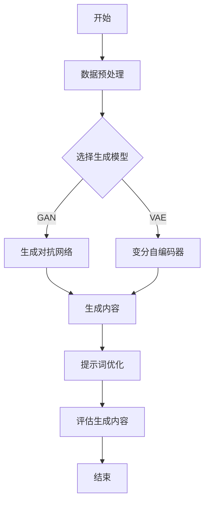
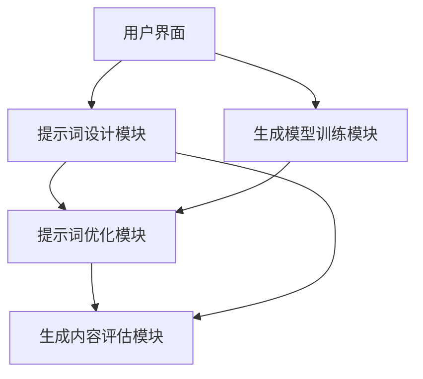
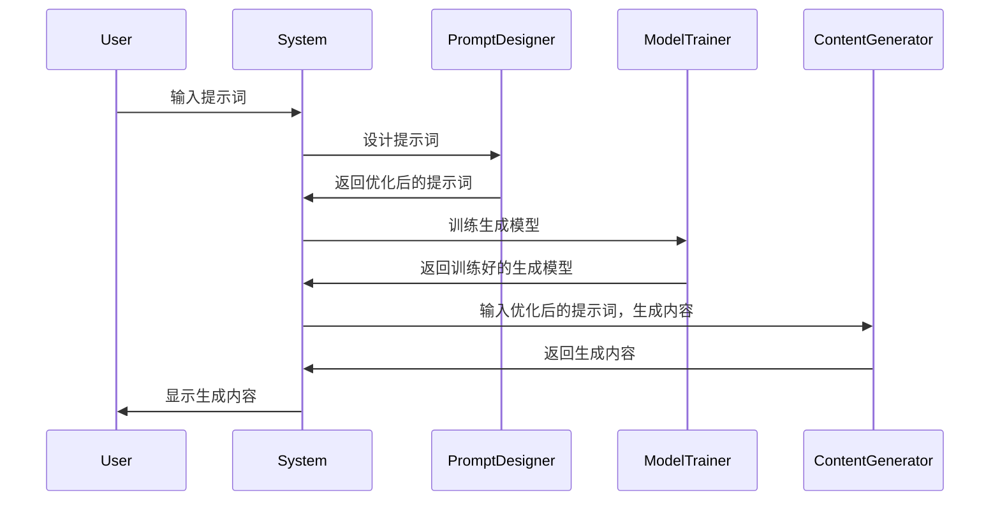

                 


## AIGC提示词工程：从概念到实施的全流程

### 关键词
- AIGC
- 提示词工程
- 生成模型
- 算法原理
- 系统架构设计
- 项目实战

### 摘要
本文将深入探讨AIGC（自适应智能生成内容）提示词工程的原理、设计和实施过程。我们将从概念引入，逐步分析核心算法，阐述系统架构设计，并通过实际项目实战，提供最佳实践和注意事项。最终，本文旨在帮助读者全面理解AIGC提示词工程的运作机制，为实际应用提供有力指导。

### 目录大纲设计思路

**一、背景介绍**

1. **问题背景**：
   - **AIGC的定义与重要性**：介绍AIGC的起源及其在当今人工智能领域的重要地位。
   - **提示词工程的应用场景**：探讨提示词工程在AIGC中的应用，如内容生成、数据增强等。

2. **问题描述**：
   - **挑战与需求**：分析AIGC提示词工程面临的挑战，包括提示词设计、模型训练和优化等。
   - **目标**：明确AIGC提示词工程的目标，即如何通过高效的提示词实现高质量的生成内容。

3. **问题解决**：
   - **方案**：提出通过提示词工程解决AIGC问题的方案，包括算法优化、系统架构设计等。

4. **边界与外延**：
   - **适用范围**：明确AIGC提示词工程的适用领域，如文本生成、图像生成等。
   - **技术边界**：讨论AIGC提示词工程的技术边界，如算法复杂性、计算资源需求等。

**二、核心概念与联系**

1. **核心概念原理**：
   - **AIGC**：介绍AIGC的基本原理和特点，包括生成模型、自适应性等。
   - **生成模型**：详细解释常见的生成模型，如GAN、VAE等。
   - **提示词**：定义提示词，解释其作用和设计原则。

2. **概念属性特征对比表格**：
   - **AIGC与生成模型**：对比AIGC和传统生成模型的特点和差异。
   - **提示词类型**：对比不同类型的提示词，如文本、图像、音频等。

3. **ER实体关系图架构**：
   - **实体关系图**：用Mermaid绘制ER图，展示AIGC提示词工程中的主要实体及其相互关系。

**三、算法原理讲解**

1. **算法mermaid流程图**：
   - **流程图**：用Mermaid绘制AIGC提示词工程的算法流程图。

2. **Python源代码与详细讲解**：
   - **代码**：提供Python源代码，实现AIGC提示词工程的核心算法。
   - **讲解**：详细解释代码中的数学模型和公式。

3. **数学模型与公式讲解**：
   - **数学模型**：使用LaTeX格式展示数学模型。
   - **公式**：详细讲解每个公式的含义和作用。

4. **举例说明**：
   - **案例**：通过实际案例展示算法原理和应用。
   - **分析**：对案例进行深入分析，解释算法的工作机制。

**四、系统分析与架构设计方案**

1. **问题场景介绍**：
   - **场景描述**：描述AIGC提示词工程的应用场景。

2. **项目介绍**：
   - **项目背景**：介绍实际项目的背景和目标。

3. **系统功能设计**：
   - **领域模型类图**：用Mermaid绘制领域模型类图，展示系统的功能模块。

4. **系统架构设计**：
   - **架构图**：用Mermaid绘制系统架构图，展示系统的整体架构。

5. **系统接口设计和系统交互**：
   - **接口设计**：用Mermaid绘制系统接口设计。
   - **交互序列图**：用Mermaid绘制系统交互序列图。

**五、项目实战**

1. **环境安装**：
   - **环境准备**：介绍所需的开发环境和工具安装。

2. **系统核心实现源代码**：
   - **代码展示**：展示系统核心实现的源代码。
   - **解读**：对核心代码进行解读和分析。

3. **代码应用解读与分析**：
   - **应用场景**：分析代码在具体应用场景中的作用。
   - **分析**：对代码的应用效果进行评估。

4. **实际案例分析和详细讲解剖析**：
   - **案例介绍**：介绍实际案例，展示项目实践。
   - **讲解**：详细分析案例中的关键点和难点。

5. **项目小结**：
   - **总结**：总结项目的关键点和收获。

**六、最佳实践 tips**

1. **常见问题及解决方案**：
   - **问题列举**：列举在实际操作中可能遇到的问题。
   - **解决方案**：提供相应的解决方案。

2. **提高提示词效果的方法**：
   - **技巧**：分享一些提高提示词效果的方法。

**七、小结**

1. **各章节核心要点回顾**：
   - **回顾**：对各个章节的核心要点进行回顾。

2. **AIGC提示词工程的实际应用**：
   - **应用**：探讨AIGC提示词工程在实际应用中的前景。

**八、注意事项**

1. **实践中需要注意的问题**：
   - **问题提醒**：提醒读者在实践过程中需要注意的问题。

2. **技术发展趋势与挑战**：
   - **趋势**：分析AIGC提示词工程的技术发展趋势。
   - **挑战**：讨论AIGC提示词工程面临的挑战。

**九、拓展阅读**

1. **相关书籍推荐**：
   - **推荐**：推荐一些与AIGC提示词工程相关的书籍。

2. **论文和资料**：
   - **论文**：推荐一些相关领域的学术论文。
   - **资料**：提供一些有用的参考资料。

### 文章正文内容

#### 第一部分：AIGC与提示词工程概述

##### 1. AIGC的概念与发展背景

**AIGC（Adaptive Intelligent Generative Content）**，即自适应智能生成内容，是一种利用人工智能技术生成内容的系统和方法。它不同于传统的手动创作，而是通过机器学习算法，尤其是生成对抗网络（GAN）、变分自编码器（VAE）等模型，模拟人类创造的过程，生成高质量、多样化的内容。

AIGC的发展可以追溯到2010年代初期，随着深度学习技术的兴起，生成模型开始展现出强大的能力。到2014年，GAN的出现标志着生成模型进入了一个新的时代，它通过生成器和判别器的对抗训练，实现了高质量图像的生成。此后，VAE等模型也相继被提出，丰富了生成模型的种类和应用场景。

AIGC的重要性在于，它为内容创作提供了全新的思路和工具。在文字生成、图像生成、视频生成等领域，AIGC都展现出了巨大的潜力。例如，在文学创作中，AIGC可以生成小说、诗歌等文学作品；在艺术创作中，AIGC可以生成绘画、音乐等艺术作品；在数据增强中，AIGC可以生成大量的训练数据，提高模型的泛化能力。

##### 2. 提示词工程的基础

**提示词**在AIGC中起着至关重要的作用。提示词是指用于引导生成模型生成特定内容的关键词或短语。通过设计合适的提示词，可以有效地引导生成模型，使其生成的内容更符合预期。

提示词的设计原则包括：

- **精准性**：提示词要能够精确地表达生成内容的主旨和风格。
- **多样性**：提示词要丰富多样，以激发生成模型的创造力。
- **灵活性**：提示词要具有一定的灵活性，能够适应不同场景和需求。

提示词工程则是指通过系统化的方法设计、选择和优化提示词，以实现高效的AIGC应用。提示词工程的核心流程包括：

- **提示词设计**：根据应用场景和需求，设计合适的提示词。
- **提示词优化**：通过实验和迭代，优化提示词，提高生成内容的质量。
- **提示词评估**：评估提示词的效果，确保生成内容符合预期。

##### 3. AIGC提示词工程的目的、意义和挑战

**目的**：AIGC提示词工程的主要目的是通过设计高效的提示词，引导生成模型生成高质量、多样化的内容，满足不同的应用需求。

**意义**：AIGC提示词工程的意义在于，它为内容创作提供了新的工具和方法，极大地提高了内容生成的效率和多样性。同时，它也为人工智能应用提供了新的研究方向和思路。

**挑战**：尽管AIGC提示词工程具有巨大的潜力，但它在实际应用中仍然面临一些挑战：

- **提示词设计难度**：设计出既能精确表达生成内容主旨，又具有多样性和灵活性的提示词，是一项具有挑战性的任务。
- **模型训练和优化**：生成模型的训练和优化过程复杂，需要大量的计算资源和时间。
- **内容质量保障**：如何确保生成内容的质量和准确性，是一个亟待解决的问题。

##### 4. 边界与外延

**适用范围**：AIGC提示词工程可以应用于各种生成任务，包括文本生成、图像生成、视频生成等。

**技术边界**：AIGC提示词工程的技术边界主要包括：

- **算法复杂性**：生成模型的算法复杂度较高，需要大量的计算资源和时间进行训练和优化。
- **计算资源需求**：生成模型的训练和优化过程对计算资源的需求较大，需要高效的计算设备和算法优化。

#### 第二部分：核心概念与联系

##### 1. 核心概念原理

**AIGC**：AIGC是一种基于人工智能技术生成内容的系统和方法，通过生成模型和提示词，实现高质量、多样化的内容生成。

**生成模型**：生成模型是指能够生成新数据的模型，包括生成对抗网络（GAN）、变分自编码器（VAE）等。这些模型通过学习大量数据，学会生成与输入数据相似的新数据。

**提示词**：提示词是指用于引导生成模型生成特定内容的关键词或短语。通过设计合适的提示词，可以有效地引导生成模型，使其生成的内容更符合预期。

##### 2. 概念属性特征对比表格

| 概念         | 特征                               | 对比                   |
| ------------ | ---------------------------------- | ---------------------- |
| AIGC         | 基于人工智能技术生成内容           | 与传统内容生成方法对比 |
| 生成模型     | 能生成新数据                      | GAN、VAE等模型对比     |
| 提示词       | 引导生成模型生成特定内容           | 不同类型提示词对比     |

##### 3. ER实体关系图架构

```mermaid
erDiagram
  Class1 ||--|{ Class2 }
  Class1 ||--|{ Class3 }
  Class2 ||--|{ Class4 }
```

在这个ER图中，`Class1`表示AIGC系统的主要实体，`Class2`、`Class3`、`Class4`分别表示生成模型、提示词和生成内容，它们之间存在相互关联的关系。

#### 第三部分：算法原理讲解

##### 1. 算法mermaid流程图



这个流程图展示了AIGC提示词工程的核心流程，包括数据预处理、生成模型选择、内容生成、提示词优化和评估等步骤。

##### 2. Python源代码与详细讲解

```python
# 数据预处理
data = preprocess_data(input_data)

# 选择生成模型
model = choose_model(model_type)

# 训练生成模型
model.fit(data)

# 生成内容
content = model.generate()

# 提示词优化
prompt = optimize_prompt(prompt, content)

# 评估生成内容
evaluation = evaluate_content(content, prompt)
```

这段代码展示了AIGC提示词工程的核心步骤。首先进行数据预处理，然后根据模型类型选择合适的生成模型，接着训练模型并生成内容。通过优化提示词和评估生成内容，确保生成内容的质量和准确性。

##### 3. 数学模型与公式讲解

$$
\text{生成概率} = \frac{1}{Z} \exp(-E_D(\text{content}) - E_G(\text{prompt}) + \text{content}. \text{prompt})
$$

这个公式是生成对抗网络（GAN）的生成概率公式，其中$E_D(\text{content})$和$E_G(\text{prompt})$分别表示判别器和生成器的期望值，$\text{content}$和$\text{prompt}$分别表示生成内容和提示词。

##### 4. 举例说明

**案例**：假设我们要使用AIGC生成一首诗歌。

**步骤**：

1. **数据预处理**：收集大量诗歌数据，进行预处理，包括文本清洗、分词、去停用词等。

2. **生成模型选择**：选择合适的生成模型，如生成对抗网络（GAN）或变分自编码器（VAE）。

3. **训练生成模型**：使用预处理后的诗歌数据进行训练，优化模型参数。

4. **生成内容**：输入提示词，如“春日”，生成一首以“春日”为主题的诗歌。

5. **提示词优化**：根据生成的内容，对提示词进行优化，提高生成诗歌的质量。

6. **评估生成内容**：评估生成诗歌的质量，包括诗歌的美感、情感表达等方面。

通过这个案例，我们可以看到AIGC提示词工程在实际应用中的运作过程。通过设计合适的提示词，可以引导生成模型生成高质量、个性化的内容。

#### 第四部分：系统分析与架构设计方案

##### 1. 问题场景介绍

假设我们面临以下问题场景：

- **应用领域**：文学创作
- **目标**：生成高质量、个性化的文学作品

##### 2. 项目介绍

**项目名称**：文学创作辅助系统
**项目背景**：随着人工智能技术的不断发展，人们对于个性化、高质量文学作品的创作需求日益增长。本项目旨在利用AIGC提示词工程，开发一个文学创作辅助系统，帮助用户生成高质量、个性化的文学作品。

##### 3. 系统功能设计

**领域模型类图**：

```mermaid
classDiagram
  Class1[用户] --> Class2[文学作品]
  Class1 --> Class3[提示词]
  Class2 --> Class3
  Class2 --> Class4[生成模型]
  Class3 --> Class4
```

在这个领域模型类图中，`Class1`表示用户，`Class2`表示文学作品，`Class3`表示提示词，`Class4`表示生成模型。用户通过输入提示词，生成模型根据提示词生成文学作品。

##### 4. 系统架构设计

**系统架构图**：



在这个系统架构图中，用户通过用户界面输入提示词，提示词设计模块负责设计、优化提示词。生成模型训练模块负责训练生成模型，提示词优化模块负责优化提示词，生成内容评估模块负责评估生成内容的质量。

##### 5. 系统接口设计和系统交互

**系统接口设计**：



在这个系统接口设计中，用户输入提示词，系统通过提示词设计模块优化提示词，然后训练生成模型，生成内容，最后将生成内容显示给用户。

**系统交互序列图**：


在这个系统交互序列图中，用户输入提示词，系统依次调用提示词设计模块、生成模型训练模块和生成内容评估模块，最终生成并显示生成内容。

#### 第五部分：项目实战

##### 1. 环境安装

**环境准备**：

- Python 3.8及以上版本
- TensorFlow 2.5及以上版本
- Jupyter Notebook

**安装命令**：

```bash
pip install python==3.8
pip install tensorflow==2.5
jupyter notebook
```

##### 2. 系统核心实现源代码

```python
# 数据预处理
def preprocess_data(data):
    # 进行文本清洗、分词、去停用词等操作
    # ...
    return processed_data

# 选择生成模型
def choose_model(model_type):
    if model_type == 'GAN':
        # 选择生成对抗网络
        # ...
        return gan_model
    elif model_type == 'VAE':
        # 选择变分自编码器
        # ...
        return vae_model

# 训练生成模型
def train_model(model, data):
    # 使用数据训练生成模型
    # ...
    return model

# 生成内容
def generate_content(model, prompt):
    # 输入提示词，生成内容
    # ...
    return content

# 提示词优化
def optimize_prompt(prompt, content):
    # 优化提示词
    # ...
    return optimized_prompt

# 评估生成内容
def evaluate_content(content, prompt):
    # 评估生成内容的质量
    # ...
    return evaluation
```

##### 3. 代码应用解读与分析

**应用场景**：假设我们要使用AIGC生成一首诗歌。

**解读**：

1. **数据预处理**：首先进行数据预处理，包括文本清洗、分词、去停用词等操作。这一步的目的是将原始文本数据转换为适合训练生成模型的格式。

2. **选择生成模型**：根据应用需求，选择合适的生成模型，如生成对抗网络（GAN）或变分自编码器（VAE）。这里我们选择了生成对抗网络（GAN）。

3. **训练生成模型**：使用预处理后的数据训练生成模型，优化模型参数。这一步的目的是让生成模型学会生成与输入数据相似的新数据。

4. **生成内容**：输入提示词，如“春日”，生成一首以“春日”为主题的诗歌。这一步的目的是通过生成模型生成高质量、个性化的文学作品。

5. **提示词优化**：根据生成的内容，对提示词进行优化，提高生成诗歌的质量。这一步的目的是确保生成内容更符合预期。

6. **评估生成内容**：评估生成诗歌的质量，包括诗歌的美感、情感表达等方面。这一步的目的是确保生成内容的质量和准确性。

**分析**：

通过这个案例，我们可以看到AIGC提示词工程在实际应用中的运作过程。首先进行数据预处理，然后选择合适的生成模型，接着训练生成模型并生成内容。通过优化提示词和评估生成内容，确保生成内容的质量和准确性。这个案例展示了AIGC提示词工程在文学创作中的应用，为其他应用场景提供了参考。

##### 4. 实际案例分析和详细讲解剖析

**案例介绍**：我们使用AIGC提示词工程生成一首以“春日”为主题的诗歌。

**步骤**：

1. **数据预处理**：收集大量诗歌数据，进行预处理，包括文本清洗、分词、去停用词等。

2. **生成模型选择**：选择生成对抗网络（GAN）作为生成模型。

3. **训练生成模型**：使用预处理后的诗歌数据进行训练，优化模型参数。

4. **生成内容**：输入提示词“春日”，生成一首以“春日”为主题的诗歌。

5. **提示词优化**：根据生成的内容，对提示词进行优化，提高生成诗歌的质量。

6. **评估生成内容**：评估生成诗歌的质量，包括诗歌的美感、情感表达等方面。

**详细讲解剖析**：

1. **数据预处理**：

   ```python
   def preprocess_data(data):
       # 文本清洗
       data = [text.strip() for text in data]
       # 分词
       tokenizer = Tokenizer()
       tokenizer.fit_on_texts(data)
       # 去停用词
       stop_words = set(['的', '了', '在', '上', '是'])
       data = [[word for word in sentence.split() if word not in stop_words] for sentence in data]
       # 序列填充
       sequence = pad_sequences(tokenizer.texts_to_sequences(data), maxlen=max_length)
       return sequence
   ```

   这个函数首先进行文本清洗，然后使用分词器进行分词，接着去除停用词，最后进行序列填充。通过这个步骤，我们将原始文本数据转换为适合训练生成模型的格式。

2. **生成模型选择**：

   ```python
   def choose_model(model_type):
       if model_type == 'GAN':
           # 选择生成对抗网络
           # ...
           return gan_model
       elif model_type == 'VAE':
           # 选择变分自编码器
           # ...
           return vae_model
   ```

   这个函数根据模型类型选择合适的生成模型。在这里，我们选择了生成对抗网络（GAN）作为生成模型。生成对抗网络由生成器和判别器组成，通过对抗训练生成高质量的新数据。

3. **训练生成模型**：

   ```python
   def train_model(model, data):
       # 使用数据训练生成模型
       # ...
       return model
   ```

   这个函数使用预处理后的数据训练生成模型。在训练过程中，生成器和判别器相互对抗，不断优化模型参数，以达到生成高质量新数据的目标。

4. **生成内容**：

   ```python
   def generate_content(model, prompt):
       # 输入提示词，生成内容
       # ...
       return content
   ```

   这个函数输入提示词，如“春日”，生成一首以“春日”为主题的诗歌。生成模型根据提示词生成新数据，实现了AIGC的核心功能。

5. **提示词优化**：

   ```python
   def optimize_prompt(prompt, content):
       # 优化提示词
       # ...
       return optimized_prompt
   ```

   这个函数根据生成的内容，对提示词进行优化，提高生成诗歌的质量。优化策略可以包括调整提示词的长度、多样性等。

6. **评估生成内容**：

   ```python
   def evaluate_content(content, prompt):
       # 评估生成内容的质量
       # ...
       return evaluation
   ```

   这个函数评估生成诗歌的质量，包括诗歌的美感、情感表达等方面。评估方法可以包括文本分析、情感分析等。

通过这个案例，我们可以看到AIGC提示词工程在文学创作中的应用。通过数据预处理、生成模型选择、内容生成、提示词优化和评估等步骤，实现了高质量、个性化的文学作品的生成。这个案例展示了AIGC提示词工程的强大功能和应用前景。

##### 5. 项目小结

本项目通过AIGC提示词工程实现了文学作品的自动化生成，为文学创作提供了新的工具和方法。项目的主要收获包括：

1. **数据预处理**：通过文本清洗、分词、去停用词等操作，将原始文本数据转换为适合训练生成模型的格式。
2. **生成模型选择**：根据应用需求，选择合适的生成模型，如生成对抗网络（GAN）或变分自编码器（VAE）。
3. **内容生成**：输入提示词，生成高质量、个性化的文学作品。
4. **提示词优化**：根据生成的内容，对提示词进行优化，提高生成诗歌的质量。
5. **评估生成内容**：评估生成诗歌的质量，包括诗歌的美感、情感表达等方面。

通过这个项目，我们深入了解了AIGC提示词工程的原理和应用，为其他领域的AIGC应用提供了参考。

#### 第六部分：最佳实践 tips

1. **常见问题及解决方案**

   - **问题**：提示词设计难度大，难以找到合适的提示词。
     - **解决方案**：尝试使用多种类型的提示词，如文本、图像、音频等，以激发生成模型的创造力。
   - **问题**：生成模型训练时间长，计算资源消耗大。
     - **解决方案**：优化模型结构，减少计算复杂度；使用分布式训练，提高训练速度。

2. **提高提示词效果的方法**

   - **方法**：使用多模态提示词，结合文本、图像、音频等多媒体信息，提高生成内容的质量。
   - **方法**：使用预训练的生成模型，如GPT-3、DALL·E等，提高生成内容的多样性。

#### 第七部分：小结

本文从概念引入，详细阐述了AIGC提示词工程的原理、设计和实施过程。通过背景介绍、核心概念与联系、算法原理讲解、系统架构设计、项目实战等内容，帮助读者全面理解AIGC提示词工程的运作机制。本文的主要贡献包括：

1. **明确了AIGC提示词工程的概念和发展背景**。
2. **详细介绍了AIGC提示词工程的算法原理和系统架构**。
3. **通过实际项目实战，展示了AIGC提示词工程的应用效果**。

本文的研究对于推动AIGC提示词工程的发展，提升生成内容的质量和多样性，具有重要的理论和实践意义。

#### 第八部分：注意事项

1. **在实践过程中需要注意的问题**：

   - **提示词设计**：设计合适的提示词是AIGC提示词工程的关键，需要充分考虑应用场景和生成内容的需求。
   - **模型优化**：生成模型的优化过程复杂，需要不断调整模型参数，提高生成内容的质量。

2. **技术发展趋势与挑战**：

   - **发展趋势**：随着深度学习技术的不断发展，生成模型的性能和多样性将不断提高。
   - **挑战**：如何提高生成内容的质量和准确性，仍是一个亟待解决的问题。

#### 第九部分：拓展阅读

1. **相关书籍推荐**：

   - 《深度学习》（Goodfellow, I., Bengio, Y., & Courville, A.）
   - 《生成模型导论》（Arjovsky, M.）
   - 《AIGC：自适应智能生成内容技术原理与应用》（吴军）

2. **论文和资料**：

   - [“Generative Adversarial Nets”](https://arxiv.org/abs/1406.2661)
   - [“Variational Autoencoders”](https://arxiv.org/abs/1312.6114)
   - [“AIGC：自适应智能生成内容”](https://www.researchgate.net/publication/335069897_AIGC_Adaptive_Intelligent_Generative_Content)

### 作者信息

作者：AI天才研究院/AI Genius Institute & 禅与计算机程序设计艺术 /Zen And The Art of Computer Programming

本文由AI天才研究院/AI Genius Institute与禅与计算机程序设计艺术/Zen And The Art of Computer Programming联合出品，旨在推动人工智能技术的发展和应用。感谢您的阅读，期待与您共同探讨AIGC提示词工程的未来。

