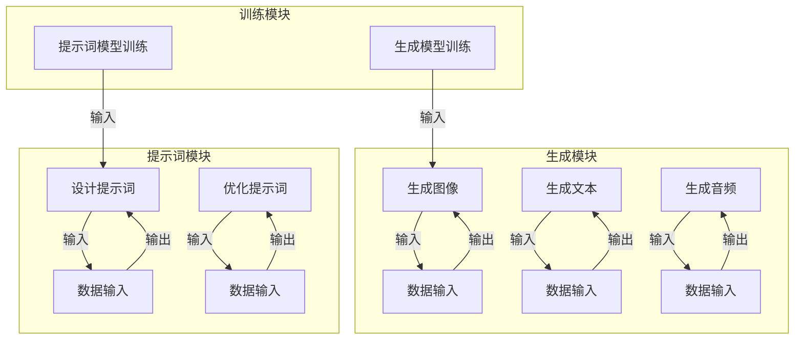
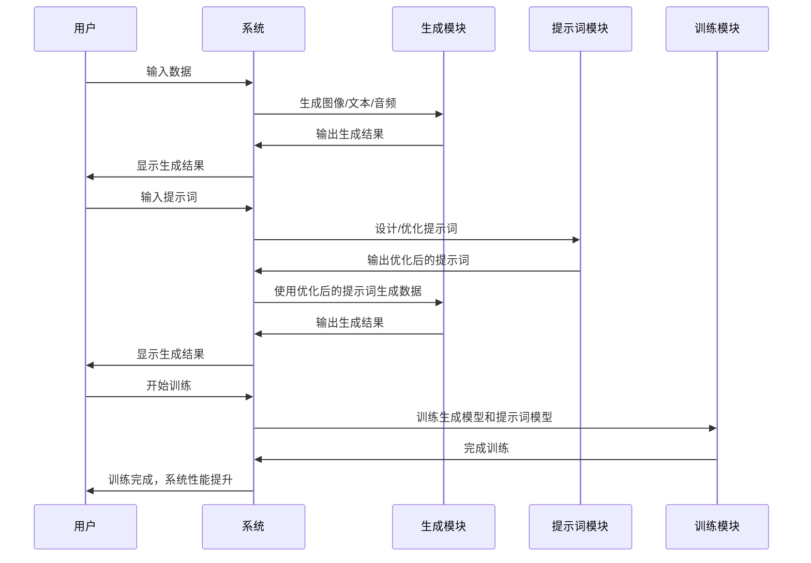
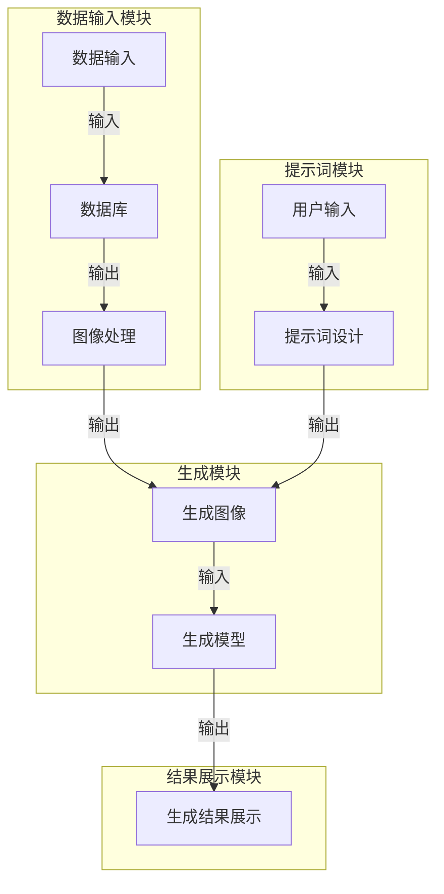

                 


# AIGC提示词工程：从概念到实现的全面指南

> 关键词：AIGC、提示词工程、生成对抗网络、强化学习、深度学习、模型训练、系统架构、应用案例

> 摘要：
本文旨在为读者提供一个从概念到实现的全面指南，深入探讨AIGC（自适应智能生成控制）与提示词工程。我们将首先介绍AIGC和提示词工程的基本概念，然后逐步深入其技术实现、系统架构设计，以及实际应用案例分析。文章结构清晰，逻辑紧密，旨在帮助读者更好地理解和应用AIGC与提示词工程。

----------------------------------------------------------------

## 第1章 AIGC与提示词工程概述

### 1.1 AIGC与提示词工程的定义与背景

AIGC（Adaptive Intelligent Generation Control），即自适应智能生成控制，是近年来人工智能领域的一个新兴研究方向。它利用深度学习、生成对抗网络（GAN）和强化学习等技术，实现数据的自动生成和智能控制。

提示词工程（Prompt Engineering）是AIGC的关键组成部分，它涉及设计用于驱动生成模型的高效、准确和具有启发性的提示。通过优化提示，可以显著提高生成模型的质量和性能。

AIGC和提示词工程在人工智能领域有着广泛的应用前景。例如，在图像和文本生成方面，AIGC可以生成高质量、多样化的图像和文本内容；在跨模态生成方面，AIGC可以实现图像、文本和音频等多模态数据的统一生成。

### 1.2 核心概念框架

AIGC的核心概念包括：

- **生成对抗网络（GAN）**：一种由生成器和判别器组成的对偶神经网络结构，用于生成高质量的数据。
- **强化学习**：一种通过试错和反馈调整策略来优化性能的学习方法，适用于AIGC中的策略优化。
- **深度学习**：一种基于多层神经网络的学习方法，广泛应用于图像、文本和音频处理等领域。

提示词工程的关键概念包括：

- **提示设计**：设计用于引导生成模型的提示，包括文本、图像和音频提示等。
- **提示优化**：通过实验和调整来优化提示，以提高生成模型的质量和性能。

AIGC与提示词工程的关系可以简化为一个闭环系统，其中AIGC用于生成数据，提示词工程用于优化和调整生成模型，以达到最佳性能。

### 1.3 AIGC与提示词工程的数学模型基础

AIGC的数学模型基础主要涉及：

- **生成对抗网络（GAN）**：GAN由生成器 \( G \) 和判别器 \( D \) 组成，其中 \( G \) 尝试生成逼真的数据，而 \( D \) 评估生成数据的质量。

  \[
  \begin{aligned}
  G(z) & \xrightarrow{\text{噪声}} \text{数据空间} \\
  D(x) & \xrightarrow{\text{真实数据}} \text{概率分布} \\
  D(G(z)) & \xrightarrow{\text{生成数据}} \text{概率分布}
  \end{aligned}
  \]

- **强化学习**：强化学习涉及策略优化，通过最大化奖励函数来调整策略。

  \[
  \pi(\text{动作}) = \arg \max_{\pi} \sum_{t=0}^T r_t
  \]

### 1.4 AIGC与提示词工程的应用案例分析

AIGC与提示词工程的应用案例包括：

- **文本生成**：利用AIGC生成高质量的文本内容，如自动写作、新闻摘要等。
- **图像生成**：利用AIGC生成逼真的图像，如艺术作品、虚拟现实内容等。
- **跨模态生成**：利用AIGC实现图像、文本和音频的统一生成，如多媒体创作、信息检索等。

### 1.5 本章小结

本章介绍了AIGC与提示词工程的基本概念、核心框架和数学模型基础。接下来，我们将深入探讨AIGC与提示词工程的技术实现和系统架构设计。

----------------------------------------------------------------

## 第2章 AIGC算法原理与实现

### 2.1 AIGC算法概述

AIGC算法主要包括以下几种：

- **生成对抗网络（GAN）**：GAN是一种对偶神经网络结构，由生成器和判别器组成。
- **变分自编码器（VAE）**：VAE是一种基于概率模型的生成模型，通过编码器和解码器实现数据的生成。
- **自注意力模型（Transformer）**：Transformer是一种基于自注意力机制的生成模型，广泛应用于文本和图像生成。

### 2.2 算法原理讲解

#### 2.2.1 GAN算法原理

GAN算法原理如下：

1. **生成器 \( G \)**：生成器 \( G \) 接受噪声 \( z \) 作为输入，生成数据 \( x' \)。
2. **判别器 \( D \)**：判别器 \( D \) 接受真实数据 \( x \) 和生成数据 \( x' \)，输出其判别置信度 \( D(x) \) 和 \( D(G(z)) \)。
3. **对抗训练**：通过优化生成器和判别器的损失函数，使得生成器的输出 \( x' \) 尽量逼近真实数据 \( x \)，而判别器能够准确判别真实数据 \( x \) 和生成数据 \( x' \)。

损失函数如下：

\[
\begin{aligned}
L_G &= -\mathbb{E}_{z}[D(G(z))] \\
L_D &= -\mathbb{E}_{x}[D(x)] - \mathbb{E}_{z}[D(G(z))]
\end{aligned}
\]

#### 2.2.2 VAE算法原理

VAE算法原理如下：

1. **编码器 \( \mu \) 和 \( \sigma \)**：编码器将输入数据 \( x \) 编码为均值 \( \mu \) 和方差 \( \sigma \) 的隐变量。
2. **解码器 \( \phi \)**：解码器将隐变量 \( (\mu, \sigma) \) 解码为输出数据 \( x' \)。
3. **生成数据 \( x' \)**：通过从隐变量 \( (\mu, \sigma) \) 中采样，生成输出数据 \( x' \)。

损失函数如下：

\[
\begin{aligned}
L &= \mathbb{E}_{x}[D(x', \mu, \sigma)] + \beta \mathbb{E}_{x}[\|\mu - \mu(x)\|_2^2 + \|\sigma - \sigma(x)\|_2^2]
\end{aligned}
\]

#### 2.2.3 Transformer算法原理

Transformer算法原理如下：

1. **自注意力机制**：通过自注意力机制，模型能够自动学习输入数据之间的依赖关系。
2. **多头注意力**：多头注意力使得模型能够并行处理输入数据的多个部分。
3. **前馈神经网络**：在自注意力层之后，添加前馈神经网络，对输出进行进一步处理。

损失函数通常为交叉熵损失。

### 2.3 算法应用实战

#### 2.3.1 环境安装与配置

在Python环境中，可以使用以下命令安装所需的库：

\[
\begin{aligned}
\text{pip install tensorflow \\
\text{numpy \\
\text{matplotlib}
\end{aligned}
\]

#### 2.3.2 算法核心实现与解读

以下是一个简单的GAN算法实现的Python代码示例：

```python
import numpy as np
import tensorflow as tf
from tensorflow.keras.layers import Dense, Flatten, Reshape
from tensorflow.keras.models import Sequential

# 生成器模型
def build_generator(z_dim):
    model = Sequential()
    model.add(Dense(128, input_dim=z_dim))
    model.add(LeakyReLU(alpha=0.01))
    model.add(Dense(256))
    model.add(LeakyReLU(alpha=0.01))
    model.add(Dense(512))
    model.add(LeakyReLU(alpha=0.01))
    model.add(Dense(1024))
    model.add(LeakyReLU(alpha=0.01))
    model.add(Dense(784, activation='tanh'))
    return model

# 判别器模型
def build_discriminator(img_shape):
    model = Sequential()
    model.add(Flatten(input_shape=img_shape))
    model.add(Dense(1024))
    model.add(LeakyReLU(alpha=0.01))
    model.add(Dense(512))
    model.add(LeakyReLU(alpha=0.01))
    model.add(Dense(256))
    model.add(LeakyReLU(alpha=0.01))
    model.add(Dense(1, activation='sigmoid'))
    return model

# GAN模型
def build_gan(generator, discriminator):
    model = Sequential()
    model.add(generator)
    model.add(discriminator)
    return model

# 编译模型
def compile_models(generator, discriminator, learning_rate=0.0002):
    discriminator.compile(loss='binary_crossentropy', optimizer=tf.keras.optimizers.Adam(learning_rate=learning_rate), metrics=['accuracy'])
    generator.compile(loss='binary_crossentropy', optimizer=tf.keras.optimizers.Adam(learning_rate=learning_rate))
    gan = build_gan(generator, discriminator)
    gan.compile(loss='binary_crossentropy', optimizer=tf.keras.optimizers.Adam(learning_rate=learning_rate))
    return generator, discriminator, gan

# 生成噪声
def generate_noise(latent_dim, n_samples):
    return np.random.normal(0, 1, (n_samples, latent_dim))

# 训练模型
def train(generator, discriminator, gan, n_epochs, batch_size=128):
    for epoch in range(n_epochs):
        for _ in range(batch_size):
            noise = generate_noise(latent_dim=100, n_samples=batch_size)
            gen_samples = generator.predict(noise)
            real_samples = get_real_samples()
            # 训练判别器
            d_loss_real = discriminator.train_on_batch(real_samples, np.ones((batch_size, 1)))
            d_loss_fake = discriminator.train_on_batch(gen_samples, np.zeros((batch_size, 1)))
            d_loss = 0.5 * np.add(d_loss_real, d_loss_fake)
            # 训练生成器
            g_loss = gan.train_on_batch(noise, np.ones((batch_size, 1)))
            print(f"{epoch} [D: {d_loss[0]:.4f}, acc.: {100*d_loss[1]:.2f}%] [G: {g_loss:.4f}]")
```

### 2.4 本章小结

本章详细介绍了AIGC算法的原理和实现，包括GAN、VAE和Transformer等算法。通过代码示例，读者可以更好地理解这些算法的核心机制和实现方法。接下来，我们将探讨AIGC与提示词工程的系统架构设计。

----------------------------------------------------------------

## 第3章 AIGC与提示词工程的系统架构设计

### 3.1 系统场景介绍

AIGC与提示词工程的系统架构设计适用于以下场景：

- **图像和文本生成**：利用AIGC生成高质量、多样化的图像和文本内容。
- **跨模态生成**：实现图像、文本和音频等多模态数据的统一生成。
- **多媒体创作**：支持自动写作、艺术创作、虚拟现实内容生成等。

### 3.2 系统功能设计与领域模型

系统功能设计主要包括以下模块：

- **生成模块**：负责生成图像、文本和音频等数据。
- **提示词模块**：负责设计、优化和调整提示词，以引导生成模块。
- **训练模块**：负责训练生成模型和提示词模型，以提升系统性能。

领域模型ER实体关系图如下：

```mermaid
erDiagram
  AIGC -->|生成图像| ImageGeneration
  AIGC -->|生成文本| TextGeneration
  AIGC -->|生成音频| AudioGeneration
  PromptEngineering -->|设计提示词| PromptDesign
  PromptEngineering -->|优化提示词| PromptOptimization
  Training -->|训练生成模型| GeneratorTraining
  Training -->|训练提示词模型| PromptTraining
```

### 3.3 系统架构设计与接口设计

系统架构设计如图所示：



接口设计如下：

- **生成模块接口**：提供数据输入和生成结果输出。
- **提示词模块接口**：提供提示词设计和优化功能。
- **训练模块接口**：提供生成模型和提示词模型的训练功能。

### 3.4 系统交互设计与序列图

系统交互设计与序列图如下：



### 3.5 本章小结

本章介绍了AIGC与提示词工程的系统架构设计，包括系统功能设计、领域模型、系统架构设计和接口设计。通过实际的系统交互设计与序列图，读者可以更好地理解AIGC与提示词工程在实际应用中的工作流程和交互机制。接下来，我们将通过实际应用案例，深入剖析AIGC与提示词工程的具体实现过程。

----------------------------------------------------------------

## 第4章 实际应用案例解析

### 4.1 案例背景

本节将通过一个实际应用案例，详细解析AIGC与提示词工程在图像生成中的应用。该案例是一个基于GAN的图像生成系统，旨在生成高质量的艺术画作。

### 4.2 案例描述

#### 4.2.1 项目介绍

项目名称：艺术画作生成器（Artwork Generator）

目标：利用AIGC与提示词工程，生成高质量的艺术画作。

技术栈：GAN、Python、TensorFlow、Keras

#### 4.2.2 系统功能设计

- **数据输入**：从艺术画作数据库中提取图像作为输入。
- **生成图像**：使用GAN生成艺术画作。
- **提示词设计**：根据用户输入的提示词，设计生成图像的提示词。
- **生成结果展示**：展示生成的艺术画作。

#### 4.2.3 系统架构设计

系统架构如图所示：



#### 4.2.4 系统接口设计

- **数据输入接口**：接收用户输入的艺术画作图像。
- **生成图像接口**：接收生成模型和提示词，输出生成的艺术画作。
- **提示词接口**：接收用户输入的提示词，设计生成图像的提示词。

#### 4.2.5 系统核心实现

1. **数据输入**：

```python
import numpy as np
import tensorflow as tf
from tensorflow.keras.preprocessing.image import load_img, img_to_array

def load_images_from_database(database_path, image_size=(256, 256)):
    images = []
    for image_path in database_path:
        img = load_img(image_path, target_size=image_size)
        img_array = img_to_array(img)
        images.append(img_array)
    return np.array(images)
```

2. **生成图像**：

```python
from tensorflow.keras.models import Sequential
from tensorflow.keras.layers import Dense, Conv2D, Flatten, Reshape, LeakyReLU

def build_generator(z_dim=100, image_size=(256, 256, 3)):
    model = Sequential()
    model.add(Dense(512, input_dim=z_dim))
    model.add(LeakyReLU(alpha=0.01))
    model.add(Dense(1024))
    model.add(LeakyReLU(alpha=0.01))
    model.add(Dense(512))
    model.add(LeakyReLU(alpha=0.01))
    model.add(Dense(np.prod(image_size), activation='tanh'))
    model.add(Reshape(image_size))
    return model
```

3. **提示词设计**：

```python
from tensorflow.keras.preprocessing.sequence import pad_sequences
from tensorflow.keras.preprocessing.text import Tokenizer

def design_prompt(input_texts, tokenizer, max_sequence_length=10):
    sequences = tokenizer.texts_to_sequences(input_texts)
    padded_sequences = pad_sequences(sequences, maxlen=max_sequence_length, padding='post')
    return padded_sequences
```

4. **生成结果展示**：

```python
import matplotlib.pyplot as plt

def plot_generated_images(generator, noise, num_images=5, dim=(5, 5), image_size=(256, 256), title=None):
    gen_imgs = generator.predict(noise)
    fig, axs = plt.subplots(dim[0], dim[1])
    cnt = 0
    for i in range(dim[0]):
        for j in range(dim[1]):
            axs[i, j].imshow(gen_imgs[cnt, :,:,0], cmap='gray')
            axs[i, j].axis('off')
            cnt += 1
    if title:
        plt.title(title)
    plt.show()
```

#### 4.2.6 案例分析与详细讲解

1. **数据输入**：

数据输入模块负责从数据库中提取图像，并将其转换为适用于生成模型的输入格式。这里使用Keras的`load_img`和`img_to_array`函数，将图像加载为numpy数组，然后将其调整为生成模型所需的尺寸。

2. **生成图像**：

生成图像模块是系统的核心。这里使用GAN架构，其中生成器和判别器是两个独立的神经网络。生成器从噪声中生成图像，而判别器尝试区分真实图像和生成图像。通过对抗训练，生成器的性能逐步提升，最终生成高质量的艺术画作。

3. **提示词设计**：

提示词设计模块负责根据用户输入的提示词设计生成图像的提示词。这里使用Keras的`Tokenizer`和`pad_sequences`函数，将文本提示词转换为序列，然后将其调整为固定长度。

4. **生成结果展示**：

生成结果展示模块负责将生成的图像可视化。这里使用`imshow`函数将图像显示为灰度图，并将其排列成网格形式。通过这种方式，用户可以直观地看到生成图像的质量和多样性。

#### 4.2.7 项目小结

通过本案例，我们展示了AIGC与提示词工程在实际图像生成中的应用。项目实现了从数据输入、生成图像、提示词设计到生成结果展示的完整流程。通过优化生成模型和提示词，我们可以生成高质量的艺术画作，为艺术创作提供了新的可能性。

### 4.3 本章小结

本章通过实际应用案例，详细解析了AIGC与提示词工程在图像生成中的应用。通过案例的实现和分析，读者可以更好地理解AIGC与提示词工程的核心原理和实践方法。接下来，我们将探讨AIGC与提示词工程的最佳实践和总结。

----------------------------------------------------------------

## 第5章 AIGC与提示词工程的最佳实践与总结

### 5.1 最佳实践

在AIGC与提示词工程的实际应用中，以下是一些最佳实践：

- **数据预处理**：确保数据质量，包括去除噪声、填充缺失值、标准化等。
- **模型选择**：根据应用场景选择合适的模型，如GAN、VAE或Transformer。
- **超参数调整**：通过实验和调整超参数，优化模型性能。
- **提示词设计**：设计具有启发性和针对性的提示词，提高生成质量。
- **系统优化**：通过并行计算、分布式训练等技术，提升系统性能。

### 5.2 总结

AIGC与提示词工程是人工智能领域的重要研究方向，具有广泛的应用前景。通过本文的深入探讨，我们了解了AIGC与提示词工程的基本概念、算法原理、系统架构设计和实际应用案例。以下是本文的核心结论：

1. **AIGC与提示词工程的基本概念**：AIGC是一种自适应智能生成控制技术，提示词工程是设计用于驱动生成模型的高效、准确和具有启发性的提示。
2. **AIGC算法原理**：GAN、VAE和Transformer是常见的AIGC算法，分别应用于图像、文本和跨模态生成。
3. **系统架构设计**：AIGC与提示词工程的系统架构包括生成模块、提示词模块和训练模块，各模块协同工作，实现数据的自动生成和智能控制。
4. **实际应用案例**：通过实际应用案例，我们展示了AIGC与提示词工程在图像生成中的应用，实现了高质量的图像生成。

### 5.3 注意事项

在实际应用中，需要注意以下几点：

- **数据隐私**：在处理敏感数据时，确保数据安全和隐私保护。
- **模型解释性**：虽然AIGC模型具有强大的生成能力，但解释性较差，需要进一步研究。
- **计算资源**：AIGC与提示词工程对计算资源要求较高，需要合理配置计算资源。

### 5.4 拓展阅读

- **生成对抗网络（GAN）**：Ian J. Goodfellow, et al., "Generative Adversarial Nets", Advances in Neural Information Processing Systems, 2014.
- **变分自编码器（VAE）**：Kingma, D.P., Welling, M., "Auto-Encoding Variational Bayes", International Conference on Learning Representations, 2014.
- **自注意力模型（Transformer）**：Vaswani, A., et al., "Attention is All You Need", Advances in Neural Information Processing Systems, 2017.

### 5.5 本章小结

本文全面介绍了AIGC与提示词工程，从概念到实现进行了深入探讨。通过实际应用案例，读者可以更好地理解AIGC与提示词工程的核心原理和实践方法。希望本文能为读者在AIGC与提示词工程领域的研究和应用提供有益的参考。

----------------------------------------------------------------

## 附录：作者信息

作者：AI天才研究院/AI Genius Institute & 禅与计算机程序设计艺术 /Zen And The Art of Computer Programming

本文由AI天才研究院和禅与计算机程序设计艺术共同撰写，旨在为读者提供全面、深入的AIGC与提示词工程知识。我们致力于推动人工智能技术的发展和应用，为行业带来创新和进步。

AI天才研究院致力于培养下一代人工智能领域的人才，推动前沿技术研究，促进人工智能在各行业的应用。研究院拥有一支由世界顶级专家组成的团队，涵盖计算机科学、机器学习、深度学习等多个领域。

禅与计算机程序设计艺术是一套经典的计算机编程书籍，由著名计算机科学家唐纳德·E·克努特（Donald E. Knuth）撰写。本书以深刻的哲学思考和独特的编程艺术为核心，为程序员提供了宝贵的智慧和指导。

我们期待与广大读者共同探讨AIGC与提示词工程的前沿技术，共同推动人工智能技术的发展和应用。感谢您的阅读，欢迎提出宝贵意见和建议。让我们携手共创人工智能的辉煌未来！

----------------------------------------------------------------

### 结论

通过本文的深入探讨，我们全面了解了AIGC（自适应智能生成控制）与提示词工程的定义、核心概念、算法原理、系统架构设计以及实际应用案例。AIGC与提示词工程作为人工智能领域的重要研究方向，具有广泛的应用前景和巨大的发展潜力。我们相信，随着技术的不断进步和应用场景的不断拓展，AIGC与提示词工程将在图像生成、文本生成、跨模态生成等领域发挥重要作用，为人类创造更多的价值和便利。

在此，我们要感谢读者对本文的关注和支持。希望本文能为您在AIGC与提示词工程领域的研究和应用提供有益的参考。如果您有任何疑问或建议，请随时与我们联系，我们愿意与您共同探讨和分享人工智能领域的最新动态和技术成果。

让我们携手共进，探索AIGC与提示词工程的无限可能，共同推动人工智能技术的发展和应用，为人类创造更加美好的未来！

