                 

## AIGC提示词工程：效率与创意的完美融合

### 关键词：AIGC、提示词工程、效率、创意、融合

### 摘要：
本文深入探讨了AIGC（自适应智能生成控制）提示词工程的核心概念、原理及其在效率与创意提升中的关键作用。我们将从AIGC的基本概念、核心算法、应用案例、提示词工程、效率优化、创意激发等多个角度进行分析，旨在展示AIGC提示词工程如何实现技术与创意的深度融合，从而推动未来技术的发展。

### 目录

1. **第一部分：AIGC概述与背景**
   1.1 AIGC的基本概念与原理
   1.2 AIGC的关键技术与应用场景
   1.3 AIGC的发展历程与趋势
   1.4 AIGC的优势与挑战

2. **第二部分：AIGC的核心算法与架构**
   2.1 自然语言处理与生成
   2.2 图像处理与生成
   2.3 AIGC的集成框架
   2.4 AIGC的优化策略

3. **第三部分：AIGC应用案例分析**
   3.1 文本生成应用
   3.2 图像生成应用
   3.3 多模态融合应用
   3.4 AIGC在商业领域的应用

4. **第四部分：提示词工程的重要性与实践**
   4.1 提示词工程的基本概念
   4.2 提示词的设计原则与方法
   4.3 提示词的优化与评估
   4.4 提示词工程案例解析

5. **第五部分：提升AIGC效率的策略**
   5.1 数据预处理与缓存优化
   5.2 并行计算与分布式架构
   5.3 模型压缩与量化
   5.4 实时优化与反馈机制

6. **第六部分：创意激发与AIGC融合**
   6.1 创意思维理论与AIGC结合
   6.2 创意生成与优化
   6.3 创意应用案例分析
   6.4 创意评估与反馈

7. **第七部分：AIGC的未来发展与展望**
   7.1 AIGC技术发展趋势
   7.2 创新应用领域展望
   7.3 安全、伦理与可持续发展
   7.4 AIGC产业生态构建

### 引入

在数字化时代，人工智能（AI）已经成为推动技术进步和产业变革的核心力量。随着生成控制技术的不断成熟，自适应智能生成控制（Adaptive Intelligent Generation Control，AIGC）逐渐成为AI领域的研究热点。AIGC不仅能够实现自动化内容生成，还具备极高的灵活性和创造力，使得“内容创造”这一过程从传统的劳动密集型工作转变为高度智能化的任务。然而，如何最大化AIGC的效率与创意，成为当前研究者和开发者面临的重要挑战。

本文将围绕AIGC提示词工程这一主题，从多个角度探讨如何通过高效、精准的提示词设计，实现效率与创意的完美融合。通过深入分析AIGC的基本概念、核心算法、应用案例，以及提示词工程的设计原则与实践，我们将展示AIGC在提高生产效率、激发创意思维方面的巨大潜力。

### 第一部分：AIGC概述与背景

#### 1.1 AIGC的基本概念与原理

AIGC，即自适应智能生成控制，是一种利用机器学习和深度学习技术实现自动化内容生成的方法。其核心思想是通过学习大量的数据，构建出一个能够自主生成文本、图像、音频等多样化内容的模型。AIGC不仅能够模仿人类的创作过程，还能在给定的提示词或条件下，生成全新的、具有创意的内容。

AIGC的工作原理主要包括以下几个步骤：

1. **数据采集与预处理**：首先，从互联网、数据库或其他数据源中收集大量的文本、图像、音频等数据。然后，对数据进行清洗、去重、分类等预处理操作，以便后续的模型训练。

2. **模型训练**：利用收集到的数据，通过机器学习和深度学习算法训练生成模型。常见的模型包括生成对抗网络（GAN）、变分自编码器（VAE）、自动编码器（AE）等。这些模型能够学习数据的分布和特征，从而生成新的内容。

3. **生成与优化**：在训练完成后，通过给定的提示词或条件，模型将生成相应的内容。生成的内容通常需要经过一系列优化过程，如文本润色、图像风格迁移等，以提高其质量和可用性。

#### 1.2 AIGC的关键技术与应用场景

AIGC的关键技术主要包括自然语言处理（NLP）、图像处理、多模态融合等。以下是一些典型的应用场景：

1. **文本生成**：AIGC可以生成文章、新闻报道、诗歌等文本内容。例如，通过输入关键词或主题，AIGC可以自动生成相关文章，提高内容生产效率。

2. **图像生成**：AIGC可以生成艺术作品、设计图纸、动漫人物等图像内容。例如，通过输入简单的描述或风格标签，AIGC可以生成符合要求的图像。

3. **多模态融合**：AIGC可以将文本、图像、音频等多种模态的信息融合在一起，生成更加丰富、生动的内容。例如，通过结合文字描述和图像，AIGC可以生成带有音效的视频内容。

#### 1.3 AIGC的发展历程与趋势

AIGC的发展历程可以追溯到20世纪90年代，随着机器学习和深度学习技术的不断进步，AIGC逐渐成为AI领域的研究热点。近年来，随着计算能力的提升和海量数据的积累，AIGC的应用范围越来越广泛，从内容生成、数据增强到辅助设计、智能客服等。

未来，AIGC的发展趋势主要包括以下几个方面：

1. **模型性能提升**：随着计算能力和算法的进步，AIGC模型的生成质量和速度将进一步提升。

2. **跨模态生成**：AIGC将不仅限于单一模态的生成，而是实现文本、图像、音频等多模态的融合生成。

3. **个性化定制**：AIGC将能够根据用户需求和个人偏好，生成更加个性化、定制化的内容。

4. **泛在应用**：AIGC将渗透到更多行业和领域，从娱乐、教育、医疗到金融、制造等，实现广泛的应用。

#### 1.4 AIGC的优势与挑战

AIGC的优势主要体现在以下几个方面：

1. **高效性**：AIGC可以自动生成大量内容，大大提高了生产效率。

2. **灵活性**：AIGC可以根据不同的提示词或条件，生成多样化、个性化的内容。

3. **创新性**：AIGC能够生成新颖、创意的内容，激发人类的想象力和创造力。

然而，AIGC也面临一些挑战：

1. **数据质量**：生成模型的效果很大程度上依赖于数据的质量和多样性。

2. **计算资源**：训练和生成高质量内容需要大量的计算资源和时间。

3. **安全与伦理**：如何确保AIGC生成的内容的真实性和合法性，避免滥用和误导，是一个重要的伦理和合规问题。

### 第二部分：AIGC的核心算法与架构

#### 2.1 自然语言处理与生成

自然语言处理（NLP）是AIGC的重要组成部分。NLP的核心任务是使计算机能够理解、处理和生成自然语言。在AIGC中，NLP主要用于文本生成、情感分析、命名实体识别等任务。

NLP的关键算法包括：

1. **循环神经网络（RNN）**：RNN能够处理序列数据，如文本。通过学习输入序列的概率分布，RNN可以生成新的文本序列。

2. **长短期记忆网络（LSTM）**：LSTM是RNN的一种变体，能够更好地处理长序列数据，避免了梯度消失问题。

3. **变换器（Transformer）**：Transformer是NLP领域的一项重大突破，其通过自注意力机制，实现了对序列数据的全局关注。Transformer的应用使得NLP模型的生成效果和速度都有了显著提升。

以下是一个简单的NLP文本生成算法的Python代码示例：

```python
import tensorflow as tf
from tensorflow.keras.models import Sequential
from tensorflow.keras.layers import LSTM, Dense, Embedding

# 假设已经准备好文本数据并进行了预处理
sequences = ...

# 构建模型
model = Sequential()
model.add(Embedding(input_dim=vocab_size, output_dim=embedding_dim))
model.add(LSTM(units=128, return_sequences=True))
model.add(Dense(units=vocab_size, activation='softmax'))

# 编译模型
model.compile(optimizer='adam', loss='categorical_crossentropy', metrics=['accuracy'])

# 训练模型
model.fit(sequences, epochs=10)

# 生成文本
generated_text = model.predict(sequences)
```

#### 2.2 图像处理与生成

图像处理是AIGC的另一个关键领域。在图像生成中，常见的算法包括生成对抗网络（GAN）、变分自编码器（VAE）等。

1. **生成对抗网络（GAN）**：GAN由生成器和判别器两个神经网络组成。生成器试图生成逼真的图像，而判别器则试图区分真实图像和生成图像。通过不断训练，生成器的生成质量逐渐提升。

2. **变分自编码器（VAE）**：VAE是一种基于概率生成模型的图像生成方法。它通过编码器和解码器两个网络，将输入图像编码为潜在空间中的向量，然后在潜在空间中采样，由解码器生成新的图像。

以下是一个简单的GAN图像生成算法的Python代码示例：

```python
import tensorflow as tf
from tensorflow.keras.models import Sequential
from tensorflow.keras.layers import Dense, Flatten

# 假设已经准备好图像数据并进行了预处理
images = ...

# 构建生成器和判别器模型
generator = Sequential()
generator.add(Dense(units=256, activation='relu', input_shape=(latent_dim,)))
generator.add(Dense(units=512, activation='relu'))
generator.add(Dense(units=1024, activation='relu'))
generator.add(Dense(units=28 * 28, activation='sigmoid'))

discriminator = Sequential()
discriminator.add(Flatten(input_shape=(28, 28)))
discriminator.add(Dense(units=1024, activation='relu'))
discriminator.add(Dense(units=512, activation='relu'))
discriminator.add(Dense(units=256, activation='relu'))
discriminator.add(Dense(units=1, activation='sigmoid'))

# 编译模型
discriminator.compile(optimizer='adam', loss='binary_crossentropy')
generator.compile(optimizer='adam', loss='binary_crossentropy')

# 训练模型
discriminator.fit(images, labels, epochs=10)
generator.fit(images, labels, epochs=10)

# 生成图像
generated_images = generator.predict(latent_space_samples)
```

#### 2.3 AIGC的集成框架

AIGC的集成框架通常包括数据采集与预处理、模型训练、生成与优化等模块。以下是一个简单的AIGC集成框架的Mermaid流程图：

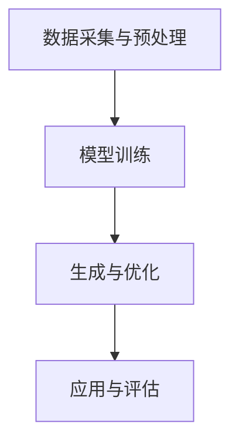

#### 2.4 AIGC的优化策略

为了提高AIGC的效率和生成质量，可以采取以下优化策略：

1. **模型压缩与量化**：通过模型压缩和量化技术，可以减少模型的参数量和计算量，提高生成速度。

2. **并行计算与分布式架构**：利用并行计算和分布式架构，可以加速模型的训练和生成过程。

3. **数据增强与多样化**：通过数据增强和多样化技术，可以提高模型的泛化能力，生成更加丰富多样的内容。

4. **实时优化与反馈机制**：通过实时优化和反馈机制，可以不断调整模型参数，提高生成质量和用户满意度。

### 第三部分：AIGC应用案例分析

#### 3.1 文本生成应用

文本生成是AIGC的一个重要应用领域。以下是一个文本生成应用的案例：

**项目名称**：智能写作助手

**项目介绍**：智能写作助手是一款基于AIGC的文本生成工具，可以帮助用户快速生成文章、报告、邮件等文本内容。

**系统功能设计**：智能写作助手包括以下几个主要功能：

1. **关键词输入**：用户可以输入关键词或主题，系统将根据关键词生成相关文本。

2. **文本生成**：系统利用AIGC模型生成符合要求的文本内容。

3. **文本润色**：系统可以对生成的文本进行润色和优化，提高文本质量。

4. **多模态生成**：系统可以结合图像、音频等多模态信息，生成更加丰富的内容。

**系统架构设计**：智能写作助手的系统架构包括以下几个主要模块：

1. **数据采集与预处理模块**：负责收集和预处理文本数据。

2. **模型训练模块**：负责训练AIGC模型。

3. **生成与优化模块**：负责生成和优化文本内容。

4. **应用与评估模块**：负责将生成的文本应用到实际场景，并进行评估和反馈。

**系统接口设计和系统交互**：智能写作助手的接口设计和系统交互包括以下几个主要部分：

1. **用户界面**：用户可以通过图形界面输入关键词和主题，查看生成的文本内容。

2. **API接口**：系统提供API接口，方便其他应用程序调用智能写作助手的功能。

3. **实时优化与反馈机制**：系统根据用户的反馈，实时调整模型参数，提高生成质量。

以下是一个简单的AIGC文本生成应用的Mermaid序列图：

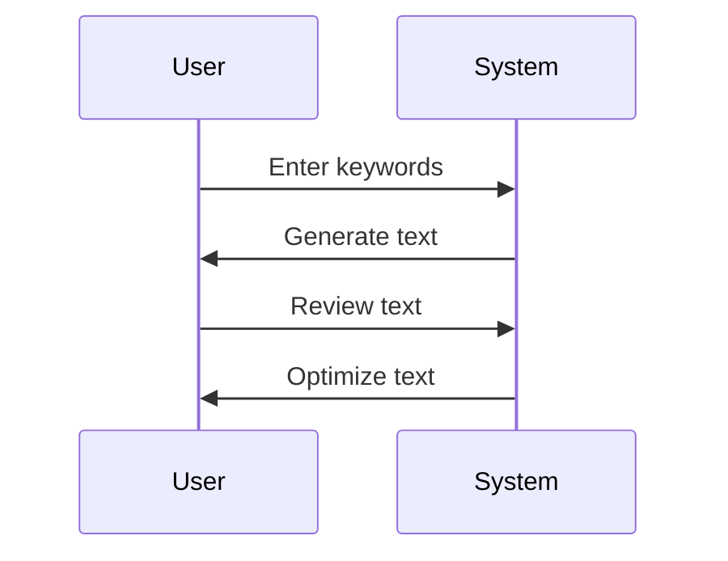

#### 3.2 图像生成应用

图像生成是AIGC的另一个重要应用领域。以下是一个图像生成应用的案例：

**项目名称**：艺术生成平台

**项目介绍**：艺术生成平台是一款基于AIGC的艺术作品生成工具，可以帮助用户快速生成各种风格的图像。

**系统功能设计**：艺术生成平台包括以下几个主要功能：

1. **风格选择**：用户可以选择不同的艺术风格，如油画、水彩、素描等。

2. **图像生成**：系统根据用户选择的艺术风格，利用AIGC模型生成相应的图像。

3. **图像编辑**：系统提供图像编辑功能，用户可以对生成的图像进行修改和优化。

4. **多模态生成**：系统可以结合文字描述，生成更加丰富多样的图像内容。

**系统架构设计**：艺术生成平台的系统架构包括以下几个主要模块：

1. **数据采集与预处理模块**：负责收集和预处理图像数据。

2. **模型训练模块**：负责训练AIGC模型。

3. **生成与优化模块**：负责生成和优化图像内容。

4. **应用与评估模块**：负责将生成的图像应用到实际场景，并进行评估和反馈。

**系统接口设计和系统交互**：艺术生成平台的接口设计和系统交互包括以下几个主要部分：

1. **用户界面**：用户可以通过图形界面选择艺术风格和输入文字描述，查看生成的图像内容。

2. **API接口**：系统提供API接口，方便其他应用程序调用艺术生成平台的功能。

3. **实时优化与反馈机制**：系统根据用户的反馈，实时调整模型参数，提高生成质量。

以下是一个简单的AIGC图像生成应用的Mermaid序列图：

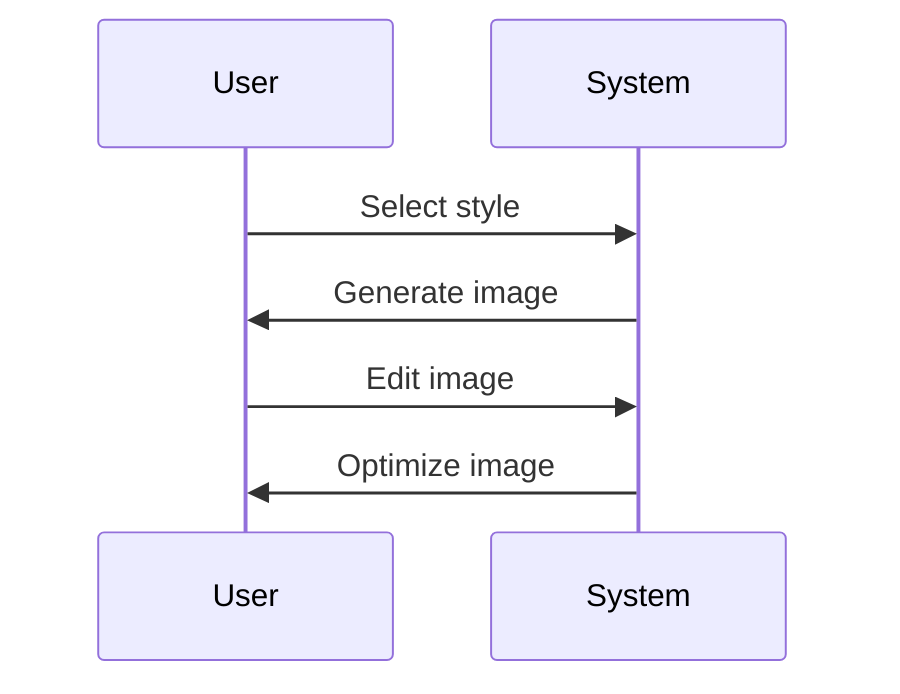

#### 3.3 多模态融合应用

多模态融合是AIGC的一个前沿研究领域。以下是一个多模态融合应用的案例：

**项目名称**：智能视频生成平台

**项目介绍**：智能视频生成平台是一款基于AIGC的视频生成工具，可以将文本、图像、音频等多种模态的信息融合在一起，生成全新的视频内容。

**系统功能设计**：智能视频生成平台包括以下几个主要功能：

1. **文本输入**：用户可以输入文本描述，系统将根据文本描述生成视频内容。

2. **图像生成**：系统根据文本描述生成相应的图像内容。

3. **音频生成**：系统根据文本描述生成相应的音频内容。

4. **视频生成**：系统将文本、图像、音频等多种模态的信息融合在一起，生成完整的视频内容。

5. **视频编辑**：系统提供视频编辑功能，用户可以对生成的视频内容进行修改和优化。

**系统架构设计**：智能视频生成平台的系统架构包括以下几个主要模块：

1. **数据采集与预处理模块**：负责收集和预处理文本、图像、音频等多种模态的数据。

2. **模型训练模块**：负责训练AIGC模型。

3. **生成与优化模块**：负责生成和优化文本、图像、音频等多种模态的信息。

4. **视频生成模块**：负责将文本、图像、音频等多种模态的信息融合在一起，生成视频内容。

5. **应用与评估模块**：负责将生成的视频应用到实际场景，并进行评估和反馈。

**系统接口设计和系统交互**：智能视频生成平台的接口设计和系统交互包括以下几个主要部分：

1. **用户界面**：用户可以通过图形界面输入文本描述，查看生成的视频内容。

2. **API接口**：系统提供API接口，方便其他应用程序调用智能视频生成平台的功能。

3. **实时优化与反馈机制**：系统根据用户的反馈，实时调整模型参数，提高生成质量。

以下是一个简单的AIGC多模态融合应用的Mermaid序列图：

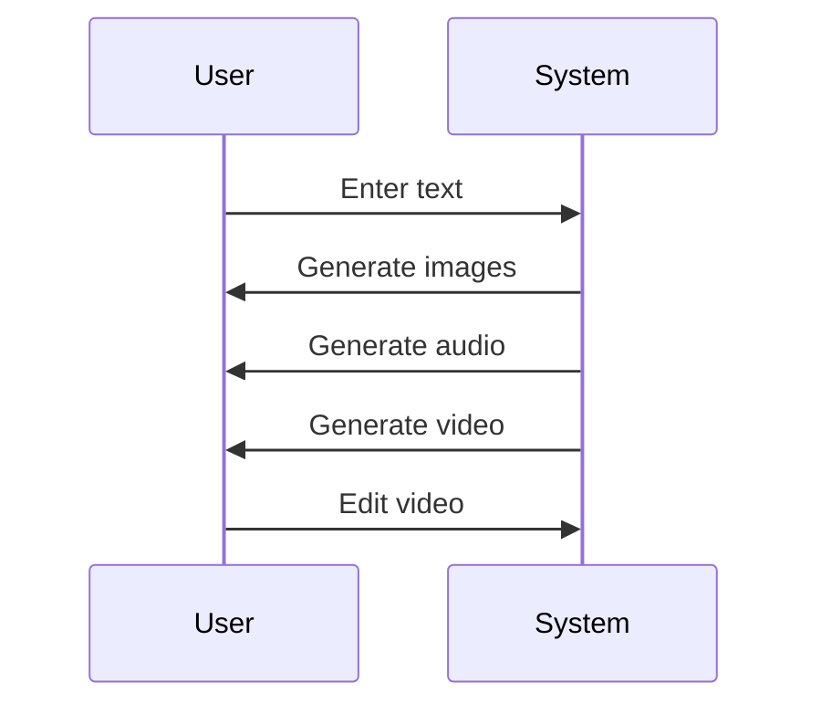

#### 3.4 AIGC在商业领域的应用

AIGC在商业领域具有广泛的应用前景。以下是一些典型的商业应用案例：

1. **营销与广告**：AIGC可以自动生成个性化广告文案、图片和视频，提高营销效果。

2. **客户服务**：AIGC可以生成智能客服机器人，实现24小时在线服务，提高客户满意度。

3. **产品设计**：AIGC可以生成创意设计方案，帮助设计师快速生成和优化产品原型。

4. **内容创作**：AIGC可以自动生成文章、报告、演讲稿等，提高内容创作效率。

5. **供应链管理**：AIGC可以生成供应链预测报告、库存分析报告等，优化供应链管理。

### 第四部分：提示词工程的重要性与实践

#### 4.1 提示词工程的基本概念

提示词工程是AIGC中的一个关键环节，它涉及到如何设计、选择和优化提示词，以实现高效的生成质量和用户体验。提示词（Prompt）是引导AIGC模型生成内容的关键输入，其质量直接影响到生成内容的创意和准确性。

#### 4.2 提示词的设计原则与方法

1. **明确性**：提示词应尽量明确，避免模糊或歧义，确保AIGC模型能够准确理解用户的意图。

2. **多样性**：设计多样化的提示词，以涵盖不同的场景和需求，提高生成内容的丰富性和创意性。

3. **简洁性**：提示词应尽量简洁，避免冗长和复杂，以便模型能够快速理解和生成。

4. **上下文相关性**：提示词应与上下文紧密相关，有助于模型生成与上下文一致的内容。

5. **情感色彩**：根据需求加入适当的情感色彩，以生成具有情感共鸣的内容。

以下是一个简单的提示词设计流程图：

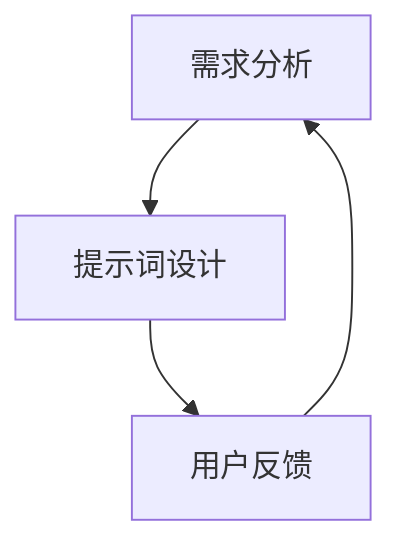

#### 4.3 提示词的优化与评估

1. **优化策略**：通过调整提示词的长度、关键词的选择和排列顺序，优化生成内容的结构和质量。

2. **评估指标**：使用评价指标（如BLEU、ROUGE等）评估生成内容的准确性和流畅性。

3. **用户反馈**：收集用户对生成内容的反馈，不断调整和优化提示词。

以下是一个简单的提示词优化与评估的Mermaid流程图：

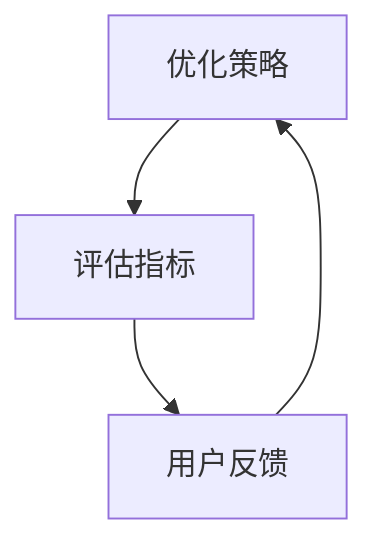

#### 4.4 提示词工程案例解析

以下是一个提示词工程案例解析：

**项目名称**：智能广告文案生成平台

**项目背景**：智能广告文案生成平台是一款基于AIGC的广告文案自动生成工具，旨在提高广告文案的创作效率和质量。

**项目目标**：通过设计高效的提示词，实现广告文案的自动化生成，提高广告投放的效果。

**项目实施**：

1. **需求分析**：分析广告文案的常见类型和需求，确定提示词的设计方向。

2. **提示词设计**：根据广告主题、产品特点、用户画像等，设计明确的、多样化的提示词。

3. **模型训练**：利用设计好的提示词，训练广告文案生成模型。

4. **生成与优化**：利用模型生成广告文案，并根据用户反馈进行优化。

5. **评估与反馈**：使用评估指标评估生成文案的质量，收集用户反馈，不断优化提示词。

**项目成果**：通过高效的提示词工程，智能广告文案生成平台能够自动生成高质量的广告文案，提高广告投放的效果和用户体验。

### 第五部分：提升AIGC效率的策略

#### 5.1 数据预处理与缓存优化

数据预处理是AIGC效率提升的关键步骤。通过合理的数据预处理，可以提高模型的训练速度和生成质量。

1. **数据清洗**：去除重复、错误和无关的数据，确保数据的质量和一致性。

2. **数据增强**：通过数据增强技术，生成更多样化的数据，提高模型的泛化能力。

3. **缓存优化**：使用缓存技术，存储常用的数据和处理结果，减少重复计算，提高生成速度。

以下是一个简单的数据预处理与缓存优化的Mermaid流程图：

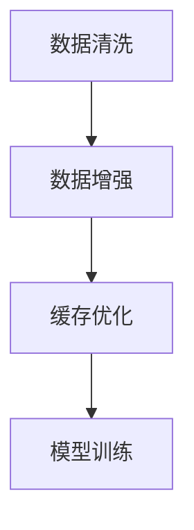

#### 5.2 并行计算与分布式架构

并行计算和分布式架构可以显著提高AIGC的效率。通过将计算任务分配到多个节点，可以加速模型的训练和生成过程。

1. **模型拆分**：将大型模型拆分为多个子模型，分配到不同的计算节点。

2. **数据并行**：将数据分成多个批次，同时训练不同的子模型。

3. **计算资源调度**：根据任务需求和计算能力，动态调整计算资源的分配。

以下是一个简单的并行计算与分布式架构的Mermaid流程图：

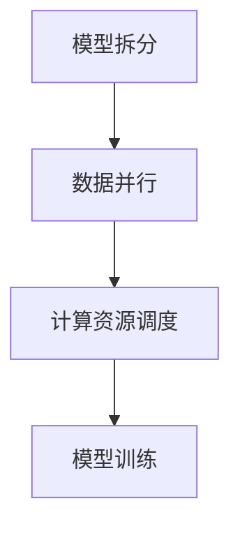

#### 5.3 模型压缩与量化

模型压缩与量化可以减少模型的参数量和计算量，提高生成速度。

1. **模型压缩**：通过剪枝、量化等技术，减少模型的参数数量。

2. **量化**：将模型的权重和激活值从浮点数转换为整数，降低计算复杂度。

3. **模型优化**：通过优化算法，提高模型的压缩效果和生成质量。

以下是一个简单的模型压缩与量化的Mermaid流程图：

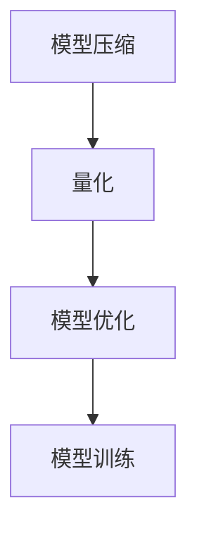

#### 5.4 实时优化与反馈机制

实时优化与反馈机制可以动态调整模型参数，提高生成质量和用户体验。

1. **实时评估**：根据生成内容的实时评估结果，动态调整模型参数。

2. **用户反馈**：收集用户对生成内容的实时反馈，作为优化依据。

3. **自适应调整**：根据评估结果和用户反馈，自动调整模型参数，实现实时优化。

以下是一个简单的实时优化与反馈机制的Mermaid流程图：

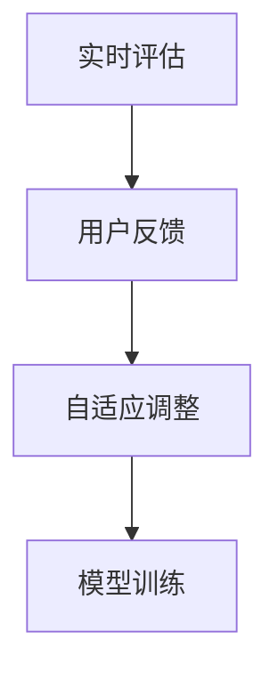

### 第六部分：创意激发与AIGC融合

#### 6.1 创意思维理论与AIGC结合

创意思维理论是指一系列能够激发创意和创新的思维方法和策略。将创意思维理论与AIGC结合，可以实现以下几个目标：

1. **灵感激发**：通过AIGC生成大量的创意内容，激发用户的灵感。

2. **思维拓展**：利用AIGC生成的内容，拓宽用户的思维边界，发现新的创意点。

3. **优化迭代**：通过用户和AIGC的互动，不断优化和迭代创意，提高创意质量。

以下是一个简单的创意思维理论与AIGC结合的Mermaid流程图：

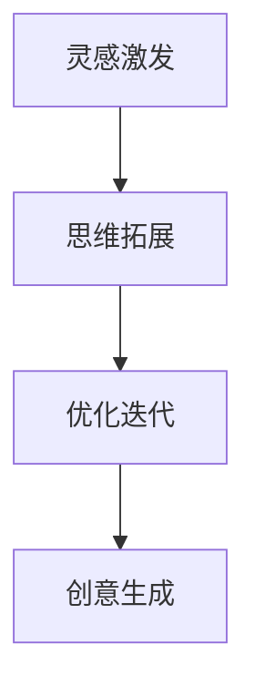

#### 6.2 创意生成与优化

创意生成与优化是AIGC实现高效创意的关键步骤。以下是一个简单的创意生成与优化流程：

1. **创意生成**：通过AIGC生成大量创意内容，包括文本、图像、音频等。

2. **筛选与排序**：根据创意的质量和相关性，筛选和排序创意内容。

3. **优化与调整**：对创意内容进行优化和调整，提高其创意性和实用性。

4. **用户反馈**：收集用户对创意内容的反馈，作为优化依据。

以下是一个简单的创意生成与优化流程的Mermaid流程图：

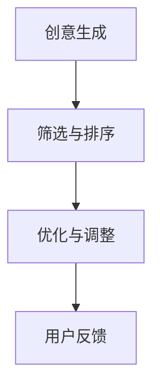

#### 6.3 创意应用案例分析

以下是一个创意应用案例：

**项目名称**：智能创意设计平台

**项目介绍**：智能创意设计平台是一款基于AIGC的创意设计工具，可以帮助设计师快速生成创意设计方案。

**项目目标**：通过AIGC生成创意内容，提高设计效率和质量。

**项目实施**：

1. **需求分析**：分析设计领域的常见需求和创意点。

2. **创意生成**：利用AIGC生成大量创意设计方案，包括文本、图像、音频等。

3. **创意优化**：根据用户反馈和评估结果，优化创意设计方案。

4. **用户反馈**：收集用户对创意设计方案的反馈，不断调整和优化。

**项目成果**：通过智能创意设计平台，设计师能够快速生成高质量的设计方案，提高设计效率。

#### 6.4 创意评估与反馈

创意评估与反馈是确保AIGC生成创意质量和实用性的关键步骤。以下是一个简单的创意评估与反馈流程：

1. **评估指标**：定义评估指标，如创意性、实用性、用户满意度等。

2. **评估与排名**：对生成的创意内容进行评估和排名，筛选出高质量的创意。

3. **用户反馈**：收集用户对创意内容的反馈，作为评估和优化的依据。

4. **实时调整**：根据评估结果和用户反馈，实时调整创意生成策略。

以下是一个简单的创意评估与反馈流程的Mermaid流程图：

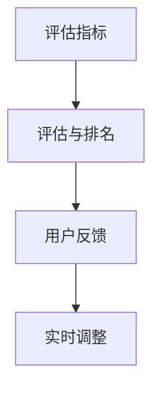

### 第七部分：AIGC的未来发展与展望

#### 7.1 AIGC技术发展趋势

AIGC技术正在快速发展，未来将呈现以下几个趋势：

1. **模型性能提升**：随着计算能力的提升和算法的进步，AIGC模型的生成质量和速度将不断提升。

2. **多模态融合**：AIGC将实现文本、图像、音频等多模态的融合生成，生成更加丰富和多样化的内容。

3. **个性化定制**：AIGC将能够根据用户需求和个人偏好，生成更加个性化、定制化的内容。

4. **泛在应用**：AIGC将渗透到更多行业和领域，实现广泛的应用。

#### 7.2 创新应用领域展望

AIGC在创新应用领域具有巨大的潜力，以下是一些值得关注的领域：

1. **智能制造**：AIGC可以自动生成产品设计方案、生产流程等，提高制造效率。

2. **数字娱乐**：AIGC可以生成高质量的虚拟角色、动画、游戏等内容，创造全新的娱乐体验。

3. **医疗健康**：AIGC可以生成个性化的诊断报告、治疗方案等，提高医疗服务的质量和效率。

4. **教育**：AIGC可以自动生成教学资源、课程内容等，促进个性化教育和学习。

#### 7.3 安全、伦理与可持续发展

随着AIGC技术的快速发展，安全问题、伦理问题以及可持续发展问题也日益凸显。以下是一些关键点：

1. **数据安全**：确保AIGC使用的数据安全和隐私保护。

2. **伦理合规**：遵循伦理规范，避免AIGC生成的内容造成伦理问题和社会负面影响。

3. **可持续发展**：关注AIGC对环境的影响，推动绿色、可持续的发展。

#### 7.4 AIGC产业生态构建

AIGC产业生态的构建是推动AIGC技术发展的重要环节。以下是一些关键点：

1. **产业链整合**：整合上下游产业链，构建完整的AIGC产业生态。

2. **技术创新**：持续推动AIGC技术的创新，提升模型性能和应用效果。

3. **人才培养**：培养专业的AIGC人才，推动产业发展。

4. **政策支持**：制定相关政策，鼓励和支持AIGC技术的发展。

### 结论

AIGC提示词工程是AIGC技术的重要组成部分，通过高效、精准的提示词设计，可以实现效率与创意的完美融合。本文从AIGC的基本概念、核心算法、应用案例、提示词工程、效率优化、创意激发以及未来展望等多个角度进行了深入探讨，展示了AIGC提示词工程在推动技术发展和产业变革中的重要作用。未来，随着AIGC技术的不断进步和应用的深入，提示词工程将继续发挥关键作用，为人类社会带来更多创新和价值。

### 作者信息

作者：AI天才研究院/AI Genius Institute & 禅与计算机程序设计艺术 /Zen And The Art of Computer Programming

