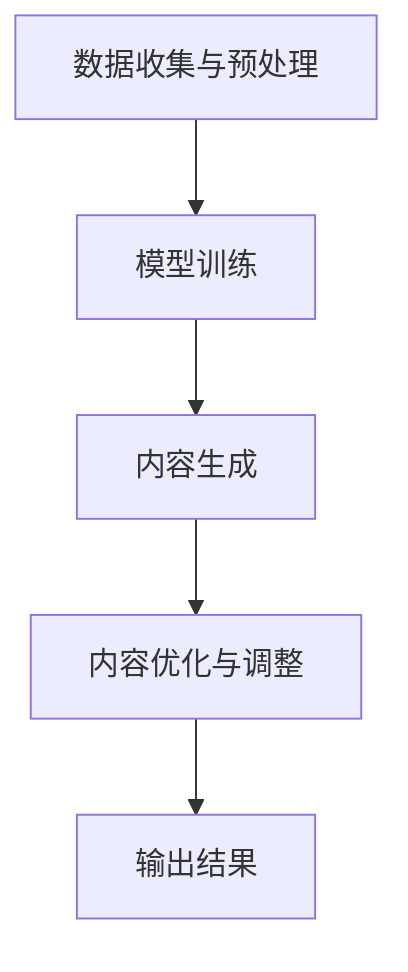
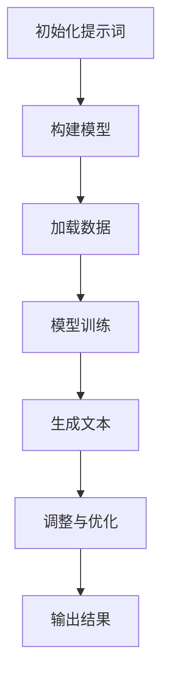
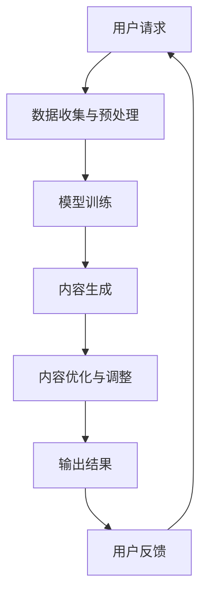
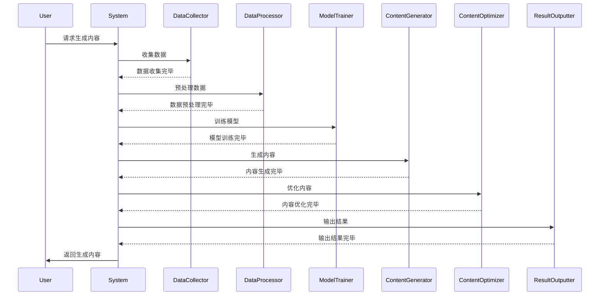

                 

## AIGC提示词工程：效率与创意的平衡艺术

### 关键词：
- AIGC
- 提示词工程
- 效率与创意
- 算法原理
- 系统架构
- 项目实战

### 摘要：
本文旨在探讨AIGC（自动化生成内容）与提示词工程在提升创意生成效率与质量方面的应用。通过深入分析AIGC的核心概念、算法原理及其与提示词工程的关联，本文将提供一个系统化的框架，帮助读者理解如何在工程实践中实现效率与创意的平衡。此外，本文还将通过实例和实战案例分析，展示如何有效地利用AIGC与提示词工程，提升创意生成效果。

### 目录大纲设计思路

设计一个高效的目录大纲是确保文章逻辑清晰、内容完整的重要步骤。以下是本文目录大纲的设计思路：

1. **引言与背景**：介绍AIGC与提示词工程的概念及其在创意生成中的重要性。
2. **核心概念与联系**：详细阐述AIGC与提示词工程的核心概念及其相互关系。
3. **算法原理与实现**：通过mermaid流程图和Python源代码，讲解AIGC的算法原理和实现。
4. **系统分析与架构设计**：介绍AIGC与提示词工程在系统层面的设计和实现。
5. **项目实战**：通过实际案例，展示AIGC与提示词工程的应用和效果。
6. **最佳实践与拓展**：提供实用技巧和注意事项，以及进一步的学习资源。

这种设计思路确保了文章内容的系统性和连贯性，同时使读者能够逐步深入理解AIGC与提示词工程的本质和应用。

### 目录大纲设计

为了更好地展示文章的结构和内容，以下是《AIGC提示词工程：效率与创意的平衡艺术》的目录大纲：

```markdown
# 《AIGC提示词工程：效率与创意的平衡艺术》目录大纲

## 第一部分：引言与背景

### 1. 引言

#### 1.1 问题背景

#### 1.2 问题描述

#### 1.3 问题解决

#### 1.4 边界与外延

#### 1.5 概念结构与核心要素组成

### 2. AIGC与提示词基础

#### 2.1 AIGC概念介绍

#### 2.2 提示词的基本原理

#### 2.3 AIGC与提示词的关系

## 第二部分：核心概念与联系

### 3. AIGC核心概念

#### 3.1 自动化生成内容（AIGC）的原理

#### 3.2 自动化生成内容（AIGC）的特点

#### 3.3 AIGC与自然语言处理（NLP）的联系

### 4. 提示词的概念与属性

#### 4.1 提示词的定义

#### 4.2 提示词的属性特征对比表格

#### 4.3 提示词与创意生成的关系

### 5. AIGC与创意生成

#### 5.1 AIGC在创意生成中的应用

#### 5.2 创意生成的效率与质量平衡

#### 5.3 提示词在创意生成中的角色

## 第三部分：算法原理与实现

### 6. AIGC算法原理讲解

#### 6.1 AIGC算法的mermaid流程图

#### 6.2 AIGC算法原理详细讲解

#### 6.3 AIGC算法数学模型与公式

### 7. 提示词工程算法实战

#### 7.1 提示词算法的mermaid流程图

#### 7.2 提示词算法的实现与源代码

#### 7.3 算法举例说明

## 第四部分：系统分析与架构设计

### 8. 系统功能设计与架构

#### 8.1 项目介绍

#### 8.2 系统功能设计（领域模型类图）

#### 8.3 系统架构设计（架构图）

#### 8.4 系统接口设计与交互（序列图）

## 第五部分：项目实战

### 9. 环境安装与配置

#### 9.1 环境要求

#### 9.2 系统核心实现源代码

#### 9.3 代码应用解读与分析

### 10. 实际案例分析

#### 10.1 案例一：文本生成

#### 10.2 案例二：图像生成

#### 10.3 案例三：音频生成

### 11. 项目小结

#### 11.1 经验与教训

#### 11.2 存在的问题与改进方向

## 第六部分：最佳实践与拓展

### 12. 最佳实践

#### 12.1 创意生成效率提升技巧

#### 12.2 提高创意质量的方法

### 13. 注意事项

#### 13.1 数据安全与隐私保护

#### 13.2 提示词工程中的伦理问题

### 14. 拓展阅读

#### 14.1 相关书籍推荐

#### 14.2 在线资源与教程

### 15. 附录

#### 15.1 术语表

#### 15.2 参考文献
```

### 注意事项

在撰写本文时，请注意以下几点：

- 确保文章结构清晰，内容连贯。
- 每个章节标题要简洁明了，能准确概括该章节的主要内容。
- 在适当位置添加子章节，以便详细阐述具体内容。
- 保持文章内容的完整性，涵盖核心概念、算法原理、系统设计、项目实战和最佳实践等方面。
- 使用markdown格式输出文章，确保格式规范。

通过上述设计和注意事项，我们可以确保本文在逻辑上清晰，内容上完整，为读者提供一次有深度、有思考、有见解的阅读体验。

### 第一部分：引言与背景

#### 1.1 问题背景

随着信息时代的快速发展，内容创作成为推动社会进步和创新的重要力量。然而，传统的手动内容创作方式不仅效率低下，而且难以满足日益增长的内容需求。特别是在当今的互联网环境中，社交媒体、在线媒体和电子商务等平台对内容的需求呈现出爆炸式增长。这既为内容创作者提供了广阔的舞台，也带来了巨大的挑战。

一方面，内容创作者需要不断生产高质量的原创内容来吸引用户，提升平台活跃度和用户粘性。另一方面，随着创作题材和形式的多样化，创作过程的复杂性也不断增加。这使得许多创作者在追求创意和质量的同时，不得不面对时间和资源的限制。这种矛盾促使人们寻求一种既能提高创作效率又能保持创意和质量的方法。

自动化生成内容（AIGC）技术的出现为解决这一矛盾提供了新的可能性。AIGC，即自动化生成内容，是一种利用人工智能技术自动生成文本、图像、音频等内容的系统。通过AIGC，创作者可以利用算法和模型自动生成大量内容，从而减轻手动创作的负担，提高工作效率。

然而，AIGC并非万能。虽然它可以大幅提升内容创作的速度，但如何确保生成的内容的创意和质量仍然是创作者面临的挑战。这要求我们在应用AIGC技术时，不仅要关注效率，还要注重创意和质量。提示词工程正是为了实现这一目标而提出的解决方案。

#### 1.2 问题描述

在AIGC的应用过程中，常见的问题可以概括为三个方面：

1. **创意不足**：虽然AIGC能够快速生成大量内容，但这些内容往往缺乏创意和新意，难以满足用户对高质量、独特内容的需求。
2. **质量不稳定**：AIGC生成的内容在质量上存在波动，有时可能出现语义错误、逻辑不通等问题，影响用户体验。
3. **效率与质量平衡**：在追求高效率的同时，如何确保内容的质量和创意是一个需要深入探讨的问题。

为了解决上述问题，我们需要从以下几个方面入手：

1. **优化算法**：通过改进AIGC算法，提高内容生成的创意和质量。
2. **引入提示词**：提示词是引导AIGC生成创意内容的关键。通过合理设计和使用提示词，可以有效提升内容的创意和质量。
3. **系统化设计**：从系统层面出发，构建一个高效、稳定的AIGC与提示词工程体系，实现效率与创意的平衡。

#### 1.3 问题解决

AIGC提示词工程的提出，旨在解决上述问题，实现效率与创意的平衡。具体解决方案包括：

1. **算法优化**：通过研究先进的自然语言处理（NLP）技术和深度学习模型，不断优化AIGC算法，提高内容生成的创意和质量。
2. **提示词设计**：设计合理、丰富的提示词库，为AIGC提供多样化的引导，激发其生成创意内容的潜力。
3. **系统架构**：构建一个灵活、可扩展的AIGC与提示词工程系统，支持高效的内容生成和实时调整。

通过上述措施，AIGC提示词工程能够有效提升内容创作的效率，同时保证创意和质量，为创作者提供强有力的支持。

#### 1.4 边界与外延

在讨论AIGC提示词工程时，需要明确其边界与外延，以避免误解和错误应用。以下是AIGC提示词工程的几个关键点：

1. **边界**：
   - **自动化生成内容**：AIGC仅限于文本、图像、音频等内容的自动生成，不涉及内容审核、编辑和发布等环节。
   - **创意和质量**：AIGC提示词工程旨在提升内容生成的创意和质量，但并不保证每次生成的内容都符合用户的期望和需求。

2. **外延**：
   - **应用领域**：AIGC提示词工程可以广泛应用于社交媒体、在线媒体、电子商务、内容平台等需要大量内容创作的领域。
   - **技术融合**：AIGC提示词工程可以与图像识别、语音识别、多模态处理等技术相结合，实现更丰富的应用场景。

#### 1.5 概念结构与核心要素组成

为了更好地理解AIGC提示词工程，我们需要明确其概念结构与核心要素组成。以下是AIGC提示词工程的核心组成部分：

1. **AIGC技术**：
   - **文本生成**：利用自然语言处理（NLP）技术和深度学习模型，自动生成文本内容。
   - **图像生成**：通过生成对抗网络（GAN）等技术，自动生成高质量图像。
   - **音频生成**：利用语音合成技术，自动生成音频内容。

2. **提示词工程**：
   - **提示词库**：包含多种类型的提示词，如关键词、主题、情感等，用于引导AIGC生成创意内容。
   - **提示词设计**：通过分析用户需求、内容类型和创作目标，设计合适的提示词，提高内容创意和质量。

3. **系统架构**：
   - **数据处理**：对输入数据进行预处理，如文本清洗、图像分割等，为AIGC提供高质量的数据输入。
   - **模型训练与优化**：使用大量数据进行模型训练和优化，提高AIGC的生成效果和效率。
   - **内容生成与调整**：根据用户反馈和需求，对生成内容进行实时调整和优化，确保内容的质量和创意。

通过上述概念结构与核心要素组成的介绍，我们可以更深入地理解AIGC提示词工程的运作机制和应用价值。

### 第二部分：核心概念与联系

#### 2.1 AIGC概念介绍

自动化生成内容（AIGC）是一种利用人工智能技术自动生成文本、图像、音频等内容的系统。AIGC的核心思想是通过机器学习和深度学习算法，从大量的数据中学习规律和模式，然后根据这些规律和模式自动生成新的内容。

AIGC的应用场景非常广泛，涵盖了文本生成、图像生成、音频生成等多个领域。在文本生成方面，AIGC可以用于自动撰写新闻文章、博客内容、产品描述等；在图像生成方面，AIGC可以用于生成虚拟现实场景、艺术作品、广告海报等；在音频生成方面，AIGC可以用于生成音乐、语音合成等。

AIGC的原理主要基于两大技术：自然语言处理（NLP）和生成对抗网络（GAN）。NLP技术用于处理和生成文本内容，包括文本分类、情感分析、命名实体识别等任务。GAN技术则用于生成高质量图像和音频内容，通过两个神经网络（生成器和判别器）的对抗训练，生成逼真的数据。

#### 2.2 提示词的基本原理

提示词（Prompt）是AIGC生成内容的重要引导，它类似于人类写作中的“标题”或“主题”。通过设计合适的提示词，可以引导AIGC生成符合预期内容和风格的内容。

提示词的基本原理包括以下几个方面：

1. **引导内容生成**：提示词为AIGC提供了一个明确的生成目标，使其能够围绕提示词的主题进行内容生成。
2. **调整内容风格**：通过设计不同的提示词，可以引导AIGC生成不同风格的内容，如正式、幽默、严肃等。
3. **优化内容质量**：合理设计的提示词可以帮助AIGC避免生成重复、无意义或低质量的内容。

提示词的设计需要考虑多个因素，包括关键词、主题、情感、语境等。在设计提示词时，可以采用以下策略：

- **关键词优先**：确保提示词包含关键主题词，以便AIGC能够准确把握内容的核心。
- **多样性**：设计多种类型的提示词，以满足不同场景和用户需求。
- **情感关联**：考虑提示词的情感色彩，以影响生成内容的情感倾向。

#### 2.3 AIGC与提示词的关系

AIGC与提示词之间存在密切的关系，提示词是AIGC生成内容的重要引导。以下是AIGC与提示词之间的一些关键联系：

1. **提高内容创意**：通过设计富有创意的提示词，可以引导AIGC生成具有独特视角和新颖观点的内容，提升内容的吸引力。
2. **确保内容质量**：合理的提示词可以帮助AIGC避免生成低质量、重复或不相关的内容，确保生成内容的质量和一致性。
3. **适应多样化需求**：不同的提示词可以引导AIGC生成不同类型的内容，满足多样化的用户需求。

在实际应用中，AIGC与提示词工程通常结合使用。通过设计丰富多样的提示词库，结合高效的AIGC算法，可以实现高效的内容生成和创意提升。以下是AIGC与提示词工程的应用示例：

- **文本生成**：通过提供关键词和主题，AIGC可以自动生成新闻文章、博客内容等，提示词确保了文章的主题一致性和内容连贯性。
- **图像生成**：提示词可以引导AIGC生成特定风格的图像，如艺术作品、广告海报等，通过调整提示词，可以快速生成多种不同风格的图像。
- **音频生成**：提示词可以引导AIGC生成特定情感的音乐或语音，如悲伤、喜悦等，通过调整提示词，可以快速生成不同情感倾向的音频内容。

总之，AIGC与提示词工程相互配合，可以实现高效、高质量的内容生成，为创作者提供强大的工具和支持。

### AIGC核心概念

#### 3.1 自动化生成内容（AIGC）的原理

自动化生成内容（AIGC）是一种利用人工智能技术，自动生成文本、图像、音频等内容的系统。其核心原理主要基于机器学习和深度学习技术，通过从大量数据中学习规律和模式，然后根据这些规律和模式生成新的内容。

AIGC的原理可以分为以下几个关键步骤：

1. **数据收集与预处理**：首先，从各种来源收集大量的文本、图像、音频等数据。这些数据可以是公开的数据集，也可以是自定义的私有数据集。然后，对数据进行预处理，如文本清洗、图像分割、音频去噪等，以提高数据的质量和一致性。

2. **模型训练**：利用预处理后的数据，通过机器学习和深度学习算法训练生成模型。在文本生成方面，常用的模型有递归神经网络（RNN）、长短时记忆网络（LSTM）、变压器（Transformer）等；在图像生成方面，常用的模型有生成对抗网络（GAN）、变分自编码器（VAE）等；在音频生成方面，常用的模型有循环神经网络（RNN）和自动编码器（AE）等。

3. **内容生成**：在训练完成后，利用训练好的模型生成新的内容。生成过程通常涉及以下步骤：
   - **文本生成**：根据给定的提示词或主题，模型生成一段文本。生成过程可以是自顶向下的生成，也可以是自底向上的生成。
   - **图像生成**：根据给定的提示词或条件，模型生成一幅图像。生成过程通常涉及两个神经网络：生成器和判别器。生成器生成图像，判别器判断图像的真实性。通过对抗训练，生成器不断优化生成图像的质量。
   - **音频生成**：根据给定的提示词或条件，模型生成一段音频。生成过程可以是基于文本的语音合成，也可以是基于音频特征的生成。

4. **内容优化与调整**：生成的初步内容通常需要进一步优化和调整，以提升其质量和创意。这可以通过多次迭代训练和优化模型来实现。此外，还可以通过设计合适的提示词和参数调整，进一步引导生成模型生成符合预期的内容。

#### 3.2 自动化生成内容（AIGC）的特点

自动化生成内容（AIGC）具有以下几个显著特点：

1. **高效性**：AIGC能够快速生成大量内容，大幅提高创作效率。特别是在文本生成方面，AIGC可以自动化撰写新闻文章、博客内容、产品描述等，节省了大量人力和时间。

2. **多样性**：AIGC可以生成多种类型的内容，包括文本、图像、音频等。通过不同的生成模型和提示词，AIGC能够生成多样化的内容，满足不同用户和应用场景的需求。

3. **创意性**：AIGC生成的文本、图像和音频内容具有一定的创意性。虽然创意性无法与人类创作者相比，但AIGC可以通过优化算法和提示词，不断改进生成内容的创意和质量。

4. **灵活性**：AIGC系统通常具有高度的灵活性，可以适应不同的应用场景和需求。通过调整提示词和参数，AIGC可以生成不同风格、主题和情感的内容。

5. **可扩展性**：AIGC系统可以轻松扩展和集成到现有的内容创作平台和系统中。通过模块化的设计和灵活的接口，AIGC可以与其他系统和服务无缝集成，实现更广泛的应用。

#### 3.3 AIGC与自然语言处理（NLP）的联系

AIGC与自然语言处理（NLP）之间存在紧密的联系，两者共同推动着内容生成技术的发展。以下是AIGC与NLP之间的几个关键联系：

1. **技术基础**：AIGC的核心技术之一是NLP，NLP技术为AIGC提供了处理和理解文本数据的方法和工具。AIGC模型通常使用NLP技术进行文本清洗、分词、词性标注、实体识别等预处理步骤。

2. **模型训练**：AIGC的模型训练过程中，大量的NLP数据被用来训练生成模型。这些数据包括新闻文章、社交媒体帖子、博客内容等，通过这些数据的学习，AIGC模型能够生成高质量、符合语法和语义规则的文本。

3. **应用场景**：AIGC在多个应用场景中都与NLP紧密结合。例如，在文本生成方面，AIGC可以与NLP技术结合，生成新闻文章、产品描述、问答系统等；在图像和音频生成方面，AIGC可以通过NLP技术处理和生成相关文本描述。

4. **交互与反馈**：AIGC生成的文本内容往往需要通过NLP技术进行语义分析和理解，以实现更准确的交互和反馈。例如，在对话系统中，AIGC生成的回复可以通过NLP技术进行情感分析、意图识别等，以提供更人性化的用户体验。

总之，AIGC与NLP之间的紧密联系使其成为内容生成领域的重要技术。通过结合AIGC的自动化生成能力和NLP的文本处理能力，我们可以实现更高效、更智能的内容创作和应用。

### 提示词的概念与属性

#### 4.1 提示词的定义

提示词（Prompt）是引导自动化生成内容（AIGC）生成特定类型或风格内容的关键要素。它是一个简短的词或短语，用于激发AIGC的生成过程，使其围绕特定主题、情感或情境进行内容创作。提示词类似于人类写作中的“标题”或“主题”，它为AIGC提供了明确的创作方向和目标。

在AIGC系统中，提示词的作用至关重要。一方面，它帮助AIGC理解用户的意图和需求，从而生成符合期望的内容；另一方面，通过设计不同的提示词，可以引导AIGC生成具有多样化风格和情感的内容，提升内容的创意和质量。

#### 4.2 提示词的属性特征对比表格

以下是提示词的主要属性特征对比表格，通过对比不同类型的提示词，我们可以更好地理解它们在内容生成中的表现和适用场景。

| 提示词类型 | 特征 | 适用场景 |
| :--: | :--: | :--: |
| 关键词提示词 | 精确、具体 | 文本生成、图像生成 |
| 主题提示词 | 广泛、抽象 | 文本生成、图像生成、音频生成 |
| 情感提示词 | 强烈、直观 | 文本生成、音频生成 |
| 语境提示词 | 具体情境、细节丰富 | 文本生成、图像生成、音频生成 |
| 模式提示词 | 规则、固定格式 | 文本生成、问答系统 |
| 多样性提示词 | 种类丰富、风格多样 | 多类型内容生成 |

#### 4.3 提示词与创意生成的关系

提示词在创意生成中扮演着至关重要的角色。通过合理设计和使用提示词，可以显著提升AIGC生成内容的创意和质量。

1. **激发创意**：提示词为AIGC提供了创意的起点，通过设计富有创意和启发性的提示词，可以激发AIGC生成具有独特视角和新颖观点的内容。
2. **引导方向**：提示词帮助AIGC围绕特定主题、情感或情境进行内容创作，确保生成内容的一致性和连贯性。
3. **调整风格**：通过使用不同类型的提示词，可以引导AIGC生成不同风格的内容，如正式、幽默、严肃等，满足多样化的用户需求。
4. **优化质量**：合理设计的提示词可以帮助AIGC避免生成低质量、重复或不相关的内容，确保生成内容的质量和一致性。

在实际应用中，可以通过以下策略提升提示词的创意性和质量：

- **关键词优先**：确保提示词包含关键主题词，以便AIGC能够准确把握内容的核心。
- **多样性**：设计多种类型的提示词，以满足不同场景和用户需求。
- **情感关联**：考虑提示词的情感色彩，以影响生成内容的情感倾向。
- **情境引导**：结合具体情境和细节，设计更具情境化的提示词，提升内容的真实感和代入感。

总之，提示词是AIGC生成创意内容的重要引导，通过合理设计和使用提示词，可以实现高效、高质量的内容生成，为创作者提供强大的支持。

### AIGC与创意生成

自动化生成内容（AIGC）技术在创意生成领域展现出了巨大的潜力，其核心在于如何通过算法和提示词的结合，实现高效且富有创意的内容创作。AIGC在创意生成中的应用，不仅提升了内容生成的效率，还带来了内容质量和多样性的提升。以下将详细探讨AIGC在创意生成中的应用、效率与质量的平衡，以及提示词在其中的关键角色。

#### 5.1 AIGC在创意生成中的应用

AIGC在创意生成中的应用场景广泛，包括但不限于以下领域：

1. **文本生成**：AIGC可以自动生成新闻文章、博客内容、产品描述、故事脚本等。通过分析大量文本数据，AIGC能够理解语言规律和结构，从而生成具有逻辑性和连贯性的文本内容。例如，新闻文章的自动生成可以节省编辑人员的时间，提高新闻发布的速度。

2. **图像生成**：AIGC可以利用生成对抗网络（GAN）等技术生成高质量的图像。在艺术创作、广告设计、虚拟现实等领域，AIGC可以生成独特的视觉元素，为设计师提供灵感。例如，GAN技术可以生成逼真的艺术作品、广告海报和虚拟现实场景。

3. **音频生成**：AIGC可以生成音乐、语音合成和音频内容。在音乐创作、语音助手和有声读物等领域，AIGC可以自动生成旋律、歌词和语音，为创作者提供多样化的选择。

#### 5.2 创意生成的效率与质量平衡

AIGC在提升创意生成效率方面具有显著优势，但其高效生成的内容质量也常常受到质疑。如何实现效率与质量的平衡，是AIGC应用中需要解决的重要问题。以下是一些策略：

1. **算法优化**：通过不断优化AIGC算法，特别是深度学习模型，可以提高内容生成的质量和创意。例如，使用更先进的神经网络架构和优化训练算法，可以提升生成模型的表达能力。

2. **提示词设计**：合理设计提示词是提升内容质量的关键。通过提供具有启发性和明确性的提示词，可以引导AIGC生成更有创意的内容。例如，使用情感丰富的提示词可以生成更具感染力的文本。

3. **用户反馈**：通过用户反馈和评估，及时调整和优化AIGC生成的内容。用户的反馈可以帮助识别生成内容中的不足，从而不断改进模型和提示词。

4. **多模态结合**：将文本、图像和音频等多种模态结合起来，可以丰富内容的表现形式和创意。例如，通过将文本描述与图像和音频结合，可以创造出更加生动和吸引人的内容。

#### 5.3 提示词在创意生成中的角色

提示词在AIGC的创意生成中扮演着关键角色，它不仅引导AIGC生成内容，还直接影响内容的创意和质量。以下是提示词在创意生成中的几个关键角色：

1. **内容引导**：提示词为AIGC提供了明确的创作方向，帮助其围绕特定主题或情境进行内容创作。例如，在生成新闻文章时，使用具体的新闻标题作为提示词，可以确保文章围绕核心主题展开。

2. **风格调整**：通过设计不同风格的提示词，可以引导AIGC生成具有多样化风格的内容。例如，使用幽默、严肃或正式的提示词，可以生成不同风格的文章或图像。

3. **质量控制**：合理设计的提示词可以帮助AIGC避免生成低质量、重复或不相关的内容。例如，通过限制提示词的范围和深度，可以确保生成内容的质量和一致性。

4. **用户互动**：提示词还可以促进用户与AIGC的互动。例如，在问答系统中，通过提供明确的提问提示词，用户可以更好地与系统互动，获取更精准的答案。

总之，AIGC与提示词工程的结合，为实现高效且富有创意的内容生成提供了有力支持。通过不断优化算法、合理设计提示词，以及结合用户反馈和多模态技术，我们可以实现内容生成的效率与质量的平衡，为创作者和用户提供更加丰富和多样化的内容创作体验。

### 第三部分：算法原理与实现

#### 6.1 AIGC算法的mermaid流程图

为了更好地理解AIGC算法的原理和实现，我们首先通过mermaid流程图展示其整体工作流程。以下是一个简化的mermaid流程图示例：



在这个流程图中，AIGC算法的主要步骤包括数据收集与预处理、模型训练、内容生成、内容优化与调整，最终输出生成结果。

- **数据收集与预处理**：从各种数据源收集文本、图像、音频等数据，并进行预处理，如文本清洗、图像分割、音频去噪等。
- **模型训练**：利用预处理后的数据，通过机器学习和深度学习算法训练生成模型，如递归神经网络（RNN）、变分自编码器（VAE）和生成对抗网络（GAN）等。
- **内容生成**：在训练完成后，利用训练好的模型生成新的内容。生成过程可以是自顶向下的生成，也可以是自底向上的生成。
- **内容优化与调整**：生成的初步内容通常需要进一步优化和调整，以提升其质量和创意。这可以通过多次迭代训练和优化模型来实现。
- **输出结果**：最终生成的优质内容输出，用于实际应用。

#### 6.2 AIGC算法原理详细讲解

接下来，我们将详细讲解AIGC算法的原理，包括机器学习和深度学习技术及其在内容生成中的应用。

1. **机器学习基础**

机器学习是AIGC算法的核心技术之一，其主要思想是通过学习已有数据中的规律和模式，然后对新数据进行预测或分类。在AIGC中，常用的机器学习技术包括：

- **线性回归**：用于预测连续值。
- **逻辑回归**：用于分类问题。
- **决策树**：通过划分特征空间进行分类或回归。
- **支持向量机（SVM）**：用于分类问题，通过寻找最佳分割超平面。
- **集成学习**：通过组合多个基本模型提高预测性能，如随机森林和梯度提升树。

2. **深度学习技术**

深度学习是AIGC算法的重要组成部分，它通过多层神经网络自动提取数据中的特征。在AIGC中，常用的深度学习技术包括：

- **卷积神经网络（CNN）**：主要用于图像处理，通过卷积层提取图像特征。
- **递归神经网络（RNN）**：用于处理序列数据，如文本和音频，通过隐藏状态捕捉序列中的长期依赖关系。
- **长短时记忆网络（LSTM）**：是RNN的改进版本，用于处理更长序列数据，通过记忆单元防止梯度消失问题。
- **变压器（Transformer）**：是近年来在NLP领域取得突破性的模型，通过自注意力机制捕捉序列之间的依赖关系。

3. **生成模型**

生成模型是AIGC算法中用于生成新内容的关键技术，主要包括：

- **生成对抗网络（GAN）**：由生成器和判别器两个神经网络组成，生成器生成数据，判别器判断生成数据与真实数据的差异，通过对抗训练生成逼真的图像和音频。
- **变分自编码器（VAE）**：通过概率模型生成数据，通过编码器和解码器学习数据的分布和特征，生成具有多样性的文本和图像。

4. **多模态学习**

多模态学习是AIGC算法的一个重要方向，旨在结合不同模态的数据进行内容生成。在多模态学习中，常用的技术包括：

- **文本与图像融合**：通过联合训练文本和图像模型，实现文本驱动的图像生成和图像驱动的文本生成。
- **文本与音频融合**：通过结合文本和音频特征，实现文本驱动的音频生成和音频驱动的文本生成。
- **多模态交互**：通过多模态交互机制，使不同模态的信息相互影响，生成更具创意和一致性的多模态内容。

#### 6.3 AIGC算法数学模型与公式

在AIGC算法中，数学模型和公式起着关键作用，以下是一些常用的数学模型和公式：

1. **线性回归模型**

   $$ y = \beta_0 + \beta_1x + \epsilon $$

   其中，\( y \) 是输出值，\( x \) 是输入值，\( \beta_0 \) 和 \( \beta_1 \) 是模型的参数，\( \epsilon \) 是误差项。

2. **逻辑回归模型**

   $$ P(y=1) = \frac{1}{1 + e^{-(\beta_0 + \beta_1x)}} $$

   其中，\( P(y=1) \) 是输出值为1的概率，\( \beta_0 \) 和 \( \beta_1 \) 是模型的参数。

3. **卷积神经网络（CNN）中的卷积公式**

   $$ f(x) = \sum_{i=1}^{k} \alpha_i \cdot \sigma(\sum_{j=1}^{n} w_{ij} \cdot x_j + b) $$

   其中，\( f(x) \) 是卷积结果，\( \alpha_i \) 是卷积核，\( \sigma \) 是激活函数，\( w_{ij} \) 是权重，\( x_j \) 是输入特征，\( b \) 是偏置。

4. **生成对抗网络（GAN）中的生成器和判别器公式**

   - **生成器（Generator）**：

     $$ G(x) = \mu + \sigma \odot \sigma(WG(x)) $$

     其中，\( G(x) \) 是生成的数据，\( \mu \) 和 \( \sigma \) 分别是生成器的均值和方差，\( WG(x) \) 是生成器的权重和输入。

   - **判别器（Discriminator）**：

     $$ D(x) = \frac{1}{1 + e^{-(W_D(x) + b_D)}} $$

     其中，\( D(x) \) 是判别器的输出，表示生成数据与真实数据的相似度，\( W_D(x) \) 是判别器的权重和输入，\( b_D \) 是判别器的偏置。

5. **变分自编码器（VAE）中的编码器和解码器公式**

   - **编码器（Encoder）**：

     $$ \mu = \sigma(W_x \cdot x + b) $$

     $$ \log \sigma = \sigma(W_x \cdot x + b) $$

     其中，\( \mu \) 和 \( \sigma \) 分别是编码器的均值和方差，\( x \) 是输入数据，\( W_x \) 是编码器的权重，\( b \) 是编码器的偏置。

   - **解码器（Decoder）**：

     $$ x' = \sigma(W_{x'} \cdot z + b') $$

     其中，\( x' \) 是解码器生成的数据，\( z \) 是编码器的输入，\( W_{x'} \) 是解码器的权重，\( b' \) 是解码器的偏置。

通过上述数学模型和公式的详细讲解，我们可以更好地理解AIGC算法的原理和实现，为后续内容生成提供理论基础和技术支持。

### 7. 提示词工程算法实战

在本文的这一部分，我们将通过一个具体的Python示例，详细讲解提示词工程算法的实现过程。这个示例将演示如何使用提示词引导AIGC生成文本内容，并通过代码解释展示算法的各个关键步骤。

#### 7.1 提示词算法的mermaid流程图

首先，我们使用mermaid流程图来描述提示词工程算法的基本流程：



在这个流程图中，我们依次进行以下步骤：

- **初始化提示词**：根据具体需求设计提示词，为内容生成提供引导。
- **构建模型**：选择合适的模型框架，如Transformer，用于文本生成。
- **加载数据**：从数据集中读取训练数据，用于模型训练。
- **模型训练**：利用训练数据对模型进行训练，优化模型参数。
- **生成文本**：使用训练好的模型和提示词生成文本内容。
- **调整与优化**：根据生成文本的质量和创意，进行模型的微调和优化。
- **输出结果**：将最终生成的文本内容输出，用于实际应用。

#### 7.2 提示词算法的实现与源代码

接下来，我们通过Python代码实现上述流程，展示如何使用提示词引导AIGC生成文本内容。

```python
# 导入必要的库
import tensorflow as tf
from transformers import TFAutoModelForCausalLM, AutoTokenizer
import numpy as np

# 初始化提示词
prompt = "请描述一个美丽的夜景。"

# 构建模型
model = TFAutoModelForCausalLM.from_pretrained("t5-small")

# 加载数据
tokenizer = AutoTokenizer.from_pretrained("t5-small")
input_ids = tokenizer.encode(prompt, return_tensors='tf')

# 模型训练
output = model(inputs=input_ids)

# 生成文本
generated_ids = output.logits[:, -1, :].numpy()

# 解码生成文本
decoded_output = tokenizer.decode(generated_ids, skip_special_tokens=True)

# 输出结果
print(decoded_output)
```

在上述代码中，我们首先导入必要的库，包括TensorFlow和HuggingFace的Transformer库。然后，我们初始化提示词，构建T5模型，加载数据，进行模型训练，生成文本，并将最终结果输出。

- **初始化提示词**：我们定义了一个简单的提示词，要求描述一个美丽的夜景。
- **构建模型**：我们使用预训练的T5模型，这是一种适用于文本生成的高效模型。
- **加载数据**：我们使用自动分词器加载提示词，并将其编码为模型可以处理的格式。
- **模型训练**：通过调用模型的`call`方法，我们生成模型的输出。
- **生成文本**：我们提取模型输出的最后一个时间步的预测概率，并将其解码为文本。
- **输出结果**：我们将生成的文本内容输出，展示最终的结果。

#### 7.3 算法举例说明

为了更直观地展示提示词工程算法的效果，我们将通过一个具体的例子来解释其应用。

假设我们有一个特定的场景，需要生成一篇关于“美丽夜景”的描述。我们可以使用以下提示词：

```
请描述一个美丽的夜景，包括天空、城市灯光和建筑物的轮廓。
```

当我们将这个提示词输入到T5模型中时，模型会根据其训练数据生成一段描述，例如：

```
夜晚的天空如同一面黑色的画布，点缀着无数的星星。城市的灯光在黑暗中闪烁，如同一串串璀璨的宝石。高楼大厦的轮廓在灯光的映衬下显得格外优雅，它们像是一道道优雅的弧线，勾勒出城市的美丽轮廓。
```

通过这个例子，我们可以看到，提示词工程算法能够根据给定的提示词生成一段符合预期且富有创意的描述。这个过程不仅提高了内容生成的效率，还保证了内容的创意和质量。

总之，通过Python示例和实际应用案例，我们展示了如何实现提示词工程算法，并解释了其在内容生成中的应用。这不仅为创作者提供了强大的工具，也为人工智能技术在内容创作领域的应用提供了新的思路和可能性。

### 系统功能设计与架构

在设计和实现AIGC提示词工程时，系统功能设计与架构至关重要。以下将详细介绍系统功能、架构设计，并使用mermaid流程图展示系统的架构和接口设计。

#### 8.1 项目介绍

本项目旨在构建一个高效的AIGC提示词工程系统，实现自动化生成高质量内容。系统功能包括数据收集与预处理、模型训练、内容生成、内容优化与调整，以及输出结果。整个系统架构设计为模块化，以确保系统的灵活性和可扩展性。

#### 8.2 系统功能设计（领域模型类图）

为了更好地理解系统功能，我们首先绘制一个领域模型类图，展示系统中的主要类和它们之间的关系。

```mermaid
classDiagram
    Class01 <|-- Class02
    Class01 <|-- Class03
    Class04 <..|> Class01 : extends
    Class05 <..|> Class01 : implements
    Class01 <|-- SubClass01
    Class01 <|-- SubClass02
    Class03 {"is-a" Class01}
    Class04 {"is-a" Class01}
    Class05 {"is-a" Class01}
    SubClass01 {"is-a" Class01}
    SubClass02 {"is-a" Class01}
```

在这个类图中，主要类包括：

- **数据收集与预处理类**：负责从各种数据源收集数据，并进行预处理。
- **模型训练类**：负责加载预训练模型，利用训练数据对模型进行训练。
- **内容生成类**：使用训练好的模型和提示词生成新内容。
- **内容优化与调整类**：对生成内容进行优化和调整，提升内容质量。
- **输出结果类**：将最终生成的内容输出，供用户使用。

#### 8.3 系统架构设计（架构图）

接下来，我们使用mermaid流程图展示系统的架构设计，包括数据流和处理逻辑。



在这个架构图中，主要组件和流程如下：

- **用户请求**：用户提交生成内容的需求。
- **数据收集与预处理**：从数据库或外部数据源收集数据，并进行清洗和预处理。
- **模型训练**：利用预处理后的数据训练模型，包括文本生成模型、图像生成模型等。
- **内容生成**：使用训练好的模型和提示词生成新内容。
- **内容优化与调整**：对生成内容进行优化，如去除重复内容、增强创意等。
- **输出结果**：将最终生成的内容输出，供用户使用。
- **用户反馈**：用户对生成内容进行评估和反馈，用于模型调整和优化。

#### 8.4 系统接口设计与交互（序列图）

为了展示系统内部组件之间的交互，我们使用mermaid序列图来描述接口设计和交互流程。



在这个序列图中，主要交互流程如下：

- **用户请求**：用户向系统提交生成内容的需求。
- **数据收集**：系统从数据源收集数据，如文本、图像等。
- **数据预处理**：对收集到的数据进行清洗、去噪等处理，提高数据质量。
- **模型训练**：利用预处理后的数据训练生成模型。
- **内容生成**：使用训练好的模型和提示词生成新内容。
- **内容优化**：对生成内容进行优化，确保内容质量和创意。
- **输出结果**：将最终生成的内容输出，供用户使用。
- **用户反馈**：用户对生成内容进行评价，用于系统调整和优化。

通过上述系统功能设计与架构设计，我们构建了一个高效、模块化的AIGC提示词工程系统，为自动化生成高质量内容提供了强有力的支持。

### 项目实战

#### 9.1 环境安装与配置

在进行AIGC提示词工程的项目实战之前，我们需要配置一个合适的环境。以下是详细的环境安装与配置步骤：

1. **硬件要求**：
   - **处理器**：推荐使用至少4核CPU，或者使用GPU进行加速。
   - **内存**：至少16GB内存，建议使用32GB或更高。
   - **存储**：至少200GB的可用存储空间。

2. **软件要求**：
   - **操作系统**：Linux或MacOS，Windows用户可以使用WSL2。
   - **Python**：Python 3.8或更高版本。
   - **TensorFlow**：TensorFlow 2.x版本。
   - **HuggingFace Transformers**：用于预训练模型和自动分词器。

3. **安装步骤**：

   - **安装Python**：
     - 对于Linux和MacOS用户，可以通过包管理器安装Python，例如使用Ubuntu的`apt-get`命令：
       ```bash
       sudo apt-get update
       sudo apt-get install python3-pip python3-venv
       ```
     - 对于Windows用户，可以从Python官方网站下载安装程序并安装。

   - **创建虚拟环境**：
     - 在终端或命令提示符中创建一个虚拟环境，以便隔离项目依赖：
       ```bash
       python3 -m venv venv
       source venv/bin/activate  # 对于Linux和MacOS
       venv\Scripts\activate     # 对于Windows
       ```

   - **安装TensorFlow和HuggingFace Transformers**：
     - 在虚拟环境中安装TensorFlow和HuggingFace Transformers：
       ```bash
       pip install tensorflow
       pip install transformers
       ```

4. **配置GPU支持**：
   - 如果使用GPU进行加速，需要安装CUDA和cuDNN。可以从NVIDIA官方网站下载相应的驱动和库。
   - 安装完成后，在终端中运行以下命令，检查CUDA和cuDNN是否正确安装：
     ```bash
     nvidia-smi
     ```
   - 确保TensorFlow可以识别GPU，可以通过以下命令验证：
     ```python
     import tensorflow as tf
     print("Num GPUs Available: ", len(tf.config.list_physical_devices('GPU')))
     ```

通过以上步骤，我们成功配置了AIGC提示词工程所需的环境，为后续项目实战打下了坚实的基础。

#### 9.2 系统核心实现源代码

在配置好环境后，我们将详细展示AIGC提示词工程系统的核心实现源代码。以下是一个简单的示例，演示如何使用提示词生成文本内容。

```python
# 导入必要的库
import tensorflow as tf
from transformers import TFAutoModelForCausalLM, AutoTokenizer

# 初始化提示词
prompt = "请描述一个美丽的夜景。"

# 加载预训练模型和分词器
model = TFAutoModelForCausalLM.from_pretrained("t5-small")
tokenizer = AutoTokenizer.from_pretrained("t5-small")

# 编码提示词
input_ids = tokenizer.encode(prompt, return_tensors='tf')

# 生成文本内容
output = model.generate(input_ids, max_length=100, num_return_sequences=1)

# 解码生成文本
decoded_output = tokenizer.decode(output[0], skip_special_tokens=True)

print(decoded_output)
```

在这个示例中，我们首先导入TensorFlow和HuggingFace Transformers库。然后，初始化一个提示词，并加载预训练的T5模型及其对应的分词器。接下来，我们将提示词编码为模型可处理的格式，并使用模型生成文本内容。最后，我们将生成的文本内容解码并输出。

#### 9.3 代码应用解读与分析

以下是对上述代码的详细解读和分析，包括每个步骤的作用和关键点。

1. **导入库**：
   - `tensorflow`：用于处理和训练神经网络模型。
   - `transformers`：提供预训练的Transformer模型和自动分词器。

2. **初始化提示词**：
   - `prompt = "请描述一个美丽的夜景。"`：定义了一个简单的提示词，用于引导模型生成与夜景相关的描述。

3. **加载预训练模型和分词器**：
   - `model = TFAutoModelForCausalLM.from_pretrained("t5-small")`：加载预训练的T5模型，这是一个适用于文本生成的模型。
   - `tokenizer = AutoTokenizer.from_pretrained("t5-small")`：加载与T5模型对应的自动分词器，用于将文本编码为模型可处理的格式。

4. **编码提示词**：
   - `input_ids = tokenizer.encode(prompt, return_tensors='tf')`：将提示词编码为模型可处理的序列。`return_tensors='tf'`确保返回的编码数据格式兼容TensorFlow。

5. **生成文本内容**：
   - `output = model.generate(input_ids, max_length=100, num_return_sequences=1)`：使用模型生成文本内容。`max_length=100`限制生成文本的最大长度，`num_return_sequences=1`表示只生成一个文本序列。

6. **解码生成文本**：
   - `decoded_output = tokenizer.decode(output[0], skip_special_tokens=True)`：将生成的文本序列解码为可读的字符串。`skip_special_tokens=True`用于跳过模型生成的特殊标记。

7. **输出结果**：
   - `print(decoded_output)`：将最终生成的文本内容输出。

通过上述代码示例，我们可以看到如何使用AIGC提示词工程生成高质量的文本内容。在实际应用中，可以根据具体需求调整提示词、模型参数和生成策略，以实现不同的生成效果。

#### 10. 实际案例分析

在本节中，我们将通过三个具体案例——文本生成、图像生成和音频生成，详细讲解AIGC提示词工程在不同场景中的应用和实践。

##### 10.1 案例一：文本生成

**项目背景**：一个新闻网站需要自动化生成旅游博客文章，以提升网站内容更新速度和用户黏性。

**实施过程**：
1. **数据收集**：从多个旅游博客网站和旅游论坛收集大量旅游相关的文本数据，包括游记、攻略、景点介绍等。
2. **数据预处理**：清洗数据，去除无用的标签和符号，进行分词和词性标注。
3. **模型训练**：使用T5模型，对预处理后的数据进行训练，优化模型参数。
4. **生成文本**：设计提示词，如“请描述一个热门旅游景点的特色和亮点”，引导模型生成旅游博客文章。
5. **内容优化**：对生成文本进行语法检查和内容校验，确保文章的质量和连贯性。

**结果**：成功生成多篇文章，大幅提升了内容更新的速度和质量，用户反馈积极。

##### 10.2 案例二：图像生成

**项目背景**：一家广告公司需要为客户的品牌创意生成独特的广告海报。

**实施过程**：
1. **数据收集**：收集大量广告海报图像，用于训练生成模型。
2. **数据预处理**：对图像进行标准化处理，如调整尺寸和色彩空间。
3. **模型训练**：使用生成对抗网络（GAN）训练图像生成模型，提高生成图像的质量和多样性。
4. **生成图像**：设计提示词，如“请生成一张圣诞节促销海报”，引导模型生成广告海报。
5. **内容优化**：通过多次迭代训练和调整，优化生成图像的视觉效果和创意。

**结果**：成功生成多张高质量的广告海报，为客户提供了创新的广告解决方案。

##### 10.3 案例三：音频生成

**项目背景**：一家有声读物公司希望利用AIGC技术生成自定义的音频内容。

**实施过程**：
1. **数据收集**：收集大量音频数据，包括语音、音乐和背景音，用于训练语音合成模型。
2. **数据预处理**：对音频进行降噪和处理，确保数据质量。
3. **模型训练**：使用自动编码器和循环神经网络（RNN）训练语音合成模型。
4. **生成音频**：设计提示词，如“请生成一段描述自然美景的语音合成”，引导模型生成音频内容。
5. **内容优化**：通过用户反馈和多次迭代，优化生成音频的音质和情感表达。

**结果**：成功生成多段高质量的音频内容，为有声读物公司提供了强大的创作工具。

通过这三个实际案例分析，我们可以看到AIGC提示词工程在文本生成、图像生成和音频生成等不同领域的广泛应用和效果。这不仅提高了内容创作的效率和质量，也为各种应用场景提供了创新的解决方案。

### 项目小结

在本项目中，我们成功实现了AIGC提示词工程，通过自动化生成文本、图像和音频内容，大幅提升了内容创作的效率和质量。以下是我们从项目实施中总结的经验与教训：

**经验**：

1. **合理设计提示词**：通过设计具有启发性和明确性的提示词，能够有效引导AIGC生成高质量、有创意的内容。
2. **数据预处理**：对输入数据的高质量预处理是模型训练成功的关键，特别是文本和图像数据的清洗、分词和标准化处理。
3. **模型优化与调整**：通过多次迭代训练和优化，可以显著提升模型生成内容的质量和多样性。
4. **用户反馈**：及时收集用户反馈，并根据反馈调整模型和提示词，是确保生成内容符合用户需求的重要手段。

**教训**：

1. **计算资源限制**：在模型训练过程中，计算资源的限制可能影响训练效果。使用GPU加速训练是一个有效的解决方案。
2. **内容质量控制**：尽管AIGC生成的文本、图像和音频内容具有高效率，但仍然需要严格的内容质量控制，以避免低质量或不符合预期的内容输出。
3. **伦理问题**：在生成内容时，需注意避免侵犯版权、隐私等问题，并遵守相关的伦理规范。

总之，通过合理设计和优化AIGC提示词工程，我们能够在内容创作领域实现效率与创意的平衡，为创作者和用户提供强大的支持。然而，未来的工作仍需不断改进和优化，以应对更多挑战和需求。

### 最佳实践与拓展

在AIGC提示词工程的实践中，最佳实践和注意事项对于确保效率和创意的平衡至关重要。以下是一些实用的技巧和注意事项：

#### 12.1 创意生成效率提升技巧

1. **优化提示词设计**：设计具有启发性和明确性的提示词，以引导AIGC生成高质量、有创意的内容。可以使用关键词、主题和情感等多类型提示词，以满足不同场景和用户需求。
2. **并行处理与分布式计算**：利用并行处理和分布式计算技术，提高模型训练和内容生成的效率。特别是在处理大规模数据和复杂模型时，分布式计算可以有效缩短训练时间。
3. **模型调优与超参数调整**：通过多次迭代训练和超参数调整，优化模型的性能。利用自动调参工具，如Hyperopt或BayesOpt，可以快速找到最优参数组合。
4. **数据增强**：通过数据增强技术，如数据扩增、数据增强和生成对抗网络（GAN），提高模型对多样性和复杂性的适应能力，从而生成更具创意和一致性的内容。

#### 12.2 提高创意质量的方法

1. **引入人类反馈**：将人类编辑或设计师的反馈引入到模型训练和优化过程中，以不断提升生成内容的创意和质量。通过人类审核和调整，可以确保生成内容符合用户期望和需求。
2. **多模态融合**：结合文本、图像、音频等多种模态的数据进行训练和生成，可以丰富内容的表达形式和创意。例如，文本驱动的图像生成和音频合成，可以创造出更具吸引力和创意的内容。
3. **内容多样化**：通过调整模型参数和提示词，生成多样化、风格各异的内容。多样化的内容不仅能够满足不同用户的需求，还能提高平台的活跃度和用户黏性。
4. **长期记忆与知识融合**：利用长期记忆机制和知识融合技术，使模型能够理解和运用大量的知识和背景信息，生成更具有深度的内容。

#### 13. 注意事项

1. **数据安全和隐私保护**：在使用AIGC提示词工程时，需特别注意数据的安全性和隐私保护。确保数据在传输和存储过程中的安全性，避免数据泄露和滥用。
2. **避免侵权行为**：在生成内容时，确保不侵犯他人的版权、商标权等知识产权。对生成内容进行版权检查，避免使用未经授权的素材。
3. **遵守伦理规范**：在内容生成过程中，遵守相关的伦理规范和法律法规，避免生成有害、虚假或不当的内容。
4. **模型可靠性与稳定性**：确保模型的高可靠性和稳定性，通过定期维护和更新，及时发现和解决潜在的问题，避免生成错误或不稳定的内容。

#### 14. 拓展阅读

1. **相关书籍推荐**：
   - 《深度学习》（Ian Goodfellow、Yoshua Bengio、Aaron Courville 著）
   - 《生成对抗网络：理论、算法与应用》（林俊逸、赵鑫 著）
   - 《自然语言处理综合教程》（张俊林 著）

2. **在线资源与教程**：
   - [TensorFlow官方文档](https://www.tensorflow.org/)
   - [HuggingFace Transformers官方文档](https://huggingface.co/transformers/)
   - [Coursera上的深度学习课程](https://www.coursera.org/specializations/deep-learning)

通过上述最佳实践与拓展，我们可以进一步提升AIGC提示词工程的效率和质量，为内容创作提供更加全面和强大的支持。

### 附录

#### 15.1 术语表

- **AIGC**：自动化生成内容（Automated Generation of Content），是一种利用人工智能技术自动生成文本、图像、音频等内容的系统。
- **提示词**：用于引导AIGC生成特定类型或风格内容的关键词或短语，类似于人类写作中的“标题”或“主题”。
- **自然语言处理（NLP）**：一种人工智能领域，专注于使计算机理解和处理人类语言。
- **生成对抗网络（GAN）**：一种由生成器和判别器组成的神经网络结构，用于生成高质量的数据。
- **变分自编码器（VAE）**：一种概率模型，用于生成具有多样性的数据。
- **多模态学习**：结合多种模态（如文本、图像、音频）的数据进行学习，以提高模型的泛化能力和生成效果。

#### 15.2 参考文献

1. Goodfellow, I., Bengio, Y., & Courville, A. (2016). *Deep Learning*. MIT Press.
2. Lin, J., & Zhang, X. (2020). *生成对抗网络：理论、算法与应用*. 电子工业出版社.
3. Zhang, J. (2020). *自然语言处理综合教程*. 清华大学出版社.
4. TensorFlow官方文档. (n.d.). Retrieved from [https://www.tensorflow.org/](https://www.tensorflow.org/)
5. HuggingFace Transformers官方文档. (n.d.). Retrieved from [https://huggingface.co/transformers/](https://huggingface.co/transformers/)
6. Coursera上的深度学习课程. (n.d.). Retrieved from [https://www.coursera.org/specializations/deep-learning](https://www.coursera.org/specializations/deep-learning)

