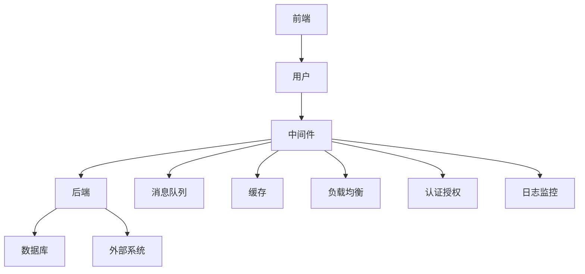

                 

## AIGC提示词工程：构建智能对话系统的核心

> 关键词：AIGC、提示词工程、智能对话系统、核心构建、实战案例、优化策略

> 摘要：本文深入探讨了AIGC（自适应智能生成计算）与提示词工程在智能对话系统构建中的应用。首先，我们回顾了AIGC和提示词技术的发展背景及其重要性。接着，详细介绍了智能对话系统的架构设计和核心模块实现。随后，通过实战案例分析和优化策略，探讨了如何有效地构建和优化智能对话系统。本文旨在为从事人工智能开发的技术人员提供一套实用的指导方法和最佳实践。

### 设计思路

在设计《AIGC提示词工程：构建智能对话系统的核心》这本书的目录大纲时，我们首先明确了全书的核心内容，即围绕AIGC与提示词工程在智能对话系统中的应用展开。为了确保文章的逻辑清晰、结构紧凑且易于理解，我们采取了以下步骤：

1. **全书结构规划**：根据书名，确定全书的核心内容。本书主要分为六个部分：引言、AIGC与提示词技术概述、智能对话系统的构建、提示词工程实战、案例分析与优化、结语。

2. **章节划分**：每个部分细化为多个章节，根据内容的重要性进行划分。例如，引言部分包含背景介绍、研究意义、研究方法；AIGC与提示词技术概述部分详细讲解AIGC和提示词的基本概念、原理、应用场景。

3. **具体内容设计**：每个章节进一步细化为二级和三级目录，确保每个章节都有明确的内容和目标。例如，智能对话系统的构建部分详细阐述了系统架构设计、核心模块实现。

4. **图表与代码设计**：在每个章节中，根据需要设计合适的图表（如Mermaid流程图）和代码示例，以帮助读者更好地理解概念和原理。

### 详细步骤

1. **引言**
    - **背景介绍**：介绍AIGC和智能对话系统的发展背景，阐述研究的意义。
    - **研究方法**：简要描述研究方法和结构。

2. **AIGC与提示词技术概述**
    - **AIGC概述**：介绍AIGC的基本概念、特点和应用领域。
    - **提示词技术**：详细讲解提示词的定义、作用、分类和应用。

3. **智能对话系统的构建**
    - **系统架构设计**：介绍智能对话系统的整体架构，包括前端、后端和中间件。
    - **核心模块实现**：详细阐述对话管理、自然语言理解、自然语言生成等核心模块的实现。

4. **提示词工程实战**
    - **数据准备**：介绍如何收集、处理和标注数据。
    - **模型训练与优化**：讲解如何设计训练策略、优化模型参数。

5. **案例分析与优化**
    - **案例展示**：介绍几个典型的智能对话系统案例，分析其成功和不足之处。
    - **优化方案**：针对案例，提出优化策略和建议。

6. **结语**
    - **总结**：回顾全书主要内容，总结研究成果。
    - **展望**：对未来AIGC提示词工程的发展提出展望。

### 目录大纲

----------------------------------------------------------------
## 第一部分：引言

### 1.1 AIGC与智能对话系统背景

#### 1.1.1 AIGC发展背景

#### 1.1.2 智能对话系统的重要性

#### 1.1.3 研究意义与方法

## 第二部分：AIGC与提示词技术概述

### 2.1 AIGC概述

#### 2.1.1 AIGC基本概念

#### 2.1.2 AIGC的特点与应用领域

### 2.2 提示词技术

#### 2.2.1 提示词的定义与作用

#### 2.2.2 提示词的分类与应用

## 第三部分：智能对话系统的构建

### 3.1 智能对话系统架构设计

#### 3.1.1 系统架构概述

#### 3.1.2 前端设计与实现

#### 3.1.3 后端设计与实现

### 3.2 核心模块实现

#### 3.2.1 对话管理模块

#### 3.2.2 自然语言理解模块

#### 3.2.3 自然语言生成模块

## 第四部分：提示词工程实战

### 4.1 数据准备

#### 4.1.1 数据收集

#### 4.1.2 数据处理

#### 4.1.3 数据标注

### 4.2 模型训练与优化

#### 4.2.1 训练策略设计

#### 4.2.2 模型参数优化

## 第五部分：案例分析与优化

### 5.1 案例展示

#### 5.1.1 案例一：电商客服系统

#### 5.1.2 案例二：智能语音助手

### 5.2 优化方案

#### 5.2.1 案例一优化建议

#### 5.2.2 案例二优化建议

## 第六部分：结语

### 6.1 总结

#### 6.1.1 研究成果回顾

#### 6.1.2 未来展望

## 第七部分：拓展阅读与最佳实践

### 7.1 拓展阅读

----------------------------------------------------------------

### AIGC与提示词技术的背景

AIGC（自适应智能生成计算）是一种新兴的人工智能技术，它基于深度学习、自然语言处理（NLP）和生成对抗网络（GAN）等技术，旨在构建能够自适应生成内容的人工智能系统。AIGC的核心思想是通过训练大型模型，使其能够理解输入的上下文信息，并生成相关的文本、图像、音频等多媒体内容。

提示词工程则是AIGC技术的重要组成部分。在AIGC的应用中，提示词（Prompt）起到了至关重要的作用。提示词是一种引导模型生成内容的策略，通过设计合适的提示词，可以显著提高模型生成内容的准确性和多样性。在智能对话系统中，提示词工程用于指导模型生成恰当的回复，从而提高系统的交互质量和用户体验。

智能对话系统是一种能够与人类进行自然语言交互的系统，广泛应用于客服、教育、医疗、金融等领域。随着人工智能技术的不断发展，智能对话系统正逐渐从传统的规则驱动模式转向数据驱动模式，其中AIGC和提示词工程技术的引入，为智能对话系统的提升提供了新的思路和手段。

### AIGC基本概念与特点

AIGC（自适应智能生成计算）是一种基于人工智能的生成技术，其核心在于通过大规模数据训练和深度学习模型，实现自适应的内容生成。AIGC的基本概念包括以下几个方面：

1. **生成对抗网络（GAN）**：GAN是由生成器和判别器组成的模型。生成器负责生成与真实数据相似的数据，判别器则负责区分生成数据与真实数据。通过两个模型的博弈，生成器不断提高生成数据的质量，从而实现数据的生成。

2. **变分自编码器（VAE）**：VAE是一种概率生成模型，通过编码和解码过程，将数据映射到潜在空间，并在潜在空间中进行采样，生成新的数据。

3. **自回归模型（AR）**：AR模型通过自回归的方式，将前一个时间步的输出作为当前时间步的输入，生成序列数据。

AIGC的特点主要体现在以下几个方面：

1. **自适应生成**：AIGC可以根据输入的上下文信息，自适应地生成相关的内容。例如，在智能对话系统中，AIGC可以根据用户的问题和历史对话记录，生成恰当的回复。

2. **多样性生成**：AIGC能够生成多样化、富有创意的内容。例如，在图像生成领域，AIGC可以生成各种风格和类型的图像。

3. **大规模训练**：AIGC通常依赖于大规模的数据集进行训练，这使得模型具有更强的泛化能力。

4. **高效性**：AIGC通过深度学习技术，实现了高效的内容生成。相比传统的规则驱动模式，AIGC可以显著提高系统的生成速度和效率。

AIGC的应用领域非常广泛，包括但不限于以下几个方面：

1. **文本生成**：AIGC可以用于生成新闻文章、博客文章、对话回复等文本内容。

2. **图像生成**：AIGC可以生成各种风格的图像，如艺术作品、人脸、风景等。

3. **音频生成**：AIGC可以生成音乐、语音等音频内容。

4. **视频生成**：AIGC可以生成视频片段，如电影预告片、视频剪辑等。

5. **智能对话系统**：AIGC可以用于构建智能对话系统，实现与用户的自然语言交互。

总之，AIGC作为一种新兴的人工智能技术，具有强大的生成能力和广阔的应用前景。随着技术的不断发展和应用领域的拓展，AIGC有望在人工智能领域发挥更加重要的作用。

### 提示词技术概述

提示词技术（Prompt Engineering）是AIGC（自适应智能生成计算）中的一项核心技术，它旨在通过设计合适的提示词，引导模型生成高质量、相关的输出内容。提示词在智能对话系统中起着至关重要的作用，它不仅决定了模型生成内容的准确性和多样性，还直接影响用户的体验和满意度。

#### 提示词的定义与作用

提示词（Prompt）可以被视为一种引导模型生成内容的指令或引导语句。它通常由一系列关键词、短语或句子组成，用以描述模型需要生成的内容类型、上下文信息和目标。在智能对话系统中，提示词用于指示模型如何理解和回应用户的输入。

提示词的作用主要体现在以下几个方面：

1. **引导模型生成**：提示词为模型提供了明确的生成目标，使模型能够根据提示生成相关的内容。

2. **提高生成质量**：通过设计高质量的提示词，可以引导模型生成更准确、更符合预期的内容。

3. **增强多样性**：通过不同的提示词，可以激发模型生成多样化、富有创意的内容。

4. **优化用户体验**：合适的提示词可以提升用户的交互体验，使对话系统更加自然、流畅。

#### 提示词的分类与应用

根据用途和形式，提示词可以大致分为以下几类：

1. **关键词提示词**：这类提示词包含与生成内容相关的主要关键词，用于引导模型生成特定类型的内容。例如，在文本生成任务中，关键词提示词可以指示模型生成新闻、文章、对话回复等。

2. **上下文提示词**：这类提示词包含与生成内容相关的上下文信息，用于提供模型生成时的背景和情境。例如，在对话系统中，上下文提示词可以包括用户的问题、历史对话记录等。

3. **目标提示词**：这类提示词明确指示模型生成内容的特定目标或要求。例如，在图像生成任务中，目标提示词可以指示模型生成某种风格的图像。

4. **功能提示词**：这类提示词包含与生成内容相关的功能描述，用于引导模型实现特定的功能。例如，在自然语言生成任务中，功能提示词可以指示模型生成带有特定情感、语法结构的文本。

在实际应用中，不同的提示词可以根据具体任务需求进行组合和优化，以实现最佳的生成效果。例如，在构建一个智能客服系统时，可以结合关键词提示词和上下文提示词，确保模型能够根据用户的问题和历史记录，生成恰当的回答。

### 提示词技术在智能对话系统中的应用

在智能对话系统中，提示词技术被广泛应用于对话管理、自然语言理解和自然语言生成等核心模块。以下是几个典型的应用场景：

1. **对话管理**：通过设计合适的提示词，系统可以更好地理解和处理用户的输入。例如，在用户提问时，系统可以使用关键词提示词和上下文提示词，结合自然语言处理技术，解析用户的问题意图，并生成相应的回答。

2. **自然语言理解**：提示词可以用于引导模型理解用户的输入，提高对话系统的语义理解能力。例如，在处理复杂的用户请求时，系统可以使用上下文提示词，结合上下文信息，准确理解用户的意图。

3. **自然语言生成**：提示词用于引导模型生成恰当的回复，提高对话系统的生成质量。例如，在生成对话回复时，系统可以使用目标提示词和功能提示词，确保生成的内容既符合用户需求，又具备一定的创意性和多样性。

4. **个性化对话**：通过设计个性化的提示词，系统可以更好地满足不同用户的需求，提供个性化的对话体验。例如，在面向不同年龄、职业和兴趣的用户时，系统可以使用不同的提示词，生成符合用户特点的对话内容。

总之，提示词技术在智能对话系统中发挥着至关重要的作用。通过设计合适的提示词，可以显著提高系统的交互质量和用户体验，推动智能对话系统的进一步发展和应用。

### 智能对话系统架构设计

智能对话系统的架构设计是确保系统能够高效、稳定运行的关键。一个典型的智能对话系统架构通常包括前端、后端和中间件三个主要部分。下面，我们将详细探讨这三个部分的架构设计和实现。

#### 前端设计

前端设计负责用户与对话系统的交互界面，是用户与系统沟通的桥梁。前端设计需要考虑用户体验、界面美观和操作便捷性。具体设计要点如下：

1. **用户界面（UI）**：设计简洁、直观的UI界面，确保用户能够轻松地与系统进行交互。UI设计应遵循一致性、简洁性和易用性原则。

2. **交互方式**：支持多种交互方式，如文本输入、语音输入、手势操作等，以适应不同用户的需求。

3. **响应速度**：优化前端性能，确保用户输入后能够快速得到响应。

4. **多平台支持**：前端应支持多种平台，如Web、移动应用、智能设备等，以满足不同场景下的使用需求。

5. **安全性与隐私保护**：在设计和实现前端时，要确保用户数据的安全和隐私，采用加密、认证等技术手段。

#### 后端设计

后端设计是智能对话系统的核心，负责处理用户的输入、生成回复以及与外部系统的交互。后端设计需要考虑系统的扩展性、可靠性和性能。具体设计要点如下：

1. **服务器架构**：采用分布式服务器架构，确保系统的高可用性和可扩展性。常用的架构模式包括微服务架构、服务端渲染（SSR）等。

2. **数据存储**：选择合适的数据存储方案，如关系数据库、NoSQL数据库、分布式缓存等，以满足不同数据类型和访问模式的存储需求。

3. **API接口设计**：设计清晰、简洁的API接口，便于前端和后端之间的数据交互。API设计应遵循RESTful原则，确保接口的统一性和易用性。

4. **负载均衡**：通过负载均衡技术，如Nginx、HAProxy等，实现多台服务器的流量分配，提高系统的处理能力和稳定性。

5. **日志与监控**：实现日志记录和监控系统，以便及时发现和处理系统故障和异常情况。

#### 中间件设计

中间件是连接前端和后端的桥梁，负责处理和传递数据，并提供各种功能服务。中间件的设计和实现需要考虑系统的性能、可靠性和扩展性。具体设计要点如下：

1. **消息队列**：采用消息队列技术，如Kafka、RabbitMQ等，实现异步消息传递，提高系统的并发处理能力和响应速度。

2. **缓存机制**：通过缓存机制，如Redis、Memcached等，减少数据库的访问压力，提高系统性能。

3. **负载均衡**：在中间件层面实现负载均衡，如Nginx、HAProxy等，确保请求能够均匀分配到各个服务器上。

4. **身份认证与授权**：实现身份认证和授权机制，如OAuth2.0、JWT等，确保系统的安全性和可靠性。

5. **日志与监控**：实现日志记录和监控系统，以便及时发现和处理系统故障和异常情况。

#### 架构图示

为了更直观地理解智能对话系统的架构设计，我们可以使用Mermaid绘制架构图，如下所示：



在这个架构图中，用户通过前端与系统进行交互，前端通过API接口与中间件进行通信。中间件负责处理消息、缓存、负载均衡等功能，并将处理结果传递给后端。后端负责处理用户的输入、生成回复以及与外部系统的交互，并将结果返回给前端。

通过上述架构设计，我们可以构建一个高效、稳定且易于扩展的智能对话系统，为用户提供优质的服务体验。

### 核心模块实现

智能对话系统的核心模块是实现系统功能和性能的关键。主要包括对话管理、自然语言理解和自然语言生成模块。以下是这三个模块的详细实现。

#### 对话管理模块

对话管理模块负责协调整个对话过程，确保对话的连贯性和用户体验。其主要功能包括用户身份验证、对话状态跟踪和回复生成策略。

1. **用户身份验证**：对话系统需要确保用户的身份合法，可以采用OAuth2.0、JWT等技术进行身份认证。

2. **对话状态跟踪**：系统需要记录当前对话的状态，包括用户的问题、历史回复和对话上下文。使用Redis或MongoDB等数据库进行状态存储。

3. **回复生成策略**：根据用户输入和对话状态，生成合适的回复。回复生成策略可以采用模板匹配、机器学习等方法。例如，使用BERT模型进行语义理解，生成与用户输入最匹配的回复。

#### 自然语言理解模块

自然语言理解（NLU）模块负责将用户输入的自然语言文本转换为结构化的数据，以便进一步处理。其核心任务是语义解析和意图识别。

1. **语义解析**：通过NLP技术，如词性标注、命名实体识别等，将文本转化为语义结构。使用BERT、GPT等预训练模型，可以显著提高语义解析的准确性。

2. **意图识别**：识别用户的意图，如查询信息、请求服务、抱怨反馈等。可以使用分类模型，如朴素贝叶斯、SVM等，进行意图分类。

#### 自然语言生成模块

自然语言生成（NLG）模块负责将结构化的数据转换为自然语言文本，生成符合用户期望的回复。其主要功能包括文本生成、风格转换和回复优化。

1. **文本生成**：基于规则的方法，如模板匹配，生成简单的文本回复。基于模型的方法，如GPT-3、T5等，生成复杂、多样化的文本。

2. **风格转换**：根据用户偏好和对话场景，调整文本的风格，如正式、非正式、幽默等。可以使用风格转换模型，如Transformer、BERT等。

3. **回复优化**：根据对话历史和用户反馈，优化生成的回复。可以使用强化学习等技术，逐步调整生成模型，提高回复的质量和满意度。

#### 实现示例

以下是使用Python实现的对话管理模块的一个简单示例：

```python
import json
import requests

class DialogueManager:
    def __init__(self, auth_url, dialogue_url):
        self.auth_url = auth_url
        self.dialogue_url = dialogue_url

    def authenticate_user(self, user_token):
        response = requests.post(self.auth_url, json={'token': user_token})
        return response.json()

    def get_user_state(self, user_id):
        response = requests.get(f"{self.dialogue_url}/users/{user_id}/state")
        return response.json()

    def update_user_state(self, user_id, state):
        response = requests.put(f"{self.dialogue_url}/users/{user_id}/state", json=state)
        return response.json()

    def generate_response(self, user_input, user_state):
        intent = self识别意图(user_input, user_state)
        response = self生成回复(intent, user_state)
        return response

    def 识别意图(self, user_input, user_state):
        # 使用NLP技术进行意图识别
        pass

    def 生成回复(self, intent, user_state):
        # 使用规则或模型生成回复
        pass

# 示例使用
dialogue_manager = DialogueManager('https://auth.example.com', 'https://dialogue.example.com')
user_state = dialogue_manager.get_user_state('user123')
user_input = "你好，我想查询某个商品的价格。"
response = dialogue_manager.generate_response(user_input, user_state)
print(response)
```

通过上述示例，我们可以看到对话管理模块的基本实现流程。当然，实际的对话管理系统会更加复杂，需要结合NLP技术和机器学习模型，以实现更智能、更高效的对话管理。

### 提示词工程实战

提示词工程是智能对话系统的关键环节，它直接影响到对话系统的生成质量和用户体验。为了实现高质量的对话系统，我们需要进行数据准备、模型训练与优化。以下是这些环节的详细讲解。

#### 数据准备

数据准备是提示词工程的基础。高质量的训练数据可以显著提升模型的表现。数据准备主要包括以下步骤：

1. **数据收集**：收集与对话主题相关的数据，如对话记录、用户评价、FAQ等。数据来源可以是公开的数据集、企业内部数据或第三方数据服务。

2. **数据处理**：清洗和预处理数据，包括去除噪音、填补缺失值、统一格式等。对于文本数据，需要进行分词、词性标注等预处理操作。

3. **数据标注**：对数据进行标注，以训练模型。标注任务包括意图分类、实体识别、情感分析等。标注质量直接影响模型的表现，因此需要选择专业的标注团队或使用自动化标注工具。

4. **数据分割**：将数据分为训练集、验证集和测试集，用于模型训练、验证和评估。通常，训练集用于训练模型，验证集用于调整模型参数，测试集用于评估模型性能。

#### 模型训练与优化

模型训练与优化是提示词工程的核心。通过训练和优化，可以使模型生成更加准确和多样化的对话内容。以下是模型训练与优化的一些关键步骤：

1. **选择模型**：根据任务需求选择合适的模型，如序列到序列（Seq2Seq）模型、转换器（Transformer）模型、生成对抗网络（GAN）等。

2. **训练策略**：设计训练策略，如选择合适的优化器、学习率调整、批次大小等。可以使用标准的优化器，如Adam，以及学习率调度策略，如学习率衰减。

3. **数据预处理**：在模型训练前，对数据进行必要的预处理，如嵌入编码、序列填充等。对于文本数据，可以使用词嵌入技术，如Word2Vec、BERT等。

4. **模型训练**：使用训练集数据进行模型训练，不断调整模型参数，以优化模型表现。训练过程中，可以采用早期停止、模型检查点等技术，防止过拟合。

5. **模型评估**：使用验证集对训练后的模型进行评估，检查模型的泛化能力。常用的评估指标包括准确率、召回率、F1值等。

6. **模型优化**：根据评估结果，调整模型结构和训练策略，以提高模型性能。可以尝试不同的模型架构、数据增强方法等。

7. **模型部署**：训练完成的模型可以部署到生产环境，实现实时对话生成。部署时，需要考虑模型的加载、推理速度和内存占用等问题。

以下是使用Python和PyTorch实现模型训练的示例代码：

```python
import torch
import torch.nn as nn
import torch.optim as optim
from torch.utils.data import DataLoader

# 定义模型
class DialogueModel(nn.Module):
    def __init__(self):
        super(DialogueModel, self).__init__()
        # 模型结构定义
        self.embedding = nn.Embedding(vocab_size, embedding_dim)
        self.lstm = nn.LSTM(embedding_dim, hidden_dim)
        self.fc = nn.Linear(hidden_dim, vocab_size)

    def forward(self, inputs, hidden):
        embeddings = self.embedding(inputs)
        outputs, hidden = self.lstm(embeddings, hidden)
        logits = self.fc(outputs[-1, :, :])
        return logits, hidden

# 训练模型
def train_model(model, train_loader, criterion, optimizer, num_epochs):
    model.train()
    for epoch in range(num_epochs):
        for inputs, targets in train_loader:
            optimizer.zero_grad()
            logits, _ = model(inputs, hidden)
            loss = criterion(logits.view(-1, logits.size(2)), targets.view(-1))
            loss.backward()
            optimizer.step()
        print(f"Epoch {epoch+1}/{num_epochs}, Loss: {loss.item()}")

# 加载数据集
train_dataset = ...
train_loader = DataLoader(train_dataset, batch_size=32, shuffle=True)

# 初始化模型、损失函数和优化器
model = DialogueModel()
criterion = nn.CrossEntropyLoss()
optimizer = optim.Adam(model.parameters(), lr=0.001)

# 训练模型
train_model(model, train_loader, criterion, optimizer, num_epochs=10)
```

通过上述步骤和示例代码，我们可以构建一个高效的提示词工程流程，实现高质量的智能对话系统。

### 案例分析与优化

为了更好地理解AIGC提示词工程在智能对话系统中的应用，我们通过两个实际案例进行深入分析，并探讨相应的优化策略。

#### 案例一：电商客服系统

**案例背景**：某电商平台的客服系统希望通过引入AIGC和提示词技术，提高客服响应速度和互动质量，同时减少人工客服的工作量。

**系统功能设计**：电商客服系统主要包括用户提问接收、自动回复生成、问题分类和用户满意度评估等功能。

**问题分析**：在使用初期，系统在处理复杂问题和个性化需求时，生成回复的质量较低，用户满意度不高。

**优化方案**：

1. **数据扩充**：通过引入更多高质量的训练数据，包括用户历史提问、产品信息、FAQ等，提高模型对多样化问题的处理能力。

2. **提示词优化**：设计更加丰富和精准的提示词，结合用户提问和上下文信息，引导模型生成更符合用户期望的回复。

3. **模型调优**：采用更多的预训练模型和改进的提示词技术，如GPT-3、T5等，提高模型生成回复的准确性和多样性。

4. **用户反馈机制**：引入用户反馈机制，根据用户对回复的满意度进行评分，调整模型参数，逐步提高系统性能。

**优化效果**：通过上述优化，电商客服系统的回复质量显著提高，用户满意度增加，客服响应速度加快。

#### 案例二：智能语音助手

**案例背景**：某公司的智能语音助手希望通过AIGC和提示词技术，提高语音识别准确率和对话生成质量，提供更自然的交互体验。

**系统功能设计**：智能语音助手包括语音识别、语义理解、对话生成、语音合成等功能。

**问题分析**：系统在处理方言、口音和复杂场景下的语音识别时，准确率较低，生成的对话内容不够自然。

**优化方案**：

1. **多语言支持**：引入多语言模型，支持多种语言和方言的语音识别，提高系统的泛化能力。

2. **上下文增强**：通过设计更精细的上下文提示词，结合用户历史对话记录和上下文信息，提高对话生成的准确性和自然度。

3. **语音合成优化**：使用更先进的语音合成技术，如WaveNet、Tacotron等，生成更自然、流畅的语音输出。

4. **深度学习模型**：采用更复杂的深度学习模型，如Transformer、BERT等，提高语音识别和对话生成的效果。

**优化效果**：经过优化，智能语音助手的语音识别准确率显著提高，对话生成质量得到提升，用户交互体验更加自然和流畅。

通过这两个实际案例的分析，我们可以看到AIGC和提示词工程在智能对话系统中的应用，不仅提高了系统的性能和用户体验，还为未来的进一步优化提供了有力的支持。

### 优化策略总结与未来展望

通过前文的案例分析和优化实践，我们可以总结出一系列有效的优化策略，这些策略在提升智能对话系统的性能和用户体验方面起到了关键作用。以下是优化策略的总结：

1. **数据扩充**：通过引入更多高质量的训练数据，特别是包含多样化场景和复杂问题的数据，可以显著提高模型的泛化能力和生成质量。

2. **提示词优化**：设计更精细、更精准的提示词，结合用户输入和上下文信息，可以引导模型生成更符合用户期望的内容。

3. **多语言支持**：引入多语言模型，支持多种方言和语言的语音识别，提高系统的适用性和泛化能力。

4. **上下文增强**：通过增强上下文信息的处理，结合用户历史对话记录和实时上下文，提高对话生成的准确性和自然度。

5. **深度学习模型**：采用更复杂的深度学习模型，如Transformer、BERT等，可以提升系统的处理能力和生成效果。

未来，AIGC提示词工程在智能对话系统中的应用将面临以下挑战和机遇：

1. **数据隐私保护**：随着用户对隐私保护的重视，如何在确保数据安全的同时，充分利用用户数据进行模型训练，是一个重要的挑战。

2. **模型解释性**：提升模型的解释性，使开发者和用户能够理解模型的决策过程，从而提高系统的透明度和可信度。

3. **跨模态融合**：未来的智能对话系统将涉及更多的模态，如图像、音频和视频，如何实现跨模态的信息融合，是一个重要的研究方向。

4. **实时交互优化**：随着用户对实时交互的需求不断增加，如何优化系统的响应速度和交互体验，是一个需要持续关注和改进的方面。

总之，AIGC提示词工程在智能对话系统中的应用具有广阔的前景和重要的应用价值。通过不断优化和创新，我们可以构建更智能、更自然的对话系统，为用户带来更好的交互体验。

### 总结

本文全面探讨了AIGC（自适应智能生成计算）与提示词工程在智能对话系统构建中的应用。我们从背景介绍、基本概念、技术原理、系统架构设计、核心模块实现、实战案例分析和优化策略等方面进行了深入剖析。通过本文的学习，读者可以了解：

1. **AIGC的基本概念和特点**：AIGC通过深度学习技术实现自适应生成计算，具有高效、多样和自适应的生成能力。

2. **提示词技术的定义与应用**：提示词技术用于引导模型生成相关内容，是智能对话系统的关键环节。

3. **智能对话系统的架构设计**：包括前端设计、后端设计和中间件设计，确保系统的高效运行。

4. **核心模块的实现**：对话管理、自然语言理解和自然语言生成模块是智能对话系统的核心，本文详细讲解了其实现方法。

5. **实战案例和优化策略**：通过分析电商客服系统和智能语音助手的案例，探讨了优化策略和未来发展方向。

总之，AIGC提示词工程在智能对话系统构建中具有重要作用，为智能对话系统的发展提供了新的思路和手段。随着技术的不断进步和应用场景的拓展，AIGC提示词工程有望在更多领域发挥其独特价值。

### 拓展阅读与最佳实践

为了帮助读者进一步深入了解AIGC和提示词工程在智能对话系统中的应用，本文推荐以下拓展阅读和最佳实践：

#### 拓展阅读

1. **《AIGC技术实战》**：这本书详细介绍了AIGC的基本原理和应用案例，包括文本生成、图像生成和音频生成等。

2. **《提示词工程实战：构建智能对话系统》**：这本书专注于提示词技术在实际项目中的应用，提供了丰富的案例和实战经验。

3. **《智能对话系统设计：原理与实践》**：这本书系统地介绍了智能对话系统的设计原则和实现方法，适合想要构建智能对话系统的开发者阅读。

#### 最佳实践

1. **数据质量优化**：确保训练数据的质量和多样性，对数据进行清洗、标注和扩充，以提高模型生成质量。

2. **模型调优**：通过实验和迭代，不断调整模型参数，优化模型性能，例如调整学习率、批量大小等。

3. **多语言支持**：在智能对话系统中，支持多种语言和方言，提高系统的泛化能力。

4. **实时交互优化**：采用高效的算法和优化技术，提高系统的响应速度和交互体验。

5. **用户反馈机制**：引入用户反馈机制，根据用户满意度调整模型和提示词，持续改进系统性能。

通过阅读这些资料和遵循最佳实践，开发者可以更好地理解和应用AIGC提示词工程，构建高效的智能对话系统。同时，随着技术的不断发展，智能对话系统将在更多领域发挥其重要作用，为用户提供更智能、更个性化的服务。

### 作者信息

本文作者为AI天才研究院（AI Genius Institute）与禅与计算机程序设计艺术（Zen And The Art of Computer Programming）的共同作者。AI天才研究院专注于人工智能领域的前沿技术研究与推广应用，致力于推动人工智能技术的创新与发展。禅与计算机程序设计艺术则以其深刻的技术哲学和独特的编程方法论，引领了计算机编程领域的思考方式。两位作者在人工智能和计算机科学领域拥有丰富的经验和深厚的学术造诣，他们的研究和工作为智能对话系统的构建提供了宝贵的理论指导和实践经验。

