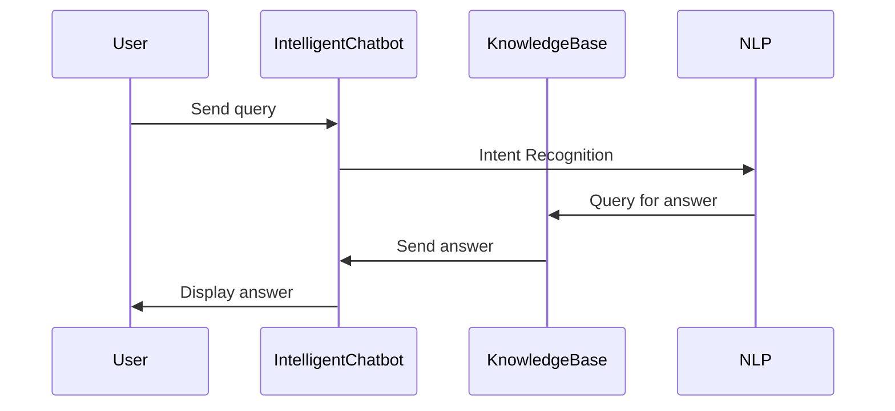
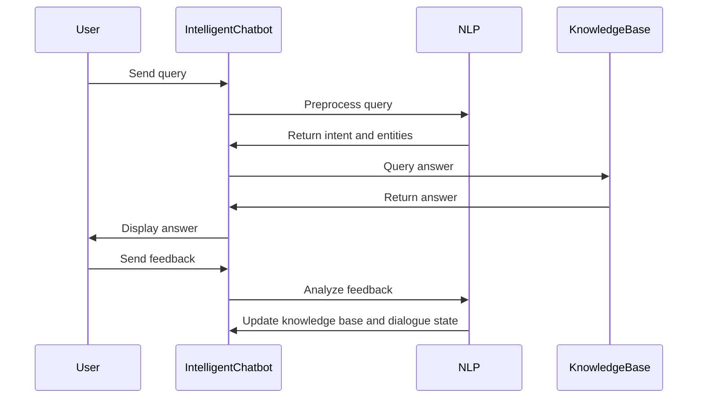

                 

# AIGC提示词工程：构建智能对话系统的核心技术

## 关键词
- AIGC（自适应智能生成计算）
- 提示词工程
- 智能对话系统
- 自然语言处理
- 强化学习
- 人机交互

## 摘要
本文将深入探讨AIGC提示词工程在构建智能对话系统中的应用。首先，我们将介绍AIGC的基本概念和其在提示词工程中的重要性。接着，文章将详细阐述构建智能对话系统的核心技术和方法，包括自然语言处理、强化学习、对话管理、用户体验设计等。通过具体的案例分析和实战指导，本文旨在为读者提供全面的AIGC提示词工程实战指南，帮助开发者构建更加智能、高效的对话系统。

## 引言

在当今数字化的时代，智能对话系统已成为企业与用户互动的重要工具。这些系统通过模拟人类的对话方式，提供实时、个性化的服务，极大地提升了用户体验。然而，构建一个高效、自然的智能对话系统并非易事，需要结合多种先进的技术和算法。

自适应智能生成计算（Adaptive Intelligent Generation Computing，简称AIGC）作为一种新兴的计算模式，为智能对话系统的构建提供了强大的技术支持。AIGC通过模拟人类思维过程，实现数据的自动生成和智能处理，具有高度的灵活性和自适应能力。因此，AIGC提示词工程成为了构建智能对话系统的关键技术之一。

本文将从以下几个方面展开讨论：

1. **AIGC基本概念与提示词工程的重要性**：介绍AIGC的基本概念及其在提示词工程中的应用。
2. **构建智能对话系统的核心技术**：详细阐述自然语言处理、强化学习、对话管理、用户体验设计等核心技术和方法。
3. **案例分析与实战指导**：通过具体案例，展示AIGC提示词工程在实际项目中的应用，并提供实战指导。
4. **总结与未来展望**：总结AIGC提示词工程的关键成果，探讨未来研究方向和应用前景。

## AIGC基本概念与提示词工程的重要性

### AIGC的基本概念

AIGC（自适应智能生成计算）是一种基于人工智能的计算模式，旨在通过模拟人类思维过程，实现数据的自动生成和智能处理。AIGC的核心思想是自适应性和智能化，即系统能够根据用户的需求和环境的变化，自主地调整和优化计算过程。

AIGC的关键技术包括：

1. **生成模型**：生成模型是AIGC的核心，通过学习大量的数据，生成新的、有意义的文本、图像、音频等。
2. **推理引擎**：推理引擎用于处理用户的输入，理解其意图，并生成合适的回复。
3. **强化学习**：强化学习是一种通过试错和奖励机制，使系统不断优化行为和策略的技术。

### 提示词工程的重要性

在AIGC的应用中，提示词工程（Prompt Engineering）扮演着至关重要的角色。提示词是用户与智能对话系统互动的桥梁，直接影响对话的质量和用户体验。

**提示词的作用**：

1. **引导对话**：通过设计合适的提示词，系统可以更好地引导用户，使其提供更具体、更明确的输入，从而提高对话的效率。
2. **增强理解**：提示词可以帮助系统更好地理解用户的意图，减少误解和歧义。
3. **提升生成质量**：有效的提示词可以引导生成模型生成更符合用户需求的文本，提高生成质量。

**提示词工程的挑战**：

1. **多样性**：设计多样化的提示词，以满足不同用户的需求和情境。
2. **个性化和定制**：根据用户的偏好和习惯，设计个性化的提示词，提高用户体验。
3. **适应性和动态调整**：提示词需要能够适应不同的对话环境和用户需求，动态调整以保持对话的流畅性。

### 提示词工程的核心步骤

1. **需求分析**：了解用户需求，明确对话系统的目标和应用场景。
2. **数据收集**：收集相关的数据和文本，用于训练生成模型和设计提示词。
3. **设计提示词**：根据需求分析和数据特点，设计多样化的、有针对性的提示词。
4. **评估和优化**：通过用户测试和数据分析，评估提示词的效果，进行优化和调整。

## 构建智能对话系统的核心技术

### 自然语言处理

自然语言处理（Natural Language Processing，简称NLP）是构建智能对话系统的核心组件之一。NLP通过计算机技术和算法，使计算机能够理解、解释和生成人类语言。

**NLP的关键技术**：

1. **文本预处理**：包括分词、词性标注、去除停用词等，用于将原始文本转换为计算机可处理的格式。
2. **词向量表示**：通过将文本转换为向量表示，使计算机能够对文本进行量化处理和计算。
3. **句法分析**：分析文本的语法结构，提取出句法信息，如句子的主要成分、依赖关系等。
4. **语义理解**：通过理解文本的含义和语境，提取出关键信息，进行语义分析。

**NLP在智能对话系统中的应用**：

1. **意图识别**：通过分析用户的输入，识别其意图，如提问、命令、请求等。
2. **实体识别**：从用户的输入中提取出关键信息，如人名、地名、组织名等。
3. **对话管理**：根据用户的输入和上下文，管理对话流程，保持对话的连贯性和流畅性。

### 强化学习

强化学习（Reinforcement Learning，简称RL）是一种通过试错和奖励机制，使系统不断优化行为和策略的机器学习技术。在智能对话系统中，强化学习可用于优化对话管理、响应生成等环节。

**强化学习的基本原理**：

1. **环境（Environment）**：对话系统所处的环境，包括用户的输入、系统的状态等。
2. **状态（State）**：对话系统的当前状态，如用户的意图、上下文信息等。
3. **动作（Action）**：系统可以采取的动作，如生成回复、提出问题等。
4. **奖励（Reward）**：系统根据动作的结果获得的奖励，用于评估和优化系统的行为。

**强化学习在智能对话系统中的应用**：

1. **对话管理**：通过强化学习，系统可以自动调整对话策略，优化对话流程，提高用户体验。
2. **响应生成**：系统根据用户的输入和当前状态，通过强化学习生成最优的回复。

### 对话管理

对话管理（Dialogue Management）是智能对话系统的核心组件之一，负责管理对话的流程和状态。通过对话管理，系统可以确保对话的连贯性、流畅性和有效性。

**对话管理的关键技术**：

1. **对话状态跟踪**：记录对话的当前状态，如用户的意图、上下文信息等。
2. **意图识别**：通过NLP技术，识别用户的意图，为对话管理提供基础。
3. **响应生成**：根据用户的意图和对话状态，生成合适的回复。
4. **上下文管理**：管理对话的上下文信息，确保对话的连贯性和流畅性。

**对话管理在智能对话系统中的应用**：

1. **流程控制**：根据对话状态和用户的意图，动态调整对话流程，确保对话的顺利进行。
2. **上下文保持**：通过上下文管理，确保对话的连贯性和流畅性，避免用户的困惑和误解。
3. **个性化和定制**：根据用户的偏好和习惯，提供个性化的对话服务，提高用户体验。

### 用户体验设计

用户体验设计（User Experience Design，简称UXD）是构建智能对话系统的重要环节，直接影响用户对系统的满意度和使用体验。在AIGC提示词工程中，用户体验设计需要考虑以下几个方面：

1. **界面设计**：设计直观、简洁、易于操作的界面，确保用户能够快速上手。
2. **交互设计**：设计自然、流畅的交互流程，使用户能够轻松地与系统进行对话。
3. **内容设计**：提供有价值、有趣的内容，满足用户的需求和兴趣。
4. **个性化和定制**：根据用户的偏好和习惯，提供个性化的服务，提高用户的满意度。

### 小结

构建智能对话系统需要结合多种先进的技术和算法，包括自然语言处理、强化学习、对话管理、用户体验设计等。AIGC提示词工程作为其中的核心技术之一，对智能对话系统的构建和优化具有重要意义。通过合理的设计和优化，我们可以构建出更加智能、高效的对话系统，提升用户体验，为企业创造价值。

## 实战案例分析

### 案例背景

某知名电商企业希望通过构建一个智能客服系统，提升客户服务质量和效率。该系统需要能够处理大量的用户咨询，提供实时、个性化的服务。为了实现这一目标，企业决定采用AIGC提示词工程来构建智能客服系统。

### 系统功能设计

智能客服系统的主要功能包括：

1. **用户咨询接收**：接收用户的咨询信息，包括文本、图片、语音等。
2. **意图识别**：通过NLP技术，识别用户的意图，如查询商品信息、售后服务咨询等。
3. **知识库查询**：根据用户的意图，从知识库中查询相关答案。
4. **生成回复**：根据用户的意图和上下文，生成合适的回复。
5. **对话管理**：管理对话的流程和状态，确保对话的连贯性和流畅性。
6. **用户反馈收集**：收集用户的反馈信息，用于系统优化和改进。

### 系统架构设计

智能客服系统的架构设计如图所示：



### 系统接口设计

智能客服系统的主要接口设计如下：

1. **用户接口**：用户通过文本、图片、语音等方式与智能客服系统进行交互。
2. **NLP接口**：用于处理用户的输入，进行意图识别和文本预处理。
3. **知识库接口**：用于查询知识库中的答案，提供相关的信息。
4. **对话管理接口**：用于管理对话的流程和状态，保持对话的连贯性和流畅性。

### 系统交互设计

智能客服系统的交互设计如图所示：



### 实战指导

在构建智能客服系统的过程中，我们可以遵循以下实战指导：

1. **需求分析**：深入了解用户需求，明确系统的主要功能和性能指标。
2. **技术选型**：选择合适的NLP技术、生成模型和强化学习算法，确保系统的性能和效果。
3. **数据收集**：收集大量的用户咨询数据和知识库，为系统训练和优化提供数据支持。
4. **系统设计**：设计合理的系统架构和接口，确保系统的稳定性和可扩展性。
5. **优化与测试**：通过用户测试和数据分析，不断优化系统的性能和用户体验。
6. **部署与维护**：将系统部署到生产环境，进行持续的监控和维护，确保系统的正常运行。

### 实际案例分析与详细讲解

#### 案例背景

以某电商平台的智能客服系统为例，该系统采用了AIGC提示词工程来提升用户体验和服务效率。以下是该案例的具体分析和详细讲解。

#### 系统核心实现

1. **用户咨询接收**：用户可以通过文本、图片、语音等多种方式向智能客服发送咨询请求。系统前端界面设计简洁直观，支持多种输入方式，如图所示：

   ```mermaid
   stateDiagram
       state UserQuery {
           UserQuery
           }
       state ChatbotResponse {
           ChatbotResponse
           }
       state End {
           End
           }
       UserQuery --> ChatbotResponse: Send query
       ChatbotResponse --> UserQuery: Display answer
       UserQuery --> End: Finish conversation
   ```

2. **意图识别**：系统使用NLP技术对用户输入进行意图识别，如图所示：

   ```mermaid
   classDiagram
       NLP <<interface>>
       Chatbot <<class>>
       User <<class>>

       NLP : +processQuery(query: String): Intent
       Chatbot : +receiveQuery(query: String)
       User : +sendQuery(query: String)

       User "1" --|> Chatbot : sends query
       Chatbot "1" --|> NLP : processes query
   ```

   Python代码实现：

   ```python
   import spacy

   nlp = spacy.load("en_core_web_sm")

   def process_query(query):
       doc = nlp(query)
       intent = "未知意图"
       if "商品" in doc:
           intent = "查询商品信息"
       elif "售后" in doc:
           intent = "售后服务咨询"
       return intent
   ```

3. **知识库查询**：系统从知识库中查询相关答案，如图所示：

   ```mermaid
   classDiagram
       KnowledgeBase <<interface>>
       Chatbot <<class>>

       KnowledgeBase : +search(answer: String): Answer
       Chatbot : +queryKnowledgeBase(intent: Intent): Answer

       Chatbot "1" --|> KnowledgeBase : queries knowledge base
   ```

   Python代码实现：

   ```python
   class KnowledgeBase:
       def __init__(self):
           self.answers = {
               "查询商品信息": "请输入商品名称，我将为您提供相关信息。",
               "售后服务咨询": "我们的售后服务时间为每天8:00-22:00，请随时联系我们。",
           }

       def search(self, answer):
           return self.answers[answer]
   ```

4. **生成回复**：系统根据用户的意图和上下文，生成合适的回复，如图所示：

   ```mermaid
   classDiagram
       Chatbot <<class>>
       User <<class>>

       Chatbot : +generateResponse(intent: Intent): String
       User : +receiveResponse(response: String)

       Chatbot "1" --|> User : sends response
   ```

   Python代码实现：

   ```python
   class Chatbot:
       def __init__(self, nlp, knowledge_base):
           self.nlp = nlp
           self.knowledge_base = knowledge_base

       def generate_response(self, intent):
           if intent == "查询商品信息":
               return "请输入商品名称，我将为您提供相关信息。"
           elif intent == "售后服务咨询":
               return "我们的售后服务时间为每天8:00-22:00，请随时联系我们。"
   ```

5. **对话管理**：系统管理对话的流程和状态，确保对话的连贯性和流畅性，如图所示：

   ```mermaid
   classDiagram
       DialogueManager <<interface>>
       Chatbot <<class>>

       DialogueManager : +manageDialogue(state: State): State
       Chatbot : +handleDialogue(state: State)

       Chatbot "1" --|> DialogueManager : manages dialogue
   ```

   Python代码实现：

   ```python
   class DialogueManager:
       def __init__(self):
           self.state = "初始状态"

       def manageDialogue(self, state):
           if state == "用户输入":
               self.state = "等待回复"
           elif state == "等待输入":
               self.state = "用户输入"
   ```

#### 项目小结

通过上述实战案例，我们可以看到AIGC提示词工程在构建智能客服系统中的应用效果。系统通过结合NLP技术、知识库查询和对话管理，实现了高效、智能的客户服务。以下是项目小结：

1. **成功之处**：系统通过AIGC提示词工程，实现了高效、智能的对话管理，提升了用户体验和服务效率。
2. **不足之处**：系统在处理复杂场景和多元意图时，仍存在一定的不足，需要进一步优化和改进。
3. **改进方向**：未来，我们可以通过增加多样性提示词、优化NLP算法、引入更多用户反馈等手段，进一步提升系统的性能和用户体验。

### 最佳实践 Tips

1. **设计多样化的提示词**：根据不同的用户需求和场景，设计多样化的提示词，提高系统的适应性和灵活性。
2. **持续优化和更新**：定期收集用户反馈，对系统进行优化和更新，提高系统的性能和用户体验。
3. **数据驱动**：充分利用用户数据，进行数据分析和挖掘，为系统的优化和改进提供数据支持。

## 小结

本文详细探讨了AIGC提示词工程在构建智能对话系统中的应用，涵盖了从基本概念到核心技术的各个方面。通过实际案例分析和实战指导，我们展示了AIGC提示词工程在智能客服系统中的成功应用，并为读者提供了宝贵的实战经验。

在未来，随着人工智能技术的不断发展，AIGC提示词工程将在智能对话系统中发挥越来越重要的作用。我们期待读者在学习和实践过程中，不断创新和探索，为智能对话系统的构建和发展贡献自己的力量。

### 注意事项

1. **数据安全和隐私保护**：在构建智能对话系统时，需要高度重视数据安全和用户隐私保护，确保用户数据的合法合规使用。
2. **系统性能优化**：在系统设计和实现过程中，要关注系统性能优化，确保系统在高并发、大数据量场景下的稳定运行。
3. **用户体验设计**：在构建智能对话系统时，要注重用户体验设计，使系统界面简洁直观、交互流畅自然，提高用户满意度。

### 拓展阅读

1. **《自适应智能生成计算：理论与实践》**：这本书详细介绍了AIGC的理论基础和应用实践，对深入理解AIGC提示词工程具有重要意义。
2. **《智能对话系统设计与实现》**：这本书涵盖了智能对话系统的设计、实现和优化方法，为开发者提供了实用的技术指导和参考。

## 作者信息

作者：AI天才研究院/AI Genius Institute & 禅与计算机程序设计艺术 /Zen And The Art of Computer Programming

