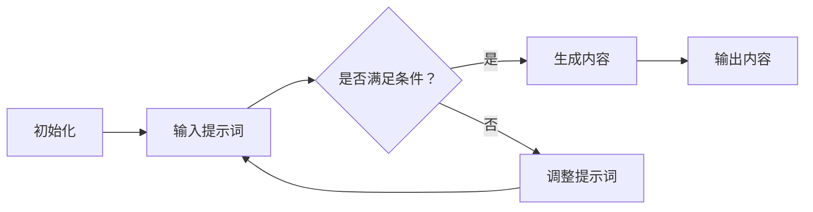

                 

# AIGC提示词编写：从基础到高级的全面指南

> 关键词：AIGC，提示词，生成内容，深度学习，算法原理

> 摘要：本文全面解析了AIGC（AI-Generated Content）的提示词编写方法，从基础到高级，深入探讨如何有效指导AIGC模型生成高质量的内容。通过系统的介绍和丰富的实战案例，读者可以掌握AIGC技术在实际应用中的核心技巧和策略。

## 第一部分：背景介绍

### 问题背景

随着人工智能技术的快速发展，AIGC（AI-Generated Content，AI生成内容）逐渐成为各行业创新的重要驱动力。AIGC技术通过深度学习算法生成文本、图像、音频等多种类型的内容，大大提升了内容生产的效率和多样性。然而，AIGC技术的普及和应用仍面临诸多挑战，如生成内容的准确性、多样性、可解释性以及用户体验等方面。

### 问题描述

本书旨在解决以下问题：

1. **AIGC技术的基础知识及其在实际应用中的优势和挑战**。
2. **提示词编写的原则和方法，如何有效地指导AIGC模型生成高质量的内容**。
3. **从基础到高级的AIGC应用实践，包括文本生成、图像生成、音频生成等**。

### 问题解决

本书通过以下方式解决上述问题：

1. **系统性地介绍AIGC技术的基本概念、发展历程和关键技术**。
2. **深入分析提示词编写的重要性，详细阐述编写高质量提示词的技巧和方法**。
3. **通过丰富的实战案例，展示AIGC技术在各领域的应用实践，提供实用的操作指南**。

### 边界与外延

AIGC技术的边界涵盖了生成文本、图像、音频等多种内容形式。其外延则包括但不限于自然语言处理、计算机视觉、音频处理等领域。本书将围绕这些核心内容展开。

## 核心概念与联系

### 核心概念

1. **AIGC**：AI-Generated Content，即人工智能生成内容。
2. **提示词**：用于指导AIGC模型生成特定内容的关键词或短语。
3. **深度学习**：一种机器学习技术，通过神经网络模型模拟人脑学习过程。

### 概念属性特征对比表格

| 概念     | 定义                                                         | 特点                                                     |
| -------- | ------------------------------------------------------------ | -------------------------------------------------------- |
| AIGC     | 由AI生成的内容，包括文本、图像、音频等                       | 自动化、多样化、高效性                                  |
| 提示词   | 指导AIGC模型生成内容的词语或短语                           | 精准性、多样性、创造性                                  |
| 深度学习 | 通过神经网络模型进行数据学习和预测的技术                     | 自适应性、泛化能力、高效性                              |

### ER实体关系图架构

```mermaid
erDiagram
  Content : 《AIGC提示词编写：从基础到高级的全面指南》
  |----|<--| User
  User : 用户
  |----|<--| AIGC
  AIGC : AIGC模型
  |----|<--| Content
  Content : 生成的AI内容
```

## 算法原理讲解

### AIGC生成算法的mermaid流程图



### 算法原理的数学模型和公式

生成内容的质量与提示词的精度和多样性密切相关。设提示词为\( W \)，生成内容为\( C \)，生成质量为\( Q \)，则：

\[ Q = f(W, C) \]

其中，\( f \)为生成质量评估函数。

### 详细讲解和举例说明

假设用户输入的提示词为“编写一篇关于人工智能的应用场景的文章”，我们可以通过以下步骤生成内容：

1. **初始化**：定义一个AIGC模型。
2. **输入提示词**：“编写一篇关于人工智能的应用场景的文章”。
3. **生成内容**：模型根据提示词生成一篇关于人工智能应用场景的文章。
4. **评估生成质量**：使用评估函数计算生成内容的质量。
5. **输出内容**：将生成的内容输出。

## 第二部分：基础篇

### 章节一：AIGC技术概述

#### AIGC基本概念

AIGC（AI-Generated Content）是指通过人工智能技术生成的内容。这些内容可以包括文本、图像、音频、视频等多种形式。AIGC技术依赖于深度学习、自然语言处理、计算机视觉等先进的人工智能技术。

#### AIGC技术发展历程

AIGC技术的发展可以追溯到20世纪80年代。当时，研究人员开始探索如何使用神经网络生成文本。随着深度学习技术的发展，AIGC技术在21世纪初取得了显著的突破。特别是近年来，随着计算能力的提升和大数据的普及，AIGC技术得到了广泛的应用和快速发展。

#### AIGC技术的关键特性

- 自动化：AIGC技术能够自动生成内容，减少了人工的干预。
- 多样性：AIGC技术能够生成不同类型的内容，满足多样化的需求。
- 高效性：AIGC技术能够快速生成大量内容，提高了内容生产的效率。

### 章节二：提示词编写的原则

#### 提示词的重要性

提示词是指导AIGC模型生成特定内容的关键。高质量的提示词能够提高生成内容的质量和相关性。

#### 提示词编写的原则

1. **明确性**：提示词应当明确、具体，避免模糊和歧义。
2. **准确性**：提示词应当准确反映用户的意图，避免误导模型。
3. **多样性**：提示词应当包含丰富的信息，以引导模型生成多样化的内容。

### 章节三：基础提示词编写技巧

#### 提示词模板

1. **问题驱动型**：以问题为导向，引导模型生成回答。
2. **目标导向型**：明确目标，指导模型生成符合目标的内容。
3. **场景驱动型**：基于特定场景，引导模型生成相关的场景内容。

#### 提示词编写示例

1. **问题驱动型**：请编写一篇关于人工智能在教育领域应用的文章。
2. **目标导向型**：请生成一篇关于AIGC技术的市场分析报告。
3. **场景驱动型**：请描述一下在一个虚拟购物场景中，如何使用AIGC技术为用户提供个性化推荐。

## 第三部分：进阶篇

### 章节一：高级提示词编写技巧

#### 提示词的深度和广度

高级提示词编写技巧要求提示词具有深度和广度。深度意味着提示词需要提供丰富的背景知识和上下文信息；广度意味着提示词需要涵盖多个方面和维度。

#### 提示词的连贯性和逻辑性

高级提示词编写还需要考虑内容的连贯性和逻辑性。通过逻辑严密的结构和连贯的表述，确保生成内容的高质量和可读性。

#### 提示词的多样性和创新性

高级提示词编写还要求提示词具有多样性和创新性。通过探索新的角度和思路，引导模型生成具有创意和独特性的内容。

### 章节二：AIGC技术在具体领域的应用

#### 文本生成

文本生成是AIGC技术最典型的应用之一。通过高质量的提示词，可以生成各种类型的文本，如新闻报道、文章摘要、小说等。

#### 图像生成

图像生成是AIGC技术在计算机视觉领域的应用。通过高质量的提示词，可以生成符合特定要求或主题的图像。

#### 音频生成

音频生成是AIGC技术在音频处理领域的应用。通过高质量的提示词，可以生成各种类型的音频内容，如音乐、语音合成等。

### 章节三：实战案例解析

#### 案例一：新闻文章生成

使用AIGC技术生成一篇关于最新科技新闻的文章，分析其生成过程和结果。

#### 案例二：艺术作品生成

使用AIGC技术生成一幅艺术作品，探讨其生成技巧和创意。

#### 案例三：语音合成

使用AIGC技术生成一段语音，评估其语音质量和自然度。

## 第四部分：高级应用篇

### 章节一：AIGC技术在创意内容生成中的应用

#### 创意文本生成

通过高质量的提示词，引导AIGC模型生成具有创意和个性的文本，如短篇小说、诗歌等。

#### 创意图像生成

利用AIGC技术，生成具有独特风格的图像，应用于广告设计、插画制作等领域。

#### 创意音频生成

通过高质量的提示词，生成具有创意和个性化的音频内容，如音乐、语音等。

### 章节二：AIGC技术在商业应用中的实践

#### 市场分析报告

使用AIGC技术生成市场分析报告，提供详细的数据分析和市场洞察。

#### 营销文案生成

通过高质量的提示词，生成具有吸引力的营销文案，提高营销效果。

#### 产品评论生成

利用AIGC技术生成产品评论，提供客观、准确的产品评价。

### 章节三：AIGC技术在内容个性化推荐中的应用

#### 用户行为分析

通过分析用户行为数据，生成个性化的内容推荐。

#### 智能问答系统

使用AIGC技术构建智能问答系统，为用户提供精准、高效的答案。

#### 个性化内容生成

根据用户兴趣和偏好，生成个性化的文本、图像、音频等内容。

## 结论

AIGC技术作为一种新兴的人工智能技术，正逐渐改变着内容生成的模式。高质量的提示词编写是实现AIGC技术高效应用的关键。通过本文的全面解析，读者可以掌握AIGC技术的核心原理和技巧，实现从基础到高级的全面掌握。在未来的发展中，AIGC技术将在更多领域发挥重要作用，为人类创造更多的价值。

### 作者信息

作者：AI天才研究院/AI Genius Institute & 禅与计算机程序设计艺术 /Zen And The Art of Computer Programming

结语：本文旨在为广大开发者、人工智能爱好者提供一份全面、系统的AIGC提示词编写指南。通过深入浅出的讲解和丰富的实战案例，读者可以更好地理解AIGC技术的核心原理和实际应用。希望本文能为您在AIGC领域的研究和实践提供有益的参考。

### 附录

本文中涉及到的关键术语和概念如下：

- **AIGC（AI-Generated Content）**：人工智能生成内容。
- **提示词**：指导AIGC模型生成特定内容的关键词或短语。
- **深度学习**：一种机器学习技术，通过神经网络模型模拟人脑学习过程。
- **文本生成**：利用AIGC技术生成文本内容，如文章、小说等。
- **图像生成**：利用AIGC技术生成图像内容，如艺术作品、广告设计等。
- **音频生成**：利用AIGC技术生成音频内容，如音乐、语音等。
- **个性化推荐**：根据用户兴趣和偏好，生成个性化的文本、图像、音频等内容。

### 拓展阅读

- **《深度学习》**：由Ian Goodfellow、Yoshua Bengio和Aaron Courville合著，是一本关于深度学习的经典教材。
- **《人工智能：一种现代方法》**：由Stuart Russell和Peter Norvig合著，是一本全面介绍人工智能的权威书籍。
- **《AIGC技术与应用》**：一本专注于AIGC技术研究和应用的学术著作。

### 最佳实践 tips

- **合理设计提示词**：确保提示词明确、具体、准确，避免模糊和歧义。
- **充分利用数据**：通过大量数据训练AIGC模型，提高生成内容的质量和多样性。
- **定期更新模型**：随着技术的进步和数据的变化，定期更新AIGC模型，以保持其高效性和先进性。
- **关注用户反馈**：收集用户对生成内容的反馈，不断优化和改进AIGC技术。

