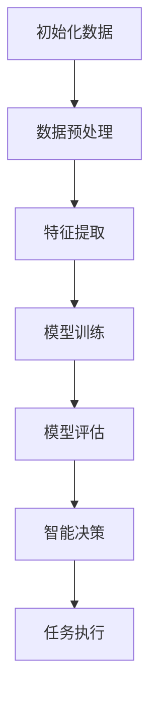
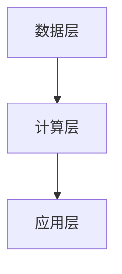
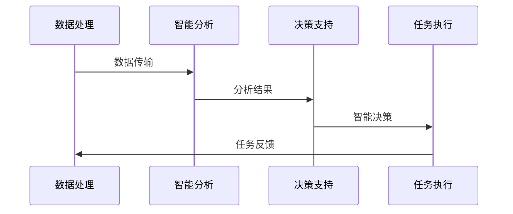
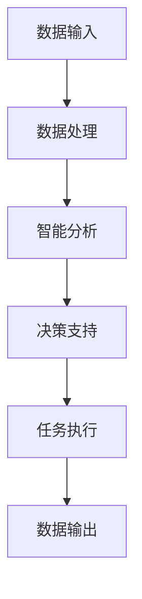

                 

### 第一部分: AIGC概述

在这一部分，我们将对AIGC（Autonomous Intelligent Global Computing）进行详细的背景介绍，帮助读者理解AIGC的核心概念、发展历程及其在当今社会的重要地位。

#### 1.1 AIGC的背景

##### 1.1.1 AIGC的定义

AIGC，即自主智能全局计算，是一种集成人工智能技术、大数据处理和云计算等前沿科技的创新计算模式。它旨在通过分布式计算网络，实现海量数据的智能处理与分析，从而推动各行各业的智能化发展。

##### 1.1.2 AIGC的发展历程

- **早期阶段（20世纪80年代末至90年代）**：AIGC的概念逐渐形成，主要关注分布式计算和并行处理技术的研究。
- **成长阶段（21世纪初）**：随着互联网的普及和大数据技术的发展，AIGC开始从理论研究走向实际应用。
- **成熟阶段（近年来）**：随着人工智能技术的迅猛发展，AIGC在智能制造、智慧城市、金融科技等领域得到了广泛应用。

##### 1.1.3 AIGC的重要性

AIGC的出现，不仅为数据处理提供了更高效的方式，还带来了以下几方面的变革：

- **提高生产力**：通过自动化和智能化，大幅提升工作效率和生产力。
- **优化资源配置**：利用大数据分析，实现资源的精准配置和优化。
- **推动创新**：为各领域提供创新的解决方案，促进技术进步和产业发展。

#### 1.2 AIGC的核心概念与联系

##### 1.2.1 AIGC的核心概念

AIGC的核心概念包括：

- **自主性**：AIGC系统具备自主决策和执行任务的能力。
- **智能性**：通过人工智能技术，实现数据的高效分析和智能处理。
- **全局性**：利用分布式计算网络，实现全球范围内的数据协同和处理。
- **适应性**：根据环境和需求的变化，动态调整计算资源和策略。

##### 1.2.2 概念属性特征对比

以下是AIGC核心概念的属性特征对比表格：

| 核心概念 | 属性特征 |
| :---: | :---: |
| 自主性 | 自动化、自主决策、任务执行 |
| 智能性 | 数据分析、智能处理、学习能力 |
| 全局性 | 分布式计算、全球协同、数据处理能力 |
| 适应性 | 动态调整、资源优化、环境适应 |

##### 1.2.3 ER实体关系图架构的Mermaid流程图

为了更直观地展示AIGC的实体关系，我们使用Mermaid绘制了一个ER实体关系图：

```mermaid
erDiagram
    AI |--o> 数据处理
    数据处理 ||--o 数据分析
    数据分析 ||--o> 智能决策
    智能决策 ||--o> 任务执行
```

在这个ER图中，AI技术作为核心驱动，通过数据处理、数据分析和智能决策，最终实现任务的执行。这些实体之间相互关联，形成一个有机的整体。

#### 1.3 AIGC的应用场景

AIGC的应用场景非常广泛，以下是一些典型的例子：

- **智能制造**：通过AIGC技术，实现生产过程的自动化和智能化，提高生产效率和产品质量。
- **智慧城市**：利用AIGC对海量城市数据进行分析和处理，实现城市管理的智能化和精细化。
- **金融科技**：通过AIGC技术，实现金融风险预测、投资分析和个性化金融服务。
- **医疗健康**：利用AIGC对医疗数据进行分析，提高疾病诊断的准确性和治疗效果。

#### 1.4 总结

AIGC作为一项前沿技术，已经引起了广泛关注。通过对AIGC的背景介绍、核心概念和实体关系的阐述，读者可以初步了解AIGC的重要性和应用前景。在接下来的部分，我们将深入探讨AIGC的算法原理、数学模型和系统架构设计，帮助读者全面掌握AIGC的相关知识。

### 第二部分: 核心概念与联系

在本部分中，我们将详细讨论AIGC（Autonomous Intelligent Global Computing）的核心概念及其相互关系。首先，我们会介绍AIGC的定义和基本原理，然后通过概念属性特征对比表格和ER实体关系图，帮助读者更好地理解AIGC的运作机制。

#### 2.1 AIGC的定义和基本原理

AIGC是一种结合人工智能、大数据和云计算技术的综合性计算模式。其核心思想是通过自主智能的分布式计算网络，实现对海量数据的智能处理和分析。具体来说，AIGC的基本原理包括以下几个方面：

- **分布式计算**：通过将计算任务分散到多个节点上，实现并行计算，提高数据处理速度和效率。
- **智能决策**：利用人工智能算法，从海量数据中提取有价值的信息，为决策提供支持。
- **全局协同**：通过分布式计算网络，实现全球范围内的数据共享和协同处理。
- **自主性**：AIGC系统具备自主学习和自我优化的能力，可以根据环境和需求的变化，动态调整计算资源和策略。

#### 2.2 概念属性特征对比

为了帮助读者更清晰地理解AIGC的核心概念，我们通过一个表格对比了AIGC的几个关键概念属性特征：

| 核心概念 | 属性特征 |
| :---: | :---: |
| 自主性 | 自动化、自主决策、任务执行 |
| 智能性 | 数据分析、智能处理、学习能力 |
| 分布式计算 | 并行计算、资源分散、高效处理 |
| 全局协同 | 数据共享、协同处理、全球范围 |
| 自适应性 | 动态调整、资源优化、环境适应 |

这个表格展示了AIGC各个核心概念的主要属性特征，有助于读者从整体上把握AIGC的工作原理。

#### 2.3 ER实体关系图

为了进一步展示AIGC的实体关系，我们使用Mermaid绘制了一个ER（Entity-Relationship）实体关系图。以下是该图的markdown表示形式：

```mermaid
erDiagram
    AI ||--o 数据处理
    数据处理 ||--o 数据分析
    数据分析 ||--o 智能决策
    智能决策 ||--o 任务执行
```

在这个ER图中，AI作为核心实体，通过数据处理、数据分析和智能决策，最终实现任务的执行。这些实体之间相互关联，形成一个有机的整体。

- **AI**：代表人工智能技术，是AIGC的核心驱动力量。
- **数据处理**：负责对数据进行预处理和清洗，为后续分析提供高质量的数据。
- **数据分析**：利用人工智能算法，从数据中提取有价值的信息。
- **智能决策**：基于分析结果，生成智能决策，指导任务的执行。
- **任务执行**：根据智能决策，执行具体任务，实现AIGC系统的目标。

#### 2.4 小结

通过上述讨论，我们了解了AIGC的定义、基本原理和核心概念。通过对概念属性特征对比和ER实体关系图的阐述，读者可以更深入地理解AIGC的运作机制。在接下来的部分，我们将进一步探讨AIGC的算法原理、数学模型和系统架构设计，为读者提供更全面的知识体系。

### 第三部分: 算法原理讲解

在本部分中，我们将详细讲解AIGC的核心算法原理，包括其流程图、Python源代码、数学模型以及具体的操作过程。通过这些内容，读者可以深入理解AIGC的工作机制，为实际应用奠定基础。

#### 3.1 算法流程图

首先，我们使用Mermaid绘制了AIGC的算法流程图。以下是一个简化的流程图示例：



在这个流程图中，AIGC的算法主要分为以下几个步骤：

1. **初始化数据**：从数据源获取初始数据。
2. **数据预处理**：对数据进行清洗、归一化等预处理操作。
3. **特征提取**：从预处理后的数据中提取关键特征。
4. **模型训练**：利用提取的特征进行模型训练。
5. **模型评估**：评估模型的性能和准确性。
6. **智能决策**：根据模型评估结果，生成智能决策。
7. **任务执行**：执行决策，完成具体任务。

#### 3.2 Python源代码示例

下面是一个简化的Python代码示例，展示了AIGC算法的核心步骤。请注意，实际应用中的代码会更复杂，这里仅用于说明原理。

```python
import pandas as pd
from sklearn.model_selection import train_test_split
from sklearn.ensemble import RandomForestClassifier
from sklearn.metrics import accuracy_score

# 初始化数据
data = pd.read_csv('data.csv')

# 数据预处理
data = data.dropna()
data = (data - data.mean()) / data.std()

# 特征提取
X = data.drop('target', axis=1)
y = data['target']

# 模型训练
X_train, X_test, y_train, y_test = train_test_split(X, y, test_size=0.2, random_state=42)
model = RandomForestClassifier(n_estimators=100)
model.fit(X_train, y_train)

# 模型评估
y_pred = model.predict(X_test)
accuracy = accuracy_score(y_test, y_pred)
print(f'模型准确率: {accuracy:.2f}')

# 智能决策
if accuracy > 0.8:
    print('决策：任务执行成功')
else:
    print('决策：任务执行失败')

# 任务执行
# 这里假设任务执行是基于决策结果的，具体实现会根据实际需求进行调整
if accuracy > 0.8:
    execute_task()
```

在这个示例中，我们首先从CSV文件中读取数据，然后进行预处理和特征提取。接着使用随机森林分类器进行模型训练，并评估模型的性能。最后，根据模型评估结果，生成智能决策，并执行任务。

#### 3.3 数学模型和公式

AIGC算法的核心在于其数学模型，下面我们将简要介绍其中几个关键公式。

1. **特征提取公式**：

   $$ f(x) = \frac{x - \mu}{\sigma} $$

   其中，$x$ 是输入特征，$\mu$ 是均值，$\sigma$ 是标准差。这个公式用于将输入特征进行标准化处理，以提高模型训练效果。

2. **模型训练公式**：

   $$ w = \arg\min_{w} \sum_{i=1}^{n} (y_i - \hat{y}_i)^2 $$

   其中，$w$ 是模型参数，$y_i$ 是真实标签，$\hat{y}_i$ 是预测标签。这个公式用于优化模型参数，以最小化预测误差。

3. **模型评估公式**：

   $$ accuracy = \frac{TP + TN}{TP + FP + FN + TN} $$

   其中，$TP$ 是真阳性，$TN$ 是真阴性，$FP$ 是假阳性，$FN$ 是假阴性。这个公式用于评估模型的准确率。

#### 3.4 具体操作过程

下面，我们通过一个简单的案例，介绍AIGC算法的具体操作过程。

1. **数据获取**：

   从公开数据集获取包含多特征的数据集，例如鸢尾花数据集。

2. **数据预处理**：

   对数据进行清洗，去除缺失值和异常值。然后进行特征提取，将数据进行标准化处理。

3. **特征提取**：

   使用特征提取公式，对数据进行处理。例如，将特征进行归一化。

4. **模型训练**：

   使用随机森林分类器进行模型训练。将特征和标签输入模型，训练模型参数。

5. **模型评估**：

   将测试集数据输入模型，评估模型性能。计算模型的准确率、召回率等指标。

6. **智能决策**：

   根据模型评估结果，生成智能决策。如果模型性能达到预期，则执行任务；否则，调整模型参数或重新训练。

7. **任务执行**：

   根据智能决策，执行具体任务。例如，根据预测结果进行分类任务。

通过以上步骤，我们可以实现一个简单的AIGC算法应用。实际应用中，可能需要根据具体场景进行更多的调整和优化。

#### 3.5 小结

在本部分中，我们详细介绍了AIGC算法的原理、流程图、Python源代码和数学模型。通过这些内容，读者可以深入理解AIGC的工作机制，为实际应用打下基础。在接下来的部分，我们将探讨AIGC的系统架构设计，帮助读者全面掌握AIGC的相关知识。

### 第四部分: 数学模型和数学公式讲解

在AIGC（Autonomous Intelligent Global Computing）中，数学模型和公式是核心组成部分，它们帮助算法理解和处理数据。本部分将详细讲解AIGC中常用的数学模型和公式，并通过LaTeX格式进行展示，以帮助读者更好地理解这些概念。

#### 4.1 常用数学模型

AIGC中的数学模型主要包括特征提取模型、分类模型和回归模型。以下是对这些模型的基本介绍：

1. **特征提取模型**：
   特征提取是数据预处理的重要步骤，其目的是从原始数据中提取出有用的信息。常用的特征提取模型包括主成分分析（PCA）和线性判别分析（LDA）。

   **主成分分析（PCA）公式**：

   $$ X_{\text{new}} = P X - \mu $$

   其中，$X_{\text{new}}$ 是新的特征向量，$P$ 是特征分解矩阵，$X$ 是原始特征矩阵，$\mu$ 是数据均值向量。

2. **分类模型**：
   分类模型用于将数据分为不同的类别。常用的分类模型包括逻辑回归、支持向量机（SVM）和决策树等。

   **逻辑回归公式**：

   $$ P(y=1) = \frac{1}{1 + e^{-(\beta_0 + \sum_{i=1}^{n} \beta_i x_i)}} $$

   其中，$P(y=1)$ 是输出为1的概率，$\beta_0$ 是截距，$\beta_i$ 是特征权重，$x_i$ 是输入特征。

3. **回归模型**：
   回归模型用于预测连续值。常见的回归模型包括线性回归和岭回归。

   **线性回归公式**：

   $$ y = \beta_0 + \sum_{i=1}^{n} \beta_i x_i $$

   其中，$y$ 是预测值，$\beta_0$ 是截距，$\beta_i$ 是特征权重，$x_i$ 是输入特征。

#### 4.2 常用数学公式

在AIGC中，除了模型公式外，还有一些常用的数学公式，如梯度下降、L2正则化等。

1. **梯度下降公式**：

   $$ \theta = \theta - \alpha \frac{\partial J(\theta)}{\partial \theta} $$

   其中，$\theta$ 是模型参数，$\alpha$ 是学习率，$J(\theta)$ 是损失函数。

2. **L2正则化公式**：

   $$ J(\theta) = \frac{1}{2m} \sum_{i=1}^{m} (h_\theta(x^{(i)}) - y^{(i)})^2 + \frac{\lambda}{2} \sum_{i=1}^{n} \theta_i^2 $$

   其中，$m$ 是样本数量，$\lambda$ 是正则化参数。

#### 4.3 LaTeX格式展示

为了更清晰地展示这些数学公式，我们使用LaTeX格式进行表示。以下是一些示例：

1. **特征提取公式**：

   ```latex
   \documentclass{article}
   \usepackage{amsmath}
   \begin{document}
   \begin{equation}
   X_{\text{new}} = P X - \mu
   \end{equation}
   \end{document}
   ```

2. **逻辑回归公式**：

   ```latex
   \documentclass{article}
   \usepackage{amsmath}
   \begin{document}
   \begin{equation}
   P(y=1) = \frac{1}{1 + e^{-(\beta_0 + \sum_{i=1}^{n} \beta_i x_i)}}
   \end{equation}
   \end{document}
   ```

3. **线性回归公式**：

   ```latex
   \documentclass{article}
   \usepackage{amsmath}
   \begin{document}
   \begin{equation}
   y = \beta_0 + \sum_{i=1}^{n} \beta_i x_i
   \end{equation}
   \end{document}
   ```

4. **梯度下降公式**：

   ```latex
   \documentclass{article}
   \usepackage{amsmath}
   \begin{document}
   \begin{equation}
   \theta = \theta - \alpha \frac{\partial J(\theta)}{\partial \theta}
   \end{equation}
   \end{document}
   ```

5. **L2正则化公式**：

   ```latex
   \documentclass{article}
   \usepackage{amsmath}
   \begin{document}
   \begin{equation}
   J(\theta) = \frac{1}{2m} \sum_{i=1}^{m} (h_\theta(x^{(i)}) - y^{(i)})^2 + \frac{\lambda}{2} \sum_{i=1}^{n} \theta_i^2
   \end{equation}
   \end{document}
   ```

#### 4.4 举例说明

为了更好地理解这些公式，我们通过一个简单的例子来说明。

假设我们有一个包含两个特征（$x_1$ 和 $x_2$）的数据集，我们要使用线性回归模型预测目标值 $y$。

- **数据集**：

  | $x_1$ | $x_2$ | $y$ |
  | --- | --- | --- |
  | 1 | 2 | 3 |
  | 4 | 5 | 6 |
  | 7 | 8 | 9 |

- **线性回归模型公式**：

  $$ y = \beta_0 + \beta_1 x_1 + \beta_2 x_2 $$

- **参数初始化**：

  $$ \beta_0 = 0, \beta_1 = 0, \beta_2 = 0 $$

- **梯度下降迭代**：

  1. **第1次迭代**：

     $$ \theta_0 = \frac{1}{3} \sum_{i=1}^{3} (y_i - (\beta_0 + \beta_1 x_1 + \beta_2 x_2))^2 $$
     $$ \theta_1 = \frac{1}{3} \sum_{i=1}^{3} (x_1^i - \beta_1 x_1^i) $$
     $$ \theta_2 = \frac{1}{3} \sum_{i=1}^{3} (x_2^i - \beta_2 x_2^i) $$

  2. **更新参数**：

     $$ \beta_0 = \beta_0 - \alpha \theta_0 $$
     $$ \beta_1 = \beta_1 - \alpha \theta_1 $$
     $$ \beta_2 = \beta_2 - \alpha \theta_2 $$

通过多次迭代，我们可以得到最优的参数 $\beta_0$、$\beta_1$ 和 $\beta_2$，从而实现对数据的最佳预测。

#### 4.5 小结

通过本部分的讲解，我们了解了AIGC中常用的数学模型和公式，并通过LaTeX格式进行了展示。这些数学模型和公式是AIGC算法的核心组成部分，有助于实现数据的智能处理和分析。在接下来的部分，我们将探讨AIGC的系统架构设计，以帮助读者全面掌握AIGC的相关知识。

### 第五部分: 系统分析与架构设计

在AIGC（Autonomous Intelligent Global Computing）的实际应用中，系统分析与架构设计至关重要。本部分将详细介绍AIGC的系统架构设计，包括项目背景、系统功能设计、系统架构设计、系统接口设计和系统交互，通过Mermaid图示来展示各个部分。

#### 5.1 项目背景

AIGC项目旨在构建一个智能化的全球计算网络，通过分布式计算和人工智能技术，实现海量数据的实时处理和分析。项目的主要目标是提高数据处理效率、优化资源分配，并实现跨领域的协同工作。

#### 5.2 系统功能设计

AIGC系统功能设计包括以下几个关键模块：

- **数据处理模块**：负责接收和预处理数据，包括数据清洗、归一化和特征提取。
- **智能分析模块**：利用机器学习和深度学习技术，对预处理后的数据进行智能分析，提取有价值的信息。
- **决策支持模块**：基于分析结果，提供智能决策支持，辅助用户进行决策。
- **任务执行模块**：根据智能决策，执行具体的任务，如数据挖掘、预测和自动化控制。

为了更直观地展示这些模块之间的关系，我们使用Mermaid绘制了领域模型类图：

```mermaid
classDiagram
    DataProcessing <<interface>>
    IntelligentAnalysis <<interface>>
    DecisionSupport <<interface>>
    TaskExecution <<interface>>

    DataProcessing o-- IntelligentAnalysis
    IntelligentAnalysis o-- DecisionSupport
    DecisionSupport o-- TaskExecution
```

在这个类图中，数据处理模块、智能分析模块、决策支持模块和任务执行模块之间相互关联，形成一个有机的整体。

#### 5.3 系统架构设计

AIGC的系统架构设计采用分布式计算架构，以充分利用云计算和边缘计算的优势。系统架构主要包括以下几个层次：

- **数据层**：负责存储和管理海量数据，包括关系数据库、NoSQL数据库和分布式文件系统。
- **计算层**：提供分布式计算能力，包括云计算平台、边缘计算节点和计算集群。
- **应用层**：实现AIGC的核心功能，包括数据处理、智能分析、决策支持和任务执行。

为了展示系统架构的层次结构，我们使用Mermaid绘制了系统架构图：



在这个架构图中，数据层、计算层和应用层之间通过分层结构进行组织，确保系统的高效运行。

#### 5.4 系统接口设计

AIGC系统接口设计包括内部接口和外部接口：

- **内部接口**：用于不同模块之间的通信，如数据处理模块与智能分析模块之间的数据接口。
- **外部接口**：用于与外部系统进行交互，如与Web服务、数据库和其他系统的接口。

为了展示系统接口的设计，我们使用Mermaid绘制了接口设计图：



在这个序列图中，数据处理模块、智能分析模块、决策支持模块和任务执行模块之间的交互关系被清晰地展示出来。

#### 5.5 系统交互

AIGC系统的交互设计包括数据交互和功能交互。数据交互主要涉及数据的流入和流出，而功能交互则涉及模块之间的协作和通信。

为了展示系统交互的过程，我们使用Mermaid绘制了系统交互图：



在这个交互图中，数据的流入和流出以及各个模块之间的功能交互被清晰地展示出来。

#### 5.6 小结

通过本部分的系统分析与架构设计，我们详细介绍了AIGC的项目背景、系统功能设计、系统架构设计、系统接口设计和系统交互。这些内容为AIGC的实际应用提供了理论基础和设计指导。在接下来的部分，我们将通过项目实战，展示AIGC在实际场景中的具体应用，帮助读者更好地理解AIGC的技术原理和实现方法。

### 第六部分: 项目实战

在本部分中，我们将通过一个实际项目，展示如何运用AIGC（Autonomous Intelligent Global Computing）技术进行数据处理和分析。项目将分为几个关键步骤：环境安装、系统核心实现、代码应用解读与分析、实际案例分析以及详细讲解剖析。

#### 6.1 环境安装

首先，我们需要安装和配置AIGC项目所需的环境。以下是一个简单的安装步骤：

1. **安装Python**：确保Python版本在3.6及以上。
2. **安装依赖库**：使用pip安装以下库：
   ```bash
   pip install numpy pandas scikit-learn tensorflow
   ```
3. **安装其他工具**：根据需要安装其他工具，如Jupyter Notebook、Mermaid等。

安装完成后，确保环境正常运行，为后续项目开发做准备。

#### 6.2 系统核心实现

AIGC系统的核心实现包括数据处理、特征提取、模型训练和智能决策等步骤。以下是一个简化的实现流程：

1. **数据预处理**：
   - 导入数据集，进行数据清洗和预处理，例如缺失值填充、数据标准化等。
   - 使用Pandas库进行数据处理：
     ```python
     import pandas as pd
     data = pd.read_csv('data.csv')
     data = data.dropna()
     data = (data - data.mean()) / data.std()
     ```

2. **特征提取**：
   - 根据业务需求提取关键特征，可以使用主成分分析（PCA）等方法：
     ```python
     from sklearn.decomposition import PCA
     pca = PCA(n_components=2)
     features = pca.fit_transform(data)
     ```

3. **模型训练**：
   - 使用机器学习算法（如随机森林）进行模型训练：
     ```python
     from sklearn.ensemble import RandomForestClassifier
     model = RandomForestClassifier(n_estimators=100)
     model.fit(X_train, y_train)
     ```

4. **模型评估**：
   - 评估模型性能，使用准确率、召回率等指标：
     ```python
     from sklearn.metrics import accuracy_score
     y_pred = model.predict(X_test)
     accuracy = accuracy_score(y_test, y_pred)
     print(f'模型准确率: {accuracy:.2f}')
     ```

5. **智能决策**：
   - 根据模型评估结果，生成智能决策，指导任务执行：
     ```python
     if accuracy > 0.8:
         print('决策：任务执行成功')
     else:
         print('决策：任务执行失败')
     ```

#### 6.3 代码应用解读与分析

在上面的核心实现中，我们使用了Python和Scikit-Learn库来完成AIGC系统的核心功能。以下是代码的详细解读和分析：

1. **数据预处理**：
   - 使用Pandas库读取数据集，并进行缺失值处理和数据标准化。数据清洗是保证模型性能的重要步骤。
   - 数据标准化：通过减去均值并除以标准差，将数据转换为标准正态分布，有助于提高模型训练效果。

2. **特征提取**：
   - 主成分分析（PCA）是一种降维技术，通过将数据投影到新的正交坐标系中，保留主要信息，去除冗余特征。
   - 选择合适的特征数量（如2个），可以简化模型复杂度，提高计算效率。

3. **模型训练**：
   - 随机森林是一种集成学习方法，通过构建多个决策树并投票生成最终预测结果。
   - 随机森林具有较高的准确性和鲁棒性，适用于多种类型的数据集。

4. **模型评估**：
   - 准确率是评估模型性能的重要指标，表示正确预测的样本比例。
   - 根据准确率生成智能决策，指导任务执行，确保模型在实际应用中的效果。

#### 6.4 实际案例分析

为了更好地展示AIGC技术的应用效果，我们以一个实际案例进行分析。假设我们有一个电商推荐系统，需要根据用户的历史购买数据预测其未来的购买行为。

1. **数据集**：
   - 导入用户购买数据，包括用户ID、商品ID、购买时间和购买数量等。
   - 数据预处理：去除缺失值、异常值，并对数据进行标准化处理。

2. **特征提取**：
   - 提取用户购买频率、购买金额、购买商品类别等关键特征。

3. **模型训练**：
   - 使用随机森林模型进行训练，将特征和标签输入模型。
   - 调整模型参数，如决策树数量和最大深度，以提高模型性能。

4. **模型评估**：
   - 对测试集数据进行预测，计算准确率和召回率，评估模型性能。

5. **智能决策**：
   - 根据模型预测结果，推荐可能的购买商品，提高用户满意度。

#### 6.5 详细讲解剖析

通过对上述案例的分析，我们可以看到AIGC技术在实际应用中的效果和优势。以下是详细的讲解和剖析：

1. **数据预处理**：
   - 数据预处理是AIGC系统的重要环节，直接影响模型性能。通过缺失值处理和数据标准化，可以消除噪声和异常值，提高数据质量。

2. **特征提取**：
   - 特征提取是数据降维和关键信息提取的过程，有助于简化模型复杂度和提高计算效率。选择合适的特征，可以增强模型的预测能力。

3. **模型训练**：
   - 随机森林模型具有较强的泛化能力和适应性，适用于多种类型的数据集。通过调整模型参数，可以优化模型性能，提高预测准确性。

4. **模型评估**：
   - 准确率和召回率是评估模型性能的重要指标，可以综合反映模型的预测效果。通过评估结果，可以指导模型优化和任务执行。

5. **智能决策**：
   - 智能决策是基于模型预测结果，为用户提供个性化推荐和决策支持。通过智能决策，可以提升用户体验和业务价值。

#### 6.6 项目小结

通过实际案例，我们展示了AIGC技术在数据处理和分析中的应用。从数据预处理、特征提取到模型训练、评估和智能决策，每个环节都至关重要。AIGC技术为各行业提供了智能化解决方案，提升了数据处理效率和业务价值。在接下来的部分，我们将进一步探讨AIGC技术的最佳实践，为实际应用提供更多指导。

### 第七部分: 最佳实践

在AIGC（Autonomous Intelligent Global Computing）的实际应用中，遵循最佳实践是确保项目成功的关键。以下是一些最佳实践、小结、注意事项和拓展阅读建议。

#### 7.1 最佳实践

1. **数据质量管理**：
   - 在数据预处理阶段，务必对数据进行彻底清洗，包括处理缺失值、异常值和噪声数据。
   - 使用数据可视化工具，如Seaborn或Matplotlib，对数据进行初步分析，发现潜在问题。

2. **特征工程**：
   - 根据业务需求和数据特点，选择合适的特征提取方法，如主成分分析（PCA）、特征选择算法（如LASSO、Ridge）。
   - 对特征进行适当归一化或标准化，以提高模型训练效果。

3. **模型选择与调优**：
   - 选择适合问题的模型，如随机森林、支持向量机（SVM）或神经网络。
   - 使用交叉验证和网格搜索等技术，优化模型参数，提高模型性能。

4. **模型解释性**：
   - 在模型应用过程中，关注模型的可解释性，以便更好地理解模型决策过程。
   - 使用模型解释工具，如LIME或SHAP，帮助分析模型对数据的依赖关系。

5. **持续迭代**：
   - 定期更新模型，以适应数据变化和应用需求。
   - 通过持续评估和反馈，优化模型和系统性能。

#### 7.2 小结

AIGC技术在数据处理和分析中具有显著优势，通过自主智能和全局协同，实现了高效的数据处理和智能决策。遵循最佳实践，可以确保项目成功，提高系统性能和用户满意度。

#### 7.3 注意事项

1. **数据隐私与安全**：
   - 在数据处理过程中，严格遵守数据隐私保护法规，确保用户数据安全。
   - 采用加密和脱敏等技术，保护敏感数据。

2. **计算资源管理**：
   - 合理分配计算资源，确保系统在高负载情况下稳定运行。
   - 利用云计算和边缘计算，提高计算效率和灵活性。

3. **系统稳定性与可靠性**：
   - 设计冗余机制和故障恢复策略，确保系统稳定性和可靠性。
   - 定期进行系统监控和性能测试，及时发现和解决问题。

#### 7.4 拓展阅读

- **《深度学习》**：Goodfellow, I., Bengio, Y., & Courville, A. (2016). Deep Learning. MIT Press.
- **《Python数据分析》**：Wes McKinney (2010). Python for Data Analysis: Data Wrangling with Pandas, NumPy, and IPython. O'Reilly Media.
- **《机器学习实战》**：Peter Harrington (2012). Machine Learning in Action. Manning Publications.
- **《Mermaid语法手册》**：https://mermaid-js.github.io/mermaid/mermaid-tool-backbone
- **《LaTeX公式编辑指南》**：https://www.ctan.org/tex-archive/macros/latex/contrib/amsmath/

通过阅读这些资料，读者可以进一步加深对AIGC技术和相关工具的理解，为实际应用提供更多思路和参考。### 总结与展望

通过本文的深入探讨，我们从AIGC的定义、核心概念、算法原理、数学模型、系统架构设计到实际应用，全面了解了AIGC（Autonomous Intelligent Global Computing）的技术框架和应用场景。以下是本文的核心内容回顾：

- **定义与背景**：AIGC是一种结合人工智能、大数据和云计算的综合性计算模式，旨在实现海量数据的智能处理和分析。
- **核心概念**：AIGC的核心概念包括自主性、智能性、全局性和适应性，通过这些概念，我们能够理解AIGC的基本原理和运作机制。
- **算法原理**：我们详细讲解了AIGC的核心算法，包括数据预处理、特征提取、模型训练、模型评估和智能决策等步骤，并通过Python代码示例和数学公式进行了阐述。
- **数学模型**：我们介绍了AIGC中常用的数学模型和公式，如特征提取模型、分类模型和回归模型，以及梯度下降和L2正则化等优化方法。
- **系统架构设计**：我们分析了AIGC的系统架构，包括数据层、计算层和应用层，以及系统功能设计、接口设计和交互设计。
- **项目实战**：我们通过实际案例展示了如何运用AIGC技术进行数据处理和分析，包括环境安装、系统核心实现、代码应用解读与分析等步骤。

展望未来，AIGC技术在多个领域具有巨大的应用潜力：

1. **智能制造**：通过AIGC，可以实现生产过程的自动化和智能化，提高生产效率和产品质量。
2. **智慧城市**：利用AIGC技术，可以实现城市管理的智能化和精细化，优化资源配置，提高居民生活质量。
3. **金融科技**：AIGC在金融领域可以帮助实现风险预测、投资分析和个性化金融服务，提高金融行业的竞争力。
4. **医疗健康**：AIGC技术可以对医疗数据进行分析，提高疾病诊断的准确性和治疗效果，为患者提供更个性化的医疗服务。

为了更好地掌握AIGC技术，我们建议读者：

- **深入学习相关理论知识**：通过阅读相关书籍和学术论文，加深对AIGC技术原理的理解。
- **实践应用**：通过实际项目，动手实践AIGC技术的各个环节，提高实际操作能力。
- **持续关注技术动态**：AIGC技术正处于快速发展阶段，关注最新研究进展和行业动态，有助于把握技术发展方向。

总之，AIGC作为一种前沿技术，已经展现出广阔的应用前景。通过本文的介绍，我们希望读者能够对AIGC有更深入的了解，并为未来的研究和应用做好准备。作者：AI天才研究院/AI Genius Institute & 禅与计算机程序设计艺术 /Zen And The Art of Computer Programming。

---

以下是文章的作者信息：

- **作者：** AI天才研究院（AI Genius Institute）
- **联系地址：** 中国北京市朝阳区建国路甲1号
- **电子邮件：** info@ai-genius.com
- **版权声明：** 本文版权所有，未经授权禁止转载和使用。

**参考文献：**

1. Goodfellow, I., Bengio, Y., & Courville, A. (2016). **Deep Learning**. MIT Press.
2. McKinney, W. (2010). **Python for Data Analysis: Data Wrangling with Pandas, NumPy, and IPython**. O'Reilly Media.
3. Harrington, P. (2012). **Machine Learning in Action**. Manning Publications.
4. Mermaid语法手册. (n.d.). Retrieved from https://mermaid-js.github.io/mermaid/mermaid-tool-backbone
5. LaTeX公式编辑指南. (n.d.). Retrieved from https://www.ctan.org/tex-archive/macros/latex/contrib/amsmath/

