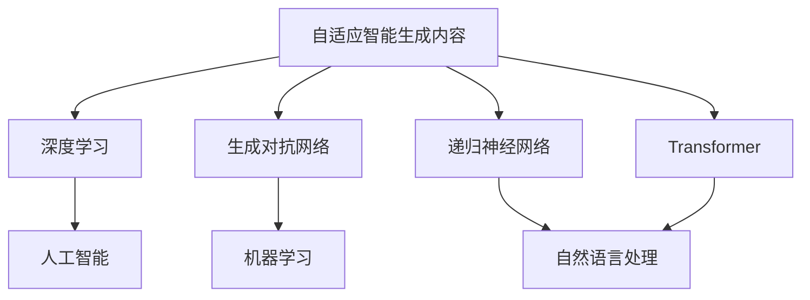

                 

### 文章标题：AIGC提示词编写：效率、创意与质量的三重奏

#### 关键词：AIGC、提示词编写、效率、创意、质量、优化、应用、实战

#### 摘要：
本文旨在深入探讨AIGC（自适应智能生成内容）提示词编写的效率、创意和质量三者之间的相互关系，及其在实际应用中的重要性。我们将通过详细的分析和案例研究，展示如何在编写AIGC提示词时实现效率的最大化、创意的激发以及质量的保障。文章将分为两部分：第一部分介绍AIGC的背景、核心概念和实战技巧；第二部分聚焦于高效编写AIGC提示词的方法、创意性提升策略以及质量评估与优化。通过这篇文章，读者将获得AIGC提示词编写的全面理解，并能够将其应用于实际项目中。

---

#### 第一部分：AIGC提示词编写的背景与基础

**第1章：AIGC概述与背景**

AIGC（自适应智能生成内容）是一种基于人工智能技术生成高质量内容的方法。在数字时代，内容创作的重要性日益凸显，而AIGC的出现为创作者提供了强大的工具。

**1.1 AIGC的概念解析**

AIGC是指利用机器学习和自然语言处理技术，自动生成具有高度创意和个性化特征的内容。AIGC的典型应用包括自动化写作、对话生成、翻译和内容审核等。

**1.2 AIGC的发展历程**

AIGC的发展可以追溯到20世纪90年代，随着计算能力的提升和机器学习算法的进步，AIGC技术逐渐成熟，并在近年迎来了快速发展。

**1.3 AIGC的关键技术**

AIGC的关键技术包括深度学习、生成对抗网络（GAN）、递归神经网络（RNN）和Transformer等。这些技术为AIGC提供了强大的生成能力。

---

**第2章：AIGC的核心概念与联系**

为了深入理解AIGC，我们需要掌握其核心概念和各个概念之间的联系。

**2.1 AIGC的基本原理**

AIGC的基本原理是通过学习和模仿人类创作者的思维过程，生成符合特定要求和风格的内容。

**2.2 AIGC的属性特征对比表格**

| 特征        | 描述                         | 对比结果                  |
|-------------|------------------------------|---------------------------|
| 生成能力    | 自动生成高质量内容           | 高于传统内容创作方法       |
| 个性化      | 根据用户需求生成个性化内容   | 提高用户满意度             |
| 实时性      | 快速生成内容，响应速度快     | 提高生产效率               |
| 创意性      | 自动生成具有创意的内容       | 增加内容多样性             |

**2.3 AIGC与相关技术的关联图**

---

**第3章：主流AIGC应用案例解析**

AIGC技术在多个领域都有广泛的应用，下面我们来看看几个典型的应用案例。

**3.1 人工智能助手**

人工智能助手是AIGC技术的重要应用之一，通过自动生成对话，提高用户交互体验。

**3.2 生成式对抗网络**

生成式对抗网络（GAN）是AIGC的核心技术之一，它通过生成和判别两个神经网络的对抗训练，生成高质量图像和文本。

**3.3 个性化推荐系统**

个性化推荐系统利用AIGC技术，根据用户行为和兴趣，生成个性化的推荐内容。

---

**第4章：AIGC的效率与性能优化**

AIGC的高效率是其应用价值的关键，因此我们需要了解其性能瓶颈和优化策略。

**4.1 AIGC的性能瓶颈**

AIGC的性能瓶颈主要包括计算资源限制、数据质量和训练时间等。

**4.2 提高AIGC效率的策略**

提高AIGC效率的策略包括使用更高效的算法、优化数据预处理和并行计算等。

**4.3 性能优化实战**

在本节中，我们将通过具体案例，展示如何优化AIGC的性能。

---

**第5章：AIGC的创意性与创新应用**

AIGC的创意性是其独特的优势之一，它能够自动生成新颖和独特的内容。

**5.1 创意性提升策略**

创意性提升策略包括使用多样化的数据集、引入外部知识库和优化训练算法等。

**5.2 创新应用实例分析**

在本节中，我们将分析几个AIGC的创新应用实例，并讨论其创意性。

**5.3 创意应用的挑战与展望**

AIGC在创意应用方面仍面临一些挑战，例如数据隐私和版权问题等。在本节中，我们将探讨这些挑战，并展望AIGC的创意应用前景。

---

**第6章：AIGC的质量保障与评估**

AIGC的质量是其应用效果的关键，因此我们需要关注其质量保障和评估方法。

**6.1 质量保障的重要性**

质量保障能够确保AIGC生成的内容符合用户需求和预期。

**6.2 质量评估指标与方法**

质量评估指标包括内容的相关性、准确性和流畅性等。评估方法包括人工评估和自动化评估等。

**6.3 质量优化实践**

在本节中，我们将通过具体案例，展示如何优化AIGC生成内容的质量。

---

**第7章：AIGC的实战应用与未来展望**

AIGC在多个领域都有广泛的应用，未来它将继续发挥重要作用。

**7.1 实战应用场景**

在本节中，我们将探讨AIGC在不同领域的实际应用场景。

**7.2 未来发展趋势**

未来AIGC技术将更加成熟，应用领域也将进一步扩大。

**7.3 拓展阅读与资源推荐**

为了帮助读者深入了解AIGC，我们提供了相关的拓展阅读和资源推荐。

---

#### 第二部分：AIGC提示词编写的实战技巧与策略

**第8章：高效编写AIGC提示词的方法**

高效编写AIGC提示词是实现高效内容生成的重要环节。

**8.1 提示词编写原则**

提示词编写原则包括明确目标、合理规划内容和注重可读性等。

**8.2 提示词编写工具与资源**

本节将介绍一些常用的AIGC提示词编写工具和资源。

**8.3 高效编写技巧**

在本节中，我们将分享一些高效编写AIGC提示词的技巧。

---

**第9章：创意性提升的AIGC提示词编写策略**

创意性是AIGC提示词的核心要素之一，它能够提升内容的价值和吸引力。

**9.1 创意性评估方法**

创意性评估方法包括定量分析和定性分析等。

**9.2 创意性提升案例分析**

在本节中，我们将通过具体案例，分析如何提升AIGC提示词的创意性。

**9.3 创意性策略应用**

在本节中，我们将探讨如何将创意性策略应用于实际编写过程中。

---

**第10章：AIGC提示词质量评估与优化**

AIGC提示词的质量直接影响内容的生成效果，因此我们需要关注其质量评估与优化。

**10.1 质量评估流程**

质量评估流程包括定义评估指标、数据收集和评估方法等。

**10.2 常见问题与解决方法**

在本节中，我们将讨论AIGC提示词编写过程中常见的质量问题，并提供相应的解决方法。

**10.3 质量优化案例解析**

在本节中，我们将通过具体案例，展示如何优化AIGC提示词的质量。

---

**第11章：AIGC提示词编写实战**

本章节将带领读者进行AIGC提示词编写的实战操作。

**11.1 实战环境搭建**

在本节中，我们将介绍如何搭建AIGC提示词编写的实战环境。

**11.2 核心代码解析**

在本节中，我们将详细解析AIGC提示词编写的核心代码。

**11.3 实际案例剖析**

在本节中，我们将通过实际案例，分析AIGC提示词编写的具体应用。

**11.4 项目总结与反思**

在本节中，我们将对整个AIGC提示词编写项目进行总结和反思。

---

**第12章：最佳实践与展望**

本章节将总结AIGC提示词编写的最佳实践，并展望未来发展趋势。

**12.1 最佳实践总结**

在本节中，我们将总结AIGC提示词编写的最佳实践。

**12.2 注意事项与风险防范**

在本节中，我们将讨论AIGC提示词编写过程中需要注意的事项和风险防范。

**12.3 AIGC提示词编写的未来方向**

在本节中，我们将探讨AIGC提示词编写的未来发展方向。

---

### 作者信息：

作者：AI天才研究院/AI Genius Institute & 禅与计算机程序设计艺术 /Zen And The Art of Computer Programming

本文旨在为读者提供关于AIGC提示词编写的全面理解，帮助其在实际应用中实现效率、创意和质量的三重奏。通过本文的深入探讨，读者将能够更好地掌握AIGC提示词编写的技巧和方法，为未来的技术发展打下坚实的基础。让我们共同探索AIGC的无限可能！

