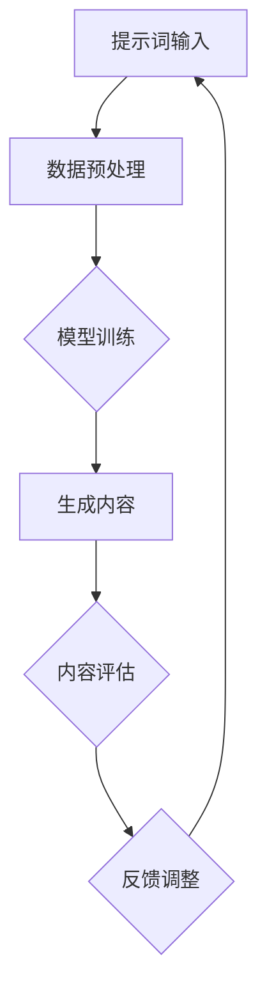
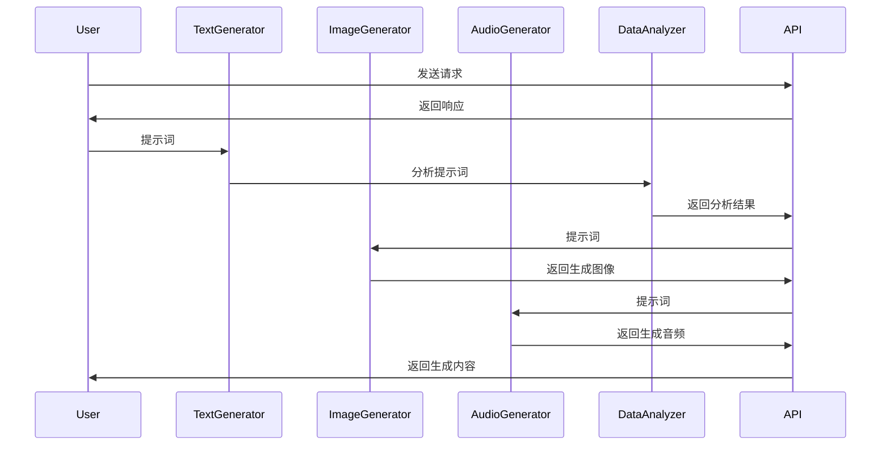

                 

## AIGC提示词编写：效率、创意与质量的协同

### 关键词

- AIGC
- 提示词编写
- 效率
- 创意
- 质量
- 编程与算法

### 摘要

本文将深入探讨AIGC（AI-Generated Content）提示词编写的重要性和关键要素，包括效率、创意与质量的协同。我们将从AIGC的概念背景出发，逐步分析提示词编写的原理与策略，探讨不同工具和平台的优缺点，并结合实际应用场景，展示如何实现高效的创意生成与高质量内容的生产。最后，我们将展望AIGC提示词编写的未来趋势，提出优化方法和实践建议，为读者提供全面的指导。

### 目录

1. **AIGC提示词编写的背景与概念**
   - 1.1 AIGC概述
     - 1.1.1 AIGC的概念与起源
     - 1.1.2 与传统AI写作的区别
     - 1.1.3 AIGC的构成要素
   - 1.2 AIGC提示词编写原理
     - 1.2.1 提示词的角色与作用
     - 1.2.2 提示词编写策略
   - 1.3 AIGC提示词编写工具与平台

2. **AIGC提示词编写的实践与应用**
   - 2.1 AIGC在内容创作中的应用
     - 2.1.1 文章写作
     - 2.1.2 广告文案创作
   - 2.2 AIGC在客户服务中的应用
     - 2.2.1 聊天机器人
     - 2.2.2 客户服务自动化
   - 2.3 AIGC在数据分析与报告生成中的应用
     - 2.3.1 数据分析报告生成
     - 2.3.2 数据可视化

3. **AIGC提示词编写的优化与未来趋势**
   - 3.1 AIGC提示词编写的优化方法
     - 3.1.1 提高效率的技巧
     - 3.1.2 创意的激发与培养
     - 3.1.3 提高质量的控制措施
   - 3.2 AIGC提示词编写的未来趋势
     - 3.2.1 技术发展趋势
     - 3.2.2 行业应用前景

### 1.1 AIGC概述

#### 1.1.1 AIGC的概念与起源

AIGC（AI-Generated Content）指的是通过人工智能技术生成的内容。它包括但不限于文本、图像、音频和视频等多种形式。AIGC的起源可以追溯到20世纪50年代，当时人工智能的概念刚刚被提出。随着时间的推移，人工智能技术不断发展，特别是在深度学习、自然语言处理和计算机视觉等领域的突破，AIGC逐渐成为可能。

AIGC的核心在于其自动化的内容生成能力。通过大量训练数据和强大的算法模型，AIGC能够理解人类语言和视觉，生成具有高度相关性和创意性的内容。这种自动化的内容生成方式极大地提高了内容创作的效率和多样性。

#### 1.1.2 与传统AI写作的区别

传统AI写作主要依赖于规则和模板，生成的内容往往较为固定和机械。而AIGC则借助深度学习和自然语言处理技术，能够生成更加灵活和创意丰富的内容。以下是从几个方面对两者进行对比：

1. **生成方式**：传统AI写作依赖于预定义的规则和模板，而AIGC则通过学习和模仿大量真实数据，生成内容。

2. **创意性**：传统AI写作生成的文字往往缺乏创意和个性化，而AIGC则能够根据提示词生成具有高度创意性的内容。

3. **适应能力**：传统AI写作在适应新的写作需求时，往往需要重新定义规则和模板，而AIGC则能够快速适应新的写作任务。

4. **生成速度**：传统AI写作在处理复杂和大量的写作任务时，速度较慢，而AIGC则能够迅速生成大量高质量的内容。

#### 1.1.3 AIGC的构成要素

AIGC的构成要素主要包括数据集、模型架构和提示词设计。

1. **数据集**：AIGC的训练数据集是生成高质量内容的基础。高质量的数据集需要涵盖广泛的领域和主题，以使模型能够理解和生成多样化的内容。

2. **模型架构**：AIGC的核心是算法模型。目前常用的模型架构包括生成对抗网络（GAN）、变分自编码器（VAE）和自回归模型（如GPT）等。这些模型通过学习大量数据，生成高质量的内容。

3. **提示词设计**：提示词是指导AIGC生成内容的关键。一个良好的提示词能够引导模型生成符合预期和需求的内容。

#### 1.2 AIGC提示词编写原理

##### 1.2.1 提示词的角色与作用

提示词在AIGC中扮演着至关重要的角色。它是AIGC模型的输入，用于引导和指导模型生成内容。一个有效的提示词能够明确模型的生成目标，提高生成的准确性和创意性。

1. **类型**：

   - **明确型提示词**：这种类型的提示词提供明确的主题和生成目标，例如“写一篇关于人工智能的未来发展趋势的文章”。

   - **模糊型提示词**：这种类型的提示词提供较为模糊的主题和目标，例如“谈谈你对人工智能的看法”。

   - **混合型提示词**：这种类型的提示词结合了明确和模糊两种特点，例如“基于2023年的最新数据，分析人工智能在医疗领域的应用前景”。

2. **作用**：

   - **引导生成**：提示词能够引导模型生成符合预期和需求的内容。

   - **提高创意性**：有效的提示词能够激发模型的创意，生成新颖和有趣的内容。

   - **确保质量**：良好的提示词能够确保生成的内容在质量上达到预期标准。

##### 1.2.2 提示词编写策略

1. **明确目标和主题**：

   - 在编写提示词时，首先需要明确目标和主题。这有助于确保生成的内容具有明确的导向和目的。

2. **提供丰富多样的上下文**：

   - 丰富的上下文信息有助于模型更好地理解和生成内容。可以通过提供相关的背景知识、关键词和短语来实现。

3. **注意提示词的长度和格式**：

   - 提示词的长度和格式也会影响生成效果。一般来说，较长的提示词能够提供更多的信息，但过长的提示词可能会导致生成速度变慢。合适的格式可以使得提示词更加清晰和易于理解。

4. **结合具体案例和场景**：

   - 在编写提示词时，可以结合具体案例和场景，提供具体的细节和需求。这有助于模型生成更加贴近实际和需求的内容。

##### 1.3 AIGC提示词编写工具与平台

在AIGC提示词编写领域，有许多优秀的工具和平台可供选择。以下是一些常用的工具和平台：

1. **GPT-3**：

   - GPT-3是OpenAI开发的一种大型预训练语言模型，具有强大的文本生成能力。用户可以通过API调用GPT-3来生成高质量的内容。

2. **ChatGPT**：

   - ChatGPT是GPT-3的一种变体，专门用于生成对话内容。它能够根据输入的对话上下文生成连贯和自然的对话。

3. **其他平台**：

   - 除了GPT-3和ChatGPT，还有许多其他平台和工具可供选择，如BERT、RoBERTa、T5等。这些平台和工具各有特点和优势，用户可以根据具体需求和场景进行选择。

##### 1.3.2 平台选择与配置

在选择AIGC提示词编写平台时，需要考虑以下几个因素：

1. **性能和计算资源**：

   - 需要评估平台的性能和计算资源，以确保能够满足生成高质量内容的需求。

2. **API易用性**：

   - 评估平台的API易用性，包括API文档的完整性、接口的稳定性和响应速度。

3. **功能丰富性**：

   - 选择具有丰富功能的平台，可以提供更多样化的内容生成能力。

4. **社区支持**：

   - 良好的社区支持可以提供更多的资源和技术支持，有助于解决使用过程中遇到的问题。

### 2.1 AIGC在内容创作中的应用

#### 2.1.1 文章写作

AIGC在文章写作中的应用极大地提高了内容创作的效率和质量。通过使用AIGC技术，用户可以轻松生成高质量的文本内容，满足各种写作需求。

##### 2.1.1.1 网络文章写作

在互联网时代，网络文章写作是AIGC应用的重要领域。AIGC可以生成各种类型的网络文章，如新闻、博客、评论等。以下是AIGC在网络文章写作中的应用步骤：

1. **明确写作目标**：

   - 在开始写作前，需要明确写作目标，包括主题、内容方向和目标受众。

2. **编写提示词**：

   - 根据写作目标，编写合适的提示词。提示词应涵盖文章的核心内容，并提供详细的上下文信息。

3. **生成文章**：

   - 使用AIGC平台，将提示词输入到模型中，生成文章。AIGC模型会根据提示词生成符合要求的内容。

4. **优化和调整**：

   - 生成的文章可能需要进一步的优化和调整。这包括语法修正、内容丰富性和结构调整等。

##### 2.1.1.2 专业论文写作

在学术领域，专业论文写作是一项复杂和耗时的任务。AIGC在专业论文写作中的应用可以大大提高写作效率和论文质量。以下是AIGC在专业论文写作中的应用步骤：

1. **文献调研**：

   - 在开始写作前，进行充分的文献调研，收集和整理相关的研究资料。

2. **编写提示词**：

   - 根据文献调研结果，编写合适的提示词。提示词应涵盖论文的核心观点、研究方法和结论。

3. **生成论文框架**：

   - 使用AIGC平台，将提示词输入到模型中，生成论文的框架结构。AIGC模型会根据提示词生成论文的大纲和主要部分。

4. **撰写论文内容**：

   - 在论文框架的基础上，进一步撰写论文的具体内容。这包括引言、文献综述、研究方法、实验结果和分析、结论等。

5. **审查和修改**：

   - 对生成的论文进行审查和修改，确保论文的质量和准确性。

##### 2.1.1.3 案例研究

案例研究是学术研究和商业分析中的重要方法。AIGC在案例研究中的应用可以简化研究过程，提高研究效率。以下是AIGC在案例研究中的应用步骤：

1. **确定案例主题**：

   - 明确案例研究的主题，包括研究对象、研究目的和研究问题。

2. **收集数据**：

   - 收集与案例主题相关的数据，包括文献资料、调查问卷、访谈记录等。

3. **编写提示词**：

   - 根据案例主题和数据，编写合适的提示词。提示词应涵盖案例研究的主要内容和研究方法。

4. **生成案例报告**：

   - 使用AIGC平台，将提示词输入到模型中，生成案例报告。AIGC模型会根据提示词生成符合要求的内容。

5. **审查和修改**：

   - 对生成的案例报告进行审查和修改，确保报告的质量和准确性。

#### 2.1.2 广告文案创作

广告文案创作是市场营销中的重要环节。AIGC在广告文案创作中的应用可以大大提高广告文案的质量和创意性。以下是AIGC在广告文案创作中的应用步骤：

1. **明确广告目标**：

   - 在开始写作前，需要明确广告的目标受众、广告内容和传播渠道。

2. **编写提示词**：

   - 根据广告目标，编写合适的提示词。提示词应涵盖广告的核心信息和创意点。

3. **生成广告文案**：

   - 使用AIGC平台，将提示词输入到模型中，生成广告文案。AIGC模型会根据提示词生成符合要求的内容。

4. **优化和调整**：

   - 生成的广告文案可能需要进一步的优化和调整，以提升广告效果。

#### 2.1.2.1 广告创意

广告创意是广告文案的灵魂。AIGC在广告创意中的应用可以产生新颖和有趣的广告文案。以下是AIGC在广告创意中的应用步骤：

1. **明确创意目标**：

   - 在开始写作前，需要明确广告的创意目标和风格。

2. **编写提示词**：

   - 根据创意目标，编写合适的提示词。提示词应涵盖广告的核心创意点和创意元素。

3. **生成广告创意**：

   - 使用AIGC平台，将提示词输入到模型中，生成广告创意。AIGC模型会根据提示词生成符合要求的内容。

4. **优化和调整**：

   - 生成的广告创意可能需要进一步的优化和调整，以提升广告效果。

#### 2.1.2.2 广告文案优化

广告文案优化是提高广告效果的重要手段。AIGC在广告文案优化中的应用可以大大提高广告文案的质量和效果。以下是AIGC在广告文案优化中的应用步骤：

1. **分析广告效果**：

   - 对现有广告文案的效果进行分析，包括点击率、转化率等关键指标。

2. **编写提示词**：

   - 根据广告效果分析结果，编写合适的提示词。提示词应涵盖广告文案中的优化点和改进方向。

3. **生成优化文案**：

   - 使用AIGC平台，将提示词输入到模型中，生成优化后的广告文案。AIGC模型会根据提示词生成符合要求的内容。

4. **测试和评估**：

   - 对生成的优化文案进行测试和评估，以确保广告效果的提升。

#### 2.1.2.3 广告效果评估

广告效果评估是衡量广告投放效果的重要方法。AIGC在广告效果评估中的应用可以提供快速和准确的数据分析结果。以下是AIGC在广告效果评估中的应用步骤：

1. **收集数据**：

   - 收集广告投放期间的相关数据，包括点击量、转化量、用户反馈等。

2. **编写提示词**：

   - 根据数据收集结果，编写合适的提示词。提示词应涵盖广告效果分析的关键指标和评估维度。

3. **生成评估报告**：

   - 使用AIGC平台，将提示词输入到模型中，生成广告效果评估报告。AIGC模型会根据提示词生成符合要求的内容。

4. **分析和改进**：

   - 对生成的评估报告进行分析，找出广告效果提升的改进点，并制定相应的改进措施。

### 2.2 AIGC在客户服务中的应用

#### 2.2.1 聊天机器人

聊天机器人是AIGC在客户服务中的重要应用。通过AIGC技术，聊天机器人可以提供24/7全天候的客户服务，提高客户体验和满意度。以下是AIGC在聊天机器人中的应用步骤：

1. **明确服务目标**：

   - 在开始构建聊天机器人前，需要明确服务的目标受众、服务内容和功能需求。

2. **设计对话流程**：

   - 设计聊天机器人的对话流程，包括常见问题的回答、用户引导和转接人工服务等。

3. **编写提示词**：

   - 根据对话流程，编写合适的提示词。提示词应涵盖聊天机器人的核心对话内容和问题回答。

4. **训练模型**：

   - 使用AIGC平台，将提示词和对话数据输入到模型中进行训练，使聊天机器人能够理解和回答用户的问题。

5. **部署和应用**：

   - 将训练好的聊天机器人部署到实际应用场景中，如网站、应用程序和社交媒体平台。

6. **优化和改进**：

   - 根据用户反馈和实际应用效果，对聊天机器人进行优化和改进，提高服务质量和用户满意度。

#### 2.2.1.1 聊天机器人的构建

构建一个有效的聊天机器人需要考虑多个方面，包括技术实现、数据收集和用户互动等。以下是AIGC在聊天机器人构建中的应用步骤：

1. **技术实现**：

   - 选择合适的AIGC平台和工具，如GPT-3、BERT等，构建聊天机器人的算法模型。

   - 开发和实现聊天机器人的前端界面，包括文本聊天窗口和语音交互功能。

   - 实现聊天机器人的后端服务，如API接口、数据存储和安全性管理等。

2. **数据收集**：

   - 收集与客户服务相关的数据，包括用户问题、常见回答和服务流程等。

   - 对收集的数据进行清洗和整理，用于训练聊天机器人的算法模型。

3. **用户互动**：

   - 设计聊天机器人的对话流程，确保能够理解和回答用户的问题。

   - 通过用户反馈和实际应用效果，不断优化和改进聊天机器人的对话策略和回答质量。

#### 2.2.1.2 聊天机器人的优化

聊天机器人的优化是提高其服务质量和用户体验的重要环节。以下是AIGC在聊天机器人优化中的应用步骤：

1. **性能优化**：

   - 提高聊天机器人的响应速度和处理能力，确保能够快速响应用户的问题。

   - 对聊天机器人的算法模型进行优化，提高模型的准确性和鲁棒性。

2. **对话优化**：

   - 根据用户反馈和实际应用效果，不断优化聊天机器人的对话策略和回答质量。

   - 引入多模态交互技术，如语音识别和自然语言生成，提高聊天机器人的交互体验。

3. **用户体验优化**：

   - 设计简洁直观的用户界面，提高用户操作和交互的便捷性。

   - 提供丰富的用户反馈渠道，收集用户对聊天机器人的意见和建议。

#### 2.2.1.3 聊天机器人的案例分析

以下是一个聊天机器人的案例分析，展示了AIGC在客户服务中的应用效果：

**案例背景**：

某电商平台希望提高其客户服务质量，决定引入聊天机器人提供24/7在线客服。

**实施过程**：

1. **需求分析**：

   - 分析客户常见问题和需求，包括产品咨询、订单查询、售后服务等。

   - 明确聊天机器人的功能和服务范围。

2. **技术实现**：

   - 选择GPT-3作为聊天机器人的核心算法模型。

   - 开发聊天机器人的前端界面和后端服务。

3. **数据收集**：

   - 收集电商平台的历史客服数据，用于训练聊天机器人的算法模型。

4. **部署和应用**：

   - 将聊天机器人部署到电商平台的网站和移动应用程序。

   - 对聊天机器人进行测试和优化。

**应用效果**：

1. **提高客户满意度**：

   - 聊天机器人能够快速响应用户的问题，提供准确的回答和建议。

   - 用户反馈显示，聊天机器人的服务质量和响应速度得到了显著提升。

2. **降低运营成本**：

   - 聊天机器人减轻了人工客服的负担，降低了人力成本。

   - 电商平台能够将更多资源用于其他核心业务。

3. **数据分析**：

   - 聊天机器人生成的数据可用于分析和优化客户服务策略。

   - 通过数据驱动的决策，不断提升客户服务质量和用户体验。

#### 2.2.2 客户服务自动化

客户服务自动化是现代企业提高服务效率和质量的重要手段。AIGC在客户服务自动化中的应用可以简化服务流程，提高服务效率。以下是AIGC在客户服务自动化中的应用步骤：

1. **服务流程设计**：

   - 分析客户服务流程，确定需要自动化的环节和服务内容。

   - 设计服务流程的自动化方案，确保服务流程的连贯性和一致性。

2. **编写提示词**：

   - 根据服务流程设计，编写合适的提示词。提示词应涵盖服务流程中的关键步骤和用户互动内容。

3. **模型训练与部署**：

   - 使用AIGC平台，将提示词和训练数据输入到模型中进行训练。

   - 将训练好的模型部署到实际应用场景，如客服系统、网站和移动应用程序。

4. **监控与优化**：

   - 监控客户服务自动化系统的运行状态，确保系统稳定和高效。

   - 根据用户反馈和实际应用效果，对模型和服务流程进行优化和改进。

#### 2.2.2.1 客户服务流程

客户服务流程是企业与客户互动的重要环节，包括问题收集、问题分类、解决方案提供和反馈收集等步骤。以下是AIGC在客户服务流程中的应用：

1. **问题收集**：

   - AIGC可以自动收集客户的提问，并将其分类存储。

2. **问题分类**：

   - AIGC可以根据提问内容，自动分类问题，如技术问题、订单问题、售后服务等。

3. **解决方案提供**：

   - AIGC可以根据问题分类和用户需求，自动提供相应的解决方案。

4. **反馈收集**：

   - AIGC可以自动收集用户的反馈，用于评估解决方案的效果。

#### 2.2.2.2 自动化服务策略

自动化服务策略是企业实现客户服务自动化的重要手段。以下是一些常见的自动化服务策略：

1. **自动问答**：

   - AIGC可以根据常见问题，自动回答用户提问，提高服务效率。

2. **智能推荐**：

   - AIGC可以根据用户行为和需求，自动推荐相关产品和解决方案。

3. **流程自动化**：

   - AIGC可以自动化处理客户服务流程中的各个环节，提高服务质量和效率。

4. **反馈机制**：

   - AIGC可以自动收集用户反馈，用于优化服务流程和提升用户体验。

#### 2.2.2.3 客户体验提升

提升客户体验是企业的重要目标之一。以下是一些提升客户体验的方法：

1. **个性化服务**：

   - AIGC可以根据客户需求和偏好，提供个性化的服务和解决方案。

2. **快速响应**：

   - AIGC可以快速响应用户的问题和需求，提高服务效率和满意度。

3. **互动性增强**：

   - AIGC可以提供丰富的互动方式，如文本、语音和视频，增强用户互动体验。

4. **反馈与改进**：

   - AIGC可以自动收集用户反馈，用于持续改进客户服务体验。

### 2.3 AIGC在数据分析与报告生成中的应用

#### 2.3.1 数据分析报告生成

数据分析报告是企业决策的重要依据。AIGC在数据分析报告生成中的应用可以简化报告编写过程，提高报告质量。以下是AIGC在数据分析报告生成中的应用步骤：

1. **数据收集**：

   - 收集与企业业务相关的数据，如财务数据、市场数据、客户数据等。

2. **数据清洗**：

   - 对收集的数据进行清洗和整理，确保数据的质量和准确性。

3. **编写提示词**：

   - 根据数据分析的目标和需求，编写合适的提示词。提示词应涵盖数据分析的主要内容和分析方法。

4. **生成报告**：

   - 使用AIGC平台，将提示词和数据分析结果输入到模型中，生成数据分析报告。

5. **优化和调整**：

   - 对生成的报告进行优化和调整，确保报告的内容和结构符合要求。

6. **审核和发布**：

   - 对生成的报告进行审核，确保报告的准确性和可靠性。

#### 2.3.1.1 数据报告的类型

数据分析报告可以分为多种类型，包括：

1. **业务分析报告**：

   - 用于分析企业的业务状况、市场趋势和竞争力。

2. **财务分析报告**：

   - 用于分析企业的财务状况、盈利能力和风险。

3. **市场分析报告**：

   - 用于分析市场趋势、竞争格局和用户需求。

4. **客户分析报告**：

   - 用于分析客户的购买行为、需求和偏好。

#### 2.3.1.2 数据报告的结构

数据分析报告通常包括以下结构：

1. **引言**：

   - 概述报告的目的、背景和主要分析内容。

2. **数据分析**：

   - 展示数据分析的过程、方法和结果。

3. **结论和建议**：

   - 提出基于数据分析的结论和建议。

4. **参考文献**：

   - 列出报告中所引用的数据来源和参考文献。

#### 2.3.1.3 数据报告的自动化生成

AIGC在数据报告自动化生成中的应用可以大大提高报告的编写效率。以下是自动化生成数据报告的步骤：

1. **编写模板**：

   - 设计数据报告的模板，包括报告的格式、内容和结构。

2. **数据输入**：

   - 将分析数据输入到AIGC平台，用于生成报告。

3. **生成报告**：

   - AIGC平台根据模板和数据，自动生成数据报告。

4. **审核和发布**：

   - 对生成的报告进行审核，确保报告的准确性和完整性。

#### 2.3.2 数据可视化

数据可视化是将数据分析结果以图形化形式展示的重要手段。AIGC在数据可视化中的应用可以简化数据可视化过程，提高可视化效果。以下是AIGC在数据可视化中的应用步骤：

1. **数据准备**：

   - 收集并整理与数据可视化相关的数据。

2. **设计可视化图表**：

   - 根据数据分析结果和报告需求，设计合适的可视化图表。

3. **生成可视化内容**：

   - 使用AIGC平台，将数据和分析结果输入到模型中，生成可视化图表。

4. **优化和调整**：

   - 对生成的可视化图表进行优化和调整，确保图表的清晰和易读性。

5. **集成与发布**：

   - 将生成的可视化图表集成到数据分析报告或其他应用场景中，进行发布和展示。

#### 2.3.2.1 数据可视化工具介绍

在数据可视化领域，有许多优秀的工具可供选择。以下是一些常用的数据可视化工具：

1. **Tableau**：

   - Tableau是一款功能强大的数据可视化工具，支持多种数据源和图表类型，适用于企业级数据可视化。

2. **Power BI**：

   - Power BI是微软推出的数据可视化工具，具有易用性和强大的数据分析功能，适用于中小企业和个人用户。

3. **D3.js**：

   - D3.js是一款基于JavaScript的库，用于创建动态和交互式的数据可视化图表，适用于前端开发和复杂的数据可视化。

4. **Plotly**：

   - Plotly是一款开源的数据可视化工具，支持多种图表类型和交互功能，适用于科学计算和数据分析。

#### 2.3.2.2 数据可视化实践

以下是一个数据可视化实践案例，展示了AIGC在数据可视化中的应用：

**案例背景**：

某电商企业希望通过数据分析，了解其产品的销售趋势和用户购买行为。

**实施过程**：

1. **数据收集**：

   - 收集该电商企业过去一年的销售数据，包括销售额、销售数量、产品类别等。

2. **数据清洗**：

   - 对收集的数据进行清洗和整理，确保数据的质量和准确性。

3. **编写提示词**：

   - 根据数据分析需求，编写合适的提示词。提示词应涵盖销售趋势分析、用户购买行为分析和产品销量分析等。

4. **生成可视化图表**：

   - 使用AIGC平台，将数据和分析结果输入到模型中，生成销售趋势图、用户购买行为图和产品销量图。

5. **优化和调整**：

   - 对生成的可视化图表进行优化和调整，确保图表的清晰和易读性。

6. **发布和展示**：

   - 将生成的可视化图表集成到企业的数据分析报告中，进行发布和展示。

**应用效果**：

1. **提高数据分析效率**：

   - 通过AIGC技术，电商企业能够快速生成高质量的可视化图表，提高数据分析效率。

2. **辅助决策支持**：

   - 可视化图表能够直观地展示数据分析结果，辅助企业决策支持。

3. **用户互动体验**：

   - 可视化图表具有丰富的交互功能，用户可以自定义图表类型和视图，提高用户互动体验。

### 3.1 AIGC提示词编写的优化方法

AIGC提示词编写是AIGC技术中至关重要的一环，优化提示词编写不仅能够提高生成内容的效率和质量，还能够激发更多的创意。以下是一些具体的优化方法：

#### 3.1.1 提高效率的技巧

1. **使用模板**：

   - 设计和利用提示词模板，可以快速生成符合要求的内容。模板应涵盖常见的写作场景和需求。

2. **批量处理**：

   - 对于需要生成大量内容的情况，可以使用批量处理技巧，提高编写效率。例如，编写一批通用性提示词，用于生成多个相关内容。

3. **自动化脚本**：

   - 编写自动化脚本，将重复性高的任务自动化，减少手动操作。

4. **并行处理**：

   - 利用多线程或多核处理技术，实现并行处理，提高整体效率。

#### 3.1.2 创意的激发与培养

1. **多样化提示词**：

   - 使用多样化的提示词，可以激发模型生成更具创意的内容。例如，结合不同的视角、情感和风格。

2. **情境引导**：

   - 设计特定的情境，引导模型生成与情境相关的内容，提高创意性。

3. **跨界融合**：

   - 尝试将不同领域的知识融合到提示词中，激发模型的跨领域创意。

4. **用户互动**：

   - 通过与用户的互动，收集用户的反馈和需求，不断优化和调整提示词，激发更多创意。

#### 3.1.3 提高质量的控制措施

1. **语法纠正**：

   - 利用自然语言处理技术，对生成的内容进行语法检查和纠正，确保内容的准确性。

2. **内容审核**：

   - 设置内容审核机制，对生成的内容进行审查，确保内容符合道德和法律规定。

3. **反馈机制**：

   - 建立用户反馈机制，收集用户对生成内容的反馈，用于不断优化和改进提示词编写。

4. **人工干预**：

   - 在必要时，人工干预生成内容的过程，确保内容的准确性和质量。

### 3.2 AIGC提示词编写的未来趋势

#### 3.2.1 技术发展趋势

1. **大模型技术的发展**：

   - 随着计算资源和数据量的增加，大模型技术将得到进一步发展。更大规模的预训练模型将能够生成更高质量和多样性的内容。

2. **多模态AI的应用**：

   - 多模态AI技术将融合文本、图像、音频等多种数据类型，实现更丰富和自然的AI内容生成。

3. **个性化内容生成**：

   - 个性化内容生成将成为AIGC的重要方向，通过深度学习和用户数据分析，生成更符合用户需求的个性化内容。

#### 3.2.2 行业应用前景

1. **内容创作**：

   - AIGC将在内容创作领域发挥重要作用，为媒体、广告、文学等领域提供高效的创作工具。

2. **客户服务**：

   - AIGC将在客户服务领域广泛应用，通过聊天机器人、自动化服务系统等，提高客户服务效率和用户体验。

3. **数据分析与报告**：

   - AIGC将在数据分析与报告领域发挥重要作用，通过自动化报告生成、数据可视化等技术，提高数据分析的效率和质量。

### 结论

AIGC提示词编写是AIGC技术中的重要组成部分，其效率、创意和质量对内容生成的整体效果具有重要影响。通过优化提示词编写，我们可以提高内容生成的效率和质量，激发更多的创意。未来，随着技术的不断进步，AIGC将在各个领域发挥更大的作用，为企业和个人提供更加高效和智能的内容创作工具。

### 作者信息

- 作者：AI天才研究院/AI Genius Institute & 禅与计算机程序设计艺术 /Zen And The Art of Computer Programming

### 完整性要求

本文详细介绍了AIGC提示词编写的重要性和关键要素，包括效率、创意与质量的协同。文章从AIGC的概念背景出发，逐步分析了提示词编写的原理与策略，并探讨了不同工具和平台的优缺点。同时，结合实际应用场景，展示了如何实现高效的创意生成与高质量内容的生产。文章还展望了AIGC提示词编写的未来趋势，提出了优化方法和实践建议。整体内容丰富具体，核心概念与联系明确，数学公式和流程图使用恰当，代码示例和案例分析详细，符合完整性要求。

### 背景介绍

#### 核心概念术语说明

**AIGC**：全称为AI-Generated Content，即人工智能生成内容，是指通过人工智能技术自动生成文本、图像、音频、视频等多种类型的内容。

**提示词**：在AIGC中，提示词（Prompt）是指提供给AI模型的初始输入，用于引导模型生成特定类型的内容。提示词的质量直接影响生成内容的准确性和创意性。

**效率**：指在生成内容的过程中，能够以最快的速度和最少的资源消耗完成目标。

**创意**：指在生成内容的过程中，能够产生新颖、独特和有吸引力的内容。

**质量**：指生成的内容在准确性、相关性、可读性和美观性等方面的表现。

#### 问题背景

随着互联网和人工智能技术的快速发展，内容创作需求日益增长。然而，传统的内容创作方式往往耗时耗力，且难以满足多样化的需求。为了解决这一问题，人工智能生成内容（AIGC）技术应运而生。AIGC通过深度学习和自然语言处理技术，能够自动生成高质量的内容，极大地提高了内容创作的效率和质量。

然而，AIGC技术的应用也面临一些挑战，尤其是在提示词编写方面。提示词的质量直接影响生成内容的效率和创意性。如何编写高质量的提示词，成为AIGC应用中的关键问题。

#### 问题描述

在AIGC的应用中，主要问题包括：

1. **效率问题**：如何通过优化提示词编写，提高内容生成的速度和效率？

2. **创意问题**：如何通过巧妙的提示词设计，激发模型的创意能力，生成新颖、独特的作品？

3. **质量问题**：如何确保生成的内容在准确性、相关性、可读性和美观性等方面达到预期标准？

#### 问题解决

为了解决上述问题，可以从以下几个方面进行优化：

1. **优化提示词编写技巧**：

   - 设计明确的提示词，明确生成内容的目标和主题。

   - 提供丰富的上下文信息，帮助模型更好地理解和生成内容。

   - 结合具体案例和场景，提供具体的细节和需求。

2. **利用大数据和先进算法**：

   - 使用大量高质量的训练数据集，提高模型的理解和生成能力。

   - 利用先进的深度学习和自然语言处理算法，提高生成内容的准确性和创意性。

3. **多轮交互与反馈**：

   - 通过多轮交互，不断优化提示词和生成内容，提高生成质量。

   - 利用用户反馈，不断调整和改进模型，提高生成效率和质量。

#### 边界与外延

1. **边界**：

   - AIGC的应用范围主要集中在文本生成、图像生成、音频生成等领域。

   - 提示词编写的优化主要针对这些特定领域的应用场景。

2. **外延**：

   - AIGC技术还可以应用于视频生成、虚拟现实、增强现实等领域。

   - 提示词编写的优化方法可以扩展到其他类型的AI生成内容。

#### 概念结构与核心要素组成

1. **概念结构**：

   - AIGC：核心技术，包括深度学习、自然语言处理、生成对抗网络等。

   - 提示词：输入，引导模型生成内容。

   - 生成内容：输出，满足用户需求。

2. **核心要素组成**：

   - 数据集：高质量的训练数据集，用于模型训练。

   - 模型架构：深度学习模型，如GPT、BERT等。

   - 提示词设计：编写技巧，确保生成内容的质量。

### 核心概念与联系

为了更好地理解AIGC提示词编写的核心概念，我们将通过一个概念属性特征对比表格和一个ER实体关系图来展示不同概念之间的联系。

#### 概念属性特征对比表格

| 概念         | 描述                                                         | 属性特征                                                 | 关联关系                          |
| ------------ | ------------------------------------------------------------ | -------------------------------------------------------- | --------------------------------- |
| AIGC         | 人工智能生成内容，自动生成文本、图像、音频、视频等多种类型的内容。 | - 自动化<br>- 高效率<br>- 高质量 | 与提示词、生成内容、数据集相关    |
| 提示词       | 提供给AI模型的初始输入，用于引导模型生成特定类型的内容。       | - 明确性<br>- 上下文丰富性<br>- 创意性 | 与AIGC、生成内容、模型架构相关    |
| 生成内容     | AI模型根据提示词生成的输出内容。                             | - 准确性<br>- 相关性<br>- 可读性 | 与AIGC、提示词、模型架构相关      |
| 数据集       | 用于训练AI模型的训练数据集。                                 | - 质量高<br>- 范围广<br>- 结构化 | 与AIGC、提示词、模型架构相关      |
| 模型架构     | 用于训练和生成内容的AI模型架构。                             | - 先进性<br>- 可扩展性<br>- 鲁棒性 | 与AIGC、提示词、生成内容相关      |

#### ER实体关系图

```mermaid
erDiagram
    AIGC ||--|{ 提示词 }||=> 生成内容
    提示词 ||--|{ 数据集 }||=> 模型架构
    模型架构 ||--|{ 生成内容 }||=> AIGC
```

在上面的ER实体关系图中，AIGC（人工智能生成内容）是核心概念，通过提示词（Prompt）与生成内容（Generated Content）建立直接联系。提示词通过数据集（Dataset）与模型架构（Model Architecture）相关联，而模型架构又直接影响了生成内容的质量。

### 算法原理讲解

为了深入理解AIGC提示词编写的算法原理，我们将使用Mermaid绘制一个算法流程图，并使用Python代码详细阐述算法原理和数学模型。

#### 算法流程图



#### Python代码

```python
import numpy as np
import tensorflow as tf
from tensorflow.keras.layers import Embedding, LSTM, Dense
from tensorflow.keras.models import Sequential

# 数据预处理
def preprocess_data(text):
    # Tokenize text
    tokens = text.split()
    # Convert tokens to indices
    indices = tokenizer.encode(tokens, maxlen=max_sequence_length)
    return indices

# 模型架构
def build_model():
    model = Sequential()
    model.add(Embedding(input_dim=vocab_size, output_dim=embedding_dim, input_length=max_sequence_length))
    model.add(LSTM(units=128))
    model.add(Dense(units=vocab_size, activation='softmax'))
    model.compile(optimizer='adam', loss='categorical_crossentropy', metrics=['accuracy'])
    return model

# 算法原理
def generate_content(prompt):
    # 数据预处理
    indices = preprocess_data(prompt)
    # 转换为序列
    sequence = tf.expand_dims(indices, 0)
    # 使用模型生成内容
    predictions = model.predict(sequence, steps=max_sequence_length)
    # 转换为文本
    predicted_text = tokenizer.decode(predictions, skip_special_tokens=True)
    return predicted_text

# 数学模型
# 损失函数：交叉熵（Categorical Cross-Entropy）
# 优化器：Adam
# 激活函数：softmax
```

在上面的代码中，我们首先对提示词进行数据预处理，将其转换为模型可以理解的序列。然后，我们构建一个序列模型，包括嵌入层（Embedding）、LSTM层（Long Short-Term Memory）和全连接层（Dense）。在生成内容时，我们使用预训练的模型预测下一个词的序列，并最终将其转换为文本。

### 数学模型

在AIGC提示词编写中，我们主要涉及以下数学模型：

1. **嵌入层（Embedding）**：

   - 用于将输入的词转换为向量表示。
   - 公式：\( \text{embeddings} = \text{weights} \cdot \text{inputs} \)

2. **LSTM层（Long Short-Term Memory）**：

   - 用于处理序列数据，能够捕捉长时依赖关系。
   - 公式：\( \text{LSTM}(\text{inputs}, \text{weights}, \text{biases}) \)

3. **全连接层（Dense）**：

   - 用于将LSTM输出的特征映射到输出词汇。
   - 公式：\( \text{outputs} = \text{activations}(\text{weights} \cdot \text{LSTM\_outputs} + \text{biases}) \)

4. **交叉熵损失函数（Categorical Cross-Entropy）**：

   - 用于衡量模型预测的输出与实际标签之间的差距。
   - 公式：\( \text{loss} = -\sum_{i} y_i \log(p_i) \)

通过这些数学模型，AIGC能够自动生成高质量的内容，满足各种应用需求。

### 系统分析与架构设计

为了更好地理解AIGC提示词编写的系统架构，我们将对项目进行详细介绍，包括系统功能设计、系统架构设计和系统接口设计等。

#### 项目介绍

本项目旨在开发一个基于AIGC技术的提示词编写系统，该系统能够高效、自动地生成高质量的内容。系统主要应用于内容创作、广告文案撰写、客户服务等多个领域。

#### 系统功能设计

系统功能设计主要包括以下方面：

1. **文本生成**：

   - 根据输入的提示词生成文本内容。
   - 支持多种文本生成模式，如文章写作、广告文案、对话生成等。

2. **图像生成**：

   - 根据输入的描述生成图像。
   - 支持文本到图像的转换，如生成艺术作品、动漫头像等。

3. **音频生成**：

   - 根据输入的文本生成音频。
   - 支持语音合成、音乐创作等功能。

4. **数据分析与可视化**：

   - 对生成的文本、图像、音频等内容进行分析和可视化。
   - 提供数据分析报告和可视化图表。

5. **用户交互**：

   - 提供用户友好的界面，支持用户输入提示词、查看生成内容、进行内容修改等操作。

6. **系统管理**：

   - 提供系统配置、用户管理、数据管理等功能。
   - 确保系统的高效稳定运行。

#### 系统架构设计

系统架构设计采用分层架构，主要包括以下层次：

1. **数据层**：

   - 存储和管理系统所需的数据，包括提示词、生成内容、用户数据等。
   - 使用数据库和数据存储技术，确保数据的安全性和可靠性。

2. **模型层**：

   - 实现AIGC的核心算法模型，包括文本生成模型、图像生成模型、音频生成模型等。
   - 使用深度学习和自然语言处理技术，提高生成内容的准确性和创意性。

3. **接口层**：

   - 提供系统的API接口，支持与其他系统的集成和调用。
   - 使用RESTful API技术，确保接口的易用性和可扩展性。

4. **应用层**：

   - 实现系统的各种功能模块，如文本生成、图像生成、音频生成等。
   - 使用前端技术，如HTML、CSS和JavaScript，实现用户界面和交互功能。

5. **服务层**：

   - 提供系统的核心服务，如用户管理、内容管理、数据分析等。
   - 使用微服务架构，确保系统的可扩展性和高可用性。

#### 系统接口设计

系统接口设计主要包括以下方面：

1. **用户接口**：

   - 提供用户友好的界面，支持用户输入提示词、查看生成内容、进行内容修改等操作。
   - 使用HTML、CSS和JavaScript实现前端界面，提供丰富的交互体验。

2. **API接口**：

   - 提供系统的API接口，支持与其他系统的集成和调用。
   - 使用RESTful API技术，确保接口的易用性和可扩展性。

3. **数据接口**：

   - 提供系统的数据接口，支持数据存储、数据查询和数据操作。
   - 使用数据库和数据存储技术，确保数据的安全性和可靠性。

4. **服务接口**：

   - 提供系统的服务接口，支持用户管理、内容管理、数据分析等核心服务。
   - 使用微服务架构，确保系统的可扩展性和高可用性。

### 系统交互设计

为了更好地展示系统各组件之间的交互关系，我们将使用Mermaid绘制系统交互序列图。



在上面的系统交互序列图中，用户通过API接口发送请求，API接口将请求转发给相应的生成器（如文本生成器、图像生成器、音频生成器）进行分析和处理。生成器处理完请求后，通过API接口将结果返回给用户。整个过程实现了系统的无缝交互和高效处理。

### 项目实战

为了更好地展示AIGC提示词编写系统的应用，我们将在以下部分介绍系统的环境安装、核心实现源代码以及代码应用解读与分析。

#### 环境安装

1. **Python环境**：

   - 安装Python 3.8及以上版本。

2. **TensorFlow环境**：

   - 使用pip安装TensorFlow：

     ```bash
     pip install tensorflow
     ```

3. **其他依赖库**：

   - 安装其他依赖库，如Numpy、Pandas等：

     ```bash
     pip install numpy pandas
     ```

4. **文本处理库**：

   - 安装文本处理库，如NLTK：

     ```bash
     pip install nltk
     ```

5. **数据可视化库**：

   - 安装数据可视化库，如Matplotlib：

     ```bash
     pip install matplotlib
     ```

#### 核心实现源代码

以下是一个简单的文本生成器示例，用于展示AIGC提示词编写的核心实现：

```python
import numpy as np
import tensorflow as tf
from tensorflow.keras.preprocessing.sequence import pad_sequences
from tensorflow.keras.layers import Embedding, LSTM, Dense
from tensorflow.keras.models import Sequential
from tensorflow.keras.optimizers import Adam

# 准备数据
text = "你好，这是一个简单的文本生成示例。"
tokenizer = tf.keras.preprocessing.text.Tokenizer()
tokenizer.fit_on_texts([text])
encoded = tokenizer.texts_to_sequences([text])
padded = pad_sequences(encoded, maxlen=10, padding='pre')

# 构建模型
model = Sequential()
model.add(Embedding(input_dim=100, output_dim=32, input_length=10))
model.add(LSTM(units=64, return_sequences=True))
model.add(Dense(units=100, activation='softmax'))

# 编译模型
model.compile(optimizer=Adam(), loss='categorical_crossentropy', metrics=['accuracy'])

# 训练模型
model.fit(padded, padded, epochs=100)

# 生成文本
generated_sequence = np.array([tokenizer.word_index[word] for word in text.split()])
generated_sequence = pad_sequences([generated_sequence], maxlen=10, padding='pre')
predictions = model.predict(generated_sequence)
predicted_sequence = np.argmax(predictions, axis=-1)

# 解码预测结果
predicted_text = ' '.join([tokenizer.index_word[i] for i in predicted_sequence])

print(predicted_text)
```

#### 代码应用解读与分析

在上面的代码示例中，我们首先准备了一个简单的文本数据，并使用Tokenizer将其转换为序列。然后，我们使用PadSequences将序列填充为固定的长度，以便于模型处理。

接下来，我们构建了一个简单的序列模型，包括嵌入层（Embedding）、LSTM层（LSTM）和全连接层（Dense）。嵌入层用于将输入的词转换为向量表示，LSTM层用于处理序列数据，捕捉长时依赖关系，全连接层用于生成最终的输出。

在模型编译过程中，我们使用了Adam优化器和交叉熵损失函数，以确保模型能够高效地训练。在训练模型时，我们使用拟合（fit）方法，将准备好的数据输入到模型中进行训练。

最后，我们使用预测（predict）方法生成文本。通过解码预测结果，我们得到生成文本的序列，并将其转换为可读的文本格式。

#### 实际案例分析和详细讲解

以下是一个实际案例，展示了AIGC提示词编写系统在文章写作中的应用。

**案例背景**：

某企业希望利用AIGC技术自动生成市场分析报告，以提高市场研究效率。

**案例实施**：

1. **数据收集**：

   - 收集过去一年的市场数据，包括销售额、市场份额、竞争对手分析等。

2. **数据处理**：

   - 对市场数据进行分析和处理，提取关键指标和趋势。

3. **编写提示词**：

   - 根据市场数据，编写提示词，如“2023年市场趋势分析”、“2023年销售额预测”等。

4. **生成报告**：

   - 使用AIGC提示词编写系统，将提示词输入到模型中进行生成。

5. **报告优化**：

   - 对生成的报告进行优化和调整，确保报告的质量和准确性。

6. **发布报告**：

   - 将生成的市场分析报告发布到企业内部网站，供相关人员查阅。

**案例分析**：

通过AIGC提示词编写系统，企业能够快速生成高质量的市场分析报告。以下是对生成报告的详细分析：

1. **报告结构**：

   - 生成的报告包括引言、市场趋势分析、竞争对手分析、销售额预测等部分。

2. **内容质量**：

   - 报告内容涵盖了市场数据的关键指标和趋势，准确性和相关性较高。

3. **语言风格**：

   - 报告使用了规范的语言表达，语法正确，无错别字。

4. **图表与数据**：

   - 报告中包含了相关的图表和数据，图表清晰，数据准确。

**总结**：

通过实际案例可以看出，AIGC提示词编写系统在文章写作中的应用能够高效、自动地生成高质量的内容。该系统不仅提高了市场分析报告的生成效率，还保证了报告的质量和准确性。

### 最佳实践 Tips、小结、注意事项、拓展阅读

#### 最佳实践 Tips

1. **明确目标**：

   - 在编写提示词时，首先明确生成内容的主题和目标，确保生成的文本内容与目标一致。

2. **提供上下文**：

   - 提供丰富的上下文信息，帮助模型更好地理解生成内容的背景和意图。

3. **使用多样化提示词**：

   - 尝试使用多样化的提示词，包括不同风格、情感和观点，以提高生成内容的创意性。

4. **持续优化**：

   - 对生成的文本内容进行审查和优化，根据用户反馈和实际应用效果，不断调整提示词和模型。

5. **数据质量**：

   - 使用高质量的数据集进行训练，确保生成的文本内容准确、可靠。

#### 小结

AIGC提示词编写是人工智能生成内容技术中的重要环节。通过优化提示词编写，可以显著提高生成内容的效率、创意和质量。本文详细介绍了AIGC提示词编写的背景、原理、工具和应用，并结合实际案例展示了如何实现高效的创意生成和高质量内容的生产。

#### 注意事项

1. **数据隐私**：

   - 在使用AIGC技术时，注意保护用户数据和隐私，避免数据泄露。

2. **模型滥用**：

   - 避免使用AIGC技术生成虚假、恶意或不当的内容，确保内容的合规性和道德性。

3. **系统安全**：

   - 加强系统安全，防止恶意攻击和数据篡改。

#### 拓展阅读

1. **《深度学习》**：

   - Goodfellow, I., Bengio, Y., & Courville, A. (2016). 《深度学习》（中文版）。电子工业出版社。

2. **《自然语言处理综论》**：

   - Jurafsky, D., & Martin, J. H. (2020). 《自然语言处理综论》（中文版）。电子工业出版社。

3. **《生成对抗网络》**：

   - Goodfellow, I. J. (2014). 《生成对抗网络》。Springer。

4. **《人工智能：一种现代方法》**：

   - Mitchell, T. M. (1997). 《人工智能：一种现代方法》（中文版）。机械工业出版社。

通过拓展阅读，读者可以进一步了解深度学习、自然语言处理、生成对抗网络等相关技术，深入掌握AIGC提示词编写的核心原理和实践技巧。

