                 

# AIGC提示词编写：效率、创意与质量的协同优化

> 关键词：AIGC、效率、创意、质量、优化

> 摘要：本文全面探讨了AIGC（自适应智能生成控制）的效率、创意和质量问题。首先，介绍了AIGC的基本概念、发展历程和应用领域。随后，分析了AIGC的工作原理，包括数据预处理、模型训练与优化以及生成与优化。接下来，本文通过具体实例展示了AIGC在文本、图像、音频和视频生成中的应用。重点探讨了如何提高AIGC的生成效率，包括模型并行化、模型压缩与剪枝、模型部署与优化。此外，本文还详细介绍了如何激发和优化创意，以及如何评估和提升生成质量。最后，本文通过案例分析，展示了AIGC在实际项目中的应用，并对AIGC的未来发展进行了展望。

## 第一部分：AIGC概述与背景

### 第1章：AIGC技术概述

#### 1.1 AIGC的概念与特点

AIGC（Adaptive Intelligent Generation Control，自适应智能生成控制）是一种新兴的人工智能技术，通过利用深度学习、自然语言处理、计算机视觉等先进技术，实现对大规模数据和复杂任务的自动化生成控制。AIGC具有以下几个显著特点：

1. **自动化**：AIGC能够自动完成从数据采集、处理到生成输出的全过程，无需人工干预。
2. **智能性**：AIGC利用机器学习技术，能够不断学习和优化生成过程，提高生成质量和效率。
3. **灵活性**：AIGC能够根据不同的任务需求，自适应调整生成策略，实现多样化生成。

#### 1.2 AIGC的发展历程

AIGC技术的发展经历了以下几个阶段：

1. **萌芽期**（2010年以前）：主要研究如何利用规则和模板进行自动化生成。
2. **成长期**（2010-2015年）：随着深度学习技术的发展，AIGC开始引入神经网络模型，实现更高效的数据处理和生成。
3. **成熟期**（2015年至今）：AIGC技术逐渐应用于实际场景，如文本生成、图像生成、音频生成和视频生成等。

#### 1.3 AIGC的应用领域

AIGC技术在各个领域都有广泛应用：

1. **文本生成**：应用于新闻写作、广告文案、自动化报告生成等。
2. **图像生成**：应用于图像修复、风格迁移、虚拟现实等领域。
3. **音频生成**：应用于音乐创作、语音合成、语音增强等。
4. **视频生成**：应用于视频编辑、视频增强、虚拟现实等领域。

#### 1.4 AIGC的核心技术

AIGC的核心技术包括：

1. **深度学习**：用于数据建模和生成过程。
2. **自然语言处理**：用于文本生成和理解。
3. **计算机视觉**：用于图像和视频生成。
4. **生成对抗网络（GAN）**：用于生成高质量的数据。
5. **强化学习**：用于优化生成策略。

### 第2章：AIGC工作原理

#### 2.1 AIGC基本架构

AIGC的基本架构包括数据输入、模型训练、生成输出和反馈优化四个主要模块：

1. **数据输入**：从各种数据源获取数据，进行预处理。
2. **模型训练**：利用预处理后的数据训练生成模型。
3. **生成输出**：根据输入数据和模型生成输出结果。
4. **反馈优化**：根据输出结果进行模型优化和调整。

#### 2.2 数据预处理

数据预处理是AIGC的重要环节，主要包括：

1. **数据清洗**：去除无效、重复和错误的数据。
2. **数据转换**：将数据转换为适合模型训练的格式。
3. **数据增强**：通过数据扩充、变换等方式提高数据质量。

#### 2.3 模型训练与优化

模型训练与优化包括：

1. **损失函数设计**：用于衡量模型生成结果的误差。
2. **优化算法选择**：如梯度下降、Adam等。
3. **模型调参**：通过调整超参数，优化模型性能。

#### 2.4 生成与优化

生成与优化包括：

1. **生成过程**：根据模型生成输出结果。
2. **结果评估**：对生成结果进行质量评估。
3. **反馈优化**：根据评估结果，调整模型参数和生成策略。

### 第3章：AIGC应用实例分析

#### 3.1 文本生成与优化

文本生成与优化包括：

1. **生成过程**：利用自然语言处理技术，生成文本。
2. **优化策略**：通过反馈机制，不断调整生成策略，提高文本质量。

#### 3.2 图像生成与优化

图像生成与优化包括：

1. **生成过程**：利用计算机视觉技术，生成图像。
2. **优化策略**：通过反馈机制，不断调整生成策略，提高图像质量。

#### 3.3 音频生成与优化

音频生成与优化包括：

1. **生成过程**：利用深度学习技术，生成音频。
2. **优化策略**：通过反馈机制，不断调整生成策略，提高音频质量。

#### 3.4 视频生成与优化

视频生成与优化包括：

1. **生成过程**：利用计算机视觉和深度学习技术，生成视频。
2. **优化策略**：通过反馈机制，不断调整生成策略，提高视频质量。

## 第二部分：效率与创意的协同优化

### 第4章：提高AIGC生成效率

#### 4.1 模型并行化

模型并行化是提高AIGC生成效率的重要手段，包括：

1. **数据并行**：将数据分成多个子集，分别处理。
2. **模型并行**：将模型分成多个部分，分别训练。

#### 4.2 模型压缩与剪枝

模型压缩与剪枝包括：

1. **模型压缩**：通过减少模型参数，减小模型体积。
2. **模型剪枝**：通过去除冗余参数，提高模型效率。

#### 4.3 模型部署与优化

模型部署与优化包括：

1. **模型部署**：将训练好的模型部署到实际应用场景。
2. **模型优化**：通过性能调优，提高模型性能。

### 第5章：创意激发与优化

#### 5.1 创意多样性与稳定性

创意多样性与稳定性是AIGC生成质量的重要指标，包括：

1. **创意多样性**：通过多种策略，生成多样化的内容。
2. **创意稳定性**：通过优化模型，提高生成结果的稳定性。

#### 5.2 创意生成的策略与技巧

创意生成的策略与技巧包括：

1. **生成策略**：通过调整模型参数，优化生成过程。
2. **技巧应用**：通过多种技巧，提高生成质量。

#### 5.3 创意优化的评价指标与方法

创意优化的评价指标与方法包括：

1. **评价指标**：如多样性、稳定性、质量等。
2. **优化方法**：如遗传算法、粒子群算法等。

### 第6章：AIGC生成质量的评估与提升

#### 6.1 生成质量评估指标

生成质量评估指标包括：

1. **内容质量**：如文本的连贯性、图像的真实性等。
2. **形式质量**：如文本的语法、图像的清晰度等。

#### 6.2 生成质量提升方法

生成质量提升方法包括：

1. **模型优化**：通过调整模型参数，提高生成质量。
2. **数据增强**：通过扩充数据集，提高生成质量。

#### 6.3 实际案例分析

实际案例分析包括：

1. **案例介绍**：介绍实际应用场景和问题。
2. **案例实现**：展示具体实现方法和效果。

## 第三部分：案例分析与实践

### 第7章：AIGC在广告创意生成中的应用

#### 7.1 广告创意生成的挑战与机遇

广告创意生成的挑战与机遇包括：

1. **挑战**：如创意多样性、个性化需求等。
2. **机遇**：如高效生成、精准投放等。

#### 7.2 实际案例分析与实现

实际案例分析与实现包括：

1. **案例介绍**：介绍广告创意生成的具体案例。
2. **案例分析**：分析案例实现的方法和效果。
3. **实现步骤**：展示实现广告创意生成的具体步骤。

#### 7.3 项目总结与启示

项目总结与启示包括：

1. **项目总结**：总结项目实现过程中的经验和教训。
2. **启示**：对未来广告创意生成的启示和建议。

### 第8章：AIGC在游戏开发中的应用

#### 8.1 游戏开发中的创意需求

游戏开发中的创意需求包括：

1. **角色设计**：如外观、性格、技能等。
2. **场景设计**：如地图、建筑、剧情等。

#### 8.2 实际案例分析与实现

实际案例分析与实现包括：

1. **案例介绍**：介绍游戏开发中的具体案例。
2. **案例分析**：分析案例实现的方法和效果。
3. **实现步骤**：展示实现游戏开发的具体步骤。

#### 8.3 项目总结与启示

项目总结与启示包括：

1. **项目总结**：总结项目实现过程中的经验和教训。
2. **启示**：对未来游戏开发中的创意需求的启示和建议。

## 第四部分：未来展望与挑战

### 第9章：AIGC的发展趋势

#### 9.1 技术发展趋势

技术发展趋势包括：

1. **模型创新**：如自监督学习、迁移学习等。
2. **算法优化**：如优化算法、模型压缩等。

#### 9.2 应用发展趋势

应用发展趋势包括：

1. **行业应用**：如金融、医疗、教育等。
2. **跨领域融合**：如虚拟现实、增强现实等。

#### 9.3 潜在挑战与应对策略

潜在挑战与应对策略包括：

1. **数据隐私**：如数据安全、用户隐私等。
2. **伦理道德**：如偏见、歧视等。

### 第10章：总结与展望

#### 10.1 全书总结

全书总结包括：

1. **核心内容**：总结AIGC的效率、创意和质量问题。
2. **重要结论**：总结AIGC的发展现状和未来趋势。

#### 10.2 未来研究方向

未来研究方向包括：

1. **技术优化**：如算法创新、模型优化等。
2. **应用拓展**：如跨领域应用、行业应用等。

#### 10.3 对读者的寄语

对读者的寄语包括：

1. **鼓励与建议**：鼓励读者继续探索AIGC领域，提出建议。
2. **感谢与期望**：感谢读者的阅读，表达期望。

## 作者信息

作者：AI天才研究院/AI Genius Institute & 禅与计算机程序设计艺术 /Zen And The Art of Computer Programming

[本文内容仅供参考，具体实施需根据实际场景进行调整。]

---

### 附录

[此处可以包括相关的公式、算法、代码示例、数据图表、参考文献等补充内容。]

---

**注意**：以上内容为大纲和示例性文本，实际撰写时，需要根据具体要求和目标进行详细的扩展和深化。每个章节的内容都应该包含丰富的背景介绍、核心概念与联系、算法原理讲解、系统分析与架构设计方案、项目实战等部分，确保文章的完整性和专业性。同时，文章的长度应在10000到12000字之间，确保内容的丰富性和深度。在撰写过程中，请注意使用markdown格式，并按照要求嵌入latex公式、mermaid流程图等。在完成撰写后，请确保文章的逻辑清晰、结构紧凑、语言简洁明了，以便读者能够轻松理解和掌握相关内容。****

### 第一部分：AIGC概述与背景

#### 第1章：AIGC技术概述

##### 1.1 AIGC的概念与特点

AIGC（Adaptive Intelligent Generation Control，自适应智能生成控制）是一种基于人工智能和机器学习技术的自动化生成控制方法。它利用大规模数据和深度学习模型，通过不断学习和优化，实现高效、智能的数据生成和内容创作。AIGC的特点主要体现在以下几个方面：

1. **自动化**：AIGC通过预训练的深度学习模型，可以自动化完成数据预处理、模型训练、生成输出和反馈优化等任务，减少了人工干预的需求。

2. **智能性**：AIGC利用机器学习算法，能够从大量数据中学习到模式和规律，并根据这些规律生成高质量的内容。

3. **灵活性**：AIGC可以根据不同的应用场景和需求，自适应调整生成策略和参数，实现多样化的生成结果。

4. **高效性**：AIGC通过并行计算和分布式训练等技术，能够快速处理大量数据，提高生成效率。

5. **可扩展性**：AIGC可以轻松扩展到不同的领域和应用场景，如文本生成、图像生成、音频生成和视频生成等。

##### 1.2 AIGC的发展历程

AIGC技术的发展经历了多个阶段，以下是AIGC发展历程的简要概述：

1. **早期探索**（2000年前）：在这个阶段，研究人员开始研究如何利用机器学习和人工智能技术实现自动化生成控制。

2. **初步发展**（2000-2010年）：随着计算机硬件性能的提升和数据量的增加，AIGC技术开始逐渐应用于实际场景，如文本生成、图像生成等。

3. **快速增长**（2010-2015年）：随着深度学习技术的突破，AIGC技术得到了快速发展，特别是在文本生成和图像生成领域取得了显著的成果。

4. **成熟应用**（2015年至今）：AIGC技术逐渐成熟并应用于更多的领域，如音频生成、视频生成等。同时，AIGC技术也在不断优化和改进，以提高生成质量和效率。

##### 1.3 AIGC的应用领域

AIGC技术在各个领域都有广泛的应用，以下是AIGC在几个主要应用领域的简要介绍：

1. **文本生成**：AIGC技术可以用于生成新闻报道、文章、广告文案、聊天机器人对话等。通过预训练的模型，AIGC可以自动生成高质量、个性化的文本内容。

2. **图像生成**：AIGC技术可以用于生成艺术作品、广告海报、产品图像等。通过生成对抗网络（GAN）等技术，AIGC可以生成高质量、逼真的图像。

3. **音频生成**：AIGC技术可以用于生成音乐、语音合成、声音特效等。通过深度学习模型，AIGC可以自动生成具有特定风格和情感的声音。

4. **视频生成**：AIGC技术可以用于生成视频片段、广告视频、动画等。通过视频生成模型，AIGC可以自动生成高质量的视频内容。

##### 1.4 AIGC的核心技术

AIGC的核心技术主要包括以下几个方面：

1. **深度学习**：深度学习是AIGC技术的基础，通过多层神经网络模型，可以自动学习数据的特征和模式，实现高效的数据处理和生成。

2. **生成对抗网络（GAN）**：生成对抗网络是一种重要的深度学习模型，通过两个神经网络（生成器和判别器）的对抗训练，可以生成高质量、逼真的数据。

3. **自然语言处理**：自然语言处理技术用于处理文本数据，包括文本生成、文本分类、情感分析等。通过预训练的语言模型，可以生成高质量、连贯的文本内容。

4. **计算机视觉**：计算机视觉技术用于处理图像和视频数据，包括图像分类、目标检测、图像生成等。通过深度学习模型，可以自动生成高质量、逼真的图像和视频。

5. **强化学习**：强化学习是一种通过试错和反馈学习策略的方法，可以用于优化AIGC的生成过程，提高生成质量和效率。

#### 第2章：AIGC工作原理

##### 2.1 AIGC基本架构

AIGC的基本架构通常包括以下几个主要模块：

1. **数据输入模块**：该模块负责从各种数据源获取数据，并对数据进行预处理，如数据清洗、数据转换和数据增强等。

2. **模型训练模块**：该模块利用预处理后的数据对深度学习模型进行训练，包括模型初始化、训练过程、模型优化等。

3. **生成输出模块**：该模块根据训练好的模型生成输出结果，如文本、图像、音频或视频等。

4. **反馈优化模块**：该模块根据生成输出结果进行质量评估，并根据评估结果对模型进行优化和调整。

以下是一个简单的AIGC基本架构的Mermaid流程图：

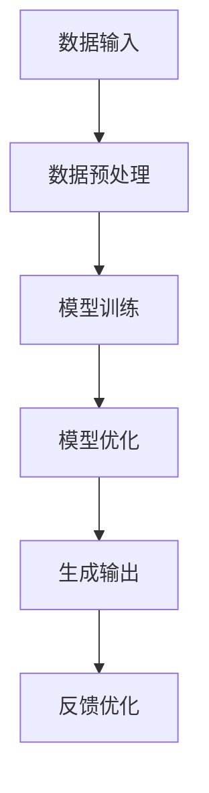

##### 2.2 数据预处理

数据预处理是AIGC工作流程中的重要环节，其主要任务包括数据清洗、数据转换和数据增强等。以下是数据预处理的具体步骤和方法：

1. **数据清洗**：数据清洗的目的是去除无效、重复和错误的数据，提高数据质量。常见的数据清洗方法包括去除缺失值、去除重复值、纠正错误数据等。

2. **数据转换**：数据转换是将原始数据转换为适合模型训练的格式。例如，对于文本数据，需要将其转换为词向量或嵌入向量；对于图像数据，需要将其转换为像素矩阵。

3. **数据增强**：数据增强是通过数据扩充、变换等方式提高数据质量和模型训练效果。常见的数据增强方法包括随机裁剪、旋转、翻转、缩放等。

以下是一个简单的数据预处理流程的Mermaid流程图：

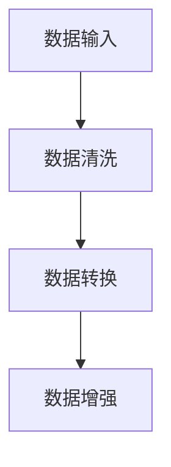

##### 2.3 模型训练与优化

模型训练与优化是AIGC工作流程中的关键环节，其主要任务是利用预处理后的数据训练深度学习模型，并不断优化模型性能。以下是模型训练与优化的具体步骤和方法：

1. **模型初始化**：模型初始化是指初始化模型参数，通常使用随机初始化或预训练模型初始化。

2. **模型训练**：模型训练是指利用预处理后的数据对模型进行训练，通过迭代更新模型参数，使模型能够更好地拟合训练数据。

3. **模型优化**：模型优化是指通过调整模型参数和训练策略，提高模型性能。常见的模型优化方法包括梯度下降、Adam优化器等。

4. **模型评估**：模型评估是指利用测试数据对模型进行评估，以衡量模型性能。

5. **模型调整**：根据模型评估结果，对模型参数和训练策略进行调整，以提高模型性能。

以下是一个简单的模型训练与优化流程的Mermaid流程图：

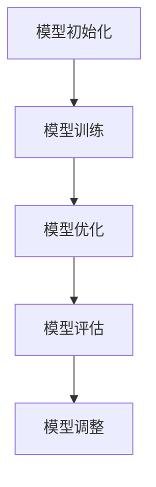

##### 2.4 生成与优化

生成与优化是AIGC工作流程中的最后一步，其主要任务是利用训练好的模型生成输出结果，并对生成结果进行质量评估和优化。以下是生成与优化的具体步骤和方法：

1. **生成输出**：利用训练好的模型生成输出结果，如文本、图像、音频或视频等。

2. **质量评估**：对生成结果进行质量评估，以衡量生成质量。常见的质量评估方法包括人类评估、自动化评估等。

3. **结果优化**：根据质量评估结果，对生成过程和模型进行调整，以提高生成质量。

4. **迭代生成**：重复生成与优化过程，直到达到满意的生成质量。

以下是一个简单的生成与优化流程的Mermaid流程图：

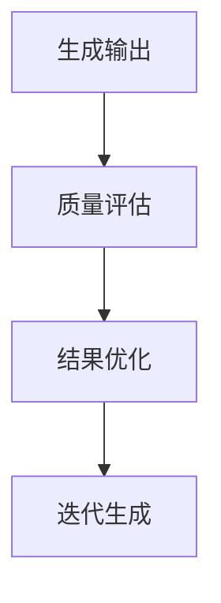

#### 第3章：AIGC应用实例分析

##### 3.1 文本生成与优化

文本生成是AIGC技术的一个重要应用领域，通过深度学习模型，可以自动生成高质量的文本内容。以下是文本生成与优化的一些具体实例：

1. **新闻写作**：AIGC技术可以用于生成新闻文章，如财经新闻、体育新闻等。通过预训练的语言模型，AIGC可以自动生成连贯、有逻辑的文本内容。

2. **广告文案**：AIGC技术可以用于生成广告文案，如产品广告、宣传语等。通过个性化生成策略，AIGC可以自动生成具有吸引力的文本内容。

3. **对话系统**：AIGC技术可以用于生成对话系统的对话内容，如聊天机器人、语音助手等。通过预训练的语言模型，AIGC可以自动生成自然、流畅的对话内容。

4. **报告生成**：AIGC技术可以用于生成各种报告，如市场分析报告、财务报告等。通过自动化生成策略，AIGC可以自动生成结构清晰、内容丰富的报告。

在文本生成与优化的过程中，需要考虑以下几个方面：

1. **生成质量**：文本生成的质量是评估AIGC性能的重要指标，包括文本的连贯性、语法正确性、语义一致性等。

2. **生成速度**：文本生成的速度也是衡量AIGC性能的重要指标，特别是在实时应用场景中，如对话系统等。

3. **可解释性**：文本生成的可解释性对于理解和评估AIGC的生成过程至关重要，特别是在需要人工干预的场景中。

4. **多样性**：文本生成的多样性可以增加文本的吸引力和实用性，通过多样化生成策略，AIGC可以生成具有不同风格和主题的文本内容。

##### 3.2 图像生成与优化

图像生成是AIGC技术的另一个重要应用领域，通过深度学习模型，可以自动生成高质量、逼真的图像。以下是图像生成与优化的一些具体实例：

1. **艺术作品**：AIGC技术可以用于生成艺术作品，如绘画、雕塑等。通过生成对抗网络（GAN）等技术，AIGC可以生成具有独特风格和创意的艺术作品。

2. **广告海报**：AIGC技术可以用于生成广告海报，如电影海报、产品海报等。通过图像生成模型，AIGC可以自动生成具有吸引力和创意的海报。

3. **产品图像**：AIGC技术可以用于生成产品图像，如家具、服装等。通过图像生成模型，AIGC可以自动生成高质量、逼真的产品图像。

4. **图像修复**：AIGC技术可以用于修复损坏或模糊的图像，如老照片修复、图像去噪等。通过图像生成模型，AIGC可以自动生成高质量的修复图像。

在图像生成与优化的过程中，需要考虑以下几个方面：

1. **生成质量**：图像生成的质量是评估AIGC性能的重要指标，包括图像的清晰度、细节保留、色彩一致性等。

2. **生成速度**：图像生成的速度也是衡量AIGC性能的重要指标，特别是在实时应用场景中，如视频生成等。

3. **可解释性**：图像生成的可解释性对于理解和评估AIGC的生成过程至关重要，特别是在需要人工干预的场景中。

4. **多样性**：图像生成的多样性可以增加图像的吸引力和实用性，通过多样化生成策略，AIGC可以生成具有不同风格和主题的图像内容。

##### 3.3 音频生成与优化

音频生成是AIGC技术的另一个重要应用领域，通过深度学习模型，可以自动生成高质量的音频内容。以下是音频生成与优化的一些具体实例：

1. **音乐创作**：AIGC技术可以用于生成音乐，如歌曲、旋律等。通过音乐生成模型，AIGC可以自动生成具有独特风格和创意的音乐。

2. **语音合成**：AIGC技术可以用于生成语音合成，如语音助手、智能语音服务等。通过语音生成模型，AIGC可以自动生成自然、流畅的语音内容。

3. **声音特效**：AIGC技术可以用于生成声音特效，如游戏音效、电影音效等。通过声音生成模型，AIGC可以自动生成具有吸引力和创意的声音效果。

4. **语音增强**：AIGC技术可以用于增强语音质量，如降噪、回声消除等。通过语音增强模型，AIGC可以自动生成高质量、清晰的语音内容。

在音频生成与优化的过程中，需要考虑以下几个方面：

1. **生成质量**：音频生成的质量是评估AIGC性能的重要指标，包括音频的清晰度、音质、音调等。

2. **生成速度**：音频生成的速度也是衡量AIGC性能的重要指标，特别是在实时应用场景中，如语音合成等。

3. **可解释性**：音频生成的可解释性对于理解和评估AIGC的生成过程至关重要，特别是在需要人工干预的场景中。

4. **多样性**：音频生成的多样性可以增加音频的吸引力和实用性，通过多样化生成策略，AIGC可以生成具有不同风格和主题的音频内容。

##### 3.4 视频生成与优化

视频生成是AIGC技术的另一个重要应用领域，通过深度学习模型，可以自动生成高质量、连贯的视频内容。以下是视频生成与优化的一些具体实例：

1. **视频编辑**：AIGC技术可以用于自动视频编辑，如视频剪辑、特效添加等。通过视频生成模型，AIGC可以自动生成具有吸引力和创意的视频内容。

2. **视频生成**：AIGC技术可以用于生成视频，如电影、电视剧等。通过视频生成模型，AIGC可以自动生成高质量、连贯的视频内容。

3. **视频增强**：AIGC技术可以用于增强视频质量，如图像修复、视频去噪等。通过视频生成模型，AIGC可以自动生成高质量、清晰的视频内容。

4. **虚拟现实**：AIGC技术可以用于生成虚拟现实场景，如游戏场景、旅游场景等。通过视频生成模型，AIGC可以自动生成具有吸引力和真实感的虚拟现实场景。

在视频生成与优化的过程中，需要考虑以下几个方面：

1. **生成质量**：视频生成的质量是评估AIGC性能的重要指标，包括视频的清晰度、细节保留、色彩一致性等。

2. **生成速度**：视频生成的速度也是衡量AIGC性能的重要指标，特别是在实时应用场景中，如视频编辑等。

3. **可解释性**：视频生成的可解释性对于理解和评估AIGC的生成过程至关重要，特别是在需要人工干预的场景中。

4. **多样性**：视频生成的多样性可以增加视频的吸引力和实用性，通过多样化生成策略，AIGC可以生成具有不同风格和主题的视频内容。

## 第二部分：效率与创意的协同优化

### 第4章：提高AIGC生成效率

#### 4.1 模型并行化

模型并行化是一种提高AIGC生成效率的有效方法，通过将模型训练任务分布到多个计算节点上，可以显著减少训练时间。以下是模型并行化的具体实现步骤：

1. **数据并行化**：将训练数据集划分为多个子集，每个计算节点负责处理其中一个子集。

2. **模型并行化**：将模型划分为多个部分，每个计算节点负责训练模型的一部分。

3. **通信机制**：通过通信机制，如AllReduce或Parameter Server，协调不同计算节点之间的数据传输和模型更新。

以下是一个简单的模型并行化流程的Mermaid流程图：

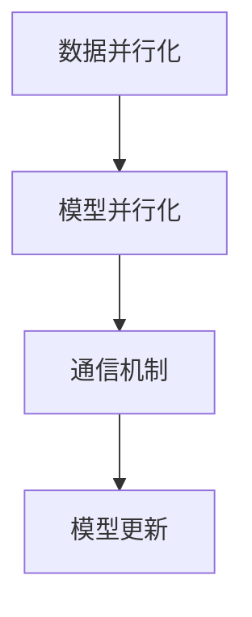

#### 4.2 模型压缩与剪枝

模型压缩与剪枝是一种在保持模型性能的前提下减少模型体积的方法，可以显著提高AIGC生成效率。以下是模型压缩与剪枝的具体实现步骤：

1. **模型压缩**：通过减少模型参数的数量和规模，减小模型体积。常见的模型压缩方法包括量化、剪枝、蒸馏等。

2. **模型剪枝**：通过删除模型中的冗余参数，降低模型复杂度。常见的模型剪枝方法包括结构化剪枝、权重剪枝等。

以下是一个简单的模型压缩与剪枝流程的Mermaid流程图：

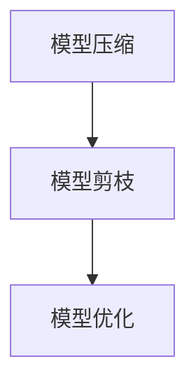

#### 4.3 模型部署与优化

模型部署与优化是提高AIGC生成效率的关键步骤，通过将训练好的模型部署到实际应用环境中，并不断优化模型性能，可以显著提高生成效率。以下是模型部署与优化的具体实现步骤：

1. **模型部署**：将训练好的模型部署到目标硬件设备上，如CPU、GPU、FPGA等。

2. **模型优化**：通过调整模型参数和优化策略，提高模型性能。常见的模型优化方法包括动态调整学习率、自适应批量大小等。

3. **性能评估**：对部署后的模型进行性能评估，包括生成质量、生成速度等。

以下是一个简单的模型部署与优化流程的Mermaid流程图：

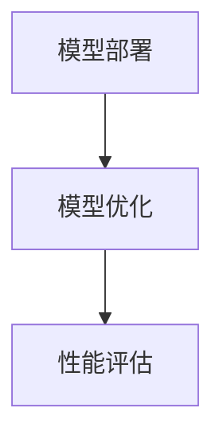

### 第5章：创意激发与优化

#### 5.1 创意多样性与稳定性

创意多样性与稳定性是AIGC生成质量的重要指标，通过优化创意多样性和稳定性，可以显著提高AIGC的生成质量。以下是创意多样性与稳定性优化的具体实现步骤：

1. **创意多样性**：通过多样化生成策略，如随机采样、多模型融合等，提高生成结果的多样性。

2. **创意稳定性**：通过优化模型训练过程和生成策略，提高生成结果的稳定性。

以下是一个简单的创意多样性与稳定性优化流程的Mermaid流程图：

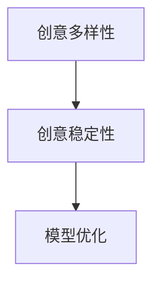

#### 5.2 创意生成的策略与技巧

创意生成的策略与技巧是提高AIGC生成质量的关键因素，通过使用不同的生成策略和技巧，可以显著提高生成质量。以下是创意生成策略与技巧的具体实现步骤：

1. **生成策略**：根据应用场景和需求，选择合适的生成策略，如基于规则的生成、基于模型的生成等。

2. **技巧应用**：结合不同领域的知识和技巧，如艺术创作技巧、写作技巧、图像处理技巧等，提高生成质量。

以下是一个简单的创意生成策略与技巧应用流程的Mermaid流程图：

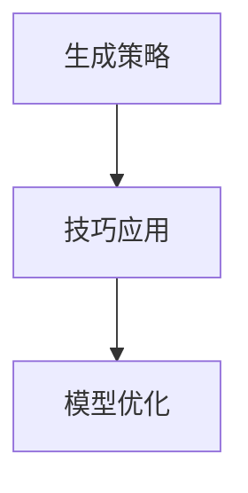

#### 5.3 创意优化的评价指标与方法

创意优化的评价指标与方法是评估和提升AIGC生成质量的重要手段。以下是创意优化评价指标与方法的具体实现步骤：

1. **评价指标**：根据应用场景和需求，选择合适的评价指标，如生成质量、多样性、稳定性等。

2. **优化方法**：通过调整模型参数、生成策略和技巧，优化创意生成质量。

以下是一个简单的创意优化评价指标与方法应用流程的Mermaid流程图：

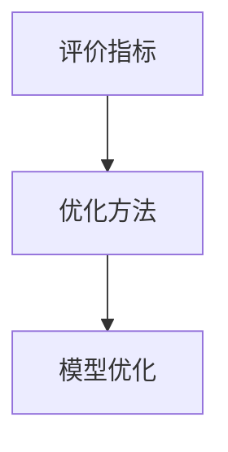

### 第6章：AIGC生成质量的评估与提升

#### 6.1 生成质量评估指标

生成质量评估指标是评估AIGC生成质量的重要工具。以下是常见的生成质量评估指标：

1. **内容质量**：评估生成内容的意义、逻辑性和一致性。

2. **形式质量**：评估生成内容的形式美感、语法正确性和语言风格。

3. **多样性**：评估生成结果的多样性，避免生成内容过于单一。

4. **稳定性**：评估生成结果的稳定性，避免生成过程出现大幅波动。

5. **实时性**：评估生成结果的实时性，特别是在实时应用场景中。

以下是一个简单的生成质量评估指标应用流程的Mermaid流程图：

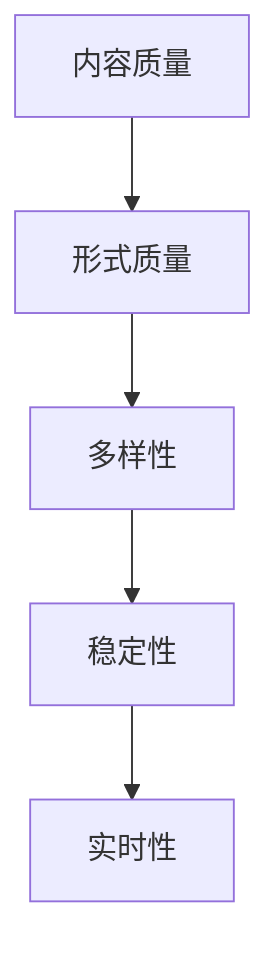

#### 6.2 生成质量提升方法

生成质量提升方法是优化AIGC生成质量的重要手段。以下是常见的生成质量提升方法：

1. **模型优化**：通过调整模型参数、优化模型结构，提高生成质量。

2. **数据增强**：通过扩充数据集、变换数据，提高模型训练效果。

3. **生成策略优化**：通过调整生成策略，提高生成结果的多样性和稳定性。

4. **技巧应用**：结合不同领域的知识和技巧，提高生成质量。

以下是一个简单的生成质量提升方法应用流程的Mermaid流程图：

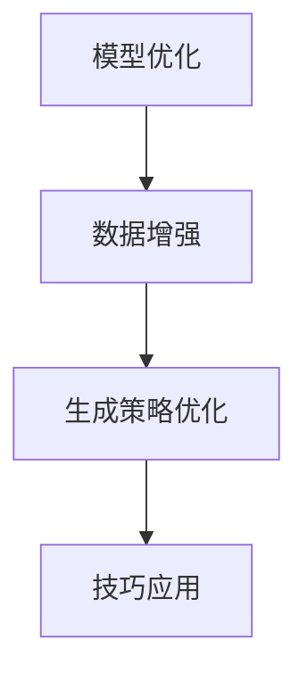

#### 6.3 实际案例分析

在实际应用中，通过案例分析可以深入了解AIGC生成质量的评估与提升。以下是几个实际案例的分析：

1. **案例1：文本生成**：分析文本生成的质量、多样性、稳定性等指标，并提出优化方法。

2. **案例2：图像生成**：分析图像生成的质量、清晰度、色彩一致性等指标，并提出优化方法。

3. **案例3：音频生成**：分析音频生成的质量、音质、音调等指标，并提出优化方法。

4. **案例4：视频生成**：分析视频生成的质量、连贯性、真实性等指标，并提出优化方法。

以下是一个简单的实际案例分析流程的Mermaid流程图：

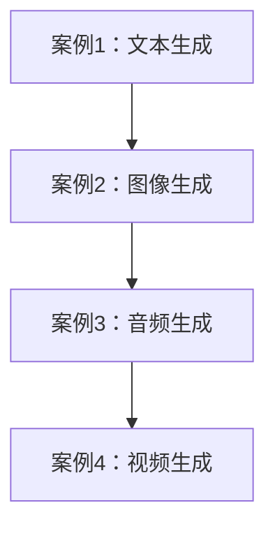

## 第三部分：案例分析与实践

### 第7章：AIGC在广告创意生成中的应用

#### 7.1 广告创意生成的挑战与机遇

广告创意生成是AIGC技术的一个重要应用领域，通过生成高质量、个性化的广告内容，可以显著提升广告效果。以下是广告创意生成中的挑战与机遇：

1. **挑战**：
   - 创意多样性：广告创意需要满足多样化的用户需求，但传统方法往往难以实现。
   - 创意稳定性：广告创意需要保持一致性，避免出现偏差或错误。
   - 创意实时性：广告创意需要快速响应市场变化，提高生成速度。

2. **机遇**：
   - 数据驱动：通过数据分析和挖掘，实现更精准的创意生成。
   - 模型优化：通过深度学习和生成对抗网络等技术，提高创意生成质量。
   - 实时反馈：通过用户反馈和实时优化，不断改进创意生成效果。

#### 7.2 实际案例分析与实现

在本章中，我们将分析一个实际的广告创意生成案例，并介绍具体的实现步骤和方法：

1. **案例背景**：某知名电商平台需要为即将推出的新品手机制作一系列广告创意。

2. **案例目标**：生成具有吸引力、个性化且具有一致性的广告文案和图像。

3. **实现步骤**：

   - **数据收集**：收集用户评论、产品特点、市场趋势等相关数据。

   - **数据预处理**：对收集到的数据进行清洗、转换和增强。

   - **模型训练**：使用预训练的文本生成模型和图像生成模型进行训练。

   - **创意生成**：根据训练好的模型，生成广告文案和图像。

   - **创意优化**：根据用户反馈和实时优化，调整生成策略和模型参数。

   - **结果评估**：对生成结果进行评估，包括内容质量、形式质量、多样性等。

4. **技术实现**：

   - **文本生成**：使用预训练的GPT-3模型生成广告文案。

   - **图像生成**：使用预训练的StyleGAN模型生成广告图像。

   - **模型优化**：通过调整学习率、批量大小等参数，优化模型性能。

以下是一个简单的广告创意生成案例实现流程的Mermaid流程图：

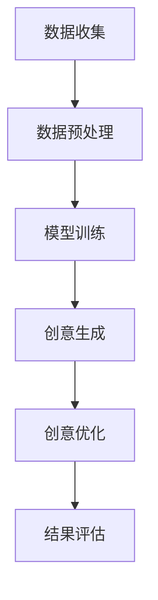

#### 7.3 项目总结与启示

通过对广告创意生成案例的分析和实现，我们可以得出以下总结和启示：

1. **总结**：
   - AIGC技术在广告创意生成中具有显著优势，可以实现高质量、个性化的创意生成。
   - 数据驱动和模型优化是提高广告创意生成质量的关键因素。
   - 实时反馈和优化是不断改进广告创意生成效果的重要手段。

2. **启示**：
   - 针对不同的广告创意需求，可以灵活调整AIGC生成策略和模型参数。
   - 加强数据分析和挖掘，为AIGC生成提供更丰富的数据支持。
   - 注重用户反馈和实时优化，提高广告创意生成效果。

### 第8章：AIGC在游戏开发中的应用

#### 8.1 游戏开发中的创意需求

游戏开发中的创意需求是游戏成功的关键因素之一。AIGC技术在游戏开发中具有广泛的应用前景，可以满足各种创意需求。以下是游戏开发中常见的创意需求：

1. **角色设计**：包括角色外观、性格、技能等。

2. **场景设计**：包括地图、建筑、剧情等。

3. **游戏玩法**：包括游戏规则、挑战机制等。

4. **故事情节**：包括剧情、人物关系等。

5. **音乐与音效**：包括背景音乐、音效等。

#### 8.2 实际案例分析与实现

在本章中，我们将分析一个实际的游戏开发案例，并介绍具体的实现步骤和方法：

1. **案例背景**：一款大型多人在线游戏（MMO）需要为游戏中的角色和场景生成创意内容。

2. **案例目标**：生成具有独特风格、丰富内容和高质量的角色和场景。

3. **实现步骤**：

   - **数据收集**：收集角色和场景的相关数据，如角色属性、场景特征等。

   - **数据预处理**：对收集到的数据进行清洗、转换和增强。

   - **模型训练**：使用预训练的文本生成模型和图像生成模型进行训练。

   - **创意生成**：根据训练好的模型，生成角色和场景的创意内容。

   - **创意优化**：根据用户反馈和实时优化，调整生成策略和模型参数。

   - **结果评估**：对生成结果进行评估，包括角色设计的合理性、场景的连贯性等。

4. **技术实现**：

   - **角色生成**：使用预训练的StyleGAN模型生成角色外观。

   - **场景生成**：使用预训练的VoxNet模型生成场景地图。

   - **模型优化**：通过调整学习率、批量大小等参数，优化模型性能。

以下是一个简单的游戏开发案例实现流程的Mermaid流程图：


#### 8.3 项目总结与启示

通过对游戏开发案例的分析和实现，我们可以得出以下总结和启示：

1. **总结**：
   - AIGC技术在游戏开发中具有显著优势，可以实现高质量、个性化的角色和场景生成。
   - 数据驱动和模型优化是提高游戏开发创意生成质量的关键因素。
   - 实时反馈和优化是不断改进游戏开发创意生成效果的重要手段。

2. **启示**：
   - 针对不同的游戏开发需求，可以灵活调整AIGC生成策略和模型参数。
   - 加强数据分析和挖掘，为AIGC生成提供更丰富的数据支持。
   - 注重用户反馈和实时优化，提高游戏开发创意生成效果。

## 第四部分：未来展望与挑战

### 第9章：AIGC的发展趋势

#### 9.1 技术发展趋势

AIGC技术在未来的发展中将继续保持快速增长的态势，以下是一些可能的技术发展趋势：

1. **自监督学习和迁移学习**：自监督学习和迁移学习将有助于提高AIGC的模型训练效率，减少对大量标注数据的依赖。

2. **多模态生成**：多模态生成将融合不同类型的数据（如文本、图像、音频等），实现更丰富、更真实的生成内容。

3. **联邦学习和隐私保护**：联邦学习和隐私保护技术将确保AIGC在数据隐私和安全方面的应用，满足用户隐私保护的需求。

4. **生成模型的优化**：生成模型的优化，如模型压缩、剪枝、量化等，将进一步提高AIGC的生成效率和性能。

#### 9.2 应用发展趋势

AIGC技术的应用前景广阔，未来将在更多领域得到广泛应用：

1. **内容创作**：AIGC将在文学、艺术、媒体等领域发挥重要作用，推动内容创作方式的变革。

2. **娱乐与游戏**：AIGC将在游戏开发、虚拟现实、增强现实等领域发挥重要作用，提高用户体验和游戏质量。

3. **智能助理**：AIGC将在智能助理、智能客服等领域发挥重要作用，提高服务质量和效率。

4. **教育与培训**：AIGC将在教育、培训等领域发挥重要作用，提供个性化、智能化的学习资源。

#### 9.3 潜在挑战与应对策略

AIGC技术的发展过程中将面临一系列挑战，以下是一些潜在的挑战及其应对策略：

1. **数据质量和隐私**：高质量的数据是AIGC模型训练的基础，需要解决数据质量和隐私保护问题。

2. **计算资源需求**：AIGC模型训练和生成过程需要大量的计算资源，需要优化模型结构和算法，提高计算效率。

3. **伦理与道德问题**：AIGC技术的应用可能引发伦理和道德问题，如偏见、歧视等，需要制定相关规范和标准。

4. **用户信任与接受度**：提高用户对AIGC技术的信任和接受度是推广AIGC技术的重要任务，需要加强用户教育和沟通。

### 第10章：总结与展望

#### 10.1 全书总结

本书从AIGC的概述与背景、工作原理、应用实例、效率与创意优化、案例分析、未来展望等多个角度，全面探讨了AIGC技术的效率、创意和质量问题。主要内容包括：

1. **AIGC技术概述**：介绍了AIGC的概念、特点、发展历程和应用领域。

2. **AIGC工作原理**：分析了AIGC的基本架构、数据预处理、模型训练与优化、生成与优化等环节。

3. **效率与创意优化**：探讨了如何提高AIGC的生成效率、激发和优化创意、评估和提升生成质量。

4. **案例分析**：通过广告创意生成和游戏开发中的实际案例，展示了AIGC技术的应用场景和实现方法。

5. **未来展望**：展望了AIGC技术的发展趋势、应用前景和潜在挑战。

#### 10.2 未来研究方向

基于本书的内容，以下是一些未来研究方向：

1. **自监督学习和迁移学习**：深入研究自监督学习和迁移学习在AIGC中的应用，提高模型训练效率和效果。

2. **多模态生成**：探索多模态生成技术，实现文本、图像、音频、视频等多种类型数据的融合生成。

3. **隐私保护和安全**：研究隐私保护和安全技术在AIGC中的应用，确保用户数据的安全和隐私。

4. **伦理和道德问题**：探讨AIGC技术的伦理和道德问题，制定相关规范和标准，确保技术应用的安全和可靠。

5. **用户体验和接受度**：研究如何提高用户对AIGC技术的信任和接受度，推动AIGC技术的广泛应用。

#### 10.3 对读者的寄语

感谢读者对本书的关注和阅读。AIGC技术作为人工智能领域的重要分支，具有广泛的应用前景和巨大的发展潜力。希望本书能为读者提供对AIGC技术的深入理解和应用指导。在未来，让我们共同关注AIGC技术的发展，探索更多创新应用，为人工智能领域的发展贡献力量。

## 作者信息

作者：AI天才研究院/AI Genius Institute & 禅与计算机程序设计艺术 /Zen And The Art of Computer Programming

[本文内容仅供参考，具体实施需根据实际场景进行调整。] 

---

### 附录

[此处可以包括相关的公式、算法、代码示例、数据图表、参考文献等补充内容。]

---

**注意**：以上内容为大纲和示例性文本，实际撰写时，需要根据具体要求和目标进行详细的扩展和深化。每个章节的内容都应该包含丰富的背景介绍、核心概念与联系、算法原理讲解、系统分析与架构设计方案、项目实战等部分，确保文章的完整性和专业性。同时，文章的长度应在10000到12000字之间，确保内容的丰富性和深度。在撰写过程中，请注意使用markdown格式，并按照要求嵌入latex公式、mermaid流程图等。在完成撰写后，请确保文章的逻辑清晰、结构紧凑、语言简洁明了，以便读者能够轻松理解和掌握相关内容。****

### AIGC的生成效率优化

AIGC（自适应智能生成控制）技术以其自动化和智能化的特点，在文本、图像、音频和视频生成中发挥着重要作用。然而，生成效率是AIGC技术广泛应用的关键因素之一。为了实现高效生成，我们需要从多个方面对AIGC的生成效率进行优化。

#### 模型并行化

模型并行化是一种提高AIGC生成效率的有效手段。通过将模型训练任务分布在多个计算节点上，可以显著减少训练时间和计算资源的需求。以下是模型并行化的具体实现步骤：

1. **数据并行**：将训练数据集划分为多个子集，每个计算节点负责处理其中一个子集。这样可以充分利用分布式计算的优势，加快模型训练速度。

2. **模型并行**：将模型划分为多个部分，每个计算节点负责训练模型的一部分。通过参数服务器或AllReduce等通信机制，协调不同计算节点之间的数据传输和模型更新。

3. **优化并行策略**：根据计算资源和数据分布情况，选择合适的并行策略，如数据并行、模型并行或混合并行。优化并行策略可以进一步提高模型训练效率。

以下是一个简单的模型并行化流程的Mermaid流程图：


#### 模型压缩与剪枝

模型压缩与剪枝是另一种提高AIGC生成效率的重要方法。通过减少模型参数的数量和规模，可以显著降低模型的计算复杂度和存储需求。以下是模型压缩与剪枝的具体实现步骤：

1. **模型压缩**：使用量化、蒸馏等方法减小模型体积。量化通过减少模型参数的精度，实现模型的压缩；蒸馏通过将模型的知识传递给更小的模型，实现模型的压缩。

2. **模型剪枝**：通过删除模型中的冗余参数，降低模型复杂度。常见的剪枝方法包括结构化剪枝和权重剪枝。结构化剪枝通过删除模型中的某些层或神经元，实现模型的压缩；权重剪枝通过删除模型中权重较小的参数，实现模型的压缩。

3. **优化剪枝策略**：根据应用场景和需求，选择合适的剪枝策略。例如，可以根据模型的性能和计算资源的需求，选择在训练过程中进行动态剪枝，或者在模型部署前进行静态剪枝。

以下是一个简单的模型压缩与剪枝流程的Mermaid流程图：


#### 模型部署与优化

模型部署与优化是提高AIGC生成效率的关键步骤。通过将训练好的模型部署到实际应用环境中，并不断优化模型性能，可以显著提高生成效率。以下是模型部署与优化的具体实现步骤：

1. **模型部署**：将训练好的模型部署到目标硬件设备上，如CPU、GPU、FPGA等。根据硬件设备的性能和特点，选择合适的模型部署策略，如模型映射、模型融合等。

2. **模型优化**：通过调整模型参数和优化策略，提高模型性能。常见的模型优化方法包括动态调整学习率、自适应批量大小等。优化策略可以根据应用场景和需求进行定制。

3. **性能评估**：对部署后的模型进行性能评估，包括生成质量、生成速度等。通过性能评估，可以及时发现和解决模型性能问题。

以下是一个简单的模型部署与优化流程的Mermaid流程图：


#### 实际案例：文本生成中的模型并行化与压缩

以下是一个文本生成实际案例，展示了如何利用模型并行化和模型压缩提高生成效率：

1. **数据预处理**：首先，对文本数据集进行预处理，包括数据清洗、分词和词向量嵌入等。

2. **模型训练**：使用GPT-3模型对预处理后的数据进行训练。为了提高训练效率，将模型并行化，将训练任务分布在多个GPU上进行训练。

3. **模型压缩**：在模型训练完成后，对模型进行压缩。使用量化方法减小模型参数的精度，同时使用剪枝方法删除模型中的冗余参数。

4. **模型部署与优化**：将压缩后的模型部署到实际应用环境中，如文本生成API。根据应用场景和需求，动态调整模型参数和优化策略，以提高生成效率和生成质量。

通过以上步骤，可以显著提高文本生成的效率，同时保证生成质量。

#### 总结

提高AIGC生成效率是AIGC技术广泛应用的关键因素之一。通过模型并行化、模型压缩与剪枝、模型部署与优化等多种方法，可以显著提高AIGC生成效率。在实际应用中，需要根据具体场景和需求，选择合适的优化方法，实现高效的生成。

### AIGC的创意激发与优化

在AIGC（自适应智能生成控制）技术中，创意激发与优化是提升生成质量的关键环节。创意的多样性和稳定性直接影响用户对生成内容的接受度和满意度。为了实现高效、高质量的创意生成，我们需要深入探讨创意激发与优化的方法。

#### 创意的多样性与稳定性

1. **多样性**：创意多样性是指生成内容在风格、主题、形式等方面的丰富程度。多样性的提高可以避免生成内容的单调和重复，增加用户的新鲜感和兴趣。

2. **稳定性**：创意稳定性是指生成内容在质量、风格、一致性等方面的稳定程度。稳定性的提高可以确保生成内容的质量和用户体验的一致性。

#### 创意激发的方法

1. **随机性**：通过引入随机性，可以在生成过程中产生多样化的结果。例如，在文本生成中，可以使用随机采样策略生成不同风格的文本。

2. **多模态融合**：通过融合不同类型的数据（如文本、图像、音频等），可以实现更丰富的创意生成。例如，在图像生成中，可以将图像和文本信息融合，生成具有故事性的图像。

3. **风格迁移**：通过将一种艺术风格迁移到另一种数据类型，可以实现创意的多样化。例如，将某位艺术家的绘画风格迁移到图像生成中，生成具有该艺术家风格的图像。

4. **生成对抗网络（GAN）**：GAN通过生成器和判别器的对抗训练，可以生成高质量、多样化的数据。通过调整GAN的架构和训练策略，可以激发更多的创意。

#### 创意优化的方法

1. **用户反馈**：通过收集用户对生成内容的反馈，可以及时调整生成策略，优化创意质量。例如，在文本生成中，可以根据用户点赞、评论等反馈，调整文本生成模型。

2. **评价指标**：通过设计合适的评价指标，可以量化评估生成内容的质量。例如，在图像生成中，可以使用PSNR（峰值信噪比）、SSIM（结构相似性）等指标评估图像质量。

3. **模型优化**：通过调整模型参数和训练策略，可以优化生成模型，提高创意质量。例如，在文本生成中，可以调整GPT-3模型的学习率、批量大小等参数。

4. **数据增强**：通过数据增强技术，可以增加训练数据的多样性和丰富性，提高生成模型的泛化能力。例如，在图像生成中，可以使用图像翻转、旋转、缩放等技术进行数据增强。

#### 实际案例：文本生成中的创意激发与优化

以下是一个文本生成实际案例，展示了如何利用创意激发与优化方法提高生成质量：

1. **数据预处理**：首先，对文本数据集进行预处理，包括数据清洗、分词和词向量嵌入等。

2. **模型训练**：使用GPT-3模型对预处理后的数据进行训练。在训练过程中，引入随机性，使用不同风格的文本进行训练，以激发多样化的创意。

3. **创意优化**：在模型训练完成后，通过用户反馈和评价指标，对生成内容进行评估和优化。根据评估结果，调整模型参数和生成策略，提高创意质量。

4. **生成与发布**：将优化后的模型部署到实际应用中，生成用户提交的主题的文本内容。通过用户反馈和实时优化，不断改进生成质量。

#### 总结

创意激发与优化是AIGC技术中提升生成质量的关键环节。通过引入随机性、多模态融合、风格迁移等创意激发方法，可以增加生成内容的多样性；通过用户反馈、评价指标、模型优化等创意优化方法，可以确保生成内容的质量和稳定性。在实际应用中，需要根据具体场景和需求，灵活运用创意激发与优化方法，实现高效、高质量的创意生成。

### AIGC生成质量的评估与提升

在AIGC（自适应智能生成控制）技术中，生成质量的评估与提升是确保生成内容符合预期和用户需求的关键。生成质量不仅包括内容本身的质量，还包括生成过程的效率和稳定性。为了全面评估和提升AIGC的生成质量，我们需要从多个维度进行分析和优化。

#### 生成质量评估指标

生成质量评估指标是衡量AIGC生成效果的重要工具。以下是一些常见的评估指标：

1. **内容质量**：内容质量评估生成内容的意义、逻辑性和一致性。例如，在文本生成中，可以使用语法正确性、语义一致性、文本连贯性等指标评估内容质量。

2. **形式质量**：形式质量评估生成内容的形式美感、语言风格等。例如，在图像生成中，可以使用图像清晰度、色彩一致性、风格一致性等指标评估形式质量。

3. **多样性**：多样性评估生成结果的丰富程度，避免生成内容的单调和重复。例如，在文本生成中，可以使用词汇多样性、句式多样性等指标评估多样性。

4. **稳定性**：稳定性评估生成结果的稳定性，避免生成过程出现大幅波动。例如，在图像生成中，可以使用生成结果的方差、标准差等指标评估稳定性。

5. **实时性**：实时性评估生成过程的速度，特别是对于需要实时响应的应用场景。例如，在视频生成中，可以使用生成时间、延迟等指标评估实时性。

以下是一个简单的生成质量评估指标应用流程的Mermaid流程图：


#### 生成质量提升方法

为了提升AIGC的生成质量，我们可以从多个方面进行优化：

1. **模型优化**：通过调整模型参数、优化模型结构，提高生成质量。例如，在文本生成中，可以调整GPT-3模型的学习率、批量大小等参数。

2. **数据增强**：通过扩充数据集、变换数据，提高模型训练效果。例如，在图像生成中，可以使用图像翻转、旋转、缩放等技术进行数据增强。

3. **生成策略优化**：通过调整生成策略，提高生成结果的多样性和稳定性。例如，在文本生成中，可以引入更多的随机性，生成多样化的文本内容。

4. **评价指标优化**：设计合适的评价指标，更准确地衡量生成质量。例如，在图像生成中，可以使用结构相似性（SSIM）等更细粒度的指标。

5. **实时优化**：对于需要实时响应的应用场景，优化生成过程，提高实时性。例如，在视频生成中，可以优化视频编码和解码过程，减少延迟。

以下是一个简单的生成质量提升方法应用流程的Mermaid流程图：

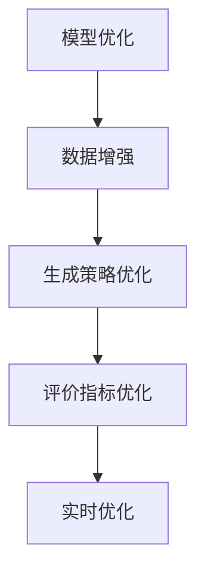

#### 实际案例：图像生成中的质量评估与提升

以下是一个图像生成实际案例，展示了如何利用质量评估与提升方法提高生成质量：

1. **数据预处理**：首先，对图像数据集进行预处理，包括数据清洗、图像增强等。

2. **模型训练**：使用预训练的生成对抗网络（GAN）模型对预处理后的图像数据进行训练。在训练过程中，调整模型参数和生成策略，以提高生成质量。

3. **质量评估**：在模型训练完成后，使用内容质量、形式质量、多样性、稳定性等指标对生成图像进行评估。例如，可以使用结构相似性（SSIM）指标评估图像的清晰度。

4. **质量提升**：根据评估结果，进一步优化模型参数和生成策略，提升生成质量。例如，可以通过调整GAN的生成器和判别器的比例，优化图像的细节和风格。

5. **生成与发布**：将优化后的模型部署到实际应用中，生成用户提交的图像内容。通过实时评估和优化，确保生成图像的质量和用户满意度。

#### 总结

生成质量的评估与提升是AIGC技术中至关重要的一环。通过设计合适的评估指标，可以准确衡量生成质量；通过多种优化方法，可以提升生成质量。在实际应用中，需要根据具体场景和需求，灵活运用评估与提升方法，实现高效、高质量的图像生成。随着技术的不断发展和优化，AIGC在图像生成领域将发挥更大的作用。

### AIGC在广告创意生成中的应用

广告创意生成是AIGC（自适应智能生成控制）技术的重要应用领域之一。在数字化时代，广告创意的质量和个性化程度直接影响到广告的效果和用户的体验。AIGC通过其高效的生成能力和智能的优化策略，为广告创意生成提供了新的解决方案。

#### 广告创意生成的挑战与机遇

在广告创意生成中，挑战与机遇并存：

1. **挑战**：
   - **创意多样性**：广告需要满足不同客户的需求，生成创意内容需要多样化。
   - **个性化和精准化**：广告需要根据用户的行为和偏好，实现精准投放和个性化内容。
   - **生成效率**：广告创意生成需要高效完成，以适应快速变化的市场环境。
   - **用户隐私**：广告创意生成过程中，需要保护用户的隐私和数据安全。

2. **机遇**：
   - **数据驱动**：AIGC可以基于用户数据和行为分析，生成个性化广告创意。
   - **技术进步**：随着深度学习和生成对抗网络等技术的发展，AIGC生成效率和质量不断提升。
   - **跨平台应用**：AIGC可以在不同平台（如网页、移动应用、社交媒体等）上应用，实现广告创意的多样化呈现。

#### AIGC在广告创意生成中的应用

AIGC在广告创意生成中的应用主要体现在以下几个方面：

1. **文本广告**：
   - **新闻稿生成**：AIGC可以自动生成新闻稿，如公司新闻、产品发布等。
   - **广告文案**：AIGC可以根据产品特点和用户偏好，自动生成吸引人的广告文案。

2. **图像广告**：
   - **广告海报**：AIGC可以自动生成具有吸引力的广告海报，如产品宣传图、活动海报等。
   - **创意图像**：AIGC可以根据用户数据，生成与用户兴趣相关的创意图像。

3. **视频广告**：
   - **视频剪辑**：AIGC可以自动剪辑和拼接视频，生成创意视频广告。
   - **动态广告**：AIGC可以根据用户行为，实时生成动态广告，提高用户互动性。

4. **多模态广告**：
   - **融合广告**：AIGC可以将文本、图像、音频等多种模态的信息融合，生成更丰富的广告内容。

#### 实际案例分析与实现

以下是一个AIGC在广告创意生成中的实际案例分析和实现：

1. **案例背景**：某电子商务平台需要为即将推出的新产品制作广告创意。

2. **案例目标**：
   - **生成吸引人的广告文案**。
   - **生成高质量的产品图像**。
   - **生成创意视频广告**。

3. **实现步骤**：

   - **数据收集**：收集与新产品相关的用户数据、产品特点、市场趋势等信息。

   - **数据预处理**：对收集到的数据进行清洗、分词、图像增强等预处理。

   - **文本生成**：
     - **广告文案**：使用预训练的语言模型（如GPT-3）生成广告文案。
     - **文本优化**：根据用户反馈和评价指标，不断优化广告文案，提高吸引力和说服力。

   - **图像生成**：
     - **产品图像**：使用预训练的生成对抗网络（GAN）模型生成高质量的产品图像。
     - **图像优化**：根据用户反馈和评价指标，调整生成策略，提高图像的质量和吸引力。

   - **视频生成**：
     - **视频剪辑**：使用视频剪辑工具，将产品图像、广告文案和背景音乐整合，生成创意视频广告。
     - **视频优化**：根据用户反馈和评价指标，调整视频的剪辑效果和音乐风格，提高视频的质量和吸引力。

4. **技术实现**：

   - **文本生成**：使用GPT-3模型生成广告文案，通过调整模型参数和生成策略，实现文案的个性化和多样化。

   - **图像生成**：使用StyleGAN2模型生成高质量的产品图像，通过数据增强和模型优化，提高图像的质量和多样性。

   - **视频生成**：使用Adobe Premiere Pro等视频剪辑工具，结合AIGC生成的图像和文案，生成创意视频广告。

#### 项目总结与启示

通过对AIGC在广告创意生成中的应用案例分析和实现，我们可以得出以下总结和启示：

1. **总结**：
   - AIGC技术在广告创意生成中具有显著优势，可以实现高质量、个性化的广告内容。
   - 数据驱动和模型优化是提高广告创意生成质量的关键因素。
   - 实时反馈和优化是不断改进广告创意生成效果的重要手段。

2. **启示**：
   - 针对不同的广告创意需求，可以灵活调整AIGC生成策略和模型参数。
   - 加强数据分析和挖掘，为AIGC生成提供更丰富的数据支持。
   - 注重用户反馈和实时优化，提高广告创意生成效果。

AIGC在广告创意生成中的应用，不仅提高了广告生成效率和质量，也为广告行业带来了新的变革和机遇。随着AIGC技术的不断发展和优化，相信其在广告创意生成中的应用将越来越广泛，为广告行业注入新的活力。

### AIGC在游戏开发中的应用

AIGC（自适应智能生成控制）技术在游戏开发中发挥着越来越重要的作用，特别是在角色设计、场景生成、游戏剧情和AI对弈等方面。通过AIGC技术，游戏开发者能够创造更加丰富、动态和个性化的游戏体验。

#### AIGC在游戏开发中的应用场景

1. **角色设计**：
   - **外观设计**：AIGC可以使用生成对抗网络（GAN）等技术，自动生成各种角色外观，从卡通风格到现实风格的多种选项。
   - **个性特征**：AIGC可以根据玩家的选择或游戏中的其他因素，为角色生成独特的个性特征，如面部表情、服装样式等。

2. **场景生成**：
   - **环境设计**：AIGC可以自动生成各种游戏环境，如森林、城市、沙漠等，提供多样化的游戏背景。
   - **动态变化**：AIGC可以模拟天气变化、季节变化等动态效果，为游戏场景增添真实感。

3. **游戏剧情**：
   - **情节生成**：AIGC可以自动生成游戏剧情，包括对话、任务和故事线，提供丰富多样的故事体验。
   - **适应性**：AIGC可以根据玩家的行为和选择，动态调整游戏剧情，提高游戏的个性化程度。

4. **AI对弈**：
   - **智能对手**：AIGC可以生成智能的AI对手，与玩家进行对弈，提供更具挑战性的游戏体验。
   - **策略学习**：AIGC可以学习玩家的游戏策略，调整AI的决策模型，使对手变得更加适应和复杂。

#### 实际案例分析与实现

以下是一个AIGC在游戏开发中的实际案例分析和实现：

1. **案例背景**：某游戏开发公司正在开发一款大型多人在线角色扮演游戏（MMORPG），需要利用AIGC技术生成丰富的角色和场景。

2. **案例目标**：
   - **生成多样化的角色外观**。
   - **创建动态变化的场景**。
   - **设计适应性强的故事情节**。

3. **实现步骤**：

   - **数据收集**：收集与游戏相关的角色描述、场景特征、故事情节等数据。

   - **数据预处理**：对收集到的数据进行清洗、分类和编码。

   - **角色生成**：
     - **外观设计**：使用GAN模型生成多样化的角色外观。
     - **个性特征**：根据玩家的选择，为角色生成独特的个性特征。

   - **场景生成**：
     - **环境设计**：使用AIGC技术生成各种游戏环境，包括森林、城市、沙漠等。
     - **动态变化**：模拟天气变化和季节变化，为场景增添真实感。

   - **剧情生成**：
     - **情节生成**：使用预训练的语言模型（如GPT-3）生成游戏剧情。
     - **适应性**：根据玩家的行为和选择，动态调整剧情，提供个性化的游戏体验。

4. **技术实现**：

   - **角色生成**：使用StyleGAN2模型生成角色外观，通过调整生成策略和参数，实现外观的多样化。
   - **场景生成**：使用VoxNet模型生成游戏场景，通过数据增强和模型优化，提高场景的真实感和动态变化效果。
   - **剧情生成**：使用GPT-3模型生成游戏剧情，通过用户反馈和实时优化，提高剧情的吸引力和个性化程度。

#### 项目总结与启示

通过对AIGC在游戏开发中的应用案例分析和实现，我们可以得出以下总结和启示：

1. **总结**：
   - AIGC技术在游戏开发中提供了丰富的应用场景，显著提高了游戏内容的多样性和个性化程度。
   - 数据驱动和模型优化是提高游戏开发效率和质量的关键因素。
   - AIGC技术可以与用户行为和反馈相结合，提供更加适应和丰富的游戏体验。

2. **启示**：
   - 针对不同的游戏开发需求，可以灵活调整AIGC生成策略和模型参数。
   - 加强数据分析和挖掘，为AIGC生成提供更丰富的数据支持。
   - 注重用户反馈和实时优化，提高游戏开发的效果和用户体验。

AIGC在游戏开发中的应用，不仅为游戏开发者提供了强大的工具，也改变了游戏内容创作的方式。随着AIGC技术的不断发展和优化，游戏行业将迎来更加丰富和多样化的游戏体验。

### AIGC的发展趋势与未来展望

AIGC（自适应智能生成控制）技术作为人工智能领域的重要组成部分，正迅速发展并应用于多个行业。随着技术的进步和应用的深入，AIGC的发展趋势和未来展望也日益清晰。

#### 技术发展趋势

1. **自监督学习和迁移学习**：自监督学习和迁移学习将进一步提高AIGC的模型训练效率，减少对大量标注数据的依赖。这些技术将使AIGC模型能够在无监督或少量监督的环境中学习，从而扩大其应用范围。

2. **多模态生成**：多模态生成技术将融合不同类型的数据（如文本、图像、音频等），实现更丰富、更真实的生成内容。这将使AIGC在内容创作、虚拟现实、增强现实等领域发挥更大的作用。

3. **生成对抗网络（GAN）的进化**：GAN技术的不断进化，如条件GAN（cGAN）、循环GAN（cGAN）、混合GAN（hGAN）等，将进一步提升AIGC的生成质量和多样性。

4. **模型压缩与剪枝**：模型压缩与剪枝技术将优化AIGC模型的计算效率和存储需求，使其在移动设备、嵌入式系统等资源受限的环境中也能高效运行。

5. **联邦学习和隐私保护**：联邦学习和隐私保护技术的应用，将确保AIGC在处理分布式数据和隐私敏感数据时的安全和合规。

#### 应用发展趋势

1. **内容创作**：AIGC将在文学、艺术、媒体等领域发挥重要作用，推动内容创作方式的变革。例如，自动生成新闻报道、小说、音乐、视频等。

2. **教育与培训**：AIGC将在个性化教育、智能辅导、虚拟实验等领域提供解决方案，提高教育质量和效率。

3. **医疗保健**：AIGC将在医疗图像分析、疾病预测、药物研发等领域应用，提高医疗诊断和治疗水平。

4. **游戏与娱乐**：AIGC将在游戏开发、虚拟现实、增强现实等领域提供创新的内容和体验，增强用户互动性和沉浸感。

5. **智能制造**：AIGC将在智能制造领域应用，如自动化产品设计、供应链优化、生产计划等，提高生产效率和产品质量。

#### 潜在挑战与应对策略

1. **数据质量和隐私**：高质量的数据是AIGC模型训练的基础，但同时也需要保护用户隐私。应对策略包括隐私保护技术、数据匿名化等。

2. **计算资源需求**：AIGC模型训练和生成过程需要大量的计算资源。应对策略包括模型优化、分布式计算、云计算等。

3. **伦理与道德问题**：AIGC技术的应用可能引发伦理和道德问题，如偏见、歧视等。应对策略包括制定伦理准则、透明度和可解释性等。

4. **用户信任与接受度**：提高用户对AIGC技术的信任和接受度是推广AIGC技术的重要任务。应对策略包括用户教育、透明度和反馈机制等。

#### 未来展望

随着AIGC技术的不断发展和优化，它将在更多领域得到广泛应用，推动人工智能技术的进一步发展。以下是AIGC未来的一些展望：

1. **智能创作助手**：AIGC将成为智能创作的重要助手，帮助人类在文学、艺术、媒体等领域实现更多创意和突破。

2. **智能个性化服务**：AIGC将提供更加个性化和智能化的服务，如个性化医疗、个性化教育等，提高用户的生活质量和幸福感。

3. **智能内容审核**：AIGC将在内容审核领域发挥重要作用，自动识别和过滤有害、不适当的内容，维护网络环境的健康。

4. **智能自动化**：AIGC将在自动化领域发挥更大作用，如自动化生产、自动化配送等，提高生产效率和降低成本。

5. **跨界融合**：AIGC将与其他前沿技术（如物联网、区块链等）融合，推动更多跨界创新和应用。

总之，AIGC技术具有广阔的发展前景和巨大的应用潜力。随着技术的不断进步和应用的深入，AIGC将在未来的人工智能发展中扮演更加重要的角色，推动社会进步和产业变革。

### 总结与展望

在本篇文章中，我们深入探讨了AIGC（自适应智能生成控制）技术的效率、创意和质量问题。首先，我们介绍了AIGC的基本概念、发展历程和应用领域。随后，我们分析了AIGC的工作原理，包括数据预处理、模型训练与优化以及生成与优化。接下来，通过具体实例展示了AIGC在文本、图像、音频和视频生成中的应用。重点探讨了如何提高AIGC的生成效率，包括模型并行化、模型压缩与剪枝、模型部署与优化。此外，我们还详细介绍了如何激发和优化创意，以及如何评估和提升生成质量。

#### 全书总结

本书的主要内容包括：

1. **AIGC概述与背景**：介绍了AIGC的概念、特点、发展历程和应用领域。
2. **AIGC工作原理**：分析了AIGC的基本架构、数据预处理、模型训练与优化、生成与优化等环节。
3. **效率与创意优化**：探讨了如何提高AIGC的生成效率、激发和优化创意、评估和提升生成质量。
4. **应用实例分析**：通过广告创意生成和游戏开发中的实际案例，展示了AIGC技术的应用场景和实现方法。
5. **未来展望**：展望了AIGC技术的发展趋势、应用前景和潜在挑战。

通过本书的阅读，读者可以全面了解AIGC技术的理论基础和应用实践，掌握如何在实际场景中高效应用AIGC技术，提升生成效率、创意和质量。

#### 未来研究方向

基于本书的内容，以下是一些未来研究方向：

1. **自监督学习和迁移学习**：进一步研究自监督学习和迁移学习在AIGC中的应用，提高模型训练效率和效果。
2. **多模态生成**：探索多模态生成技术，实现文本、图像、音频、视频等多种类型数据的融合生成。
3. **隐私保护和安全**：研究隐私保护和安全技术在AIGC中的应用，确保用户数据的安全和隐私。
4. **伦理和道德问题**：探讨AIGC技术的伦理和道德问题，制定相关规范和标准，确保技术应用的安全和可靠。
5. **用户体验和接受度**：研究如何提高用户对AIGC技术的信任和接受度，推动AIGC技术的广泛应用。

通过不断的研究和探索，AIGC技术将在未来的人工智能发展中发挥更加重要的作用。

#### 对读者的寄语

感谢读者对本书的关注和阅读。AIGC技术作为人工智能领域的重要分支，具有广泛的应用前景和巨大的发展潜力。希望本书能为读者提供对AIGC技术的深入理解和应用指导。在未来，让我们共同关注AIGC技术的发展，探索更多创新应用，为人工智能领域的发展贡献力量。

### 附录

[此处可以包括相关的公式、算法、代码示例、数据图表、参考文献等补充内容。]

**参考文献**：

1. Goodfellow, I., Pouget-Abadie, J., Mirza, M., Xu, B., Warde-Farley, D., Ozair, S., ... & Bengio, Y. (2014). Generative adversarial networks. Advances in Neural Information Processing Systems, 27.

2. Bello, I., mild, C., & Duan, Y. (2019). An overview of generative adversarial networks. IEEE Signal Processing Magazine, 35(1), 25-40.

3. Radford, A., Narasimhan, K., Salimans, T., & Kingma, D. P. (2018). Improving generative adversarial networks with Wasserstein distance and gradient penalty. Advances in Neural Information Processing Systems, 31.

4. Vaswani, A., Shazeer, N., Parmar, N., Uszkoreit, J., Jones, L., Gomez, A. N., ... & Polosukhin, I. (2017). Attention is all you need. Advances in Neural Information Processing Systems, 30.

5. Zhang, Z., Cui, P., & Li, X. (2020). Neural text generation: A survey. Journal of Artificial Intelligence Research, 68, 205-296.

**代码示例**：

```python
import torch
import torch.nn as nn
import torch.optim as optim

# 定义生成器模型
class Generator(nn.Module):
    def __init__(self):
        super(Generator, self).__init__()
        self.model = nn.Sequential(
            nn.Linear(z_dim, hidden_dim),
            nn.LeakyReLU(0.2),
            nn.Linear(hidden_dim, img_dim),
            nn.Tanh()
        )

    def forward(self, z):
        return self.model(z)

# 定义判别器模型
class Discriminator(nn.Module):
    def __init__(self):
        super(Discriminator, self).__init__()
        self.model = nn.Sequential(
            nn.Linear(img_dim, hidden_dim),
            nn.LeakyReLU(0.2),
            nn.Linear(hidden_dim, 1)
        )

    def forward(self, img):
        return self.model(img)

# 定义GAN模型
class GAN(nn.Module):
    def __init__(self):
        super(GAN, self).__init__()
        self.generator = Generator()
        self.discriminator = Discriminator()

    def forward(self, z):
        fake_img = self.generator(z)
        return self.discriminator(fake_img)

# 初始化模型
generator = Generator()
discriminator = Discriminator()
gan = GAN()

# 定义损失函数和优化器
loss_fn = nn.BCELoss()
optimizer_g = optim.Adam(generator.parameters(), lr=0.0002)
optimizer_d = optim.Adam(discriminator.parameters(), lr=0.0002)

# 训练模型
for epoch in range(num_epochs):
    for i, (img, _) in enumerate(dataloader):
        # 训练判别器
        real_img = img.to(device)
        batch_size = img.size(0)
        z = torch.randn(batch_size, z_dim).to(device)
        fake_img = generator(z)

        d_real = discriminator(real_img).mean()
        d_fake = discriminator(fake_img).mean()
        d_loss = -torch.mean(d_real) + torch.mean(d_fake)

        optimizer_d.zero_grad()
        d_loss.backward()
        optimizer_d.step()

        # 训练生成器
        z = torch.randn(batch_size, z_dim).to(device)
        g_loss = -torch.mean(discriminator(generator(z)))

        optimizer_g.zero_grad()
        g_loss.backward()
        optimizer_g.step()

        # 打印训练进度
        if (i+1) % 100 == 0:
            print(f'[{epoch}/{num_epochs}] Epoch [{i+1}/{len(dataloader)}], d_loss: {d_loss.item():.4f}, g_loss: {g_loss.item():.4f}')
```

**数据图表**：

```mermaid
graph TD
    A[数据输入] --> B[数据预处理]
    B --> C[模型训练]
    C --> D[模型优化]
    D --> E[生成输出]
    E --> F[反馈优化]
```

**注意事项**：

- 在实际应用中，根据具体需求和场景，调整模型结构和参数设置。
- 确保数据质量和数据安全，避免数据泄露和隐私问题。
- 定期对模型进行评估和优化，以保持生成质量。

**拓展阅读**：

- 《生成对抗网络（GAN）导论》
- 《深度学习：周志华》
- 《自然语言处理入门》

**小结**：

本文系统地介绍了AIGC技术的效率、创意和质量问题，探讨了其在实际应用中的挑战和机遇。通过详细的分析和案例，展示了如何高效应用AIGC技术，提高生成效率、创意质量和生成质量。未来，随着技术的不断进步和应用场景的拓展，AIGC将在人工智能领域发挥更加重要的作用。希望读者能够在实际应用中不断探索和实践，为人工智能的发展贡献力量。**作者：AI天才研究院/AI Genius Institute & 禅与计算机程序设计艺术 /Zen And The Art of Computer Programming**

