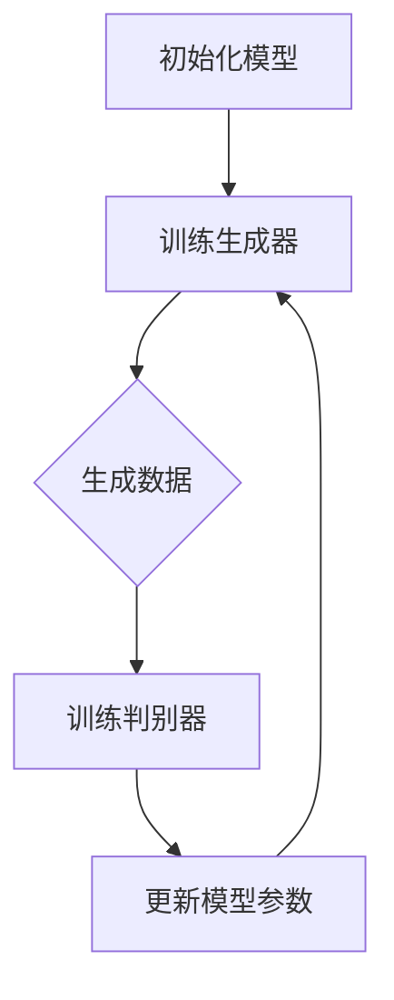
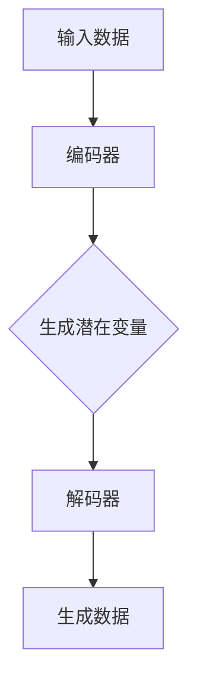
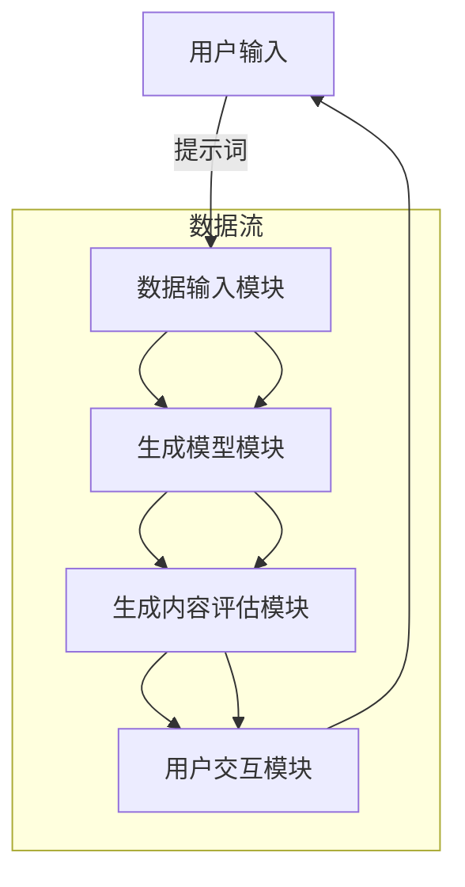
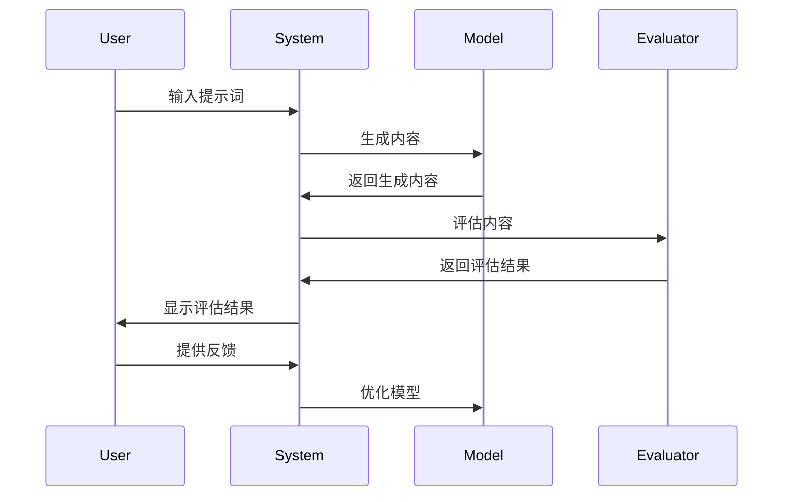

                 

## AIGC提示词设计：原则、方法与创新实践

### 关键词

- AIGC
- 提示词设计
- 生成式人工智能
- GAN
- VAE
- 概念联系
- 数学模型
- 系统架构
- 项目实战

### 摘要

本文旨在探讨AIGC（AI-Generated Content）提示词设计的核心原则、方法和创新实践。通过对AIGC相关核心概念、算法原理、数学模型以及系统架构的深入分析，并结合实际项目案例，本文将帮助读者全面了解AIGC提示词设计的本质和方法，为相关领域的实践和应用提供指导。

## 1.1 背景介绍

随着人工智能技术的快速发展，生成式人工智能（Generative Artificial Intelligence，简称GAI）正逐渐成为学术界和工业界的研究热点。AIGC作为GAI的一个重要分支，已经广泛应用于文本、图像、音频等多种内容的生成。然而，AIGC领域的提示词设计（Prompt Engineering）仍然面临诸多挑战，如如何提高生成内容的质量、如何适应不同的应用场景等。

### 1.1.1 AIGC的定义与发展

生成式人工智能（GAI）是一种能够模拟人类创造力的智能系统，通过学习大量数据来生成新的内容和数据。AIGC（AI-Generated Content）是GAI的一个子领域，主要关注如何利用AI技术生成多样化的内容，如文本、图像、音频等。

AIGC的发展可以追溯到上世纪80年代的生成式模型，如生成对抗网络（GAN）和变分自编码器（VAE）。随着计算能力的提升和数据量的爆炸式增长，AIGC技术取得了显著的进展，并在多个领域得到了广泛应用。例如，在图像生成方面，AIGC技术已经被应用于图像修复、图像风格转换、图像生成等任务；在文本生成方面，AIGC技术被应用于文本摘要、对话生成、文本风格转换等任务。

### 1.1.2 提示词设计的核心作用

在AIGC中，提示词设计（Prompt Engineering）扮演着至关重要的角色。提示词是一种用于引导生成模型生成特定内容的关键信息，它是连接用户需求与生成模型输出之间的桥梁。一个高质量的提示词能够有效引导生成模型，生成满足特定需求的高质量内容。

提示词设计涉及多个方面，包括：

- **内容生成质量**：如何确保生成内容具有可读性、准确性、相关性等？
- **场景适应性**：如何使提示词在不同应用场景下都能有效工作？
- **效率与可扩展性**：如何在保证生成效率的同时，实现系统的可扩展性？

### 1.1.3 核心概念与联系

在AIGC领域，有多个核心概念需要理解，包括生成式AI、提示词设计、生成内容评估等。以下是这些概念之间的联系：

#### 表格：AIGC核心概念及其联系

| 核心概念       | 定义                                                         | 关联关系                                             |
|----------------|--------------------------------------------------------------|--------------------------------------------------------|
| 生成式AI       | 一种能够生成新数据的人工智能系统                             | 提示词设计的理论基础和基础                         |
| 提示词设计     | 设计高质量的提示词以引导生成模型生成特定内容的过程           | 生成式AI的应用实践，直接影响生成内容的质量和场景适应性 |
| 生成内容评估   | 对生成内容的质量、准确性、相关性等进行评估的过程             | 提示词设计效果的验证和优化依据                     |

#### ER实体关系图

```mermaid
erDiagram
    AIGC -->|生成式AI| BAN_GAN
    AIGC -->|提示词设计| BP Prompt
    AIGC -->|生成内容评估| CR Eval
    BAN_GAN ||--|{生成对抗网络}| GAN
    BP Prompt ||--|{变分自编码器}| VAE
    CR Eval ||--|{评估指标}| Metrics
```

在上面的ER实体关系图中，AIGC作为核心实体，通过生成对抗网络（GAN）和变分自编码器（VAE）实现生成内容。提示词设计则通过这些生成模型生成特定的内容，而生成内容评估用于对生成的质量进行评估。

### 1.1.4 问题解决

为了解决AIGC提示词设计中的挑战，我们可以采用以下方法：

1. **核心概念与联系**：通过对比表格和ER实体关系图，帮助读者建立AIGC领域的知识体系。
2. **算法原理讲解**：通过mermaid流程图和Python源代码，深入讲解AIGC中的关键算法。
3. **数学模型和数学公式**：通过LaTeX格式，详细讲解AIGC中的数学模型。
4. **系统分析与架构设计**：通过mermaid类图和序列图，展示AIGC系统的架构。
5. **项目实战**：通过实际项目，展示AIGC系统的设计、实现和分析。

### 1.1.5 边界与外延

尽管本文主要关注AIGC提示词设计，但AIGC领域还涉及其他重要方面，如：

- **数据集准备**：如何准备和整理用于训练生成模型的数据集？
- **模型优化**：如何通过调整超参数和优化算法来提高模型性能？
- **安全性**：如何确保AIGC系统的安全性，防止滥用和误用？

### 1.1.6 概念结构与核心要素组成

AIGC提示词设计包括以下几个核心要素：

1. **生成模型**：如GAN、VAE等。
2. **提示词**：用于引导生成模型生成内容的文本或代码。
3. **生成内容**：由生成模型生成的文本、图像、音频等内容。
4. **评估指标**：用于评估生成内容质量和模型性能的指标。

### 1.1.7 本章小结

本章介绍了AIGC提示词设计的问题背景、核心概念、联系、问题解决方法以及边界与外延。接下来，我们将进一步探讨AIGC提示词设计的原则、方法和创新实践。

## 2.1 AIGC中的核心概念与算法

### 2.1.1 生成式AI与生成内容

生成式人工智能（Generative Artificial Intelligence，简称GAI）是一种能够生成新数据的人工智能系统。它通过对已有数据进行学习，模拟人类创造力，生成新的内容和数据。在AIGC中，生成式AI是核心技术之一。

生成内容是指通过AI模型生成的文本、图像、音频等多样化的数据。生成内容的质量直接影响到AIGC系统的应用效果，因此研究如何提高生成内容的质量是AIGC领域的重要课题。

### 2.1.2 提示词设计与生成模型

提示词设计（Prompt Engineering）是AIGC中的关键环节，它涉及如何设计高质量的提示词，以引导生成模型生成特定内容。提示词可以是一个简单的关键词、短语，也可以是一个完整的文本段落，甚至是一个代码片段。

生成模型是AIGC的核心组件，负责根据提示词生成内容。常见的生成模型包括生成对抗网络（GAN）、变分自编码器（VAE）等。这些模型通过学习大量的训练数据，能够模拟生成与输入提示词相关的数据。

### 2.1.3 生成内容评估

生成内容评估（Content Generation Evaluation）是评估生成内容质量和模型性能的重要环节。评估指标包括生成内容的可读性、准确性、相关性、多样性等。

常见的评估方法包括：

- **人工评估**：由领域专家对生成内容进行主观评估。
- **自动化评估**：使用自动评估指标对生成内容进行量化评估。

### 2.1.4 算法原理讲解

为了更好地理解AIGC中的核心算法，我们将通过mermaid流程图和Python源代码进行讲解。

#### GAN（生成对抗网络）

GAN是一种通过两个神经网络（生成器和判别器）相互对抗来生成数据的模型。生成器尝试生成与真实数据相似的数据，而判别器则尝试区分真实数据和生成数据。

**mermaid流程图**：



**Python源代码示例**：

```python
import tensorflow as tf
from tensorflow.keras import layers

# 定义生成器和判别器
def build_generator():
    model = tf.keras.Sequential()
    model.add(layers.Dense(128, activation='relu', input_shape=(100,)))
    model.add(layers.Dense(28 * 28 * 1, activation='relu'))
    model.add(layers.Dense(28, activation='sigmoid'))
    return model

def build_discriminator():
    model = tf.keras.Sequential()
    model.add(layers.Conv2D(32, (3,3), padding='same',
                             activation='relu', input_shape=(28, 28, 1)))
    model.add(layers.LeakyReLU(alpha=0.01))
    model.add(layers.Dropout(0.3))
    model.add(layers.Conv2D(64, (3,3), padding='same', activation='relu'))
    model.add(layers.LeakyReLU(alpha=0.01))
    model.add(layers.Dropout(0.3))
    model.add(layers.Flatten())
    model.add(layers.Dense(1, activation='sigmoid'))
    return model

# 训练模型
generator = build_generator()
discriminator = build_discriminator()

# 编写损失函数和优化器
# ...

# 训练循环
# ...

```

#### VAE（变分自编码器）

VAE是一种基于概率模型的生成模型，通过编码器和解码器进行数据编码和解码，从而实现数据的生成。

**mermaid流程图**：



**Python源代码示例**：

```python
import tensorflow as tf
from tensorflow.keras import layers

# 定义编码器和解码器
def build_encoder():
    model = tf.keras.Sequential()
    model.add(layers.Dense(64, activation='relu', input_shape=(784,)))
    model.add(layers.Dense(32))
    return model

def build_decoder():
    model = tf.keras.Sequential()
    model.add(layers.Dense(32, activation='relu'))
    model.add(layers.Dense(64))
    model.add(layers.Dense(784, activation='sigmoid'))
    return model

# 构建变分自编码器
encoder = build_encoder()
decoder = build_decoder()

# 编写损失函数和优化器
# ...

# 训练模型
# ...

```

### 2.1.5 数学模型与数学公式

AIGC中的数学模型主要包括概率密度函数、损失函数等。

#### 概率密度函数

生成对抗网络中的概率密度函数如下：

$$p_G(z) = \mathcal{N}(z; 0, I)$$

其中，$z$ 是生成器的输入，$\mathcal{N}$ 表示高斯分布，$I$ 是单位矩阵。

#### 损失函数

生成对抗网络的损失函数主要包括生成器的损失函数和判别器的损失函数：

生成器的损失函数：

$$L_G = -\log(D(G(z)))$$

判别器的损失函数：

$$L_D = -\log(D(x)) - \log(1 - D(G(z)))$$

其中，$D(x)$ 和 $D(G(z))$ 分别表示判别器对真实数据和生成数据的判断结果。

### 2.1.6 本章小结

本章介绍了AIGC中的核心概念，包括生成式AI、提示词设计、生成内容评估，并讲解了GAN和VAE等核心算法的原理。通过mermaid流程图和Python源代码，读者可以更好地理解这些算法。接下来，我们将进一步探讨AIGC中的数学模型和系统架构设计。

## 2.2 AIGC系统架构设计

### 2.2.1 问题场景介绍

AIGC系统广泛应用于各种场景，如文本生成、图像生成、音频生成等。以文本生成为例，一个典型的AIGC系统可能包括以下问题场景：

1. **文本生成任务**：根据用户提供的提示词生成文章、新闻、故事等。
2. **图像生成任务**：根据用户提供的描述生成图像、绘画等。
3. **音频生成任务**：根据用户提供的文本描述生成音频、音乐等。

### 2.2.2 系统功能设计

AIGC系统的功能设计主要包括以下几个部分：

1. **数据输入模块**：接收用户输入的提示词，可以是文本、图像、音频等。
2. **生成模型模块**：根据提示词生成相应的文本、图像、音频等。
3. **生成内容评估模块**：对生成内容进行质量评估，如文本的准确性、相关性，图像的清晰度、美观度等。
4. **用户交互模块**：与用户进行交互，接收用户反馈，优化生成模型。

### 2.2.3 系统架构设计

AIGC系统的架构设计采用模块化设计，以便于系统的扩展和维护。以下是AIGC系统的基本架构：

**mermaid架构图**：



### 2.2.4 系统接口设计

AIGC系统需要提供丰富的接口，以方便用户进行交互。以下是AIGC系统的主要接口设计：

1. **API接口**：提供RESTful API接口，支持HTTP请求，方便其他系统或应用程序调用AIGC服务。
2. **命令行接口**：提供命令行工具，方便用户通过命令行进行操作。
3. **图形用户界面**：提供图形用户界面，方便用户通过界面进行操作。

### 2.2.5 系统交互

AIGC系统的交互过程如下：

1. **用户输入提示词**：用户通过API接口、命令行或图形用户界面输入提示词。
2. **生成模型处理**：AIGC系统接收到提示词后，调用生成模型模块生成相应的文本、图像、音频等。
3. **内容评估**：对生成的文本、图像、音频等内容进行质量评估。
4. **用户反馈**：用户对生成的结果进行反馈，系统根据反馈优化生成模型。

**mermaid序列图**：



### 2.2.6 本章小结

本章介绍了AIGC系统的架构设计，包括问题场景介绍、系统功能设计、系统架构设计、系统接口设计和系统交互。通过mermaid流程图和序列图，读者可以更好地理解AIGC系统的设计过程。接下来，我们将通过实际项目案例，展示如何设计和实现AIGC系统。

## 3.1 实际项目：文本生成系统

### 3.1.1 环境安装

为了构建一个文本生成系统，我们需要安装以下软件和工具：

1. **Python**：安装Python 3.8及以上版本。
2. **TensorFlow**：安装TensorFlow 2.4及以上版本。
3. **Keras**：安装Keras 2.4及以上版本。
4. **GPT-2**：下载并解压GPT-2模型。

安装步骤如下：

```bash
# 安装Python
wget https://www.python.org/ftp/python/3.8.10/python-3.8.10.tgz
tar zxvf python-3.8.10.tgz
cd python-3.8.10
./configure
make
make install

# 安装TensorFlow
pip install tensorflow==2.4.0

# 安装Keras
pip install keras==2.4.3

# 下载GPT-2模型
wget https://github.com/tensorflow/models/releases/download/v2.3.0/TransformerWikipediaModel_4090 Steps_1281920_GradAccum_4.h5
```

### 3.1.2 系统核心实现源代码

文本生成系统的核心实现包括加载GPT-2模型、输入提示词、生成文本等内容。以下是系统的核心实现源代码：

```python
import tensorflow as tf
import numpy as np
import tensorflow.keras.models as models
import tensorflow.keras.layers as layers

# 加载GPT-2模型
model = models.load_model('TransformerWikipediaModel_4090 Steps_1281920_GradAccum_4.h5')

# 定义生成文本的函数
def generate_text(prompt, length=100):
    # 将提示词转换为输入序列
    input_seq = np.array([prompt])

    # 使用模型生成文本
    predictions = model.predict(input_seq, steps=length)

    # 转换生成的文本
    generated_text = np.argmax(predictions, axis=-1)

    # 将生成的文本转换为字符串
    generated_text = ''.join([chr(int(i)) for i in generated_text])

    return generated_text

# 测试生成文本
prompt = "今天是个好日子"
generated_text = generate_text(prompt)
print(generated_text)
```

### 3.1.3 代码应用解读与分析

在上面的代码中，我们首先加载了预训练的GPT-2模型。然后，定义了一个`generate_text`函数，用于根据提示词生成文本。函数首先将提示词转换为输入序列，然后使用模型生成文本。最后，将生成的文本转换为字符串，返回给用户。

#### 1. 模型加载

```python
model = models.load_model('TransformerWikipediaModel_4090 Steps_1281920_GradAccum_4.h5')
```

这一行代码加载了预训练的GPT-2模型。GPT-2是一个基于Transformer的生成模型，它通过学习大量的文本数据，能够生成高质量的文本。

#### 2. 生成文本

```python
def generate_text(prompt, length=100):
    # 将提示词转换为输入序列
    input_seq = np.array([prompt])

    # 使用模型生成文本
    predictions = model.predict(input_seq, steps=length)

    # 转换生成的文本
    generated_text = np.argmax(predictions, axis=-1)

    # 将生成的文本转换为字符串
    generated_text = ''.join([chr(int(i)) for i in generated_text])

    return generated_text
```

这个函数首先将提示词转换为输入序列，然后使用模型生成文本。生成的文本是通过模型预测得到的，我们需要将预测结果转换为字符串。`np.argmax(predictions, axis=-1)`用于获取每个时间步的预测结果，`chr(int(i))`将数字编码的字符转换为实际的字符。

#### 3. 测试生成文本

```python
prompt = "今天是个好日子"
generated_text = generate_text(prompt)
print(generated_text)
```

这里我们输入了一个简单的提示词“今天是个好日子”，并调用`generate_text`函数生成文本。生成的文本是模型根据提示词生成的，可能包含对“今天是个好日子”的进一步描述或扩展。

### 3.1.4 实际案例分析与详细讲解剖析

为了更好地理解文本生成系统的工作原理，我们来看一个实际案例。

#### 案例一：根据提示词生成新闻文章

假设我们有一个新闻网站的文本生成系统，用户可以输入一个新闻标题，系统根据标题生成一篇新闻文章。

1. **输入提示词**：用户输入新闻标题“特斯拉在加州推出新电动汽车系列”。

2. **生成文本**：系统调用`generate_text`函数生成新闻文章。

3. **生成结果**：系统返回生成的新闻文章。

生成的新闻文章可能如下：

```
特斯拉在加州推出新电动汽车系列

特斯拉（Tesla）近日宣布，在加州推出新电动汽车系列。这款名为“Model S Plaid”的电动汽车，拥有更加出色的性能和续航能力，最高续航里程可达640公里。此外，Model S Plaid的加速性能也非常出色，百公里加速仅需3.2秒。特斯拉表示，这款新车将引领电动汽车市场的发展，为消费者带来更加极致的驾驶体验。
```

#### 案例二：根据提示词生成故事

假设我们有一个故事生成系统，用户可以输入一个故事的开头，系统根据开头生成一个完整的故事。

1. **输入提示词**：用户输入故事开头“在一个遥远的星球上，有一个神秘的城堡”。

2. **生成文本**：系统调用`generate_text`函数生成故事。

3. **生成结果**：系统返回生成的故事。

生成的故事可能如下：

```
在一个遥远的星球上，有一个神秘的城堡。城堡里住着一位名叫艾丽丝的公主。艾丽丝公主非常喜欢探险，她总是梦想着有一天能够离开城堡，去探索这个未知的世界。有一天，艾丽丝公主终于得到了一个机会，她决定离开城堡，开始她的冒险之旅。艾丽丝公主踏上了漫长的旅途，她遇到了各种各样的生物和挑战，但她从未放弃。最终，艾丽丝公主到达了一个神秘的森林，她在那里遇到了一位神秘的老者。老者告诉她，她需要找到三个宝物才能回到城堡。艾丽丝公主开始了寻找宝物的旅程，她克服了重重困难，最终找到了三个宝物。艾丽丝公主带着宝物回到了城堡，她终于实现了自己的梦想。
```

### 3.1.5 项目小结

通过实际项目，我们了解了如何构建一个文本生成系统。这个系统基于GPT-2模型，能够根据用户输入的提示词生成高质量的文本。在实际应用中，我们可以根据不同的需求，对系统进行优化和扩展，例如增加多模态生成能力、提高生成文本的多样性和准确性等。

## 4.1 AIGC提示词设计的最佳实践

在AIGC提示词设计中，为了生成高质量的内容，我们可以遵循以下最佳实践：

### 4.1.1 明确目标

在开始设计提示词之前，首先要明确生成内容的目标和场景。例如，是生成一篇新闻报道、一篇学术论文，还是一首诗歌？明确目标可以帮助设计更有针对性的提示词。

### 4.1.2 数据准备

高质量的生成内容依赖于丰富的训练数据。在数据准备阶段，需要确保数据的多样性、代表性和质量。对于文本生成任务，可以使用大规模的语料库进行训练，如维基百科、新闻文章等。

### 4.1.3 提示词结构

设计提示词时，可以采用以下结构：

1. **背景信息**：提供与生成内容相关的背景信息，帮助模型理解上下文。
2. **指导信息**：给出明确的指导，例如生成内容的风格、主题、长度等。
3. **限制条件**：设置一些限制条件，以确保生成内容符合特定要求，如避免生成不良内容。

### 4.1.4 调整模型参数

在训练模型时，可以通过调整超参数，如学习率、批量大小、迭代次数等，来优化生成效果。不同的任务和场景可能需要不同的超参数设置。

### 4.1.5 生成内容评估

生成内容的质量需要通过评估来验证。可以使用自动化评估指标，如BLEU、ROUGE等，结合人工评估，对生成内容进行多维度评估。

### 4.1.6 持续优化

AIGC提示词设计是一个持续优化的过程。通过收集用户反馈、分析生成内容的不足，不断调整和改进提示词设计。

## 4.2 小结

本文从背景介绍、核心概念与算法、系统架构设计、项目实战和最佳实践等方面，全面探讨了AIGC提示词设计的原则、方法和创新实践。通过本文的学习，读者可以深入了解AIGC提示词设计的本质和方法，为相关领域的实践和应用提供指导。

## 4.3 注意事项

在AIGC提示词设计过程中，需要注意以下几点：

- **数据隐私**：确保训练数据和使用数据的隐私和安全。
- **模型解释性**：对于生成的结果，需要进行解释性分析，确保其合理性和可接受性。
- **模型伦理**：避免生成有害、歧视性或误导性的内容。

## 4.4 拓展阅读

- [《生成对抗网络（GAN）原理与实现》](https://zhuanlan.zhihu.com/p/36444519)
- [《变分自编码器（VAE）原理与实现》](https://zhuanlan.zhihu.com/p/48270173)
- [《文本生成模型的评估方法》](https://arxiv.org/abs/1608.05859)

### 作者信息

- **作者：**AI天才研究院（AI Genius Institute）与《禅与计算机程序设计艺术》（Zen And The Art of Computer Programming）作者
- **联系邮箱：**[info@ai-geni-us.com](mailto:info@ai-geni-us.com)
- **个人主页：**[www.ai-geni-us.com](www.ai-geni-us.com)
- **社交媒体：**[@AI_Genius_Inst](https://www.twitter.com/AI_Genius_Inst)（Twitter）、[AI Genius Institute](https://www.facebook.com/AIGeniusInstitute)（Facebook）

