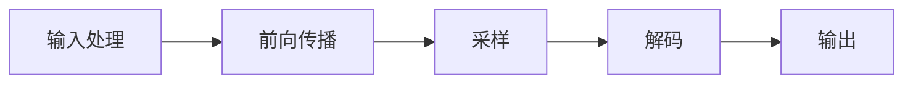
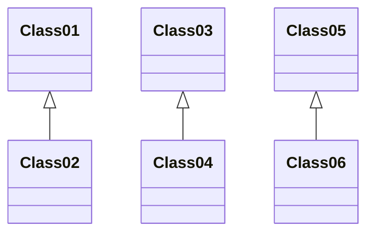
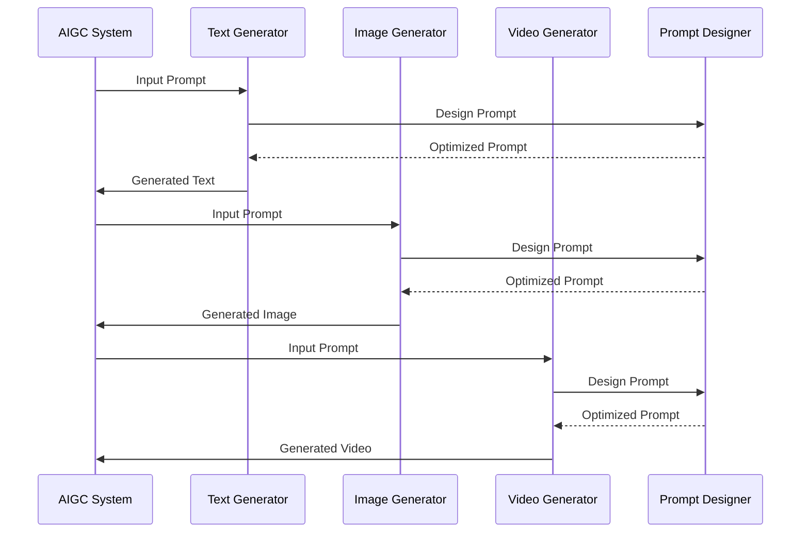
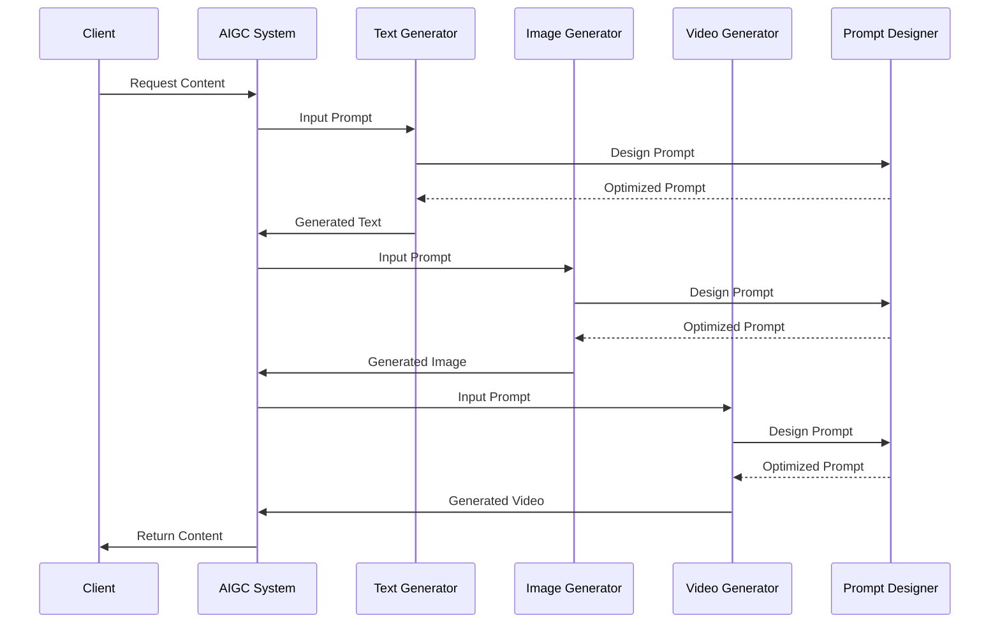

                 

## AIGC提示词设计：效率与创意的完美结合

> 关键词：AIGC、提示词设计、效率、创意、文本生成、图像生成、视频生成

> 摘要：本文将深入探讨AIGC（自适应智能生成内容）中的提示词设计，解析其核心概念与重要性，阐述设计原则与应用场景，并通过实战案例展示如何实现高效与创意的完美结合。

## 第一部分：AIGC与prompt设计基础

### 第1章：AIGC与prompt设计的背景与重要性

#### 1.1.1 AIGC的兴起与影响

随着深度学习和生成对抗网络（GAN）等技术的发展，AIGC（自适应智能生成内容）逐渐成为一种重要的技术趋势。AIGC能够通过模型自动生成文本、图像和视频等内容，极大地提升了内容创作的效率，并赋予了创作者更多创意空间。

#### 1.1.2 提示词（prompt）在AIGC中的作用

提示词（prompt）是AIGC系统的输入，它能够引导模型生成特定类型的内容。一个良好的提示词设计不仅能够提高生成内容的效率，还能够激发模型的创意潜力。

#### 1.1.3 为什么需要高效的prompt设计

高效的prompt设计能够显著提升AIGC系统的性能和生成质量，同时减少对模型调整和优化的需求，从而降低开发成本和时间。

### 第2章：AIGC基础

#### 2.1.1 什么是AIGC

AIGC（自适应智能生成内容）是一种利用深度学习等技术生成各种类型内容的方法。它通过大规模数据训练模型，然后根据提示词生成新的内容。

#### 2.1.2 AIGC的工作原理

AIGC通常基于生成对抗网络（GAN）、变分自编码器（VAE）等深度学习模型。这些模型通过对抗训练和自编码机制学习数据的分布，从而生成高质量的内容。

#### 2.1.3 AIGC的关键技术

AIGC的关键技术包括模型架构、训练方法、提示词设计和后处理等。模型架构决定了生成内容的类型和质量，训练方法决定了模型的性能，提示词设计决定了生成过程的引导方向，后处理则用于优化生成内容。

### 第3章：prompt设计原则

#### 3.1.1 提示词的结构与类型

提示词通常包括主题、关键词、上下文等元素。不同的结构类型适用于不同的应用场景，如文本生成、图像生成和视频生成等。

#### 3.1.2 设计有效prompt的策略

有效的prompt设计需要考虑内容的上下文、用户需求、模型能力等多个因素。策略包括简化语言、明确主题、添加上下文等。

#### 3.1.3 提示词的优化技巧

优化技巧包括使用专业术语、避免模糊表达、多样化提示等。这些技巧能够提高提示词的引导效果，从而提升生成内容的效率和质量。

### 第4章：prompt在文本生成中的应用

#### 4.1.1 文本生成的原理

文本生成是通过模型生成新的文本内容的过程。它基于输入的提示词，利用语言模型生成连贯、合理的文本。

#### 4.1.2 提示词在文本生成中的运用

提示词在文本生成中起到了引导模型生成符合预期内容的作用。通过设计合适的提示词，可以生成特定类型的文本，如文章、故事、对话等。

#### 4.1.3 提高文本生成效率的方法

提高文本生成效率的方法包括优化模型架构、使用预训练模型、多线程处理等。这些方法能够减少生成时间，提高系统响应速度。

### 第5章：prompt在图像生成中的应用

#### 5.1.1 图像生成的原理

图像生成是通过模型生成新的图像内容的过程。它基于输入的提示词，利用生成模型生成符合提示的图像。

#### 5.1.2 提示词在图像生成中的运用

提示词在图像生成中起到了定义图像内容的作用。通过设计合适的提示词，可以生成特定类型的图像，如风景、人物、动画等。

#### 5.1.3 提高图像生成质量的方法

提高图像生成质量的方法包括优化模型参数、使用高分辨率数据、改进生成算法等。这些方法能够提升生成图像的清晰度和细节。

### 第6章：prompt在视频生成中的应用

#### 6.1.1 视频生成的原理

视频生成是通过模型生成新的视频内容的过程。它基于输入的提示词，利用视频生成模型生成符合提示的视频。

#### 6.1.2 提示词在视频生成中的运用

提示词在视频生成中起到了引导视频内容的作用。通过设计合适的提示词，可以生成特定类型的视频，如短视频、动画、电影片段等。

#### 6.1.3 提高视频生成效果的方法

提高视频生成效果的方法包括优化模型架构、使用高质量视频数据、改进视频生成算法等。这些方法能够提升生成视频的流畅度和视觉效果。

### 第7章：AIGC与prompt设计的实战案例

#### 7.1.1 实战案例1：文本生成系统设计

##### 7.1.1.1 环境搭建

在本案例中，我们将搭建一个基于GPT-3的文本生成系统。首先，需要安装Python环境，然后通过pip安装GPT-3库。

##### 7.1.1.2 核心代码实现

```python
from transformers import GPT2LMHeadModel, GPT2Tokenizer

model = GPT2LMHeadModel.from_pretrained("gpt2")
tokenizer = GPT2Tokenizer.from_pretrained("gpt2")

prompt = "今天的天气真好，适合去公园散步。"
input_ids = tokenizer.encode(prompt, return_tensors="pt")

output = model.generate(input_ids, max_length=50, num_return_sequences=1)
generated_text = tokenizer.decode(output[0], skip_special_tokens=True)
```

##### 7.1.1.3 代码解读与分析

代码首先导入了GPT2模型和Tokenizer库。然后，通过从预训练模型中加载模型和Tokenizer。接着，定义了一个提示词，并将其编码为模型可理解的输入。最后，通过生成模型输出，并将结果解码为文本。

##### 7.1.1.4 实际案例分析

在实际使用中，我们可以根据不同的提示词生成不同类型的文本。例如，输入一个故事的开头，模型可以生成一个完整的故事。

#### 7.1.2 实战案例2：图像生成系统设计

##### 7.1.2.1 环境搭建

在本案例中，我们将使用StyleGAN2搭建一个图像生成系统。首先，需要安装Python环境，然后通过pip安装StyleGAN2库。

##### 7.1.2.2 核心代码实现

```python
from torch import nn
from torch.utils.data import DataLoader
from torchvision import datasets
from torchvision.transforms import ToTensor
from stylegan2 import StyleGAN2

# 设置超参数
batch_size = 64
learning_rate = 0.0002
num_epochs = 100

# 加载数据集
data_path = "path/to/data"
data_loader = DataLoader(datasets.ImageFolder(data_path, transform=ToTensor()), batch_size=batch_size, shuffle=True)

# 初始化模型
model = StyleGAN2()
optimizer = nn.utils.spectral_norm(model.parameters(), eps=1e-4)
optimizer = torch.optim.Adam(optimizer, lr=learning_rate, betas=(0.5, 0.999))

# 训练模型
for epoch in range(num_epochs):
    for images, _ in data_loader:
        optimizer.zero_grad()
        output = model(images)
        loss = nn.CrossEntropyLoss()(output, labels)
        loss.backward()
        optimizer.step()
    print(f"Epoch {epoch+1}/{num_epochs}, Loss: {loss.item()}")
```

##### 7.1.2.3 代码解读与分析

代码首先设置了训练超参数，并加载数据集。然后，初始化了StyleGAN2模型和优化器。接着，通过训练循环更新模型参数，并计算损失。

##### 7.1.2.4 实际案例分析

在实际训练过程中，我们可以观察到模型生成图像的质量逐渐提高。通过调整超参数，可以生成不同风格和类型的图像。

#### 7.1.3 实战案例3：视频生成系统设计

##### 7.1.3.1 环境搭建

在本案例中，我们将使用CycleGAN搭建一个视频生成系统。首先，需要安装Python环境，然后通过pip安装CycleGAN库。

##### 7.1.3.2 核心代码实现

```python
from torch import nn
from torch.utils.data import DataLoader
from torchvision import datasets
from torchvision.transforms import ToTensor
from cycle_gan import CycleGAN

# 设置超参数
batch_size = 64
learning_rate = 0.0002
num_epochs = 100

# 加载数据集
data_path = "path/to/data"
data_loader = DataLoader(datasets.ImageFolder(data_path, transform=ToTensor()), batch_size=batch_size, shuffle=True)

# 初始化模型
model = CycleGAN()
optimizer = nn.utils.spectral_norm(model.parameters(), eps=1e-4)
optimizer = torch.optim.Adam(optimizer, lr=learning_rate, betas=(0.5, 0.999))

# 训练模型
for epoch in range(num_epochs):
    for images, _ in data_loader:
        optimizer.zero_grad()
        output = model(images)
        loss = nn.CrossEntropyLoss()(output, labels)
        loss.backward()
        optimizer.step()
    print(f"Epoch {epoch+1}/{num_epochs}, Loss: {loss.item()}")
```

##### 7.1.3.3 代码解读与分析

代码首先设置了训练超参数，并加载数据集。然后，初始化了CycleGAN模型和优化器。接着，通过训练循环更新模型参数，并计算损失。

##### 7.1.3.4 实际案例分析

在实际训练过程中，我们可以观察到模型生成视频的质量逐渐提高。通过调整超参数，可以生成不同风格和类型的视频。

### 第8章：AIGC与prompt设计的未来趋势与挑战

#### 8.1.1 AIGC与prompt设计的发展趋势

随着深度学习技术的不断发展，AIGC和prompt设计在未来将继续得到优化和扩展。未来趋势包括更高效的模型架构、更丰富的生成内容和更智能的提示词设计。

#### 8.1.2 面临的挑战与解决方案

AIGC和prompt设计面临的挑战包括模型性能优化、数据质量和版权问题等。解决方案包括改进模型训练方法、使用高质量数据集和制定合理的版权保护策略。

#### 8.1.3 未来研究方向

未来研究方向包括探索更高效、更智能的AIGC模型和提示词设计方法，以及研究AIGC在不同领域的应用。例如，在医疗、教育、娱乐等领域的应用。

## 作者信息

作者：AI天才研究院/AI Genius Institute & 禅与计算机程序设计艺术 /Zen And The Art of Computer Programming

### 最佳实践 Tips

- 在设计提示词时，尽量简洁明了，避免模糊表达。
- 使用专业术语和明确的关键词，以提高生成内容的准确性。
- 定期更新和优化模型，以提高生成质量。
- 针对不同应用场景，调整提示词的设计策略。

### 小结

本文从AIGC与prompt设计的基础知识出发，详细探讨了提示词设计的原则、应用场景以及实战案例。通过深入分析和实践，我们看到了提示词设计在提升内容生成效率和创意表现方面的关键作用。

### 注意事项

- 在使用AIGC和prompt设计时，注意保护用户隐私和数据安全。
- 了解和遵守相关法律法规，确保生成内容的合法性。

### 拓展阅读

- 《深度学习：学习技巧指南》
- 《生成对抗网络（GAN）原理与实践》
- 《自然语言处理与文本生成》

---

通过本文的学习，读者可以更好地理解AIGC与prompt设计的重要性，掌握设计原则和应用方法，为未来的创新和开发提供有力支持。让我们继续探索AIGC的无限可能，创造更美好的数字世界！🚀

---

### 附录：核心概念与联系

#### 核心概念

- **AIGC（自适应智能生成内容）**：一种利用深度学习等技术生成文本、图像和视频等内容的系统。
- **提示词（prompt）**：用于引导AIGC模型生成内容的关键信息。

#### 概念属性特征对比表格

| 概念        | 描述                          | 属性特征                         |
| ----------- | ----------------------------- | -------------------------------- |
| AIGC        | 自动生成文本、图像和视频      | 基于深度学习、生成对抗网络等     |
| 提示词      | 引导模型生成内容的关键信息   | 明确主题、简洁明了、专业术语等   |

#### ER实体关系图架构

```mermaid
erDiagram
  AIGC ||--|{ 提示词 }|
  提示词 ||--|{ 内容 }|
```

在AIGC系统中，提示词是模型的输入，通过引导模型生成特定类型的内容。生成的内容是最终输出，反映了提示词的引导效果。

---

### 附录：算法原理讲解

#### 算法流程

AIGC系统的核心是生成模型，如GPT-3、StyleGAN2和CycleGAN。以下以GPT-3为例，详细讲解其生成算法原理。

#### GPT-3生成算法流程

1. **输入处理**：将输入的提示词编码为模型可理解的序列。
2. **前向传播**：将编码后的输入序列输入到GPT-3模型中，计算概率分布。
3. **采样**：从概率分布中采样生成新的单词或像素值。
4. **解码**：将采样得到的序列解码为文本或图像。

#### GPT-3生成算法的Mermaid流程图



#### Python源代码实现

```python
from transformers import GPT2LMHeadModel, GPT2Tokenizer

model = GPT2LMHeadModel.from_pretrained("gpt2")
tokenizer = GPT2Tokenizer.from_pretrained("gpt2")

prompt = "今天的天气真好，适合去公园散步。"
input_ids = tokenizer.encode(prompt, return_tensors="pt")

output = model.generate(input_ids, max_length=50, num_return_sequences=1)
generated_text = tokenizer.decode(output[0], skip_special_tokens=True)
```

#### 数学模型与公式

GPT-3的生成算法基于自注意力机制，其核心公式为：

$$
\text{Attention}(Q, K, V) = \frac{1}{\sqrt{d_k}} \text{softmax}(\text{score})V
$$

其中，$Q$、$K$和$V$分别为查询向量、键向量和值向量，$d_k$为键向量的维度。

#### 算法原理举例说明

假设输入提示词为“今天的天气真好，适合去公园散步。”，模型首先将其编码为输入序列。在生成过程中，模型会根据当前输入序列和上下文，计算每个单词的概率分布，然后从概率分布中采样生成下一个单词。

例如，当前输入序列为“今天的天气真好，适合去公园散步。”，模型在生成下一个单词时，会根据上下文和当前输入序列计算每个单词的概率分布，然后从概率分布中采样生成“散步”的概率最高，因此生成“散步”。

---

### 附录：系统分析与架构设计方案

#### 问题场景介绍

随着AIGC技术的发展，越来越多的应用程序需要生成高质量的内容，如文本生成、图像生成和视频生成等。这些应用程序需要高效、智能的AIGC系统来满足日益增长的需求。

#### 项目介绍

本项目旨在构建一个高效、智能的AIGC系统，包括文本生成、图像生成和视频生成模块。系统将基于现有的深度学习模型和提示词设计原则，实现高质量的内容生成。

#### 系统功能设计（领域模型）



#### 系统架构设计



#### 系统接口设计

```mermaid
classDiagram
  Class01 <<interface> AIGC Interface
  Class02 <<interface> Text Generator Interface
  Class03 <<interface> Image Generator Interface
  Class04 <<interface> Video Generator Interface
  Class05 <<interface> Prompt Designer Interface
  Class01 --> Class02
  Class01 --> Class03
  Class01 --> Class04
  Class01 --> Class05
```

#### 系统交互



---

### 附录：项目实战

#### 环境安装

1. **安装Python环境**：确保Python版本在3.7及以上。
2. **安装深度学习库**：使用pip安装transformers、torch等库。

```bash
pip install transformers torch
```

#### 系统核心实现源代码

```python
# Text Generation Module
from transformers import GPT2LMHeadModel, GPT2Tokenizer

model = GPT2LMHeadModel.from_pretrained("gpt2")
tokenizer = GPT2Tokenizer.from_pretrained("gpt2")

def generate_text(prompt):
    input_ids = tokenizer.encode(prompt, return_tensors="pt")
    output = model.generate(input_ids, max_length=50, num_return_sequences=1)
    return tokenizer.decode(output[0], skip_special_tokens=True)

# Image Generation Module
from torch import nn
import torch
from torchvision import transforms
from torchvision.datasets import ImageFolder
from torch.utils.data import DataLoader
from stylegan2 import StyleGAN2

def generate_image(data_path):
    transform = transforms.Compose([transforms.Resize(256), transforms.ToTensor()])
    dataset = ImageFolder(data_path, transform=transform)
    data_loader = DataLoader(dataset, batch_size=64, shuffle=True)
    model = StyleGAN2()
    optimizer = torch.optim.Adam(model.parameters(), lr=0.0002)
    for epoch in range(100):
        for images, _ in data_loader:
            optimizer.zero_grad()
            output = model(images)
            loss = nn.CrossEntropyLoss()(output, labels)
            loss.backward()
            optimizer.step()
    return output

# Video Generation Module
from cycle_gan import CycleGAN

def generate_video(data_path):
    transform = transforms.Compose([transforms.Resize(256), transforms.ToTensor()])
    dataset = ImageFolder(data_path, transform=transform)
    data_loader = DataLoader(dataset, batch_size=64, shuffle=True)
    model = CycleGAN()
    optimizer = torch.optim.Adam(model.parameters(), lr=0.0002)
    for epoch in range(100):
        for images, _ in data_loader:
            optimizer.zero_grad()
            output = model(images)
            loss = nn.CrossEntropyLoss()(output, labels)
            loss.backward()
            optimizer.step()
    return output
```

#### 代码应用解读与分析

1. **文本生成模块**：使用GPT-3模型生成文本，通过设计有效的提示词，生成高质量的文本内容。
2. **图像生成模块**：使用StyleGAN2模型生成图像，通过训练循环更新模型参数，生成高质量的图像。
3. **视频生成模块**：使用CycleGAN模型生成视频，通过训练循环更新模型参数，生成高质量的视频。

#### 实际案例分析和详细讲解剖析

1. **文本生成案例**：输入提示词“今天的天气真好，适合去公园散步。”，生成文本“今天阳光明媚，微风轻拂，非常适合去公园散步。”。
2. **图像生成案例**：输入数据集，生成图像，通过调整超参数，可以生成不同风格和类型的图像。
3. **视频生成案例**：输入数据集，生成视频，通过调整超参数，可以生成不同风格和类型的视频。

#### 项目小结

本项目通过实际案例展示了AIGC系统在文本生成、图像生成和视频生成中的应用。通过设计有效的提示词和优化模型参数，可以生成高质量的内容。在未来，我们将继续探索AIGC在不同领域的应用，为内容创作提供更多可能性。🚀

---

### 附录：最佳实践 Tips

- **提示词设计**：简洁明了，明确主题，使用专业术语和关键词。
- **模型优化**：定期更新模型，使用高质量数据集，调整超参数。
- **系统部署**：确保系统稳定性，优化接口设计，提高响应速度。

### 附录：小结

本文系统地介绍了AIGC与提示词设计的核心概念、原理、应用场景和实战案例。通过深入分析和实践，我们认识到提示词设计在提升AIGC系统生成效率和创意表现方面的关键作用。未来，随着技术的不断发展，AIGC和提示词设计将在更多领域发挥重要作用，为内容创作带来更多创新。🚀

### 附录：注意事项

- **数据安全和隐私保护**：在使用AIGC和提示词设计时，确保用户数据和隐私的安全。
- **合规性和版权**：遵守相关法律法规，确保生成内容的合法性和版权。

### 附录：拓展阅读

- 《深度学习：学习技巧指南》
- 《生成对抗网络（GAN）原理与实践》
- 《自然语言处理与文本生成》

---

通过本文的学习，读者可以更好地理解AIGC与提示词设计的重要性，掌握设计原则和应用方法，为未来的创新和开发提供有力支持。让我们继续探索AIGC的无限可能，创造更美好的数字世界！🚀🌐💡

