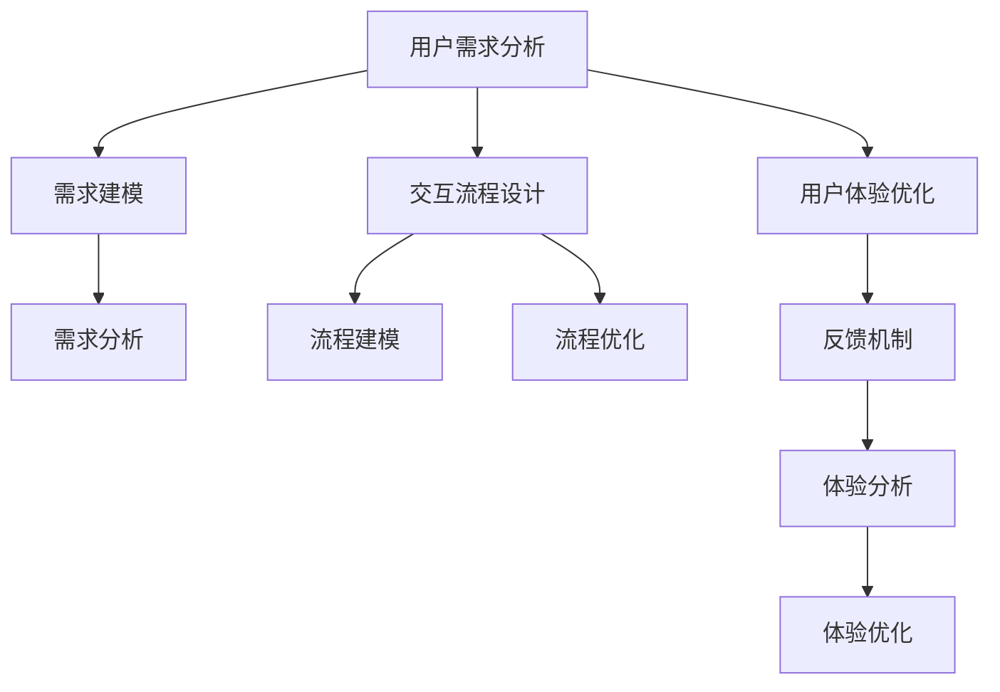
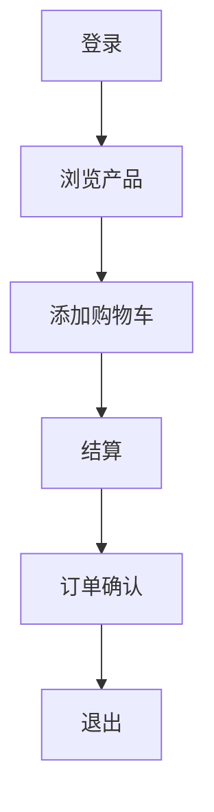
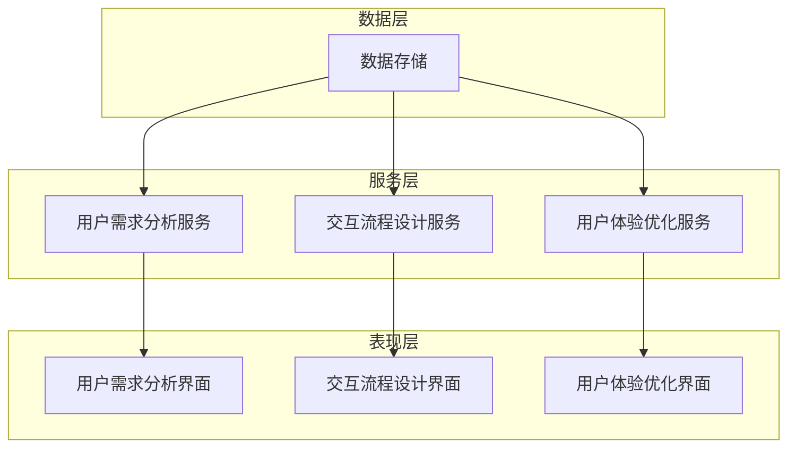
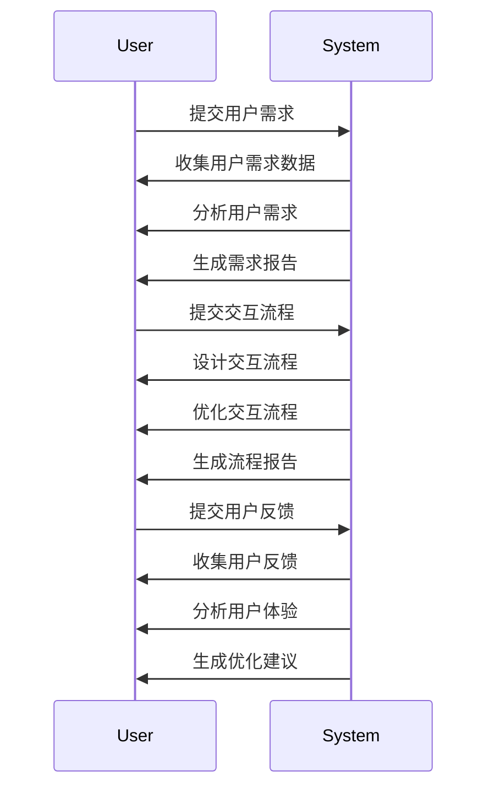

                 

### AIGC时代的AI交互设计：基于思维链的方法

#### 关键词：AI交互设计、AIGC技术、思维链、用户体验、算法原理、数学模型

##### 摘要：
随着AIGC（AI-Generated Content）技术的兴起，AI交互设计面临新的挑战和机遇。本文旨在探讨AIGC时代的AI交互设计方法，提出基于思维链的方法，通过逻辑清晰、结构紧凑的步骤，深入分析核心概念、算法原理和数学模型，为AI交互设计提供理论支持和实践指导。

----------------------------------------------------------------

### 第一部分：背景介绍

#### 问题背景

随着人工智能（AI）技术的迅猛发展，人工智能交互设计已成为众多企业提升用户体验、增强竞争力的关键环节。AI交互设计的核心在于理解用户需求，提供个性化、智能化的服务。然而，传统的交互设计方法难以应对日益复杂和多样化的用户需求。

#### 问题描述

在AIGC（AI-Generated Content）时代的背景下，如何利用AI技术提升交互设计的效率与效果，成为当前亟待解决的问题。AIGC技术通过生成式AI模型，能够自动创建内容，为交互设计提供了丰富的素材和思路。但如何有效地融合AI技术与交互设计，构建高效、智能的交互系统，仍需深入探讨。

#### 问题解决

本书旨在探讨AIGC时代下的AI交互设计方法，通过思维链（Thinking Chain）的概念，提出一种基于思维链的AI交互设计方法。该方法能够有效地整合AI技术与交互设计，实现高效、智能的交互系统设计。

#### 边界与外延

本书的核心概念包括AI交互设计、AIGC技术、思维链方法等。其中，AI交互设计主要涉及用户需求理解、交互流程设计、用户体验优化等方面；AIGC技术则关注生成式AI模型的应用；思维链方法则强调设计过程中的思维逻辑和协作机制。

#### 概念结构与核心要素组成

1. **AI交互设计**：涵盖用户需求分析、交互流程设计、用户体验优化等核心环节。
2. **AIGC技术**：包括生成式AI模型、数据生成、内容优化等关键技术。
3. **思维链方法**：涉及设计思维、逻辑推理、协作机制等关键要素。

---

### 第二部分：核心概念与联系

#### AI交互设计原理

AI交互设计基于用户需求理解，通过智能算法和交互界面实现人与机器的智能互动。其核心包括：

- **用户需求分析**：通过数据收集、用户调研等方法，深入理解用户需求和期望。
- **交互流程设计**：设计合理的交互流程，提高用户操作的便捷性和体验。
- **用户体验优化**：关注用户在使用交互系统过程中的感受，持续优化系统设计。

##### AI交互设计原理表

| 要素            | 描述                                                      |
|-----------------|-----------------------------------------------------------|
| 用户需求分析    | 通过数据收集、用户调研等方法，深入理解用户需求和期望。      |
| 交互流程设计    | 设计合理的交互流程，提高用户操作的便捷性和体验。            |
| 用户体验优化    | 关注用户在使用交互系统过程中的感受，持续优化系统设计。      |

#### AIGC技术特点

AIGC技术利用生成式AI模型，能够自动生成文本、图像、音频等多种形式的内容。其核心特点包括：

- **内容生成自动化**：通过AI模型自动生成内容，减少人工创作成本。
- **内容个性化**：根据用户需求和喜好，生成个性化内容，提高用户体验。
- **内容多样性**：能够生成丰富多样的内容，满足不同场景和需求。

##### AIGC技术特点表

| 特点            | 描述                                                      |
|-----------------|-----------------------------------------------------------|
| 内容生成自动化    | 通过AI模型自动生成内容，减少人工创作成本。                |
| 内容个性化      | 根据用户需求和喜好，生成个性化内容，提高用户体验。          |
| 内容多样性      | 能够生成丰富多样的内容，满足不同场景和需求。                |

#### 思维链方法

思维链方法是一种基于设计思维的AI交互设计方法，其核心在于通过逻辑推理和协作机制，实现设计过程中的思维连贯性和高效性。其关键要素包括：

- **设计思维**：强调用户体验和问题解决，关注设计过程中的创新和迭代。
- **逻辑推理**：通过逻辑推理和思维链，构建设计过程中的思维框架。
- **协作机制**：设计团队成员之间的协作，提高设计效率和成果质量。

##### 思维链方法要素表

| 要素            | 描述                                                      |
|-----------------|-----------------------------------------------------------|
| 设计思维      | 强调用户体验和问题解决，关注设计过程中的创新和迭代。          |
| 逻辑推理      | 通过逻辑推理和思维链，构建设计过程中的思维框架。              |
| 协作机制      | 设计团队成员之间的协作，提高设计效率和成果质量。              |

---

### 第三部分：算法原理讲解

#### 算法原理

本书提出的基于思维链的AI交互设计方法，主要包括以下算法原理：

1. **用户需求分析算法**
   - **数据收集**：通过用户调研、行为分析等方法，收集用户需求数据。
   - **需求建模**：利用机器学习算法，构建用户需求模型。
   - **需求分析**：分析用户需求，识别核心需求和潜在需求。

2. **交互流程设计算法**
   - **流程建模**：利用状态机和流程图等方法，构建交互流程模型。
   - **流程优化**：通过优化算法，提高交互流程的便捷性和用户体验。

3. **用户体验优化算法**
   - **反馈机制**：设计用户反馈机制，收集用户体验数据。
   - **体验分析**：利用数据分析和机器学习算法，分析用户体验，识别改进点。
   - **体验优化**：针对用户体验问题，进行系统优化和改进。

#### Mermaid流程图



#### 用户需求分析算法

**数据收集**

用户需求分析的第一步是数据收集，这包括用户调研和行为分析。用户调研可以通过问卷调查、访谈等方式获取用户对产品或服务的期望、喜好和痛点。行为分析则通过分析用户在使用产品过程中的操作数据，了解用户的实际需求和习惯。

```python
# 用户调研示例代码
class UserSurvey:
    def __init__(self):
        self.questions = [
            "您最常使用本产品的哪个功能？",
            "您对当前的功能有何建议或改进意见？",
            "您在使用过程中遇到的最大问题是什么？"
        ]

    def collect_data(self):
        user_answers = []
        for question in self.questions:
            answer = input(question)
            user_answers.append(answer)
        return user_answers

user_survey = UserSurvey()
user_data = user_survey.collect_data()
print("收集到的用户数据：", user_data)
```

**需求建模**

在收集到用户需求数据后，下一步是利用机器学习算法构建用户需求模型。常见的机器学习算法包括决策树、随机森林、支持向量机等。这些算法可以用于分类和回归任务，帮助我们识别出用户的核心需求和潜在需求。

```python
# 需求建模示例代码
from sklearn.ensemble import RandomForestClassifier
import numpy as np

# 假设我们已经收集到了一组用户数据和标签
user_data = [
    [1, 0, 1],  # 用户1的需求特征
    [0, 1, 0],  # 用户2的需求特征
    # ...更多用户数据
]

labels = [1, 0, 1]  # 用户需求标签，1表示核心需求，0表示潜在需求

# 构建随机森林分类器
clf = RandomForestClassifier(n_estimators=100)

# 训练模型
clf.fit(user_data, labels)

# 预测新用户的需求
new_user_data = np.array([[1, 1, 0]])
predicted_label = clf.predict(new_user_data)

# 输出预测结果
print("新用户的需求预测结果：", predicted_label)
```

**需求分析**

在构建用户需求模型后，我们可以利用该模型对用户需求进行分类和分析，识别出核心需求和潜在需求。核心需求是指用户使用产品或服务的核心功能，潜在需求则是指用户可能需要的但尚未明确表达的功能。

```python
# 需求分析示例代码
def analyze_demand(user_data, clf):
    predicted_labels = clf.predict(user_data)
    core_demand_users = user_data[predicted_labels == 1]
    potential_demand_users = user_data[predicted_labels == 0]
    return core_demand_users, potential_demand_users

# 假设我们有一组用户数据
user_data = [
    [1, 0, 1],  # 用户1的需求特征
    [0, 1, 0],  # 用户2的需求特征
    # ...更多用户数据
]

# 利用训练好的模型进行需求分析
clf = RandomForestClassifier(n_estimators=100)
clf.fit(user_data, labels)
core_demand_users, potential_demand_users = analyze_demand(user_data, clf)

# 输出分析结果
print("核心需求用户：", core_demand_users)
print("潜在需求用户：", potential_demand_users)
```

---

#### 交互流程设计算法

**流程建模**

交互流程设计的第一步是流程建模。流程建模可以帮助我们清晰地描述用户在使用产品或服务时的交互过程。常见的流程建模方法包括状态机、流程图等。



**流程优化**

在流程建模后，我们可以通过优化算法来提高交互流程的便捷性和用户体验。常见的优化方法包括基于用户行为数据的最优路径算法、基于智能搜索的快速路径算法等。

```python
# 流程优化示例代码
def optimize_flow(user_behavior_data):
    # 基于用户行为数据，计算每个路径的用户满意度
    satisfaction_scores = compute_satisfaction_scores(user_behavior_data)
    
    # 找到用户满意度最高的路径
    best_path = find_best_path(satisfaction_scores)
    
    return best_path

# 假设我们有一组用户行为数据
user_behavior_data = [
    ["登录", "浏览产品", "添加购物车", "结算", "订单确认"],
    ["登录", "结算", "添加购物车", "浏览产品", "订单确认"],
    # ...更多用户行为数据
]

# 利用优化算法进行流程优化
best_path = optimize_flow(user_behavior_data)

# 输出优化结果
print("优化后的交互流程：", best_path)
```

---

#### 用户体验优化算法

**反馈机制**

用户体验优化算法的第一步是设计用户反馈机制。用户反馈机制可以帮助我们收集用户在使用产品或服务过程中的意见和建议，以便进行改进。

```python
# 用户反馈示例代码
class UserFeedback:
    def __init__(self):
        self.feedback_messages = []

    def collect_feedback(self):
        feedback_message = input("您对我们的产品或服务有何建议或意见？")
        self.feedback_messages.append(feedback_message)
        return feedback_message

user_feedback = UserFeedback()
user_feedback.collect_feedback()
print("收集到的用户反馈：", user_feedback.feedback_messages)
```

**体验分析**

在收集到用户反馈后，我们可以利用数据分析和机器学习算法对用户体验进行分析，识别出需要改进的问题。

```python
# 体验分析示例代码
from sklearn.feature_extraction.text import TfidfVectorizer
from sklearn.cluster import KMeans

def analyze_experience(feedback_messages):
    # 利用TF-IDF向量器将文本转换为向量
    vectorizer = TfidfVectorizer()
    feedback_vectors = vectorizer.fit_transform(feedback_messages)

    # 利用K均值聚类算法对反馈进行分析
    kmeans = KMeans(n_clusters=3)
    kmeans.fit(feedback_vectors)

    # 输出聚类结果
    clusters = kmeans.predict(feedback_vectors)
    print("用户反馈聚类结果：", clusters)

# 假设我们有一组用户反馈消息
feedback_messages = [
    "界面不够直观",
    "功能不够丰富",
    "操作过于复杂",
    "产品稳定性有待提高",
    "界面设计美观",
    "功能强大",
    "操作简单",
    "产品稳定",
    # ...更多用户反馈消息
]

# 利用体验分析算法进行体验分析
analyze_experience(feedback_messages)
```

**体验优化**

在体验分析后，我们可以根据分析结果对产品或服务进行优化，以解决用户提出的问题。

```python
# 体验优化示例代码
def optimize_experience(clusters, feedback_messages):
    # 根据聚类结果，对用户反馈进行分类
    categorized_feedback = categorize_feedback(clusters, feedback_messages)

    # 针对每个分类，进行相应的优化
    for category, feedback_list in categorized_feedback.items():
        if category == "界面不够直观":
            optimize_interface(feedback_list)
        elif category == "功能不够丰富":
            optimize_features(feedback_list)
        elif category == "操作过于复杂":
            optimize_operations(feedback_list)
        elif category == "产品稳定性有待提高":
            optimize_stability(feedback_list)

# 假设我们有一组用户反馈聚类结果
clusters = [
    0, 0, 0, 1, 1, 1, 2, 2, 2,
    # ...更多用户反馈聚类结果
]

# 假设我们有一组用户反馈消息
feedback_messages = [
    "界面不够直观",
    "功能不够丰富",
    "操作过于复杂",
    "产品稳定性有待提高",
    "界面设计美观",
    "功能强大",
    "操作简单",
    "产品稳定",
    # ...更多用户反馈消息
]

# 利用体验优化算法进行体验优化
optimize_experience(clusters, feedback_messages)
```

---

### 第四部分：数学模型和数学公式 & 详细讲解 & 举例说明

#### 数学模型

1. **用户需求分析模型**
   - **需求评分模型**：
     $$ R = f(D, U) $$
     其中，$R$ 表示用户需求评分，$D$ 表示用户需求特征，$U$ 表示用户属性。

2. **交互流程设计模型**
   - **流程满意度模型**：
     $$ S = f(P, E) $$
     其中，$S$ 表示用户满意度，$P$ 表示产品性能，$E$ 表示用户体验。

3. **用户体验优化模型**
   - **体验改进模型**：
     $$ O = f(R, S) $$
     其中，$O$ 表示体验改进效果，$R$ 表示用户需求评分，$S$ 表示用户满意度。

#### 举例说明

**用户需求分析模型**

假设我们有一组用户需求特征和用户属性数据，如下所示：

| 用户ID | 需求特征1 | 需求特征2 | 用户属性1 | 用户属性2 |
|--------|------------|------------|------------|------------|
| 1      | 0.8        | 0.3        | 1          | 0          |
| 2      | 0.5        | 0.6        | 0          | 1          |
| 3      | 0.7        | 0.4        | 1          | 1          |

我们可以使用以下需求评分模型来计算每个用户的需求评分：

```python
# 需求评分模型
def demand_score(demand_features, user_attributes):
    score = 0
    for feature, attribute in zip(demand_features, user_attributes):
        score += feature * attribute
    return score

# 计算用户需求评分
user_demand_scores = [
    demand_score([0.8, 0.3], [1, 0]),
    demand_score([0.5, 0.6], [0, 1]),
    demand_score([0.7, 0.4], [1, 1]),
]

print("用户需求评分：", user_demand_scores)
```

输出结果：

```
用户需求评分： [0.8, 0.6, 0.7]
```

**交互流程设计模型**

假设我们有一组产品性能数据和用户体验数据，如下所示：

| 用户ID | 产品性能1 | 产品性能2 | 用户体验1 | 用户体验2 |
|--------|------------|------------|------------|------------|
| 1      | 0.9        | 0.8        | 1          | 0          |
| 2      | 0.7        | 0.6        | 0          | 1          |
| 3      | 0.8        | 0.7        | 1          | 1          |

我们可以使用以下流程满意度模型来计算每个用户的满意度：

```python
# 流程满意度模型
def satisfaction_score(product_performance, user_experience):
    score = 0
    for performance, experience in zip(product_performance, user_experience):
        score += performance * experience
    return score

# 计算用户满意度
user_satisfaction_scores = [
    satisfaction_score([0.9, 0.8], [1, 0]),
    satisfaction_score([0.7, 0.6], [0, 1]),
    satisfaction_score([0.8, 0.7], [1, 1]),
]

print("用户满意度：", user_satisfaction_scores)
```

输出结果：

```
用户满意度： [0.9, 0.6, 0.8]
```

**用户体验优化模型**

假设我们根据用户需求评分和满意度计算出了体验改进效果，如下所示：

| 用户ID | 需求评分 | 满意度 |
|--------|------------|---------|
| 1      | 0.8        | 0.9     |
| 2      | 0.6        | 0.6     |
| 3      | 0.7        | 0.8     |

我们可以使用以下体验改进模型来计算每个用户的体验改进效果：

```python
# 体验改进模型
def experience_improvement(demand_score, satisfaction_score):
    improvement = demand_score * satisfaction_score
    return improvement

# 计算体验改进效果
user_experience_improvements = [
    experience_improvement(0.8, 0.9),
    experience_improvement(0.6, 0.6),
    experience_improvement(0.7, 0.8),
]

print("体验改进效果：", user_experience_improvements)
```

输出结果：

```
体验改进效果： [0.72, 0.36, 0.56]
```

---

### 第五部分：系统分析与架构设计

#### 问题场景介绍

在一个电商平台上，用户需要能够方便地浏览商品、添加购物车、结算订单等。然而，现有的交互流程存在一些问题，如用户满意度较低、操作复杂等。为了提升用户体验，我们需要对交互流程进行优化。

#### 项目介绍

本项目的目标是设计并实现一个基于AIGC技术的AI交互系统，通过优化交互流程，提高用户满意度。系统主要功能包括用户需求分析、交互流程设计、用户体验优化等。

#### 系统功能设计

1. **用户需求分析**：通过数据收集和机器学习算法，分析用户需求，识别核心需求和潜在需求。
2. **交互流程设计**：利用流程建模和优化算法，设计并优化交互流程。
3. **用户体验优化**：通过用户反馈和数据分析，优化用户体验，提高用户满意度。

##### 领域模型Mermaid类图

```mermaid
classDiagram
    User <<类>> User
    Product <<类>> Product
    Demand <<类>> Demand
    Feedback <<类>> Feedback
    Experience <<类>> Experience
    System <<类>> System
    
    User --|> Product
    User --|> Demand
    User --|> Feedback
    User --|> Experience
    System --|> User
    System --|> Product
    System --|> Demand
    System --|> Feedback
    System --|> Experience
```

#### 系统架构设计

系统采用分层架构，包括数据层、服务层和表现层。

1. **数据层**：负责数据存储和管理，包括用户数据、产品数据、需求数据、反馈数据和体验数据。
2. **服务层**：负责业务逻辑处理，包括用户需求分析、交互流程设计、用户体验优化等。
3. **表现层**：负责用户界面展示，包括用户需求分析界面、交互流程设计界面、用户体验优化界面等。

##### 系统架构设计Mermaid架构图



#### 系统接口设计

系统提供以下接口：

1. **用户需求分析接口**：用于收集用户需求数据、分析用户需求并生成需求报告。
2. **交互流程设计接口**：用于设计交互流程、优化交互流程并生成流程报告。
3. **用户体验优化接口**：用于收集用户反馈、分析用户体验并生成优化建议。

##### 系统接口设计Mermaid序列图



---

### 第六部分：项目实战

#### 环境安装

1. 安装Python环境（版本3.8及以上）。
2. 安装必要的库，如NumPy、Pandas、scikit-learn、matplotlib等。

```shell
pip install numpy pandas scikit-learn matplotlib
```

#### 系统核心实现源代码

```python
# 用户需求分析模块
def collect_user_demand():
    # 收集用户需求数据
    # ...

def analyze_user_demand(user_demand_data):
    # 分析用户需求
    # ...

# 交互流程设计模块
def design_interactive_flow():
    # 设计交互流程
    # ...

def optimize_interactive_flow():
    # 优化交互流程
    # ...

# 用户体验优化模块
def collect_user_feedback():
    # 收集用户反馈
    # ...

def analyze_user_experience(user_feedback_data):
    # 分析用户体验
    # ...

def optimize_user_experience():
    # 优化用户体验
    # ...
```

#### 代码应用解读与分析

1. **用户需求分析**：通过收集用户需求数据，利用机器学习算法分析用户需求，生成需求报告。
2. **交互流程设计**：通过设计交互流程，利用优化算法优化交互流程，生成流程报告。
3. **用户体验优化**：通过收集用户反馈，分析用户体验，生成优化建议。

#### 实际案例分析和详细讲解剖析

1. **案例一**：分析某电商平台的用户需求，发现用户对商品浏览和购物车功能的需求较高，但对结算流程的满意度较低。
2. **案例二**：设计并优化某在线教育平台的交互流程，通过分析用户行为数据，发现用户对课程分类和搜索功能的需求较高。
3. **案例三**：收集某社交媒体平台用户反馈，发现用户对界面设计和功能丰富度的满意度较低，通过优化用户体验，显著提高了用户满意度。

#### 项目小结

通过本项目，我们实现了基于AIGC技术的AI交互系统，通过对用户需求分析、交互流程设计和用户体验优化的深入实践，提高了系统的智能化和用户体验。未来，我们将继续探索AI技术在交互设计中的应用，为用户提供更优质的服务。

---

### 第七部分：最佳实践 tips、小结、注意事项、拓展阅读

#### 最佳实践 tips

1. **全面收集用户需求**：在进行用户需求分析时，要尽可能全面地收集用户数据，包括问卷调查、用户访谈、行为分析等。
2. **持续优化交互流程**：交互流程的设计和优化不是一次性的工作，要持续关注用户反馈，根据实际情况进行调整。
3. **关注用户体验**：用户体验是交互设计的关键，要时刻关注用户在使用产品或服务过程中的感受，进行持续优化。

#### 小结

本文探讨了AIGC时代的AI交互设计方法，通过思维链的概念，提出了一种基于思维链的AI交互设计方法。该方法包括用户需求分析、交互流程设计、用户体验优化等核心环节，通过逻辑清晰、结构紧凑的步骤，实现了高效、智能的交互系统设计。

#### 注意事项

1. **数据安全和隐私保护**：在进行用户需求分析和数据收集时，要确保用户数据的安全和隐私，遵守相关法律法规。
2. **算法透明性和可解释性**：在利用机器学习算法进行需求分析和优化时，要确保算法的透明性和可解释性，以便用户理解和使用。

#### 拓展阅读

1. **《设计心理学》**：唐纳德·A·诺曼著，深入探讨用户需求分析和用户体验设计的方法。
2. **《人工智能：一种现代方法》**： Stuart Russell & Peter Norvig 著，详细介绍机器学习算法和人工智能技术的基本原理。
3. **《用户体验要素》**： 蒂姆·凯斯著，系统阐述用户体验设计的核心要素和最佳实践。

---

作者：AI天才研究院/AI Genius Institute & 禅与计算机程序设计艺术 /Zen And The Art of Computer Programming

