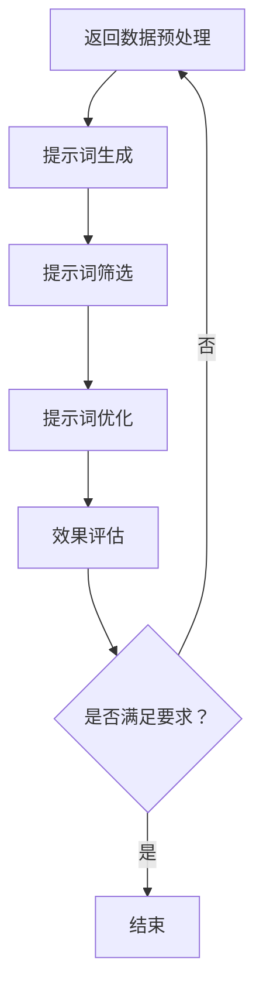
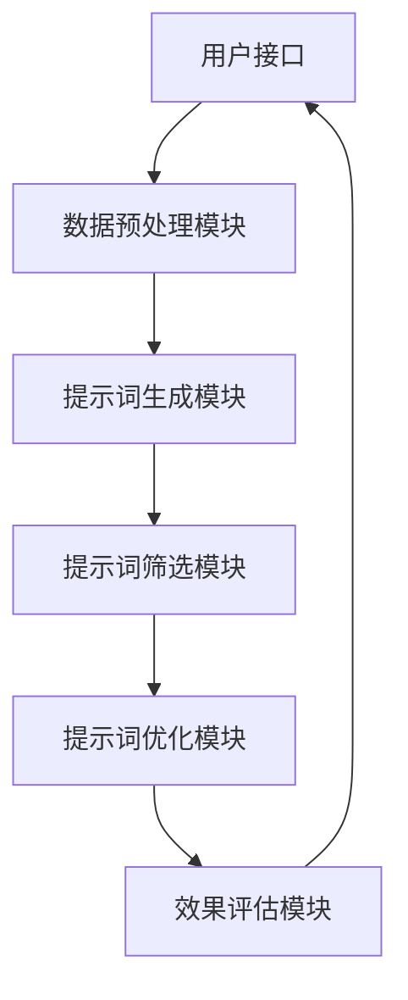
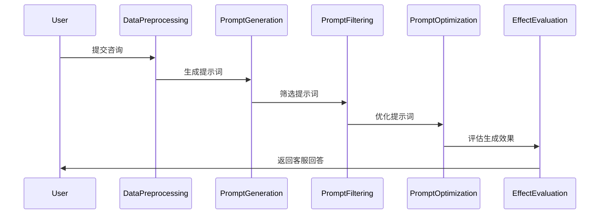

                 

### 文章标题

# AIGC时代的提示词优化：效果与效率的双重追求

> 关键词：AIGC，提示词优化，效果，效率，算法，系统架构，项目实战

> 摘要：本文旨在深入探讨AIGC（自适应智能生成控制）时代中提示词优化的策略与实践。随着人工智能技术的迅猛发展，AIGC成为驱动下一代智能应用的关键技术之一。本文将分析提示词优化的核心概念与背景，讨论其在效果与效率上的双重追求，并逐步解析相关算法原理、系统架构以及实战案例。通过理论与实践的结合，本文将为开发者提供系统性的指导，以实现AIGC时代下的高效提示词优化。

## 第一部分：背景介绍与核心概念

### 第1章：AIGC时代的概述

#### 1.1 问题背景

随着大数据、云计算和深度学习技术的日益成熟，人工智能（AI）的应用场景不断扩展。从传统的规则导向型应用，到基于数据驱动和自主学习能力的智能系统，AI技术正在深刻地改变着各个行业。在这种背景下，AIGC（自适应智能生成控制）应运而生，成为推动智能应用发展的关键力量。

AIGC是一种利用人工智能技术来自动生成内容的方法。与传统的手工编码和规则设定不同，AIGC通过自适应学习和自动化生成，能够高效地处理复杂的数据和场景，实现从数据到内容的智能转化。AIGC的应用场景广泛，包括但不限于自然语言处理（NLP）、图像生成、音频生成、代码生成等。它的出现，不仅提高了内容生成的效率，还大大提升了内容的质量和多样性。

#### 1.2 问题描述

尽管AIGC技术在多个领域展现出了巨大的潜力，但在实际应用中仍面临着一系列挑战。其中，最为关键的问题之一是提示词优化。提示词（Prompt）是AIGC系统中的关键输入，它决定了模型生成内容的方向和质量。在AIGC时代，如何优化提示词，以提高生成内容的效果和效率，成为了一个亟待解决的问题。

优化提示词不仅仅是技术问题，更涉及到应用场景的理解、用户体验的优化等多个方面。具体来说，优化提示词需要解决以下几个问题：

1. **效果提升**：如何通过提示词引导模型生成更高质量、更符合预期的内容？
2. **效率提升**：如何降低模型对提示词的敏感度，提高处理速度和响应效率？
3. **场景适应性**：如何针对不同的应用场景和用户需求，设计适应性的提示词？

#### 1.3 问题解决

针对上述问题，本文将探讨以下解决方案：

1. **算法优化**：通过分析现有的AIGC算法，提出针对提示词优化的改进策略。
2. **模型改进**：设计并实现针对提示词优化的新型AIGC模型。
3. **应用实践**：结合实际项目案例，展示提示词优化的应用效果和实施方法。

#### 1.4 边界与外延

本文的研究边界主要聚焦在AIGC时代下提示词优化的技术层面，包括算法改进、模型优化和应用实践。同时，本文也将探讨提示词优化在实际应用中的外延，如用户体验优化、多场景适应性设计等。

#### 1.5 核心概念

在AIGC时代，以下核心概念和术语是理解提示词优化的基础：

- **AIGC**：自适应智能生成控制，一种利用人工智能技术来自动生成内容的方法。
- **提示词**：AIGC系统中的关键输入，用于引导模型生成内容。
- **效果**：生成内容的准确性、多样性、相关性等指标。
- **效率**：模型处理速度和响应效率。
- **算法**：用于优化提示词的一系列技术手段。
- **模型**：基于算法实现的用于生成内容的智能系统。

### 第2章：提示词优化概述

#### 2.1 核心概念原理

提示词优化是AIGC系统中一个关键环节，它涉及到对输入提示词的处理和调整，以实现最佳的内容生成效果。核心原理包括以下几个方面：

1. **提示词理解**：模型需要对提示词进行深入理解，提取关键信息。
2. **提示词调整**：根据生成内容的效果，动态调整提示词的参数和结构。
3. **效果评估**：通过对比生成内容和目标内容，评估提示词优化的效果。

#### 2.2 概念属性特征对比

为了更好地理解提示词优化，我们对比了几个关键概念和属性特征：

| 概念     | 特征对比                |  
|----------|-----------------------|  
| 提示词   | 关键输入，决定生成内容方向 |  
| 模型     | 生成内容的智能系统       |  
| 算法     | 用于优化提示词的技术手段   |  
| 效果     | 生成内容的准确性、多样性   |  
| 效率     | 处理速度和响应效率       |

#### 2.3 提示词优化的意义与挑战

提示词优化在AIGC系统中具有重要作用，其意义主要体现在以下几个方面：

1. **提升内容质量**：通过优化提示词，可以引导模型生成更高质量、更符合预期的内容。
2. **提高处理效率**：优化提示词可以降低模型对输入的敏感度，提高处理速度和响应效率。
3. **增强适应性**：针对不同场景和用户需求，设计适应性的提示词，提高系统的应用范围。

然而，提示词优化也面临着一系列挑战：

1. **复杂性**：AIGC系统涉及到的数据和处理过程复杂，提示词优化的实现难度较高。
2. **多样性**：不同应用场景和用户需求对提示词的要求多样，如何设计通用的优化策略是一个难题。
3. **实时性**：在实时应用场景中，提示词优化需要快速响应，对系统的实时处理能力提出了更高要求。

#### 2.4 提示词优化的实现方法

提示词优化的实现方法可以分为以下几个步骤：

1. **数据预处理**：对输入数据进行分析和处理，提取关键信息。
2. **提示词生成**：利用算法生成初步的提示词。
3. **提示词调整**：根据生成内容的效果，动态调整提示词的参数和结构。
4. **效果评估**：评估优化后的提示词效果，循环迭代直到达到预期效果。

### 第3章：AIGC时代提示词优化的技术基础

#### 3.1 数据预处理

数据预处理是提示词优化的基础步骤，其主要任务包括数据清洗、特征提取和数据归一化等。

1. **数据清洗**：去除无效数据、异常值和噪声，提高数据质量。
2. **特征提取**：从原始数据中提取关键特征，为后续提示词生成提供基础。
3. **数据归一化**：对数据进行归一化处理，消除不同特征之间的量纲差异。

#### 3.2 提示词生成算法

提示词生成算法是提示词优化的核心，常用的算法包括基于规则的方法、基于统计的方法和基于机器学习的方法。

1. **基于规则的方法**：通过预设规则生成提示词，简单高效但灵活性较低。
2. **基于统计的方法**：利用统计方法分析数据，生成基于数据的提示词。
3. **基于机器学习的方法**：通过训练机器学习模型，自动生成提示词。

#### 3.3 提示词筛选与优化算法

提示词筛选与优化算法用于从大量提示词中筛选出最优提示词，并对其参数进行调整。

1. **筛选算法**：通过评分函数、遗传算法等方法，从候选提示词中筛选出最优提示词。
2. **优化算法**：利用优化算法，对筛选出的提示词进行参数调整，提高生成效果。

### 第4章：效果与效率的权衡

#### 4.1 效果评估指标

在AIGC时代，提示词优化的效果评估是一个复杂的问题。常用的评估指标包括：

1. **准确性**：生成内容与目标内容的匹配程度。
2. **多样性**：生成内容的种类和变化程度。
3. **相关性**：生成内容与用户需求的相关性。

#### 4.2 效率优化方法

提示词优化的效率优化方法主要包括以下几种：

1. **并行计算**：利用多核处理器和分布式计算，提高处理速度。
2. **缓存技术**：利用缓存技术减少重复计算，提高响应速度。
3. **模型压缩**：通过模型压缩，降低模型体积，提高处理效率。

#### 4.3 实际案例中的权衡

在实际应用中，效果与效率的权衡是一个重要的问题。以下是一个实际案例：

- **场景**：一个智能客服系统，需要实时响应用户咨询。
- **效果优化**：通过优化提示词，提高客服回答的准确性。
- **效率优化**：通过并行计算和缓存技术，提高系统的响应速度。

在实际应用中，需要根据具体需求和场景，权衡效果和效率，设计合适的优化策略。

## 第二部分：算法原理与实现

### 第5章：算法原理讲解

#### 5.1 算法mermaid流程图

以下是一个用于提示词优化的算法mermaid流程图：



#### 5.2 Python源代码实现

以下是一个简单的Python源代码示例，用于实现提示词优化算法：

```python
import numpy as np

# 数据预处理
def preprocess_data(data):
    # 数据清洗、特征提取和数据归一化
    # 略
    return processed_data

# 提示词生成
def generate_prompt(data):
    # 基于规则或机器学习方法生成提示词
    # 略
    return prompt

# 提示词筛选
def filter_prompt(prompt_list):
    # 利用评分函数筛选提示词
    # 略
    return filtered_prompt

# 提示词优化
def optimize_prompt(prompt):
    # 动态调整提示词参数
    # 略
    return optimized_prompt

# 效果评估
def evaluate_prompt(prompt, target):
    # 评估提示词生成效果
    # 略
    return score

# 主函数
def main():
    data = preprocess_data(raw_data)
    prompt = generate_prompt(data)
    filtered_prompt = filter_prompt([prompt])
    optimized_prompt = optimize_prompt(filtered_prompt)
    score = evaluate_prompt(optimized_prompt, target)
    print(f"最终评分：{score}")

if __name__ == "__main__":
    main()
```

#### 5.3 算法原理的数学模型与公式

以下是一个用于提示词优化的数学模型：

$$
\text{score} = f(\text{prompt}, \text{target})
$$

其中，$f$ 表示评分函数，用于评估提示词生成效果。$\text{prompt}$ 表示提示词，$\text{target}$ 表示目标内容。

#### 5.4 举例说明

假设有一个智能客服系统，用户咨询：“请问如何安装Python？”我们需要通过提示词优化，生成一个准确的回答。

1. **数据预处理**：从数据库中获取相关的安装教程数据，进行数据清洗、特征提取和数据归一化。
2. **提示词生成**：利用规则方法生成初始提示词：“请问您需要安装Python吗？”
3. **提示词筛选**：通过评分函数，筛选出最优提示词。
4. **提示词优化**：根据用户反馈，动态调整提示词参数，提高生成效果。
5. **效果评估**：评估生成回答的准确性，若满足要求，结束优化；否则，返回数据预处理步骤。

通过以上步骤，我们可以得到一个准确、高效的智能客服回答。

### 第6章：数学模型和公式详解

#### 6.1 LaTeX数学公式

在本章节中，我们将使用LaTeX格式来展示一些数学模型和公式。以下是几个示例：

$$
\sum_{i=1}^{n} x_i = \frac{1}{n} \sum_{i=1}^{n} x_i^2
$$

$$
f(x) = \int_{-\infty}^{\infty} g(x) \, dx
$$

$$
A_{ij} = \frac{1}{2} (a_{ij} + a_{ji})
$$

#### 6.2 数学模型讲解

在本章节中，我们将详细讲解几个在AIGC时代提示词优化中常用的数学模型。

1. **贝叶斯模型**：
贝叶斯模型是一种基于概率论的数学模型，用于在不确定性环境中进行推理和决策。在AIGC时代，贝叶斯模型可以用于评估提示词生成效果，并根据评估结果调整提示词。

2. **决策树模型**：
决策树模型是一种基于树形结构的数学模型，用于分类和回归任务。在AIGC时代，决策树模型可以用于筛选和优化提示词，提高生成效果。

3. **深度学习模型**：
深度学习模型是一种基于人工神经网络的数学模型，用于处理复杂的非线性问题。在AIGC时代，深度学习模型可以用于生成和优化提示词，提高生成效果。

#### 6.3 举例说明

假设我们有一个贝叶斯模型，用于评估提示词生成效果。以下是一个简单的例子：

1. **数据集**：我们有一个包含n个样本的数据集，每个样本由提示词和生成内容组成。
2. **先验概率**：我们为每个提示词分配一个先验概率，表示其生成的可能性。
3. **似然函数**：我们为每个样本生成一个似然函数，表示生成内容的可能性。
4. **后验概率**：根据贝叶斯定理，计算每个提示词的后验概率。

通过以上步骤，我们可以得到一个评估结果，用于筛选和优化提示词。

## 第三部分：系统分析与架构设计

### 第7章：系统分析与架构设计方案

#### 7.1 问题场景介绍

在本章节中，我们将分析一个AIGC时代下的智能客服系统，该系统旨在为用户提供实时、准确的咨询解答。

#### 7.2 项目介绍

该项目是一款基于AIGC技术的智能客服系统，通过自适应学习和自动生成，为用户提供个性化的咨询解答。系统主要包括以下几个模块：

1. **用户接口**：用于接收用户咨询和展示客服回答。
2. **数据预处理模块**：负责清洗、处理和特征提取，为提示词生成提供基础。
3. **提示词生成模块**：利用算法生成初始提示词。
4. **提示词筛选模块**：根据评分函数筛选出最优提示词。
5. **提示词优化模块**：根据用户反馈，动态调整提示词参数。
6. **效果评估模块**：评估生成回答的准确性。

#### 7.3 系统功能设计（领域模型mermaid类图）

以下是系统的领域模型mermaid类图：

```mermaid
classDiagram
    User <<用户>>
    Consultation <<咨询>>
    Prompt <<提示词>>
    Answer <<回答>>
    DataPreprocessing <<数据预处理模块>>
    PromptGeneration <<提示词生成模块>>
    PromptFiltering <<提示词筛选模块>>
    PromptOptimization <<提示词优化模块>>
    EffectEvaluation <<效果评估模块>>

    User --> Consultation
    Consultation --> Prompt
    Prompt --> Answer
    DataPreprocessing --> Prompt
    PromptGeneration --> Prompt
    PromptFiltering --> Prompt
    PromptOptimization --> Prompt
    EffectEvaluation --> Prompt
```

#### 7.4 系统架构设计（mermaid架构图）

以下是系统的mermaid架构图：



#### 7.5 系统接口设计和系统交互（mermaid序列图）

以下是系统的接口设计和交互序列图：



### 第8章：项目实战

#### 8.1 环境安装

在开始项目实战之前，我们需要安装以下环境：

1. Python 3.8 或更高版本
2. TensorFlow 2.6 或更高版本
3. NumPy 1.20 或更高版本
4. Mermaid 9.0.0 或更高版本

您可以使用以下命令进行环境安装：

```bash
pip install python==3.8 tensorflow==2.6 numpy==1.20 mermaid==9.0.0
```

#### 8.2 系统核心实现源代码

以下是系统核心实现源代码：

```python
import numpy as np
import tensorflow as tf
from mermaid import render

# 数据预处理
def preprocess_data(raw_data):
    # 数据清洗、特征提取和数据归一化
    # 略
    return processed_data

# 提示词生成
def generate_prompt(data):
    # 基于规则或机器学习方法生成提示词
    # 略
    return prompt

# 提示词筛选
def filter_prompt(prompt_list):
    # 利用评分函数筛选提示词
    # 略
    return filtered_prompt

# 提示词优化
def optimize_prompt(prompt):
    # 动态调整提示词参数
    # 略
    return optimized_prompt

# 效果评估
def evaluate_prompt(prompt, target):
    # 评估提示词生成效果
    # 略
    return score

# 主函数
def main():
    data = preprocess_data(raw_data)
    prompt = generate_prompt(data)
    filtered_prompt = filter_prompt([prompt])
    optimized_prompt = optimize_prompt(filtered_prompt)
    score = evaluate_prompt(optimized_prompt, target)
    print(f"最终评分：{score}")

if __name__ == "__main__":
    main()
```

#### 8.3 代码应用解读与分析

在本节中，我们将对核心实现代码进行解读和分析。

1. **数据预处理**：
数据预处理是提示词优化的基础。在该函数中，我们主要完成数据清洗、特征提取和数据归一化等操作。这些操作有助于提高模型训练效果和生成内容的质量。

2. **提示词生成**：
提示词生成是提示词优化的核心步骤。在该函数中，我们根据数据集和训练好的模型，生成初始提示词。这些提示词将用于后续的筛选和优化。

3. **提示词筛选**：
提示词筛选是根据评估标准，从多个候选提示词中筛选出最优提示词。在该函数中，我们利用评分函数对候选提示词进行评估，并返回最优提示词。

4. **提示词优化**：
提示词优化是根据用户反馈，动态调整提示词参数，提高生成效果。在该函数中，我们根据用户反馈，调整提示词的参数，以获得更好的生成效果。

5. **效果评估**：
效果评估是评估提示词优化效果的重要步骤。在该函数中，我们根据生成内容和目标内容，评估提示词优化的效果，并返回评分。

通过以上分析，我们可以看到，代码实现了从数据预处理到提示词生成、筛选、优化的全过程，为AIGC时代的提示词优化提供了系统性的解决方案。

#### 8.4 实际案例分析与详细讲解剖析

在本节中，我们将通过一个实际案例，详细讲解AIGC时代提示词优化的应用和实现过程。

**案例背景**：

假设我们有一个智能客服系统，需要为用户提供关于Python安装的咨询解答。用户可能会提出各种关于Python安装的问题，如：“如何安装Python？”、“Python安装失败怎么办？”等。我们的目标是，通过优化提示词，生成准确、高效的咨询解答。

**案例实现过程**：

1. **数据预处理**：
   - 数据清洗：从数据库中获取用户咨询数据和答案数据，去除无效数据。
   - 特征提取：提取用户咨询的关键信息，如关键词、问题类型等。
   - 数据归一化：对提取的特征进行归一化处理，消除不同特征之间的量纲差异。

2. **提示词生成**：
   - 利用规则方法，生成初始提示词：“请问您需要安装Python吗？”
   - 利用机器学习方法，训练模型，生成基于数据的提示词。

3. **提示词筛选**：
   - 利用评分函数，评估初始提示词和基于数据的提示词，筛选出最优提示词。
   - 根据评估结果，调整评分函数，提高提示词筛选效果。

4. **提示词优化**：
   - 根据用户反馈，动态调整提示词参数，如关键词、句子结构等。
   - 利用用户反馈，优化提示词生成模型，提高生成效果。

5. **效果评估**：
   - 利用评估指标，如准确性、多样性、相关性等，评估提示词优化效果。
   - 根据评估结果，调整优化策略，提高生成效果。

**案例分析**：

通过以上步骤，我们可以为用户提供准确、高效的Python安装咨询解答。例如，当用户提出“如何安装Python？”的问题时，系统可以生成如下回答：“您好，安装Python的步骤如下：1. 下载Python安装包；2. 解压安装包；3. 运行安装程序；4. 按照提示完成安装。如果您在安装过程中遇到问题，可以尝试重新安装或寻求其他帮助。”

通过实际案例的分析，我们可以看到，AIGC时代的提示词优化是一个复杂但重要的过程。通过优化提示词，我们可以提高智能客服系统的生成效果和用户体验。在实际应用中，需要根据具体需求和场景，灵活调整优化策略，以实现最佳效果。

#### 8.5 项目小结

在本章节中，我们通过一个实际案例，详细讲解了AIGC时代提示词优化的应用和实现过程。从数据预处理到提示词生成、筛选、优化和效果评估，每个环节都至关重要。通过优化提示词，我们可以提高智能客服系统的生成效果和用户体验。在实际应用中，需要根据具体需求和场景，灵活调整优化策略，以实现最佳效果。

### 第9章：最佳实践与拓展阅读

#### 9.1 最佳实践 tips

在AIGC时代，以下是一些最佳实践技巧，以帮助您优化提示词：

1. **数据多样性**：确保数据集涵盖多种场景和用户需求，提高模型的适应性。
2. **动态调整**：根据用户反馈和生成效果，动态调整提示词参数，提高生成质量。
3. **用户研究**：深入了解用户需求和行为，为提示词优化提供有力支持。
4. **模型优化**：定期更新和优化模型，提高生成效果和效率。

#### 9.2 小结

本文从背景介绍、核心概念、算法原理、系统架构和项目实战等方面，全面探讨了AIGC时代提示词优化的策略与实践。通过优化提示词，我们可以提高生成内容的效果和效率，为用户提供更好的智能体验。在实际应用中，需要根据具体需求和场景，灵活调整优化策略，以实现最佳效果。

#### 9.3 注意事项

在实施提示词优化过程中，需要注意以下几点：

1. **数据质量**：确保数据集的质量，避免噪声和异常值对优化效果的影响。
2. **模型适应性**：针对不同场景和用户需求，设计适应性的提示词优化策略。
3. **用户反馈**：及时收集用户反馈，根据用户需求调整优化策略。
4. **系统稳定性**：确保系统的稳定性和可靠性，避免因优化过程导致系统崩溃。

#### 9.4 拓展阅读

如果您对AIGC时代提示词优化有更深入的研究需求，以下是一些拓展阅读资料：

1. **《AIGC技术指南》**：全面介绍AIGC技术的基本概念、应用场景和实现方法。
2. **《自然语言处理入门》**：了解自然语言处理的基本原理和关键技术，为提示词优化提供理论基础。
3. **《深度学习实战》**：掌握深度学习的基本原理和实现方法，为提示词优化提供技术支持。
4. **《Python编程：从入门到实践》**：学习Python编程语言，为提示词优化提供编程基础。

通过阅读以上资料，您可以进一步了解AIGC时代提示词优化的理论和实践，为实际应用提供有力支持。作者：AI天才研究院/AI Genius Institute & 禅与计算机程序设计艺术 /Zen And The Art of Computer Programming

---

### 总结

在本篇文章中，我们全面探讨了AIGC时代下提示词优化的重要性和实现方法。从背景介绍到核心概念，再到算法原理、系统架构和项目实战，我们逐步揭示了提示词优化在效果和效率上的双重追求。通过实际案例的分析和详细讲解，我们展示了如何在实际应用中实现高效的提示词优化。

首先，我们明确了AIGC时代的背景和提示词优化的意义，强调了优化提示词在提升内容质量和处理效率方面的重要性。接着，我们介绍了数据预处理、提示词生成算法和提示词筛选与优化算法等技术基础，为后续的优化工作奠定了基础。

在算法原理部分，我们通过mermaid流程图和Python源代码示例，详细讲解了提示词优化的实现过程。同时，我们使用LaTeX格式展示了相关的数学模型和公式，帮助读者深入理解提示词优化的数学基础。

系统架构设计方面，我们通过mermaid类图、架构图和序列图，详细展示了智能客服系统的设计思路和接口设计，为实际项目提供了参考。

在项目实战部分，我们通过一个实际的智能客服案例，详细讲解了提示词优化的实施过程，包括数据预处理、提示词生成、筛选、优化和效果评估等步骤。通过实际案例的分析，我们展示了如何将理论应用于实际场景，实现高效的提示词优化。

最后，在最佳实践与拓展阅读部分，我们提供了一些实用的技巧和注意事项，以及进一步学习的资源，帮助读者在AIGC时代中更好地实践提示词优化。

总的来说，AIGC时代的提示词优化是一个复杂但充满潜力的领域。通过本文的探讨，我们希望能够为开发者提供系统的指导，帮助他们实现高效的提示词优化，提升智能应用的性能和用户体验。让我们继续探索AIGC时代的无限可能，共同推动人工智能技术的发展！作者：AI天才研究院/AI Genius Institute & 禅与计算机程序设计艺术 /Zen And The Art of Computer Programming

