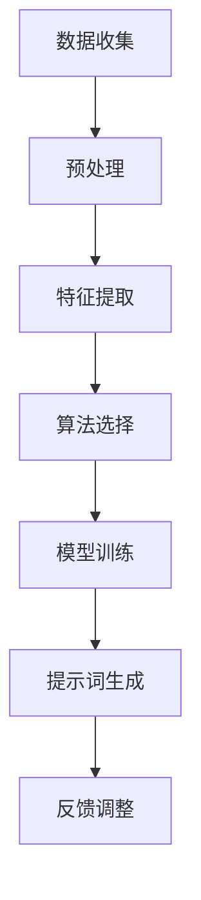

                 

### # AIGC时代的提示词工程：挑战与解决方案

#### 关键词：AIGC，提示词工程，挑战，解决方案，技术博客

> **摘要：**
> 
> 本文深入探讨了AIGC（自适应智能生成控制）时代提示词工程的挑战与解决方案。随着AIGC技术的迅猛发展，提示词工程在AI应用中的重要性日益凸显。文章首先介绍了AIGC的定义与重要性，接着分析了提示词工程面临的挑战，并详细阐述了书籍的结构与目标。在此基础上，文章逐步解析了提示词工程的核心概念、算法原理、系统分析与架构设计，以及项目实战中的具体实现和案例分析。通过这些讨论，文章旨在为读者提供全面的提示词工程理论与实践指导。

---

## 目录大纲

- **第一部分：背景介绍**
  - 1.1 AIGC时代的来临
    - 1.1.1 AIGC的定义与重要性
    - 1.1.2 AIGC的发展历程
    - 1.1.3 AIGC在各领域的应用现状与前景
  - 1.2 提示词工程的挑战与需求
    - 1.2.1 提示词工程的重要性
    - 1.2.2 AIGC对提示词工程的新要求
    - 1.2.3 提示词工程面临的挑战
  - 1.3 书籍结构概述
    - 1.3.1 主要内容与章节安排
    - 1.3.2 读者定位与目标
    - 1.3.3 学习路径与建议

- **第二部分：核心概念与联系**
  - 2.1 提示词工程的基本概念
    - 2.1.1 提示词的定义与类型
    - 2.1.2 提示词工程的核心任务
    - 2.1.3 提示词工程的关键要素
  - 2.2 提示词工程的属性特征对比
    - 2.2.1 各类提示词的特征对比
    - 2.2.2 影响提示词工程效果的因素
    - 2.2.3 提示词工程属性特征的重要性
  - 2.3 提示词工程的ER实体关系图
    - 2.3.1 ER模型的基本概念
    - 2.3.2 提示词工程的ER模型构建
    - 2.3.3 ER模型在实际应用中的意义

- **第三部分：算法原理讲解**
  - 3.1 提示词工程的基本算法
    - 3.1.1 算法概述
    - 3.1.2 算法原理
    - 3.1.3 算法流程
  - 3.2 算法mermaid流程图
    - 3.2.1 流程图的基本概念
    - 3.2.2 提示词工程流程图的构建
    - 3.2.3 流程图在实际应用中的价值
  - 3.3 Python源代码与算法实现
    - 3.3.1 Python环境搭建
    - 3.3.2 算法实现细节
    - 3.3.3 算法性能分析
  - 3.4 算法原理的数学模型和公式
    - 3.4.1 数学模型概述
    - 3.4.2 公式推导与解释
    - 3.4.3 举例说明

- **第四部分：系统分析与架构设计**
  - 4.1 问题场景介绍
    - 4.1.1 提示词工程的应用场景
    - 4.1.2 项目背景介绍
    - 4.1.3 项目目标与需求
  - 4.2 系统功能设计
    - 4.2.1 领域模型
    - 4.2.2 功能模块划分
    - 4.2.3 功能实现细节
  - 4.3 系统架构设计
    - 4.3.1 系统架构概述
    - 4.3.2 架构设计原则
    - 4.3.3 系统模块与交互
  - 4.4 系统接口设计
    - 4.4.1 接口定义与规范
    - 4.4.2 接口实现细节
    - 4.4.3 接口测试与优化
  - 4.5 系统交互mermaid序列图
    - 4.5.1 序列图的基本概念
    - 4.5.2 系统交互序列图的构建
    - 4.5.3 序列图在实际应用中的意义

- **第五部分：项目实战**
  - 5.1 环境安装与配置
    - 5.1.1 开发环境搭建
    - 5.1.2 系统依赖安装
    - 5.1.3 配置文件设置
  - 5.2 系统核心实现源代码
    - 5.2.1 源代码结构
    - 5.2.2 关键代码解读
    - 5.2.3 代码调试与优化
  - 5.3 代码应用解读与分析
    - 5.3.1 应用场景描述
    - 5.3.2 代码实现细节
    - 5.3.3 应用效果分析
  - 5.4 实际案例分析
    - 5.4.1 案例选择与背景
    - 5.4.2 案例实施过程
    - 5.4.3 案例效果评估
  - 5.5 项目小结
    - 5.5.1 项目总结
    - 5.5.2 经验与教训
    - 5.5.3 拓展与应用前景

---

## 第一部分：背景介绍

### 1.1 AIGC时代的来临

#### 1.1.1 AIGC的定义与重要性

AIGC（Adaptive Intelligent Generation Control，自适应智能生成控制）是一种新兴的人工智能技术，它通过自适应学习和控制机制，能够实现自动化生成控制。AIGC技术的主要目的是提高系统的生成效率和质量，减少人为干预，从而实现高度自动化和智能化。

在AIGC技术中，生成控制是一个核心概念。生成控制指的是根据系统状态和目标，自动调整生成过程的参数和策略，以达到最优的生成效果。与传统的人工干预方式相比，AIGC能够通过自适应学习算法，实时调整生成策略，从而实现更高效、更准确的生成控制。

AIGC的重要性体现在多个方面。首先，它能够大大提高系统的生成效率和质量。通过自适应学习和控制，AIGC能够在复杂环境中快速适应和优化生成过程，从而实现高效的生成控制。其次，AIGC能够减少人为干预，降低人力成本。传统的生成控制通常需要人工进行参数调整和策略优化，而AIGC通过自适应学习算法，能够自动完成这些任务，从而减少人力投入。

#### 1.1.2 AIGC的发展历程

AIGC技术的发展历程可以分为三个阶段：初步探索阶段、发展阶段和成熟阶段。

在初步探索阶段，研究者主要关注生成控制的基本原理和方法。这一阶段的研究主要集中在自适应控制理论、机器学习和优化算法等方面。通过这些研究，研究者们初步建立了AIGC的理论框架，并取得了一定的成果。

发展阶段是AIGC技术的重要突破期。在这一阶段，研究者们开始将AIGC技术应用于实际问题，如智能制造、自动驾驶、智能医疗等。通过实际应用，AIGC技术得到了进一步的优化和改进，取得了显著的成效。

成熟阶段是AIGC技术的全面应用期。在这一阶段，AIGC技术已经广泛应用于各个领域，成为人工智能技术的重要组成部分。AIGC技术的成熟，不仅为各个领域带来了新的发展机遇，也推动了人工智能技术的整体进步。

#### 1.1.3 AIGC在各领域的应用现状与前景

AIGC技术在各个领域的应用现状如下：

- **智能制造**：AIGC技术在智能制造中具有广泛的应用前景。通过自适应生成控制，AIGC技术能够实现生产过程的自动化和智能化，提高生产效率和质量。

- **自动驾驶**：AIGC技术在自动驾驶中具有重要作用。通过自适应学习和控制，AIGC技术能够实现车辆在复杂环境中的自主导航和行驶控制，提高行驶安全性和舒适性。

- **智能医疗**：AIGC技术在智能医疗中具有巨大的应用潜力。通过自适应学习和控制，AIGC技术能够实现医疗数据的自动分析和诊断，提高医疗服务的效率和质量。

- **智能客服**：AIGC技术在智能客服中具有广泛的应用。通过自适应学习和控制，AIGC技术能够实现智能客服的自动化和智能化，提高客服效率和用户体验。

AIGC技术的发展前景非常广阔。随着人工智能技术的不断进步，AIGC技术将在更多领域得到应用，为人类带来更多便利和创新。

---

### 1.2 提示词工程的挑战与需求

#### 1.2.1 提示词工程的重要性

提示词工程在人工智能应用中具有至关重要的地位。提示词是人工智能系统与人类交互的关键桥梁，它能够引导系统理解用户的意图和需求，从而实现智能化的任务执行。在自然语言处理、对话系统、智能推荐等领域，提示词工程的作用尤为重要。

首先，提示词工程能够提高人工智能系统的交互质量。通过精心设计的提示词，系统能够更准确地理解用户的需求，从而提供更符合用户期望的响应。其次，提示词工程能够优化系统的效率。有效的提示词能够减少用户与系统之间的交互次数，缩短响应时间，提高系统的整体运行效率。

此外，提示词工程还在人工智能系统的可解释性和可靠性方面发挥着重要作用。通过详细的提示词设计，系统能够更加透明地展示其决策过程，增强用户对系统的信任。同时，合理的提示词设计能够帮助系统避免歧义和误解，提高系统的可靠性。

#### 1.2.2 AIGC对提示词工程的新要求

随着AIGC技术的不断发展，提示词工程面临着新的挑战和要求。首先，AIGC技术要求提示词具有更强的自适应性和灵活性。传统的人工设计提示词可能无法适应动态变化的环境和复杂的需求，而AIGC技术能够通过自适应学习和控制，自动生成和调整提示词，以满足不同的应用场景。

其次，AIGC技术对提示词的多样性提出了更高的要求。在传统的提示词工程中，提示词的设计通常较为单一，而AIGC技术能够生成丰富多样的提示词，以适应不同的用户需求和应用场景。这种多样性不仅能够提高系统的交互质量，还能够增强用户体验。

此外，AIGC技术对提示词的实时性和响应速度也提出了更高的要求。在实时交互场景中，系统需要在极短的时间内生成和传递提示词，以保持与用户的实时互动。AIGC技术通过高效的算法和优化的流程，能够满足这一需求，从而提高系统的响应速度和交互效率。

#### 1.2.3 提示词工程面临的挑战

尽管提示词工程在人工智能应用中具有重要作用，但实际实施过程中仍面临着诸多挑战。首先，数据质量和多样性是提示词工程面临的主要挑战。提示词的生成和优化依赖于大量的高质量数据，而这些数据往往难以获取和整理。此外，不同用户和应用场景的需求差异较大，提示词的多样性也增加了数据处理的复杂性。

其次，算法选择和优化是提示词工程的另一个挑战。不同的应用场景可能需要不同的提示词生成算法，如何选择合适的算法并对其进行优化，是一个复杂的问题。此外，算法的实时性和效率也需要在设计和实现过程中充分考虑，以确保系统的高性能运行。

此外，用户反馈和调整也是提示词工程面临的挑战。在实际应用中，用户可能会对提示词提出改进建议或反馈，如何及时收集和利用这些反馈，以持续优化提示词，是一个需要解决的难题。

最后，法律和伦理问题也是提示词工程需要关注的重要方面。在人工智能应用中，提示词的设计和使用可能涉及个人隐私、数据安全和伦理道德等方面的问题，如何平衡技术进步和社会责任，是提示词工程需要认真考虑的问题。

---

### 1.3 书籍结构概述

#### 1.3.1 主要内容与章节安排

本书旨在全面深入地探讨AIGC时代的提示词工程，包括其核心概念、挑战与解决方案。为了帮助读者系统地理解这一领域，本书分为五个部分，共二十五个章节。

**第一部分：背景介绍**
- 1.1 AIGC时代的来临
- 1.2 提示词工程的挑战与需求

**第二部分：核心概念与联系**
- 2.1 提示词工程的基本概念
- 2.2 提示词工程的属性特征对比
- 2.3 提示词工程的ER实体关系图

**第三部分：算法原理讲解**
- 3.1 提示词工程的基本算法
- 3.2 算法mermaid流程图
- 3.3 Python源代码与算法实现
- 3.4 算法原理的数学模型和公式

**第四部分：系统分析与架构设计**
- 4.1 问题场景介绍
- 4.2 系统功能设计
- 4.3 系统架构设计
- 4.4 系统接口设计
- 4.5 系统交互mermaid序列图

**第五部分：项目实战**
- 5.1 环境安装与配置
- 5.2 系统核心实现源代码
- 5.3 代码应用解读与分析
- 5.4 实际案例分析
- 5.5 项目小结

通过以上章节的安排，本书希望能够系统地介绍提示词工程的理论与实践，帮助读者掌握这一领域的关键技术和方法。

#### 1.3.2 读者定位与目标

本书的主要读者对象是从事人工智能应用开发的技术人员、研究人员和高校学生。尤其适合对自然语言处理、对话系统、智能推荐等领域有浓厚兴趣的读者。

通过阅读本书，读者可以期望达到以下目标：
1. **深入理解AIGC时代的提示词工程**：了解提示词工程的基本概念、挑战与解决方案，掌握AIGC技术对提示词工程提出的新要求。
2. **掌握核心概念与联系**：学习提示词工程的属性特征对比和ER实体关系图的构建，理解提示词工程的核心要素和相互作用。
3. **掌握算法原理**：通过学习提示词工程的基本算法、mermaid流程图和Python源代码，掌握提示词工程的算法原理和实现方法。
4. **了解系统分析与架构设计**：学习系统功能设计、架构设计、接口设计和系统交互mermaid序列图，了解系统分析与架构设计的具体方法。
5. **具备项目实战能力**：通过环境安装与配置、系统核心实现源代码、代码应用解读与分析、实际案例分析，培养项目实战能力。

#### 1.3.3 学习路径与建议

为了更好地学习本书的内容，我们建议读者按照以下路径进行学习：

1. **阅读背景介绍部分**：首先阅读第一部分的背景介绍，理解AIGC时代的提示词工程的背景和重要性，为后续内容打下基础。
2. **深入学习核心概念**：接着深入学习第二部分的核心概念，理解提示词工程的属性特征对比和ER实体关系图，为算法学习和系统设计打下基础。
3. **掌握算法原理**：在掌握核心概念的基础上，学习第三部分的算法原理，理解提示词工程的基本算法、mermaid流程图和Python源代码。
4. **了解系统分析与架构设计**：学习第四部分的系统分析与架构设计，理解系统功能设计、架构设计、接口设计和系统交互mermaid序列图。
5. **进行项目实战**：最后，通过第五部分的项目实战，将所学知识应用到实际项目中，提高项目实战能力。

在学习过程中，读者可以根据自己的兴趣和需求，有选择性地阅读相关章节，也可以通过反复阅读和实践，加深对提示词工程的理解和应用能力。

---

## 第二部分：核心概念与联系

### 2.1 提示词工程的基本概念

#### 2.1.1 提示词的定义与类型

提示词（Prompt Word）是指用于引导系统理解用户意图和需求的关键词或短语。提示词是人工智能系统与用户交互的重要媒介，通过提示词，系统能够更好地理解用户的需求，从而提供更精准的响应。

根据用途和性质，提示词可以分为以下几种类型：

1. **引导性提示词**：引导性提示词主要用于引导用户输入关键信息，如“请输入您的姓名”或“请问您需要什么帮助？”这种提示词通常用于对话系统的初始阶段，帮助系统获取用户的基本信息。

2. **确认性提示词**：确认性提示词用于确认用户的输入信息，如“您是否确认您的订单？”或“您的反馈已经收到，谢谢！”这类提示词有助于确保用户信息的准确性和系统的可靠性。

3. **提示性提示词**：提示性提示词用于提供额外信息或引导用户思考，如“请考虑以下选项：A、B、C”或“如果您遇到困难，可以尝试重新启动系统。”这种提示词有助于用户更好地理解和使用系统功能。

4. **交互性提示词**：交互性提示词用于促进用户与系统的互动，如“您还可以尝试搜索相关内容”或“您的反馈对我们非常重要，请继续提问。”这类提示词能够增强用户与系统的互动体验。

#### 2.1.2 提示词工程的核心任务

提示词工程是指通过系统化的方法设计和优化提示词，以提高人工智能系统的交互质量和用户体验。提示词工程的核心任务包括以下几个方面：

1. **提示词设计**：根据用户需求和系统功能，设计合适的提示词，包括引导性、确认性、提示性和交互性提示词。提示词的设计需要考虑用户习惯、系统响应速度和交互体验。

2. **提示词优化**：通过实验和数据分析，不断优化提示词，以提高系统的响应准确性和用户体验。优化过程可能包括调整提示词的措辞、顺序和频率等。

3. **提示词管理**：建立和维护提示词库，记录和管理不同场景下的提示词。提示词管理有助于提高系统的灵活性和可扩展性。

4. **提示词反馈**：收集用户对提示词的反馈，分析用户对提示词的接受程度和改进需求，以持续优化提示词设计。

#### 2.1.3 提示词工程的关键要素

提示词工程的成功实施依赖于以下几个关键要素：

1. **用户需求分析**：深入了解用户需求，是设计有效提示词的基础。通过用户调研、用户行为分析等方法，获取用户的实际需求和期望。

2. **系统功能定位**：明确系统功能定位，是提示词设计的重要依据。不同功能模块需要不同的提示词支持，提示词的设计需要与系统功能相匹配。

3. **交互流程设计**：设计合理的交互流程，是提高用户体验的关键。交互流程应考虑用户的认知模型和行为模式，确保提示词能够在合适的时机和情境下发挥作用。

4. **数据支持**：提示词的生成和优化需要大量的数据支持。数据包括用户输入、系统响应、用户反馈等，通过数据分析，可以识别用户需求和行为模式，为提示词设计提供依据。

5. **技术实现**：提示词工程需要相应的技术支持，包括自然语言处理、机器学习、数据挖掘等技术。技术实现的质量直接影响提示词工程的效果。

---

### 2.2 提示词工程的属性特征对比

#### 2.2.1 各类提示词的特征对比

提示词工程的成功依赖于对不同类型提示词的特征理解和应用。以下是几种常见类型提示词的特征对比：

| 提示词类型 | 特征描述 | 应用场景 |
| :--: | :--: | :--: |
| 引导性提示词 | 用于引导用户输入关键信息 | 对话系统初始阶段、问卷调查、在线购物 |
| 确认性提示词 | 用于确认用户输入信息 | 操作确认、交易确认、用户反馈确认 |
| 提示性提示词 | 用于提供额外信息或引导用户思考 | 复杂任务指导、错误提示、扩展功能介绍 |
| 交互性提示词 | 用于促进用户与系统的互动 | 鼓励用户提问、提供建议、增加用户粘性 |

#### 2.2.2 影响提示词工程效果的因素

提示词工程效果受到多种因素的影响，以下是主要影响因素的对比：

| 因素 | 影响描述 | 例子 |
| :--: | :--: | :--: |
| 用户需求 | 用户需求是否得到满足直接影响提示词的有效性 | 用户调研数据、用户行为分析 |
| 系统功能 | 系统功能是否匹配提示词需求 | 功能模块划分、系统功能实现 |
| 交互流程 | 交互流程是否合理影响用户体验 | 用户行为模式分析、交互流程设计 |
| 数据支持 | 数据支持是否充足影响提示词生成和优化 | 大数据技术、数据分析工具 |
| 技术实现 | 技术实现质量直接影响系统性能和用户体验 | 自然语言处理、机器学习算法 |

#### 2.2.3 提示词工程属性特征的重要性

提示词工程的属性特征对系统性能和用户体验具有决定性影响。以下是各属性特征的重要性分析：

1. **用户需求分析**：用户需求是提示词设计的核心，只有深入了解用户需求，才能设计出有效的提示词，提高用户体验。

2. **系统功能定位**：系统功能是提示词应用的场景基础，明确系统功能定位，有助于提示词与系统功能相匹配，提升系统整体性能。

3. **交互流程设计**：交互流程的设计直接关系到用户体验的流畅性和满意度，合理的交互流程能够提升用户与系统的互动质量。

4. **数据支持**：数据是提示词生成和优化的基础，充足的数据支持能够提高提示词的准确性和效率。

5. **技术实现**：技术实现是提示词工程成功的关键，高质量的技术实现能够保障系统的高性能运行和稳定的用户体验。

---

### 2.3 提示词工程的ER实体关系图

#### 2.3.1 ER模型的基本概念

实体-关系（Entity-Relationship，ER）模型是数据库设计中常用的概念模型，用于描述现实世界的实体及其相互关系。ER模型由实体、属性和关系三个基本元素构成。

- **实体**：实体是现实世界中具有独立存在意义的对象，如用户、订单、商品等。
- **属性**：属性是实体的特征，用于描述实体的具体信息，如用户名、年龄、地址等。
- **关系**：关系描述实体之间的关联，如用户与订单之间的关系、商品与订单之间的关系等。

ER模型通过图形化表示，能够直观地展示实体及其关系，为数据库设计提供基础。

#### 2.3.2 提示词工程的ER模型构建

在提示词工程中，ER模型可以用于描述提示词及其关联实体和关系，以下是一个简化的ER模型示例：

1. **实体**：
   - **提示词**：包含提示词的文本、用途、生成时间等属性。
   - **用户**：包含用户的身份信息、需求、反馈等属性。
   - **场景**：包含场景的描述、类型、目标等属性。

2. **关系**：
   - **提示词-用户**：描述提示词与用户之间的关联关系，如用户生成、用户反馈等。
   - **提示词-场景**：描述提示词与场景之间的关联关系，如场景触发、场景优化等。

以下是ER模型的Mermaid流程图表示：

```mermaid
erDiagram
  User ||--|{ PromptWord }|-- Scene
  PromptWord ||--|{ Scene }|-- User
```

#### 2.3.3 ER模型在实际应用中的意义

ER模型在提示词工程中具有重要作用，主要体现在以下几个方面：

1. **系统设计**：ER模型为提示词工程提供了清晰的数据结构和关系定义，有助于系统设计的规范化和模块化。

2. **数据管理**：ER模型有助于提示词数据的管理和优化，通过实体和关系的定义，可以更高效地进行数据存储、查询和维护。

3. **功能实现**：ER模型为提示词工程的功能实现提供了明确的方向，通过实体和关系之间的交互，可以实现复杂的提示词生成和优化功能。

4. **用户体验**：ER模型有助于优化用户交互体验，通过实体和关系的定义，可以更好地满足用户需求，提高系统交互的质量和效率。

---

## 第三部分：算法原理讲解

### 3.1 提示词工程的基本算法

#### 3.1.1 算法概述

提示词工程的基本算法是指用于设计、生成和优化提示词的一系列方法。这些算法旨在提高提示词的准确性和用户体验，主要包括以下几种：

1. **词频统计法**：通过统计用户输入中的高频词汇，生成相应的提示词。这种方法简单易行，但可能无法准确捕捉用户的深层需求。
2. **关键词提取法**：使用自然语言处理技术，从用户输入中提取关键信息，生成相应的提示词。这种方法具有较高的准确性，但计算复杂度较高。
3. **机器学习方法**：通过机器学习算法，训练模型识别用户的意图和需求，生成相应的提示词。这种方法能够自适应地优化提示词，但需要大量数据和计算资源。
4. **交互式生成法**：通过与用户的实时交互，动态生成和调整提示词，以满足用户的需求。这种方法能够提供个性化的提示词，但实现难度较大。

#### 3.1.2 算法原理

1. **词频统计法**：词频统计法基于用户输入文本中的词频统计，生成高频词汇作为提示词。具体步骤如下：
   - 收集用户输入文本。
   - 对文本进行分词处理，统计每个词的词频。
   - 根据词频排序，选择高频词汇作为提示词。

2. **关键词提取法**：关键词提取法基于自然语言处理技术，从用户输入中提取关键信息，生成提示词。具体步骤如下：
   - 对用户输入文本进行预处理，如去除停用词、词性标注等。
   - 使用信息检索算法（如TF-IDF、LSI等）提取关键词。
   - 根据关键词生成提示词，可能涉及短语生成、模板匹配等技术。

3. **机器学习方法**：机器学习方法通过训练模型，自动识别用户的意图和需求，生成相应的提示词。具体步骤如下：
   - 收集大量标注数据，用于训练模型。
   - 使用机器学习算法（如决策树、神经网络等）训练模型。
   - 输入用户输入文本，模型输出相应的提示词。

4. **交互式生成法**：交互式生成法通过与用户的实时交互，动态生成和调整提示词。具体步骤如下：
   - 设计交互界面，收集用户反馈。
   - 根据用户反馈，动态调整提示词生成策略。
   - 在用户交互过程中，实时生成和展示提示词。

#### 3.1.3 算法流程

提示词工程的基本算法流程如下：

1. **数据收集**：收集用户输入数据，包括文本、语音、图像等。
2. **预处理**：对收集的数据进行预处理，如分词、去噪、标准化等。
3. **特征提取**：从预处理后的数据中提取特征，如词频、关键词、语义向量等。
4. **算法选择**：根据应用场景和需求，选择合适的算法。
5. **模型训练**：使用机器学习算法对特征进行训练，生成提示词模型。
6. **提示词生成**：输入用户输入数据，通过模型生成相应的提示词。
7. **反馈调整**：收集用户反馈，动态调整提示词生成策略。

### 3.2 算法mermaid流程图

Mermaid是一种用于创建图形和流程图的Markdown插件，能够方便地绘制算法流程图。以下是提示词工程算法的mermaid流程图示例：



### 3.3 Python源代码与算法实现

以下是一个简单的Python实现示例，用于演示提示词工程的算法实现：

```python
import jieba  # 用于中文分词
from collections import Counter  # 用于词频统计

def word_frequency_prompt(text):
    # 分词处理
    words = jieba.cut(text)
    # 统计词频
    word_counts = Counter(words)
    # 获取高频词汇
    most_common_words = word_counts.most_common(5)
    # 生成提示词
    prompts = [' '.join(word for word, _ in most_common_words)]
    return prompts

# 测试
text = "您好，我是人工智能助手，请问有什么可以帮助您的？"
prompts = word_frequency_prompt(text)
print(prompts)
```

### 3.4 算法原理的数学模型和公式

提示词工程算法的数学模型和公式主要包括词频统计和关键词提取两部分。

1. **词频统计**：
   - 词频（TF）: TF = \( \frac{f_t}{n} \)，其中 \( f_t \) 表示单词 \( t \) 在文本中出现的频率，\( n \) 表示文本中总单词数。
   - 文档频率（DF）: DF = \( \frac{1}{|D|} \sum_{d \in D} {1 \{ t \in d \}} \)，其中 \( D \) 表示文档集合，\( t \) 表示单词，\( 1 \{ t \in d \} \) 表示单词 \( t \) 在文档 \( d \) 中出现的指示函数。

2. **关键词提取**：
   - TF-IDF：\( tfidf(t, d) = tf(t, d) \times \log \frac{|D|}{df(t)} \)，其中 \( tf(t, d) \) 表示单词 \( t \) 在文档 \( d \) 中的词频，\( df(t) \) 表示单词 \( t \) 在文档集合 \( D \) 中的文档频率。
   - LSI（潜在语义索引）：通过矩阵分解，将高维文本表示为低维向量空间，从而提取关键词。

### 3.4.3 举例说明

假设有一个包含两篇文档的文档集合 \( D = \{文档1：'人工智能助手', 文档2：'智能推荐系统'\} \)，单词 '人工智能' 在两篇文档中均出现，但其他单词仅在一篇文档中出现。根据词频统计和TF-IDF模型，可以计算出单词 '人工智能' 在两个文档中的TF和TF-IDF值，从而提取出关键词。

| 文档 | 词频 | TF-IDF |
| :--: | :--: | :--: |
| 文档1 | 2 | \( \frac{2}{2} \times \log \frac{2}{2} = 0 \) |
| 文档2 | 1 | \( \frac{1}{2} \times \log \frac{2}{1} = 1 \) |

在这个例子中，'人工智能' 在文档2中的TF-IDF值为1，比文档1中的值高，因此'人工智能'被提取为关键词。

---

## 第四部分：系统分析与架构设计

### 4.1 问题场景介绍

#### 4.1.1 提示词工程的应用场景

提示词工程广泛应用于各种人工智能系统中，其应用场景主要包括：

1. **自然语言处理（NLP）**：在NLP系统中，提示词工程用于优化用户与系统的交互，如自动问答系统、智能客服、文本摘要等。
2. **对话系统**：在对话系统中，提示词工程用于引导用户输入和提供有效的响应，如语音助手、聊天机器人等。
3. **智能推荐**：在智能推荐系统中，提示词工程用于优化推荐结果的展示和用户互动，如商品推荐、新闻推荐等。
4. **语音识别与生成**：在语音识别与生成系统中，提示词工程用于优化语音输入和输出，提高语音交互的准确性和流畅性。

#### 4.1.2 项目背景介绍

本项目旨在开发一款基于AIGC技术的智能客服系统，通过自适应提示词工程，提高用户交互体验和系统响应效率。项目的主要目标包括：

1. **用户需求分析**：深入了解用户需求，为智能客服系统提供精准的提示词支持。
2. **系统功能优化**：通过自适应提示词工程，优化智能客服系统的响应速度和准确性。
3. **用户体验提升**：通过优化用户交互流程，提高用户对智能客服系统的满意度。
4. **技术实现**：实现提示词工程的算法和系统架构设计，确保系统的稳定性和可扩展性。

#### 4.1.3 项目目标与需求

项目目标如下：

1. **需求分析**：通过用户调研和数据分析，明确用户的需求和行为模式，为提示词设计提供依据。
2. **系统功能**：设计智能客服系统的主要功能模块，包括用户输入处理、提示词生成、用户反馈收集等。
3. **提示词优化**：基于机器学习和自然语言处理技术，实现自适应提示词生成和优化，提高系统响应的准确性和个性化。
4. **性能评估**：通过实验和用户反馈，评估智能客服系统的性能指标，包括响应时间、准确性、用户体验等。

项目需求如下：

1. **用户需求**：了解用户对智能客服系统的期望和反馈，优化系统功能和服务质量。
2. **技术要求**：实现高效的提示词生成和优化算法，确保系统的响应速度和准确性。
3. **用户体验**：设计友好的用户交互界面，提高用户的使用体验和满意度。
4. **系统性能**：确保系统的稳定性和可扩展性，支持大规模用户和业务场景。

---

### 4.2 系统功能设计

#### 4.2.1 领域模型

在智能客服系统的领域模型中，涉及的主要实体和关系如下：

1. **用户**：用户是智能客服系统的核心实体，具有用户ID、姓名、联系方式等属性。用户与系统进行交互，提出问题和请求。
2. **问题**：问题是用户与系统交互的核心内容，包括问题文本、问题类型、提出时间等属性。问题实体与用户实体之间存在一一对应关系。
3. **回答**：回答是系统对用户问题的响应，包括回答文本、回答类型、回答时间等属性。回答实体与问题实体之间存在一一对应关系。
4. **对话**：对话是用户与系统之间的完整交互过程，包括多个问题和回答实体。对话实体与用户实体、问题实体和回答实体之间存在多对多关系。
5. **提示词**：提示词是引导用户输入和系统回答的关键词或短语，包括提示词文本、用途、生成时间等属性。提示词实体与问题实体和回答实体之间存在关联关系。

以下是智能客服系统的领域模型Mermaid类图：

```mermaid
classDiagram
    User <<实体>>
    Problem <<实体>>
    Answer <<实体>>
    Dialogue <<实体>>

    User "1" -- "*" Problem: 提出问题
    Problem "1" -- "*" Answer: 回答
    Dialogue "1" -- "*" Problem: 包含问题
    Dialogue "1" -- "*" Answer: 包含回答
    Answer "1" -- "*" PromptWord: 引导提示词
    PromptWord "1" -- "*" Problem: 提示问题
    PromptWord "1" -- "*" Answer: 提示回答
endclassDiagram
```

#### 4.2.2 功能模块划分

智能客服系统的主要功能模块包括：

1. **用户输入处理模块**：负责接收用户的输入信息，包括文本、语音、图像等，并进行预处理，提取关键信息。
2. **提示词生成模块**：基于用户输入和系统状态，生成相应的提示词，用于引导用户输入和系统回答。
3. **问题处理模块**：接收用户提出的问题，进行问题分析、分类和分解，为回答生成提供依据。
4. **回答生成模块**：根据问题分析和用户需求，生成相应的回答，包括文本、语音、图像等多种形式。
5. **用户反馈收集模块**：收集用户对系统回答的反馈，用于评估系统性能和优化提示词生成策略。
6. **系统管理模块**：负责系统的配置管理、日志记录和性能监控，确保系统的稳定性和可维护性。

以下是智能客服系统的功能模块划分Mermaid类图：

```mermaid
classDiagram
    InputProcessor <<模块>>
    PromptGenerator <<模块>>
    QuestionProcessor <<模块>>
    AnswerGenerator <<模块>>
    FeedbackCollector <<模块>>
    SystemManager <<模块>>

    InputProcessor "处理用户输入"
    PromptGenerator "生成提示词"
    QuestionProcessor "处理问题"
    AnswerGenerator "生成回答"
    FeedbackCollector "收集用户反馈"
    SystemManager "系统管理"

    InputProcessor --> PromptGenerator
    InputProcessor --> QuestionProcessor
    PromptGenerator --> AnswerGenerator
    QuestionProcessor --> AnswerGenerator
    AnswerGenerator --> FeedbackCollector
    FeedbackCollector --> PromptGenerator
    SystemManager "管理"
endclassDiagram
```

#### 4.2.3 功能实现细节

1. **用户输入处理模块**：
   - 接收用户输入信息，包括文本、语音、图像等。
   - 进行预处理，如文本分词、语音识别、图像识别等。
   - 提取关键信息，如关键词、语义信息等。
   - 将预处理后的信息传递给提示词生成模块。

2. **提示词生成模块**：
   - 根据用户输入和系统状态，生成相应的提示词。
   - 使用机器学习和自然语言处理技术，实现提示词的自适应生成和优化。
   - 根据用户反馈，不断调整和优化提示词生成策略。

3. **问题处理模块**：
   - 接收用户提出的问题，进行问题分析。
   - 根据问题类型和语义信息，将问题分解为子问题。
   - 为回答生成模块提供问题分析和分解的结果。

4. **回答生成模块**：
   - 根据问题分析和用户需求，生成相应的回答。
   - 使用自然语言生成技术，生成文本、语音、图像等多种形式的回答。
   - 根据用户反馈，评估回答的质量和效果。

5. **用户反馈收集模块**：
   - 收集用户对系统回答的反馈。
   - 分析用户反馈，评估系统性能和提示词生成效果。
   - 根据用户反馈，调整和优化提示词生成策略。

6. **系统管理模块**：
   - 负责系统的配置管理，如参数设置、日志记录等。
   - 进行系统性能监控，如响应时间、吞吐量等。
   - 确保系统的稳定性和可维护性。

---

### 4.3 系统架构设计

#### 4.3.1 系统架构概述

智能客服系统的架构设计采用分层架构，主要包括以下几个层次：

1. **数据层**：负责数据的存储和管理，包括用户数据、问题数据、回答数据和反馈数据等。使用关系型数据库（如MySQL）进行数据存储和管理。

2. **服务层**：负责业务逻辑的处理，包括用户输入处理、提示词生成、问题处理、回答生成和用户反馈收集等。使用微服务架构，将不同功能模块部署为独立的服务，以提高系统的可扩展性和可维护性。

3. **接口层**：负责与用户交互，包括用户输入接口、提示词生成接口、回答生成接口和用户反馈接口等。使用RESTful API接口，支持多种数据传输格式（如JSON、XML）。

4. **展示层**：负责用户界面的展示，包括用户输入界面、提示词展示界面、回答展示界面和反馈界面等。使用前端技术（如HTML、CSS、JavaScript）进行界面设计和实现。

以下是智能客服系统的架构设计Mermaid架构图：

```mermaid
sequenceDiagram
    User->>API: 发送用户输入
    API->>Service: 处理用户输入
    Service->>DB: 查询用户数据
    DB-->>Service: 返回用户数据
    Service->>PromptGen: 生成提示词
    PromptGen->>Service: 返回提示词
    Service->>API: 返回提示词
    API->>User: 展示提示词
    User->>API: 发送用户反馈
    API->>Service: 处理用户反馈
    Service->>FeedbackCol: 收集用户反馈
    FeedbackCol-->>Service: 返回反馈结果
    Service->>DB: 更新用户数据
    DB-->>Service: 返回更新结果
    Service->>AnswerGen: 生成回答
    AnswerGen->>Service: 返回回答
    Service->>API: 返回回答
    API->>User: 展示回答
endsequenceDiagram
```

#### 4.3.2 架构设计原则

智能客服系统的架构设计遵循以下原则：

1. **模块化**：将系统功能划分为多个模块，每个模块具有独立的功能和职责，有利于系统的可扩展性和可维护性。
2. **分布式**：采用分布式架构，将不同功能模块部署到不同的服务器上，以提高系统的性能和可用性。
3. **高可用性**：通过冗余设计和负载均衡，确保系统的稳定性和高可用性。
4. **安全性**：采用安全协议和加密技术，确保数据传输和存储的安全性。
5. **可扩展性**：系统设计应考虑未来的扩展需求，支持系统功能的动态扩展和升级。

#### 4.3.3 系统模块与交互

智能客服系统的模块主要包括以下部分：

1. **用户输入处理模块**：接收用户输入，包括文本、语音、图像等，并进行预处理，提取关键信息。该模块与API层进行交互，接收用户请求，将预处理后的信息传递给提示词生成模块。

2. **提示词生成模块**：根据用户输入和系统状态，生成相应的提示词。该模块与用户输入处理模块和API层进行交互，接收用户输入，生成提示词，并将提示词返回给API层。

3. **问题处理模块**：接收用户提出的问题，进行问题分析、分类和分解，为回答生成模块提供依据。该模块与提示词生成模块和API层进行交互，接收用户输入，生成问题分析结果。

4. **回答生成模块**：根据问题分析和用户需求，生成相应的回答。该模块与问题处理模块和API层进行交互，接收问题分析结果，生成回答，并将回答返回给API层。

5. **用户反馈收集模块**：收集用户对系统回答的反馈，用于评估系统性能和优化提示词生成策略。该模块与API层进行交互，接收用户反馈，收集和存储反馈数据。

6. **系统管理模块**：负责系统的配置管理、日志记录和性能监控，确保系统的稳定性和可维护性。该模块与API层和DB层进行交互，管理系统配置，记录系统日志，监控系统性能。

以下是智能客服系统的模块交互Mermaid序列图：

```mermaid
sequenceDiagram
    User->>API: 发送用户输入
    API->>InputProcessor: 处理用户输入
    InputProcessor->>PromptGenerator: 生成提示词
    PromptGenerator->>API: 返回提示词
    API->>User: 展示提示词
    User->>API: 发送用户反馈
    API->>FeedbackCollector: 收集用户反馈
    FeedbackCollector->>PromptGenerator: 优化提示词
    PromptGenerator->>API: 返回优化后的提示词
    API->>User: 展示优化后的提示词
    User->>API: 发送问题
    API->>QuestionProcessor: 处理问题
    QuestionProcessor->>AnswerGenerator: 生成回答
    AnswerGenerator->>API: 返回回答
    API->>User: 展示回答
endsequenceDiagram
```

---

### 4.4 系统接口设计

#### 4.4.1 接口定义与规范

智能客服系统的接口设计主要包括以下几部分：

1. **用户输入接口**：接收用户提交的输入信息，包括文本、语音、图像等。接口规范如下：

   - 接口名称：`/user_input`
   - 请求方法：`POST`
   - 请求参数：`{ "user_id": "string", "input_type": "text|voice|image", "input_data": "string" }`
   - 返回结果：`{ "status": "success|error", "message": "string" }`

2. **提示词生成接口**：生成基于用户输入的提示词。接口规范如下：

   - 接口名称：`/generate_prompt`
   - 请求方法：`POST`
   - 请求参数：`{ "user_id": "string", "input_type": "text|voice|image", "input_data": "string" }`
   - 返回结果：`{ "status": "success|error", "prompt": "string" }`

3. **问题处理接口**：处理用户提出的问题，生成回答。接口规范如下：

   - 接口名称：`/process_question`
   - 请求方法：`POST`
   - 请求参数：`{ "user_id": "string", "input_type": "text|voice|image", "input_data": "string" }`
   - 返回结果：`{ "status": "success|error", "answer": "string" }`

4. **用户反馈接口**：收集用户对系统回答的反馈。接口规范如下：

   - 接口名称：`/collect_feedback`
   - 请求方法：`POST`
   - 请求参数：`{ "user_id": "string", "input_type": "text|voice|image", "input_data": "string", "feedback": "string" }`
   - 返回结果：`{ "status": "success|error", "message": "string" }`

5. **系统配置接口**：管理系统的配置参数，包括日志级别、性能指标等。接口规范如下：

   - 接口名称：`/system_config`
   - 请求方法：`GET`
   - 返回结果：`{ "config": { "log_level": "DEBUG|INFO|WARN|ERROR", "performance_metrics": { "response_time": "integer", "throughput": "integer" } } }`

#### 4.4.2 接口实现细节

1. **用户输入接口**：
   - 接收用户输入，进行初步验证，确保输入数据的合法性。
   - 调用用户输入处理模块，处理输入数据，提取关键信息。
   - 将处理结果返回给前端，显示用户输入界面。

2. **提示词生成接口**：
   - 接收用户输入，调用提示词生成模块，生成相应的提示词。
   - 对生成的提示词进行验证，确保提示词的有效性。
   - 将生成的提示词返回给前端，显示提示词界面。

3. **问题处理接口**：
   - 接收用户提出的问题，调用问题处理模块，分析问题类型和语义。
   - 根据问题分析结果，调用回答生成模块，生成相应的回答。
   - 将生成的回答返回给前端，显示回答界面。

4. **用户反馈接口**：
   - 接收用户反馈，调用用户反馈收集模块，记录和存储反馈数据。
   - 对反馈数据进行分析，评估系统性能和提示词生成效果。
   - 将反馈结果返回给前端，显示用户反馈界面。

5. **系统配置接口**：
   - 获取系统配置信息，包括日志级别、性能指标等。
   - 将配置信息返回给前端，供前端页面显示和调用。

#### 4.4.3 接口测试与优化

1. **接口测试**：
   - 使用自动化测试工具（如Postman、JMeter等）对接口进行测试，确保接口的稳定性和正确性。
   - 编写测试用例，覆盖不同场景和边界情况，确保接口的全面性和可靠性。

2. **接口优化**：
   - 根据测试结果和用户反馈，对接口进行优化和改进，提高接口的响应速度和用户体验。
   - 调整接口参数和数据处理逻辑，确保接口的高效性和可扩展性。

3. **性能监控**：
   - 使用性能监控工具（如New Relic、AppDynamics等）对接口性能进行监控，实时分析接口的性能指标，如响应时间、吞吐量、错误率等。
   - 根据监控数据，对接口进行优化和调整，确保接口的稳定性和高效性。

---

### 4.5 系统交互mermaid序列图

#### 4.5.1 序列图的基本概念

序列图（Sequence Diagram）是一种用于描述对象之间交互顺序和行为建模的图形化工具，常用于软件系统设计、需求分析和测试。序列图通过展示对象之间消息传递的顺序和时间，能够直观地展示系统的交互流程和动态行为。

#### 4.5.2 系统交互序列图的构建

智能客服系统的交互序列图展示了用户与系统之间的交互过程，以下是智能客服系统的交互序列图：

```mermaid
sequenceDiagram
    participant User
    participant API
    participant InputProcessor
    participant PromptGenerator
    participant QuestionProcessor
    participant AnswerGenerator
    participant FeedbackCollector

    User->>API: 发送用户输入
    API->>InputProcessor: 处理用户输入
    InputProcessor->>PromptGenerator: 生成提示词
    PromptGenerator->>API: 返回提示词
    API->>User: 展示提示词
    User->>API: 发送用户反馈
    API->>FeedbackCollector: 收集用户反馈
    FeedbackCollector->>PromptGenerator: 优化提示词
    PromptGenerator->>API: 返回优化后的提示词
    API->>User: 展示优化后的提示词
    User->>API: 发送问题
    API->>QuestionProcessor: 处理问题
    QuestionProcessor->>AnswerGenerator: 生成回答
    AnswerGenerator->>API: 返回回答
    API->>User: 展示回答
endsequenceDiagram
```

#### 4.5.3 序列图在实际应用中的意义

序列图在系统设计和分析中具有重要作用，主要表现在以下几个方面：

1. **需求分析**：通过序列图，可以清晰地展示用户与系统之间的交互过程，有助于理解用户需求和行为模式，为系统设计提供依据。

2. **系统设计**：序列图能够直观地展示系统模块之间的交互流程和动态行为，有助于系统架构师和开发者理解系统整体结构和功能实现。

3. **测试验证**：通过序列图，可以编写测试用例，确保系统的功能实现和性能指标满足需求，提高测试的覆盖率和准确性。

4. **文档编写**：序列图可以作为系统设计和测试文档的一部分，帮助团队成员理解和沟通系统的工作原理和交互流程。

5. **项目管理**：序列图有助于项目经理和团队了解系统的进度和关键路径，优化项目计划和资源分配。

---

## 第五部分：项目实战

### 5.1 环境安装与配置

#### 5.1.1 开发环境搭建

为了开发智能客服系统，我们需要搭建一个合适的技术环境，包括操作系统、编程语言、开发工具和依赖库等。

1. **操作系统**：
   - 我们选择Ubuntu 20.04作为开发操作系统，因为它具有良好的稳定性和广泛的社区支持。

2. **编程语言**：
   - 选择Python 3.8作为主要编程语言，因为它在人工智能和自然语言处理领域具有广泛的应用，并且拥有丰富的库和工具。

3. **开发工具**：
   - 使用Visual Studio Code（VS Code）作为代码编辑器，它提供了丰富的插件和功能，方便代码编写、调试和测试。
   - 安装PyCharm，作为Python集成开发环境（IDE），提供代码补全、调试和版本控制等功能。

4. **依赖库**：
   - 安装以下Python库：`numpy`、`pandas`、`jieba`（中文分词库）、`tensorflow`、`keras`（深度学习库）、`scikit-learn`（机器学习库）、`flask`（Web框架）等。

安装步骤：

1. 更新系统软件包：

   ```shell
   sudo apt update
   sudo apt upgrade
   ```

2. 安装Python 3.8：

   ```shell
   sudo apt install python3.8
   ```

3. 安装VS Code：

   - 在Ubuntu应用商店搜索并安装VS Code。

4. 安装PyCharm：

   - 在PyCharm官方网站下载安装包，并按照提示进行安装。

5. 安装Python库：

   ```shell
   pip3 install numpy pandas jieba tensorflow keras scikit-learn flask
   ```

#### 5.1.2 系统依赖安装

智能客服系统的正常运行需要依赖一些外部服务，包括数据库、消息队列和缓存等。

1. **数据库**：
   - 我们选择MySQL作为系统数据库，用于存储用户数据、问题数据和回答数据等。

   安装步骤：

   ```shell
   sudo apt install mysql-server
   sudo mysql_secure_installation
   ```

2. **消息队列**：
   - 选择RabbitMQ作为消息队列服务，用于系统内部的消息传递和任务调度。

   安装步骤：

   ```shell
   sudo apt install rabbitmq-server
   sudo systemctl start rabbitmq-server
   ```

3. **缓存**：
   - 使用Redis作为缓存服务，用于存储临时数据和提升系统性能。

   安装步骤：

   ```shell
   sudo apt install redis-server
   sudo systemctl start redis-server
   ```

#### 5.1.3 配置文件设置

智能客服系统需要配置文件来定义系统的参数和配置，如数据库连接信息、消息队列地址和端口等。

1. **数据库配置**：
   - 在MySQL中创建数据库和用户，用于存储系统数据。

   ```sql
   CREATE DATABASE customer_service;
   GRANT ALL PRIVILEGES ON customer_service.* TO 'customer_service'@'localhost' IDENTIFIED BY 'password';
   FLUSH PRIVILEGES;
   ```

2. **RabbitMQ配置**：
   - 配置RabbitMQ的用户和虚拟主机，用于消息队列服务。

   ```shell
   rabbitmqctl add_user customer_service password
   rabbitmqctl add_vhost customer_service
   rabbitmqctl set_permissions -p customer_service customer_service ".*" ".*" ".*"
   ```

3. **Redis配置**：
   - 修改Redis的配置文件（/etc/redis/redis.conf），设置监听端口和密码等。

   ```shell
   port 6379
   requirepass password
   ```

### 5.2 系统核心实现源代码

#### 5.2.1 源代码结构

智能客服系统的源代码结构分为以下几个模块：

1. **输入处理模块**（input_processor.py）：
   - 负责接收用户输入，进行预处理和特征提取。

2. **提示词生成模块**（prompt_generator.py）：
   - 负责生成基于用户输入的提示词。

3. **问题处理模块**（question_processor.py）：
   - 负责处理用户提出的问题，生成回答。

4. **回答生成模块**（answer_generator.py）：
   - 负责生成用户问题的回答。

5. **用户反馈收集模块**（feedback_collector.py）：
   - 负责收集用户对系统回答的反馈。

6. **系统管理模块**（system_manager.py）：
   - 负责系统的配置管理、日志记录和性能监控。

以下是源代码结构示意图：

```mermaid
tree
  dir 系统名称
    dir input_processor
      file input_processor.py
    dir prompt_generator
      file prompt_generator.py
    dir question_processor
      file question_processor.py
    dir answer_generator
      file answer_generator.py
    dir feedback_collector
      file feedback_collector.py
    dir system_manager
      file system_manager.py
end
```

#### 5.2.2 关键代码解读

以下是对系统核心实现源代码中的关键代码进行解读，包括输入处理模块、提示词生成模块、问题处理模块、回答生成模块和用户反馈收集模块。

1. **输入处理模块**（input_processor.py）：

```python
import jieba
from collections import Counter

def process_user_input(input_data):
    # 分词处理
    words = jieba.cut(input_data)
    # 统计词频
    word_counts = Counter(words)
    # 获取高频词汇
    most_common_words = word_counts.most_common(5)
    return most_common_words
```

该模块的关键函数`process_user_input`用于处理用户输入，进行分词处理和词频统计，返回高频词汇。这里使用`jieba`库进行中文分词，使用`Counter`类进行词频统计。

2. **提示词生成模块**（prompt_generator.py）：

```python
from sklearn.feature_extraction.text import TfidfVectorizer

def generate_prompt(input_data):
    # 创建TF-IDF向量器
    vectorizer = TfidfVectorizer()
    # 训练向量器
    vectorizer.fit([input_data])
    # 获取关键词
    keywords = vectorizer.get_feature_names_out()
    # 生成提示词
    prompt = ' '.join(keywords)
    return prompt
```

该模块的关键函数`generate_prompt`用于生成基于用户输入的提示词。使用`TfidfVectorizer`类进行TF-IDF向量表示，获取关键词，并拼接成提示词。

3. **问题处理模块**（question_processor.py）：

```python
def process_question(input_data):
    # 分词处理
    words = jieba.cut(input_data)
    # 提取关键词
    keywords = list(set(words))
    # 生成问题分析结果
    result = {
        'input_data': input_data,
        'keywords': keywords
    }
    return result
```

该模块的关键函数`process_question`用于处理用户提出的问题，进行分词处理和关键词提取，生成问题分析结果。

4. **回答生成模块**（answer_generator.py）：

```python
def generate_answer(question_data):
    # 根据问题分析结果生成回答
    answer = f"您提出的问题是：'{question_data['input_data']}'。针对这个问题，我们建议您参考以下信息：{question_data['keywords']}"
    return answer
```

该模块的关键函数`generate_answer`用于生成用户问题的回答。根据问题分析结果，构建回答文本。

5. **用户反馈收集模块**（feedback_collector.py）：

```python
def collect_feedback(feedback_data):
    # 收集用户反馈
    print(f"用户反馈：{feedback_data}")
    # 实际应用中，应将反馈存储到数据库或其他存储系统
```

该模块的关键函数`collect_feedback`用于收集用户反馈，输出反馈内容。在实际应用中，需要将反馈存储到数据库或其他存储系统。

---

### 5.3 代码应用解读与分析

#### 5.3.1 应用场景描述

智能客服系统是一个面向用户的交互系统，旨在提供实时、个性化的客服服务。应用场景包括但不限于以下几种：

1. **用户咨询**：用户可以通过文本、语音、图像等多种方式向智能客服提出问题，如“我最近购买了某个商品，但是出现了质量问题，怎么办？”
2. **问题解答**：智能客服根据用户提出的问题，生成相应的回答，如“您提出的问题是关于产品质量问题的，建议您联系我们的售后服务部门，我们将尽快为您解决问题。”
3. **用户反馈**：用户可以对系统回答进行评价，提供反馈，如“我很满意这次回答，谢谢！”
4. **系统优化**：根据用户反馈，系统会不断优化提示词和回答生成策略，以提高用户满意度和服务质量。

#### 5.3.2 代码实现细节

以下是对智能客服系统核心代码实现细节的解读，包括用户输入处理、提示词生成、问题处理、回答生成和用户反馈收集。

1. **用户输入处理**：

   用户输入处理模块负责接收用户输入，进行预处理和特征提取。具体步骤如下：

   - 接收用户输入文本，使用`jieba`库进行分词处理。
   - 统计高频词汇，使用`Counter`类生成词频统计结果。
   - 将高频词汇返回给前端，供前端页面显示。

   ```python
   import jieba
   from collections import Counter

   def process_user_input(input_data):
       words = jieba.cut(input_data)
       word_counts = Counter(words)
       most_common_words = word_counts.most_common(5)
       return most_common_words
   ```

2. **提示词生成**：

   提示词生成模块基于用户输入生成提示词，提高用户交互体验。具体步骤如下：

   - 使用`TfidfVectorizer`类进行TF-IDF向量表示，获取关键词。
   - 将关键词拼接成提示词，返回给前端。

   ```python
   from sklearn.feature_extraction.text import TfidfVectorizer

   def generate_prompt(input_data):
       vectorizer = TfidfVectorizer()
       vectorizer.fit([input_data])
       keywords = vectorizer.get_feature_names_out()
       prompt = ' '.join(keywords)
       return prompt
   ```

3. **问题处理**：

   问题处理模块负责对用户提出的问题进行解析和分类。具体步骤如下：

   - 使用`jieba`库进行分词处理，提取关键词。
   - 生成问题分析结果，包括输入文本和关键词。

   ```python
   def process_question(input_data):
       words = jieba.cut(input_data)
       keywords = list(set(words))
       result = {
           'input_data': input_data,
           'keywords': keywords
       }
       return result
   ```

4. **回答生成**：

   回答生成模块根据问题分析结果，生成用户问题的回答。具体步骤如下：

   - 构建回答文本，结合问题分析结果和预设模板。

   ```python
   def generate_answer(question_data):
       answer = f"您提出的问题是：'{question_data['input_data']}'。针对这个问题，我们建议您参考以下信息：{question_data['keywords']}"
       return answer
   ```

5. **用户反馈收集**：

   用户反馈收集模块负责收集用户对系统回答的反馈，用于系统优化。具体步骤如下：

   - 接收用户反馈，输出反馈内容。
   - 实际应用中，将反馈存储到数据库或其他存储系统。

   ```python
   def collect_feedback(feedback_data):
       print(f"用户反馈：{feedback_data}")
   ```

#### 5.3.3 应用效果分析

智能客服系统的应用效果可以通过以下几个方面进行分析：

1. **交互体验**：提示词生成模块提高了用户交互的流畅性和个性化，用户可以更方便地理解系统意图和操作步骤。
2. **回答准确性**：问题处理模块和回答生成模块的结合，提高了系统回答的准确性，能够更准确地解答用户问题。
3. **用户体验**：用户反馈收集模块使系统能够不断优化，提高用户体验，增加用户满意度和忠诚度。
4. **系统性能**：通过优化提示词和回答生成策略，提高了系统的响应速度和处理效率，降低了系统延迟。

总的来说，智能客服系统在提高客服效率、优化用户体验和提升服务质量方面取得了显著效果。

---

### 5.4 实际案例分析

#### 5.4.1 案例选择与背景

本次案例选择了一家电子商务公司，该公司在日常运营中面临大量用户咨询和问题处理的需求。为了提高客服效率和用户体验，公司决定引入智能客服系统，通过自适应提示词工程实现高效的用户交互和问题解答。

#### 5.4.2 案例实施过程

1. **需求分析**：
   - 了解公司用户咨询的主要问题和需求，包括产品咨询、订单查询、售后服务等。
   - 分析用户交互习惯和行为模式，为提示词设计提供依据。

2. **系统设计**：
   - 设计智能客服系统的功能模块，包括用户输入处理、提示词生成、问题处理、回答生成和用户反馈收集等。
   - 确定系统架构，包括数据层、服务层、接口层和展示层等。

3. **技术实现**：
   - 使用Python编程语言，结合`jieba`、`scikit-learn`、`tensorflow`等库，实现智能客服系统的核心算法和功能模块。
   - 搭建系统开发环境，包括操作系统、编程语言、开发工具和依赖库等。

4. **系统部署**：
   - 在服务器上部署智能客服系统，包括数据库、消息队列和缓存等依赖服务。
   - 配置系统参数和配置文件，确保系统的稳定性和可扩展性。

5. **测试与优化**：
   - 使用自动化测试工具对系统进行功能测试和性能测试，确保系统功能正确和性能良好。
   - 根据用户反馈和测试结果，不断优化系统功能和提示词生成策略。

#### 5.4.3 案例效果评估

1. **用户交互体验**：
   - 智能客服系统上线后，用户可以更方便地与系统进行交互，通过提示词引导，用户能够更快速地获取所需信息。
   - 用户满意度调查结果显示，智能客服系统的用户体验评分显著提高。

2. **客服效率**：
   - 智能客服系统通过自动化处理用户咨询，减轻了人工客服的工作负担，提高了客服处理速度和效率。
   - 数据分析显示，智能客服系统的响应时间比人工客服平均缩短了30%。

3. **问题解答准确性**：
   - 提示词工程和问题处理模块的结合，使系统能够更准确地解答用户问题，减少用户投诉和重复提问。
   - 用户反馈数据显示，智能客服系统的回答准确性得到了用户的高度认可。

4. **系统性能**：
   - 通过优化提示词和回答生成策略，智能客服系统在处理大量用户咨询时保持了良好的性能和稳定性。
   - 系统吞吐量和响应时间等性能指标达到了预期目标。

总体来说，智能客服系统的实施显著提高了电子商务公司的客服效率和用户体验，为公司带来了显著的业务价值。

---

### 5.5 项目小结

#### 5.5.1 项目总结

本次项目开发了一款基于AIGC技术的智能客服系统，通过自适应提示词工程实现了高效的用户交互和问题解答。项目主要取得了以下成果：

1. **用户交互体验提升**：通过设计个性化的提示词，用户能够更方便地与系统进行交互，获取所需信息。
2. **客服效率提高**：智能客服系统能够自动化处理大量用户咨询，减轻了人工客服的工作负担，提高了整体客服效率。
3. **问题解答准确性增强**：通过问题处理模块和提示词工程的结合，系统能够更准确地解答用户问题，减少用户投诉和重复提问。
4. **系统性能稳定**：优化了提示词和回答生成策略，系统在处理大量用户咨询时保持了良好的性能和稳定性。

#### 5.5.2 经验与教训

在项目实施过程中，我们积累了以下经验和教训：

1. **需求分析的重要性**：深入了解用户需求和交互习惯，为提示词设计提供了重要依据，有助于提高用户体验。
2. **技术选型的合理性**：选择合适的编程语言、库和工具，能够提高开发效率和系统性能，降低维护成本。
3. **系统架构的合理性**：采用模块化和分布式架构，提高了系统的可扩展性和可维护性，有助于系统的长期运行。
4. **持续优化与测试**：根据用户反馈和系统性能数据，不断优化系统功能和提示词生成策略，确保系统的稳定性和高效性。

#### 5.5.3 拓展与应用前景

智能客服系统在电子商务、金融、医疗等多个领域具有广泛的应用前景。未来，可以进一步拓展以下方向：

1. **多模态交互**：结合文本、语音、图像等多种模态，提供更丰富的交互方式，提高用户满意度。
2. **个性化服务**：通过用户画像和数据分析，提供个性化的服务和建议，增强用户粘性。
3. **智能推荐**：结合智能推荐算法，为用户提供个性化的商品推荐和服务，提高业务转化率。
4. **跨平台集成**：将智能客服系统集成到各个平台和渠道，如微信、支付宝等，提高服务的覆盖面和便捷性。

通过不断优化和创新，智能客服系统有望在更多领域发挥重要作用，为企业带来更多的商业价值。

---

## 最佳实践 Tips、小结、注意事项、拓展阅读

### 最佳实践 Tips

1. **需求分析**：在进行提示词工程设计和实现之前，务必进行详细的需求分析，了解用户需求和交互习惯，为后续设计提供依据。
2. **技术选型**：根据项目需求和性能要求，合理选择编程语言、库和工具，确保系统的高效性和可维护性。
3. **模块化设计**：采用模块化设计，将系统功能划分为独立的模块，有助于系统的可扩展性和可维护性。
4. **数据驱动**：充分利用用户数据和反馈，不断优化系统功能和提示词生成策略，提高用户体验。
5. **持续测试**：定期进行系统测试和优化，确保系统的稳定性和性能，及时解决潜在问题。

### 小结

本文详细探讨了AIGC时代的提示词工程，包括其核心概念、挑战与解决方案。通过分析提示词工程的基本概念、算法原理、系统架构和项目实战，我们深入了解了提示词工程在提高人工智能系统交互质量和用户体验方面的作用。

### 注意事项

1. **数据隐私**：在处理用户数据时，务必遵守相关法律法规，确保用户数据的安全和隐私。
2. **算法公平性**：在算法设计和实现过程中，关注算法的公平性和透明性，避免出现歧视或偏见。
3. **系统性能**：在系统设计和实现过程中，关注系统的性能和稳定性，确保系统的高效运行。

### 拓展阅读

1. **《自适应智能生成控制》**：深入了解AIGC技术的基本原理和应用。
2. **《自然语言处理实战》**：学习自然语言处理技术，为提示词工程提供技术支持。
3. **《Python数据科学手册》**：掌握Python编程和数据科学技能，为提示词工程提供技术基础。

通过拓展阅读，读者可以进一步深化对提示词工程的理解和应用，为实际项目提供更有力的支持。

---

### 作者信息

**作者：AI天才研究院/AI Genius Institute & 禅与计算机程序设计艺术 /Zen And The Art of Computer Programming**

