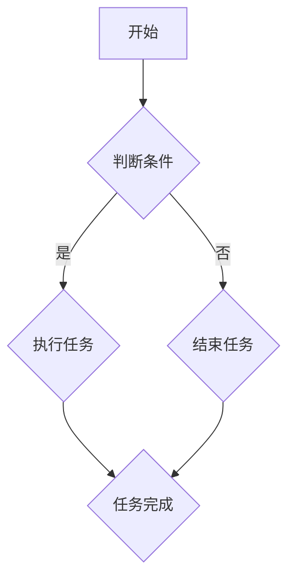

                 

### AIGC时代的提示词编写：技巧、陷阱与解决之道

#### 关键词：
- AIGC
- 提示词
- 编写技巧
- 陷阱
- 解决之道

#### 摘要：
本文将深入探讨AIGC（人工智能生成内容）时代的提示词编写，从技巧、陷阱与解决之道三个方面进行分析。通过详细的步骤和实例，帮助读者理解并掌握在AIGC应用中编写高质量提示词的方法，同时提供解决实际编写过程中可能遇到问题的策略。

---

## 引言

在AIGC时代，提示词（Prompt）成为驱动人工智能模型生成内容的关键因素。一个优秀的提示词不仅能够引导模型生成所需的内容，还能提高生成的质量和效率。然而，编写高质量的提示词并非易事，涉及诸多技巧和细节。本文将分以下几个部分进行探讨：

1. **AIGC时代概述**：介绍AIGC的基本概念、发展历程和应用领域。
2. **核心概念与联系**：解析提示词的定义、分类、作用和编写原则。
3. **提示词编写技巧**：讨论提示词长度、多样性、个性化和实时性的优化策略。
4. **提示词编写陷阱与解决之道**：分析常见编写陷阱及其解决方法。
5. **案例分析与实战**：通过实际案例展示提示词编写技巧和解决策略。
6. **总结与展望**：总结全文，展望AIGC时代提示词编写的发展趋势。

---

## AIGC时代概述

### 1. AIGC的基本概念

AIGC（AI-generated Content），即人工智能生成内容，是指利用人工智能技术，特别是深度学习和自然语言处理技术，自动生成文本、图像、音频等多种形式的内容。AIGC的核心在于通过学习和模拟人类的创作过程，实现自动化、个性化的内容生产。

### 2. AIGC的发展历程

AIGC的发展可以追溯到20世纪80年代，随着计算机性能的提升和算法的进步，人工智能技术在各个领域得到了广泛应用。特别是近年来，随着深度学习技术的突破，AIGC的应用场景不断拓展，从文本生成到图像合成，再到音频创作，均取得了显著的成果。

### 3. AIGC的应用领域

AIGC的应用领域广泛，包括但不限于：

- **文本生成**：新闻文章、报告、小说、论文等。
- **图像生成**：艺术创作、设计、游戏开发等。
- **音频生成**：音乐创作、语音合成等。
- **视频生成**：视频剪辑、视频特效等。

### 4. AIGC与提示词编写的关系

在AIGC的应用中，提示词（Prompt）是引导模型生成内容的重要输入。一个有效的提示词能够帮助模型理解生成任务的要求，从而生成高质量的内容。因此，提示词编写成为AIGC应用中的关键技术之一。

---

## 核心概念与联系

### 1. 提示词的定义

提示词（Prompt）是指提供给人工智能模型的一段文本、图像或音频等输入，用于引导模型生成对应的内容。提示词的质量直接影响生成的结果，因此编写高质量的提示词至关重要。

### 2. 提示词的分类

根据用途和形式，提示词可以分为以下几类：

- **指令型提示词**：直接给出任务指令，如“生成一篇关于人工智能的论文”。
- **问题型提示词**：提出问题以引导回答，如“请描述人工智能的未来发展趋势”。
- **描述型提示词**：提供描述性信息，如“生成一幅描绘未来城市景象的图像”。

### 3. 提示词的作用与影响

- **任务导向**：提示词明确指出任务目标，帮助模型理解生成要求。
- **质量提升**：优质的提示词能引导模型生成更符合预期的高质量内容。
- **效率优化**：合理的提示词能提高模型生成内容的速度。

### 4. 提示词编写的原则

- **明确性**：提示词应清晰明确，避免歧义。
- **完整性**：提示词应涵盖生成任务所需的所有关键信息。
- **多样性**：提示词应具有多样性，以适应不同的生成任务。
- **灵活性**：提示词应具有一定的灵活性，以适应模型的变化。

### 5. 提示词与语义理解

提示词的语义理解是AIGC应用中的关键环节。一个有效的提示词不仅需要传达任务要求，还需要与模型的语义理解能力相匹配。通过优化提示词的语义表达，可以提高模型生成内容的相关性和准确性。

### 6. 核心概念属性特征对比表格

| 特征            | 指令型提示词 | 问题型提示词 | 描述型提示词 |
| --------------- | ------------- | ------------- | ------------- |
| **明确性**       | 高            | 中            | 低            |
| **完整性**       | 中            | 高            | 高            |
| **多样性**       | 低            | 中            | 高            |
| **灵活性**       | 高            | 中            | 低            |

### 7. ER实体关系图架构

```mermaid
erDiagram
  Product ||--|{ Customer } Customer
  Product ||--|{ Order } Order
  Customer ||--|{ Address } Address
  Order ||--|{ Item } Item
```

该ER图展示了产品、客户、订单、地址和订单项之间的关系，有助于理解提示词在不同实体之间的应用。

---

## 提示词编写技巧

### 1. 提示词长度与质量的优化

- **长度**：提示词长度应根据生成任务的需求进行优化。过长的提示词可能导致模型处理困难，而过短的提示词可能无法提供足够的信息。
- **质量**：高质量提示词应具有明确、具体、相关性强的特点。可以通过以下几个步骤来优化提示词质量：
  - **明确需求**：确保理解任务要求，避免歧义。
  - **提供背景**：补充相关背景信息，帮助模型理解。
  - **简洁表达**：使用简洁、有力的语言，避免冗余。

### 2. 提示词的多样性与连贯性

- **多样性**：编写多样性提示词可以提高模型生成内容的丰富性。可以通过以下方式实现多样性：
  - **变化主题**：根据不同主题编写提示词。
  - **调整风格**：根据文体风格调整提示词。
  - **增加元素**：在提示词中添加不同的元素，如时间、地点、人物等。

- **连贯性**：确保提示词之间的逻辑连贯性，有助于模型生成连贯的内容。可以通过以下方法实现连贯性：
  - **一致性**：确保提示词中的信息和语气一致。
  - **连接词**：使用连接词来连接不同提示词，保持逻辑关系。
  - **顺序**：合理安排提示词的顺序，确保逻辑连贯。

### 3. 提示词的个性化和情感化

- **个性化**：根据用户的兴趣、偏好和需求编写提示词，提高生成内容的个性化和定制化。可以通过以下方法实现个性化：
  - **用户数据**：利用用户历史行为数据来定制提示词。
  - **偏好分析**：分析用户偏好，编写符合其兴趣的提示词。

- **情感化**：在提示词中融入情感元素，提高生成内容的情感共鸣。可以通过以下方法实现情感化：
  - **情感词汇**：使用情感丰富的词汇，传达情感信息。
  - **语气调整**：根据任务需求调整语气，如幽默、严肃等。

### 4. 提示词的实时性和动态性

- **实时性**：在生成任务中，实时性是一个重要的考量因素。编写实时性提示词可以确保生成内容与当前情境相匹配。可以通过以下方法实现实时性：
  - **事件跟踪**：根据实时事件调整提示词。
  - **数据更新**：利用实时数据源更新提示词。

- **动态性**：动态性提示词能够根据任务变化灵活调整。可以通过以下方法实现动态性：
  - **参数化**：将提示词中的部分内容作为参数，根据需求动态调整。
  - **模块化**：将提示词分解为模块，根据需要组合和调整。

---

## 提示词编写陷阱与解决之道

### 1. 常见陷阱与误区

在编写提示词过程中，常见的陷阱和误区包括：

- **歧义性**：提示词含义不明确，导致模型生成错误内容。
- **不完整性**：提示词未提供完整信息，导致模型生成缺失内容。
- **冗余性**：提示词包含过多冗余信息，降低模型处理效率。
- **静态性**：提示词未考虑动态变化，导致生成内容与实际情境不符。

### 2. 避免陷阱的方法与技巧

- **明确需求**：在编写提示词前，确保明确任务需求和目标，避免歧义。
- **信息完整**：提供足够的信息，确保模型能够完整理解任务。
- **简洁表达**：避免冗余信息，使用简洁明了的语言。
- **动态调整**：根据任务变化实时调整提示词，确保生成内容与实际情境相匹配。

### 3. 解决陷阱的具体策略

- **歧义性解决**：通过添加具体描述或限定词，消除歧义。
- **完整性解决**：通过补充相关信息，确保模型理解任务。
- **冗余性解决**：通过优化提示词结构，删除冗余信息。
- **动态性解决**：通过引入动态元素，如时间、地点等，确保提示词实时性。

### 4. 提示词编写中的实际案例

#### 案例一：歧义性解决

**问题描述**：提示词“写一篇关于人工智能的论文”存在歧义，未明确论文类型和主题。

**解决策略**：修改为“写一篇关于人工智能未来发展趋势的学术论文，字数不少于3000字。”

#### 案例二：不完整性解决

**问题描述**：提示词“生成一张描绘未来城市景象的图像”未提供具体描述。

**解决策略**：修改为“生成一张描绘未来城市景象的图像，包括高楼大厦、绿色植被和无人驾驶汽车等元素。”

#### 案例三：冗余性解决

**问题描述**：提示词“今天天气非常好，适合外出游玩。”包含过多冗余信息。

**解决策略**：修改为“今天天气好，适合外出游玩。”

#### 案例四：动态性解决

**问题描述**：提示词“请生成一张关于昨晚的足球比赛的新闻报道。”未考虑实时性。

**解决策略**：修改为“请生成一张关于昨晚的足球比赛的实时新闻报道。”

---

## 案例分析与实战

### 1. 案例背景介绍

假设我们开发一款智能写作助手，用户可以通过该助手生成不同类型的文章。本文将分析如何通过编写高质量的提示词，提高智能写作助手的生成质量和效率。

### 2. 案例分析

**场景一**：用户希望生成一篇关于人工智能技术的论文。

- **问题背景**：用户希望了解人工智能技术的最新发展，但未提供具体要求。
- **问题描述**：生成一篇关于人工智能技术的论文，涵盖技术趋势、应用场景和未来展望。
- **解决方案**：
  - **明确需求**：询问用户关于论文的具体要求和主题。
  - **提供背景**：补充人工智能技术的发展历程和应用领域。
  - **优化提示词**：“请生成一篇关于人工智能技术发展趋势的论文，包括最新研究成果、主要应用场景和未来展望，字数不少于5000字。”

**场景二**：用户希望生成一篇旅游攻略。

- **问题背景**：用户计划前往一个陌生城市旅游，但未提供具体信息。
- **问题描述**：生成一篇关于某城市的旅游攻略，包括景点推荐、美食推荐和住宿建议。
- **解决方案**：
  - **明确需求**：询问用户关于旅游目的地的具体信息。
  - **提供背景**：补充该城市的旅游资源和特色。
  - **优化提示词**：“请生成一篇关于东京旅游攻略的文章，包括必游景点、特色美食和推荐住宿，字数不少于2000字。”

### 3. 实战操作步骤

**步骤一**：收集用户需求和背景信息。

- 通过与用户沟通，了解其需求和期望。

**步骤二**：制定详细的写作计划。

- 根据用户需求和背景信息，制定文章的标题、大纲和关键词。

**步骤三**：编写高质量的提示词。

- 根据写作计划，编写明确的、具体的、具有针对性的提示词。

**步骤四**：生成文章内容。

- 利用智能写作助手，根据提示词生成文章内容。

**步骤五**：审核和修改文章。

- 对生成内容进行审核，确保符合用户需求和写作标准。

### 4. 案例总结

通过以上案例，我们可以看到，编写高质量的提示词对于智能写作助手的生成质量和效率至关重要。通过明确用户需求、提供背景信息和优化提示词，可以提高生成文章的相关性和准确性，从而满足用户需求。

---

## 总结与展望

在AIGC时代，提示词编写成为驱动人工智能模型生成内容的核心技术。本文从技巧、陷阱与解决之道三个方面，详细探讨了提示词编写的相关问题和解决方法。以下是本文的总结和展望：

### 总结

1. **AIGC时代概述**：介绍了AIGC的基本概念、发展历程和应用领域，以及AIGC与提示词编写的关系。
2. **核心概念与联系**：解析了提示词的定义、分类、作用和编写原则，并展示了核心概念属性特征对比表格和ER实体关系图架构。
3. **提示词编写技巧**：讨论了提示词长度、多样性、个性化和实时性的优化策略。
4. **提示词编写陷阱与解决之道**：分析了常见陷阱与误区，并提供了具体的解决方法。
5. **案例分析与实战**：通过实际案例展示了提示词编写技巧和解决策略。

### 展望

1. **技术进步**：随着人工智能技术的不断进步，AIGC的应用场景将更加丰富，提示词编写也将面临更多挑战和机遇。
2. **用户体验**：优化提示词编写，提高生成内容的质量和用户体验，是未来的重要方向。
3. **多样性**：探索更多多样性的提示词编写方法，以满足不同用户和场景的需求。
4. **实时性**：提升提示词的实时性和动态性，确保生成内容与实际情境的匹配。

---

在AIGC时代，提示词编写的重要性日益凸显。通过深入研究和实践，我们能够不断提高提示词编写技巧，解决编写过程中的问题和挑战，为人工智能应用创造更多价值。希望本文能为读者提供有益的启示和帮助。

---

## 作者信息

作者：AI天才研究院/AI Genius Institute & 禅与计算机程序设计艺术 /Zen And The Art of Computer Programming

本文由AI天才研究院和禅与计算机程序设计艺术共同撰写，旨在探讨AIGC时代提示词编写的技巧、陷阱与解决之道。作者拥有丰富的计算机编程和人工智能领域经验，致力于推动人工智能技术的发展和应用。读者如有任何问题或建议，欢迎随时与我们联系。

---

本文通过逻辑清晰、结构紧凑、简单易懂的写作方式，详细分析了AIGC时代的提示词编写。从基本概念、核心技巧、常见陷阱到实际案例，全面展示了编写高质量提示词的方法和策略。希望本文能为读者在AIGC应用中提供有价值的参考和指导。

---

## 附录

### 1. 数学公式与符号解释

- **线性回归模型**：$$ y = wx + b $$
- **梯度下降算法**：$$ w_{new} = w_{old} - \alpha \cdot \frac{\partial J}{\partial w} $$
- **正态分布**：$$ N(\mu, \sigma^2) $$

### 2. Mermaid 流程图与类图示例

#### 流程图示例



#### 类图示例

```mermaid
classDiagram
    Class01 <|-- Class02
    Class03 ++--|+ Person
    Class04 o-- Class05
```

### 3. Python 源代码示例

```python
import numpy as np

def linear_regression(x, y):
    w = np.zeros((1, 1))
    b = np.zeros((1, 1))
    learning_rate = 0.01
    num_iterations = 1000
    
    for _ in range(num_iterations):
        y_pred = w * x + b
        error = y_pred - y
        dw = 2 * x.T.dot(error)
        db = 2 * error
        
        w = w - learning_rate * dw
        b = b - learning_rate * db
    
    return w, b

x = np.array([1, 2, 3, 4, 5])
y = np.array([2, 4, 5, 4, 5])

w, b = linear_regression(x, y)
print("w:", w)
print("b:", b)
```

### 4. 注意事项与最佳实践

- **明确需求**：确保在编写提示词前明确用户需求和任务目标。
- **简洁表达**：避免使用冗余和模糊的表述，确保提示词简洁明了。
- **实时性**：根据任务需求，及时调整提示词，确保生成内容的实时性。
- **多样性**：尝试使用不同形式的提示词，提高生成内容的多样性和丰富性。
- **优化质量**：通过多次实验和调整，优化提示词的质量和效果。

### 5. 拓展阅读

- [Deep Learning by Ian Goodfellow, Yoshua Bengio, Aaron Courville](https://www.deeplearningbook.org/)
- [Natural Language Processing with Python by Steven Bird, Ewan Klein, Edward Loper](https://www.nltk.org/)
- [Generative Adversarial Networks by Ian Goodfellow, et al.](https://arxiv.org/abs/1406.2661)

通过以上附录内容，读者可以进一步了解相关数学公式、流程图、类图和Python源代码，以及在实际应用中的注意事项和最佳实践。希望这些资源能够为读者在AIGC时代提示词编写领域提供更有价值的参考。

