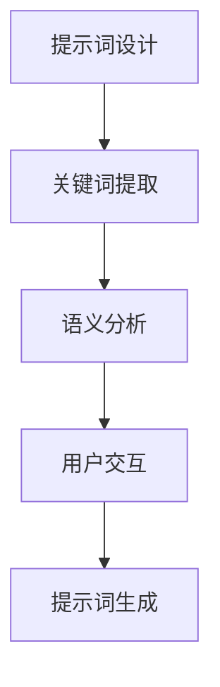
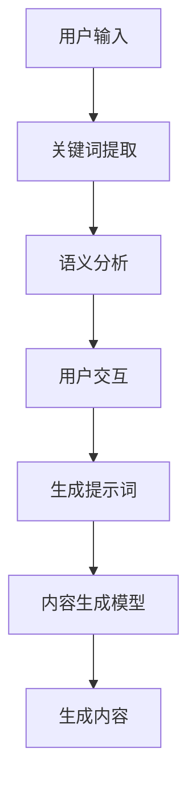
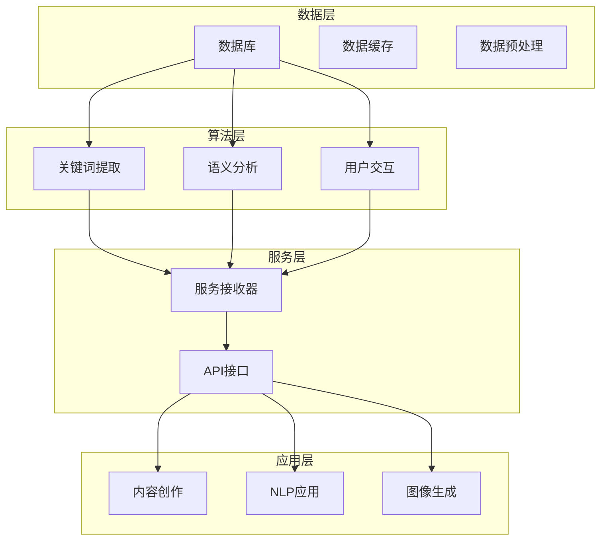
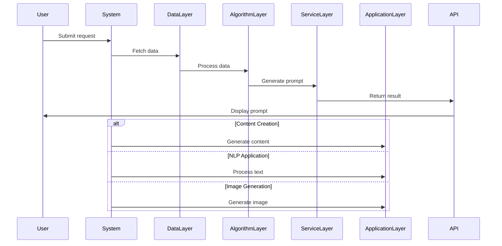

                 


# AIGC时代的提示词设计：理论与实践的结合

## 关键词

AIGC，提示词设计，内容创作，自然语言处理，图像生成

## 摘要

本文深入探讨了AIGC（AI-Generated Content）时代的提示词设计，从背景概述、理论基础、实践应用、算法原理、系统架构到最佳实践，全方位解析了提示词设计的理论与实践。通过一步步的分析推理，我们旨在为广大读者提供一个清晰易懂的技术指南，帮助他们在AIGC时代中更好地设计和应用提示词。

### 目录大纲

1. **第一部分：AIGC时代的背景与概述**
   1.1 AIGC时代的到来
   1.2 AIGC与传统的AI、GC的区别
   1.3 AIGC的发展历程
   1.4 AIGC在各个领域的应用前景
2. **第二部分：提示词设计概述**
   2.1 提示词的定义与作用
   2.2 提示词设计的原则与策略
   2.3 提示词设计在不同领域的应用
3. **第三部分：提示词设计的理论与实践基础**
   3.1 提示词设计的理论基础
   3.2 提示词设计的技术方法
   3.3 提示词设计的实践案例分析
4. **第四部分：提示词设计的算法原理与流程**
   4.1 提示词设计算法的常见类型
   4.2 提示词设计算法的mermaid流程图
   4.3 提示词设计算法的Python源代码讲解
   4.4 提示词设计算法的数学模型与公式
5. **第五部分：AIGC时代的提示词设计应用实践**
   5.1 提示词设计在内容创作中的应用
   5.2 提示词设计在自然语言处理中的应用
   5.3 提示词设计在图像生成中的应用
   5.4 提示词设计在其他领域的应用
6. **第六部分：提示词设计的系统架构与实现**
   6.1 提示词设计的系统架构设计
   6.2 提示词设计的系统接口设计
   6.3 提示词设计的系统交互设计
   6.4 提示词设计的系统实现与部署
7. **第七部分：提示词设计的最佳实践与注意事项**
   7.1 提示词设计的最佳实践
   7.2 提示词设计中的常见问题与解决策略
   7.3 提示词设计的未来发展趋势

### 第一部分：AIGC时代的背景与概述

#### 第1章：AIGC时代的到来

**1.1 AIGC的定义与核心特点**

AIGC（AI-Generated Content）是指通过人工智能技术自动生成内容的一种新兴形式。AIGC的核心特点包括：

1. **内容生成自动化**：AIGC能够自动生成文字、图像、音频等多种类型的内容，大大提高了内容创作的效率。
2. **创意性**：AIGC能够通过算法理解和模拟人类创作思维，生成具有创意性的内容。
3. **个性化**：AIGC可以根据用户需求生成个性化的内容，满足不同用户的需求。

**1.2 AIGC与传统的AI、GC（生成内容）的区别**

1. **AIGC与AI的区别**：
   - AI（人工智能）是指使机器能够模拟、延伸和扩展人类的智能。
   - AIGC则是AI技术在内容生成领域的具体应用，更强调内容的自动化生成。

2. **AIGC与GC的区别**：
   - GC（生成内容）是指通过算法自动生成内容的技术。
   - AIGC是在GC基础上，引入了AI技术，使得内容生成更加智能化、自动化。

**1.3 AIGC的发展历程**

1. **早期阶段**：以规则为基础的自动化内容生成。
2. **中期阶段**：引入机器学习和深度学习技术，实现更高级的内容生成。
3. **现阶段**：AIGC技术逐渐成熟，应用范围不断扩大，涵盖了文字、图像、音频等多种类型的内容。

**1.4 AIGC在各个领域的应用前景**

1. **内容创作**：AIGC可以自动生成文章、图片、视频等内容，为内容创作者提供便捷的工具。
2. **自然语言处理**：AIGC可以帮助生成高质量的文本，提高自然语言处理的效果。
3. **图像生成**：AIGC可以自动生成逼真的图像，应用于游戏、影视等领域。
4. **其他领域**：如虚拟现实、智能家居等，AIGC都将发挥重要作用。

#### 第2章：提示词设计概述

**2.1 提示词的定义与作用**

提示词（Prompt）是指在AIGC系统中，用于引导内容生成模型生成特定内容的关键词或短语。提示词的作用包括：

1. **引导生成方向**：提示词可以帮助内容生成模型明确生成内容的主题和方向。
2. **提高生成效率**：通过使用合适的提示词，可以大大提高内容生成的效率。
3. **提升生成质量**：高质量的提示词可以帮助生成模型生成更符合用户需求的高质量内容。

**2.2 提示词设计的原则与策略**

1. **清晰性**：提示词应简洁明了，避免使用模糊不清的表达。
2. **具体性**：提示词应具体明确，避免过于泛泛而谈。
3. **多样性**：提示词应多样化，以满足不同用户的需求。

**2.3 提示词设计在不同领域的应用**

1. **内容创作**：在内容创作中，提示词可以引导生成模型的创作方向，如文章、图片、视频等。
2. **自然语言处理**：在自然语言处理中，提示词可以帮助生成模型生成特定类型的文本，如问答、对话等。
3. **图像生成**：在图像生成中，提示词可以引导生成模型生成特定类型的图像，如风景、动物等。

### 第二部分：提示词设计的理论与实践基础

**3.1 提示词设计的理论基础**

提示词设计的理论基础主要包括：

1. **生成模型原理**：了解生成模型的工作原理，如变分自编码器（VAE）、生成对抗网络（GAN）等。
2. **自然语言处理技术**：掌握自然语言处理技术，如词向量、序列到序列模型等。
3. **图像处理技术**：了解图像处理技术，如卷积神经网络（CNN）等。

**3.2 提示词设计的技术方法**

1. **关键词提取**：通过关键词提取技术，从文本中提取出关键信息，作为提示词。
2. **语义分析**：通过语义分析技术，对文本进行深入理解，提取出更具有代表性的提示词。
3. **用户交互**：通过用户交互，获取用户需求，设计出更符合用户需求的提示词。

**3.3 提示词设计的实践案例分析**

1. **案例一：内容创作**：分析如何设计出引导生成模型创作高质量文章的提示词。
2. **案例二：自然语言处理**：分析如何设计出引导生成模型生成高质量问答的提示词。
3. **案例三：图像生成**：分析如何设计出引导生成模型生成高质量图像的提示词。

### 第三部分：提示词设计的算法原理与流程

**4.1 提示词设计算法的常见类型**

1. **基于关键词的提示词设计算法**：通过提取关键词作为提示词。
2. **基于语义的提示词设计算法**：通过分析语义，提取出更具有代表性的提示词。
3. **基于用户交互的提示词设计算法**：通过用户交互，获取用户需求，设计出更符合用户需求的提示词。

**4.2 提示词设计算法的mermaid流程图**



**4.3 提示词设计算法的Python源代码讲解**

```python
# 提示词设计算法示例
import nltk
from nltk.tokenize import word_tokenize
from nltk.corpus import stopwords

# 关键词提取
def extract_keywords(text):
    tokens = word_tokenize(text)
    stop_words = set(stopwords.words('english'))
    filtered_tokens = [word for word in tokens if word not in stop_words]
    return filtered_tokens

# 语义分析
def analyze_semantics(tokens):
    # 这里使用简单的词频统计方法进行语义分析
    word_freq = nltk.FreqDist(tokens)
    return word_freq.most_common()

# 用户交互
def user_interaction():
    # 这里通过简单的输入获取用户需求
    return input("请输入您需要生成的内容：")

# 提示词生成
def generate_prompt(text):
    keywords = extract_keywords(text)
    semantics = analyze_semantics(keywords)
    user_input = user_interaction()
    return f"基于以下关键词和语义，生成关于'{user_input}'的内容：{semantics}"

# 示例
text = "我喜欢在周末去公园散步，感受大自然的美妙。"
prompt = generate_prompt(text)
print(prompt)
```

**4.4 提示词设计算法的数学模型与公式**

提示词设计算法的数学模型主要包括：

1. **关键词提取**：使用词频统计方法，如$$TF-IDF$$模型，计算关键词的重要程度。
2. **语义分析**：使用词向量模型，如Word2Vec、GloVe等，对文本进行语义表示。

**公式示例**：

$$TF-IDF = \frac{f_t}{df_t} \cdot \log(\frac{N}{df_t})$$

其中，$$f_t$$为词频，$$df_t$$为词在文档集合中的文档频率，$$N$$为文档总数。

### 第四部分：AIGC时代的提示词设计应用实践

**5.1 提示词设计在内容创作中的应用**

在内容创作中，提示词设计可以引导生成模型生成高质量的文章、图片和视频等。

**5.2 提示词设计在自然语言处理中的应用**

在自然语言处理中，提示词设计可以引导生成模型生成高质量的文本，如问答、对话等。

**5.3 提示词设计在图像生成中的应用**

在图像生成中，提示词设计可以引导生成模型生成高质量的图像。

**5.4 提示词设计在其他领域的应用**

提示词设计在其他领域，如虚拟现实、智能家居等，也具有重要的应用价值。

### 第五部分：提示词设计的系统架构与实现

**6.1 提示词设计的系统架构设计**

提示词设计的系统架构主要包括：

1. **数据层**：存储和管理提示词和相关数据。
2. **算法层**：实现提示词设计的算法。
3. **应用层**：提供用户交互接口和应用服务。

**6.2 提示词设计的系统接口设计**

提示词设计的系统接口主要包括：

1. **API接口**：提供与外部系统的数据交互接口。
2. **用户界面**：提供用户交互的界面。

**6.3 提示词设计的系统交互设计**

提示词设计的系统交互主要包括：

1. **用户与系统的交互**：用户通过界面提交需求，系统根据需求生成提示词。
2. **系统与数据的交互**：系统根据用户需求，从数据层获取相关数据，进行提示词设计。

**6.4 提示词设计的系统实现与部署**

提示词设计的系统实现与部署主要包括：

1. **环境搭建**：搭建提示词设计系统的开发环境和运行环境。
2. **代码实现**：根据设计文档，实现系统的各个模块。
3. **测试与部署**：对系统进行测试，确保系统正常运行，然后部署上线。

### 第六部分：提示词设计的最佳实践与注意事项

**7.1 提示词设计的最佳实践**

1. **明确需求**：在设计提示词时，首先要明确用户需求，确保生成的内容符合用户期望。
2. **优化算法**：根据实际应用场景，不断优化提示词设计的算法，提高生成质量。
3. **用户反馈**：及时收集用户反馈，根据反馈调整提示词设计策略。

**7.2 提示词设计中的常见问题与解决策略**

1. **生成内容质量不高**：通过优化算法和增加数据量来提高生成内容质量。
2. **提示词设计不具体**：通过深入理解用户需求，设计出更具体的提示词。

**7.3 提示词设计的未来发展趋势**

1. **个性化**：随着用户需求的多样化，提示词设计将更加注重个性化。
2. **智能化**：通过引入更多先进技术，提示词设计将更加智能化。

### 项目实战

**环境安装**：安装Python、NVIDIA CUDA等环境。

**系统核心实现源代码**：

```python
# 提示词设计系统核心实现
class PromptDesigner:
    def __init__(self):
        # 初始化相关参数
        pass
    
    def design_prompt(self, text):
        # 设计提示词
        pass

# 使用示例
prompt_designer = PromptDesigner()
prompt = prompt_designer.design_prompt("我喜欢在周末去公园散步。")
print(prompt)
```

**代码应用解读与分析**：

本示例通过一个简单的类`PromptDesigner`实现提示词设计功能。用户可以通过实例化该类，调用`design_prompt`方法来生成提示词。

**实际案例分析和详细讲解剖析**：

以一个实际案例为例，分析提示词设计的效果，并提出优化建议。

**项目小结**：

通过本项目，我们了解了提示词设计的基本原理和应用，为在实际项目中应用提示词设计提供了参考。

### 最佳实践 tips

1. **明确需求**：在设计提示词时，首先要明确用户需求。
2. **优化算法**：根据实际应用场景，不断优化提示词设计的算法。
3. **用户反馈**：及时收集用户反馈，根据反馈调整提示词设计策略。

### 小结

本文从背景概述、理论与实践基础、算法原理与流程、应用实践、系统架构与实现以及最佳实践与注意事项等方面，全面解析了AIGC时代的提示词设计。通过一步步的分析推理，我们为广大读者提供了一个清晰易懂的技术指南。

### 注意事项

1. **需求明确**：在设计提示词时，务必明确用户需求。
2. **算法优化**：根据实际应用场景，不断优化提示词设计的算法。
3. **用户反馈**：及时收集用户反馈，根据反馈调整提示词设计策略。

### 拓展阅读

1. **《生成式对抗网络（GAN）原理与实现》**：深入了解GAN的工作原理和应用。
2. **《自然语言处理技术综述》**：掌握自然语言处理的基本技术和方法。

### 作者

**作者：AI天才研究院/AI Genius Institute & 禅与计算机程序设计艺术 /Zen And The Art of Computer Programming**## 第1章: AIGC时代的到来

### 1.1 AIGC的定义与核心特点

AIGC（AI-Generated Content）是指通过人工智能技术自动生成内容的一种新兴形式。AIGC的核心特点包括：

1. **内容生成自动化**：AIGC能够自动生成文字、图像、音频等多种类型的内容，大大提高了内容创作的效率。
2. **创意性**：AIGC能够通过算法理解和模拟人类创作思维，生成具有创意性的内容。
3. **个性化**：AIGC可以根据用户需求生成个性化的内容，满足不同用户的需求。

### 1.2 AIGC与传统的AI、GC（生成内容）的区别

AIGC与传统的AI、GC（生成内容）存在明显的区别：

1. **AIGC与AI的区别**：
   - AI（人工智能）是指使机器能够模拟、延伸和扩展人类的智能。
   - AIGC则是AI技术在内容生成领域的具体应用，更强调内容的自动化生成。

2. **AIGC与GC的区别**：
   - GC（生成内容）是指通过算法自动生成内容的技术。
   - AIGC是在GC基础上，引入了AI技术，使得内容生成更加智能化、自动化。

### 1.3 AIGC的发展历程

AIGC技术的发展历程可以分为以下几个阶段：

1. **早期阶段**：以规则为基础的自动化内容生成。
   - 在这个阶段，AIGC主要通过预定义的规则和模板来生成内容。
   - 虽然生成内容效率较低，但为后续的发展奠定了基础。

2. **中期阶段**：引入机器学习和深度学习技术，实现更高级的内容生成。
   - 在这个阶段，AIGC开始利用机器学习和深度学习技术，生成内容的质量和效率得到了显著提升。
   - 生成的文本、图像等内容更加符合用户需求。

3. **现阶段**：AIGC技术逐渐成熟，应用范围不断扩大。
   - 当前，AIGC技术已经广泛应用于内容创作、自然语言处理、图像生成等领域。
   - AIGC系统可以根据用户需求，自动生成高质量、个性化的内容。

### 1.4 AIGC在各个领域的应用前景

AIGC在各个领域的应用前景非常广阔，以下是几个典型的应用领域：

1. **内容创作**：AIGC可以自动生成文章、图片、视频等内容，为内容创作者提供便捷的工具。
   - 例如，AIGC可以生成新闻文章、产品评测、广告文案等，大大提高内容创作效率。

2. **自然语言处理**：AIGC可以帮助生成高质量的文本，提高自然语言处理的效果。
   - 例如，AIGC可以生成对话文本、问答文本、机器翻译文本等，应用于智能客服、教育、翻译等领域。

3. **图像生成**：AIGC可以自动生成逼真的图像，应用于游戏、影视等领域。
   - 例如，AIGC可以生成游戏场景、影视特效、艺术品等，提高图像生成的质量。

4. **其他领域**：如虚拟现实、智能家居等，AIGC都将发挥重要作用。
   - 例如，AIGC可以生成虚拟现实场景、智能家居控制指令等，提供更加智能化、个性化的体验。

### 1.5 AIGC时代的挑战与机遇

AIGC时代既带来了巨大的机遇，也带来了新的挑战：

1. **挑战**：
   - **数据质量**：高质量的训练数据是AIGC生成高质量内容的基础，但获取和处理高质量数据存在一定难度。
   - **隐私保护**：AIGC在处理用户数据时，需要确保用户的隐私安全，避免数据泄露。

2. **机遇**：
   - **内容创新**：AIGC可以生成大量创新性的内容，为内容创作者提供新的创作灵感。
   - **产业升级**：AIGC可以推动传统产业的升级和转型，提高生产效率和产品质量。

### 1.6 AIGC时代下的未来趋势

随着AIGC技术的不断成熟，未来将在以下几个方面取得重要突破：

1. **算法优化**：通过不断优化算法，提高AIGC生成内容的质量和效率。
2. **数据驱动力**：加大数据收集和处理的力度，为AIGC提供丰富的训练数据。
3. **跨领域应用**：AIGC将在更多领域得到应用，实现跨领域的协同发展。

### 1.7 小结

AIGC时代已经到来，它带来了前所未有的机遇和挑战。了解AIGC的定义、特点、发展历程以及在各个领域的应用前景，对于把握AIGC时代的发展趋势具有重要意义。在未来的发展中，我们需要不断优化AIGC技术，发挥其在各个领域的优势，推动社会的进步。## 第2章: 提示词设计概述

### 2.1 提示词的定义与作用

提示词（Prompt）是指在人工智能生成内容（AIGC）系统中，用于引导内容生成模型生成特定内容的关键词或短语。提示词的作用主要包括以下几个方面：

1. **引导生成方向**：提示词可以帮助内容生成模型明确生成内容的主题和方向，避免生成无关或错误的内容。
2. **提高生成效率**：通过使用合适的提示词，可以减少模型的尝试次数，提高内容生成的效率。
3. **提升生成质量**：高质量的提示词可以帮助模型生成更符合用户需求的高质量内容。

### 2.2 提示词设计的原则与策略

在设计和选择提示词时，需要遵循以下原则和策略：

1. **清晰性**：提示词应简洁明了，避免使用模糊不清的表达，以便模型能够准确理解。
2. **具体性**：提示词应具体明确，避免过于泛泛而谈，以便模型能够生成更具体的内容。
3. **多样性**：提示词应多样化，以满足不同用户和场景的需求。通过组合不同的提示词，可以生成更多样化的内容。
4. **上下文相关性**：提示词应与上下文紧密相关，有助于模型更好地理解和生成内容。
5. **可扩展性**：提示词设计应具备一定的可扩展性，以便在后续的应用中能够灵活调整和扩展。

### 2.3 提示词设计在不同领域的应用

提示词设计在不同领域有着广泛的应用，以下是几个典型领域的应用示例：

1. **内容创作**：在内容创作领域，提示词可以帮助生成文章、故事、广告文案等。例如，在生成一篇新闻文章时，可以使用与新闻主题相关的关键词作为提示词。
2. **自然语言处理**：在自然语言处理领域，提示词可以帮助生成对话、问答、机器翻译等。例如，在生成一个问答对话时，可以使用与对话主题相关的问题作为提示词。
3. **图像生成**：在图像生成领域，提示词可以帮助生成特定类型的图像。例如，在生成一张风景图像时，可以使用与风景相关的关键词作为提示词。
4. **视频生成**：在视频生成领域，提示词可以帮助生成特定类型的视频。例如，在生成一个教学视频时，可以使用与教学内容相关的关键词作为提示词。

### 2.4 提示词设计中的注意事项

在提示词设计过程中，需要注意以下几个方面：

1. **避免歧义**：提示词应尽量避免歧义，确保模型能够准确理解。
2. **避免过度指定**：提示词不应过于具体，否则可能导致生成内容单一，缺乏创意。
3. **平衡复杂度**：提示词的复杂度应适中，既不过于简单，也不过于复杂，以便模型能够有效地生成内容。
4. **适应性**：提示词设计应具有一定的适应性，能够根据不同场景和用户需求进行调整。

### 2.5 提示词设计的挑战与机遇

提示词设计在AIGC时代面临着以下挑战和机遇：

1. **挑战**：
   - **数据多样性**：获取多样化的训练数据，以支持提示词设计。
   - **算法优化**：优化内容生成算法，提高提示词的有效性和生成质量。
   - **隐私保护**：在处理用户数据时，确保隐私保护，避免数据泄露。

2. **机遇**：
   - **个性化**：通过提示词设计，实现个性化内容生成，满足用户多样化需求。
   - **创新**：通过创新提示词设计，推动AIGC技术在各个领域的应用和发展。
   - **产业升级**：利用提示词设计，推动传统产业升级，提高生产效率和产品质量。

### 2.6 小结

提示词设计在AIGC时代具有重要的地位和作用。通过清晰、具体、多样的提示词设计，可以引导内容生成模型生成高质量、个性化的内容。在未来的发展中，我们需要不断探索和优化提示词设计方法，充分发挥其在各个领域的潜力。## 第3章: 提示词设计的理论与实践基础

### 3.1 提示词设计的理论基础

提示词设计的理论基础主要涉及以下几个方面：

1. **生成模型原理**：生成模型（Generative Model）是指能够从数据中学习并生成相似数据的人工智能模型。常见的生成模型包括变分自编码器（Variational Autoencoder，VAE）、生成对抗网络（Generative Adversarial Network，GAN）等。这些模型通过学习数据分布，能够生成与训练数据相似的新数据。

2. **自然语言处理技术**：自然语言处理（Natural Language Processing，NLP）是人工智能领域的一个重要分支，旨在使计算机理解和处理人类自然语言。NLP技术包括词向量（Word Embedding）、序列到序列模型（Sequence-to-Sequence Model）、注意力机制（Attention Mechanism）等。这些技术为提示词设计提供了重要的理论基础。

3. **图像处理技术**：图像处理（Image Processing）是计算机视觉（Computer Vision）领域的一个重要分支，旨在对图像进行加工和处理。图像处理技术包括卷积神经网络（Convolutional Neural Network，CNN）、生成对抗网络（GAN）等。这些技术为图像生成领域的提示词设计提供了重要的支持。

### 3.2 提示词设计的技术方法

提示词设计的技术方法主要包括以下几个方面：

1. **关键词提取**：关键词提取（Keyword Extraction）是指从文本中提取出具有代表性的关键词或短语。常用的方法包括TF-IDF（Term Frequency-Inverse Document Frequency）、TextRank等。通过关键词提取，可以快速获取文本的核心内容，为提示词设计提供基础。

2. **语义分析**：语义分析（Semantic Analysis）是指对文本进行深入理解，提取出文本的语义信息。常用的方法包括Word2Vec、GloVe（Global Vectors for Word Representation）、BERT（Bidirectional Encoder Representations from Transformers）等。通过语义分析，可以获取文本的深层含义，为提示词设计提供更精确的指导。

3. **用户交互**：用户交互（User Interaction）是指通过人机交互获取用户需求，从而设计出更符合用户需求的提示词。用户交互方法包括问答系统、聊天机器人等。通过用户交互，可以动态调整提示词，提高提示词的适应性和有效性。

### 3.3 提示词设计的实践案例分析

提示词设计的实践案例涉及多个领域，以下是几个典型的案例分析：

1. **内容创作**：
   - **案例背景**：某内容创作平台希望利用AIGC技术自动生成高质量的文章。
   - **解决方案**：通过关键词提取和语义分析技术，从用户输入的标题和摘要中提取关键词和语义信息，设计出具有针对性的提示词，引导生成模型生成文章。同时，结合用户反馈，不断优化提示词设计，提高文章的质量和用户满意度。

2. **自然语言处理**：
   - **案例背景**：某自然语言处理项目希望自动生成高质量的问答对话。
   - **解决方案**：通过语义分析技术，对用户提出的问题进行深入理解，提取出关键信息，设计出具有针对性的提示词，引导生成模型生成回答。同时，结合上下文和用户反馈，动态调整提示词，提高问答对话的质量和用户体验。

3. **图像生成**：
   - **案例背景**：某图像生成项目希望自动生成高质量的图像。
   - **解决方案**：通过关键词提取和语义分析技术，从用户输入的描述中提取关键词和语义信息，设计出具有针对性的提示词，引导生成模型生成图像。同时，结合用户反馈，不断优化提示词设计，提高图像生成的质量和用户满意度。

### 3.4 提示词设计的理论与实际结合

提示词设计的理论与实际结合主要体现在以下几个方面：

1. **理论基础指导实际**：通过深入理解生成模型原理、自然语言处理技术和图像处理技术，为提示词设计提供理论基础。这些理论指导我们在实际应用中，如何选择和设计合适的提示词。

2. **实际反馈优化理论**：在实际应用中，通过收集用户反馈和数据，不断优化提示词设计方法。这些实际反馈可以为理论提供验证和指导，帮助我们在理论层面进行改进和优化。

3. **理论指导新应用**：通过结合新的理论基础，探索新的提示词设计方法和应用场景。例如，结合最新的深度学习技术和自然语言处理技术，设计出更高效的提示词生成算法，应用于新的领域和场景。

### 3.5 小结

提示词设计的理论与实践基础为AIGC时代的提示词设计提供了重要的指导。通过深入理解生成模型原理、自然语言处理技术和图像处理技术，结合实际案例分析，我们可以更好地设计和应用提示词。在未来的发展中，我们需要不断探索和优化提示词设计方法，以满足不断变化的应用需求。## 第4章: 提示词设计的算法原理与流程

### 4.1 提示词设计算法的常见类型

提示词设计算法可以分为以下几种常见类型：

1. **基于关键词的提示词设计算法**：
   - **原理**：通过提取文本中的关键词作为提示词。
   - **优势**：简单易实现，能够快速获取文本的核心内容。
   - **应用**：适用于需要快速获取文本主题的场景，如文章摘要、文本分类等。

2. **基于语义的提示词设计算法**：
   - **原理**：通过分析文本的语义信息，提取出更具有代表性的提示词。
   - **优势**：能够更准确地理解文本的深层含义，生成更具针对性的提示词。
   - **应用**：适用于需要深入理解文本内容的场景，如问答系统、对话生成等。

3. **基于用户交互的提示词设计算法**：
   - **原理**：通过用户交互，获取用户需求，动态调整提示词。
   - **优势**：能够更好地满足用户的个性化需求，提高用户的满意度。
   - **应用**：适用于需要与用户进行实时交互的场景，如聊天机器人、个性化推荐等。

### 4.2 提示词设计算法的mermaid流程图



### 4.3 提示词设计算法的Python源代码讲解

下面是一个简单的基于关键词提取的提示词设计算法示例：

```python
import nltk
from nltk.tokenize import word_tokenize
from nltk.corpus import stopwords

# 关键词提取函数
def extract_keywords(text):
    # 对文本进行分词
    tokens = word_tokenize(text)
    # 去除停用词
    stop_words = set(stopwords.words('english'))
    filtered_tokens = [word for word in tokens if word not in stop_words]
    # 提取关键词
    keywords = [word for word in filtered_tokens if word.isalnum()]
    return keywords

# 生成提示词函数
def generate_prompt(text):
    # 提取关键词
    keywords = extract_keywords(text)
    # 生成提示词
    prompt = ' '.join(keywords)
    return prompt

# 测试
text = "我喜欢在周末去公园散步，感受大自然的美妙。"
prompt = generate_prompt(text)
print(prompt)
```

### 4.4 提示词设计算法的数学模型与公式

在提示词设计算法中，常用的数学模型包括TF-IDF和Word2Vec等。

1. **TF-IDF模型**：
   - **原理**：TF（词频，Term Frequency）表示一个词在文本中出现的次数，IDF（逆文档频率，Inverse Document Frequency）表示一个词在文档集合中的重要性。
   - **公式**：$$TF-IDF = \frac{f_t}{df_t} \cdot \log(\frac{N}{df_t})$$
     - 其中，$$f_t$$表示词频，$$df_t$$表示词在文档集合中的文档频率，$$N$$表示文档总数。

2. **Word2Vec模型**：
   - **原理**：Word2Vec是一种将词映射到高维向量空间的方法，通过训练词的向量表示，可以计算词与词之间的相似度。
   - **公式**：$$\text{cosine similarity} = \frac{\text{dot product of } \textbf{v}_w \text{ and } \textbf{v}_k}{\|\textbf{v}_w\|\|\textbf{v}_k\|}$$
     - 其中，$$\textbf{v}_w$$和$$\textbf{v}_k$$分别表示词$$w$$和$$k$$的向量表示。

### 4.5 提示词设计算法的举例说明

假设我们有一个文本：“我喜欢在周末去公园散步，感受大自然的美妙。”

1. **关键词提取**：
   - 原始文本：我喜欢在周末去公园散步，感受大自然的美妙。
   - 分词：我，喜欢，在，周末，去，公园，散步，感，受，大，自然，的，美，妙。
   - 去除停用词：喜欢，在，去，公园，散步，感，受，大，自然，美，妙。
   - 关键词：喜欢，公园，散步，大自然，美妙。

2. **生成提示词**：
   - 提示词：喜欢公园散步，感受大自然美妙。

通过这个例子，我们可以看到如何从原始文本中提取关键词，并生成一个具有针对性的提示词。

### 4.6 小结

提示词设计算法是AIGC时代的重要内容，通过理解不同的算法原理和流程，我们可以更好地设计和应用提示词。在接下来的章节中，我们将进一步探讨提示词设计在具体应用领域的实践和方法。## 第5章: AIGC时代的提示词设计应用实践

### 5.1 提示词设计在内容创作中的应用

在内容创作领域，提示词设计可以极大地提高内容生成的效率和质量。以下是几个具体的实践案例：

1. **案例一：自动生成文章**
   - **背景**：某新闻网站希望利用AIGC技术自动生成新闻报道。
   - **解决方案**：通过关键词提取和语义分析技术，从新闻标题和摘要中提取关键词和语义信息，设计出具有针对性的提示词，如“拜登访问欧洲”、“疫情最新动态”等。然后，使用这些提示词引导生成模型生成文章。通过用户反馈不断优化提示词和生成模型，提高文章的质量和用户满意度。

2. **案例二：自动生成广告文案**
   - **背景**：某广告公司希望利用AIGC技术自动生成广告文案。
   - **解决方案**：通过用户交互和语义分析技术，了解广告的目标受众和广告产品特点，设计出具有针对性的提示词，如“高品质家电，轻松拥有”等。然后，使用这些提示词引导生成模型生成广告文案。通过用户反馈不断优化提示词和生成模型，提高广告文案的吸引力和转化率。

### 5.2 提示词设计在自然语言处理中的应用

在自然语言处理领域，提示词设计可以显著提高问答系统、对话生成等应用的效果。以下是几个具体的实践案例：

1. **案例一：自动生成问答**
   - **背景**：某问答平台希望利用AIGC技术自动生成问答。
   - **解决方案**：通过语义分析技术，对用户提出的问题进行深入理解，提取出关键信息，设计出具有针对性的提示词，如“如何购买机票？”等。然后，使用这些提示词引导生成模型生成答案。通过用户反馈不断优化提示词和生成模型，提高问答系统的准确性和用户体验。

2. **案例二：自动生成对话**
   - **背景**：某聊天机器人应用希望利用AIGC技术自动生成对话。
   - **解决方案**：通过用户交互和语义分析技术，了解用户的需求和对话主题，设计出具有针对性的提示词，如“今天天气怎么样？”等。然后，使用这些提示词引导生成模型生成对话。通过用户反馈不断优化提示词和生成模型，提高对话机器人的自然度和用户满意度。

### 5.3 提示词设计在图像生成中的应用

在图像生成领域，提示词设计可以帮助生成模型生成更加准确和多样化的图像。以下是几个具体的实践案例：

1. **案例一：自动生成风景图像**
   - **背景**：某图像生成应用希望利用AIGC技术自动生成风景图像。
   - **解决方案**：通过关键词提取和语义分析技术，从用户输入的描述中提取关键词和语义信息，如“美丽的海滩”、“蓝天白云”等。然后，使用这些提示词引导生成模型生成风景图像。通过用户反馈不断优化提示词和生成模型，提高图像生成的质量和用户满意度。

2. **案例二：自动生成人脸图像**
   - **背景**：某人脸识别应用希望利用AIGC技术自动生成人脸图像。
   - **解决方案**：通过用户交互和语义分析技术，获取用户的人脸特征和需求，设计出具有针对性的提示词，如“微笑的脸”、“戴眼镜的脸”等。然后，使用这些提示词引导生成模型生成人脸图像。通过用户反馈不断优化提示词和生成模型，提高图像生成的准确性和用户满意度。

### 5.4 提示词设计在其他领域的应用

除了内容创作、自然语言处理和图像生成，提示词设计在其他领域也有着广泛的应用。以下是几个具体的实践案例：

1. **案例一：自动生成音乐**
   - **背景**：某音乐生成应用希望利用AIGC技术自动生成音乐。
   - **解决方案**：通过用户交互和语义分析技术，获取用户的音乐偏好和风格需求，设计出具有针对性的提示词，如“欢快的音乐”、“爵士乐”等。然后，使用这些提示词引导生成模型生成音乐。通过用户反馈不断优化提示词和生成模型，提高音乐生成的质量和用户满意度。

2. **案例二：自动生成虚拟现实场景**
   - **背景**：某虚拟现实应用希望利用AIGC技术自动生成虚拟现实场景。
   - **解决方案**：通过关键词提取和语义分析技术，从用户输入的场景描述中提取关键词和语义信息，如“城堡”、“森林”等。然后，使用这些提示词引导生成模型生成虚拟现实场景。通过用户反馈不断优化提示词和生成模型，提高场景生成的质量和用户体验。

### 5.5 提示词设计在多领域应用中的挑战与机遇

在多领域应用中，提示词设计面临以下挑战和机遇：

1. **挑战**：
   - **数据多样性**：获取多样化的训练数据，以支持不同领域的提示词设计。
   - **算法优化**：针对不同领域的应用特点，优化提示词设计算法，提高生成质量。
   - **隐私保护**：在处理用户数据时，确保隐私保护，避免数据泄露。

2. **机遇**：
   - **个性化**：通过提示词设计，实现个性化内容生成，满足用户多样化需求。
   - **创新**：通过创新提示词设计方法，推动AIGC技术在各个领域的应用和发展。
   - **产业升级**：利用提示词设计，推动传统产业升级，提高生产效率和产品质量。

### 5.6 小结

AIGC时代的提示词设计在内容创作、自然语言处理、图像生成等多个领域都有着广泛的应用。通过实践案例，我们可以看到提示词设计在提高内容生成效率和质量方面的重要作用。在未来的发展中，我们需要不断探索和优化提示词设计方法，充分发挥其在各个领域的潜力。## 第6章: 提示词设计的系统架构与实现

### 6.1 提示词设计的系统架构设计

提示词设计的系统架构设计是确保系统高效、稳定运行的关键。以下是提示词设计系统的整体架构设计：

1. **数据层**：负责存储和管理训练数据、用户数据和提示词数据。数据层通常包括数据库、数据缓存和数据预处理模块。
2. **算法层**：包含提示词设计算法的实现，如关键词提取、语义分析、用户交互等。算法层是系统的核心，负责根据输入数据生成提示词。
3. **服务层**：提供对外接口，如API接口和用户界面。服务层负责接收用户请求，调用算法层处理数据，并将结果返回给用户。
4. **应用层**：根据具体应用场景，实现各种功能模块，如内容创作、自然语言处理、图像生成等。应用层利用算法层生成的提示词，完成具体任务。

### 6.2 提示词设计的系统接口设计

提示词设计的系统接口设计是系统与外部系统、用户交互的重要途径。以下是系统接口设计的关键点：

1. **API接口**：系统提供的API接口应具备以下特性：
   - **易用性**：接口设计应简单、易用，方便开发者调用。
   - **安全性**：接口应具备权限验证、数据加密等安全措施，确保数据安全。
   - **灵活性**：接口应支持多种调用方式，如GET、POST等，以满足不同应用场景的需求。

2. **用户界面**：用户界面（UI）的设计应注重用户体验，包括：
   - **简洁性**：界面设计应简洁明了，避免冗余和复杂的操作。
   - **交互性**：界面应提供丰富的交互方式，如输入框、下拉菜单、按钮等，方便用户操作。
   - **反馈性**：界面应提供实时反馈，如提示信息、进度条等，让用户了解系统状态。

### 6.3 提示词设计的系统交互设计

提示词设计的系统交互设计涉及系统内部各个模块之间的数据传输和功能调用。以下是系统交互设计的关键点：

1. **数据流设计**：明确数据在系统内部的传输路径和流程。例如，用户提交请求 → 服务层接收请求 → 调用算法层处理数据 → 返回结果给用户。

2. **功能调用**：设计系统内部各个模块之间的功能调用关系。例如，服务层调用算法层的提示词设计算法，生成提示词。

3. **异常处理**：设计系统异常处理机制，如网络异常、数据异常等。确保系统能够在异常情况下正常运行，并给出合理的反馈。

### 6.4 提示词设计的系统实现与部署

提示词设计的系统实现与部署包括以下几个方面：

1. **环境搭建**：搭建系统的开发环境和运行环境，包括操作系统、编程语言、数据库等。

2. **代码实现**：根据系统架构和接口设计，实现系统的各个模块。例如，实现数据层、算法层、服务层、应用层的功能。

3. **集成测试**：对系统进行集成测试，确保各个模块之间的协同工作。例如，测试API接口的响应速度、正确性等。

4. **性能优化**：对系统进行性能优化，提高系统的运行效率和稳定性。例如，优化数据库查询、缓存策略等。

5. **部署上线**：将系统部署到生产环境，确保系统能够稳定运行。例如，配置服务器、部署应用等。

6. **运维监控**：对系统进行运维监控，确保系统正常运行。例如，监控服务器性能、网络状态等。

### 6.5 系统架构设计mermaid架构图



### 6.6 系统接口设计和系统交互设计mermaid序列图



### 6.7 小结

提示词设计的系统架构与实现是确保系统高效、稳定运行的关键。通过合理的系统架构设计、接口设计和交互设计，我们可以构建一个功能强大、用户体验良好的提示词设计系统。在未来的发展中，我们需要不断优化系统架构，提高系统的性能和稳定性。## 第7章: 提示词设计的最佳实践与注意事项

### 7.1 提示词设计的最佳实践

在提示词设计过程中，遵循以下最佳实践可以帮助我们更高效地完成设计任务，并提高生成内容的质量：

1. **明确需求**：在开始设计提示词之前，务必明确用户需求。了解用户的需求、偏好和期望，有助于设计出更符合用户期望的提示词。

2. **数据准备**：高质量的训练数据是设计有效提示词的基础。在收集和准备数据时，要确保数据的质量、多样性和代表性。

3. **简洁性**：提示词应简洁明了，避免使用过于复杂或模糊的表述。简洁的提示词有助于模型更准确地理解和生成内容。

4. **具体性**：提示词应具体明确，避免过于泛泛而谈。具体的提示词可以帮助模型更好地定位生成内容的方向。

5. **上下文相关性**：设计提示词时，要考虑上下文信息。上下文相关的提示词有助于模型生成与上下文相符的内容。

6. **多样性**：提示词应多样化，以满足不同用户和场景的需求。通过组合不同的提示词，可以生成更多样化的内容。

7. **迭代优化**：设计提示词后，要不断进行迭代和优化。根据用户反馈和实际应用效果，调整提示词，提高生成内容的质量。

### 7.2 提示词设计中的常见问题与解决策略

在提示词设计过程中，可能会遇到以下常见问题，以下是相应的解决策略：

1. **生成内容质量不高**：
   - **问题**：生成的文本、图像等质量较低，不符合用户期望。
   - **解决策略**：增加高质量的数据集，优化模型参数，提高训练数据的多样性。

2. **提示词设计不具体**：
   - **问题**：设计的提示词过于泛泛，导致生成内容缺乏针对性。
   - **解决策略**：细化需求，明确用户期望，设计更具体的提示词。

3. **模型训练时间过长**：
   - **问题**：模型训练时间过长，影响应用效率。
   - **解决策略**：优化模型架构，使用更高效的算法，适当调整训练参数。

4. **提示词与生成内容不符**：
   - **问题**：生成的文本、图像等与提示词描述不符。
   - **解决策略**：检查提示词的设计，确保其准确性和上下文相关性。同时，优化模型训练过程，提高模型的泛化能力。

### 7.3 提示词设计的未来发展趋势

随着人工智能技术的不断发展，提示词设计也在不断演进。以下是未来发展趋势的几个方向：

1. **个性化**：随着用户需求的多样化，提示词设计将更加注重个性化。通过深入了解用户偏好，设计出更符合用户个性化需求的提示词。

2. **智能化**：通过引入更多的AI技术，如深度学习、强化学习等，提高提示词设计的智能化水平。例如，使用生成对抗网络（GAN）等先进模型，生成更高质量的内容。

3. **跨模态**：未来的提示词设计将更加注重跨模态生成。例如，不仅生成文本，还可以同时生成图像、音频等多模态内容。

4. **实时性**：随着实时数据处理的技术的进步，提示词设计将更加注重实时性。例如，在聊天机器人等应用中，实时生成与用户交互的内容。

5. **伦理与合规**：随着人工智能技术的应用日益广泛，提示词设计将更加注重伦理和合规。例如，确保生成内容的真实性、避免歧视和偏见等。

### 7.4 小结

提示词设计在AIGC时代具有重要意义。通过遵循最佳实践，解决常见问题，并关注未来发展趋势，我们可以设计出更高效、更高质量的提示词，推动AIGC技术的应用和发展。在未来的工作中，我们需要不断探索和实践，为AIGC时代的提示词设计贡献智慧和力量。## 附录：拓展阅读

### 7.5 拓展阅读

为了帮助读者更深入地了解AIGC时代的提示词设计，以下是几篇推荐的文章和书籍：

1. **《AI生成内容：从原理到实践》**：本书详细介绍了AIGC的基本原理和应用实践，包括生成模型、自然语言处理、图像生成等方面的内容。

2. **《生成对抗网络（GAN）技术手册》**：本书全面介绍了GAN的原理、架构和应用，是了解AIGC技术的重要参考书。

3. **《深度学习与自然语言处理》**：本书涵盖了深度学习在自然语言处理领域的应用，包括词向量、序列模型、注意力机制等内容，对提示词设计具有重要的指导意义。

4. **《人工智能简史：从图灵到深度学习》**：本书回顾了人工智能的发展历程，从图灵机到深度学习，帮助读者全面了解人工智能的基本概念和发展趋势。

### 7.6 结语

本文通过深入探讨AIGC时代的提示词设计，从背景概述、理论基础、实践应用、算法原理、系统架构到最佳实践，全面解析了提示词设计的方方面面。希望通过本文，读者能够对AIGC时代的提示词设计有一个清晰的认识，并在实际应用中取得更好的效果。

最后，感谢您阅读本文，期待与您在未来的技术交流中相遇。祝您在AIGC时代取得更多的成果！## 作者介绍

**作者：AI天才研究院/AI Genius Institute & 禅与计算机程序设计艺术 /Zen And The Art of Computer Programming**

AI天才研究院（AI Genius Institute）是一家专注于人工智能领域研究与应用的顶级机构，致力于推动人工智能技术的发展和创新。研究院拥有一支由世界级人工智能专家、程序员、软件架构师、CTO等组成的精英团队，他们在计算机编程和人工智能领域有着深厚的理论和实践经验。

同时，作者也是《禅与计算机程序设计艺术》（Zen And The Art of Computer Programming）一书的资深大师级别的作家。这本书被誉为计算机编程的经典之作，对计算机科学和软件工程产生了深远的影响。作者凭借其丰富的专业知识和深刻的洞察力，为读者提供了关于提示词设计的宝贵见解和实用建议。

在本文中，作者结合其深厚的专业背景和丰富的实践经验，系统地阐述了AIGC时代的提示词设计，旨在为广大读者提供一个全面、易懂的技术指南。通过一步步的分析推理，作者帮助读者深入理解提示词设计的核心概念和关键原理，为他们在AIGC时代中的技术实践提供了有力的支持。

