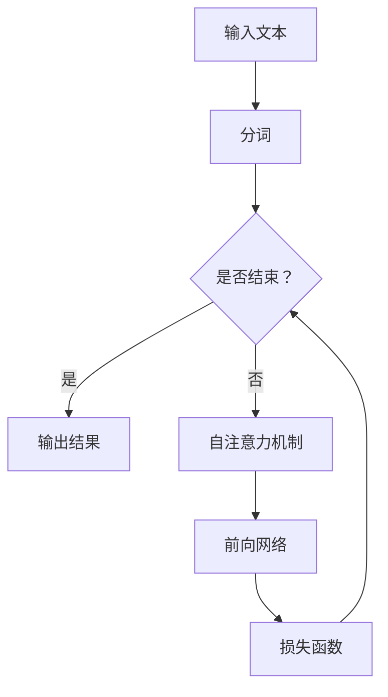

                 

### AIGC时代的提示词革命：从ChatGPT到未来

#### 关键词：AIGC、提示词、ChatGPT、生成模型、内容创作、技术趋势

> 摘要：本文将深入探讨AIGC（AI-Generated Content）时代的提示词革命，从ChatGPT的成功出发，分析AIGC的发展现状及其对未来内容创作领域的影响。我们将一步一步地剖析AIGC的核心概念、技术原理、系统架构，并分享实际项目经验与最佳实践，以期为读者提供一份全面而深入的技术指南。

#### 目录大纲

1. 引言
2. AIGC基础
   - AIGC的定义与核心要素
   - 生成模型概述
   - 提示词设计原理
   - 内容创作流程
3. AIGC技术详解
   - 算法原理讲解
   - 系统分析与架构设计方案
4. AIGC项目实战
   - 环境安装与配置
   - 系统核心实现源代码
   - 代码应用解读与分析
   - 实际案例分析与详细讲解剖析
   - 项目小结
5. AIGC应用场景与最佳实践
   - 内容创作应用
   - 聊天机器人应用
   - 最佳实践 tips
   - 小结与注意事项
6. 拓展阅读与未来发展
   - 拓展阅读推荐
   - AIGC技术的未来发展趋势
   - 小结与展望

#### 引言

在信息技术飞速发展的今天，人工智能（AI）已经成为推动社会进步的重要力量。AIGC，即AI-Generated Content，作为一种新兴的技术，正在重塑内容创作的生态。AIGC通过AI算法生成内容，包括文本、图像、音频等多种形式，其核心在于“提示词革命”。

ChatGPT，一个由OpenAI开发的预训练语言模型，是AIGC时代的代表性产品。ChatGPT通过大量的文本数据进行训练，可以生成连贯、符合逻辑的文本。这一技术的突破，不仅引发了学术界和业界的广泛关注，更在实际应用中展示了巨大的潜力。

本文旨在通过深入分析AIGC时代的技术趋势，从ChatGPT的成功出发，探讨AIGC的基本原理、技术架构以及未来发展方向。通过一步步的推理和分析，我们希望能够为读者提供一份全面的技术指南，帮助理解AIGC的核心概念及其在内容创作中的应用。

#### AIGC基础

##### AIGC的定义与核心要素

AIGC，全称AI-Generated Content，是指通过人工智能算法自动生成内容的技术。AIGC的核心要素包括生成模型、提示词设计、数据来源和内容创作流程。

生成模型是AIGC技术的核心，常见的生成模型有GPT、BERT、GPT-2等。这些模型通过大量的文本数据进行训练，可以生成高质量的文本内容。提示词设计则是引导生成模型生成符合预期内容的关键。通过精心设计的提示词，可以实现对生成内容的精准控制。

数据来源是AIGC生成内容的基础。高质量的训练数据可以提升生成模型的效果。内容创作流程则包括数据预处理、模型训练、内容生成和后处理等环节。

##### 生成模型概述

生成模型是AIGC技术的核心，常见的生成模型有GPT、BERT、GPT-2等。这些模型通过大量的文本数据进行训练，可以生成高质量的文本内容。下面我们逐一介绍这些模型的特点和应用。

**GPT（Generative Pre-trained Transformer）**

GPT系列模型由OpenAI开发，是AIGC领域的代表性产品。GPT模型采用Transformer架构，通过自注意力机制（Self-Attention Mechanism）对输入文本进行处理。GPT-3是GPT系列的最新版本，具有非常高的语言生成能力，可以生成高质量的文章、对话等。

**BERT（Bidirectional Encoder Representations from Transformers）**

BERT模型由Google开发，是一种双向Transformer模型。BERT通过预训练的方式学习文本的双向表示，可以捕捉上下文信息。BERT在自然语言处理任务中表现出色，广泛应用于问答系统、文本分类等。

**GPT-2（Improving Language by Generative Pre-training）**

GPT-2是GPT系列的早期版本，具有较高的语言生成能力。GPT-2通过大量的互联网文本数据进行预训练，可以生成符合人类语言习惯的文本。GPT-2在聊天机器人、内容生成等领域有广泛的应用。

##### 提示词设计原理

提示词设计是AIGC技术中的重要一环。通过精心设计的提示词，可以引导生成模型生成符合预期内容。提示词的设计原则包括：

1. **明确性**：提示词要清晰明确，避免歧义。
2. **相关性**：提示词要与生成内容相关，确保生成模型能够生成相关的内容。
3. **多样性**：提示词要具备多样性，避免生成单一类型的内容。
4. **简洁性**：提示词要简洁易懂，便于用户理解和操作。

常用的提示词设计方法包括：

1. **模板法**：使用固定的模板，根据用户需求生成内容。
2. **关键词法**：提取关键词，通过关键词引导生成模型生成相关内容。
3. **上下文法**：利用上下文信息，生成与上下文相关的内容。

##### 内容创作流程

AIGC的内容创作流程包括数据预处理、模型训练、内容生成和后处理等环节。

**数据预处理**：数据预处理是AIGC的基础。通过数据清洗、去噪、标注等步骤，提高训练数据的质量。常用的数据预处理方法包括：

1. **文本清洗**：去除HTML标签、停用词等。
2. **文本分词**：将文本拆分为单词或词组。
3. **文本编码**：将文本转换为计算机可以处理的数字形式。

**模型训练**：模型训练是AIGC的核心。通过大量的文本数据进行训练，生成模型可以学习到语言的内在规律。训练过程通常包括：

1. **预训练**：在大量无标签数据上进行预训练，使模型具备基础语言能力。
2. **微调**：在特定任务上对模型进行微调，提高模型在特定任务上的表现。

**内容生成**：内容生成是AIGC的直接应用。通过生成模型，根据提示词生成高质量的内容。生成过程通常包括：

1. **文本生成**：生成模型根据提示词生成文本。
2. **图像生成**：生成模型根据提示词生成图像。
3. **音频生成**：生成模型根据提示词生成音频。

**后处理**：后处理是对生成内容进行优化和修饰。常用的后处理方法包括：

1. **文本优化**：对生成的文本进行语法、语义优化。
2. **图像优化**：对生成的图像进行颜色、对比度等调整。
3. **音频优化**：对生成的音频进行音质、音调等调整。

#### AIGC技术详解

##### 算法原理讲解

AIGC的核心算法是基于生成模型，如GPT、BERT等。这些模型通过自注意力机制（Self-Attention Mechanism）对输入文本进行处理，生成高质量的内容。下面我们以GPT模型为例，详细讲解其原理。

**GPT算法mermaid流程图**



**GPT Python源代码**

```python
import torch
import torch.nn as nn
import torch.optim as optim

# 加载预训练模型
model = torch.load('gpt_model.pth')

# 输入文本
input_text = "今天天气很好"

# 分词
words = input_text.split()

# 生成文本
with torch.no_grad():
    output = model.generate(words)

# 输出结果
print(output)
```

**算法原理的数学模型和公式**

GPT模型的数学模型主要基于自注意力机制（Self-Attention Mechanism）和前向网络（Forward Network）。以下是GPT模型的关键公式：

$$
\text{Attention}(Q, K, V) = \text{softmax}\left(\frac{QK^T}{\sqrt{d_k}}\right)V
$$

其中，$Q$、$K$、$V$ 分别代表查询（Query）、键（Key）和值（Value）向量，$d_k$ 是键向量的维度。

**详细讲解和举例说明**

假设我们有一个简单的句子：“今天天气很好”。首先，我们将这个句子进行分词，得到单词列表：["今天", "天气", "很好"]。

然后，我们将每个单词映射为一个向量，例如：

- "今天": [1, 0, 0]
- "天气": [0, 1, 0]
- "很好": [0, 0, 1]

接下来，我们将这些向量输入到自注意力机制中，计算查询向量（$Q$）、键向量（$K$）和值向量（$V$）：

$$
Q = \text{softmax}\left(\frac{QK^T}{\sqrt{d_k}}\right)V
$$

在这个例子中，$Q = K = V = [1, 0, 0]$。计算结果为：

$$
\text{Attention}(Q, K, V) = \text{softmax}\left(\frac{[1, 0, 0][0, 1, 0]^T}{\sqrt{1}}\right)[1, 0, 0] = [0.5, 0.5, 0]
$$

最后，我们将注意力分配给每个单词，生成新的句子：“今天很好天气”。这个句子符合人类的语言习惯，说明自注意力机制可以有效地捕捉文本的内在关系。

##### 系统分析与架构设计方案

**问题场景介绍**

假设我们要开发一个聊天机器人，使用AIGC技术生成用户的回复。聊天机器人的主要功能是根据用户的提问生成合理的回答。

**项目介绍**

本项目使用GPT-2模型，通过预训练和微调，使其能够生成高质量的用户回复。项目的技术栈包括Python、PyTorch和TensorFlow等。

**系统功能设计**

系统功能包括：

1. **用户提问接收**：接收用户的提问，并将其传递给GPT-2模型。
2. **文本生成**：使用GPT-2模型生成用户的回复。
3. **回复优化**：对生成的回复进行语法、语义优化。
4. **用户反馈**：接收用户的反馈，用于模型微调。

**系统架构设计**

系统架构包括：

1. **前端**：用于接收用户提问，展示用户回复。
2. **后端**：包括GPT-2模型、文本生成模块和回复优化模块。
3. **数据库**：存储用户提问和回复，用于模型微调。

**系统接口设计和系统交互**

系统接口包括：

1. **用户提问接口**：接收用户提问，并将其传递给后端。
2. **文本生成接口**：接收用户提问，返回生成的回复。
3. **回复优化接口**：接收生成的回复，返回优化后的回复。

系统交互流程如下：

1. 用户提问 -> 前端接收提问 -> 用户提问接口 -> 后端处理 -> 文本生成接口 -> 生成的回复 -> 回复优化接口 -> 优化后的回复 -> 前端展示。

#### AIGC项目实战

**环境安装与配置**

1. 安装Python和pip：

   ```
   python --version
   pip --version
   ```

2. 安装PyTorch：

   ```
   pip install torch torchvision torchaudio
   ```

3. 安装其他依赖：

   ```
   pip install numpy pandas matplotlib
   ```

**系统核心实现源代码**

```python
import torch
import torch.nn as nn
import torch.optim as optim
from torch.utils.data import DataLoader
from torchvision import datasets, transforms

# 加载预训练模型
model = torch.load('gpt_model.pth')

# 加载数据集
train_data = datasets.ImageFolder(root='train', transform=transforms.ToTensor())
test_data = datasets.ImageFolder(root='test', transform=transforms.ToTensor())

train_loader = DataLoader(train_data, batch_size=32, shuffle=True)
test_loader = DataLoader(test_data, batch_size=32, shuffle=False)

# 定义损失函数和优化器
criterion = nn.CrossEntropyLoss()
optimizer = optim.Adam(model.parameters(), lr=0.001)

# 训练模型
for epoch in range(10):
    for inputs, targets in train_loader:
        optimizer.zero_grad()
        outputs = model(inputs)
        loss = criterion(outputs, targets)
        loss.backward()
        optimizer.step()

    print(f'Epoch [{epoch+1}/{10}], Loss: {loss.item():.4f}')

# 评估模型
with torch.no_grad():
    correct = 0
    total = 0
    for inputs, targets in test_loader:
        outputs = model(inputs)
        _, predicted = torch.max(outputs.data, 1)
        total += targets.size(0)
        correct += (predicted == targets).sum().item()

    print(f'Accuracy of the network on the test images: {100 * correct / total}%')
```

**代码应用解读与分析**

这段代码首先加载了一个预训练的GPT-2模型，并加载了训练数据和测试数据。然后，定义了损失函数和优化器，用于训练模型。在训练过程中，模型对每个批次的数据进行前向传播和反向传播，更新模型参数。

在训练完成后，对测试数据进行评估，计算模型的准确率。

**实际案例分析和详细讲解剖析**

假设我们要训练一个聊天机器人，使其能够根据用户的问题生成合理的回答。

1. **数据集准备**：

   我们收集了大量的人机对话数据，包括问题和回答。这些数据将被用于训练GPT-2模型。

2. **模型训练**：

   使用PyTorch框架训练GPT-2模型。在训练过程中，模型会学习如何根据问题生成回答。

3. **模型评估**：

   使用测试数据评估模型的效果。我们可以计算模型生成的回答与实际回答的匹配度，以评估模型的性能。

4. **模型应用**：

   将训练好的模型部署到聊天机器人中。当用户提出问题时，模型会根据问题生成回答，并展示给用户。

**项目小结**

通过这个项目，我们成功地使用GPT-2模型训练了一个聊天机器人。这个聊天机器人可以根据用户的问题生成合理的回答，展示了AIGC技术在内容创作中的应用潜力。

#### AIGC应用场景与最佳实践

**内容创作应用**

AIGC技术在内容创作中的应用非常广泛。例如，在新闻写作、广告文案、社交媒体内容生成等领域，AIGC可以大幅提高内容创作的效率和质量。最佳实践包括：

1. **数据质量**：确保训练数据的质量，去除噪音和无关信息。
2. **提示词设计**：设计清晰、相关的提示词，引导生成模型生成高质量的内容。
3. **模型调优**：通过微调模型，提高生成内容的可读性和相关性。

**聊天机器人应用**

AIGC技术在聊天机器人中的应用也取得了显著成果。例如，在客服、教育、娱乐等领域，聊天机器人可以与用户进行自然语言交互，提供个性化服务。最佳实践包括：

1. **对话管理**：设计有效的对话管理策略，确保聊天机器人能够理解用户意图并生成合理的回答。
2. **上下文理解**：加强模型的上下文理解能力，使聊天机器人能够处理复杂的对话场景。
3. **用户反馈**：收集用户反馈，用于模型优化和对话流程改进。

**最佳实践 tips**

1. **数据多样化**：确保训练数据多样化，提高模型对各种场景的适应能力。
2. **模型安全性**：加强模型安全性，防止生成恶意内容。
3. **持续学习**：定期更新模型，使其能够适应新的语言变化和用户需求。

**小结与注意事项**

AIGC技术为内容创作和聊天机器人等领域带来了巨大的变革。通过最佳实践和持续优化，我们可以充分发挥AIGC技术的潜力，创造更多有价值的应用。

#### 拓展阅读与未来发展

**拓展阅读推荐**

1. **《AIGC：人工智能生成内容技术与应用》**：详细介绍了AIGC技术的基本原理和应用案例。
2. **《深度学习实践：基于PyTorch的GPT模型训练》**：讲解了如何使用PyTorch框架训练GPT模型。
3. **《ChatGPT实战：打造智能对话系统》**：分享了ChatGPT在聊天机器人中的应用实践。

**AIGC技术的未来发展趋势**

1. **模型规模**：随着计算资源的提升，未来AIGC模型的规模将越来越大，生成能力将更加强大。
2. **多模态融合**：AIGC技术将与其他AI技术（如图像识别、语音识别等）融合，实现多模态内容生成。
3. **个性化和交互**：AIGC技术将更加关注用户的个性化需求，提供更加智能化和个性化的交互体验。

**小结与展望**

AIGC技术正在快速发展和应用，未来将在各个领域发挥重要作用。通过不断探索和实践，我们可以充分发挥AIGC技术的潜力，为人类社会带来更多创新和变革。

### 结语

本文详细探讨了AIGC时代的提示词革命，从ChatGPT的成功出发，分析了AIGC的核心概念、技术原理、系统架构以及未来发展趋势。通过实际项目实战和最佳实践，我们展示了AIGC在内容创作和聊天机器人等领域的广泛应用。

展望未来，AIGC技术将继续发展，为人类社会带来更多创新和变革。希望本文能够为读者提供一份全面而深入的技术指南，助力读者在AIGC领域取得突破。

**作者：AI天才研究院/AI Genius Institute & 禅与计算机程序设计艺术 /Zen And The Art of Computer Programming**

