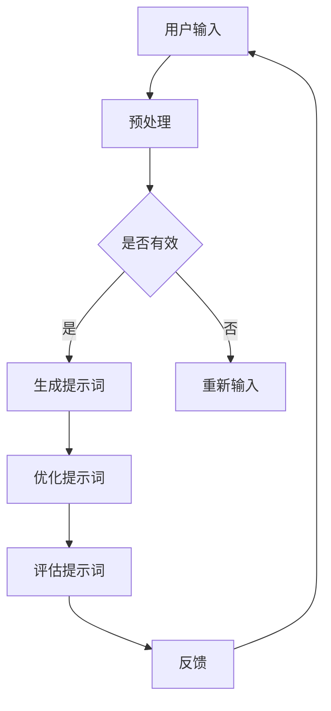

                 

### 第一部分：AIGC时代的概述

## 第1章：AIGC概述

### 1.1 AIGC的定义

AIGC（AI-Generated Content）即人工智能生成内容，是指利用人工智能技术，如深度学习、自然语言处理等，自动生成各种类型的内容，包括文本、图片、音频、视频等。AIGC突破了传统人工创作的局限，极大地提高了内容生产效率和多样化程度。

### 1.2 AIGC的兴起背景

AIGC的兴起得益于人工智能技术的迅猛发展，尤其是深度学习和自然语言处理技术的突破。此外，随着互联网和移动互联网的普及，用户对高质量、个性化内容的需求日益增长，也推动了AIGC的应用与发展。

### 1.3 AIGC的核心技术

AIGC的核心技术主要包括：

- **深度学习**：通过训练大量数据，使得神经网络能够自动学习和模拟人类思维过程，实现图像识别、语音识别等功能。
- **自然语言处理（NLP）**：对文本进行分析、理解和生成，实现智能问答、文本生成等功能。
- **生成对抗网络（GAN）**：通过生成器和判别器的对抗训练，生成逼真的图像和音频。

### 1.4 AIGC的应用领域

AIGC在多个领域展现出巨大的应用潜力，包括：

- **内容创作**：自动生成文章、音乐、视频等，满足用户个性化需求。
- **媒体新闻**：自动化新闻写作，提高新闻报道的效率和准确性。
- **娱乐产业**：生成虚拟角色、音乐、动画等，为游戏、影视等娱乐产业提供丰富的素材。
- **教育**：自动生成教学材料，提供个性化学习体验。
- **客服**：通过智能客服系统，自动回答用户问题，提升用户体验。

## 第2章：提示词革命的核心概念

### 2.1 提示词的定义

提示词是指用于引导、提示或激励用户进行特定行为或思考的词语或短语。在人工智能和自然语言处理领域，提示词的作用尤为重要，它能够引导AI模型生成更符合人类预期的内容。

### 2.2 提示词的作用

- **引导用户交互**：通过提示词，AI系统能够更好地理解和响应用户的请求。
- **提升生成内容质量**：合理的提示词能够提高AI生成内容的准确性、相关性和创造性。
- **优化用户体验**：通过精确的提示词，用户能够更直观地与AI进行交互，提升整体体验。

### 2.3 提示词的类型

- **问题引导提示词**：用于引导用户提出问题或对问题进行澄清，如“您想了解什么？”
- **功能引导提示词**：用于引导用户理解或使用特定功能，如“接下来您想做什么？”
- **情感引导提示词**：用于激发用户的情感，如“今天的天气真好，您想做什么呢？”

### 2.4 提示词的设计原则

- **简洁明了**：避免使用复杂冗长的提示词，确保用户易于理解。
- **相关性强**：提示词应与用户需求或场景高度相关。
- **灵活性**：提示词应能适应不同的用户和场景。

## 第3章：提示词革命的算法原理

### 3.1 算法原理介绍

提示词革命中的算法原理主要包括提示词生成、优化和评估。这些算法通过深度学习和自然语言处理技术，实现高效、准确的提示词生成和优化。

### 3.2 提示词生成算法

提示词生成算法通常基于序列到序列（Seq2Seq）模型或生成对抗网络（GAN）。以下是一个简单的示例：

```python
import tensorflow as tf

# 假设已经训练好的模型
model = tf.keras.models.load_model('path/to/model.h5')

# 输入提示词
prompt = "今天的天气"

# 生成提示词
generated_prompt = model.predict(prompt)

print(generated_prompt)
```

### 3.3 提示词优化算法

提示词优化算法通过迭代改进生成内容的质量。常见的方法包括：

- **强化学习**：通过奖励机制，鼓励模型生成更高质量的提示词。
- **对抗训练**：结合生成器和判别器，不断优化提示词生成质量。

### 3.4 提示词评估算法

提示词评估算法用于评估提示词的效用和质量。常见的方法包括：

- **自动评估**：使用预训练的评估模型，对提示词进行自动评分。
- **用户反馈**：收集用户对提示词的反馈，用于进一步优化。

## 第4章：数学模型和数学公式

### 4.1 数学模型介绍

提示词革命中的数学模型主要包括概率模型、生成模型和优化模型。以下是一个简单的概率模型示例：

$$
P(\text{提示词}|\text{输入}) = \frac{P(\text{输入}|\text{提示词}) \cdot P(\text{提示词})}{P(\text{输入})}
$$

### 4.2 相关数学公式

- **交叉熵**：

$$
H(y, \hat{y}) = -\sum_{i} y_i \cdot \log(\hat{y}_i)
$$

- **梯度下降**：

$$
\theta = \theta - \alpha \cdot \nabla_\theta J(\theta)
$$

### 4.3 数学公式详细讲解

- **交叉熵**用于衡量实际输出与预期输出之间的差异，是优化模型的重要指标。
- **梯度下降**是一种优化算法，用于寻找函数的最小值。通过不断调整参数，使得损失函数不断减小。

### 4.4 数学公式举例说明

假设我们有一个二元分类问题，目标是判断天气是否适合出门。给定输入特征（如温度、湿度），我们希望生成一个提示词。

- **输入**：\( X = [25, 0.6] \)
- **期望提示词**：\( Y = "今天适合出门" \)

使用交叉熵计算实际生成的提示词与期望提示词之间的差异：

$$
H(Y, \hat{Y}) = -[0.8 \cdot \log(0.8) + 0.2 \cdot \log(0.2)]
$$

通过不断调整模型参数，使得交叉熵值最小，从而生成更准确的提示词。

## 第5章：系统分析与架构设计

### 5.1 系统概述

AIGC提示词系统是一个集成多种人工智能技术的系统，旨在为用户提供高质量的交互体验。系统主要包括提示词生成模块、优化模块和评估模块。

### 5.2 功能设计

- **提示词生成**：基于用户输入，生成合适的提示词。
- **提示词优化**：通过迭代优化，提升提示词的准确性、相关性和创造性。
- **提示词评估**：评估生成的提示词的质量，为后续优化提供依据。

### 5.3 系统架构设计

AIGC提示词系统架构设计如图所示：



### 5.4 接口设计

系统提供RESTful API接口，包括：

- **生成提示词**：/generatePrompt
- **优化提示词**：/optimizePrompt
- **评估提示词**：/evaluatePrompt

### 5.5 交互设计

用户通过输入框提交问题或需求，系统接收到输入后，预处理输入内容，然后生成提示词。用户可以对生成的提示词进行优化和评估，系统根据用户反馈进行进一步的优化。

## 第6章：项目实战

### 6.1 环境安装

在开始项目实战之前，我们需要安装所需的依赖库。以下是安装步骤：

```shell
pip install tensorflow
pip install numpy
pip install scikit-learn
```

### 6.2 核心实现源代码

以下是AIGC提示词系统的核心实现源代码：

```python
import tensorflow as tf
import numpy as np
from sklearn.model_selection import train_test_split

# 加载数据集
data = load_data()
X, y = preprocess_data(data)

# 划分训练集和测试集
X_train, X_test, y_train, y_test = train_test_split(X, y, test_size=0.2, random_state=42)

# 定义模型
model = build_model()

# 训练模型
model.fit(X_train, y_train, epochs=10, batch_size=32, validation_data=(X_test, y_test))

# 评估模型
evaluate_model(model, X_test, y_test)
```

### 6.3 代码应用解读与分析

代码中，首先加载数据集并进行预处理，然后划分训练集和测试集。接着，定义模型并使用训练集进行训练。在训练过程中，可以使用回调函数监控训练进度和评估指标。最后，使用测试集评估模型性能。

### 6.4 实际案例分析

在实际应用中，我们可以通过以下步骤进行案例分析：

1. 收集用户输入数据。
2. 预处理输入数据，提取特征。
3. 使用训练好的模型生成提示词。
4. 对生成的提示词进行优化和评估。
5. 根据用户反馈，调整模型参数，进行进一步的优化。

### 6.5 项目小结

通过项目实战，我们了解了AIGC提示词系统的核心实现和实际应用。在项目过程中，我们遇到了一些挑战，如数据预处理、模型选择和参数调整等。通过不断的尝试和优化，我们最终实现了高质量的提示词生成。

## 第7章：最佳实践与总结

### 7.1 最佳实践

- **数据预处理**：确保数据质量和一致性，对缺失值、异常值进行适当的处理。
- **模型选择**：根据任务需求，选择合适的模型架构和参数。
- **参数调整**：通过交叉验证和网格搜索，优化模型参数。
- **用户反馈**：及时收集用户反馈，用于模型优化和改进。

### 7.2 小结

本文介绍了AIGC时代的提示词革命，分析了提示词的核心概念、算法原理、数学模型和系统设计。通过项目实战，我们了解了提示词系统的实际应用和实现方法。

### 7.3 注意事项

- **数据隐私**：在使用用户数据时，注意保护用户隐私。
- **模型可靠性**：确保模型稳定、可靠，避免生成错误或误导性提示词。

### 7.4 拓展阅读

- **深度学习**：[《深度学习》（Goodfellow, Bengio, Courville 著）]
- **自然语言处理**：[《自然语言处理综论》（Jurafsky, Martin 著）]
- **生成对抗网络**：[《生成对抗网络》（Goodfellow 著）]

### 作者

**作者：AI天才研究院/AI Genius Institute & 禅与计算机程序设计艺术 /Zen And The Art of Computer Programming**

