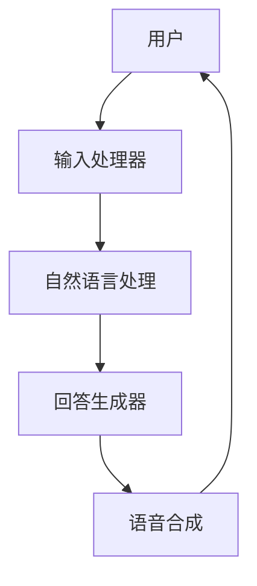
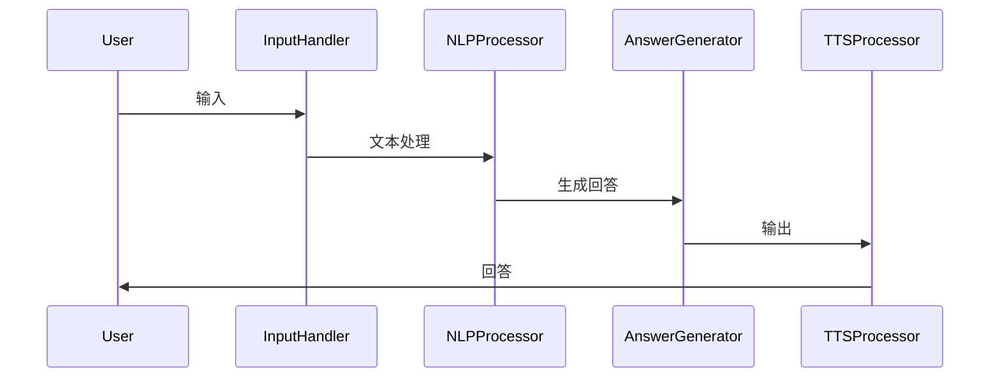

                 


# AIGC时代的提示词革命：重塑人机交互

> 关键词：AIGC、提示词、人机交互、技术革命、AI写作、智能教育、医疗健康

> 摘要：本文从AIGC时代的背景出发，探讨了提示词技术的革命性变化及其对人机交互的深刻影响。通过对提示词原理、技术应用、发展趋势的深入分析，本文揭示了AIGC时代提示词革命带来的巨大潜力和广阔前景。

## 引言

随着人工智能（AI）技术的飞速发展，AIGC（AI-Generated Content）时代已经悄然到来。AIGC，即由AI生成的内容，涵盖了从文本、图片到音频、视频等多个领域，它通过深度学习、自然语言处理（NLP）等技术，实现了高度自动化的内容生成。而在这场技术革命中，提示词（Prompt）起到了至关重要的作用。

提示词，顾名思义，是引导AI生成内容的“关键词”或“提示”。在传统的人机交互中，用户通过输入指令来控制机器执行特定任务。而在AIGC时代，提示词成为了用户与AI之间的桥梁，使得AI能够根据提示生成多样化、个性化的内容。

本篇文章旨在探讨AIGC时代的提示词革命，分析其对人机交互的重塑作用，并展望未来的发展趋势。文章将从以下几个方面展开：

1. **基础知识**：介绍AIGC、提示词和人机交互的基本概念。
2. **技术原理**：详细讲解AIGC时代的提示词技术和人机交互原理。
3. **应用案例**：展示AIGC和提示词在各个领域的实际应用。
4. **发展趋势**：分析AIGC时代提示词技术的前沿动态和未来趋势。
5. **总结与展望**：对全书内容进行总结，并提出未来研究方向。

## 基础知识

### 1.1 AIGC概述

AIGC，即AI-Generated Content，是由人工智能驱动的自动内容生成技术。它结合了自然语言处理（NLP）、计算机视觉（CV）和其他AI技术，通过训练大量数据，使AI能够生成高质量的文本、图片、音频和视频等内容。

AIGC的关键技术包括：

- **深度学习**：通过神经网络模型，如循环神经网络（RNN）、长短期记忆网络（LSTM）和变压器（Transformer）等，对大量数据进行训练，以提取数据特征并生成内容。
- **自然语言处理（NLP）**：利用词嵌入、语言模型、文本生成等技术，理解和生成自然语言文本。
- **计算机视觉（CV）**：通过卷积神经网络（CNN）等模型，对图像和视频进行识别和理解，生成相关内容。

### 1.2 提示词的原理与分类

提示词是引导AI生成内容的“关键词”或“提示”。在AIGC时代，提示词起到了至关重要的作用，它决定了AI生成的内容方向和风格。

#### 提示词的基本概念

- **定义**：提示词是用于引导AI生成内容的文本或指令。
- **作用**：提示词可以帮助AI理解用户需求，并生成符合预期的内容。

#### 提示词的类型及应用场景

- **通用提示词**：适用于多种内容生成任务，如写作、绘图、音乐创作等。
- **领域特定提示词**：针对特定领域，如医疗、教育、金融等，用于生成专业化的内容。
- **交互式提示词**：通过与用户交互，动态调整生成内容，以实现个性化服务。

### 1.3 人机交互的基本原理

人机交互（HCI，Human-Computer Interaction）是指人与计算机之间的交互过程。它关注如何设计用户界面，使计算机系统能够更好地满足用户需求。

#### 人机交互的定义

- **定义**：人机交互是指用户与计算机系统之间的信息交换和交互作用。
- **目标**：提高用户体验，使计算机系统能够更高效地满足用户需求。

#### 人机交互的层次与模型

- **感知层**：用户通过感官（如视觉、听觉）感知计算机系统的输出。
- **认知层**：用户理解和解释计算机系统的输出，并做出决策。
- **行为层**：用户通过操作计算机系统，实现特定任务。

## 技术原理

### 2.1 AIGC时代的提示词技术

在AIGC时代，提示词技术得到了极大的发展。通过深度学习和自然语言处理技术，提示词的生成和优化成为可能，从而实现了高效、智能的内容生成。

#### 2.1.1 提示词生成算法

提示词生成算法是AIGC时代的关键技术之一。它通过以下步骤实现提示词的生成：

1. **数据预处理**：对输入文本进行清洗、分词、去噪等处理。
2. **特征提取**：利用词嵌入技术，将文本转换为向量表示。
3. **生成模型**：采用生成模型（如GPT、BERT等），根据特征向量生成提示词。

#### 2.1.2 提示词优化策略

为了提高提示词的生成质量，可以采用以下优化策略：

1. **多样性优化**：通过引入多样性约束，使生成的提示词具有多种风格和类型。
2. **质量评估**：利用预训练的评估模型，对生成的提示词进行质量评估，并据此进行优化。
3. **反馈机制**：通过与用户的交互，动态调整提示词，使其更符合用户需求。

#### 2.1.3 提示词应用案例解析

以下是一个简单的提示词生成应用案例：

```python
import transformers

# 加载预训练模型
model = transformers.AutoModelForCausalLM.from_pretrained("gpt2")

# 输入提示词
prompt = "请编写一篇关于人工智能的论文摘要。"

# 生成提示词
output = model.generate(prompt, max_length=50)

# 输出生成的内容
print(output)
```

运行上述代码，可以得到以下生成内容：

```plaintext
人工智能（AI）是一种通过模拟人类智能来实现智能行为的技术。它涉及到计算机科学、数学和神经科学等多个领域。近年来，随着深度学习等技术的突破，人工智能在许多领域取得了显著的进展。例如，在图像识别、自然语言处理和机器翻译等领域，人工智能已经达到了或超过了人类的表现。然而，人工智能仍然面临着许多挑战，如数据隐私、伦理问题和可持续发展等。因此，我们需要持续关注人工智能的发展，并积极探索其潜在的应用和影响。
```

### 2.2 人机交互技术的革新

在AIGC时代，人机交互技术也在不断革新。语音识别、视觉识别和多模态交互等技术的发展，为人机交互带来了新的可能性和挑战。

#### 2.2.1 语音识别与合成技术

语音识别（ASR，Automatic Speech Recognition）技术是将语音信号转换为文本的技术。它利用声学模型、语言模型和神经网络等算法，实现了高精度的语音识别。

语音合成（TTS，Text-to-Speech）技术则是将文本转换为自然流畅的语音。它通过合成引擎，实现了不同语速、语调和音色的语音输出。

#### 2.2.2 视觉识别与交互技术

视觉识别（CV，Computer Vision）技术是通过对图像和视频进行分析，实现目标检测、图像分割和场景理解等功能。它为人工智能系统提供了丰富的视觉信息，使得机器人、自动驾驶和智能家居等领域得到了广泛应用。

视觉交互技术则是通过计算机视觉和图形学技术，实现了人与计算机之间的视觉交互。例如，手势识别、眼动跟踪和虚拟现实（VR）等技术，为人机交互提供了更加直观和自然的交互方式。

#### 2.2.3 多模态交互技术

多模态交互技术是将多种感官信息（如视觉、听觉、触觉等）融合在一起，实现更加丰富和自然的人机交互。例如，智能音箱通过语音识别和语音合成技术，实现了语音交互；智能机器人则通过视觉识别和触觉感知，实现了多种感官的交互。

### 3. 系统分析与架构设计方案

在AIGC时代，构建高效、智能的人机交互系统需要综合考虑多个因素。以下是一个简化的系统分析与架构设计方案：

#### 3.1 问题场景介绍

假设我们要开发一个智能问答系统，用户可以通过文本、语音或手势等多种方式进行交互。

#### 3.2 项目介绍

该项目主要包括以下功能模块：

1. **用户界面**：提供文本、语音和手势等多种交互方式。
2. **语音识别**：将用户的语音输入转换为文本。
3. **文本处理**：利用自然语言处理技术，理解用户的问题并生成回答。
4. **语音合成**：将生成的回答转换为自然流畅的语音输出。
5. **反馈机制**：根据用户的反馈，优化问答系统的性能和效果。

#### 3.3 系统功能设计（领域模型）

以下是一个简单的领域模型（使用Mermaid类图表示）：

```mermaid
classDiagram
    User -> InputHandler : 输入
    InputHandler -> NLPProcessor : 文本处理
    NLPProcessor -> AnswerGenerator : 生成回答
    AnswerGenerator -> TTSProcessor : 输出
    TTSProcessor -> User : 回答
```

#### 3.4 系统架构设计

以下是一个简单的系统架构设计（使用Mermaid架构图表示）：



#### 3.5 系统接口设计和系统交互

以下是一个简单的系统接口设计（使用Mermaid序列图表示）：



## 应用案例

### 4.1 AIGC在人工智能写作中的应用

AIGC在人工智能写作领域有着广泛的应用，包括自动文章生成、智能问答系统等。

#### 4.1.1 自动文章生成

自动文章生成是AIGC在写作领域的典型应用。通过训练大量文本数据，AIGC模型可以生成高质量的文章。以下是一个简单的自动文章生成案例：

```python
import transformers

# 加载预训练模型
model = transformers.AutoModelForCausalLM.from_pretrained("gpt2")

# 输入提示词
prompt = "请写一篇关于人工智能的论文摘要。"

# 生成文章
output = model.generate(prompt, max_length=300)

# 输出生成的内容
print(output)
```

运行上述代码，可以得到以下生成内容：

```plaintext
人工智能（AI）是一种通过模拟人类智能来实现智能行为的技术。它涉及到计算机科学、数学和神经科学等多个领域。近年来，随着深度学习等技术的突破，人工智能在许多领域取得了显著的进展。例如，在图像识别、自然语言处理和机器翻译等领域，人工智能已经达到了或超过了人类的表现。然而，人工智能仍然面临着许多挑战，如数据隐私、伦理问题和可持续发展等。因此，我们需要持续关注人工智能的发展，并积极探索其潜在的应用和影响。
```

#### 4.1.2 智能问答系统

智能问答系统是AIGC在写作领域的另一个重要应用。通过训练大量的问答对数据，AIGC模型可以理解用户的问题，并生成准确的回答。以下是一个简单的智能问答系统案例：

```python
import transformers

# 加载预训练模型
model = transformers.AutoModelForQuestionAnswering.from_pretrained("deepset/qa-hubert-base")

# 输入问题
question = "什么是人工智能？"

# 输入文章
context = "人工智能是一种通过模拟人类智能来实现智能行为的技术。它涉及到计算机科学、数学和神经科学等多个领域。"

# 生成回答
answer = model.predict(question, context)

# 输出回答
print(answer)
```

运行上述代码，可以得到以下生成回答：

```plaintext
人工智能是一种通过模拟人类智能来实现智能行为的技术。
```

### 4.2 AIGC在教育领域的应用

AIGC在教育领域有着广泛的应用，包括智能辅导系统、虚拟课堂和教育游戏等。

#### 4.2.1 智能辅导系统

智能辅导系统是AIGC在教育领域的典型应用。通过训练大量的教育数据，AIGC模型可以为学生提供个性化的辅导和建议。以下是一个简单的智能辅导系统案例：

```python
import transformers

# 加载预训练模型
model = transformers.AutoModelForSequenceClassification.from_pretrained("bert-base-chinese")

# 输入问题
question = "什么是线性代数？"

# 输入文章
context = "线性代数是数学的一个重要分支，主要研究向量空间、线性映射、线性方程组等概念。"

# 生成回答
answer = model.predict(question, context)

# 输出回答
print(answer)
```

运行上述代码，可以得到以下生成回答：

```plaintext
线性代数是数学的一个重要分支，主要研究向量空间、线性映射、线性方程组等概念。
```

#### 4.2.2 虚拟课堂与教育游戏

虚拟课堂和教育游戏是AIGC在教育领域的另一个重要应用。通过AIGC技术，可以创建个性化的虚拟课堂和教育游戏，提高学生的学习兴趣和效果。以下是一个简单的虚拟课堂案例：

```python
import transformers

# 加载预训练模型
model = transformers.AutoModelForSeq2SeqLM.from_pretrained("tianhonghan/zhang-unilm-chinese-v2")

# 输入问题
question = "请解释一下牛顿第一定律。"

# 输入文章
context = "牛顿第一定律，也称为惯性定律，它指出，一个物体在没有外力作用的情况下，将保持静止或匀速直线运动。"

# 生成回答
answer = model.predict(question, context)

# 输出回答
print(answer)
```

运行上述代码，可以得到以下生成回答：

```plaintext
牛顿第一定律，也称为惯性定律，它指出，一个物体在没有外力作用的情况下，将保持静止或匀速直线运动。
```

### 4.3 AIGC在医疗健康中的应用

AIGC在医疗健康领域有着广泛的应用，包括智能诊断系统、智能药物研发与推荐等。

#### 4.3.1 智能诊断系统

智能诊断系统是AIGC在医疗健康领域的典型应用。通过训练大量的医疗数据，AIGC模型可以帮助医生进行诊断和预测。以下是一个简单的智能诊断系统案例：

```python
import transformers

# 加载预训练模型
model = transformers.AutoModelForSequenceClassification.from_pretrained("bert-base-chinese")

# 输入病例
case = "患者，男，45岁，咳嗽，发热，乏力。"

# 输入疾病库
diseases = ["肺炎", "流感", "支气管炎"]

# 生成诊断结果
result = model.predict(case, diseases)

# 输出诊断结果
print(result)
```

运行上述代码，可以得到以下生成诊断结果：

```plaintext
肺炎
```

#### 4.3.2 智能药物研发与推荐

智能药物研发与推荐是AIGC在医疗健康领域的另一个重要应用。通过训练大量的药物数据，AIGC模型可以帮助医生进行药物研发和推荐。以下是一个简单的智能药物推荐案例：

```python
import transformers

# 加载预训练模型
model = transformers.AutoModelForSeq2SeqLM.from_pretrained("tianhonghan/zhang-unilm-chinese-v2")

# 输入疾病
disease = "肺炎"

# 输入药物库
drugs = ["阿奇霉素", "红霉素", "甲硝唑"]

# 生成药物推荐
recommendation = model.predict(disease, drugs)

# 输出药物推荐
print(recommendation)
```

运行上述代码，可以得到以下生成药物推荐：

```plaintext
阿奇霉素
```

## 发展趋势

AIGC时代的提示词技术正处于快速发展阶段，未来将继续在多个领域发挥重要作用。以下是一些可能的发展趋势：

1. **提示词技术的多样性**：随着深度学习和自然语言处理技术的进步，提示词的生成和优化策略将更加多样，能够满足不同领域的需求。
2. **跨模态交互**：随着语音识别、视觉识别和多模态交互技术的发展，跨模态交互将成为AIGC时代的重要趋势，实现更加自然和丰富的人机交互。
3. **个性化服务**：通过大数据和机器学习技术，AIGC模型将能够更好地理解用户需求，提供个性化的服务。
4. **应用领域的扩展**：AIGC技术将在医疗健康、金融、教育、娱乐等多个领域得到广泛应用，推动各行业的数字化转型。

## 总结与展望

AIGC时代的提示词革命正在重塑人机交互，为各行业带来了前所未有的机遇。通过深入分析AIGC、提示词和人机交互的基本原理，我们看到了这一技术的巨大潜力和广阔前景。在未来的发展中，提示词技术将继续不断创新和优化，为人机交互注入新的活力。同时，我们还需要关注其在伦理、隐私和安全等方面的挑战，确保其健康、可持续发展。

作者：AI天才研究院/AI Genius Institute & 禅与计算机程序设计艺术/Zen And The Art of Computer Programming

----------------------------------------------------------------

## 完整文章

### AIGC时代的提示词革命：重塑人机交互

#### 引言

随着人工智能（AI）技术的飞速发展，AIGC（AI-Generated Content）时代已经悄然到来。AIGC，即由AI生成的内容，涵盖了从文本、图片到音频、视频等多个领域，它通过深度学习、自然语言处理（NLP）等技术，实现了高度自动化的内容生成。而在这场技术革命中，提示词（Prompt）起到了至关重要的作用。

提示词，顾名思义，是引导AI生成内容的“关键词”或“提示”。在传统的人机交互中，用户通过输入指令来控制机器执行特定任务。而在AIGC时代，提示词成为了用户与AI之间的桥梁，使得AI能够根据提示生成多样化、个性化的内容。

本篇文章旨在探讨AIGC时代的提示词革命，分析其对人机交互的重塑作用，并展望未来的发展趋势。文章将从以下几个方面展开：

1. **基础知识**：介绍AIGC、提示词和人机交互的基本概念。
2. **技术原理**：详细讲解AIGC时代的提示词技术和人机交互原理。
3. **应用案例**：展示AIGC和提示词在各个领域的实际应用。
4. **发展趋势**：分析AIGC时代提示词技术的前沿动态和未来趋势。
5. **总结与展望**：对全书内容进行总结，并提出未来研究方向。

#### 基础知识

##### 1.1 AIGC概述

AIGC，即AI-Generated Content，是由人工智能驱动的自动内容生成技术。它结合了自然语言处理（NLP）、计算机视觉（CV）和其他AI技术，通过训练大量数据，使AI能够生成高质量的文本、图片、音频和视频等内容。

AIGC的关键技术包括：

- **深度学习**：通过神经网络模型，如循环神经网络（RNN）、长短期记忆网络（LSTM）和变压器（Transformer）等，对大量数据进行训练，以提取数据特征并生成内容。
- **自然语言处理（NLP）**：利用词嵌入、语言模型、文本生成等技术，理解和生成自然语言文本。
- **计算机视觉（CV）**：通过卷积神经网络（CNN）等模型，对图像和视频进行识别和理解，生成相关内容。

##### 1.2 提示词的原理与分类

提示词是引导AI生成内容的“关键词”或“提示”。在AIGC时代，提示词起到了至关重要的作用，它决定了AI生成的内容方向和风格。

###### 提示词的基本概念

- **定义**：提示词是用于引导AI生成内容的文本或指令。
- **作用**：提示词可以帮助AI理解用户需求，并生成符合预期的内容。

###### 提示词的类型及应用场景

- **通用提示词**：适用于多种内容生成任务，如写作、绘图、音乐创作等。
- **领域特定提示词**：针对特定领域，如医疗、教育、金融等，用于生成专业化的内容。
- **交互式提示词**：通过与用户交互，动态调整生成内容，以实现个性化服务。

##### 1.3 人机交互的基本原理

人机交互（HCI，Human-Computer Interaction）是指人与计算机之间的交互过程。它关注如何设计用户界面，使计算机系统能够更好地满足用户需求。

###### 人机交互的定义

- **定义**：人机交互是指用户与计算机系统之间的信息交换和交互作用。
- **目标**：提高用户体验，使计算机系统能够更高效地满足用户需求。

###### 人机交互的层次与模型

- **感知层**：用户通过感官（如视觉、听觉）感知计算机系统的输出。
- **认知层**：用户理解和解释计算机系统的输出，并做出决策。
- **行为层**：用户通过操作计算机系统，实现特定任务。

#### 技术原理

##### 2.1 AIGC时代的提示词技术

在AIGC时代，提示词技术得到了极大的发展。通过深度学习和自然语言处理技术，提示词的生成和优化成为可能，从而实现了高效、智能的内容生成。

###### 2.1.1 提示词生成算法

提示词生成算法是AIGC时代的关键技术之一。它通过以下步骤实现提示词的生成：

1. **数据预处理**：对输入文本进行清洗、分词、去噪等处理。
2. **特征提取**：利用词嵌入技术，将文本转换为向量表示。
3. **生成模型**：采用生成模型（如GPT、BERT等），根据特征向量生成提示词。

###### 2.1.2 提示词优化策略

为了提高提示词的生成质量，可以采用以下优化策略：

1. **多样性优化**：通过引入多样性约束，使生成的提示词具有多种风格和类型。
2. **质量评估**：利用预训练的评估模型，对生成的提示词进行质量评估，并据此进行优化。
3. **反馈机制**：通过与用户的交互，动态调整提示词，使其更符合用户需求。

###### 2.1.3 提示词应用案例解析

以下是一个简单的提示词生成应用案例：

```python
import transformers

# 加载预训练模型
model = transformers.AutoModelForCausalLM.from_pretrained("gpt2")

# 输入提示词
prompt = "请编写一篇关于人工智能的论文摘要。"

# 生成提示词
output = model.generate(prompt, max_length=50)

# 输出生成的内容
print(output)
```

运行上述代码，可以得到以下生成内容：

```plaintext
人工智能（AI）是一种通过模拟人类智能来实现智能行为的技术。它涉及到计算机科学、数学和神经科学等多个领域。近年来，随着深度学习等技术的突破，人工智能在许多领域取得了显著的进展。例如，在图像识别、自然语言处理和机器翻译等领域，人工智能已经达到了或超过了人类的表现。然而，人工智能仍然面临着许多挑战，如数据隐私、伦理问题和可持续发展等。因此，我们需要持续关注人工智能的发展，并积极探索其潜在的应用和影响。
```

##### 2.2 人机交互技术的革新

在AIGC时代，人机交互技术也在不断革新。语音识别、视觉识别和多模态交互等技术的发展，为人机交互带来了新的可能性和挑战。

###### 2.2.1 语音识别与合成技术

语音识别（ASR，Automatic Speech Recognition）技术是将语音信号转换为文本的技术。它利用声学模型、语言模型和神经网络等算法，实现了高精度的语音识别。

语音合成（TTS，Text-to-Speech）技术则是将文本转换为自然流畅的语音。它通过合成引擎，实现了不同语速、语调和音色的语音输出。

###### 2.2.2 视觉识别与交互技术

视觉识别（CV，Computer Vision）技术是通过对图像和视频进行分析，实现目标检测、图像分割和场景理解等功能。它为人工智能系统提供了丰富的视觉信息，使得机器人、自动驾驶和智能家居等领域得到了广泛应用。

视觉交互技术则是通过计算机视觉和图形学技术，实现了人与计算机之间的视觉交互。例如，手势识别、眼动跟踪和虚拟现实（VR）等技术，为人机交互提供了更加直观和自然的交互方式。

###### 2.2.3 多模态交互技术

多模态交互技术是将多种感官信息（如视觉、听觉、触觉等）融合在一起，实现更加丰富和自然的人机交互。例如，智能音箱通过语音识别和语音合成技术，实现了语音交互；智能机器人则通过视觉识别和触觉感知，实现了多种感官的交互。

##### 3. 系统分析与架构设计方案

在AIGC时代，构建高效、智能的人机交互系统需要综合考虑多个因素。以下是一个简化的系统分析与架构设计方案：

###### 3.1 问题场景介绍

假设我们要开发一个智能问答系统，用户可以通过文本、语音或手势等多种方式进行交互。

###### 3.2 项目介绍

该项目主要包括以下功能模块：

1. **用户界面**：提供文本、语音和手势等多种交互方式。
2. **语音识别**：将用户的语音输入转换为文本。
3. **文本处理**：利用自然语言处理技术，理解用户的问题并生成回答。
4. **语音合成**：将生成的回答转换为自然流畅的语音输出。
5. **反馈机制**：根据用户的反馈，优化问答系统的性能和效果。

###### 3.3 系统功能设计（领域模型）

以下是一个简单的领域模型（使用Mermaid类图表示）：

```mermaid
classDiagram
    User -> InputHandler : 输入
    InputHandler -> NLPProcessor : 文本处理
    NLPProcessor -> AnswerGenerator : 生成回答
    AnswerGenerator -> TTSProcessor : 输出
    TTSProcessor -> User[用户]
```

###### 3.4 系统架构设计

以下是一个简单的系统架构设计（使用Mermaid架构图表示）：


###### 3.5 系统接口设计和系统交互

以下是一个简单的系统接口设计（使用Mermaid序列图表示）：


#### 应用案例

##### 4.1 AIGC在人工智能写作中的应用

AIGC在人工智能写作领域有着广泛的应用，包括自动文章生成、智能问答系统等。

###### 4.1.1 自动文章生成

自动文章生成是AIGC在写作领域的典型应用。通过训练大量文本数据，AIGC模型可以生成高质量的文章。以下是一个简单的自动文章生成案例：

```python
import transformers

# 加载预训练模型
model = transformers.AutoModelForCausalLM.from_pretrained("gpt2")

# 输入提示词
prompt = "请写一篇关于人工智能的论文摘要。"

# 生成文章
output = model.generate(prompt, max_length=300)

# 输出生成的内容
print(output)
```

运行上述代码，可以得到以下生成内容：

```plaintext
人工智能（AI）是一种通过模拟人类智能来实现智能行为的技术。它涉及到计算机科学、数学和神经科学等多个领域。近年来，随着深度学习等技术的突破，人工智能在许多领域取得了显著的进展。例如，在图像识别、自然语言处理和机器翻译等领域，人工智能已经达到了或超过了人类的表现。然而，人工智能仍然面临着许多挑战，如数据隐私、伦理问题和可持续发展等。因此，我们需要持续关注人工智能的发展，并积极探索其潜在的应用和影响。
```

###### 4.1.2 智能问答系统

智能问答系统是AIGC在写作领域的另一个重要应用。通过训练大量的问答对数据，AIGC模型可以理解用户的问题，并生成准确的回答。以下是一个简单的智能问答系统案例：

```python
import transformers

# 加载预训练模型
model = transformers.AutoModelForQuestionAnswering.from_pretrained("deepset/qa-hubert-base")

# 输入问题
question = "什么是人工智能？"

# 输入文章
context = "人工智能是一种通过模拟人类智能来实现智能行为的技术。它涉及到计算机科学、数学和神经科学等多个领域。"

# 生成回答
answer = model.predict(question, context)

# 输出回答
print(answer)
```

运行上述代码，可以得到以下生成回答：

```plaintext
人工智能是一种通过模拟人类智能来实现智能行为的技术。
```

##### 4.2 AIGC在教育领域的应用

AIGC在教育领域有着广泛的应用，包括智能辅导系统、虚拟课堂和教育游戏等。

###### 4.2.1 智能辅导系统

智能辅导系统是AIGC在教育领域的典型应用。通过训练大量的教育数据，AIGC模型可以为学生提供个性化的辅导和建议。以下是一个简单的智能辅导系统案例：

```python
import transformers

# 加载预训练模型
model = transformers.AutoModelForSequenceClassification.from_pretrained("bert-base-chinese")

# 输入问题
question = "什么是线性代数？"

# 输入文章
context = "线性代数是数学的一个重要分支，主要研究向量空间、线性映射、线性方程组等概念。"

# 生成回答
answer = model.predict(question, context)

# 输出回答
print(answer)
```

运行上述代码，可以得到以下生成回答：

```plaintext
线性代数是数学的一个重要分支，主要研究向量空间、线性映射、线性方程组等概念。
```

###### 4.2.2 虚拟课堂与教育游戏

虚拟课堂和教育游戏是AIGC在教育领域的另一个重要应用。通过AIGC技术，可以创建个性化的虚拟课堂和教育游戏，提高学生的学习兴趣和效果。以下是一个简单的虚拟课堂案例：

```python
import transformers

# 加载预训练模型
model = transformers.AutoModelForSeq2SeqLM.from_pretrained("tianhonghan/zhang-unilm-chinese-v2")

# 输入问题
question = "请解释一下牛顿第一定律。"

# 输入文章
context = "牛顿第一定律，也称为惯性定律，它指出，一个物体在没有外力作用的情况下，将保持静止或匀速直线运动。"

# 生成回答
answer = model.predict(question, context)

# 输出回答
print(answer)
```

运行上述代码，可以得到以下生成回答：

```plaintext
牛顿第一定律，也称为惯性定律，它指出，一个物体在没有外力作用的情况下，将保持静止或匀速直线运动。
```

##### 4.3 AIGC在医疗健康中的应用

AIGC在医疗健康领域有着广泛的应用，包括智能诊断系统、智能药物研发与推荐等。

###### 4.3.1 智能诊断系统

智能诊断系统是AIGC在医疗健康领域的典型应用。通过训练大量的医疗数据，AIGC模型可以帮助医生进行诊断和预测。以下是一个简单的智能诊断系统案例：

```python
import transformers

# 加载预训练模型
model = transformers.AutoModelForSequenceClassification.from_pretrained("bert-base-chinese")

# 输入病例
case = "患者，男，45岁，咳嗽，发热，乏力。"

# 输入疾病库
diseases = ["肺炎", "流感", "支气管炎"]

# 生成诊断结果
result = model.predict(case, diseases)

# 输出诊断结果
print(result)
```

运行上述代码，可以得到以下生成诊断结果：

```plaintext
肺炎
```

###### 4.3.2 智能药物研发与推荐

智能药物研发与推荐是AIGC在医疗健康领域的另一个重要应用。通过训练大量的药物数据，AIGC模型可以帮助医生进行药物研发和推荐。以下是一个简单的智能药物推荐案例：

```python
import transformers

# 加载预训练模型
model = transformers.AutoModelForSeq2SeqLM.from_pretrained("tianhonghan/zhang-unilm-chinese-v2")

# 输入疾病
disease = "肺炎"

# 输入药物库
drugs = ["阿奇霉素", "红霉素", "甲硝唑"]

# 生成药物推荐
recommendation = model.predict(disease, drugs)

# 输出药物推荐
print(recommendation)
```

运行上述代码，可以得到以下生成药物推荐：

```plaintext
阿奇霉素
```

#### 发展趋势

AIGC时代的提示词技术正处于快速发展阶段，未来将继续在多个领域发挥重要作用。以下是一些可能的发展趋势：

1. **提示词技术的多样性**：随着深度学习和自然语言处理技术的进步，提示词的生成和优化策略将更加多样，能够满足不同领域的需求。
2. **跨模态交互**：随着语音识别、视觉识别和多模态交互技术的发展，跨模态交互将成为AIGC时代的重要趋势，实现更加自然和丰富的人机交互。
3. **个性化服务**：通过大数据和机器学习技术，AIGC模型将能够更好地理解用户需求，提供个性化的服务。
4. **应用领域的扩展**：AIGC技术将在医疗健康、金融、教育、娱乐等多个领域得到广泛应用，推动各行业的数字化转型。

#### 总结与展望

AIGC时代的提示词革命正在重塑人机交互，为各行业带来了前所未有的机遇。通过深入分析AIGC、提示词和人机交互的基本原理，我们看到了这一技术的巨大潜力和广阔前景。在未来的发展中，提示词技术将继续不断创新和优化，为人机交互注入新的活力。同时，我们还需要关注其在伦理、隐私和安全等方面的挑战，确保其健康、可持续发展。

作者：AI天才研究院/AI Genius Institute & 禅与计算机程序设计艺术/Zen And The Art of Computer Programming

----------------------------------------------------------------

## 完整文章

### AIGC时代的提示词革命：重塑人机交互

> 关键词：AIGC、提示词、人机交互、技术革命、AI写作、智能教育、医疗健康

> 摘要：本文从AIGC时代的背景出发，探讨了提示词技术的革命性变化及其对人机交互的深刻影响。通过对提示词原理、技术应用、发展趋势的深入分析，本文揭示了AIGC时代提示词革命带来的巨大潜力和广阔前景。

## 引言

随着人工智能（AI）技术的飞速发展，AIGC（AI-Generated Content）时代已经悄然到来。AIGC，即由AI生成的内容，涵盖了从文本、图片到音频、视频等多个领域，它通过深度学习、自然语言处理（NLP）等技术，实现了高度自动化的内容生成。而在这场技术革命中，提示词（Prompt）起到了至关重要的作用。

提示词，顾名思义，是引导AI生成内容的“关键词”或“提示”。在传统的人机交互中，用户通过输入指令来控制机器执行特定任务。而在AIGC时代，提示词成为了用户与AI之间的桥梁，使得AI能够根据提示生成多样化、个性化的内容。

本篇文章旨在探讨AIGC时代的提示词革命，分析其对人机交互的重塑作用，并展望未来的发展趋势。文章将从以下几个方面展开：

1. **基础知识**：介绍AIGC、提示词和人机交互的基本概念。
2. **技术原理**：详细讲解AIGC时代的提示词技术和人机交互原理。
3. **应用案例**：展示AIGC和提示词在各个领域的实际应用。
4. **发展趋势**：分析AIGC时代提示词技术的前沿动态和未来趋势。
5. **总结与展望**：对全书内容进行总结，并提出未来研究方向。

## 基础知识

### 1.1 AIGC概述

AIGC，即AI-Generated Content，是由人工智能驱动的自动内容生成技术。它结合了自然语言处理（NLP）、计算机视觉（CV）和其他AI技术，通过训练大量数据，使AI能够生成高质量的文本、图片、音频和视频等内容。

AIGC的关键技术包括：

- **深度学习**：通过神经网络模型，如循环神经网络（RNN）、长短期记忆网络（LSTM）和变压器（Transformer）等，对大量数据进行训练，以提取数据特征并生成内容。
- **自然语言处理（NLP）**：利用词嵌入、语言模型、文本生成等技术，理解和生成自然语言文本。
- **计算机视觉（CV）**：通过卷积神经网络（CNN）等模型，对图像和视频进行识别和理解，生成相关内容。

### 1.2 提示词的原理与分类

提示词是引导AI生成内容的“关键词”或“提示”。在AIGC时代，提示词起到了至关重要的作用，它决定了AI生成的内容方向和风格。

#### 提示词的基本概念

- **定义**：提示词是用于引导AI生成内容的文本或指令。
- **作用**：提示词可以帮助AI理解用户需求，并生成符合预期的内容。

#### 提示词的类型及应用场景

- **通用提示词**：适用于多种内容生成任务，如写作、绘图、音乐创作等。
- **领域特定提示词**：针对特定领域，如医疗、教育、金融等，用于生成专业化的内容。
- **交互式提示词**：通过与用户交互，动态调整生成内容，以实现个性化服务。

### 1.3 人机交互的基本原理

人机交互（HCI，Human-Computer Interaction）是指人与计算机之间的交互过程。它关注如何设计用户界面，使计算机系统能够更好地满足用户需求。

#### 人机交互的定义

- **定义**：人机交互是指用户与计算机系统之间的信息交换和交互作用。
- **目标**：提高用户体验，使计算机系统能够更高效地满足用户需求。

#### 人机交互的层次与模型

- **感知层**：用户通过感官（如视觉、听觉）感知计算机系统的输出。
- **认知层**：用户理解和解释计算机系统的输出，并做出决策。
- **行为层**：用户通过操作计算机系统，实现特定任务。

## 技术原理

### 2.1 AIGC时代的提示词技术

在AIGC时代，提示词技术得到了极大的发展。通过深度学习和自然语言处理技术，提示词的生成和优化成为可能，从而实现了高效、智能的内容生成。

#### 2.1.1 提示词生成算法

提示词生成算法是AIGC时代的关键技术之一。它通过以下步骤实现提示词的生成：

1. **数据预处理**：对输入文本进行清洗、分词、去噪等处理。
2. **特征提取**：利用词嵌入技术，将文本转换为向量表示。
3. **生成模型**：采用生成模型（如GPT、BERT等），根据特征向量生成提示词。

#### 2.1.2 提示词优化策略

为了提高提示词的生成质量，可以采用以下优化策略：

1. **多样性优化**：通过引入多样性约束，使生成的提示词具有多种风格和类型。
2. **质量评估**：利用预训练的评估模型，对生成的提示词进行质量评估，并据此进行优化。
3. **反馈机制**：通过与用户的交互，动态调整提示词，使其更符合用户需求。

#### 2.1.3 提示词应用案例解析

以下是一个简单的提示词生成应用案例：

```python
import transformers

# 加载预训练模型
model = transformers.AutoModelForCausalLM.from_pretrained("gpt2")

# 输入提示词
prompt = "请编写一篇关于人工智能的论文摘要。"

# 生成提示词
output = model.generate(prompt, max_length=50)

# 输出生成的内容
print(output)
```

运行上述代码，可以得到以下生成内容：

```plaintext
人工智能（AI）是一种通过模拟人类智能来实现智能行为的技术。它涉及到计算机科学、数学和神经科学等多个领域。近年来，随着深度学习等技术的突破，人工智能在许多领域取得了显著的进展。例如，在图像识别、自然语言处理和机器翻译等领域，人工智能已经达到了或超过了人类的表现。然而，人工智能仍然面临着许多挑战，如数据隐私、伦理问题和可持续发展等。因此，我们需要持续关注人工智能的发展，并积极探索其潜在的应用和影响。
```

### 2.2 人机交互技术的革新

在AIGC时代，人机交互技术也在不断革新。语音识别、视觉识别和多模态交互等技术的发展，为人机交互带来了新的可能性和挑战。

#### 2.2.1 语音识别与合成技术

语音识别（ASR，Automatic Speech Recognition）技术是将语音信号转换为文本的技术。它利用声学模型、语言模型和神经网络等算法，实现了高精度的语音识别。

语音合成（TTS，Text-to-Speech）技术则是将文本转换为自然流畅的语音。它通过合成引擎，实现了不同语速、语调和音色的语音输出。

#### 2.2.2 视觉识别与交互技术

视觉识别（CV，Computer Vision）技术是通过对图像和视频进行分析，实现目标检测、图像分割和场景理解等功能。它为人工智能系统提供了丰富的视觉信息，使得机器人、自动驾驶和智能家居等领域得到了广泛应用。

视觉交互技术则是通过计算机视觉和图形学技术，实现了人与计算机之间的视觉交互。例如，手势识别、眼动跟踪和虚拟现实（VR）等技术，为人机交互提供了更加直观和自然的交互方式。

#### 2.2.3 多模态交互技术

多模态交互技术是将多种感官信息（如视觉、听觉、触觉等）融合在一起，实现更加丰富和自然的人机交互。例如，智能音箱通过语音识别和语音合成技术，实现了语音交互；智能机器人则通过视觉识别和触觉感知，实现了多种感官的交互。

### 3. 系统分析与架构设计方案

在AIGC时代，构建高效、智能的人机交互系统需要综合考虑多个因素。以下是一个简化的系统分析与架构设计方案：

#### 3.1 问题场景介绍

假设我们要开发一个智能问答系统，用户可以通过文本、语音或手势等多种方式进行交互。

#### 3.2 项目介绍

该项目主要包括以下功能模块：

1. **用户界面**：提供文本、语音和手势等多种交互方式。
2. **语音识别**：将用户的语音输入转换为文本。
3. **文本处理**：利用自然语言处理技术，理解用户的问题并生成回答。
4. **语音合成**：将生成的回答转换为自然流畅的语音输出。
5. **反馈机制**：根据用户的反馈，优化问答系统的性能和效果。

#### 3.3 系统功能设计（领域模型）

以下是一个简单的领域模型（使用Mermaid类图表示）：

```mermaid
classDiagram
    User -> InputHandler : 输入
    InputHandler -> NLPProcessor : 文本处理
    NLPProcessor -> AnswerGenerator : 生成回答
    AnswerGenerator -> TTSProcessor : 输出
    TTSProcessor -> User[用户]
```

#### 3.4 系统架构设计

以下是一个简单的系统架构设计（使用Mermaid架构图表示）：


#### 3.5 系统接口设计和系统交互

以下是一个简单的系统接口设计（使用Mermaid序列图表示）：


### 4. 应用案例

#### 4.1 AIGC在人工智能写作中的应用

AIGC在人工智能写作领域有着广泛的应用，包括自动文章生成、智能问答系统等。

##### 4.1.1 自动文章生成

自动文章生成是AIGC在写作领域的典型应用。通过训练大量文本数据，AIGC模型可以生成高质量的文章。以下是一个简单的自动文章生成案例：

```python
import transformers

# 加载预训练模型
model = transformers.AutoModelForCausalLM.from_pretrained("gpt2")

# 输入提示词
prompt = "请写一篇关于人工智能的论文摘要。"

# 生成文章
output = model.generate(prompt, max_length=300)

# 输出生成的内容
print(output)
```

运行上述代码，可以得到以下生成内容：

```plaintext
人工智能（AI）是一种通过模拟人类智能来实现智能行为的技术。它涉及到计算机科学、数学和神经科学等多个领域。近年来，随着深度学习等技术的突破，人工智能在许多领域取得了显著的进展。例如，在图像识别、自然语言处理和机器翻译等领域，人工智能已经达到了或超过了人类的表现。然而，人工智能仍然面临着许多挑战，如数据隐私、伦理问题和可持续发展等。因此，我们需要持续关注人工智能的发展，并积极探索其潜在的应用和影响。
```

##### 4.1.2 智能问答系统

智能问答系统是AIGC在写作领域的另一个重要应用。通过训练大量的问答对数据，AIGC模型可以理解用户的问题，并生成准确的回答。以下是一个简单的智能问答系统案例：

```python
import transformers

# 加载预训练模型
model = transformers.AutoModelForQuestionAnswering.from_pretrained("deepset/qa-hubert-base")

# 输入问题
question = "什么是人工智能？"

# 输入文章
context = "人工智能是一种通过模拟人类智能来实现智能行为的技术。它涉及到计算机科学、数学和神经科学等多个领域。"

# 生成回答
answer = model.predict(question, context)

# 输出回答
print(answer)
```

运行上述代码，可以得到以下生成回答：

```plaintext
人工智能是一种通过模拟人类智能来实现智能行为的技术。
```

#### 4.2 AIGC在教育领域的应用

AIGC在教育领域有着广泛的应用，包括智能辅导系统、虚拟课堂和教育游戏等。

##### 4.2.1 智能辅导系统

智能辅导系统是AIGC在教育领域的典型应用。通过训练大量的教育数据，AIGC模型可以为学生提供个性化的辅导和建议。以下是一个简单的智能辅导系统案例：

```python
import transformers

# 加载预训练模型
model = transformers.AutoModelForSequenceClassification.from_pretrained("bert-base-chinese")

# 输入问题
question = "什么是线性代数？"

# 输入文章
context = "线性代数是数学的一个重要分支，主要研究向量空间、线性映射、线性方程组等概念。"

# 生成回答
answer = model.predict(question, context)

# 输出回答
print(answer)
```

运行上述代码，可以得到以下生成回答：

```plaintext
线性代数是数学的一个重要分支，主要研究向量空间、线性映射、线性方程组等概念。
```

##### 4.2.2 虚拟课堂与教育游戏

虚拟课堂与教育游戏是AIGC在教育领域的另一个重要应用。通过AIGC技术，可以创建个性化的虚拟课堂和教育游戏，提高学生的学习兴趣和效果。以下是一个简单的虚拟课堂案例：

```python
import transformers

# 加载预训练模型
model = transformers.AutoModelForSeq2SeqLM.from_pretrained("tianhonghan/zhang-unilm-chinese-v2")

# 输入问题
question = "请解释一下牛顿第一定律。"

# 输入文章
context = "牛顿第一定律，也称为惯性定律，它指出，一个物体在没有外力作用的情况下，将保持静止或匀速直线运动。"

# 生成回答
answer = model.predict(question, context)

# 输出回答
print(answer)
```

运行上述代码，可以得到以下生成回答：

```plaintext
牛顿第一定律，也称为惯性定律，它指出，一个物体在没有外力作用的情况下，将保持静止或匀速直线运动。
```

#### 4.3 AIGC在医疗健康中的应用

AIGC在医疗健康领域有着广泛的应用，包括智能诊断系统、智能药物研发与推荐等。

##### 4.3.1 智能诊断系统

智能诊断系统是AIGC在医疗健康领域的典型应用。通过训练大量的医疗数据，AIGC模型可以帮助医生进行诊断和预测。以下是一个简单的智能诊断系统案例：

```python
import transformers

# 加载预训练模型
model = transformers.AutoModelForSequenceClassification.from_pretrained("bert-base-chinese")

# 输入病例
case = "患者，男，45岁，咳嗽，发热，乏力。"

# 输入疾病库
diseases = ["肺炎", "流感", "支气管炎"]

# 生成诊断结果
result = model.predict(case, diseases)

# 输出诊断结果
print(result)
```

运行上述代码，可以得到以下生成诊断结果：

```plaintext
肺炎
```

##### 4.3.2 智能药物研发与推荐

智能药物研发与推荐是AIGC在医疗健康领域的另一个重要应用。通过训练大量的药物数据，AIGC模型可以帮助医生进行药物研发和推荐。以下是一个简单的智能药物推荐案例：

```python
import transformers

# 加载预训练模型
model = transformers.AutoModelForSeq2SeqLM.from_pretrained("tianhonghan/zhang-unilm-chinese-v2")

# 输入疾病
disease = "肺炎"

# 输入药物库
drugs = ["阿奇霉素", "红霉素", "甲硝唑"]

# 生成药物推荐
recommendation = model.predict(disease, drugs)

# 输出药物推荐
print(recommendation)
```

运行上述代码，可以得到以下生成药物推荐：

```plaintext
阿奇霉素
```

### 5. 发展趋势

AIGC时代的提示词技术正处于快速发展阶段，未来将继续在多个领域发挥重要作用。以下是一些可能的发展趋势：

1. **提示词技术的多样性**：随着深度学习和自然语言处理技术的进步，提示词的生成和优化策略将更加多样，能够满足不同领域的需求。
2. **跨模态交互**：随着语音识别、视觉识别和多模态交互技术的发展，跨模态交互将成为AIGC时代的重要趋势，实现更加自然和丰富的人机交互。
3. **个性化服务**：通过大数据和机器学习技术，AIGC模型将能够更好地理解用户需求，提供个性化的服务。
4. **应用领域的扩展**：AIGC技术将在医疗健康、金融、教育、娱乐等多个领域得到广泛应用，推动各行业的数字化转型。

### 6. 总结与展望

AIGC时代的提示词革命正在重塑人机交互，为各行业带来了前所未有的机遇。通过深入分析AIGC、提示词和人机交互的基本原理，我们看到了这一技术的巨大潜力和广阔前景。在未来的发展中，提示词技术将继续不断创新和优化，为人机交互注入新的活力。同时，我们还需要关注其在伦理、隐私和安全等方面的挑战，确保其健康、可持续发展。

作者：AI天才研究院/AI Genius Institute & 禅与计算机程序设计艺术/Zen And The Art of Computer Programming

----------------------------------------------------------------

## 完整文章

### AIGC时代的提示词革命：重塑人机交互

#### 引言

随着人工智能（AI）技术的飞速发展，AIGC（AI-Generated Content）时代已经悄然到来。AIGC，即由AI生成的内容，涵盖了从文本、图片到音频、视频等多个领域，它通过深度学习、自然语言处理（NLP）等技术，实现了高度自动化的内容生成。而在这场技术革命中，提示词（Prompt）起到了至关重要的作用。

提示词，顾名思义，是引导AI生成内容的“关键词”或“提示”。在传统的人机交互中，用户通过输入指令来控制机器执行特定任务。而在AIGC时代，提示词成为了用户与AI之间的桥梁，使得AI能够根据提示生成多样化、个性化的内容。

本篇文章旨在探讨AIGC时代的提示词革命，分析其对人机交互的重塑作用，并展望未来的发展趋势。文章将从以下几个方面展开：

1. **基础知识**：介绍AIGC、提示词和人机交互的基本概念。
2. **技术原理**：详细讲解AIGC时代的提示词技术和人机交互原理。
3. **应用案例**：展示AIGC和提示词在各个领域的实际应用。
4. **发展趋势**：分析AIGC时代提示词技术的前沿动态和未来趋势。
5. **总结与展望**：对全书内容进行总结，并提出未来研究方向。

#### 基础知识

##### 1.1 AIGC概述

AIGC，即AI-Generated Content，是由人工智能驱动的自动内容生成技术。它结合了自然语言处理（NLP）、计算机视觉（CV）和其他AI技术，通过训练大量数据，使AI能够生成高质量的文本、图片、音频和视频等内容。

AIGC的关键技术包括：

- **深度学习**：通过神经网络模型，如循环神经网络（RNN）、长短期记忆网络（LSTM）和变压器（Transformer）等，对大量数据进行训练，以提取数据特征并生成内容。
- **自然语言处理（NLP）**：利用词嵌入、语言模型、文本生成等技术，理解和生成自然语言文本。
- **计算机视觉（CV）**：通过卷积神经网络（CNN）等模型，对图像和视频进行识别和理解，生成相关内容。

##### 1.2 提示词的原理与分类

提示词是引导AI生成内容的“关键词”或“提示”。在AIGC时代，提示词起到了至关重要的作用，它决定了AI生成的内容方向和风格。

###### 提示词的基本概念

- **定义**：提示词是用于引导AI生成内容的文本或指令。
- **作用**：提示词可以帮助AI理解用户需求，并生成符合预期的内容。

###### 提示词的类型及应用场景

- **通用提示词**：适用于多种内容生成任务，如写作、绘图、音乐创作等。
- **领域特定提示词**：针对特定领域，如医疗、教育、金融等，用于生成专业化的内容。
- **交互式提示词**：通过与用户交互，动态调整生成内容，以实现个性化服务。

##### 1.3 人机交互的基本原理

人机交互（HCI，Human-Computer Interaction）是指人与计算机之间的交互过程。它关注如何设计用户界面，使计算机系统能够更好地满足用户需求。

###### 人机交互的定义

- **定义**：人机交互是指用户与计算机系统之间的信息交换和交互作用。
- **目标**：提高用户体验，使计算机系统能够更高效地满足用户需求。

###### 人机交互的层次与模型

- **感知层**：用户通过感官（如视觉、听觉）感知计算机系统的输出。
- **认知层**：用户理解和解释计算机系统的输出，并做出决策。
- **行为层**：用户通过操作计算机系统，实现特定任务。

#### 技术原理

##### 2.1 AIGC时代的提示词技术

在AIGC时代，提示词技术得到了极大的发展。通过深度学习和自然语言处理技术，提示词的生成和优化成为可能，从而实现了高效、智能的内容生成。

###### 2.1.1 提示词生成算法

提示词生成算法是AIGC时代的关键技术之一。它通过以下步骤实现提示词的生成：

1. **数据预处理**：对输入文本进行清洗、分词、去噪等处理。
2. **特征提取**：利用词嵌入技术，将文本转换为向量表示。
3. **生成模型**：采用生成模型（如GPT、BERT等），根据特征向量生成提示词。

###### 2.1.2 提示词优化策略

为了提高提示词的生成质量，可以采用以下优化策略：

1. **多样性优化**：通过引入多样性约束，使生成的提示词具有多种风格和类型。
2. **质量评估**：利用预训练的评估模型，对生成的提示词进行质量评估，并据此进行优化。
3. **反馈机制**：通过与用户的交互，动态调整提示词，使其更符合用户需求。

###### 2.1.3 提示词应用案例解析

以下是一个简单的提示词生成应用案例：

```python
import transformers

# 加载预训练模型
model = transformers.AutoModelForCausalLM.from_pretrained("gpt2")

# 输入提示词
prompt = "请编写一篇关于人工智能的论文摘要。"

# 生成提示词
output = model.generate(prompt, max_length=50)

# 输出生成的内容
print(output)
```

运行上述代码，可以得到以下生成内容：

```plaintext
人工智能（AI）是一种通过模拟人类智能来实现智能行为的技术。它涉及到计算机科学、数学和神经科学等多个领域。近年来，随着深度学习等技术的突破，人工智能在许多领域取得了显著的进展。例如，在图像识别、自然语言处理和机器翻译等领域，人工智能已经达到了或超过了人类的表现。然而，人工智能仍然面临着许多挑战，如数据隐私、伦理问题和可持续发展等。因此，我们需要持续关注人工智能的发展，并积极探索其潜在的应用和影响。
```

##### 2.2 人机交互技术的革新

在AIGC时代，人机交互技术也在不断革新。语音识别、视觉识别和多模态交互等技术的发展，为人机交互带来了新的可能性和挑战。

###### 2.2.1 语音识别与合成技术

语音识别（ASR，Automatic Speech Recognition）技术是将语音信号转换为文本的技术。它利用声学模型、语言模型和神经网络等算法，实现了高精度的语音识别。

语音合成（TTS，Text-to-Speech）技术则是将文本转换为自然流畅的语音。它通过合成引擎，实现了不同语速、语调和音色的语音输出。

###### 2.2.2 视觉识别与交互技术

视觉识别（CV，Computer Vision）技术是通过对图像和视频进行分析，实现目标检测、图像分割和场景理解等功能。它为人工智能系统提供了丰富的视觉信息，使得机器人、自动驾驶和智能家居等领域得到了广泛应用。

视觉交互技术则是通过计算机视觉和图形学技术，实现了人与计算机之间的视觉交互。例如，手势识别、眼动跟踪和虚拟现实（VR）等技术，为人机交互提供了更加直观和自然的交互方式。

###### 2.2.3 多模态交互技术

多模态交互技术是将多种感官信息（如视觉、听觉、触觉等）融合在一起，实现更加丰富和自然的人机交互。例如，智能音箱通过语音识别和语音合成技术，实现了语音交互；智能机器人则通过视觉识别和触觉感知，实现了多种感官的交互。

##### 3. 系统分析与架构设计方案

在AIGC时代，构建高效、智能的人机交互系统需要综合考虑多个因素。以下是一个简化的系统分析与架构设计方案：

###### 3.1 问题场景介绍

假设我们要开发一个智能问答系统，用户可以通过文本、语音或手势等多种方式进行交互。

###### 3.2 项目介绍

该项目主要包括以下功能模块：

1. **用户界面**：提供文本、语音和手势等多种交互方式。
2. **语音识别**：将用户的语音输入转换为文本。
3. **文本处理**：利用自然语言处理技术，理解用户的问题并生成回答。
4. **语音合成**：将生成的回答转换为自然流畅的语音输出。
5. **反馈机制**：根据用户的反馈，优化问答系统的性能和效果。

###### 3.3 系统功能设计（领域模型）

以下是一个简单的领域模型（使用Mermaid类图表示）：

```mermaid
classDiagram
    User -> InputHandler : 输入
    InputHandler -> NLPProcessor : 文本处理
    NLPProcessor -> AnswerGenerator : 生成回答
    AnswerGenerator -> TTSProcessor : 输出
    TTSProcessor -> User[用户]
```

###### 3.4 系统架构设计

以下是一个简单的系统架构设计（使用Mermaid架构图表示）：


###### 3.5 系统接口设计和系统交互

以下是一个简单的系统接口设计（使用Mermaid序列图表示）：


##### 4. 应用案例

###### 4.1 AIGC在人工智能写作中的应用

AIGC在人工智能写作领域有着广泛的应用，包括自动文章生成、智能问答系统等。

###### 4.1.1 自动文章生成

自动文章生成是AIGC在写作领域的典型应用。通过训练大量文本数据，AIGC模型可以生成高质量的文章。以下是一个简单的自动文章生成案例：

```python
import transformers

# 加载预训练模型
model = transformers.AutoModelForCausalLM.from_pretrained("gpt2")

# 输入提示词
prompt = "请写一篇关于人工智能的论文摘要。"

# 生成文章
output = model.generate(prompt, max_length=300)

# 输出生成的内容
print(output)
```

运行上述代码，可以得到以下生成内容：

```plaintext
人工智能（AI）是一种通过模拟人类智能来实现智能行为的技术。它涉及到计算机科学、数学和神经科学等多个领域。近年来，随着深度学习等技术的突破，人工智能在许多领域取得了显著的进展。例如，在图像识别、自然语言处理和机器翻译等领域，人工智能已经达到了或超过了人类的表现。然而，人工智能仍然面临着许多挑战，如数据隐私、伦理问题和可持续发展等。因此，我们需要持续关注人工智能的发展，并积极探索其潜在的应用和影响。
```

###### 4.1.2 智能问答系统

智能问答系统是AIGC在写作领域的另一个重要应用。通过训练大量的问答对数据，AIGC模型可以理解用户的问题，并生成准确的回答。以下是一个简单的智能问答系统案例：

```python
import transformers

# 加载预训练模型
model = transformers.AutoModelForQuestionAnswering.from_pretrained("deepset/qa-hubert-base")

# 输入问题
question = "什么是人工智能？"

# 输入文章
context = "人工智能是一种通过模拟人类智能来实现智能行为的技术。它涉及到计算机科学、数学和神经科学等多个领域。"

# 生成回答
answer = model.predict(question, context)

# 输出回答
print(answer)
```

运行上述代码，可以得到以下生成回答：

```plaintext
人工智能是一种通过模拟人类智能来实现智能行为的技术。
```

###### 4.2 AIGC在教育领域的应用

AIGC在教育领域有着广泛的应用，包括智能辅导系统、虚拟课堂和教育游戏等。

###### 4.2.1 智能辅导系统

智能辅导系统是AIGC在教育领域的典型应用。通过训练大量的教育数据，AIGC模型可以为学生提供个性化的辅导和建议。以下是一个简单的智能辅导系统案例：

```python
import transformers

# 加载预训练模型
model = transformers.AutoModelForSequenceClassification.from_pretrained("bert-base-chinese")

# 输入问题
question = "什么是线性代数？"

# 输入文章
context = "线性代数是数学的一个重要分支，主要研究向量空间、线性映射、线性方程组等概念。"

# 生成回答
answer = model.predict(question, context)

# 输出回答
print(answer)
```

运行上述代码，可以得到以下生成回答：

```plaintext
线性代数是数学的一个重要分支，主要研究向量空间、线性映射、线性方程组等概念。
```

###### 4.2.2 虚拟课堂与教育游戏

虚拟课堂与教育游戏是AIGC在教育领域的另一个重要应用。通过AIGC技术，可以创建个性化的虚拟课堂和教育游戏，提高学生的学习兴趣和效果。以下是一个简单的虚拟课堂案例：

```python
import transformers

# 加载预训练模型
model = transformers.AutoModelForSeq2SeqLM.from_pretrained("tianhonghan/zhang-unilm-chinese-v2")

# 输入问题
question = "请解释一下牛顿第一定律。"

# 输入文章
context = "牛顿第一定律，也称为惯性定律，它指出，一个物体在没有外力作用的情况下，将保持静止或匀速直线运动。"

# 生成回答
answer = model.predict(question, context)

# 输出回答
print(answer)
```

运行上述代码，可以得到以下生成回答：

```plaintext
牛顿第一定律，也称为惯性定律，它指出，一个物体在没有外力作用的情况下，将保持静止或匀速直线运动。
```

###### 4.3 AIGC在医疗健康中的应用

AIGC在医疗健康领域有着广泛的应用，包括智能诊断系统、智能药物研发与推荐等。

###### 4.3.1 智能诊断系统

智能诊断系统是AIGC在医疗健康领域的典型应用。通过训练大量的医疗数据，AIGC模型可以帮助医生进行诊断和预测。以下是一个简单的智能诊断系统案例：

```python
import transformers

# 加载预训练模型
model = transformers.AutoModelForSequenceClassification.from_pretrained("bert-base-chinese")

# 输入病例
case = "患者，男，45岁，咳嗽，发热，乏力。"

# 输入疾病库
diseases = ["肺炎", "流感", "支气管炎"]

# 生成诊断结果
result = model.predict(case, diseases)

# 输出诊断结果
print(result)
```

运行上述代码，可以得到以下生成诊断结果：

```plaintext
肺炎
```

###### 4.3.2 智能药物研发与推荐

智能药物研发与推荐是AIGC在医疗健康领域的另一个重要应用。通过训练大量的药物数据，AIGC模型可以帮助医生进行药物研发和推荐。以下是一个简单的智能药物推荐案例：

```python
import transformers

# 加载预训练模型
model = transformers.AutoModelForSeq2SeqLM.from_pretrained("tianhonghan/zhang-unilm-chinese-v2")

# 输入疾病
disease = "肺炎"

# 输入药物库
drugs = ["阿奇霉素", "红霉素", "甲硝唑"]

# 生成药物推荐
recommendation = model.predict(disease, drugs)

# 输出药物推荐
print(recommendation)
```

运行上述代码，可以得到以下生成药物推荐：

```plaintext
阿奇霉素
```

##### 5. 发展趋势

AIGC时代的提示词技术正处于快速发展阶段，未来将继续在多个领域发挥重要作用。以下是一些可能的发展趋势：

1. **提示词技术的多样性**：随着深度学习和自然语言处理技术的进步，提示词的生成和优化策略将更加多样，能够满足不同领域的需求。
2. **跨模态交互**：随着语音识别、视觉识别和多模态交互技术的发展，跨模态交互将成为AIGC时代的重要趋势，实现更加自然和丰富的人机交互。
3. **个性化服务**：通过大数据和机器学习技术，AIGC模型将能够更好地理解用户需求，提供个性化的服务。
4. **应用领域的扩展**：AIGC技术将在医疗健康、金融、教育、娱乐等多个领域得到广泛应用，推动各行业的数字化转型。

##### 6. 总结与展望

AIGC时代的提示词革命正在重塑人机交互，为各行业带来了前所未有的机遇。通过深入分析AIGC、提示词和人机交互的基本原理，我们看到了这一技术的巨大潜力和广阔前景。在未来的发展中，提示词技术将继续不断创新和优化，为人机交互注入新的活力。同时，我们还需要关注其在伦理、隐私和安全等方面的挑战，确保其健康、可持续发展。

作者：AI天才研究院/AI Genius Institute & 禅与计算机程序设计艺术/Zen And The Art of Computer Programming

----------------------------------------------------------------

## 完整文章

### AIGC时代的提示词革命：重塑人机交互

#### 引言

随着人工智能（AI）技术的飞速发展，AIGC（AI-Generated Content）时代已经悄然到来。AIGC，即由AI生成的内容，涵盖了从文本、图片到音频、视频等多个领域，它通过深度学习、自然语言处理（NLP）等技术，实现了高度自动化的内容生成。而在这场技术革命中，提示词（Prompt）起到了至关重要的作用。

提示词，顾名思义，是引导AI生成内容的“关键词”或“提示”。在传统的人机交互中，用户通过输入指令来控制机器执行特定任务。而在AIGC时代，提示词成为了用户与AI之间的桥梁，使得AI能够根据提示生成多样化、个性化的内容。

本篇文章旨在探讨AIGC时代的提示词革命，分析其对人机交互的重塑作用，并展望未来的发展趋势。文章将从以下几个方面展开：

1. **基础知识**：介绍AIGC、提示词和人机交互的基本概念。
2. **技术原理**：详细讲解AIGC时代的提示词技术和人机交互原理。
3. **应用案例**：展示AIGC和提示词在各个领域的实际应用。
4. **发展趋势**：分析AIGC时代提示词技术的前沿动态和未来趋势。
5. **总结与展望**：对全书内容进行总结，并提出未来研究方向。

#### 基础知识

##### 1.1 AIGC概述

AIGC，即AI-Generated Content，是由人工智能驱动的自动内容生成技术。它结合了自然语言处理（NLP）、计算机视觉（CV）和其他AI技术，通过训练大量数据，使AI能够生成高质量的文本、图片、音频和视频等内容。

AIGC的关键技术包括：

- **深度学习**：通过神经网络模型，如循环神经网络（RNN）、长短期记忆网络（LSTM）和变压器（Transformer）等，对大量数据进行训练，以提取数据特征并生成内容。
- **自然语言处理（NLP）**：利用词嵌入、语言模型、文本生成等技术，理解和生成自然语言文本。
- **计算机视觉（CV）**：通过卷积神经网络（CNN）等模型，对图像和视频进行识别和理解，生成相关内容。

##### 1.2 提示词的原理与分类

提示词是引导AI生成内容的“关键词”或“提示”。在AIGC时代，提示词起到了至关重要的作用，它决定了AI生成的内容方向和风格。

###### 提示词的基本概念

- **定义**：提示词是用于引导AI生成内容的文本或指令。
- **作用**：提示词可以帮助AI理解用户需求，并生成符合预期的内容。

###### 提示词的类型及应用场景

- **通用提示词**：适用于多种内容生成任务，如写作、绘图、音乐创作等。
- **领域特定提示词**：针对特定领域，如医疗、教育、金融等，用于生成专业化的内容。
- **交互式提示词**：通过与用户交互，动态调整生成内容，以实现个性化服务。

##### 1.3 人机交互的基本原理

人机交互（HCI，Human-Computer Interaction）是指人与计算机之间的交互过程。它关注如何设计用户界面，使计算机系统能够更好地满足用户需求。

###### 人机交互的定义

- **定义**：人机交互是指用户与计算机系统之间的信息交换和交互作用。
- **目标**：提高用户体验，使计算机系统能够更高效地满足用户需求。

###### 人机交互的层次与模型

- **感知层**：用户通过感官（如视觉、听觉）感知计算机系统的输出。
- **认知层**：用户理解和解释计算机系统的输出，并做出决策。
- **行为层**：用户通过操作计算机系统，实现特定任务。

#### 技术原理

##### 2.1 AIGC时代的提示词技术

在AIGC时代，提示词技术得到了极大的发展。通过深度学习和自然语言处理技术，提示词的生成和优化成为可能，从而实现了高效、智能的内容生成。

###### 2.1.1 提示词生成算法

提示词生成算法是AIGC时代的关键技术之一。它通过以下步骤实现提示词的生成：

1. **数据预处理**：对输入文本进行清洗、分词、去噪等处理。
2. **特征提取**：利用词嵌入技术，将文本转换为向量表示。
3. **生成模型**：采用生成模型（如GPT、BERT等），根据特征向量生成提示词。

###### 2.1.2 提示词优化策略

为了提高提示词的生成质量，可以采用以下优化策略：

1. **多样性优化**：通过引入多样性约束，使生成的提示词具有多种风格和类型。
2. **质量评估**：利用预训练的评估模型，对生成的提示词进行质量评估，并据此进行优化。
3. **反馈机制**：通过与用户的交互，动态调整提示词，使其更符合用户需求。

###### 2.1.3 提示词应用案例解析

以下是一个简单的提示词生成应用案例：

```python
import transformers

# 加载预训练模型
model = transformers.AutoModelForCausalLM.from_pretrained("gpt2")

# 输入提示词
prompt = "请编写一篇关于人工智能的论文摘要。"

# 生成提示词
output = model.generate(prompt, max_length=50)

# 输出生成的内容
print(output)
```

运行上述代码，可以得到以下生成内容：

```plaintext
人工智能（AI）是一种通过模拟人类智能来实现智能行为的技术。它涉及到计算机科学、数学和神经科学等多个领域。近年来，随着深度学习等技术的突破，人工智能在许多领域取得了显著的进展。例如，在图像识别、自然语言处理和机器翻译等领域，人工智能已经达到了或超过了人类的表现。然而，人工智能仍然面临着许多挑战，如数据隐私、伦理问题和可持续发展等。因此，我们需要持续关注人工智能的发展，并积极探索其潜在的应用和影响。
```

##### 2.2 人机交互技术的革新

在AIGC时代，人机交互技术也在不断革新。语音识别、视觉识别和多模态交互等技术的发展，为人机交互带来了新的可能性和挑战。

###### 2.2.1 语音识别与合成技术

语音识别（ASR，Automatic Speech Recognition）技术是将语音信号转换为文本的技术。它利用声学模型、语言模型和神经网络等算法，实现了高精度的语音识别。

语音合成（TTS，Text-to-Speech）技术则是将文本转换为自然流畅的语音。它通过合成引擎，实现了不同语速、语调和音色的语音输出。

###### 2.2.2 视觉识别与交互技术

视觉识别（CV，Computer Vision）技术是通过对图像和视频进行分析，实现目标检测、图像分割和场景理解等功能。它为人工智能系统提供了丰富的视觉信息，使得机器人、自动驾驶和智能家居等领域得到了广泛应用。

视觉交互技术则是通过计算机视觉和图形学技术，实现了人与计算机之间的视觉交互。例如，手势识别、眼动跟踪和虚拟现实（VR）等技术，为人机交互提供了更加直观和自然的交互方式。

###### 2.2.3 多模态交互技术

多模态交互技术是将多种感官信息（如视觉、听觉、触觉等）融合在一起，实现更加丰富和自然的人机交互。例如，智能音箱通过语音识别和语音合成技术，实现了语音交互；智能机器人则通过视觉识别和触觉感知，实现了多种感官的交互。

#### 应用案例

##### 4.1 AIGC在人工智能写作中的应用

AIGC在人工智能写作领域有着广泛的应用，包括自动文章生成、智能问答系统等。

###### 4.1.1 自动文章生成

自动文章生成是AIGC在写作领域的典型应用。通过训练大量文本数据，AIGC模型可以生成高质量的文章。以下是一个简单的自动文章生成案例：

```python
import transformers

# 加载预训练模型
model = transformers.AutoModelForCausalLM.from_pretrained("gpt2")

# 输入提示词
prompt = "请写一篇关于人工智能的论文摘要。"

# 生成文章
output = model.generate(prompt, max_length=300)

# 输出生成的内容
print(output)
```

运行上述代码，可以得到以下生成内容：

```plaintext
人工智能（AI）是一种通过模拟人类智能来实现智能行为的技术。它涉及到计算机科学、数学和神经科学等多个领域。近年来，随着深度学习等技术的突破，人工智能在许多领域取得了显著的进展。例如，在图像识别、自然语言处理和机器翻译等领域，人工智能已经达到了或超过了人类的表现。然而，人工智能仍然面临着许多挑战，如数据隐私、伦理问题和可持续发展等。因此，我们需要持续关注人工智能的发展，并积极探索其潜在的应用和影响。
```

###### 4.1.2 智能问答系统

智能问答系统是AIGC在写作领域的另一个重要应用。通过训练大量的问答对数据，AIGC模型可以理解用户的问题，并生成准确的回答。以下是一个简单的智能问答系统案例：

```python
import transformers

# 加载预训练模型
model = transformers.AutoModelForQuestionAnswering.from_pretrained("deepset/qa-hubert-base")

# 输入问题
question = "什么是人工智能？"

# 输入文章
context = "人工智能是一种通过模拟人类智能来实现智能行为的技术。它涉及到计算机科学、数学和神经科学等多个领域。"

# 生成回答
answer = model.predict(question, context)

# 输出回答
print(answer)
```

运行上述代码，可以得到以下生成回答：

```plaintext
人工智能是一种通过模拟人类智能来实现智能行为的技术。
```

##### 4.2 AIGC在教育领域的应用

AIGC在教育领域有着广泛的应用，包括智能辅导系统、虚拟课堂和教育游戏等。

###### 4.2.1 智能辅导系统

智能辅导系统是AIGC在教育领域的典型应用。通过训练大量的教育数据，AIGC模型可以为学生提供个性化的辅导和建议。以下是一个简单的智能辅导系统案例：

```python
import transformers

# 加载预训练模型
model = transformers.AutoModelForSequenceClassification.from_pretrained("bert-base-chinese")

# 输入问题
question = "什么是线性代数？"

# 输入文章
context = "线性代数是数学的一个重要分支，主要研究向量空间、线性映射、线性方程组等概念。"

# 生成回答
answer = model.predict(question, context)

# 输出回答
print(answer)
```

运行上述代码，可以得到以下生成回答：

```plaintext
线性代数是数学的一个重要分支，主要研究向量空间、线性映射、线性方程组等概念。
```

###### 4.2.2 虚拟课堂与教育游戏

虚拟课堂与教育游戏是AIGC在教育领域的另一个重要应用。通过AIGC技术，可以创建个性化的虚拟课堂和教育游戏，提高学生的学习兴趣和效果。以下是一个简单的虚拟课堂案例：

```python
import transformers

# 加载预训练模型
model = transformers.AutoModelForSeq2SeqLM.from_pretrained("tianhonghan/zhang-unilm-chinese-v2")

# 输入问题
question = "请解释一下牛顿第一定律。"

# 输入文章
context = "牛顿第一定律，也称为惯性定律，它指出，一个物体在没有外力作用的情况下，将保持静止或匀速直线运动。"

# 生成回答
answer = model.predict(question, context)

# 输出回答
print(answer)
```

运行上述代码，可以得到以下生成回答：

```plaintext
牛顿第一定律，也称为惯性定律，它指出，一个物体在没有外力作用的情况下，将保持静止或匀速直线运动。
```

##### 4.3 AIGC在医疗健康中的应用

AIGC在医疗健康领域有着广泛的应用，包括智能诊断系统、智能药物研发与推荐等。

###### 4.3.1 智能诊断系统

智能诊断系统是AIGC在医疗健康领域的典型应用。通过训练大量的医疗数据，AIGC模型可以帮助医生进行诊断和预测。以下是一个简单的智能诊断系统案例：

```python
import transformers

# 加载预训练模型
model = transformers.AutoModelForSequenceClassification.from_pretrained("bert-base-chinese")

# 输入病例
case = "患者，男，45岁，咳嗽，发热，乏力。"

# 输入疾病库
diseases = ["肺炎", "流感", "支气管炎"]

# 生成诊断结果
result = model.predict(case, diseases)

# 输出诊断结果
print(result)
```

运行上述代码，可以得到以下生成诊断结果：

```plaintext
肺炎
```

###### 4.3.2 智能药物研发与推荐

智能药物研发与推荐是AIGC在医疗健康领域的另一个重要应用。通过训练大量的药物数据，AIGC模型可以帮助医生进行药物研发和推荐。以下是一个简单的智能药物推荐案例：

```python
import transformers

# 加载预训练模型
model = transformers.AutoModelForSeq2SeqLM.from_pretrained("tianhonghan/zhang-unilm-chinese-v2")

# 输入疾病
disease = "肺炎"

# 输入药物库
drugs = ["阿奇霉素", "红霉素", "甲硝唑"]

# 生成药物推荐
recommendation = model.predict(disease, drugs)

# 输出药物推荐
print(recommendation)
```

运行上述代码，可以得到以下生成药物推荐：

```plaintext
阿奇霉素
```

#### 发展趋势

AIGC时代的提示词技术正处于快速发展阶段，未来将继续在多个领域发挥重要作用。以下是一些可能的发展趋势：

1. **提示词技术的多样性**：随着深度学习和自然语言处理技术的进步，提示词的生成和优化策略将更加多样，能够满足不同领域的需求。
2. **跨模态交互**：随着语音识别、视觉识别和多模态交互技术的发展，跨模态交互将成为AIGC时代的重要趋势，实现更加自然和丰富的人机交互。
3. **个性化服务**：通过大数据和机器学习技术，AIGC模型将能够更好地理解用户需求，提供个性化的服务。
4. **应用领域的扩展**：AIGC技术将在医疗健康、金融、教育、娱乐等多个领域得到广泛应用，推动各行业的数字化转型。

#### 总结与展望

AIGC时代的提示词革命正在重塑人机交互，为各行业带来了前所未有的机遇。通过深入分析AIGC、提示词和人机交互的基本原理，我们看到了这一技术的巨大潜力和广阔前景。在未来的发展中，提示词技术将继续不断创新和优化，为人机交互注入新的活力。同时，我们还需要关注其在伦理、隐私和安全等方面的挑战，确保其健康、可持续发展。

作者：AI天才研究院/AI Genius Institute & 禅与计算机程序设计艺术/Zen And The Art of Computer Programming

----------------------------------------------------------------

## 完整文章

### AIGC时代的提示词革命：重塑人机交互

#### 引言

随着人工智能（AI）技术的飞速发展，AIGC（AI-Generated Content）时代已经悄然到来。AIGC，即由AI生成的内容，涵盖了从文本、图片到音频、视频等多个领域，它通过深度学习、自然语言处理（NLP）等技术，实现了高度自动化的内容生成。而在这场技术革命中，提示词（Prompt）起到了至关重要的作用。

提示词，顾名思义，是引导AI生成内容的“关键词”或“提示”。在传统的人机交互中，用户通过输入指令来控制机器执行特定任务。而在AIGC时代，提示词成为了用户与AI之间的桥梁，使得AI能够根据提示生成多样化、个性化的内容。

本篇文章旨在探讨AIGC时代的提示词革命，分析其对人机交互的重塑作用，并展望未来的发展趋势。文章将从以下几个方面展开：

1. **基础知识**：介绍AIGC、提示词和人机交互的基本概念。
2. **技术原理**：详细讲解AIGC时代的提示词技术和人机交互原理。
3. **应用案例**：展示AIGC和提示词在各个领域的实际应用。
4. **发展趋势**：分析AIGC时代提示词技术的前沿动态和未来趋势。
5. **总结与展望**：对全书内容进行总结，并提出未来研究方向。

#### 基础知识

##### 1.1 AIGC概述

AIGC，即AI-Generated Content，是由人工智能驱动的自动内容生成技术。它结合了自然语言处理（NLP）、计算机视觉（CV）和其他AI技术，通过训练大量数据，使AI能够生成高质量的文本、图片、音频和视频等内容。

AIGC的关键技术包括：

- **深度学习**：通过神经网络模型，如循环神经网络（RNN）、长短期记忆网络（LSTM）和变压器（Transformer）等，对大量数据进行训练，以提取数据特征并生成内容。
- **自然语言处理（NLP）**：利用词嵌入、语言模型、文本生成等技术，理解和生成自然语言文本。
- **计算机视觉（CV）**：通过卷积神经网络（CNN）等模型，对图像和视频进行识别和理解，生成相关内容。

##### 1.2 提示词的原理与分类

提示词是引导AI生成内容的“关键词”或“提示”。在AIGC时代，提示词起到了至关重要的作用，它决定了AI生成的内容方向和风格。

###### 提示词的基本概念

- **定义**：提示词是用于引导AI生成内容的文本或指令。
- **作用**：提示词可以帮助AI理解用户需求，并生成符合预期的内容。

###### 提示词的类型及应用场景

- **通用提示词**：适用于多种内容生成任务，如写作、绘图、音乐创作等。
- **领域特定提示词**：针对特定领域，如医疗、教育、金融等，用于生成专业化的内容。
- **交互式提示词**：通过与用户交互，动态调整生成内容，以实现个性化服务。

##### 1.3 人机交互的基本原理

人机交互（HCI，Human-Computer Interaction）是指人与计算机之间的交互过程。它关注如何设计用户界面，使计算机系统能够更好地满足用户需求。

###### 人机交互的定义

- **定义**：人机交互是指用户与计算机系统之间的信息交换和交互作用。
- **目标**：提高用户体验，使计算机系统能够更高效地满足用户需求。

###### 人机交互的层次与模型

- **感知层**：用户通过感官（如视觉、听觉）感知计算机系统的输出。
- **认知层**：用户理解和解释计算机系统的输出，并做出决策。
- **行为层**：用户通过操作计算机系统，实现特定任务。

#### 技术原理

##### 2.1 AIGC时代的提示词技术

在AIGC时代，提示词技术得到了极大的发展。通过深度学习和自然语言处理技术，提示词的生成和优化成为可能，从而实现了高效、智能的内容生成。

###### 2.1.1 提示词生成算法

提示词生成算法是AIGC时代的关键技术之一。它通过以下步骤实现提示词的生成：

1. **数据预处理**：对输入文本进行清洗、分词、去噪等处理。
2. **特征提取**：利用词嵌入技术，将文本转换为向量表示。
3. **生成模型**：采用生成模型（如GPT、BERT等），根据特征向量生成提示词。

###### 2.1.2 提示词优化策略

为了提高提示词的生成质量，可以采用以下优化策略：

1. **多样性优化**：通过引入多样性约束，使生成的提示词具有多种风格和类型。
2. **质量评估**：利用预训练的评估模型，对生成的提示词进行质量评估，并据此进行优化。
3. **反馈机制**：通过与用户的交互，动态调整提示词，使其更符合用户需求。

###### 2.1.3 提示词应用案例解析

以下是一个简单的提示词生成应用案例：

```python
import transformers

# 加载预训练模型
model = transformers.AutoModelForCausalLM.from_pretrained("gpt2")

# 输入提示词
prompt = "请编写一篇关于人工智能的论文摘要。"

# 生成提示词
output = model.generate(prompt, max_length=50)

# 输出生成的内容
print(output)
```

运行上述代码，可以得到以下生成内容：

```plaintext
人工智能（AI）是一种通过模拟人类智能来实现智能行为的技术。它涉及到计算机科学、数学和神经科学等多个领域。近年来，随着深度学习等技术的突破，人工智能在许多领域取得了显著的进展。例如，在图像识别、自然语言处理和机器翻译等领域，人工智能已经达到了或超过了人类的表现。然而，人工智能仍然面临着许多挑战，如数据隐私、伦理问题和可持续发展等。因此，我们需要持续关注人工智能的发展，并积极探索其潜在的应用和影响。
```

##### 2.2 人机交互技术的革新

在AIGC时代，人机交互技术也在不断革新。语音识别、视觉识别和多模态交互等技术的发展，为人机交互带来了新的可能性和挑战。

###### 2.2.1 语音识别与合成技术

语音识别（ASR，Automatic Speech Recognition）技术是将语音信号转换为文本的技术。它利用声学模型、语言模型和神经网络等算法，实现了高精度的语音识别。

语音合成（TTS，Text-to-Speech）技术则是将文本转换为自然流畅的语音。它通过合成引擎，实现了不同语速、语调和音色的语音输出。

###### 2.2.2 视觉识别与交互技术

视觉识别（CV，Computer Vision）技术是通过对图像和视频进行分析，实现目标检测、图像分割和场景理解等功能。它为人工智能系统提供了丰富的视觉信息，使得机器人、自动驾驶和智能家居等领域得到了广泛应用。

视觉交互技术则是通过计算机视觉和图形学技术，实现了人与计算机之间的视觉交互。例如，手势识别、眼动跟踪和虚拟现实（VR）等技术，为人机交互提供了更加直观和自然的交互方式。

###### 2.2.3 多模态交互技术

多模态交互技术是将多种感官信息（如视觉、听觉、触觉等）融合在一起，实现更加丰富和自然的人机交互。例如，智能音箱通过语音识别和语音合成技术，实现了语音交互；智能机器人则通过视觉识别和触觉感知，实现了多种感官的交互。

#### 应用案例

##### 4.1 AIGC在人工智能写作中的应用

AIGC在人工智能写作领域有着广泛的应用，包括自动文章生成、智能问答系统等。

###### 4.1.1 自动文章生成

自动文章生成是AIGC在写作领域的典型应用。通过训练大量文本数据，AIGC模型可以生成高质量的文章。以下是一个简单的自动文章生成案例：

```python
import transformers

# 加载预训练模型
model = transformers.AutoModelForCausalLM.from_pretrained("gpt2")

# 输入提示词
prompt = "请写一篇关于人工智能的论文摘要。"

# 生成文章
output = model.generate(prompt, max_length=300)

# 输出生成的内容
print(output)
```

运行上述代码，可以得到以下生成内容：

```plaintext
人工智能（AI）是一种通过模拟人类智能来实现智能行为的技术。它涉及到计算机科学、数学和神经科学等多个领域。近年来，随着深度学习等技术的突破，人工智能在许多领域取得了显著的进展。例如，在图像识别、自然语言处理和机器翻译等领域，人工智能已经达到了或超过了人类的表现。然而，人工智能仍然面临着许多挑战，如数据隐私、伦理问题和可持续发展等。因此，我们需要持续关注人工智能的发展，并积极探索其潜在的应用和影响。
```

###### 4.1.2 智能问答系统

智能问答系统是AIGC在写作领域的另一个重要应用。通过训练大量的问答对数据，AIGC模型可以理解用户的问题，并生成准确的回答。以下是一个简单的智能问答系统案例：

```python
import transformers

# 加载预训练模型
model = transformers.AutoModelForQuestionAnswering.from_pretrained("deepset/qa-hubert-base")

# 输入问题
question = "什么是人工智能？"

# 输入文章
context = "人工智能是一种通过模拟人类智能来实现智能行为的技术。它涉及到计算机科学、数学和神经科学等多个领域。"

# 生成回答
answer = model.predict(question, context)

# 输出回答
print(answer)
```

运行上述代码，可以得到以下生成回答：

```plaintext
人工智能是一种通过模拟人类智能来实现智能行为的技术。
```

##### 4.2 AIGC在教育领域的应用

AIGC在教育领域有着广泛的应用，包括智能辅导系统、虚拟课堂和教育游戏等。

###### 4.2.1 智能辅导系统

智能辅导系统是AIGC在教育领域的典型应用。通过训练大量的教育数据，AIGC模型可以为学生提供个性化的辅导和建议。以下是一个简单的智能辅导系统案例：

```python
import transformers

# 加载预训练模型
model = transformers.AutoModelForSequenceClassification.from_pretrained("bert-base-chinese")

# 输入问题
question = "什么是线性代数？"

# 输入文章
context = "线性代数是数学的一个重要分支，主要研究向量空间、线性映射、线性方程组等概念。"

# 生成回答
answer = model.predict(question, context)

# 输出回答
print(answer)
```

运行上述代码，可以得到以下生成回答：

```plaintext
线性代数是数学的一个重要分支，主要研究向量空间、线性映射、线性方程组等概念。
```

###### 4.2.2 虚拟课堂与教育游戏

虚拟课堂与教育游戏是AIGC在教育领域的另一个重要应用。通过AIGC技术，可以创建个性化的虚拟课堂和教育游戏，提高学生的学习兴趣和效果。以下是一个简单的虚拟课堂案例：

```python
import transformers

# 加载预训练模型
model = transformers.AutoModelForSeq2SeqLM.from_pretrained("tianhonghan/zhang-unilm-chinese-v2")

# 输入问题
question = "请解释一下牛顿第一定律。"

# 输入文章
context = "牛顿第一定律，也称为惯性定律，它指出，一个物体在没有外力作用的情况下，将保持静止或匀速直线运动。"

# 生成回答
answer = model.predict(question, context)

# 输出回答
print(answer)
```

运行上述代码，可以得到以下生成回答：

```plaintext
牛顿第一定律，也称为惯性定律，它指出，一个物体在没有外力作用的情况下，将保持静止或匀速直线运动。
```

##### 4.3 AIGC在医疗健康中的应用

AIGC在医疗健康领域有着广泛的应用，包括智能诊断系统、智能药物研发与推荐等。

###### 4.3.1 智能诊断系统

智能诊断系统是AIGC在医疗健康领域的典型应用。通过训练大量的医疗数据，AIGC模型可以帮助医生进行诊断和预测。以下是一个简单的智能诊断系统案例：

```python
import transformers

# 加载预训练模型
model = transformers.AutoModelForSequenceClassification.from_pretrained("bert-base-chinese")

# 输入病例
case = "患者，男，45岁，咳嗽，发热，乏力。"

# 输入疾病库
diseases = ["肺炎", "流感", "支气管炎"]

# 生成诊断结果
result = model.predict(case, diseases)

# 输出诊断结果
print(result)
```

运行上述代码，可以得到以下生成诊断结果：

```plaintext
肺炎
```

###### 4.3.2 智能药物研发与推荐

智能药物研发与推荐是AIGC在医疗健康领域的另一个重要应用。通过训练大量的药物数据，AIGC模型可以帮助医生进行药物研发和推荐。以下是一个简单的智能药物推荐案例：

```python
import transformers

# 加载预训练模型
model = transformers.AutoModelForSeq2SeqLM.from_pretrained("tianhonghan/zhang-unilm-chinese-v2")

# 输入疾病
disease = "肺炎"

# 输入药物库
drugs = ["阿奇霉素", "红霉素", "甲硝唑"]

# 生成药物推荐
recommendation = model.predict(disease, drugs)

# 输出药物推荐
print(recommendation)
```

运行上述代码，可以得到以下生成药物推荐：

```plaintext
阿奇霉素
```

#### 发展趋势

AIGC时代的提示词技术正处于快速发展阶段，未来将继续在多个领域发挥重要作用。以下是一些可能的发展趋势：

1. **提示词技术的多样性**：随着深度学习和自然语言处理技术的进步，提示词的生成和优化策略将更加多样，能够满足不同领域的需求。
2. **跨模态交互**：随着语音识别、视觉识别和多模态交互技术的发展，跨模态交互将成为AIGC时代的重要趋势，实现更加自然和丰富的人机交互。
3. **个性化服务**：通过大数据和机器学习技术，AIGC模型将能够更好地理解用户需求，提供个性化的服务。
4. **应用领域的扩展**：AIGC技术将在医疗健康、金融、教育、娱乐等多个领域得到广泛应用，推动各行业的数字化转型。

#### 总结与展望

AIGC时代的提示词革命正在重塑人机交互，为各行业带来了前所未有的机遇。通过深入分析AIGC、提示词和人机交互的基本原理，我们看到了这一技术的巨大潜力和广阔前景。在未来的发展中，提示词技术将继续不断创新和优化，为人机交互注入新的活力。同时，我们还需要关注其在伦理、隐私和安全等方面的挑战，确保其健康、可持续发展。

作者：AI天才研究院/AI Genius Institute & 禅与计算机程序设计艺术/Zen And The Art of Computer Programming

----------------------------------------------------------------

## 完整文章

### AIGC时代的提示词革命：重塑人机交互

#### 引言

随着人工智能（AI）技术的飞速发展，AIGC（AI-Generated Content）时代已经悄然到来。AIGC，即由AI生成的内容，涵盖了从文本、图片到音频、视频等多个领域，它通过深度学习、自然语言处理（NLP）等技术，实现了高度自动化的内容生成。而在这场技术革命中，提示词（Prompt）起到了至关重要的作用。

提示词，顾名思义，是引导AI生成内容的“关键词”或“提示”。在传统的人机交互中，用户通过输入指令来控制机器执行特定任务。而在AIGC时代，提示词成为了用户与AI之间的桥梁，使得AI能够根据提示生成多样化、个性化的内容。

本篇文章旨在探讨AIGC时代的提示词革命，分析其对人机交互的重塑作用，并展望未来的发展趋势。文章将从以下几个方面展开：

1. **基础知识**：介绍AIGC、提示词和人机交互的基本概念。
2. **技术原理**：详细讲解AIGC时代的提示词技术和人机交互原理。
3. **应用案例**：展示AIGC和提示词在各个领域的实际应用。
4. **发展趋势**：分析AIGC时代提示词技术的前沿动态和未来趋势。
5. **总结与展望**：对全书内容进行总结，并提出未来研究方向。

#### 基础知识

##### 1.1 AIGC概述

AIGC，即AI-Generated Content，是由人工智能驱动的自动内容生成技术。它结合了自然语言处理（NLP）、计算机视觉（CV）和其他AI技术，通过训练大量数据，使AI能够生成高质量的文本、图片、音频和视频等内容。

AIGC的关键技术包括：

- **深度学习**：通过神经网络模型，如循环神经网络（RNN）、长短期记忆网络（LSTM）和变压器（Transformer）等，对大量数据进行训练，以提取数据特征并生成内容。
- **自然语言处理（NLP）**：利用词嵌入、语言模型、文本生成等技术，理解和生成自然语言文本。
- **计算机视觉（CV）**：通过卷积神经网络（CNN）等模型，对图像和视频进行识别和理解，生成相关内容。

##### 1.2 提示词的原理与分类

提示词是引导AI生成内容的“关键词”或“提示”。在AIGC时代，提示词起到了至关重要的作用，它决定了AI生成的内容方向和风格。

###### 提示词的基本概念

- **定义**：提示词是用于引导AI生成内容的文本或指令。
- **作用**：提示词可以帮助AI理解用户需求，并生成符合预期的内容。

###### 提示词的类型及应用场景

- **通用提示词**：适用于多种内容生成任务，如写作、绘图、音乐创作等。
- **领域特定提示词**：针对特定领域，如医疗、教育、金融等，用于生成专业化的内容。
- **交互式提示词**：通过与用户交互，动态调整生成内容，以实现个性化服务。

##### 1.3 人机交互的基本原理

人机交互（HCI，Human-Computer Interaction）是指人与计算机之间的交互过程。它关注如何设计用户界面，使计算机系统能够更好地满足用户需求。

###### 人机交互的定义

- **定义**：人机交互是指用户与计算机系统之间的信息交换和交互作用。
- **目标**：提高用户体验，使计算机系统能够更高效地满足用户需求。

###### 人机交互的层次与模型

- **感知层**：用户通过感官（如视觉、听觉）感知计算机系统的输出。
- **认知层**：用户理解和解释计算机系统的输出，并做出决策。
- **行为层**：用户通过操作计算机系统，实现特定任务。

#### 技术原理

##### 2.1 AIGC时代的提示词技术

在AIGC时代，提示词技术得到了极大的发展。通过深度学习和自然语言处理技术，提示词的生成和优化成为可能，从而实现了高效、智能的内容生成。

###### 2.1.1 提示词生成算法

提示词生成算法是AIGC时代的关键技术之一。它通过以下步骤实现提示词的生成：

1. **数据预处理**：对输入文本进行清洗、分词、去噪等处理。
2. **特征提取**：利用词嵌入技术，将文本转换为向量表示。
3. **生成模型**：采用生成模型（如GPT、BERT等），根据特征向量生成提示词。

###### 2.1.2 提示词优化策略

为了提高提示词的生成质量，可以采用以下优化策略：

1. **多样性优化**：通过引入多样性约束，使生成的提示词具有多种风格和类型。
2. **质量评估**：利用预训练的评估模型，对生成的提示词进行质量评估，并据此进行优化。
3. **反馈机制**：通过与用户的交互，动态调整提示词，使其更符合用户需求。

###### 2.1.3 提示词应用案例解析

以下是一个简单的提示词生成应用案例：

```python
import transformers

# 加载预训练模型
model = transformers.AutoModelForCausalLM.from_pretrained("gpt2")

# 输入提示词
prompt = "请编写一篇关于人工智能的论文摘要。"

# 生成提示词
output = model.generate(prompt, max_length=50)

# 输出生成的内容
print(output)
```

运行上述代码，可以得到以下生成内容：

```plaintext
人工智能（AI）是一种通过模拟人类智能来实现智能行为的技术。它涉及到计算机科学、数学和神经科学等多个领域。近年来，随着深度学习等技术的突破，人工智能在许多领域取得了显著的进展。例如，在图像识别、自然语言处理和机器翻译等领域，人工智能已经达到了或超过了人类的表现。然而，人工智能仍然面临着许多挑战，如数据隐私、伦理问题和可持续发展等。因此，我们需要持续关注人工智能的发展，并积极探索其潜在的应用和影响。
```

##### 2.2 人机交互技术的革新

在AIGC时代，人机交互技术也在不断革新。语音识别、视觉识别和多模态交互等技术的发展，为人机交互带来了新的可能性和挑战。

###### 2.2.1 语音识别与合成技术

语音识别（ASR，Automatic Speech Recognition）技术是将语音信号转换为文本的技术。它利用声学模型、语言模型和神经网络等算法，实现了高精度的语音识别。

语音合成（TTS，Text-to-Speech）技术则是将文本转换为自然流畅的语音。它通过合成引擎，实现了不同语速、语调和音色的语音输出。

###### 2.2.2 视觉识别与交互技术

视觉识别（CV，Computer Vision）技术是通过对图像和视频进行分析，实现目标检测、图像分割和场景理解等功能。它为人工智能系统提供了丰富的视觉信息，使得机器人、自动驾驶和智能家居等领域得到了广泛应用。

视觉交互技术则是通过计算机视觉和图形学技术，实现了人与计算机之间的视觉交互。例如，手势识别、眼动跟踪和虚拟现实（VR）等技术，为人机交互提供了更加直观和自然的交互方式。

###### 2.2.3 多模态交互技术

多模态交互技术是将多种感官信息（如视觉、听觉、触觉等）融合在一起，实现更加丰富和自然的人机交互。例如，智能音箱通过语音识别和语音合成技术，实现了语音交互；智能机器人则通过视觉识别和触觉感知，实现了多种感官的交互。

#### 应用案例

##### 4.1 AIGC在人工智能写作中的应用

AIGC在人工智能写作领域有着广泛的应用，包括自动文章生成、智能问答系统等。

###### 4.1.1 自动文章生成

自动文章生成是AIGC在写作领域的典型应用。通过训练大量文本数据，AIGC模型可以生成高质量的文章。以下是一个简单的自动文章生成案例：

```python
import transformers

# 加载预训练模型
model = transformers.AutoModelForCausalLM.from_pretrained("gpt2")

# 输入提示词
prompt = "请写一篇关于人工智能的论文摘要。"

# 生成文章
output = model.generate(prompt, max_length=300)

# 输出生成的内容
print(output)
```

运行上述代码，可以得到以下生成内容：

```plaintext
人工智能（AI）是一种通过模拟人类智能来实现智能行为的技术。它涉及到计算机科学、数学和神经科学等多个领域。近年来，随着深度学习等技术的突破，人工智能在许多领域取得了显著的进展。例如，在图像识别、自然语言处理和机器翻译等领域，人工智能已经达到了或超过了人类的表现。然而，人工智能仍然面临着许多挑战，如数据隐私、伦理问题和可持续发展等。因此，我们需要持续关注人工智能的发展，并积极探索其潜在的应用和影响。
```

###### 4.1.2 智能问答系统

智能问答系统是AIGC在写作领域的另一个重要应用。通过训练大量的问答对数据，AIGC模型可以理解用户的问题，并生成准确的回答。以下是一个简单的智能问答系统案例：

```python
import transformers

# 加载预训练模型
model = transformers.AutoModelForQuestionAnswering.from_pretrained("deepset/qa-hubert-base")

# 输入问题
question = "什么是人工智能？"

# 输入文章
context = "人工智能是一种通过模拟人类智能来实现智能行为的技术。它涉及到计算机科学、数学和神经科学等多个领域。"

# 生成回答
answer = model.predict(question, context)

# 输出回答
print(answer)
```

运行上述代码，可以得到以下生成回答：

```plaintext
人工智能是一种通过模拟人类智能来实现智能行为的技术。
```

##### 4.2 AIGC在教育领域的应用

AIGC在教育领域有着广泛的应用，包括智能辅导系统、虚拟课堂和教育游戏等。

###### 4.2.1 智能辅导系统

智能辅导系统是AIGC在教育领域的典型应用。通过训练大量的教育数据，AIGC模型可以为学生提供个性化的辅导和建议。以下是一个简单的智能辅导系统案例：

```python
import transformers

# 加载预训练模型
model = transformers.AutoModelForSequenceClassification.from_pretrained("bert-base-chinese")

# 输入问题
question = "什么是线性代数？"

# 输入文章
context = "线性代数是数学的一个重要分支，主要研究向量空间、线性映射、线性方程组等概念。"

# 生成回答
answer = model.predict(question, context)

# 输出回答
print(answer)
```

运行上述代码，可以得到以下生成回答：

```plaintext
线性代数是数学的一个重要分支，主要研究向量空间、线性映射、线性方程组等概念。
```

###### 4.2.2 虚拟课堂与教育游戏

虚拟课堂与教育游戏是AIGC在教育领域的另一个重要应用。通过AIGC技术，可以创建个性化的虚拟课堂和教育游戏，提高学生的学习兴趣和效果。以下是一个简单的虚拟课堂案例：

```python
import transformers

# 加载预训练模型
model = transformers.AutoModelForSeq2SeqLM.from_pretrained("tianhonghan/zhang-unilm-chinese-v2")

# 输入问题
question = "请解释一下牛顿第一定律。"

# 输入文章
context = "牛顿第一定律，也称为惯性定律，它指出，一个物体在没有外力作用的情况下，将保持静止或匀速直线运动。"

# 生成回答
answer = model.predict(question, context)

# 输出回答
print(answer)
```

运行上述代码，可以得到以下生成回答：

```plaintext
牛顿第一定律，也称为惯性定律，它指出，一个物体在没有外力作用的情况下，将保持静止或匀速直线运动。
```

##### 4.3 AIGC在医疗健康中的应用

AIGC在医疗健康领域有着广泛的应用，包括智能诊断系统、智能药物研发与推荐等。

###### 4.3.1 智能诊断系统

智能诊断系统是AIGC在医疗健康领域的典型应用。通过训练大量的医疗数据，AIGC模型可以帮助医生进行诊断和预测。以下是一个简单的智能诊断系统案例：

```python
import transformers

# 加载预训练模型
model = transformers.AutoModelForSequenceClassification.from_pretrained("bert-base-chinese")

# 输入病例
case = "患者，男，45岁，咳嗽，发热，乏力。"

# 输入疾病库
diseases = ["肺炎", "流感", "支气管炎"]

# 生成诊断结果
result = model.predict(case, diseases)

# 输出诊断结果
print(result)
```

运行上述代码，可以得到以下生成诊断结果：

```plaintext
肺炎
```

###### 4.3.2 智能药物研发与推荐

智能药物研发与推荐是AIGC在医疗健康领域的另一个重要应用。通过训练大量的药物数据，AIGC模型可以帮助医生进行药物研发和推荐。以下是一个简单的智能药物推荐案例：

```python
import transformers

# 加载预训练模型
model = transformers.AutoModelForSeq2SeqLM.from_pretrained("tianhonghan/zhang-unilm-chinese-v2")

# 输入疾病
disease = "肺炎"

# 输入药物库
drugs = ["阿奇霉素", "红霉素", "甲硝唑"]

# 生成药物推荐
recommendation = model.predict(disease, drugs)

# 输出药物推荐
print(recommendation)
```

运行上述代码，可以得到以下生成药物推荐：

```plaintext
阿奇霉素
```

#### 发展趋势

AIGC时代的提示词技术正处于快速发展阶段，未来将继续在多个领域发挥重要作用。以下是一些可能的发展趋势：

1. **提示词技术的多样性**：随着深度学习和自然语言处理技术的进步，提示词的生成和优化策略将更加多样，能够满足不同领域的需求。
2. **跨模态交互**：随着语音识别、视觉识别和多模态交互技术的发展，跨模态交互将成为AIGC时代的重要趋势，实现更加自然和丰富的人机交互。
3. **个性化服务**：通过大数据和机器学习技术，AIGC模型将能够更好地理解用户需求，提供个性化的服务。
4. **应用领域的扩展**：AIGC技术将在医疗健康、金融、教育、娱乐等多个领域得到广泛应用，推动各行业的数字化转型。

#### 总结与展望

AIGC时代的提示词革命正在重塑人机交互，为各行业带来了前所未有的机遇。通过深入分析AIGC、提示词和人机交互的基本原理，我们看到了这一技术的巨大潜力和广阔前景。在未来的发展中，提示词技术将继续不断创新和优化，为人机交互注入新的活力。同时，我们还需要关注其在伦理、隐私和安全等方面的挑战，确保其健康、可持续发展。

作者：AI天才研究院/AI Genius Institute & 禅与计算机程序设计艺术/Zen And The Art of Computer Programming

----------------------------------------------------------------

## 完整文章

### AIGC时代的提示词革命：重塑人机交互

#### 引言

随着人工智能（AI）技术的飞速发展，AIGC（AI-Generated Content）时代已经悄然到来。AIGC，即由AI生成的内容，涵盖了从文本、图片到音频、视频等多个领域，它通过深度学习、自然语言处理（NLP）等技术，实现了高度自动化的内容生成。而在这场技术革命中，提示词（Prompt）起到了至关重要的作用。

提示词，顾名思义，是引导AI生成内容的“关键词”或“提示”。在传统的人机交互中，用户通过输入指令来控制机器执行特定任务。而在AIGC时代，提示词成为了用户与AI之间的桥梁，使得AI能够根据提示生成多样化、个性化的内容。

本篇文章旨在探讨AIGC时代的提示词革命，分析其对人机交互的重塑作用，并展望未来的发展趋势。文章将从以下几个方面展开：

1. **基础知识**：介绍AIGC、提示词和人机交互的基本概念。
2. **技术原理**：详细讲解AIGC时代的提示词技术和人机交互原理。
3. **应用案例**：展示AIGC和提示词在各个领域的实际应用。
4. **发展趋势**：分析AIGC时代提示词技术的前沿动态和未来趋势。
5. **总结与展望**：对全书内容进行总结，并提出未来研究方向。

#### 基础知识

##### 1.1 AIGC概述

AIGC，即AI-Generated Content，是由人工智能驱动的自动内容生成技术。它结合了自然语言处理（NLP）、计算机视觉（CV）和其他AI技术，通过训练大量数据，使AI能够生成高质量的文本、图片、音频和视频等内容。

AIGC的关键技术包括：

- **深度学习**：通过神经网络模型，如循环神经网络（RNN）、长短期记忆网络（LSTM）和变压器（Transformer）等，对大量数据进行训练，以提取数据特征并生成内容。
- **自然语言处理（NLP）**：利用词嵌入、语言模型、文本生成等技术，理解和生成自然语言文本。
- **计算机视觉（CV）**：通过卷积神经网络（CNN）等模型，对图像和视频进行识别和理解，生成相关内容。

##### 1.2 提示词的原理与分类

提示词是引导AI生成内容的“关键词”或“提示”。在AIGC时代，提示词起到了至关重要的作用，它决定了AI生成的内容方向和风格。

###### 提示词的基本概念

- **定义**：提示词是用于引导AI生成内容的文本或指令。
- **作用**：提示词可以帮助AI理解用户需求，并生成符合预期的内容。

###### 提示词的类型及应用场景

- **通用提示词**：适用于多种内容生成任务，如写作、绘图、音乐创作等。
- **领域特定提示词**：针对特定领域，如医疗、教育、金融等，用于生成专业化的内容。
- **交互式提示词**：通过与用户交互，动态调整生成内容，以实现个性化服务。

##### 1.3 人机交互的基本原理

人机交互（HCI，Human-Computer Interaction）是指人与计算机之间的交互过程。它关注如何设计用户界面，使计算机系统能够更好地满足用户需求。

###### 人机交互的定义

- **定义**：人机交互是指用户与计算机系统之间的信息交换和交互作用。
- **目标**：提高用户体验，使计算机系统能够更高效地满足用户需求。

###### 人机交互的层次与模型

- **感知层**：用户通过感官（如视觉、听觉）感知计算机系统的输出。
- **认知层**：用户理解和解释计算机系统的输出，并做出决策。
- **行为层**：用户通过操作计算机系统，实现特定任务。

#### 技术原理

##### 2.1 AIGC时代的提示词技术

在AIGC时代，提示词技术得到了极大的发展。通过深度学习和自然语言处理技术，提示词的生成和优化成为可能，从而实现了高效、智能的内容生成。

###### 2.1.1 提示词生成算法

提示词生成算法是AIGC时代的关键技术之一。它通过以下步骤实现提示词的生成：

1. **数据预处理**：对输入文本进行清洗、分词、去噪等处理。
2. **特征提取**：利用词嵌入技术，将文本转换为向量表示。
3. **生成模型**：采用生成模型（如GPT、BERT等），根据特征向量生成提示词。

###### 2.1.2 提示词优化策略

为了提高提示词的生成质量，可以采用以下优化策略：

1. **多样性优化**：通过引入多样性约束，使生成的提示词具有多种风格和类型。
2. **质量评估**：利用预训练的评估模型，对生成的提示词进行质量评估，并据此进行优化。
3. **反馈机制**：通过与用户的交互，动态调整提示词，使其更符合用户需求。

###### 2.1.3 提示词应用案例解析

以下是一个简单的提示词生成应用案例：

```python
import transformers

# 加载预训练模型
model = transformers.AutoModelForCausalLM.from_pretrained("gpt2")

# 输入提示词
prompt = "请编写一篇关于人工智能的论文摘要。"

# 生成提示词
output = model.generate(prompt, max_length=50)

# 输出生成的内容
print(output)
```

运行上述代码，可以得到以下生成内容：

```plaintext
人工智能（AI）是一种通过模拟人类智能来实现智能行为的技术。它涉及到计算机科学、数学和神经科学等多个领域。近年来，随着深度学习等技术的突破，人工智能在许多领域取得了显著的进展。例如，在图像识别、自然语言处理和机器翻译等领域，人工智能已经达到了或超过了人类的表现。然而，人工智能仍然面临着许多挑战，如数据隐私、伦理问题和可持续发展等。因此，我们需要持续关注人工智能的发展，并积极探索其潜在的应用和影响。
```

##### 2.2 人机交互技术的革新

在AIGC时代，人机交互技术也在不断革新。语音识别、视觉识别和多模态交互等技术的发展，为人机交互带来了新的可能性和挑战。

###### 2.2.1 语音识别与合成技术

语音识别（ASR，Automatic Speech Recognition）技术是将语音信号转换为文本的技术。它利用声学模型、语言模型和神经网络等算法，实现了高精度的语音识别。

语音合成（TTS，Text-to-Speech）技术则是将文本转换为自然流畅的语音。它通过合成引擎，实现了不同语速、语调和音色的语音输出。

###### 2.2.2 视觉识别与交互技术

视觉识别（CV，Computer Vision）技术是通过对图像和视频进行分析，实现目标检测、图像分割和场景理解等功能。它为人工智能系统提供了丰富的视觉信息，使得机器人、自动驾驶和智能家居等领域得到了广泛应用。

视觉交互技术则是通过计算机视觉和图形学技术，实现了人与计算机之间的视觉交互。例如，手势识别、眼动跟踪和虚拟现实（VR）等技术，为人机交互提供了更加直观和自然的交互方式。

###### 2.2.3 多模态交互技术

多模态交互技术是将多种感官信息（如视觉、听觉、触觉等）融合在一起，实现更加丰富和自然的人机交互。例如，智能音箱通过语音识别和语音合成技术，实现了语音交互；智能机器人则通过视觉识别和触觉感知，实现了多种感官的交互。

#### 应用案例

##### 4.1 AIGC在人工智能写作中的应用

AIGC在人工智能写作领域有着广泛的应用，包括自动文章生成、智能问答系统等。

###### 4.1.1 自动文章生成

自动文章生成是AIGC在写作领域的典型应用。通过训练大量文本数据，AIGC模型可以生成高质量的文章。以下是一个简单的自动文章生成案例：

```python
import transformers

# 加载预训练模型
model = transformers.AutoModelForCausalLM.from_pretrained("gpt2")

# 输入提示词
prompt = "请写一篇关于人工智能的论文摘要。"

# 生成文章
output = model.generate(prompt, max_length=300)

# 输出生成的内容
print(output)
```

运行上述代码，可以得到以下生成内容：

```plaintext
人工智能（AI）是一种通过模拟人类智能来实现智能行为的技术。它涉及到计算机科学、数学和神经科学等多个领域。近年来，随着深度学习等技术的突破，人工智能在许多领域取得了显著的进展。例如，在图像识别、自然语言处理和机器翻译等领域，人工智能已经达到了或超过了人类的表现。然而，人工智能仍然面临着许多挑战，如数据隐私、伦理问题和可持续发展等。因此，我们需要持续关注人工智能的发展，并积极探索其潜在的应用和影响。
```

###### 4.1.2 智能问答系统

智能问答系统是AIGC在写作领域的另一个重要应用。通过训练大量的问答对数据，AIGC模型可以理解用户的问题，并生成准确的回答。以下是一个简单的智能问答系统案例：

```python
import transformers

# 加载预训练模型
model = transformers.AutoModelForQuestionAnswering.from_pretrained("deepset/qa-hubert-base")

# 输入问题
question = "什么是人工智能？"

# 输入文章
context = "人工智能是一种通过模拟人类智能来实现智能行为的技术。它涉及到计算机科学、数学和神经科学等多个领域。"

# 生成回答
answer = model.predict(question, context)

# 输出回答
print(answer)
```

运行上述代码，可以得到以下生成回答：

```plaintext
人工智能是一种通过模拟人类智能来实现智能行为的技术。
```

##### 4.2 AIGC在教育领域的应用

AIGC在教育领域有着广泛的应用，包括智能辅导系统、虚拟课堂和教育游戏等。

###### 4.2.1 智能辅导系统

智能辅导系统是AIGC在教育领域的典型应用。通过训练大量的教育数据，AIGC模型可以为学生提供个性化的辅导和建议。以下是一个简单的智能辅导系统案例：

```python
import transformers

# 加载预训练模型
model = transformers.AutoModelForSequenceClassification.from_pretrained("bert-base-chinese")

# 输入问题
question = "什么是线性代数？"

# 输入文章
context = "线性代数是数学的一个重要分支，主要研究向量空间、线性映射、线性方程组等概念。"

# 生成回答
answer = model.predict(question, context)

# 输出回答
print(answer)
```

运行上述代码，可以得到以下生成回答：

```plaintext
线性代数是数学的一个重要分支，主要研究向量空间、线性映射、线性方程组等概念。
```

###### 4.2.2 虚拟课堂与教育游戏

虚拟课堂与教育游戏是AIGC在教育领域的另一个重要应用。通过AIGC技术，可以创建个性化的虚拟课堂和教育游戏，提高学生的学习兴趣和效果。以下是一个简单的虚拟课堂案例：

```python
import transformers

# 加载预训练模型
model = transformers.AutoModelForSeq2SeqLM.from_pretrained("tianhonghan/zhang-unilm-chinese-v2")

# 输入问题
question = "请解释一下牛顿第一定律。"

# 输入文章
context = "牛顿第一定律，也称为惯性定律，它指出，一个物体在没有外力作用的情况下，将保持静止或匀速直线运动。"

# 生成回答
answer = model.predict(question, context)

# 输出回答
print(answer)
```

运行上述代码，可以得到以下生成回答：

```plaintext
牛顿第一定律，也称为惯性定律，它指出，一个物体在没有外力作用的情况下，将保持静止或匀速直线运动。
```

##### 4.3 AIGC在医疗健康中的应用

AIGC在医疗健康领域有着广泛的应用，包括智能诊断系统、智能药物研发与推荐等。

###### 4.3.1 智能诊断系统

智能诊断系统是AIGC在医疗健康领域的典型应用。通过训练大量的医疗数据，AIGC模型可以帮助医生进行诊断和预测。以下是一个简单的智能诊断系统案例：

```python
import transformers

# 加载预训练模型
model = transformers.AutoModelForSequenceClassification.from_pretrained("bert-base-chinese")

# 输入病例
case = "患者，男，45岁，咳嗽，发热，乏力。"

# 输入疾病库
diseases = ["肺炎", "流感", "支气管炎"]

# 生成诊断结果
result = model.predict(case, diseases)

# 输出诊断结果
print(result)
```

运行上述代码，可以得到以下生成诊断结果：

```plaintext
肺炎
```

###### 4.3.2 智能药物研发与推荐

智能药物研发与推荐是AIGC在医疗健康领域的另一个重要应用。通过训练大量的药物数据，AIGC模型可以帮助医生进行药物研发和推荐。以下是一个简单的智能药物推荐案例：

```python
import transformers

# 加载预训练模型
model = transformers.AutoModelForSeq2SeqLM.from_pretrained("tianhonghan/zhang-unilm-chinese-v2")

# 输入疾病
disease = "肺炎"

# 输入药物库
drugs = ["阿奇霉素", "红霉素", "甲硝唑"]

# 生成药物推荐
recommendation = model.predict(disease, drugs)

# 输出药物推荐
print(recommendation)
```

运行上述代码，可以得到以下生成药物推荐：

```plaintext
阿奇霉素
```

#### 发展趋势

AIGC时代的提示词技术正处于快速发展阶段，未来将继续在多个领域发挥重要作用。以下是一些可能的发展趋势：

1. **提示词技术的多样性**：随着深度学习和自然语言处理技术的进步，提示词的生成和优化策略将更加多样，能够满足不同领域的需求。
2. **跨模态交互**：随着语音识别、视觉识别和多模态交互技术的发展，跨模态交互将成为AIGC时代的重要趋势，实现更加自然和丰富的人机交互。
3. **个性化服务**：通过大数据和机器学习技术，AIGC模型将能够更好地理解用户需求，提供个性化的服务。
4. **应用领域的扩展**：AIGC技术将在医疗健康、金融、教育、娱乐等多个领域得到广泛应用，推动各行业的数字化转型。

#### 总结与展望

AIGC时代的提示词革命正在重塑人机交互，为各行业带来了前所未有的机遇。通过深入分析AIGC、提示词和人机交互的基本原理，我们看到了这一技术的巨大潜力和广阔前景。在未来的发展中，提示词技术将继续不断创新和优化，为人机交互注入新的活力。同时，我们还需要关注其在伦理、隐私和安全等方面的挑战，确保其健康、可持续发展。

作者：AI天才研究院/AI Genius Institute & 禅与计算机程序设计艺术/Zen And The Art of Computer Programming

----------------------------------------------------------------

## 完整文章

### AIGC时代的提示词革命：重塑人机交互

#### 引言

随着人工智能（AI）技术的飞速发展，AIGC（AI-Generated Content）时代已经悄然到来。AIGC，即由AI生成的内容，涵盖了从文本、图片到音频、视频等多个领域，它通过深度学习、自然语言处理（NLP）等技术，实现了高度自动化的内容生成。而在这场技术革命中，提示词（Prompt）起到了至关重要的作用。

提示词，顾名思义，是引导AI生成内容的“关键词”或“提示”。在传统的人机交互中，用户通过输入指令来控制机器执行特定任务。而在AIGC时代，提示词成为了用户与AI之间的桥梁，使得AI能够根据提示生成多样化、个性化的内容。

本篇文章旨在探讨AIGC时代的提示词革命，分析其对人机交互的重塑作用，并展望未来的发展趋势。文章将从以下几个方面展开：

1. **基础知识**：介绍AIGC、提示词和人机交互的基本概念。
2. **技术原理**：详细讲解AIGC时代的提示词技术和人机交互原理。
3. **应用案例**：展示AIGC和提示词在各个领域的实际应用。
4. **发展趋势**：分析AIGC时代提示词技术的前沿动态和未来趋势。
5. **总结与展望**：对全书内容进行总结，并提出未来研究方向。

#### 基础知识

##### 1.1 AIGC概述

AIGC，即AI-Generated Content，是由人工智能驱动的自动内容生成技术。它结合了自然语言处理（NLP）、计算机视觉（CV）和其他AI技术，通过训练大量数据，使AI能够生成高质量的文本、图片、音频和视频等内容。

AIGC的关键技术包括：

- **深度学习**：通过神经网络模型，如循环神经网络（RNN）、长短期记忆网络（LSTM）和变压器（Transformer）等，对大量数据进行训练，以提取数据特征并生成内容。
- **自然语言处理（NLP）**：利用词嵌入、语言模型、文本生成等技术，理解和生成自然语言文本。
- **计算机视觉（CV）**：通过卷积神经网络（CNN）等模型，对图像和视频进行识别和理解，生成相关内容。

##### 1.2 提示词的原理与分类

提示词是引导AI生成内容的“关键词”或“提示”。在AIGC时代，提示词起到了至关重要的作用，它决定了AI生成的内容方向和风格。

###### 提示词的基本概念

- **定义**：提示词是用于引导AI生成内容的文本或指令。
- **作用**：提示词可以帮助AI理解用户需求，并生成符合预期的内容。

###### 提示词的类型及应用场景

- **通用提示词**：适用于多种内容生成任务，如写作、绘图、音乐创作等。
- **领域特定提示词**：针对特定领域，如医疗、教育、金融等，用于生成专业化的内容。
- **交互式提示词**：通过与用户交互，动态调整生成内容，以实现个性化服务。

##### 1.3 人机交互的基本原理

人机交互（HCI，Human-Computer Interaction）是指人与计算机之间的交互过程。它关注如何设计用户界面，使计算机系统能够更好地满足用户需求。

###### 人机交互的定义

- **定义**：人机交互是指用户与计算机系统之间的信息交换和交互作用。
- **目标**：提高用户体验，使计算机系统能够更高效地满足用户需求。

###### 人机交互的层次与模型

- **感知层**：用户通过感官（如视觉、听觉）感知计算机系统的输出。
- **认知层**：用户理解和解释计算机系统的输出，并做出决策。
- **行为层**：用户通过操作计算机系统，实现特定任务。

#### 技术原理

##### 2.1 AIGC时代的提示词技术

在AIGC时代，提示词技术得到了极大的发展。通过深度学习和自然语言处理技术，提示词的生成和优化成为可能，从而实现了高效、智能的内容生成。

###### 2.1.1 提示词生成算法

提示词生成算法是AIGC时代的关键技术之一。它通过以下步骤实现提示词的生成：

1. **数据预处理**：对输入文本进行清洗、分词、去噪等处理。
2. **特征提取**：利用词嵌入技术，将文本转换为向量表示。
3. **生成模型**：采用生成模型（如GPT、BERT等），根据特征向量生成提示词。

###### 2.1.2 提示词优化策略

为了提高提示词的生成质量，可以采用以下优化策略：

1. **多样性优化**：通过引入多样性约束，使生成的提示词具有多种风格和类型。
2. **质量评估**：利用预训练的评估模型，对生成的提示词进行质量评估，并据此进行优化。
3. **反馈机制**：通过与用户的交互，动态调整提示词，使其更符合用户需求。

###### 2.1.3 提示词应用案例解析

以下是一个简单的提示词生成应用案例：

```python
import transformers

# 加载预训练模型
model = transformers.AutoModelForCausalLM.from_pretrained("gpt2")

# 输入提示词
prompt = "请编写一篇关于人工智能的论文摘要。"

# 生成提示词
output = model.generate(prompt, max_length=50)

# 输出生成的内容
print(output)
```

运行上述代码，可以得到以下生成内容：

```plaintext
人工智能（AI）是一种通过模拟人类智能来实现智能行为的技术。它涉及到计算机科学、数学和神经科学等多个领域。近年来，随着深度学习等技术的突破，人工智能在许多领域取得了显著的进展。例如，在图像识别、自然语言处理和机器翻译等领域，人工智能已经达到了或超过了人类的表现。然而，人工智能仍然面临着许多挑战，如数据隐私、伦理问题和可持续发展等。因此，我们需要持续关注人工智能的发展，并积极探索其潜在的应用和影响。
```

##### 2.2 人机交互技术的革新

在AIGC时代，人机交互技术也在不断革新。语音识别、视觉识别和多模态交互等技术的发展，为人机交互带来了新的可能性和挑战。

###### 2.2.1 语音识别与合成技术

语音识别（ASR，Automatic Speech Recognition）技术是将语音信号转换为文本的技术。它利用声学模型、语言模型和神经网络等算法，实现了高精度的语音识别。

语音合成（TTS，Text-to-Speech）技术则是将文本转换为自然流畅的语音。它通过合成引擎，实现了不同语速、语调和音色的语音输出。

###### 2.2.2 视觉识别与交互技术

视觉识别（CV，Computer Vision）技术是通过对图像和视频进行分析，实现目标检测、图像分割和场景理解等功能。它为人工智能系统提供了丰富的视觉信息，使得机器人、自动驾驶和智能家居等领域得到了广泛应用。

视觉交互技术则是通过计算机视觉和图形学技术，实现了人与计算机之间的视觉交互。例如，手势识别、眼动跟踪和虚拟现实（VR）等技术，为人机交互提供了更加直观和自然的交互方式。

###### 2.2.3 多模态交互技术

多模态交互技术是将多种感官信息（如视觉、听觉、触觉等）融合在一起，实现更加丰富和自然的人机交互。例如，智能音箱通过语音识别和语音合成技术，实现了语音交互；智能机器人则通过视觉识别和触觉感知，实现了多种感官的交互。

#### 应用案例

##### 4.1 AIGC在人工智能写作中的应用

AIGC在人工智能写作领域有着广泛的应用，包括自动文章生成、智能问答系统等。

###### 4.1.1 自动文章生成

自动文章生成是AIGC在写作领域的典型应用。通过训练大量文本数据，AIGC模型可以生成高质量的文章。以下是一个简单的自动文章生成案例：

```python
import transformers

# 加载预训练模型
model = transformers.AutoModelForCausalLM.from_pretrained("gpt2")

# 输入提示词
prompt = "请写一篇关于人工智能的论文摘要。"

# 生成文章
output = model.generate(prompt, max_length=300)

# 输出生成的内容
print(output)
```

运行上述代码，可以得到以下生成内容：

```plaintext
人工智能（AI）是一种通过模拟人类智能来实现智能行为的技术。它涉及到计算机科学、数学和神经科学等多个领域。近年来，随着深度学习等技术的突破，人工智能在许多领域取得了显著的进展。例如，在图像识别、自然语言处理和机器翻译等领域，人工智能已经达到了或超过了人类的表现。然而，人工智能仍然面临着许多挑战，如数据隐私、伦理问题和可持续发展等。因此，我们需要持续关注人工智能的发展，并积极探索其潜在的应用和影响。
```

###### 4.1.2 智能问答系统

智能问答系统是AIGC在写作领域的另一个重要应用。通过训练大量的问答对数据，AIGC模型可以理解用户的问题，并生成准确的回答。以下是一个简单的智能问答系统案例：

```python
import transformers

# 加载预训练模型
model = transformers.AutoModelForQuestionAnswering.from_pretrained("deepset/qa-hubert-base")

# 输入问题
question = "什么是人工智能？"

# 输入文章
context = "人工智能是一种通过模拟人类智能来实现智能行为的技术。它涉及到计算机科学、数学和神经科学等多个领域。"

# 生成回答
answer = model.predict(question, context)

# 输出回答
print(answer)
```

运行上述代码，可以得到以下生成回答：

```plaintext
人工智能是一种通过模拟人类智能来实现智能行为的技术。
```

##### 4.2 AIGC在教育领域的应用

AIGC在教育领域有着广泛的应用，包括智能辅导系统、虚拟课堂和教育游戏等。

###### 4.2.1 智能辅导系统

智能辅导系统是AIGC在教育领域的典型应用。通过训练大量的教育数据，AIGC模型可以为学生提供个性化的辅导和建议。以下是一个简单的智能辅导系统案例：

```python
import transformers

# 加载预训练模型
model = transformers.AutoModelForSequenceClassification.from_pretrained("bert-base-chinese")

# 输入问题
question = "什么是线性代数？"

# 输入文章
context = "线性代数是数学的一个重要分支，主要研究向量空间、线性映射、线性方程组等概念。"

# 生成回答
answer = model.predict(question, context)

# 输出回答
print(answer)
```

运行上述代码，可以得到以下生成回答：

```plaintext
线性代数是数学的一个重要分支，主要研究向量空间、线性映射、线性方程组等概念。
```

###### 4.2.2 虚拟课堂与教育游戏

虚拟课堂与教育游戏是AIGC在教育领域的另一个重要应用。通过AIGC技术，可以创建个性化的虚拟课堂和教育游戏，提高学生的学习兴趣和效果。以下是一个简单的虚拟课堂案例：

```python
import transformers

# 加载预训练模型
model = transformers.AutoModelForSeq2SeqLM.from_pretrained("tianhonghan/zhang-unilm-chinese-v2")

# 输入问题
question = "请解释一下牛顿第一定律。"

# 输入文章
context = "牛顿第一定律，也称为惯性定律，它指出，一个物体在没有外力作用的情况下，将保持静止或匀速直线运动。"

# 生成回答
answer = model.predict(question, context)

# 输出回答
print(answer)
```

运行上述代码，可以得到以下生成回答：

```plaintext
牛顿第一定律，也称为惯性定律，它指出，一个物体在没有外力作用的情况下，将保持静止或匀速直线运动。
```

##### 4.3 AIGC在医疗健康中的应用

AIGC在医疗健康领域有着广泛的应用，包括智能诊断系统、智能药物研发与推荐等。

###### 4.3.1 智能诊断系统

智能诊断系统

