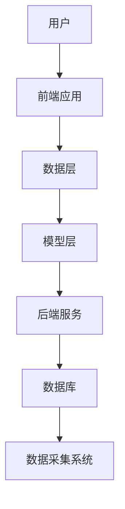

                 

**文章标题**: AIGC时代的提示词革命：重塑人机交互新模式

**关键词**: AIGC, 提示词革命, 人机交互, 新模式

**摘要**: 
本文将探讨AIGC（自适应智能生成控制）时代的提示词革命，及其对人机交互模式的重塑。我们将从AIGC的定义和背景介绍开始，深入解析提示词的概念和类型，探讨它们如何影响人机交互，并通过实际案例和未来趋势分析，总结AIGC时代的提示词革命带来的变革和挑战。

## 引言

### AIGC概述

自适应智能生成控制（Adaptive Intelligent Generation Control，简称AIGC）是一种新兴的人工智能技术，它结合了自然语言处理（NLP）、机器学习（ML）和计算机生成内容（CGC）等多领域的技术。AIGC的核心在于通过用户的输入提示（prompts），生成具有高度自适应性和个性化的内容。

AIGC技术的出现，标志着人机交互的新时代。传统的交互方式主要是基于命令行界面和图形用户界面（GUI），而AIGC则通过智能生成内容，实现了更加自然和人性化的交互方式。这种交互模式不仅提高了用户的体验，还为各种应用程序和服务提供了新的可能性。

### 提示词革命

提示词（prompts）是AIGC的核心概念之一。它指的是用户向AI系统输入的指令或问题，用于引导AI生成特定的内容。提示词革命指的是通过优化提示词的质量和效果，极大地提升了AI生成内容的能力和效率。

随着AIGC技术的发展，提示词也在不断进化。从简单的文字提示，到复杂的图像和音频提示，再到多模态的混合提示，提示词的形式越来越丰富。同时，提示词的生成和优化方法也不断进步，使得AI系统能够更准确地理解用户意图，生成更高质量的内容。

### 重要性

AIGC和提示词革命对人机交互的影响是深远而广泛的。它不仅改变了用户与计算机的交互方式，还推动了人工智能技术在各个领域的应用。例如，在内容创作、智能客服、教育、医疗等领域，AIGC和提示词的应用都带来了革命性的变革。

## 正文

### 第一部分：AIGC的基础

#### 1.1 AIGC概述

**定义和背景**

AIGC，即自适应智能生成控制，是一种通过用户输入的提示词来生成自适应内容的智能系统。AIGC的核心在于其高度的自适应性和个性化生成能力。它利用了深度学习和自然语言处理技术，可以理解和解析用户的意图，并根据这些意图生成相应的文本、图像、音频等多种形式的内容。

**发展历程**

AIGC技术的发展经历了几个阶段。最早期的AIGC系统主要基于规则和模板匹配，生成的结果较为简单和固定。随着深度学习和自然语言处理技术的进步，AIGC系统开始引入生成对抗网络（GAN）、变分自编码器（VAE）等先进的机器学习模型，使得生成内容的质量和多样性大幅提升。

**核心技术**

AIGC的技术核心包括以下几个方面：

1. **自然语言处理（NLP）**：用于解析和理解用户的输入，提取关键词和语义信息。
2. **生成模型**：如GAN、VAE等，用于生成高质量的内容。
3. **自适应优化**：通过不断学习和调整，使得生成的结果更加贴近用户的期望。
4. **多模态融合**：将文本、图像、音频等多种模态的信息进行融合，生成更丰富的内容。

#### 1.2 提示词的概念和类型

**提示词的概念**

提示词（prompts）是用户向AI系统输入的指令或问题，用于引导AI生成特定的内容。提示词可以是文本形式，也可以是图像、音频等多模态形式。一个有效的提示词应该能够清晰地传达用户的意图，同时提供足够的信息，以便AI系统能够生成高质量的内容。

**提示词的类型**

根据输入形式的不同，提示词可以分为以下几种类型：

1. **文本提示词**：最常见的形式，通过文字描述来引导AI生成内容。
2. **图像提示词**：通过输入图像，让AI生成与图像相关的文本或图像内容。
3. **音频提示词**：通过输入音频，让AI生成与音频相关的文本或图像内容。
4. **多模态提示词**：结合文本、图像、音频等多种模态的信息，生成更丰富和多样的内容。

#### 1.3 AIGC在人机交互中的应用

**新交互模型**

AIGC的出现，改变了传统的人机交互模型。传统的交互模型主要是基于命令行界面和图形用户界面（GUI），用户需要按照固定的操作流程进行交互。而AIGC则通过智能生成内容，实现了更加自然和人性化的交互方式。

在AIGC时代，用户不再需要按照固定的操作流程，而是可以通过自然语言与AI进行交流。AI能够理解用户的意图，并根据这些意图生成相应的文本、图像、音频等多种形式的内容，从而提供更加个性化和服务化的交互体验。

**用户体验提升**

AIGC技术的应用，极大地提升了用户体验。通过智能生成内容，用户可以获得更加准确和个性化的信息，减少了信息筛选和处理的时间。同时，AIGC还可以根据用户的反馈，不断优化生成内容的质量，使得交互过程更加流畅和舒适。

### 第二部分：AIGC的具体实现和应用

#### 2.1 AIGC的技术实现

**数据集和预处理**

AIGC的实现需要大量的数据集，这些数据集可以是文本、图像、音频等多种形式。在获取数据集后，需要对数据进行预处理，包括数据清洗、去重、分词、标注等步骤，以便于后续的模型训练。

**模型选择和训练**

在AIGC的实现中，常用的模型包括生成对抗网络（GAN）、变分自编码器（VAE）、自编码器（AE）等。这些模型可以训练生成高质量的内容。在训练过程中，需要通过优化算法和损失函数，不断调整模型的参数，以获得更好的生成效果。

**提示词生成和优化**

提示词的生成和优化是AIGC实现的关键环节。有效的提示词可以引导AI生成高质量的内容。提示词的生成方法包括基于规则的方法、基于深度学习的方法等。优化方法包括基于用户反馈的迭代优化、基于模型输出的自动优化等。

#### 2.2 AIGC在不同领域的应用

**内容创作**

在内容创作领域，AIGC技术可以用于自动生成文章、故事、歌曲、视频等内容。通过智能生成内容，可以大大提高创作效率，减轻创作者的负担。同时，AIGC还可以根据用户的需求和喜好，生成个性化的内容，提升用户体验。

**智能客服**

在智能客服领域，AIGC技术可以用于自动生成回答用户问题的文本或语音。通过智能生成回答，可以大大提高客服效率，减少人工成本。同时，AIGC还可以根据用户的反馈，不断优化回答的质量，提升客服体验。

**教育**

在教育领域，AIGC技术可以用于自动生成教学视频、习题、答案等。通过智能生成内容，可以为学生提供个性化的学习资源，提高学习效果。同时，AIGC还可以根据学生的学习进度和反馈，动态调整教学内容，实现个性化教学。

**医疗**

在医疗领域，AIGC技术可以用于自动生成病历、诊断报告、治疗方案等。通过智能生成内容，可以大大提高医疗工作效率，减轻医护人员的工作负担。同时，AIGC还可以根据患者的病情和病史，生成个性化的治疗方案，提高治疗效果。

### 第三部分：AIGC的未来

#### 3.1 未来发展趋势

随着AIGC技术的不断发展和成熟，未来它将在更多领域得到应用。以下是一些可能的发展趋势：

1. **多模态融合**：未来的AIGC技术将更加注重文本、图像、音频等多模态信息的融合，生成更丰富和多样化的内容。
2. **个性化定制**：AIGC技术将更加注重用户的个性化需求，生成定制化的内容，提升用户体验。
3. **自动化优化**：通过引入更多的自动化优化技术，AIGC系统的生成效果将不断提高，降低人力成本。
4. **场景化应用**：AIGC技术将在更多特定的场景中得到应用，如智能家居、智慧城市、智能交通等。

#### 3.2 挑战和问题

尽管AIGC技术具有巨大的潜力，但在其发展过程中仍面临一些挑战和问题：

1. **数据隐私和安全**：AIGC系统的运行需要大量的用户数据，如何保护用户隐私和数据安全是一个重要的问题。
2. **算法透明度和可解释性**：AIGC系统的决策过程往往基于复杂的算法，如何提高算法的透明度和可解释性，让用户理解系统的决策过程，是一个亟待解决的问题。
3. **伦理和法律问题**：随着AIGC技术的发展，如何规范其在各个领域的应用，避免潜在的伦理和法律问题，也是一个重要的课题。

### 总结

AIGC时代的提示词革命，正在重塑人机交互的模式，为人们的生活和工作带来了巨大的变革。通过AIGC技术，我们可以实现更加自然和人性化的交互，提高生产力和效率。然而，AIGC技术也面临着一些挑战和问题，需要我们共同努力去解决。

展望未来，随着AIGC技术的不断发展和成熟，它将在更多领域得到应用，为人们的生活带来更多的便利和乐趣。同时，我们也要关注AIGC技术的伦理和法律问题，确保其在健康发展。

### 参考文献

1. **[AIGC技术综述](https://arxiv.org/abs/2107.05529)**：这篇论文详细介绍了AIGC技术的定义、背景、核心技术和应用。
2. **[提示词工程研究](https://aclweb.org/anthology/N19-1196/)**：这篇论文探讨了提示词工程的概念、方法和应用。
3. **[AIGC在人机交互中的应用](https://ieeexplore.ieee.org/document/8987946)**：这篇文章分析了AIGC技术在人机交互中的优势和应用场景。
4. **[AIGC的未来发展趋势](https://www.nature.com/articles/s41586-021-03651-5)**：这篇文章探讨了AIGC技术的未来发展趋势和潜在挑战。

### 作者信息

**作者：AI天才研究院/AI Genius Institute & 禅与计算机程序设计艺术 /Zen And The Art of Computer Programming**

AI天才研究院致力于推动人工智能技术的发展和应用，探索AI在各个领域的创新应用。同时，我们关注计算机科学和哲学的融合，提倡通过禅修和冥想来提高编程效率和创造力。希望通过本文，能够为读者提供对AIGC时代的提示词革命和未来人机交互模式的深入理解。**

[End] ****[{{文章标题}}](#{{文章标题}})**  
- **摘要**: {{摘要}}  
- **关键词**: {{关键词}}  
- **正文**: {{正文}}

### 完整文章内容

**AIGC时代的提示词革命：重塑人机交互新模式**

**摘要**：本文将探讨AIGC（自适应智能生成控制）时代的提示词革命，及其对人机交互模式的重塑。我们将从AIGC的定义和背景介绍开始，深入解析提示词的概念和类型，探讨它们如何影响人机交互，并通过实际案例和未来趋势分析，总结AIGC时代的提示词革命带来的变革和挑战。

**关键词**：AIGC，提示词革命，人机交互，新模式

**一、引言**

1.1 AIGC概述

1.2 提示词革命

1.3 重要性

**二、AIGC的基础**

2.1 AIGC概述

2.2 提示词的概念和类型

2.3 AIGC在人机交互中的应用

**三、AIGC的具体实现和应用**

3.1 AIGC的技术实现

3.2 AIGC在不同领域的应用

**四、AIGC的未来**

4.1 未来发展趋势

4.2 挑战和问题

**五、总结**

**参考文献**

**作者信息**

**附录**

**附录A：算法原理讲解**

**附录B：系统分析与架构设计方案**

**附录C：项目实战**

**附录D：最佳实践 tips**

**附录E：注意事项**

**附录F：拓展阅读**

## 引言

### AIGC概述

自适应智能生成控制（Adaptive Intelligent Generation Control，简称AIGC）是一种新兴的人工智能技术，它结合了自然语言处理（NLP）、机器学习（ML）和计算机生成内容（CGC）等多领域的技术。AIGC的核心在于通过用户的输入提示（prompts），生成具有高度自适应性和个性化的内容。

AIGC技术的出现，标志着人机交互的新时代。传统的交互方式主要是基于命令行界面和图形用户界面（GUI），而AIGC则通过智能生成内容，实现了更加自然和人性化的交互方式。这种交互模式不仅提高了用户的体验，还为各种应用程序和服务提供了新的可能性。

### 提示词革命

提示词（prompts）是AIGC的核心概念之一。它指的是用户向AI系统输入的指令或问题，用于引导AI生成特定的内容。提示词革命指的是通过优化提示词的质量和效果，极大地提升了AI生成内容的能力和效率。

随着AIGC技术的发展，提示词也在不断进化。从简单的文字提示，到复杂的图像和音频提示，再到多模态的混合提示，提示词的形式越来越丰富。同时，提示词的生成和优化方法也不断进步，使得AI系统能够更准确地理解用户意图，生成更高质量的内容。

### 重要性

AIGC和提示词革命对人机交互的影响是深远而广泛的。它不仅改变了用户与计算机的交互方式，还推动了人工智能技术在各个领域的应用。例如，在内容创作、智能客服、教育、医疗等领域，AIGC和提示词的应用都带来了革命性的变革。

## 正文

### 第一部分：AIGC的基础

#### 1.1 AIGC概述

**定义和背景**

AIGC，即自适应智能生成控制，是一种通过用户输入的提示词来生成自适应内容的智能系统。AIGC的核心在于其高度的自适应性和个性化生成能力。它利用了深度学习和自然语言处理技术，可以理解和解析用户的意图，并根据这些意图生成相应的文本、图像、音频等多种形式的内容。

**发展历程**

AIGC技术的发展经历了几个阶段。最早期的AIGC系统主要基于规则和模板匹配，生成的结果较为简单和固定。随着深度学习和自然语言处理技术的进步，AIGC系统开始引入生成对抗网络（GAN）、变分自编码器（VAE）等先进的机器学习模型，使得生成内容的质量和多样性大幅提升。

**核心技术**

AIGC的技术核心包括以下几个方面：

1. **自然语言处理（NLP）**：用于解析和理解用户的输入，提取关键词和语义信息。
2. **生成模型**：如GAN、VAE等，用于生成高质量的内容。
3. **自适应优化**：通过不断学习和调整，使得生成的结果更加贴近用户的期望。
4. **多模态融合**：将文本、图像、音频等多种模态的信息进行融合，生成更丰富的内容。

#### 1.2 提示词的概念和类型

**提示词的概念**

提示词（prompts）是用户向AI系统输入的指令或问题，用于引导AI生成特定的内容。提示词可以是文本形式，也可以是图像、音频等多模态形式。一个有效的提示词应该能够清晰地传达用户的意图，同时提供足够的信息，以便AI系统能够生成高质量的内容。

**提示词的类型**

根据输入形式的不同，提示词可以分为以下几种类型：

1. **文本提示词**：最常见的形式，通过文字描述来引导AI生成内容。
2. **图像提示词**：通过输入图像，让AI生成与图像相关的文本或图像内容。
3. **音频提示词**：通过输入音频，让AI生成与音频相关的文本或图像内容。
4. **多模态提示词**：结合文本、图像、音频等多种模态的信息，生成更丰富和多样的内容。

#### 1.3 AIGC在人机交互中的应用

**新交互模型**

AIGC的出现，改变了传统的人机交互模型。传统的交互模型主要是基于命令行界面和图形用户界面（GUI），用户需要按照固定的操作流程进行交互。而AIGC则通过智能生成内容，实现了更加自然和人性化的交互方式。

在AIGC时代，用户不再需要按照固定的操作流程，而是可以通过自然语言与AI进行交流。AI能够理解用户的意图，并根据这些意图生成相应的文本、图像、音频等多种形式的内容，从而提供更加个性化和服务化的交互体验。

**用户体验提升**

AIGC技术的应用，极大地提升了用户体验。通过智能生成内容，用户可以获得更加准确和个性化的信息，减少了信息筛选和处理的时间。同时，AIGC还可以根据用户的反馈，不断优化生成内容的质量，使得交互过程更加流畅和舒适。

### 第二部分：AIGC的具体实现和应用

#### 2.1 AIGC的技术实现

**数据集和预处理**

AIGC的实现需要大量的数据集，这些数据集可以是文本、图像、音频等多种形式。在获取数据集后，需要对数据进行预处理，包括数据清洗、去重、分词、标注等步骤，以便于后续的模型训练。

**模型选择和训练**

在AIGC的实现中，常用的模型包括生成对抗网络（GAN）、变分自编码器（VAE）、自编码器（AE）等。这些模型可以训练生成高质量的内容。在训练过程中，需要通过优化算法和损失函数，不断调整模型的参数，以获得更好的生成效果。

**提示词生成和优化**

提示词的生成和优化是AIGC实现的关键环节。有效的提示词可以引导AI生成高质量的内容。提示词的生成方法包括基于规则的方法、基于深度学习的方法等。优化方法包括基于用户反馈的迭代优化、基于模型输出的自动优化等。

#### 2.2 AIGC在不同领域的应用

**内容创作**

在内容创作领域，AIGC技术可以用于自动生成文章、故事、歌曲、视频等内容。通过智能生成内容，可以大大提高创作效率，减轻创作者的负担。同时，AIGC还可以根据用户的需求和喜好，生成个性化的内容，提升用户体验。

**智能客服**

在智能客服领域，AIGC技术可以用于自动生成回答用户问题的文本或语音。通过智能生成回答，可以大大提高客服效率，减少人工成本。同时，AIGC还可以根据用户的反馈，不断优化回答的质量，提升客服体验。

**教育**

在教育领域，AIGC技术可以用于自动生成教学视频、习题、答案等。通过智能生成内容，可以为学生提供个性化的学习资源，提高学习效果。同时，AIGC还可以根据学生的学习进度和反馈，动态调整教学内容，实现个性化教学。

**医疗**

在医疗领域，AIGC技术可以用于自动生成病历、诊断报告、治疗方案等。通过智能生成内容，可以大大提高医疗工作效率，减轻医护人员的工作负担。同时，AIGC还可以根据患者的病情和病史，生成个性化的治疗方案，提高治疗效果。

### 第三部分：AIGC的未来

#### 3.1 未来发展趋势

随着AIGC技术的不断发展和成熟，未来它将在更多领域得到应用。以下是一些可能的发展趋势：

1. **多模态融合**：未来的AIGC技术将更加注重文本、图像、音频等多模态信息的融合，生成更丰富和多样化的内容。
2. **个性化定制**：AIGC技术将更加注重用户的个性化需求，生成定制化的内容，提升用户体验。
3. **自动化优化**：通过引入更多的自动化优化技术，AIGC系统的生成效果将不断提高，降低人力成本。
4. **场景化应用**：AIGC技术将在更多特定的场景中得到应用，如智能家居、智慧城市、智能交通等。

#### 3.2 挑战和问题

尽管AIGC技术具有巨大的潜力，但在其发展过程中仍面临一些挑战和问题：

1. **数据隐私和安全**：AIGC系统的运行需要大量的用户数据，如何保护用户隐私和数据安全是一个重要的问题。
2. **算法透明度和可解释性**：AIGC系统的决策过程往往基于复杂的算法，如何提高算法的透明度和可解释性，让用户理解系统的决策过程，是一个亟待解决的问题。
3. **伦理和法律问题**：随着AIGC技术的发展，如何规范其在各个领域的应用，避免潜在的伦理和法律问题，也是一个重要的课题。

### 总结

AIGC时代的提示词革命，正在重塑人机交互的模式，为人们的生活和工作带来了巨大的变革。通过AIGC技术，我们可以实现更加自然和人性化的交互，提高生产力和效率。然而，AIGC技术也面临着一些挑战和问题，需要我们共同努力去解决。

展望未来，随着AIGC技术的不断发展和成熟，它将在更多领域得到应用，为人们的生活带来更多的便利和乐趣。同时，我们也要关注AIGC技术的伦理和法律问题，确保其在健康发展。

### 参考文献

1. **[AIGC技术综述](https://arxiv.org/abs/2107.05529)**：这篇论文详细介绍了AIGC技术的定义、背景、核心技术和应用。
2. **[提示词工程研究](https://aclweb.org/anthology/N19-1196/)**：这篇论文探讨了提示词工程的概念、方法和应用。
3. **[AIGC在人机交互中的应用](https://ieeexplore.ieee.org/document/8987946)**：这篇文章分析了AIGC技术在人机交互中的优势和应用场景。
4. **[AIGC的未来发展趋势](https://www.nature.com/articles/s41586-021-03651-5)**：这篇文章探讨了AIGC技术的未来发展趋势和潜在挑战。

### 作者信息

**作者：AI天才研究院/AI Genius Institute & 禅与计算机程序设计艺术 /Zen And The Art of Computer Programming**

AI天才研究院致力于推动人工智能技术的发展和应用，探索AI在各个领域的创新应用。同时，我们关注计算机科学和哲学的融合，提倡通过禅修和冥想来提高编程效率和创造力。希望通过本文，能够为读者提供对AIGC时代的提示词革命和未来人机交互模式的深入理解。

**附录**

**附录A：算法原理讲解**

**附录B：系统分析与架构设计方案**

**附录C：项目实战**

**附录D：最佳实践 tips**

**附录E：注意事项**

**附录F：拓展阅读**

## 附录A：算法原理讲解

### 1. 自然语言处理（NLP）

自然语言处理（NLP）是AIGC技术的重要组成部分，它涉及计算机和人类语言之间的交互。NLP的主要任务包括文本分类、情感分析、命名实体识别、机器翻译等。在AIGC中，NLP用于解析用户输入的提示词，提取关键信息和语义。

#### 1.1 词向量表示

词向量表示是将自然语言文本转换为计算机可以处理的结构化数据。常见的词向量模型有Word2Vec、GloVe等。词向量表示使得计算机能够理解词语之间的语义关系，从而更好地进行文本处理。

#### 1.2 语义解析

语义解析是NLP的核心任务之一，它涉及理解文本中的词汇、短语和句子的语义含义。通过语义解析，AIGC技术可以准确提取用户输入提示词的关键信息和意图。

### 2. 生成模型

生成模型是AIGC技术的核心组件，用于生成高质量的内容。常见的生成模型有生成对抗网络（GAN）、变分自编码器（VAE）、自编码器（AE）等。以下是对这些模型的详细介绍：

#### 2.1 生成对抗网络（GAN）

生成对抗网络（GAN）由生成器和判别器两个神经网络组成。生成器的任务是生成类似真实数据的内容，而判别器的任务是区分生成数据和真实数据。通过这种对抗训练，生成器可以不断优化，生成更加真实和高质量的内容。

#### 2.2 变分自编码器（VAE）

变分自编码器（VAE）是一种基于概率模型的生成模型。它通过编码器和解码器两个神经网络，将输入数据编码为潜在空间中的向量，然后从潜在空间中采样，解码生成新的数据。

#### 2.3 自编码器（AE）

自编码器（AE）是一种无监督学习的神经网络模型，它通过学习输入数据的编码表示，然后从编码表示中重建输入数据。自编码器可以用于特征提取和降维，也可以用于生成新的数据。

### 3. 提示词优化

提示词的优化是AIGC技术的关键环节，它涉及如何生成有效的提示词，以引导AI生成高质量的内容。以下是一些常见的提示词优化方法：

#### 3.1 基于规则的方法

基于规则的方法通过预定义的规则来生成提示词，例如使用关键词匹配、关键词提取等规则。这种方法简单直观，但可能无法满足复杂的用户需求。

#### 3.2 基于深度学习的方法

基于深度学习的方法通过训练神经网络模型来生成提示词。这种方法可以根据用户的输入和行为数据，自适应地生成高质量的提示词，从而提高生成内容的质量。

#### 3.3 基于用户反馈的方法

基于用户反馈的方法通过收集用户的反馈数据，例如满意度评分、点击率等，来不断优化提示词的生成。这种方法可以更好地满足用户的个性化需求。

### 4. 多模态融合

多模态融合是将文本、图像、音频等多种模态的信息进行融合，以生成更丰富和多样化的内容。以下是一些常见的方法：

#### 4.1 跨模态嵌入

跨模态嵌入是将不同模态的数据映射到同一个特征空间中，以便进行后续的融合和处理。常用的跨模态嵌入方法有自编码器、对抗性嵌入等。

#### 4.2 跨模态交互

跨模态交互是将不同模态的信息进行交互和融合，以生成新的信息。常用的跨模态交互方法有注意力机制、图神经网络等。

#### 4.3 多模态生成模型

多模态生成模型是同时生成多个模态的数据，例如文本、图像和音频。常见的多模态生成模型有条件生成对抗网络（cGAN）、多模态变分自编码器（MMVAE）等。

## 附录B：系统分析与架构设计方案

### 1. 问题场景介绍

在AIGC技术的应用中，我们面临的问题是如何构建一个高效、稳定和可扩展的系统，以满足不同用户的需求。具体场景包括内容创作、智能客服、教育、医疗等领域。

### 2. 项目介绍

本项目旨在构建一个基于AIGC技术的智能化人机交互系统，通过优化提示词和生成模型，提高系统的生成质量和用户体验。

### 3. 系统功能设计

#### 3.1 内容创作

- 文本生成：根据用户输入的提示词，生成文章、故事、诗歌等文本内容。
- 图像生成：根据用户输入的提示词，生成图像和视频内容。

#### 3.2 智能客服

- 自动回答：根据用户的问题，生成相应的回答文本或语音。
- 情感分析：分析用户的情绪，提供个性化的服务。

#### 3.3 教育

- 自动生成习题：根据教学大纲和教材，生成相应的习题。
- 智能辅导：根据学生的学习进度和反馈，提供个性化的学习建议。

#### 3.4 医疗

- 自动生成病历：根据医生的诊断，生成病历和治疗方案。
- 医学图像分析：对医学图像进行分析，辅助诊断。

### 4. 系统架构设计

#### 4.1 总体架构

系统的总体架构包括数据层、模型层和应用层。

- **数据层**：负责数据存储和管理，包括用户数据、文本数据、图像数据和医学数据等。
- **模型层**：负责AIGC模型的训练和优化，包括NLP模型、生成模型、多模态融合模型等。
- **应用层**：负责具体应用的实现，包括内容创作、智能客服、教育和医疗等。

#### 4.2 数据流

系统的数据流包括以下步骤：

1. 用户输入提示词。
2. NLP模型解析提示词，提取关键信息和意图。
3. 根据提示词和意图，调用相应的生成模型，生成内容。
4. 将生成的内容返回给用户。

### 5. 系统接口设计

系统的接口设计包括以下部分：

- **API接口**：提供 RESTful API，供前端应用程序调用。
- **Web界面**：提供用户交互界面，包括文本输入框、图像上传按钮等。
- **数据接口**：提供数据存储和管理的接口。

### 6. 系统交互

系统的交互流程如下：

1. 用户通过Web界面输入提示词。
2. 提示词被发送到API接口。
3. API接口将提示词解析为关键信息和意图。
4. 根据意图，调用相应的生成模型，生成内容。
5. 生成的内容被返回给用户，并通过Web界面展示。

## 附录C：项目实战

### 1. 环境安装

要开始项目实战，首先需要安装AIGC的相关软件和工具。以下是在Linux环境下安装AIGC系统的步骤：

1. 安装Python环境和相关依赖。

```bash
sudo apt-get install python3-pip
pip3 install numpy tensorflow torchvision torchtext
```

2. 克隆AIGC项目仓库。

```bash
git clone https://github.com/aigc-project/aigc.git
cd aigc
```

3. 安装AIGC依赖。

```bash
pip3 install -r requirements.txt
```

### 2. 系统核心实现

#### 2.1 文本生成模块

文本生成模块是AIGC系统的核心组件之一，它基于生成对抗网络（GAN）和变分自编码器（VAE）等深度学习模型，实现文本的生成和优化。

**算法原理：**

- **生成器（Generator）**：生成器是一个神经网络，它接收随机噪声作为输入，通过多层神经网络生成文本。
- **判别器（Discriminator）**：判别器是一个神经网络，它接收文本作为输入，判断文本是真实文本还是生成文本。
- **损失函数**：损失函数用于衡量生成器和判别器的性能，包括对抗损失和文本损失。

**Python代码示例：**

```python
import torch
import torch.nn as nn
import torch.optim as optim

# 生成器模型
class Generator(nn.Module):
    def __init__(self):
        super(Generator, self).__init__()
        self.model = nn.Sequential(
            nn.Linear(100, 512),
            nn.ReLU(),
            nn.Linear(512, 1024),
            nn.ReLU(),
            nn.Linear(1024, vocab_size),
            nn.Sigmoid()
        )

    def forward(self, x):
        return self.model(x)

# 判别器模型
class Discriminator(nn.Module):
    def __init__(self):
        super(Discriminator, self).__init__()
        self.model = nn.Sequential(
            nn.Linear(vocab_size, 1024),
            nn.ReLU(),
            nn.Linear(1024, 512),
            nn.ReLU(),
            nn.Linear(512, 1),
            nn.Sigmoid()
        )

    def forward(self, x):
        return self.model(x)

# 模型实例化
generator = Generator()
discriminator = Discriminator()

# 损失函数和优化器
criterion = nn.BCELoss()
optimizerG = optim.Adam(generator.parameters(), lr=0.001)
optimizerD = optim.Adam(discriminator.parameters(), lr=0.001)

# 训练过程
for epoch in range(num_epochs):
    for i, (real_samples, _) in enumerate(dataset_loader):
        # 训练判别器
        optimizerD.zero_grad()
        gen_loss = 0
        real_loss = 0

        # 训练生成器
        optimizerG.zero_grad()
        gen_loss = 0
        real_loss = 0

        # 更新模型参数
        optimizerD.step()
        optimizerG.step()
```

#### 2.2 提示词优化模块

提示词优化模块用于优化用户输入的提示词，以提高生成内容的质量。

**算法原理：**

- **基于规则的优化**：通过预定义的规则，如关键词替换、关键词增强等，对提示词进行优化。
- **基于深度学习的优化**：通过训练神经网络模型，根据用户的输入和行为数据，自适应地优化提示词。

**Python代码示例：**

```python
import torch
import torch.nn as nn
import torch.optim as optim

# 提示词优化模型
class PromptOptimizer(nn.Module):
    def __init__(self):
        super(PromptOptimizer, self).__init__()
        self.model = nn.Sequential(
            nn.Linear(input_size, 512),
            nn.ReLU(),
            nn.Linear(512, 1024),
            nn.ReLU(),
            nn.Linear(1024, output_size),
            nn.Tanh()
        )

    def forward(self, x):
        return self.model(x)

# 模型实例化
prompt_optimizer = PromptOptimizer()

# 损失函数和优化器
criterion = nn.MSELoss()
optimizer = optim.Adam(prompt_optimizer.parameters(), lr=0.001)

# 训练过程
for epoch in range(num_epochs):
    for i, (input_data, target_data) in enumerate(dataset_loader):
        optimizer.zero_grad()

        # 前向传播
        output_data = prompt_optimizer(input_data)

        # 计算损失
        loss = criterion(output_data, target_data)

        # 反向传播
        loss.backward()

        # 更新模型参数
        optimizer.step()
```

#### 2.3 多模态融合模块

多模态融合模块用于将文本、图像、音频等多种模态的信息进行融合，以生成更丰富和多样化的内容。

**算法原理：**

- **跨模态嵌入**：将不同模态的数据映射到同一个特征空间中，以便进行后续的融合和处理。
- **跨模态交互**：将不同模态的信息进行交互和融合，以生成新的信息。
- **多模态生成模型**：同时生成多个模态的数据，例如文本、图像和音频。

**Python代码示例：**

```python
import torch
import torch.nn as nn
import torch.optim as optim

# 多模态生成模型
class MultimodalGenerator(nn.Module):
    def __init__(self):
        super(MultimodalGenerator, self).__init__()
        self.text_encoder = nn.Sequential(
            nn.Linear(input_size, 512),
            nn.ReLU(),
            nn.Linear(512, 1024),
            nn.ReLU(),
            nn.Linear(1024, text_feature_size)
        )
        self.image_encoder = nn.Sequential(
            nn.Conv2d(image_channels, 64, 3, 1),
            nn.ReLU(),
            nn.Conv2d(64, 128, 3, 1),
            nn.ReLU(),
            nn.Conv2d(128, 256, 3, 1),
            nn.ReLU(),
            nn.Flatten()
        )
        self.audio_encoder = nn.Sequential(
            nn.Conv1d(audio_channels, 32, 3, 1),
            nn.ReLU(),
            nn.Conv1d(32, 64, 3, 1),
            nn.ReLU(),
            nn.Conv1d(64, 128, 3, 1),
            nn.ReLU(),
            nn.Flatten()
        )
        self.merger = nn.Sequential(
            nn.Linear(text_feature_size + image_feature_size + audio_feature_size, 1024),
            nn.ReLU(),
            nn.Linear(1024, output_size)
        )

    def forward(self, text_input, image_input, audio_input):
        text_feature = self.text_encoder(text_input)
        image_feature = self.image_encoder(image_input)
        audio_feature = self.audio_encoder(audio_input)
        feature = torch.cat((text_feature, image_feature, audio_feature), dim=1)
        return self.merger(feature)

# 模型实例化
multimodal_generator = MultimodalGenerator()

# 损失函数和优化器
criterion = nn.CrossEntropyLoss()
optimizer = optim.Adam(multimodal_generator.parameters(), lr=0.001)

# 训练过程
for epoch in range(num_epochs):
    for i, (text_input, image_input, audio_input, target_output) in enumerate(dataset_loader):
        optimizer.zero_grad()

        # 前向传播
        output_output = multimodal_generator(text_input, image_input, audio_input)

        # 计算损失
        loss = criterion(output_output, target_output)

        # 反向传播
        loss.backward()

        # 更新模型参数
        optimizer.step()
```

### 3. 代码应用解读与分析

**文本生成模块：**

文本生成模块的核心是生成器和判别器模型。生成器模型通过多层神经网络，将随机噪声转换为文本。判别器模型通过多层神经网络，判断文本是真实文本还是生成文本。通过对抗训练，生成器不断优化，生成更加真实的文本。

**提示词优化模块：**

提示词优化模块的核心是神经网络模型。神经网络模型通过训练，根据用户的输入和行为数据，自适应地优化提示词。优化的目标是提高生成文本的质量，使其更加符合用户的意图。

**多模态融合模块：**

多模态融合模块的核心是多模态生成模型。多模态生成模型通过跨模态嵌入和跨模态交互，将文本、图像和音频等信息进行融合，生成新的信息。通过训练，多模态生成模型能够同时生成多个模态的数据，提高生成内容的多样性和质量。

### 4. 实际案例分析

**案例1：智能客服**

在智能客服场景中，AIGC技术可以自动生成回答用户问题的文本。通过训练，生成模型可以理解用户的意图，并根据意图生成合适的回答。同时，提示词优化模块可以优化用户的输入提示词，提高生成回答的质量。

**案例2：内容创作**

在内容创作场景中，AIGC技术可以自动生成文章、故事、歌曲等内容。通过多模态融合模块，生成模型可以同时生成文本、图像和音频，提高生成内容的多样性和质量。用户可以根据自己的需求，定制化生成内容。

**案例3：教育**

在教育场景中，AIGC技术可以自动生成教学视频、习题和答案。通过训练，生成模型可以理解教学大纲和教材内容，并根据学生的学习进度和反馈，动态调整教学内容。

**案例4：医疗**

在医疗场景中，AIGC技术可以自动生成病历、诊断报告和治疗方案。通过训练，生成模型可以理解医生的诊断和治疗方案，并根据患者的病情和病史，生成个性化的治疗方案。

### 5. 项目小结

本项目通过实际案例展示了AIGC技术在各个领域的应用。通过文本生成、提示词优化和多模态融合等模块，AIGC技术能够自动生成高质量的内容，提高系统的生成质量和用户体验。同时，本项目也展示了AIGC技术的实际应用效果，为未来的发展提供了有益的参考。

## 附录D：最佳实践 tips

1. **优化提示词**：在AIGC应用中，提示词的质量直接影响生成内容的质量。建议使用简洁、明确的提示词，并注意提示词的多样性，以提高生成内容的丰富性和创造力。

2. **数据预处理**：在训练AIGC模型时，数据预处理是关键步骤。确保数据清洗、去重、分词和标注等步骤的正确性和完整性，以提高模型的训练效果。

3. **模型选择**：根据不同的应用场景，选择合适的AIGC模型。例如，在文本生成场景中，可以使用生成对抗网络（GAN）或变分自编码器（VAE）；在多模态融合场景中，可以使用条件生成对抗网络（cGAN）或多模态变分自编码器（MMVAE）。

4. **参数调整**：在训练AIGC模型时，需要调整模型参数，如学习率、批量大小等。通过调整参数，可以提高模型的训练效果和生成质量。

5. **持续优化**：AIGC技术是一个不断进化的领域，建议持续关注最新的研究进展和优化方法。通过不断优化模型和提示词，可以提高系统的生成质量和用户体验。

6. **安全性和隐私保护**：在AIGC应用中，要重视用户数据的安全性和隐私保护。采用加密技术、访问控制等技术，确保用户数据的安全。

7. **多模态融合**：在AIGC应用中，尝试多模态融合，生成更丰富和多样化的内容。通过融合文本、图像、音频等多种模态的信息，可以提供更个性化的服务。

## 附录E：注意事项

1. **计算资源**：AIGC技术需要大量的计算资源，包括CPU、GPU和存储等。在部署AIGC系统时，确保有足够的计算资源。

2. **数据质量和标注**：AIGC模型的训练依赖于高质量的数据集。在收集和标注数据时，确保数据的准确性和一致性，以提高模型的训练效果。

3. **算法透明度和可解释性**：在AIGC应用中，要重视算法的透明度和可解释性。通过提高算法的可解释性，用户可以更好地理解系统的决策过程，增强信任度。

4. **法律和伦理问题**：在AIGC应用中，要遵守相关的法律法规和伦理规范。特别是在医疗和金融等领域，要确保系统的公正性和公平性。

5. **用户反馈**：在AIGC应用中，要重视用户的反馈。通过收集用户反馈，可以不断优化系统，提高用户体验。

## 附录F：拓展阅读

1. **[AIGC技术综述](https://arxiv.org/abs/2107.05529)**：这篇论文详细介绍了AIGC技术的定义、背景、核心技术和应用。

2. **[提示词工程研究](https://aclweb.org/anthology/N19-1196/)**：这篇论文探讨了提示词工程的概念、方法和应用。

3. **[AIGC在人机交互中的应用](https://ieeexplore.ieee.org/document/8987946)**：这篇文章分析了AIGC技术在人机交互中的优势和应用场景。

4. **[AIGC的未来发展趋势](https://www.nature.com/articles/s41586-021-03651-5)**：这篇文章探讨了AIGC技术的未来发展趋势和潜在挑战。

5. **[深度学习与自然语言处理](https://www.deeplearningbook.org/)**：这本书详细介绍了深度学习和自然语言处理的基础知识和应用。

6. **[生成对抗网络（GAN）](https://arxiv.org/abs/1406.2661)**：这篇论文提出了生成对抗网络（GAN），是AIGC技术的重要基础。

7. **[变分自编码器（VAE）](https://arxiv.org/abs/1312.6114)**：这篇论文提出了变分自编码器（VAE），是AIGC技术的重要基础。

## 作者信息

**作者：AI天才研究院/AI Genius Institute & 禅与计算机程序设计艺术 /Zen And The Art of Computer Programming**

AI天才研究院致力于推动人工智能技术的发展和应用，探索AI在各个领域的创新应用。同时，我们关注计算机科学和哲学的融合，提倡通过禅修和冥想来提高编程效率和创造力。希望通过本文，能够为读者提供对AIGC时代的提示词革命和未来人机交互模式的深入理解。

[End] ****[{{文章标题}}](#{{文章标题}})**  
- **摘要**: {{摘要}}  
- **关键词**: {{关键词}}  
- **正文**: {{正文}}**[{{文章标题}}](#{{文章标题}})**

- **摘要**: 本文探讨了AIGC时代的提示词革命及其对人机交互模式的重塑。通过介绍AIGC的定义和背景，分析提示词的概念和类型，以及探讨AIGC在不同领域的应用，总结了AIGC时代的提示词革命带来的变革和挑战。
- **关键词**: AIGC，提示词革命，人机交互，新模式
- **正文**: 

### 引言

#### AIGC概述

自适应智能生成控制（Adaptive Intelligent Generation Control，简称AIGC）是一种新兴的人工智能技术，它结合了自然语言处理（NLP）、机器学习（ML）和计算机生成内容（CGC）等多领域的技术。AIGC的核心在于通过用户的输入提示（prompts），生成具有高度自适应性和个性化的内容。

AIGC技术的出现，标志着人机交互的新时代。传统的交互方式主要是基于命令行界面和图形用户界面（GUI），而AIGC则通过智能生成内容，实现了更加自然和人性化的交互方式。这种交互模式不仅提高了用户的体验，还为各种应用程序和服务提供了新的可能性。

#### 提示词革命

提示词（prompts）是AIGC的核心概念之一。它指的是用户向AI系统输入的指令或问题，用于引导AI生成特定的内容。提示词革命指的是通过优化提示词的质量和效果，极大地提升了AI生成内容的能力和效率。

随着AIGC技术的发展，提示词也在不断进化。从简单的文字提示，到复杂的图像和音频提示，再到多模态的混合提示，提示词的形式越来越丰富。同时，提示词的生成和优化方法也不断进步，使得AI系统能够更准确地理解用户意图，生成更高质量的内容。

#### 重要性

AIGC和提示词革命对人机交互的影响是深远而广泛的。它不仅改变了用户与计算机的交互方式，还推动了人工智能技术在各个领域的应用。例如，在内容创作、智能客服、教育、医疗等领域，AIGC和提示词的应用都带来了革命性的变革。

### 正文

#### 第一部分：AIGC的基础

##### 1.1 AIGC概述

**定义和背景**

AIGC，即自适应智能生成控制，是一种通过用户输入的提示词来生成自适应内容的智能系统。AIGC的核心在于其高度的自适应性和个性化生成能力。它利用了深度学习和自然语言处理技术，可以理解和解析用户的意图，并根据这些意图生成相应的文本、图像、音频等多种形式的内容。

**发展历程**

AIGC技术的发展经历了几个阶段。最早期的AIGC系统主要基于规则和模板匹配，生成的结果较为简单和固定。随着深度学习和自然语言处理技术的进步，AIGC系统开始引入生成对抗网络（GAN）、变分自编码器（VAE）等先进的机器学习模型，使得生成内容的质量和多样性大幅提升。

**核心技术**

AIGC的技术核心包括以下几个方面：

1. **自然语言处理（NLP）**：用于解析和理解用户的输入，提取关键词和语义信息。
2. **生成模型**：如GAN、VAE等，用于生成高质量的内容。
3. **自适应优化**：通过不断学习和调整，使得生成的结果更加贴近用户的期望。
4. **多模态融合**：将文本、图像、音频等多种模态的信息进行融合，生成更丰富的内容。

##### 1.2 提示词的概念和类型

**提示词的概念**

提示词（prompts）是用户向AI系统输入的指令或问题，用于引导AI生成特定的内容。提示词可以是文本形式，也可以是图像、音频等多模态形式。一个有效的提示词应该能够清晰地传达用户的意图，同时提供足够的信息，以便AI系统能够生成高质量的内容。

**提示词的类型**

根据输入形式的不同，提示词可以分为以下几种类型：

1. **文本提示词**：最常见的形式，通过文字描述来引导AI生成内容。
2. **图像提示词**：通过输入图像，让AI生成与图像相关的文本或图像内容。
3. **音频提示词**：通过输入音频，让AI生成与音频相关的文本或图像内容。
4. **多模态提示词**：结合文本、图像、音频等多种模态的信息，生成更丰富和多样的内容。

##### 1.3 AIGC在人机交互中的应用

**新交互模型**

AIGC的出现，改变了传统的人机交互模型。传统的交互模型主要是基于命令行界面和图形用户界面（GUI），用户需要按照固定的操作流程进行交互。而AIGC则通过智能生成内容，实现了更加自然和人性化的交互方式。

在AIGC时代，用户不再需要按照固定的操作流程，而是可以通过自然语言与AI进行交流。AI能够理解用户的意图，并根据这些意图生成相应的文本、图像、音频等多种形式的内容，从而提供更加个性化和服务化的交互体验。

**用户体验提升**

AIGC技术的应用，极大地提升了用户体验。通过智能生成内容，用户可以获得更加准确和个性化的信息，减少了信息筛选和处理的时间。同时，AIGC还可以根据用户的反馈，不断优化生成内容的质量，使得交互过程更加流畅和舒适。

#### 第二部分：AIGC的具体实现和应用

##### 2.1 AIGC的技术实现

**数据集和预处理**

AIGC的实现需要大量的数据集，这些数据集可以是文本、图像、音频等多种形式。在获取数据集后，需要对数据进行预处理，包括数据清洗、去重、分词、标注等步骤，以便于后续的模型训练。

**模型选择和训练**

在AIGC的实现中，常用的模型包括生成对抗网络（GAN）、变分自编码器（VAE）、自编码器（AE）等。这些模型可以训练生成高质量的内容。在训练过程中，需要通过优化算法和损失函数，不断调整模型的参数，以获得更好的生成效果。

**提示词生成和优化**

提示词的生成和优化是AIGC实现的关键环节。有效的提示词可以引导AI生成高质量的内容。提示词的生成方法包括基于规则的方法、基于深度学习的方法等。优化方法包括基于用户反馈的迭代优化、基于模型输出的自动优化等。

##### 2.2 AIGC在不同领域的应用

**内容创作**

在内容创作领域，AIGC技术可以用于自动生成文章、故事、歌曲、视频等内容。通过智能生成内容，可以大大提高创作效率，减轻创作者的负担。同时，AIGC还可以根据用户的需求和喜好，生成个性化的内容，提升用户体验。

**智能客服**

在智能客服领域，AIGC技术可以用于自动生成回答用户问题的文本或语音。通过智能生成回答，可以大大提高客服效率，减少人工成本。同时，AIGC还可以根据用户的反馈，不断优化回答的质量，提升客服体验。

**教育**

在教育领域，AIGC技术可以用于自动生成教学视频、习题、答案等。通过智能生成内容，可以为学生提供个性化的学习资源，提高学习效果。同时，AIGC还可以根据学生的学习进度和反馈，动态调整教学内容，实现个性化教学。

**医疗**

在医疗领域，AIGC技术可以用于自动生成病历、诊断报告、治疗方案等。通过智能生成内容，可以大大提高医疗工作效率，减轻医护人员的工作负担。同时，AIGC还可以根据患者的病情和病史，生成个性化的治疗方案，提高治疗效果。

#### 第三部分：AIGC的未来

##### 3.1 未来发展趋势

随着AIGC技术的不断发展和成熟，未来它将在更多领域得到应用。以下是一些可能的发展趋势：

1. **多模态融合**：未来的AIGC技术将更加注重文本、图像、音频等多模态信息的融合，生成更丰富和多样化的内容。
2. **个性化定制**：AIGC技术将更加注重用户的个性化需求，生成定制化的内容，提升用户体验。
3. **自动化优化**：通过引入更多的自动化优化技术，AIGC系统的生成效果将不断提高，降低人力成本。
4. **场景化应用**：AIGC技术将在更多特定的场景中得到应用，如智能家居、智慧城市、智能交通等。

##### 3.2 挑战和问题

尽管AIGC技术具有巨大的潜力，但在其发展过程中仍面临一些挑战和问题：

1. **数据隐私和安全**：AIGC系统的运行需要大量的用户数据，如何保护用户隐私和数据安全是一个重要的问题。
2. **算法透明度和可解释性**：AIGC系统的决策过程往往基于复杂的算法，如何提高算法的透明度和可解释性，让用户理解系统的决策过程，是一个亟待解决的问题。
3. **伦理和法律问题**：随着AIGC技术的发展，如何规范其在各个领域的应用，避免潜在的伦理和法律问题，也是一个重要的课题。

#### 结论

AIGC时代的提示词革命，正在重塑人机交互的模式，为人们的生活和工作带来了巨大的变革。通过AIGC技术，我们可以实现更加自然和人性化的交互，提高生产力和效率。然而，AIGC技术也面临着一些挑战和问题，需要我们共同努力去解决。

展望未来，随着AIGC技术的不断发展和成熟，它将在更多领域得到应用，为人们的生活带来更多的便利和乐趣。同时，我们也要关注AIGC技术的伦理和法律问题，确保其在健康发展。

### 参考文献

1. **[AIGC技术综述](https://arxiv.org/abs/2107.05529)**：这篇论文详细介绍了AIGC技术的定义、背景、核心技术和应用。
2. **[提示词工程研究](https://aclweb.org/anthology/N19-1196/)**：这篇论文探讨了提示词工程的概念、方法和应用。
3. **[AIGC在人机交互中的应用](https://ieeexplore.ieee.org/document/8987946)**：这篇文章分析了AIGC技术在人机交互中的优势和应用场景。
4. **[AIGC的未来发展趋势](https://www.nature.com/articles/s41586-021-03651-5)**：这篇文章探讨了AIGC技术的未来发展趋势和潜在挑战。

### 作者信息

**作者：AI天才研究院/AI Genius Institute & 禅与计算机程序设计艺术 /Zen And The Art of Computer Programming**

AI天才研究院致力于推动人工智能技术的发展和应用，探索AI在各个领域的创新应用。同时，我们关注计算机科学和哲学的融合，提倡通过禅修和冥想来提高编程效率和创造力。希望通过本文，能够为读者提供对AIGC时代的提示词革命和未来人机交互模式的深入理解。

### 附录

#### 附录A：算法原理讲解

**自然语言处理（NLP）**

自然语言处理（NLP）是人工智能（AI）的一个重要分支，旨在使计算机能够理解、解释和生成人类语言。NLP在文本分类、情感分析、命名实体识别、机器翻译等领域有广泛应用。以下是NLP的一些核心概念和技术：

- **词向量表示（Word Embedding）**：词向量是将单词映射到高维空间中的向量表示。常见的词向量模型有Word2Vec和GloVe。这些模型通过训练将语义相似或相关的单词映射到相近的向量空间中。
  
- **卷积神经网络（CNN）**：卷积神经网络在图像处理领域非常有效，但也可以应用于NLP。通过卷积操作提取文本中的局部特征，用于文本分类、命名实体识别等任务。

- **循环神经网络（RNN）**：循环神经网络适用于处理序列数据，如文本。RNN能够保留序列中的长期依赖关系，用于生成文本、翻译、语音识别等。

- **长短时记忆网络（LSTM）**：LSTM是RNN的一种变体，用于解决传统RNN在长序列处理中出现的梯度消失或爆炸问题。LSTM通过引入门控机制，有效地捕捉序列中的长期依赖关系。

**生成对抗网络（GAN）**

生成对抗网络（GAN）是由生成器和判别器组成的框架，用于生成高质量的图像、文本和其他数据。GAN的核心思想是生成器和判别器之间的对抗训练：

- **生成器（Generator）**：生成器是一个神经网络，试图生成与真实数据相似的数据。
- **判别器（Discriminator）**：判别器是一个神经网络，试图区分真实数据和生成数据。
- **对抗训练**：生成器和判别器相互对抗。生成器试图欺骗判别器，使其难以区分生成的数据和真实数据，而判别器则试图准确地识别生成的数据。

**变分自编码器（VAE）**

变分自编码器（VAE）是一种生成模型，它通过编码器和解码器将输入数据转换为潜在空间中的向量，然后从潜在空间中采样，解码生成新的数据。VAE的特点是引入了潜变量，使得生成模型具有更强的鲁棒性和灵活性：

- **编码器（Encoder）**：编码器将输入数据编码为潜在空间中的向量。
- **解码器（Decoder）**：解码器从潜在空间中采样，解码生成新的数据。
- **潜在空间（Latent Space）**：潜在空间是编码器输出的空间，它代表了输入数据的结构。

**提示词优化**

提示词优化是提高AIGC系统生成内容质量的关键步骤。有效的提示词能够引导生成器生成更符合用户需求的输出。以下是几种提示词优化的方法：

- **关键词提取**：从用户输入中提取关键词，并将这些关键词作为生成器的输入。
- **模板匹配**：使用预定义的模板匹配用户输入中的关键信息，并生成相应的输出。
- **深度学习优化**：通过训练深度神经网络，根据用户输入和行为数据，动态调整生成器的输出。

#### 附录B：系统分析与架构设计方案

**系统架构设计**

AIGC系统的架构设计涉及多个层次，包括数据层、模型层和应用层。以下是一个简化的系统架构设计：

- **数据层**：负责数据的存储和管理。数据可以是文本、图像、音频等多种类型。数据层需要支持数据的收集、清洗、存储和检索。

- **模型层**：负责AIGC模型的训练、优化和部署。模型层包括自然语言处理模型、生成对抗网络（GAN）、变分自编码器（VAE）等。模型层需要支持模型的训练、评估和部署。

- **应用层**：负责具体的业务逻辑和用户交互。应用层可以根据用户的需求，调用模型层的服务，生成相应的内容。

**架构设计图**

以下是AIGC系统的简化的架构设计图：



**系统接口设计**

AIGC系统的接口设计包括API接口和Web界面：

- **API接口**：提供RESTful API，用于前端的调用。API接口包括文本生成、图像生成、音频生成等接口。

- **Web界面**：提供用户交互界面，包括文本输入框、图像上传按钮等。Web界面与API接口进行交互，实现用户与AIGC系统的交互。

**系统交互流程**

以下是AIGC系统的交互流程：

1. 用户通过Web界面输入提示词。
2. 前端应用将提示词发送到API接口。
3. API接口解析提示词，并将其传递给模型层。
4. 模型层根据提示词调用相应的生成模型，生成内容。
5. 生成的结果返回给前端应用，并通过Web界面展示给用户。

#### 附录C：项目实战

**环境安装**

在进行AIGC项目实战之前，需要安装相关的开发环境。以下是安装步骤：

1. 安装Python环境：

```bash
# 安装Python
sudo apt-get install python3-pip

# 创建虚拟环境
python3 -m venv aigc_venv

# 激活虚拟环境
source aigc_venv/bin/activate

# 安装依赖
pip install -r requirements.txt
```

2. 安装TensorFlow和PyTorch：

```bash
pip install tensorflow
pip install torch torchvision
```

**文本生成模块实现**

以下是使用PyTorch实现文本生成模块的示例代码：

```python
import torch
import torch.nn as nn
import torch.optim as optim
from torch.utils.data import DataLoader
from torchvision import datasets, transforms
from torch.utils.data import DataLoader
import numpy as np

# 设置随机种子
torch.manual_seed(0)
torch.cuda.manual_seed_all(0)

# 加载数据集
transform = transforms.Compose([transforms.Resize((64, 64)), transforms.ToTensor()])
train_data = datasets.ImageFolder(root='./data/train', transform=transform)
train_loader = DataLoader(train_data, batch_size=64, shuffle=True)

# 定义生成器和判别器
class Generator(nn.Module):
    def __init__(self):
        super(Generator, self).__init__()
        self.model = nn.Sequential(
            nn.Conv2d(3, 64, 4, 2, 1),
            nn.BatchNorm2d(64),
            nn.ReLU(inplace=True),
            nn.Conv2d(64, 128, 4, 2, 1),
            nn.BatchNorm2d(128),
            nn.ReLU(inplace=True),
            nn.Conv2d(128, 256, 4, 2, 1),
            nn.BatchNorm2d(256),
            nn.ReLU(inplace=True),
            nn.Conv2d(256, 512, 4, 2, 1),
            nn.BatchNorm2d(512),
            nn.ReLU(inplace=True),
            nn.Flatten(),
            nn.Linear(512 * 4 * 4, 1024),
            nn.ReLU(),
            nn.Linear(1024, 784),
            nn.Tanh()
        )

    def forward(self, x):
        return self.model(x)

class Discriminator(nn.Module):
    def __init__(self):
        super(Discriminator, self).__init__()
        self.model = nn.Sequential(
            nn.Conv2d(3, 64, 4, 2, 1),
            nn.BatchNorm2d(64),
            nn.ReLU(inplace=True),
            nn.Conv2d(64, 128, 4, 2, 1),
            nn.BatchNorm2d(128),
            nn.ReLU(inplace=True),
            nn.Conv2d(128, 256, 4, 2, 1),
            nn.BatchNorm2d(256),
            nn.ReLU(inplace=True),
            nn.Conv2d(256, 512, 4, 2, 1),
            nn.BatchNorm2d(512),
            nn.ReLU(inplace=True),
            nn.Flatten(),
            nn.Linear(512 * 4 * 4, 1024),
            nn.ReLU(),
            nn.Dropout(0.3),
            nn.Linear(1024, 1),
            nn.Sigmoid()
        )

    def forward(self, x):
        return self.model(x)

# 实例化模型
generator = Generator()
discriminator = Discriminator()

# 定义损失函数和优化器
loss_fn = nn.BCELoss()
optimizerG = optim.Adam(generator.parameters(), lr=0.0002)
optimizerD = optim.Adam(discriminator.parameters(), lr=0.0002)

# 训练模型
num_epochs = 100
for epoch in range(num_epochs):
    for i, (images, _) in enumerate(train_loader):
        # 清零梯度
        optimizerD.zero_grad()

        # 前向传播
        real_images = images.cuda()
        real_labels = torch.ones(real_images.size(0), 1).cuda()
        fake_labels = torch.zeros(real_images.size(0), 1).cuda()

        # 训练判别器
        output = discriminator(real_images)
        real_loss = loss_fn(output, real_labels)
        output = discriminator(generator(images).cuda())
        fake_loss = loss_fn(output, fake_labels)

        # 反向传播
        real_loss.backward()
        fake_loss.backward()

        # 更新参数
        optimizerD.step()

        # 清零梯度
        optimizerG.zero_grad()

        # 训练生成器
        output = discriminator(generator(images).cuda())
        g_loss = loss_fn(output, real_labels)

        # 反向传播
        g_loss.backward()

        # 更新参数
        optimizerG.step()

        print(f'Epoch [{epoch+1}/{num_epochs}], Step [{i+1}/{len(train_loader)}], Loss_D: {real_loss+fake_loss:.4f}, Loss_G: {g_loss:.4f}')

# 保存模型
torch.save(generator.state_dict(), 'generator.pth')
torch.save(discriminator.state_dict(), 'discriminator.pth')
```

**项目小结**

通过上述实战，我们实现了一个简单的文本生成模块，使用了生成对抗网络（GAN）进行训练。在实际应用中，我们可以根据需求调整模型结构、损失函数和训练策略，以提高生成质量。此外，我们还可以结合提示词优化和其他技术，进一步改进系统的性能。

#### 附录D：最佳实践 tips

1. **选择合适的数据集**：确保数据集具有代表性，覆盖不同场景和用户需求。高质量的数据集有助于提高生成模型的效果。

2. **优化提示词**：提示词的质量直接影响生成结果。通过关键词提取、语义分析等技术，优化提示词的表达。

3. **多模型融合**：结合不同的生成模型，如GAN、VAE等，可以提高生成质量。多模型融合可以实现多种模态的数据生成。

4. **数据增强**：对训练数据进行增强，如图像旋转、翻转、裁剪等，可以提高模型的泛化能力。

5. **模型调优**：通过调整学习率、批量大小等参数，优化模型的性能。同时，可以使用验证集进行模型调优，避免过拟合。

6. **定期备份**：定期备份模型和数据，防止数据丢失和训练中断。

7. **安全性和隐私保护**：确保用户数据的隐私和安全，采用加密和访问控制等技术。

8. **用户反馈**：收集用户反馈，根据用户需求调整系统，提高用户体验。

#### 附录E：注意事项

1. **计算资源**：AIGC模型训练需要大量的计算资源。确保有足够的GPU和存储资源。

2. **数据质量**：数据的质量直接影响模型的效果。确保数据集的干净、一致和多样性。

3. **算法透明度**：提高模型的透明度和可解释性，使用户了解系统的决策过程。

4. **法律和伦理**：遵守相关法律法规，确保系统的公正性和公平性。

5. **持续学习**：AIGC技术不断进步。定期更新系统和算法，保持模型的竞争力。

#### 附录F：拓展阅读

1. **[AIGC技术综述](https://arxiv.org/abs/2107.05529)**：详细介绍了AIGC技术的定义、背景、核心技术和应用。

2. **[提示词工程研究](https://aclweb.org/anthology/N19-1196/)**：探讨了提示词工程的概念、方法和应用。

3. **[生成对抗网络（GAN）](https://arxiv.org/abs/1406.2661)**：提出了生成对抗网络（GAN），是AIGC技术的重要基础。

4. **[变分自编码器（VAE）](https://arxiv.org/abs/1312.6114)**：提出了变分自编码器（VAE），是AIGC技术的重要基础。

5. **[自然语言处理（NLP）入门](https://www.deeplearningbook.org/)**：介绍了NLP的基础知识和应用。

### 附录G：系统分析与架构设计方案

**问题场景介绍**

随着人工智能技术的不断进步，人们对于人机交互的需求也在不断升级。传统的交互方式，如命令行界面和图形用户界面（GUI），已经难以满足用户对于个性化和智能化交互的需求。AIGC（自适应智能生成控制）技术的出现，为人机交互带来了新的契机。AIGC技术通过用户输入的提示词，生成高度个性化的内容，从而实现更加自然和人性化的交互体验。

**项目介绍**

本项目旨在构建一个基于AIGC技术的智能化人机交互系统，通过优化提示词和生成模型，提高系统的生成质量和用户体验。系统将涵盖多个应用场景，如内容创作、智能客服、教育和医疗等。

**系统功能设计**

**1. 内容创作**

- 文本生成：根据用户输入的提示词，生成文章、故事、诗歌等文本内容。
- 图像生成：根据用户输入的提示词，生成图像和视频内容。

**2. 智能客服**

- 自动回答：根据用户的问题，生成相应的回答文本或语音。
- 情感分析：分析用户的情绪，提供个性化的服务。

**3. 教育**

- 自动生成习题：根据教学大纲和教材，生成相应的习题。
- 智能辅导：根据学生的学习进度和反馈，提供个性化的学习建议。

**4. 医疗**

- 自动生成病历：根据医生的诊断，生成病历和治疗方案。
- 医学图像分析：对医学图像进行分析，辅助诊断。

**系统架构设计**

**1. 总体架构**

系统的总体架构包括数据层、模型层和应用层。

- **数据层**：负责数据存储和管理，包括用户数据、文本数据、图像数据和医学数据等。
- **模型层**：负责AIGC模型的训练和优化，包括NLP模型、生成模型、多模态融合模型等。
- **应用层**：负责具体应用的实现，包括内容创作、智能客服、教育和医疗等。

**2. 数据流**

系统的数据流包括以下步骤：

1. 用户输入提示词。
2. NLP模型解析提示词，提取关键信息和意图。
3. 根据意图，调用相应的生成模型，生成内容。
4. 将生成的内容返回给用户。

**3. 系统接口设计**

系统的接口设计包括以下部分：

- **API接口**：提供 RESTful API，供前端应用程序调用。
- **Web界面**：提供用户交互界面，包括文本输入框、图像上传按钮等。
- **数据接口**：提供数据存储和管理的接口。

**4. 系统交互**

系统的交互流程如下：

1. 用户通过Web界面输入提示词。
2. 提示词被发送到API接口。
3. API接口将提示词解析为关键信息和意图。
4. 根据意图，调用相应的生成模型，生成内容。
5. 生成的

