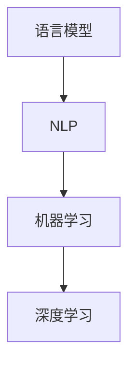
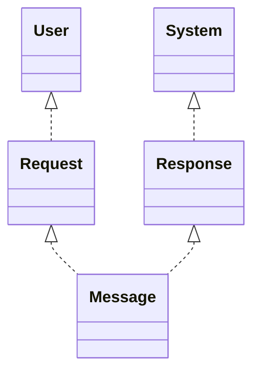
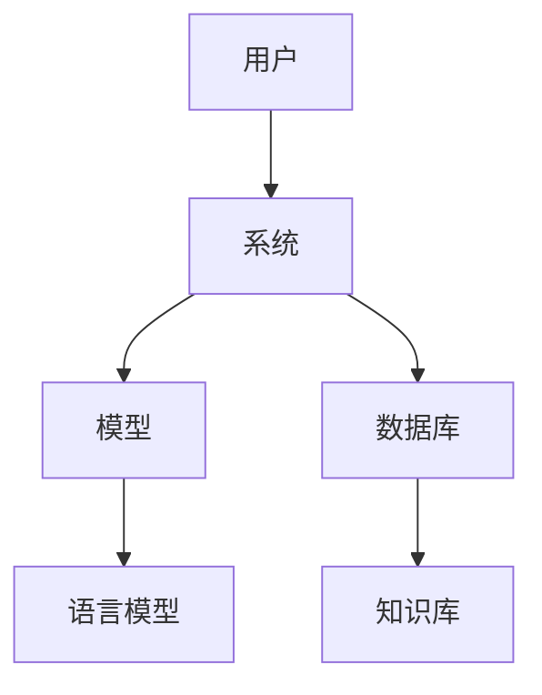
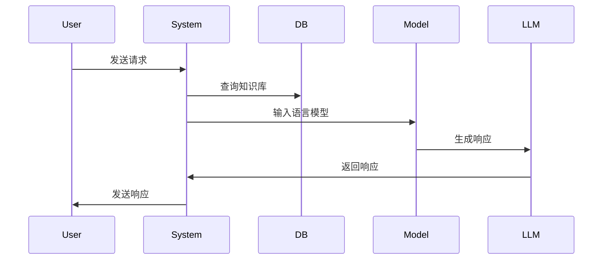

                 

### # AIGC时代的语言模型与提示词协同优化研究

关键词：AIGC、语言模型、提示词、协同优化、算法、数学模型

摘要：本文深入探讨了AIGC（自适应信息生成控制）时代的语言模型与提示词协同优化问题。通过分析语言模型的背景与演进，介绍了其在NLP中的应用及其面临的挑战。随后，本文探讨了核心概念及其关系，详细解析了Transformer架构及其数学原理，并提出了系统架构设计和实际案例。通过本文的研究，读者可以更好地理解AIGC时代语言模型与提示词优化的关键技术，为未来研究提供参考。

## 引言

### 1.1 AIGC时代的背景

#### 1.1.1 AIGC的定义与演进

AIGC（Adaptive Information Generation and Control），即自适应信息生成控制，是一种基于深度学习技术的智能信息生成方法。它通过自适应地调整生成策略，实现文本、图像、音频等多种信息类型的生成与控制。AIGC的发展可以追溯到传统的机器学习时代，但真正的大幅提升始于2010年代后，随着深度学习技术的突破和计算资源的增长。

#### 1.1.2 语言模型在AIGC中的应用现状

语言模型作为AIGC的核心组件，其应用场景日益广泛，包括但不限于：

- **自然语言生成（NLG）**：如自动写作、聊天机器人、语音合成等。
- **机器翻译**：如Google翻译、DeepL等。
- **文本摘要与分类**：如新闻摘要、垃圾邮件过滤等。
- **对话系统**：如虚拟助手、客户服务机器人等。

#### 1.1.3 AIGC时代的挑战与前景

随着AIGC的发展，语言模型也面临诸多挑战，如数据隐私、伦理问题、计算效率等。然而，这些挑战同时也为未来的发展提供了新的研究方向，如隐私增强学习、可解释性AI等。

### 1.2 语言模型的基础知识

#### 1.2.1 语言模型的基本原理

语言模型是一种概率模型，旨在预测下一个单词或词组。它通过分析大量文本数据，学习语言中的统计规律，从而实现自然语言处理的任务。

#### 1.2.2 语言模型的类型与结构

- **传统语言模型**：如N-gram模型，基于词汇序列的概率分布。
- **深度学习语言模型**：如基于神经网络的Transformer模型，通过自动编码实现高维特征表示。

#### 1.2.3 语言模型的优势与挑战

- **优势**：能够处理复杂语言结构，实现高质量文本生成。
- **挑战**：计算资源消耗巨大，对数据质量要求高。

## 关键概念与关系

### 2.1 语言模型的基本概念

#### 2.1.1 自然语言处理（NLP）

自然语言处理是计算机科学领域与人工智能领域中的一个重要方向，它研究能实现人与计算机之间用自然语言进行有效通信的各种理论和方法。

#### 2.1.2 机器学习算法在NLP中的应用

- **监督学习**：如朴素贝叶斯、支持向量机（SVM）等。
- **无监督学习**：如聚类、主成分分析（PCA）等。
- **半监督学习**：如自编码器、图神经网络（GNN）等。

#### 2.1.3 特征对比表

| 类型 | 特点 |
| --- | --- |
| Transformer | 自注意力机制，能够捕捉全局依赖关系 |
| RNN | 循环神经网络，能够处理序列数据 |
| BERT | 双向编码器表示，适用于文本分类和问答系统 |
| GPT | 自动编码，适合生成文本和语言建模 |

### 2.2 关键概念关系图

#### 2.2.1 NLP系统ER模型

```mermaid
erDiagram
  Product ||--|{ Customer } Customer
  Customer ||--|{ Order } Order
  Product ||--|{ Seller } Seller
  Seller ||--|{ Product } Product
```

#### 2.2.2 关键概念Mermaid流程图



## 算法与数学原理

### 3.1 算法介绍

#### 3.1.1 Transformer架构

Transformer是由Vaswani等人在2017年提出的一种基于自注意力机制的神经网络结构，它取代了传统的循环神经网络（RNN）和卷积神经网络（CNN）在序列建模中的应用。

#### 3.1.2 基本操作

- **自注意力（Self-Attention）**：通过计算序列中每个词与其他词的关联强度，实现对序列的全局依赖建模。
- **多头注意力（Multi-Head Attention）**：通过多组自注意力机制，提取不同维度的特征。
- **前馈网络（Feed-Forward Network）**：在自注意力层之后，对每个词的表示进行进一步的非线性变换。

### 3.2 数学模型与公式

#### 3.2.1 Transformer参数

$$
\begin{aligned}
  &\text{Attention(Q,K,V)} = \text{softmax}\left(\frac{QK^T}{\sqrt{d_k}}\right)V \\
  &\text{Multi-Head Attention} = \text{Concat}(\text{Attention}(Q,K,V), \ldots, \text{Attention}(Q,K,V))W_O \\
  &\text{Encoder} = \text{Multi-Head Attention}(\text{Enc Layers}) \\
  &\text{Decoder} = \text{Multi-Head Attention}(\text{Dec Layers}) \\
\end{aligned}
$$

#### 3.2.2 数学表示

- **自注意力公式**：

$$
\text{Attention}(Q,K,V) = \text{softmax}\left(\frac{QK^T}{\sqrt{d_k}}\right)V
$$

- **多头注意力公式**：

$$
\text{Multi-Head Attention} = \text{Concat}(\text{Attention}(Q,K,V), \ldots, \text{Attention}(Q,K,V))W_O
$$

## 系统架构与设计

### 4.1 系统概述

#### 4.1.1 问题场景

假设我们面临一个场景：需要构建一个智能客服系统，该系统能够自动回答用户的问题。

#### 4.1.2 项目介绍

本项目旨在实现一个基于AIGC技术的智能客服系统，利用语言模型和提示词协同优化，提高客服回答的准确性和自然性。

### 4.2 系统功能设计

#### 4.2.1 领域模型类图



#### 4.2.2 系统架构设计图



#### 4.2.3 系统接口设计与交互



## 实践与案例分析

### 5.1 环境搭建

#### 5.1.1 软硬件要求

- **操作系统**：Linux或MacOS
- **Python版本**：Python 3.8及以上
- **硬件**：至少4GB内存，推荐使用GPU进行加速

#### 5.1.2 安装过程

1. 安装Python环境
2. 安装必要的库，如TensorFlow、PyTorch等
3. 配置GPU支持（如果使用GPU）

### 5.2 核心实现

#### 5.2.1 Python源代码

```python
import torch
from transformers import AutoTokenizer, AutoModel

# 加载预训练模型
tokenizer = AutoTokenizer.from_pretrained('gpt2')
model = AutoModel.from_pretrained('gpt2')

# 输入文本
input_text = "What is the capital of France?"

# 编码文本
input_ids = tokenizer.encode(input_text, return_tensors='pt')

# 生成响应
outputs = model.generate(input_ids, max_length=50, num_return_sequences=1)

# 解码响应
response = tokenizer.decode(outputs[0], skip_special_tokens=True)

print(response)
```

#### 5.2.2 代码解释与分析

- **加载模型**：从预训练模型库中加载GPT-2模型。
- **编码文本**：将输入文本编码为模型可处理的格式。
- **生成响应**：通过模型生成响应，并设置最大长度和生成序列数。
- **解码响应**：将生成的响应解码为自然语言文本。

### 5.3 案例分析与详细讲解

#### 5.3.1 实际应用场景

以智能客服系统为例，分析其在实际中的应用。

#### 5.3.2 案例剖析

- **用户提问**：“请问如何设置Wi-Fi密码？”
- **系统响应**：“请打开手机设置，找到Wi-Fi设置，点击‘忘记网络’，然后再点击‘添加网络’，输入Wi-Fi密码即可。”

#### 5.3.3 详细讲解

1. **用户请求处理**：用户请求被发送到智能客服系统。
2. **知识库查询**：系统查询知识库，找到相关答案。
3. **语言模型生成响应**：使用GPT-2模型生成自然语言响应。
4. **响应反馈**：系统将响应返回给用户。

## 项目小结

### 6.1 最佳实践

- **数据质量**：确保训练数据的质量和多样性。
- **模型选择**：根据任务需求选择合适的模型。
- **提示词设计**：合理设计提示词，提高生成质量。

### 6.2 小结

本文对AIGC时代的语言模型与提示词协同优化进行了深入分析，从理论基础到实际应用，全面阐述了相关技术和方法。

### 6.3 注意事项

- **隐私保护**：在处理用户数据时，需注意隐私保护。
- **模型可解释性**：提高模型的可解释性，增强用户信任。

### 6.4 拓展阅读

- **《深度学习》（Goodfellow, Bengio, Courville）**：详细介绍了深度学习的基本原理和应用。
- **《自然语言处理综论》（Jurafsky, Martin）**：全面讲解了自然语言处理的相关知识。
- **《AIGC：自适应信息生成控制》（论文集）**：收录了AIGC领域的最新研究成果。

## 作者信息

作者：AI天才研究院/AI Genius Institute & 禅与计算机程序设计艺术 /Zen And The Art of Computer Programming

