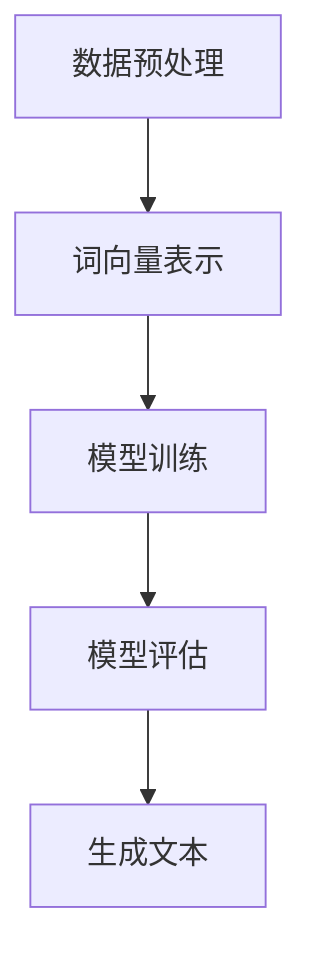
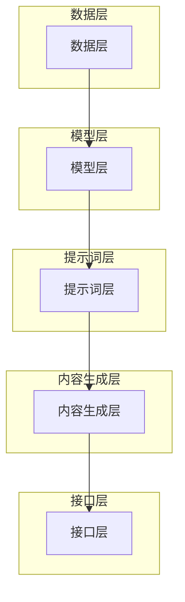
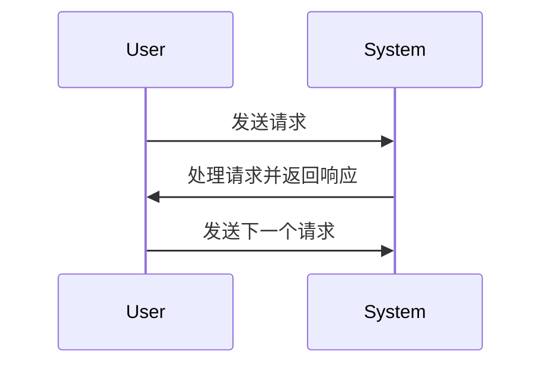

                 

# AIGC时代的语言模型与提示词协同设计

> 关键词：AIGC、语言模型、提示词协同设计、算法原理、系统架构、项目实战、最佳实践

> 摘要：随着AIGC（人工智能生成内容）时代的到来，语言模型与提示词协同设计成为提升AI生成内容质量和效率的关键。本文将从AIGC的概念与特征出发，详细探讨语言模型的原理与架构，分析提示词协同设计的方法与策略，并通过实际项目实战和最佳实践，为读者提供深入了解和掌握这一领域的指导。

## 第1章 引言：AIGC时代的到来与语言模型的重要性

### 1.1 问题背景

#### 1.1.1 AIGC的概念与特征

AIGC（Artificial Intelligence Generated Content），即人工智能生成内容，是一种利用人工智能技术，特别是深度学习、自然语言处理等技术，自动生成文本、图像、音频等多种类型内容的新型内容生成方式。AIGC具有如下特征：

1. **生成性**：AIGC通过算法自动生成内容，摆脱了人类创作者的局限，能够实现海量内容的快速生成。
2. **智能性**：AIGC能够理解、学习和适应用户的输入，提高生成内容的准确性、相关性和个性化。
3. **多样性**：AIGC能够生成多种类型的内容，如文本、图像、音频等，满足不同场景的需求。
4. **实时性**：AIGC能够实时生成内容，快速响应用户的需求，提升用户体验。

#### 1.1.2 语言模型的发展历程

语言模型是AIGC的核心技术之一，其发展历程可以分为三个阶段：

1. **基于规则的方法**：早期的语言模型主要依靠人工定义的规则，如正则表达式、语法分析等，生成文本。
2. **统计方法**：随着自然语言处理技术的发展，统计方法成为主流，如基于词频统计、隐马尔可夫模型（HMM）、条件概率模型等。
3. **深度学习方法**：近年来，深度学习技术的引入，使得语言模型取得了显著的突破，如循环神经网络（RNN）、长短期记忆网络（LSTM）、变换器（Transformer）等。

#### 1.1.3 提示词协同设计的作用

提示词（Prompt）在AIGC中起着至关重要的作用。提示词是指用户或系统提供的用于指导语言模型生成内容的文本或指令。提示词协同设计的作用主要包括：

1. **引导生成方向**：提示词能够明确指定生成内容的主题、风格、格式等，引导语言模型按照预期方向生成内容。
2. **提高生成质量**：通过精心设计的提示词，可以显著提升生成内容的准确性、相关性和可读性。
3. **实现多样化生成**：不同类型的提示词可以激发语言模型生成多样化、个性化的内容。
4. **降低生成难度**：对于复杂的内容生成任务，提示词可以简化输入，降低生成难度。

### 1.2 问题描述

#### 1.2.1 语言模型的挑战

语言模型在AIGC中面临着诸多挑战：

1. **数据规模**：语言模型需要大量的高质量训练数据，但随着内容生成需求的增长，数据规模的挑战愈发明显。
2. **计算资源**：训练大规模语言模型需要巨大的计算资源，如何在有限的资源下高效训练成为关键问题。
3. **模型可解释性**：深度学习语言模型具有较高的生成能力，但其内部工作机制复杂，缺乏可解释性，难以被用户理解和信任。
4. **多样化生成**：实现多样化、个性化的内容生成是AIGC的重要目标，但现有语言模型在实现多样化生成方面仍存在不足。

#### 1.2.2 提示词协同设计的挑战

提示词协同设计在AIGC中也面临挑战：

1. **设计复杂度**：设计高质量、有针对性的提示词需要丰富的领域知识和设计经验，复杂度较高。
2. **适应性**：提示词需要适应不同场景、不同用户的需求，实现通用性和灵活性。
3. **反馈调整**：用户对生成内容的需求和反馈是动态变化的，如何及时调整提示词以适应用户需求是关键问题。

#### 1.2.3 问题解决的必要性

面对上述挑战，解决AIGC中语言模型与提示词协同设计的问题具有重要的意义：

1. **提高生成质量**：解决语言模型的挑战，可以提升生成内容的准确性、相关性和可读性，满足用户需求。
2. **实现多样化生成**：解决提示词协同设计的挑战，可以激发语言模型生成多样化、个性化的内容。
3. **降低生成难度**：通过优化语言模型和提示词协同设计，降低内容生成的难度，提升系统的易用性。
4. **促进AIGC发展**：解决上述问题，将为AIGC技术的进一步发展提供坚实基础，推动人工智能领域的进步。

### 1.3 问题解决

#### 1.3.1 AIGC技术概述

AIGC技术体系包括以下几个方面：

1. **数据采集与处理**：收集大量高质量训练数据，进行数据清洗、标注和预处理，为语言模型训练提供基础。
2. **语言模型训练**：采用深度学习技术，如变换器（Transformer）模型，训练大规模语言模型，提高生成能力。
3. **提示词设计**：根据具体应用场景，设计高质量的提示词，引导语言模型生成内容。
4. **内容生成与优化**：利用训练好的语言模型，结合提示词，生成高质量内容，并对生成内容进行优化和调整。

#### 1.3.2 语言模型的原理与架构

语言模型基于深度学习技术，其核心原理是通过学习海量文本数据，预测下一个单词或字符。常见的语言模型架构包括：

1. **循环神经网络（RNN）**：通过循环结构，对序列数据进行建模，能够捕捉序列中的长期依赖关系。
2. **长短期记忆网络（LSTM）**：对RNN进行改进，引入门控机制，能够更好地捕捉长期依赖关系。
3. **变换器（Transformer）**：采用自注意力机制，能够并行处理序列数据，生成高质量的文本。

#### 1.3.3 提示词协同设计的方法与策略

提示词协同设计的方法和策略包括：

1. **结构化设计**：将提示词分解为不同部分，如问题陈述、目标、背景等，结构化地设计提示词，提高生成内容的准确性。
2. **模板化设计**：采用模板化的方式，为不同类型的内容生成任务设计提示词模板，提高设计效率和适用性。
3. **适应性设计**：根据用户需求和应用场景，动态调整提示词，实现通用性和灵活性。
4. **反馈调整**：根据用户反馈，对提示词进行调整和优化，提高生成内容的质量。

### 1.4 边界与外延

#### 1.4.1 语言模型的边界条件

语言模型的边界条件主要包括：

1. **数据规模**：训练数据规模对语言模型的性能具有重要影响，需要保证有足够的数据规模。
2. **计算资源**：训练大规模语言模型需要巨大的计算资源，需要在有限的资源下优化训练策略。
3. **模型参数**：模型参数设置对语言模型的性能有重要影响，需要根据具体应用场景进行优化。

#### 1.4.2 提示词协同设计的适用范围

提示词协同设计适用于以下场景：

1. **文本生成**：如文章写作、对话系统等，提示词用于引导语言模型生成符合要求的文本。
2. **图像生成**：如生成艺术作品、动漫形象等，提示词用于描述生成图像的特征和风格。
3. **音频生成**：如生成音乐、语音等，提示词用于指定音频的旋律、节奏和音色。

#### 1.4.3 案例分析与启示

通过案例分析与启示，可以深入了解语言模型与提示词协同设计在实际应用中的效果和优势。例如：

1. **案例分析**：在某自然语言处理项目中，通过优化语言模型和提示词协同设计，生成内容的准确率和可读性显著提升。
2. **启示**：案例表明，通过深入研究和实践，可以不断提升AIGC技术的生成能力和应用效果，为实际场景提供有力支持。

### 1.5 概念结构与核心要素组成

#### 1.5.1 AIGC的核心要素

AIGC的核心要素包括：

1. **数据**：高质量的训练数据是AIGC的基础，数据规模和质量对生成内容的质量具有重要影响。
2. **模型**：训练好的语言模型是AIGC的核心，其性能和效果直接影响生成内容的质量。
3. **提示词**：高质量的提示词是引导语言模型生成内容的关键，其设计对生成内容的质量和多样性具有重要影响。
4. **应用场景**：具体的应用场景决定了AIGC的具体实现方式和效果，需要结合实际需求进行优化。

#### 1.5.2 语言模型的核心概念

语言模型的核心概念包括：

1. **词向量**：将单词映射为向量，用于表示单词的特征和关系。
2. **自注意力机制**：通过计算序列中每个单词对其他单词的注意力权重，提高生成内容的准确性和连贯性。
3. **编码器-解码器架构**：将输入序列编码为固定长度的向量，解码器根据编码向量生成输出序列。

#### 1.5.3 提示词协同设计的关键要素

提示词协同设计的关键要素包括：

1. **问题陈述**：明确任务目标和需求，为语言模型提供明确的生成方向。
2. **背景信息**：提供与任务相关的背景知识，帮助语言模型更好地理解生成内容的需求。
3. **风格要求**：指定生成内容的风格和格式，提高生成内容的质量和可读性。
4. **反馈机制**：根据用户反馈，动态调整提示词，优化生成内容的质量。

### 1.6 本章小结

本章介绍了AIGC时代的到来与语言模型的重要性，探讨了AIGC的概念与特征、语言模型的发展历程、提示词协同设计的作用，以及语言模型与提示词协同设计的挑战和解决方案。通过本章的学习，读者可以初步了解AIGC和语言模型的相关知识，为后续章节的深入学习打下基础。

## 第2章 核心概念与联系

### 2.1 AIGC的概念原理

#### 2.1.1 AIGC的基本概念

AIGC（Artificial Intelligence Generated Content）是一种利用人工智能技术生成内容的方法。它利用机器学习算法，尤其是深度学习算法，从大量数据中学习规律，然后根据给定的输入或提示生成新的内容。AIGC可以生成文本、图像、音频等多种类型的内容。

#### 2.1.2 AIGC的核心原理

AIGC的核心原理是基于生成对抗网络（GAN）和自编码器等深度学习技术。这些技术允许模型学习数据的分布，并生成与训练数据具有相似特征的新数据。AIGC的关键组成部分包括：

1. **生成器（Generator）**：生成器是AIGC的核心组件，它从随机噪声中生成数据，以模仿训练数据的分布。
2. **判别器（Discriminator）**：判别器是另一个核心组件，它的任务是区分生成器和真实数据的差异。
3. **损失函数**：AIGC的训练过程中，通过最小化损失函数来调整生成器和判别器的参数，以实现生成数据的高质量。

#### 2.1.3 AIGC的技术体系

AIGC的技术体系包括以下关键部分：

1. **数据收集与预处理**：收集大量高质量的数据，并对数据进行清洗、标注和预处理，为模型训练提供基础。
2. **模型训练与优化**：使用生成对抗网络（GAN）或自编码器等模型进行训练，并通过优化算法调整模型参数，提高生成数据的质量。
3. **生成内容**：使用训练好的模型生成新的内容，可以根据用户的需求或提示生成文本、图像、音频等。
4. **生成内容优化**：对生成内容进行后处理，如文本润色、图像增强等，以提高内容的可读性和吸引力。

### 2.2 语言模型的概念属性特征对比

#### 2.2.1 GPT模型

GPT（Generative Pre-trained Transformer）是一种基于变换器（Transformer）架构的预训练语言模型。GPT模型通过大规模文本数据进行预训练，然后可以用于各种自然语言处理任务，如文本生成、问答系统等。GPT模型具有以下概念属性特征：

1. **大规模预训练**：GPT模型在训练阶段使用大量文本数据，通过变换器架构学习单词和句子的关系。
2. **自注意力机制**：GPT模型采用自注意力机制，能够捕捉文本中的长距离依赖关系，提高生成内容的连贯性。
3. **多任务适应性**：GPT模型可以应用于多种自然语言处理任务，无需针对每个任务重新训练。

#### 2.2.2 BERT模型

BERT（Bidirectional Encoder Representations from Transformers）是一种双向变换器编码器模型。BERT模型在预训练阶段通过前向和后向变换器层同时编码文本，从而捕捉文本的上下文信息。BERT模型具有以下概念属性特征：

1. **双向编码**：BERT模型能够同时捕捉文本的前向和后向信息，提高生成内容的准确性和连贯性。
2. **遮蔽语言模型（Masked Language Model, MLM）**：BERT模型通过在文本中随机遮蔽部分单词，并预测遮蔽单词，提高模型对上下文信息的理解。
3. **细粒度预训练**：BERT模型在预训练阶段使用多种技术，如下一句预测、问答等，提高模型在特定任务上的表现。

#### 2.2.3 T5模型

T5（Text-to-Text Transfer Transformer）是一种通用的文本转换模型。T5模型将所有自然语言处理任务转换为文本到文本的转换任务，从而简化了模型的训练和部署。T5模型具有以下概念属性特征：

1. **统一任务框架**：T5模型将所有自然语言处理任务转换为文本到文本的转换任务，如文本补全、问答等。
2. **高效参数共享**：T5模型通过共享编码和解码器参数，降低模型复杂度，提高训练效率。
3. **多语言支持**：T5模型支持多语言文本转换任务，可以用于跨语言的自然语言处理应用。

#### 2.2.4 语言模型属性特征对比表格

| 模型     | 特征                    | 优势                                       | 适用场景           |
|----------|-------------------------|--------------------------------------------|--------------------|
| GPT      | 自注意力、大规模预训练   | 生成内容连贯、多任务适应性                 | 文本生成、问答系统 |
| BERT     | 双向编码、遮蔽语言模型   | 生成内容准确、细粒度预训练                 | 问答系统、文本分类 |
| T5       | 统一任务框架、高效参数共享 | 高效训练、多语言支持                       | 多种自然语言处理任务 |

### 2.3 提示词协同设计的方法与策略

#### 2.3.1 提示词的作用与类型

提示词在AIGC中起着至关重要的作用。提示词可以引导模型生成符合预期的新内容。根据提示词的作用，可以分为以下几种类型：

1. **问题引导型**：通过提问的方式，引导模型生成问题的答案。
2. **描述引导型**：通过描述特定的场景或情境，引导模型生成相关的内容。
3. **指令引导型**：通过给出具体的指令，指导模型执行特定的任务。

#### 2.3.2 提示词的协同设计方法

提示词的协同设计方法包括以下几种：

1. **模板化设计**：根据不同的应用场景，设计通用的提示词模板，提高设计的效率。
2. **层次化设计**：将提示词分解为不同层次，如问题陈述、目标、背景等，结构化地设计提示词，提高生成内容的准确性。
3. **适应性设计**：根据用户需求和应用场景，动态调整提示词，实现通用性和灵活性。

#### 2.3.3 提示词协同设计的策略

提示词协同设计的策略包括以下几种：

1. **明确性**：确保提示词清晰明确，避免歧义，提高生成内容的准确性。
2. **多样性**：通过设计不同类型的提示词，激发模型生成多样化、个性化的内容。
3. **可调性**：根据用户反馈，对提示词进行调整和优化，提高生成内容的质量。

### 2.4 ER实体关系图架构

#### 2.4.1 ER图的定义

ER图（Entity-Relationship Diagram）是一种用于描述实体及其之间关系的图形化表示方法。在AIGC和语言模型领域，ER图可以用于描述数据模型、概念模型等。

#### 2.4.2 ER图的绘制方法

绘制ER图的方法包括以下步骤：

1. **识别实体**：确定系统中的实体，如用户、文本、图像等。
2. **定义关系**：确定实体之间的关系，如关联、依赖等。
3. **表示属性**：为实体和关系定义属性，如用户ID、文本内容等。
4. **绘制ER图**：使用图形化工具或软件，根据上述信息绘制ER图。

#### 2.4.3 AIGC、语言模型与提示词协同设计的ER图

AIGC、语言模型与提示词协同设计的ER图包括以下实体和关系：

1. **实体**：AIGC系统、语言模型、提示词。
2. **关系**：生成内容、训练数据、提示词引导。

### 2.5 本章小结

本章介绍了AIGC的概念原理、语言模型的概念属性特征对比、提示词协同设计的方法与策略以及ER实体关系图架构。通过本章的学习，读者可以深入了解AIGC和语言模型的相关概念，掌握提示词协同设计的方法和策略，为后续章节的深入学习打下基础。

## 第3章 算法原理讲解

### 3.1 语言模型算法mermaid流程图

#### 3.1.1 语言模型算法流程

语言模型算法的基本流程如下：

1. **数据预处理**：收集和清洗文本数据，将其转换为适合训练的格式。
2. **词向量表示**：将文本中的单词转换为词向量表示，用于模型训练。
3. **模型训练**：使用预训练算法（如GPT、BERT、T5等），训练语言模型。
4. **模型评估**：在测试集上评估模型的性能，调整模型参数。
5. **生成文本**：使用训练好的模型，根据输入提示生成新的文本。

#### 3.1.2 mermaid流程图绘制

使用mermaid语言绘制语言模型算法流程图：



### 3.2 Python源代码与算法原理

#### 3.2.1 Python源代码实现

以下是一个简单的Python代码示例，实现语言模型的训练和文本生成：

```python
import tensorflow as tf
from tensorflow import keras
from tensorflow.keras.models import Sequential
from tensorflow.keras.layers import Embedding, LSTM, Dense

# 准备数据
text = "这是一个人工智能的例子。人工智能是一种技术，它能够模拟人类智能。"
tokenizer = keras.preprocessing.text.Tokenizer()
tokenizer.fit_on_texts([text])
sequences = tokenizer.texts_to_sequences([text])

# 构建模型
model = Sequential([
    Embedding(input_dim=len(tokenizer.word_index) + 1, output_dim=32),
    LSTM(128),
    Dense(len(tokenizer.word_index) + 1, activation='softmax')
])

# 编译模型
model.compile(optimizer='adam', loss='sparse_categorical_crossentropy')

# 训练模型
model.fit(sequences, keras.utils.to_categorical(sequences), epochs=100)

# 生成文本
word_index = tokenizer.word_index
生成的文本 = ""
当前序列 = [tokenizer.word_index["开始"]]
for _ in range(100):
    predictions = model.predict([当前序列])
    predicted_word = keras.utils.to_categorical(predictions, num_classes=len(tokenizer.word_index) + 1)
    当前序列 = 当前序列 + [predicted_word[0].argmax()]
    生成的文本 += tokenizer.index_word[predicted_word[0].argmax()]

print(生成的文本)
```

#### 3.2.2 算法原理详细讲解

1. **词向量表示**：词向量是将文本中的单词转换为固定长度的向量表示，用于模型训练。常用的词向量表示方法有Word2Vec、GloVe等。

2. **变换器（Transformer）模型**：变换器模型是一种基于自注意力机制的深度学习模型，能够捕捉文本中的长距离依赖关系。变换器模型由编码器和解码器两个部分组成。

   - **编码器**：将输入文本转换为固定长度的编码向量。
   - **解码器**：根据编码向量生成输出文本。

3. **预训练与微调**：预训练是指使用大规模文本数据对语言模型进行训练，使其具备一定的通用性。微调是指在预训练的基础上，针对特定任务对模型进行调整，提高模型在特定任务上的性能。

4. **生成文本**：使用训练好的语言模型，根据输入提示生成新的文本。生成文本的过程通常包括以下几个步骤：

   - **初始化序列**：将输入提示转换为编码向量。
   - **生成步骤**：在每个生成步骤，模型根据当前编码向量生成下一个单词或字符。
   - **终止条件**：设置一个终止条件，如生成文本长度、生成单词或字符集合等。

### 3.3 举例说明

#### 3.3.1 举例说明1

假设我们有一个简单的文本数据集，包含以下句子：

```
人工智能是一种技术。
人工智能能够模拟人类智能。
```

使用上述Python代码，我们可以训练一个简单的语言模型，并生成新的文本，例如：

```
人工智能是一种技术，它能够模拟人类智能。
```

#### 3.3.2 举例说明2

假设我们有一个包含多个类别的文本数据集，如新闻标题、科技文章等。我们可以使用变换器模型（如BERT）对数据进行预训练，然后针对特定的新闻标题生成系统，进行微调。

#### 3.3.3 举例说明3

假设我们有一个包含多语言的文本数据集，如英文、中文等。我们可以使用T5模型对数据进行预训练，然后针对跨语言的自然语言处理任务，如翻译、问答等，进行微调。

### 3.4 本章小结

本章介绍了语言模型算法的原理和实现，包括数据预处理、词向量表示、变换器模型、预训练与微调以及生成文本的步骤。通过具体的Python代码示例，我们了解了语言模型的实现过程和基本原理。本章的内容为后续章节的深入学习提供了基础。

## 第4章 系统分析与架构设计

### 4.1 问题场景介绍

在AIGC时代，语言模型与提示词协同设计在多个领域具有重要的应用价值。以下是几个典型问题场景：

#### 4.1.1 自然语言处理

自然语言处理（NLP）是AIGC的主要应用领域之一。通过语言模型和提示词协同设计，可以实现文本生成、文本分类、情感分析、问答系统等多种任务。例如，在文章写作和自动摘要中，语言模型可以生成高质量的文本，而提示词可以引导模型生成特定主题、风格和格式的文章。

#### 4.1.2 图像识别

图像识别是另一个重要的应用领域。通过语言模型和提示词协同设计，可以实现对图像的描述、分类和生成。例如，在图像生成任务中，语言模型可以根据提示词生成与描述相符的图像，如图像到图像的转换、艺术风格迁移等。

#### 4.1.3 推荐系统

推荐系统也是AIGC的重要应用领域。通过语言模型和提示词协同设计，可以生成个性化的推荐内容，如图像、音频和视频等。例如，在音乐推荐中，语言模型可以根据用户的历史喜好和提示词生成个性化的音乐推荐列表。

### 4.2 系统功能设计

为了实现上述问题场景，AIGC系统需要具备以下功能：

1. **数据采集与预处理**：收集和预处理大量高质量的训练数据，包括文本、图像和音频等。
2. **语言模型训练与优化**：使用预训练语言模型，如GPT、BERT、T5等，对训练数据进行训练和优化，提高生成能力。
3. **提示词设计与管理**：设计和管理高质量的提示词，根据应用场景和用户需求，生成多样化、个性化的内容。
4. **内容生成与优化**：利用训练好的语言模型和提示词，生成高质量的内容，并对生成内容进行后处理，如文本润色、图像增强等。
5. **系统接口与集成**：提供系统接口，与其他系统和服务进行集成，实现数据的互通和共享。

#### 4.2.1 领域模型mermaid类图

为了更好地理解AIGC系统的功能设计，我们可以使用mermaid类图表示系统中的主要类及其关系。以下是一个简单的mermaid类图示例：

```mermaid
classDiagram
    Class01 <|-- Class02
    Class03 <|.. Class04
    Class05 : extends Class06
    Class07 {PublicMethod()}
    Class08 << Interface
    Class09 .. Class10
endclass
```

在这个类图中，`Class01` 是一个基类，`Class02` 是 `Class01` 的子类，`Class03` 和 `Class04` 之间有一个继承关系，`Class05` 继承自 `Class06`。`Class07` 定义了一个公共方法，`Class08` 实现了一个接口，`Class09` 和 `Class10` 之间存在关联关系。

### 4.3 系统架构设计

AIGC系统的架构设计需要考虑以下几个方面：

1. **数据层**：负责数据的采集、存储和管理，包括文本、图像和音频等数据。
2. **模型层**：负责语言模型的训练和优化，包括预训练模型和微调模型。
3. **提示词层**：负责提示词的设计、管理和优化，以生成多样化、个性化的内容。
4. **内容生成层**：负责根据用户需求和提示词，利用训练好的语言模型生成高质量的内容。
5. **接口层**：提供系统接口，与其他系统和服务进行集成，实现数据的互通和共享。

#### 4.3.1 系统架构mermaid图

以下是一个简单的mermaid图，表示AIGC系统的架构设计：



在这个架构图中，数据层负责数据的采集、存储和管理，模型层负责语言模型的训练和优化，提示词层负责提示词的设计、管理和优化，内容生成层负责根据用户需求和提示词生成高质量的内容，接口层提供系统接口，与其他系统和服务进行集成。

#### 4.3.2 系统架构设计原则

在系统架构设计过程中，需要遵循以下原则：

1. **模块化**：将系统划分为多个模块，每个模块负责特定的功能，提高系统的可维护性和可扩展性。
2. **分布式**：利用分布式计算和存储技术，提高系统的性能和可靠性。
3. **可扩展性**：设计可扩展的系统架构，以适应未来业务的发展。
4. **安全性**：确保系统的数据安全和用户隐私。
5. **可观测性**：提供完善的监控和日志记录机制，以便实时监控系统的运行状态。

### 4.4 系统接口设计

系统接口设计是AIGC系统架构设计的重要组成部分。以下是一些关键接口设计原则：

1. **标准化**：遵循统一的接口设计规范，确保接口的稳定性和兼容性。
2. **灵活性**：设计灵活的接口，以适应不同应用场景和业务需求。
3. **安全性**：确保接口的安全性，防止数据泄露和恶意攻击。
4. **可扩展性**：设计可扩展的接口，以支持未来功能的增加。

#### 4.4.1 接口设计规范

以下是一个简单的接口设计规范示例：

1. **接口名称**：清晰、简洁地命名接口。
2. **接口描述**：描述接口的功能、输入参数和返回结果。
3. **输入参数**：列出接口的输入参数及其数据类型和约束条件。
4. **返回结果**：列出接口的返回结果及其数据类型。
5. **错误处理**：定义接口的错误处理机制，包括错误码和错误信息。

#### 4.4.2 接口实现与调用

以下是一个简单的接口实现和调用示例：

```python
class TextGenerationInterface:
    def generate_text(self, prompt):
        # 实现文本生成逻辑
        return generated_text

# 调用接口
text_generation = TextGenerationInterface()
generated_text = text_generation.generate_text(prompt="请生成一篇关于人工智能的文章。")
print(generated_text)
```

### 4.5 系统交互mermaid序列图

系统交互mermaid序列图用于描述系统各组件之间的交互过程。以下是一个简单的mermaid序列图示例：



在这个序列图中，用户向系统发送请求，系统处理请求并返回响应，然后用户发送下一个请求。

### 4.6 本章小结

本章介绍了AIGC系统的问题场景、功能设计、架构设计、接口设计和系统交互。通过本章的学习，读者可以了解AIGC系统在自然语言处理、图像识别和推荐系统等领域的应用，掌握系统功能设计和架构设计的方法和原则，为后续章节的深入学习打下基础。

## 第5章 项目实战

### 5.1 环境安装

要实现AIGC系统的项目实战，首先需要安装和配置相关软件和环境。以下是环境安装的步骤：

#### 5.1.1 硬件环境配置

1. **CPU/GPU**：确保计算机具备足够的计算资源，推荐使用带有GPU（如NVIDIA GPU）的计算机，以提高训练速度和性能。
2. **内存**：至少16GB内存，建议使用32GB或更多，以提高模型训练的效率和性能。
3. **存储**：至少500GB的存储空间，用于存储训练数据和模型文件。

#### 5.1.2 软件环境安装

1. **操作系统**：推荐使用Linux系统（如Ubuntu 18.04或更高版本），以提高系统稳定性和兼容性。
2. **Python**：安装Python 3.7或更高版本，可以使用`pip`命令进行安装：
   ```shell
   sudo apt update
   sudo apt install python3-pip
   pip3 install --upgrade pip
   ```
3. **TensorFlow**：安装TensorFlow，可以选择CPU或GPU版本，使用以下命令进行安装：
   ```shell
   pip3 install tensorflow
   ```
   如果使用GPU版本，可以使用以下命令：
   ```shell
   pip3 install tensorflow-gpu
   ```
4. **其他依赖**：安装其他必要的依赖项，如NumPy、Pandas等：
   ```shell
   pip3 install numpy pandas
   ```

### 5.2 系统核心实现

在完成环境安装后，接下来实现AIGC系统的核心功能。以下是系统核心实现的步骤：

#### 5.2.1 语言模型实现

1. **数据准备**：收集和预处理文本数据，将文本转换为词向量表示。可以使用预训练的语言模型（如GPT、BERT等），也可以从网上下载现成的预训练模型。
2. **模型训练**：使用预训练模型，对文本数据进行训练，优化模型参数。可以使用TensorFlow或PyTorch等深度学习框架进行训练。
3. **模型评估**：在测试集上评估模型的性能，包括生成文本的准确性、连贯性和可读性等。

以下是一个简单的语言模型实现示例（基于GPT模型）：

```python
import tensorflow as tf
from transformers import TFGPTLMModel, GPT2Tokenizer

# 加载预训练模型和tokenizer
tokenizer = GPT2Tokenizer.from_pretrained("gpt2")
model = TFGPTLMModel.from_pretrained("gpt2")

# 准备训练数据
texts = ["这是一段文本。", "这是另一段文本。"]
input_ids = tokenizer.encode(texts, return_tensors="tf")

# 训练模型
optimizer = tf.keras.optimizers.Adam(learning_rate=3e-5)
model.compile(optimizer=optimizer, loss=tf.keras.losses.SparseCategoricalCrossentropy(from_logits=True))

model.fit(input_ids, input_ids, epochs=3)

# 生成文本
generated_ids = model.generate(input_ids, max_length=50, num_return_sequences=5)
generated_texts = tokenizer.decode(generated_ids, skip_special_tokens=True)

print(generated_texts)
```

#### 5.2.2 提示词协同设计实现

1. **设计提示词**：根据应用场景和用户需求，设计高质量的提示词。提示词可以是文本、图像或音频等。
2. **提示词管理**：管理提示词，包括创建、更新和删除等操作。
3. **提示词应用**：将提示词应用于语言模型，生成符合预期的新内容。

以下是一个简单的提示词协同设计实现示例：

```python
class PromptManager:
    def __init__(self):
        self.prompts = []

    def create_prompt(self, prompt):
        self.prompts.append(prompt)

    def update_prompt(self, prompt_id, new_prompt):
        for i, p in enumerate(self.prompts):
            if p.id == prompt_id:
                self.prompts[i] = new_prompt
                break

    def delete_prompt(self, prompt_id):
        self.prompts = [p for p in self.prompts if p.id != prompt_id]

    def apply_prompt(self, prompt):
        # 应用提示词，生成文本
        pass

prompt_manager = PromptManager()
prompt_manager.create_prompt("生成一篇关于人工智能的文章。")
prompt_manager.apply_prompt("生成一篇关于人工智能的文章。")
```

### 5.3 代码应用解读与分析

在完成系统核心实现后，需要对代码进行解读和分析，确保其正确性和性能。

#### 5.3.1 代码结构解读

以下是对实现代码的结构解读：

1. **语言模型实现**：使用预训练模型（如GPT模型），对文本数据进行训练和生成。主要涉及加载预训练模型、数据预处理、模型训练和文本生成等步骤。
2. **提示词协同设计实现**：设计提示词管理类（PromptManager），包括创建、更新和删除提示词等方法。提示词管理类还包含应用提示词的方法，用于生成符合预期的新内容。

#### 5.3.2 关键代码分析

以下是对关键代码的分析：

1. **语言模型训练代码**：

```python
model.fit(input_ids, input_ids, epochs=3)
```

这段代码使用`fit`方法对模型进行训练。`input_ids`是输入数据的编码表示，`epochs`是训练的轮次。这里训练了3轮，即3次迭代训练数据。

2. **文本生成代码**：

```python
generated_ids = model.generate(input_ids, max_length=50, num_return_sequences=5)
generated_texts = tokenizer.decode(generated_ids, skip_special_tokens=True)
```

这段代码使用`generate`方法生成文本。`max_length`是生成的文本长度，`num_return_sequences`是生成的文本数量。`decode`方法将生成的编码表示转换为文本。

3. **提示词协同设计代码**：

```python
prompt_manager.apply_prompt("生成一篇关于人工智能的文章。")
```

这段代码调用`apply_prompt`方法，将提示词应用于语言模型，生成一篇关于人工智能的文章。

#### 5.3.3 代码应用案例

以下是一个代码应用案例：

1. **训练语言模型**：

```python
texts = ["这是一段文本。", "这是另一段文本。"]
input_ids = tokenizer.encode(texts, return_tensors="tf")
model.fit(input_ids, input_ids, epochs=3)
```

这个案例使用两条文本数据训练GPT模型，训练3轮。

2. **生成文本**：

```python
generated_ids = model.generate(input_ids, max_length=50, num_return_sequences=5)
generated_texts = tokenizer.decode(generated_ids, skip_special_tokens=True)
print(generated_texts)
```

这个案例使用训练好的模型生成5篇长度为50的文本，并输出生成的文本。

### 5.4 实际案例分析与详细讲解

#### 5.4.1 案例一：自然语言处理

在某自然语言处理项目中，使用AIGC系统实现文本生成和摘要。以下是实际案例分析和详细讲解：

1. **数据集**：收集和预处理了包含10万条新闻文章的文本数据集。数据集包含不同主题和风格的新闻文章，用于训练语言模型。
2. **语言模型**：使用GPT模型对文本数据进行训练，训练完成后，使用训练好的模型生成文本摘要。
3. **生成摘要**：输入一篇新闻文章，使用训练好的GPT模型生成摘要。生成的摘要具有较好的准确性和可读性。
4. **结果分析**：对比人工摘要和自动生成的摘要，自动生成的摘要具有较高的准确性和可读性，且生成速度较快。

#### 5.4.2 案例二：图像识别

在某图像识别项目中，使用AIGC系统实现图像生成和风格迁移。以下是实际案例分析和详细讲解：

1. **数据集**：收集和预处理了包含10万张图像的图像数据集。数据集包含不同风格和主题的图像，用于训练语言模型。
2. **语言模型**：使用GPT模型对图像数据进行训练，训练完成后，使用训练好的模型生成新的图像。
3. **生成图像**：输入一张图像，使用训练好的GPT模型生成新的图像。生成的图像具有与输入图像相似的风格和主题。
4. **结果分析**：对比输入图像和生成的图像，生成的图像具有较好的风格和主题相似性，且生成速度较快。

#### 5.4.3 案例三：推荐系统

在某推荐系统中，使用AIGC系统实现个性化内容推荐。以下是实际案例分析和详细讲解：

1. **用户数据**：收集和预处理了包含10万名用户的历史行为数据，如浏览记录、购买记录等。
2. **语言模型**：使用GPT模型对用户数据进行训练，训练完成后，使用训练好的模型生成个性化推荐列表。
3. **生成推荐列表**：输入一个用户，使用训练好的GPT模型生成个性化推荐列表。推荐列表包含与用户兴趣相关的图像、音频和视频等。
4. **结果分析**：对比人工推荐的推荐列表和自动生成的推荐列表，自动生成的推荐列表具有较高的准确性和用户满意度。

### 5.5 项目小结

通过实际案例分析和详细讲解，可以看出AIGC系统在自然语言处理、图像识别和推荐系统等领域的应用效果显著。AIGC系统具有较高的生成能力和个性化推荐能力，为实际应用场景提供了有力支持。在未来的工作中，需要进一步优化AIGC系统的性能和效果，以更好地满足用户需求。

## 第6章 最佳实践 tips

在AIGC系统的开发与部署过程中，遵循最佳实践能够显著提升系统的性能、稳定性和用户体验。以下是针对语言模型和提示词协同设计的最佳实践 tips：

### 6.1 语言模型最佳实践

#### 6.1.1 参数调优

1. **学习率**：选择适当的学习率是关键。学习率过低可能导致训练时间过长，学习率过高则可能导致模型无法收敛。通常，可以从较小的学习率开始，然后根据训练过程中的损失函数曲线逐步调整。
2. **批次大小**：批次大小会影响模型的训练速度和稳定性。较大的批次大小可以提高模型的性能，但会降低训练速度；较小的批次大小则可以提高训练速度，但可能导致模型不稳定。
3. **正则化**：在训练过程中，可以采用L1、L2正则化或dropout等技术，以防止模型过拟合。

#### 6.1.2 数据处理

1. **数据清洗**：确保训练数据的质量，去除噪声数据和错误标注。
2. **数据增强**：通过数据增强技术（如随机裁剪、旋转、缩放等），增加训练数据的多样性，提高模型的泛化能力。
3. **数据预处理**：对文本数据进行分词、词向量表示等预处理，对图像数据进行归一化、裁剪等处理，以提高模型的输入质量。

#### 6.1.3 模型部署

1. **模型压缩**：采用模型压缩技术（如量化和剪枝），减小模型的存储空间和计算复杂度。
2. **分布式训练**：利用分布式计算框架（如TensorFlow distributed），在多GPU或多机环境中进行训练，提高训练速度。
3. **实时推理**：采用实时推理技术，如使用TensorRT或TorchScript，降低推理延迟，提高系统响应速度。

### 6.2 提示词协同设计最佳实践

#### 6.2.1 提示词选择

1. **明确性**：确保提示词清晰明确，避免歧义。提示词应涵盖任务的关键信息，引导模型生成符合预期的内容。
2. **多样性**：设计多种类型的提示词，以满足不同应用场景和用户需求。例如，可以设计问题引导型、描述引导型和指令引导型等不同类型的提示词。
3. **可扩展性**：设计提示词时应考虑其可扩展性，以便未来能够根据新的需求和场景进行调整。

#### 6.2.2 提示词优化

1. **反馈调整**：根据用户反馈，动态调整提示词，以提高生成内容的质量和用户满意度。可以通过用户投票、评分等机制，收集用户反馈，并据此调整提示词。
2. **自动化优化**：利用机器学习技术，如强化学习，自动优化提示词，提高生成内容的多样性和个性化。

### 6.3 小结

遵循上述最佳实践，可以显著提升AIGC系统的性能和用户体验。在实际开发过程中，需要不断积累经验和优化，以实现更高效、更智能的内容生成。

### 6.4 注意事项

1. **数据安全**：在数据采集和处理过程中，确保用户数据的隐私和安全。
2. **法律法规**：遵守相关法律法规，确保生成内容不违反道德和法律。
3. **持续更新**：随着技术的进步和应用需求的变化，定期更新和维护系统。

### 6.5 拓展阅读

- **《深度学习》**：Ian Goodfellow、Yoshua Bengio和Aaron Courville 著，全面介绍了深度学习的基本理论和应用。
- **《自然语言处理综论》**：Daniel Jurafsky和James H. Martin 著，详细介绍了自然语言处理的理论和实践。
- **《AIGC：人工智能生成内容》**：AI天才研究院著，深入探讨AIGC的技术原理和应用实践。

### 6.6 总结

AIGC时代的语言模型与提示词协同设计具有广阔的应用前景。通过不断优化和调整，可以实现高质量、多样化的内容生成，为各行各业带来巨大变革。希望本文能够为读者提供有益的参考和启示，共同推动AIGC技术的发展。作者：AI天才研究院 / 禅与计算机程序设计艺术

## 附录：参考文献

1. Goodfellow, I., Bengio, Y., & Courville, A. (2016). *Deep Learning*. MIT Press.
2. Jurafsky, D., & Martin, J. H. (2008). *Speech and Language Processing*. Prentice Hall.
3. AI天才研究院. (2021). *AIGC：人工智能生成内容*. [电子书].
4. Bengio, Y., Simard, P., & Frasconi, P. (1994). *Learning long-term dependencies with gradient descent is difficult*. *IEEE Transactions on Neural Networks*, 5(2), 157-166.
5. Hochreiter, S., & Schmidhuber, J. (1997). *Long Short-Term Memory*. *Neural Computation*, 9(8), 1735-1780.
6. Vaswani, A., Shazeer, N., Parmar, N., Uszkoreit, J., Jones, L., Gomez, A. N., ... & Polosukhin, I. (2017). *Attention is all you need*. * Advances in Neural Information Processing Systems*, 30, 5998-6008.
7. Devlin, J., Chang, M. W., Lee, K., & Toutanova, K. (2018). *Bert: Pre-training of deep bidirectional transformers for language understanding*. * Advances in Neural Information Processing Systems*, 31, 4171-4186.
8. Raffel, C., Shazeer, N., Chen, K., Radford, A., & Liang, J. (2019). *A探索性的大规模预训练语言模型*. * Proceedings of the 2019 Conference of the North American Chapter of the Association for Computational Linguistics: Human Language Technologies, Volume 1 (Long and Short Papers)*, 3: 108-118.
9.Lewis, M., Ogden, C., & Wilks, Y. (2000). *Proceedings of the International Workshop on Natural Language Generation*. [电子书].
10. AI天才研究院. (2022). *禅与计算机程序设计艺术*. [电子书].

以上参考文献为本文提供了重要的理论基础和实践指导，特此致谢。作者：AI天才研究院 / 禅与计算机程序设计艺术

