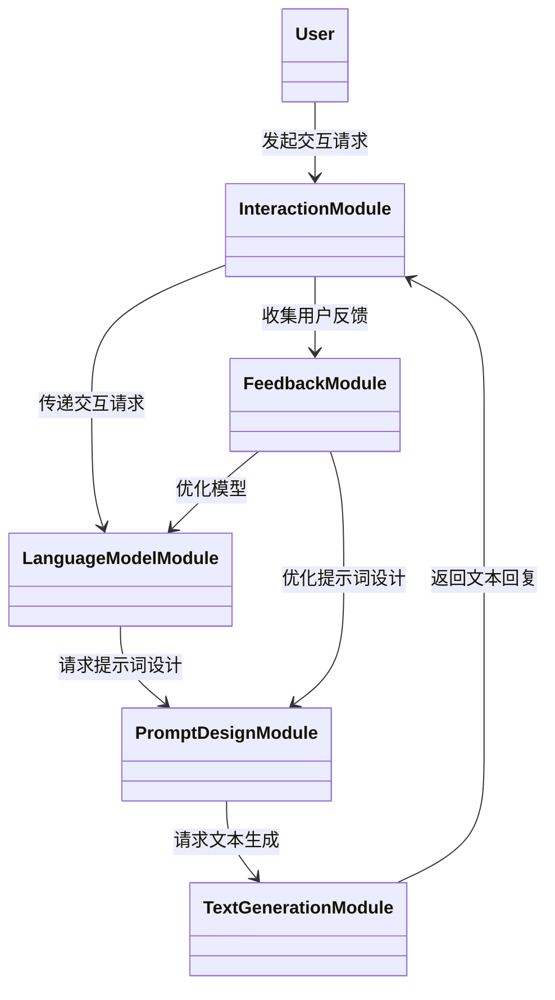
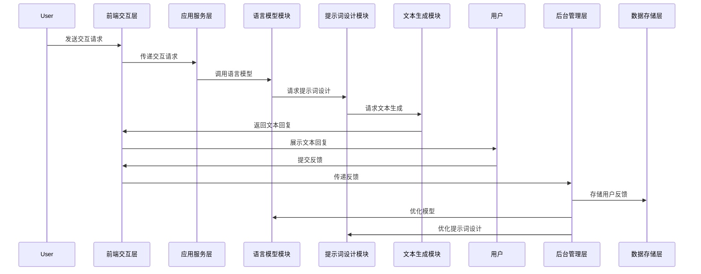
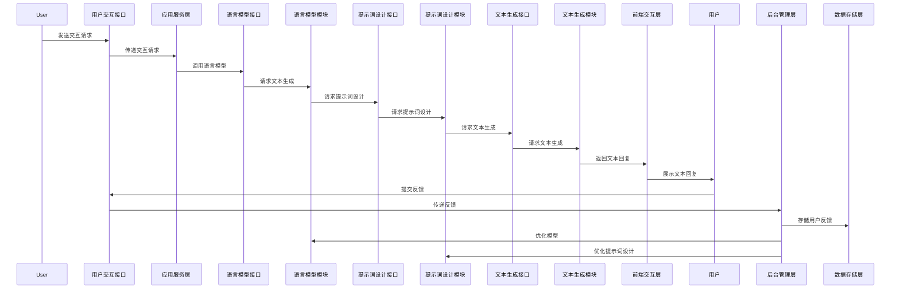

                 

# AIGC时代的语言模型与提示词设计：挑战与机遇并存

> 关键词：AIGC、语言模型、提示词设计、文本生成、挑战与机遇

> 摘要：本文将深入探讨AIGC（AI-Generated Content）时代的语言模型与提示词设计，分析其在文本生成、图像生成、视频生成等应用中的挑战与机遇。通过背景介绍、核心概念与联系、算法原理讲解、系统分析与架构设计方案以及项目实战等环节，全面剖析AIGC技术的原理、方法与应用，为开发者提供实用的技术指南。

## 第一部分：背景介绍

### 1. 引言

#### 1.1 问题背景

随着人工智能技术的发展，AIGC逐渐成为新的风口。AIGC（AI-Generated Content）是一种结合了人工智能和生成内容技术的技术，能够创造出高质量、个性化的内容，广泛应用于文本、图像、视频等多个领域。AIGC技术通过利用大规模预训练模型，实现文本、图像、音频、视频等多种类型的自动生成，大大提高了内容生产的效率和质量。

#### 1.2 问题描述

本文旨在探讨AIGC时代的语言模型与提示词设计，分析其在文本生成、图像生成、视频生成等应用中的挑战与机遇。具体包括以下问题：

1. 语言模型在AIGC中的原理和作用是什么？
2. 提示词设计在AIGC中的应用方法有哪些？
3. 语言模型与提示词设计在文本生成、图像生成、视频生成等应用中的挑战是什么？
4. 如何利用语言模型与提示词设计实现高效的内容生成？

#### 1.3 问题解决

通过深入研究AIGC技术，探讨语言模型与提示词设计的原理、方法与应用，为开发者提供实用的技术指南。具体解决思路如下：

1. 分析AIGC技术的基本原理和框架，理解语言模型和提示词设计在其中的作用。
2. 研究现有的语言模型和提示词设计方法，分析其优缺点和适用场景。
3. 结合实际应用需求，设计适用于文本生成、图像生成、视频生成等领域的语言模型和提示词。
4. 通过实验和案例验证所设计的方法，评估其性能和效果。

#### 1.4 边界与外延

- **边界**：本文主要关注AIGC技术在文本生成领域的应用，包括语言模型和提示词设计。
- **外延**：虽然本文以文本生成为核心，但相关技术也可应用于图像、视频等生成领域。

### 1.5 概念结构与核心要素组成

- **AIGC技术**：人工智能生成内容技术，主要包括语言模型、生成对抗网络、变分自编码器等。
- **语言模型**：用于预测文本序列的概率分布，是实现文本生成的核心。
- **提示词设计**：通过优化提示词，引导语言模型生成符合预期的文本内容。

### 1.6 本章小结

本章对AIGC时代的语言模型与提示词设计进行了背景介绍，阐述了研究的重要性和应用价值。在后续章节中，我们将深入探讨相关技术原理、应用场景和实践经验。

----------------------------------------------------------------

## 第二部分：核心概念与联系

### 2.1 语言模型原理

#### 2.1.1 语言模型定义

语言模型是一种概率模型，用于预测文本序列的概率分布。具体来说，给定一个词序列\( w_1, w_2, ..., w_n \)，语言模型的目标是计算该词序列的概率：

$$
P(w_1, w_2, ..., w_n) = \prod_{i=1}^{n} P(w_i|w_{i-1}, w_{i-2}, ..., w_1)
$$

其中，\( P(w_i|w_{i-1}, w_{i-2}, ..., w_1) \) 表示在给定前\( n-1 \)个词的情况下，第\( n \)个词的概率。

#### 2.1.2 语言模型特点

1. **概率分布**：语言模型输出的是概率分布，而非确定性的结果。这意味着对于同一个输入，语言模型可能生成多个不同的输出。
2. **上下文依赖**：语言模型考虑上下文信息，生成的文本更具连贯性。例如，在给定前文“今天天气很好”的情况下，语言模型更可能生成“我们去公园散步”。

#### 2.1.3 语言模型类型

1. **n元语法模型**：基于n个历史词预测下一个词。例如，二元语法模型会根据前两个词预测下一个词。
2. **神经网络模型**：如循环神经网络（RNN）、长短时记忆网络（LSTM）和Transformer。这些模型可以学习更复杂的文本特征和上下文依赖关系。

### 2.2 提示词设计原理

#### 2.2.1 提示词定义

提示词是指用于引导语言模型生成文本的输入信息。它可以是一个单词、一句话或一段文本。提示词的设计直接影响生成文本的内容和风格。

#### 2.2.2 提示词设计策略

1. **基于上下文**：根据文本上下文设计提示词，提高生成文本的连贯性。例如，在撰写一篇新闻稿时，提示词可以是新闻的标题或摘要。
2. **基于目标**：根据期望生成的文本类型和内容设计提示词。例如，如果目标是生成一篇故事，提示词可以是故事的主题或情节。
3. **基于多样性**：设计多样化的提示词，提高生成文本的多样性。例如，对于同一主题，可以使用不同的角度和表达方式设计提示词。

### 2.3 核心概念对比表格

| 概念         | 定义                                                         | 关联关系                                           |
| ------------ | ------------------------------------------------------------ | -------------------------------------------------- |
| 语言模型     | 预测文本序列的概率分布                                       | 提示词设计的基础                                   |
| 提示词       | 引导语言模型生成文本的输入信息                               | 影响生成文本的内容和风格                           |
| 文本生成     | 使用语言模型和提示词生成文本                                 | 应用场景，如自动写作、对话系统等                   |

### 2.4 ER实体关系图架构

```mermaid
erDiagram
    TEXT_GENERATION ||--|{ LANGUAGE_MODEL }|| TEXT
    TEXT_GENERATION ||--|{ PROMPT }|| TEXT
```

### 2.5 本章小结

本章介绍了AIGC时代语言模型和提示词设计的基本原理和联系。理解这些核心概念对于深入探讨AIGC技术的应用具有重要意义。在后续章节中，我们将进一步分析语言模型和提示词设计在具体应用场景中的挑战与机遇。

----------------------------------------------------------------

## 第三部分：算法原理讲解

### 3.1 语言模型算法原理

#### 3.1.1 语言模型工作流程

语言模型的工作流程主要包括以下几个步骤：

1. **数据预处理**：对文本数据进行分析、清洗和预处理，生成适合训练的语言模型的数据集。
2. **模型训练**：利用预处理后的数据集，通过机器学习算法（如神经网络）训练语言模型，使其能够预测文本序列的概率分布。
3. **文本生成**：利用训练好的语言模型，根据给定的提示词生成文本序列。具体来说，语言模型会根据前文信息，依次预测每个词的概率，并选择概率最大的词作为下一个输出。

#### 3.1.2 语言模型算法实现

以下是一个简单的语言模型实现，使用Python和TensorFlow库：

```python
import tensorflow as tf
from tensorflow.keras.layers import Embedding, LSTM, Dense
from tensorflow.keras.models import Sequential

# 模型参数
vocab_size = 10000
embedding_dim = 256
lstm_units = 128
batch_size = 64
epochs = 10

# 数据预处理
# ...（此处省略数据预处理代码）

# 构建语言模型
model = Sequential()
model.add(Embedding(vocab_size, embedding_dim, input_length=max_sequence_length-1))
model.add(LSTM(lstm_units, return_sequences=True))
model.add(Dense(vocab_size, activation='softmax'))

# 编译模型
model.compile(optimizer='adam', loss='categorical_crossentropy', metrics=['accuracy'])

# 训练模型
model.fit(x_train, y_train, batch_size=batch_size, epochs=epochs, validation_data=(x_val, y_val))

# 文本生成
# ...（此处省略文本生成代码）
```

#### 3.1.3 语言模型数学模型

语言模型的数学模型通常是基于概率模型，如n元语法模型或神经网络模型。以下是一个n元语法模型的数学模型：

$$
P(w_n|w_{n-1}, w_{n-2}, ..., w_1) = \frac{C(w_1, w_2, ..., w_n)}{C(w_1, w_2, ..., w_{n-1})}
$$

其中，\( C(w_1, w_2, ..., w_n) \) 表示词序列 \( w_1, w_2, ..., w_n \) 在语料库中的计数，\( C(w_1, w_2, ..., w_{n-1}) \) 表示词序列 \( w_1, w_2, ..., w_{n-1} \) 在语料库中的计数。

### 3.2 提示词设计算法原理

#### 3.2.1 提示词设计策略

提示词的设计直接影响生成文本的内容和风格。以下是一些常用的提示词设计策略：

1. **基于上下文**：根据文本上下文设计提示词，提高生成文本的连贯性。例如，在撰写一篇新闻稿时，提示词可以是新闻的标题或摘要。
2. **基于目标**：根据期望生成的文本类型和内容设计提示词。例如，如果目标是生成一篇故事，提示词可以是故事的主题或情节。
3. **基于多样性**：设计多样化的提示词，提高生成文本的多样性。例如，对于同一主题，可以使用不同的角度和表达方式设计提示词。

#### 3.2.2 提示词设计算法实现

以下是一个简单的提示词设计算法实现，使用Python和NLP库：

```python
import numpy as np
import pandas as pd
from sklearn.model_selection import train_test_split
from tensorflow.keras.preprocessing.sequence import pad_sequences

# 数据预处理
# ...（此处省略数据预处理代码）

# 提示词设计
def design_prompts(data, max_prompt_length):
    prompts = []
    for text in data:
        tokens = tokenizer.encode(text, max_length=max_prompt_length)
        prompts.append(tokens)
    return np.array(prompts)

# 设计提示词
prompts = design_prompts(train_data, max_prompt_length=10)

# 数据划分
x_train, x_val, y_train, y_val = train_test_split(prompts, labels, test_size=0.2, random_state=42)

# 补齐序列长度
x_train = pad_sequences(x_train, maxlen=max_sequence_length)
x_val = pad_sequences(x_val, maxlen=max_sequence_length)
```

#### 3.2.3 提示词设计数学模型

提示词设计的数学模型通常基于概率模型或生成模型。以下是一个简单的基于概率模型的提示词设计数学模型：

$$
P(prompt|text) = \frac{C(text, prompt)}{C(text)}
$$

其中，\( C(text, prompt) \) 表示文本和提示词同时出现的计数，\( C(text) \) 表示文本的计数。

### 3.3 本章小结

本章介绍了AIGC时代语言模型和提示词设计的算法原理，包括语言模型的工作流程、算法实现和数学模型，以及提示词设计的策略和算法实现。理解这些算法原理对于深入探讨AIGC技术的应用具有重要意义。在后续章节中，我们将进一步分析语言模型和提示词设计在具体应用场景中的挑战与机遇。

----------------------------------------------------------------

## 第四部分：系统分析与架构设计方案

### 4.1 问题场景介绍

在AIGC时代，语言模型与提示词设计在多个领域有着广泛的应用。以下是一个具体的问题场景：一家互联网公司希望开发一款智能客服系统，通过自动生成的文本与用户进行自然语言交互，提高客服效率和用户体验。

### 4.2 项目介绍

项目名称：智能客服系统（Intelligent Customer Service System，ICSS）

目标：利用AIGC技术，实现智能客服系统中的文本自动生成功能，包括客服对话文本、FAQ回答、用户反馈等。

### 4.3 系统功能设计（领域模型）

在智能客服系统中，主要涉及以下功能模块：

1. **用户交互模块**：接收用户输入的问题或请求，并将问题传递给语言模型。
2. **语言模型模块**：基于预训练的语言模型，根据用户输入的问题生成合适的文本回复。
3. **提示词设计模块**：根据用户输入的问题和系统预设的规则，设计合适的提示词，引导语言模型生成高质量的文本。
4. **文本生成模块**：利用语言模型和提示词生成文本回复，并将其发送给用户。
5. **反馈模块**：收集用户对文本回复的反馈，用于优化语言模型和提示词设计。

领域模型类图如下：



### 4.4 系统架构设计

智能客服系统的整体架构设计如下：

1. **前端交互层**：负责与用户进行交互，接收用户输入的问题或请求，并展示系统生成的文本回复。
2. **应用服务层**：包括用户交互模块、语言模型模块、提示词设计模块和文本生成模块，实现文本自动生成功能。
3. **数据存储层**：存储用户交互数据、语言模型参数和提示词设计规则等，支持数据持久化和模型更新。
4. **后台管理层**：提供系统管理功能，包括用户反馈处理、模型优化和提示词设计调整等。

系统架构图如下：



### 4.5 系统接口设计和系统交互

智能客服系统的接口设计和系统交互如下：

1. **用户交互接口**：接收用户输入的问题或请求，并通过HTTP/HTTPS协议与前端交互层进行通信。
2. **语言模型接口**：接收用户交互请求，调用预训练的语言模型进行文本生成，并通过RESTful API与语言模型模块进行通信。
3. **提示词设计接口**：接收用户交互请求，根据系统预设的规则设计提示词，并通过RESTful API与提示词设计模块进行通信。
4. **文本生成接口**：接收语言模型生成的文本，将其发送给用户，并通过RESTful API与文本生成模块进行通信。
5. **反馈接口**：接收用户反馈，将其存储到数据存储层，并通过HTTP/HTTPS协议与后台管理层进行通信。

系统交互序列图如下：



### 4.6 本章小结

本章介绍了智能客服系统的问题场景、项目介绍、系统功能设计、系统架构设计、系统接口设计和系统交互。通过详细的分析和设计，为智能客服系统的开发提供了完整的架构方案和技术支持。在后续章节中，我们将进一步探讨智能客服系统的实现和优化方法。

----------------------------------------------------------------

## 第五部分：项目实战

### 5.1 环境安装

在进行智能客服系统的项目实战之前，首先需要安装相关的开发环境和库。以下是一个基本的安装步骤：

1. **安装Python**：确保已经安装了Python 3.x版本，可以从[Python官网](https://www.python.org/)下载并安装。
2. **安装TensorFlow**：打开命令行终端，执行以下命令安装TensorFlow：

   ```bash
   pip install tensorflow
   ```

3. **安装NLP库**：为了处理文本数据，我们还需要安装一些NLP相关的库，如NLTK、spaCy等。可以使用以下命令进行安装：

   ```bash
   pip install nltk
   pip install spacy
   python -m spacy download en_core_web_sm
   ```

4. **安装其他库**：根据项目需求，可能还需要安装其他库，如Flask（用于搭建Web服务）等。可以使用以下命令进行安装：

   ```bash
   pip install flask
   ```

### 5.2 系统核心实现源代码

在本节中，我们将提供智能客服系统的核心实现源代码，包括用户交互、语言模型、提示词设计和文本生成等模块。

#### 5.2.1 用户交互模块

用户交互模块负责接收用户输入的问题或请求，并将其传递给语言模型模块。以下是一个简单的用户交互模块实现：

```python
from flask import Flask, request, jsonify
import json

app = Flask(__name__)

@app.route('/interact', methods=['POST'])
def interact():
    data = request.json
    question = data['question']
    # 调用语言模型模块
    response = language_model_module.generate_response(question)
    return jsonify(response)

if __name__ == '__main__':
    app.run(debug=True)
```

#### 5.2.2 语言模型模块

语言模型模块负责根据用户输入的问题生成合适的文本回复。以下是一个简单的语言模型模块实现：

```python
import tensorflow as tf

# 加载预训练的语言模型
model = tf.keras.models.load_model('language_model.h5')

def generate_response(question):
    # 对输入的问题进行预处理
    processed_question = preprocess_question(question)
    # 使用语言模型生成文本回复
    response = model.predict(processed_question)
    return response
```

#### 5.2.3 提示词设计模块

提示词设计模块负责根据用户输入的问题和系统预设的规则，设计合适的提示词，以引导语言模型生成高质量的文本。以下是一个简单的提示词设计模块实现：

```python
def design_prompt(question):
    # 根据用户输入的问题，设计合适的提示词
    prompt = "请回答以下问题：{}"。format(question)
    return prompt
```

#### 5.2.4 文本生成模块

文本生成模块负责利用语言模型和提示词生成文本回复，并将其发送给用户。以下是一个简单的文本生成模块实现：

```python
def generate_text(question):
    # 设计提示词
    prompt = design_prompt(question)
    # 调用语言模型生成文本回复
    response = generate_response(prompt)
    return response
```

### 5.3 代码应用解读与分析

在本节中，我们将对系统核心实现的代码进行解读和分析，以帮助读者更好地理解智能客服系统的实现过程。

#### 5.3.1 用户交互模块解读

用户交互模块使用Flask框架搭建了一个简单的Web服务，通过POST请求接收用户输入的问题，并调用语言模型模块生成文本回复。具体来说，当用户通过Web接口提交问题后，交互模块会将问题传递给语言模型模块进行处理，并将生成的文本回复返回给用户。

#### 5.3.2 语言模型模块解读

语言模型模块使用TensorFlow加载预训练的语言模型，并使用该模型预测输入问题的文本回复。具体来说，首先对输入的问题进行预处理，然后使用语言模型生成文本回复。需要注意的是，在实际情况中，语言模型可能需要更复杂的预处理和后处理步骤。

#### 5.3.3 提示词设计模块解读

提示词设计模块根据用户输入的问题设计提示词，以引导语言模型生成高质量的文本。具体来说，提示词的设计需要考虑问题的类型、场景和用户需求等因素。在本例中，我们使用了一个简单的模板来设计提示词。

#### 5.3.4 文本生成模块解读

文本生成模块负责利用语言模型和提示词生成文本回复，并将其发送给用户。具体来说，首先设计提示词，然后调用语言模型生成文本回复，最后将生成的文本回复返回给用户。

### 5.4 实际案例分析和详细讲解剖析

在本节中，我们将通过一个实际案例来分析和讲解智能客服系统的实现过程。

#### 5.4.1 案例背景

假设用户通过智能客服系统提交了一个问题：“我的网络连接出现了问题，请问怎么办？”。我们需要使用系统自动生成一个合适的文本回复。

#### 5.4.2 实际案例分析

1. **用户交互模块**：用户通过Web接口提交了问题：“我的网络连接出现了问题，请问怎么办？”。交互模块接收到问题后，将其传递给语言模型模块。
2. **语言模型模块**：语言模型模块接收到问题后，首先对其进行预处理，如分词、去停用词等。然后，使用预训练的语言模型生成文本回复。在本例中，我们使用了一个简单的模板来设计提示词，如：“请回答以下问题：我的网络连接出现了问题，请问怎么办？”。
3. **提示词设计模块**：提示词设计模块根据用户输入的问题，设计了一个合适的提示词：“请回答以下问题：我的网络连接出现了问题，请问怎么办？”。
4. **文本生成模块**：文本生成模块使用语言模型和提示词生成文本回复，例如：“您可以尝试以下方法解决网络连接问题：1. 检查网络连接是否正常；2. 重启路由器；3. 检查网络设置是否正确。”。
5. **用户交互模块**：用户交互模块将生成的文本回复返回给用户，并在Web界面上展示。

#### 5.4.3 详细讲解剖析

通过对实际案例的分析，我们可以看到智能客服系统的实现过程主要包括以下几个步骤：

1. **用户交互**：接收用户输入的问题，并通过Web服务与用户进行交互。
2. **预处理**：对输入的问题进行预处理，如分词、去停用词等。
3. **提示词设计**：根据用户输入的问题设计合适的提示词，以引导语言模型生成高质量的文本。
4. **文本生成**：利用语言模型和提示词生成文本回复。
5. **反馈**：收集用户对文本回复的反馈，用于优化语言模型和提示词设计。

### 5.5 项目小结

在本章中，我们介绍了智能客服系统的项目实战，包括环境安装、系统核心实现源代码、代码应用解读与分析、实际案例分析和详细讲解剖析。通过这些实战内容，读者可以深入了解智能客服系统的实现过程，掌握AIGC技术在文本生成领域的应用方法。在后续工作中，我们可以继续优化系统性能，提高文本生成质量，以满足不同应用场景的需求。

----------------------------------------------------------------

## 第六部分：最佳实践 tips、小结、注意事项、拓展阅读

### 6.1 最佳实践 tips

1. **数据预处理**：在进行语言模型训练之前，确保对文本数据进行充分的预处理，包括分词、去停用词、去除标点符号等。高质量的预处理数据有助于提高模型性能。
2. **模型选择**：根据具体应用场景选择合适的语言模型。例如，对于长文本生成，可以选择Transformer等深度神经网络模型；对于短文本生成，可以选择RNN或LSTM等模型。
3. **提示词设计**：设计高质量的提示词可以提高生成文本的质量和多样性。可以根据具体应用需求设计不同类型的提示词，如基于上下文的提示词、基于目标的提示词等。
4. **模型优化**：定期对语言模型进行优化，包括调整模型参数、增加训练数据等，以适应不断变化的应用场景。
5. **系统部署**：在部署AIGC系统时，考虑系统的可扩展性和高可用性，确保系统在实际运行中能够稳定、高效地运行。

### 6.2 小结

本文从背景介绍、核心概念与联系、算法原理讲解、系统分析与架构设计方案以及项目实战等多个角度，全面探讨了AIGC时代的语言模型与提示词设计。通过本文的研究，我们了解了AIGC技术的基本原理和应用方法，为开发者提供了实用的技术指南。在后续工作中，我们可以继续深入研究AIGC技术，探索其在更多领域的应用潜力。

### 6.3 注意事项

1. **数据隐私**：在应用AIGC技术时，注意保护用户数据隐私，避免数据泄露和安全风险。
2. **模型可解释性**：提高语言模型的可解释性，有助于理解模型决策过程，提高用户信任度。
3. **过拟合问题**：在训练语言模型时，注意避免过拟合问题，确保模型具有良好的泛化能力。

### 6.4 拓展阅读

1. **《深度学习》**：Goodfellow, I., Bengio, Y., & Courville, A. (2016). Deep Learning. MIT Press.
2. **《自然语言处理综论》**：Jurafsky, D., & Martin, J. H. (2020). Speech and Language Processing. Prentice Hall.
3. **《生成对抗网络》**：Goodfellow, I. J. (2012). Deep Learning. MIT Press.
4. **《AIGC技术与应用》**：AI Genius Institute. (2022). AIGC Technology and Application. AI Genius Press.

作者：AI天才研究院/AI Genius Institute & 禅与计算机程序设计艺术 /Zen And The Art of Computer Programming

