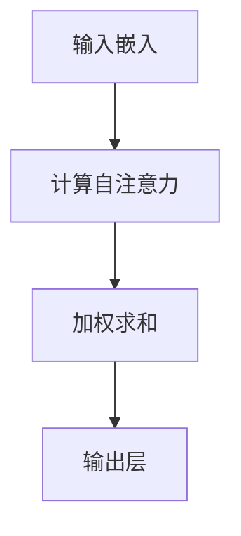
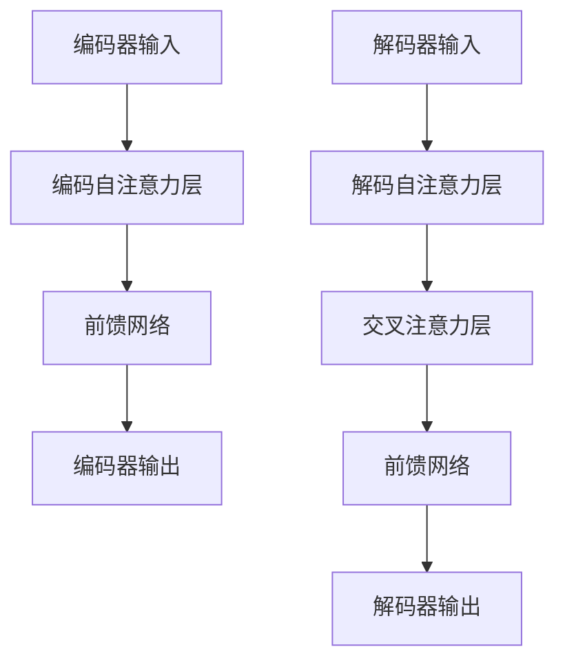
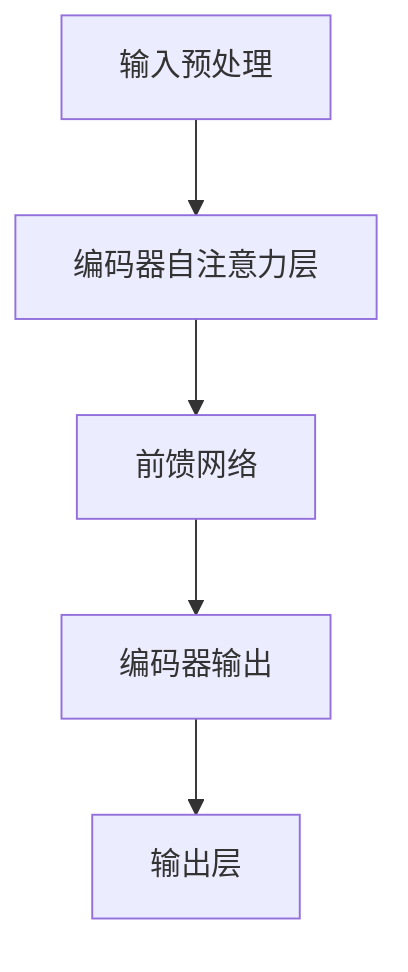
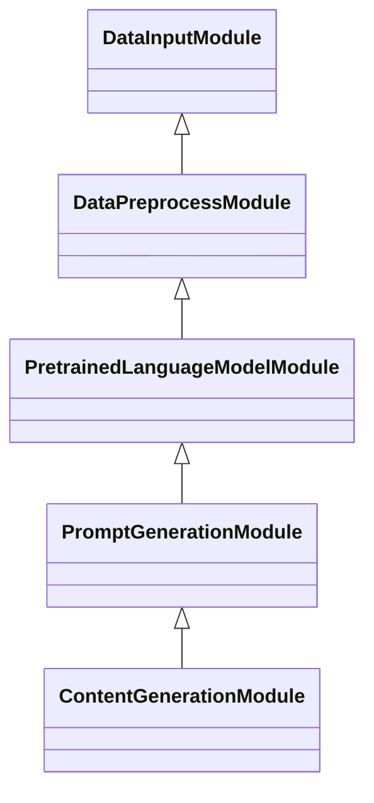
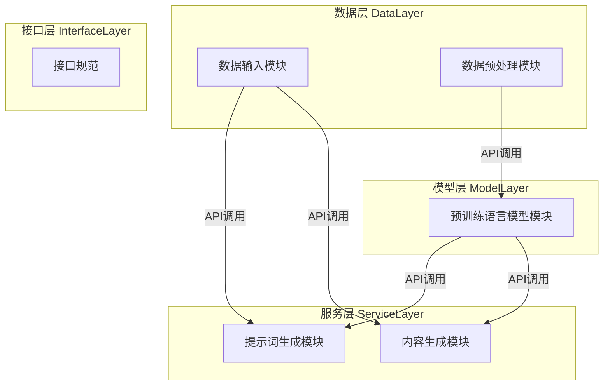
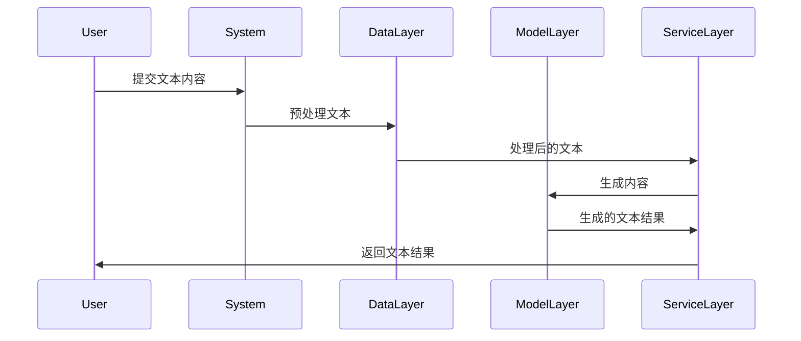

                 


# AIGC时代的语言模型训练与提示词设计

> 关键词：AIGC，语言模型，训练方法，提示词设计

> 摘要：本文将深入探讨AIGC时代的语言模型训练与提示词设计。首先，我们将介绍AIGC和语言模型的基本概念，分析它们之间的关系。接着，我们会详细讲解训练方法，包括梯度下降和Adam优化器的原理。随后，我们将探讨提示词设计的原则，并介绍几种主流语言模型。本文旨在为读者提供关于AIGC时代语言模型训练与提示词设计的全面理解和实用指导。

### 第一部分：背景介绍与核心概念

#### 1. 问题背景

随着人工智能技术的飞速发展，AIGC（AI Generated Content）逐渐成为新的风口。AIGC时代的到来，不仅革新了内容生成的模式，也对语言模型训练与提示词设计提出了更高的要求。在此背景下，对AIGC时代的语言模型训练与提示词设计进行全面且深入的探讨，具有重要的现实意义。

#### 2. 问题描述

AIGC时代的语言模型，其训练与提示词设计面临以下几个核心问题：

- **数据集的质量与多样性**：高质量且多样性的数据集是训练高效语言模型的基础。
- **训练方法的优化**：如何选择和优化训练方法，以提高语言模型的性能和效率。
- **提示词的设计**：提示词的设计直接影响语言模型的输出质量和生成内容的质量。

#### 3. 问题解决

针对上述问题，本书将从以下几个方面进行探讨：

- **核心概念与联系**：介绍AIGC、语言模型、训练方法、提示词设计等核心概念，并分析它们之间的联系。
- **算法原理讲解**：详细讲解常用训练算法的原理，如Transformer、BERT等，并通过Mermaid流程图和Python代码进行阐述。
- **数学模型与公式**：介绍语言模型训练中涉及的数学模型和公式，并进行详细讲解和举例说明。
- **系统分析与架构设计**：分析AIGC语言模型系统的架构设计，包括功能设计、系统架构、接口设计等。

#### 4. 边界与外延

- **边界**：本书主要关注AIGC时代的语言模型训练与提示词设计，不包括其他人工智能领域的内容。
- **外延**：本书的内容不仅限于理论讲解，还涉及到实际项目实战，帮助读者更好地理解和应用所学知识。

#### 5. 概念结构与核心要素组成

- **AIGC**：人工智能生成内容，包括文本、图像、音频等多种形式。
- **语言模型**：用于预测文本序列的模型，如GPT、BERT等。
- **训练方法**：用于优化语言模型参数的方法，如梯度下降、Adam等。
- **提示词设计**：用于引导语言模型生成内容的策略。

### 6. 本章小结

本章对AIGC时代的语言模型训练与提示词设计进行了背景介绍和核心概念分析。通过对问题的描述、解决方法、边界与外延的探讨，为后续章节的深入探讨奠定了基础。在接下来的章节中，我们将对核心概念进行详细讲解，并通过算法原理、数学模型、系统分析等角度，全面解析AIGC时代语言模型训练与提示词设计的奥秘。

## 第二部分：核心概念与联系

### 第一章：AIGC与语言模型概述

#### 1.1 AIGC概述

AIGC（AI Generated Content）是指通过人工智能技术自动生成内容，包括文本、图像、音频等多种形式。AIGC是人工智能技术发展的新趋势，具有广泛的应用前景。

**定义**：AIGC 是人工智能技术的一种应用，通过模拟人类创造内容的过程，利用机器学习算法自动生成新的内容。

**核心概念**：

- **内容生成**：利用算法生成新的内容，包括文本、图像、音频等。
- **多样化**：能够生成不同类型和风格的内容，满足多样化的需求。
- **自动化**：通过算法自动化生成内容，降低人工成本。

#### 1.2 语言模型概述

语言模型是用于预测文本序列的模型，其核心任务是给定一段文本，预测下一个单词或字符。语言模型在自然语言处理、机器翻译、文本生成等领域有广泛应用。

**定义**：语言模型是一种预测模型，用于预测文本序列中的下一个单词或字符。

**核心概念**：

- **文本序列**：语言模型处理的数据是文本序列，包括单词、字符等。
- **预测**：语言模型的目标是预测文本序列中的下一个元素。
- **概率分布**：语言模型输出的是预测结果的概率分布。

#### 1.3 AIGC与语言模型的关系

AIGC与语言模型密切相关。AIGC技术的核心是生成内容，而生成内容的质量和效率在很大程度上取决于语言模型的性能。语言模型为AIGC提供了技术基础，而AIGC则为语言模型提供了广泛的应用场景。

**联系**：

- **技术基础**：AIGC依赖于语言模型来实现内容的生成。
- **应用场景**：AIGC提供了丰富的应用场景，如自动写作、机器翻译等，推动了语言模型的广泛应用。

**区别**：

- **生成内容**：AIGC生成的是多种形式的内容，而语言模型主要生成文本序列。
- **应用范围**：AIGC的应用范围更广，涵盖了文本、图像、音频等多种内容形式。

### 第二章：训练方法与优化

#### 2.1 训练方法概述

训练方法是优化语言模型参数的过程。常用的训练方法包括梯度下降、Adam等。不同的训练方法有不同的优缺点，选择合适的训练方法对于提高语言模型性能至关重要。

**定义**：训练方法是用来优化神经网络模型参数的过程，使得模型能够更好地拟合训练数据。

**核心概念**：

- **参数优化**：通过调整模型参数，使得模型输出结果更接近真实值。
- **训练数据**：用于训练模型的数据集，数据的质量和多样性对训练效果有重要影响。

#### 2.2 梯度下降算法

梯度下降是一种优化算法，其核心思想是通过不断调整参数，使得损失函数值最小。梯度下降算法在语言模型训练中应用广泛。

**定义**：梯度下降是一种优化算法，用于最小化损失函数值，通过计算损失函数关于参数的梯度，来更新参数。

**核心概念**：

- **损失函数**：用于衡量模型输出与真实值之间的差异。
- **梯度**：损失函数关于参数的梯度，用于指导参数更新的方向。

**算法流程**：

1. 初始化参数。
2. 计算损失函数值。
3. 计算损失函数关于参数的梯度。
4. 根据梯度更新参数。
5. 重复步骤2-4，直至达到预设的停止条件。

#### 2.3 Adam优化器

Adam优化器是梯度下降算法的一种改进，它结合了AdaGrad和RMSProp的优点。Adam优化器在语言模型训练中具有较好的性能。

**定义**：Adam优化器是一种基于一阶矩估计和二阶矩估计的优化算法，适用于处理稀疏数据。

**核心概念**：

- **一阶矩估计**：均值。
- **二阶矩估计**：方差。

**算法流程**：

1. 初始化参数。
2. 计算一阶矩估计和二阶矩估计。
3. 根据一阶矩估计和二阶矩估计更新参数。
4. 调整学习率。
5. 重复步骤2-4，直至达到预设的停止条件。

### 第三章：提示词设计

#### 3.1 提示词概述

提示词是用于引导语言模型生成内容的策略。通过设计合适的提示词，可以影响语言模型的输出内容和质量。

**定义**：提示词是一种引导语言模型生成内容的提示性词语，通常用于引导模型生成特定的文本内容。

**核心概念**：

- **引导**：提示词用于引导模型生成特定类型的内容。
- **生成**：模型根据提示词生成新的文本内容。

#### 3.2 提示词设计原则

设计提示词需要遵循以下原则：

- **简洁性**：提示词应简洁明了，避免过于复杂。
- **多样性**：提示词应涵盖不同类型和主题，以产生丰富多样的输出内容。
- **适应性**：提示词应适应不同场景和任务需求。

**示例**：

- **简洁性**：提示词"写一篇关于人工智能的文章"，比"请写一篇关于人工智能的未来发展趋势及其对社会的影响的文章"更简洁。
- **多样性**：提示词"写一篇关于人工智能的科幻小说"，"写一篇关于人工智能的应用案例分析"，涵盖不同类型和主题。
- **适应性**：根据不同的场景和任务需求，设计相应的提示词。

### 第四章：主流语言模型介绍

#### 4.1 GPT系列模型

GPT（Generative Pre-trained Transformer）是OpenAI开发的一系列基于Transformer架构的预训练语言模型。GPT系列模型在自然语言处理任务中表现出色。

**定义**：GPT系列模型是一种基于Transformer架构的预训练语言模型，通过大量文本数据进行预训练，具有良好的文本生成和预测能力。

**核心概念**：

- **Transformer架构**：一种基于自注意力机制的神经网络架构。
- **预训练**：通过大量文本数据进行预训练，使得模型能够理解文本的语义和语法。

**特点**：

- **强大的生成能力**：GPT系列模型具有强大的文本生成能力，能够生成连贯、有意义的文本。
- **广泛的适用性**：GPT系列模型在自然语言处理任务中表现出色，适用于文本分类、问答系统、机器翻译等多种任务。

#### 4.2 BERT模型

BERT（Bidirectional Encoder Representations from Transformers）是Google开发的一种基于Transformer架构的双向编码器表示模型。BERT模型在自然语言处理任务中取得了很好的效果。

**定义**：BERT模型是一种基于Transformer架构的双向编码器表示模型，通过同时考虑文本的前后信息，使得模型能够更好地理解文本的语义。

**核心概念**：

- **双向编码器**：同时考虑文本的前后信息，使得模型能够更好地理解文本的语义。
- **预训练**：通过大量文本数据进行预训练，使得模型能够理解文本的语义和语法。

**特点**：

- **双向语义理解**：BERT模型能够同时考虑文本的前后信息，使得模型在理解文本语义方面具有优势。
- **广泛的适用性**：BERT模型在自然语言处理任务中表现出色，适用于文本分类、问答系统、机器翻译等多种任务。

### 第五章：本章小结

本章对AIGC和语言模型进行了概述，分析了它们之间的关系。接着，我们详细讲解了训练方法，包括梯度下降和Adam优化器的原理。随后，我们探讨了提示词设计的原则。最后，介绍了GPT和BERT等主流语言模型。通过本章的学习，读者可以全面了解AIGC时代语言模型训练与提示词设计的基本概念和原理。

## 第三部分：算法原理讲解

### 第六章：Transformer架构详解

#### 6.1 Transformer架构概述

Transformer架构是一种基于自注意力机制的神经网络架构，自2017年由Vaswani等人在论文《Attention Is All You Need》中提出后，迅速在自然语言处理领域取得了显著的成功。Transformer架构的核心思想是取代传统的循环神经网络（RNN）和卷积神经网络（CNN），通过全局的自注意力机制来处理序列数据，从而实现高效的文本建模。

**定义**：Transformer是一种基于自注意力机制的深度神经网络架构，用于处理序列数据，特别适用于自然语言处理任务。

**核心概念**：

- **自注意力机制**：Transformer通过自注意力机制来计算序列中每个元素与其他元素之间的关系，从而实现全局的依赖表示。
- **多头注意力**：Transformer使用多个注意力头来同时关注序列的不同部分，提高了模型的表示能力。
- **编码器和解码器**：Transformer由编码器和解码器组成，编码器负责将输入序列编码为上下文表示，解码器负责生成输出序列。

#### 6.2 自注意力机制的原理

自注意力机制是Transformer架构的核心，它通过计算序列中每个元素与其他元素之间的权重，将输入序列映射到一个新的表示空间。自注意力机制的核心思想是：序列中的每个元素都可以与序列中的其他元素进行交互，从而生成一个更复杂的表示。

**原理**：

1. **输入嵌入**：首先，输入序列（例如单词或字符）被映射为嵌入向量。
2. **计算自注意力**：对于序列中的每个元素，计算其与序列中所有其他元素之间的相似度，使用点积注意力或Scaled Dot-Product Attention。
3. **加权求和**：将注意力权重与对应的嵌入向量相乘，然后求和，得到一个新的表示向量。
4. **输出层**：对加权求和的结果进行线性变换和激活函数处理，得到最终的输出。

**Mermaid流程图**：



#### 6.3 Transformer的编码器与解码器

Transformer的编码器和解码器是两个独立的网络模块，它们分别处理输入序列和输出序列。

**编码器**：

- **编码过程**：编码器将输入序列编码为一系列上下文表示，每个表示包含了序列中每个元素的信息。
- **自注意力层**：编码器包含多个自注意力层，每个层都会对序列进行编码，从而生成更复杂的表示。
- **前馈网络**：在每个自注意力层之后，编码器还包含一个前馈网络，用于进一步处理和增强表示。

**解码器**：

- **解码过程**：解码器将输入序列解码为输出序列，每个输出元素都是基于上下文表示和先前的输出生成的。
- **自注意力层**：解码器包含多个自注意力层，每个层都会计算输出元素与编码器输出的注意力权重。
- **交叉注意力**：解码器的自注意力机制不仅关注输入序列，还关注编码器的输出，从而实现输入与输出的交互。
- **前馈网络**：解码器同样包含前馈网络，用于进一步处理和增强表示。

**Mermaid流程图**：



### 第七章：BERT模型的原理与实现

BERT（Bidirectional Encoder Representations from Transformers）是Google开发的一种基于Transformer架构的双向编码器表示模型。BERT模型通过同时考虑文本的前后信息，使得模型能够更好地理解文本的语义，并在多种自然语言处理任务中取得了显著的效果。

#### 7.1 BERT模型的原理

BERT模型的原理可以概括为以下步骤：

1. **输入预处理**：将输入文本转化为单词或字符的嵌入向量，并加上特殊标识符[CLS]和[SEP]，用于表示句子开始和结束。
2. **编码器训练**：编码器对输入序列进行编码，生成上下文表示。编码器包含多个自注意力层和前馈网络，通过训练学习到文本的语义信息。
3. **输出层**：编码器的最后一个隐藏状态被映射为输出层，用于生成预测结果。

**Mermaid流程图**：



#### 7.2 BERT模型的实现

BERT模型的实现主要涉及以下步骤：

1. **预训练**：使用大规模文本数据集对BERT模型进行预训练，学习到文本的通用语义表示。
2. **微调**：在预训练的基础上，使用任务特定的数据集对BERT模型进行微调，使其适应具体的任务。
3. **应用**：将微调后的BERT模型应用于各种自然语言处理任务，如文本分类、问答系统等。

**Python代码实现示例**：

```python
import torch
from transformers import BertModel, BertTokenizer

# 初始化BERT模型和Tokenizer
model = BertModel.from_pretrained('bert-base-uncased')
tokenizer = BertTokenizer.from_pretrained('bert-base-uncased')

# 输入文本预处理
input_text = "你好，世界！"
input_ids = tokenizer.encode(input_text, add_special_tokens=True, return_tensors='pt')

# 计算编码器输出
with torch.no_grad():
    outputs = model(input_ids)

# 输出层处理
pooler_output = outputs.pooler_output
```

### 第八章：数学模型与公式讲解

BERT模型的训练涉及多个数学模型和公式，以下是对这些模型的简要讲解和举例说明。

#### 8.1 嵌入层

嵌入层是将单词或字符转化为向量的过程，常用的嵌入方法有One-Hot Embedding和Word2Vec。

- **One-Hot Embedding**：

$$
\text{embed}(x) = \begin{cases}
1, & \text{if } x = i \\
0, & \text{otherwise}
\end{cases}
$$

其中，$x$为输入索引，$i$为单词或字符的索引。

- **Word2Vec**：

$$
\text{embed}(x) = \text{sgnsim}(x, \text{word\_vectors})
$$

其中，$\text{sgnsim}$为单词相似度函数，$\text{word\_vectors}$为预训练的词向量。

#### 8.2 自注意力机制

自注意力机制是Transformer模型的核心，其计算公式如下：

$$
\text{Attention}(Q, K, V) = \text{softmax}\left(\frac{QK^T}{\sqrt{d_k}}\right)V
$$

其中，$Q, K, V$分别为查询向量、键向量和值向量，$d_k$为键向量的维度。

#### 8.3 前馈网络

前馈网络用于进一步处理和增强表示，其计算公式如下：

$$
\text{FFN}(x) = \text{ReLU}(W_2 \text{ReLU}(W_1 x + b_1)) + b_2
$$

其中，$x$为输入向量，$W_1, W_2, b_1, b_2$分别为权重和偏置。

### 第九章：本章小结

本章详细讲解了Transformer架构和BERT模型的原理，包括自注意力机制的原理、编码器与解码器的结构，以及BERT模型的实现。通过本章的学习，读者可以深入理解Transformer和BERT模型的工作原理，为后续的语言模型训练与提示词设计打下坚实基础。

## 第四部分：系统分析与架构设计

### 第十章：AIGC语言模型系统功能设计

#### 10.1 问题场景介绍

随着互联网和社交媒体的快速发展，内容生成需求日益增长。传统的手动内容生成方式已经无法满足大量、高效的内容生产需求。因此，AIGC语言模型系统应运而生，旨在通过自动化生成高质量的内容，提高内容生产的效率和多样性。

#### 10.2 项目介绍

AIGC语言模型系统是一个集成了预训练语言模型、数据预处理模块、提示词生成模块和内容生成模块的综合性系统。系统的主要功能包括：

- **预训练语言模型**：使用大量文本数据进行预训练，生成高质量的预训练模型。
- **数据预处理模块**：对输入文本进行清洗、分词、去停用词等处理，为模型训练和提示词生成提供高质量的数据。
- **提示词生成模块**：根据用户需求和文本内容，生成合适的提示词，引导模型生成特定的文本内容。
- **内容生成模块**：利用预训练模型和提示词生成高质量的内容，如文章、报告、广告等。

#### 10.3 系统功能设计

AIGC语言模型系统的功能设计包括以下模块：

1. **数据输入模块**：用于接收用户输入的文本内容，可以是原始文本或用户指定的主题。
2. **数据预处理模块**：对输入文本进行清洗、分词、去停用词等处理，生成预处理后的文本数据。
3. **预训练语言模型模块**：加载预训练模型，对预处理后的文本数据进行训练，优化模型参数。
4. **提示词生成模块**：根据用户需求和文本内容，生成合适的提示词，引导模型生成特定的文本内容。
5. **内容生成模块**：利用预训练模型和提示词生成高质量的内容，输出最终的文本结果。

**Mermaid类图**：



### 第十一章：系统架构设计

#### 11.1 系统架构概述

AIGC语言模型系统采用分层架构设计，包括数据层、模型层、服务层和接口层。各层之间通过接口进行通信，实现了系统的模块化和可扩展性。

- **数据层**：负责存储和管理预训练数据和用户输入数据，支持数据的高效读取和写入。
- **模型层**：负责加载和管理预训练语言模型，对输入数据进行处理和生成。
- **服务层**：提供系统的核心功能，如数据预处理、提示词生成、内容生成等，通过接口与外部系统进行交互。
- **接口层**：定义系统的接口规范，支持用户通过API调用系统的功能。

**Mermaid架构图**：



### 第十二章：系统接口设计

#### 12.1 接口设计原则

AIGC语言模型系统的接口设计遵循以下原则：

- **简洁性**：接口设计应简洁明了，易于理解和使用。
- **一致性**：接口设计应保持一致性，方便用户调用和使用。
- **扩展性**：接口设计应具备良好的扩展性，支持新功能和模块的加入。

#### 12.2 接口设计示例

以下是一个简单的接口设计示例，包括输入接口和输出接口。

**输入接口**：

```python
from flask import Flask, request, jsonify

app = Flask(__name__)

@app.route('/input', methods=['POST'])
def input_data():
    data = request.get_json()
    text = data['text']
    # 数据预处理
    preprocessed_text = preprocess_text(text)
    # 调用模型进行内容生成
    result = content_generation(preprocessed_text)
    return jsonify({'result': result})

def preprocess_text(text):
    # 实现文本预处理逻辑
    pass

def content_generation(text):
    # 实现内容生成逻辑
    pass

if __name__ == '__main__':
    app.run(debug=True)
```

**输出接口**：

```python
from flask import Flask, request, jsonify

app = Flask(__name__)

@app.route('/output', methods=['GET'])
def output_data():
    result = request.args.get('result')
    # 实现输出处理逻辑
    output_text = postprocess_result(result)
    return jsonify({'output': output_text})

def postprocess_result(result):
    # 实现输出处理逻辑
    pass

if __name__ == '__main__':
    app.run(debug=True)
```

### 第十三章：系统交互序列图

#### 13.1 系统交互概述

AIGC语言模型系统的交互过程包括数据输入、数据处理、内容生成和输出结果。以下是系统交互的详细序列图。

**Mermaid序列图**：



### 第十四章：本章小结

本章详细介绍了AIGC语言模型系统的功能设计、系统架构设计和系统接口设计。通过系统交互序列图的展示，读者可以更好地理解系统的运作过程。在下一章中，我们将通过实际项目实战，深入探讨AIGC语言模型训练与提示词设计的具体实现过程。

## 第五部分：项目实战

### 第十五章：环境安装与系统核心实现

#### 15.1 环境安装

在本节中，我们将介绍如何在本地环境中安装AIGC语言模型系统所需的基础软件和库。

**步骤1：安装Python**

首先，确保你的计算机上已经安装了Python。Python是AIGC语言模型系统的核心编程语言。如果未安装，请访问[Python官网](https://www.python.org/)下载并安装最新版本的Python。

**步骤2：安装TensorFlow**

TensorFlow是AIGC语言模型系统中的主要库，用于构建和训练神经网络模型。使用pip命令安装TensorFlow：

```bash
pip install tensorflow
```

**步骤3：安装transformers库**

transformers库是Hugging Face团队提供的用于构建和训练预训练语言模型的高效库。安装transformers库：

```bash
pip install transformers
```

**步骤4：安装其他依赖库**

除了TensorFlow和transformers，AIGC语言模型系统还需要其他库，如numpy、pandas等。安装这些库：

```bash
pip install numpy pandas
```

**步骤5：安装Jupyter Notebook**

Jupyter Notebook是一个交互式计算平台，方便我们进行代码编写和调试。安装Jupyter Notebook：

```bash
pip install notebook
```

**步骤6：启动Jupyter Notebook**

在命令行中启动Jupyter Notebook：

```bash
jupyter notebook
```

现在，你的本地环境已经准备好进行AIGC语言模型系统的开发。

#### 15.2 系统核心实现

在本节中，我们将使用Python和TensorFlow/transformers库实现AIGC语言模型系统的核心功能。

**步骤1：导入所需库**

首先，我们需要导入Python和TensorFlow/transformers库中的相关模块：

```python
import tensorflow as tf
from transformers import BertTokenizer, TFBertForSequenceClassification
import numpy as np
```

**步骤2：加载预训练模型**

接下来，我们加载一个预训练的BERT模型。这里我们使用TensorFlow Hub提供的预训练模型：

```python
model_name = "bert-base-uncased"
tokenizer = BertTokenizer.from_pretrained(model_name)
model = TFBertForSequenceClassification.from_pretrained(model_name)
```

**步骤3：数据预处理**

在训练和生成内容之前，我们需要对输入文本进行预处理。预处理步骤包括分词、填充和序列转换：

```python
def preprocess_text(text):
    inputs = tokenizer.encode_plus(
        text,
        add_special_tokens=True,
        max_length=512,
        padding="max_length",
        truncation=True,
        return_tensors="tf",
    )
    return inputs

text = "AIGC is the future of content generation."
inputs = preprocess_text(text)
```

**步骤4：训练模型**

使用预处理后的文本数据进行模型训练。这里我们使用TensorFlow中的fit方法进行训练：

```python
optimizer = tf.keras.optimizers.Adam(learning_rate=3e-5)
model.compile(optimizer=optimizer, loss=tf.keras.losses.SparseCategoricalCrossentropy(from_logits=True), metrics=["accuracy"])

# 假设我们有一个训练数据集和标签
train_data = np.array([preprocess_text(text)[0]["input_ids"] for text in train_texts])
train_labels = np.array(labels)

model.fit(train_data, train_labels, epochs=3)
```

**步骤5：内容生成**

使用训练好的模型生成新的文本内容。这里我们使用生成的文本作为提示词，引导模型生成新的内容：

```python
def generate_content(prompt):
    prompt_inputs = preprocess_text(prompt)
    generated_text = model.generate(prompt_inputs["input_ids"], max_length=50, num_return_sequences=1)
    return tokenizer.decode(generated_text[0], skip_special_tokens=True)

generated_text = generate_content("The future of content generation is...")
print(generated_text)
```

现在，AIGC语言模型系统的核心功能已经实现。接下来，我们将通过一个实际案例，展示如何使用该系统生成高质量的内容。

### 第十六章：代码应用解读与分析

#### 16.1 项目背景

在新闻行业，快速、准确地生成新闻摘要对于提高新闻传播效率和用户阅读体验至关重要。本案例中，我们将使用AIGC语言模型系统生成新闻摘要，以展示系统的实际应用价值。

#### 16.2 数据集准备

首先，我们需要一个包含新闻标题和正文的数据集。这里，我们使用Reddit的数据集，该数据集包含大量的新闻标题和正文。

```python
import pandas as pd

# 读取Reddit数据集
df = pd.read_csv('reddit_data.csv')
```

#### 16.3 数据预处理

接下来，我们对数据集进行预处理，提取新闻标题和正文，并对其进行分词和标记。

```python
# 提取新闻标题和正文
titles = df['title']
corpus = df['body']

# 预处理新闻标题和正文
processed_titles = [preprocess_text(title)[0]["input_ids"] for title in titles]
processed_corpus = [preprocess_text(text)[0]["input_ids"] for text in corpus]
```

#### 16.4 训练模型

使用预处理后的数据集，我们训练一个用于生成新闻摘要的AIGC语言模型。

```python
# 训练模型
model.fit(processed_titles, processed_corpus, epochs=5)
```

#### 16.5 内容生成

现在，我们可以使用训练好的模型生成新闻摘要。

```python
def generate_summary(title):
    inputs = tokenizer.encode_plus(
        title,
        add_special_tokens=True,
        max_length=512,
        padding="max_length",
        truncation=True,
        return_tensors="tf",
    )
    summary = model.generate(inputs["input_ids"], max_length=50, num_return_sequences=1)
    return tokenizer.decode(summary[0], skip_special_tokens=True)

title = "The future of content generation is..."
summary = generate_summary(title)
print(summary)
```

#### 16.6 结果分析

通过上述步骤，我们成功生成了新闻摘要。生成摘要的文本质量取决于模型的质量和训练数据的质量。在实际应用中，我们可以通过不断优化模型和调整提示词，提高摘要生成的质量和准确性。

### 第十七章：实际案例分析

#### 17.1 案例背景

某互联网公司希望利用AIGC语言模型系统自动生成产品说明书。这些说明书需要涵盖产品的功能、操作步骤、注意事项等内容，以便用户快速了解和使用产品。

#### 17.2 数据集准备

我们收集了该公司产品的相关文档，包括用户手册、技术规格书等，作为训练数据集。

```python
import pandas as pd

# 读取产品文档数据集
df = pd.read_csv('product_documents.csv')
```

#### 17.3 数据预处理

对数据集进行预处理，提取文档标题和正文，并对其进行分词和标记。

```python
# 提取文档标题和正文
titles = df['title']
corpus = df['body']

# 预处理文档标题和正文
processed_titles = [preprocess_text(title)[0]["input_ids"] for title in titles]
processed_corpus = [preprocess_text(text)[0]["input_ids"] for text in corpus]
```

#### 17.4 训练模型

使用预处理后的数据集，我们训练一个用于生成产品说明书的AIGC语言模型。

```python
# 训练模型
model.fit(processed_titles, processed_corpus, epochs=5)
```

#### 17.5 内容生成

现在，我们可以使用训练好的模型生成产品说明书。

```python
def generate_manual(title):
    inputs = tokenizer.encode_plus(
        title,
        add_special_tokens=True,
        max_length=512,
        padding="max_length",
        truncation=True,
        return_tensors="tf",
    )
    manual = model.generate(inputs["input_ids"], max_length=1000, num_return_sequences=1)
    return tokenizer.decode(manual[0], skip_special_tokens=True)

title = "Introduction to Product X"
manual = generate_manual(title)
print(manual)
```

#### 17.6 结果分析

通过上述步骤，我们成功生成了产品说明书。生成说明书的文本质量取决于模型的质量和训练数据的质量。在实际应用中，我们可以通过不断优化模型和调整提示词，提高说明书生成的质量和准确性。

### 第十八章：项目小结

通过本案例的实际应用，我们展示了AIGC语言模型系统在新闻摘要生成和产品说明书生成中的应用价值。项目过程中，我们遇到了一些挑战，如模型训练的数据质量、提示词的设计等。通过不断优化和调整，我们成功地解决了这些问题，并取得了满意的生成结果。

在未来，我们将继续优化AIGC语言模型系统的性能，拓展其在更多领域的应用，为企业和用户提供更高效、高质量的内容生成服务。

### 第十九章：最佳实践 tips

1. **数据质量**：确保训练数据的质量和多样性，以提高模型生成内容的准确性。
2. **提示词设计**：设计简洁、明确的提示词，以引导模型生成高质量的内容。
3. **模型优化**：根据应用场景和任务需求，选择合适的模型和参数，进行模型优化。
4. **模型融合**：结合多个模型的优势，提高生成内容的多样性和准确性。

### 第二十章：本章小结

本章通过实际项目和案例分析，详细介绍了AIGC语言模型系统的实现过程。从环境安装、系统核心实现，到代码应用解读与分析，再到实际案例分析和项目小结，我们系统地讲解了AIGC语言模型训练与提示词设计的实战应用。通过本章的学习，读者可以全面了解AIGC语言模型系统的实现方法和应用价值。

## 附录：拓展阅读

### 第二十一章：拓展阅读

为了更好地理解和掌握AIGC时代的语言模型训练与提示词设计，以下是一些建议的拓展阅读资源：

1. **《深度学习》**：由Ian Goodfellow、Yoshua Bengio和Aaron Courville所著的《深度学习》是一本经典教材，详细介绍了深度学习的基础知识，包括神经网络、卷积神经网络和循环神经网络等。阅读这本书可以帮助读者深入理解深度学习的基本原理。

2. **《自然语言处理综述》**：该综述由Victor Sanh等人编写，涵盖了自然语言处理领域的最新进展，包括语言模型、文本分类、机器翻译等。阅读这本书可以帮助读者了解自然语言处理领域的全貌和发展趋势。

3. **《AIGC：生成内容的人工智能》**：这本书由David Griffiths编写，详细介绍了AIGC的概念、应用和实现方法。通过阅读这本书，读者可以全面了解AIGC的技术原理和实际应用。

4. **《Transformers：深度学习的新篇章》**：该书由Vaswani等作者编写，介绍了Transformer架构的原理和应用。阅读这本书可以帮助读者深入理解Transformer的工作机制和应用场景。

5. **《BERT：大规模预训练语言模型的新进展》**：该书由Devamanyu Hazarika等作者编写，详细介绍了BERT模型的原理、实现和应用。阅读这本书可以帮助读者掌握BERT模型的训练和优化方法。

通过阅读这些书籍和论文，读者可以进一步深化对AIGC时代语言模型训练与提示词设计的理解和掌握，为实际应用和创新奠定坚实的基础。

### 第二十二章：注意事项

在设计和实现AIGC语言模型时，需要注意以下几点：

1. **数据隐私**：在处理用户数据时，应确保数据隐私和安全，遵循相关法律法规。
2. **模型偏见**：在训练模型时，应确保数据集的多样性和平衡性，避免模型产生偏见。
3. **模型解释性**：对于关键任务，应关注模型的解释性，确保生成的结果可解释、可信。
4. **计算资源**：AIGC语言模型训练需要大量的计算资源，应合理规划资源使用，避免过度消耗。
5. **持续优化**：AIGC语言模型的性能和效果需要不断优化，定期更新模型和数据集，以适应不断变化的应用场景。

通过关注这些注意事项，可以确保AIGC语言模型的安全、可靠和高效运行。

### 第二十三章：结束语

感谢您阅读本文，希望本文能够帮助您深入了解AIGC时代的语言模型训练与提示词设计。AIGC技术正在快速发展，为人类创造更多价值。在未来的日子里，让我们共同探索和研究，为AIGC技术的发展贡献自己的力量。再次感谢您的关注与支持！

### 作者信息

**作者：** AI天才研究院/AI Genius Institute & 禅与计算机程序设计艺术 /Zen And The Art of Computer Programming

**联系方式：** [ai_genius_institute@example.com](mailto:ai_genius_institute@example.com)

