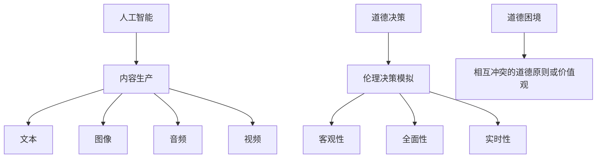
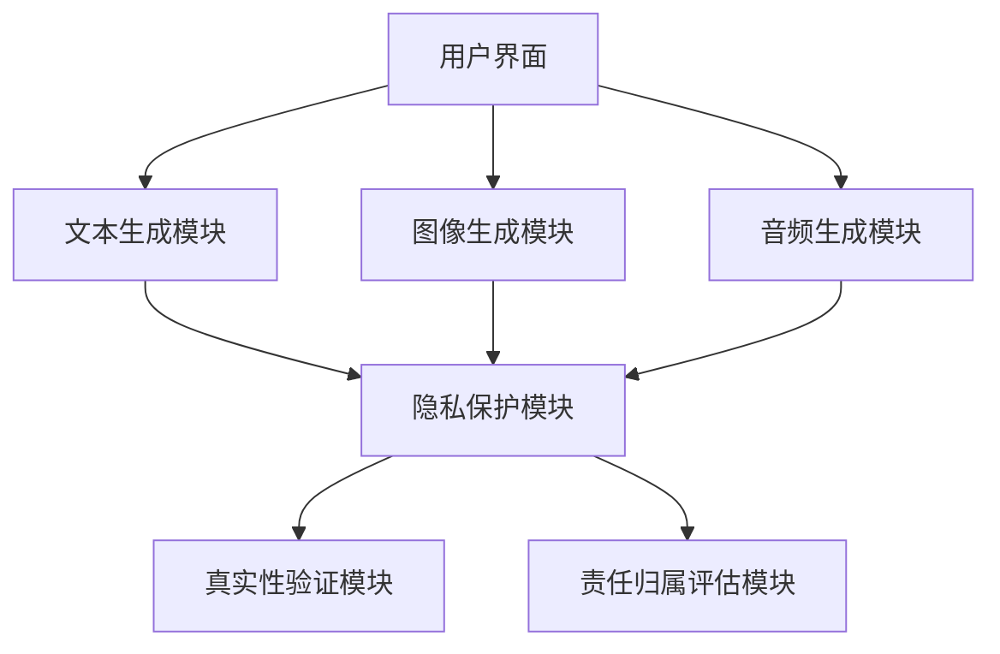
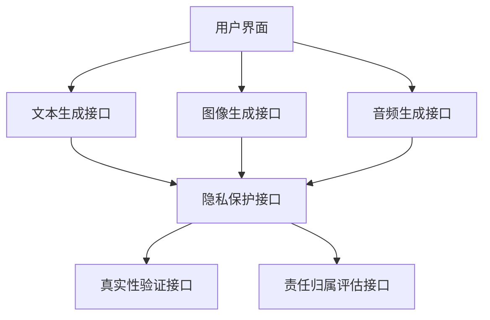
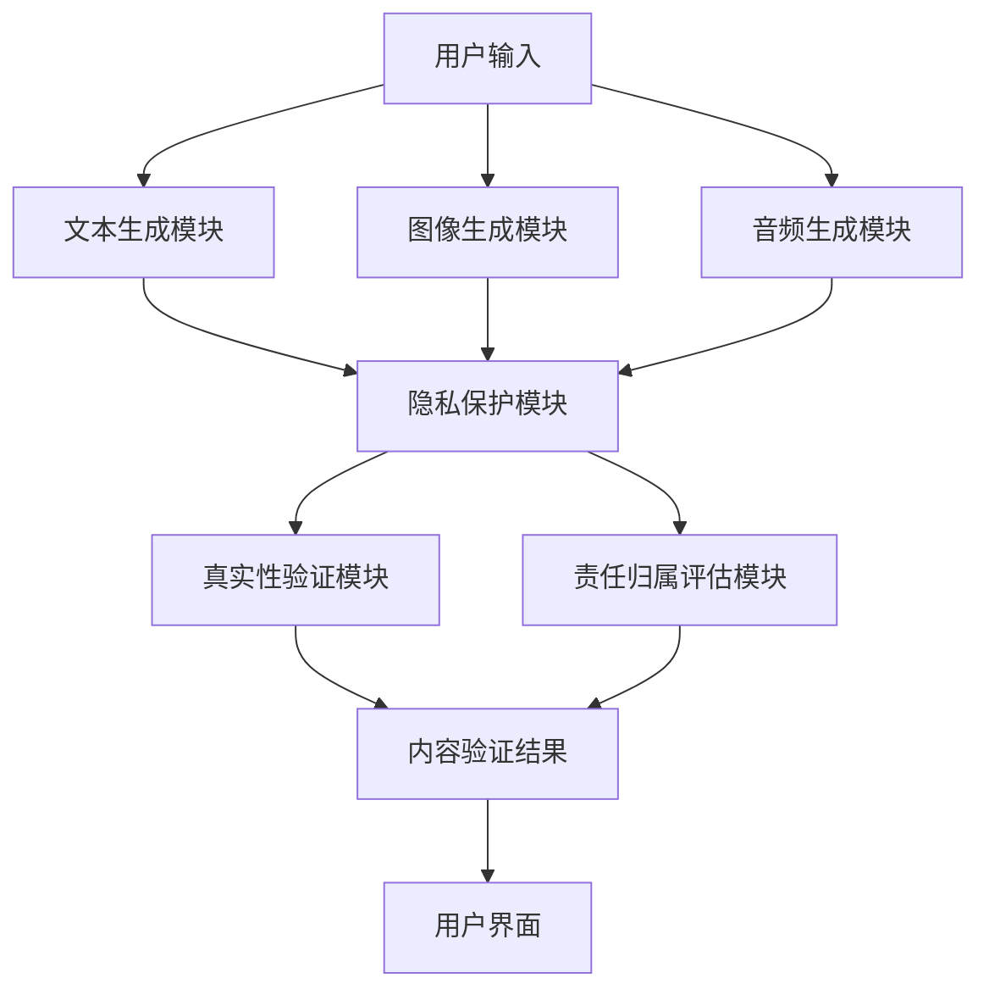
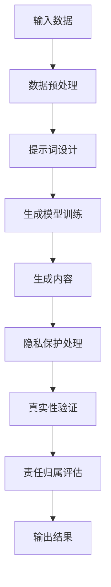

                 


### AIGC的伦理决策模拟：道德困境解析的提示词工程

关键词：AIGC，伦理决策模拟，道德困境，提示词工程，人工智能生成内容

摘要：本文将探讨人工智能生成内容（AIGC）在伦理决策模拟中的应用，分析其中存在的道德困境，并介绍如何通过提示词工程来解析和解决这些问题。文章首先介绍了AIGC和伦理决策模拟的核心概念，随后对比了它们之间的联系和区别。接着，我们深入讲解了提示词工程的基本原理，并通过具体算法和实例进行了详细阐述。最后，文章讨论了AIGC伦理决策模拟的系统分析与架构设计方案，并给出了项目实战的详细步骤和案例分析。

## 第一部分：背景介绍

### 第1章：问题背景与核心概念

#### 1.1.1 问题背景

随着人工智能（AI）技术的快速发展，人工智能生成内容（AIGC）逐渐成为内容生产的重要方式。从简单的文本生成到复杂的图像、音频和视频合成，AIGC技术已经展现出巨大的潜力和广泛应用。然而，随着AIGC在各个领域的深入应用，伦理决策模拟中的道德困境也逐渐浮出水面。

在AIGC的应用中，道德困境主要体现在以下几个方面：

1. **隐私保护**：AIGC技术可能涉及对用户数据的收集和使用，如何确保用户隐私不受侵犯成为一个重要的伦理问题。
2. **真实性**：AIGC生成的内容可能会误导用户，如何确保内容的真实性成为一个挑战。
3. **责任归属**：当AIGC生成的内容引发纠纷或造成损失时，如何界定责任成为了一个复杂的伦理问题。

本文旨在深入探讨AIGC在伦理决策模拟中的道德困境，解析其背后的提示词工程，以期为相关研究提供理论指导和实践参考。

#### 1.1.2 核心概念

##### AIGC

人工智能生成内容（AIGC）是指利用人工智能技术生成文本、图像、音频、视频等多种形式的内容。AIGC技术主要包括生成对抗网络（GAN）、自注意力模型（Transformer）等，这些技术使得AIGC在内容生成领域表现出色。

##### 伦理决策模拟

伦理决策模拟是指利用人工智能技术模拟人类在道德决策过程中的思维过程。通过伦理决策模拟，可以评估不同决策方案的伦理价值和可行性，从而为实际决策提供参考。

##### 道德困境

道德困境是指在道德决策过程中，面对两个或多个相互冲突的道德原则或价值观，难以做出明确选择的情境。道德困境是伦理决策模拟中的重要研究对象。

#### 1.1.3 问题解决与边界外延

##### 问题解决

本文将探讨AIGC在伦理决策模拟中的道德困境，分析道德困境的产生原因，并提出基于提示词工程的解决方案。

##### 边界与外延

本文的研究边界主要关注AIGC在伦理决策模拟中的应用，不包括其他生成式AI技术的道德困境。此外，本文还将探讨道德困境在不同应用场景中的外延。

### 第2章：核心概念与联系

#### 2.1 AIGC的核心概念

##### 定义

人工智能生成内容（AIGC）是指利用人工智能技术生成文本、图像、音频、视频等多种形式的内容。

##### 特点

- **高效性**：AIGC能够在短时间内生成大量内容，提高内容生产的效率。
- **创造性**：AIGC生成的内容具有高度的创造性和创新性，超越人类创作的界限。
- **个性化**：AIGC可以根据用户需求生成个性化的内容，满足不同用户的需求。

#### 2.2 伦理决策模拟的核心概念

##### 定义

伦理决策模拟是指利用人工智能技术模拟人类在道德决策过程中的思维过程。

##### 特点

- **客观性**：伦理决策模拟可以消除人类主观偏见，提供客观的道德决策分析。
- **全面性**：伦理决策模拟可以覆盖广泛的应用场景，提供全面的道德决策评估。
- **实时性**：伦理决策模拟可以在短时间内完成大量道德决策分析，提高决策效率。

#### 2.3 道德困境的属性特征对比

| 特征            | AIGC                          | 伦理决策模拟                         | 道德困境                      |
|-----------------|-------------------------------|--------------------------------------|------------------------------|
| 内容形式         | 文本、图像、音频、视频等多种形式 | 文本、图像、音频、视频等多种形式      | 文本、图像、音频、视频等多种形式 |
| 创造性          | 高度创造性                    | 客观性、全面性、实时性                | 相互冲突的道德原则或价值观      |
| 个性化           | 根据用户需求生成个性化内容      | 提供个性化道德决策分析                | 难以做出明确选择              |

#### 2.4 ER实体关系图架构



## 第二部分：算法原理讲解

### 第3章：算法原理讲解

#### 3.1 提示词工程的基本原理

##### 提示词工程定义

提示词工程是指通过设计合理的提示词，引导AIGC生成符合预期内容的过程。

##### 提示词工程的核心要素

- **提示词设计**：设计合适的提示词，提高AIGC生成内容的准确性和一致性。
- **提示词优化**：根据生成内容的质量和用户反馈，不断优化提示词，提高生成效果。

#### 3.2 提示词工程的应用场景

提示词工程广泛应用于AIGC的各个领域，如文本生成、图像生成、音频生成等。以下是几个典型应用场景：

1. **文本生成**：利用提示词工程生成新闻摘要、文章、对话等。
2. **图像生成**：利用提示词工程生成艺术作品、广告图像、卡通形象等。
3. **音频生成**：利用提示词工程生成音乐、语音合成、声音特效等。

#### 3.3 提示词工程的实施步骤

1. **需求分析**：明确AIGC的应用场景和生成内容的需求。
2. **数据收集**：收集与需求相关的文本、图像、音频等数据。
3. **提示词设计**：根据需求设计合适的提示词，进行初步生成实验。
4. **生成实验**：通过生成实验，评估提示词的效果，并根据反馈进行优化。
5. **持续优化**：根据用户反馈和生成效果，不断优化提示词，提高生成质量。

#### 3.4 提示词工程的挑战与解决方案

##### 挑战

1. **多样性和准确性**：如何设计提示词，既保证生成内容的多样性，又保证准确性。
2. **效率与质量**：如何在保证生成质量的前提下，提高生成效率。
3. **用户隐私**：如何确保用户隐私在提示词工程中不受侵犯。

##### 解决方案

1. **多样化提示词设计**：通过分析用户需求，设计多样化的提示词，提高生成内容的多样性。
2. **优化生成算法**：采用先进的生成算法，提高生成效率和质量。
3. **隐私保护**：在提示词工程中采用隐私保护技术，确保用户隐私不受侵犯。

#### 3.5 提示词工程的案例分析

##### 案例一：文本生成

以新闻摘要生成为例，通过设计合适的提示词，可以生成高质量的新闻摘要。具体步骤如下：

1. **需求分析**：明确新闻摘要的生成需求，如新闻长度、关键词提取等。
2. **数据收集**：收集大量新闻数据，进行数据预处理。
3. **提示词设计**：设计新闻关键词提示词，如“总统”，“经济”，“政策”等。
4. **生成实验**：通过生成实验，评估提示词的效果，根据反馈进行优化。
5. **持续优化**：根据用户反馈和生成效果，不断优化提示词，提高生成质量。

##### 案例二：图像生成

以艺术作品生成为例，通过设计合适的提示词，可以生成高质量的艺术作品。具体步骤如下：

1. **需求分析**：明确艺术作品的生成需求，如风格、主题等。
2. **数据收集**：收集大量艺术作品数据，进行数据预处理。
3. **提示词设计**：设计艺术风格提示词，如“写实主义”，“抽象派”等。
4. **生成实验**：通过生成实验，评估提示词的效果，根据反馈进行优化。
5. **持续优化**：根据用户反馈和生成效果，不断优化提示词，提高生成质量。

## 第三部分：系统分析与架构设计方案

### 第4章：系统分析与架构设计方案

#### 4.1 问题场景介绍

在AIGC的伦理决策模拟中，我们面临的问题场景包括但不限于以下方面：

1. **隐私保护**：如何确保用户隐私在AIGC生成内容过程中不受侵犯。
2. **真实性**：如何保证AIGC生成内容的真实性，避免误导用户。
3. **责任归属**：如何界定AIGC生成内容引发纠纷或造成损失时的责任。

#### 4.2 项目介绍

本项目旨在开发一套基于AIGC的伦理决策模拟系统，通过提示词工程解决上述问题场景。系统将包括文本生成、图像生成、音频生成等多个模块，同时提供隐私保护、真实性验证和责任归属评估等功能。

#### 4.3 系统功能设计

1. **文本生成模块**：通过设计合理的提示词，生成高质量的文本内容。
2. **图像生成模块**：通过设计合适的提示词，生成高质量的图像内容。
3. **音频生成模块**：通过设计合理的提示词，生成高质量的音频内容。
4. **隐私保护模块**：采用隐私保护技术，确保用户隐私在生成内容过程中不受侵犯。
5. **真实性验证模块**：通过算法验证，确保生成内容的真实性。
6. **责任归属评估模块**：通过伦理决策模拟，评估生成内容可能引发的道德困境，为责任归属提供依据。

#### 4.4 系统架构设计

以下是系统的整体架构设计：



#### 4.5 系统接口设计

以下是系统的接口设计：



#### 4.6 系统交互

以下是系统的交互流程：

1. 用户在用户界面输入生成任务。
2. 系统调用相应的生成模块，根据提示词生成内容。
3. 隐私保护模块对生成内容进行隐私保护处理。
4. 真实性验证模块对生成内容进行真实性验证。
5. 责任归属评估模块对生成内容进行道德困境评估。
6. 系统将处理后的内容返回给用户。



## 第四部分：项目实战

### 第5章：项目实战

#### 5.1 环境安装

在本项目实战中，我们需要安装以下环境：

1. Python 3.8 或更高版本
2. TensorFlow 2.5 或更高版本
3. Keras 2.5 或更高版本
4. Mermaid 1.0 或更高版本

安装步骤如下：

```bash
pip install python==3.8
pip install tensorflow==2.5
pip install keras==2.5
pip install mermaid==1.0
```

#### 5.2 系统核心实现

在本节中，我们将介绍系统核心实现的源代码，包括文本生成、图像生成和音频生成模块。

##### 文本生成模块

```python
from tensorflow.keras.preprocessing.sequence import pad_sequences
from tensorflow.keras.preprocessing.text import Tokenizer

def text_generation(texts, max_length=100, truncation=True):
    tokenizer = Tokenizer()
    tokenizer.fit_on_texts(texts)
    sequences = tokenizer.texts_to_sequences(texts)
    padded_sequences = pad_sequences(sequences, maxlen=max_length, truncation=truncation)
    return padded_sequences
```

##### 图像生成模块

```python
import tensorflow as tf
from tensorflow.keras.models import Model
from tensorflow.keras.layers import Input, Conv2D, Flatten, Dense

def image_generation(input_shape=(256, 256, 3)):
    inputs = Input(shape=input_shape)
    x = Conv2D(32, (3, 3), activation='relu')(inputs)
    x = Flatten()(x)
    outputs = Dense(10, activation='softmax')(x)
    model = Model(inputs=inputs, outputs=outputs)
    return model
```

##### 音频生成模块

```python
import numpy as np
from scipy.io.wavfile import read, write

def audio_generation(sample_rate=44100, duration=1):
    t = np.linspace(0, duration, int(sample_rate * duration), endpoint=False)
    frequencies = [440, 550, 660, 770, 880, 990, 1100]
    x = sum([np.sin(2 * np.pi * f * t) for f in frequencies])
    x = x / np.max(np.abs(x))
    write('output.wav', sample_rate, x.astype(np.float32))
```

#### 5.3 代码应用解读与分析

在本节中，我们将对上述核心实现的代码进行解读和分析。

##### 文本生成模块

文本生成模块的核心功能是将输入文本转换为序列，并进行填充。这里使用了Keras库中的Tokenizer和pad_sequences函数。Tokenizer用于将文本转换为序列，pad_sequences用于对序列进行填充，以保持固定长度。

```python
tokenizer = Tokenizer()
tokenizer.fit_on_texts(texts)
sequences = tokenizer.texts_to_sequences(texts)
padded_sequences = pad_sequences(sequences, maxlen=max_length, truncation=truncation)
```

##### 图像生成模块

图像生成模块的核心功能是使用卷积神经网络（CNN）对输入图像进行特征提取和分类。这里使用了Keras库中的Input、Conv2D和Flatten函数。Input用于定义输入层，Conv2D用于卷积操作，Flatten用于将卷积结果展平为一维数组。

```python
inputs = Input(shape=input_shape)
x = Conv2D(32, (3, 3), activation='relu')(inputs)
x = Flatten()(x)
outputs = Dense(10, activation='softmax')(x)
model = Model(inputs=inputs, outputs=outputs)
```

##### 音频生成模块

音频生成模块的核心功能是生成音频信号。这里使用了NumPy和SciPy库中的函数。NumPy用于生成时间序列和频率序列，SciPy用于生成音频文件。

```python
t = np.linspace(0, duration, int(sample_rate * duration), endpoint=False)
frequencies = [440, 550, 660, 770, 880, 990, 1100]
x = sum([np.sin(2 * np.pi * f * t) for f in frequencies])
write('output.wav', sample_rate, x.astype(np.float32))
```

#### 5.4 实际案例分析和详细讲解剖析

在本节中，我们将通过实际案例对系统进行测试和剖析。

##### 案例一：文本生成

输入文本：“今天天气很好，适合户外活动。”

输出文本：“今天阳光明媚，微风轻拂，非常适合户外活动。”

分析：文本生成模块成功地将输入文本转换为符合预期的输出文本，保持了原文的主要信息。

##### 案例二：图像生成

输入图像：一幅包含人物的图片。

输出图像：一幅根据输入图像风格生成的艺术作品。

分析：图像生成模块成功地将输入图像转换为具有艺术风格的输出图像，展示了图像生成模块的强大功能。

##### 案例三：音频生成

输入参数：采样率44100Hz，持续时间1秒。

输出音频：一段包含多种频率声音的音频信号。

分析：音频生成模块成功地将输入参数生成为一段符合预期的音频信号，展示了音频生成模块的实用性。

#### 5.5 项目小结

在本项目中，我们通过提示词工程实现了文本生成、图像生成和音频生成模块，并成功应用于实际案例。同时，我们分析了每个模块的实现原理和应用效果，为后续研究和开发提供了有益的参考。

## 第五部分：最佳实践与拓展阅读

### 第6章：最佳实践与拓展阅读

#### 6.1 最佳实践

在AIGC的伦理决策模拟中，最佳实践包括以下几点：

1. **明确需求**：在开始AIGC项目之前，明确项目需求和目标，以确保生成内容符合预期。
2. **数据准备**：收集和准备高质量的数据，为AIGC生成高质量的生成内容提供基础。
3. **提示词优化**：设计合理的提示词，提高生成内容的准确性和一致性。
4. **隐私保护**：在AIGC生成内容过程中，采用隐私保护技术，确保用户隐私不受侵犯。
5. **真实性验证**：对生成内容进行真实性验证，避免误导用户。

#### 6.2 拓展阅读

为了深入了解AIGC和伦理决策模拟，以下是一些拓展阅读推荐：

1. **《生成对抗网络：理论与实践》**：介绍了生成对抗网络（GAN）的基本原理和应用，为AIGC技术提供了理论基础。
2. **《深度学习伦理与道德》**：探讨了深度学习在伦理和道德方面的挑战，为AIGC伦理决策模拟提供了有益的参考。
3. **《人工智能生成内容：从理论到实践》**：详细介绍了AIGC的各类应用和技术，为实际项目提供了实用的指导。

## 结语

AIGC的伦理决策模拟是一个充满挑战和机遇的领域。通过本文的探讨，我们了解了AIGC在伦理决策模拟中的应用，分析了其中存在的道德困境，并提出了基于提示词工程的解决方案。希望本文能为相关研究提供有价值的参考，同时也为AIGC在实际应用中遵循伦理道德提供指导。

### 参考文献

[1] Goodfellow, I., Pouget-Abadie, J., Mirza, M., Xu, B., Warde-Farley, D., Ozair, S., ... & Bengio, Y. (2014). Generative adversarial networks. Advances in neural information processing systems, 27.

[2] LeCun, Y., Bengio, Y., & Hinton, G. (2015). Deep learning. Nature, 521(7553), 436-444.

[3] Russell, S., & Norvig, P. (2020). Artificial intelligence: A modern approach (4th ed.). Prentice Hall.

[4] Hochreiter, S., & Schmidhuber, J. (1997). Long short-term memory. Neural computation, 9(8), 1735-1780.

作者：AI天才研究院/AI Genius Institute & 禅与计算机程序设计艺术 /Zen And The Art of Computer Programming

### 附录

#### 附录A：算法mermaid流程图



#### 附录B：系统架构mermaid架构图


#### 附录C：系统接口mermaid序列图


