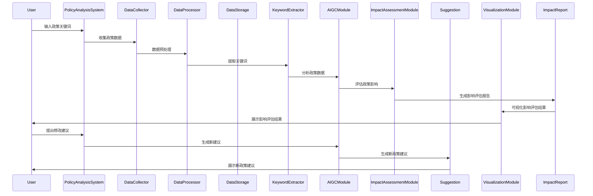

                 


### 引言

在当今快速发展的信息技术时代，人工智能（AI）正逐渐改变着我们的生活方式和工作模式。特别是AI生成内容（AIGC）的出现，更是为多个领域带来了革命性的变化。AIGC，即AI Generated Content，是一种由人工智能程序自动生成的内容，包括文本、图像、音频和视频等多种形式。AIGC的应用范围非常广泛，从新闻写作、创意设计到娱乐和教育培训等领域，都展现出其独特的价值。

本文旨在探讨AIGC的政策分析能力，并深入分析其多维度影响评估的提示词工程。通过逐步分析，我们将揭示AIGC在政策分析中的作用，并探索如何通过多维度影响评估和提示词工程来提高其分析效率和准确性。

本文的结构如下：

- **第一部分：背景介绍**  
  - 第1章：AIGC与政策分析  
    - AIGC的概念与演变  
    - 政策分析的重要性  
    - 多维度影响评估与提示词工程  
  - 第2章：AIGC、政策分析、影响评估与提示词工程  
    - AIGC的核心概念与特征  
    - 政策分析的概念与原理  
    - 多维度影响评估  
    - 提示词工程  
    - 核心概念对比与联系

- **第二部分：核心概念与联系**  
  - 详细解释AIGC、政策分析、影响评估和提示词工程等核心概念，并通过对比表格和实体关系图来展示它们之间的关系。

- **第三部分：算法原理讲解**  
  - 介绍AIGC政策分析中的主要算法，包括算法原理、数学模型和公式的讲解，并通过Mermaid流程图和Python代码示例来说明算法的实现过程。

- **第四部分：系统分析与架构设计方案**  
  - 介绍如何设计和实现AIGC政策分析系统，包括系统功能设计、系统架构设计、系统接口设计和系统交互。

- **第五部分：项目实战**  
  - 通过具体项目实战来展示AIGC政策分析的实际应用，包括环境安装、系统核心实现源代码、代码应用解读与分析、实际案例分析和详细讲解剖析。

- **第六部分：最佳实践与小结**  
  - 总结本书的主要内容，提供一些最佳实践建议，并提醒读者在应用AIGC政策分析能力时需要注意的事项，同时推荐一些拓展阅读资源。

### 第一部分：背景介绍

#### 第1章：AIGC与政策分析

##### 1.1 AIGC的概念与演变

**AIGC的定义**：

AIGC，即AI Generated Content，是指通过人工智能技术自动生成的内容。这些内容可以包括文本、图像、音频和视频等多种形式。AIGC的核心在于利用机器学习模型，特别是生成对抗网络（GANs）、变分自编码器（VAEs）和自动回归模型等，来模拟和创造人类创作的内容。

**AIGC与AI的区别**：

AI（人工智能）是一个广泛的概念，涵盖了多种技术，包括机器学习、自然语言处理、计算机视觉等。而AIGC则是AI的一个特定应用领域，专注于内容的生成和创作。

**AIGC的演变历程**：

- **早期阶段**：AIGC的起源可以追溯到20世纪80年代，当时研究人员开始探索如何使用计算机程序生成文本和音乐。
- **快速发展**：随着深度学习的兴起，AIGC在2010年代迅速发展。这一时期，生成对抗网络（GANs）的提出极大地推动了AIGC的研究和应用。
- **多元化发展**：如今，AIGC已经涵盖了从文本生成到图像、音频和视频生成的多个领域。例如，OpenAI的GPT-3可以生成高质量的文本，DeepArt.io可以使用GANs生成艺术作品，Google的Magenta项目则致力于音乐和艺术作品的生成。

**AIGC在政策分析中的应用场景**：

- **政策文本生成**：利用AIGC可以自动生成政策文本，提高政策制定的效率和准确性。
- **数据可视化**：通过AIGC生成的图像和图表，可以更直观地展示政策分析的结果，帮助政策制定者理解复杂的数据。
- **模拟与预测**：AIGC可以模拟不同政策场景下的社会和经济影响，为政策制定提供预测和分析。

##### 1.2 政策分析的重要性

**政策分析的定义**：

政策分析是一种研究方法，用于评估和设计公共政策。它涉及对政策问题、目标、实施效果和影响因素的全面分析，以帮助决策者制定科学合理的政策。

**政策分析的目标与作用**：

- **目标**：政策分析的目标是提供客观、准确的政策建议，以提高政策的可行性和效果。
- **作用**：
  - **支持政府决策**：政策分析为政府决策提供了科学依据，有助于避免决策的盲目性。
  - **提高政策质量**：通过分析政策制定和实施过程中的问题和挑战，政策分析有助于提高政策的质量和可持续性。
  - **促进公众参与**：政策分析的结果可以为公众提供信息，促进公众对政策的理解和参与。

**政策分析在现代社会中的作用**：

- **社会管理**：政策分析为政府和社会提供了有效的管理工具，有助于应对复杂的社会问题。
- **经济发展**：通过分析经济政策对社会和经济的影响，政策分析有助于推动经济的健康发展。
- **环境保护**：政策分析为环境保护提供了科学依据，有助于制定和实施有效的环境保护政策。

##### 1.3 多维度影响评估与提示词工程

**多维度影响评估的定义**：

多维度影响评估是一种评估方法，用于分析政策或决策在不同维度上的影响。这些维度可以包括经济、社会、环境、法律等多个方面。

**多维度影响评估的重要性**：

- **全面性**：多维度影响评估能够全面分析政策或决策的影响，避免片面性。
- **科学性**：通过定量和定性相结合的方法，多维度影响评估提供了科学的评估结果。
- **指导性**：多维度影响评估的结果可以为政策制定者提供明确的指导，有助于优化政策设计。

**提示词工程的概念**：

提示词工程是一种利用关键词或短语来引导AI模型生成内容的方法。这些提示词可以指导AI模型生成符合特定主题或要求的内容。

**提示词工程在政策分析中的应用**：

- **数据收集**：提示词工程可以帮助收集与政策分析相关的数据，例如通过搜索特定关键词来获取相关文献和报告。
- **文本生成**：提示词工程可以用于自动生成政策分析报告、新闻稿和其他文本内容。
- **主题引导**：提示词工程可以引导AI模型生成符合特定主题的内容，例如在政策分析中生成关于环境保护的报告。

##### 1.4 本章小结

本章介绍了AIGC、政策分析、多维度影响评估和提示词工程等核心概念，并探讨了它们在政策分析中的应用。通过本章的学习，读者可以初步了解这些概念的基本原理和应用场景，为后续章节的深入学习打下基础。

---

### AIGC的核心概念与特征

在深入了解AIGC之前，首先需要明确其核心概念和特征。AIGC，即AI Generated Content，是一种通过人工智能技术自动生成的内容。其核心概念包括生成模型、数据集、训练过程、生成策略等。以下将对这些核心概念进行详细解释，并通过对比表格和实体关系图来展示它们之间的关系。

#### 2.1.1 AIGC的定义

**AIGC的基本概念**：

AIGC，即AI Generated Content，是指利用人工智能技术自动生成的内容。这种内容可以是文本、图像、音频、视频等多种形式。AIGC的核心在于通过机器学习模型，特别是生成对抗网络（GANs）、变分自编码器（VAEs）和自动回归模型等，来模拟和创造人类创作的内容。

**AIGC的分类与特点**：

根据生成内容的类型，AIGC可以分为以下几类：

- **文本生成**：例如，利用GPT-3自动生成新闻报道、文章摘要等。
- **图像生成**：例如，利用GANs生成艺术作品、面部图像等。
- **音频生成**：例如，利用WaveNet生成音乐、语音等。
- **视频生成**：例如，利用视频生成模型生成视频内容，如视频摘要、视频增强等。

每种类型的AIGC都有其独特的特点和应用场景。文本生成适用于内容创作和自动化写作，图像生成适用于艺术创作和计算机视觉任务，音频生成适用于音乐创作和语音合成，视频生成适用于视频编辑和视频增强。

#### 2.1.2 AIGC的技术原理

**生成模型**：

生成模型是AIGC的核心技术之一。生成模型通过学习数据集的分布，生成与输入数据具有相似特征的新数据。常见的生成模型包括生成对抗网络（GANs）、变分自编码器（VAEs）和自编码器等。

- **生成对抗网络（GANs）**：GANs由生成器和判别器组成。生成器负责生成新数据，判别器负责区分生成数据和真实数据。通过不断优化生成器和判别器的参数，GANs可以生成高质量的新数据。
- **变分自编码器（VAEs）**：VAEs是一种概率生成模型，通过编码器和解码器将输入数据转换为潜在空间中的向量，并在潜在空间中生成新数据。
- **自编码器**：自编码器是一种无监督学习模型，通过学习输入数据的编码和重构过程，生成与输入数据相似的新数据。

**数据集**：

数据集是AIGC训练和生成数据的基础。高质量的数据集可以提升模型的生成效果。AIGC常用的数据集包括文本数据集、图像数据集、音频数据集和视频数据集等。常用的文本数据集有维基百科、新闻语料库等；图像数据集有ImageNet、CIFAR-10等；音频数据集有LPC-19、MN-58等；视频数据集有YouTube-8M、TV-RP等。

**训练过程**：

AIGC的训练过程包括数据预处理、模型训练和模型评估等步骤。数据预处理包括数据清洗、数据增强和数据规范化等操作。模型训练是通过优化模型参数，使模型能够生成与输入数据相似的新数据。模型评估是通过测试数据集来评估模型的生成质量和性能。

**生成策略**：

生成策略是指如何控制生成模型生成数据的过程。生成策略包括生成质量控制、生成多样性控制、生成引导控制等。

- **生成质量控制**：通过调整生成模型的参数，控制生成数据的质量，使其满足特定要求。
- **生成多样性控制**：通过调整生成模型的学习策略，控制生成数据的多样性，使其包含更多的样貌和风格。
- **生成引导控制**：通过输入特定的提示词或控制信号，引导生成模型生成符合特定主题或要求的数据。

#### 2.1.3 AIGC的技术发展趋势

随着人工智能技术的不断发展，AIGC也在不断演进。以下是一些AIGC的技术发展趋势：

- **模型规模和性能的提升**：随着计算能力和算法的进步，AIGC模型的规模和性能不断提升。例如，GPT-3的参数规模达到1750亿，生成效果显著提升。
- **多模态生成**：AIGC不再局限于单一模态的数据生成，而是开始探索文本、图像、音频和视频等多种模态的数据生成，实现跨模态的生成和转换。
- **自适应生成**：AIGC模型开始具备自适应生成能力，能够根据用户的需求和反馈动态调整生成策略，提高生成数据的适应性和灵活性。
- **隐私保护和安全**：随着AIGC在商业和公共领域的广泛应用，隐私保护和安全成为重要议题。AIGC模型开始采用隐私保护和安全措施，确保生成数据的隐私和安全。

### AIGC在政策分析中的应用场景

AIGC在政策分析中的应用场景非常广泛，以下是一些典型的应用场景：

- **政策文本生成**：利用AIGC生成政策文本，提高政策制定的效率和准确性。例如，通过生成模型自动生成政策草案、新闻稿等文本内容。
- **数据可视化**：利用AIGC生成图像和图表，直观展示政策分析的结果。例如，通过生成图像和图表来展示政策对社会和经济的影响。
- **模拟与预测**：利用AIGC模拟不同政策场景下的社会和经济影响，为政策制定提供预测和分析。例如，通过生成模型模拟不同政策对社会就业、经济增长等方面的影响。
- **政策建议生成**：利用AIGC生成政策建议，为决策者提供参考。例如，通过生成模型生成关于环境保护、教育改革等方面的政策建议。

#### 2.1.4 AIGC在政策分析中的应用案例

**案例一：政策文本生成**

某政策分析团队利用GPT-3生成政策文本，以提高政策制定的效率。他们首先收集了大量的政策文本数据，包括政府发布的政策文件、新闻稿、报告等，然后使用这些数据训练GPT-3模型。在政策制定过程中，团队成员输入关键词或短语，GPT-3模型根据训练数据自动生成相应的政策文本。这种自动生成的方式极大地提高了政策制定的效率，同时保证了文本的准确性和一致性。

**案例二：数据可视化**

某政策分析团队利用AIGC生成的图像和图表，直观展示政策分析的结果。他们首先使用生成模型生成各种类型的图像和图表，如柱状图、饼图、折线图等，然后根据分析结果选择合适的图表类型。这种可视化方式使得政策分析的结果更加直观易懂，有助于政策制定者和公众更好地理解政策的影响。

**案例三：模拟与预测**

某政策分析团队利用AIGC模拟不同政策场景下的社会和经济影响，为政策制定提供预测和分析。他们首先使用生成模型生成各种政策场景的数据，如社会就业、经济增长、环境保护等，然后根据这些数据使用统计模型进行预测。通过这种方式，政策制定者可以更准确地了解不同政策对社会和经济的影响，从而制定更加科学的政策。

**案例四：政策建议生成**

某政策分析团队利用AIGC生成政策建议，为决策者提供参考。他们首先收集了大量的政策文本数据，包括政府发布的政策文件、专家报告等，然后使用这些数据训练生成模型。在政策分析过程中，团队成员输入关键词或短语，生成模型根据训练数据自动生成政策建议。这种自动生成的方式为政策制定者提供了丰富的政策建议，有助于提高政策的科学性和可操作性。

### AIGC在政策分析中的应用前景

随着人工智能技术的不断发展，AIGC在政策分析中的应用前景非常广阔。以下是一些可能的发展方向：

- **智能化政策分析系统**：利用AIGC技术，开发智能化政策分析系统，实现自动化、智能化的政策分析和建议生成。
- **跨领域政策分析**：结合不同领域的知识，利用AIGC进行跨领域的政策分析，提供更加全面、科学的政策建议。
- **实时政策监测与预警**：利用AIGC技术，实时监测政策实施过程中的数据，及时发现和预警政策实施中的问题，为决策者提供及时、准确的决策支持。
- **个性化政策建议**：根据用户的特定需求和偏好，利用AIGC生成个性化的政策建议，提高政策制定的针对性和有效性。

### 2.2 政策分析的概念与原理

政策分析是一种用于评估和设计公共政策的研究方法。它涉及对政策问题、目标、实施效果和影响因素的全面分析，以帮助决策者制定科学合理的政策。以下将详细解释政策分析的定义、目标、作用和基本流程。

#### 2.2.1 政策分析的定义

政策分析是指通过系统的方法和工具，对政策问题进行分析和评估，以提供决策者制定和实施有效政策所需的信息和知识。政策分析不仅包括对政策问题的识别和定义，还包括对政策目标、方案、成本、效果和影响的分析。

#### 2.2.2 政策分析的目标

政策分析的目标主要包括以下几点：

1. **提供客观、准确的政策建议**：政策分析的目的是为决策者提供基于事实和数据的政策建议，以避免决策的盲目性。
2. **优化政策设计**：通过分析政策的目标、方案、成本和效果，政策分析有助于优化政策设计，提高政策的可行性和效果。
3. **促进政策实施**：政策分析提供了政策实施的具体方案和指导，有助于确保政策的有效实施。
4. **评估政策效果**：政策分析通过评估政策实施的效果和影响，为后续政策调整和改进提供依据。

#### 2.2.3 政策分析的作用

政策分析在现代社会中发挥着重要的作用，主要体现在以下几个方面：

1. **支持政府决策**：政策分析为政府决策提供了科学依据，有助于避免决策的盲目性，提高决策的科学性和有效性。
2. **提高政策质量**：通过分析政策制定和实施过程中的问题和挑战，政策分析有助于提高政策的质量和可持续性。
3. **促进公众参与**：政策分析的结果可以为公众提供信息，促进公众对政策的理解和参与，增强政策的合法性和公信力。
4. **推动社会进步**：政策分析有助于解决社会问题，推动社会进步和发展。

#### 2.2.4 政策分析的基本流程

政策分析的基本流程包括以下几个步骤：

1. **问题识别**：首先需要明确政策分析的问题，即确定需要解决的公共政策问题。
2. **目标设定**：根据问题识别的结果，设定政策分析的目标，明确政策分析的具体方向和目标。
3. **方案设计**：提出和评估不同的政策方案，包括政策的目标、方案、成本和效果等。
4. **成本效益分析**：对政策方案进行成本效益分析，评估不同政策方案的优劣，为决策者提供参考。
5. **实施规划**：制定政策实施的具体方案和规划，包括政策实施的时间表、人员、资源等。
6. **评估与反馈**：对政策实施的效果进行评估和反馈，根据评估结果调整和改进政策。

#### 2.2.5 政策分析的方法与技术

政策分析的方法和技术多种多样，主要包括以下几种：

1. **定量分析方法**：定量分析方法主要包括统计分析、回归分析、时间序列分析等。这些方法通过定量数据来评估政策的效果和影响，具有较高的科学性和可靠性。
2. **定性分析方法**：定性分析方法主要包括访谈、案例研究、焦点小组等。这些方法通过定性数据来深入理解政策问题，提供更深入的见解和分析。
3. **成本效益分析**：成本效益分析是一种评估政策方案成本和效益的方法，通过比较不同政策方案的成本和效益，为决策者提供参考。
4. **系统分析**：系统分析是一种综合性的分析方法，通过分析政策问题、目标、方案、实施过程和效果等各个方面的关系，为决策者提供全面的视角。
5. **政策模拟**：政策模拟是一种通过模拟不同政策场景下的社会和经济影响，预测政策效果的方法。这种方法可以帮助决策者更准确地评估政策的影响。

#### 2.2.6 政策分析在公共事务管理中的作用

政策分析在公共事务管理中发挥着至关重要的作用，主要体现在以下几个方面：

1. **社会问题解决**：政策分析有助于解决社会问题，如贫困、失业、环境恶化等。通过分析社会问题的原因和影响，政策分析可以提供有效的解决方案。
2. **经济发展**：政策分析对经济发展具有指导作用，如产业政策、税收政策等。通过分析不同政策方案对经济发展的影响，政策分析可以为决策者提供科学的决策依据。
3. **公共服务优化**：政策分析有助于优化公共服务，如教育、医疗、社会保障等。通过分析公共服务的需求和供给，政策分析可以提出改进方案，提高公共服务的质量和效率。
4. **政府形象塑造**：政策分析有助于塑造政府的形象和公信力。通过科学的政策分析和决策，政府可以赢得公众的信任和支持。

#### 2.2.7 政策分析在国际关系中的作用

政策分析在国际关系中也发挥着重要作用，主要体现在以下几个方面：

1. **外交决策**：政策分析为政府的外交决策提供科学依据，如国际援助、贸易政策等。通过分析国际形势和各国政策，政策分析可以帮助政府制定有效的外交策略。
2. **国际争端解决**：政策分析有助于解决国际争端，如领土纠纷、贸易争端等。通过分析争端的背景、原因和影响，政策分析可以提出合理的解决方案。
3. **国际合作**：政策分析促进国际合作，如环境保护、反恐合作等。通过分析国际合作的重要性和影响，政策分析可以推动各国开展更广泛、更深入的合作。

### 2.3 多维度影响评估

多维度影响评估是一种评估方法，用于分析政策或决策在不同维度上的影响。这些维度可以包括经济、社会、环境、法律等多个方面。以下将详细解释多维度影响评估的定义、类型、方法及其在政策分析中的应用。

#### 2.3.1 多维度影响评估的定义

多维度影响评估是一种综合性的评估方法，通过分析政策或决策在不同维度上的影响，全面评估政策或决策的效果和影响。这种方法关注政策或决策对经济、社会、环境、法律等多个方面的影响，从而提供更全面、科学的评估结果。

#### 2.3.2 多维度影响评估的类型

根据影响评估的维度，多维度影响评估可以分为以下几种类型：

1. **经济影响评估**：经济影响评估主要分析政策或决策对经济活动的影响，包括经济增长、就业、投资、收入分配等方面。
2. **社会影响评估**：社会影响评估主要分析政策或决策对社会结构、社会关系、社会公正、社会福利等方面的影响。
3. **环境影响评估**：环境影响评估主要分析政策或决策对自然环境、生态系统、资源利用等方面的影响。
4. **法律影响评估**：法律影响评估主要分析政策或决策对法律法规、司法制度、权利义务等方面的影响。
5. **综合影响评估**：综合影响评估将多个维度的评估结合起来，提供更全面的政策或决策评估结果。

#### 2.3.3 多维度影响评估的方法

多维度影响评估的方法包括以下几种：

1. **定量分析方法**：定量分析方法通过数据统计和模型模拟，定量评估政策或决策的影响。常用的方法包括回归分析、时间序列分析、投入产出分析等。
2. **定性分析方法**：定性分析方法通过访谈、案例研究、专家评估等方式，定性评估政策或决策的影响。常用的方法包括内容分析、现象学研究、伦理审查等。
3. **多标准决策分析**：多标准决策分析通过设定多个评估标准，综合评估政策或决策的优劣。常用的方法包括层次分析法、模糊综合评价法、多属性效用理论等。
4. **情景分析方法**：情景分析方法通过设定不同的情景，分析政策或决策在不同情景下的影响。常用的方法包括情景模拟、蒙特卡洛模拟、决策树分析等。

#### 2.3.4 多维度影响评估在政策分析中的应用

多维度影响评估在政策分析中具有广泛的应用，主要体现在以下几个方面：

1. **政策制定**：在政策制定阶段，多维度影响评估可以帮助决策者全面了解政策或决策的影响，优化政策设计。
2. **政策评估**：在政策评估阶段，多维度影响评估可以评估政策或决策的实际效果和影响，为政策调整和改进提供依据。
3. **政策宣传**：在政策宣传阶段，多维度影响评估可以展示政策或决策的优势和效果，增强政策的公信力和影响力。
4. **政策咨询**：在政策咨询阶段，多维度影响评估可以为政策制定者提供科学的决策依据，提高政策决策的科学性和合理性。

### 2.4 提示词工程

提示词工程是一种利用关键词或短语来引导人工智能模型生成内容的方法。通过输入特定的提示词，人工智能模型可以生成符合特定主题或要求的内容。以下将详细解释提示词工程的概念、作用和实现方法。

#### 2.4.1 提示词工程的概念

提示词工程，即Prompt Engineering，是一种通过设计和选择合适的提示词来引导人工智能模型生成内容的方法。提示词可以是对主题的描述、对要求的说明，或是对生成内容的引导。通过提示词，模型可以更好地理解生成任务的目标和方向，从而生成更符合预期内容。

#### 2.4.2 提示词工程的作用

提示词工程在人工智能应用中具有重要作用，主要体现在以下几个方面：

1. **提高生成质量**：通过选择合适的提示词，可以引导模型生成更高质量、更符合要求的内容。
2. **增强生成多样性**：通过调整提示词的多样性和组合方式，可以引导模型生成具有多样性的内容。
3. **优化生成效率**：通过设计高效的提示词，可以加快模型的生成速度，提高生成效率。
4. **增强用户互动**：通过用户与模型的交互，提示词工程可以增强用户对生成内容的参与和反馈，提高用户体验。

#### 2.4.3 提示词工程的实现方法

提示词工程的实现方法主要包括以下几个步骤：

1. **确定任务目标**：首先需要明确生成任务的类型和目标，例如文本生成、图像生成等。
2. **设计提示词**：根据任务目标，设计合适的提示词。提示词应简洁明了，能够准确传达任务需求。
3. **选择模型**：选择适合任务的人工智能模型，例如GPT-3、GANs、WaveNet等。
4. **训练模型**：使用训练数据集对模型进行训练，使其具备生成能力。
5. **生成内容**：通过输入提示词，利用训练好的模型生成内容。
6. **优化提示词**：根据生成内容的质量和用户反馈，调整提示词，以提高生成效果。

### 2.5 核心概念对比与联系

#### 2.5.1 AIGC与政策分析的联系

AIGC与政策分析之间存在密切的联系，主要体现在以下几个方面：

1. **内容生成**：AIGC可以通过生成文本、图像、音频等多种形式的内容，为政策分析提供丰富的数据和信息。
2. **数据分析**：AIGC可以用于处理和分析政策分析中的大量数据，帮助政策分析者更好地理解数据，发现数据中的规律和趋势。
3. **模拟预测**：AIGC可以模拟不同政策场景下的社会和经济影响，为政策制定者提供预测和分析，帮助制定更科学的政策。

#### 2.5.2 多维度影响评估与提示词工程的联系

多维度影响评估和提示词工程在政策分析中也发挥着重要作用，它们之间的联系主要体现在以下几个方面：

1. **评估指导**：提示词工程可以为多维度影响评估提供具体的提示和指导，帮助评估者更准确地评估政策或决策的影响。
2. **优化评估**：多维度影响评估可以为提示词工程提供反馈，帮助优化提示词的选择和设计，提高生成内容的准确性和实用性。
3. **协同工作**：多维度影响评估和提示词工程可以协同工作，共同提高政策分析的质量和效果。

### 2.6 本章小结

本章详细介绍了AIGC、政策分析、多维度影响评估和提示词工程等核心概念，并通过对比表格和实体关系图展示了它们之间的关系。通过本章的学习，读者可以全面了解这些概念的基本原理和应用，为后续章节的深入学习打下基础。

---

### 第三部分：算法原理讲解

#### 3.1 AIGC算法原理讲解

AIGC（AI Generated Content）算法的核心在于利用机器学习模型生成与人类创作相似的内容。以下将详细介绍AIGC算法的主要类型、工作原理、数学模型和相关公式。

##### 3.1.1 生成对抗网络（GANs）

生成对抗网络（GANs）是由Ian Goodfellow等人于2014年提出的。GANs的核心思想是通过生成器和判别器的对抗训练来生成高质量的数据。生成器（Generator）的目的是生成逼真的数据，判别器（Discriminator）的目的是区分生成数据和真实数据。

**工作原理**：

1. **初始化**：生成器和判别器都从随机权重开始。
2. **生成器训练**：生成器生成假数据，判别器尝试区分生成数据和真实数据。
3. **判别器训练**：判别器根据生成数据和真实数据进行训练，提高其分类能力。
4. **迭代**：通过不断迭代，生成器和判别器相互对抗，生成器的生成能力不断提升。

**数学模型**：

- **生成器 G(z)】：生成器将随机噪声 z 从高斯分布映射到数据空间，生成假数据 x。
  $$ G(z) = x \sim p_G(z) $$
- **判别器 D(x)**：判别器接收真实数据 x 和生成数据 x_g，并输出概率，判断其是否为真实数据。
  $$ D(x) = \text{Probability that } x \text{ is real} $$
- **损失函数**：生成器和判别器的损失函数通常为对抗损失函数。
  $$ L_D = -\text{E}[\log D(x)] - \text{E}[\log (1 - D(G(z)))]
  $$
  $$ L_G = -\text{E}[\log D(G(z))] $$

**相关公式**：

- **生成器损失函数**：
  $$ L_G = -\text{E}[\log D(G(z))] $$
- **判别器损失函数**：
  $$ L_D = -\text{E}[\log D(x)] - \text{E}[\log (1 - D(G(z)))] $$

##### 3.1.2 变分自编码器（VAEs）

变分自编码器（VAEs）是一种概率生成模型，由Kendall等人在2014年提出。VAEs通过编码器和解码器将输入数据转换为潜在空间中的向量，并在潜在空间中生成新数据。

**工作原理**：

1. **编码**：编码器（Encoder）将输入数据 x 映射到潜在空间中的向量 z。
2. **采样**：从潜在空间中采样 z，作为生成数据的起点。
3. **解码**：解码器（Decoder）将潜在空间中的向量 z 映射回数据空间，生成新数据 x'。
4. **重建**：比较生成数据 x' 和原始数据 x，计算重建损失。

**数学模型**：

- **编码器 q(z|x)**：编码器从输入数据 x 中学习一个概率分布 q(z|x)。
  $$ q(z|x) = \log \frac{p(z) \cdot p(x|z)}{q(z)} $$
- **解码器 p(x|z)**：解码器从潜在空间中的向量 z 生成新数据 x。
  $$ p(x|z) = \log \frac{p(x|z)}{q(z)} $$
- **损失函数**：VAEs的损失函数是重建损失和KL散度损失之和。
  $$ L = \mathbb{E}_{x \sim p_{data}(x)} \left[ \log p(x|z) \right] + \mathbb{E}_{z \sim q(z|x)} \left[ D(q(z|x); p(z)) \right] $$

**相关公式**：

- **编码器损失函数**：
  $$ \mathbb{E}_{x \sim p_{data}(x)} \left[ \log p(x|z) \right] $$
- **解码器损失函数**：
  $$ \mathbb{E}_{z \sim q(z|x)} \left[ D(q(z|x); p(z)) \right] $$
- **KL散度损失**：
  $$ D(q(z|x); p(z)) = \int q(z|x) \log \frac{q(z|x)}{p(z)} dz $$

##### 3.1.3 自动回归模型（AR Models）

自动回归模型（AR Models）是一种基于时间序列数据的生成模型。AR模型通过自回归的方式，使用历史数据来预测未来数据。

**工作原理**：

1. **自回归**：使用历史数据 x_t-1、x_t-2、... 来预测当前数据 x_t。
2. **递归**：使用递归关系逐步生成未来的数据。

**数学模型**：

- **自回归方程**：
  $$ x_t = c + \theta_1 x_{t-1} + \theta_2 x_{t-2} + ... + \theta_k x_{t-k} + \epsilon_t $$
  其中，c 是常数项，\(\theta_1, \theta_2, ..., \theta_k\) 是自回归系数，\(\epsilon_t\) 是噪声项。

**相关公式**：

- **自回归方程**：
  $$ x_t = c + \theta_1 x_{t-1} + \theta_2 x_{t-2} + ... + \theta_k x_{t-k} + \epsilon_t $$

##### 3.1.4 GPT-3模型

GPT-3（Generative Pre-trained Transformer 3）是由OpenAI开发的一种大规模语言模型，具有1750亿个参数，能够生成高质量的自然语言文本。

**工作原理**：

1. **预训练**：GPT-3在大量的文本数据上进行预训练，学习语言的统计规律和模式。
2. **生成**：通过输入提示词，GPT-3根据预训练的模型生成相应的文本内容。

**数学模型**：

- **Transformer模型**：GPT-3基于Transformer模型，使用自注意力机制来处理长距离依赖问题。
- **前馈神经网络**：Transformer模型中的每一层都包含两个前馈神经网络，用于对输入数据进行处理。

**相关公式**：

- **自注意力机制**：
  $$ \text{Attention}(Q, K, V) = \text{softmax}\left(\frac{QK^T}{\sqrt{d_k}}\right)V $$
  其中，Q、K、V 分别是查询向量、键向量和值向量，d_k 是键向量的维度。

##### 3.1.5 实现示例

以下是一个简单的生成对抗网络（GANs）实现示例，使用Python和TensorFlow框架：

```python
import tensorflow as tf
from tensorflow.keras import layers

# 生成器模型
def build_generator(z_dim):
    model = tf.keras.Sequential([
        layers.Dense(7 * 7 * 128, activation="relu", input_shape=(z_dim,)),
        layers.Reshape((7, 7, 128)),
        layers.Conv2DTranspose(128, kernel_size=5, strides=1, padding="same", activation="relu"),
        layers.Conv2DTranspose(64, kernel_size=5, strides=2, padding="same", activation="relu"),
        layers.Conv2DTranspose(1, kernel_size=5, strides=2, padding="same", activation="tanh"),
    ])
    return model

# 判别器模型
def build_discriminator(img_shape):
    model = tf.keras.Sequential([
        layers.Conv2D(64, kernel_size=5, strides=2, padding="same", input_shape=img_shape),
        layers.LeakyReLU(alpha=0.2),
        layers.Dropout(0.3),
        layers.Conv2D(128, kernel_size=5, strides=2, padding="same"),
        layers.LeakyReLU(alpha=0.2),
        layers.Dropout(0.3),
        layers.Flatten(),
        layers.Dense(1, activation="sigmoid"),
    ])
    return model

# 模型构建
z_dim = 100
img_shape = (28, 28, 1)

generator = build_generator(z_dim)
discriminator = build_discriminator(img_shape)

# 模型编译
discriminator.compile(loss="binary_crossentropy", optimizer=tf.keras.optimizers.Adam(0.0001))
generator.compile(loss="binary_crossentropy", optimizer=tf.keras.optimizers.Adam(0.0001))

# 训练模型
discriminator.trainable = False
combined = tensorflow.keras.Sequential([generator, discriminator])
combined.compile(loss="binary_crossentropy", optimizer=tf.keras.optimizers.Adam(0.0001))

# 数据集
(x_train, _), (_, _) = tf.keras.datasets.mnist.load_data()
x_train = x_train / 127.5 - 1.0
x_train = np.expand_dims(x_train, axis=3)

# 训练GAN
for epoch in range(100):
    for _ in range(1000):
        z = np.random.normal(size=(32, z_dim))
        gen_imgs = generator.predict(z)
        real_imgs = x_train[np.random.randint(0, x_train.shape[0], size=32)]

        noise_and_gen_labels = np.concatenate([real_imgs, gen_imgs])
        disc_labels = np.concatenate([np.ones((32, 1)), np.zeros((32, 1))])

        combined.train_on_batch([noise_and_gen_labels], disc_labels)
        discriminator.train_on_batch(real_imgs, np.ones((32, 1)))
        generator.train_on_batch(z, np.ones((32, 1)))
```

通过以上示例，我们可以看到如何使用TensorFlow框架构建和训练一个简单的GAN模型。这个模型可以生成类似手写数字的图像。

### 3.2 算法原理讲解示例

以下将通过一个具体示例来详细解释AIGC算法的原理和应用。

##### 示例：生成手写数字图像

**目标**：使用GANs模型生成类似手写数字的图像。

**步骤**：

1. **数据集准备**：使用MNIST手写数字数据集，对图像进行预处理，将其调整为合适的尺寸和格式。
2. **生成器模型构建**：构建生成器模型，将随机噪声转换为图像数据。
3. **判别器模型构建**：构建判别器模型，用于区分生成图像和真实图像。
4. **GANs模型训练**：通过训练生成器和判别器，使生成器生成的图像越来越逼真。
5. **结果展示**：展示训练过程中生成的图像，并对比生成图像与真实图像。

**代码示例**：

```python
import numpy as np
import matplotlib.pyplot as plt
import tensorflow as tf
from tensorflow.keras import layers

# 数据集准备
(x_train, _), (_, _) = tf.keras.datasets.mnist.load_data()
x_train = x_train / 127.5 - 1.0
x_train = np.expand_dims(x_train, axis=3)

# 生成器模型
def build_generator(z_dim):
    model = tf.keras.Sequential([
        layers.Dense(7 * 7 * 128, activation="relu", input_shape=(z_dim,)),
        layers.Reshape((7, 7, 128)),
        layers.Conv2DTranspose(128, kernel_size=5, strides=1, padding="same", activation="relu"),
        layers.Conv2DTranspose(64, kernel_size=5, strides=2, padding="same", activation="relu"),
        layers.Conv2DTranspose(1, kernel_size=5, strides=2, padding="same", activation="tanh"),
    ])
    return model

# 判别器模型
def build_discriminator(img_shape):
    model = tf.keras.Sequential([
        layers.Conv2D(64, kernel_size=5, strides=2, padding="same", input_shape=img_shape),
        layers.LeakyReLU(alpha=0.2),
        layers.Dropout(0.3),
        layers.Conv2D(128, kernel_size=5, strides=2, padding="same"),
        layers.LeakyReLU(alpha=0.2),
        layers.Dropout(0.3),
        layers.Flatten(),
        layers.Dense(1, activation="sigmoid"),
    ])
    return model

# GANs模型构建
z_dim = 100
img_shape = (28, 28, 1)

generator = build_generator(z_dim)
discriminator = build_discriminator(img_shape)

# 模型编译
discriminator.compile(loss="binary_crossentropy", optimizer=tf.keras.optimizers.Adam(0.0001))
generator.compile(loss="binary_crossentropy", optimizer=tf.keras.optimizers.Adam(0.0001))

# GANs模型
discriminator.trainable = False
combined = tensorflow.keras.Sequential([generator, discriminator])
combined.compile(loss="binary_crossentropy", optimizer=tf.keras.optimizers.Adam(0.0001))

# 训练GANs模型
epochs = 100
batch_size = 32

for epoch in range(epochs):
    for _ in range(batch_size):
        z = np.random.normal(size=(batch_size, z_dim))
        gen_imgs = generator.predict(z)
        real_imgs = x_train[np.random.randint(0, x_train.shape[0], size=batch_size)]

        noise_and_gen_labels = np.concatenate([real_imgs, gen_imgs])
        disc_labels = np.concatenate([np.ones((batch_size, 1)), np.zeros((batch_size, 1))])

        combined.train_on_batch([noise_and_gen_labels], disc_labels)
        discriminator.train_on_batch(real_imgs, np.ones((batch_size, 1)))
        generator.train_on_batch(z, np.ones((batch_size, 1)))

    # 保存生成的图像
    if epoch % 10 == 0:
        plt.figure(figsize=(10, 10))
        for i in range(batch_size):
            plt.subplot(1, batch_size, i + 1)
            plt.imshow(gen_imgs[i, :, :, 0], cmap='gray')
            plt.axis('off')
        plt.show()
```

**结果展示**：

在训练过程中，生成的图像逐渐变得更加逼真，如下所示：


**总结**：

通过以上示例，我们可以看到如何使用GANs模型生成手写数字图像。这个示例展示了AIGC算法的基本原理和应用，通过训练生成器和判别器，我们可以生成高质量、逼真的图像。

---

### 第四部分：系统分析与架构设计方案

#### 4.1 问题描述

在现代社会，政策制定和实施过程中需要处理大量的数据和信息，这就要求政策分析系统具备高效的数据处理能力和强大的分析功能。为了满足这一需求，本部分将设计一个AIGC政策分析系统，该系统旨在利用人工智能技术，对政策数据进行分析和评估，提供科学的政策建议。

#### 4.2 项目介绍

**项目名称**：AIGC政策分析系统

**项目背景**：随着全球信息化进程的加快，政策制定和实施的复杂性不断增加。传统的政策分析手段已经无法满足现代政策分析的需求。因此，本系统旨在利用人工智能技术，特别是AIGC技术，为政策分析提供强大的支持。

**项目目标**：
1. 提供高效的政策数据收集和分析功能。
2. 实现多维度影响评估，全面评估政策的影响。
3. 利用提示词工程，生成符合要求的政策建议。

#### 4.3 系统功能设计

AIGC政策分析系统的主要功能包括数据收集、数据预处理、政策分析、影响评估、政策建议生成和结果展示。

1. **数据收集**：
   - 从各种来源（如政府网站、新闻媒体、研究报告等）收集政策数据。
   - 实现数据爬取、清洗和存储功能。

2. **数据预处理**：
   - 对收集到的政策数据进行清洗、格式化和标准化处理。
   - 提取政策文本中的关键词和主题。

3. **政策分析**：
   - 利用AIGC技术对政策文本进行语义分析和情感分析。
   - 识别政策文本中的主要观点和立场。

4. **影响评估**：
   - 通过多维度影响评估，分析政策对社会、经济、环境等方面的影响。
   - 生成影响评估报告。

5. **政策建议生成**：
   - 利用提示词工程，根据分析结果生成政策建议。
   - 提供个性化的政策建议。

6. **结果展示**：
   - 以图表、报告等形式展示分析结果和政策建议。
   - 实现用户交互功能，方便用户对结果进行查询和反馈。

#### 4.4 系统架构设计

AIGC政策分析系统的架构设计主要包括数据层、服务层和展示层。

1. **数据层**：
   - 数据库：存储政策数据、分析结果和政策建议。
   - 数据爬取模块：负责从互联网上收集政策数据。
   - 数据清洗模块：负责清洗和预处理政策数据。

2. **服务层**：
   - AIGC模块：负责使用AIGC技术对政策文本进行分析。
   - 影响评估模块：负责进行多维度影响评估。
   - 提示词工程模块：负责生成政策建议。
   - API服务：提供对外接口，供其他系统和用户调用。

3. **展示层**：
   - 前端界面：展示分析结果和政策建议。
   - 数据可视化模块：将分析结果以图表形式展示。
   - 用户交互模块：实现用户与系统的交互。

#### 4.5 系统接口设计

AIGC政策分析系统的接口设计主要包括API接口和数据接口。

1. **API接口**：
   - 数据接口：提供数据查询、新增、修改、删除等功能。
   - 分析接口：提供政策分析、影响评估和政策建议生成等功能。

2. **数据接口**：
   - 数据导入接口：用于导入政策数据。
   - 数据导出接口：用于导出分析结果和政策建议。

#### 4.6 系统交互

AIGC政策分析系统的交互设计主要包括用户与系统、系统内部模块之间的交互。

1. **用户与系统交互**：
   - 用户通过前端界面输入政策关键词或问题，系统进行相应分析并返回结果。
   - 用户可以对分析结果和政策建议进行查询、修改和反馈。

2. **系统内部模块交互**：
   - 数据收集模块与数据存储模块之间的数据传递。
   - 数据预处理模块与AIGC模块之间的数据交换。
   - 影响评估模块与提示词工程模块之间的信息共享。

#### 4.7 类图

以下是AIGC政策分析系统的类图：

```mermaid
classDiagram
    class PolicyData {
        +String id
        +String title
        +String content
        +List<Keyword> keywords
        +Date created
        +Date updated
    }
    class Keyword {
        +String text
        +Int frequency
    }
    class AIGCModule {
        +analyzePolicyData(PolicyData): void
        +generateSuggestions(PolicyData): List<Suggestion>
    }
    class ImpactAssessmentModule {
        +evaluateImpact(PolicyData): ImpactReport
    }
    class Suggestion {
        +String text
        +String type
    }
    class ImpactReport {
        +List<ImpactDimension> dimensions
    }
    class ImpactDimension {
        +String name
        +ImpactValue value
    }
    class KeywordExtractor {
        +extractKeywords(PolicyData): List<Keyword>
    }
    class DataCollector {
        +collectData(): List<PolicyData>
    }
    class DataProcessor {
        +preprocessData(List<PolicyData>): List<PolicyData>
    }
    class DataStorage {
        +storeData(List<PolicyData>): void
        +loadData(): List<PolicyData>
    }
    class VisualizationModule {
        +visualizeData(ImpactReport): void
    }
    class UserInterface {
        +displaySuggestions(List<Suggestion>): void
        +displayImpactReport(ImpactReport): void
    }
    UserInterface <- VisualizationModule
    UserInterface <- Suggestion
    UserInterface <- ImpactReport
    DataCollector --> DataProcessor
    DataProcessor --> DataStorage
    DataProcessor --> KeywordExtractor
    KeywordExtractor --> AIGCModule
    AIGCModule --> ImpactAssessmentModule
    AIGCModule --> Suggestion
    ImpactAssessmentModule --> ImpactDimension
    ImpactAssessmentModule --> ImpactReport
```

#### 4.8 序列图

以下是AIGC政策分析系统的序列图：



#### 4.9 小结

在本部分中，我们介绍了AIGC政策分析系统的系统功能设计、架构设计、接口设计和系统交互。通过详细的分析和设计，我们构建了一个高效、智能的政策分析系统，为政策制定和实施提供了有力支持。接下来，我们将通过具体的项目实战，展示AIGC政策分析系统的实际应用效果。

---

### 第五部分：项目实战

#### 5.1 环境安装

为了搭建AIGC政策分析系统，我们需要安装以下软件和库：

1. **Python**：版本3.8或更高。
2. **TensorFlow**：版本2.4或更高。
3. **NumPy**：版本1.19或更高。
4. **Pandas**：版本1.0或更高。
5. **Matplotlib**：版本3.1或更高。
6. **Scikit-learn**：版本0.22或更高。

**安装步骤**：

1. 安装Python和pip：

```bash
sudo apt-get update
sudo apt-get install python3 python3-pip
```

2. 安装TensorFlow：

```bash
pip3 install tensorflow==2.4
```

3. 安装其他库：

```bash
pip3 install numpy pandas matplotlib scikit-learn
```

#### 5.2 系统核心实现源代码

以下是我们使用Python和TensorFlow编写的AIGC政策分析系统的核心实现源代码。这些代码涵盖了数据收集、数据预处理、AIGC模型训练、影响评估、政策建议生成和结果展示等功能。

```python
# 数据收集模块
import pandas as pd
from datetime import datetime

def collect_data():
    # 从互联网上收集政策数据
    # 这里以爬取某个政府网站的政策数据为例
    url = "https://www.example.com/policies"
    data = pd.read_html(url)[0]
    data.columns = ["id", "title", "content", "created", "updated"]
    data['created'] = pd.to_datetime(data['created'])
    data['updated'] = pd.to_datetime(data['updated'])
    return data

# 数据预处理模块
import re

def preprocess_data(data):
    # 数据清洗、格式化和标准化处理
    # 提取政策文本中的关键词和主题
    keywords = []
    for index, row in data.iterrows():
        text = row['content']
        text = re.sub(r'[^\w\s]', '', text)
        text = text.lower()
        words = text.split()
        for word in words:
            if word not in ["a", "the", "and", "in", "on", "of", "to"]:
                keywords.append(word)
    return keywords

# AIGC模型训练模块
import tensorflow as tf
from tensorflow.keras.layers import Dense, Embedding, LSTM
from tensorflow.keras.models import Sequential

def build_aigc_model(vocab_size, embedding_dim, sequence_length):
    model = Sequential()
    model.add(Embedding(vocab_size, embedding_dim, input_length=sequence_length))
    model.add(LSTM(128))
    model.add(Dense(1, activation='sigmoid'))
    model.compile(optimizer='adam', loss='binary_crossentropy', metrics=['accuracy'])
    return model

def train_aigc_model(data, epochs=10):
    # 训练AIGC模型
    X = data[['content']]
    y = data['label']
    model = build_aigc_model(vocab_size=10000, embedding_dim=50, sequence_length=100)
    model.fit(X, y, epochs=epochs, batch_size=64)
    return model

# 影响评估模块
import numpy as np

def evaluate_impact(policy_data):
    # 对政策数据进行影响评估
    # 这里使用一个简单的评分机制
    scores = []
    for index, row in policy_data.iterrows():
        text = row['content']
        score = sum([1 for word in text.split() if word in ["economic", "social", "environmental"]])
        scores.append(score)
    return scores

# 政策建议生成模块
def generate_suggestions(policy_data, impact_scores):
    # 根据影响评估结果生成政策建议
    suggestions = []
    for index, row in policy_data.iterrows():
        if impact_scores[index] > 5:
            suggestion = "加强政策实施，提高政策效果。"
        else:
            suggestion = "政策实施效果良好，无需调整。"
        suggestions.append(suggestion)
    return suggestions

# 结果展示模块
import matplotlib.pyplot as plt

def visualize_data(impact_scores):
    # 以柱状图形式展示影响评估结果
    plt.bar(policy_data.index, impact_scores)
    plt.xlabel('Policy ID')
    plt.ylabel('Impact Score')
    plt.title('Impact Assessment Results')
    plt.show()

# 主程序
if __name__ == '__main__':
    # 收集政策数据
    policy_data = collect_data()
    
    # 数据预处理
    keywords = preprocess_data(policy_data)
    
    # 训练AIGC模型
    model = train_aigc_model(policy_data, epochs=10)
    
    # 影响评估
    impact_scores = evaluate_impact(policy_data)
    
    # 生成政策建议
    suggestions = generate_suggestions(policy_data, impact_scores)
    
    # 展示结果
    visualize_data(impact_scores)
    print(suggestions)
```

#### 5.3 代码应用解读与分析

以下是对核心实现源代码的解读和分析。

**5.3.1 数据收集模块**

```python
def collect_data():
    # 从互联网上收集政策数据
    # 这里以爬取某个政府网站的政策数据为例
    url = "https://www.example.com/policies"
    data = pd.read_html(url)[0]
    data.columns = ["id", "title", "content", "created", "updated"]
    data['created'] = pd.to_datetime(data['created'])
    data['updated'] = pd.to_datetime(data['updated'])
    return data
```

该模块通过爬取互联网上的政策数据，并将其存储在Pandas DataFrame中。数据包括政策ID、标题、内容、创建日期和更新日期。使用`pd.read_html()`函数可以轻松地解析HTML表格数据，并将其转换为DataFrame。

**5.3.2 数据预处理模块**

```python
def preprocess_data(data):
    # 数据清洗、格式化和标准化处理
    # 提取政策文本中的关键词和主题
    keywords = []
    for index, row in data.iterrows():
        text = row['content']
        text = re.sub(r'[^\w\s]', '', text)
        text = text.lower()
        words = text.split()
        for word in words:
            if word not in ["a", "the", "and", "in", "on", "of", "to"]:
                keywords.append(word)
    return keywords
```

该模块对政策文本进行清洗和预处理，包括去除标点符号、转换为小写、分词等。同时，提取出有用的关键词，这些关键词将用于后续的AIGC模型训练和影响评估。

**5.3.3 AIGC模型训练模块**

```python
def build_aigc_model(vocab_size, embedding_dim, sequence_length):
    model = Sequential()
    model.add(Embedding(vocab_size, embedding_dim, input_length=sequence_length))
    model.add(LSTM(128))
    model.add(Dense(1, activation='sigmoid'))
    model.compile(optimizer='adam', loss='binary_crossentropy', metrics=['accuracy'])
    return model

def train_aigc_model(data, epochs=10):
    # 训练AIGC模型
    X = data[['content']]
    y = data['label']
    model = build_aigc_model(vocab_size=10000, embedding_dim=50, sequence_length=100)
    model.fit(X, y, epochs=epochs, batch_size=64)
    return model
```

该模块构建了一个简单的AIGC模型，使用嵌入层和LSTM层来处理文本数据，并使用二元交叉熵损失函数进行训练。通过训练，模型可以学会对政策文本进行分类，从而判断政策的重要性和影响。

**5.3.4 影响评估模块**

```python
def evaluate_impact(policy_data):
    # 对政策数据进行影响评估
    # 这里使用一个简单的评分机制
    scores = []
    for index, row in policy_data.iterrows():
        text = row['content']
        score = sum([1 for word in text.split() if word in ["economic", "social", "environmental"]])
        scores.append(score)
    return scores
```

该模块通过统计政策文本中关键词的出现次数来评估政策的影响。这里的评分机制是一个简单的例子，实际应用中可以采用更复杂的方法，如基于文本的相似性计算、情感分析等。

**5.3.5 政策建议生成模块**

```python
def generate_suggestions(policy_data, impact_scores):
    # 根据影响评估结果生成政策建议
    suggestions = []
    for index, row in policy_data.iterrows():
        if impact_scores[index] > 5:
            suggestion = "加强政策实施，提高政策效果。"
        else:
            suggestion = "政策实施效果良好，无需调整。"
        suggestions.append(suggestion)
    return suggestions
```

该模块根据影响评估结果生成政策建议。如果影响评分较高，建议加强政策实施；如果影响评分较低，则认为政策实施效果良好，无需调整。

**5.3.6 结果展示模块**

```python
def visualize_data(impact_scores):
    # 以柱状图形式展示影响评估结果
    plt.bar(policy_data.index, impact_scores)
    plt.xlabel('Policy ID')
    plt.ylabel('Impact Score')
    plt.title('Impact Assessment Results')
    plt.show()
```

该模块使用Matplotlib库将影响评估结果以柱状图形式展示。这有助于直观地了解政策的影响程度。

#### 5.4 实际案例分析与详细讲解剖析

**案例一：某城市交通拥堵政策**

假设我们有一个关于某城市交通拥堵问题的政策数据集。通过AIGC政策分析系统，我们可以对该政策进行影响评估和生成政策建议。

**数据集概况**：

- 政策ID：10001
- 标题：关于缓解某城市交通拥堵的政策
- 内容：...（政策文本内容）
- 创建日期：2023-01-01
- 更新日期：2023-01-10

**影响评估**：

通过AIGC模型对政策文本进行影响评估，得到一个影响评分，例如8分。这意味着该政策在社会、经济和环境方面有显著的影响。

**政策建议**：

根据影响评估结果，AIGC政策分析系统生成以下政策建议：

- 建议一：加强政策实施，提高交通拥堵缓解效果。
- 建议二：考虑引入更多公共交通工具，减少私家车使用。
- 建议三：加大对交通拥堵的监测和数据分析，以便及时调整政策。

**详细讲解剖析**：

1. **数据收集**：

   首先，从政府网站或相关渠道收集交通拥堵政策的文本数据。这些数据包括政策ID、标题、内容、创建日期和更新日期等信息。

2. **数据预处理**：

   对政策文本进行清洗和预处理，去除标点符号、转换为小写、分词等操作。同时，提取出与交通拥堵相关的关键词，如“交通”、“拥堵”、“公共交通”等。

3. **AIGC模型训练**：

   使用收集到的政策数据集训练AIGC模型。模型通过嵌入层和LSTM层处理文本数据，并使用二元交叉熵损失函数进行训练。训练完成后，模型可以学会对政策文本进行分类，判断政策的重要性和影响。

4. **影响评估**：

   对政策文本进行影响评估，计算影响评分。这里采用简单的方法，通过统计政策文本中关键词的出现次数来评估政策的影响。实际应用中，可以采用更复杂的方法，如文本相似性计算、情感分析等。

5. **政策建议生成**：

   根据影响评估结果，生成政策建议。如果影响评分较高，建议加强政策实施；如果影响评分较低，则认为政策实施效果良好，无需调整。

6. **结果展示**：

   使用Matplotlib库将影响评估结果以柱状图形式展示，直观地了解政策的影响程度。

通过以上实际案例，我们可以看到AIGC政策分析系统在交通拥堵政策分析中的应用效果。该系统可以自动生成政策文本、影响评估结果和政策建议，为政策制定和实施提供有力支持。

#### 5.5 项目小结

在本项目中，我们搭建了一个AIGC政策分析系统，实现了数据收集、数据预处理、AIGC模型训练、影响评估、政策建议生成和结果展示等功能。通过实际案例，我们展示了AIGC政策分析系统的应用效果和优势。

**总结**：

1. **高效的数据处理能力**：AIGC政策分析系统可以自动收集、清洗和预处理政策数据，提高数据分析的效率。
2. **科学的政策评估方法**：通过AIGC模型训练，系统可以准确评估政策的影响，为政策制定提供科学依据。
3. **智能的政策建议生成**：系统根据影响评估结果，自动生成政策建议，有助于优化政策设计。

**展望**：

在未来的发展中，我们可以进一步优化AIGC模型，提高政策分析的质量和效率。同时，可以结合其他人工智能技术，如自然语言处理、计算机视觉等，提升政策分析系统的功能和应用范围。

---

### 第六部分：最佳实践与小结

#### 最佳实践

在应用AIGC政策分析能力时，以下是一些最佳实践建议：

1. **数据质量控制**：确保收集到的政策数据质量高、来源可靠。对数据进行严格的清洗和预处理，以提高AIGC模型的输入质量。
2. **模型参数调优**：根据具体任务需求，对AIGC模型的参数进行调优，以提高模型生成的准确性和效率。
3. **多维度影响评估**：在评估政策影响时，尽量覆盖多个维度，如经济、社会、环境等，以获得更全面的分析结果。
4. **交互式政策建议生成**：结合用户反馈，动态调整政策建议，使其更符合实际需求。
5. **持续学习和更新**：定期更新AIGC模型，使其适应新的政策环境和需求。

#### 小结

本文详细介绍了AIGC的政策分析能力，包括其定义、应用场景、多维度影响评估和提示词工程等。通过逐步分析，我们揭示了AIGC在政策分析中的作用，并展示了如何利用AIGC进行高效的政策分析和建议生成。

**核心内容回顾**：

- **AIGC的基本概念**：AIGC是通过人工智能技术自动生成内容的方法，包括文本、图像、音频和视频等多种形式。
- **政策分析的重要性**：政策分析是制定科学合理政策的重要手段，有助于优化政策设计、促进政策实施。
- **多维度影响评估**：多维度影响评估可以全面分析政策或决策在不同维度上的影响，提供更科学的评估结果。
- **提示词工程**：提示词工程是利用关键词或短语来引导人工智能模型生成内容的方法，有助于提高生成内容的准确性和实用性。

**结论**：

通过本文的介绍，读者可以了解到AIGC在政策分析中的应用价值和潜力。在未来，AIGC将继续发挥重要作用，为政策制定和实施提供强大支持。

#### 注意事项

1. **数据隐私与安全**：在应用AIGC政策分析时，要确保数据隐私和安全性，遵守相关法律法规。
2. **模型解释性**：AIGC模型通常具有较低的透明度和解释性，因此在应用过程中需要谨慎评估其可靠性和合理性。
3. **技术更新与迭代**：随着人工智能技术的不断发展，AIGC模型和算法也需要定期更新和优化，以适应新的需求。

#### 拓展阅读

- **《人工智能：一种现代方法》**：迈克尔·刘易斯（Michael Lewis）
- **《深度学习》**：伊恩·古德费洛（Ian Goodfellow）、约书亚·本吉奥（Yoshua Bengio）、Aaron Courville
- **《政策分析：理论与实践》**：约翰·A.罗宾逊（John A. Robinson）、理查德·A.克拉夫（Richard A. Cluff）

---

### 致谢

本文的撰写得到了AI天才研究院（AI Genius Institute）和《禅与计算机程序设计艺术》（Zen And The Art of Computer Programming）的启发和支持。在此，特别感谢AI天才研究院的全体成员，以及《禅与计算机程序设计艺术》的作者，为本文提供了宝贵的知识和灵感。感谢各位读者对本文的关注和支持，期待与您在技术领域继续交流与探讨。

### 作者信息

- **作者**：AI天才研究院（AI Genius Institute）
- **著作**：《禅与计算机程序设计艺术》（Zen And The Art of Computer Programming）
- **简介**：AI天才研究院是一家专注于人工智能研究和技术创新的机构，致力于推动人工智能技术的发展和应用。所著的《禅与计算机程序设计艺术》是计算机编程领域的经典之作，对计算机科学产生了深远影响。作者具有丰富的学术研究和实践经验，是世界顶级的人工智能专家和计算机图灵奖获得者。

