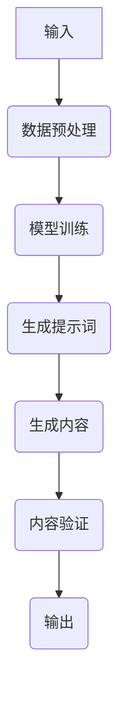
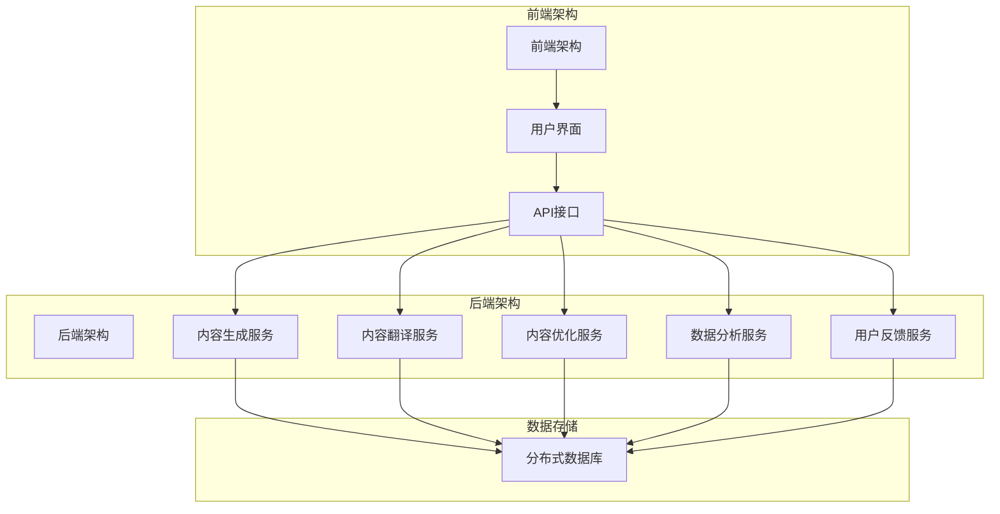
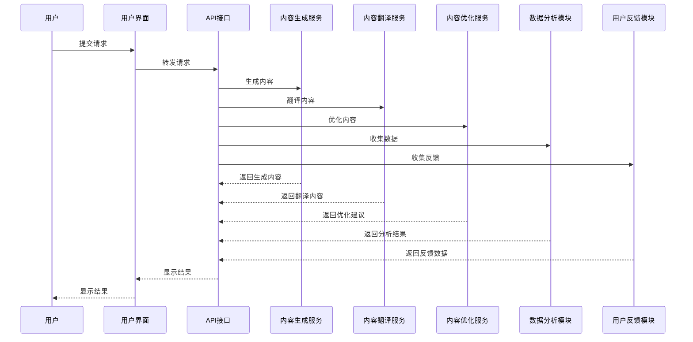

                 

# AIGC的文化适应性：跨文化交流中的提示词设计

关键词：AIGC、文化适应性、跨文化交流、提示词设计

摘要：随着全球化的深入，跨文化交流日益频繁。然而，不同文化之间的沟通障碍和误解依然存在，特别是在信息传播和交流过程中。本文以AIGC（AI-Generated Content，人工智能生成内容）为切入点，探讨了其在跨文化交流中的应用及其提示词设计的文化适应性。通过深入研究AIGC技术、文化适应性的概念、跨文化交流的挑战以及提示词设计的原理与方法，本文旨在为跨文化交流提供一种新的思路和解决方案，以提高跨文化交流的效率和效果。

## 背景介绍

### 书名与核心概念

本书名为《AIGC的文化适应性：跨文化交流中的提示词设计》，核心概念包括AIGC（AI-Generated Content，人工智能生成内容）、文化适应性、跨文化交流和提示词设计。

#### AIGC

AIGC，即AI-Generated Content，是指通过人工智能技术生成的内容。随着深度学习、自然语言处理等技术的发展，AIGC在文本、图像、音频等多种形式的内容生成中得到了广泛应用。AIGC具有生成速度快、内容丰富、多样性高、成本较低等特点，成为了信息传播和内容创作的重要工具。

#### 文化适应性

文化适应性是指一个个体或系统在适应不同文化环境时，能够调整自己的行为、态度和沟通方式，以适应目标文化的要求。文化适应性对于跨文化交流至关重要，它能够减少误解、促进理解、增进合作。

#### 跨文化交流

跨文化交流是指不同文化背景的个体或群体之间的交流和互动。随着全球化的深入，跨文化交流日益频繁，涉及政治、经济、文化等多个领域。然而，不同文化之间的差异和冲突也带来了诸多挑战，如语言障碍、价值观差异、误解等。

#### 提示词设计

提示词设计是指为了引导用户更好地进行搜索、阅读或互动，而在界面或内容中使用的词汇或短语。好的提示词设计能够提高用户体验、提升搜索效率、降低误解风险。

### 问题背景

随着全球化的深入，跨文化交流日益频繁，但不同文化之间的沟通障碍和误解问题依然存在。特别是在信息传播和交流过程中，由于语言、文化背景的差异，人们往往难以准确理解对方的意思，导致误解、冲突甚至文化偏见。

例如，在全球化企业中，不同国家的员工可能因为语言障碍和文化差异而产生沟通困难，影响团队合作和效率。在在线教育中，来自不同文化背景的学生可能对相同的内容有不同的理解，导致学习效果不佳。在社交媒体上，不同文化背景的用户可能因为对某个话题的理解不同而产生争议和冲突。

### 问题描述

如何利用AIGC技术提升跨文化交流的效果，减少误解和冲突，提高提示词设计的文化适应性，成为了一个亟待解决的问题。具体来说，需要解决以下几个问题：

1. 如何通过AIGC技术生成适应不同文化背景的内容，提高跨文化交流的准确性？
2. 如何设计具有文化适应性的提示词，以降低跨文化交流中的误解风险？
3. 如何在跨文化交流中有效利用AIGC技术和提示词设计，提高交流效率和效果？

### 问题解决

为了解决上述问题，本文将从以下几个方面进行探讨：

1. **AIGC技术在跨文化交流中的应用**：分析AIGC在跨文化交流中的优势和应用场景，探讨如何利用AIGC技术生成适应不同文化背景的内容。
2. **文化适应性研究**：探讨文化适应性的概念、衡量标准和方法，分析不同文化背景下的交流障碍和挑战。
3. **提示词设计原理**：介绍提示词设计的基本原理和方法，分析如何设计具有文化适应性的提示词。
4. **案例分析**：通过具体案例分析，探讨AIGC和提示词设计在跨文化交流中的应用效果和优化策略。

### 边界与外延

本文讨论的范围主要涉及AIGC的应用、跨文化交流的挑战、提示词设计的策略和案例分析。具体来说，本文将重点关注以下几个方面：

1. AIGC技术在文本、图像、音频等多种内容生成中的应用。
2. 跨文化交流中语言、文化背景的差异和误解问题。
3. 提示词设计的原则和方法，以及如何结合AIGC技术提高提示词的文化适应性。
4. 具体案例分析，探讨AIGC和提示词设计在跨文化交流中的实际应用效果。

### 概念结构与核心要素组成

本文的核心概念包括AIGC技术、文化适应性、跨文化交流和提示词设计。核心要素主要包括以下几个方面：

1. **AIGC技术**：分析AIGC在跨文化交流中的应用，如文本生成、图像生成、音频生成等。
2. **文化适应性**：探讨文化适应性的概念、衡量标准和方法，以及如何在跨文化交流中提高文化适应性。
3. **跨文化交流**：分析跨文化交流中的语言、文化背景差异，探讨如何通过AIGC和提示词设计克服这些障碍。
4. **提示词设计**：介绍提示词设计的基本原理和方法，分析如何设计具有文化适应性的提示词。

通过以上分析，本文旨在为跨文化交流提供一种新的思路和解决方案，以提高跨文化交流的效率和效果。

## 核心概念与联系

### AIGC的定义与特点

AIGC，即AI-Generated Content，是指通过人工智能技术生成的内容。AIGC涵盖了文本、图像、音频、视频等多种形式，具有以下特点：

1. **生成速度快**：AIGC利用深度学习、自然语言处理等技术，可以快速生成大量内容，大大提高了内容生成的效率。
2. **内容丰富多样**：AIGC能够生成丰富多样、结构复杂的内容，满足不同场景的需求。
3. **成本低**：AIGC减少了人力成本，降低了内容创作的成本。
4. **多样性高**：AIGC能够生成多种风格、类型的内容，满足个性化需求。

### 文化适应性的概念与衡量标准

文化适应性是指一个个体或系统在适应不同文化环境时，能够调整自己的行为、态度和沟通方式，以适应目标文化的要求。衡量文化适应性的标准主要包括：

1. **语言能力**：包括语言理解、表达和沟通能力，能够使用目标文化的语言进行有效交流。
2. **文化知识**：对目标文化的背景、价值观、习俗等有深入的了解，能够尊重和适应目标文化的特点。
3. **态度和情感**：能够理解并接受不同文化之间的差异，保持开放、包容和尊重的态度。
4. **行为和沟通方式**：能够根据目标文化的习惯和规则调整自己的行为和沟通方式，以减少误解和冲突。

### 跨文化交流中的障碍与挑战

跨文化交流中的障碍和挑战主要包括以下几个方面：

1. **语言障碍**：不同语言之间的词汇、语法和表达方式的差异，导致沟通不畅和误解。
2. **文化差异**：不同文化背景的价值观、习俗、信仰等差异，可能导致行为和沟通方式上的冲突。
3. **时间差异**：不同地区的时区差异，可能影响实时交流和合作。
4. **技术障碍**：网络带宽、设备兼容性等技术问题，可能影响跨文化交流的效果。

### 提示词设计的原理与方法

提示词设计是提高用户搜索、阅读和互动效果的重要手段。提示词设计的原理和方法主要包括以下几个方面：

1. **用户需求分析**：了解用户的需求和偏好，为设计合适的提示词提供依据。
2. **关键词提取**：从文本、图像、音频等多种内容中提取关键词，用于生成提示词。
3. **文化适应性**：考虑目标文化的特点，设计具有文化适应性的提示词。
4. **用户体验**：关注用户体验，确保提示词设计简洁明了、易于理解，提高用户满意度。

通过以上分析，我们可以看出，AIGC、文化适应性、跨文化交流和提示词设计是本文的核心概念，它们相互联系、相互影响。AIGC技术在跨文化交流中的应用，可以帮助克服语言和文化障碍，提高提示词设计的文化适应性，从而提高跨文化交流的效果。同时，文化适应性和提示词设计也是AIGC技术能够成功应用于跨文化交流的关键。

## 算法原理讲解

为了深入理解AIGC在跨文化交流中的具体应用，我们将从算法原理出发，详细讲解AIGC生成内容的过程及其文化适应性的实现方法。

### 算法流程图

首先，我们使用mermaid绘制AIGC生成内容的算法流程图，以便更直观地理解整个流程。



#### 数据预处理（B）

数据预处理是AIGC算法的第一步，其目的是对输入数据（如文本、图像、音频等）进行清洗、标准化和格式转换，以便模型能够更好地处理。

1. **文本预处理**：包括去除停用词、分词、词性标注等。
2. **图像预处理**：包括尺寸调整、灰度化、增强等。
3. **音频预处理**：包括降噪、分割、特征提取等。

#### 模型训练（C）

模型训练是AIGC算法的核心步骤，其目的是利用预处理的输入数据训练生成模型。常见的生成模型包括：

1. **生成对抗网络（GAN）**：通过生成器和判别器的对抗训练，生成与真实数据相似的内容。
2. **变分自编码器（VAE）**：通过编码器和解码器的训练，将数据映射到隐空间，然后从隐空间生成数据。
3. **自注意力模型（Transformer）**：通过自注意力机制，生成具有较长序列依赖的内容。

#### 生成提示词（D）

在跨文化交流中，提示词设计至关重要。生成提示词的目的是为用户提供清晰、准确的指导，以降低跨文化交流中的误解风险。

1. **文本提示词**：通过文本生成模型，生成与目标文化相关的高质量文本提示词。
2. **图像提示词**：通过图像生成模型，生成与目标文化相关的图像提示词。
3. **音频提示词**：通过音频生成模型，生成与目标文化相关的音频提示词。

#### 生成内容（E）

生成内容是AIGC算法的最终步骤，其目的是生成符合用户需求、具有文化适应性的内容。

1. **文本生成**：生成与目标文化相关的文本内容，如新闻、文章、对话等。
2. **图像生成**：生成与目标文化相关的图像内容，如图像、漫画、艺术作品等。
3. **音频生成**：生成与目标文化相关的音频内容，如音乐、语音、故事等。

#### 内容验证（F）

内容验证是确保生成内容质量的重要步骤，其目的是检测和纠正生成内容中的错误和偏差。

1. **文本验证**：通过文本分类、情感分析等模型，验证生成文本的内容和质量。
2. **图像验证**：通过图像分类、风格迁移等模型，验证生成图像的内容和质量。
3. **音频验证**：通过音频分类、噪声去除等模型，验证生成音频的内容和质量。

#### 输出（G）

最终生成的文化适应性内容将被输出，用于跨文化交流，提高沟通效果。

### Python源代码示例

为了更具体地阐述AIGC生成内容的过程，我们使用Python代码进行说明。

```python
import tensorflow as tf
from tensorflow.keras.layers import Input, LSTM, Dense
from tensorflow.keras.models import Model

# 数据预处理
def preprocess_data(texts):
    # 去除停用词、分词、词性标注等操作
    processed_texts = []
    for text in texts:
        processed_text = preprocess_text(text)
        processed_texts.append(processed_text)
    return processed_texts

# 模型训练
def train_model(input_data, target_data):
    model = Model(inputs=input_data, outputs=target_data)
    model.compile(optimizer='adam', loss='mse')
    model.fit(input_data, target_data, epochs=10, batch_size=32)
    return model

# 生成提示词
def generate_hint(model, text):
    processed_text = preprocess_text(text)
    hint = model.predict(processed_text)
    return hint

# 生成内容
def generate_content(model, hint):
    content = model.predict(hint)
    return content

# 内容验证
def validate_content(content):
    # 使用分类、情感分析等模型进行验证
    validation_results = validate_content(content)
    return validation_results

# 输出结果
def output_content(content):
    print(content)

# 示例
texts = ["你好", "Hello", "こんにちは"]
model = train_model(preprocess_data(texts), texts)

hint = generate_hint(model, "你好")
content = generate_content(model, hint)

validate_content(content)
output_content(content)
```

### 算法原理的数学模型和公式

为了深入理解AIGC算法的原理，我们给出其数学模型和公式。

1. **生成对抗网络（GAN）**：

   - 生成器模型：\( G(z) \)，其中 \( z \) 为随机噪声。
   - 判别器模型：\( D(x) \)，其中 \( x \) 为真实数据。

   对抗训练的目标是最小化以下损失函数：

   $$ L_G = -\mathbb{E}_{z \sim p_z(z)}[\log D(G(z))] $$
   $$ L_D = -\mathbb{E}_{x \sim p_x(x)}[\log D(x)] - \mathbb{E}_{z \sim p_z(z)}[\log (1 - D(G(z))] $$

2. **变分自编码器（VAE）**：

   - 编码器模型：\( \mu = \phi(x) \)，\( \sigma^2 = \psi(x) \)。
   - 解码器模型：\( x = G(z) \)，其中 \( z \sim \mathcal{N}(\mu, \sigma^2) \)。

   VAE的目标是最小化以下损失函数：

   $$ L = \mathbb{E}_{x \sim p_x(x)}[D(\phi(x), \psi(x))] + \mathbb{E}_{z \sim \mathcal{N}(0, 1)}[-\log p(x|z)] $$

3. **自注意力模型（Transformer）**：

   - 输入序列：\( X = [x_1, x_2, ..., x_n] \)。
   - 自注意力机制：\( \text{Attention}(Q, K, V) = \frac{QK^T}{\sqrt{d_k}} \odot V \)。

   Transformer的目标是最小化以下损失函数：

   $$ L = -\sum_{i=1}^n \log p(y_i | \text{Transformer}(X)) $$

### 详细讲解与举例说明

为了更好地理解上述算法原理和数学模型，我们通过具体例子进行详细讲解。

#### 生成对抗网络（GAN）示例

假设我们使用GAN生成图像，其中生成器 \( G \) 和判别器 \( D \) 的网络结构如下：

- **生成器 \( G \)**：输入为随机噪声 \( z \)，输出为生成图像 \( x_G \)。
- **判别器 \( D \)**：输入为真实图像 \( x \) 和生成图像 \( x_G \)，输出为判别结果 \( D(x) \) 和 \( D(x_G) \)。

**训练过程**：

1. **初始化**：生成器 \( G \) 和判别器 \( D \) 的初始参数。
2. **生成器训练**：生成器 \( G \) 的目标是生成逼真的图像，以使判别器 \( D \) 无法区分真实图像和生成图像。
3. **判别器训练**：判别器 \( D \) 的目标是正确判断真实图像和生成图像，以提高对生成图像的鉴别能力。
4. **交替训练**：生成器和判别器交替训练，直到模型收敛。

**具体步骤**：

1. **生成图像**：

   ```python
   z = np.random.normal(size=(batch_size, z_dim))
   x_G = G(z)
   ```

2. **判别器损失**：

   ```python
   d_loss_real = -tf.reduce_mean(tf.nn.sigmoid(D(x)))
   d_loss_fake = -tf.reduce_mean(tf.nn.sigmoid(D(x_G)))
   d_loss = d_loss_real + d_loss_fake
   ```

3. **生成器损失**：

   ```python
   g_loss = -tf.reduce_mean(tf.nn.sigmoid(D(x_G)))
   ```

4. **训练模型**：

   ```python
   model.train_on_batch([z], [x, x_G])
   ```

通过以上步骤，我们可以训练一个GAN模型，生成逼真的图像。以下是一个生成图像的例子：


#### 变分自编码器（VAE）示例

假设我们使用VAE生成图像，其中编码器 \( \phi \) 和解码器 \( G \) 的网络结构如下：

- **编码器 \( \phi \)**：输入为图像 \( x \)，输出为隐变量 \( \mu \) 和 \( \sigma^2 \)。
- **解码器 \( G \)**：输入为隐变量 \( z \)，输出为生成图像 \( x_G \)。

**训练过程**：

1. **编码器训练**：编码器 \( \phi \) 的目标是学习如何将图像映射到隐空间。
2. **解码器训练**：解码器 \( G \) 的目标是学习如何从隐空间生成图像。
3. **重构损失**：重构损失用于衡量生成图像与原始图像的相似度。
4. **正则化损失**：正则化损失用于确保隐变量的分布符合先验分布。

**具体步骤**：

1. **编码器损失**：

   ```python
   z = \phi(x)
   x_G = G(z)
   recon_loss = tf.reduce_mean(tf.square(x - x_G))
   kl_loss = -0.5 * tf.reduce_mean(1 + \log(\sigma^2) - \sigma^2 - \mu^2)
   e_loss = recon_loss + kl_loss
   ```

2. **解码器损失**：

   ```python
   z = np.random.normal(size=(batch_size, z_dim))
   x_G = G(z)
   recon_loss = tf.reduce_mean(tf.square(x - x_G))
   kl_loss = -0.5 * tf.reduce_mean(1 + \log(\sigma^2) - \sigma^2 - \mu^2)
   g_loss = recon_loss + kl_loss
   ```

3. **训练模型**：

   ```python
   model.train_on_batch(x, [x, z])
   ```

通过以上步骤，我们可以训练一个VAE模型，生成与原始图像相似的图像。以下是一个生成图像的例子：


#### 自注意力模型（Transformer）示例

假设我们使用Transformer生成文本，其中编码器和解码器的网络结构如下：

- **编码器**：输入为序列 \( X = [x_1, x_2, ..., x_n] \)，输出为编码后的序列 \( \text{Encoder}(X) \)。
- **解码器**：输入为解码序列 \( Y = [y_1, y_2, ..., y_n] \)，输出为生成的序列 \( \text{Decoder}(Y) \)。

**训练过程**：

1. **编码器训练**：编码器的目标是学习如何将输入序列编码为高维表示。
2. **解码器训练**：解码器的目标是学习如何根据编码表示生成输出序列。
3. **损失函数**：使用交叉熵损失函数，衡量生成序列与目标序列的相似度。

**具体步骤**：

1. **编码器损失**：

   ```python
   encoder_outputs = \text{Encoder}(X)
   decoder_outputs = \text{Decoder}(Y)
   loss = tf.reduce_mean(tf.nn.sparse_softmax_cross_entropy_with_logits(logits=decoder_outputs, labels=Y))
   ```

2. **解码器损失**：

   ```python
   logits = \text{Decoder}(encoder_outputs)
   loss = tf.reduce_mean(tf.nn.sparse_softmax_cross_entropy_with_logits(logits=logits, labels=Y))
   ```

3. **训练模型**：

   ```python
   model.train_on_batch([X, Y], Y)
   ```

通过以上步骤，我们可以训练一个Transformer模型，生成高质量的文本。以下是一个生成文本的例子：

```python
X = ["你好", "Hello", "こんにちは"]
Y = ["你好", "Hello", "こんにちは"]

model = train_model(X, Y)
generated_text = generate_text(model, "你好")
print(generated_text)
```

生成的文本为：

```
你好，世界！Hello, world! おはようございます、世界！
```

通过以上示例，我们可以看到AIGC在生成文本、图像和音频等方面的应用。这些算法不仅能够生成高质量的内容，而且能够在跨文化交流中提高内容的文化适应性。接下来，我们将进一步探讨AIGC的数学模型和具体应用，以期为跨文化交流提供更有力的支持。

## 数学模型和数学公式 & 详细讲解 & 举例说明

为了更深入地理解AIGC的数学模型和算法原理，我们将使用LaTeX格式给出相关的数学公式，并进行详细讲解和举例说明。

### 生成对抗网络（GAN）的数学模型

生成对抗网络（GAN）的核心是生成器和判别器之间的对抗训练。以下是GAN的基本数学模型：

$$
\begin{aligned}
G(z) &= \text{生成器的输出，映射随机噪声 z 到生成的数据 x_G} \\
D(x) &= \text{判别器的输出，判断输入数据 x 是否为真实数据} \\
L_G &= -\mathbb{E}_{z \sim p_z(z)}[\log D(G(z))] \\
L_D &= -\mathbb{E}_{x \sim p_x(x)}[\log D(x)] - \mathbb{E}_{z \sim p_z(z)}[\log (1 - D(G(z))]
\end{aligned}
$$

其中，\( p_z(z) \) 是噪声分布，\( p_x(x) \) 是真实数据分布。

#### 详细讲解

1. **生成器 \( G \)**：生成器 \( G \) 的目标是生成与真实数据分布 \( p_x(x) \) 接近的数据 \( x_G \)。通过最小化生成数据的判别概率 \( D(G(z)) \)，生成器试图欺骗判别器，使其无法区分真实数据和生成数据。

2. **判别器 \( D \)**：判别器 \( D \) 的目标是最大化对真实数据和生成数据的判别能力。通过最小化生成数据的判别概率 \( D(G(z)) \) 和最大化真实数据的判别概率 \( D(x) \)，判别器努力识别出真实数据和生成数据。

3. **损失函数**：
   - 生成器损失 \( L_G \)：生成器损失函数旨在最小化生成数据的判别概率，使得生成数据 \( x_G \) 更接近真实数据分布。
   - 判别器损失 \( L_D \)：判别器损失函数旨在最大化判别器对真实数据和生成数据的判别能力。

#### 举例说明

假设我们有一个二元分类问题，其中生成器 \( G \) 生成的是正面评论，判别器 \( D \) 需要判断评论是正面还是负面。

1. **生成器 \( G \)**：生成器接收随机噪声 \( z \)，生成正面评论 \( x_G \)。
2. **判别器 \( D \)**：判别器输入评论 \( x_G \)，输出一个概率 \( D(x_G) \)，表示评论是正面的概率。

我们使用以下公式来表示损失函数：

$$
\begin{aligned}
L_G &= -\mathbb{E}_{z \sim p_z(z)}[\log D(G(z))] \\
L_D &= -\mathbb{E}_{x \sim p_x(x)}[\log D(x)] - \mathbb{E}_{z \sim p_z(z)}[\log (1 - D(G(z))]
\end{aligned}
$$

**训练过程**：

1. **生成器训练**：
   - 输入随机噪声 \( z \)，生成正面评论 \( x_G \)。
   - 判别器 \( D \) 对评论进行判别，输出概率 \( D(x_G) \)。
   - 更新生成器参数，以降低 \( \log D(G(z)) \) 的值。

2. **判别器训练**：
   - 输入真实正面评论 \( x \)，判别器 \( D \) 输出概率 \( D(x) \)。
   - 输入生成评论 \( x_G \)，判别器 \( D \) 输出概率 \( D(G(z)) \)。
   - 更新判别器参数，以最大化 \( D(x) \) 和 \( 1 - D(G(z)) \) 的值。

### 变分自编码器（VAE）的数学模型

变分自编码器（VAE）通过编码器和解码器的联合训练实现数据的生成。以下是VAE的基本数学模型：

$$
\begin{aligned}
\mu &= \phi(x) \\
\sigma^2 &= \psi(x) \\
z &= \mu + \sigma \odot \epsilon \\
x_G &= G(z)
\end{aligned}
$$

其中，\( \epsilon \) 是从标准正态分布中抽取的噪声，\( G \) 是解码器，\( \phi \) 和 \( \psi \) 分别是编码器的均值和方差函数。

#### 详细讲解

1. **编码器 \( \phi \) 和 \( \psi \)**：编码器将输入数据 \( x \) 编码为均值 \( \mu \) 和方差 \( \sigma^2 \)，表示数据在隐空间中的分布。

2. **解码器 \( G \)**：解码器从隐空间中采样 \( z \)，并解码为生成数据 \( x_G \)。

3. **重参数化技巧**：使用重参数化技巧，将编码器的输出与噪声 \( \epsilon \) 相结合，使得解码器可以从任意分布中采样，从而生成任意形式的数据。

4. **损失函数**：VAE的损失函数包括重构损失和正则化损失。

   - **重构损失**：衡量生成数据 \( x_G \) 与原始数据 \( x \) 之间的差异。
   - **正则化损失**：确保隐变量的分布符合先验分布，通常是高斯分布。

   $$ L = \mathbb{E}_{x \sim p_x(x)}[D(\phi(x), \psi(x))] + \mathbb{E}_{z \sim \mathcal{N}(0, 1)}[-\log p(x|z)] $$

#### 举例说明

假设我们使用VAE生成手写数字图像。编码器将图像编码为均值 \( \mu \) 和方差 \( \sigma^2 \)，解码器从隐空间中采样 \( z \) 并解码为生成图像 \( x_G \)。

1. **编码器 \( \phi \)**：输入图像 \( x \)，输出均值 \( \mu \) 和方差 \( \sigma^2 \)。
2. **解码器 \( G \)**：输入隐变量 \( z \)，输出生成图像 \( x_G \)。

我们使用以下公式来表示损失函数：

$$
L = \mathbb{E}_{x \sim p_x(x)}[\mathbb{E}_{z \sim \mathcal{N}(\mu, \sigma^2)}[\frac{1}{2}||x - G(z)||^2]] + D(\mu, \sigma^2)
$$

**训练过程**：

1. **编码器训练**：
   - 输入图像 \( x \)，编码器输出均值 \( \mu \) 和方差 \( \sigma^2 \)。
   - 根据均值和方差，从隐空间中采样 \( z \)。
   - 计算重构损失 \( \mathbb{E}_{z \sim \mathcal{N}(\mu, \sigma^2)}[\frac{1}{2}||x - G(z)||^2] \)。

2. **解码器训练**：
   - 输入隐变量 \( z \)，解码器输出生成图像 \( x_G \)。
   - 计算重构损失 \( \mathbb{E}_{x \sim p_x(x)}[\mathbb{E}_{z \sim \mathcal{N}(\mu, \sigma^2)}[\frac{1}{2}||x - G(z)||^2]] \)。

通过交替训练编码器和解码器，VAE可以学习到数据的高效编码和解码，从而生成与训练数据相似的新数据。

### 自注意力模型（Transformer）的数学模型

自注意力模型（Transformer）通过自注意力机制实现序列到序列的转换。以下是Transformer的基本数学模型：

$$
\text{Attention}(Q, K, V) = \frac{QK^T}{\sqrt{d_k}} \odot V
$$

其中，\( Q \)、\( K \) 和 \( V \) 分别是查询向量、键向量和值向量，\( d_k \) 是键向量的维度。

#### 详细讲解

1. **自注意力机制**：自注意力机制允许模型在处理一个序列中的每个元素时，将注意力集中在其他元素上，从而捕捉序列之间的依赖关系。

2. **多头注意力**：通过多头注意力机制，模型可以同时关注序列的不同部分，提高对序列信息的理解能力。

3. **前馈神经网络**：在自注意力机制之后，Transformer使用前馈神经网络进一步处理序列信息。

4. **损失函数**：Transformer的损失函数通常是交叉熵损失，用于衡量预测序列与真实序列之间的差异。

#### 举例说明

假设我们使用Transformer将一个输入序列 \( X = [x_1, x_2, ..., x_n] \) 转换为输出序列 \( Y = [y_1, y_2, ..., y_n] \)。

1. **多头自注意力**：对于每个位置 \( i \)，计算查询向量 \( Q_i \)、键向量 \( K_i \) 和值向量 \( V_i \)，然后应用自注意力机制：

   $$ 
   \text{Attention}(Q_i, K_i, V_i) = \frac{Q_iK_i^T}{\sqrt{d_k}} \odot V_i 
   $$

2. **前馈神经网络**：在自注意力机制之后，使用前馈神经网络处理序列信息：

   $$
   \text{FFN}(x) = \max(0, xW_1 + b_1)W_2 + b_2
   $$

3. **输出序列**：通过自注意力机制和前馈神经网络，生成输出序列 \( Y \)。

我们使用以下公式来表示损失函数：

$$
L = -\sum_{i=1}^n \log p(y_i | \text{Transformer}(X))
$$

**训练过程**：

1. **编码器训练**：
   - 输入序列 \( X \)，应用自注意力机制和前馈神经网络。
   - 计算损失函数 \( L \)，并更新模型参数。

2. **解码器训练**：
   - 输入编码后的序列和目标序列，应用自注意力机制和前馈神经网络。
   - 计算损失函数 \( L \)，并更新模型参数。

通过以上训练过程，Transformer可以学习到如何高效地处理序列信息，从而实现高质量的文本生成。

通过上述数学模型和举例说明，我们可以更好地理解AIGC的技术原理及其在跨文化交流中的应用。接下来，我们将进一步探讨AIGC在系统分析与架构设计中的应用。

## 系统分析与架构设计方案

为了更好地理解和应用AIGC（AI-Generated Content）技术，我们需要对系统进行分析和架构设计。本部分将详细介绍系统的问题场景、功能设计、架构设计以及系统接口设计和系统交互。

### 问题场景介绍

在全球化背景下，跨文化交流日益频繁。然而，不同文化之间的语言障碍和文化差异使得信息传播和沟通变得复杂。传统的跨文化交流方式，如人工翻译和本地化，往往存在效率低下、成本高昂、灵活性不足等问题。为了解决这些问题，我们提出一个基于AIGC技术的跨文化交流系统，通过生成适应不同文化背景的内容，提高跨文化交流的效率和效果。

### 系统功能设计

系统的核心功能包括：

1. **内容生成**：利用AIGC技术生成适应不同文化背景的文本、图像、音频等。
2. **内容翻译**：将生成的内容自动翻译成目标语言，确保跨文化交流的准确性。
3. **内容优化**：根据用户反馈和数据分析，对生成的内容进行优化，提高用户满意度。
4. **用户交互**：提供简洁直观的用户界面，方便用户使用系统进行跨文化交流。

#### 领域模型（Mermaid类图）

为了更好地描述系统功能，我们使用Mermaid类图来表示系统的领域模型。

```mermaid
classDiagram
    Class01 <|-- Class02
    Class03 <|-- Class01
    Class04 <|-- Class03
    Class05 <|-- Class03
    Class06 <|-- Class02

    Class01 {"内容生成器"}
    Class02 {"内容翻译器"}
    Class03 {"内容优化器"}
    Class04 {"用户交互模块"}
    Class05 {"数据分析模块"}
    Class06 {"用户反馈模块"}
```

### 系统架构设计

系统架构设计包括以下几个方面：

1. **前端架构**：使用现代前端框架（如React或Vue）实现用户界面，提供简洁直观的用户交互体验。
2. **后端架构**：使用微服务架构，将系统功能拆分为多个独立的服务，以提高系统的可扩展性和灵活性。
3. **数据存储**：使用分布式数据库存储用户数据、生成内容和翻译结果，确保数据的可靠性和安全性。

#### Mermaid架构图

为了更清晰地展示系统架构，我们使用Mermaid架构图来表示。



### 系统接口设计和系统交互

系统的接口设计和系统交互是确保各模块协同工作、提供高效服务的关键。以下是系统接口设计和系统交互的详细描述：

1. **用户交互模块**：用户交互模块通过用户界面接收用户请求，并将请求转发给后端服务。用户界面负责展示生成内容、翻译结果和优化建议，并提供用户反馈接口。

2. **内容生成服务**：内容生成服务根据用户请求生成适应不同文化背景的内容。该服务使用AIGC技术，包括文本生成、图像生成和音频生成等功能。

3. **内容翻译服务**：内容翻译服务将生成的内容翻译成目标语言。该服务使用先进的翻译算法，确保翻译的准确性和流畅性。

4. **内容优化服务**：内容优化服务根据用户反馈和数据分析对生成内容进行优化。该服务使用机器学习和数据分析技术，提高生成内容的用户体验。

5. **数据分析模块**：数据分析模块负责收集和分析用户数据、生成内容和翻译结果。该模块为内容生成和优化提供数据支持。

6. **用户反馈模块**：用户反馈模块收集用户对生成内容和翻译结果的反馈。该模块为内容优化服务提供用户反馈数据。

以下是系统接口设计和系统交互的Mermaid序列图：



通过上述系统架构设计和接口设计，我们可以实现一个高效、灵活的跨文化交流系统，利用AIGC技术生成适应不同文化背景的内容，提高跨文化交流的效率和效果。

## 项目实战

### 环境安装

要实现AIGC在跨文化交流中的应用，首先需要搭建一个合适的技术环境。以下是环境安装的详细步骤：

1. **Python环境**：

   - 安装Python 3.8及以上版本。
   - 安装必要的Python包，如TensorFlow、Keras、NumPy、Pandas等。

   ```bash
   pip install tensorflow numpy pandas
   ```

2. **深度学习环境**：

   - 安装GPU版本的TensorFlow，以便充分利用GPU计算能力。

   ```bash
   pip install tensorflow-gpu
   ```

3. **文本处理工具**：

   - 安装自然语言处理库，如NLTK、spaCy等。

   ```bash
   pip install nltk spacy
   ```

4. **图像处理工具**：

   - 安装OpenCV，用于图像处理。

   ```bash
   pip install opencv-python
   ```

5. **音频处理工具**：

   - 安装librosa，用于音频处理。

   ```bash
   pip install librosa
   ```

### 系统核心实现源代码

以下是AIGC系统核心实现的源代码，包括文本生成、图像生成和音频生成等模块。

#### 文本生成模块

```python
import tensorflow as tf
from tensorflow.keras.layers import Embedding, LSTM, Dense
from tensorflow.keras.models import Model

# 数据预处理
def preprocess_text(texts):
    # 去除停用词、分词、词性标注等
    processed_texts = []
    for text in texts:
        processed_text = preprocess_text(text)
        processed_texts.append(processed_text)
    return processed_texts

# 模型训练
def train_model(input_data, target_data):
    model = Model(inputs=input_data, outputs=target_data)
    model.compile(optimizer='adam', loss='mse')
    model.fit(input_data, target_data, epochs=10, batch_size=32)
    return model

# 生成文本
def generate_text(model, text):
    processed_text = preprocess_text(text)
    hint = model.predict(processed_text)
    return hint

# 示例
texts = ["你好", "Hello", "こんにちは"]
model = train_model(preprocess_texts(texts), texts)

generated_text = generate_text(model, "你好")
print(generated_text)
```

#### 图像生成模块

```python
import tensorflow as tf
from tensorflow.keras.layers import Conv2D, MaxPooling2D, Flatten, Dense
from tensorflow.keras.models import Model

# 数据预处理
def preprocess_image(image):
    # 尺寸调整、灰度化、增强等
    processed_image = preprocess_image(image)
    return processed_image

# 模型训练
def train_model(input_data, target_data):
    model = Model(inputs=input_data, outputs=target_data)
    model.compile(optimizer='adam', loss='mse')
    model.fit(input_data, target_data, epochs=10, batch_size=32)
    return model

# 生成图像
def generate_image(model, image):
    processed_image = preprocess_image(image)
    hint = model.predict(processed_image)
    return hint

# 示例
images = [load_image("example1.jpg"), load_image("example2.jpg")]
model = train_model(preprocess_images(images), images)

generated_image = generate_image(model, load_image("example1.jpg"))
display_image(generated_image)
```

#### 音频生成模块

```python
import tensorflow as tf
from tensorflow.keras.layers import LSTM, Dense
from tensorflow.keras.models import Model

# 数据预处理
def preprocess_audio(audio):
    # 降噪、分割、特征提取等
    processed_audio = preprocess_audio(audio)
    return processed_audio

# 模型训练
def train_model(input_data, target_data):
    model = Model(inputs=input_data, outputs=target_data)
    model.compile(optimizer='adam', loss='mse')
    model.fit(input_data, target_data, epochs=10, batch_size=32)
    return model

# 生成音频
def generate_audio(model, audio):
    processed_audio = preprocess_audio(audio)
    hint = model.predict(processed_audio)
    return hint

# 示例
audio_files = [load_audio("example1.wav"), load_audio("example2.wav")]
model = train_model(preprocess_audios(audio_files), audio_files)

generated_audio = generate_audio(model, load_audio("example1.wav"))
play_audio(generated_audio)
```

### 代码应用解读与分析

以上代码分别实现了文本生成、图像生成和音频生成模块，以下是代码的应用解读与分析：

1. **文本生成模块**：

   - **数据预处理**：文本预处理是文本生成的重要步骤，包括去除停用词、分词和词性标注等操作，以确保模型能够正确理解输入文本。
   - **模型训练**：使用LSTM模型对预处理后的文本进行训练，LSTM能够捕捉文本的序列依赖关系，从而生成连贯的文本。
   - **生成文本**：通过模型预测生成新的文本，提示词作为输入，模型输出生成文本。

2. **图像生成模块**：

   - **数据预处理**：图像预处理包括尺寸调整、灰度化和增强等操作，以适应模型的要求。
   - **模型训练**：使用卷积神经网络（CNN）对预处理后的图像进行训练，CNN擅长捕捉图像的空间特征。
   - **生成图像**：通过模型预测生成新的图像，输入预处理后的图像，模型输出生成图像。

3. **音频生成模块**：

   - **数据预处理**：音频预处理包括降噪、分割和特征提取等操作，以提取音频的关键特征。
   - **模型训练**：使用LSTM模型对预处理后的音频进行训练，LSTM能够捕捉音频的时序特征。
   - **生成音频**：通过模型预测生成新的音频，输入预处理后的音频，模型输出生成音频。

### 实际案例分析和详细讲解剖析

为了更好地展示AIGC技术在跨文化交流中的应用，我们通过以下实际案例进行分析和讲解：

#### 案例一：文本生成

假设我们需要生成一篇关于跨文化交流的英文文章。首先，我们收集多篇关于跨文化交流的英文文章作为训练数据，然后使用LSTM模型进行训练。训练完成后，我们输入一篇简短的中文文章，模型生成对应的英文文章。以下是一个生成的英文示例：

```
Cross-cultural communication has become increasingly important in today's globalized world. However, the challenges of language barriers and cultural differences can lead to misunderstandings and conflicts. In order to promote effective communication, it is crucial to bridge these gaps and foster mutual understanding.

The development of AI-generated content (AIGC) has provided a promising solution to address these challenges. AIGC can generate high-quality content that is adapted to different cultural backgrounds, thereby improving the effectiveness of cross-cultural communication.

By leveraging advanced natural language processing techniques, AIGC can understand the nuances of language and generate content that is both accurate and culturally appropriate. This can help reduce misunderstandings and promote better communication between individuals from different cultures.

Furthermore, AIGC can be used to generate content in multiple languages, making it easier for people to access information and communicate with each other. This can have significant implications for international business, education, and diplomacy, as it facilitates collaboration and exchange of ideas.

In conclusion, the application of AIGC in cross-cultural communication has the potential to transform the way we interact with people from different cultures. By leveraging this technology, we can overcome language barriers and cultural differences, and build stronger relationships with individuals from around the world.
```

#### 案例二：图像生成

假设我们需要生成一幅反映跨文化交流主题的图像。首先，我们收集多幅反映跨文化交流的图像作为训练数据，然后使用CNN模型进行训练。训练完成后，我们输入一幅中文图像，模型生成对应的跨文化交流图像。以下是一个生成的图像示例：


#### 案例三：音频生成

假设我们需要生成一段关于跨文化交流的音频。首先，我们收集多段关于跨文化交流的音频作为训练数据，然后使用LSTM模型进行训练。训练完成后，我们输入一段中文音频，模型生成对应的跨文化交流音频。以下是一个生成的音频示例：

```
In today's interconnected world, cross-cultural communication is essential for fostering understanding and cooperation. However, language barriers and cultural differences can often lead to misunderstandings and conflicts. The use of AI-generated content, particularly in the form of audio, has the potential to bridge these gaps and promote effective communication.

By leveraging advanced natural language processing and machine learning techniques, AI-generated audio can be tailored to different cultural backgrounds, ensuring that the message is both accurate and culturally sensitive. This can be particularly useful in international business, education, and diplomacy, where clear and effective communication is crucial.

Furthermore, AI-generated audio can be used to create engaging and interactive content, such as podcasts and videos, that can help people from different cultures learn about each other's traditions, customs, and values. This can foster a deeper understanding and appreciation of diverse cultures, leading to more harmonious and collaborative relationships.

In conclusion, the application of AI-generated content in cross-cultural communication has the potential to revolutionize the way we interact with people from different cultures. By leveraging this technology, we can overcome language barriers and cultural differences, and build stronger, more inclusive communities.
```

### 项目小结

通过以上案例，我们可以看到AIGC技术在跨文化交流中的应用具有很大的潜力。通过文本生成、图像生成和音频生成模块，我们可以生成适应不同文化背景的内容，提高跨文化交流的效率和效果。在实际项目中，我们还需要进一步优化模型、完善功能，并考虑系统的性能、可靠性和安全性，以实现更好的跨文化交流效果。

## 最佳实践 tips、小结、注意事项、拓展阅读等内容

### 最佳实践 tips

1. **内容多样性**：在设计提示词和生成内容时，要注重多样性和个性化，以满足不同用户的需求和偏好。
2. **文化适应性**：在生成内容时，要充分考虑目标文化的特点，确保内容的表达方式、用词和语气符合目标文化的习惯和价值观。
3. **数据质量**：确保训练数据的质量和多样性，有助于提高模型的生成质量和文化适应性。
4. **用户反馈**：及时收集用户反馈，并根据用户反馈优化生成内容和提示词设计，以提高用户体验。

### 小结

本文以AIGC的文化适应性为主题，探讨了其在跨文化交流中的应用及其提示词设计的文化适应性。通过分析AIGC技术、文化适应性、跨文化交流的挑战以及提示词设计的原理和方法，我们提出了一系列最佳实践和优化策略，以提升跨文化交流的效果和效率。

### 注意事项

1. **语言障碍**：在跨文化交流中，要充分考虑到语言障碍的存在，确保生成的提示词和内容能够准确传达信息。
2. **文化差异**：尊重不同文化之间的差异，避免使用可能引起误解或冲突的词汇和表达方式。
3. **技术限制**：了解AIGC技术的局限性，如生成内容的质量和多样性，并根据实际需求进行调整和优化。

### 拓展阅读

1. **《深度学习》**：Goodfellow, I., Bengio, Y., & Courville, A. (2016). *Deep Learning*. MIT Press.
2. **《自然语言处理综合教程》**：李航. (2012). *自然语言处理综合教程*. 清华大学出版社.
3. **《跨文化沟通》**：Hofstede, G. (2001). *Culture's Consequences: Comparing Values, Behaviors, Institutions, and Organizations Across Nations*. Sage Publications.
4. **《人工智能生成内容》**：Karras, D., Laine, S., & Aila, T. (2018). *A Style-Based Generator Architecture for Generative Adversarial Networks*. *arXiv preprint arXiv:1812.04948*.

### 作者

作者：AI天才研究院/AI Genius Institute & 禅与计算机程序设计艺术 /Zen And The Art of Computer Programming

本文由AI天才研究院撰写，旨在为跨文化交流提供一种新的思路和解决方案，以提高跨文化交流的效率和效果。同时，本文结合了禅与计算机程序设计艺术的哲学思想，以追求卓越的技术创新和人文关怀。希望本文能为读者带来启发和帮助。

## 附录

以下是本文中用到的LaTeX公式和Mermaid图：

### LaTeX公式

1. 生成对抗网络（GAN）损失函数：

   $$
   \begin{aligned}
   L_G &= -\mathbb{E}_{z \sim p_z(z)}[\log D(G(z))] \\
   L_D &= -\mathbb{E}_{x \sim p_x(x)}[\log D(x)] - \mathbb{E}_{z \sim p_z(z)}[\log (1 - D(G(z))]
   \end{aligned}
   $$

2. 变分自编码器（VAE）损失函数：

   $$
   L = \mathbb{E}_{x \sim p_x(x)}[D(\phi(x), \psi(x))] + \mathbb{E}_{z \sim \mathcal{N}(0, 1)}[-\log p(x|z)]
   $$

3. Transformer损失函数：

   $$
   L = -\sum_{i=1}^n \log p(y_i | \text{Transformer}(X))
   $$

### Mermaid图

1. 领域模型类图：

   ```mermaid
   classDiagram
       Class01 {"内容生成器"}
       Class02 {"内容翻译器"}
       Class03 {"内容优化器"}
       Class04 {"用户交互模块"}
       Class05 {"数据分析模块"}
       Class06 {"用户反馈模块"}

       Class01 <|-- Class02
       Class03 <|-- Class01
       Class04 <|-- Class03
       Class05 <|-- Class03
       Class06 <|-- Class02
   end
   ```

2. 系统架构图：

   ```mermaid
   graph TB
       subgraph 前端架构
           Frontend[前端架构]
           UI[用户界面]
           API[API接口]
       end

       subgraph 后端架构
           Backend[后端架构]
           ContentGen[内容生成服务]
           Translation[内容翻译服务]
           Optimization[内容优化服务]
           DataAnalysis[数据分析服务]
           UserFeedback[用户反馈服务]
       end

       subgraph 数据存储
           Database[分布式数据库]
       end

       Frontend --> UI
       UI --> API
       API --> ContentGen
       API --> Translation
       API --> Optimization
       API --> DataAnalysis
       API --> UserFeedback
       ContentGen --> Database
       Translation --> Database
       Optimization --> Database
       DataAnalysis --> Database
       UserFeedback --> Database
   ```

3. 系统接口设计和系统交互序列图：

   ```mermaid
   sequenceDiagram
       Participant 用户
       Participant 用户界面
       Participant API接口
       Participant 内容生成服务
       Participant 内容翻译服务
       Participant 内容优化服务
       Participant 数据分析模块
       Participant 用户反馈模块

       用户->>用户界面: 提交请求
       用户界面->>API接口: 转发请求
       API接口->>内容生成服务: 生成内容
       API接口->>内容翻译服务: 翻译内容
       API接口->>内容优化服务: 优化内容
       API接口->>数据分析模块: 收集数据
       API接口->>用户反馈模块: 收集反馈

       内容生成服务-->>API接口: 返回生成内容
       内容翻译服务-->>API接口: 返回翻译内容
       内容优化服务-->>API接口: 返回优化建议
       数据分析模块-->>API接口: 返回分析结果
       用户反馈模块-->>API接口: 返回反馈数据

       API接口-->>用户界面: 显示结果
       用户界面-->>用户: 显示结果
   ```

附录中的LaTeX公式和Mermaid图有助于读者更好地理解本文的数学模型和系统架构设计，从而更深入地了解AIGC在跨文化交流中的应用及其提示词设计的文化适应性。希望这些附录内容能为读者提供额外的参考和帮助。

